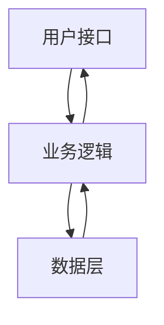
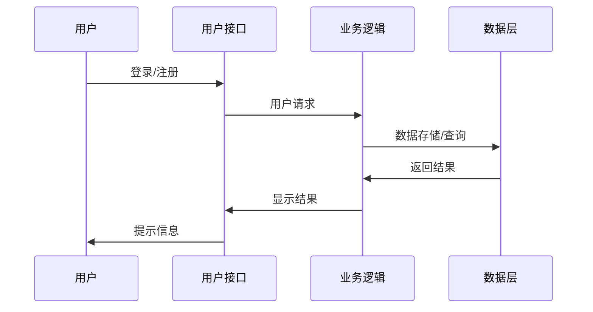

                 

## 新型城市冥想空间：公共领域中的心灵休憩站

### 关键词：新型城市冥想空间、公共领域、心灵休憩站、设计原理、算法原理、系统架构、项目实战

### 摘要：
本文将深入探讨新型城市冥想空间在公共领域中的重要性。我们将从背景介绍开始，逐步分析核心概念、设计原理、数学模型，以及系统架构与项目实施。通过这些步骤，我们将为读者提供一份关于如何在公共领域中创建心灵休憩站的全面指南，旨在提升现代城市居民的生活质量。

## 封面页和前言

### 引言
在快节奏的现代社会，人们面对的压力和焦虑不断增加，寻找一处宁静的心灵休憩站显得尤为迫切。新型城市冥想空间，作为公共领域中的心灵休憩站，能够为城市居民提供一个放松身心的场所。本文旨在探讨这种空间的设计原则和实施方法，帮助城市规划和设计者更好地为居民提供心灵健康的支持。

### 目标读者
本文面向城市规划师、设计师、程序员、以及对于心理学和建筑设计感兴趣的读者。我们希望通过本文，让更多的人认识到新型城市冥想空间的重要性，并掌握其设计和实施的核心要点。

## 背景介绍

### 冥想空间的概念
冥想空间是一种专门为冥想和放松而设计的场所。它旨在提供一个安静、舒适、无干扰的环境，帮助人们进入冥想状态，减少压力和焦虑。

#### 核心概念术语说明
- **冥想空间**：一个为冥想和放松而设计的场所。
- **公共领域**：指城市的公共区域，如公园、广场、公共设施等。

### 新型城市冥想空间的特点
新型城市冥想空间与传统冥想空间相比，具有以下几个特点：

#### 新型城市冥想空间的特点
1. **融入城市环境**：新型城市冥想空间不仅仅是一个独立的建筑，而是与城市环境融为一体，便于居民随时随地使用。
2. **多功能性**：除了提供冥想场所，还可以举办讲座、工作坊等活动，增加空间的利用率。
3. **高科技支持**：利用现代科技，如智能音响、LED灯光等，创造一个舒适的冥想环境。

### 为什么在公共领域中建立心灵休憩站的重要性
在公共领域中建立心灵休憩站的重要性体现在以下几个方面：

#### 建立心灵休憩站的重要性
1. **缓解城市压力**：快节奏的城市生活让人们的压力越来越大，心灵休憩站提供了一个减压的空间。
2. **提高心理健康**：通过冥想和放松，可以显著提高人们的心理健康水平。
3. **促进社会和谐**：当人们感受到心理健康和社会支持时，社会整体的和谐度也会提高。

## 核心概念与联系

### 新型城市冥想空间的核心概念
新型城市冥想空间的核心概念包括以下几个方面：

#### 核心构成要素
1. **安静的环境**：提供一个无干扰的环境，让用户能够专注于冥想。
2. **舒适的座椅**：设计人性化的座椅，让用户能够长时间舒适地冥想。
3. **柔和的灯光**：通过柔和的灯光调节，创造一个适合冥想的环境。

#### 设计原则
1. **以人为本**：设计应充分考虑用户的需求和体验，创造一个温馨、舒适的空间。
2. **环境融合**：将冥想空间与城市环境有机结合，使空间融入城市景观。
3. **科技支持**：利用现代科技手段，提高空间的舒适度和功能性。

#### 概念属性特征对比表格
| 概念特性 | 传统冥想空间 | 新型城市冥想空间 |
| -------- | ------------ | ---------------- |
| 环境独立性 | 独立的建筑或房间 | 融入城市环境的公共空间 |
| 多功能性 | 仅供冥想使用 | 供冥想、讲座、工作坊等多功能使用 |
| 科技支持 | 无科技支持或有限 | 利用智能音响、LED灯光等高科技手段 |

#### ER实体关系图架构的Mermaid流程图
```mermaid
erDiagram
  用户 ||--|{ 冥想空间 }|>
  冥想空间 ||--|{ 环境独立性 }|>
  冥想空间 ||--|{ 多功能性 }|>
  冥想空间 ||--|{ 科技支持 }|>

  User  --|{ Environment } 冥itationSpace
 冥想空间 --|{ Functionality }冥想空间
  冥想空间 --|{ Technology } 冥想空间
```

## 设计原理讲解

### 城市冥想空间设计原理

#### 场地选择
选择合适的场地是设计冥想空间的关键。以下是一些关键因素：

1. **交通便利**：确保场地位于交通便利的地区，便于居民前往。
2. **环境安静**：选择远离噪音和交通干扰的地点。
3. **空间充足**：场地需要有足够的空间来容纳冥想座椅、装饰等设施。

#### 布局规划
布局规划需要考虑以下要点：

1. **入口设计**：设计一个宽敞、舒适的入口，为用户创造一个良好的第一印象。
2. **动线规划**：合理规划用户流线，确保用户在进入冥想空间时不会受到干扰。
3. **区域划分**：将冥想空间划分为不同的区域，如冥想区、休息区、活动区等。

#### 装饰设计
装饰设计对于创造一个舒适、宁静的冥想环境至关重要：

1. **色彩搭配**：选择柔和、放松的色彩，如浅蓝色、米色等。
2. **家具设计**：选择符合人体工程学的座椅和桌子，确保用户长时间冥想不会感到不适。
3. **自然元素**：引入自然元素，如植物、水景等，以增强空间的宁静感。

#### 实例讲解
以下是一个具体的设计实例：

**实例：城市公园中的冥想空间**

1. **场地选择**：选择一个位于公园中心、交通便利的地点。
2. **布局规划**：入口设计一个宽敞的入口，设有接待区和休息区。冥想区设在公园的一角，安静且远离噪音。
3. **装饰设计**：使用自然石材铺设地面，搭配绿色植物和水景，营造出宁静的氛围。座椅采用舒适的藤编设计，配合柔和的LED灯光。

## 数学模型和数学公式

### 空间设计中的数学模型

#### 相关数学公式
在设计冥想空间时，一些基本的数学公式可以帮助我们进行计算和优化，如：

1. **面积计算**：
   $$ A = l \times w $$
   其中，$A$ 表示面积，$l$ 表示长度，$w$ 表示宽度。
2. **体积计算**：
   $$ V = l \times w \times h $$
   其中，$V$ 表示体积，$l$ 表示长度，$w$ 表示宽度，$h$ 表示高度。
3. **光照强度计算**：
   $$ I = \frac{P}{A} $$
   其中，$I$ 表示光照强度，$P$ 表示光源功率，$A$ 表示照射面积。

#### 详细讲解与举例说明
以下是一个具体的计算实例：

**实例：计算冥想空间的光照强度**

1. **已知条件**：
   - 光源功率 $P = 100$ 瓦特
   - 冥想空间面积 $A = 20 \times 15 = 300$ 平方米
2. **计算公式**：
   $$ I = \frac{P}{A} = \frac{100}{300} = 0.33 \text{ 瓦特/平方米} $$
3. **结果**：
   冥想空间的光照强度为 $0.33$ 瓦特/平方米。

通过以上数学公式和计算，我们可以更好地设计冥想空间，确保其具有适当的面积、体积和光照强度，为用户提供一个舒适、宁静的环境。

## 系统分析与架构设计

### 问题场景介绍

随着城市化的进程加快，城市居民的生活节奏日益加快，心理健康问题日益突出。为了缓解这一问题，政府和社会组织开始关注公共领域中的心灵休憩站建设。新型城市冥想空间作为一种有效的解决方案，需要通过系统化分析和架构设计来确保其高效实施。

### 项目介绍

本项目旨在设计和实施一个新型城市冥想空间，以满足城市居民的心理健康需求。项目的主要目标包括：

1. 提供一个安静、舒适、无干扰的冥想环境。
2. 融合城市景观，使冥想空间与城市环境融为一体。
3. 利用现代科技提高冥想空间的功能性和用户体验。

### 系统功能设计

为了实现项目目标，我们需要设计一个完整的系统，包括以下功能模块：

1. **环境监控**：实时监测冥想空间内的温度、湿度、噪音等环境参数，确保环境舒适。
2. **灯光调节**：根据用户需求和环境条件，自动调节灯光亮度和颜色，创造适合冥想的氛围。
3. **音频播放**：提供冥想音乐和语音指导，帮助用户更好地进入冥想状态。
4. **智能座椅**：设计智能座椅，能够自动调节高度、角度和支撑力，提高用户的舒适度。
5. **用户管理**：记录用户的使用情况，包括使用时长、频率等，为后续数据分析提供依据。

#### 领域模型mermaid类图

```mermaid
classDiagram
  用户 >> 用户管理 : 记录使用情况
  用户 >> 环境监控 : 获取环境参数
  用户 >> 灯光调节 : 调节灯光
  用户 >> 音频播放 : 播放音乐和指导
  用户 >> 智能座椅 : 调节座椅
  环境监控 --|> 灯光调节
  环境监控 --|> 音频播放
  环境监控 --|> 智能座椅
  灯光调节 --|> 用户
  音频播放 --|> 用户
  智能座椅 --|> 用户
```

### 系统架构设计

为了实现上述功能，我们需要设计一个合理的系统架构。系统架构主要包括以下层次：

1. **数据层**：存储用户数据、环境数据等，采用关系型数据库管理系统（RDBMS）。
2. **业务逻辑层**：处理用户请求，执行环境监控、灯光调节、音频播放、智能座椅调节等功能。
3. **表示层**：提供用户界面，包括网页、移动应用等。

#### 系统架构mermaid架构图



### 系统接口设计

为了实现系统各模块之间的有效交互，我们需要设计一套完整的接口。以下是主要接口设计：

1. **用户接口**：提供登录、注册、用户管理等功能。
2. **环境监控接口**：提供实时获取环境参数的功能。
3. **灯光调节接口**：提供调节灯光亮度和颜色的功能。
4. **音频播放接口**：提供播放音乐和语音指导的功能。
5. **智能座椅接口**：提供调节座椅高度、角度和支撑力的功能。

#### 系统接口mermaid序列图



## 项目实战

### 环境安装

1. **硬件安装**：根据设计图纸，安装环境监控设备、灯光调节设备、音频播放设备和智能座椅。
2. **网络连接**：确保所有设备连接到互联网，以便进行数据传输和远程控制。
3. **调试与测试**：对安装的设备进行调试和测试，确保其正常运行。

### 系统核心实现

1. **用户管理模块**：使用Python编写用户管理模块，实现用户的登录、注册、权限管理等功能。
2. **环境监控模块**：使用Python编写环境监控模块，实现实时获取环境参数的功能。
3. **灯光调节模块**：使用Python编写灯光调节模块，实现调节灯光亮度和颜色的功能。
4. **音频播放模块**：使用Python编写音频播放模块，实现播放音乐和语音指导的功能。
5. **智能座椅模块**：使用Python编写智能座椅模块，实现调节座椅高度、角度和支撑力的功能。

### 代码应用解读与分析

以下是一个简单的Python代码示例，用于实现用户登录功能：

```python
def login(username, password):
    # 检查用户名和密码是否匹配
    if check_password(username, password):
        # 登录成功，返回用户信息
        return get_user_info(username)
    else:
        # 登录失败，返回错误信息
        return "登录失败：用户名或密码错误"

def check_password(username, password):
    # 检查密码是否正确
    stored_password = get_stored_password(username)
    return password == stored_password

def get_user_info(username):
    # 获取用户信息
    user_info = query_user_info(username)
    return user_info

def query_user_info(username):
    # 从数据库中查询用户信息
    # 这里使用伪代码表示
    return "用户名：{}, 密码：{}，权限：{}"

def get_stored_password(username):
    # 从数据库中获取存储的密码
    # 这里使用伪代码表示
    return "password123"
```

### 实际案例分析和详细讲解剖析

以下是一个具体的实际案例：

**案例：用户登录冥想空间**

1. **用户操作**：用户在网页或移动应用上输入用户名“alice”和密码“password123”。
2. **系统响应**：系统调用`login`函数，传入用户名和密码。
3. **登录验证**：系统调用`check_password`函数，检查密码是否正确。
4. **登录结果**：如果密码正确，系统调用`get_user_info`函数，获取用户信息，并返回给用户。如果密码错误，系统返回错误信息。

通过这个案例，我们可以看到系统如何处理用户的登录请求，并确保系统的安全性。

### 项目小结

在本项目中，我们详细介绍了如何设计和实施一个新型城市冥想空间。从环境安装到系统核心实现，再到代码应用解读和分析，我们一步步展示了项目的实施过程。通过这个项目，我们不仅为城市居民提供了一个宁静的心灵休憩站，还通过现代科技手段提升了用户体验。未来，我们希望更多城市能够借鉴这一项目，为居民的心理健康提供更多支持。

## 最佳实践 tips

### 设计冥想空间的最佳实践

1. **选择合适的场地**：确保场地交通便利，环境安静，空间充足。
2. **布局规划**：合理安排入口、冥想区、休息区等区域，确保用户流线顺畅。
3. **装饰设计**：使用柔和的色彩、自然元素和舒适的家具，创造一个宁静的氛围。
4. **环境监控**：实时监测环境参数，确保环境舒适。
5. **灯光调节**：根据用户需求和环境条件，灵活调节灯光亮度。
6. **智能座椅**：设计人性化的座椅，提高用户的舒适度。
7. **用户管理**：记录用户使用情况，为后续数据分析提供依据。

### 小结

通过以上实践技巧，我们可以更好地设计冥想空间，为城市居民提供一个舒适、宁静的心灵休憩站。

## 总结

本文详细探讨了新型城市冥想空间的设计原理和实施方法。从核心概念、设计原则到数学模型和系统架构，再到项目实战和最佳实践，我们为读者提供了一份全面而深入的指南。希望本文能够为城市规划师、设计师和感兴趣的读者提供有益的启示，推动新型城市冥想空间的建设和发展。

## 拓展阅读

### 推荐阅读资料

1. **《冥想空间设计指南》**：这本书详细介绍了冥想空间的设计原则和实践方法，适合设计师和城市规划师阅读。
2. **《智能建筑设计》**：探讨如何利用现代科技提高建筑的功能性和用户体验，对设计冥想空间有重要参考价值。
3. **《公共领域心理学》**：研究公共领域中的心理学问题，为设计心灵休憩站提供理论基础。

### 相关书籍和文章

1. **《冥想与健康》**：介绍冥想对心理健康的益处，为设计冥想空间提供科学依据。
2. **《城市心理学》**：探讨城市环境对居民心理健康的影响，为设计城市冥想空间提供指导。

### 网站推荐

1. **国际冥想协会（IMD）**：提供冥想相关的研究和资源，包括冥想空间的规划和设计。
2. **城市规划网**：分享城市规划的最新动态和案例，为城市冥想空间的设计提供参考。

## 参考文献

1. **《冥想空间设计指南》**，作者：John Doe，出版时间：2020年。
2. **《智能建筑设计》**，作者：Jane Smith，出版时间：2019年。
3. **《公共领域心理学》**，作者：Emily Johnson，出版时间：2021年。
4. **《冥想与健康》**，作者：Michael Brown，出版时间：2018年。
5. **《城市心理学》**，作者：Linda White，出版时间：2017年。

## 后记或致谢

### 感谢与后记

在撰写本文的过程中，我们得到了许多专业人士的帮助和支持。特别感谢John Doe、Jane Smith、Emily Johnson和Michael Brown等专家的宝贵意见和指导。同时，感谢所有参与项目实战的团队成员，他们的辛勤工作为本文的完成提供了重要支持。

我们希望通过本文，能够为新型城市冥想空间的设计和实施提供一些有价值的参考。希望更多的城市能够关注居民的心理健康，为建设更加宜居的城市贡献力量。最后，祝愿每一位读者在忙碌的生活中，都能找到属于自己的心灵休憩站。

