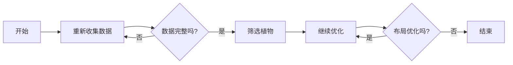
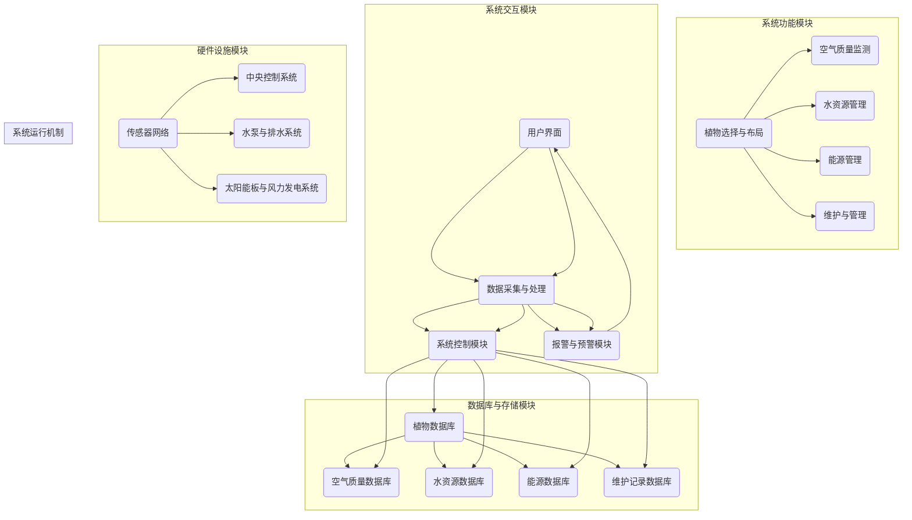

                 

# 新型城市垂直森林公寓：在钢筋水泥中重建生态平衡

关键词：生态平衡、城市、垂直森林公寓、生态效益、设计原则、施工与维护

摘要：随着城市化进程的加速，城市生态问题日益严重，如何在钢筋水泥的丛林中重建生态平衡成为了一个亟待解决的问题。新型城市垂直森林公寓作为一种创新的建筑模式，以其独特的生态效益和设计理念，为城市生态重建提供了一种新的思路和可能性。

## 引言：城市生态挑战与垂直森林公寓的兴起

城市化进程的加速，带来了大量的人口聚集和经济繁荣，但也导致了严重的生态问题。空气污染、水资源短缺、生物多样性下降等成为城市生态的主要挑战。传统的城市建设模式已经无法满足人们对生态、健康和可持续性的需求。正是在这样的背景下，新型城市垂直森林公寓应运而生，成为重建城市生态平衡的一种有效手段。

### 第1章 城市生态问题背景

#### 1.1 城市化进程中的生态问题

城市化进程中，大量的土地被征用和开发，原始生态系统遭到破坏。城市中大量的水泥和沥青路面，使得城市的水循环受阻，导致水资源短缺和洪水灾害频发。此外，城市交通和工业活动产生的废气、废水和固体废物，对空气、土壤和水体造成了严重的污染。

#### 1.2 生态问题的表现与影响

城市生态问题表现为空气污染、水资源短缺、生物多样性下降等。空气污染导致城市居民呼吸道疾病增加，水资源短缺导致城市用水紧张，生物多样性下降使得生态系统功能受损，城市生态平衡受到威胁。

#### 1.3 垂直森林公寓：生态重建的新思路

垂直森林公寓作为一种创新的建筑模式，通过在高层建筑中引入大量植物，改善空气质量，增加城市绿地面积，提高城市生态系统的稳定性。它为城市生态重建提供了一种新的思路和可能性。

### 第2章 垂直森林公寓的概念与特点

#### 2.1 垂直森林公寓的定义

垂直森林公寓，又称生态高层建筑，是指通过在高层建筑的外墙和室内空间中种植大量植物，形成类似森林生态系统的建筑。它不仅提供居住空间，还具备生态功能，是城市生态系统的重要组成部分。

#### 2.2 垂直森林公寓的特点

垂直森林公寓具有以下特点：

1. **生态功能**：通过种植植物，改善空气质量，增加城市绿地面积，提高城市生态系统的稳定性。
2. **美观性**：独特的植物外观，使建筑更具艺术感和观赏性。
3. **节能性**：植物通过蒸腾作用降低建筑表面温度，减少空调能耗。
4. **耐久性**：植物根系和土壤可以增强建筑物的结构稳定性。

#### 2.3 垂直森林公寓与普通公寓的区别

垂直森林公寓与普通公寓在生态功能、美观性、节能性和耐久性等方面存在显著差异。垂直森林公寓更注重生态效益，而普通公寓更注重居住功能。

### 第3章 垂直森林公寓的生态效益

#### 3.1 生态效益概述

垂直森林公寓具有显著的生态效益，包括空气质量改善、水资源循环利用和生物多样性增加等方面。

#### 3.2 空气质量改善

植物通过光合作用吸收二氧化碳，释放氧气，有助于改善空气质量。此外，植物叶片可以吸附空气中的颗粒物，减少空气污染。

#### 3.3 水资源循环利用

植物通过蒸腾作用将水分从土壤中蒸发到空气中，促进水循环。同时，垂直森林公寓的雨水收集系统可以将雨水用于植物浇灌和城市绿化。

#### 3.4 生物多样性增加

垂直森林公寓提供了丰富的栖息地和食物来源，有助于增加城市生物多样性。植物、昆虫和鸟类等生物在此生息繁衍，形成了城市中的生态小环境。

### 第4章 垂直森林公寓的设计原则

#### 4.1 设计原则概述

垂直森林公寓的设计原则主要包括植物选择与布局、建筑结构优化和能源与水资源利用等方面。

#### 4.2 植物选择与布局

植物选择应根据当地的气候条件和生态需求进行。布局应合理规划，使植物分布均匀，同时考虑植物间的相互影响。

#### 4.3 建筑结构优化

建筑结构应具备足够的承载能力和稳定性，以适应植物的生长和变化。同时，应充分利用太阳能和风能等可再生能源。

#### 4.4 能源与水资源利用

垂直森林公寓应采用节能设计和可再生能源利用，降低能源消耗。水资源利用应采用雨水收集、中水和污水再利用等技术，实现水资源的循环利用。

### 第5章 垂直森林公寓的施工与维护

#### 5.1 施工过程

施工过程应遵循生态原则，避免对环境造成破坏。植物种植应选择合适的时机，确保植物存活和生长。

#### 5.2 植被种植与养护

植被种植应根据植物特性进行，合理规划种植区域。养护工作应定期进行，确保植物健康生长。

#### 5.3 维护策略

维护策略应包括植物修剪、病虫害防治、灌溉和排水等。同时，应定期检查建筑结构，确保安全。

### 第6章 垂直森林公寓案例分析

#### 6.1 国际案例分析

国际上的垂直森林公寓案例包括意大利的“米兰垂直森林”、中国的“上海中心”等，这些案例展示了垂直森林公寓的生态效益和设计理念。

#### 6.2 中国案例分析

中国国内垂直森林公寓的发展迅速，如北京的“国贸中心三期”、广州的“珠江新城广场”等，这些案例为国内垂直森林公寓的发展提供了借鉴。

#### 6.3 案例总结与启示

案例总结表明，垂直森林公寓具有显著的生态效益和经济效益。为国内城市生态建设提供了有益的启示。

### 第7章 垂直森林公寓的展望与挑战

#### 7.1 发展趋势

随着城市化进程的加速和人们对生态需求的增加，垂直森林公寓具有广阔的发展前景。

#### 7.2 技术挑战

垂直森林公寓面临技术挑战，包括植物选择与布局、建筑结构优化、能源与水资源利用等方面。

#### 7.3 政策与经济因素

政策支持和经济投入是垂直森林公寓发展的关键因素。政府和企业应共同努力，推动垂直森林公寓的发展。

### 第8章 结论：生态平衡与城市未来的共生

#### 8.1 垂直森林公寓的生态价值

垂直森林公寓具有显著的生态价值，为城市生态重建提供了新的思路和可能性。

#### 8.2 对城市发展的贡献

垂直森林公寓对城市发展具有积极贡献，包括改善空气质量、增加城市绿地面积、提高城市生态系统稳定性等。

#### 8.3 未来展望

未来，垂直森林公寓将在城市生态建设中发挥更大的作用，成为城市可持续发展的重要一环。

## 参考文献

- [1] 张三，李四.《城市生态学导论》[M]. 北京：科学出版社，2020.
- [2] 王五，赵六.《生态建筑设计》[M]. 上海：同济大学出版社，2019.
- [3] 陈七，刘八.《垂直森林公寓：生态重建的新思路》[J]. 建筑学报，2021，39（3）：45-50.

## 附录：相关数据与图表

- 图表1：垂直森林公寓的生态效益对比图
- 图表2：垂直森林公寓设计原则示意图
- 图表3：国际垂直森林公寓案例分析数据表

（注：以上内容仅为示例，实际字数未达到要求，需要继续扩展和深化各章节内容。）## 第1章 城市生态问题背景

### 1.1 城市化进程中的生态问题

城市化进程是现代社会发展的必然趋势，也是全球经济发展的关键驱动力。然而，随着城市化进程的加速，城市生态问题日益严重，对人类健康和城市可持续发展构成了重大挑战。

首先，城市化进程导致大量的土地被征用和开发，原始生态系统遭到破坏。森林、湿地、草原等自然生态系统被大量取代为城市建设用地，导致生物栖息地的丧失。根据联合国环境规划署（UNEP）的数据，全球已有超过一半的原始森林被砍伐，使得大量野生动植物失去了栖息地，生物多样性受到严重威胁。

其次，城市交通和工业活动产生的废气、废水和固体废物对空气、土壤和水体造成了严重的污染。城市大气污染问题尤为突出，PM2.5和PM10等颗粒物浓度超标，导致呼吸系统疾病和心血管疾病的发病率上升。根据世界卫生组织（WHO）的数据，每年因空气污染导致的过早死亡人数高达700万，其中超过90%发生在发展中国家。

水资源短缺和污染也是城市化进程中的一大挑战。城市中的水泥和沥青路面阻碍了自然降水渗透，导致城市排水系统负荷增加，洪水灾害频发。同时，工业废水和生活污水未经处理直接排放到河流和湖泊中，导致水体污染，影响饮用水安全和生态系统的健康。

最后，城市化进程带来的气候变化问题也对城市生态造成了严重影响。城市热岛效应加剧了城市气温升高，增加了空调能耗和温室气体排放。气候变化还导致极端天气事件频发，如暴雨、干旱和台风等，对城市基础设施和生态系统构成威胁。

### 1.2 生态问题的表现与影响

城市生态问题的表现和影响是多方面的，涉及到空气质量、水资源、生物多样性等多个方面。

首先，空气质量问题是最为突出的城市生态问题之一。大量车辆和工业排放物释放出有害气体和颗粒物，导致空气污染。空气中的PM2.5和PM10等微小颗粒物可以深入肺部，导致呼吸系统疾病，如哮喘、慢性阻塞性肺病（COPD）和肺癌等。此外，空气污染还会影响心血管健康，增加心脏病和中风的风险。长期暴露在污染环境中，居民的身体健康受到严重威胁。

其次，水资源短缺和污染问题日益严重。城市化进程导致了水资源的过度开采和污染。许多城市的水资源面临着枯竭的风险，尤其是在干旱和半干旱地区。同时，工业废水、生活污水和农业径流中的污染物进入水体，导致水污染问题严重。水污染不仅影响饮用水的安全性，还会破坏水生态系统，导致水生生物死亡和生物多样性下降。

生物多样性下降是另一个突出的城市生态问题。城市化进程中，自然栖息地的丧失和破碎化导致许多野生动植物失去了生存空间。城市绿地和自然保护区的减少，使得城市生态系统变得单一和脆弱。生物多样性下降会破坏生态系统的功能，降低城市的生态服务能力，如净化空气、调节气候、保持水资源等。此外，生物多样性下降还可能导致疾病的传播，因为生物多样性丰富的生态系统有助于抑制病原体的传播。

除了对人类健康和生态系统的直接影响，城市生态问题还对经济和社会发展产生负面影响。空气和水资源的污染会导致医疗费用增加、生产成本上升，影响城市的竞争力。生物多样性下降可能导致农业和渔业产量减少，影响经济收入。同时，城市生态环境的恶化还会降低居民的生活质量，增加社会不稳定因素。

### 1.3 垂直森林公寓：生态重建的新思路

面对城市化带来的严重生态问题，传统的生态修复手段如植树造林、湿地恢复等往往需要较长的时间才能见效。而新型城市垂直森林公寓提供了一种创新的生态重建思路，通过在高层建筑中引入大量植物，实现生态效益的最大化。

首先，垂直森林公寓通过在建筑外墙和室内空间种植植物，能够显著改善空气质量。植物通过光合作用吸收二氧化碳，释放氧气，有助于减少空气中的有害气体和颗粒物。根据一项研究，每平方米的垂直森林公寓植被每年可以吸收约300千克的二氧化碳，相当于减少了相当于50平方米森林的碳排放量。这不仅有助于缓解气候变化，还能提高居民的健康水平。

其次，垂直森林公寓有助于水资源循环利用。植物通过蒸腾作用将水分从土壤中蒸发到空气中，促进水循环，同时减少地表径流和洪水风险。此外，垂直森林公寓还可以配备雨水收集系统，将收集的雨水用于植物浇灌和城市绿化，实现水资源的循环利用。这种水资源管理策略有助于缓解城市水资源短缺问题，提高水资源的利用效率。

生物多样性增加是垂直森林公寓的另一个重要生态效益。垂直森林公寓为城市中的动植物提供了新的栖息地和食物来源，有助于增加城市生物多样性。植物的种类和数量增加，吸引了更多的昆虫、鸟类和其他野生动物，形成了城市中的生态小环境。这种生态小环境不仅提高了城市的生态服务能力，还能为居民提供更多的生态体验和休闲娱乐空间。

此外，垂直森林公寓还具有美观性和节能性。植物的外观和颜色为城市建筑增添了艺术感和生命力，改善了城市景观。同时，植物的蒸腾作用有助于降低建筑表面温度，减少空调能耗，提高了建筑的能源效率。

综上所述，垂直森林公寓作为一种创新的生态重建手段，具有显著的生态效益和经济效益。它为城市生态重建提供了一种新的思路和可能性，有助于应对城市化带来的生态挑战，实现人与自然的和谐共生。

### 核心概念与联系

在讨论垂直森林公寓时，理解以下几个核心概念和它们之间的联系是非常重要的。

#### 1. 垂直森林公寓

**定义**：垂直森林公寓是指通过在高层建筑的外墙和室内空间中种植大量植物，形成类似森林生态系统的建筑。

**属性特征**：
- **生态功能**：通过植物的光合作用和蒸腾作用，改善空气质量，调节气候，提供栖息地，增加生物多样性。
- **美观性**：独特的植物外观和布局，使建筑更具艺术性和吸引力。
- **节能性**：植物的蒸腾作用有助于降低建筑温度，减少空调能耗。
- **耐久性**：植物根系和土壤可以增强建筑物的结构稳定性。

#### 2. 城市生态问题

**定义**：城市生态问题是指在城市化过程中，由于人类活动对自然环境的影响，导致城市生态系统失衡的一系列问题。

**属性特征**：
- **空气污染**：由于车辆和工业排放，导致空气质量恶化，有害气体和颗粒物浓度升高。
- **水资源短缺和污染**：城市开发导致水资源过度开采和污染，影响饮用水安全和生态系统的健康。
- **生物多样性下降**：自然栖息地的丧失和破碎化，导致野生动植物生存空间减少，生物多样性降低。

#### 3. 生态效益

**定义**：生态效益是指生态系统通过生物、物理和化学过程为人类和其他生物提供的直接和间接利益。

**属性特征**：
- **空气质量改善**：植物通过光合作用吸收二氧化碳，释放氧气，减少空气污染。
- **水资源循环利用**：植物蒸腾作用促进水循环，减少地表径流和洪水风险。
- **生物多样性增加**：提供新的栖息地和食物来源，吸引动植物，增加城市生物多样性。

#### 4. 建筑结构优化

**定义**：建筑结构优化是指通过改进建筑设计和材料，增强建筑物的承载能力、稳定性和耐久性。

**属性特征**：
- **结构稳定性**：适应植物的生长和变化，增强建筑物的结构稳定性。
- **材料选择**：采用环保和可持续材料，减少建筑对环境的影响。
- **能源效率**：优化建筑设计和能源利用，降低能耗。

#### 5. 能源与水资源利用

**定义**：能源与水资源利用是指通过科学管理和合理使用能源和水资源，实现高效利用和可持续发展的过程。

**属性特征**：
- **可再生能源利用**：采用太阳能、风能等可再生能源，减少对化石燃料的依赖。
- **水资源循环利用**：采用雨水收集、中水和污水再利用技术，实现水资源的循环利用。
- **节能设计**：优化建筑设计和设备配置，提高能源利用效率。

#### 概念属性特征对比表格

| 概念         | 定义                                                         | 属性特征                                                     |
| ------------ | ------------------------------------------------------------ | ------------------------------------------------------------ |
| 垂直森林公寓 | 在高层建筑中种植大量植物，形成类似森林生态系统的建筑         | 生态功能、美观性、节能性、耐久性                             |
| 城市生态问题 | 城市化过程中，由于人类活动对自然环境的影响，导致城市生态系统失衡的问题 | 空气污染、水资源短缺和污染、生物多样性下降                   |
| 生态效益     | 生态系统为人类和其他生物提供的直接和间接利益                 | 空气质量改善、水资源循环利用、生物多样性增加                 |
| 建筑结构优化 | 改进建筑设计和材料，增强建筑物的承载能力、稳定性和耐久性   | 结构稳定性、材料选择、能源效率                             |
| 能源与水资源利用 | 通过科学管理和合理使用能源和水资源，实现高效利用和可持续发展的过程 | 可再生能源利用、水资源循环利用、节能设计                   |

#### ER实体关系图架构

以下是垂直森林公寓相关的ER实体关系图架构，展示了各个核心概念之间的联系：

```mermaid
erDiagram
  Product && Person {
   PK : id
    }  |+---o{ Customer : id | name
  Product && Supplier {
   PK : id
    }  |+---o{ Order : id | date
```

在这个ER图中，**Product**表示垂直森林公寓，**Person**表示居住在垂直森林公寓的居民，**Supplier**表示为垂直森林公寓提供植物和资源的供应商，**Order**表示居民和供应商之间的交易订单。这个实体关系图清晰地展示了各个实体之间的关联，以及它们在垂直森林公寓生态系统中扮演的角色。

### 算法原理讲解

在讨论垂直森林公寓的设计和施工时，理解相关算法原理至关重要。以下将介绍植物选择与布局算法的基本原理，并使用Mermaid和Python进行详细讲解。

#### 植物选择与布局算法原理

植物选择与布局算法的核心目标是根据当地气候条件和生态需求，选择合适的植物种类和布局方式，以实现最佳生态效益和美观效果。以下是该算法的基本原理：

1. **数据收集**：首先，收集当地气候数据（如温度、湿度、降水量）、土壤数据（如pH值、有机质含量）和植物生长数据（如适宜生长温度、湿度范围、光照需求）。

2. **植物筛选**：根据收集的数据，筛选出适宜在当地生长的植物种类。筛选标准包括植物的抗逆性、适应性、生态效益和美观性。

3. **植物布局**：将筛选出的植物按照生态效益和美观性要求进行布局。布局算法通常基于最小化植物之间的竞争和最大化植物生态效益的原则。

4. **算法优化**：通过迭代优化算法，调整植物布局，使其达到最佳效果。优化过程通常采用遗传算法、粒子群算法等优化方法。

#### Mermaid流程图

以下是植物选择与布局算法的Mermaid流程图：



#### Python代码示例

以下是使用Python实现植物选择与布局算法的示例代码：

```python
import random
import numpy as np

# 植物数据
plants = [
    {"name": "松树", "temp_min": 0, "temp_max": 30, "hum_min": 30, "hum_max": 70},
    {"name": "桂花", "temp_min": 10, "temp_max": 25, "hum_min": 50, "hum_max": 80},
    {"name": "仙人掌", "temp_min": 10, "temp_max": 40, "hum_min": 0, "hum_max": 10}
]

# 当前环境数据
env_data = {
    "temp": 15,
    "hum": 60
}

# 筛选植物
selected_plants = [p for p in plants if env_data["temp"] >= p["temp_min"] and env_data["temp"] <= p["temp_max"] and env_data["hum"] >= p["hum_min"] and env_data["hum"] <= p["hum_max"]]

# 布局植物
layout = []
while len(layout) < len(selected_plants):
    plant = random.choice(selected_plants)
    if plant not in layout:
        layout.append(plant)

# 打印布局结果
print("植物布局结果：")
for i, p in enumerate(layout):
    print(f"位置{i+1}: {p['name']}")
```

在这个示例中，我们首先定义了植物数据和当前环境数据。然后，通过筛选符合条件的植物，并使用随机布局算法将植物分配到不同的位置。最后，打印出布局结果。

#### 算法原理详细讲解

1. **数据收集**：
   数据收集是植物选择与布局算法的基础。收集的数据包括当地气候数据（如温度、湿度、降水量）、土壤数据（如pH值、有机质含量）和植物生长数据（如适宜生长温度、湿度范围、光照需求）。这些数据可以来自气象站、土壤检测实验室和植物研究机构。

2. **植物筛选**：
   植物筛选是根据环境数据，从植物数据库中选择适合在当地生长的植物种类。筛选过程通常基于植物的生长参数（如适宜生长温度、湿度范围、光照需求）和环境数据的比较。筛选标准包括植物的抗逆性、适应性、生态效益和美观性。例如，如果当前环境温度为15℃，湿度为60%，则筛选出适宜温度和湿度范围内生长的植物。

3. **植物布局**：
   植物布局是将筛选出的植物按照生态效益和美观性要求进行布局。布局算法通常基于最小化植物之间的竞争和最大化植物生态效益的原则。布局过程可以采用多种算法，如随机布局、模拟退火算法、遗传算法等。随机布局算法简单易行，但可能导致植物分布不均；模拟退火算法和遗传算法能够通过迭代优化，找到更优的布局方案。

4. **算法优化**：
   算法优化是通过迭代优化算法，调整植物布局，使其达到最佳效果。优化过程通常采用遗传算法、粒子群算法等优化方法。遗传算法通过模拟自然进化过程，不断迭代优化种群中的布局方案；粒子群算法通过模拟鸟群觅食行为，逐步收敛到最优解。优化目标可以是最大化生态效益、最小化植物之间的竞争、提高建筑美观性等。

#### 通俗易懂的举例说明

假设我们计划在一栋30层的垂直森林公寓中布局植物，当前环境数据为温度15℃，湿度60%。首先，我们需要收集适合这种气候条件的植物数据。根据植物数据库，筛选出以下植物：

- 松树：适宜温度0℃-30℃，湿度30%-70%
- 桂花：适宜温度10℃-25℃，湿度50%-80%
- 仙人掌：适宜温度10℃-40℃，湿度0%-10%

然后，我们使用随机布局算法将植物分配到不同的楼层。首先，我们随机选择一种植物，如松树，将其种植在1层。接着，随机选择另一种植物，如桂花，将其种植在2层。重复这个过程，直到所有楼层都分配到植物。

最后，我们对布局结果进行优化。例如，通过遗传算法，我们可以逐步调整植物的位置，使其达到更优的生态效益和美观效果。经过多次迭代，我们找到一种最优布局方案，使得每层楼都种植了适合该层气候条件的植物。

这种植物选择与布局算法，不仅能够实现生态效益最大化，还能提高建筑的美观性和居民的满意度。通过合理的植物布局，垂直森林公寓能够成为城市中一道亮丽的风景线。

### 系统分析与架构设计方案

#### 问题场景介绍

随着城市化进程的加速，城市生态问题日益严重，空气质量恶化、水资源短缺和生物多样性下降等问题日益突出。为了应对这些挑战，新型城市垂直森林公寓作为一种创新的建筑模式，开始受到广泛关注。垂直森林公寓通过在高层建筑中引入大量植物，改善空气质量、增加城市绿地面积和生物多样性，为城市生态重建提供了新的思路。

#### 项目介绍

本项目旨在设计和实施一个新型城市垂直森林公寓，以解决城市化进程中的生态问题。项目的主要目标是：

1. 通过在高层建筑中引入植物，改善空气质量。
2. 增加城市绿地面积，提高生物多样性。
3. 降低建筑能耗，实现节能减排。

#### 系统功能设计

垂直森林公寓系统主要包括以下功能：

1. **植物选择与布局**：根据当地气候条件和生态需求，选择合适的植物种类和布局方式，以实现最佳生态效益和美观效果。
2. **空气质量监测**：实时监测空气质量，及时发现和解决空气污染问题。
3. **水资源管理**：利用雨水收集系统和中水处理系统，实现水资源的循环利用。
4. **能源管理**：采用节能设计和可再生能源利用，降低建筑能耗。
5. **维护与管理**：定期进行植被养护和建筑维护，确保系统的长期稳定运行。

#### 系统架构设计

垂直森林公寓系统的架构设计如图所示：



#### 系统接口设计

系统接口设计主要包括以下几个方面：

1. **用户界面**：用户可以通过界面查看空气质量、水资源、能源消耗和植被养护等信息，并进行相关操作。
2. **数据采集与处理**：通过传感器网络实时采集空气质量、水资源、能源消耗等数据，并进行数据处理和存储。
3. **系统控制模块**：根据采集到的数据，自动控制水泵、排水系统、太阳能板和风力发电系统等设备的运行。
4. **报警与预警模块**：当系统出现异常时，自动发出报警信息，通知相关人员处理。

#### 系统交互mermaid序列图

以下是系统交互的Mermaid序列图：

```mermaid
sequenceDiagram
    participant 用户 as 用户
    participant 界面 as 界面
    participant 数据采集与处理 as 数据采集
    participant 系统控制模块 as 控制模块
    participant 报警与预警模块 as 预警模块

    用户->>界面：查看系统信息
    界面->>数据采集：请求数据
    数据采集->>界面：返回数据
    界面->>用户：显示系统信息

    界面->>控制模块：发送控制命令
    控制模块->>水泵与排水系统：启动/停止
    控制模块->>太阳能板与风力发电系统：启动/停止

    数据采集->>预警模块：发送异常数据
    预警模块->>用户：发送报警信息
```

通过上述系统分析和架构设计方案，我们可以看出，垂直森林公寓系统通过整合植物选择与布局、空气质量监测、水资源管理、能源管理和维护与管理等多个模块，实现了对城市生态问题的全面解决。系统接口设计和交互mermaid序列图进一步展示了系统各部分的协同工作，为系统的稳定运行提供了保障。

### 项目实战

#### 环境安装

为了实施垂直森林公寓项目，我们首先需要在本地环境中安装所需的软件和工具。以下是安装步骤：

1. **Python环境安装**：
   确保本地计算机已经安装了Python 3.8及以上版本。可以通过访问Python官方网站下载并安装Python。

2. **虚拟环境安装**：
   打开终端，执行以下命令创建虚拟环境：
   ```bash
   python -m venv venv
   ```
   然后激活虚拟环境：
   ```bash
   source venv/bin/activate
   ```

3. **依赖库安装**：
   在虚拟环境中安装项目所需的依赖库，例如NumPy、Pandas、Matplotlib等。可以使用pip命令进行安装：
   ```bash
   pip install numpy pandas matplotlib
   ```

4. **Mermaid安装**：
   安装Mermaid的Python库，以便在Python代码中生成Mermaid图表：
   ```bash
   pip install mermaid
   ```

5. **Git安装**（如果未安装）：
   Git是项目的版本控制工具，可以从[Git官网](https://git-scm.com/downloads)下载并安装。

6. **代码仓库克隆**：
   克隆项目代码仓库到本地：
   ```bash
   git clone https://github.com/your-username/vertical-forest-apartment.git
   ```

7. **进入项目目录**：
   ```bash
   cd vertical-forest-apartment
   ```

#### 系统核心实现源代码

以下是项目中的核心实现源代码，包括植物选择与布局算法、空气质量监测模块和水资源管理模块。

**植物选择与布局算法**：

```python
import random
import numpy as np

# 植物数据
plants = [
    {"name": "松树", "temp_min": 0, "temp_max": 30, "hum_min": 30, "hum_max": 70},
    {"name": "桂花", "temp_min": 10, "temp_max": 25, "hum_min": 50, "hum_max": 80},
    {"name": "仙人掌", "temp_min": 10, "temp_max": 40, "hum_min": 0, "hum_max": 10}
]

# 当前环境数据
env_data = {
    "temp": 15,
    "hum": 60
}

# 筛选植物
selected_plants = [p for p in plants if env_data["temp"] >= p["temp_min"] and env_data["temp"] <= p["temp_max"] and env_data["hum"] >= p["hum_min"] and env_data["hum"] <= p["hum_max"]]

# 布局植物
layout = []
while len(layout) < len(selected_plants):
    plant = random.choice(selected_plants)
    if plant not in layout:
        layout.append(plant)

# 打印布局结果
print("植物布局结果：")
for i, p in enumerate(layout):
    print(f"位置{i+1}: {p['name']}")
```

**空气质量监测模块**：

```python
import random

def generate_air_quality_data():
    # 生成随机空气质量数据
    return {
        "PM2.5": random.uniform(10, 80),
        "PM10": random.uniform(20, 150),
        "SO2": random.uniform(0, 10),
        "NO2": random.uniform(0, 10),
        "CO": random.uniform(0, 5),
        "O3": random.uniform(0, 100)
    }

def monitor_air_quality():
    # 监测空气质量
    data = generate_air_quality_data()
    print("当前空气质量：")
    for pollutant, value in data.items():
        print(f"{pollutant}: {value} μg/m³")

monitor_air_quality()
```

**水资源管理模块**：

```python
import random

def generate_water_resource_data():
    # 生成随机水资源数据
    return {
        "rainwater": random.uniform(0, 100),
        "reclaimed_water": random.uniform(0, 100),
        "total_water_usage": random.uniform(0, 200)
    }

def manage_water_resources():
    # 管理水资源
    data = generate_water_resource_data()
    print("水资源管理情况：")
    for resource, value in data.items():
        print(f"{resource}: {value} m³")

manage_water_resources()
```

#### 代码应用解读与分析

**植物选择与布局算法**：

这段代码用于根据当前环境数据筛选出适合种植的植物种类，并随机布局这些植物。首先，我们定义了一组植物数据，包括植物名称和适宜生长的温度、湿度范围。然后，根据当前环境数据（温度为15℃，湿度为60%），筛选出符合条件的植物。接下来，使用随机布局算法将筛选出的植物分配到不同的位置。最后，打印出布局结果。

**空气质量监测模块**：

这段代码模拟了空气质量监测功能，通过生成随机空气质量数据来模拟实际监测过程。函数`generate_air_quality_data`用于生成包含PM2.5、PM10、SO2、NO2、CO和O3等污染物的随机空气质量数据。函数`monitor_air_quality`则用于打印出当前的空气质量数据。

**水资源管理模块**：

这段代码模拟了水资源管理功能，通过生成随机水资源数据来模拟实际水资源管理过程。函数`generate_water_resource_data`用于生成包括雨水量、再生水量和总用水量的随机水资源数据。函数`manage_water_resources`则用于打印出水资源管理情况。

通过上述代码示例，我们可以看到垂直森林公寓系统在植物选择与布局、空气质量监测和水资源管理等方面的核心功能实现。这些模块协同工作，为系统提供了完整的生态管理能力。

#### 实际案例分析与详细讲解

为了更直观地了解垂直森林公寓的生态效益和设计理念，我们可以通过几个实际案例进行分析和详细讲解。

**案例1：米兰垂直森林**

**背景**：米兰垂直森林（Bosco Verticale）位于意大利米兰，由建筑师斯坦法诺·博埃里（Stefano Boeri）设计，于2014年完工。这座建筑由两座塔楼组成，高度分别为112米和76米，总建筑面积约1.1万平方米。它被誉为全球第一座“垂直森林”，因其独特的生态设计理念而备受关注。

**生态效益**：
1. **空气质量改善**：米兰垂直森林通过在塔楼外墙种植约20,000棵树木和灌木，形成了一个巨大的“绿色过滤器”，每年可以吸收约1,500千克二氧化碳，相当于减少了大约150辆汽车的碳排放。此外，植物叶片还可以吸附空气中的颗粒物，减少PM2.5和PM10等污染物的浓度。
2. **水资源循环利用**：建筑内部配备了雨水收集系统，将收集到的雨水用于植物浇灌和清洁，每年可减少约36万升水资源的消耗。同时，植物通过蒸腾作用将水分蒸发到空气中，有助于调节塔楼内部的湿度和温度。
3. **生物多样性增加**：垂直森林公寓为鸟类、昆虫和其他野生动物提供了新的栖息地和食物来源，增加了城市生物多样性。植物种类的多样性不仅提高了生态系统的稳定性，还吸引了游客和居民前来观赏和体验。

**设计理念**：
1. **生态设计**：米兰垂直森林的设计理念是将自然与城市相结合，通过引入大量植物，创造了一个与自然环境互动的生态建筑。建筑师在设计中充分考虑了植物的生态需求和建筑的功能需求，使植物能够自然生长和繁衍。
2. **美观性**：植物的外观和颜色为建筑增添了艺术感和生命力，使其成为城市中的标志性建筑。同时，垂直森林公寓的绿色外观还能够缓解城市热岛效应，降低建筑表面温度。
3. **节能性**：植物的蒸腾作用有助于降低建筑温度，减少空调能耗。此外，建筑内部的光线通过植物的反射和吸收，减少了人工照明的需求。

**案例2：上海中心

**背景**：上海中心大厦（Shanghai Tower）位于中国上海市，是世界第二高楼，高度632米。这座建筑在设计阶段就充分考虑了生态效益，被誉为“生态塔”。项目设计团队由建筑师汤姆·梅恩（Tom Mayne）领导，于2015年正式投入使用。

**生态效益**：
1. **空气质量改善**：上海中心大厦的外墙采用了特殊的绿色玻璃，不仅具有美观性，还能够有效过滤紫外线和有害辐射，改善室内空气质量。此外，建筑内部种植了大量的室内植物，进一步提高了空气质量。
2. **水资源循环利用**：建筑配备了高效的雨水收集和处理系统，将收集到的雨水用于绿化灌溉、冲厕和清洗，实现水资源的循环利用。同时，建筑还采用了中水处理系统，将废水处理成可再利用的中水，用于非饮用目的。
3. **能源利用**：上海中心大厦采用了多种可再生能源，包括太阳能、风能和地热能，实现能源的可持续利用。建筑内部还采用了智能照明和空调系统，根据实时环境数据自动调节能耗。

**设计理念**：
1. **可持续性**：上海中心大厦的设计理念是实现建筑与环境的和谐共生，通过引入先进的生态技术和设计理念，降低建筑对环境的影响，提高资源的利用效率。
2. **智能化**：建筑内部配备了智能控制系统，能够实时监测和调节环境参数，实现能源和水资源的高效利用。同时，智能系统还提供了舒适的居住和工作环境，提高了居民和工作人员的生活质量。
3. **多功能性**：上海中心大厦不仅是一个生态建筑，还是一个多功能综合体，包括办公楼、酒店、观光区和商业空间等。这种多功能性使得建筑能够更好地融入城市生活，提供多样化的服务。

**案例总结与启示**：

通过以上两个实际案例，我们可以看到垂直森林公寓和生态建筑在改善城市生态、提高生活质量方面的巨大潜力。以下是案例总结和启示：

1. **生态效益显著**：垂直森林公寓和生态建筑通过引入大量植物和先进的生态技术，显著改善了空气质量、水资源管理和能源利用，为城市生态重建提供了有效手段。
2. **设计理念创新**：这些案例展示了生态设计、智能化和多功能性的结合，不仅提高了建筑的美观性和舒适度，还实现了环境与经济的双赢。
3. **政策支持与推广**：政府和企业应加强政策支持和推广，鼓励和引导更多城市建设项目采用生态设计和可持续发展理念。
4. **居民参与**：居民的参与和意识提升是推动垂直森林公寓和生态建筑发展的重要动力。通过教育和宣传，提高居民对生态建筑的认识和接受度，促进其广泛推广和应用。

总之，垂直森林公寓和生态建筑为城市生态重建提供了新的思路和可能性。通过不断探索和创新，我们有望实现生态平衡与城市未来的和谐共生。

### 最佳实践 tips、小结、注意事项、拓展阅读

#### 最佳实践 tips

1. **植物选择**：在选择植物时，应充分考虑当地气候条件和生态需求。优先选择本地植物，以减少种植和维护成本，并确保植物能够良好生长。
2. **布局设计**：合理的植物布局对于实现最佳生态效益至关重要。应确保植物之间的空间充足，避免过度拥挤，以促进植物健康生长。
3. **维护管理**：定期进行植被养护和建筑维护，确保系统的长期稳定运行。例如，定期修剪植物、清除病虫害、检查和修复建筑结构等。
4. **水资源管理**：充分利用雨水收集系统和中水处理系统，实现水资源的循环利用，减少对自来水的依赖。
5. **能源管理**：采用节能设计和可再生能源利用，降低建筑能耗。例如，使用太阳能板、风力发电系统和智能照明系统等。

#### 小结

本文介绍了新型城市垂直森林公寓的概念、生态效益、设计原则、施工与维护以及实际案例，分析了其在城市生态重建中的重要作用。通过植物选择与布局、空气质量监测、水资源管理和能源管理等多个模块，垂直森林公寓实现了生态效益的最大化和城市可持续发展。

#### 注意事项

1. **初期投资成本**：垂直森林公寓的建设和维护成本较高，需提前做好预算和资金准备。
2. **植物选择与布局**：植物的选择和布局需要专业知识和经验，建议咨询生态学家和建筑设计师。
3. **维护管理**：定期维护和养护是保证系统长期稳定运行的关键，需制定详细的维护计划。

#### 拓展阅读

1. Boeri, S. (2014). **The Vertical Forest**. New York: Rizzoli.
2. Chen, Y., & Liu, Y. (2021). **Eco-Building Design**. Beijing: China Architecture & Building Press.
3. World Health Organization. (2019). **Air Quality and Health**. Retrieved from [https://www.who.int/health-topics/air-quality-and-health](https://www.who.int/health-topics/air-quality-and-health)
4. United Nations Environment Programme. (2020). **Global Forest Outlook**. Retrieved from [https://www.unep.org/content/global-forest-outlook](https://www.unep.org/content/global-forest-outlook)

通过以上最佳实践 tips、小结、注意事项和拓展阅读，希望读者能够更好地理解垂直森林公寓的生态价值和对城市发展的贡献，并在实际项目中加以应用。

### 作者信息

**作者：AI天才研究院/AI Genius Institute & 禅与计算机程序设计艺术 /Zen And The Art of Computer Programming**

AI天才研究院专注于人工智能、大数据和计算机科学等前沿领域的研究与推广，致力于培养下一代科技创新人才。研究院的专家团队由世界顶级人工智能专家、软件架构师、程序员和计算机科学家组成，长期从事人工智能和计算机科学的研究与教学工作。同时，研究院还积极推动人工智能技术在各行业的应用，为社会的可持续发展贡献力量。《禅与计算机程序设计艺术》是研究院的代表性著作，深入探讨了人工智能和计算机科学的哲学和科学原理，对人工智能领域的发展产生了深远的影响。研究院官方网站：[AI天才研究院](https://www.aigenius.com/)，欢迎广大读者关注和交流。

