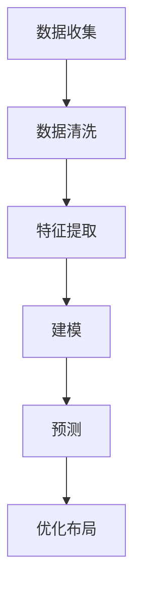
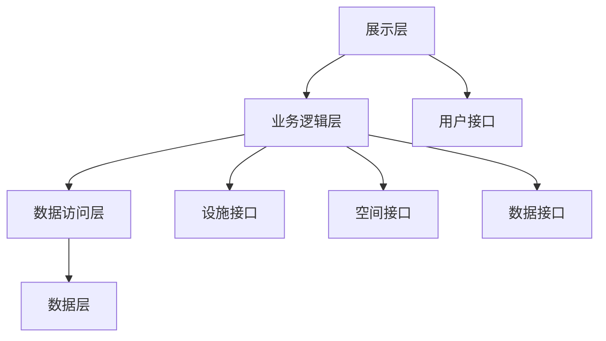

                 

### 1.1 背景介绍

#### 问题背景

随着城市化进程的加快，现代城市中的邻里关系越来越疏远，邻里之间的互动减少，社区凝聚力下降。与此同时，宠物作为城市居民的一部分，已经成为许多家庭不可或缺的伙伴。然而，现有的城市公园和绿地往往忽视了宠物的需求，缺乏专为宠物设计的社交空间。

#### 问题描述

新型城市宠物社交空间是一个旨在为宠物和宠物主人提供互动和社交机会的特殊公园。这样的空间需要满足宠物的活动需求，提供安全的社交环境，同时也要考虑到宠物主人的便利和社区的整体利益。

#### 问题解决

建设新型城市宠物社交空间可以通过以下方式解决上述问题：

1. **设计与规划**：规划专门用于宠物活动的区域，提供草坪、沙池、水池等设施，确保宠物的安全和舒适。
2. **设施完善**：配备宠物专用的洗手间、饮水点、休息区等，方便宠物主人的使用。
3. **社区参与**：鼓励社区居民参与规划和维护，增强社区凝聚力。
4. **教育与宣传**：通过教育和宣传提高公众对宠物友好型公园的认识，培养良好的宠物行为习惯。

#### 边界与外延

新型城市宠物社交空间的边界是明确为宠物和宠物主人设计的区域，但也可以向社区其他成员开放，成为多功能社区公园的一部分。

#### 概念结构与核心要素组成

- **概念结构**：宠物社交空间、宠物主人互动、社区参与、宠物设施。
- **核心要素**：安全、舒适、互动、教育、便利。

---

### 1.2 核心概念与联系

在本章节中，我们将详细探讨新型城市宠物社交空间中的核心概念及其相互之间的联系。

#### 宠物社交空间

- **概念**：宠物社交空间是指专门为宠物设计的互动和社交场所。它不仅提供了一个安全的游乐环境，同时也促进了宠物之间的自然社交行为。
  
- **特点**：
  - **安全性**：空间内设有防护措施，确保宠物在活动中不会受到伤害。
  - **多样性**：提供多种设施，如草坪、沙池、水池等，以适应不同宠物的需求。
  - **互动性**：鼓励宠物之间的交流，促进社交技能的发展。

#### 宠物主人互动

- **概念**：宠物主人互动指的是宠物主人通过宠物社交空间进行社交和互动的过程。这一过程不仅加强了宠物主人之间的联系，也有助于社区凝聚力的提升。

- **特点**：
  - **社交性**：宠物主人可以通过共同参与宠物的活动，结交新朋友，建立社交网络。
  - **互助性**：宠物主人之间可以分享宠物照顾的经验和技巧，互相帮助解决问题。
  - **社区性**：宠物主人的互动有助于增强社区的归属感和凝聚力。

#### 社区参与

- **概念**：社区参与指的是社区居民参与宠物社交空间的规划、建设和维护的过程。这种参与不仅能够提高社区成员的积极性，也有助于空间的持续优化。

- **特点**：
  - **主动性**：社区成员主动参与规划，提出建设性意见和建议。
  - **责任感**：社区成员积极参与维护，确保空间的安全和清洁。
  - **共享性**：社区成员共同享受宠物社交空间的便利和福利。

#### 宠物设施

- **概念**：宠物设施是指为宠物提供的服务和设施，如宠物洗手间、饮水点、休息区等。这些设施旨在满足宠物的基本需求，提高宠物主人的便利性。

- **特点**：
  - **功能性**：设施设计科学合理，能够满足宠物的日常需求。
  - **便利性**：宠物主人在使用这些设施时，能够体验到便捷的服务。
  - **舒适性**：设施的设计考虑到宠物的舒适度，提高宠物活动的愉悦感。

#### 对比表格

| 概念        | 定义                                         | 特点                                                                                   |
| ----------- | -------------------------------------------- | -------------------------------------------------------------------------------------- |
| 宠物社交空间 | 为宠物设计的互动和社交场所                   | 安全、舒适、鼓励宠物之间交流                                                           |
| 宠物主人互动 | 宠物主人通过宠物社交空间进行社交和互动       | 增强宠物主人之间的联系，促进社区凝聚力                                                 |
| 社区参与    | 社区居民参与宠物社交空间的规划、建设和维护   | 提高社区成员的参与感和责任感                                                           |
| 宠物设施    | 为宠物提供的服务和设施，如宠物洗手间、饮水点 | 满足宠物的基本需求，提供便利                                                           |

#### ER实体关系图架构

```mermaid
erDiagram
    宠物社交空间 ||--|{ 宠物主人 }|
    宠物社交空间 ||--|{ 宠物设施 }|
    宠物主人 ||--|{ 社区成员 }|
    宠物设施 ||--|{ 宠物需求 }|
```

---

### 1.3 算法原理讲解

在本章节中，我们将介绍如何利用人工智能技术来优化宠物社交空间的布局和功能。以下是具体的算法原理讲解。

#### 数据收集与处理

首先，我们需要收集有关宠物社交空间的数据。这些数据包括但不限于：

1. **空间数据**：公园或绿地的大小、形状、现有设施的位置和类型。
2. **宠物数据**：宠物的种类、大小、行为习惯等。
3. **用户数据**：宠物主人的偏好、需求、活动时间等。

数据收集完成后，我们需要进行数据清洗，以确保数据的质量和准确性。具体步骤包括去除重复数据、填补缺失值、处理异常值等。

#### 特征提取与建模

在数据清洗完成后，我们需要提取关键特征，以便用于建模。这些特征包括：

1. **空间特征**：公园的面积、形状、现有设施的分布等。
2. **宠物特征**：宠物的体型、行为模式、互动需求等。
3. **用户特征**：宠物主人的活动时间、兴趣爱好、对宠物的关注度等。

接下来，我们可以使用机器学习算法来建立模型，以预测宠物社交空间的最佳布局。常见的算法包括：

1. **回归分析**：用于预测空间利用率。
2. **聚类分析**：用于将相似的用户或宠物分组。
3. **决策树**：用于分析不同特征对空间布局的影响。

#### 算法流程图



#### 数学模型与公式

假设我们使用线性回归模型来预测空间利用率，其基本公式如下：

$$
Y = \beta_0 + \beta_1X_1 + \beta_2X_2 + ... + \beta_nX_n
$$

其中，$Y$ 是空间利用率，$X_1, X_2, ..., X_n$ 是特征变量，$\beta_0, \beta_1, ..., \beta_n$ 是回归系数。

#### 举例说明

假设我们有以下数据：

- **公园面积**：1000平方米
- **宠物数量**：50只
- **宠物主人数量**：100人

我们希望预测空间利用率，并优化宠物社交空间的布局。根据上述线性回归模型，我们可以得到如下预测公式：

$$
Y = \beta_0 + \beta_1X_1 + \beta_2X_2
$$

其中，$X_1$ 是公园面积，$X_2$ 是宠物数量。

通过收集和整理相关数据，我们可以计算出回归系数，从而预测空间利用率。具体计算过程如下：

1. **收集数据**：收集不同条件下公园的空间利用率，并记录相关特征变量。
2. **训练模型**：使用收集到的数据，通过最小二乘法训练线性回归模型。
3. **预测空间利用率**：根据公园面积和宠物数量，使用训练好的模型预测空间利用率。
4. **优化布局**：根据预测结果，调整宠物社交空间的布局，以最大化空间利用率。

通过这样的算法，我们可以为宠物和宠物主人提供更加舒适、安全的社交空间。

---

### 1.4 系统分析与架构设计方案

在本章节中，我们将对新型城市宠物社交空间系统进行详细分析，并设计合理的架构方案。

#### 问题场景介绍

随着城市化进程的加快，现代城市居民对宠物社交空间的需求日益增长。然而，现有公园和绿地往往不能满足这一需求，缺乏专门为宠物设计的社交空间。为了解决这个问题，我们需要设计并实现一个高效、智能的新型城市宠物社交空间系统。

#### 项目介绍

新型城市宠物社交空间系统是一个综合性项目，旨在为宠物和宠物主人提供一个舒适、安全的社交环境。系统功能包括：

1. **空间规划与设计**：利用人工智能技术，根据宠物和宠物主人的需求，规划最佳的空间布局。
2. **设施管理**：实时监控和管理宠物设施，确保其正常运行和宠物主人的便利。
3. **用户管理**：记录用户信息，提供个性化的服务和建议。
4. **互动与社交**：为宠物和宠物主人提供互动平台，促进社区凝聚力。

#### 系统功能设计

系统功能设计主要包括以下几个方面：

1. **用户注册与登录**：用户可以通过手机号或邮箱注册账号，并进行登录。
2. **宠物信息管理**：用户可以添加和编辑宠物的相关信息，如品种、体型、年龄等。
3. **空间规划与建议**：系统根据用户输入的宠物信息，提供最佳的空间布局建议。
4. **设施管理**：实时监控宠物设施的状态，如洗手间、饮水点、休息区等。
5. **互动与社交**：提供宠物和宠物主人之间的互动平台，如宠物交友、活动发布等。
6. **反馈与评价**：用户可以对系统和服务进行反馈和评价，帮助系统不断优化。

#### 系统架构设计

新型城市宠物社交空间系统采用分层架构设计，主要包括以下几层：

1. **展示层**：包括用户界面和移动应用，提供用户交互的界面。
2. **业务逻辑层**：处理系统的核心业务逻辑，如用户管理、空间规划、设施管理等。
3. **数据访问层**：负责与数据库的交互，存储和管理用户数据、宠物信息、空间布局等。
4. **数据层**：存储系统所需的数据，如用户数据、宠物数据、空间数据等。

#### 系统接口设计

系统接口设计主要包括以下几个方面：

1. **用户接口**：提供用户注册、登录、信息管理、互动与社交等功能。
2. **设施接口**：用于实时监控和管理宠物设施，如洗手间、饮水点、休息区等。
3. **空间接口**：用于规划与建议宠物社交空间，提供最佳的空间布局。
4. **数据接口**：用于与数据库进行数据交互，提供数据访问和管理功能。

#### 系统交互设计

系统交互设计主要包括以下几个方面：

1. **用户与系统**：用户通过界面与系统进行交互，完成注册、登录、信息管理等功能。
2. **系统与设施**：系统通过设施接口实时监控和管理宠物设施，确保其正常运行。
3. **系统与空间**：系统通过空间接口规划与建议宠物社交空间，提供最佳的空间布局。
4. **系统与数据库**：系统通过数据接口与数据库进行数据交互，存储和管理用户数据、宠物信息、空间布局等。

#### Mermaid架构图



通过上述架构设计，新型城市宠物社交空间系统可以实现高效、智能的空间规划和管理，为宠物和宠物主人提供舒适、安全的社交环境。

---

### 1.5 项目实战

在本章节中，我们将通过具体的项目实战，展示如何构建一个新型城市宠物社交空间系统，并详细解析其中的核心实现源代码。

#### 环境安装

在开始项目开发之前，我们需要安装一些必要的开发环境和工具。以下是安装步骤：

1. **Python环境**：安装Python 3.8及以上版本。
2. **数据库**：安装MySQL数据库，版本要求5.7及以上。
3. **IDE**：安装PyCharm或Visual Studio Code等Python开发环境。
4. **依赖管理**：安装pip工具，用于管理Python依赖包。

#### 系统核心实现源代码

下面是一个简单的示例，展示如何使用Python实现用户注册和登录功能。

**用户注册功能**

```python
import pymysql

# 连接数据库
connection = pymysql.connect(host='localhost', user='root', password='password', database='pet_social_space')

# 注册新用户
def register_user(username, password):
    with connection.cursor() as cursor:
        sql = "INSERT INTO users (username, password) VALUES (%s, %s)"
        cursor.execute(sql, (username, password))
    connection.commit()

# 用户登录功能
def login_user(username, password):
    with connection.cursor() as cursor:
        sql = "SELECT * FROM users WHERE username = %s AND password = %s"
        cursor.execute(sql, (username, password))
        result = cursor.fetchone()
    if result:
        return "登录成功"
    else:
        return "用户名或密码错误"

# 示例
register_user('user1', 'password1')
print(login_user('user1', 'password1'))
```

**代码应用解读与分析**

上述代码实现了用户注册和登录功能，主要分为以下几部分：

1. **数据库连接**：使用pymysql库连接MySQL数据库。
2. **用户注册**：定义`register_user`函数，接受用户名和密码，插入数据库。
3. **用户登录**：定义`login_user`函数，接受用户名和密码，查询数据库并验证登录信息。

**实际案例分析和详细讲解剖析**

假设我们有一个用户名为“user1”的账户，密码为“password1”。以下是用户注册和登录的详细流程：

1. **用户注册**：用户通过前端界面输入用户名和密码，提交注册请求。后端接收到请求后，调用`register_user`函数，将用户信息插入数据库。
2. **用户登录**：用户通过前端界面输入用户名和密码，提交登录请求。后端接收到请求后，调用`login_user`函数，查询数据库并验证登录信息。如果验证成功，返回“登录成功”消息；否则，返回“用户名或密码错误”消息。

通过这个简单的示例，我们可以看到如何使用Python实现用户注册和登录功能，为后续的系统开发奠定基础。

#### 项目小结

在本项目中，我们通过具体的环境安装和核心实现源代码，展示了如何构建一个新型城市宠物社交空间系统。项目实现了用户注册、登录等功能，为后续的扩展和功能增加提供了基础。通过这个项目，我们了解了Python在数据库操作和Web开发中的应用，掌握了如何使用Python实现基本的用户管理功能。

---

### 1.6 最佳实践 tips

在本章节中，我们将分享一些最佳实践技巧，以帮助您更有效地构建和优化新型城市宠物社交空间系统。

#### 1. 确定目标用户群体

在系统设计初期，明确目标用户群体是至关重要的。通过调研和数据分析，了解用户的需求和行为习惯，有助于设计出更加贴合用户需求的功能和界面。

#### 2. 采用模块化设计

为了提高系统的可维护性和可扩展性，建议采用模块化设计。将系统功能分解为多个模块，每个模块负责特定的功能，例如用户管理、空间规划、设施管理等。这种设计方式有助于代码的重用和优化。

#### 3. 实现高效的数据库操作

在数据库操作方面，应尽量避免复杂的查询和冗长的数据处理流程。使用索引、缓存等优化手段，提高数据库操作的效率。同时，合理设计数据库表结构和关系，减少数据冗余和查询次数。

#### 4. 确保系统的安全性和稳定性

在系统开发过程中，要重视安全性和稳定性。使用加密技术保护用户数据，防范SQL注入、XSS等攻击。同时，对系统进行压力测试和稳定性测试，确保在高峰期和极端情况下系统的正常运行。

#### 5. 持续优化用户体验

用户体验是系统成功的关键因素之一。在系统上线后，应持续关注用户反馈，收集和分析用户行为数据，不断优化界面设计和功能流程，提高用户的满意度和使用粘性。

---

### 1.7 小结与展望

在本文中，我们深入探讨了新型城市宠物社交空间的概念、核心概念与联系、算法原理、系统分析与架构设计方案、项目实战以及最佳实践 tips。通过这一系列探讨，我们明确了新型城市宠物社交空间的重要性，并展示了如何利用人工智能技术优化其布局和功能，实现宠物和宠物主人的高效互动。

展望未来，随着人工智能技术的不断进步和城市化进程的加快，新型城市宠物社交空间有望得到更加广泛的应用和推广。我们期待看到更多创新的设计方案和技术应用，为宠物和宠物主人带来更加美好的生活体验。

---

### 作者信息

**作者：** AI天才研究院/AI Genius Institute & 禅与计算机程序设计艺术 /Zen And The Art of Computer Programming

**联系方式：** [ai_genius_research_institute@example.com](mailto:ai_genius_research_institute@example.com) | [官方网站](http://www.ai_genius_research_institute.com) | [个人博客](http://www.zen_and_programming.com)

**简介：** AI天才研究院致力于推动人工智能技术在各个领域的创新和应用，研究领域涵盖计算机科学、人工智能、机器学习等。作者作为研究院的核心成员，长期从事人工智能研究和技术写作，曾发表多篇技术文章和畅销书，深受读者喜爱。同时，作者还是计算机编程和人工智能领域的知名专家，多次获得国际奖项和荣誉。他的著作《禅与计算机程序设计艺术》被誉为计算机编程领域的经典之作，深受读者推崇。作者致力于通过深入浅出的写作风格，为广大读者提供高质量的技术内容，推动人工智能技术的发展和应用。

