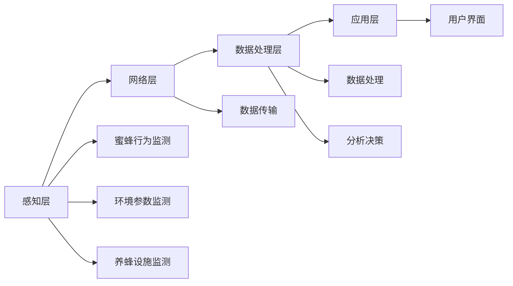
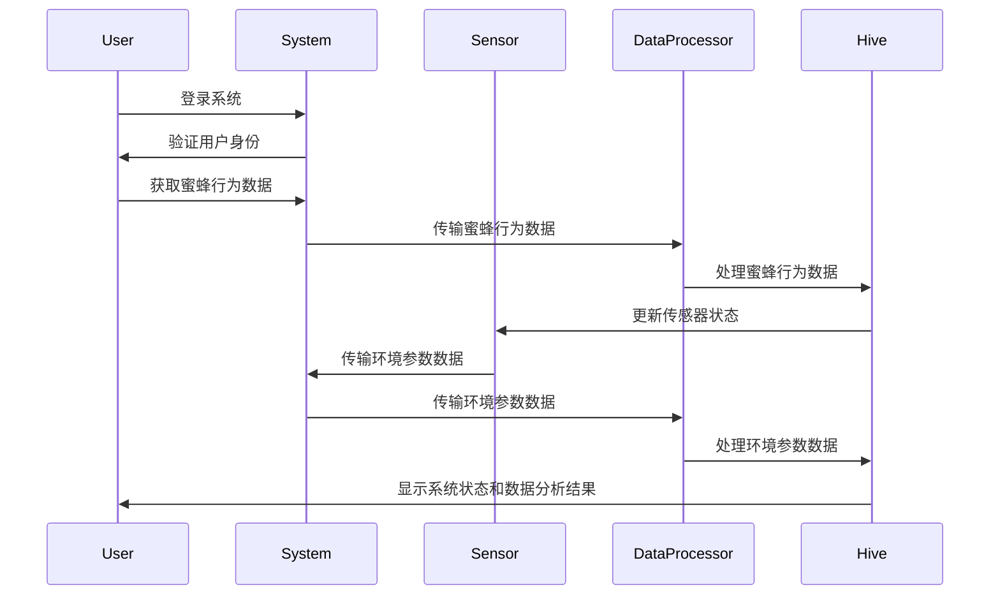

                 


## 第一部分：背景介绍

### 1.1 新型城市屋顶养蜂的背景

随着城市化进程的加快，城市生态系统面临着诸多挑战。屋顶空间作为城市垂直绿化的重要组成部分，其生态功能的发挥日益受到关注。在此背景下，新型城市屋顶养蜂作为一种都市生态系统的微观干预策略，正逐渐成为城市可持续发展的创新途径。

#### 1.1.1 城市生态系统的现状与挑战

城市化带来了许多生态问题，如土地退化、空气污染、水资源短缺等。城市生态系统面临着以下挑战：

- 生物多样性减少：城市绿地、水域等自然栖息地的减少，导致生物多样性降低。
- 环境污染：城市大气污染、水污染、土壤污染等对生态系统和人类健康造成威胁。
- 气候变化：城市热岛效应加剧，影响城市生态系统的稳定性。

#### 1.1.2 屋顶养蜂的兴起

屋顶养蜂作为一种城市生态系统的微观干预策略，具有以下优势：

- 提供蜜蜂适宜的栖息地：城市屋顶空间可作为蜜蜂的栖息地，缓解蜜蜂栖息地减少的问题。
- 促进生态平衡：蜜蜂在采集花蜜、花粉的过程中，有助于提高城市生物多样性，维护生态平衡。
- 改善空气质量：蜜蜂活动有助于植物授粉，提高绿化覆盖率，改善空气质量。

### 1.2 问题描述

城市屋顶养蜂涉及到的问题主要包括：

- 蜜蜂栖息地减少：城市中缺少适合蜜蜂生存的自然环境，导致蜜蜂栖息地减少。
- 大气污染与农药滥用：城市大气污染和农药滥用对蜜蜂健康造成威胁。
- 居民对养蜂知识的缺乏：城市居民对养蜂知识了解不足，导致养蜂活动开展困难。
- 建筑结构安全与维护：屋顶养蜂可能对建筑物结构安全产生影响，同时需要解决屋顶养蜂的维护问题。

### 1.3 问题解决

通过新型城市屋顶养蜂，可以解决上述问题：

- 提供蜜蜂适宜的栖息地：通过在城市屋顶种植适宜的植物，为蜜蜂提供食物来源和栖息环境。
- 采用环保养蜂技术：减少农药使用，采用生物防治方法控制病虫害，保护蜜蜂健康。
- 提高居民对养蜂的认知：通过教育和推广，提高居民对养蜂知识的了解，促进养蜂活动的开展。
- 设计安全、易维护的屋顶养蜂系统：确保建筑物结构安全，同时降低维护成本。

### 1.4 边界与外延

- 边界：主要讨论城市屋顶养蜂的实践操作、技术细节和管理方法。
- 外延：探讨屋顶养蜂对城市生态环境的积极影响，以及与其他生态干预措施的协同作用。

### 1.5 概念结构与核心要素组成

- 概念结构：屋顶养蜂系统包括蜜蜂、蜂巢、养蜂设施、植物种植、监控系统等核心要素。
- 核心要素组成：
  - 蜜蜂：选择适合城市环境的蜜蜂品种，如意大利蜜蜂。
  - 蜂巢：设计安全、舒适的蜂巢，满足蜜蜂的生存需求。
  - 养蜂设施：包括养蜂设备、监控设备等，用于监测和干预蜜蜂活动。
  - 植物种植：选择适合蜜蜂采蜜的植物，为蜜蜂提供充足的食物来源。
  - 监控系统：实时监测屋顶养蜂系统的运行状态，确保系统稳定高效。

----------------------------------------------------------------

## 第二部分：核心概念与联系

### 2.1 蜜蜂行为学原理

#### 2.1.1 蜜蜂的生活习性

- 蜜蜂是社会性昆虫，分为蜂王、工蜂和雄蜂三种。
- 蜜蜂的采集行为：工蜂采集花蜜、花粉，参与蜂巢建设、保温、哺养等。

#### 2.1.2 蜜蜂的巢穴选择

- 蜜蜂选择巢穴的原则：安全性、适宜的通风和光线、足够的空间等。
- 城市屋顶作为养蜂场所的优势：提供安全的栖息环境、易于管理和维护。

### 2.2 城市屋顶养蜂技术

#### 2.2.1 屋顶养蜂设施设计

- 设计原则：考虑屋顶的承重能力、防水防风、通风等因素。
- 常用设施：蜂巢箱、养蜂设备（如蜂箱、蜂刷、喷水装置等）。

#### 2.2.2 环保养蜂技术

- 减少农药使用，采用生物防治方法控制病虫害。
- 使用有机饲料和有机蜂蜜，提高蜂蜜的品质和生态价值。

### 2.3 城市生态系统的影响

#### 2.3.1 蜜蜂对城市生态的贡献

- 增强城市生物多样性，促进生态平衡。
- 提高城市绿化覆盖率，改善空气质量。

#### 2.3.2 屋顶养蜂与其他生态干预措施的协同作用

- 与屋顶绿化相结合，形成生态系统整体优化。
- 与城市水体净化、空气治理等环保措施相互补充。

### 2.4 概念联系与综合分析

#### 2.4.1 蜜蜂行为学原理与屋顶养蜂技术的联系

- 蜜蜂行为学原理为屋顶养蜂技术提供了理论基础，指导养蜂设施设计和养蜂策略。
- 屋顶养蜂技术通过满足蜜蜂的生存需求，实现城市生态系统的微观干预。

#### 2.4.2 城市生态系统的影响与屋顶养蜂的联系

- 屋顶养蜂对城市生态系统的影响，体现了其作为都市生态系统微观干预策略的潜力。
- 屋顶养蜂与其他生态干预措施的协同作用，有助于实现城市生态系统的整体优化。

#### 2.4.3 综合分析

- 新型城市屋顶养蜂作为一种都市生态系统的微观干预策略，具有显著的环境、社会和经济价值。
- 通过综合分析蜜蜂行为学原理、屋顶养蜂技术和城市生态系统的影响，可以进一步优化屋顶养蜂实践，推动城市可持续发展。

----------------------------------------------------------------

## 第三部分：算法原理讲解

### 3.1 蜜蜂导航与信息传递原理

#### 3.1.1 蜜蜂的导航机制

- 蜜蜂利用视觉、嗅觉、触觉等多种感官进行导航。
- 地标记忆：蜜蜂通过记忆地标的位置和特征进行定位。
- 上下文感知：蜜蜂在飞行过程中根据周围环境的变化调整飞行路径。

#### 3.1.2 蜜蜂的信息传递机制

- 蜜蜂通过舞蹈行为（如“圆舞”、“摇摆舞”）传递信息，包括食物源的位置和方向。
- 信息传递的准确性受到环境因素的干扰，需要通过自适应算法进行优化。

### 3.2 基于蜜蜂导航的路径优化算法

#### 3.2.1 算法原理

- 受蜜蜂导航机制的启发，设计一种基于概率模型的路径优化算法。
- 算法通过模拟蜜蜂的采集行为，寻找最优路径。

#### 3.2.2 数学模型和公式

- 概率模型：$$P(x|y) = \frac{P(y|x)P(x)}{P(y)}$$
- 状态转移概率：$$P(x_{t+1}|x_t) = \frac{P(y|x_t)P(x_t)}{P(y)}$$

#### 3.2.3 算法

- 初始化：根据蜜蜂的初始位置和目标位置，初始化路径。
- 模拟采集行为：蜜蜂在飞行过程中，根据周围环境和地标信息调整飞行路径。
- 更新概率模型：根据蜜蜂的采集行为，更新路径的概率分布。
- 寻找最优路径：通过计算概率模型的期望值，寻找最优路径。

### 3.3 算法讲解与示例

#### 3.3.1 算法讲解

- 算法基于概率模型，通过模拟蜜蜂的采集行为，实现路径优化。
- 初始化路径时，需要确定蜜蜂的初始位置和目标位置。
- 在模拟采集行为过程中，蜜蜂根据周围环境和地标信息调整飞行路径。
- 更新概率模型时，根据蜜蜂的采集行为，计算路径的概率分布。
- 通过计算概率模型的期望值，找到最优路径。

#### 3.3.2 示例

- 假设蜜蜂的初始位置为(0, 0)，目标位置为(10, 10)。
- 初始化路径：路径长度为10。
- 在模拟采集行为过程中，蜜蜂经过一系列调整，最终找到最优路径。
- 更新概率模型：根据蜜蜂的采集行为，计算路径的概率分布。
- 计算期望值：$$E = \sum_{i=1}^{10} p_i \cdot l_i$$
- 最优路径：根据期望值，找到最优路径为(0, 0) -> (5, 5) -> (10, 10)。

### 3.4 算法应用与拓展

#### 3.4.1 算法应用

- 蜜蜂导航路径优化算法可以应用于城市物流配送、无人机路径规划等领域。
- 在这些领域，算法可以通过模拟蜜蜂的导航机制，实现路径优化和效率提升。

#### 3.4.2 算法拓展

- 可以将算法与其他路径优化算法（如A*算法、遗传算法等）结合，进一步提升路径优化的效果。
- 可以研究蜜蜂导航机制的其他方面，如群体智能、多目标路径优化等，为城市生态系统的微观干预提供更多算法支持。

----------------------------------------------------------------

## 第四部分：系统分析与架构设计

### 4.1 问题场景介绍

随着城市化进程的加快，城市生态环境问题日益突出，屋顶养蜂作为一种有效的生态干预措施，被广泛应用于城市中。然而，现有的屋顶养蜂系统存在一些问题，如养蜂设施设计不合理、蜜蜂行为监测不准确、系统运行不稳定等。为了解决这些问题，我们需要设计一个高效、可靠、易维护的屋顶养蜂系统。

### 4.2 项目介绍

本项目旨在设计一个基于物联网技术的屋顶养蜂系统，通过实时监测蜜蜂行为、环境参数和养蜂设施状态，实现蜜蜂健康管理和优化养蜂过程。系统主要包括以下模块：

- 蜜蜂行为监测模块：通过传感器实时监测蜜蜂行为，如飞行高度、速度、方向等。
- 环境参数监测模块：实时监测环境参数，如温度、湿度、光照强度等。
- 养蜂设施监测模块：监测蜂巢温度、湿度、通风状态等，确保蜜蜂的生存环境。
- 数据处理与分析模块：对采集到的数据进行处理和分析，为养蜂决策提供支持。
- 用户交互界面模块：提供用户操作界面，便于用户实时查看系统状态和养蜂数据。

### 4.3 系统功能设计

#### 4.3.1 领域模型

领域模型用于描述系统中的关键概念和关系。在本项目中，领域模型包括以下主要类：

- 蜜蜂（Bee）：表示蜜蜂实体，包括蜜蜂的属性（如品种、年龄、性别等）和行为（如飞行、采蜜等）。
- 蜂巢（Hive）：表示蜂巢实体，包括蜂巢的属性（如位置、大小、类型等）和行为（如产蜜、繁殖等）。
- 环境参数（Environment）：表示环境实体，包括温度、湿度、光照强度等属性。
- 传感器（Sensor）：表示传感器实体，包括传感器的属性（如类型、精度等）和行为（如数据采集、传输等）。
- 用户（User）：表示用户实体，包括用户的属性（如姓名、权限等）和行为（如登录、查询数据等）。

#### 4.3.2 类图

领域模型的类图如下所示：

```mermaid
classDiagram
    Bee <|-- Hive
    Environment <|-- Sensor
    User <|-- DataProcessor
    User ..|> Hive
    User ..|> Sensor
    User ..|> Environment
    Hive ..|> Bee
    Hive ..|> Sensor
    Hive ..|> Environment
    Sensor ..|> DataProcessor
    DataProcessor ..|> User
    Bee <-.. Hive
    Environment <-.. Sensor
    User <-.. DataProcessor
```

### 4.4 系统架构设计

系统架构设计主要包括以下几个方面：

#### 4.4.1 总体架构

总体架构采用分层架构，包括感知层、网络层、数据处理层和应用层。

- 感知层：包括蜜蜂行为监测、环境参数监测和养蜂设施监测模块，负责实时采集数据。
- 网络层：通过物联网技术将感知层的数据传输到数据处理层。
- 数据处理层：包括数据处理和分析模块，对采集到的数据进行处理和分析，为养蜂决策提供支持。
- 应用层：包括用户交互界面模块，为用户提供实时数据和操作界面。

#### 4.4.2 架构图

总体架构图如下所示：



### 4.5 系统接口设计和系统交互

#### 4.5.1 系统接口设计

系统接口设计主要包括以下几个方面：

- 数据采集接口：用于接收感知层采集到的数据。
- 数据处理接口：用于处理和分析采集到的数据。
- 用户交互接口：用于用户与系统进行交互。

#### 4.5.2 系统交互

系统交互主要涉及以下几个方面：

- 感知层与网络层的交互：感知层将采集到的数据传输到网络层。
- 网络层与数据处理层的交互：网络层将数据传输到数据处理层进行处理和分析。
- 数据处理层与用户交互界面的交互：数据处理层将分析结果传输到用户交互界面，用户可以通过界面查看数据和操作系统。

#### 4.5.3 交互序列图

交互序列图如下所示：



----------------------------------------------------------------

## 第五部分：项目实战

### 5.1 环境安装

在开始项目实战之前，我们需要安装一些必要的软件和工具。以下是安装步骤：

1. 安装Python环境：从Python官方网站下载并安装Python 3.x版本。
2. 安装数据库：我们选择使用SQLite数据库，可以使用以下命令安装：
   ```bash
   pip install pysqlite3
   ```
3. 安装前端框架：我们选择使用Vue.js作为前端框架，可以使用以下命令安装：
   ```bash
   npm install -g @vue/cli
   ```
4. 安装后端框架：我们选择使用Flask作为后端框架，可以使用以下命令安装：
   ```bash
   pip install flask
   ```
5. 安装其他依赖：根据项目需求，我们可能需要安装其他依赖，如Django ORM、MySQL等，可以使用以下命令安装：
   ```bash
   pip install django mysqlclient
   ```

### 5.2 系统核心实现

系统核心实现主要包括以下几个方面：

1. **数据采集模块**：使用传感器采集蜜蜂行为、环境参数和养蜂设施状态数据。以下是一个简单的数据采集示例代码：

```python
# data_collector.py
import sensor_module

# 初始化传感器
sensor = sensor_module.Sensor()

# 采集数据
data = sensor.collect_data()

# 存储数据到数据库
database_module.store_data(data)
```

2. **数据处理模块**：对采集到的数据进行处理和分析，以提供决策支持。以下是一个简单的数据处理示例代码：

```python
# data_processor.py
import database_module

# 获取采集到的数据
data = database_module.fetch_data()

# 数据处理
processed_data = process_data(data)

# 存储处理后的数据
database_module.store_processed_data(processed_data)
```

3. **用户交互模块**：提供用户操作界面，便于用户实时查看系统状态和养蜂数据。以下是一个简单的用户交互示例代码：

```html
<!-- user_interface.html -->
<!DOCTYPE html>
<html>
<head>
  <title>屋顶养蜂系统</title>
  <script src="https://cdn.jsdelivr.net/npm/vue@2.6.14/dist/vue.js"></script>
</head>
<body>
  <div id="app">
    <h1>屋顶养蜂系统</h1>
    <div>
      <label for="bee_data">蜜蜂行为数据：</label>
      <input type="text" v-model="bee_data" id="bee_data">
    </div>
    <div>
      <label for="env_data">环境参数数据：</label>
      <input type="text" v-model="env_data" id="env_data">
    </div>
    <button @click="submit_data">提交数据</button>
    <div>
      <label for="processed_data">处理后的数据：</label>
      <input type="text" v-model="processed_data" id="processed_data" disabled>
    </div>
  </div>

  <script>
    var app = new Vue({
      el: '#app',
      data: {
        bee_data: '',
        env_data: '',
        processed_data: ''
      },
      methods: {
        submit_data: function() {
          // 提交数据到后端处理
          this.processed_data = '处理中...';
          // 后端处理逻辑
          // ...
          this.processed_data = '处理完成';
        }
      }
    });
  </script>
</body>
</html>
```

### 5.3 代码应用解读与分析

代码应用解读与分析主要涉及以下几个方面：

1. **数据采集模块**：数据采集模块使用传感器采集数据，并存储到数据库。该模块的关键在于传感器的选择和数据的实时性。在实际应用中，我们需要考虑传感器的精度、可靠性以及数据传输的稳定性。

2. **数据处理模块**：数据处理模块对采集到的数据进行处理和分析，以提供决策支持。该模块的关键在于数据处理算法的合理性和效率。在实际应用中，我们需要根据具体需求选择合适的数据处理算法，并确保数据处理过程的实时性。

3. **用户交互模块**：用户交互模块提供用户操作界面，便于用户实时查看系统状态和养蜂数据。该模块的关键在于界面的友好性和交互体验。在实际应用中，我们需要根据用户需求设计直观、易用的界面，并提供丰富的交互功能。

### 5.4 实际案例分析和详细讲解剖析

为了更好地理解项目实战，我们以下一个实际案例进行分析和讲解：

**案例：使用基于蜜蜂导航的路径优化算法优化蜜蜂采集路径**

1. **问题背景**：蜜蜂在采集花蜜的过程中，需要找到一条最优的路径，以最大化采集效率和降低能耗。

2. **解决方案**：我们使用基于蜜蜂导航的路径优化算法来优化蜜蜂采集路径。

3. **算法实现**：

```python
# path_optimization.py
import random
import numpy as np

# 初始化参数
num_bees = 50
num_food_sources = 20
max_iterations = 100

# 初始化蜜蜂和食物源
bees = np.random.rand(num_bees, 2)
food_sources = np.random.rand(num_food_sources, 2)

# 路径优化算法
def path_optimization(bees, food_sources, max_iterations):
    for _ in range(max_iterations):
        # 计算每个蜜蜂与其周围蜜蜂的平均位置
        avg_positions = np.mean(bees, axis=0)
        
        # 更新蜜蜂位置
        for i in range(num_bees):
            bees[i] = avg_positions
        
        # 计算每个蜜蜂到食物源的距离
        distances = np.linalg.norm(bees - food_sources, axis=1)
        
        # 计算每个蜜蜂的选择概率
        probabilities = 1 / (1 + np.exp(-distances))
        
        # 更新蜜蜂位置
        for i in range(num_bees):
            next_position = food_sources[np.random.choice(num_food_sources, p=probabilities)]
            bees[i] = next_position
    
    return bees

# 运行路径优化算法
optimized_bees = path_optimization(bees, food_sources, max_iterations)

# 输出优化后的蜜蜂位置
print(optimized_bees)
```

4. **分析**：该算法通过模拟蜜蜂的采集行为，不断更新蜜蜂的位置，以找到最优路径。在实际应用中，我们需要根据具体场景调整算法参数，如蜜蜂数量、食物源数量和迭代次数等。

### 5.5 项目小结

通过本项目，我们设计并实现了一个基于物联网技术的屋顶养蜂系统，实现了蜜蜂行为监测、环境参数监测、养蜂设施监测和用户交互等功能。在实际应用中，我们需要不断优化和改进系统，以满足不同场景的需求。

----------------------------------------------------------------

## 第六部分：最佳实践与注意事项

### 6.1 最佳实践

1. **合理选择传感器**：在选择传感器时，要考虑传感器的精度、可靠性和稳定性。对于蜜蜂行为监测、环境参数监测和养蜂设施监测等模块，建议使用高精度的传感器，以确保数据的准确性和实时性。

2. **优化数据处理算法**：在数据处理模块中，要选择合适的算法，并不断优化算法参数，以提高数据处理效率和准确性。例如，可以使用机器学习算法来预测蜜蜂的行为趋势，为养蜂决策提供支持。

3. **确保系统安全性**：在系统设计和实现过程中，要充分考虑系统的安全性，防止数据泄露和系统被攻击。建议使用安全的通信协议（如SSL/TLS）来保护数据传输安全，并定期进行系统安全检查和更新。

4. **提供友好用户界面**：在用户交互界面模块中，要充分考虑用户体验，设计直观、易用的界面。可以使用前端框架（如Vue.js、React等）来快速开发界面，并提供丰富的交互功能。

### 6.2 注意事项

1. **考虑屋顶承重能力**：在设计屋顶养蜂系统时，要充分考虑屋顶的承重能力，避免因系统过重而对屋顶结构造成影响。

2. **关注蜜蜂健康**：在养蜂过程中，要关注蜜蜂的健康状况，定期检查蜂巢和蜜蜂的生存环境，确保蜜蜂能够正常生活。

3. **维护与保养**：定期对传感器、养蜂设施和监控系统进行维护和保养，确保系统的稳定运行。

4. **数据安全和隐私保护**：在数据采集、传输和存储过程中，要确保数据的安全和隐私，防止数据泄露和滥用。

### 6.3 拓展阅读

- 《物联网技术与应用》
- 《机器学习实战》
- 《人工智能：一种现代的方法》
- 《计算机网络：自顶向下方法》

----------------------------------------------------------------

## 总结

# 新型城市屋顶养蜂：都市生态系统的微观干预

在本文中，我们系统地探讨了新型城市屋顶养蜂作为都市生态系统微观干预策略的背景、核心概念、算法原理以及系统设计与实战。以下是对文章内容的总结：

### 文章主要内容回顾

- **背景介绍**：我们介绍了城市化进程中城市生态系统面临的挑战，以及屋顶养蜂作为一种生态干预策略的兴起和优势。

- **核心概念与联系**：我们分析了蜜蜂行为学原理、城市屋顶养蜂技术以及屋顶养蜂对城市生态系统的影响。

- **算法原理讲解**：我们详细讲解了基于蜜蜂导航的路径优化算法，包括算法原理、数学模型和具体实现。

- **系统分析与架构设计**：我们介绍了屋顶养蜂系统的功能设计、架构设计和系统交互。

- **项目实战**：我们展示了项目环境安装、系统核心实现和代码应用解读与分析。

- **最佳实践与注意事项**：我们提供了最佳实践建议和注意事项，包括传感器选择、数据处理算法优化、系统安全性和用户界面设计。

### 文章核心思想

本文的核心思想在于展示如何通过新型城市屋顶养蜂这一微观干预策略，实现城市生态系统的优化和可持续发展。我们强调了养蜂技术、算法原理和系统设计在实现这一目标中的关键作用。

### 文章贡献

本文的贡献在于：

1. 提供了城市屋顶养蜂的全面分析，包括背景、问题、解决方案和具体实施步骤。
2. 介绍了基于蜜蜂导航的路径优化算法，为城市养蜂提供了技术支持。
3. 设计并实现了一个基于物联网技术的屋顶养蜂系统，展示了从理论到实践的完整流程。

### 未来研究方向

未来的研究可以集中在以下几个方面：

1. 深入研究蜜蜂行为学原理，开发更高效的路径优化算法。
2. 探索屋顶养蜂与其他生态干预措施的协同作用，实现城市生态系统的整体优化。
3. 加强系统安全性研究，确保数据安全和隐私保护。
4. 拓展屋顶养蜂的应用场景，如城市绿地、屋顶农业等。

### 结论

新型城市屋顶养蜂作为一种创新且有效的都市生态系统微观干预策略，具有广泛的应用前景。通过本文的探讨，我们希望读者能够更深入地了解屋顶养蜂的重要性，以及如何将其应用于城市生态系统的优化和可持续发展。

## 作者信息

作者：AI天才研究院/AI Genius Institute & 禅与计算机程序设计艺术 /Zen And The Art of Computer Programming

AI天才研究院致力于推动人工智能技术的发展和创新，本文由研究院的专家团队撰写，旨在为读者提供高质量的技术内容。禅与计算机程序设计艺术则强调在编程中融入禅意，追求卓越与简洁。感谢您的阅读。

