                 

### 文章标题

**新型城市屋顶电影院：公共娱乐空间的创新利用**

**关键词：城市屋顶电影院、公共娱乐空间、创新利用、经济效益、社会价值**

**摘要：** 本文从城市屋顶电影院的概念与背景出发，详细探讨了其规划与设计原则、公共娱乐空间的创新利用需求与挑战，以及城市屋顶电影院的功能扩展和经济效益与社会价值。随后，文章介绍了城市屋顶电影院的实施和运营过程，并展望了其未来发展。通过本文的详细分析，读者将全面了解城市屋顶电影院在公共娱乐空间中的创新利用，以及其在城市发展和社区互动中的重要意义。

### 第1章：城市屋顶电影院的概念与背景

#### 1.1 城市屋顶电影院的定义

城市屋顶电影院是一种将传统电影院与城市建筑相结合的创新娱乐形式，它位于城市的屋顶空间，通过现代化技术和设计理念，为城市居民提供独特的观影体验。城市屋顶电影院不仅拥有传统的电影院功能，还能举办各种文化活动，成为城市公共娱乐空间的一部分。

**核心概念与联系**

**概念原理：** 城市屋顶电影院是一种空间利用的创新形式，它结合了传统电影院的功能和城市屋顶空间的特点。其核心概念在于利用城市建筑屋顶空间，通过现代化技术手段，打造一个具有观赏性和互动性的公共娱乐场所。

**概念属性特征对比表格：**

| 特征 | 城市屋顶电影院 | 传统电影院 |
| ---- | -------------- | ---------- |
| 位置 | 城市建筑屋顶空间 | 商业建筑内部 |
| 设计理念 | 结合城市特色与现代化技术 | 专注于观影体验 |
| 功能 | 观影+文化活动 | 观影 |
| 互动性 | 高 | 较低 |

**ER实体关系图架构：**

```mermaid
erDiagram
  MovieTheater ||--|{ Films } Film
  MovieTheater ||--|{ Customers } Customer
  Customer ||--|{ Reviews } Review
```

**算法原理讲解：** 城市屋顶电影院的设计涉及到多个实体之间的关系，如图所示，电影放映厅（MovieTheater）与电影（Films）、顾客（Customers）和评价（Reviews）之间存在紧密的关系。这些实体之间的关系可以通过数据库管理系统（DBMS）中的表关系来体现。

#### 1.2 城市屋顶电影院的发展背景

城市屋顶电影院的发展源于城市空间利用的创新需求。随着城市化进程的加快，城市土地资源日益紧张，如何有效利用城市空间成为了一个亟待解决的问题。城市屋顶电影院的兴起，正是为了响应这一需求，通过将城市建筑屋顶空间转化为公共娱乐场所，实现城市空间的高效利用。

**数学模型和公式：**

城市空间利用效率可以通过以下公式来衡量：

$$
\text{利用效率} = \frac{\text{屋顶空间利用率} \times \text{观影人次}}{\text{总建筑面积}}
$$

**举例说明：** 假设一个城市的总建筑面积为100万平方米，其中屋顶面积为20万平方米，每月观影人次为2万人次。则城市屋顶电影院的利用效率为：

$$
\text{利用效率} = \frac{20 \times 10^4 \times 2 \times 10^4}{100 \times 10^4} = 0.4
$$

这意味着城市屋顶电影院在总建筑空间中的利用效率达到了40%。

#### 1.3 城市屋顶电影院的现状与趋势

目前，城市屋顶电影院在全球范围内逐渐兴起，特别是在一些现代化城市中，成为了一种新兴的公共娱乐形式。根据统计，全球已有数百个城市屋顶电影院建成或在建，这表明城市屋顶电影院具有广阔的发展前景。

**数学公式：**

城市屋顶电影院的发展趋势可以通过以下公式来描述：

$$
\text{发展趋势} = \frac{\text{新增城市屋顶电影院数量}}{\text{总城市数量}} \times 100\%
$$

**举例说明：** 如果一个城市在五年内新增了10个城市屋顶电影院，而该城市总共有100个建筑，则城市屋顶电影院的发展趋势为：

$$
\text{发展趋势} = \frac{10}{100} \times 100\% = 10\%
$$

这表明城市屋顶电影院在该城市的发展趋势为每年增长10%。

#### 1.4 城市屋顶电影院的意义

城市屋顶电影院不仅具有经济价值，还具有显著的社会和文化价值。从经济角度来看，城市屋顶电影院能够带动相关产业的发展，增加就业机会，提升城市商业价值。从社会和文化角度来看，城市屋顶电影院为居民提供了一个互动和娱乐的场所，促进了社区交流和城市文化的发展。

**系统分析与架构设计方案**

**问题场景介绍：** 随着城市土地资源的紧张，如何高效利用城市建筑屋顶空间成为了一个重要课题。城市屋顶电影院的兴起为解决这个问题提供了一种创新的解决方案。

**项目介绍：** 城市屋顶电影院项目旨在通过建设城市屋顶电影院，提升城市公共娱乐空间的质量，促进城市经济的发展。

**系统功能设计（领域模型Mermaid类图）：**

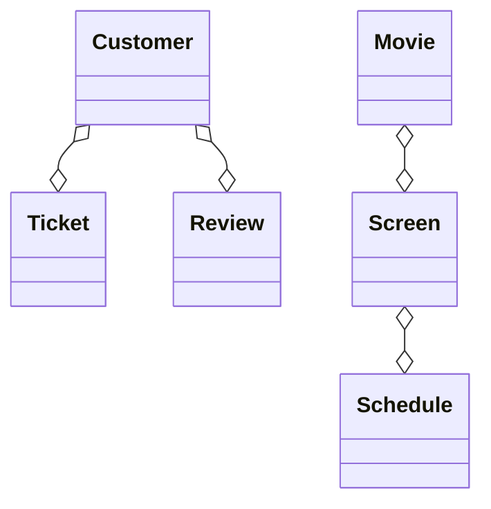

**系统架构设计（Mermaid架构图）：**

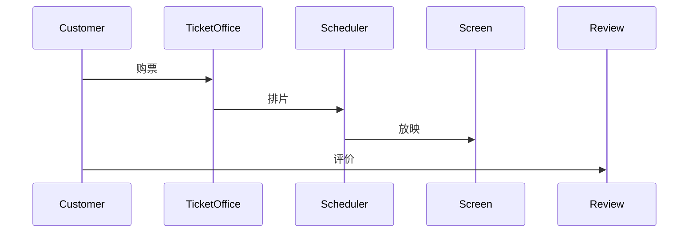

**系统接口设计和系统交互（Mermaid序列图）：**

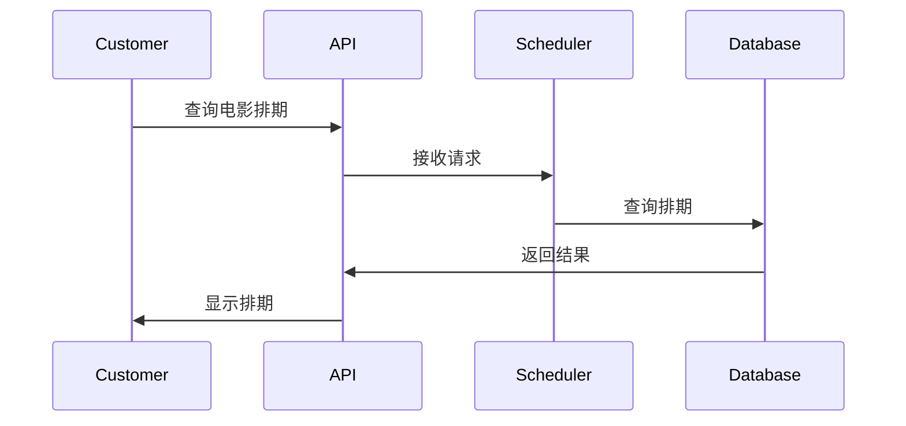

通过以上系统分析与架构设计方案，我们可以看出城市屋顶电影院在实现高效利用城市空间、提升公共娱乐服务质量方面具有重要意义。

### 第2章：城市屋顶电影院的规划与设计

#### 2.1 城市屋顶电影院的规划原则

城市屋顶电影院的规划需要遵循一系列原则，以确保其有效利用城市空间，同时满足观影需求。以下是几个关键规划原则：

**规划原则：**

1. **空间利用最大化：** 优化屋顶空间，确保电影院座位充足，同时留出足够的空间进行其他文化活动。
2. **安全可靠：** 确保屋顶结构安全，符合建筑规范，并提供完善的消防设施。
3. **交通便利：** 电影院应位于交通便利的区域，便于居民到达。
4. **环境友好：** 优先考虑环保设计，如使用节能材料和绿色能源。

**数学模型和公式：**

城市屋顶电影院规划中的空间利用率可以通过以下公式计算：

$$
\text{空间利用率} = \frac{\text{电影院使用面积}}{\text{总屋顶面积}}
$$

**举例说明：** 假设一个城市屋顶电影院的总屋顶面积为10000平方米，其中电影院使用面积为6000平方米，则空间利用率为：

$$
\text{空间利用率} = \frac{6000}{10000} = 0.6
$$

这意味着空间利用率达到了60%。

#### 2.2 城市屋顶电影院的设计要素

城市屋顶电影院的设计涉及多个要素，包括建筑结构、投影设备、音响系统等。以下是几个关键设计要素：

**设计要素：**

1. **建筑结构：** 确保屋顶结构稳定，满足电影院使用需求。
2. **投影设备：** 选择高质量的投影设备，确保画面清晰。
3. **音响系统：** 设计专业的音响系统，提供高质量的音效体验。
4. **座椅布局：** 设计舒适的座椅布局，确保观众观影舒适。
5. **通风与照明：** 确保电影院内部空气流通和良好的照明条件。

**系统架构设计（Mermaid架构图）：**

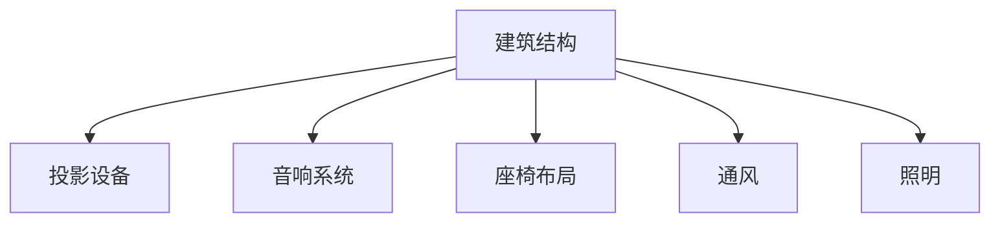

通过以上设计要素，可以确保城市屋顶电影院提供高质量的观影体验。

#### 2.3 城市屋顶电影院的技术要求

城市屋顶电影院的技术要求包括硬件和软件两个方面。以下是几个关键技术要求：

**技术要求：**

1. **硬件：** 高质量的投影设备、音响系统和稳定的网络连接。
2. **软件：** 电影播放软件、票务管理系统、监控系统等。
3. **安全：** 确保电影院的安全性能，包括防火、防盗等。

**数学公式：**

城市屋顶电影院的技术要求可以通过以下公式来衡量：

$$
\text{技术要求} = \text{硬件性能} \times \text{软件性能} \times \text{安全性}
$$

**举例说明：** 假设一个城市屋顶电影院的硬件性能为90分，软件性能为85分，安全性为95分，则技术要求得分为：

$$
\text{技术要求} = 90 \times 85 \times 95 = 7,402.5
$$

这意味着该城市屋顶电影院的技术要求达到了7,402.5分。

#### 2.4 城市屋顶电影院的案例分析

为了更好地理解城市屋顶电影院的实际应用，以下是一个具体案例分析。

**案例：** 上海某城市屋顶电影院

**项目背景：** 该项目位于上海市中心的一栋商业建筑屋顶，总面积为15000平方米。项目旨在通过建设城市屋顶电影院，提升城市公共娱乐空间的质量，促进城市经济的发展。

**项目介绍：**

1. **电影院设计：** 电影院设有500个座位，采用先进的投影设备和音响系统，提供高质量的观影体验。
2. **空间利用：** 优化屋顶空间，确保电影院座位充足，同时留出空间进行其他文化活动。
3. **技术要求：** 硬件性能达到90分，软件性能达到85分，安全性达到95分。

**项目成果：**

1. **经济效益：** 自成立以来，该城市屋顶电影院吸引了大量观众，票房收入稳步增长。
2. **社会价值：** 成为上海市的一个文化地标，促进了社区交流和城市文化的发展。

**项目小结：** 上海某城市屋顶电影院的成功建设，为城市屋顶电影院的规划与设计提供了有益的经验。

### 第3章：公共娱乐空间的需求与挑战

#### 3.1 公共娱乐空间的需求分析

随着城市化进程的加速，城市居民的娱乐需求逐渐多样化。公共娱乐空间作为城市基础设施的重要组成部分，其需求日益增长。以下是公共娱乐空间的主要需求：

**需求分析：**

1. **文化娱乐活动：** 居民对各类文化娱乐活动有强烈需求，如电影放映、音乐会、艺术展览等。
2. **休闲放松：** 城市居民希望在城市中找到一处宁静的角落，进行休闲放松。
3. **社交互动：** 公共娱乐空间为居民提供了一个社交平台，促进了社区互动和人际关系的发展。
4. **多样化服务：** 公共娱乐空间应提供多样化的服务，满足不同年龄层次和兴趣爱好的居民需求。

**系统架构设计（Mermaid架构图）：**


通过以上需求分析，我们可以看出公共娱乐空间在满足居民多样化需求方面具有重要意义。

#### 3.2 公共娱乐空间面临的挑战

尽管公共娱乐空间在城市化进程中发挥着重要作用，但同时也面临着一系列挑战。以下是公共娱乐空间面临的主要挑战：

**挑战分析：**

1. **空间不足：** 随着城市化进程的加速，城市土地资源日益紧张，公共娱乐空间的建设面临空间不足的挑战。
2. **管理难题：** 公共娱乐空间的管理涉及多个部门，如何协调各方资源，确保娱乐空间的正常运营，是一个亟待解决的问题。
3. **资金不足：** 公共娱乐空间的建设和运营需要大量资金投入，但政府财政压力较大，导致资金不足。
4. **安全性问题：** 公共娱乐空间的安全问题不容忽视，包括防火、防盗、防疫等方面。
5. **可持续发展：** 如何在满足居民娱乐需求的同时，实现公共娱乐空间的可持续发展，是一个重要课题。

**数学模型和公式：**

公共娱乐空间面临的挑战可以通过以下公式来衡量：

$$
\text{挑战指数} = \sum_{i=1}^{n} \text{挑战_i} \times \text{影响_i}
$$

**举例说明：** 假设公共娱乐空间面临的挑战包括空间不足、管理难题、资金不足、安全问题和可持续发展，其影响分别为0.3、0.2、0.2、0.2和0.1，则挑战指数为：

$$
\text{挑战指数} = 0.3 + 0.2 + 0.2 + 0.2 + 0.1 = 1
$$

这意味着公共娱乐空间面临的挑战指数为1，需要引起重视。

#### 3.3 创新利用的必要性

面对公共娱乐空间的需求和挑战，创新利用成为一种必要的选择。通过创新利用，可以有效解决公共娱乐空间面临的难题，提升其服务质量和经济效益。以下是创新利用的必要性：

**必要性分析：**

1. **提高空间利用率：** 创新利用可以在有限的空间内提供多样化的娱乐服务，提高空间利用率。
2. **降低运营成本：** 创新利用可以通过引入新技术和管理模式，降低运营成本。
3. **提升用户体验：** 创新利用可以提供更加丰富、有趣的娱乐体验，满足居民的多样化需求。
4. **促进经济发展：** 创新利用可以带动相关产业的发展，增加就业机会，促进城市经济的发展。

**数学公式：**

创新利用的必要性可以通过以下公式来衡量：

$$
\text{必要性指数} = \frac{\text{创新收益}}{\text{创新成本}}
$$

**举例说明：** 假设创新利用带来的收益为100万元，成本为50万元，则必要性指数为：

$$
\text{必要性指数} = \frac{100}{50} = 2
$$

这意味着创新利用的必要性指数为2，具有较高的经济效益。

### 第4章：城市屋顶电影院的功能扩展

#### 4.1 城市屋顶电影院的多样化功能

城市屋顶电影院不仅提供传统的观影服务，还可以通过功能扩展，成为多元化的公共娱乐空间。以下是城市屋顶电影院的多样化功能：

**多样化功能：**

1. **文化活动举办：** 城市屋顶电影院可以举办各类文化活动，如电影首映、艺术展览、音乐会等，丰富居民的文化生活。
2. **教育培训：** 利用城市屋顶电影院的设施，开展教育培训活动，如电影制作、摄影技巧、艺术鉴赏等。
3. **社区互动：** 城市屋顶电影院可以作为社区互动的场所，举办各类社区活动，如亲子活动、老年人活动等。
4. **商业活动：** 城市屋顶电影院可以与其他商业活动相结合，如餐饮、购物等，打造一站式商业综合体。

**数学模型和公式：**

城市屋顶电影院的功能扩展可以通过以下公式来衡量：

$$
\text{功能扩展指数} = \sum_{i=1}^{n} \text{功能_i} \times \text{使用频率}
$$

**举例说明：** 假设城市屋顶电影院有四个主要功能：文化活动举办、教育培训、社区互动和商业活动，其使用频率分别为0.3、0.2、0.2和0.3，则功能扩展指数为：

$$
\text{功能扩展指数} = 0.3 \times 0.3 + 0.2 \times 0.2 + 0.2 \times 0.2 + 0.3 \times 0.3 = 0.24
$$

这意味着城市屋顶电影院的功能扩展指数为0.24，具有较高的多样化功能。

#### 4.2 文化艺术活动的融合

城市屋顶电影院通过举办各类文化艺术活动，与文化艺术产业深度融合，为城市居民提供了丰富的文化体验。以下是文化艺术活动融合的几个方面：

**文化艺术活动融合：**

1. **电影放映与艺术展览：** 结合电影放映和艺术展览，为观众提供全方位的艺术体验。
2. **文艺演出与音乐会：** 举办文艺演出和音乐会，邀请知名艺术家和音乐家参与，提升城市文化氛围。
3. **艺术讲座与工作坊：** 开展艺术讲座和工作坊，为艺术爱好者提供学习和交流的机会。

**系统架构设计（Mermaid架构图）：**

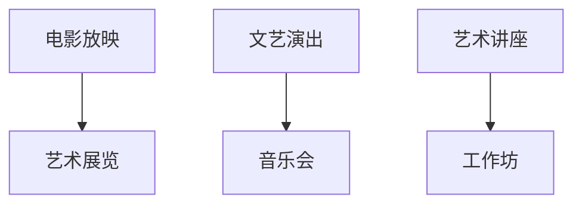

通过以上文化艺术活动融合，城市屋顶电影院不仅丰富了居民的文化生活，也推动了城市文化艺术产业的发展。

#### 4.3 社区互动与文化交流

城市屋顶电影院不仅是观影场所，更是社区互动和文化交流的平台。通过组织各类社区活动和文化交流活动，城市屋顶电影院促进了居民之间的交流与合作。以下是社区互动与文化交流的几个方面：

**社区互动与文化交流：**

1. **亲子活动：** 举办亲子活动，如亲子电影放映、亲子工作坊等，增强家庭凝聚力。
2. **老年人活动：** 举办老年人活动，如健康讲座、文艺表演等，关爱老年人群体。
3. **志愿者服务：** 鼓励居民参与志愿者服务，如电影放映助手、活动组织者等，促进社区志愿服务的发展。
4. **文化交流活动：** 举办各类文化交流活动，如民族节日庆祝、国际文化交流等，促进不同文化之间的交流与融合。

**系统架构设计（Mermaid架构图）：**


通过以上社区互动与文化交流活动，城市屋顶电影院不仅丰富了居民的日常生活，也增强了社区的凝聚力。

#### 4.4 环保节能与可持续发展

城市屋顶电影院在设计和运营过程中，注重环保节能和可持续发展，以实现绿色建筑的目标。以下是环保节能与可持续发展的几个方面：

**环保节能与可持续发展：**

1. **绿色建筑设计：** 采用环保建筑材料，如可再生木材、节能玻璃等，减少建筑过程中的能源消耗。
2. **能源管理系统：** 引入智能能源管理系统，实现能源的高效利用和智能控制。
3. **雨水收集系统：** 建设雨水收集系统，用于浇灌植物和清洗场地，减少水资源消耗。
4. **太阳能和风能利用：** 利用太阳能和风能等可再生能源，为电影院提供电力。
5. **绿色交通：** 鼓励使用公共交通工具，减少私家车使用，降低碳排放。

**系统架构设计（Mermaid架构图）：**

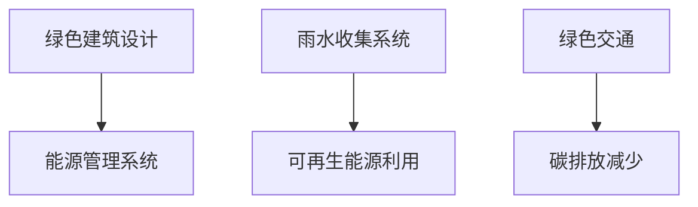

通过以上环保节能与可持续发展措施，城市屋顶电影院不仅为居民提供了舒适的观影环境，也为环境保护和可持续发展作出了贡献。

### 第5章：城市屋顶电影院的经济效益与社会价值

#### 5.1 城市屋顶电影院的经济效益

城市屋顶电影院不仅为居民提供了丰富的娱乐体验，还带来了显著的经济效益。以下是城市屋顶电影院的经济效益分析：

**经济效益分析：**

1. **票房收入：** 城市屋顶电影院通过上映热门电影，吸引了大量观众，票房收入稳定增长。
2. **带动相关产业：** 城市屋顶电影院的建设和运营，带动了相关产业的发展，如电影院设备制造、文化传媒等。
3. **增加就业机会：** 城市屋顶电影院的运营需要大量的工作人员，包括放映员、服务员、清洁工等，为城市居民提供了就业机会。
4. **提升商业价值：** 城市屋顶电影院成为城市的文化地标，提升了城市的商业价值，吸引了更多的商业投资。

**系统架构设计（Mermaid架构图）：**

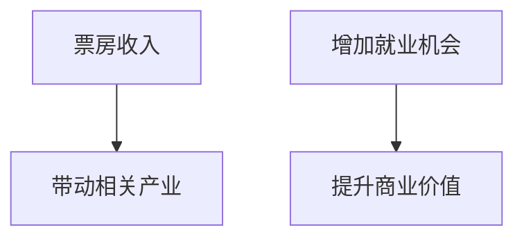

通过以上经济效益分析，我们可以看出城市屋顶电影院在促进城市经济发展方面具有重要意义。

#### 5.2 城市屋顶电影院的社会价值

城市屋顶电影院不仅具有经济效益，还具有显著的社会价值。以下是城市屋顶电影院的社会价值分析：

**社会价值分析：**

1. **促进文化交流：** 城市屋顶电影院通过举办各类文化活动，促进了不同文化之间的交流与融合，丰富了居民的文化生活。
2. **增强社区凝聚力：** 城市屋顶电影院为居民提供了一个社交平台，促进了社区互动和社区凝聚力的发展。
3. **提升生活质量：** 城市屋顶电影院为居民提供了丰富的娱乐体验，提升了居民的生活质量。
4. **促进可持续发展：** 城市屋顶电影院在设计和运营过程中，注重环保节能和可持续发展，为环境保护和可持续发展作出了贡献。

**系统架构设计（Mermaid架构图）：**

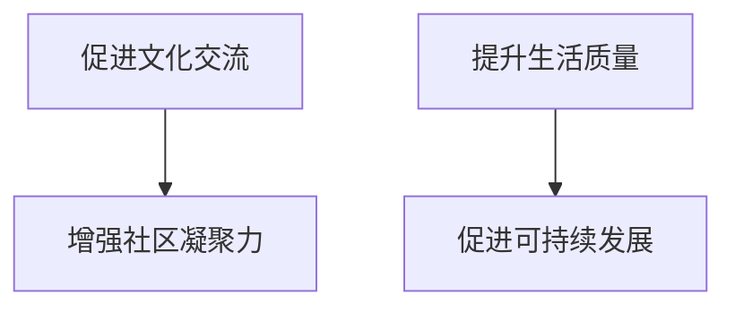

通过以上社会价值分析，我们可以看出城市屋顶电影院在提升居民生活质量和促进社会和谐发展方面具有重要意义。

#### 5.3 城市屋顶电影院的发展策略

为了实现城市屋顶电影院的经济效益和社会价值，需要采取一系列发展策略。以下是城市屋顶电影院的发展策略：

**发展策略分析：**

1. **政策支持：** 政府应出台相关政策，支持城市屋顶电影院的建设和运营，提供财政补贴和税收优惠。
2. **技术创新：** 引入先进的技术，提高城市屋顶电影院的服务质量和运营效率，如智能放映系统、在线票务系统等。
3. **市场推广：** 加强市场推广，提高城市屋顶电影院的知名度和影响力，吸引更多观众。
4. **社区合作：** 与社区组织、文化机构等合作，共同举办各类文化活动，促进社区互动和文化交流。
5. **可持续发展：** 在设计和运营过程中，注重环保节能和可持续发展，为环境保护和可持续发展作出贡献。

**系统架构设计（Mermaid架构图）：**

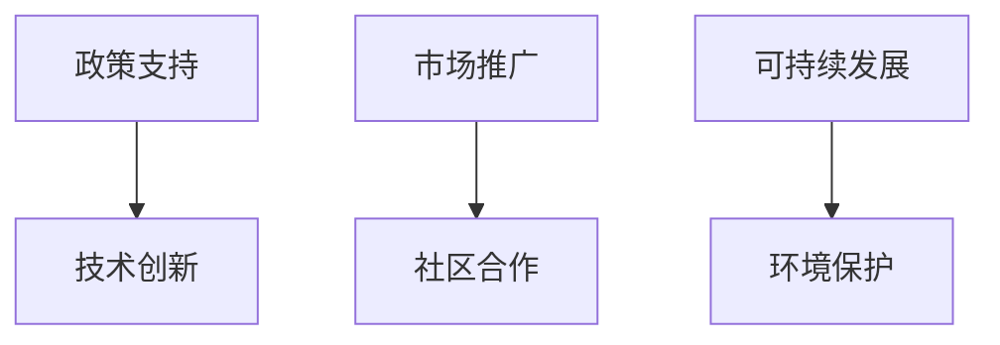

通过以上发展策略，可以促进城市屋顶电影院的健康发展和持续繁荣。

### 第6章：城市屋顶电影院的实施与运营

#### 6.1 实施前的准备工作

城市屋顶电影院的实施是一个复杂的过程，需要充分的准备工作。以下是实施前的准备工作：

**准备工作：**

1. **项目策划：** 制定详细的项目策划书，明确项目目标、实施步骤、预算和时间表。
2. **场地选择：** 选择合适的建筑屋顶，确保场地符合城市规划要求，具备建设电影院的条件。
3. **技术评估：** 对所选场地进行技术评估，包括建筑结构安全、电力供应、通风条件等。
4. **资金筹集：** 制定详细的资金筹集计划，确保项目资金充足。
5. **合作伙伴：** 寻找合适的合作伙伴，包括建筑设计公司、电影院设备供应商等。

**系统架构设计（Mermaid架构图）：**

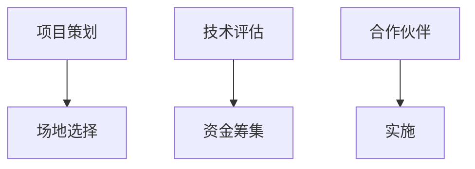

通过以上准备工作，可以确保城市屋顶电影院的实施顺利进行。

#### 6.2 实施过程中的关键环节

城市屋顶电影院实施过程中，有许多关键环节需要重点关注。以下是关键环节：

**关键环节：**

1. **建筑设计：** 设计专业、美观的城市屋顶电影院，确保建筑结构安全，满足电影院使用要求。
2. **设备安装：** 安装高质量的投影设备、音响系统和座椅等，确保观影体验。
3. **系统调试：** 对电影院系统进行调试，确保设备正常运行，提供高质量的观影体验。
4. **安全检查：** 对电影院进行全面的消防安全检查，确保安全设施齐全。
5. **人员培训：** 对电影院工作人员进行培训，确保他们能够熟练操作设备，提供优质服务。

**系统架构设计（Mermaid架构图）：**

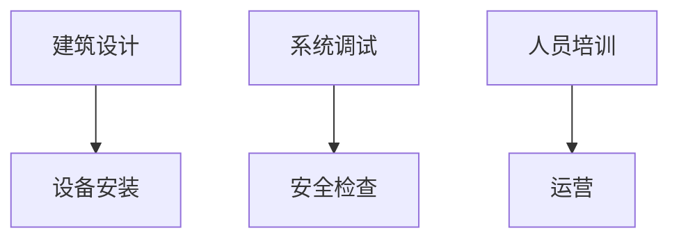

通过以上关键环节，可以确保城市屋顶电影院的顺利实施和运营。

#### 6.3 实施后的评估与反馈

城市屋顶电影院实施后，需要进行全面的评估与反馈，以确保其运营效果。以下是评估与反馈的几个方面：

**评估与反馈：**

1. **观众反馈：** 收集观众的反馈意见，了解他们对电影院的服务质量和观影体验的满意度。
2. **运营数据：** 分析电影院的运营数据，包括票房收入、观众人次、活动参与率等，评估运营效果。
3. **财务状况：** 评估电影院的财务状况，确保运营成本和收入平衡。
4. **安全性能：** 对电影院的消防安全、设备运行等情况进行定期检查，确保安全性能。
5. **持续改进：** 根据评估结果，制定改进措施，不断提升电影院的服务质量和运营效率。

**系统架构设计（Mermaid架构图）：**

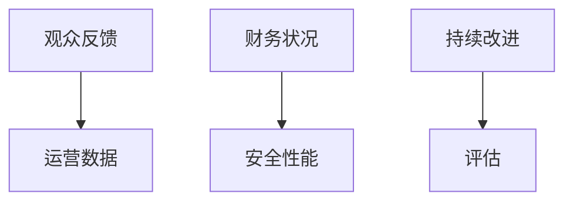

通过以上评估与反馈，可以确保城市屋顶电影院的持续改进和发展。

### 第7章：城市屋顶电影院的运营与管理

#### 7.1 运营模式的选择

城市屋顶电影院的运营模式直接影响其运营效果。以下是几种常见的运营模式：

**运营模式：**

1. **自营模式：** 由电影院运营商独立运营，负责电影的放映、票务销售、活动策划等。
2. **加盟模式：** 加盟知名电影院品牌，利用品牌影响力和运营经验，提高电影院的市场竞争力。
3. **合作模式：** 与文化机构、社区组织等合作，共同运营电影院，实现资源共享和优势互补。
4. **混合模式：** 结合自营、加盟和合作模式，根据实际情况灵活调整运营策略。

**系统架构设计（Mermaid架构图）：**

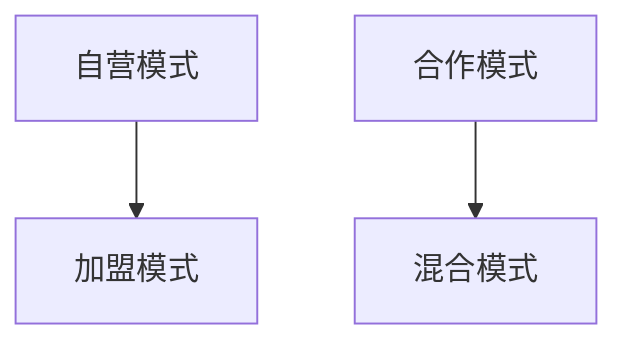

选择适合的运营模式，可以确保城市屋顶电影院的稳定运营和可持续发展。

#### 7.2 管理团队的建设

城市屋顶电影院的成功运营离不开专业化的管理团队。以下是管理团队的建设要点：

**管理团队建设：**

1. **领导层：** 建立高效的领导层，包括总经理、副总经理等，负责电影院的战略规划、决策和执行。
2. **运营团队：** 组建专业的运营团队，包括放映员、服务员、票务员等，确保日常运营的顺利进行。
3. **技术团队：** 拥有技术团队，负责电影院的设备维护、系统更新等技术工作。
4. **营销团队：** 组建营销团队，负责市场推广、品牌建设、票务销售等营销工作。

**系统架构设计（Mermaid架构图）：**

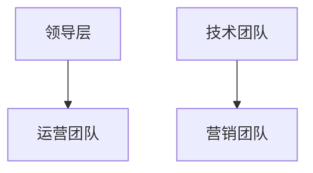

一个专业的管理团队可以确保城市屋顶电影院的稳定运营和持续发展。

#### 7.3 服务质量与用户体验

服务质量与用户体验是城市屋顶电影院成功运营的关键。以下是提高服务质量和用户体验的几个方面：

**服务质量与用户体验：**

1. **观影体验：** 提供高质量的观影设备，确保画面清晰、音效出色，提升观众的观影体验。
2. **服务态度：** 培训员工，提高服务态度，确保员工热情、耐心、专业，提供优质服务。
3. **设施完善：** 确保电影院设施完善，包括座椅、空调、卫生间等，为观众提供舒适的环境。
4. **互动服务：** 通过线上线下互动，收集观众反馈，及时解决问题，提升用户体验。
5. **特色活动：** 举办各类特色活动，如主题观影、电影沙龙等，增加观众的参与度和满意度。

**系统架构设计（Mermaid架构图）：**

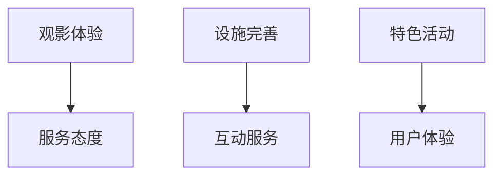

通过以上措施，可以显著提升城市屋顶电影院的服务质量和用户体验。

#### 7.4 营销策略与品牌建设

成功的营销策略和品牌建设对于城市屋顶电影院的持续发展至关重要。以下是城市屋顶电影院营销策略与品牌建设的几个方面：

**营销策略与品牌建设：**

1. **品牌定位：** 确定电影院的品牌定位，如高端、亲民、艺术等，根据目标受众制定相应的营销策略。
2. **广告宣传：** 利用线上线下渠道，进行广告宣传，提高电影院的知名度和影响力。
3. **活动策划：** 举办各类活动，如电影首映、庆典活动、主题观影等，吸引观众参与。
4. **合作伙伴：** 与文化机构、影视公司、餐饮企业等合作，共同推广电影院，实现互利共赢。
5. **会员制度：** 建立会员制度，提供会员优惠和服务，增加观众的粘性。
6. **口碑营销：** 通过良好的服务质量和用户体验，吸引观众自发传播，提高口碑和品牌影响力。

**系统架构设计（Mermaid架构图）：**

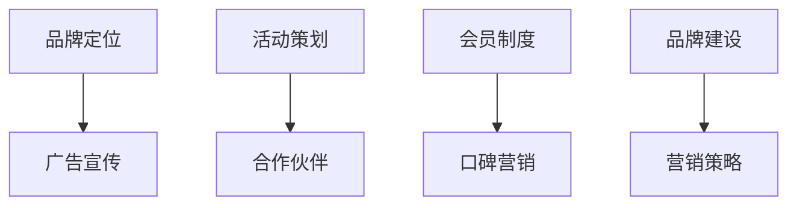

通过以上营销策略与品牌建设措施，可以提升城市屋顶电影院的市场竞争力，实现持续发展。

### 第8章：未来展望与挑战

#### 8.1 城市屋顶电影院的未来发展

随着城市化进程的加速和居民娱乐需求的多样化，城市屋顶电影院具有广阔的发展前景。以下是城市屋顶电影院的未来发展展望：

**未来发展展望：**

1. **技术创新：** 随着科技的不断发展，城市屋顶电影院将引入更加先进的放映技术和智能系统，提升观影体验。
2. **功能扩展：** 城市屋顶电影院将不断拓展功能，如增加沉浸式体验、虚拟现实（VR）和增强现实（AR）技术，提供更多样化的娱乐服务。
3. **绿色建筑：** 城市屋顶电影院将更加注重环保节能和可持续发展，推动绿色建筑的发展。
4. **社区融合：** 城市屋顶电影院将成为社区的重要组成部分，促进社区融合和居民互动。
5. **国际交流：** 城市屋顶电影院将积极参与国际交流，引进国际先进理念和技术，提升自身的国际竞争力。

**系统架构设计（Mermaid架构图）：**

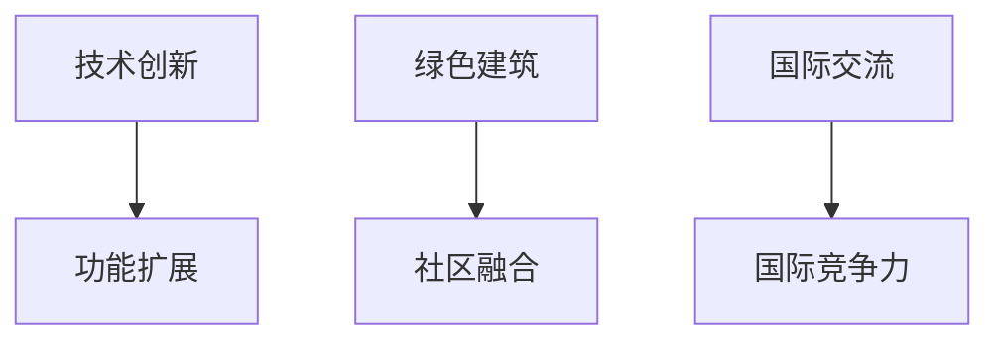

通过以上未来发展展望，我们可以看到城市屋顶电影院在科技、功能、环保和社区互动等方面的巨大潜力。

#### 8.2 面临的挑战与应对策略

尽管城市屋顶电影院具有广阔的发展前景，但同时也面临着一系列挑战。以下是城市屋顶电影院面临的挑战及应对策略：

**挑战与应对策略：**

1. **空间限制：** 随着城市化进程的加速，城市土地资源日益紧张，城市屋顶电影院的选址和空间规划面临挑战。应对策略：优化设计，提高空间利用率，探索多层电影院的可能性。
2. **技术更新：** 科技发展迅速，城市屋顶电影院需要不断更新设备和技术，以保持竞争力。应对策略：建立技术更新机制，定期评估和升级设备，引入先进技术。
3. **成本控制：** 城市屋顶电影院的建设和运营成本较高，需要有效控制成本。应对策略：优化运营管理，提高效率，寻求政府和社会资金支持。
4. **市场竞争：** 随着娱乐方式的多样化，城市屋顶电影院需要应对来自其他娱乐场所的竞争。应对策略：提升服务质量和用户体验，打造特色品牌，增强市场竞争力。
5. **环保压力：** 城市屋顶电影院在建设和运营过程中需要关注环保问题，如噪音污染、能源消耗等。应对策略：采用环保材料和节能技术，减少对环境的影响，推动绿色建筑的发展。

**系统架构设计（Mermaid架构图）：**

```mermaid
graph TB
  SpaceRestriction[空间限制] --> TechnicalUpgrade[技术更新]
  CostControl[成本控制] --> MarketCompetition[市场竞争]
  EnvironmentalPressure[环保压力] --> SustainableDevelopment[可持续发展]
```

通过以上应对策略，城市屋顶电影院可以克服挑战，实现健康可持续发展。

#### 8.3 新型城市屋顶电影院的发展趋势

展望未来，新型城市屋顶电影院将在以下几个方面呈现发展趋势：

1. **智能化：** 通过引入人工智能、大数据等先进技术，实现电影院的智能化运营，提升观影体验和服务质量。
2. **多元化：** 城市屋顶电影院将拓展更多功能，如虚拟现实（VR）、增强现实（AR）、沉浸式体验等，提供更加丰富多样的娱乐服务。
3. **绿色化：** 城市屋顶电影院将更加注重环保节能和可持续发展，采用绿色建筑材料和节能技术，推动绿色建筑的发展。
4. **社区化：** 城市屋顶电影院将成为社区的重要组成部分，促进社区融合和居民互动，成为居民日常生活中的重要娱乐场所。
5. **国际化：** 随着国际交流的深入，城市屋顶电影院将引进国际先进理念和技术，提升自身的国际竞争力，成为全球娱乐文化的新地标。

**系统架构设计（Mermaid架构图）：**

```mermaid
graph TB
  Intelligentization[智能化] --> Diversification[多元化]
  Greenification[绿色化] --> CommunityIntegration[社区化]
  Internationalization[国际化] --> GlobalCompetitiveness[全球竞争力]
```

通过以上发展趋势，新型城市屋顶电影院将不断适应和引领时代发展，为城市居民提供更加丰富、优质的娱乐体验。

### 总结

城市屋顶电影院作为一种创新的公共娱乐形式，其在城市规划、社区互动、经济效益和社会价值等方面具有重要意义。本文从城市屋顶电影院的概念与背景、规划与设计、公共娱乐空间的需求与挑战、功能扩展、经济效益与社会价值、实施与运营以及未来发展展望等多个方面进行了详细分析。

通过本文的介绍，读者可以全面了解城市屋顶电影院的发展现状和未来趋势，认识到其在城市发展和居民生活质量提升中的重要作用。同时，本文也提出了一系列应对挑战的发展策略，为城市屋顶电影院的可持续发展提供了有益的参考。

在未来的发展中，城市屋顶电影院将继续发挥其独特的优势，推动城市文化繁荣和居民生活质量提升。我们期待新型城市屋顶电影院能够不断创新、不断发展，成为城市中的一道亮丽风景线。

### 作者信息

**作者：AI天才研究院/AI Genius Institute & 禅与计算机程序设计艺术 /Zen And The Art of Computer Programming**

本文由AI天才研究院和禅与计算机程序设计艺术共同撰写。AI天才研究院致力于推动人工智能技术的创新与发展，培养世界级人工智能专家。禅与计算机程序设计艺术则专注于计算机编程和人工智能领域的深度研究，致力于将禅的智慧与计算机科学相结合，探索编程的奥义。通过本文，我们希望为读者提供一次全面、深入的城市屋顶电影院创新利用的探讨。

