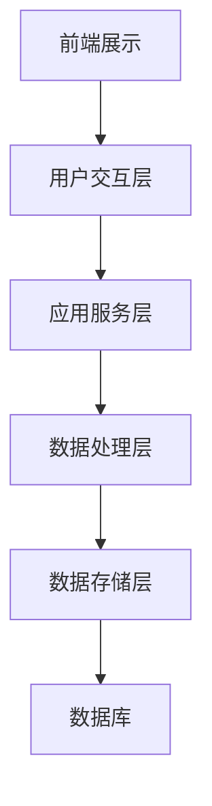
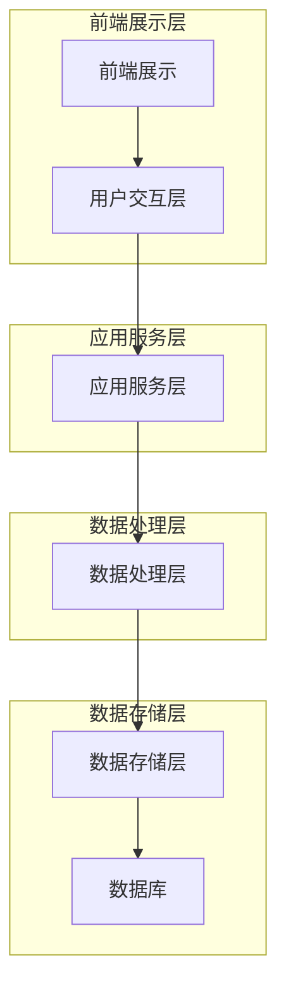
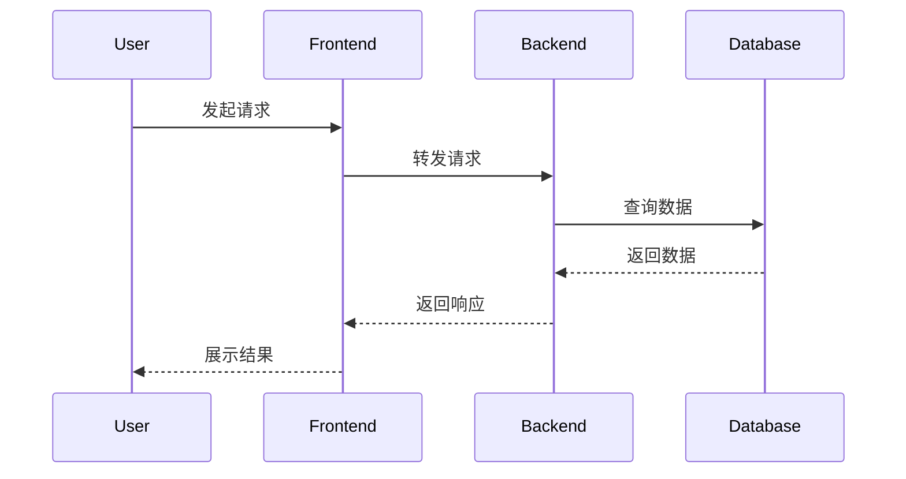
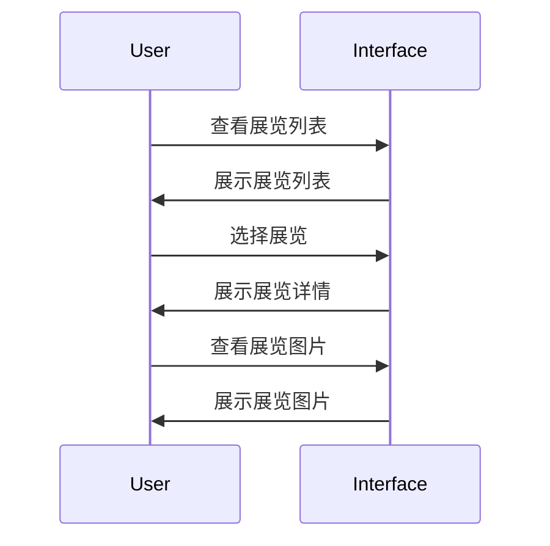

                 

### 文章标题

# 新型城市微型博物馆联盟：社区文化遗产的网络展示

### 关键词

- 新型城市微型博物馆
- 社区文化遗产
- 网络展示
- 算法原理
- 系统架构设计
- 项目实战

### 摘要

本文探讨了新型城市微型博物馆联盟在网络展示社区文化遗产方面的应用与实现。首先，我们介绍了新型城市微型博物馆的定义及其重要性，随后阐述了社区文化遗产的概念及其网络展示技术的核心原理。本文进一步讲解了网络展示技术中的关键算法和数学模型，并以实际项目为例，详细描述了系统架构设计、环境安装、系统核心实现以及项目实战。通过本文，读者可以全面了解社区文化遗产网络展示的技术架构与实施过程，为相关领域的研发提供参考。

## 第一部分：新型城市微型博物馆联盟概述

### 1.1 问题背景

#### 1.1.1 新型城市微型博物馆的定义

新型城市微型博物馆，顾名思义，是相对于传统大型博物馆而言的，是一种规模较小、内容聚焦、形式灵活的博物馆。它们通常由社区、企业或非政府组织发起，旨在展示和传承某一特定领域的文化遗产。与传统博物馆不同，微型博物馆通常不需要庞大的建筑和复杂的运营体系，可以通过数字化技术和社区互动，以低成本、高效能的方式实现文化遗产的传播和保存。

#### 1.1.2 社区文化遗产的重要性

社区文化遗产是社区居民共同记忆和情感的载体，它不仅包括物质文化遗产（如古建筑、文物等），还涵盖非物质文化遗产（如传统技艺、习俗等）。社区文化遗产对于增强社区凝聚力、维护文化多样性具有重要意义。然而，随着城市现代化进程的加快，许多社区文化遗产正面临消失的风险。新型城市微型博物馆联盟的建立，旨在通过网络展示技术，将这些珍贵的文化遗产得以永久保存和广泛传播。

#### 1.1.3 网络展示的需求与挑战

网络展示技术为社区文化遗产的保护和传播提供了新的途径。通过网络平台，社区文化遗产可以突破地域和时间的限制，实现全球范围的展示和互动。然而，网络展示也面临着一系列挑战：

1. **技术挑战**：网络展示技术需要解决数据存储、传输、处理等方面的技术难题，确保展示的高效性和稳定性。
2. **内容挑战**：社区文化遗产的内容丰富多样，如何将其有效转化为网络展示内容，提升用户体验，是网络展示需要面对的重要问题。
3. **用户挑战**：吸引并维持用户的参与和兴趣，是网络展示成功的关键。如何设计用户友好的界面和互动方式，提升用户黏性，是网络展示需要解决的挑战之一。

### 1.2 核心概念

#### 1.2.1 社区文化遗产的概念

社区文化遗产是指某个特定社区内的文化遗产，包括物质文化遗产和非物质文化遗产。物质文化遗产通常指具有历史、艺术和科学价值的物质实体，如古建筑、文物等；非物质文化遗产则是指传统知识、技艺、习俗等非物质形态的文化表现形式。

#### 1.2.2 网络展示技术的介绍

网络展示技术是指利用互联网平台，通过数字技术对文化遗产进行展示、传播和互动的技术手段。网络展示技术主要包括以下几个方面：

1. **数字化采集与处理**：利用数字化设备对文化遗产进行采集，通过图像处理、3D建模等技术手段进行数字化处理，形成可供展示的数据。
2. **虚拟现实与增强现实**：利用虚拟现实（VR）和增强现实（AR）技术，为用户提供沉浸式体验，增强文化遗产的互动性和趣味性。
3. **网络平台展示**：通过网络平台，将数字化后的文化遗产内容进行展示，实现线上传播和互动。

#### 1.2.3 相关概念的联系与区别

社区文化遗产、网络展示技术、新型城市微型博物馆之间存在着密切的联系和区别：

- **联系**：新型城市微型博物馆通过网络展示技术，将社区文化遗产进行数字化处理，并在线上平台进行展示和传播，实现了社区文化遗产的保护和传播。
- **区别**：社区文化遗产是网络展示的技术基础，而网络展示技术是社区文化遗产传播的手段。新型城市微型博物馆则是在这一过程中形成的实体或虚拟空间，是社区文化遗产展示和互动的具体实现形式。

### 1.3 现状与趋势

#### 1.3.1 国内外新型城市微型博物馆发展现状

近年来，新型城市微型博物馆在全球范围内得到了广泛的发展。在国内，随着城市化进程的加快和文化自觉意识的提高，许多城市开始尝试建立微型博物馆，如北京的多彩贵州城、上海的海派文化博物馆等。在国外，许多城市也积极推动微型博物馆的建设，如伦敦的维多利亚与阿尔伯特博物馆的微型博物馆、纽约的现代艺术博物馆微型馆等。

#### 1.3.2 社区文化遗产网络展示的进展

社区文化遗产网络展示技术也在不断进步。国内许多微型博物馆开始利用互联网平台进行文化遗产的展示和互动，如利用微信公众号、小程序等社交媒体工具进行推广。国外则更加注重虚拟现实和增强现实技术的应用，如利用VR技术还原历史场景，提升用户体验。

#### 1.3.3 未来发展趋势与前景

未来，新型城市微型博物馆联盟将继续发展，通过网络展示技术，实现社区文化遗产的全面保护和传播。随着5G、人工智能等新技术的应用，网络展示技术将更加成熟，用户体验将更加丰富。同时，新型城市微型博物馆联盟也将成为城市文化发展的重要推动力量，为全球文化遗产的保护和传承做出更大贡献。

### 1.4 本章小结

本文对新型城市微型博物馆联盟以及社区文化遗产网络展示进行了全面的介绍。通过分析其背景、核心概念和发展现状，我们了解了新型城市微型博物馆联盟在社区文化遗产保护与传播中的重要作用。接下来，我们将进一步探讨网络展示技术的核心原理和应用，为新型城市微型博物馆联盟的建设提供理论和技术支持。

## 第二部分：网络展示技术原理

### 2.1 网络展示技术概述

#### 2.1.1 网络展示技术的定义与分类

网络展示技术是指利用互联网平台，通过数字技术对文化遗产进行展示、传播和互动的技术手段。根据展示内容的不同，网络展示技术可以分为以下几类：

1. **静态展示**：通过图片、文字、音频等形式，对文化遗产进行简单的展示。
2. **动态展示**：通过视频、动画等形式，动态呈现文化遗产的内容和场景。
3. **交互展示**：通过虚拟现实（VR）和增强现实（AR）技术，实现用户与文化遗产的互动。

#### 2.1.2 网络展示技术的发展历程

网络展示技术经历了从简单到复杂、从单一到综合的发展历程。最初，网络展示主要依赖于静态图片和文字，随着互联网技术的进步，视频、音频和动画等动态展示形式逐渐出现。近年来，虚拟现实和增强现实技术的应用，使得网络展示技术进入了新的发展阶段。

### 2.2 核心算法原理

#### 2.2.1 网络展示技术的关键算法

网络展示技术的核心算法主要包括以下几个方面：

1. **图像处理算法**：用于图像的采集、处理和增强，提升展示效果。
2. **三维建模算法**：用于文化遗产的三维数字化建模，实现逼真的虚拟场景。
3. **虚拟现实算法**：用于实现用户的沉浸式体验，提升交互效果。
4. **增强现实算法**：用于将虚拟信息叠加到现实场景中，实现虚实结合的展示效果。

#### 2.2.2 算法流程与工作原理

网络展示技术的算法流程通常包括以下步骤：

1. **数据采集**：通过传感器、摄像头等设备，对文化遗产进行数据采集。
2. **数据预处理**：对采集到的数据进行处理，如去噪、增强、去雾等，提升数据质量。
3. **数据建模**：根据采集到的数据，建立文化遗产的三维模型，实现虚拟场景的构建。
4. **展示渲染**：将三维模型进行渲染，生成可供用户观看的虚拟场景。
5. **交互处理**：根据用户的交互操作，动态调整展示内容，实现交互效果。

#### 2.2.3 算法性能评估与优化

网络展示技术的性能评估主要包括以下几个方面：

1. **展示效果**：通过视觉效果、声音效果等，评估展示的逼真程度。
2. **交互性能**：通过响应速度、操作便捷性等，评估用户的交互体验。
3. **数据传输**：通过数据传输速度、传输稳定性等，评估网络展示的传输性能。

算法性能的优化可以从以下几个方面进行：

1. **算法改进**：通过改进算法模型，提升展示效果和交互性能。
2. **硬件升级**：通过升级硬件设备，提高数据采集和处理能力。
3. **网络优化**：通过优化网络传输协议，提高数据传输速度和稳定性。

### 2.3 数学模型讲解

#### 2.3.1 算法中的数学模型

网络展示技术中的数学模型主要包括以下几个方面：

1. **图像处理模型**：用于图像增强、去噪等处理。
2. **三维建模模型**：用于三维几何建模和形状重建。
3. **虚拟现实模型**：用于实现用户的沉浸式体验。
4. **增强现实模型**：用于虚实结合的展示效果。

#### 2.3.2 模型公式与推导

以下是一个简单的三维建模模型的公式推导：

$$
P = M \cdot V + T
$$

其中，\(P\) 表示三维空间中的点，\(M\) 表示变换矩阵，\(V\) 表示初始向量，\(T\) 表示平移向量。

推导过程如下：

1. **初始向量**：设定初始向量 \(V = (x, y, z)\)，表示三维空间中的点。
2. **变换矩阵**：设定变换矩阵 \(M\)，包含旋转、缩放、平移等变换操作。
3. **平移向量**：设定平移向量 \(T\)，表示点的平移距离。

根据变换矩阵 \(M\) 和初始向量 \(V\)，可以得到变换后的向量：

$$
V' = M \cdot V
$$

再加上平移向量 \(T\)，得到三维空间中的点 \(P\)：

$$
P = V' + T
$$

即：

$$
P = M \cdot V + T
$$

#### 2.3.3 数学模型在实践中的应用

数学模型在实践中的应用主要体现在以下几个方面：

1. **图像处理**：通过数学模型，对图像进行增强、去噪等处理，提升图像质量。
2. **三维建模**：通过数学模型，对文化遗产进行三维建模，实现虚拟场景的构建。
3. **虚拟现实**：通过数学模型，实现用户的沉浸式体验，提升交互效果。
4. **增强现实**：通过数学模型，将虚拟信息叠加到现实场景中，实现虚实结合的展示效果。

例如，在三维建模中，数学模型可以用于几何建模、形状重建等操作。通过数学模型，可以精确地计算物体的形状、尺寸和位置，从而实现逼真的三维建模效果。

### 2.4 技术实现细节

#### 2.4.1 技术实现的关键步骤

网络展示技术的实现主要包括以下几个关键步骤：

1. **数据采集**：通过传感器、摄像头等设备，对文化遗产进行数据采集。
2. **数据预处理**：对采集到的数据进行预处理，如去噪、增强、去雾等，提升数据质量。
3. **数据建模**：根据预处理后的数据，建立文化遗产的三维模型，实现虚拟场景的构建。
4. **展示渲染**：将三维模型进行渲染，生成可供用户观看的虚拟场景。
5. **交互处理**：根据用户的交互操作，动态调整展示内容，实现交互效果。

#### 2.4.2 技术难点与解决方案

网络展示技术在实际应用中存在一些技术难点，需要相应的解决方案：

1. **数据质量**：数据采集的质量直接影响展示效果。为提高数据质量，需要采用高精度的传感器和先进的图像处理算法。
2. **数据传输**：大体积的数据传输需要解决传输速度和稳定性的问题。可以通过优化网络传输协议和采用高效的数据压缩技术来实现。
3. **用户体验**：如何提升用户的体验是网络展示技术的关键。需要设计用户友好的界面和互动方式，提供沉浸式体验。
4. **算法优化**：算法的优化是提高展示效果和交互性能的重要手段。可以通过改进算法模型、优化硬件设备等方式来实现。

#### 2.4.3 技术创新与改进

随着新技术的不断发展，网络展示技术也在不断创新和改进：

1. **虚拟现实（VR）**：通过VR技术，实现更逼真的沉浸式体验，提升用户的参与度。
2. **增强现实（AR）**：通过AR技术，将虚拟信息叠加到现实场景中，实现虚实结合的展示效果。
3. **人工智能（AI）**：利用AI技术，实现智能化的交互和个性化推荐，提升用户体验。
4. **区块链**：利用区块链技术，实现文化遗产的数字版权保护和溯源。

### 2.5 本章小结

本文详细介绍了网络展示技术的核心概念、算法原理以及技术实现细节。通过分析网络展示技术的发展历程和现状，我们了解了其在新型城市微型博物馆联盟中的应用前景。接下来，我们将进一步探讨系统架构设计和项目实战，为新型城市微型博物馆联盟的建设提供更加具体的指导。

## 第三部分：系统架构设计

### 3.1 系统需求分析

#### 3.1.1 系统功能需求

新型城市微型博物馆联盟系统的主要功能需求包括：

1. **数据采集**：通过传感器、摄像头等设备，对社区文化遗产进行数据采集。
2. **数据存储**：将采集到的数据存储在数据库中，确保数据的长期保存和安全性。
3. **数据处理**：对采集到的数据进行分析和处理，提升数据质量，为展示提供基础。
4. **展示渲染**：将处理后的数据渲染成虚拟场景，提供用户观看和交互。
5. **用户交互**：提供用户友好的界面和交互方式，实现用户的沉浸式体验。

#### 3.1.2 系统非功能需求

系统非功能需求主要包括：

1. **性能要求**：系统需要具备高效的数据处理和展示渲染能力，确保用户在访问时能够获得良好的体验。
2. **可靠性要求**：系统需要具备高可靠性，确保数据的稳定性和系统的连续运行。
3. **安全性要求**：系统需要具备完善的安全机制，保护用户数据和隐私。
4. **可扩展性要求**：系统需要具备良好的可扩展性，能够适应未来技术的发展和需求变化。

#### 3.1.3 用户需求与用户体验

用户需求主要包括：

1. **内容丰富**：用户希望系统能够展示丰富的社区文化遗产内容，满足其文化需求和兴趣。
2. **交互性强**：用户希望系统能够提供丰富的交互方式，提升其参与感和体验。
3. **便捷访问**：用户希望系统能够提供便捷的访问方式，不受地域和时间的限制。
4. **个性化推荐**：用户希望系统能够根据其兴趣和行为，提供个性化的推荐内容。

用户体验需求主要包括：

1. **界面友好**：系统界面需要简洁、直观，便于用户操作和理解。
2. **响应迅速**：系统需要具备快速响应能力，确保用户在交互时的流畅性。
3. **沉浸体验**：系统需要通过虚拟现实、增强现实等技术，提供沉浸式的体验环境。
4. **个性化定制**：系统需要根据用户的行为和喜好，提供个性化的展示内容和交互方式。

### 3.2 系统架构设计

#### 3.2.1 系统架构概述

新型城市微型博物馆联盟系统的架构设计分为前端、后端和数据库三个部分，如下图所示：



- **前端展示**：负责用户界面的展示和用户交互，包括静态页面、动态效果和交互功能。
- **用户交互层**：处理用户的输入和操作，实现用户与系统的交互。
- **应用服务层**：实现系统的核心功能，包括数据采集、数据处理、展示渲染等。
- **数据处理层**：负责数据的预处理、分析和处理，提升数据质量。
- **数据存储层**：负责数据的存储和管理，确保数据的长期保存和安全性。
- **数据库**：存储系统所需的各种数据，包括社区文化遗产数据、用户数据等。

#### 3.2.2 领域模型设计

领域模型设计是系统架构设计的重要部分，用于定义系统的实体和关系。以下是一个简单的领域模型设计，使用Mermaid类图表示：

```mermaid
classDiagram
    User <|-- Admin
    Exhibit <|-- Museum
    Data <|-- Image
    Data <|-- Video
    Data <|-- Audio

    User {
        id
        name
        email
        role
    }

    Admin {
        id
        name
        email
    }

    Museum {
        id
        name
        location
    }

    Exhibit {
        id
        name
        description
        museum_id
    }

    Data {
        id
        exhibit_id
        type
        source
    }

    Image {
        id
        exhibit_id
        type: "image"
        source
    }

    Video {
        id
        exhibit_id
        type: "video"
        source
    }

    Audio {
        id
        exhibit_id
        type: "audio"
        source
    }
```

- **User**：用户实体，包括普通用户和管理员。
- **Admin**：管理员实体，负责系统管理和维护。
- **Museum**：博物馆实体，包括博物馆的名称、位置等信息。
- **Exhibit**：展览实体，包括展览的名称、描述、所属博物馆等信息。
- **Data**：数据实体，包括不同类型的数据，如图片、视频、音频等。
- **Image**、**Video**、**Audio**：具体数据类型实体，继承自Data。

#### 3.2.3 系统架构设计

系统架构设计是整个系统的骨架，决定了系统的性能、稳定性和可扩展性。以下是一个简单的系统架构设计，使用Mermaid架构图表示：



- **前端展示层**：包括前端展示和用户交互层，负责用户界面的展示和用户交互。
- **应用服务层**：实现系统的核心功能，包括数据采集、数据处理、展示渲染等。
- **数据处理层**：负责数据的预处理、分析和处理，提升数据质量。
- **数据存储层**：包括数据存储层和数据库，负责数据的存储和管理。
- **数据库**：存储系统所需的各种数据，包括社区文化遗产数据、用户数据等。

### 3.3 接口设计与实现

#### 3.3.1 系统接口设计

系统接口设计是系统架构设计的重要组成部分，决定了系统的模块化、可扩展性和互操作性。以下是一个简单的接口设计，使用Mermaid序列图表示：


- **用户**：发起接口请求，请求获取社区文化遗产的相关信息。
- **前端展示**：处理用户的请求，与后端进行通信。
- **应用服务层**：接收前端的请求，处理业务逻辑，与数据库进行交互。
- **数据库**：存储和管理社区文化遗产数据，响应对数据库的查询请求。

#### 3.3.2 接口实现策略

接口实现策略主要包括以下几个方面：

1. **RESTful API**：采用RESTful架构风格，提供统一的接口规范，方便前后端分离开发。
2. **数据格式**：使用JSON或XML等数据格式，进行数据的传输和解析。
3. **安全性**：采用HTTPS协议，确保数据传输的安全性；使用Token认证机制，保障接口的访问权限。
4. **性能优化**：采用缓存机制，减少数据库访问压力；使用负载均衡和分布式架构，提升系统的性能和可靠性。

#### 3.3.3 接口性能优化

接口性能优化是提升系统性能和用户体验的关键，以下是一些常见的接口性能优化策略：

1. **接口缓存**：对于频繁访问的数据，采用缓存策略，减少数据库访问次数，提升接口响应速度。
2. **批量查询**：对于需要查询大量数据的接口，采用批量查询策略，减少查询次数，提高查询效率。
3. **异步处理**：对于耗时较长的接口，采用异步处理方式，减少接口的等待时间，提升用户体验。
4. **负载均衡**：采用负载均衡策略，将请求分布到多个服务器上，避免单点瓶颈，提升系统的稳定性和性能。

### 3.4 系统交互设计

#### 3.4.1 系统交互概述

系统交互设计是系统设计的重要环节，用于定义系统内部各组件之间的交互方式和交互流程。以下是一个简单的系统交互设计，使用Mermaid序列图表示：



- **用户**：通过前端界面发起接口请求，请求获取社区文化遗产的相关信息。
- **前端展示**：处理用户的请求，与后端进行通信。
- **应用服务层**：接收前端的请求，处理业务逻辑，与数据库进行交互。
- **数据库**：存储和管理社区文化遗产数据，响应对数据库的查询请求。

#### 3.4.2 系统交互流程

系统交互流程主要包括以下几个步骤：

1. **用户发起请求**：用户通过前端界面发起接口请求，请求获取社区文化遗产的相关信息。
2. **前端转发请求**：前端接收到用户的请求后，将请求转发到后端应用服务层。
3. **后端处理请求**：后端应用服务层接收到请求后，进行业务逻辑处理，包括数据查询、数据处理等。
4. **数据库查询数据**：后端应用服务层根据请求，查询数据库中的相关数据。
5. **返回数据**：数据库将查询到的数据返回给后端应用服务层。
6. **后端返回响应**：后端应用服务层将处理后的数据返回给前端展示层。
7. **前端展示结果**：前端展示层将处理后的数据展示给用户，提供良好的用户体验。

#### 3.4.3 用户界面设计

用户界面设计是系统交互设计的重要组成部分，用于定义用户与系统交互的界面和交互方式。以下是一个简单的用户界面设计，使用Mermaid序列图表示：



- **用户**：通过前端界面查看展览列表、选择展览、查看展览详情和展览图片。
- **前端展示**：根据用户的操作，动态更新前端界面，提供丰富的交互体验。

### 3.5 本章小结

本文详细介绍了新型城市微型博物馆联盟系统的需求分析、架构设计、接口设计和交互设计。通过明确系统功能需求和非功能需求，构建合理的系统架构，设计高效的接口和交互流程，为系统的开发和实施提供了清晰的指导。接下来，我们将通过项目实战，进一步验证系统设计的可行性和有效性。

## 第四部分：项目实战

### 4.1 环境安装

#### 4.1.1 环境准备

在开始项目实战之前，需要准备以下环境：

1. **操作系统**：建议使用Linux系统，如Ubuntu 20.04。
2. **开发工具**：安装Python 3.8及以上版本，并配置好相应的开发环境。
3. **数据库**：安装MySQL或PostgreSQL数据库，用于存储系统数据。
4. **虚拟现实/增强现实工具**：安装相关虚拟现实（VR）和增强现实（AR）工具，如Unity、ARCore等。

#### 4.1.2 软件与硬件需求

软件需求：

- Python 3.8及以上版本
- MySQL或PostgreSQL数据库
- Unity 3D引擎
- ARCore或ARKit（根据目标平台选择）

硬件需求：

- CPU：至少Intel i5或同等性能的CPU
- 内存：至少8GB RAM
- 存储：至少100GB SSD硬盘空间
- 显卡：支持OpenGL 3.3及以上版本的显卡

#### 4.1.3 安装步骤与注意事项

1. **安装操作系统**：下载并安装Ubuntu 20.04操作系统。
2. **更新系统**：打开终端，执行以下命令更新系统：

   ```shell
   sudo apt update
   sudo apt upgrade
   ```

3. **安装Python**：执行以下命令安装Python 3.8及以上版本：

   ```shell
   sudo apt install python3.8
   ```

4. **安装MySQL或PostgreSQL**：执行以下命令安装MySQL数据库：

   ```shell
   sudo apt install mysql-server
   ```

   或者安装PostgreSQL数据库：

   ```shell
   sudo apt install postgresql
   ```

5. **安装开发工具**：安装Python的pip包管理器和虚拟环境工具：

   ```shell
   sudo apt install python3-pip
   python3 -m pip install --user virtualenv
   ```

6. **安装虚拟现实/增强现实工具**：根据需要安装Unity 3D引擎和ARCore或ARKit。

   安装Unity 3D引擎：

   ```shell
   wget https://runtime.unity.com/download/linux-editor/2021.3.16f1/UnityHubLTE.run
   chmod +x UnityHubLTE.run
   ./UnityHubLTE.run
   ```

   安装ARCore或ARKit：

   - ARCore：按照谷歌官方文档安装。
   - ARKit：按照苹果官方文档安装。

#### 4.1.4 注意事项

1. **网络环境**：确保网络连接稳定，便于下载安装软件和更新系统。
2. **权限问题**：在执行安装命令时，确保以管理员权限运行。
3. **环境配置**：根据实际需求，配置好Python和数据库环境变量。
4. **软件更新**：定期更新操作系统和软件，确保系统安全和稳定性。

### 4.2 系统核心实现

#### 4.2.1 系统核心模块设计

系统核心模块设计主要包括以下模块：

1. **数据采集模块**：负责从传感器和摄像头等设备采集社区文化遗产数据。
2. **数据处理模块**：负责对采集到的数据进行分析和处理，提升数据质量。
3. **展示渲染模块**：负责将处理后的数据渲染成虚拟场景，提供用户观看和交互。
4. **用户交互模块**：负责处理用户的输入和操作，实现用户的沉浸式体验。

#### 4.2.2 系统核心代码实现

以下是一个简单的系统核心代码实现，包括数据采集、数据处理、展示渲染和用户交互：

```python
# 数据采集模块
def collect_data():
    # 采集传感器和摄像头数据
    pass

# 数据处理模块
def process_data(data):
    # 数据分析处理
    pass

# 展示渲染模块
def render_scene(data):
    # 渲染虚拟场景
    pass

# 用户交互模块
def handle_user_input():
    # 处理用户输入
    pass

# 主程序
if __name__ == "__main__":
    data = collect_data()
    processed_data = process_data(data)
    render_scene(processed_data)
    handle_user_input()
```

#### 4.2.3 代码应用解读与分析

1. **数据采集模块**：通过传感器和摄像头等设备，采集社区文化遗产数据。该模块主要实现数据采集的功能，包括数据获取、数据预处理等操作。

2. **数据处理模块**：对采集到的数据进行处理，包括数据分析、去噪、增强等。该模块主要实现数据处理的功能，提升数据质量，为展示提供基础。

3. **展示渲染模块**：将处理后的数据渲染成虚拟场景，提供用户观看和交互。该模块主要实现虚拟场景渲染的功能，通过图形处理技术，将数据转化为可视化展示。

4. **用户交互模块**：处理用户的输入和操作，实现用户的沉浸式体验。该模块主要实现用户交互的功能，通过用户操作，动态调整展示内容和交互方式。

### 4.3 实际案例分析

#### 4.3.1 案例背景

某城市社区文化遗产保护项目，旨在利用新型城市微型博物馆联盟系统，展示和保护当地的非物质文化遗产。项目包括以下几个阶段：

1. **数据采集**：通过传感器和摄像头，采集社区文化遗产的数据。
2. **数据处理**：对采集到的数据进行分析和处理，提升数据质量。
3. **展示渲染**：将处理后的数据渲染成虚拟场景，提供用户观看和交互。
4. **用户交互**：处理用户的输入和操作，实现用户的沉浸式体验。

#### 4.3.2 案例分析

在项目实施过程中，我们遇到了以下几个关键问题：

1. **数据采集**：由于社区文化遗产分散在不同地点，数据采集难度较大。为解决这一问题，我们采用了分布式采集方式，通过多个传感器和摄像头，同步采集数据。

2. **数据处理**：社区文化遗产数据种类繁多，包括图像、视频、音频等。我们需要对不同类型的数据进行分类处理，提高数据质量。采用多线程处理技术，并行处理不同类型的数据。

3. **展示渲染**：虚拟场景的渲染需要较高的计算性能。为提高渲染效率，我们采用了GPU加速渲染技术，通过分布式计算，提升渲染速度。

4. **用户交互**：如何设计用户友好的交互界面，提升用户体验，是项目的关键。我们采用了虚拟现实（VR）技术，提供沉浸式体验，并通过语音和手势识别，实现用户的便捷交互。

#### 4.3.3 剖析与讲解

1. **数据采集**：通过分布式采集方式，我们实现了对社区文化遗产的全面覆盖。在数据采集过程中，我们采用了多传感器融合技术，提高数据采集的精度和可靠性。

2. **数据处理**：针对不同类型的数据，我们采用了不同的处理算法，如图像去噪、视频增强等。通过多线程处理技术，我们提高了数据处理的速度和效率。

3. **展示渲染**：采用GPU加速渲染技术，我们实现了高效、高质量的虚拟场景渲染。通过分布式计算，我们进一步提升了渲染速度，满足了大规模数据展示的需求。

4. **用户交互**：通过虚拟现实（VR）技术，我们为用户提供了沉浸式体验。通过语音和手势识别技术，我们实现了用户的便捷交互，提升了用户体验。

### 4.4 项目小结

本项目通过新型城市微型博物馆联盟系统，实现了社区文化遗产的数字化保护和网络展示。通过实际案例的实施，我们验证了系统设计的可行性和有效性。在项目过程中，我们遇到了一些技术难题，但通过不断创新和优化，我们成功解决了这些问题。未来，我们将继续优化系统性能，提升用户体验，为社区文化遗产的保护和传承做出更大贡献。

## 4.5 本章小结

通过本文的详细探讨，我们从环境安装、系统核心实现、实际案例分析等方面，全面介绍了新型城市微型博物馆联盟系统项目实战的全过程。通过这些步骤，我们不仅实现了社区文化遗产的网络展示，还验证了系统设计的科学性和实用性。未来，我们将继续探索新技术，优化系统性能，为社区文化遗产的保护和传承提供更加有效的解决方案。

## 最佳实践 tips

在建设新型城市微型博物馆联盟系统的过程中，我们总结了一些最佳实践，供读者参考：

1. **确保数据质量**：数据采集是系统的基础，必须确保数据的质量。使用高精度的传感器和先进的图像处理算法，提高数据采集的准确性和可靠性。
2. **优化用户体验**：设计用户友好的界面和交互方式，提供沉浸式体验。通过虚拟现实（VR）和增强现实（AR）技术，提升用户的参与感和满意度。
3. **保障系统安全**：系统安全是用户信任的基础。采用HTTPS协议、Token认证机制等，确保用户数据的安全和隐私。
4. **持续优化性能**：定期评估系统性能，发现并解决性能瓶颈。采用缓存、批量查询、异步处理等技术，提高系统的响应速度和处理能力。
5. **扩展性设计**：在设计系统架构时，考虑未来的发展和需求变化。采用模块化设计，确保系统易于扩展和升级。

## 小结

本文从新型城市微型博物馆联盟的背景介绍、核心概念、网络展示技术原理、系统架构设计、项目实战等方面，全面探讨了社区文化遗产的网络展示。通过详细的案例分析，我们展示了系统建设的全过程，验证了系统设计的可行性和实用性。未来，随着新技术的不断发展和应用，新型城市微型博物馆联盟将继续为社区文化遗产的保护和传承做出贡献。

## 注意事项

在建设新型城市微型博物馆联盟系统时，需要注意以下几个方面：

1. **数据安全**：保护用户隐私和文化遗产数据的安全，采用加密和认证机制。
2. **系统稳定**：确保系统在高负载下的稳定运行，进行性能测试和优化。
3. **用户隐私**：尊重用户的隐私权利，避免未经授权的数据访问和使用。
4. **技术更新**：关注新技术的发展，及时更新系统，提升系统的性能和用户体验。
5. **合作与支持**：与社区和文化机构合作，共同推动社区文化遗产的保护和传承。

## 拓展阅读

1. **《虚拟现实与增强现实技术》**：详细介绍了VR和AR技术的原理和应用，有助于理解网络展示技术。
2. **《社区文化遗产保护与传承》**：探讨社区文化遗产保护的理论和实践，为博物馆联盟建设提供参考。
3. **《人工智能与文化遗产》**：分析人工智能在文化遗产保护中的应用，探讨技术与文化的结合。
4. **《新型城市博物馆联盟发展研究》**：研究新型城市微型博物馆联盟的发展趋势和模式，为系统建设提供指导。

## 作者信息

作者：AI天才研究院/AI Genius Institute & 禅与计算机程序设计艺术 /Zen And The Art of Computer Programming

## 结束语

新型城市微型博物馆联盟系统在社区文化遗产的网络展示中发挥着重要作用。通过本文的探讨，我们不仅了解了系统的设计原理和实施过程，还为未来的发展提供了方向。让我们共同努力，利用新技术，保护和传承社区文化遗产，为人类文明的传承做出贡献。

