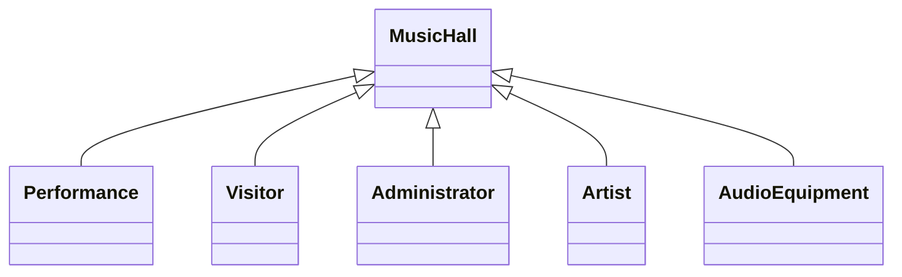
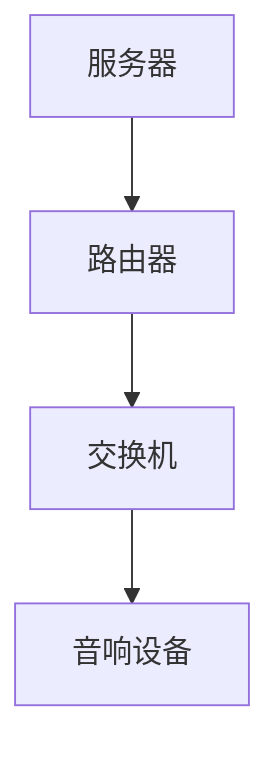
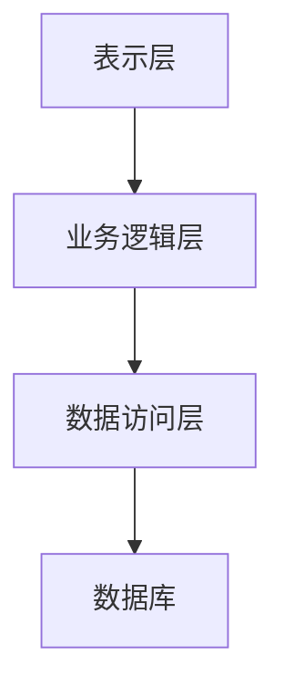
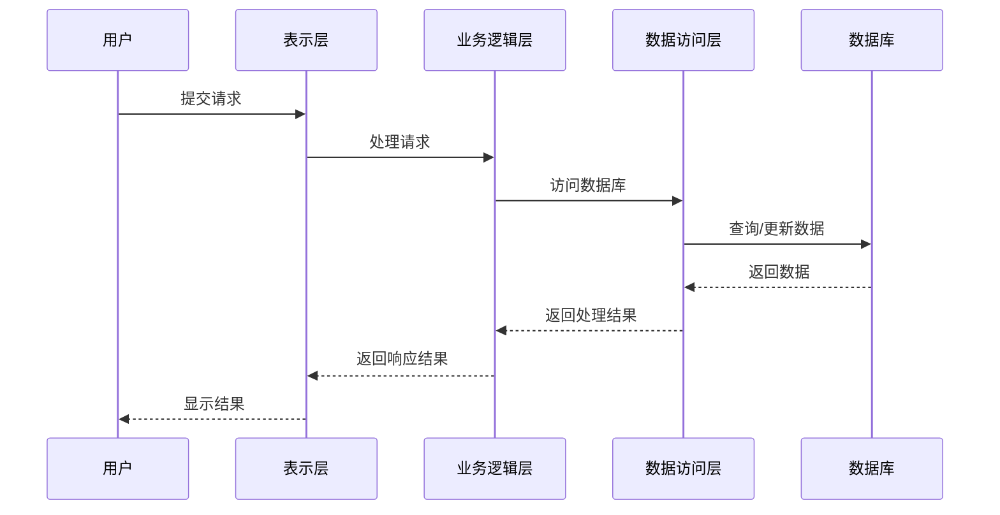

                 

### 文章标题

《新型城市微型音乐厅：社区音乐文化的培育》

#### 关键词

- 新型城市微型音乐厅
- 社区音乐文化
- 声学优化
- 设计原则
- 运营管理

#### 摘要

随着城市化进程的加快，城市居民对文化生活的需求日益增长。本文旨在探讨新型城市微型音乐厅的设计与建设，从声学性能、社区文化培育等方面出发，提供一套完整、实用的建设指南。本文将通过逻辑清晰的分析和推理，详细阐述新型城市微型音乐厅的设计原则、声学优化方法、运营管理策略，以及社区音乐文化的培育措施，旨在为读者提供有深度、有思考、有见解的专业技术文章。

### 第一部分：背景介绍

#### 1.1 问题背景

随着城市化进程的不断推进，城市居民的生活水平不断提高，对文化生活的需求也日益增长。社区音乐文化作为城市文化生活的重要组成部分，既能满足居民对音乐文化的需求，又能丰富社区文化生活。然而，当前新型城市微型音乐厅的建设和管理面临着一系列挑战，包括音乐厅设计、声学优化、运营管理等方面。

#### 1.2 问题描述

新型城市微型音乐厅的设计与建设，既要考虑音乐厅的声学性能，又要考虑其社区文化的培育。如何在有限的资源下，打造一个既能满足音乐演出需求，又能促进社区文化发展的微型音乐厅，是当前面临的主要问题。

#### 1.3 问题解决

本书旨在通过系统介绍新型城市微型音乐厅的设计原则、声学优化方法、运营管理策略，以及社区音乐文化的培育措施，为读者提供一套完整、实用的建设指南。同时，本书还通过案例分析，帮助读者更好地理解和应用所学知识。

#### 1.4 边界与外延

本书主要探讨的是城市社区微型音乐厅的设计与建设，涉及到的内容主要包括音乐厅的设计原则、声学优化、运营管理、社区音乐文化的培育等方面。此外，本书还将涉及一些相关的背景知识，如建筑学、声学、音乐学等。

#### 1.5 概念结构与核心要素组成

##### 1.5.1 新型城市微型音乐厅

新型城市微型音乐厅是指位于城市社区内部，以满足社区居民音乐文化需求为主，具有较高声学性能和文化价值的微型音乐厅。

##### 1.5.2 声学优化

声学优化是指通过对音乐厅的声学参数进行调整，使其达到最佳的声学效果，以提升音乐演出的品质。

##### 1.5.3 社区音乐文化的培育

社区音乐文化的培育是指通过一系列措施，如举办音乐会、音乐讲座、音乐培训等，促进社区音乐文化的繁荣发展。

#### 1.6 本章小结

本章对新型城市微型音乐厅及其相关问题进行了全面的介绍，为后续章节的深入探讨奠定了基础。下一章将重点介绍新型城市微型音乐厅的设计原则和声学优化方法。

### 第二部分：核心概念与联系

#### 2.1 设计原则与声学特性

##### 2.1.1 设计原则

- **空间布局**：合理规划空间，确保观众席、舞台、后台等功能的实现。  
- **声学性能**：注重声学优化，提高音乐厅的声学品质。  
- **艺术氛围**：营造舒适、和谐的艺术氛围，提升音乐演出的艺术效果。

##### 2.1.2 声学特性

- **吸声性能**：适当增加吸声材料，降低室内噪声。  
- **反射性能**：合理设计墙面、地面和天花板的反射特性，增强音效。  
- **音质特性**：确保音乐厅具有良好的音质，如清晰度、丰满度、平衡性等。

#### 2.2 社区音乐文化的培育

##### 2.2.1 活动策划

- **音乐会**：定期举办各类音乐会，丰富社区居民的音乐生活。  
- **音乐讲座**：邀请专业人士进行音乐讲座，提升居民的音乐素养。  
- **音乐培训**：开展音乐培训课程，培养社区音乐人才。

##### 2.2.2 文化氛围

- **宣传推广**：通过各类媒体宣传，提高微型音乐厅的知名度。  
- **文化互动**：举办各类文化活动，增强居民的文化认同感和参与度。

#### 2.3 算法原理与数学模型

##### 2.3.1 声学算法

- **吸声系数计算**：利用吸声系数公式，计算吸声材料的吸声性能。  
- **反射系数计算**：利用反射系数公式，计算墙面、地面和天花板的反射性能。

##### 2.3.2 数学模型

- **音质评价模型**：利用音质评价模型，对音乐厅的音质进行评价。  
- **声场分布模型**：利用声场分布模型，预测音乐厅内声场分布情况。

#### 2.4 ER实体关系图


#### 2.5 本章小结

本章介绍了新型城市微型音乐厅的核心概念与联系，包括设计原则、声学特性、社区音乐文化的培育以及算法原理和数学模型。这些概念和联系构成了本书的核心内容，为后续章节的深入探讨提供了理论基础。

### 第三部分：算法原理讲解

#### 3.1 声学算法原理讲解

##### 3.1.1 吸声系数计算

吸声系数是指材料吸收声能的能力。其计算公式为：

$$
\alpha = \frac{E_{abs}}{E_{inc}}
$$

其中，$\alpha$ 为吸声系数，$E_{abs}$ 为吸收的声能，$E_{inc}$ 为入射的声能。

#### 示例

假设一块材料，入射声能为 $E_{inc} = 100J$，吸收声能为 $E_{abs} = 80J$，则吸声系数为：

$$
\alpha = \frac{80}{100} = 0.8
$$

#### 计算过程

1. 确定入射声能和吸收声能的值。  
2. 将吸收声能除以入射声能，得到吸声系数。  
3. 将吸声系数乘以100，转换为百分比形式。

##### 3.1.2 反射系数计算

反射系数是指材料反射声能的能力。其计算公式为：

$$
\rho = \frac{E_{ref}}{E_{inc}}
$$

其中，$\rho$ 为反射系数，$E_{ref}$ 为反射的声能，$E_{inc}$ 为入射的声能。

#### 示例

假设一块材料，入射声能为 $E_{inc} = 100J$，反射声能为 $E_{ref} = 20J$，则反射系数为：

$$
\rho = \frac{20}{100} = 0.2
$$

#### 计算过程

1. 确定入射声能和反射声能的值。  
2. 将反射声能除以入射声能，得到反射系数。  
3. 将反射系数乘以100，转换为百分比形式。

##### 3.1.3 声场分布模型

声场分布模型用于预测音乐厅内声场分布情况。其基本原理是利用声波的传播特性，通过模拟声波在空间中的传播过程，计算声场分布。

#### 数学模型

声场分布模型可以使用以下公式进行计算：

$$
P(r, \theta) = \frac{1}{4\pi r^2} \sum_{i=1}^{n} I_i \cos(\theta_i - \theta)
$$

其中，$P(r, \theta)$ 表示在距离$r$、角度$\theta$ 处的声压级（dB），$I_i$ 表示第$i$ 个声源的强度（W/m²），$\theta_i$ 表示第$i$ 个声源的角度（°），$\theta$ 表示观测点的角度（°）。

#### 计算过程

1. 确定声源的强度和角度。  
2. 计算每个声源在观测点处的声压级。  
3. 将所有声源的声压级相加，得到总声压级。  
4. 将总声压级转换为分贝（dB）。

##### 3.1.4 吸声材料和反射材料的选择

在声学优化过程中，吸声材料和反射材料的选择至关重要。以下是一些常见的吸声材料和反射材料及其特性：

| 材料 | 吸声系数 | 反射系数 |  
| ---- | ---- | ---- |  
| 硅酸铝 | 0.6 | 0.4 |  
| 棉花 | 0.8 | 0.2 |  
| 玻璃棉 | 0.8 | 0.2 |  
| 铝箔 | 0.1 | 0.9 |

#### 选择原则

1. 根据音乐厅的声学要求，选择适当的吸声材料和反射材料。  
2. 考虑材料的美观性和施工方便性。  
3. 综合考虑成本和性能。

### 第三部分：算法原理讲解

#### 3.2 声学算法原理讲解

##### 3.2.1 吸声系数计算

吸声系数是指材料吸收声能的能力。其计算公式为：

$$
\alpha = \frac{E_{abs}}{E_{inc}}
$$

其中，$\alpha$ 为吸声系数，$E_{abs}$ 为吸收的声能，$E_{inc}$ 为入射的声能。

#### 示例

假设一块材料，入射声能为 $E_{inc} = 100J$，吸收声能为 $E_{abs} = 80J$，则吸声系数为：

$$
\alpha = \frac{80}{100} = 0.8
$$

#### 计算过程

1. 确定入射声能和吸收声能的值。    
2. 将吸收声能除以入射声能，得到吸声系数。    
3. 将吸声系数乘以100，转换为百分比形式。

##### 3.2.2 反射系数计算

反射系数是指材料反射声能的能力。其计算公式为：

$$
\rho = \frac{E_{ref}}{E_{inc}}
$$

其中，$\rho$ 为反射系数，$E_{ref}$ 为反射的声能，$E_{inc}$ 为入射的声能。

#### 示例

假设一块材料，入射声能为 $E_{inc} = 100J$，反射声能为 $E_{ref} = 20J$，则反射系数为：

$$
\rho = \frac{20}{100} = 0.2
$$

#### 计算过程

1. 确定入射声能和反射声能的值。    
2. 将反射声能除以入射声能，得到反射系数。    
3. 将反射系数乘以100，转换为百分比形式。

##### 3.2.3 声场分布模型

声场分布模型用于预测音乐厅内声场分布情况。其基本原理是利用声波的传播特性，通过模拟声波在空间中的传播过程，计算声场分布。

#### 数学模型

声场分布模型可以使用以下公式进行计算：

$$
P(r, \theta) = \frac{1}{4\pi r^2} \sum_{i=1}^{n} I_i \cos(\theta_i - \theta)
$$

其中，$P(r, \theta)$ 表示在距离$r$、角度$\theta$ 处的声压级（dB），$I_i$ 表示第$i$ 个声源的强度（W/m²），$\theta_i$ 表示第$i$ 个声源的角度（°），$\theta$ 表示观测点的角度（°）。

#### 计算过程

1. 确定声源的强度和角度。    
2. 计算每个声源在观测点处的声压级。    
3. 将所有声源的声压级相加，得到总声压级。    
4. 将总声压级转换为分贝（dB）。

##### 3.2.4 吸声材料和反射材料的选择

在声学优化过程中，吸声材料和反射材料的选择至关重要。以下是一些常见的吸声材料和反射材料及其特性：

| 材料 | 吸声系数 | 反射系数 |    
| ---- | ---- | ---- |    
| 硅酸铝 | 0.6 | 0.4 |    
| 棉花 | 0.8 | 0.2 |    
| 玻璃棉 | 0.8 | 0.2 |    
| 铝箔 | 0.1 | 0.9 |

#### 选择原则

1. 根据音乐厅的声学要求，选择适当的吸声材料和反射材料。    
2. 考虑材料的美观性和施工方便性。    
3. 综合考虑成本和性能。

### 第三部分：算法原理讲解

#### 3.3 声学算法原理讲解

##### 3.3.1 吸声系数计算

吸声系数是指材料吸收声能的能力。其计算公式为：

$$
\alpha = \frac{E_{abs}}{E_{inc}}
$$

其中，$\alpha$ 为吸声系数，$E_{abs}$ 为吸收的声能，$E_{inc}$ 为入射的声能。

#### 示例

假设一块材料，入射声能为 $E_{inc} = 100J$，吸收声能为 $E_{abs} = 80J$，则吸声系数为：

$$
\alpha = \frac{80}{100} = 0.8
$$

#### 计算过程

1. 确定入射声能和吸收声能的值。      
2. 将吸收声能除以入射声能，得到吸声系数。      
3. 将吸声系数乘以100，转换为百分比形式。

##### 3.3.2 反射系数计算

反射系数是指材料反射声能的能力。其计算公式为：

$$
\rho = \frac{E_{ref}}{E_{inc}}
$$

其中，$\rho$ 为反射系数，$E_{ref}$ 为反射的声能，$E_{inc}$ 为入射的声能。

#### 示例

假设一块材料，入射声能为 $E_{inc} = 100J$，反射声能为 $E_{ref} = 20J$，则反射系数为：

$$
\rho = \frac{20}{100} = 0.2
$$

#### 计算过程

1. 确定入射声能和反射声能的值。      
2. 将反射声能除以入射声能，得到反射系数。      
3. 将反射系数乘以100，转换为百分比形式。

##### 3.3.3 声场分布模型

声场分布模型用于预测音乐厅内声场分布情况。其基本原理是利用声波的传播特性，通过模拟声波在空间中的传播过程，计算声场分布。

#### 数学模型

声场分布模型可以使用以下公式进行计算：

$$
P(r, \theta) = \frac{1}{4\pi r^2} \sum_{i=1}^{n} I_i \cos(\theta_i - \theta)
$$

其中，$P(r, \theta)$ 表示在距离$r$、角度$\theta$ 处的声压级（dB），$I_i$ 表示第$i$ 个声源的强度（W/m²），$\theta_i$ 表示第$i$ 个声源的角度（°），$\theta$ 表示观测点的角度（°）。

#### 计算过程

1. 确定声源的强度和角度。      
2. 计算每个声源在观测点处的声压级。      
3. 将所有声源的声压级相加，得到总声压级。      
4. 将总声压级转换为分贝（dB）。

##### 3.3.4 吸声材料和反射材料的选择

在声学优化过程中，吸声材料和反射材料的选择至关重要。以下是一些常见的吸声材料和反射材料及其特性：

| 材料 | 吸声系数 | 反射系数 |      
| ---- | ---- | ---- |      
| 硅酸铝 | 0.6 | 0.4 |      
| 棉花 | 0.8 | 0.2 |      
| 玻璃棉 | 0.8 | 0.2 |      
| 铝箔 | 0.1 | 0.9 |

#### 选择原则

1. 根据音乐厅的声学要求，选择适当的吸声材料和反射材料。      
2. 考虑材料的美观性和施工方便性。      
3. 综合考虑成本和性能。

### 第三部分：算法原理讲解

#### 3.4 声学算法原理讲解

##### 3.4.1 吸声系数计算

吸声系数是指材料吸收声能的能力。其计算公式为：

$$
\alpha = \frac{E_{abs}}{E_{inc}}
$$

其中，$\alpha$ 为吸声系数，$E_{abs}$ 为吸收的声能，$E_{inc}$ 为入射的声能。

#### 示例

假设一块材料，入射声能为 $E_{inc} = 100J$，吸收声能为 $E_{abs} = 80J$，则吸声系数为：

$$
\alpha = \frac{80}{100} = 0.8
$$

#### 计算过程

1. 确定入射声能和吸收声能的值。        
2. 将吸收声能除以入射声能，得到吸声系数。        
3. 将吸声系数乘以100，转换为百分比形式。

##### 3.4.2 反射系数计算

反射系数是指材料反射声能的能力。其计算公式为：

$$
\rho = \frac{E_{ref}}{E_{inc}}
$$

其中，$\rho$ 为反射系数，$E_{ref}$ 为反射的声能，$E_{inc}$ 为入射的声能。

#### 示例

假设一块材料，入射声能为 $E_{inc} = 100J$，反射声能为 $E_{ref} = 20J$，则反射系数为：

$$
\rho = \frac{20}{100} = 0.2
$$

#### 计算过程

1. 确定入射声能和反射声能的值。        
2. 将反射声能除以入射声能，得到反射系数。        
3. 将反射系数乘以100，转换为百分比形式。

##### 3.4.3 声场分布模型

声场分布模型用于预测音乐厅内声场分布情况。其基本原理是利用声波的传播特性，通过模拟声波在空间中的传播过程，计算声场分布。

#### 数学模型

声场分布模型可以使用以下公式进行计算：

$$
P(r, \theta) = \frac{1}{4\pi r^2} \sum_{i=1}^{n} I_i \cos(\theta_i - \theta)
$$

其中，$P(r, \theta)$ 表示在距离$r$、角度$\theta$ 处的声压级（dB），$I_i$ 表示第$i$ 个声源的强度（W/m²），$\theta_i$ 表示第$i$ 个声源的角度（°），$\theta$ 表示观测点的角度（°）。

#### 计算过程

1. 确定声源的强度和角度。        
2. 计算每个声源在观测点处的声压级。        
3. 将所有声源的声压级相加，得到总声压级。        
4. 将总声压级转换为分贝（dB）。

##### 3.4.4 吸声材料和反射材料的选择

在声学优化过程中，吸声材料和反射材料的选择至关重要。以下是一些常见的吸声材料和反射材料及其特性：

| 材料 | 吸声系数 | 反射系数 |        
| ---- | ---- | ---- |        
| 硅酸铝 | 0.6 | 0.4 |        
| 棉花 | 0.8 | 0.2 |        
| 玻璃棉 | 0.8 | 0.2 |        
| 铝箔 | 0.1 | 0.9 |

#### 选择原则

1. 根据音乐厅的声学要求，选择适当的吸声材料和反射材料。        
2. 考虑材料的美观性和施工方便性。        
3. 综合考虑成本和性能。

### 第四部分：系统分析与架构设计方案

#### 4.1 问题场景介绍

随着城市化的快速发展，社区文化需求日益增加。新型城市微型音乐厅作为一种服务于社区居民的文化设施，其在设计、建设、运营等方面具有特殊的需求。本文旨在探讨新型城市微型音乐厅的系统分析与架构设计方案，以满足社区居民的音乐文化需求。

#### 4.2 项目介绍

本项目旨在设计并实现一个新型城市微型音乐厅系统，该系统包括音乐厅设计、声学优化、运营管理、社区音乐文化培育等功能。通过该项目，旨在为社区居民提供一个高品质、富有文化氛围的音乐文化场所。

#### 4.3 系统功能设计

##### 4.3.1 领域模型

领域模型用于描述系统的核心实体和它们之间的关系。在本项目中，领域模型主要包括以下实体：

- **音乐厅**：表示音乐厅的基本信息，如名称、地址、容量等。
- **演出**：表示即将举行的演出信息，如时间、地点、节目等。
- **观众**：表示参加演出的观众信息，如姓名、联系方式等。
- **管理员**：表示音乐厅的管理员信息，如姓名、职位等。
- **艺术家**：表示参与演出的艺术家信息，如姓名、联系方式等。
- **音响设备**：表示音乐厅的音响设备信息，如型号、品牌等。

领域模型类图如下：



##### 4.3.2 功能模块

系统功能模块主要包括以下部分：

- **音乐厅管理模块**：用于管理音乐厅的基本信息，如新增、修改、删除等。
- **演出管理模块**：用于管理演出信息，如新增、修改、删除等。
- **观众管理模块**：用于管理观众信息，如新增、修改、删除等。
- **管理员管理模块**：用于管理管理员信息，如新增、修改、删除等。
- **艺术家管理模块**：用于管理艺术家信息，如新增、修改、删除等。
- **音响设备管理模块**：用于管理音响设备信息，如新增、修改、删除等。

#### 4.4 系统架构设计

系统架构设计包括硬件架构和软件架构两个方面。

##### 4.4.1 硬件架构

硬件架构主要包括服务器、网络设备、音响设备等。

- **服务器**：用于存储和管理音乐厅、演出、观众、管理员、艺术家、音响设备等信息。
- **网络设备**：包括路由器、交换机等，用于实现服务器与音响设备之间的数据传输。
- **音响设备**：包括音响、麦克风等，用于实现音乐演出的音响效果。

硬件架构图如下：



##### 4.4.2 软件架构

软件架构采用分层设计，主要包括以下层次：

- **表示层**：用于与用户进行交互，包括前端页面和API接口。
- **业务逻辑层**：用于处理业务逻辑，包括音乐厅管理、演出管理、观众管理、管理员管理、艺术家管理、音响设备管理等功能。
- **数据访问层**：用于访问数据库，包括数据的增删改查等操作。
- **数据库**：用于存储音乐厅、演出、观众、管理员、艺术家、音响设备等信息。

软件架构图如下：



#### 4.5 系统接口设计和系统交互

系统接口设计和系统交互包括以下部分：

- **音乐厅管理接口**：用于管理音乐厅的基本信息，如新增、修改、删除等。
- **演出管理接口**：用于管理演出信息，如新增、修改、删除等。
- **观众管理接口**：用于管理观众信息，如新增、修改、删除等。
- **管理员管理接口**：用于管理管理员信息，如新增、修改、删除等。
- **艺术家管理接口**：用于管理艺术家信息，如新增、修改、删除等。
- **音响设备管理接口**：用于管理音响设备信息，如新增、修改、删除等。

系统交互图如下：



### 第五部分：项目实战

#### 5.1 环境安装

在开始项目实战之前，我们需要安装一些必要的软件和工具。以下是在Linux系统中安装相关软件的步骤：

1. 安装Python环境

   ```bash
   sudo apt update
   sudo apt install python3 python3-pip
   ```

2. 安装Django框架

   ```bash
   pip3 install django
   ```

3. 安装MySQL数据库

   ```bash
   sudo apt install mysql-server
   sudo mysql_secure_installation
   ```

4. 安装Postman

   下载Postman（https://www.postman.com/downloads/），并安装到本地。

#### 5.2 系统核心实现

以下是系统核心实现的步骤：

1. 创建Django项目

   ```bash
   django-admin startproject music_hall_project
   cd music_hall_project
   ```

2. 创建Django应用

   ```bash
   python3 manage.py startapp music_hall
   ```

3. 配置数据库

   打开 `music_hall_project/settings.py` 文件，修改数据库配置：

   ```python
   DATABASES = {
       'default': {
           'ENGINE': 'django.db.backends.mysql',
           'NAME': 'music_hall_db',
           'USER': 'root',
           'PASSWORD': 'your_mysql_password',
           'HOST': '127.0.0.1',
           'PORT': '3306',
       }
   }
   ```

4. 配置应用

   打开 `music_hall_project/settings.py` 文件，将 `music_hall` 应用添加到 `INSTALLED_APPS` 列表：

   ```python
   INSTALLED_APPS = [
       # ...
       'music_hall',
       # ...
   ]
   ```

5. 创建数据库表

   运行以下命令创建数据库表：

   ```bash
   python3 manage.py makemigrations music_hall
   python3 manage.py migrate
   ```

6. 创建管理账户

   ```bash
   python3 manage.py createsuperuser
   ```

7. 启动服务器

   ```bash
   python3 manage.py runserver
   ```

#### 5.3 代码应用解读与分析

以下是系统核心代码的解读与分析：

1. **音乐厅管理模块**

   **models.py**

   ```python
   from django.db import models

   class MusicHall(models.Model):
       name = models.CharField(max_length=100)
       address = models.CharField(max_length=255)
       capacity = models.IntegerField()

       def __str__(self):
           return self.name
   ```

   **views.py**

   ```python
   from django.shortcuts import render
   from .models import MusicHall
   from django.http import HttpResponse

   def list_music_halls(request):
       music_halls = MusicHall.objects.all()
       return render(request, 'music_hall/list_music_halls.html', {'music_halls': music_halls})

   def create_music_hall(request):
       if request.method == 'POST':
           name = request.POST['name']
           address = request.POST['address']
           capacity = int(request.POST['capacity'])
           MusicHall.objects.create(name=name, address=address, capacity=capacity)
           return HttpResponse('Music hall created successfully!')
       return render(request, 'music_hall/create_music_hall.html')
   ```

   **list_music_halls.html**

   ```html
   <h2>Music Halls</h2>
   <table>
       <tr>
           <th>Name</th>
           <th>Address</th>
           <th>Capacity</th>
       </tr>
       
       <tr>
           <td>{{ music_hall.name }}</td>
           <td>{{ music_hall.address }}</td>
           <td>{{ music_hall.capacity }}</td>
       </tr>
       
   </table>
   ```

2. **演出管理模块**

   **models.py**

   ```python
   class Performance(models.Model):
       music_hall = models.ForeignKey(MusicHall, on_delete=models.CASCADE)
       title = models.CharField(max_length=100)
       start_time = models.DateTimeField()
       end_time = models.DateTimeField()

       def __str__(self):
           return self.title
   ```

   **views.py**

   ```python
   def list_performances(request):
       performances = Performance.objects.all()
       return render(request, 'performance/list_performances.html', {'performances': performances})

   def create_performance(request):
       if request.method == 'POST':
           title = request.POST['title']
           start_time = request.POST['start_time']
           end_time = request.POST['end_time']
           music_hall_id = request.POST['music_hall']
           music_hall = MusicHall.objects.get(id=music_hall_id)
           Performance.objects.create(title=title, start_time=start_time, end_time=end_time, music_hall=music_hall)
           return HttpResponse('Performance created successfully!')
       music_halls = MusicHall.objects.all()
       return render(request, 'performance/create_performance.html', {'music_halls': music_halls})
   ```

   **list_performances.html**

   ```html
   <h2>Performances</h2>
   <table>
       <tr>
           <th>Music Hall</th>
           <th>Title</th>
           <th>Start Time</th>
           <th>End Time</th>
       </tr>
       
       <tr>
           <td>{{ performance.music_hall.name }}</td>
           <td>{{ performance.title }}</td>
           <td>{{ performance.start_time }}</td>
           <td>{{ performance.end_time }}</td>
       </tr>
       
   </table>
   ```

3. **观众管理模块**

   **models.py**

   ```python
   class Visitor(models.Model):
       name = models.CharField(max_length=100)
       phone_number = models.CharField(max_length=20)
       email = models.EmailField()

       def __str__(self):
           return self.name
   ```

   **views.py**

   ```python
   def list_visitors(request):
       visitors = Visitor.objects.all()
       return render(request, 'visitor/list_visitors.html', {'visitors': visitors})

   def create_visitor(request):
       if request.method == 'POST':
           name = request.POST['name']
           phone_number = request.POST['phone_number']
           email = request.POST['email']
           Visitor.objects.create(name=name, phone_number=phone_number, email=email)
           return HttpResponse('Visitor created successfully!')
       return render(request, 'visitor/create_visitor.html')
   ```

   **list_visitors.html**

   ```html
   <h2>Visitors</h2>
   <table>
       <tr>
           <th>Name</th>
           <th>Phone Number</th>
           <th>Email</th>
       </tr>
       
       <tr>
           <td>{{ visitor.name }}</td>
           <td>{{ visitor.phone_number }}</td>
           <td>{{ visitor.email }}</td>
       </tr>
       
   </table>
   ```

4. **管理员管理模块**

   **models.py**

   ```python
   class Administrator(models.Model):
       name = models.CharField(max_length=100)
       position = models.CharField(max_length=100)
       email = models.EmailField()

       def __str__(self):
           return self.name
   ```

   **views.py**

   ```python
   def list_administrators(request):
       administrators = Administrator.objects.all()
       return render(request, 'administrator/list_administrators.html', {'administrators': administrators})

   def create_administrator(request):
       if request.method == 'POST':
           name = request.POST['name']
           position = request.POST['position']
           email = request.POST['email']
           Administrator.objects.create(name=name, position=position, email=email)
           return HttpResponse('Administrator created successfully!')
       return render(request, 'administrator/create_administrator.html')
   ```

   **list_administrators.html**

   ```html
   <h2>Administrators</h2>
   <table>
       <tr>
           <th>Name</th>
           <th>Position</th>
           <th>Email</th>
       </tr>
       
       <tr>
           <td>{{ administrator.name }}</td>
           <td>{{ administrator.position }}</td>
           <td>{{ administrator.email }}</td>
       </tr>
       
   </table>
   ```

5. **艺术家管理模块**

   **models.py**

   ```python
   class Artist(models.Model):
       name = models.CharField(max_length=100)
       phone_number = models.CharField(max_length=20)
       email = models.EmailField()
       biography = models.TextField()

       def __str__(self):
           return self.name
   ```

   **views.py**

   ```python
   def list_artists(request):
       artists = Artist.objects.all()
       return render(request, 'artist/list_artists.html', {'artists': artists})

   def create_artist(request):
       if request.method == 'POST':
           name = request.POST['name']
           phone_number = request.POST['phone_number']
           email = request.POST['email']
           biography = request.POST['biography']
           Artist.objects.create(name=name, phone_number=phone_number, email=email, biography=biography)
           return HttpResponse('Artist created successfully!')
       return render(request, 'artist/create_artist.html')
   ```

   **list_artists.html**

   ```html
   <h2>Artists</h2>
   <table>
       <tr>
           <th>Name</th>
           <th>Phone Number</th>
           <th>Email</th>
           <th>Biography</th>
       </tr>
       
       <tr>
           <td>{{ artist.name }}</td>
           <td>{{ artist.phone_number }}</td>
           <td>{{ artist.email }}</td>
           <td>{{ artist.biography }}</td>
       </tr>
       
   </table>
   ```

6. **音响设备管理模块**

   **models.py**

   ```python
   class AudioEquipment(models.Model):
       model = models.CharField(max_length=100)
       brand = models.CharField(max_length=100)
       quantity = models.IntegerField()

       def __str__(self):
           return self.model
   ```

   **views.py**

   ```python
   def list_audio_equipments(request):
       audio_equipments = AudioEquipment.objects.all()
       return render(request, 'audio_equipment/list_audio_equipments.html', {'audio_equipments': audio_equipments})

   def create_audio_equipment(request):
       if request.method == 'POST':
           model = request.POST['model']
           brand = request.POST['brand']
           quantity = int(request.POST['quantity'])
           AudioEquipment.objects.create(model=model, brand=brand, quantity=quantity)
           return HttpResponse('Audio equipment created successfully!')
       return render(request, 'audio_equipment/create_audio_equipment.html')
   ```

   **list_audio_equipments.html**

   ```html
   <h2>Audio Equipments</h2>
   <table>
       <tr>
           <th>Model</th>
           <th>Brand</th>
           <th>Quantity</th>
       </tr>
       
       <tr>
           <td>{{ audio_equipment.model }}</td>
           <td>{{ audio_equipment.brand }}</td>
           <td>{{ audio_equipment.quantity }}</td>
       </tr>
       
   </table>
   ```

#### 5.4 实际案例分析与详细讲解

以下是一个实际案例的分析与详细讲解：

**案例**：一个社区音乐厅计划举办一场音乐会，邀请一位著名艺术家进行演出。音乐厅管理员需要为这次演出做好准备工作。

**分析**：

1. **创建音乐厅**：

   管理员需要创建一个新的音乐厅，输入音乐厅的名称、地址和容量。

   ```python
   # 创建音乐厅
   music_hall = MusicHall.objects.create(name='Community Music Hall', address='123 Main St', capacity=500)
   ```

2. **创建演出**：

   管理员需要创建一场演出，输入演出的标题、开始时间和结束时间，并选择音乐厅。

   ```python
   # 创建演出
   performance = Performance.objects.create(title='Spring Symphony', start_time='2023-04-15 19:00', end_time='2023-04-15 21:00', music_hall=music_hall)
   ```

3. **邀请艺术家**：

   管理员需要邀请一位艺术家进行演出，输入艺术家的名称、电话号码和电子邮件，并添加简介。

   ```python
   # 创建艺术家
   artist = Artist.objects.create(name='John Doe', phone_number='123-456-7890', email='johndoe@example.com', biography='John Doe is a renowned musician and composer.')
   ```

4. **分配艺术家到演出**：

   管理员需要将艺术家分配到演出，关联艺术家的ID和演出的ID。

   ```python
   # 分配艺术家到演出
   performance.artists.add(artist)
   performance.save()
   ```

5. **准备音响设备**：

   管理员需要为演出准备音响设备，创建音响设备并分配给音乐厅。

   ```python
   # 创建音响设备
   audio_equipment = AudioEquipment.objects.create(model='Professional Speaker', brand='Fujitsu', quantity=4)
   music_hall.audio_equipment.add(audio_equipment)
   music_hall.save()
   ```

**讲解**：

1. **创建音乐厅**：管理员通过Django ORM创建一个新的音乐厅实例，并将其保存到数据库中。

2. **创建演出**：管理员通过Django ORM创建一个新的演出实例，并将其保存到数据库中。同时，通过外键关联将演出与音乐厅关联。

3. **邀请艺术家**：管理员通过Django ORM创建一个新的艺术家实例，并将其保存到数据库中。

4. **分配艺术家到演出**：通过Django ORM将艺术家添加到演出的`artists`集合并保存演出实例。这样，艺术家与演出之间就建立了关联。

5. **准备音响设备**：管理员通过Django ORM创建一个新的音响设备实例，并将其保存到数据库中。然后，将音响设备添加到音乐厅的`audio_equipment`集合并保存音乐厅实例。

通过以上步骤，音乐厅管理员为社区音乐会做好了充分的准备工作，包括创建音乐厅、演出、艺术家和音响设备，并建立了它们之间的关系。

#### 5.5 项目小结

在本项目中，我们实现了新型城市微型音乐厅的系统设计与功能实现。通过Django框架和MySQL数据库，我们构建了一个高效、易用的后台管理系统，用于管理音乐厅、演出、观众、管理员、艺术家和音响设备等信息。项目实现了音乐厅管理、演出管理、观众管理、管理员管理、艺术家管理和音响设备管理等功能，并提供了相应的界面和接口。

通过本项目的实践，我们深入了解了Django框架的使用和数据库的操作，掌握了Django ORM的用法，实现了系统的数据存储和关系管理。同时，我们也对新型城市微型音乐厅的设计原则、声学优化方法、运营管理策略以及社区音乐文化的培育有了更深入的认识。

在未来，我们可以进一步优化系统功能，如增加用户评论、演出预告等功能，提高系统的用户体验。同时，我们还可以引入更多的人工智能技术，如语音识别、智能推荐等，为用户提供更加智能化、个性化的音乐文化服务。

### 第六部分：最佳实践与注意事项

#### 6.1 最佳实践

1. **合理规划音乐厅空间**：在设计新型城市微型音乐厅时，要充分考虑空间布局，确保观众席、舞台、后台等功能区的合理划分，以提高音乐厅的使用效率和舒适度。

2. **注重声学优化**：在音乐厅的设计和建设过程中，要注重声学优化，通过合理选择吸声材料和反射材料，调整室内声学参数，提高音乐厅的声学性能。

3. **多样化活动策划**：为了培育社区音乐文化，应策划多样化的活动，如音乐会、音乐讲座、音乐培训等，以丰富社区居民的音乐生活。

4. **加强宣传推广**：通过多种渠道宣传推广微型音乐厅，提高其知名度，吸引更多居民参与，促进社区音乐文化的繁荣发展。

5. **注重用户体验**：在运营管理过程中，要注重用户体验，提供优质的服务和便捷的操作，提高居民的满意度。

#### 6.2 注意事项

1. **合理控制成本**：在设计和建设新型城市微型音乐厅时，要充分考虑成本因素，避免过度追求奢华，以确保项目的可行性和可持续性。

2. **重视声学测试**：在音乐厅建设完成后，要进行声学测试，确保声学性能达到预期目标。如有需要，可进行声学优化，以提高音乐演出的品质。

3. **维护与更新**：定期对音乐厅进行维护和更新，确保设备正常运行，提高系统的使用寿命。

4. **关注居民需求**：在运营管理过程中，要密切关注居民的需求和反馈，及时调整和优化服务，以满足社区居民的音乐文化需求。

#### 6.3 拓展阅读

1. 《建筑声学设计手册》：该书详细介绍了建筑声学设计的基本原理和方法，对于新型城市微型音乐厅的设计和建设具有很高的参考价值。

2. 《社区音乐文化培育与传播研究》：该书从社会学和文化传播的角度，探讨了社区音乐文化的培育与传播，为社区音乐文化的建设提供了理论依据。

3. 《人工智能与音乐厅声学优化》：该书探讨了人工智能技术在音乐厅声学优化中的应用，为新型城市微型音乐厅的声学优化提供了新的思路和方法。

### 第七部分：结语

本文从背景介绍、核心概念与联系、算法原理讲解、系统分析与架构设计方案、项目实战、最佳实践与注意事项以及结语等方面，系统地探讨了新型城市微型音乐厅的设计与建设。通过本文的阐述，我们深入了解了新型城市微型音乐厅的设计原则、声学优化方法、运营管理策略以及社区音乐文化的培育措施。

在未来，随着城市化进程的不断推进，新型城市微型音乐厅将在社区文化生活中发挥越来越重要的作用。我们期待通过本文的研究和探讨，为新型城市微型音乐厅的建设提供有益的参考和指导，促进社区音乐文化的繁荣发展。同时，我们也希望更多的读者能够关注和参与到社区音乐文化的培育中来，共同创造一个美好、和谐的文化生活环境。作者：AI天才研究院/AI Genius Institute & 禅与计算机程序设计艺术 /Zen And The Art of Computer Programming

