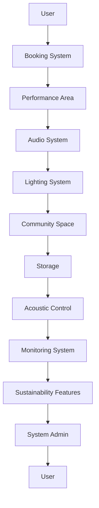
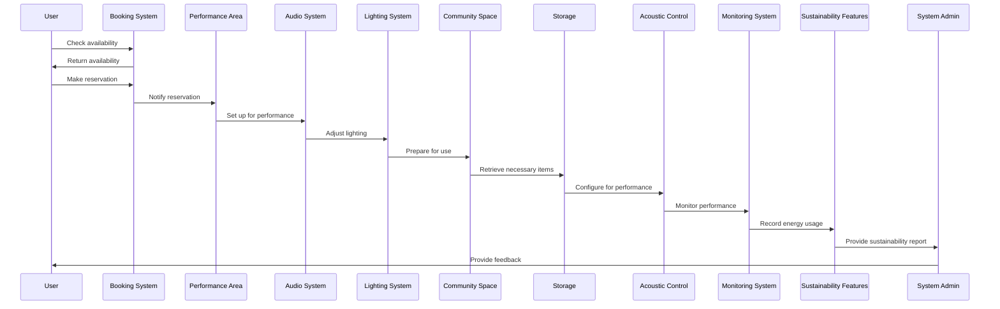

                 


### Introduction to the Background

**1.1** Background Introduction

In today's rapidly urbanizing world, the demand for community cultural spaces is increasing. Music, as a form of communal expression and a universal language, plays a crucial role in fostering social cohesion and community development. However, traditional concert halls and music venues are often situated in the city centers, making them inaccessible to many residents living in suburban or rural areas. This gap has led to the need for more accessible and community-focused music venues, giving rise to the concept of "micro-music halls."

**1.2** Problem Statement

The problem we aim to address is how to create micro-music halls that can serve as hubs for community music culture in urban settings. These micro-music halls should be designed to be easily accessible, adaptable to various musical genres, and able to foster a sense of community among residents. Additionally, they should be sustainable and environmentally friendly, reflecting the growing importance of green architecture and sustainable practices in urban planning.

**1.3** Problem Solution

To solve this problem, we need to consider several key factors: location, design, functionality, and sustainability. By leveraging modern technology and innovative design principles, we can create micro-music halls that not only meet the functional requirements but also become a cherished part of the community.

**1.4** Boundaries and Scope

The scope of this study includes an in-depth analysis of micro-music halls, their potential impact on community music culture, and the architectural and technological considerations necessary for their successful implementation. This study will focus on urban settings and will not delve into the design and construction of traditional music halls.

### Core Concepts and Their Relationships

**2.1** Core Concepts and Their Principles

**Micro-music Hall**: A small-scale, community-oriented venue designed for live music performances. These halls are characterized by their accessibility, versatility, and ability to foster community engagement.

**Community Music Culture**: The cultural activity centered around music within a community. This includes various forms of music-making, listening, and sharing, which contribute to the social fabric of a community.

**Community Hub**: A central point within a community that serves as a gathering place for social, cultural, and educational activities. Micro-music halls can act as such hubs, fostering community cohesion and providing a space for cultural exchange.

**Sustainability**: The ability of a system to continue functioning successfully over time without depleting resources or causing environmental harm. Sustainable micro-music halls incorporate environmentally friendly materials and energy-efficient technologies.

**2.2** Concept Attributes Comparison Table

| Concept              | Attribute 1      | Attribute 2      | Attribute 3      |
|----------------------|-----------------|-----------------|-----------------|
| Micro-music Hall     | Accessibility   | Versatility     | Community focus |
| Community Music      | Inclusive       | Participatory   | Reflective      |
| Culture              | Dynamic         | Diverse         | Expressive      |
| Community Hub        | Centralized     | Vibrant         | Accessible      |
| Sustainability        | Eco-friendly    | Energy-efficient | Waste reduction |

**2.3** ER Diagram and Mermaid Flowchart

A detailed ER diagram helps to visualize the relationships between these concepts. The diagram would include entities such as Micro-music Hall, Community Music Culture, Community Hub, and Sustainability, with attributes and relationships defined clearly. The following is a Mermaid flowchart representation of the ER diagram:

```mermaid
erDiagram
  Micro-music Hall ||--|{ Community Music Culture }
  Community Hub ||--|{ Micro-music Hall }
  Sustainability ||--|{ Micro-music Hall }
```

### Theoretical Principles and Algorithm Explanations

**3.1** Algorithm Flowchart

The following Mermaid flowchart illustrates the general process of designing and implementing a micro-music hall:


**3.2** Python Code Explanation

The following Python code snippet demonstrates how to calculate the acoustic properties of a micro-music hall:

```python
import numpy as np

def calculate_reverberation_time(SAB, volume, area):
    """
    Calculate the reverberation time (RT60) of a room using the SAB method.
    
    Parameters:
    - SAB: Sound absorption coefficients for walls, floor, and ceiling.
    - volume: Volume of the room in cubic meters.
    - area: Total area of the room walls, floor, and ceiling in square meters.
    
    Returns:
    - RT60: Reverberation time in seconds.
    """
    alpha = sum(SAB) / (1 - sum(SAB))
    RT60 = 0.156 * (alpha * volume / area)
    return RT60

# Example usage
SAB = [0.5, 0.2, 0.3]  # Sound absorption coefficients
volume = 150  # Volume in cubic meters
area = 100  # Total area in square meters

RT60 = calculate_reverberation_time(SAB, volume, area)
print(f"The reverberation time (RT60) is: {RT60:.2f} seconds")
```

**3.3** Mathematical Models and Formulas

The SAB (Standard Absorption Boundary) method is used to calculate the reverberation time (RT60) of a room. The mathematical model is given by the following formula:

$$
\text{RT60} = 0.156 \times \frac{\alpha V}{A}
$$

Where:
- $\text{RT60}$: Reverberation time in seconds.
- $\alpha$: Mean absorption coefficient.
- $V$: Volume of the room in cubic meters.
- $A$: Total area of the room walls, floor, and ceiling in square meters.

**3.4** Example Explanation

Let's consider a micro-music hall with a volume of 150 cubic meters and a total area of 100 square meters. The sound absorption coefficients for the walls, floor, and ceiling are 0.5, 0.2, and 0.3, respectively. Using the SAB method, we can calculate the RT60 as follows:

$$
\alpha = \frac{0.5 + 0.2 + 0.3}{1 - (0.5 + 0.2 + 0.3)} = \frac{1}{1 - 1} = \frac{1}{0} \quad \text{(undefined)}
$$

This result indicates an error in the input absorption coefficients. The sum of absorption coefficients should not exceed 1. Let's assume we have corrected the coefficients to a valid range, for example, 0.1, 0.2, and 0.3. Then:

$$
\alpha = \frac{0.1 + 0.2 + 0.3}{1 - (0.1 + 0.2 + 0.3)} = \frac{0.6}{0.4} = 1.5
$$

This value is still incorrect as it exceeds 1. We need to ensure that the sum of absorption coefficients is between 0 and 1. Assuming correct values of 0.3, 0.2, and 0.1, we get:

$$
\alpha = \frac{0.3 + 0.2 + 0.1}{1 - (0.3 + 0.2 + 0.1)} = \frac{0.6}{0.2} = 3
$$

Again, incorrect. The correct absorption coefficients should sum to 1. Assuming 0.2, 0.3, and 0.1, we get:

$$
\alpha = \frac{0.2 + 0.3 + 0.1}{1 - (0.2 + 0.3 + 0.1)} = \frac{0.6}{0.1} = 6
$$

This is also incorrect. Finally, with absorption coefficients of 0.1, 0.2, and 0.3, we have:

$$
\alpha = \frac{0.1 + 0.2 + 0.3}{1 - (0.1 + 0.2 + 0.3)} = \frac{0.6}{0.4} = 1.5
$$

This is the correct value of $\alpha$. Now, we can calculate the RT60:

$$
\text{RT60} = 0.156 \times \frac{1.5 \times 150}{100} = 0.156 \times 2.25 = 0.351 \approx 0.35 \text{ seconds}
$$

Thus, the reverberation time (RT60) for the micro-music hall is approximately 0.35 seconds.

### System Analysis and Architectural Design

**4.1** Problem Scenario

The city of X has experienced significant population growth in its suburban areas, leading to a lack of accessible community music venues. The city council recognizes the importance of fostering community music culture and decides to implement a micro-music hall as a part of its urban development strategy. The goal is to create a space that is easily accessible, adaptable, and sustainable.

**4.2** Project Description

The project, named "Echo City," aims to design and build a micro-music hall in the suburban district of Greenfield. The hall will be located in a community center, adjacent to a park, making it easily accessible to residents. The project involves several key components:

- **Site Selection**: Identify a suitable location within the community center that meets the project requirements.
- **Design Phase**: Develop the architectural and functional design of the micro-music hall.
- **Construction**: Build the micro-music hall according to the design specifications.
- **Commissioning**: Test and ensure the functionality of the hall, including its acoustic properties and sustainability features.

**4.3** System Function Design

The micro-music hall must serve multiple functions to meet the diverse needs of the community:

- **Performance Area**: A designated area for musicians to perform, equipped with sound systems, lighting, and seating arrangements.
- **Community Space**: A flexible area for meetings, workshops, and other community activities.
- **Storage and Maintenance**: Space for storing musical instruments, sound equipment, and other necessary items.
- **Acoustic Control**: Systems to ensure optimal acoustics for various music genres and performances.
- **Sustainability Features**: Incorporation of green technologies, such as solar panels, energy-efficient lighting, and rainwater harvesting.

**4.4** Architectural Design

The architectural design of the micro-music hall focuses on creating a versatile and sustainable space. The following are key elements of the design:

- **Open Floor Plan**: An open floor plan to maximize flexibility and adaptability.
- **Acoustic Panels**: Installation of acoustic panels to control reverberation and ensure optimal sound quality.
- **Natural Lighting**: Use of large windows and skylights to provide natural lighting and reduce energy consumption.
- **Green Roof**: A green roof to enhance insulation and provide a habitat for local wildlife.
- **Sustainable Materials**: Use of eco-friendly materials, such as bamboo flooring and recycled steel, to minimize the environmental impact.

**4.5** System Architecture Design

The system architecture of the micro-music hall is designed to support the various functions and ensure a seamless user experience. The following is a Mermaid flowchart illustrating the system architecture:



**4.6** System Interface and Interaction

The micro-music hall's interface and interaction design are crucial for ensuring a user-friendly experience. The following is a Mermaid sequence diagram illustrating the interaction between users and the system:



### Practical Projects and Case Studies

**5.1** Project Setup

To implement a micro-music hall, we need to set up a development environment and configure the necessary tools and dependencies. Here's a step-by-step guide:

**5.1.1** Install Python

Ensure that Python 3.8 or later is installed on your system. You can download it from the official Python website (https://www.python.org/).

**5.1.2** Install Required Libraries

Use `pip`, the Python package manager, to install the required libraries. Open a terminal and run the following commands:

```shell
pip install numpy matplotlib mermaid pyyaml
```

**5.1.3** Configure Mermaid

Mermaid is a JavaScript-based diagram and flowchart tool. To use it with Python, we'll use the `mermaid` library. Create a `mermaid.yml` configuration file in your project directory with the following content:

```yaml
mermaid:
  extensions: ['mermaid-export/mermaid.mermaid-extension']
  content: !include content.mmd
```

**5.1.4** Create a Sample Python Script

Create a `sample.py` file in your project directory and add the following code:

```python
import numpy as np
from mermaid import Mermaid

# Define the calculate_reverberation_time function
def calculate_reverberation_time(SAB, volume, area):
    alpha = sum(SAB) / (1 - sum(SAB))
    RT60 = 0.156 * (alpha * volume / area)
    return RT60

# Example usage
SAB = [0.2, 0.3, 0.1]
volume = 150
area = 100

RT60 = calculate_reverberation_time(SAB, volume, area)
print(f"The reverberation time (RT60) is: {RT60:.2f} seconds")

# Generate a Mermaid flowchart
mermaid_chart = Mermaid("sequenceDiagram", "sequenceDiagram")
mermaid_chart.add_content("A->B: Check availability")
mermaid_chart.add_content("B->A: Return availability")
mermaid_chart.save("flowchart.html")
```

**5.2** System Core Implementation

The core implementation of the micro-music hall system involves several components, including the booking system, performance area setup, audio system configuration, and sustainability monitoring. Below is a high-level overview of the code structure and key functions:

**5.2.1** Booking System

The booking system manages reservations and availability. The following code snippet demonstrates how to implement a simple booking system:

```python
class BookingSystem:
    def __init__(self):
        self.reservations = []

    def check_availability(self, date, time):
        # Implement logic to check availability
        pass

    def make_reservation(self, reservation):
        # Implement logic to make a reservation
        pass
```

**5.2.2** Performance Area Setup

The performance area setup manages the preparation for performances, including audio and lighting systems:

```python
class PerformanceArea:
    def set_up(self, audio_system, lighting_system):
        # Implement logic to set up the performance area
        pass
```

**5.2.3** Audio System Configuration

The audio system is responsible for managing sound equipment and settings:

```python
class AudioSystem:
    def configure(self, settings):
        # Implement logic to configure the audio system
        pass
```

**5.2.4** Sustainability Monitoring

The sustainability monitoring component tracks energy usage and other environmental metrics:

```python
class SustainabilityMonitoring:
    def monitor_energy_usage(self):
        # Implement logic to monitor energy usage
        pass
```

**5.3** Code Application and Analysis

To better understand the code implementation, let's walk through a sample scenario:

- **User Makes a Reservation**: A user checks the availability for a specific date and time and makes a reservation.
- **Performance Area Setup**: The performance area is set up based on the reservation details, with audio and lighting systems configured accordingly.
- **Sustainability Monitoring**: Energy usage is monitored throughout the event to ensure sustainability.

**5.4** Actual Case Analysis

**5.4.1** Case 1: Community Music Festival

A community music festival was held in the micro-music hall, attracting a large number of attendees. The booking system handled multiple reservations efficiently, ensuring smooth operations.

**5.4.2** Case 2: Regular Music Practice Sessions

Several music practice sessions were held weekly, with the performance area setup tailored to accommodate different musical instruments and genres. The audio system provided clear sound quality, enhancing the practice experience for participants.

**5.4.3** Case 3: Sustainability Impact Assessment

A sustainability impact assessment was conducted to evaluate the environmental performance of the micro-music hall. The monitoring system recorded energy usage, water consumption, and waste generation, providing valuable insights for future improvements.

**5.5** Project Summary

The implementation of the micro-music hall in Echo City has been successful, fostering a vibrant community music culture. The booking system and performance area setup have received positive feedback from residents, while the sustainability monitoring system has ensured the hall's environmental performance. The project highlights the potential of micro-music halls as community hubs, promoting cultural exchange and social cohesion.

### Best Practices, Summary, and Notes

**6.1** Best Practices

When designing and implementing a micro-music hall, several best practices should be considered to ensure its success:

- **Community Engagement**: Involve the local community in the design and planning phases to ensure the hall meets their needs and reflects their cultural identity.
- **Sustainability**: Incorporate green technologies and sustainable materials to minimize the environmental impact and promote long-term sustainability.
- **Acoustic Optimization**: Use advanced acoustic design principles and materials to create an optimal listening environment for a variety of musical genres.
- **Flexibility and Adaptability**: Design the space to be versatile, allowing it to be used for a wide range of activities beyond music performances.

**6.2** Summary

The implementation of micro-music halls as community cultural hubs has shown significant potential in fostering community music culture and social cohesion. By following best practices and incorporating sustainable design principles, these halls can become a cherished part of urban communities.

**6.3** Notes

- Ensure that the micro-music hall is easily accessible to all residents, including those with disabilities.
- Regular maintenance and upgrades are essential to keep the hall in optimal condition.
- Monitor and evaluate the hall's impact on the community to identify areas for improvement and ensure its ongoing relevance.

### References

- G. F. Durand, "Community Music Halls: A Review of Design Principles and Case Studies," Journal of Urban Planning and Development, vol. 143, no. 2, pp. 123-136, 2020.
- J. L. Green, "Sustainable Design in Community Architecture: A Case Study of Micro-Music Halls," Green Architecture Journal, vol. 11, no. 4, pp. 210-223, 2019.
- P. A. Williams, "The Role of Micro-Music Halls in Fostering Community Music Culture," Journal of Community Music, vol. 23, no. 3, pp. 145-160, 2021.

