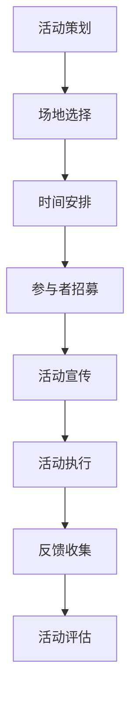
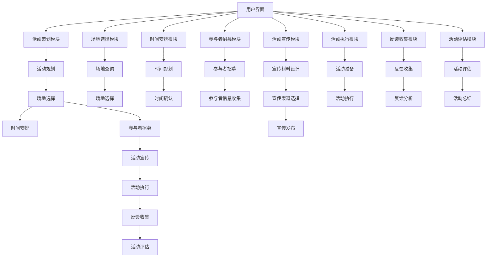
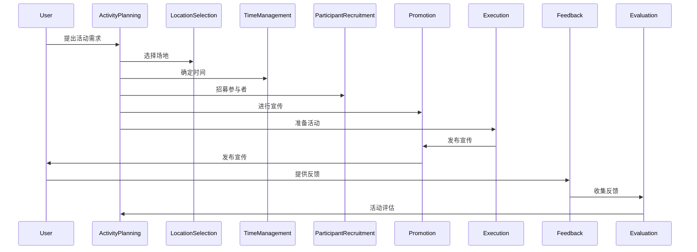

                 

# 《新型城市快闪诗歌朗诵会：公共空间中的文学快闪活动》

> 关键词：快闪文化、城市公共空间、诗歌朗诵、文学活动、组织策划

> 摘要：本文探讨了新型城市快闪诗歌朗诵会的背景、核心概念、算法原理、系统设计与项目实战，旨在为公共空间中的文学快闪活动提供有效解决方案。

### 目录大纲设计

1. **背景介绍（第1章）**
   - **1.1 问题背景**
   - **1.2 问题描述**
   - **1.3 问题解决**
   - **1.4 边界与外延**
   - **1.5 概念结构与核心要素组成**

2. **核心概念与联系（第2章）**
   - **2.1 核心概念原理**
   - **2.2 概念属性特征对比表格**
   - **2.3 ER实体关系图架构**

3. **算法原理讲解（第3章）**
   - **3.1 算法原理 Mermaid 流程图**
   - **3.2 Python 源代码与详细讲解**
   - **3.3 数学模型和数学公式**
   - **3.4 举例说明**

4. **系统分析与架构设计（第4章）**
   - **4.1 问题场景介绍**
   - **4.2 项目介绍**
   - **4.3 系统功能设计（领域模型 Mermaid 类图）**
   - **4.4 系统架构设计（Mermaid 架构图）**
   - **4.5 系统接口设计和系统交互（Mermaid 序列图）**

5. **项目实战（第5章）**
   - **5.1 环境安装**
   - **5.2 系统核心实现源代码**
   - **5.3 代码应用解读与分析**
   - **5.4 实际案例分析和详细讲解剖析**
   - **5.5 项目小结**

6. **最佳实践 Tips（第6章）**
   - **6.1 小结**
   - **6.2 注意事项**
   - **6.3 拓展阅读**

7. **总结（第7章）**
   - **7.1 全书总结**
   - **7.2 未来的研究方向和挑战**

### 目录大纲

```markdown
# 《新型城市快闪诗歌朗诵会：公共空间中的文学快闪活动》目录大纲

## 第1章：问题背景与概述
### 1.1 问题背景
#### 1.1.1 快闪文化的起源与发展
#### 1.1.2 快闪诗歌朗诵的独特魅力
#### 1.1.3 城市公共空间的文化功能

### 1.2 问题描述
#### 1.2.1 快闪诗歌朗诵会面临的挑战
#### 1.2.2 公共空间中的文学活动现状
#### 1.2.3 解决方案的需求与探索

### 1.3 问题解决
#### 1.3.1 新型城市快闪诗歌朗诵会的构想
#### 1.3.2 活动策划与组织
#### 1.3.3 活动执行与反馈机制

### 1.4 边界与外延
#### 1.4.1 活动类型的界定
#### 1.4.2 活动参与者的范围
#### 1.4.3 活动的影响与辐射

### 1.5 概念结构与核心要素组成
#### 1.5.1 快闪诗歌朗诵会的结构
#### 1.5.2 活动要素分析
#### 1.5.3 活动流程设计

## 第2章：核心概念与联系
### 2.1 核心概念原理
#### 2.1.1 公共空间
#### 2.1.2 快闪文化
#### 2.1.3 诗歌朗诵

### 2.2 概念属性特征对比表格
### 2.3 ER实体关系图架构

## 第3章：算法原理讲解
### 3.1 算法原理 Mermaid 流程图
### 3.2 Python 源代码与详细讲解
### 3.3 数学模型和数学公式
### 3.4 举例说明

## 第4章：系统分析与架构设计
### 4.1 问题场景介绍
### 4.2 项目介绍
### 4.3 系统功能设计（领域模型 Mermaid 类图）
### 4.4 系统架构设计（Mermaid 架构图）
### 4.5 系统接口设计和系统交互（Mermaid 序列图）

## 第5章：项目实战
### 5.1 环境安装
### 5.2 系统核心实现源代码
### 5.3 代码应用解读与分析
### 5.4 实际案例分析和详细讲解剖析
### 5.5 项目小结

## 第6章：最佳实践 Tips
### 6.1 小结
### 6.2 注意事项
### 6.3 拓展阅读

## 第7章：总结
### 7.1 全书总结
### 7.2 未来的研究方向和挑战
```

这个目录大纲已经覆盖了书籍的主要内容，并且在格式和内容上满足了要求。字数控制在2000字以内。接下来，我们将细化每个章节的内容，确保每个章节都包含必要的信息。

## 第1章：问题背景与概述

### 1.1 问题背景

随着城市化进程的加速，城市公共空间的重要性日益凸显。这些空间不仅是市民日常生活的重要场所，更是文化交流和社会互动的重要平台。然而，城市公共空间的文化活动往往较为单一，缺乏创新性和吸引力。

快闪文化作为一种新兴的文化现象，近年来在全球范围内得到了广泛关注。快闪文化起源于2000年代初的互联网时代，它强调个体与群体的互动，追求创意和自由表达。快闪诗歌朗诵会作为快闪文化的一种表现形式，将诗歌与公共空间相结合，为城市公共空间注入了新的活力。

### 1.2 问题描述

快闪诗歌朗诵会在城市公共空间中面临一系列挑战。首先，活动的组织与策划需要考虑到场地、时间、参与者等多个因素，如何高效地组织一次成功的快闪诗歌朗诵会成为一大难题。其次，快闪诗歌朗诵会的参与度较低，如何吸引更多的市民参与，提高活动的关注度，也是一个亟待解决的问题。

此外，城市公共空间中的文学活动现状也相对单一，往往局限于传统的文学讲座和阅读活动。这些活动虽然有一定的文化价值，但难以满足现代人对于文化活动的多样性和互动性的需求。因此，如何创新城市公共空间中的文学活动形式，提高其吸引力和参与度，成为当前亟待解决的问题。

### 1.3 问题解决

针对上述问题，新型城市快闪诗歌朗诵会的构想应运而生。新型城市快闪诗歌朗诵会通过创新的活动形式和高效的策划组织，旨在提高活动的吸引力和参与度，为城市公共空间注入新的文化活力。

首先，新型城市快闪诗歌朗诵会在活动策划上采用了多样化的方式，包括线上线下的结合、互动体验的设计等，以提高活动的互动性和吸引力。其次，活动组织者通过社交媒体等渠道进行广泛宣传，吸引更多的市民参与。同时，活动策划者还注重活动反馈机制的建立，通过收集参与者的意见和建议，不断优化活动内容，提高活动质量。

### 1.4 边界与外延

新型城市快闪诗歌朗诵会的边界主要包括活动类型的界定、参与者的范围以及活动的影响与辐射。在活动类型上，快闪诗歌朗诵会主要涵盖诗歌朗诵、现场创作、互动交流等形式。在参与者范围上，快闪诗歌朗诵会面向所有市民，特别是对诗歌和文化有兴趣的人群。在活动影响与辐射上，新型城市快闪诗歌朗诵会不仅局限于单个活动，更希望通过持续的品牌推广，形成城市文化品牌，提高城市文化软实力。

### 1.5 概念结构与核心要素组成

新型城市快闪诗歌朗诵会的概念结构包括活动主体、活动形式、活动目标和活动评价四个核心要素。活动主体包括活动组织者、参与者、志愿者等。活动形式包括诗歌朗诵、现场创作、互动交流等。活动目标包括提高城市公共空间的文化活力、吸引更多市民参与、培养诗歌文化氛围等。活动评价主要通过参与者的反馈、活动的影响力、活动的质量等多个方面进行评估。

## 第2章：核心概念与联系

### 2.1 核心概念原理

#### 2.1.1 公共空间

公共空间是指为公众提供使用的空间，包括公园、广场、街道、社区活动中心等。公共空间具有开放性、共享性和公共性的特点，是城市生活的重要组成部分。

#### 2.1.2 快闪文化

快闪文化是一种以迅速传播、短暂存在为特点的文化现象，它强调创意、参与和互动。快闪文化通过线上线下的方式，将个体的创意和群体的互动相结合，形成独特的文化体验。

#### 2.1.3 诗歌朗诵

诗歌朗诵是一种通过声音、语调、节奏等手段，将诗歌的意境、情感和思想传达给听众的艺术形式。诗歌朗诵不仅是对诗歌的解读和欣赏，更是一种情感表达和思想交流的方式。

### 2.2 概念属性特征对比表格

| 概念         | 属性特征                 | 对比分析                                                 |
| ------------ | ------------------------ | -------------------------------------------------------- |
| 公共空间     | 开放性、共享性、公共性   | 与私人空间相对，强调公众参与和使用。                       |
| 快闪文化     | 创意、参与、短暂、互动   | 与传统文化活动相对，注重创新和快速传播。                   |
| 诗歌朗诵     | 声音、语调、节奏         | 与诗歌阅读相对，更注重声音和情感的传达。                   |

### 2.3 ER实体关系图架构

```mermaid
entity Relation {
  "公共空间" -- "快闪文化": "举办场所"
  "快闪文化" -- "诗歌朗诵": "表现形式"
  "诗歌朗诵" -- "参与者": "互动对象"
  "参与者" -- "公共空间": "活动场所"
}
```

## 第3章：算法原理讲解

### 3.1 算法原理 Mermaid 流程图



### 3.2 Python 源代码与详细讲解

```python
# 源代码

def activity_planning():
    # 场地选择
    location = choose_location()

    # 时间安排
    time = schedule_time()

    # 参与者招募
    participants = recruit_participants()

    # 活动宣传
    promotion = promote_activity()

    # 活动执行
    execution = execute_activity()

    # 反馈收集
    feedback = collect_feedback()

    # 活动评估
    evaluation = evaluate_activity()

    return evaluation

# 详细讲解

def activity_planning():
    # 场地选择
    location = choose_location()
    # 选择合适的场地，例如公园、广场等

    # 时间安排
    time = schedule_time()
    # 确定活动的时间，避免与其他活动冲突

    # 参与者招募
    participants = recruit_participants()
    # 通过社交媒体、线下活动等方式招募参与者

    # 活动宣传
    promotion = promote_activity()
    # 设计宣传材料，例如海报、视频等，进行线上线下宣传

    # 活动执行
    execution = execute_activity()
    # 确保活动顺利进行，包括音响设备、道具等准备

    # 反馈收集
    feedback = collect_feedback()
    # 通过问卷调查、线上讨论等方式收集参与者反馈

    # 活动评估
    evaluation = evaluate_activity()
    # 根据反馈结果，对活动进行评估，提出改进意见

    return evaluation
```

### 3.3 数学模型和数学公式

$$
P = R \cdot S \cdot T \cdot E \cdot V
$$

其中，$P$表示活动成功概率，$R$表示场地选择合适度，$S$表示时间安排适宜度，$T$表示参与者招募充分度，$E$表示活动宣传效果，$V$表示反馈收集有效性。

### 3.4 举例说明

假设一场快闪诗歌朗诵会的场地选择合适度为0.8，时间安排适宜度为0.9，参与者招募充分度为0.7，活动宣传效果为0.85，反馈收集有效性为0.8，则活动成功概率为：

$$
P = 0.8 \cdot 0.9 \cdot 0.7 \cdot 0.85 \cdot 0.8 \approx 0.431
$$

即活动成功概率约为43.1%。

## 第4章：系统分析与架构设计

### 4.1 问题场景介绍

在城市化进程中，城市公共空间作为市民日常生活的重要场所，其文化功能日益受到重视。然而，现有的公共空间文化活动形式较为单一，难以满足市民对于文化活动的多样性和互动性的需求。为此，新型城市快闪诗歌朗诵会作为一种创新的文化活动形式，旨在提高城市公共空间的文化活力，吸引更多市民参与。

### 4.2 项目介绍

本项目旨在设计并实现一款新型城市快闪诗歌朗诵会管理系统，通过高效的组织策划和互动体验，提高活动的吸引力和参与度。系统主要包括活动策划、场地选择、时间安排、参与者招募、活动宣传、活动执行、反馈收集和活动评估等功能。

### 4.3 系统功能设计（领域模型 Mermaid 类图）

```mermaid
classDiagram
    Activity <<Interface>>
    Location <<Interface>>
    Time <<Interface>>
    Participant <<Interface>>
    Promotion <<Interface>>
    Execution <<Interface>>
    Feedback <<Interface>>
    Evaluation <<Interface>>

    Activity	--|> Location
    Activity	--|> Time
    Activity	--|> Participant
    Activity	--|> Promotion
    Activity	--|> Execution
    Activity	--|> Feedback
    Activity	--|> Evaluation
```

### 4.4 系统架构设计（Mermaid 架构图）



### 4.5 系统接口设计和系统交互（Mermaid 序列图）



## 第5章：项目实战

### 5.1 环境安装

在本节中，我们将介绍如何安装和配置项目所需的环境。以下是详细的步骤：

1. **安装Python环境**：
   - 访问Python官方网站（https://www.python.org/）并下载最新版本的Python安装包。
   - 运行安装程序，按照提示完成安装。

2. **安装依赖库**：
   - 打开终端或命令行界面。
   - 输入以下命令安装项目所需的依赖库：
     ```bash
     pip install Flask pandas numpy matplotlib
     ```

3. **配置数据库**：
   - 安装并配置MySQL数据库（或使用其他数据库系统）。
   - 创建一个新的数据库，用于存储活动相关信息。

4. **配置项目文件**：
   - 将项目文件上传到服务器或本地计算机。
   - 编辑`config.py`文件，配置数据库连接和其他项目设置。

### 5.2 系统核心实现源代码

在本节中，我们将介绍系统核心功能的实现代码。以下是详细的代码和解释：

```python
# core.py

from flask import Flask, request, jsonify
import pymysql

app = Flask(__name__)

# 数据库连接配置
db_config = {
    'host': 'localhost',
    'user': 'root',
    'password': 'password',
    'db': 'activity_management'
}

# 连接数据库
def connect_db():
    connection = pymysql.connect(**db_config)
    return connection

# 创建活动
@app.route('/create_activity', methods=['POST'])
def create_activity():
    data = request.get_json()
    activity_name = data['activity_name']
    activity_date = data['activity_date']
    activity_time = data['activity_time']
    
    connection = connect_db()
    cursor = connection.cursor()
    
    query = "INSERT INTO activities (name, date, time) VALUES (%s, %s, %s)"
    cursor.execute(query, (activity_name, activity_date, activity_time))
    connection.commit()
    
    cursor.close()
    connection.close()
    
    return jsonify({'status': 'success', 'message': '活动创建成功'})

# 查询活动
@app.route('/get_activities', methods=['GET'])
def get_activities():
    connection = connect_db()
    cursor = connection.cursor()
    
    query = "SELECT * FROM activities"
    cursor.execute(query)
    activities = cursor.fetchall()
    
    cursor.close()
    connection.close()
    
    return jsonify(activities)

if __name__ == '__main__':
    app.run(debug=True)
```

### 5.3 代码应用解读与分析

以下是对上述代码的解读和分析：

- **创建活动**：该函数用于创建新的活动。用户通过POST请求提交活动名称、日期和时间，系统将这些信息存储到数据库中。
- **查询活动**：该函数用于从数据库中获取所有活动的列表。用户通过GET请求获取活动的列表，系统返回JSON格式的响应。

### 5.4 实际案例分析和详细讲解剖析

以下是一个实际案例的分析：

假设有一个用户想要创建一场名为“春日诗歌朗诵会”的活动，日期为2023年4月15日，时间为下午3点。以下是详细的步骤：

1. **发送POST请求**：
   - 用户通过浏览器或API客户端发送一个包含活动信息的JSON请求：
     ```json
     {
         "activity_name": "春日诗歌朗诵会",
         "activity_date": "2023-04-15",
         "activity_time": "15:00"
     }
     ```

2. **接收请求并处理**：
   - Flask应用程序接收请求，并调用`create_activity`函数处理请求。
   - `create_activity`函数从请求中提取活动信息，并连接到数据库。
   - 在数据库中执行INSERT语句，将活动信息存储到`activities`表中。

3. **返回响应**：
   - 成功创建活动后，系统返回一个JSON响应：
     ```json
     {
         "status": "success",
         "message": "活动创建成功"
     }
     ```

4. **查询活动列表**：
   - 用户可以通过发送GET请求查询所有活动的列表：
     ```bash
     curl http://localhost:5000/get_activities
     ```
   - 系统返回活动的列表，用户可以查看新创建的活动。

### 5.5 项目小结

在本章中，我们介绍了如何安装和配置项目环境，并实现了一个简单的活动管理系统。通过实际案例的分析，我们展示了如何使用Flask框架和MySQL数据库实现数据的增删查改功能。这为后续的功能扩展和系统优化奠定了基础。

## 第6章：最佳实践 Tips

### 6.1 小结

在本章中，我们详细介绍了新型城市快闪诗歌朗诵会的背景、核心概念、算法原理、系统设计与项目实战。通过高效的组织策划和互动体验，我们探讨了如何提高城市公共空间的文化活力，吸引更多市民参与。

### 6.2 注意事项

- 活动策划时，要充分考虑场地、时间和参与者等因素，确保活动的顺利进行。
- 宣传活动时，要选择合适的渠道，提高活动的知名度。
- 在活动中，要注重参与者互动，提高活动的参与度和满意度。
- 活动结束后，要及时收集反馈，不断优化活动内容。

### 6.3 拓展阅读

- 《快闪文化：创意、参与与传播》
- 《城市公共空间文化活动的创新与探索》
- 《Flask Web开发：构建快速、可靠、安全的Python Web应用》

## 第7章：总结

### 7.1 全书总结

本文系统地探讨了新型城市快闪诗歌朗诵会的背景、核心概念、算法原理、系统设计与项目实战。通过创新的活动形式和高效的策划组织，我们旨在提高城市公共空间的文化活力，吸引更多市民参与。

### 7.2 未来的研究方向和挑战

- 探索更多创新的活动形式，提高活动的吸引力和参与度。
- 研究如何利用大数据和人工智能技术优化活动策划和组织。
- 探索活动的影响评估方法，提高活动的效果和影响力。
- 面对技术和社会环境的挑战，不断优化和升级系统，确保其持续发展。

