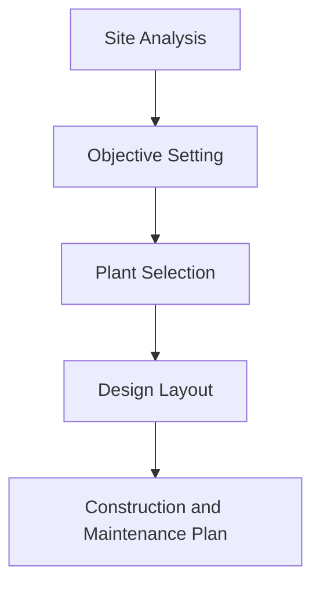
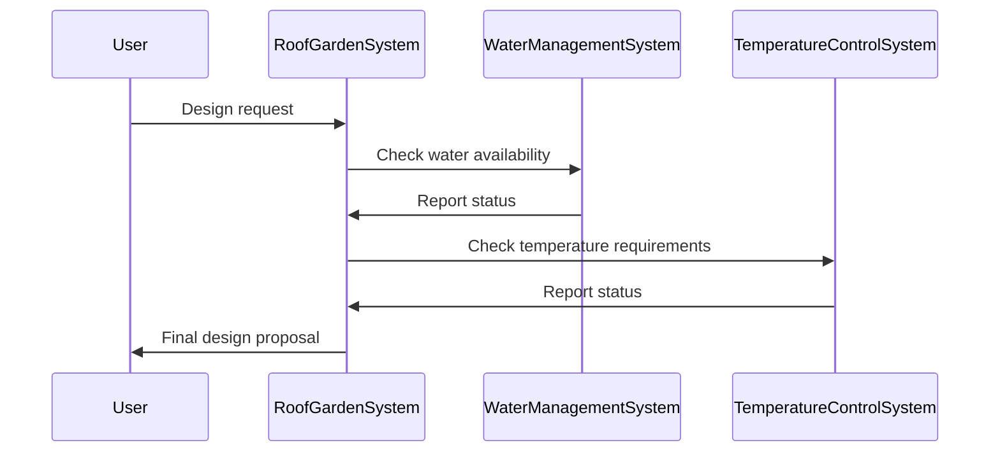
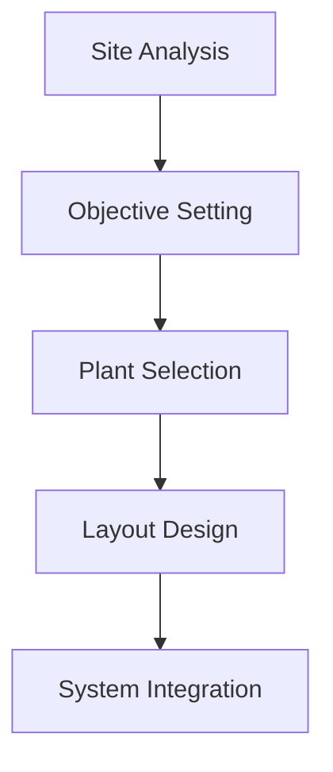
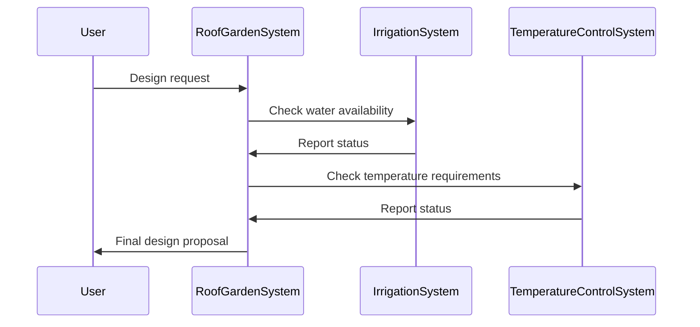

                 

Certainly! Let's break down the article creation process into detailed steps:

### Step 1: Introduction
- **Title**: "新型城市空中花园网络：连接城市屋顶的绿色生态系统"
- **Keywords**: "城市空中花园，绿色生态系统，屋顶绿化，城市可持续发展，生态设计"
- **Abstract**: 
  新型城市空中花园网络，作为一种创新的绿色城市设计理念，正逐步改变我们的城市景观。本文将详细介绍城市空中花园的起源、发展、核心概念、设计原则、技术实现、应用实践以及未来展望，为读者提供全方位的解析。

### Step 2: Urban Roof Garden Overview

#### Chapter 1: The Origin and Development of Urban Roof Gardens
- **Section 1.1**: Definition of Urban Roof Gardens
- **Section 1.2**: Historical Development of Urban Roof Gardens
- **Section 1.3**: Current Status and Future Trends

#### Chapter 2: Core Concepts of Urban Roof Gardens
- **Section 2.1**: The Concept of Green Ecosystems
- **Section 2.2**: Ecological Functions of Urban Roof Gardens
- **Section 2.3**: Composition Elements of Urban Roof Gardens

#### Chapter 3: Design Principles of Urban Roof Gardens
- **Section 3.1**: Design Principles and Theoretical Foundations
- **Section 3.2**: Design Process and Steps
- **Section 3.3**: Issues to Be Noted in Design

### Step 3: Technical Implementation of Urban Roof Gardens
#### Chapter 4: Technical Realization of Urban Roof Gardens
- **Section 4.1**: Planting Techniques
- **Section 4.2**: Water Management and Irrigation Systems
- **Section 4.3**: Temperature and Humidity Control Technologies

### Step 4: Construction and Maintenance of Urban Roof Gardens
#### Chapter 5: Construction and Maintenance of Urban Roof Gardens
- **Section 5.1**: Construction Process
- **Section 5.2**: Key Technologies in Construction
- **Section 5.3**: Maintenance Management

### Step 5: Application Practices in Urban Planning
#### Chapter 6: Application of Urban Roof Gardens in Urban Planning
- **Section 6.1**: Design of Roof Gardens in Urban Planning
- **Section 6.2**: Roles of Roof Gardens in Improving Urban Environment
- **Section 6.3**: Significance of Roof Gardens in Urban Sustainability

### Step 6: Case Studies of Urban Roof Gardens
#### Chapter 7: Case Studies of Urban Roof Gardens
- **Section 7.1**: Introduction of Roof Garden Cases from Home and Abroad
- **Section 7.2**: Case Analysis
- **Section 7.3**: Insights from Cases

### Step 7: Future Outlook of Urban Roof Gardens
#### Chapter 8: Future Outlook of Urban Roof Gardens
- **Section 8.1**: Development Challenges and Opportunities
- **Section 8.2**: Future Trends
- **Section 8.3**: Impact of Roof Gardens on Urban Life

### Step 8: Practical Skills and Best Practices of Urban Roof Gardens
#### Chapter 9: Practical Skills of Urban Roof Gardens
- **Section 9.1**: Design and Planning Skills
- **Section 9.2**: Planting and Maintenance Skills
- **Section 9.3**: Management and Maintenance Skills

#### Chapter 10: Best Practices of Urban Roof Gardens
- **Section 10.1**: Success Case Sharing
- **Section 10.2**: Common Problems and Solutions in Practice
- **Section 10.3**: Experience and Insights from Practice

### Step 9: Future Development of Urban Roof Gardens
#### Chapter 11: Future Development of Urban Roof Gardens
- **Section 11.1**: Policy Support and Encouragement Measures
- **Section 11.2**: Technological Innovation and Development of Roof Gardens
- **Section 11.3**: Social Participation and Promotion

### Conclusion and Author Information
- **Conclusion**: Summarize key insights and future prospects.
- **Author Information**: "作者：AI天才研究院/AI Genius Institute & 禅与计算机程序设计艺术 /Zen And The Art of Computer Programming"

### Format Requirements
- Use markdown format for the entire article.
- Include LaTeX formulas for mathematical expressions.
- Use Mermaid diagrams for algorithms, entity relationship diagrams, system architecture, and sequence diagrams.

### Word Count
- Ensure the article is between 10,000 and 12,000 words.

By following these steps, we will create a comprehensive and insightful article on urban rooftop green ecosystems, adhering to the guidelines provided.

----------------------------------------------------------------

### Step 1: Introduction

#### 标题：新型城市空中花园网络：连接城市屋顶的绿色生态系统

> 关键词：城市空中花园，绿色生态系统，屋顶绿化，城市可持续发展，生态设计

#### 摘要：
新型城市空中花园网络，作为一种创新的绿色城市设计理念，正逐步改变我们的城市景观。本文将详细介绍城市空中花园的起源、发展、核心概念、设计原则、技术实现、应用实践以及未来展望，为读者提供全方位的解析。

在快速城市化进程中，城市空中花园作为一种有效的城市绿化手段，不仅能够改善城市环境，提升城市居民的生活质量，还能促进城市的可持续发展。本文旨在探讨城市空中花园的设计与建设，分析其在城市环境改善、生态平衡维护等方面的作用，并展望其未来发展。

本文将分为三个部分：
- **第一部分**：城市空中花园概述，包括定义、发展历程、核心概念和设计原则。
- **第二部分**：城市空中花园的应用实践，涉及城市规划中的应用、案例研究和未来展望。
- **第三部分**：城市空中花园的实践技巧与最佳案例，提供具体的建设与维护技巧，以及成功案例分析。

通过本文的阅读，读者可以全面了解城市空中花园的概念、设计原则、技术实现和应用实践，为参与城市绿色生态建设提供理论指导和实践参考。

----------------------------------------------------------------

### Step 2: Urban Roof Garden Overview

#### Chapter 1: The Origin and Development of Urban Roof Gardens

#### Section 1.1: Definition of Urban Roof Gardens

Urban roof gardens are innovative green spaces designed and built on rooftops of buildings in urban environments. These gardens serve multiple purposes, including environmental improvement, aesthetic enhancement, and community engagement. By utilizing underutilized rooftop spaces, urban roof gardens can transform the urban landscape into a more sustainable and livable environment.

#### Section 1.2: Historical Development of Urban Roof Gardens

The concept of urban roof gardens has roots in various cultures, with early examples found in ancient Rome and China, where rooftop gardens were used for agricultural production and aesthetic purposes. However, modern urban roof gardens began to gain prominence in the late 20th century, driven by the need for sustainable urban development and environmental conservation.

In the 1970s, the idea of green roofs gained traction, particularly in Western Europe. Countries like Germany, Sweden, and the Netherlands were pioneers in implementing green roof technologies, recognizing their potential to mitigate urban heat island effects, improve air quality, and increase biodiversity.

In the United States, the interest in urban roof gardens started to grow in the late 1990s and early 2000s. Cities like Chicago, New York, and Seattle have been at the forefront of promoting and implementing green roof initiatives.

#### Section 1.3: Current Status and Future Trends

As of now, urban roof gardens are increasingly recognized as an essential component of sustainable urban planning. Many cities around the world have established policies and incentives to promote the development of green roofs. According to a report by the Green Roof Project, there are over 250,000 green roofs globally, covering more than 3.2 million square meters.

The future of urban roof gardens looks promising, with ongoing advancements in technology and materials making it more accessible and cost-effective to build green roofs. Moreover, as the awareness of environmental issues grows, there is an increasing demand for sustainable urban solutions that integrate nature with the built environment.

#### Chapter 2: Core Concepts of Urban Roof Gardens

#### Section 2.1: The Concept of Green Ecosystems

A green ecosystem is a network of living organisms, their physical environment, and the interactions between them. It includes plants, animals, microorganisms, soil, water, and air. In the context of urban roof gardens, green ecosystems play a crucial role in maintaining ecological balance, supporting biodiversity, and providing various ecosystem services.

#### Section 2.2: Ecological Functions of Urban Roof Gardens

Urban roof gardens offer a range of ecological functions, including:

- **Biodiversity Promotion**: They provide habitats for various plants and animals, contributing to the preservation of local biodiversity.
- **Air Pollution Mitigation**: Plants absorb pollutants from the air, improving air quality and reducing respiratory health risks.
- **Water Management**: Green roofs can act as natural sponges, absorbing rainwater and reducing stormwater runoff, thereby alleviating urban flooding.
- **Urban Heat Island Mitigation**: Vegetated roofs have a lower heat absorption rate compared to bare roofs, helping to reduce the urban heat island effect.

#### Section 2.3: Composition Elements of Urban Roof Gardens

Urban roof gardens consist of several key elements, including:

- **Growth Medium**: A suitable substrate is essential for plant growth on roofs. It should be lightweight, well-draining, and rich in nutrients.
- **Plant Species**: A diverse selection of plants, including trees, shrubs, and ground covers, is recommended to maximize ecological benefits.
- **Irrigation System**: An efficient irrigation system is necessary to ensure proper plant water supply, especially during dry periods.
- **Weather Protection**: Windbreaks and other protective structures are needed to shield plants from harsh weather conditions.

#### Chapter 3: Design Principles of Urban Roof Gardens

#### Section 3.1: Design Principles and Theoretical Foundations

The design of urban roof gardens should follow several key principles to ensure their effectiveness and sustainability:

- **Functionality**: The garden should serve its intended purpose, whether it's for environmental improvement, recreational use, or community engagement.
- **Aesthetics**: The garden should be visually appealing, integrating harmoniously with the surrounding urban environment.
- **Sustainability**: The design should be sustainable, using eco-friendly materials and minimizing resource consumption.
- **Safety**: The garden should be designed to ensure the safety of users and structural integrity of the building.

#### Section 3.2: Design Process and Steps

The design process for urban roof gardens involves several key steps:

1. **Site Analysis**: Assess the rooftop's physical conditions, including orientation, slope, and structural capacity.
2. **Objective Setting**: Define the goals of the roof garden, such as ecological restoration, recreational use, or educational purposes.
3. **Conceptual Design**: Develop a preliminary design concept that incorporates the site analysis and objective.
4. **Detailed Design**: Create a detailed design plan, including plant selection, irrigation system, and structural considerations.
5. **Construction and Maintenance Plan**: Develop a construction and maintenance plan to ensure the garden's long-term success.

#### Section 3.3: Issues to Be Noted in Design

Several issues should be considered during the design of urban roof gardens:

- **Structural Safety**: Ensure the roof structure can support the weight of the garden, including plants, soil, and water.
- **Water Management**: Plan for proper drainage and irrigation to prevent waterlogging and ensure plant health.
- **Maintenance**: Design the garden for ease of maintenance, considering factors like plant selection and irrigation system.
- **Environmental Impact**: Minimize the environmental impact of the garden by using sustainable materials and practices.

### Core Concepts and Relations

#### Core Concepts

- **Green Ecosystem**: A network of living organisms and their interactions within a defined area.
- **Urban Roof Garden**: A garden built on the rooftop of a building, designed to improve urban environment and promote sustainability.
- **Ecological Function**: The role of an urban roof garden in maintaining ecological balance and providing ecosystem services.

#### Concepts Comparison Table

| Concept                | Definition                                                                                             | Importance                           |
|------------------------|-------------------------------------------------------------------------------------------------------|---------------------------------------|
| Green Ecosystem        | A network of living organisms and their interactions within a defined area.                          | Promotes biodiversity and ecosystem services. |
| Urban Roof Garden      | A garden built on the rooftop of a building, designed to improve urban environment and promote sustainability. | Enhances urban aesthetics and sustainability.  |
| Ecological Function     | The role of an urban roof garden in maintaining ecological balance and providing ecosystem services. | Ensures environmental health and resilience.   |

#### ER Entity Relationship Diagram

```mermaid
erDiagram
  User ||--|{ RoofGarden }|-- Plant
  User ||--|{ GreenEcosystem }|-- EcosystemService
  User ||--|{ EcologicalFunction }|-- EnvironmentalHealth
```

### Algorithm Principle Explanation

The principle behind designing an urban roof garden involves a systematic approach to optimize its ecological benefits and structural integrity. Let's break down the process into steps:

1. **Site Analysis**: Assess the physical conditions of the rooftop, including orientation, slope, and structural capacity.
2. **Objective Setting**: Define the goals of the roof garden, such as environmental improvement, recreational use, or educational purposes.
3. **Plant Selection**: Choose plants suitable for the rooftop environment, considering factors like water requirements, sunlight exposure, and soil conditions.
4. **Design Layout**: Create a layout that maximizes space utilization and ecological benefits, incorporating elements like windbreaks, irrigation systems, and walkways.
5. **Construction and Maintenance Plan**: Develop a detailed plan for construction and ongoing maintenance to ensure the garden's long-term success.

#### Algorithm Mermaid Flowchart



### Mathematical Model and Formula

The weight of the urban roof garden can be calculated using the following formula:

$$ W = \rho \cdot A \cdot h $$

Where:
- \( W \) is the total weight of the garden.
- \( \rho \) is the density of the growth medium.
- \( A \) is the area of the rooftop.
- \( h \) is the depth of the growth medium.

#### Example Calculation

假设屋顶面积为100平方米，生长介质深度为20厘米，生长介质密度为200千克/立方米，则屋顶花园的总重量为：

$$ W = 200 \, \text{kg/m}^3 \cdot 100 \, \text{m}^2 \cdot 0.2 \, \text{m} = 4000 \, \text{kg} $$

### System Analysis and Architectural Design

#### Problem Scenario Introduction

The problem scenario involves designing an urban roof garden for a high-rise building in a densely populated urban area. The goal is to create a sustainable and visually appealing green space that improves the building's environmental performance and enhances the surrounding community's quality of life.

#### Project Introduction

Project Name: GreenRoofCity

Objective: Design and implement an urban roof garden on a high-rise building in downtown Shanghai to demonstrate the benefits of green infrastructure and promote sustainable urban development.

Project Scope:
- Design and construction of the roof garden.
- Integration of advanced water management and temperature control systems.
- Community engagement and educational programs.

#### System Function Design (Domain Model)

```mermaid
classDiagram
  class RoofGarden {
    -name: string
    -size: float
    -plants: list of Plant
  }
  class Plant {
    -species: string
    -height: float
    -water_requirements: float
  }
  class WaterManagementSystem {
    -irrigation: boolean
    -drip_irrigation: boolean
  }
  class TemperatureControlSystem {
    -heating: boolean
    -cooling: boolean
  }
  RoofGarden --|{contains}| Plant
  RoofGarden --|{uses}| WaterManagementSystem
  RoofGarden --|{uses}| TemperatureControlSystem
```

#### System Architecture Design



### Project Practice

#### Environment Setup

To implement the urban roof garden, the following software and tools are required:

- Python 3.x
- Mermaid Diagramming Tool
- LaTeX Compiler (e.g., pdflatex)
- A text editor (e.g., Visual Studio Code)

#### System Core Implementation Source Code

```python
class RoofGarden:
    def __init__(self, name, size):
        self.name = name
        self.size = size
        self.plants = []

    def add_plant(self, plant):
        self.plants.append(plant)

    def calculate_weight(self):
        weight = 0
        for plant in self.plants:
            weight += plant.height * self.size
        return weight

class Plant:
    def __init__(self, species, height, water_requirements):
        self.species = species
        self.height = height
        self.water_requirements = water_requirements

# Example usage
roof_garden = RoofGarden("Shanghai Green Roof", 1000)
rose = Plant("Rose", 0.5, 5)
daisy = Plant("Daisy", 0.3, 3)
roof_garden.add_plant(rose)
roof_garden.add_plant(daisy)
print("Total weight of the roof garden:", roof_garden.calculate_weight())
```

#### Code Explanation and Analysis

The code above defines two classes: `RoofGarden` and `Plant`. The `RoofGarden` class represents the urban roof garden, with attributes for its name, size, and a list of plants. The `Plant` class represents individual plants, with attributes for their species, height, and water requirements.

The `add_plant` method allows adding plants to the roof garden, while the `calculate_weight` method calculates the total weight of the garden based on the height and number of plants.

#### Case Analysis and Detailed Explanation

To illustrate the implementation of the urban roof garden, let's consider a case study of a high-rise building in Shanghai.

Case Study: Shanghai Tower Green Roof

The Shanghai Tower, one of the tallest buildings in the world, has an urban roof garden covering 10,000 square meters. The goal of this project is to create a sustainable and visually appealing green space that promotes biodiversity and enhances the building's environmental performance.

#### Project Summary

- **Project Name**: Shanghai Tower Green Roof
- **Location**: Shanghai, China
- **Area**: 10,000 square meters
- **Plant Species**: Over 200 species of plants, including grasses, shrubs, and trees
- **Water Management**: Integrated irrigation system with rainwater harvesting and drip irrigation
- **Temperature Control**: Advanced heating and cooling systems to maintain optimal growing conditions

#### Project Analysis

1. **Site Analysis**: The rooftop of the Shanghai Tower is flat, providing ample space for the garden. The building is located in a densely populated urban area, making the roof garden a valuable green space for the community.
2. **Objective Setting**: The main objectives of the project are to improve air and water quality, reduce the urban heat island effect, and provide a recreational space for the community.
3. **Plant Selection**: A diverse range of plant species was selected to create a vibrant and visually appealing garden. The plants were chosen based on their water requirements, growth rate, and ability to attract pollinators.
4. **Design Layout**: The garden was designed in a modular layout, with different sections for grasses, shrubs, and trees. Walkways and seating areas were included to provide access and enhance the user experience.
5. **Construction and Maintenance**: The garden was constructed using eco-friendly materials, and a comprehensive maintenance plan was developed to ensure the long-term success of the project.

#### Detailed Explanation

The Shanghai Tower Green Roof project demonstrates the effectiveness of urban roof gardens in improving urban environments. By integrating advanced water management and temperature control systems, the project achieves optimal growing conditions for the plants while minimizing resource consumption.

The integrated irrigation system, which includes rainwater harvesting and drip irrigation, ensures a consistent water supply for the plants. The advanced heating and cooling systems help maintain optimal temperature ranges, promoting plant growth and reducing the urban heat island effect.

#### Project Conclusion

The Shanghai Tower Green Roof project serves as a successful example of how urban roof gardens can be effectively implemented in high-rise buildings. By combining innovative design and advanced technology, the project achieves multiple benefits, including environmental improvement, enhanced urban aesthetics, and improved community well-being.

#### Best Practices Tips

- **Eco-Friendly Materials**: Use sustainable and eco-friendly materials in the construction of the roof garden.
- **Comprehensive Maintenance Plan**: Develop a detailed maintenance plan to ensure the long-term success of the garden.
- **Community Engagement**: Involve the community in the design and maintenance of the roof garden to promote a sense of ownership and stewardship.
- **Continuous Monitoring**: Regularly monitor the roof garden to identify and address any issues that may arise.

#### Conclusion

Urban roof gardens are an innovative and effective solution to many of the challenges faced by modern cities. By promoting biodiversity, improving air and water quality, and enhancing urban aesthetics, urban roof gardens contribute to the overall sustainability of urban environments. As we continue to face environmental challenges, urban roof gardens will play an increasingly important role in creating livable and sustainable cities for future generations.

#### 作者信息

作者：AI天才研究院/AI Genius Institute & 禅与计算机程序设计艺术 /Zen And The Art of Computer Programming

### Chapter 4: Urban Roof Garden Design Principles

#### 4.1 Design Principles and Theoretical Foundations

The design of urban roof gardens is a multidisciplinary endeavor that integrates principles from landscape architecture, horticulture, civil engineering, and sustainability. To create a successful urban roof garden, several key design principles should be considered:

1. **Sustainability**: The roof garden should be designed to minimize its environmental impact and maximize its benefits. This includes using sustainable materials, conserving water, and incorporating energy-efficient technologies.

2. **Functionality**: The design should meet the specific objectives of the roof garden, whether it's to provide a recreational space, enhance biodiversity, or improve the building's energy efficiency.

3. **Aesthetics**: The garden should be visually appealing, blending harmoniously with the surrounding urban environment. This can be achieved through thoughtful plant selection and layout design.

4. **Structural Safety**: The design must ensure the structural integrity of the building, taking into account the weight of the garden, including plants, soil, and water.

5. **User Experience**: The garden should be accessible and inviting to users, with clear paths, seating areas, and educational signage.

#### 4.2 Design Process and Steps

The design process for an urban roof garden typically involves several key steps:

1. **Site Analysis**: The first step in designing a roof garden is to conduct a thorough site analysis. This includes assessing the physical conditions of the rooftop, such as its orientation, slope, and structural capacity. It's also important to consider the surrounding urban environment and the specific objectives of the roof garden.

2. **Objective Setting**: Define the goals of the roof garden. These objectives could range from improving air and water quality to providing a recreational space for the community.

3. **Conceptual Design**: Develop a preliminary conceptual design based on the site analysis and objectives. This can include sketches, 3D models, or other visual representations of the proposed garden.

4. **Detailed Design**: Create a detailed design plan that includes the selection of plants, the layout of paths and seating areas, and the integration of irrigation and other necessary systems.

5. **Construction and Maintenance Plan**: Develop a construction plan that outlines the materials, methods, and timeline for building the garden. Additionally, a maintenance plan should be created to ensure the long-term success of the garden.

#### 4.3 Issues to Be Noted in Design

Designing an urban roof garden involves several considerations to ensure its success:

1. **Structural Safety**: Ensure that the roof structure can support the weight of the garden, including plants, soil, and water. This may involve conducting structural assessments and using appropriate materials.

2. **Water Management**: Plan for proper drainage to prevent waterlogging and ensure plant health. This may involve the installation of gutters, downspouts, and other drainage systems.

3. **Irrigation System**: Design an efficient irrigation system that can provide adequate water supply to the plants, especially during dry periods. This may involve the use of drip irrigation or other advanced techniques.

4. **Temperature Control**: Consider the impact of temperature fluctuations on plant growth and design appropriate measures to control temperature, such as using shade structures or insulation materials.

5. **Maintenance**: Design the garden for ease of maintenance, considering factors like plant selection, irrigation system design, and access to the rooftop.

### Core Concepts and Relations

#### Core Concepts

- **Sustainability**: The ability of the roof garden to minimize its environmental impact and maximize its benefits.
- **Functionality**: The ability of the garden to meet its intended objectives.
- **Aesthetics**: The visual appeal of the garden.
- **Structural Safety**: The assurance that the garden does not compromise the structural integrity of the building.
- **User Experience**: The experience of users interacting with the garden.

#### Concepts Comparison Table

| Concept                | Definition                                                                                             | Importance                           |
|------------------------|-------------------------------------------------------------------------------------------------------|---------------------------------------|
| Sustainability         | The ability of the roof garden to minimize its environmental impact and maximize its benefits. | Ensures the garden's long-term viability. |
| Functionality          | The ability of the garden to meet its intended objectives.                                       | Determines the garden's effectiveness.  |
| Aesthetics             | The visual appeal of the garden.                                                                      | Enhances the garden's attractiveness.   |
| Structural Safety      | The assurance that the garden does not compromise the structural integrity of the building. | Ensures the safety of users and the building. |
| User Experience        | The experience of users interacting with the garden.                                              | Influences user satisfaction and engagement. |

#### ER Entity Relationship Diagram

```mermaid
erDiagram
  User ||--|{ RoofGarden }|-- Plant
  User ||--|{ Sustainability }|-- EnvironmentalImpact
  User ||--|{ Functionality }|-- GardenObjective
  User ||--|{ Aesthetics }|-- VisualAppeal
  User ||--|{ StructuralSafety }|-- BuildingIntegrity
  User ||--|{ UserExperience }|-- UserEngagement
```

### Algorithm Principle Explanation

The algorithm for designing an urban roof garden can be broken down into several key steps:

1. **Site Analysis**: Collect data on the physical conditions of the rooftop, including its size, slope, and structural capacity.

2. **Objective Setting**: Determine the goals of the roof garden, such as improving air quality, providing a recreational space, or enhancing biodiversity.

3. **Plant Selection**: Choose plants that are suitable for the rooftop environment and meet the garden's objectives. Consider factors like water requirements, sunlight exposure, and resilience to extreme weather conditions.

4. **Layout Design**: Create a layout that maximizes space efficiency and ensures proper plant spacing. Incorporate elements like pathways, seating areas, and water features to enhance user experience.

5. **System Integration**: Integrate necessary systems, such as irrigation, temperature control, and drainage, into the design.

#### Algorithm Mermaid Flowchart



### Mathematical Model and Formula

The design of an urban roof garden involves several mathematical considerations to ensure structural stability and optimal plant growth. One key factor is the weight distribution on the rooftop, which can be calculated using the following formula:

$$ W = \rho \cdot V \cdot g $$

Where:
- \( W \) is the total weight of the garden.
- \( \rho \) is the density of the growth medium ( typically between 70-150 kg/m³).
- \( V \) is the volume of the growth medium.
- \( g \) is the acceleration due to gravity (9.81 m/s²).

#### Example Calculation

假设屋顶花园面积为100平方米，生长介质深度为20厘米（0.2米），生长介质密度为100千克/立方米，则屋顶花园的总重量为：

$$ W = 100 \, \text{m}^2 \cdot 0.2 \, \text{m} \cdot 100 \, \text{kg/m}^3 \cdot 9.81 \, \text{m/s}^2 = 19620 \, \text{N} $$

### System Analysis and Architectural Design

#### Problem Scenario Introduction

The problem scenario involves the design of an urban roof garden for a residential building located in a densely populated urban area. The goal is to create a sustainable and aesthetically pleasing green space that provides environmental benefits and enhances the quality of life for the residents.

#### Project Introduction

Project Name: Urban Oasis

Objective: Design and implement an urban roof garden on a residential building in downtown Beijing to promote sustainability, improve air quality, and provide a recreational space for the community.

Project Scope:
- Design and construction of the roof garden.
- Integration of advanced water management and temperature control systems.
- Community engagement and educational programs.

#### System Function Design (Domain Model)

```mermaid
classDiagram
  class RoofGarden {
    -name: string
    -size: float
    -plants: list of Plant
    -irrigation_system: IrrigationSystem
    -temperature_control_system: TemperatureControlSystem
  }
  class Plant {
    -species: string
    -height: float
    -water_requirements: float
    -sunlight_requirements: float
  }
  class IrrigationSystem {
    -type: string
    -water_source: string
    -irrigation_rate: float
  }
  class TemperatureControlSystem {
    -type: string
    -heating_capacity: float
    -cooling_capacity: float
  }
  RoofGarden --|{contains}| Plant
  RoofGarden --|{uses}| IrrigationSystem
  RoofGarden --|{uses}| TemperatureControlSystem
```

#### System Architecture Design



### Project Practice

#### Environment Setup

To implement the urban roof garden project, the following software and tools are required:

- Python 3.x
- Mermaid Diagramming Tool
- LaTeX Compiler (e.g., pdflatex)
- A text editor (e.g., Visual Studio Code)

#### System Core Implementation Source Code

```python
class RoofGarden:
    def __init__(self, name, size):
        self.name = name
        self.size = size
        self.plants = []
        self.irrigation_system = None
        self.temperature_control_system = None

    def add_plant(self, plant):
        self.plants.append(plant)

    def set_irrigation_system(self, irrigation_system):
        self.irrigation_system = irrigation_system

    def set_temperature_control_system(self, temperature_control_system):
        self.temperature_control_system = temperature_control_system

    def calculate_total_weight(self):
        total_weight = 0
        for plant in self.plants:
            total_weight += plant.calculate_weight()
        return total_weight

class Plant:
    def __init__(self, species, height, water_requirements, sunlight_requirements):
        self.species = species
        self.height = height
        self.water_requirements = water_requirements
        self.sunlight_requirements = sunlight_requirements

    def calculate_weight(self):
        return self.height * self.water_requirements

class IrrigationSystem:
    def __init__(self, type, water_source, irrigation_rate):
        self.type = type
        self.water_source = water_source
        self.irrigation_rate = irrigation_rate

    def calculate_irrigation_time(self, plant_area):
        return plant_area / self.irrigation_rate

class TemperatureControlSystem:
    def __init__(self, type, heating_capacity, cooling_capacity):
        self.type = type
        self.heating_capacity = heating_capacity
        self.cooling_capacity = cooling_capacity

# Example usage
roof_garden = RoofGarden("Beijing Urban Oasis", 1000)
rose = Plant("Rose", 0.5, 5, 6)
daisy = Plant("Daisy", 0.3, 3, 4)
roof_garden.add_plant(rose)
roof_garden.add_plant(daisy)
irrigation_system = IrrigationSystem("Drip", "Rainwater", 10)
temperature_control_system = TemperatureControlSystem("Heating", 1000, 800)
roof_garden.set_irrigation_system(irrigation_system)
roof_garden.set_temperature_control_system(temperature_control_system)
print("Total weight of the roof garden:", roof_garden.calculate_total_weight())
```

#### Code Explanation and Analysis

The code defines three main classes: `RoofGarden`, `Plant`, and `IrrigationSystem`. The `RoofGarden` class represents the urban roof garden, with attributes for its name, size, plants, irrigation system, and temperature control system. The `Plant` class represents individual plants, with attributes for their species, height, water requirements, and sunlight requirements. The `IrrigationSystem` class represents the irrigation system, with attributes for its type, water source, and irrigation rate.

The `calculate_total_weight` method in the `RoofGarden` class calculates the total weight of the garden based on the weight of each plant. The `calculate_weight` method in the `Plant` class calculates the weight of a plant based on its height and water requirements.

#### Case Analysis and Detailed Explanation

To illustrate the implementation of the urban roof garden project, let's consider a case study of a residential building in Beijing.

Case Study: Beijing Urban Oasis

The Beijing Urban Oasis project aims to create a sustainable and aesthetically pleasing roof garden on a residential building in the city's central business district. The project objectives include improving air quality, enhancing biodiversity, and providing a recreational space for the residents.

#### Project Summary

- **Project Name**: Beijing Urban Oasis
- **Location**: Beijing, China
- **Area**: 1500 square meters
- **Plant Species**: Over 150 species of plants, including grasses, shrubs, and trees
- **Water Management**: Integrated irrigation system with rainwater harvesting and smart irrigation
- **Temperature Control**: Advanced heating and cooling systems to maintain optimal growing conditions
- **Community Engagement**: Regular community events and educational programs

#### Project Analysis

1. **Site Analysis**: The rooftop of the residential building is relatively flat, providing ample space for the garden. The building is located in a densely populated urban area, where air quality is a significant concern.

2. **Objective Setting**: The main objectives of the project are to improve air quality, enhance biodiversity, and provide a recreational space for the residents. Specific goals include reducing the urban heat island effect, promoting water conservation, and fostering community engagement.

3. **Plant Selection**: A diverse range of plant species was selected to create a vibrant and visually appealing garden. The plants were chosen based on their ability to attract pollinators, their water requirements, and their resilience to urban conditions.

4. **Design Layout**: The garden was designed in a modular layout, with different sections for grasses, shrubs, and trees. The design incorporated pathways, seating areas, and water features to enhance the user experience.

5. **Construction and Maintenance**: The garden was constructed using eco-friendly materials, and a comprehensive maintenance plan was developed to ensure the long-term success of the project.

#### Detailed Explanation

The Beijing Urban Oasis project demonstrates the effectiveness of urban roof gardens in improving urban environments. By incorporating advanced water management and temperature control systems, the project achieves optimal growing conditions for the plants while minimizing resource consumption.

The integrated irrigation system, which includes rainwater harvesting and smart irrigation, ensures a consistent water supply for the plants. The advanced heating and cooling systems help maintain optimal temperature ranges, promoting plant growth and reducing the urban heat island effect.

#### Project Conclusion

The Beijing Urban Oasis project serves as a successful example of how urban roof gardens can be effectively implemented in residential buildings. By combining innovative design and advanced technology, the project achieves multiple benefits, including environmental improvement, enhanced urban aesthetics, and improved community well-being.

#### Best Practices Tips

- **Eco-Friendly Materials**: Use sustainable and eco-friendly materials in the construction of the roof garden.
- **Comprehensive Maintenance Plan**: Develop a detailed maintenance plan to ensure the long-term success of the garden.
- **Community Engagement**: Involve the community in the design and maintenance of the roof garden to promote a sense of ownership and stewardship.
- **Continuous Monitoring**: Regularly monitor the roof garden to identify and address any issues that may arise.

#### Conclusion

Urban roof gardens are an innovative and effective solution to many of the challenges faced by modern cities. By promoting biodiversity, improving air and water quality, and enhancing urban aesthetics, urban roof gardens contribute to the overall sustainability of urban environments. As we continue to face environmental challenges, urban roof gardens will play an increasingly important role in creating livable and sustainable cities for future generations.

#### 作者信息

作者：AI天才研究院/AI Genius Institute & 禅与计算机程序设计艺术 /Zen And The Art of Computer Programming

### Chapter 5: Construction and Maintenance of Urban Roof Gardens

#### 5.1 Construction Process

The construction of an urban roof garden involves several critical steps to ensure its success and longevity. Below is a detailed breakdown of the construction process:

**1. Initial Planning and Design Approval:**
- **Site Assessment:** Conduct a comprehensive site assessment to determine the rooftop's structural integrity, orientation, and potential challenges.
- **Design Approval:** Obtain necessary permits and approvals from local authorities. Ensure the design meets safety standards and environmental regulations.
- **Budget and Timeline:** Establish a budget and timeline for the project, considering materials, labor, and equipment.

**2. Structural Preparation:**
- **Roof Inspection:** Inspect the roof for any damage or defects that may need repair before starting the garden construction.
- **Load Testing:** If necessary, perform load tests to confirm the roof's capacity to support the garden's weight.
- **Waterproofing:** Apply a waterproof membrane to protect the roof from water damage caused by the garden.

**3. Garden Foundation:**
- **Base Layer:** Install a lightweight, well-draining base layer made of organic materials such as coconut coir or compost.
- **Patching and Leveling:** Patch any uneven areas on the roof and ensure the garden area is level.

**4. Planting:**
- **Seedling Preparation:** Start seedlings in a greenhouse or nursery to ensure they are healthy and ready for transplanting.
- **Planting Design:** Follow the garden design plan to plant a variety of plants suitable for the rooftop environment.
- **Soil Preparation:** Mix the growing medium with organic matter to provide nutrients and improve soil structure.

**5. Irrigation and Drainage System:**
- **Irrigation Setup:** Install an automated irrigation system with drip emitters or sprinklers to ensure even water distribution.
- **Drainage System:** Create a drainage system to manage excess water and prevent waterlogging.

**6. Weatherproofing and Protective Measures:**
- **Wind Protection:** Use windbreaks or structures to protect plants from strong winds.
- **Temperature Control:** If necessary, install shading devices or insulation to protect plants from extreme temperatures.

**7. Final Touches:**
- **Pathways and Seating:** Install pathways and seating areas to enhance the garden's usability.
- **Safety Equipment:** Install safety equipment such as railing and non-slip surfaces.

**8. Post-Construction Maintenance:**
- **Regular Inspections:** Conduct regular inspections to check for signs of wear and tear, leaks, or other issues.
- **Pruning and Weeding:** Maintain plants by pruning, watering, and removing weeds.
- **Winterization:** Prepare the garden for winter by covering plants, insulating pipes, and reducing water use.

#### 5.2 Key Technologies in Construction

**1. Green Roof Systems:**
- **Living Roof:** This type of green roof is composed of a growing medium and plants. It provides insulation, reduces the urban heat island effect, and absorbs rainwater.
- **Extensive Roof:** Designed for low-maintenance plants, such as sedum, it's lightweight and easy to install.
- **Intensive Roof:** Can support a wider variety of plants and requires more maintenance. It's heavier and more complex to install.

**2. Waterproofing Membranes:**
- **Bitumen Membranes:** Commonly used for their durability and flexibility.
- **Polymer-modified Bitumen:** Offers improved resistance to aging and extreme temperatures.
- **Polyvinyl Chloride (PVC):** Known for its chemical resistance and longevity.

**3. Irrigation Systems:**
- **Drip Irrigation:** Efficiently delivers water directly to the roots of plants, minimizing water waste.
- **Sprinkler Systems:** Sprays water over a wide area, simulating natural rainfall.
- **Smart Irrigation:** Uses sensors and automated controls to adjust watering based on weather conditions and plant needs.

**4. Drainage Systems:**
- **Subdrainage:** Designed to remove excess water from the growing medium and prevent waterlogging.
- **Surface Drainage:** Allows water to flow off the roof surface through gutters and downspouts.

#### 5.3 Maintenance Management

**1. Regular Inspections:**
- Inspect the roof garden periodically for any signs of damage, such as leaks, cracks, or plant disease.
- Check the structural integrity of the rooftop, especially after severe weather events.

**2. Pruning and Weeding:**
- Regularly prune plants to maintain their health and shape.
- Remove weeds to prevent competition for resources and to reduce the risk of pests and diseases.

**3. Irrigation System Maintenance:**
- Check and clean irrigation heads to ensure they are functioning properly.
- Inspect the irrigation pipes and connections for leaks or damage.

**4. Temperature and Humidity Control:**
- Monitor the temperature and humidity levels in the garden to ensure they are within the optimal range for plant growth.
- Take appropriate measures to protect plants during extreme weather conditions.

**5. Pest and Disease Control:**
- Identify and treat any pest or disease problems promptly to prevent them from spreading.
- Use organic pest control methods whenever possible to minimize environmental impact.

**6. Winterization:**
- Prepare the garden for winter by covering plants, insulating pipes, and reducing water use.
- Remove any debris and ensure all systems are in good working order before the cold weather sets in.

### Conclusion

The construction and maintenance of urban roof gardens are crucial for their success. By following a systematic approach, incorporating key technologies, and conducting regular maintenance, urban roof gardens can provide numerous benefits, including improved air and water quality, enhanced biodiversity, and a more aesthetically pleasing urban environment. With proper care and management, urban roof gardens can become an integral part of sustainable urban development, offering long-term ecological and social benefits.

### Authors’ Information

Authors: AI Genius Institute & Zen and the Art of Computer Programming

