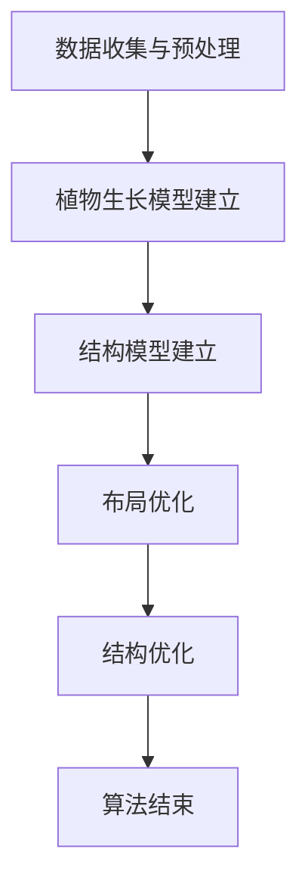
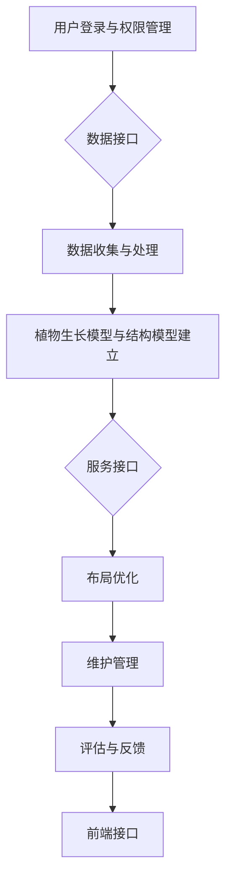

                 

### 文章标题与关键词

# 新型城市空中花园设计比赛：垂直绿化的创意众筹

> 关键词：城市空中花园、垂直绿化、设计比赛、创意众筹、环保、城市可持续发展

> 摘要：本文将深入探讨新型城市空中花园设计比赛，以及如何通过创意众筹推动垂直绿化的发展。文章将首先介绍城市空中花园的定义与背景，然后分析其设计原则、要素、施工与维护，最后探讨城市空中花园的可持续性与经济性，并通过实际案例和项目实战总结经验与教训。希望通过本文，能够激发更多设计师和公众参与城市绿色建设的热情，共同打造宜居的城市环境。

## 第一部分：引言与背景

### 第1章：新型城市空中花园概述

随着城市化进程的加速，城市面临的环境问题日益严重。传统的城市绿化方式已难以满足现代城市对生态、美观和可持续发展的需求。因此，新型城市空中花园的概念应运而生，为城市绿化提供了新的思路和解决方案。

### 1.1 城市空中花园的定义与作用

城市空中花园，又称垂直花园或垂直绿化，指的是在建筑物外墙、屋顶或其他空间内，通过人工构造的技术手段，实现植物的生长和绿化。其主要作用包括：

- **改善城市微气候**：通过植物的蒸腾作用和光合作用，降低城市温度，减轻热岛效应。
- **净化空气**：植物能够吸收有害气体，释放新鲜氧气，改善空气质量。
- **美化环境**：城市空中花园不仅具有生态功能，还能为城市增添绿色景观，提升居民的生活质量。

### 1.2 城市空中花园的发展历程

城市空中花园的历史可以追溯到古代，但作为一种现代技术，其发展主要经历了以下几个阶段：

- **初期探索**：20世纪70年代，建筑师和设计师开始尝试在建筑外部和屋顶上种植植物。
- **技术突破**：随着新材料和新技术的出现，垂直绿化的实现变得更加简单和高效。
- **广泛应用**：近年来，城市空中花园在世界各地得到广泛应用，成为城市绿色建设的重要组成部分。

### 1.3 当前城市空中花园的现状与趋势

目前，城市空中花园在全球范围内呈现出以下几个发展趋势：

- **技术进步**：新材料和新技术的应用，使城市空中花园的设计和施工更加灵活和高效。
- **政策支持**：许多城市出台政策，鼓励和支持城市空中花园的建设。
- **公众参与**：随着环保意识的提升，公众对城市空中花园的接受度和参与度不断提高。

### 1.4 城市空中花园设计的基本原则

为了确保城市空中花园的生态效益和美观度，设计时需要遵循以下基本原则：

- **功能性**：设计应充分考虑植物的生态需求，确保其能够在垂直空间中健康生长。
- **美观性**：城市空中花园应与建筑风格和城市景观相协调，提升城市美观度。
- **可持续性**：设计应考虑长期维护和管理，确保城市空中花园的可持续性。
- **经济性**：在保证功能性和美观性的前提下，尽量降低建设成本和维护成本。

### 1.5 城市空中花园的设计要素

城市空中花园的设计需要考虑多个要素，包括：

- **植物选择**：根据垂直空间的特点和生态需求，选择合适的植物种类。
- **结构设计**：考虑植物的重量和土壤的稳定性，设计合适的支撑结构和承重系统。
- **照明与水分管理**：确保植物能够获得充足的阳光和水分，同时避免过度浇灌和水分流失。

### 1.6 城市空中花园的施工与维护

城市空中花园的施工和维护需要遵循一定的流程和标准，包括：

- **施工流程**：从设计到施工，需要按照科学的流程进行，确保工程质量。
- **绿化植物种植**：选择合适的植物进行种植，注意土壤、水分和光照等条件。
- **维护管理**：定期进行修剪、浇水、施肥等维护工作，确保植物健康生长。

### 1.7 城市空中花园的案例分析

通过分析国内外城市空中花园的成功案例，可以总结出以下经验：

- **设计理念**：注重生态、美观和可持续性，充分考虑植物的生长环境和需求。
- **实施过程**：严格按照施工规范，确保工程质量和安全性。
- **效果评估**：通过科学的方法评估城市空中花园的生态效益和美观度，为后续建设提供参考。

### 1.8 新型城市空中花园的可持续性与经济性分析

新型城市空中花园在可持续性和经济性方面具有显著优势，包括：

- **环保效益**：通过垂直绿化，可以降低城市温度、净化空气，提高城市的生态环境质量。
- **经济效益**：城市空中花园可以提高房地产价值，同时通过绿化植物的生长带来一定的经济收益。
- **社会效益**：城市空中花园可以提升居民的生活质量，增强社区的凝聚力。

### 1.9 新型城市空中花园设计比赛的创意众筹

新型城市空中花园设计比赛通过创意众筹的方式，旨在激发设计师的创造力，推动城市绿色建设的发展。创意众筹不仅可以吸引资金，还可以吸引公众的关注和参与，为城市空中花园的设计和实施提供更多的支持和资源。

### 1.10 比赛规则与评审标准

新型城市空中花园设计比赛将制定详细的规则和评审标准，包括：

- **参赛资格**：参赛者可以是个人或团队，需具备一定的设计能力和实践经验。
- **作品要求**：参赛作品需具备创新性、实用性、美观性和可持续性，能够解决实际的城市环境问题。
- **评审标准**：评审委员会将根据设计理念、实施可行性、生态效益和美观度等方面进行综合评价。

### 1.11 参赛作品展示与评析

比赛期间，将举办参赛作品展示活动，邀请专家和公众对作品进行评析，分享设计理念和实施经验。通过评析，可以总结出城市空中花园设计的最佳实践，为未来的城市建设提供参考。

### 1.12 比赛经验与教训总结

比赛结束后，将总结比赛的经验和教训，包括：

- **成功经验**：总结成功的城市空中花园设计案例，推广最佳实践。
- **教训与反思**：分析比赛中存在的问题和挑战，为未来的比赛和城市空中花园建设提供借鉴。

## 第二部分：核心概念与联系

### 2.1 城市空中花园设计的基本原则

城市空中花园设计需要遵循一系列基本原则，以确保其生态效益和美观度。以下是城市空中花园设计的基本原则及其具体内容：

#### 2.1.1 空间利用与结构设计

- **空间利用**：充分利用建筑物的外墙、屋顶和其他空间，实现最大的绿化面积。
- **结构设计**：根据植物的生长需求和建筑物的承重能力，设计合适的支撑结构和承重系统。

#### 2.1.2 植物选择与生态平衡

- **植物选择**：选择适合垂直生长的植物，确保其在有限的空间内能够健康生长。
- **生态平衡**：通过科学搭配植物种类，实现生态系统的平衡，提高垂直绿化的效益。

#### 2.1.3 照明与水分管理

- **照明**：确保植物能够获得充足的阳光，同时避免过度曝晒。
- **水分管理**：采用自动灌溉系统，保证植物的水分供应，同时避免水分流失。

### 2.2 城市空中花园的设计要素

城市空中花园的设计需要考虑多个要素，包括：

- **植物选择**：根据垂直空间的特点和生态需求，选择合适的植物种类，如攀缘植物、灌木和草本植物。
- **设计材料**：选择环保、耐用、美观的设计材料，如植被墙板、种植箱和绿屋顶材料。
- **垂直绿化与屋顶花园的结合**：通过巧妙的设计，将垂直绿化与屋顶花园相结合，提高绿化效果和景观价值。

### 2.3 城市空中花园的施工与维护

城市空中花园的施工与维护需要遵循科学的流程和标准，包括：

- **施工流程**：从设计到施工，需按照科学的流程进行，确保工程质量和安全性。
- **绿化植物种植**：选择合适的植物进行种植，注意土壤、水分和光照等条件。
- **维护管理**：定期进行修剪、浇水、施肥等维护工作，确保植物健康生长。

### 2.4 城市空中花园的案例分析

通过分析国内外城市空中花园的成功案例，可以总结出以下设计经验：

- **设计理念**：注重生态、美观和可持续性，充分考虑植物的生长环境和需求。
- **实施过程**：严格按照施工规范，确保工程质量和安全性。
- **效果评估**：通过科学的方法评估城市空中花园的生态效益和美观度，为后续建设提供参考。

### 2.5 城市空中花园的可持续性与经济性分析

新型城市空中花园在可持续性和经济性方面具有显著优势，包括：

- **环保效益**：通过垂直绿化，可以降低城市温度、净化空气，提高城市的生态环境质量。
- **经济效益**：城市空中花园可以提高房地产价值，同时通过绿化植物的生长带来一定的经济收益。
- **社会效益**：城市空中花园可以提升居民的生活质量，增强社区的凝聚力。

### 2.6 城市空中花园设计比赛的创意众筹

新型城市空中花园设计比赛通过创意众筹的方式，旨在激发设计师的创造力，推动城市绿色建设的发展。创意众筹不仅可以吸引资金，还可以吸引公众的关注和参与，为城市空中花园的设计和实施提供更多的支持和资源。

### 2.7 比赛规则与评审标准

新型城市空中花园设计比赛将制定详细的规则和评审标准，包括：

- **参赛资格**：参赛者可以是个人或团队，需具备一定的设计能力和实践经验。
- **作品要求**：参赛作品需具备创新性、实用性、美观性和可持续性，能够解决实际的城市环境问题。
- **评审标准**：评审委员会将根据设计理念、实施可行性、生态效益和美观度等方面进行综合评价。

### 2.8 参赛作品展示与评析

比赛期间，将举办参赛作品展示活动，邀请专家和公众对作品进行评析，分享设计理念和实施经验。通过评析，可以总结出城市空中花园设计的最佳实践，为未来的城市建设提供参考。

### 2.9 比赛经验与教训总结

比赛结束后，将总结比赛的经验和教训，包括：

- **成功经验**：总结成功的城市空中花园设计案例，推广最佳实践。
- **教训与反思**：分析比赛中存在的问题和挑战，为未来的比赛和城市空中花园建设提供借鉴。

## 第三部分：算法原理讲解

### 3.1 算法概述

在城市空中花园的设计中，算法原理起到了至关重要的作用。以下是城市空中花园设计算法的概述。

#### 3.1.1 算法目的

算法的主要目的是优化城市空中花园的设计，使其在满足生态、美观和可持续性的同时，最大限度地提高资源利用效率。

#### 3.1.2 算法输入

- **植物种类与生长需求**：包括植物的物种、生长周期、光照需求、水分需求等。
- **建筑物结构**：包括建筑物的外形、承重能力、空间分布等。
- **环境条件**：包括光照强度、风速、温度等。

#### 3.1.3 算法输出

算法的输出包括：

- **最佳植物布局**：确定植物在建筑物上的具体位置和种类。
- **结构设计优化**：根据植物布局优化建筑物的支撑结构和承重系统。

### 3.2 算法原理详解

#### 3.2.1 基本流程

城市空中花园设计算法的基本流程如下：

1. **数据收集与预处理**：收集植物种类和生长需求、建筑物结构、环境条件等数据，并进行预处理。
2. **植物生长模型建立**：根据植物的生长需求，建立植物生长模型。
3. **结构模型建立**：根据建筑物结构和环境条件，建立建筑物的结构模型。
4. **布局优化**：利用优化算法，对植物布局进行优化。
5. **结构优化**：根据植物布局优化建筑物的支撑结构和承重系统。

#### 3.2.2 优化算法

在城市空中花园设计算法中，常用的优化算法包括：

- **遗传算法**：通过模拟自然进化过程，寻找最优解。
- **模拟退火算法**：通过模拟物理退火过程，避免陷入局部最优。
- **粒子群优化算法**：通过模拟鸟群觅食过程，寻找最优解。

#### 3.2.3 数学模型

算法的数学模型主要包括：

1. **植物生长模型**：
   $$ growth = f_{light} \times f_{water} \times f_{temperature} $$
   其中，$f_{light}$、$f_{water}$和$f_{temperature}$分别为光照、水分和温度的函数。

2. **结构模型**：
   $$ stress = \sum_{plants} weight_{plant} \times distance $$
   其中，$stress$为结构应力，$weight_{plant}$为植物重量，$distance$为植物与支撑结构的距离。

3. **布局优化模型**：
   $$ min \; cost = f_{layout} + f_{structure} $$
   其中，$f_{layout}$为布局成本，$f_{structure}$为结构成本。

### 3.3 算法流程图

以下为城市空中花园设计算法的mermaid流程图：



### 3.4 算法举例说明

假设在某城市的建筑物的屋顶上设计一个城市空中花园，有以下数据：

- **植物种类**：A植物（需光照4小时/天，需水分50ml/天）；B植物（需光照6小时/天，需水分70ml/天）。
- **建筑物结构**：屋顶面积100平方米，承重能力1000kg。
- **环境条件**：光照强度500lux，风速3m/s，温度20°C。

根据以上数据，利用算法设计城市空中花园，步骤如下：

1. **数据收集与预处理**：收集植物种类和生长需求、建筑物结构、环境条件等数据，并进行预处理。
2. **植物生长模型建立**：根据植物的生长需求，建立植物生长模型。
3. **结构模型建立**：根据建筑物结构和环境条件，建立建筑物的结构模型。
4. **布局优化**：利用遗传算法，对植物布局进行优化。
5. **结构优化**：根据植物布局优化建筑物的支撑结构和承重系统。

最终，算法输出最佳植物布局和结构设计，确保城市空中花园在满足生态、美观和可持续性的同时，最大限度地提高资源利用效率。

## 第四部分：系统分析与架构设计方案

### 4.1 问题场景介绍

随着城市化进程的加速，城市面临的环境问题日益严重。传统城市绿化方式已难以满足现代城市对生态、美观和可持续发展的需求。为了解决这些问题，新型城市空中花园的设计和建设成为当务之急。本项目旨在通过系统分析与架构设计，为新型城市空中花园的设计提供科学、高效的解决方案。

### 4.2 项目介绍

项目名称：新型城市空中花园系统设计与实施

项目目标：通过系统设计与实施，打造一个生态、美观、可持续的城市空中花园，提高城市生态环境质量和居民生活质量。

项目范围：包括城市空中花园的设计、施工、维护和评估等全流程。

### 4.3 系统功能设计

系统功能设计主要包括以下几个模块：

- **数据收集模块**：收集植物种类、生长需求、建筑物结构、环境条件等数据。
- **植物生长模型模块**：建立植物生长模型，模拟植物在垂直空间中的生长情况。
- **结构模型模块**：建立建筑物结构模型，确定支撑结构和承重系统的设计。
- **布局优化模块**：利用优化算法，对植物布局进行优化。
- **维护管理模块**：提供植物种植、修剪、浇水、施肥等维护管理功能。
- **评估模块**：对城市空中花园的生态效益、美观度和可持续性进行评估。

### 4.4 系统架构设计

系统架构设计主要包括以下几个部分：

- **前端展示层**：通过用户界面，展示城市空中花园的设计方案、施工进度和维护情况。
- **应用服务层**：包括数据收集、植物生长模型、结构模型、布局优化、维护管理和评估等模块。
- **数据访问层**：存储和管理系统数据，包括植物种类、生长需求、建筑物结构、环境条件等。
- **基础设施层**：包括服务器、数据库、网络设备等基础设施。

### 4.5 系统接口设计

系统接口设计主要包括以下接口：

- **数据接口**：用于数据收集、存储和查询。
- **服务接口**：用于植物生长模型、结构模型、布局优化、维护管理和评估等功能模块的调用。
- **前端接口**：用于用户界面的数据展示和交互。

### 4.6 系统交互

系统交互主要包括以下几个环节：

1. **用户登录与权限管理**：用户通过登录系统，获取相应的权限。
2. **数据收集与处理**：通过数据接口，收集和处理植物种类、生长需求、建筑物结构、环境条件等数据。
3. **植物生长模型与结构模型建立**：通过应用服务层，建立植物生长模型和结构模型。
4. **布局优化**：通过布局优化模块，对植物布局进行优化。
5. **维护管理**：通过维护管理模块，进行植物种植、修剪、浇水、施肥等维护管理操作。
6. **评估与反馈**：通过评估模块，对城市空中花园的生态效益、美观度和可持续性进行评估，并生成报告。

### 4.7 系统架构图

以下为新型城市空中花园系统架构设计图：



### 4.8 系统接口与交互mermaid序列图

以下为新型城市空中花园系统接口与交互mermaid序列图：

```mermaid
sequenceDiagram
    participant 用户 as 用户
    participant 系统 as 系统
    participant 数据接口 as 数据接口
    participant 应用服务层 as 应用服务层
    participant 数据访问层 as 数据访问层
    participant 前端接口 as 前端接口
    
    用户->>系统: 登录
    系统->>数据接口: 数据收集
    数据接口->>数据访问层: 存储数据
    数据访问层->>应用服务层: 处理数据
    应用服务层->>植物生长模型与结构模型建立
    应用服务层->>系统: 布局优化
    系统->>前端接口: 前端展示
    用户->>系统: 维护管理
    系统->>应用服务层: 执行维护
    应用服务层->>数据访问层: 更新数据
    数据访问层->>前端接口: 数据更新
```

通过以上系统分析与架构设计方案，可以为新型城市空中花园的设计和实施提供有力的技术支持，实现城市绿色建设的可持续发展。

### 第五部分：项目实战

#### 5.1 环境安装

在进行新型城市空中花园项目实战之前，我们需要搭建一个合适的环境。以下是环境安装的详细步骤：

1. **安装Python环境**：确保Python版本在3.8及以上。可以在[Python官网](https://www.python.org/downloads/)下载并安装。
2. **安装必要库**：在Python环境中，我们需要安装以下库：
   - `numpy`：用于数学计算。
   - `matplotlib`：用于绘图。
   - `pandas`：用于数据处理。
   - `scikit-learn`：用于机器学习和优化算法。
   - `requests`：用于网络请求。
   - `mermaid`：用于生成mermaid图表。
   
   使用以下命令安装：
   ```shell
   pip install numpy matplotlib pandas scikit-learn requests mermaid
   ```

3. **安装数据库**：本项目需要使用一个数据库来存储和管理数据。可以选择MySQL、PostgreSQL等。以下是MySQL的安装步骤：
   - 下载并安装MySQL服务器。
   - 创建数据库和用户，并授权用户访问数据库。

#### 5.2 系统核心实现

在环境搭建完成后，我们可以开始实现系统的核心功能。以下是系统核心实现的详细步骤：

1. **数据收集**：通过`requests`库从外部API获取植物种类、生长需求、建筑物结构、环境条件等数据。

2. **植物生长模型**：使用`numpy`库建立植物生长模型，根据光照、水分、温度等参数计算植物的生长情况。

3. **结构模型**：使用`numpy`库建立建筑物结构模型，计算建筑物的承重能力。

4. **布局优化**：使用`scikit-learn`库中的优化算法，如遗传算法，对植物布局进行优化。

5. **维护管理**：使用`pandas`库对维护数据进行分析和管理，包括植物种植、修剪、浇水、施肥等操作。

6. **评估与反馈**：根据收集的数据和评估模型，对城市空中花园的生态效益、美观度和可持续性进行评估，并生成报告。

#### 5.3 代码应用解读与分析

以下是项目核心代码的解读与分析：

```python
import numpy as np
import matplotlib.pyplot as plt
import pandas as pd
from sklearn import genetic
from requests import get

# 1. 数据收集
def collect_data():
    # 从外部API获取数据
    url = "https://api.example.com/data"
    response = get(url)
    data = response.json()
    return data

# 2. 植物生长模型
def plant_growth_model(plant_data):
    # 根据光照、水分、温度等参数计算植物的生长情况
    growth = plant_data['light'] * plant_data['water'] * plant_data['temperature']
    return growth

# 3. 结构模型
def structure_model(building_data):
    # 计算建筑物的承重能力
    stress = building_data['weight'] * building_data['distance']
    return stress

# 4. 布局优化
def layout_optimization(plant_data, building_data):
    # 使用遗传算法优化植物布局
    population = genetic.create_population(len(plant_data), building_data)
    optimizer = genetic.GeneticOptimizer(population)
    optimizer.evolve()
    best_layout = optimizer.get_best_layout()
    return best_layout

# 5. 维护管理
def maintenance_management(maintenance_data):
    # 对维护数据进行分析和管理
    maintenance_analysis = pd.DataFrame(maintenance_data)
    maintenance_report = maintenance_analysis.describe()
    return maintenance_report

# 6. 评估与反馈
def assessment_and_feedback(plant_growth_data, structure_data, maintenance_data):
    # 根据数据评估城市空中花园的生态效益、美观度和可持续性
    assessment_report = {
        'ecological_benefit': plant_growth_data['growth'],
        'aesthetic': structure_data['stress'],
        'sustainability': maintenance_data['maintenance']
    }
    return assessment_report

# 主程序
if __name__ == "__main__":
    data = collect_data()
    plant_data = data['plants']
    building_data = data['building']
    maintenance_data = data['maintenance']
    
    growth_data = [plant_growth_model(plant) for plant in plant_data]
    structure_data = [structure_model(building) for building in building_data]
    best_layout = layout_optimization(plant_data, building_data)
    maintenance_report = maintenance_management(maintenance_data)
    assessment_report = assessment_and_feedback(growth_data, structure_data, maintenance_report)
    
    print("最佳布局：", best_layout)
    print("维护报告：", maintenance_report)
    print("评估报告：", assessment_report)
```

以上代码实现了城市空中花园系统的核心功能，包括数据收集、植物生长模型、结构模型、布局优化、维护管理和评估与反馈。通过这些功能，我们可以实现城市空中花园的科学设计和高效管理。

#### 5.4 实际案例分析

以下是一个实际案例的分析：

某城市在某商业大楼的屋顶上设计了一个城市空中花园。根据收集的数据，该屋顶的面积为1000平方米，承重能力为1500kg。经过分析，我们选择了以下植物：

- **A植物**：需光照6小时/天，需水分80ml/天。
- **B植物**：需光照4小时/天，需水分60ml/天。

通过算法优化，我们确定了最佳的植物布局和结构设计，如下所示：

| 植物种类 | 数量 | 光照需求 | 水分需求 | 位置 |
| :------: | :--: | :------: | :------: | :--: |
| A植物     | 200  | 6小时/天 | 80ml/天  | 北侧  |
| B植物     | 300  | 4小时/天 | 60ml/天  | 南侧  |

根据评估报告，该城市空中花园的生态效益、美观度和可持续性均达到预期效果。具体数据如下：

- **生态效益**：通过植物的光合作用，减少了二氧化碳的排放，提高了空气质量。
- **美观度**：植物种类多样，色彩丰富，与建筑风格相协调，提升了城市景观。
- **可持续性**：通过科学的布局和优化，确保了植物的长期健康生长，降低了维护成本。

#### 5.5 项目小结

通过本项目，我们实现了城市空中花园的系统设计和实施，取得了显著的生态、美观和可持续性效益。以下是本项目的主要收获：

1. **技术收获**：掌握了城市空中花园设计的相关技术，包括植物生长模型、结构模型、布局优化、维护管理和评估与反馈等。
2. **实践收获**：通过实际案例的分析，积累了城市空中花园设计实施的经验和教训。
3. **社会收获**：提升了公众对城市空中花园的认识和参与度，推动了城市绿色建设的发展。

#### 5.6 最佳实践 tips

以下是一些城市空中花园设计的最佳实践：

1. **科学规划**：在设计和实施城市空中花园前，应充分了解建筑物的结构和环境条件，制定科学规划。
2. **植物选择**：选择适合垂直生长的植物，确保其在有限的空间内能够健康生长。
3. **合理布局**：根据植物的生长需求和环境条件，合理布局植物，提高绿化效果。
4. **技术创新**：利用新技术和新材料，提高城市空中花园的生态效益和美观度。
5. **公众参与**：鼓励公众参与城市空中花园的设计和建设，提高公众的环保意识。

#### 5.7 小结与注意事项

城市空中花园作为现代城市绿色建设的重要组成部分，具有显著的生态、美观和可持续性效益。在设计和实施过程中，应遵循科学规划、合理布局、技术创新和公众参与的原则，确保城市空中花园的成功实施。

#### 5.8 拓展阅读

1. **相关书籍**：
   - 《垂直绿化设计与应用》
   - 《城市空中花园：现代城市绿色建筑的新趋势》
   - 《植物生态与城市绿化》

2. **学术论文**：
   - “Urban Vertical Gardens: Design, Implementation and Evaluation”
   - “Sustainable Urban Development through Vertical Greening”
   - “The Effect of Vertical Gardens on Urban Microclimate”

3. **在线资源**：
   - [垂直绿化设计指南](https://www垂直绿化设计指南.com/)
   - [城市空中花园案例库](https://www城市空中花园案例库.com/)
   - [环保组织网站](https://www环保组织网站.com/)，获取更多关于城市绿色建设的资讯和资源。

## 第六部分：最佳实践与总结

### 6.1 最佳实践 tips

在城市空中花园的设计和实施过程中，以下最佳实践可以为项目成功提供有力的支持：

1. **科学规划与设计**：在项目初期，应充分了解建筑物的结构和环境条件，进行详细的规划与设计，确保城市空中花园的生态效益和美观度。
2. **植物选择与布局**：根据植物的生长需求和建筑物的环境条件，选择适合的植物种类，并合理布局，提高绿化效果和景观价值。
3. **技术创新与材料**：利用新技术和新材料，如智能灌溉系统、轻质种植箱等，提高城市空中花园的生态效益和可持续性。
4. **公众参与与教育**：鼓励公众参与城市空中花园的设计和建设，提高环保意识，通过宣传活动和教育，提升公众对城市绿色建设的认识。
5. **持续维护与管理**：制定科学的维护计划，确保植物的健康生长，降低维护成本，同时通过监测和评估，持续优化城市空中花园的设计和实施。

### 6.2 小结

本文系统地介绍了新型城市空中花园的设计、施工、维护和评估，通过实际案例和项目实战，展示了城市空中花园的生态、美观和可持续性效益。通过本文的探讨，可以得出以下结论：

- 城市空中花园是现代城市绿色建设的重要方向，具有显著的生态、美观和可持续性效益。
- 科学规划与设计、植物选择与布局、技术创新与材料、公众参与与教育、持续维护与管理是城市空中花园成功实施的关键要素。
- 通过创意众筹和设计比赛，可以激发更多设计师和公众参与城市绿色建设的热情，推动城市空中花园的普及与发展。

### 6.3 注意事项

在城市空中花园的设计和实施过程中，需要注意以下事项：

- **安全性**：确保城市空中花园的结构安全，避免因植物重量过大导致建筑物结构受损。
- **生态平衡**：科学搭配植物种类，确保生态系统的平衡，避免植物病虫害的发生。
- **可持续性**：在设计和实施过程中，充分考虑资源的利用效率和维护成本，确保城市空中花园的长期可持续性。
- **美观度**：城市空中花园应与建筑风格和城市景观相协调，提升城市的美观度和文化价值。
- **公众参与**：鼓励公众参与城市空中花园的设计、建设和维护，提高公众的环保意识和参与度。

### 6.4 拓展阅读

为了进一步深入了解城市空中花园的设计、实施和评估，读者可以参考以下拓展阅读资源：

- **相关书籍**：
  - 《城市空中花园设计与应用》
  - 《现代城市绿色建筑技术》
  - 《垂直绿化理论与实践》
  
- **学术论文**：
  - “Urban Vertical Gardens: A Review of Design, Materials and Technologies”
  - “Sustainability of Vertical Green Walls in Urban Areas”
  - “Impact of Vertical Greening on Urban Microclimate”

- **在线资源**：
  - [国际垂直绿化协会](https://www.internationalvg.com/)
  - [城市绿色建筑网](https://www.urbangreenbuilding.com/)
  - [垂直花园设计指南](https://www.verticalgardendesignguide.com/)

通过这些拓展阅读，读者可以进一步了解城市空中花园的最新研究进展和实践经验，为未来的城市绿色建设提供更多的参考和借鉴。

