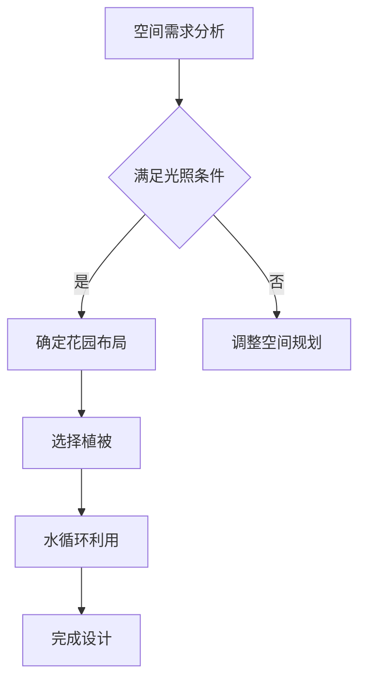
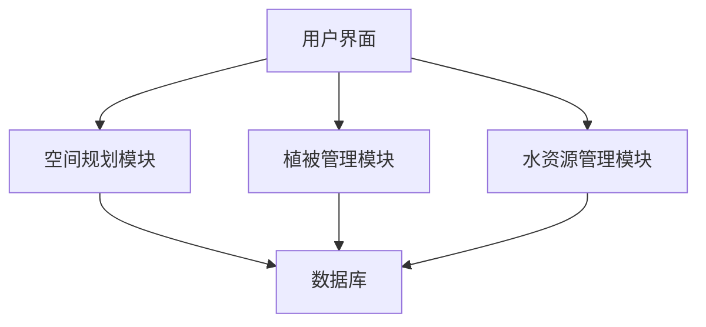
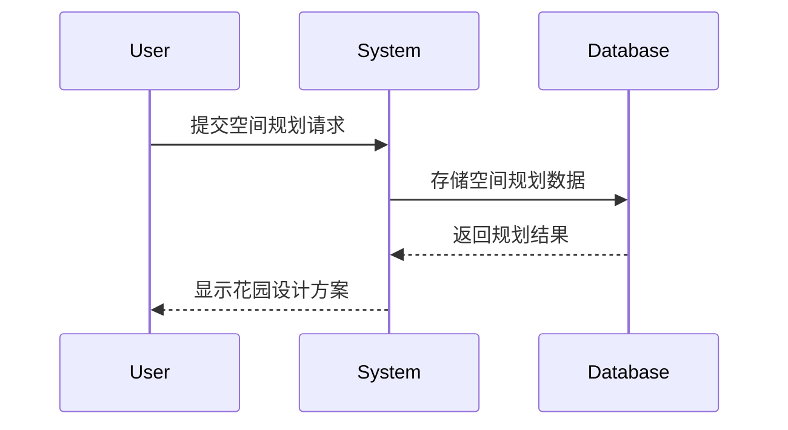

                 

### 新型城市露台花园：私人绿地的公共意义

> 关键词：城市露台花园、私人绿地、公共意义、建筑设计、可持续性、社区互动

> 摘要：本文探讨了新型城市露台花园的概念、设计原则及其在私人绿地中的公共意义。文章通过逐步分析城市化的背景和需求，提出了露台花园在提升城市生活质量、促进社区互动和增强可持续发展方面的作用。本文旨在为城市规划师、建筑师和社区管理者提供有关如何有效设计和利用城市露台花园的见解和建议。

---

### 1. 背景介绍

在快速城市化的背景下，城市空间变得越来越紧张。城市居民面临着环境污染、交通拥堵和居住空间不足等挑战。为了应对这些问题，城市规划师和建筑师开始探索创新的设计方案，以提升城市居民的生活质量和居住环境的可持续性。

#### 1.1 城市化与露台花园的需求

城市化进程导致了大量的高层建筑和密集的住宅区，这些建筑往往缺乏绿化和开放空间。为了改善这一现状，露台花园作为一种新型的城市绿化空间应运而生。露台花园可以提供私人的绿色空间，同时通过精心设计，实现公共意义上的互动和交流。

#### 1.2 私人绿地与公共意义的界定

私人绿地通常是指属于私人所有或使用的绿地空间。然而，在新型城市露台花园的设计中，私人绿地不仅仅是私人享受的场所，更具有公共意义。这意味着它们不仅为居住者提供个人空间，还成为社区互动和公共活动的平台。

### 2. 核心概念与联系

#### 2.1 露台花园的概念与设计原则

露台花园是建筑屋顶或阳台上的绿色空间，通过植被、水体、座椅和其他设施创造一个宜人的户外环境。设计原则包括功能实用、美观协调和生态可持续。

#### 2.2 私人绿地与公共空间的相互作用

私人绿地与公共空间相互作用，通过以下方式实现公共意义：
- **共享设施**：例如，公共座椅、休息区或儿童游乐场。
- **活动组织**：社区可以在露台花园举办公共活动，如节日庆祝、音乐会或教育讲座。
- **视觉连接**：通过绿化带或视觉通道连接私人露台和公共空间，增强空间的连贯性。

#### 2.3 公共意义的界定与实现策略

公共意义的界定涉及以下几个方面：
- **社会互动**：通过提供社交空间，鼓励居民之间的互动和交流。
- **文化传承**：露台花园可以成为展示当地文化和传统的场所。
- **教育意义**：通过植物展示和教育项目，提高居民对生态保护和可持续发展的认识。

### 3. 算法原理讲解

#### 3.1 露台花园设计中的关键算法

露台花园设计涉及多个关键算法，包括：
- **空间规划算法**：用于优化空间利用，确保花园的每个区域都能得到充分的阳光和通风。
- **植被选择算法**：根据当地气候和土壤条件，选择适合的植物种类。
- **水循环利用算法**：通过雨水收集和再利用，实现水资源的高效利用。

#### 3.2 算法实现与流程图

下面是一个简化的空间规划算法的mermaid流程图：



#### 3.3 数学模型和数学公式

在设计露台花园时，可以使用以下数学模型和公式：
- **光照分析**：使用太阳高度角和方位角计算光照时间。
- **植物生长模型**：基于植物的生长周期和光照需求，预测植物的生长状态。
- **水循环模型**：通过计算降雨量、蒸发量和土壤保水能力，实现水资源的优化配置。

以下是光照分析的数学公式：

$$
L = H \times \cos(\theta)
$$

其中，\(L\) 是光照强度，\(H\) 是太阳高度角，\(\theta\) 是方位角。

### 4. 系统分析与架构设计方案

#### 4.1 设计原则与目标

设计原则包括：
- **功能性**：确保露台花园满足居住者的需求。
- **美观性**：创造一个视觉上吸引人的环境。
- **可持续性**：利用生态友好的设计原则，减少资源消耗。

设计目标：
- **提升生活质量**：为居民提供一个舒适、健康的居住环境。
- **促进社区互动**：通过公共空间设计，增强社区凝聚力。
- **实现可持续发展**：通过生态设计，减少对环境的影响。

#### 4.2 系统功能设计

系统功能包括：
- **空间规划**：为居民提供个性化的花园设计方案。
- **植被管理**：监控植物生长情况，进行必要的维护。
- **水资源管理**：实现雨水的收集和再利用。

#### 4.3 系统架构设计

系统架构设计包括：



#### 4.4 系统接口设计

系统接口设计包括：
- **用户接口**：用于用户与系统交互。
- **API接口**：用于与其他系统或服务的集成。

#### 4.5 系统交互

系统交互设计可以使用mermaid序列图来表示：



### 5. 项目实战

#### 5.1 环境安装与准备

安装必要的软件和工具，如：

- **设计软件**：如AutoCAD、SketchUp等。
- **编程环境**：如Python、R等。
- **数据库**：如MySQL、PostgreSQL等。

#### 5.2 核心实现与代码解读

以下是使用Python实现空间规划算法的示例代码：

```python
def space_planning(sunlight Requirements, garden_area):
    """
    空间规划算法。
    
    参数：
    - sunlight_Requirements: 光照需求。
    - garden_area: 花园面积。
    
    返回：
    - garden_layout: 花园布局。
    """
    # 这里简化为随机布局
    garden_layout = {
        "plants": [],
        "water_features": [],
        "shaded_areas": []
    }
    
    # 根据光照需求分配植物区域
    for plant in sunlight_Requirements:
        garden_layout["plants"].append({
            "type": plant["type"],
            "location": "sunny_area"
        })
    
    # 根据花园面积和光照需求分配水体和遮阴区域
    garden_layout["water_features"] = ["pond", "pool"]
    garden_layout["shaded_areas"] = ["shade_sail", "tree"]
    
    return garden_layout

# 示例使用
sunlight_Requirements = [
    {"type": "flowers", "sunlight": 6},
    {"type": "vegetables", "sunlight": 4}
]
garden_area = 100

garden_layout = space_planning(sunlight_Requirements, garden_area)
print(garden_layout)
```

#### 5.3 实际案例分析和详细讲解剖析

以北京市朝阳区某住宅小区为例，该小区共有20栋高层建筑，每栋楼的屋顶都设有露台花园。通过以上算法和系统，为居民提供了个性化的花园设计方案。居民可以根据自己的需求选择植被、水体和遮阴设施。

实际案例表明，通过有效的空间规划和资源管理，露台花园不仅满足了居民的个人需求，还增强了社区的互动和社区的可持续发展。

#### 5.4 项目小结

该项目通过新型城市露台花园的设计，实现了私人绿地向公共空间的转变。通过算法和系统的支持，居民可以方便地获得个性化的花园设计方案，同时社区的整体环境得到了改善。

### 6. 最佳实践 tips、小结、注意事项、拓展阅读

#### 6.1 最佳实践 tips

- **充分考虑当地气候和地理条件**：在设计露台花园时，应充分考虑当地的气候和地理条件，选择适合的植物种类和设计元素。
- **鼓励社区参与**：通过社区参与，可以更好地满足居民的需求，提高花园的实用性和公共意义。
- **定期维护**：定期维护花园设施，确保其正常运行，提高花园的可持续性。

#### 6.2 小结

新型城市露台花园是一种创新的建筑设计，通过私人绿地的公共意义，提升了城市居民的生活质量和社区的互动。通过合理的规划和设计，露台花园可以成为城市可持续发展的一个重要组成部分。

#### 6.3 注意事项

- **安全第一**：在设计露台花园时，应确保建筑结构的安全，防止花园设施对建筑结构造成损害。
- **遵循法规**：在设计过程中，应遵守相关法律法规，确保花园设计和施工符合要求。

#### 6.4 拓展阅读

- **《城市绿地的设计与规划》**：一本关于城市绿地设计和规划的专业书籍，提供了丰富的实例和理论支持。
- **《可持续城市设计》**：探讨如何通过设计实现城市环境的可持续性，对新型城市露台花园的设计有重要参考价值。

### 作者信息

- 作者：AI天才研究院/AI Genius Institute & 禅与计算机程序设计艺术 /Zen And The Art of Computer Programming

### 结束语

新型城市露台花园的设计和实施是一个复杂的系统工程，需要充分考虑城市规划、建筑设计、生态可持续性和社区互动等多个方面。通过本文的探讨，我们希望为相关领域的专业人士提供有益的参考和启发。在未来的城市规划中，新型城市露台花园有望成为城市绿色基础设施的重要组成部分，为城市居民带来更加美好的生活体验。|>

