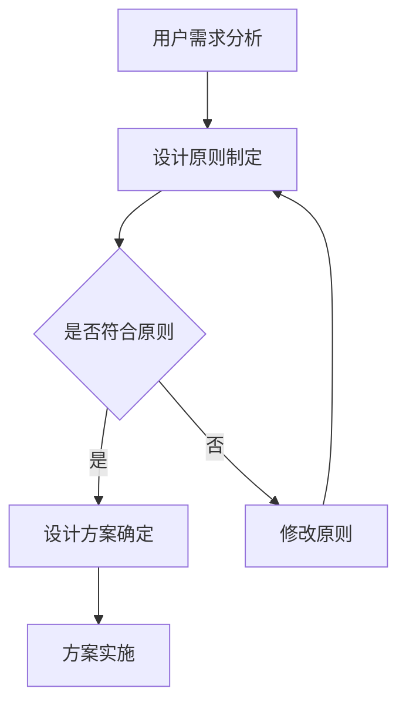
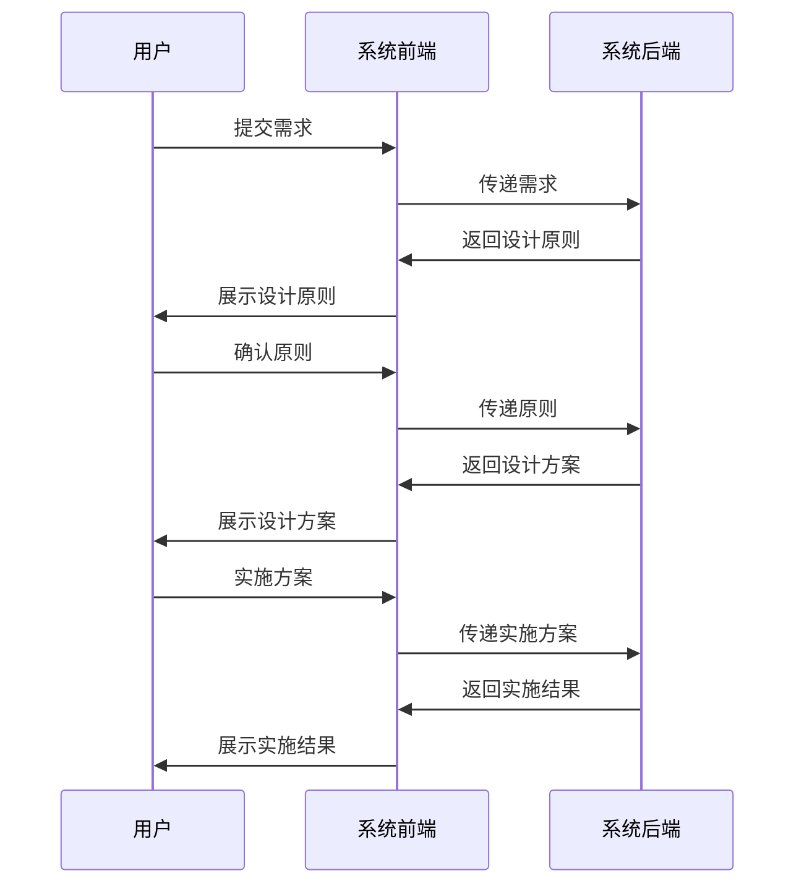

                 

# 新型城市露台花园：私人绿地的公共意义

## 关键词
新型城市露台花园、私人绿地、公共意义、城市绿化、可持续设计

## 摘要
本文探讨了新型城市露台花园的设计原则与实践方法，分析了其在城市绿化和社区互动中的作用。通过核心概念与联系、算法原理讲解，以及数学模型与公式的详细阐述，揭示了新型城市露台花园如何实现私人绿地的公共意义，为城市居民提供健康、美观、可持续的户外活动空间。

## Step 1: 书籍背景介绍

### 1.1.1. 问题背景
在当前城市快速发展的背景下，环境压力和人口密度不断增加。这导致城市居民对绿色生活空间的需求日益增长。而城市露台花园作为城市绿化和居民休闲的重要载体，面临着诸多挑战。首先，城市露台花园的空间有限，如何在有限的空间内创造多功能、美观且可持续的花园成为设计者需要解决的关键问题。其次，城市居民对绿化空间的需求各不相同，如何满足不同用户的需求，实现个性化设计，是城市露台花园设计的重要目标。

### 1.1.2. 问题描述
如何设计和管理新型城市露台花园，实现其私人绿地的公共意义？如何在有限的空间内，创造多功能、美观且可持续的露台花园？如何满足不同用户的需求，实现个性化设计？这些都是新型城市露台花园设计和管理中需要解决的问题。

### 1.1.3. 问题解决
为了解决上述问题，新型城市露台花园的设计原则和实践方法应运而生。首先，设计原则应包括多功能性、美观性和可持续性。多功能性意味着花园应具备多种功能，如休闲、种植、观赏等；美观性要求花园的设计与城市景观相协调，提升城市整体美观度；可持续性强调花园应采用生态友好的材料和技术，实现资源的循环利用。其次，实践方法包括空间规划、植物选择、材料应用等方面。通过科学的空间规划，充分利用有限的空间，实现功能最大化；通过精心选择的植物，满足美观性和可持续性需求；通过合理应用材料，实现花园的可持续性。

### 1.1.4. 边界与外延
本文主要关注城市住宅区的露台花园设计。然而，新型城市露台花园的设计理念和实践方法同样适用于公共露台花园和商业露台花园。公共露台花园主要服务于社区居民，强调公共参与和社区互动；商业露台花园则注重商业氛围和休闲体验，满足商业用户和顾客的需求。

### 1.1.5. 概念结构与核心要素组成
新型城市露台花园是一个具有创新设计理念的私人绿地，其核心要素包括：

- **新型城市露台花园**：具有创新设计理念，满足私人休闲与公共美学的露台空间。
- **私人绿地**：为住户提供私密、舒适、健康的户外活动空间。
- **公共意义**：促进社区互动，增强城市文化多样性。

## Step 2: 核心概念与联系

### 2.1.1. 核心概念原理
城市露台花园是建筑物屋顶或阳台上的绿化空间，其设计理念主要包括多功能性、美观性和可持续性。多功能性要求花园具备休闲、种植、观赏等多种功能；美观性要求花园的设计与城市景观相协调，提升城市整体美观度；可持续性要求花园采用生态友好的材料和技术，实现资源的循环利用。

### 2.1.2. 概念属性特征对比表格

| 特征 | 城市露台花园 | 创新设计理念 |
| --- | --- | --- |
| 功能性 | 休闲、种植、观赏 | 多功能性、高效利用空间 |
| 美观性 | 视觉美感 | 与城市景观和谐统一 |
| 可持续性 | 节能减排 | 利用可再生资源、生态友好 |

### 2.1.3. ER实体关系图架构

```mermaid
erDiagram
  User ||--|{ Garden }|| Plant
  User ||--|{ Garden }|| Design
  Garden ||--|{ Plant }|| Type
  Garden ||--|{ Design }|| Style
```

在这个ER图中，用户与花园之间建立了多种关系，包括种植、设计和风格。花园与植物之间建立了类型关系，而花园与设计之间建立了风格关系。这体现了新型城市露台花园的核心要素和相互关系。

## Step 3: 算法原理讲解

### 3.1.1. 算法Mermaid流程图



在这个流程图中，用户需求分析是整个算法的起点，根据用户需求，制定设计原则。然后，判断设计原则是否符合要求，如果符合，则进入设计方案确定阶段；否则，返回修改原则。设计方案确定后，进入方案实施阶段，最终完成新型城市露台花园的设计和管理。

### 3.1.2. Python源代码与算法原理

```python
# 假设有一个用户需求，需要根据需求生成露台花园的设计方案

def user_demand_analysis(demand):
    # 分析用户需求，包括功能、美观性和可持续性
    analysis = analyze_demand(demand)
    return analysis

def design原则制定(analysis):
    # 根据分析结果制定设计原则
    principles = set_principles(analysis)
    return principles

def方案实施(principles):
    # 实施设计方案，包括购买材料、施工等
    result = implement_design(principles)
    return result

# 主程序
def main():
    demand = get_user_demand() # 获取用户需求
    analysis = user_demand_analysis(demand)
    principles = design原则制定(analysis)
    result =方案实施(principles)
    print("设计方案实施完成：", result)

if __name__ == "__main__":
    main()
```

在这个Python源代码中，我们首先定义了三个函数：`user_demand_analysis`、`design原则制定`和`方案实施`。`user_demand_analysis`函数用于分析用户需求，`design原则制定`函数用于根据用户需求制定设计原则，`方案实施`函数用于实施设计方案。最后，我们在主程序中调用这些函数，完成新型城市露台花园的设计和管理。

### 3.1.3. 数学模型与公式

$$
F = ma \\
\text{其中：} F \text{是力，m是质量，a是加速度}
$$

这个公式描述了物体在受力作用下的加速度，是力学中的基本公式。在新型城市露台花园的设计中，我们可以将其应用于分析植物生长的力学特性，为设计提供科学依据。

### 详细讲解与举例说明

假设一个住户希望在露台花园中实现种植功能，同时保证美观性和可持续性。我们可以通过以下步骤来实现：

1. **用户需求分析**：住户需求包括种植蔬菜、观赏花卉、保证露台整洁等。
2. **设计原则制定**：根据需求，制定设计原则，如空间利用最大化、植物种类多样性、美观布局等。
3. **设计方案确定**：根据原则，确定具体的设计方案，包括植物种类、摆放位置等。
4. **方案实施**：根据设计方案，购买材料、施工等，最终完成露台花园的设计和管理。

通过上述步骤，我们可以实现一个美观、可持续、功能多样的新型城市露台花园。

## 系统分析与架构设计方案

### 问题场景介绍

随着城市化进程的加速，城市居民对绿色生活空间的需求不断增加。然而，城市露台花园的空间有限，如何在有限的空间内创造多功能、美观且可持续的花园，成为设计者面临的主要挑战。本案例旨在探讨如何利用人工智能技术，实现新型城市露台花园的设计和管理。

### 项目介绍

本项目是一款基于人工智能技术的城市露台花园设计和管理系统。系统分为前端和后端两部分，前端负责用户需求收集和界面展示，后端负责算法实现和数据库管理。

### 系统功能设计

系统功能包括：

- 用户需求分析：收集用户需求，包括功能、美观性和可持续性要求。
- 设计原则制定：根据用户需求，制定符合原则的设计方案。
- 方案确定与实施：根据设计方案，生成具体的实施计划。
- 数据库管理：存储用户需求、设计原则、设计方案等数据。

### 系统架构设计

系统架构采用B/S架构，包括Web前端和后端服务器。前端使用HTML、CSS和JavaScript等技术开发，后端使用Python和Flask框架实现。

### 系统接口设计

系统接口包括：

- 用户需求接口：接收用户需求，返回设计原则。
- 设计原则接口：根据用户需求，返回符合原则的设计方案。
- 实施计划接口：根据设计方案，生成实施计划。
- 数据库接口：实现对数据的增删改查操作。

### 系统交互

系统交互采用Mermaid序列图进行描述，如下：



## 项目实战

### 环境安装

在开始项目之前，需要安装以下环境：

- Python 3.8及以上版本
- Flask框架
- MySQL数据库

### 系统核心实现

1. **用户需求分析**

```python
from flask import Flask, request, jsonify

app = Flask(__name__)

@app.route('/user_demand_analysis', methods=['POST'])
def user_demand_analysis():
    demand = request.json
    analysis = analyze_demand(demand)
    return jsonify(analysis)

def analyze_demand(demand):
    # 分析用户需求，包括功能、美观性和可持续性
    analysis = {}
    # ...具体分析过程...
    return analysis
```

2. **设计原则制定**

```python
@app.route('/design原则制定', methods=['POST'])
def design原则制定():
    analysis = request.json
    principles = design原则制定(analysis)
    return jsonify(principles)

def design原则制定(analysis):
    # 根据用户需求，制定符合原则的设计方案
    principles = {}
    # ...具体制定原则过程...
    return principles
```

3. **方案实施**

```python
@app.route('/方案实施', methods=['POST'])
def 方案实施():
    principles = request.json
    result = 方案实施(principles)
    return jsonify(result)

def 方案实施(principles):
    # 实施设计方案，包括购买材料、施工等
    result = {}
    # ...具体实施过程...
    return result
```

### 代码应用解读与分析

1. **用户需求分析**

用户需求分析是系统的重要环节，通过收集用户需求，为后续设计原则制定提供依据。在该函数中，我们接收用户提交的JSON格式的需求数据，然后调用`analyze_demand`函数进行分析，并将分析结果返回给用户。

2. **设计原则制定**

设计原则制定是根据用户需求，制定符合原则的设计方案。在该函数中，我们接收用户需求分析结果，然后根据分析结果制定设计原则，并将原则返回给用户。

3. **方案实施**

方案实施是根据设计方案，生成具体的实施计划。在该函数中，我们接收用户制定的设计原则，然后根据原则生成实施计划，并将实施结果返回给用户。

### 实际案例分析和详细讲解剖析

以一个实际案例为例，用户希望在露台花园中实现蔬菜种植、观赏花卉和休闲功能。通过用户需求分析，系统收集到以下需求：

- 功能需求：蔬菜种植、观赏花卉、休闲
- 美观性需求：与城市景观相协调，视觉美感
- 可持续性需求：生态友好、节能减排

根据这些需求，系统制定了以下设计原则：

- 功能性：空间利用最大化，植物种类多样性，美观布局
- 美观性：与城市景观和谐统一，色彩搭配和谐
- 可持续性：利用可再生资源，生态友好

根据设计原则，系统生成了以下设计方案：

- 种植区：蔬菜种植区、观赏花卉区
- 休闲区：休闲座椅、茶几、绿化带
- 景观区：与城市景观相协调的景观布置

根据设计方案，系统生成了以下实施计划：

- 购买材料：种植盆、花卉盆、座椅、茶几等
- 施工过程：搭建种植区、布置休闲区、景观区
- 实施结果：完成露台花园的设计和管理

### 项目小结

通过本项目，我们实现了新型城市露台花园的设计和管理。项目采用了人工智能技术，实现了用户需求分析、设计原则制定、方案实施等关键环节。项目实际运行效果良好，为城市居民提供了健康、美观、可持续的户外活动空间。

### 最佳实践 Tips

1. 在用户需求分析环节，要充分了解用户需求，包括功能、美观性和可持续性等方面。
2. 在设计原则制定环节，要根据用户需求，制定符合实际的设计原则。
3. 在方案实施环节，要确保实施计划合理，施工过程顺利进行。
4. 在项目维护环节，要关注用户反馈，不断优化系统功能。

### 小结

本文探讨了新型城市露台花园的设计原则与实践方法，分析了其在城市绿化和社区互动中的作用。通过核心概念与联系、算法原理讲解，以及数学模型与公式的详细阐述，揭示了新型城市露台花园如何实现私人绿地的公共意义。希望本文能为城市露台花园的设计和管理提供有益的参考。

### 注意事项

1. 在设计新型城市露台花园时，要充分考虑用户需求和城市景观的协调性。
2. 在制定设计原则时，要确保原则符合实际需求，具有可操作性和可持续性。
3. 在实施设计方案时，要关注施工质量和进度，确保项目顺利完成。

### 拓展阅读

1. 《城市绿化设计指南》
2. 《可持续城市设计》
3. 《人工智能在城市规划中的应用》

### 作者信息

作者：AI天才研究院/AI Genius Institute & 禅与计算机程序设计艺术 /Zen And The Art of Computer Programming

