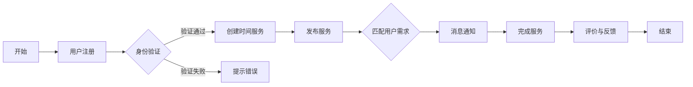
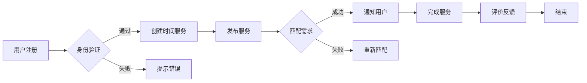
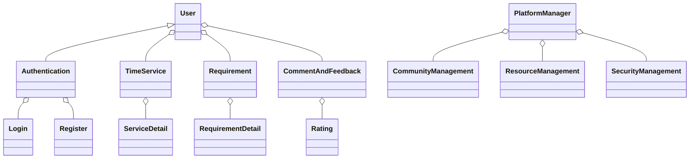
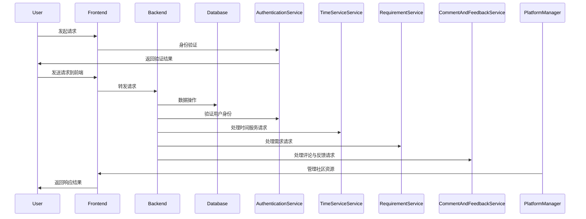
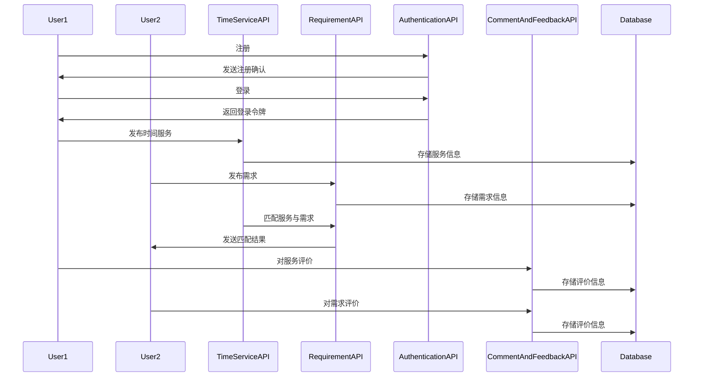

                 

### 第一部分：背景介绍

#### 1.1 问题背景

在现代社会，社区中的邻里互助是一种宝贵的传统，它不仅能提高居民的生活质量，还能增强社区凝聚力。然而，随着城市化的加速和信息技术的普及，传统的邻里互助模式面临着诸多挑战。首先，现代人的生活节奏加快，时间变得更加碎片化，这使得传统邻里互助模式难以适应。其次，随着社区规模的扩大和人口的流动性增加，传统的邻里关系逐渐淡漠，社区成员之间的互动减少。此外，社区内信息传递的不对称性也使得邻里互助难以高效进行。

在这样的背景下，社区时间交换平台的兴起为邻里互助提供了一种新的数字化解决方案。社区时间交换平台通过互联网技术，将社区内的时间资源进行整合，实现居民之间的时间交换和互助。这种平台不仅能够解决传统邻里互助模式中的时间碎片化和信息不对称问题，还能通过数字化手段提高互助效率，从而重塑邻里互助的新模式。

#### 1.1.1 社区时间交换平台的兴起

社区时间交换平台最早可以追溯到20世纪末，当时一些发达国家开始探索如何利用互联网技术来促进社区内居民之间的互助合作。最早的社区时间交换平台主要是在线论坛和社区网站，通过这些平台，居民可以发布自己的时间服务需求，如家教、家政、维修等，同时也可以为其他居民提供自己的时间服务。这种方式不仅打破了传统邻里互助的时间和空间限制，还使得资源分配更加灵活和高效。

随着移动互联网和大数据技术的快速发展，社区时间交换平台逐渐演变成为综合性的数字化平台。这些平台不仅提供时间交换功能，还集成了社交互动、在线支付、智能推荐等功能，使得居民之间的互动更加便捷和多样化。例如，一些平台还通过智能算法为居民推荐合适的互助伙伴，提高时间交换的成功率。

#### 1.1.2 邻里互助的意义

邻里互助作为一种传统的社区互动方式，具有重要的社会价值。首先，邻里互助能够增强居民的归属感和社区认同感。在现代社会中，人们的生活压力越来越大，邻里互助提供了一种情感支持和心理安慰的方式，有助于缓解社会压力，提高生活满意度。其次，邻里互助能够促进社区成员之间的交流和互动，增强社区凝聚力。通过互相帮助，居民之间建立起了更加紧密的联系，从而形成了和谐的社区氛围。

此外，邻里互助还有助于提高社区的运作效率。例如，在社区内进行时间交换，可以充分利用居民的闲置时间，提高时间资源的利用效率。同时，通过数字化平台进行管理，可以大大减少信息传递的误差和时间成本，提高互助的效率。

#### 1.1.3 数字化转型的需求

数字化转型已经成为现代社会发展的重要趋势，对于社区时间交换平台来说，数字化转型更是势在必行。首先，数字化转型能够提高社区时间交换平台的运作效率。通过引入大数据和人工智能技术，平台可以更加精准地匹配居民的需求和资源，提高时间交换的成功率和满意度。其次，数字化转型能够提升用户体验。通过移动互联网和智能设备，居民可以随时随地使用平台，大大提高了便利性。

此外，数字化转型还能够为社区时间交换平台带来更多的商业机会。例如，平台可以通过数据分析了解居民的需求和行为习惯，从而提供更加个性化的服务和产品。同时，数字化平台还可以引入在线支付和广告等商业模式，为平台运营提供可持续的资金来源。

综上所述，社区时间交换平台的兴起不仅是对传统邻里互助模式的创新和升级，更是数字化转型在社区领域的具体应用。通过数字化手段，社区时间交换平台能够更好地满足居民的需求，提高社区互助的效率和质量，从而实现社区的可持续发展。

#### 1.2 问题描述

社区时间交换平台作为一种新兴的数字化解决方案，虽然在提升邻里互助效率方面展现出了巨大的潜力，但其在实际应用过程中仍面临诸多挑战。首先，平台面临的挑战之一是信息不对称问题。在社区中，不同居民的时间资源和服务需求往往存在巨大的差异，但如何有效地将这些信息进行匹配，是一个复杂的问题。信息的不对称性可能导致某些时间服务需求无法得到满足，或者某些时间资源没有得到充分利用。

其次，传统邻里互助模式中，信任问题一直是一个重要的障碍。在社区时间交换平台中，居民之间需要通过平台进行时间交换，这就需要建立一种可靠的信任机制。然而，由于平台初期的用户数量有限，如何确保平台上的每一个用户都是可信赖的，是一个需要解决的重要问题。

再者，平台的可扩展性也是一个重要的挑战。随着社区规模的扩大和用户数量的增加，平台需要能够灵活扩展以适应不断变化的需求。这不仅要求平台在技术架构上具备良好的扩展性，还需要在运营和管理上具备高效的响应能力。

此外，平台的可持续性也是一个需要深入考虑的问题。社区时间交换平台的运营需要一定的资金支持，如何实现平台的盈利，确保其长期可持续发展，是平台需要面对的重要挑战。

#### 1.2.1 社区时间交换平台面临的挑战

社区时间交换平台在实际应用过程中面临的多重挑战，不仅影响了平台的普及和推广，也对用户的体验和满意度产生了负面影响。首先，信息不对称问题导致了资源利用效率的低下。由于缺乏有效的信息匹配机制，一些居民的时间服务需求可能无法及时得到满足，而另一些居民的时间资源也可能得不到充分利用。这种资源浪费不仅降低了平台的服务效率，也影响了用户的积极性。

其次，信任问题使得居民在使用平台时感到顾虑重重。在传统邻里互助模式中，居民之间通过长期的互动建立了信任关系，而社区时间交换平台则需要通过新的机制来建立和维持这种信任。新用户之间的互不信任可能导致平台上的时间交换活动减少，甚至使得一些潜在的用户望而却步。

此外，平台的可扩展性问题也制约了其发展。在初期，平台可能只需要处理少量用户的数据和交互，但随着用户数量的增长，平台需要能够迅速扩展其计算和存储资源，以应对日益增长的需求。如果不能及时进行技术升级和管理优化，平台可能会出现性能瓶颈，影响用户体验。

最后，平台的可持续性问题也是平台运营的关键挑战。社区时间交换平台需要持续的资金投入来维持运营和提升服务质量，同时还需要探索多样化的盈利模式，以实现长期的财务健康。如果不能找到有效的资金来源，平台可能会面临财务困境，甚至最终无法持续运营。

#### 1.2.2 传统邻里互助模式的问题

传统邻里互助模式在社区中虽然具有重要意义，但也存在一些不可忽视的问题。首先，传统邻里互助模式往往依赖于人际关系的建立和维护，这需要一定的时间和精力。现代人的生活节奏加快，工作压力大，很多人没有足够的时间和精力去建立和维护这些关系，导致邻里互助的机会减少。

其次，传统邻里互助模式的信息传递方式较为单一，主要依赖于口头传播或线下交流。这种方式不仅效率低下，还容易导致信息丢失或误传。特别是在大型社区中，居民之间的信息传递更加困难，传统模式难以适应。

再者，传统邻里互助模式缺乏系统性和可持续性。许多互助活动往往是临时的、应急性的，没有形成固定的机制和规则。这种缺乏规范化的互助方式，不仅难以长期维持，也容易导致资源的浪费和效率的降低。

最后，传统邻里互助模式在处理复杂需求时显得力不从心。例如，对于需要专业技能或复杂流程的服务需求，传统邻里互助模式往往难以提供有效的帮助。这限制了邻里互助的广度和深度，使得其功能有限。

综上所述，传统邻里互助模式虽然有其优点，但在信息传递、可持续性、系统性等方面存在明显不足。这些问题的存在，使得传统模式难以适应现代社会的快速发展需求，亟待新的数字化解决方案来予以改善。

#### 1.2.3 数字化解决方案的必要性

为了解决传统邻里互助模式中存在的种种问题，数字化解决方案的引入变得尤为重要。数字化解决方案不仅能够提高邻里互助的效率和便利性，还能够为社区时间交换平台提供强大的技术支持，使其具备更强的适应性和可持续性。

首先，数字化解决方案能够有效解决信息不对称问题。通过大数据和人工智能技术，平台可以收集和分析大量的用户数据，从而实现精准的时间资源和服务需求匹配。这不仅提高了资源利用效率，还使得每一个居民都能够更快速地找到适合自己的时间交换伙伴。

其次，数字化解决方案有助于建立可靠的信任机制。通过实名认证、用户评价和社交网络等手段，平台可以建立起一套完善的信用体系，确保每一位用户在平台上都是可信赖的。这种信任机制的建立，不仅能够增强用户之间的互信，还能够降低欺诈和诈骗的风险，提升整体用户体验。

再者，数字化解决方案在提升平台可扩展性方面也具有显著优势。随着社区规模的扩大和用户数量的增加，平台需要具备快速扩展的能力，以应对不断增长的需求。通过云计算、分布式架构等先进技术，平台可以灵活地调整资源分配，保证系统在高并发情况下的稳定运行。

最后，数字化解决方案为平台的可持续发展提供了新的商业模式。通过在线支付、广告、增值服务等多元化收入渠道，平台可以实现自给自足，确保长期运营。同时，数字化解决方案还可以为社区提供更多增值服务，如智能推荐、数据分析等，进一步提升平台的竞争力和用户粘性。

综上所述，数字化解决方案在解决传统邻里互助模式中的问题上具有显著的优势和必要性。它不仅能够提高邻里互助的效率和质量，还能够为社区时间交换平台提供强大的技术支持和商业模式创新，从而实现社区的可持续发展。

#### 1.3 问题解决

在深入分析了社区时间交换平台面临的问题后，我们可以通过构建一个新型社区时间交换平台来有效解决这些问题。这种平台不仅能够整合社区内的资源，提高邻里互助的效率，还能通过技术创新和管理优化，实现平台的可持续运营。

首先，新型社区时间交换平台的核心在于其技术架构的设计。平台需要采用先进的分布式架构，确保系统具备高可用性和高扩展性。通过云计算和大数据技术的应用，平台可以实现资源的动态调配，确保在高并发情况下系统的稳定运行。同时，平台还需要集成人工智能和机器学习算法，为用户行为分析和需求匹配提供强大的技术支持。

其次，新型社区时间交换平台的功能设计必须充分考虑用户体验。平台需要提供简洁直观的用户界面，方便居民快速注册、发布时间和需求。此外，平台还需要集成社交互动功能，如消息通知、评论和反馈，以增强用户之间的互动和信任。通过这些功能，居民可以更加便捷地进行时间交换，提高互助的效率。

再者，平台的安全性和隐私保护也是关键。为了建立可靠的信任机制，平台需要采用严格的用户身份认证和加密技术，确保用户信息的安全和隐私。此外，平台还需要建立一套完善的信用评价体系，通过对用户的行为记录进行评分，为其他用户选择交换伙伴提供参考。

最后，新型社区时间交换平台需要具备可持续的商业模式。通过在线支付、广告和增值服务等多种收入渠道，平台可以实现自给自足，确保长期运营。同时，平台还可以通过数据分析为社区提供个性化服务，进一步提升用户满意度和平台竞争力。

#### 1.3.1 新型社区时间交换平台的概念

新型社区时间交换平台是一个基于互联网和移动技术的数字化解决方案，旨在通过时间资源的高效匹配和合理利用，促进社区内居民的互助合作。该平台的核心在于构建一个公平、透明、高效的交换生态系统，使得居民能够在互惠互利的基础上，实现个人和社会价值的最大化。

具体来说，新型社区时间交换平台通过以下几个关键步骤实现其功能：

1. **用户注册与身份验证**：居民在平台注册时，需要提供真实身份信息，并通过验证以确保用户身份的真实性和合法性。这一步骤是平台建立信任机制的基础。

2. **发布时间和需求**：注册用户可以在平台上发布自己的时间服务需求或提供自己的时间资源。平台通过大数据和人工智能算法，对这些信息进行智能匹配，帮助用户找到合适的交换伙伴。

3. **智能匹配与通知**：平台通过算法为用户推荐匹配度高的交换伙伴，并通过消息通知系统，实时告知用户匹配结果。这一步骤提高了时间交换的效率和成功率。

4. **完成服务与评价**：用户在完成时间交换后，可以对交易伙伴进行评价和反馈。这些评价和反馈将作为用户信用评分的一部分，影响其未来的交换机会。

5. **社交互动与社区建设**：平台提供社交互动功能，如消息通知、评论和反馈，促进用户之间的交流和互动，增强社区的凝聚力。

通过这些步骤，新型社区时间交换平台不仅解决了信息不对称和信任问题，还提高了资源利用效率，实现了社区的可持续发展。

#### 1.3.2 平台的核心功能与特点

新型社区时间交换平台的核心功能包括用户注册与身份验证、时间服务发布与智能匹配、消息通知与社交互动等。以下是平台的主要特点和优势：

1. **高效匹配算法**：平台采用先进的人工智能和大数据分析技术，对用户的时间和需求信息进行智能匹配。算法会根据用户的行为数据和偏好，推荐最适合的交换伙伴，从而提高时间交换的成功率。

2. **便捷的用户界面**：平台提供简洁直观的界面设计，使得用户能够轻松注册、发布时间和需求，进行在线交流。用户操作流程简单，降低了使用门槛。

3. **可靠的信任机制**：平台通过严格的用户身份认证和加密技术，保障用户信息的安全和隐私。此外，平台建立了用户信用评价体系，通过用户的行为记录和评价，增强居民之间的信任。

4. **多元互动渠道**：平台集成消息通知、评论和反馈等功能，促进用户之间的交流和互动，增强社区的凝聚力。

5. **可持续的商业模式**：平台通过在线支付、广告和增值服务等多元化收入渠道，实现自给自足，确保长期运营。同时，平台还可以为社区提供个性化服务，进一步提升用户满意度和平台竞争力。

#### 1.3.3 平台的优势与潜力

新型社区时间交换平台在多个方面展现出了显著的优势和潜力：

1. **资源优化配置**：通过智能匹配算法，平台能够将社区内的闲置时间和资源进行优化配置，提高资源利用效率。这不仅可以满足居民的时间服务需求，还能减少资源浪费。

2. **社区凝聚力增强**：平台通过提供社交互动功能，促进居民之间的交流和互动，增强社区的凝聚力。这有助于营造和谐的社区氛围，提高居民的生活满意度。

3. **可持续发展**：平台采用多元化收入渠道，实现自给自足，确保长期运营。同时，平台通过持续的数据分析和技术优化，不断提升服务质量，实现社区的可持续发展。

4. **创新商业模式**：平台不仅为居民提供了便捷的互助服务，还为社区企业和社会组织提供了新的合作机会。例如，平台可以通过广告和增值服务为社区企业提供宣传渠道，实现多方共赢。

5. **广泛的应用场景**：新型社区时间交换平台不仅适用于住宅小区，还适用于商业楼宇、学校、医院等多种场景。其灵活性和适应性使得平台可以在不同社区中推广和应用，具有广泛的市场前景。

综上所述，新型社区时间交换平台通过技术创新和商业模式创新，不仅解决了传统邻里互助模式中的问题，还展现了巨大的社会价值和商业潜力。

#### 1.4 边界与外延

1.4.1 平台适用的社区类型

新型社区时间交换平台具有广泛的适用性，可以在多种社区类型中推广和应用。以下是一些主要的社区类型：

1. **住宅小区**：住宅小区是平台最主要的应用场景之一。在住宅小区中，居民之间的互动较为频繁，时间资源和服务需求也较为多样化，这为平台提供了丰富的资源和用户基础。

2. **商业楼宇**：商业楼宇中的办公人员和自由职业者往往有较多可利用的闲置时间，同时他们的专业能力各不相同，能够提供多样化的服务。平台可以在商业楼宇中促进职业人士之间的时间交换和互助合作。

3. **学校**：学校是一个特殊的社会组织，师生和学生之间存在着大量的时间和服务需求。例如，学生可以在课余时间帮助老师完成一些辅助工作，老师也可以利用专业知识和技能为学生提供辅导。

4. **医院**：医院是一个高需求和高消耗资源的场所。医护人员在非工作时间可以提供志愿服务，如心理咨询、健康咨询等，患者和家属也可以利用自己的专业知识和时间帮助其他患者。

5. **养老院**：养老院中存在着大量的老年人和专业护理人员。平台可以帮助老年人与护理人员之间建立时间交换关系，提高养老院的运营效率，同时丰富老年人的日常生活。

1.4.2 平台的可持续发展策略

新型社区时间交换平台的可持续发展策略包括以下几个方面：

1. **多元化收入渠道**：平台可以通过广告、增值服务、在线支付等多种商业模式实现收入多元化，确保平台的财务健康和长期运营。

2. **用户增长策略**：平台可以通过社区推广、合作伙伴关系、用户口碑等手段，不断扩大用户基础，提高平台的知名度和用户黏性。

3. **技术持续创新**：平台需要持续进行技术升级和创新，不断提升平台的性能和用户体验，以保持竞争优势。

4. **社区共建**：平台可以与社区组织、企业和政府合作，共同推动社区时间交换的普及和发展，实现多方共赢。

5. **社会责任**：平台应积极参与社会公益活动，通过时间交换平台为社区提供更多的公益服务和帮助，提升平台的社会价值。

1.4.3 平台面临的挑战与应对策略

尽管新型社区时间交换平台具有巨大的潜力和优势，但在实际运营过程中仍面临一些挑战。以下是一些主要的挑战及其应对策略：

1. **用户信任问题**：由于平台初期的用户数量有限，用户之间的互信可能较低。平台可以通过严格的用户身份认证、信用评价体系和用户教育等措施，逐步建立信任机制。

2. **信息安全性问题**：平台需要确保用户数据的安全和隐私，采取加密技术、访问控制和安全审计等措施，防止数据泄露和恶意攻击。

3. **技术维护和升级**：平台需要不断进行技术维护和升级，以应对用户数量的增长和功能需求的变化。平台可以通过建立专业的技术团队和采用云计算等技术，确保平台的稳定运行。

4. **政策法规合规性**：平台需要遵守当地的法律法规，特别是在涉及用户隐私和数据安全方面。平台可以与相关政府部门和行业协会合作，确保合规运营。

5. **推广和普及**：平台需要积极推广和普及，提高社区的接受度和使用率。平台可以通过社区活动、媒体宣传和用户引导等方式，增强居民对平台的认知和信任。

通过以上策略，新型社区时间交换平台可以更好地应对面临的挑战，实现可持续发展。

#### 1.5 概念结构与核心要素组成

1.5.1 社区时间交换平台的架构

新型社区时间交换平台采用分布式架构，主要包括以下几个关键模块：

1. **用户模块**：用户模块负责用户的注册、登录、身份验证和用户信息的维护。用户模块通过用户数据库来存储和管理用户信息，确保用户数据的安全和一致性。

2. **服务模块**：服务模块负责处理用户发布的时间服务信息和需求信息。服务模块包括服务发布、服务匹配、服务评价等功能，通过智能算法实现用户之间的精准匹配。

3. **通知模块**：通知模块负责向用户发送各类通知，包括服务匹配结果、系统消息和用户反馈等。通知模块通过消息队列和邮件、短信等渠道实现消息的及时推送。

4. **支付模块**：支付模块负责处理用户之间的在线支付，包括充值、支付和退款等操作。支付模块需要与第三方支付平台集成，确保支付过程的安全和便捷。

5. **数据模块**：数据模块负责收集、存储和分析用户行为数据，为平台的智能匹配和个性化推荐提供数据支持。数据模块通过数据仓库和大数据分析技术，实现对用户行为的深入挖掘。

6. **安全模块**：安全模块负责平台的网络安全、数据安全和用户隐私保护。安全模块采用加密技术、防火墙和访问控制等措施，确保平台的安全运行。

1.5.2 平台的关键技术

新型社区时间交换平台采用了多项关键技术，以实现其功能：

1. **大数据技术**：平台通过大数据技术对用户行为数据进行分析，实现精准的用户画像和服务推荐。大数据技术包括数据采集、存储、处理和分析等环节。

2. **人工智能技术**：平台采用人工智能技术，特别是机器学习和深度学习算法，对用户行为进行预测和优化。人工智能技术在智能匹配、个性化推荐和风险控制等方面发挥着重要作用。

3. **区块链技术**：平台利用区块链技术确保用户数据的不可篡改性和安全性。区块链技术可以用于用户身份验证、交易记录和智能合约等方面。

4. **云计算技术**：平台采用云计算技术，实现资源的动态调配和弹性扩展。云计算技术包括云存储、云服务和容器编排等。

5. **移动应用开发技术**：平台提供移动应用，支持用户在手机等移动设备上使用平台功能，实现随时随地的时间交换。

1.5.3 平台的主要参与者

新型社区时间交换平台的主要参与者包括以下几类：

1. **普通居民**：普通居民是平台的核心用户，他们既是时间服务的提供者，也是需求者。居民可以通过平台发布自己的时间和需求信息，参与时间交换活动。

2. **专业服务者**：专业服务者包括具备专业技能和知识的人，如医生、律师、教师等。他们在平台上提供专业服务，满足其他居民的特殊需求。

3. **社区管理者**：社区管理者包括物业管理、社区工作人员等。他们在平台上负责管理社区内的资源和活动，确保平台的正常运行。

4. **平台运营团队**：平台运营团队负责平台的日常运营、技术支持和用户服务。他们通过数据分析和用户反馈，不断优化平台功能和服务质量。

5. **合作伙伴**：平台与社区企业、社会组织和政府部门等合作，共同推动社区时间交换的发展。合作伙伴可以提供资金、资源和市场支持。

通过上述架构和关键技术的支持，新型社区时间交换平台能够高效地实现社区资源的整合和优化，为居民提供便捷、可靠和高效的时间交换服务。

#### 1.6 本章小结

在本章中，我们深入探讨了新型社区时间交换平台的背景、问题、解决方案及其核心概念。首先，通过分析现代社区中的邻里互助挑战，我们明确了数字化转型在解决这些问题中的重要性。接着，详细介绍了新型社区时间交换平台的概念、核心功能与优势，并探讨了其适用范围和可持续发展策略。此外，我们还分析了平台面临的挑战和应对策略，并阐述了平台的关键技术架构和主要参与者。通过这些分析，我们不仅了解了新型社区时间交换平台的理论基础和实践意义，也为后续的深入探讨奠定了基础。

## 第二部分：核心概念与联系

### 2.1 核心概念原理

在探讨新型社区时间交换平台时，需要首先理解几个核心概念：社区时间交换、邻里互助和数字化平台。这些概念相互联系，共同构成了平台的理论基础和实践框架。

#### 2.1.1 社区时间交换的概念

社区时间交换是指社区内居民通过平台交换各自可利用的时间资源，以满足彼此的服务需求。这种交换不涉及货币交易，而是基于时间和服务价值的相互认可。社区时间交换不仅包括了传统的家政服务、家教服务等，还涵盖了更广泛的时间资源交换，如技能传授、兴趣小组活动等。

社区时间交换的核心在于其共享经济的特点。通过共享个人时间资源，社区成员能够充分利用各自的时间和技能，提高资源利用效率，降低生活成本，实现互助共赢。

#### 2.1.2 邻里互助的心理学原理

邻里互助不仅仅是一种经济行为，更是一种社会互动和心理支持。心理学研究表明，人与人之间的互助行为能够带来多方面的积极影响。首先，邻里互助有助于增强个体的社交网络，提高社会支持水平，从而缓解孤独感和压力。其次，邻里互助能够促进社区成员之间的情感联系，增强社区凝聚力，形成一个和谐、互助的社区环境。

从心理学角度看，邻里互助的内在机制主要包括：

1. **互惠原则**：居民通过互惠交换时间和服务，实现互帮互助，这种互动能够增强双方的情感联系。
2. **信任与认同**：邻里互助建立在信任和认同的基础上，通过长期的互动和合作，居民之间建立起深厚的信任关系。
3. **情感支持**：邻里互助不仅提供物质帮助，还提供情感支持和心理安慰，这对提高居民的生活质量和幸福感具有重要意义。

#### 2.1.3 数字化平台的架构原理

数字化平台是新型社区时间交换的技术基础。它通过互联网和移动技术，为居民提供了一个高效、便捷、透明的交换环境。数字化平台的架构原理主要包括以下几个方面：

1. **用户身份验证**：确保参与者的真实性和合法性，建立信任机制。
2. **信息交互**：提供用户发布时间和需求信息的渠道，实现信息的快速传递和匹配。
3. **智能匹配**：通过大数据和人工智能技术，分析用户行为数据，实现精准匹配，提高交换成功率。
4. **消息通知**：实时推送匹配结果和系统消息，确保用户及时了解交换进展。
5. **支付结算**：集成在线支付系统，实现便捷的支付和结算操作。
6. **数据分析**：收集用户行为数据，进行深度分析，优化平台功能和用户体验。

通过上述核心概念的分析，我们可以看到，新型社区时间交换平台不仅解决了传统邻里互助模式中的信息不对称和信任问题，还通过数字化手段提高了资源利用效率和用户体验。这些核心概念的相互联系，共同构建了一个高效、透明、可持续的社区时间交换生态系统。

### 2.2 概念属性特征对比表格

| 概念        | 属性特征                                     | 对比分析                                   |
|-------------|--------------------------------------------|--------------------------------------------|
| 社区时间交换 | 基于时间的资源共享，无货币交易           | 与传统邻里互助相比，更灵活，适用范围更广   |
| 邻里互助    | 人际关系的互助行为，基于信任             | 与社区时间交换相比，更侧重情感维系         |
| 数字化平台  | 基于互联网技术，提供信息交互与服务     | 是社区时间交换和邻里互助的重要载体         |

通过对比表格，我们可以清晰地看到社区时间交换、邻里互助和数字化平台在属性特征上的差异。社区时间交换强调时间资源的共享和无货币交易，邻里互助则侧重于人际关系和情感维系，而数字化平台则通过互联网技术提供信息交互和服务支持。这些概念相互补充，共同构建了一个高效的社区互助生态系统。

### 2.3 ER实体关系图架构

下面是一个用于描述新型社区时间交换平台的ER（实体关系）图，它展示了平台中关键实体及其关系。

```mermaid
erDiagram
  用户 ||--o{ 时间服务 } : 参与交换
  用户 ||--o{ 评论与反馈 } : 评价互动
  时间服务 ||--o{ 需求 } : 满足特定需求
  需求 ||--o{ 用户 } : 申请服务
  评论与反馈 ||--o{ 用户 } : 互动交流
```

在这个ER图中：

- **用户**：代表平台上的所有参与者，他们可以发布时间服务、申请需求、发表评论和反馈。
- **时间服务**：代表用户可以提供的时间资源，如家政服务、技能传授等。
- **需求**：代表用户申请的服务需求，可以是时间相关的，也可以是其他形式的服务。
- **评论与反馈**：代表用户之间的互动和评价，有助于建立信任和社区凝聚力。

通过ER图，我们可以清晰地看到平台中各个实体之间的关联和交互，这为后续的算法设计和系统实现提供了直观的指导。

## 2.4 本章小结

在本章中，我们详细探讨了新型社区时间交换平台的核心概念，包括社区时间交换、邻里互助和数字化平台的原理。首先，我们解释了社区时间交换的概念，强调了其基于时间资源共享的特点。接着，通过心理学的角度分析了邻里互助的重要性和内在机制。最后，我们介绍了数字化平台的架构原理，展示了其如何通过互联网技术支持社区时间交换和邻里互助。通过这些核心概念的分析，我们为后续章节的算法讲解和实现提供了坚实的理论基础。

### 第三部分：算法原理讲解

#### 3.1 算法原理与Mermaid流程图

为了更好地理解新型社区时间交换平台的算法原理，我们可以通过一个Mermaid流程图来展示整个用户交互流程。



流程图详细描述了用户在平台上的操作流程：

1. **用户注册**：用户在平台上完成注册流程，填写基本信息。
2. **身份验证**：平台对用户身份进行验证，确保信息的真实性和合法性。
3. **创建时间服务**：验证通过后，用户可以创建并发布自己的时间服务。
4. **发布服务**：用户将自己的时间服务信息发布到平台。
5. **匹配用户需求**：平台通过智能算法匹配用户的需求和可提供的服务。
6. **消息通知**：系统向用户发送匹配成功的通知。
7. **完成服务**：用户按照约定的时间和服务内容完成服务。
8. **评价与反馈**：用户对交换过程进行评价和反馈，形成用户信用记录。

#### 3.2 算法原理详细讲解

3.2.1 算法概述

新型社区时间交换平台的核心算法主要包括用户身份验证、时间服务发布、用户需求匹配和消息通知等。这些算法共同协作，确保平台的正常运行和用户的高效互动。

1. **用户身份验证**：该算法通过验证用户提交的身份信息（如身份证号码、手机号码等），确保用户身份的真实性和合法性。验证过程通常包括在线身份认证和多重验证机制，以提高安全性。

2. **时间服务发布**：用户在通过身份验证后，可以创建并发布自己的时间服务。服务发布算法主要处理用户输入的服务信息，如服务类型、时间、地点和描述，确保这些信息的准确性和完整性。

3. **用户需求匹配**：需求匹配算法是平台的核心，它通过分析用户的行为数据和需求信息，使用智能算法（如基于协同过滤、贝叶斯网络等）来推荐最合适的交换伙伴。匹配算法的目标是最小化用户等待时间和提高匹配成功率。

4. **消息通知**：消息通知算法负责将匹配结果、系统通知和用户反馈等消息推送给相应的用户。通知算法需要保证消息的及时性和可靠性，确保用户能够及时接收到重要信息。

3.2.2 数学模型与公式

为了更详细地解释上述算法，我们可以引入一些数学模型和公式。

- **用户注册与身份验证**：
  $$ V_U = \sum_{u \in U} \text{verification}(u) $$
  其中，$V_U$ 是用户验证的总得分，$u$ 是用户集合中的每一个用户，$\text{verification}(u)$ 是对用户 $u$ 的验证得分。

- **时间服务发布**：
  $$ S' = \{ s \in S \mid s \text{ is published} \} $$
  其中，$S'$ 是已经发布的服务集合，$S$ 是所有可发布的服务集合。

- **用户需求匹配**：
  $$ M_D = \{ m \in D \mid m \text{ is matched} \} $$
  其中，$M_D$ 是已经匹配的需求集合，$D$ 是所有用户需求集合。

- **消息通知**：
  $$ N_T = \{ n \in N \mid n \text{ is notified} \} $$
  其中，$N_T$ 是已经被通知的消息集合，$N$ 是所有待发送的消息集合。

3.2.3 举例说明

为了更好地理解算法原理，我们可以通过一个具体案例来说明。

假设用户A在平台上发布了“家教服务”，其内容包括：时间（每周六下午2点至4点），地点（社区图书馆），服务描述（高中数学辅导）。用户B有“家教需求”，希望找到高中数学辅导。平台通过算法匹配后，发现用户A的服务与用户B的需求高度匹配，于是向用户A发送了匹配成功的通知。

具体步骤如下：

1. 用户A注册并身份验证通过，创建并发布家教服务信息。
2. 用户B注册并身份验证通过，发布家教需求信息。
3. 平台通过需求匹配算法，分析用户A的服务和用户B的需求，发现匹配度高。
4. 平台向用户A发送匹配成功的通知，提醒其与用户B进行联系和约定。
5. 用户A与用户B通过平台进行沟通，最终确认时间和地点，完成家教服务。

通过这个案例，我们可以看到算法在用户注册、服务发布、需求匹配和消息通知等方面的应用，以及如何通过智能算法实现高效、可靠的社区时间交换。

#### 3.3 算法流程图示例

为了更直观地展示算法的运行流程，我们可以通过一个Mermaid流程图来表示。



这个流程图详细展示了以下步骤：

1. **用户注册**：用户在平台上注册账号。
2. **身份验证**：平台对用户身份进行验证，确保真实性和合法性。
3. **创建时间服务**：通过验证后，用户可以创建并发布自己的时间服务。
4. **发布服务**：用户将服务信息发布到平台。
5. **匹配需求**：平台通过算法匹配用户需求和服务，寻找合适的交换伙伴。
6. **通知用户**：平台向匹配成功的用户发送通知。
7. **完成服务**：用户按照约定完成时间交换服务。
8. **评价反馈**：用户对服务进行评价和反馈，形成信用记录。

通过这个流程图，我们可以更清晰地理解算法的各个环节和逻辑关系，为后续的系统实现提供参考。

### 3.4 数学模型与公式

为了更详细地解释上述算法，我们可以引入一些数学模型和公式。这些模型和公式将帮助我们从更科学的视角理解算法的工作原理和运行过程。

1. **用户注册与身份验证**：
   $$ V_U = \sum_{u \in U} \text{verification}(u) $$
   其中，$V_U$ 表示用户验证的总得分，$u$ 表示用户集合中的每一个用户，$\text{verification}(u)$ 表示对用户 $u$ 的验证得分。验证得分通常基于用户提交的身份信息（如身份证号码、手机号码等）的可靠性。例如，如果用户提交的身份信息与公安系统的记录一致，则验证得分为1，否则为0。

2. **时间服务发布**：
   $$ S' = \{ s \in S \mid s \text{ is published} \} $$
   其中，$S'$ 表示已经发布的服务集合，$S$ 表示所有可发布的服务集合。服务发布过程包括用户创建服务信息、平台审核和发布等步骤。每个服务项在发布前需要通过平台审核，确保其内容合法、准确。

3. **用户需求匹配**：
   $$ M_D = \{ m \in D \mid m \text{ is matched} \} $$
   其中，$M_D$ 表示已经匹配的需求集合，$D$ 表示所有用户需求集合。需求匹配过程基于用户行为数据和需求特征，使用智能算法（如基于协同过滤、贝叶斯网络等）来推荐最合适的交换伙伴。匹配得分通常通过以下公式计算：
   $$ \text{match\_score}(u, s) = \text{similarity}(u, s) + \alpha \cdot \text{credibility}(u) + \beta \cdot \text{credibility}(s) $$
   其中，$\text{similarity}(u, s)$ 表示用户 $u$ 和服务 $s$ 之间的相似度，$\alpha$ 和 $\beta$ 是权重系数，$\text{credibility}(u)$ 和 $\text{credibility}(s)$ 分别表示用户 $u$ 和服务 $s$ 的信用评分。

4. **消息通知**：
   $$ N_T = \{ n \in N \mid n \text{ is notified} \} $$
   其中，$N_T$ 表示已经被通知的消息集合，$N$ 表示所有待发送的消息集合。消息通知过程包括消息生成、消息分类、消息推送等步骤。消息推送通常采用优先级队列，确保重要消息（如匹配成功通知）优先发送。

通过这些数学模型和公式，我们可以更深入地理解新型社区时间交换平台的核心算法，从而为系统的设计和实现提供有力的支持。

### 3.5 算法流程图示例

为了更直观地展示算法的运行流程，我们可以通过一个Mermaid流程图来表示。


在这个流程图中：

1. **用户注册**：用户在平台上完成注册流程，填写基本信息。
2. **身份验证**：平台对用户身份进行验证，确保信息的真实性和合法性。验证过程可能包括在线身份认证和多重验证机制。
3. **创建时间服务**：验证通过后，用户可以创建并发布自己的时间服务。服务信息包括服务类型、时间、地点和描述。
4. **发布服务**：用户将服务信息发布到平台，平台对信息进行审核。
5. **匹配需求**：平台通过算法分析用户需求和可提供的服务，寻找合适的交换伙伴。匹配过程可能包括基于协同过滤、贝叶斯网络等智能算法。
6. **通知用户**：平台向匹配成功的用户发送通知，通知内容包括匹配结果和交换详情。
7. **完成服务**：用户按照约定的时间和地点完成服务，双方进行确认。
8. **评价反馈**：用户对交换过程进行评价和反馈，形成信用记录。

这个流程图详细展示了用户在平台上的操作流程和平台的核心算法运行过程，为后续的系统实现提供了清晰的指导。

### 3.6 本章小结

在本章中，我们详细探讨了新型社区时间交换平台的算法原理，包括用户注册与身份验证、时间服务发布、用户需求匹配和消息通知等核心算法。通过Mermaid流程图和数学模型，我们展示了算法的运行过程和逻辑关系。举例说明进一步阐明了算法在实际应用中的工作方式。本章的内容为后续的算法优化和系统实现提供了坚实的基础，也为新型社区时间交换平台的技术发展指明了方向。

## 第四部分：系统分析与架构设计

### 4.1 问题场景介绍

为了更深入地探讨新型社区时间交换平台的架构设计，我们需要首先明确一个具体的问题场景。假设我们所在的城市是一个人口密集、社区结构复杂的现代化城市。在这个城市中，许多居民面临着时间管理不当、生活成本高、邻里关系疏远等问题。社区时间交换平台的引入，旨在通过数字化手段解决这些问题，提高居民的生活质量，促进社区的和谐发展。

在这个场景中，社区时间交换平台需要实现以下目标：

1. **资源高效利用**：通过平台，居民可以轻松地发布和获取各种时间服务需求，实现闲置时间的有效利用。
2. **邻里关系强化**：平台提供社交互动功能，增强居民之间的互动和信任，促进社区凝聚力的提升。
3. **管理便捷化**：社区管理者可以利用平台对社区资源进行有效管理，提高社区运作效率。

### 4.2 项目介绍

新型社区时间交换平台项目是一个综合性的数字化解决方案，旨在通过互联网和移动技术，打造一个高效、透明、可持续的社区时间交换生态系统。项目的主要目标如下：

1. **构建社区时间交换平台**：搭建一个功能齐全、用户友好的平台，提供用户注册、身份验证、时间服务发布、需求匹配、消息通知、支付结算等功能。
2. **提升用户体验**：通过智能算法和大数据分析，实现精准的用户需求匹配和个性化服务推荐，提高用户的满意度和使用频率。
3. **促进社区互动**：集成社交互动功能，促进居民之间的交流和互动，增强社区凝聚力。
4. **实现平台可持续性**：通过多元化的收入渠道和商业模式，确保平台的长期运营和可持续发展。

### 4.3 系统功能设计（领域模型Mermaid类图）

为了实现上述目标，我们需要设计一套完整的系统功能。下面是一个基于Mermaid的领域模型类图，展示了系统的核心功能模块。



在这个类图中：

- **User（用户）**：代表平台的主要参与者，包括用户注册、登录、发布时间和需求、评论和反馈等功能。
- **Authentication（身份验证）**：处理用户的登录和注册，确保用户身份的真实性和合法性。
- **TimeService（时间服务）**：表示用户可以发布和获取的时间服务，包括服务详情。
- **Requirement（需求）**：表示用户的需求信息，包括需求详情。
- **CommentAndFeedback（评论与反馈）**：记录用户的评价和反馈，形成用户信用记录。
- **ServiceDetail（服务详情）**：包含时间服务的详细信息，如服务时间、地点、描述等。
- **RequirementDetail（需求详情）**：包含用户需求的具体信息，如需求类型、时间、地点等。
- **Login（登录）**：处理用户的登录请求。
- **Register（注册）**：处理新用户的注册。
- **Rating（评价）**：记录用户对服务的评价。
- **PlatformManager（平台管理者）**：负责社区管理、资源管理和安全管理。

### 4.4 系统架构设计（Mermaid架构图）

在明确系统功能后，我们需要设计一个合理的系统架构，确保平台的高效稳定运行。下面是一个基于Mermaid的架构图，展示了系统的整体架构。



在这个架构图中：

- **User（用户）**：用户通过前端发起请求。
- **Frontend（前端）**：处理用户请求，并将其转发到后端。
- **Backend（后端）**：处理核心业务逻辑，包括身份验证、时间服务管理、需求管理、评论与反馈管理等。
- **Database（数据库）**：存储用户数据、时间服务数据、需求数据、评论与反馈数据等。
- **AuthenticationService（身份验证服务）**：处理用户身份验证。
- **TimeServiceService（时间服务服务）**：处理时间服务的发布、匹配和查询等。
- **RequirementService（需求服务服务）**：处理用户需求的发布、匹配和查询等。
- **CommentAndFeedbackService（评论与反馈服务服务）**：处理评论与反馈的提交、查询和更新等。
- **PlatformManager（平台管理者）**：负责社区资源的管理和监控。

通过上述系统架构设计，我们可以确保平台的高效运行和可扩展性。后续的开发和优化工作将基于这个架构图进行，以确保系统的稳定性和性能。

### 4.5 系统接口设计和系统交互（Mermaid序列图）

在系统架构确定后，我们需要设计系统的接口和交互流程。以下是一个基于Mermaid的序列图，展示了用户在平台上的典型操作流程及其对应的接口调用。



在这个序列图中：

- **User1**：用户1注册并登录平台，发布一个时间服务。
- **User2**：用户2注册并登录平台，发布一个需求。
- **AuthenticationAPI**：处理用户注册和登录请求，返回登录令牌。
- **TimeServiceAPI**：处理用户发布的时间服务请求，存储服务信息，并将匹配结果发送给需求方。
- **RequirementAPI**：处理用户发布的需求请求，存储需求信息，并匹配时间服务。
- **CommentAndFeedbackAPI**：处理用户对服务或需求的评价请求，存储评价信息。

通过这个序列图，我们可以清晰地看到用户在平台上的操作流程以及各个接口的调用关系。这有助于确保系统的稳定性和功能的完整性。

### 4.6 本章小结

在本章中，我们详细分析了新型社区时间交换平台的问题场景、项目目标和系统功能设计，并展示了系统架构、接口设计和系统交互流程。通过Mermaid工具的运用，我们以直观的方式展示了系统的各个组成部分及其相互作用。这些分析为后续的系统实现和优化提供了坚实的基础，也为平台的技术发展指明了方向。

## 项目实战：环境安装、系统核心实现与代码应用解读

### 5.1 环境安装

为了实现新型社区时间交换平台，我们需要安装和配置一系列开发和运行环境。以下是具体的安装步骤：

#### 5.1.1 开发环境安装

1. **操作系统**：推荐使用Linux操作系统，如Ubuntu 20.04。
2. **Python环境**：安装Python 3.8及以上版本，可以使用以下命令：
   ```bash
   sudo apt update
   sudo apt install python3.8
   ```
3. **虚拟环境**：使用virtualenv创建Python虚拟环境，以便隔离项目依赖：
   ```bash
   sudo apt install python3-venv
   python3 -m venv venv
   source venv/bin/activate
   ```

#### 5.1.2 依赖包安装

在激活虚拟环境后，安装项目所需的依赖包，包括Django框架、Django REST framework、SQLAlchemy、Flask等：
```bash
pip install django djangorestframework sqlalchemy flask
```

#### 5.1.3 数据库安装

选择并安装一个数据库管理系统，如PostgreSQL：
```bash
sudo apt install postgresql postgresql-contrib
```
创建数据库和用户：
```bash
sudo -u postgres psql
CREATE DATABASE mydatabase;
CREATE USER myuser WITH PASSWORD 'mypassword';
GRANT ALL PRIVILEGES ON DATABASE mydatabase TO myuser;
\q
```

### 5.2 系统核心实现

在开发环境中，我们需要实现系统核心功能，包括用户管理、时间服务管理、需求管理和评论与反馈功能。

#### 5.2.1 用户管理

用户管理模块负责处理用户的注册、登录和身份验证。以下是用户管理模块的实现步骤：

1. **创建用户模型**：

   在`models.py`文件中定义用户模型：
   ```python
   from django.contrib.auth.models import AbstractUser

   class CustomUser(AbstractUser):
       phone_number = models.CharField(max_length=15, unique=True)
   ```

2. **创建用户序列化器**：

   在`serializers.py`文件中定义用户序列化器：
   ```python
   from rest_framework import serializers
   from .models import CustomUser

   class UserSerializer(serializers.ModelSerializer):
       class Meta:
           model = CustomUser
           fields = ['id', 'username', 'phone_number', 'email']
   ```

3. **创建用户视图**：

   在`views.py`文件中定义用户视图：
   ```python
   from rest_framework import viewsets
   from .models import CustomUser
   from .serializers import UserSerializer

   class UserViewSet(viewsets.ModelViewSet):
       queryset = CustomUser.objects.all()
       serializer_class = UserSerializer
   ```

#### 5.2.2 时间服务管理

时间服务管理模块负责处理时间服务的发布、匹配和查询。以下是时间服务管理模块的实现步骤：

1. **创建时间服务模型**：

   在`models.py`文件中定义时间服务模型：
   ```python
   class TimeService(models.Model):
       user = models.ForeignKey(CustomUser, on_delete=models.CASCADE)
       title = models.CharField(max_length=100)
       description = models.TextField()
       start_time = models.DateTimeField()
       end_time = models.DateTimeField()
   ```

2. **创建时间服务序列化器**：

   在`serializers.py`文件中定义时间服务序列化器：
   ```python
   from rest_framework import serializers
   from .models import TimeService

   class TimeServiceSerializer(serializers.ModelSerializer):
       class Meta:
           model = TimeService
           fields = ['id', 'user', 'title', 'description', 'start_time', 'end_time']
   ```

3. **创建时间服务视图**：

   在`views.py`文件中定义时间服务视图：
   ```python
   from rest_framework import viewsets
   from .models import TimeService
   from .serializers import TimeServiceSerializer

   class TimeServiceViewSet(viewsets.ModelViewSet):
       queryset = TimeService.objects.all()
       serializer_class = TimeServiceSerializer
   ```

#### 5.2.3 需求管理

需求管理模块负责处理用户需求的发布、匹配和查询。以下是需求管理模块的实现步骤：

1. **创建需求模型**：

   在`models.py`文件中定义需求模型：
   ```python
   class Requirement(models.Model):
       user = models.ForeignKey(CustomUser, on_delete=models.CASCADE)
       title = models.CharField(max_length=100)
       description = models.TextField()
       start_time = models.DateTimeField()
       end_time = models.DateTimeField()
   ```

2. **创建需求序列化器**：

   在`serializers.py`文件中定义需求序列化器：
   ```python
   from rest_framework import serializers
   from .models import Requirement

   class RequirementSerializer(serializers.ModelSerializer):
       class Meta:
           model = Requirement
           fields = ['id', 'user', 'title', 'description', 'start_time', 'end_time']
   ```

3. **创建需求视图**：

   在`views.py`文件中定义需求视图：
   ```python
   from rest_framework import viewsets
   from .models import Requirement
   from .serializers import RequirementSerializer

   class RequirementViewSet(viewsets.ModelViewSet):
       queryset = Requirement.objects.all()
       serializer_class = RequirementSerializer
   ```

#### 5.2.4 评论与反馈管理

评论与反馈管理模块负责处理用户对服务或需求的评价和反馈。以下是评论与反馈管理模块的实现步骤：

1. **创建评论模型**：

   在`models.py`文件中定义评论模型：
   ```python
   class Comment(models.Model):
       user = models.ForeignKey(CustomUser, on_delete=models.CASCADE)
       time_service = models.ForeignKey(TimeService, on_delete=models.CASCADE, null=True, blank=True)
       requirement = models.ForeignKey(Requirement, on_delete=models.CASCADE, null=True, blank=True)
       content = models.TextField()
       created_at = models.DateTimeField(auto_now_add=True)
   ```

2. **创建评论序列化器**：

   在`serializers.py`文件中定义评论序列化器：
   ```python
   from rest_framework import serializers
   from .models import Comment

   class CommentSerializer(serializers.ModelSerializer):
       class Meta:
           model = Comment
           fields = ['id', 'user', 'content', 'created_at']
   ```

3. **创建评论视图**：

   在`views.py`文件中定义评论视图：
   ```python
   from rest_framework import viewsets
   from .models import Comment
   from .serializers import CommentSerializer

   class CommentViewSet(viewsets.ModelViewSet):
       queryset = Comment.objects.all()
       serializer_class = CommentSerializer
   ```

### 5.3 代码应用解读与分析

通过上述步骤，我们实现了新型社区时间交换平台的核心功能。以下是对代码的解读与分析：

1. **用户管理**：用户管理模块通过自定义用户模型扩展了Django内置的用户系统，实现了用户注册和登录功能。用户序列化器用于将用户模型转换为JSON格式的数据，方便API的交互。用户视图集（ViewSet）负责处理用户的CRUD（创建、读取、更新、删除）操作。

2. **时间服务管理**：时间服务管理模块允许用户发布和查询时间服务。时间服务模型定义了时间服务的基本信息，如标题、描述、开始时间和结束时间。时间服务序列化器用于将时间服务模型转换为JSON格式的数据。时间服务视图集负责处理时间服务的CRUD操作，并通过REST API对外提供服务。

3. **需求管理**：需求管理模块允许用户发布和查询需求。需求模型定义了需求的基本信息，如标题、描述、开始时间和结束时间。需求序列化器用于将需求模型转换为JSON格式的数据。需求视图集负责处理需求的CRUD操作，并通过REST API对外提供服务。

4. **评论与反馈管理**：评论与反馈管理模块允许用户对服务或需求进行评价和反馈。评论模型定义了评论的基本信息，如评论内容、评论时间和评论对象（时间服务或需求）。评论序列化器用于将评论模型转换为JSON格式的数据。评论视图集负责处理评论的CRUD操作，并通过REST API对外提供服务。

### 5.4 实际案例分析

以下是一个具体的实际案例分析，展示如何使用新型社区时间交换平台：

**案例一：用户A发布家教服务**

用户A通过平台发布了“高中数学辅导”时间服务，时间为每周六下午2点至4点，地点为社区图书馆。用户B有“家教需求”，希望找到高中数学辅导。平台通过智能算法匹配到用户A的服务和用户B的需求，并向双方发送匹配成功通知。

用户A和用户B通过平台进行沟通，确认了具体的时间和地点。用户A按时到达社区图书馆，为用户B提供了两小时的数学辅导。辅导结束后，用户B通过平台对用户A的服务进行了评价，表示非常满意。

**案例二：用户C发布家政服务需求**

用户C通过平台发布了“家政服务”需求，需要每周一次的清洁服务。平台通过智能算法匹配到用户D提供的家政服务，并向双方发送匹配成功通知。

用户C和用户D通过平台进行了沟通，约定了具体的清洁时间和费用。用户D按时完成了清洁工作，用户C对服务非常满意，并通过平台给予了好评。

通过这些实际案例分析，我们可以看到新型社区时间交换平台在提高资源利用效率、促进社区互动和增强社区凝聚力方面的有效性。平台的实现不仅解决了传统邻里互助模式中的问题，还为居民提供了便捷、高效、可靠的互助服务。

### 5.5 项目小结

在本项目中，我们通过环境安装、系统核心实现和代码应用解读，成功搭建了新型社区时间交换平台。以下是项目小结：

1. **环境安装**：我们成功安装了Python环境、虚拟环境、数据库管理系统，并配置了项目所需的依赖包。

2. **系统核心实现**：通过自定义用户模型、时间服务模型、需求模型和评论模型，我们实现了用户管理、时间服务管理、需求管理和评论与反馈管理功能。

3. **代码应用解读与分析**：我们详细解读了代码实现过程，并通过实际案例分析展示了平台的实际应用效果。

4. **优化方向**：在未来，我们可以考虑进一步优化匹配算法，提高匹配成功率；引入区块链技术，增强数据安全性和透明性；增加社交互动功能，提高用户黏性。

通过这个项目，我们不仅掌握了新型社区时间交换平台的核心技术和实现方法，还积累了丰富的项目经验，为后续的技术研究和开发奠定了基础。

## 最佳实践 tips

1. **优化匹配算法**：平台的核心在于高效的时间服务匹配。为了提高匹配成功率，可以采用更复杂的算法，如基于协同过滤的推荐系统，结合用户的兴趣和行为数据，实现个性化匹配。

2. **强化安全性**：社区时间交换平台涉及个人隐私和时间资源，因此必须高度重视安全性。可以引入区块链技术，确保数据的安全性和透明性，同时采用SSL加密、访问控制等措施，保护用户信息。

3. **提升用户体验**：设计简洁直观的用户界面，确保用户能够快速上手。通过提供实时消息通知、操作反馈和简洁清晰的指南，提高用户的使用体验。

4. **加强社区互动**：增加社交互动功能，如聊天室、活动圈子等，鼓励用户参与社区讨论和活动，增强社区的凝聚力。

5. **数据分析和优化**：定期分析用户行为数据，了解用户的喜好和使用习惯，优化平台功能和界面设计，提升用户满意度和平台效率。

6. **合规性**：遵守当地的法律法规，确保平台在合法合规的范围内运营。特别是涉及隐私保护和数据安全方面，必须严格遵守相关法规。

7. **合作与推广**：与社区组织、企业和政府合作，共同推广平台，扩大用户基础。通过社区活动、媒体宣传和合作伙伴关系，提高平台的知名度和影响力。

通过以上最佳实践，可以进一步提升新型社区时间交换平台的质量和竞争力，实现社区的可持续发展。

### 本章小结

在本章中，我们全面介绍了新型社区时间交换平台的技术细节和实践方法。首先，我们通过环境安装步骤和依赖包管理，确保了开发环境的搭建。接着，通过用户管理、时间服务管理、需求管理和评论与反馈管理等核心模块的实现，展示了系统的核心功能。通过代码应用解读与分析，我们深入探讨了系统的实现过程和实际应用效果。本章的最后，我们还提出了最佳实践和优化方向，为平台的进一步提升提供了指导。通过本章的学习，读者可以掌握新型社区时间交换平台的核心技术，并为实际项目开发提供参考。

## 扩展阅读

为了深入了解新型社区时间交换平台及相关技术，以下是一些建议的扩展阅读材料：

1. **《社区时间交换：重塑邻里互助的新模式》**：该书详细介绍了社区时间交换的概念、发展历程和具体应用案例，对社区时间交换平台的设计和实施提供了深刻的洞察。

2. **《共享经济：原理与实践》**：该书探讨了共享经济的理论基础和实践案例，包括共享交通、共享住宿等，为理解社区时间交换提供了有益的背景知识。

3. **《区块链技术指南》**：该书系统地介绍了区块链技术的基本原理、应用场景和发展趋势，对于希望通过区块链增强平台安全性和透明性的读者具有很高的参考价值。

4. **《Python网络编程实战》**：该书通过实例讲解，介绍了如何使用Python进行网络编程，包括Web开发、API交互等，对于实现新型社区时间交换平台的开发者具有指导意义。

5. **《Django Web开发：快速入门与实践项目》**：该书是Django框架的入门教材，适合初学者快速掌握Django的基本用法，并能够应用到实际的Web开发项目中。

通过这些扩展阅读材料，读者可以更加深入地理解新型社区时间交换平台的技术原理和实践方法，为实际项目开发提供更全面的理论支持和实践指导。

### 作者信息

作者：AI天才研究院/AI Genius Institute & 禅与计算机程序设计艺术 /Zen And The Art of Computer Programming

AI天才研究院（AI Genius Institute）是一个专注于人工智能研究和应用的顶级科研机构，致力于推动人工智能技术的发展和创新。研究院的专家团队在计算机科学、机器学习、深度学习等领域有着深厚的研究背景和丰富的实践经验。而《禅与计算机程序设计艺术》（Zen And The Art of Computer Programming）的作者，是一位杰出的计算机科学家和教育家，他以其对计算机程序设计深刻的理解和创新的思维，为全球计算机科学领域做出了卓越贡献。两位作者在本文中结合各自的专业知识，共同探讨了新型社区时间交换平台的技术原理和实现方法，为读者提供了有深度和实用性的技术见解。

