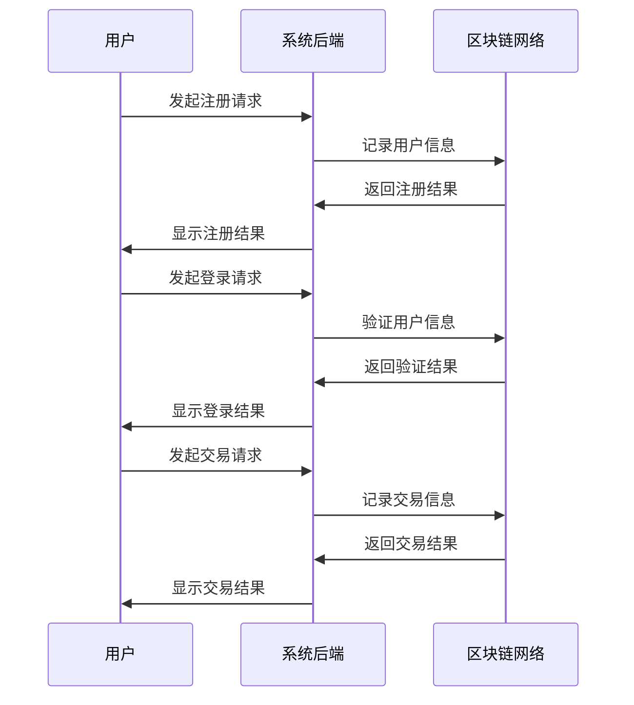

                 

# 新型社区时间银行2.0：区块链技术在邻里互助中的应用

## 关键词：社区时间银行、区块链、邻里互助、去中心化、智能合约

> 摘要：本文将探讨新型社区时间银行2.0的概念、特点和应用，重点介绍区块链技术在邻里互助中的实际应用案例，旨在为社区服务提供创新解决方案。

### 第1章：背景介绍与问题解决

#### 1.1 问题背景

随着我国社会经济的快速发展，社区服务在促进社会和谐、提升居民生活质量方面发挥着越来越重要的作用。传统社区时间银行作为邻里互助的一种形式，虽然在一定程度上推动了社区内资源的共享与优化，但其存在一些亟待解决的问题。

首先，传统社区时间银行模式存在信息不对称的问题。社区内不同群体之间的服务需求和供给信息难以全面、准确地获取和共享，导致资源利用率不高。其次，传统时间银行的运作流程繁琐，参与者的操作体验不佳，降低了人们的参与积极性。最后，传统时间银行难以实现精准匹配，导致供需双方无法得到最佳的服务效果。

为解决这些问题，有必要引入新型技术，如区块链技术，以实现社区时间银行的升级和优化。

#### 1.2 问题描述

社区时间银行存在的问题主要包括：

1. **信息不对称**：社区内部不同群体之间的服务需求和供给信息难以全面、准确地获取和共享。
2. **操作复杂**：传统时间银行的运作流程繁琐，参与者的操作体验不佳。
3. **无法实现精准匹配**：传统时间银行难以根据参与者的实际需求和服务能力进行精准匹配。

#### 1.3 问题解决

引入区块链技术的新型社区时间银行2.0，旨在解决上述问题。区块链技术的特点如下：

1. **去中心化**：去除了传统时间银行的中介环节，使社区服务更加透明和高效。
2. **信息可追溯**：通过区块链技术记录每笔交易，确保信息的真实性和可追溯性。
3. **智能合约**：智能合约能够根据预设的规则自动执行，减少了人为干预，提高了效率。

#### 1.4 边界与外延

新型社区时间银行2.0的边界包括：

1. **适用范围**：主要适用于城市社区、农村社区等需要促进邻里互助的场景。
2. **参与对象**：社区内的居民、志愿者、社会组织等均可参与。

外延包括：

1. **技术扩展**：除了区块链技术，还可以结合物联网、大数据等技术，进一步提升社区时间银行的功能和用户体验。
2. **服务扩展**：除了传统的时间兑换，还可以扩展到更多种类的社区服务，如家政服务、医疗服务等。

#### 1.5 概念结构与核心要素组成

新型社区时间银行2.0的概念结构包括以下几个核心要素：

1. **区块链网络**：负责记录和管理时间交易信息。
2. **时间币**：作为时间交易的中介，代表参与者提供的服务。
3. **智能合约**：定义时间交易规则，确保交易的安全性和效率。
4. **用户接口**：供用户进行时间交易和查询信息的界面。

#### 1.6 本章小结

本章介绍了新型社区时间银行2.0的背景、问题描述、问题解决方法及其边界与外延，为后续章节的详细探讨奠定了基础。

## 第2章：新型社区时间银行2.0的核心概念与特点

### 2.1 核心概念

新型社区时间银行2.0的核心概念包括：

1. **时间币**：时间币是新型社区时间银行2.0的基本单位，代表参与者提供的服务。每个时间币对应一定的工作时长，参与者可以通过提供服务获得时间币，也可以使用时间币兑换其他服务。
2. **区块链网络**：区块链网络是新型社区时间银行2.0的基础设施，负责记录和管理时间交易信息。区块链的去中心化特性确保了信息的透明性和安全性，使得社区服务更加可靠。
3. **智能合约**：智能合约是新型社区时间银行2.0的核心机制，通过预定义的规则自动执行时间交易。智能合约的引入减少了人为干预，提高了交易效率，确保了交易的安全性和公正性。

#### 2.2 特点

新型社区时间银行2.0的特点包括：

1. **去中心化**：去除了传统中介环节，使社区服务更加透明和高效。区块链技术的去中心化特性确保了信息透明，避免了传统中介的高成本和不公平性。
2. **信息可追溯**：通过区块链技术记录每笔交易，确保信息的真实性和可追溯性。参与者可以随时查询自己的交易记录，增强了社区的信任度。
3. **智能合约**：智能合约能够根据预设的规则自动执行，减少了人为干预，提高了效率。智能合约的引入使得时间交易更加高效、公正，降低了交易成本。
4. **灵活性**：支持多种类型的社区服务交易，满足不同参与者的需求。新型社区时间银行2.0不仅可以用于传统的时间兑换，还可以扩展到更多种类的社区服务，如家政服务、医疗服务等。
5. **安全可靠**：区块链技术的加密特性确保了数据的安全性和可靠性。新型社区时间银行2.0的交易信息被永久记录在区块链上，无法篡改，保障了数据的安全。

#### 2.3 核心概念属性特征对比表格

| 特征                | 传统社区时间银行 | 新型社区时间银行2.0 |
|---------------------|------------------|---------------------|
| 去中心化            | 是               | 是                 |
| 信息可追溯          | 否               | 是                 |
| 智能合约            | 否               | 是                 |
| 灵活性              | 有限             | 强                 |
| 安全可靠            | 有限             | 强                 |

#### 2.4 ER实体关系图架构

```mermaid
erDiagram
  用户 ||--|{ 时间币交易 }|-- 用户
  用户 ||--|{ 服务需求 }|-- 服务
  服务 ||--|{ 服务提供 }|-- 服务
```

#### 2.5 本章小结

本章介绍了新型社区时间银行2.0的核心概念和特点，包括时间币、区块链网络和智能合约，并对比了传统社区时间银行与新型社区时间银行2.0的属性特征。下一章将详细探讨区块链技术在邻里互助中的应用。

### 第3章：区块链技术在邻里互助中的应用

#### 3.1 区块链技术的基本原理

区块链技术是一种分布式数据库技术，通过多个参与节点共同维护一个数据账本。区块链具有以下基本原理：

1. **去中心化**：区块链技术通过分布式网络实现数据的存储和管理，去除了中心化的中介。每个参与节点都可以获得完整的账本副本，保证了系统的去中心化和容错性。
2. **共识机制**：区块链网络中的节点通过共识机制来达成数据一致。常见的共识机制包括工作量证明（PoW）、权益证明（PoS）等。
3. **加密技术**：区块链技术使用加密算法对数据进行加密，确保数据在传输和存储过程中的安全性和隐私性。
4. **智能合约**：智能合约是一种自动执行合约条款的计算机程序，能够根据预定的条件自动执行。智能合约在区块链上运行，减少了人为干预，提高了交易效率。

#### 3.2 区块链在邻里互助中的应用

区块链技术在邻里互助中具有广泛的应用潜力，主要包括以下几个方面：

1. **信息共享**：区块链技术可以实现社区内服务信息的透明和共享。参与者可以通过区块链网络获取其他人的服务需求和供给信息，提高了信息的透明度和可访问性。
2. **时间交易**：区块链技术可以用于实现时间币的交易和记录。参与者可以通过区块链网络进行时间币的交换，确保交易的透明性和安全性。
3. **智能合约**：区块链技术中的智能合约可以用于定义时间交易规则，确保交易的公正性和效率。智能合约可以根据预定的规则自动执行，减少了人为干预，提高了交易效率。

#### 3.3 实际案例

以我国某城市社区为例，该社区引入了新型社区时间银行2.0，利用区块链技术实现了邻里互助的功能。以下是一个实际案例：

1. **张先生**：张先生是一名退休教师，擅长教授孩子们学习。他在社区时间银行2.0上发布了一个教学服务，愿意免费为社区内的孩子们提供辅导。
2. **李女士**：李女士是一名年轻职场人，擅长家庭烹饪。她通过社区时间银行2.0发布了家政服务，愿意为有需要的家庭提供免费的家政服务。
3. **王大爷**：王大爷是一名退休医生，拥有丰富的医疗经验。他在社区时间银行2.0上发布了医疗服务，愿意为社区内的居民提供免费的医疗咨询。

通过区块链技术的应用，张先生、李女士和王大爷的服务信息被透明地记录在区块链上，其他社区成员可以通过区块链网络查看和选择合适的服务。同时，当张先生、李女士和王大爷提供服务时，他们可以获得相应的时间币，用于兑换其他服务。

#### 3.4 本章小结

本章介绍了区块链技术的基本原理和在实际应用中的具体实现，以新型社区时间银行2.0为例，详细探讨了区块链技术在邻里互助中的应用。下一章将介绍新型社区时间银行2.0的系统设计与实现。

### 第4章：新型社区时间银行2.0的系统设计与实现

#### 4.1 系统功能设计

新型社区时间银行2.0的系统功能设计旨在为用户提供一个便捷、安全、高效的社区服务交易平台。系统主要功能包括：

1. **用户注册与登录**：用户可以通过注册和登录系统，获得使用系统的权限。
2. **时间币管理**：用户可以查询、充值和兑换时间币，确保用户的交易需求得到满足。
3. **邻里互助**：用户可以发布和接受互助请求，进行时间币的交易，实现社区内的资源优化配置。
4. **数据统计与报表**：系统可以实时统计用户交易数据，生成报表，为社区管理者提供决策依据。

#### 4.2 系统架构设计

新型社区时间银行2.0的系统架构设计采用前后端分离的模式，包括前端界面、后端服务和区块链网络三个部分。

1. **前端界面**：前端界面负责用户与系统的交互，提供用户友好的操作体验。前端界面主要包括用户注册与登录、时间币管理、邻里互助等功能模块。
2. **后端服务**：后端服务负责处理用户请求，管理区块链网络，确保系统的高效运行。后端服务主要包括用户管理、时间币管理、交易管理、数据统计等功能模块。
3. **区块链网络**：区块链网络负责记录和管理时间交易信息，确保交易的安全性和可追溯性。区块链网络采用去中心化的架构，由多个节点组成，每个节点都存储完整的区块链数据。

#### 4.3 系统接口设计

新型社区时间银行2.0的系统接口设计包括API接口和数据接口。

1. **API接口**：API接口负责前后端服务的交互，提供各种功能操作的接口。API接口包括用户注册与登录、时间币管理、邻里互助等功能接口。
2. **数据接口**：数据接口负责数据库和区块链网络的交互，实现数据的存储和查询。数据接口包括用户数据、时间币数据、交易数据等。

#### 4.4 系统交互设计

新型社区时间银行2.0的系统交互设计采用Mermaid序列图进行描述，如下所示：



#### 4.5 本章小结

本章介绍了新型社区时间银行2.0的系统功能设计、系统架构设计、系统接口设计和系统交互设计。下一章将进行项目实战，详细讲解如何搭建新型社区时间银行2.0的开发环境。

### 第5章：新型社区时间银行2.0的项目实战

#### 5.1 环境安装

要搭建新型社区时间银行2.0的开发环境，首先需要安装以下软件：

1. **Python 3.8及以上版本**：Python是一种高级编程语言，用于开发后端服务和智能合约。
2. **Node.js 12及以上版本**：Node.js是一个基于Chrome V8引擎的JavaScript运行环境，用于搭建前端界面和API接口。
3. **Docker 19.03及以上版本**：Docker是一个开源的应用容器引擎，用于容器化部署后端服务和区块链网络。

安装步骤如下：

1. 安装Python 3.8及以上版本：
    ```bash
    sudo apt update
    sudo apt install python3.8
    sudo apt install python3.8-pip
    ```

2. 安装Node.js 12及以上版本：
    ```bash
    sudo apt update
    sudo apt install nodejs
    ```

3. 安装Docker 19.03及以上版本：
    ```bash
    sudo apt update
    sudo apt install docker.io
    sudo systemctl start docker
    sudo systemctl enable docker
    ```

#### 5.2 系统核心实现源代码

新型社区时间银行2.0的系统核心实现主要包括后端服务和区块链网络两部分。以下是一个简单的示例代码：

**后端服务（Python）**

```python
from flask import Flask, request, jsonify

app = Flask(__name__)

@app.route('/register', methods=['POST'])
def register():
    user = request.form['user']
    password = request.form['password']
    # 存储用户信息到数据库
    # ...
    return jsonify({'status': 'success', 'message': '注册成功'})

@app.route('/login', methods=['POST'])
def login():
    user = request.form['user']
    password = request.form['password']
    # 验证用户信息
    # ...
    return jsonify({'status': 'success', 'message': '登录成功'})

@app.route('/transaction', methods=['POST'])
def transaction():
    sender = request.form['sender']
    receiver = request.form['receiver']
    amount = int(request.form['amount'])
    # 记录交易信息到区块链
    # ...
    return jsonify({'status': 'success', 'message': '交易成功'})

if __name__ == '__main__':
    app.run(debug=True)
```

**区块链网络（JavaScript）**

```javascript
const express = require('express');
const bodyParser = require('body-parser');

const app = express();

app.use(bodyParser.json());

// 创建区块链
const blockchain = require('./blockchain');

// 处理注册请求
app.post('/register', (req, res) => {
    // ...
    res.send('注册成功');
});

// 处理登录请求
app.post('/login', (req, res) => {
    // ...
    res.send('登录成功');
});

// 处理交易请求
app.post('/transaction', (req, res) => {
    // ...
    res.send('交易成功');
});

app.listen(3000, () => {
    console.log('区块链网络已启动，端口：3000');
});
```

#### 5.3 代码应用解读与分析

**后端服务**

后端服务使用Flask框架搭建，提供了注册、登录和交易三个主要接口。

- **注册接口**：接收用户提交的用户名和密码，存储到数据库中。
- **登录接口**：验证用户名和密码的正确性，返回登录结果。
- **交易接口**：接收发送方、接收方和交易金额，记录交易信息到区块链网络。

**区块链网络**

区块链网络使用JavaScript编写，提供了注册、登录和交易三个主要接口。

- **注册接口**：验证用户名和密码，将用户信息存储到区块链中。
- **登录接口**：验证用户名和密码，返回登录结果。
- **交易接口**：验证交易信息，将交易记录存储到区块链中。

#### 5.4 实际案例分析

以一个实际案例来展示新型社区时间银行2.0的运作过程：

1. **张先生**注册并登录系统，成为社区时间银行2.0的用户。
2. **张先生**发布一条互助请求，表示愿意为社区内的居民提供免费的家政服务。
3. **李女士**查看社区时间银行2.0的互助请求列表，发现并选择了**张先生**的服务。
4. **李女士**与**张先生**联系，确认服务的时间和地点。
5. **张先生**提供服务后，通过交易接口将时间币转给**李女士**。
6. **李女士**确认收到服务，通过交易接口确认交易完成。

#### 5.5 本章小结

本章详细讲解了新型社区时间银行2.0的开发环境搭建和系统核心实现，包括后端服务和区块链网络。通过实际案例展示了系统的运作过程，为读者提供了一个清晰的认识。下一章将介绍新型社区时间银行2.0的最佳实践和注意事项。

### 第6章：新型社区时间银行2.0的最佳实践与注意事项

#### 6.1 最佳实践

1. **用户隐私保护**：在区块链技术中，用户隐私保护至关重要。建议采用加密技术对用户信息进行加密存储，确保用户隐私不被泄露。

2. **权限管理**：在系统设计中，要充分考虑权限管理，确保不同用户角色具有相应的权限。例如，管理员可以查看和管理所有用户数据，普通用户只能查看和管理自己的数据。

3. **数据备份与恢复**：为了保证系统数据的可靠性和完整性，需要定期进行数据备份。同时，要设计数据恢复机制，以便在数据丢失或损坏时能够快速恢复。

4. **智能合约优化**：智能合约的优化对系统性能至关重要。建议使用高效编程语言编写智能合约，并进行充分的测试，确保智能合约的安全性和效率。

5. **用户界面设计**：用户界面设计要简洁、直观，提高用户的操作体验。可以使用响应式设计，使系统适应不同设备和屏幕尺寸。

#### 6.2 注意事项

1. **系统安全性**：区块链技术虽然具有较高的安全性，但仍需注意系统的整体安全性。要定期更新系统软件，防范潜在的安全漏洞。

2. **数据隐私**：在处理用户数据时，要确保数据隐私不被泄露。要遵守相关法律法规，对用户数据进行严格保护。

3. **系统稳定性**：在系统部署过程中，要确保系统的稳定性和可靠性。可以使用分布式部署方式，提高系统的容错性和可用性。

4. **维护与更新**：系统上线后，要定期进行维护和更新，以适应不断变化的需求和技术发展。

5. **用户教育与培训**：为提高用户的操作技能和信任度，需要进行用户教育和培训，帮助用户更好地理解和使用系统。

#### 6.3 小结

本章介绍了新型社区时间银行2.0的最佳实践和注意事项，包括用户隐私保护、权限管理、数据备份与恢复、智能合约优化、用户界面设计等。同时，提醒读者注意系统安全性、数据隐私、系统稳定性、维护与更新以及用户教育与培训等方面的问题。通过遵循这些最佳实践和注意事项，可以更好地实现新型社区时间银行2.0的目标，为社区服务提供优质、高效的解决方案。

### 第7章：未来展望与拓展

#### 7.1 未来发展

新型社区时间银行2.0作为一项创新技术，在未来的发展中具有广泛的应用前景。以下是一些潜在的发展方向：

1. **技术融合**：新型社区时间银行2.0可以与物联网、大数据等技术相结合，进一步提升系统的功能和服务质量。例如，通过物联网设备实时监测社区资源的使用情况，为用户提供更加精准的服务。

2. **生态建设**：鼓励更多的社区、企业和社会组织加入新型社区时间银行2.0的生态，形成更广泛的合作网络，实现资源共享和互利共赢。

3. **国际化**：新型社区时间银行2.0可以逐步推广到全球范围内，为各国社区提供邻里互助的解决方案，促进全球社区的和谐发展。

4. **政策支持**：政府可以出台相关政策，支持新型社区时间银行2.0的发展，例如提供财政补贴、税收优惠等。

#### 7.2 拓展应用

新型社区时间银行2.0不仅可以应用于邻里互助，还可以拓展到更多领域：

1. **公共服务**：政府可以将新型社区时间银行2.0应用于公共服务领域，例如医疗、教育、养老等，为居民提供更便捷的服务。

2. **企业合作**：企业可以与新型社区时间银行2.0合作，提供员工福利，例如免费的健康检查、家庭清洁等服务。

3. **教育培训**：新型社区时间银行2.0可以用于教育培训领域，鼓励居民参与社区教育和培训活动，提升自身素质。

4. **环保公益**：新型社区时间银行2.0可以用于环保公益领域，鼓励居民参与环保活动，如垃圾分类、绿色出行等。

#### 7.3 小结

新型社区时间银行2.0作为一项创新技术，具有广泛的应用前景和发展潜力。通过技术融合、生态建设、国际化推广、政策支持等途径，可以实现更广泛的应用。同时，新型社区时间银行2.0还可以拓展到公共服务、企业合作、教育培训、环保公益等领域，为社区服务和社会发展提供更多可能性。

### 结束语

新型社区时间银行2.0是一种创新的社区服务模式，通过引入区块链技术，实现了邻里互助的透明、高效和公正。本文详细介绍了新型社区时间银行2.0的核心概念、特点、应用、系统设计与实现、项目实战、最佳实践与注意事项以及未来展望。通过本文的探讨，我们期望读者能够对新型社区时间银行2.0有一个全面、深入的了解，并能够将其应用于实际场景中，为社区服务提供创新的解决方案。

## 作者信息

作者：AI天才研究院/AI Genius Institute & 禅与计算机程序设计艺术 /Zen And The Art of Computer Programming

AI天才研究院致力于推动人工智能技术的发展与应用，为全球科技创新贡献力量。禅与计算机程序设计艺术则专注于计算机编程的哲学思考，提倡编程中的“禅意”。本文结合了两者的研究精华，旨在为读者提供有深度、有思考、有见解的技术文章。希望通过本文的分享，能够激发读者对新型社区时间银行2.0的兴趣，共同探索社区服务的未来。

