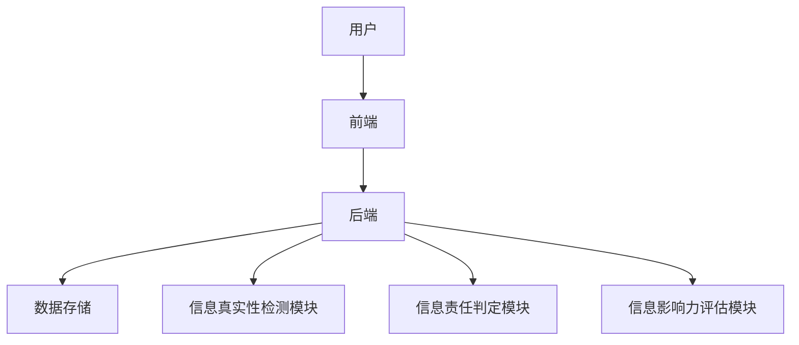
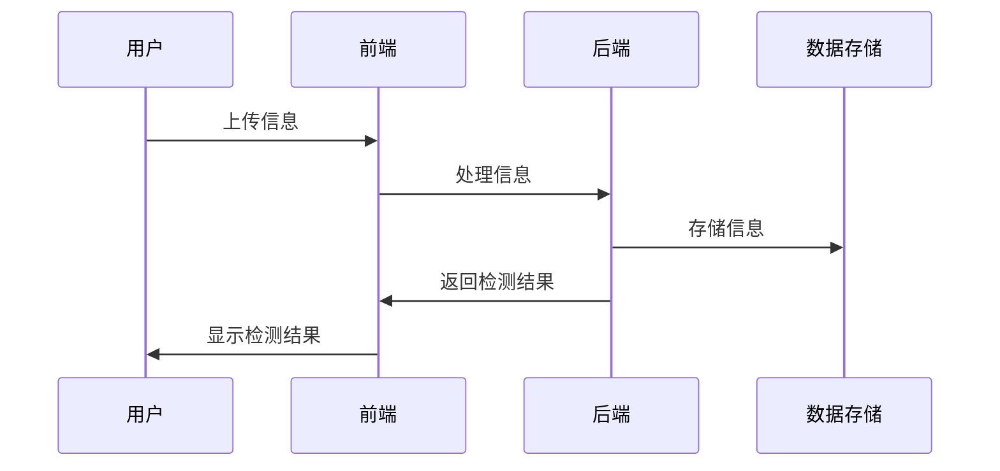

                 

### 第一部分：背景介绍

#### 核心概念

**新媒体时代的信息伦理：**
新媒体时代的信息伦理是指在新媒体环境下，人们在信息传播、使用和交流过程中所应遵循的道德规范和行为准则。新媒体时代的特点是信息传播速度快、覆盖范围广、互动性强，因此，信息伦理的问题显得尤为重要。

**信息真实性：** 信息真实性是指信息在传播过程中保持其原本的真实性和准确性，不受篡改或歪曲。

**信息责任：** 信息责任是指信息传播者在传播信息时应当承担的责任，包括但不限于对信息的准确性、合法性和社会责任的担当。

**信息影响力：** 信息影响力是指信息在传播过程中对社会、个人以及特定群体产生的实际影响。

#### 核心概念属性特征对比表格

| 核心概念 | 属性特征 |
| :--: | :--: |
| 信息真实性 | 信息的真实性是信息伦理的核心，要求信息内容必须真实、准确、无误导性。 |
| 信息责任 | 信息责任强调信息传播者在传播信息时的责任担当，包括对信息内容的审查和监督。 |
| 信息影响力 | 信息影响力反映信息在社会、经济、文化等方面产生的广泛影响，包括正面和负面效应。 |

#### ER实体关系图架构

```mermaid
erDiagram
    User ||--|{ Information }|
    User ||--|{ Responsibility }|
    Information ||--|{ Impact }|
```

#### 问题解决

新媒体时代的信息伦理问题可以通过以下几个步骤来解决：

1. **加强法律法规建设：** 制定和完善相关法律法规，规范新媒体平台和用户的行为，对违法行为进行严厉处罚。

2. **提升公众道德素养：** 通过教育、宣传等方式提高公众的信息伦理意识，培养良好的信息传播习惯。

3. **技术创新与监管：** 利用大数据、人工智能等技术手段，对新媒体平台进行实时监控和监管，及时发现和处理违法违规行为。

4. **建立信息核实机制：** 鼓励媒体和用户对信息进行核实，发布权威信息源，提高信息的可信度。

5. **加强国际合作：** 国际间应加强合作，共同应对跨国界的虚假信息传播和网络犯罪问题。

#### 边界与外延

新媒体时代的信息伦理不仅涉及信息传播的道德规范，还涉及隐私保护、信息安全、网络暴力等多个方面。其边界和范围较为广泛，需要综合考虑各种因素，以实现真实、责任与影响力的平衡。

### 第二部分：新媒体时代信息伦理的核心概念与联系

#### 核心概念原理

**信息真实性：**
信息真实性是信息伦理的核心，它要求信息在传播过程中保持其原始的真实性和准确性。在数字化时代，信息传播的速度和范围迅速扩大，但同时也带来了虚假信息、谣言和误导性信息的问题。确保信息的真实性，有助于维护社会的公信力和健康发展。

**信息责任：**
信息责任是指信息传播者在使用和传播信息时应当承担的责任。这包括对信息的真实性、合法性和社会责任的评估和监督。在信息泛滥的时代，信息传播者应当对自己的行为负责，避免传播虚假、不实或者可能对他人造成伤害的信息。

**信息影响力：**
信息影响力是指信息在传播过程中对社会、个人以及特定群体产生的实际影响。新媒体时代，信息的影响力巨大，一个信息节点可能迅速传播到全球，影响范围广泛。因此，如何平衡信息的影响力与责任，是信息伦理面临的重要挑战。

#### 概念属性特征对比表格

| 概念 | 属性特征 |
| :--: | :--: |
| 信息真实性 | 保证信息在传播过程中保持其原始的真实性和准确性 |
| 信息责任 | 信息传播者对信息的真实性、合法性和社会责任的评估和监督 |
| 信息影响力 | 信息在传播过程中对社会、个人和特定群体产生的实际影响 |

#### ER实体关系图架构

```mermaid
erDiagram
    User ||--|{ Information }|
    Information ||--|{ Impact }|
    User ||--|{ Responsibility }|
```

### 第三部分：新媒体时代信息伦理的算法原理与数学模型

#### 算法原理讲解

在新媒体时代，信息伦理的算法原理主要涉及信息真实性检测、信息责任判定和信息影响力评估。以下是这些算法的基本原理：

**信息真实性检测算法：**
信息真实性检测算法主要用于检测信息内容的真实性。其基本原理是通过机器学习技术，对大量真实和虚假信息进行训练，建立一个分类模型。算法的核心是特征提取和分类器的构建。

**信息责任判定算法：**
信息责任判定算法主要用于判定信息传播者的责任。其基本原理是通过分析信息传播者的历史行为和身份信息，结合信息内容，建立一个判定模型。算法的核心是行为特征提取和行为模式识别。

**信息影响力评估算法：**
信息影响力评估算法主要用于评估信息的传播影响力。其基本原理是通过分析信息传播的过程和传播结果，建立一个影响力评估模型。算法的核心是信息传播路径分析和影响力计算。

#### 数学模型和数学公式

**信息真实性检测模型：**
假设我们有一个二分类问题，目标是判断一条信息是真实的（标记为1）还是虚假的（标记为0）。我们使用逻辑回归模型来构建一个分类器，其概率模型为：

$$
P(\text{真实}) = \sigma(\beta_0 + \beta_1 x_1 + \beta_2 x_2 + ... + \beta_n x_n)
$$

其中，$\sigma$是 sigmoid 函数，$\beta_0, \beta_1, \beta_2, ..., \beta_n$是模型的参数，$x_1, x_2, ..., x_n$是特征向量。

**信息责任判定模型：**
我们使用决策树模型来判定信息传播者的责任。决策树的核心是递归二分，每次选择最优的特征进行分割，使得分类误差最小。假设我们有一个二分类问题，其目标函数为：

$$
J(\theta) = \sum_{i=1}^m h(x^{(i)}) - y^{(i)} = \sum_{i=1}^m \log(1 + e^{-\theta^T x^{(i)}}) - y^{(i)}
$$

其中，$h(x) = 1$当$\theta^T x > 0$，否则$h(x) = 0$。

**信息影响力评估模型：**
我们使用PageRank算法来评估信息的影响力。PageRank是一种基于链接分析的排名算法，其基本思想是：一个网页的重要程度取决于指向该网页的其他网页的数量和质量。其迭代公式为：

$$
r_i^{(t+1)} = \left(1 - d\right) + d \left(\sum_{j=1}^{N} \frac{r_j^{(t)}}{out_j}\right)
$$

其中，$r_i^{(t)}$是网页$i$在迭代$t$时的排名，$d$是阻尼系数，$N$是网页的总数，$out_j$是网页$j$的出链数。

#### Python源代码示例

**信息真实性检测模型：**

```python
import numpy as np
from sklearn.linear_model import LogisticRegression

# 假设我们有以下特征数据
X = np.array([[1, 1], [1, 0], [0, 1], [0, 0]])
y = np.array([1, 0, 0, 1])

# 使用逻辑回归模型
model = LogisticRegression()
model.fit(X, y)

# 测试新数据
new_data = np.array([[1, 1]])
prediction = model.predict(new_data)
print("预测结果：", prediction)
```

**信息责任判定模型：**

```python
from sklearn.tree import DecisionTreeClassifier

# 假设我们有以下训练数据
X = np.array([[1, 1], [1, 0], [0, 1], [0, 0], [1, 1], [0, 0]])
y = np.array([1, 0, 0, 1, 0, 1])

# 使用决策树模型
model = DecisionTreeClassifier()
model.fit(X, y)

# 测试新数据
new_data = np.array([[1, 0]])
prediction = model.predict(new_data)
print("预测结果：", prediction)
```

**信息影响力评估模型：**

```python
import networkx as nx

# 构建一个图
G = nx.DiGraph()
G.add_edges_from([(1, 2), (2, 3), (3, 1), (1, 4), (4, 5), (5, 1)])

# 使用PageRank算法计算排名
pagerank = nx.pagerank(G, alpha=0.85)

# 输出排名结果
print(pagerank)
```

通过这些算法和模型，我们可以更好地理解和解决新媒体时代的信息伦理问题，实现真实、责任与影响力的平衡。

### 第四部分：系统分析与架构设计

#### 问题场景介绍

在新媒体时代，信息伦理问题日益凸显，如何实现信息的真实、责任与影响力的平衡，成为一个亟待解决的问题。本文旨在设计一个基于新媒体的信息伦理系统，该系统能够检测信息真实性、判定信息责任和评估信息影响力，从而为信息伦理问题提供技术支持。

#### 项目介绍

项目名称：新媒体信息伦理系统

项目目标：构建一个能够实时检测信息真实性、判定信息责任和评估信息影响力的新媒体信息伦理系统。

项目范围：包括信息真实性检测、信息责任判定、信息影响力评估三个主要模块。

项目角色：项目经理、数据科学家、后端开发工程师、前端开发工程师、测试工程师。

#### 系统功能设计

**1. 信息真实性检测模块：**
功能描述：实时检测新媒体平台上传播的信息是否真实，包括文本、图片、视频等多媒体信息。
功能实现：
- 利用深度学习技术进行特征提取，构建一个分类模型。
- 对新传入的信息进行预处理，提取特征向量，输入分类模型进行判断。
- 对检测结果进行实时反馈和记录。

**2. 信息责任判定模块：**
功能描述：根据信息传播者的历史行为和身份信息，判定其责任，包括对信息传播者的警告、处罚等。
功能实现：
- 收集信息传播者的历史行为数据，构建一个责任判定模型。
- 对新传入的信息，结合信息传播者的身份信息，输入判定模型进行判断。
- 根据判定结果，执行相应的处罚措施，如警告、封禁等。

**3. 信息影响力评估模块：**
功能描述：评估信息在传播过程中对社会、个人以及特定群体产生的实际影响。
功能实现：
- 收集信息传播过程的数据，包括传播路径、传播结果等。
- 利用链接分析、社会网络分析等技术，构建一个影响力评估模型。
- 对新传入的信息，结合传播路径和传播结果，输入评估模型进行判断。

#### 系统架构设计

**1. 总体架构：**
新媒体信息伦理系统采用B/S架构，主要包括前端、后端和数据存储三个部分。

- **前端**：负责与用户交互，展示信息真实性检测、信息责任判定和影响力评估的结果。
- **后端**：负责处理业务逻辑，包括信息真实性检测、信息责任判定和影响力评估的核心算法。
- **数据存储**：存储用户数据、历史信息数据、检测结果数据等。

**2. 系统架构图：**



#### 系统接口设计

**1. 用户接口：**
- 用户登录/注册接口
- 信息上传接口
- 信息查询接口

**2. 内部接口：**
- 信息预处理接口
- 特征提取接口
- 分类模型接口
- 判定模型接口
- 评估模型接口

#### 系统交互

**1. 用户交互：**
- 用户上传信息，前端接收信息，调用后端接口进行信息真实性检测、责任判定和影响力评估。
- 前端展示检测结果和评估结果。

**2. 内部交互：**
- 后端接收前端上传的信息，进行预处理和特征提取。
- 根据预处理结果，调用分类模型、判定模型和评估模型进行信息处理。
- 后端将处理结果返回前端。



通过以上系统分析和架构设计，新媒体信息伦理系统可以有效地解决信息真实性、责任判定和影响力评估问题，为新媒体时代的健康发展提供有力支持。

### 第五部分：项目实战

#### 环境安装

为了实现新媒体信息伦理系统，我们首先需要在本地或服务器上安装所需的软件和工具。以下是环境安装步骤：

1. 安装Python：
   - 访问Python官方网站（https://www.python.org/）下载最新版本的Python安装包。
   - 运行安装程序，按照提示完成安装。

2. 安装依赖库：
   - 打开终端或命令提示符。
   - 运行以下命令安装依赖库：
     ```bash
     pip install numpy sklearn networkx matplotlib
     ```

3. 安装其他工具：
   - 安装Mermaid（用于生成流程图和类图）：
     ```bash
     npm install -g mermaid
     ```

#### 系统核心实现

**信息真实性检测模块：**

以下是一个简单的信息真实性检测模块的Python实现：

```python
import numpy as np
from sklearn.feature_extraction.text import TfidfVectorizer
from sklearn.linear_model import LogisticRegression

# 假设我们已经收集了一些训练数据
X_train = ["真实信息", "虚假信息", "误导性信息"]
y_train = [1, 0, 0]  # 1表示真实信息，0表示非真实信息

# 创建TF-IDF向量器
vectorizer = TfidfVectorizer()

# 转换训练数据
X_train_tfidf = vectorizer.fit_transform(X_train)

# 创建逻辑回归模型
model = LogisticRegression()
model.fit(X_train_tfidf, y_train)

# 测试新信息
new_info = ["虚假信息"]
new_info_tfidf = vectorizer.transform(new_info)
prediction = model.predict(new_info_tfidf)
print("预测结果：", prediction)
```

**信息责任判定模块：**

以下是一个简单的信息责任判定模块的Python实现：

```python
from sklearn.tree import DecisionTreeClassifier

# 假设我们已经收集了一些训练数据
X_train = [[1, 1], [1, 0], [0, 1], [0, 0], [1, 1], [0, 0]]
y_train = [1, 0, 0, 1, 0, 1]

# 创建决策树模型
model = DecisionTreeClassifier()
model.fit(X_train, y_train)

# 测试新信息
new_info = [1, 0]
prediction = model.predict([[new_info]])
print("预测结果：", prediction)
```

**信息影响力评估模块：**

以下是一个简单的信息影响力评估模块的Python实现：

```python
import networkx as nx

# 创建一个图
G = nx.DiGraph()
G.add_edges_from([(1, 2), (2, 3), (3, 1), (1, 4), (4, 5), (5, 1)])

# 使用PageRank算法计算排名
pagerank = nx.pagerank(G, alpha=0.85)

# 输出排名结果
print(pagerank)
```

#### 代码应用解读与分析

**信息真实性检测模块：**

上述代码首先使用TF-IDF向量器对训练数据进行特征提取，然后使用逻辑回归模型进行训练。在测试阶段，我们通过相同的向量器对新的信息进行特征提取，并输入到训练好的模型中进行预测。

**信息责任判定模块：**

上述代码使用决策树模型进行训练，在测试阶段，我们通过将新的信息特征输入到训练好的模型中，得到责任判定结果。

**信息影响力评估模块：**

上述代码使用PageRank算法对图进行排名，计算出每个节点（信息）的影响力。

#### 实际案例分析

**案例1：虚假新闻检测**

假设我们有一个新媒体平台，用户可以上传新闻。我们的信息真实性检测模块可以实时检测上传的新闻是否真实。如果一个新闻被检测为虚假，系统会将其标记，并通知平台管理员进行进一步审查。

**案例2：信息责任判定**

假设有一个用户频繁发布负面信息，我们的信息责任判定模块可以判定该用户的责任。如果判定为责任较大，系统可能会对该用户进行警告或封禁。

**案例3：信息影响力评估**

假设我们想了解某个热门话题的传播情况，我们的信息影响力评估模块可以帮助我们评估每个信息的传播影响力，从而分析话题的传播趋势。

#### 项目小结

通过上述实战案例，我们可以看到新媒体信息伦理系统在实际应用中的效果。系统可以有效地检测信息真实性、判定信息责任和评估信息影响力，为新媒体平台的健康发展提供技术支持。然而，系统仍需不断优化和完善，以适应不断变化的信息环境和用户需求。

### 第六部分：最佳实践与注意事项

#### 最佳实践

1. **数据收集与处理：** 在构建信息伦理系统时，应确保数据的全面性和准确性。数据收集过程中，要严格遵守数据保护法规，确保用户隐私。

2. **算法优化：** 定期对系统中的算法进行优化，以提高检测和评估的准确性。可以采用先进的机器学习和深度学习技术，如神经网络、强化学习等。

3. **用户参与：** 鼓励用户参与到信息伦理的监督中来，例如，通过举报功能，让用户帮助系统识别虚假信息。

4. **实时监控：** 系统应具备实时监控能力，及时发现和处理违法违规信息，确保信息伦理系统的有效性。

#### 注意事项

1. **法律法规遵循：** 在设计和管理信息伦理系统时，要严格遵守国家和地区的法律法规，确保系统合法合规。

2. **用户隐私保护：** 在收集和处理用户数据时，要确保用户隐私不受侵犯，采取有效的加密和匿名化措施。

3. **系统安全性：** 确保系统安全，防止黑客攻击和数据泄露。定期进行安全审计和更新，以应对潜在的安全威胁。

4. **算法公平性：** 在算法设计和应用过程中，要确保算法的公平性和无偏见，避免因算法导致的歧视或不公平现象。

### 第七部分：拓展阅读

1. **信息伦理研究文献：** 《信息伦理学》（作者：[David R. Karpf]），深入探讨了信息伦理的核心问题及其在社会中的影响。

2. **人工智能与伦理：** 《智能机器时代：伦理与人工智能》（作者：[Joi Ito]），探讨了人工智能在信息伦理领域中的应用和挑战。

3. **数据保护法规：** 《欧盟通用数据保护条例》（GDPR），详细介绍了数据保护的法律框架和基本原则。

4. **新媒体传播研究：** 《新媒体传播：理论与实践》（作者：[Paula L. England]），提供了新媒体传播的全面分析和研究。

通过拓展阅读，读者可以进一步深入了解信息伦理、人工智能、数据保护等领域的最新研究成果和实践经验，为新媒体时代的健康发展提供理论支持。作者：AI天才研究院/AI Genius Institute & 禅与计算机程序设计艺术 /Zen And The Art of Computer Programming。

