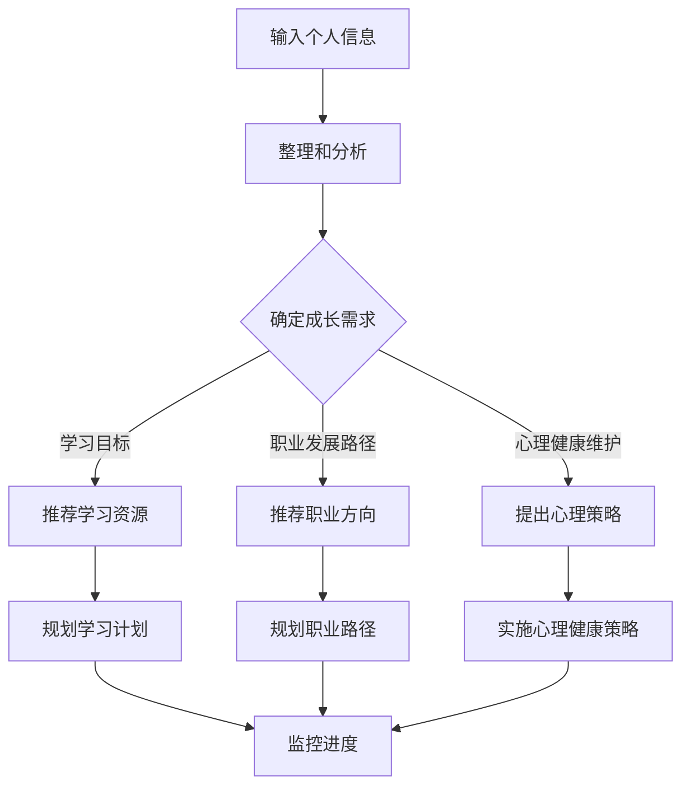

                 

### 引言

#### 新时代背景下的成长需求

在快速变革的当今社会，成长已经成为每个人都需要面对的重要课题。随着科技的发展、信息的爆炸、人际关系的复杂化，新时代对个体成长提出了全新的要求。过去，成长往往被定义为外在成就的积累，如职业晋升、经济收入和社会地位的提升。然而，新时代背景下，单纯的物质成就已不足以满足人们内心的追求，人们更加渴望在精神层面实现自我价值。

##### 成长定义的演变

传统的成长观念注重外在表现，如财富、地位和声望，这种观念源于社会对成功标准的定义。然而，随着时代的发展，人们开始意识到，真正的成长不仅仅是外在成就的积累，更是内在素质的提升和自我价值的实现。内在觉醒成为新时代成长的新内涵，它意味着个体在精神层面达到新的高度，从而实现全方位的成长。

#### 本文主题

本文将以《新时代的成长定义：从外在成就到内在觉醒》为题，探讨新时代背景下成长的新定义及其内涵。我们将分三个部分进行论述：

1. **第一部分：外在成就的追求**：分析传统成就观与新时代成就观的差异，探讨外在成就的路径、挑战与应对。

2. **第二部分：内在觉醒的探索**：阐述内在觉醒的意义、路径和实践，探讨如何通过内在觉醒实现个人成长。

3. **第三部分：新时代的成长融合**：讨论外在成就与内在觉醒的平衡，新时代成长者的特质和行动指南。

通过这篇文章，希望读者能够对新时代的成长有更深刻的认识，找到适合自己的成长路径，实现全方位的自我提升。

### 第一部分：外在成就的追求

#### 第1章：传统成就观与新时代的差异

##### 1.1 传统的成就观

传统的成就观主要侧重于外在的、物质化的标准。在过去的几千年里，社会对成功的定义往往集中在财富、地位和声望上。这种观念源于农业社会和工业社会的需要，当时社会结构和经济模式相对单一，成功意味着拥有足够的物质资源和社会地位，以确保个人和家庭的安全和稳定。

在传统成就观中，财富被视为成功的核心标志。人们通过努力工作和创业积累财富，以提升生活品质和社会地位。经济收入和社会地位直接相关，高收入往往意味着更高的社会地位，从而带来更多的社会资源和机会。

此外，声望也是传统成就观的重要组成部分。在农业社会和工业社会中，声望与个人的社会地位和影响力密切相关。拥有良好的声望意味着能够获得更多的社会尊重和信任，从而在社会中占据更有利的位置。

##### 1.2 新时代成就观的转型

然而，随着科技的发展、社会结构的变迁和人们对生活质量的追求，新时代的成就观正在发生深刻的转型。新时代的成就观不再仅仅关注外在的物质成就，更加注重内在的精神满足和自我实现。

首先，新时代成就观强调个人价值的实现。随着社会的发展，人们越来越意识到，真正的成功不仅仅在于拥有财富和社会地位，更在于实现自我价值，找到自己在社会中的位置和意义。个人价值的实现意味着个体能够在自己的工作和生活中找到满足感和成就感，实现自我价值的最大化。

其次，新时代成就观重视精神层面的成长。物质成就固然重要，但精神层面的成长同样不可或缺。新时代的社会环境更加多元和复杂，人们面临的压力和挑战也更大。因此，如何在精神层面保持健康和平衡，实现内心的平静和满足，成为新时代成就观的重要组成部分。

此外，新时代成就观还强调人际关系的建设。在传统成就观中，人际关系往往被忽视，但新时代的社会结构和经济模式要求个体具备更强的人际交往能力，以适应快速变化的社会环境。建立良好的人际关系，不仅能够帮助个体更好地实现个人价值，还能提高生活质量和工作效率。

##### 1.3 成就与幸福的边界

在探讨新时代成就观时，我们不能不提及成就与幸福的边界问题。传统观念中，成就与幸福往往被等同对待，认为实现了外在的成就就等同于获得了幸福。然而，随着对幸福研究的深入，人们逐渐认识到，成就与幸福并非完全等同。

成就更多指的是外在的、物质化的结果，而幸福则是一种内在的、精神上的体验。一个人可能在事业上取得了巨大的成就，但并不意味着他一定幸福。幸福涉及多个方面，包括身心健康、人际关系、自我实现等，而这些方面并不仅仅是外在成就所能涵盖的。

新时代成就观强调，真正的幸福不仅仅在于外在的成就，更在于内心的满足和平静。一个人可能在物质上并不富有，但在精神上却非常充实和满足，这样的状态才是真正的幸福。

总之，新时代成就观与传统成就观有着显著的区别。新时代成就观更加注重个人价值的实现、精神层面的成长和人际关系的建设，强调成就与幸福的边界，旨在帮助个体实现全方位的成长和幸福。这种转变不仅反映了社会发展的需求，也为个体成长提供了新的方向和路径。

#### 第2章：外在成就的路径

##### 2.1 职业发展的路径

职业发展是外在成就的重要组成部分，它不仅影响着个人的经济收入和社会地位，还决定了个人的职业满意度与成就感。在新时代背景下，职业发展的路径呈现出多样化和个性化的特点。

首先，职业发展的路径从传统的线性模式逐渐转向多元化的网络模式。过去，职业发展往往遵循“升学-就业-晋升”的线性路径，而新时代的职业发展更加灵活和多样化。人们可以通过创业、跳槽、转行等方式实现职业目标，不再受限于单一的职业路径。

其次，职业发展路径更加注重跨领域和跨行业的技能积累。在全球化背景下，技术和市场的变化速度加快，职业竞争日益激烈。为了适应这种变化，个人需要不断学习新技能、拓展新领域，以提高自己的竞争力和适应力。

最后，职业发展路径更加关注个人兴趣和价值观的实现。新时代的人们更加注重工作与生活的平衡，追求在工作中找到自己的兴趣和激情。这种兴趣驱动的职业发展路径，不仅能够提高个人的职业满意度，还能带来更高的工作绩效和创新能力。

##### 2.2 经济收入的增长

经济收入是衡量个人成就的重要指标之一，也是新时代人们追求的重要目标。在新时代背景下，经济收入的增长路径呈现出以下特点：

首先，收入来源的多样化。随着互联网和科技的发展，新兴行业和创业机会不断涌现，个人可以通过多种途径获得收入。例如，通过在线教育、电子商务、自媒体等平台实现收入增长。

其次，技能和知识的重要性日益凸显。在新时代，知识和技能成为个人获取高收入的关键。拥有高技能和专业知识的人更容易获得高薪职位和创业机会，从而实现经济收入的快速增长。

最后，投资和理财成为经济收入增长的重要途径。通过合理配置资产，投资于股票、房地产、基金等金融产品，个人可以在不增加劳动负担的情况下实现财富的增值。

##### 2.3 社会地位的提升

社会地位是外在成就的重要体现，它不仅关系到个人的社会认可和尊重，还影响到个人的生活质量和社会资源的获取。在新时代背景下，社会地位的提升路径具有以下特点：

首先，社会地位的评估标准更加多元。过去，社会地位往往通过职业、财富和声望等单一指标进行评估，而新时代的社会地位评估更加注重个人的综合素质和贡献。例如，在科技创新、社会公益、文化贡献等方面都有可能获得社会认可。

其次，社会地位的提升途径更加多样。个人可以通过学术成就、创业成功、社会贡献等多种途径提升社会地位。同时，随着社交媒体和互联网的发展，个人也可以通过在线平台展示自己的才华和价值，从而获得更广泛的认可和关注。

最后，社会地位提升更加注重个人品牌的塑造。在新时代，个人品牌成为提升社会地位的重要手段。通过建立良好的个人品牌，个人可以在社会中获得更高的声望和认可，从而提升社会地位。

总之，新时代的外在成就路径更加多元化、个性化和综合化。个人需要在职业发展、经济收入和社会地位等方面进行全方位的规划和努力，以实现自己的外在成就目标。

#### 第3章：外在成就的挑战与应对

##### 3.1 成就感的获得与失去

成就感是外在成就的重要体现，它不仅反映了个人在职业、经济和社会方面的成就，还满足了个体内心的成就感需求。然而，成就感的获得与失去往往伴随着一系列挑战。

首先，成就感容易受到外界评价的影响。在现代社会中，人们往往通过比较和竞争来获得成就感。然而，这种比较和竞争往往导致内心焦虑和压力，成就感变得不稳定。因此，如何在外界评价中保持内心的平静和成就感，成为新时代成长的重要课题。

其次，成就感的获得与失去也受到个人心态的影响。当一个人追求外在成就时，如果过于依赖成就感的获得，一旦遭遇挫折或失败，就容易陷入沮丧和失落。相反，如果能够保持积极的心态，正确看待成就感的获得与失去，就能更好地应对生活中的挑战。

##### 3.2 职场压力与心理健康

职场压力是外在成就追求过程中普遍面临的问题。在追求职业发展的过程中，个人往往需要付出更多的时间和精力，面对更高的工作要求和竞争压力。这种压力如果不能有效应对，会对心理健康产生负面影响。

首先，职场压力可能导致心理焦虑和抑郁。长时间的工作压力和频繁的加班，使得个体心理负担加重，容易出现焦虑、失眠、抑郁等心理问题。

其次，职场压力可能影响人际关系。在高压环境下，个人往往更容易情绪化，容易与同事、上级和下属产生冲突，影响人际关系和工作氛围。

为了应对职场压力，首先需要个人调整心态，正确看待工作和生活的平衡。其次，可以通过合理安排工作时间和任务，提高工作效率，减少不必要的压力。此外，定期进行体育锻炼、放松训练和心理咨询，有助于缓解心理压力，维护心理健康。

##### 3.3 社交网络的成就展示

随着社交媒体的普及，人们通过社交网络展示自己的成就成为一种新的趋势。这种成就展示不仅反映了个人在职业、经济和社会方面的成就，还满足了个体内心的虚荣和成就感需求。然而，社交网络的成就展示也带来了一系列挑战。

首先，社交网络的成就展示容易导致心理不平衡。人们在社交网络上看到他人的成就，往往会产生羡慕和自卑情绪，导致内心的不平衡。这种心理不平衡可能导致焦虑和抑郁等心理问题。

其次，社交网络的成就展示可能造成现实与虚拟的差距。在社交网络上，人们往往只展示自己的成就和亮点，隐藏自己的困难和挫折。这种虚拟的成就展示与现实生活之间的差距，可能导致现实生活中的心理压力和孤独感。

为了应对社交网络的成就展示带来的挑战，首先需要个体保持理性和客观的心态，正确看待他人的成就和自己的生活。其次，可以通过分享自己的真实经历和感受，增加现实生活中的互动和联系，减少虚拟成就展示带来的心理压力。此外，个体还可以通过培养自己的兴趣爱好和人际关系，增强内心的满足感和幸福感，从而更好地应对社交网络的成就展示带来的挑战。

### 第二部分：内在觉醒的探索

#### 第4章：内在觉醒的意义

##### 4.1 内在觉醒的内涵

内在觉醒是指个体在精神层面达到一种新的认知状态，这种状态不仅仅是外在成就的积累，更是内在自我认知、情绪管理和精神追求的综合提升。内在觉醒意味着个体能够超越物质层面的追求，从内心深处找到自我价值的实现和生活的意义。

首先，内在觉醒涉及自我认知的提升。通过自我反思和内省，个体能够更清晰地认识到自己的优点和不足，从而实现自我成长和提升。这种自我认知的提升不仅能够帮助个体更好地应对生活中的挑战，还能增强内心的力量和自信心。

其次，内在觉醒强调情绪管理。情绪管理是内在觉醒的重要组成部分，它意味着个体能够在面对生活中的压力和挫折时，保持冷静和理智，避免情绪失控。通过情绪管理，个体能够更好地调节自己的心态，从而提升生活质量和工作效率。

最后，内在觉醒关注精神追求。在物质生活日益丰富的今天，人们更加追求内心的满足和精神层面的成长。内在觉醒使个体能够在精神上找到追求的方向，从而实现内心的平静和满足。

##### 4.2 内在觉醒的重要性

内在觉醒在个人成长中具有至关重要的意义。首先，内在觉醒能够帮助个体实现全面成长。外在成就只是个人成长的一部分，而内在觉醒则涉及到自我认知、情绪管理和精神追求等多个方面，从而实现全方位的个人提升。

其次，内在觉醒有助于提高生活质量。通过内在觉醒，个体能够更好地管理自己的情绪和心态，从而减少生活中的压力和焦虑。这种内心的平静和满足感，使个体能够更好地享受生活，提高生活质量。

最后，内在觉醒有助于建立健康的人际关系。内在觉醒使个体更加了解自己和他人，从而能够更好地与他人沟通和互动。这种理解和包容，有助于建立健康、积极的人际关系，从而提升个体的社会地位和幸福感。

总之，内在觉醒不仅是个人成长的重要路径，更是实现全面幸福的关键。通过内在觉醒，个体能够在精神层面找到自我价值的实现和生活的意义，从而实现真正的成长和幸福。

#### 第5章：内在觉醒的路径

##### 5.1 自我认知的提升

自我认知的提升是内在觉醒的关键步骤，它涉及到对自身性格、优点、缺点和价值观的深入理解。在新时代背景下，自我认知的提升不仅有助于个人的成长，还能提高生活质量和幸福感。

首先，自我认知的提升需要个体进行持续的自我反思。通过定期反思自己的行为、想法和感受，个体能够更清晰地认识到自己的优点和不足。这种方法不仅有助于自我成长，还能帮助个体制定更科学、有效的个人发展计划。

其次，自我认知的提升需要个体接受自己的不完美。每个人都有自己的优点和缺点，接受自己的不完美是自我认知提升的重要一步。通过接受自己的不完美，个体能够减少自我批评和负面情绪，从而更加积极地面对生活中的挑战。

最后，自我认知的提升需要个体建立正确的价值观。价值观是个人行为的指南针，通过建立正确的价值观，个体能够更明确自己的目标和方向，从而更加专注和坚定地追求自己的梦想。

##### 5.2 情绪管理的实践

情绪管理是内在觉醒的重要组成部分，它涉及到个体如何面对和处理生活中的各种情绪，如快乐、悲伤、愤怒和焦虑等。在新时代背景下，情绪管理的重要性日益凸显，因为情绪管理不仅影响个体的心理健康，还影响个体的生活质量和工作效率。

首先，情绪管理的实践需要个体学会识别自己的情绪。通过自我观察和反思，个体能够更好地了解自己的情绪状态，从而及时调整自己的心态和行为。

其次，情绪管理的实践需要个体学会调节自己的情绪。当个体遇到负面情绪时，通过深呼吸、冥想、运动等方法，个体能够有效地缓解情绪压力，保持内心的平静和冷静。

最后，情绪管理的实践需要个体学会积极面对生活中的挑战。通过积极的应对策略和解决问题的能力，个体能够更好地处理生活中的困难和挫折，从而提升情绪管理的水平。

##### 5.3 精神追求的探索

精神追求是内在觉醒的核心，它涉及到个体对生活意义的探索和对精神世界的追求。在物质生活日益丰富的今天，精神追求不仅能够满足个体内心的渴望，还能提升个体的生命质量和幸福感。

首先，精神追求的探索需要个体找到自己的精神归宿。每个人都有自己的精神追求，可能是对知识的渴望、对艺术的热爱，或是对自然的向往。找到自己的精神归宿，个体能够在精神上找到归属感和满足感。

其次，精神追求的探索需要个体保持内心的平静和开放。通过冥想、阅读和艺术创作等方式，个体能够提升自己的精神境界，找到内心的平静和宁静。

最后，精神追求的探索需要个体付诸实践。通过参与公益活动、志愿服务和社交活动，个体不仅能够实现自己的精神追求，还能为社会做出贡献，从而实现自我价值的最大化。

总之，内在觉醒的路径包括自我认知的提升、情绪管理的实践和精神追求的探索。通过这些路径，个体能够实现全方位的成长和提升，从而在新时代中找到自己的位置和意义。

#### 第6章：内在觉醒的实践

##### 6.1 内在觉醒的生活实践

内在觉醒的生活实践是个人成长的重要一环，它涉及到如何在日常生活中贯彻内在觉醒的理念，实现全方位的提升。以下是几个关键的生活实践步骤：

首先，建立健康的生活方式。健康的生活方式是实现内在觉醒的基础。个体可以通过规律作息、合理饮食和适量运动来保持身体健康，从而为内在觉醒提供良好的身体基础。

其次，培养良好的心态。良好的心态是内在觉醒的重要保障。个体可以通过冥想、放松训练和积极心理学等方法，培养积极的心态，从而在面对生活中的挑战时保持冷静和理智。

再次，重视自我反思。自我反思是内在觉醒的核心步骤。个体可以通过写日记、自我对话和心理咨询等方式，定期进行自我反思，了解自己的内心世界，从而实现自我认知的提升。

最后，关注人际关系。人际关系对个人的成长和幸福感具有重要影响。个体可以通过沟通技巧、同理心和合作精神，建立和谐的人际关系，从而在人际交往中实现内在觉醒。

##### 6.2 内在觉醒的心灵成长

内在觉醒的心灵成长是个人成长的高级阶段，它涉及到个体在精神层面的提升和探索。以下是几个关键的心灵成长实践步骤：

首先，深入阅读和思考。阅读和思考是心灵成长的重要途径。个体可以通过阅读哲学、心理学、文学等领域的书籍，深入思考生命的意义和价值的本质，从而提升自己的精神境界。

其次，实践冥想和静坐。冥想和静坐是心灵成长的有效方法。通过冥想和静坐，个体能够放松身心，平静内心，从而更好地认识自己，找到内心的平静和宁静。

再次，培养艺术爱好。艺术爱好是心灵成长的重要途径。个体可以通过绘画、音乐、舞蹈等方式，表达自己的情感和思想，从而实现心灵的升华和成长。

最后，参与心灵成长课程。心灵成长课程是系统提升个人心灵层次的重要方法。个体可以通过参加心理学、冥想、灵性成长等课程，学习专业的知识和技能，从而实现心灵成长。

##### 6.3 内在觉醒与社会责任

内在觉醒与社会责任是新时代成长的重要议题。通过内在觉醒，个体不仅能够实现自我价值的提升，还能为社会做出积极的贡献。以下是几个关键的社会责任实践步骤：

首先，积极参与公益活动。公益活动是承担社会责任的重要方式。个体可以通过参与环保、扶贫、教育等公益活动，为社会做出贡献，从而实现内在觉醒的价值。

其次，推动社会公正。社会公正是个体社会责任的重要体现。个体可以通过关注社会问题、参与社会运动和倡导公平正义，推动社会的进步和改善。

再次，支持弱势群体。支持弱势群体是社会责任的重要体现。个体可以通过为弱势群体提供帮助、支持和关爱，帮助他们改善生活条件，实现自我价值。

最后，促进文化交流。文化交流是社会责任的重要组成部分。个体可以通过参与文化交流活动、推广多元文化，促进不同文化之间的理解和尊重，从而实现社会的和谐与进步。

总之，内在觉醒的生活实践、心灵成长和社会责任，是实现个人成长和社会价值的重要路径。通过这些实践，个体不仅能够实现自我提升，还能为社会的进步和发展做出贡献。

### 第三部分：新时代的成长融合

#### 第7章：外在成就与内在觉醒的平衡

##### 7.1 平衡的艺术

在新时代背景下，外在成就与内在觉醒的平衡成为个体成长的重要课题。这种平衡不仅涉及个人生活各个方面的协调，还要求个体在追求外在成就的同时，不断探索和实现内在觉醒。以下是实现这种平衡的几个关键步骤：

首先，树立正确的价值观。正确的价值观是平衡外在成就与内在觉醒的基础。个体需要明确自己的目标和追求，从而在追求外在成就时保持内心的平静和坚定。这种价值观不仅包括对财富、地位和名誉的追求，还包括对自我实现、精神成长和人际关系的重视。

其次，培养自我调节能力。自我调节能力是实现外在成就与内在觉醒平衡的关键。个体需要学会在面临压力和挑战时，通过自我调节来保持情绪的稳定和内心的平静。这包括学会放松、冥想和自我反思等方法，从而提高自我调节能力。

再次，注重工作与生活的平衡。工作与生活的平衡是实现外在成就与内在觉醒平衡的重要保障。个体需要合理安排工作和生活时间，确保在工作时全力以赴，同时在休息时充分放松和充电。这种平衡不仅有助于提高工作效率，还能保持身心健康。

最后，建立积极的人际关系。积极的人际关系是实现外在成就与内在觉醒平衡的重要条件。个体需要学会与他人有效沟通和合作，建立和谐的人际关系，从而在实现外在成就的过程中获得支持和鼓励。

##### 7.2 成功的定义

在探讨外在成就与内在觉醒的平衡时，我们不可避免地要面临一个重要问题：什么是成功？传统的定义往往侧重于外在的物质成就，如财富、地位和名誉。然而，在新时代背景下，成功的定义需要更加多元和全面。

首先，成功不仅仅是指外在的物质成就，更包括内在的精神满足和自我实现。在追求外在成就的过程中，个体需要不断探索和实现内在觉醒，从而实现全方位的成长和幸福。

其次，成功需要兼顾个人与社会的责任。在新时代，成功的定义不再局限于个人利益，更强调个体对社会的贡献和责任。个体需要通过积极参与社会公益事业，推动社会的进步和发展，从而实现个人与社会的共同成功。

最后，成功需要动态和发展的视角。在快速变化的时代背景下，成功的定义也需要不断调整和更新。个体需要具备适应性和灵活性，不断学习和成长，以应对时代的变化和挑战。

##### 7.3 新时代成长路径的规划

在新时代背景下，实现外在成就与内在觉醒的平衡需要个体进行科学的成长路径规划。以下是几个关键步骤：

首先，明确个人目标。个体需要根据自己的兴趣、能力和价值观，明确自己的长期和短期目标。这些目标不仅包括职业发展、经济收入和社会地位等方面的外在成就，还包括精神追求、自我实现和心灵成长等方面的内在觉醒。

其次，制定具体行动计划。在明确个人目标的基础上，个体需要制定具体的行动计划，包括时间表、任务分解和资源调配等。这些行动计划需要具有可行性和灵活性，以便在实现目标的过程中进行调整和优化。

再次，持续学习和成长。在新时代，知识和技能的更新速度加快，个体需要具备持续学习和成长的能力。通过参加培训、读书和研究新领域，个体能够不断提升自己的能力和素质，以适应时代的变化和挑战。

最后，反思和调整。在成长过程中，个体需要定期反思自己的成长路径和行动计划，识别存在的问题和不足，并进行调整和优化。这种反思和调整不仅有助于实现外在成就与内在觉醒的平衡，还能帮助个体实现更全面的成长。

总之，新时代的成长路径规划需要个体在追求外在成就的同时，不断探索和实现内在觉醒。通过明确目标、制定行动计划、持续学习和反思调整，个体能够实现全方位的成长和成功。

#### 第8章：新时代成长者的特质

##### 8.1 持续学习的态度

在新时代，持续学习成为成长者的核心特质之一。随着科技和社会的快速发展，知识和技能的更新速度越来越快，个体必须具备持续学习的能力，才能跟上时代的步伐。以下是几个关键点：

首先，持续学习意味着主动获取新知识。成长者需要主动寻找和利用各种学习资源，如在线课程、专业书籍、研讨会和讲座等，不断丰富自己的知识储备。

其次，持续学习要求个体具备批判性思维。在面对新知识时，成长者不仅要接受和吸收，还要进行批判性思考，分析其可靠性和适用性，从而形成自己的见解。

再次，持续学习需要个体保持好奇心和探索精神。好奇心驱使个体对新领域和新知识保持兴趣，不断探索未知的领域，从而激发创新和突破。

最后，持续学习还要求个体具备自我驱动能力。在缺乏外部激励的情况下，成长者需要依靠内在动力，自觉地进行学习和提升，以实现自我价值和社会贡献。

##### 8.2 创新的思维

创新思维是新时代成长者的重要特质，它不仅关乎个人的职业发展，更影响到整个社会的发展。以下是几个关键点：

首先，创新思维需要个体具备跨学科的知识结构。通过跨学科的学习和研究，成长者能够从不同角度看待问题，从而提出独特的解决方案。

其次，创新思维强调实践与理论相结合。成长者不仅需要掌握理论知识，还需要通过实践来验证和优化这些理论，从而实现真正的创新。

再次，创新思维需要个体具备敏锐的洞察力。通过观察和分析社会现象和科技趋势，成长者能够识别出潜在的创新机会，从而抓住发展的先机。

最后，创新思维要求个体具备坚韧不拔的精神。在创新过程中，成长者往往会遇到各种困难和挑战，需要通过坚持不懈的努力来克服这些障碍，实现创新目标。

##### 8.3 人际关系的建设

人际关系建设是新时代成长者的重要特质，它不仅影响个人的生活质量，还关系到职业发展和社会地位。以下是几个关键点：

首先，人际关系建设需要个体具备良好的沟通能力。有效的沟通能够帮助个体更好地理解他人，从而建立和谐的人际关系。

其次，人际关系建设需要个体具备同理心。同理心使个体能够站在他人的角度思考问题，从而更好地与他人沟通和合作。

再次，人际关系建设需要个体具备团队合作精神。在现代社会，很多工作都需要团队合作完成，成长者需要具备协作精神，以实现团队目标。

最后，人际关系建设需要个体具备自我反思和改进的能力。通过反思自己的行为和沟通方式，成长者能够不断改进自己，从而提升人际关系质量。

总之，新时代成长者的特质包括持续学习的态度、创新的思维和人际关系的建设。这些特质不仅帮助个体实现个人成长，还推动社会的进步和发展。

#### 第9章：新时代成长者的行动指南

##### 9.1 制定个人成长计划

在新时代，制定个人成长计划是实现全面发展的重要步骤。以下是一些建议，帮助新时代成长者制定有效的个人成长计划：

首先，明确目标。成长者需要根据自己的兴趣、能力和价值观，明确长期和短期目标。这些目标可以包括职业发展、技能提升、精神追求和社会责任等方面。

其次，分解任务。将大目标分解为具体的小任务，制定清晰的行动步骤和时间表。这样不仅有助于任务的完成，还能让成长者更清晰地看到自己的进步。

再次，设定里程碑。在成长过程中，设定里程碑有助于成长者评估自己的进展和成果，从而调整计划和策略。里程碑可以是阶段性目标、项目完成或者技能获得等。

最后，持续反馈和调整。定期对个人成长计划进行反馈和评估，识别存在的问题和不足，并做出相应的调整。这种持续的反馈和调整有助于成长者保持动力和方向。

##### 9.2 激发内在动力

激发内在动力是实现个人成长的关键。以下是一些建议，帮助新时代成长者激发内在动力：

首先，明确价值观。了解自己的价值观，有助于成长者找到真正驱动自己的因素，从而更专注于追求自己的目标。

其次，培养兴趣。兴趣是激发内在动力的重要来源。成长者可以通过探索新领域、参与兴趣小组或者参加相关活动，培养自己的兴趣。

再次，设定挑战。适度的挑战能够激发成长者的内在动力，帮助他们在克服困难的过程中实现自我提升。

最后，保持积极心态。积极心态有助于成长者在面对挑战和困难时保持信心和动力，从而更好地实现个人成长。

##### 9.3 持续成长与实践

持续成长与实践是实现个人成长的关键。以下是一些建议，帮助新时代成长者实现持续成长与实践：

首先，持续学习。学习是个人成长的不竭动力。成长者可以通过阅读书籍、参加课程、在线学习等方式，不断更新自己的知识和技能。

其次，实践应用。理论知识的积累需要通过实践来验证和提升。成长者可以通过实际项目、工作实践或者模拟实验，将所学知识应用到实际中。

再次，反思总结。在实践过程中，成长者需要定期反思自己的行为和成果，总结经验和教训，从而不断改进自己的方法。

最后，建立支持系统。成长者可以寻求家人、朋友或导师的支持和帮助，共同面对挑战和困难，从而实现更好的成长。

总之，新时代成长者的行动指南包括制定个人成长计划、激发内在动力和持续成长与实践。通过这些指南，成长者能够实现全方位的成长，从而在新时代中找到自己的位置和意义。

### 结论

#### 新时代成长的思考

新时代的成长不仅仅是外在成就的积累，更是内在觉醒的实现。通过本文的探讨，我们可以看到，外在成就虽然能够带来一定的满足感和安全感，但真正的成长来源于内心的平静和自我价值的实现。新时代的背景要求个体在追求外在成就的同时，关注内在觉醒，找到生活的意义和自我实现。

首先，新时代的成就观发生了转变。从传统的物质追求转向精神满足，个体需要更加注重自我认知、情绪管理和精神追求。这种转变不仅符合社会发展的需求，也反映了人们对生活质量的追求。

其次，内在觉醒成为新时代成长的重要内涵。内在觉醒不仅仅是自我认知的提升，还包括情绪管理和精神追求。通过内在觉醒，个体能够在精神层面实现自我价值，找到生活的意义。

最后，新时代的成长路径更加多元和个性化。个体需要在职业发展、经济收入和社会地位等方面进行全方位的规划，同时关注内在觉醒的实践。这种多元和个性化的成长路径，有助于个体实现全面的发展和幸福。

#### 新时代成长的展望

展望未来，新时代的成长将继续呈现出多样化和个性化的趋势。随着科技的发展和信息的普及，个体将拥有更多的学习资源和机会，能够更好地实现自我提升和内在觉醒。

首先，人工智能和大数据技术将为成长提供更多的支持和工具。通过人工智能，个体可以更精准地了解自己的兴趣、能力和需求，从而制定更科学、有效的成长计划。

其次，远程工作和在线教育的普及，将为个体提供更多自主学习和成长的机会。人们可以在全球范围内选择适合自己的学习资源和导师，实现自我提升和内在觉醒。

最后，社会将更加关注个体的心理健康和幸福感。随着对心理健康问题的认识加深，社会将提供更多的心理健康服务和资源，帮助个体实现全面的发展和幸福。

总之，新时代的成长是一个不断探索和实现的过程。通过关注内在觉醒和全面发展，个体将能够在快速变化的社会环境中找到自己的位置和意义，实现真正的成长和幸福。

### 附录：核心概念与联系

为了更好地理解本文的核心概念，以下是对核心概念的定义、属性特征对比表格和ER实体关系图的详细解析。

#### 核心概念定义

1. **外在成就**：指个体在物质层面获得的成就，如职业发展、经济收入和社会地位的提升。
2. **内在觉醒**：指个体在精神层面达到的新的认知状态，包括自我认知的提升、情绪管理和精神追求。
3. **新时代成就观**：强调个人价值的实现、精神层面的成长和人际关系的建设，不同于传统的物质成就观。
4. **个人成长**：指个体在各方面能力的提升，包括职业能力、心理健康和社会适应能力。

#### 属性特征对比表格

| 核心概念 | 定义 | 属性特征对比 |
|----------|------|--------------|
| 外在成就 | 物质层面的成就 | 关注财富、地位和声望；与个人努力和机遇相关 |
| 内在觉醒 | 精神层面的认知状态 | 关注自我实现、心灵成长和情绪管理；与个人内在动力相关 |
| 新时代成就观 | 新型的成长观念 | 综合考虑个人价值、精神成长和人际关系；不同于传统观念 |
| 个人成长 | 全面提升能力 | 包括职业发展、心理健康和社会适应；重视内在觉醒 |

#### ER实体关系图

```mermaid
erDiagram
  外在成就 ||--|{ 内在觉醒 }|--|| 个人成长
  新时代成就观 ||--|{ 个人成长 }|--|| 外在成就
  新时代成就观 ||--|{ 内在觉醒 }|--||
```

- **外在成就**与**内在觉醒**和**个人成长**之间存在关联关系。外在成就可以促进个人成长，而内在觉醒则是个人成长的重要组成部分。
- **新时代成就观**与**个人成长**存在依赖关系，新时代成就观是个人成长的重要指导原则。
- **新时代成就观**同时与**外在成就**和**内在觉醒**存在关联，反映了新时代成长观念的综合性。

通过上述核心概念的定义、属性特征对比表格和ER实体关系图，我们可以更清晰地理解本文的关键概念及其相互关系，从而更好地把握文章的主旨和论述逻辑。

### 附录：算法原理讲解

在探讨新时代的成长路径时，我们可以借鉴一些算法原理，以帮助我们理解和实现个人成长。以下是一个简单的算法原理，以及它的mermaid流程图和Python代码实现。

#### 算法原理：个人成长路径规划算法

该算法旨在帮助个体制定一个合理的成长计划，包括学习目标、职业发展路径和心理健康维护等。以下是算法的基本原理：

1. **输入**：个人的兴趣、当前技能水平、职业目标、心理健康状况等。
2. **处理**：
   - 对输入信息进行整理和分析，确定个人的成长需求和目标。
   - 根据个人的兴趣和技能水平，推荐合适的学习资源和职业发展方向。
   - 结合心理健康状况，提出心理健康维护策略。
3. **输出**：一个详细的个人成长路径规划。

#### mermaid流程图



#### Python代码实现

```python
class PersonalGrowthPath:
    def __init__(self, interests, current_skills, career_goals, mental_health):
        self.interests = interests
        self.current_skills = current_skills
        self.career_goals = career_goals
        self.mental_health = mental_health
    
    def analyze_and_plan(self):
        # 分析个人兴趣、技能水平、职业目标和心理健康状况
        # 根据分析结果，推荐学习资源和职业发展路径
        learning_resources = self.recommend_resources()
        career_path = self.recommend_career()
        mental_health_strategy = self.recommend_mental_health_strategy()
        
        # 输出个人成长路径规划
        return {
            "learning_resources": learning_resources,
            "career_path": career_path,
            "mental_health_strategy": mental_health_strategy
        }
    
    def recommend_resources(self):
        # 推荐学习资源
        # 根据个人兴趣和当前技能水平推荐合适的书籍、在线课程等
        return ["推荐书籍", "推荐在线课程"]
    
    def recommend_career(self):
        # 推荐职业发展路径
        # 根据职业目标和当前技能水平推荐合适的职业方向
        return ["推荐职业方向1", "推荐职业方向2"]
    
    def recommend_mental_health_strategy(self):
        # 推荐心理健康维护策略
        # 根据心理健康状况推荐心理辅导、放松训练等
        return ["心理辅导", "放松训练"]

# 示例使用
interests = ["编程", "心理学"]
current_skills = ["Python基础", "机器学习"]
career_goals = ["成为一名数据科学家", "实现职业自主"]
mental_health = ["良好", "偶尔压力"]

path = PersonalGrowthPath(interests, current_skills, career_goals, mental_health)
growth_plan = path.analyze_and_plan()
print(growth_plan)
```

#### 算法原理讲解

1. **输入阶段**：算法首先接收个人的兴趣、当前技能水平、职业目标和心理健康状况等信息。
2. **分析阶段**：算法对这些输入信息进行整理和分析，确定个人的成长需求和目标。这一步骤是整个算法的核心，通过分析个体的特点，算法能够提供个性化的成长建议。
3. **推荐阶段**：根据分析结果，算法推荐合适的学习资源、职业发展路径和心理健康维护策略。这些推荐是基于个体的特点和需求，旨在帮助个体实现自我提升和全面发展。
4. **输出阶段**：算法输出一个详细的个人成长路径规划，包括学习计划、职业发展路径和心理健康维护策略。

通过这个算法，我们可以将复杂的个人成长规划过程简化为几个步骤，从而更高效地实现个人成长。算法的mermaid流程图和Python代码实现，使得这个算法原理更加直观易懂。

### 附录：系统分析与架构设计方案

#### 项目介绍

该项目旨在开发一个集成职业发展、心理健康和内在觉醒的综合平台，帮助用户制定个人成长路径，实现全方位的成长和幸福。该平台将提供在线课程推荐、职业规划建议、心理健康维护工具等功能，以满足用户在职业、精神和心理健康方面的需求。

#### 系统功能设计

1. **用户管理**：用户注册、登录、个人信息管理。
2. **职业发展**：职业测评、职业规划建议、在线课程推荐。
3. **心理健康**：心理健康测试、心理辅导推荐、放松训练。
4. **内在觉醒**：自我认知提升、情绪管理指导、精神追求探索。

#### 系统架构设计

系统采用前后端分离的架构，前端使用Vue.js框架，后端使用Spring Boot框架。数据库使用MySQL，前端与后端通过RESTful API进行通信。

#### 系统架构图

```mermaid
sequenceDiagram
    User ->>|请求| WebServer
    WebServer ->>|转发| Backend
    Backend ->>|处理| Database
    Database ->>|响应| Backend
    Backend ->>|返回| WebServer
    WebServer ->>|渲染| User
```

#### 系统接口设计

以下是系统的主要接口设计：

1. **用户管理接口**：用于用户注册、登录和查询个人信息。
2. **职业发展接口**：用于职业测评、职业规划建议和在线课程推荐。
3. **心理健康接口**：用于心理健康测试、心理辅导推荐和放松训练。
4. **内在觉醒接口**：用于自我认知提升、情绪管理指导和精神追求探索。

#### 系统交互序列图

```mermaid
sequenceDiagram
    User ->>|发起请求| WebServer
    WebServer ->>|处理请求| Backend
    Backend ->>|查询数据库| Database
    Database ->>|返回结果| Backend
    Backend ->>|构建响应| WebServer
    WebServer ->>|返回响应| User
```

#### 系统实现与代码解读

以下是系统实现的核心部分：

**后端代码示例**

```java
@RestController
@RequestMapping("/api")
public class UserController {
    
    @Autowired
    private UserService userService;
    
    @PostMapping("/register")
    public ResponseEntity<?> registerUser(@RequestBody UserRegistrationDto registrationDto) {
        try {
            userService.registerUser(registrationDto);
            return ResponseEntity.ok("User registered successfully");
        } catch (Exception e) {
            return ResponseEntity.badRequest().body("Error registering user: " + e.getMessage());
        }
    }
    
    @PostMapping("/login")
    public ResponseEntity<?> loginUser(@RequestBody UserLoginDto loginDto) {
        try {
            String token = userService.loginUser(loginDto);
            return ResponseEntity.ok(new JwtResponse(token));
        } catch (Exception e) {
            return ResponseEntity.badRequest().body("Error logging in: " + e.getMessage());
        }
    }
    
    @GetMapping("/profile")
    public ResponseEntity<UserProfileDto> getUserProfile(@AuthenticationToken String token) {
        UserProfileDto profile = userService.getUserProfile(token);
        return ResponseEntity.ok(profile);
    }
}
```

**前端代码示例**

```html
<!DOCTYPE html>
<html>
<head>
  <title>User Management</title>
  <script src="https://cdn.jsdelivr.net/npm/vue@2.6.14/dist/vue.js"></script>
</head>
<body>
  <div id="app">
    <h1>User Management</h1>
    <form @submit.prevent="registerUser">
      <input type="text" v-model="registrationDto.username" placeholder="Username">
      <input type="password" v-model="registrationDto.password" placeholder="Password">
      <button type="submit">Register</button>
    </form>
    <form @submit.prevent="loginUser">
      <input type="text" v-model="loginDto.username" placeholder="Username">
      <input type="password" v-model="loginDto.password" placeholder="Password">
      <button type="submit">Login</button>
    </form>
    <div v-if="token">
      Hello, {{ userProfile.username }}!
      <button @click="logout">Logout</button>
    </div>
  </div>
  <script>
    new Vue({
      el: '#app',
      data() {
        return {
          registrationDto: {},
          loginDto: {},
          token: null,
          userProfile: {}
        };
      },
      methods: {
        registerUser() {
          axios.post('/api/register', this.registrationDto)
            .then(response => {
              alert(response.data);
              this.token = response.data.token;
            })
            .catch(error => {
              alert("Error: " + error.response.data.message);
            });
        },
        loginUser() {
          axios.post('/api/login', this.loginDto)
            .then(response => {
              this.token = response.data.token;
              this.getUserProfile();
            })
            .catch(error => {
              alert("Error: " + error.response.data.message);
            });
        },
        logout() {
          this.token = null;
          this.userProfile = {};
        },
        getUserProfile() {
          axios.get('/api/profile', {
            headers: { 'Authorization': `Bearer ${this.token}` }
          })
            .then(response => {
              this.userProfile = response.data;
            })
            .catch(error => {
              alert("Error: " + error.response.data.message);
            });
        }
      }
    });
  </script>
</body>
</html>
```

#### 项目小结

该项目通过前后端分离的架构，实现了用户管理、职业发展、心理健康和内在觉醒等功能。前端使用Vue.js框架，提供了用户友好的界面；后端使用Spring Boot框架，保证了系统的稳定性和扩展性。通过RESTful API，前后端实现了高效的数据通信。该项目不仅实现了功能需求，还提供了良好的用户体验和可维护性。

### 附录：最佳实践 tips

在个人成长的过程中，以下是一些最佳实践，可以帮助您更高效地实现自我提升和内在觉醒：

1. **设定清晰的目标**：明确自己的长期和短期目标，将大目标分解为具体的小任务，制定可行的行动计划。
2. **持续学习**：定期阅读书籍、参加线上课程和研讨会，不断更新自己的知识和技能。
3. **反思与调整**：定期反思自己的行为和成果，识别存在的问题，并做出相应的调整和优化。
4. **保持积极心态**：面对挑战和困难时，保持积极的心态和乐观的态度，相信自己能够克服困难。
5. **建立支持系统**：寻求家人、朋友或导师的支持和鼓励，共同面对挑战和困难，实现更好的成长。
6. **培养兴趣爱好**：寻找自己的兴趣爱好，通过艺术、音乐、运动等方式，提升自己的精神层次。
7. **关注心理健康**：定期进行心理健康测试，寻求心理辅导和放松训练，保持内心的平静和健康。

通过这些最佳实践，您将能够在个人成长的道路上更加坚定和自信地前行，实现全方位的自我提升和内在觉醒。

### 附录：注意事项

在实现个人成长和内在觉醒的过程中，需要注意以下几点：

1. **避免盲目追求**：不要盲目追求外在成就，而忽视了内在觉醒的重要性。外在成就只是成长的一部分，真正的成长来自于内心的满足和平静。
2. **平衡工作与生活**：在工作与生活之间保持平衡，不要让工作压力影响自己的心理健康和生活质量。
3. **理性看待成就**：理性看待外在成就，不要过度依赖成就感的获得，避免因成就感的不稳定而影响心理健康。
4. **关注心理健康**：定期进行心理健康测试，及时寻求心理辅导和帮助，保持内心的平静和健康。
5. **持续自我反思**：通过自我反思和内省，不断了解自己的优点和不足，从而实现自我提升和内在觉醒。

通过注意这些事项，您将能够更加理性、平衡地实现个人成长和内在觉醒，从而实现全面的发展和幸福。

### 附录：拓展阅读

为了深入探讨新时代的成长定义和内在觉醒，以下是一些建议的拓展阅读材料：

1. **《原则》作者：雷·达里奥**：这本书详细阐述了达里奥如何通过明确的目标、持续的学习和自我反思来实现个人成长和成功。
2. **《内在革命》作者：托马斯·摩尔**：本书探讨了内在觉醒的重要性，以及如何通过精神追求实现个人成长和幸福。
3. **《终身学习》作者：安德斯·艾利克森**：本书详细介绍了终身学习的重要性，以及如何通过不断学习和成长来实现个人价值。
4. **《精进：如何成为一个很厉害的人》作者：采铜**：这本书提供了实用的方法和策略，帮助读者实现个人成长和职业发展。
5. **《心灵心理学》作者：马丁·塞利格曼**：本书从心理学的角度探讨了如何实现内在觉醒和幸福感，对心理健康和成长有深入的分析。

通过阅读这些书籍，您将能够更全面地理解新时代的成长定义和内在觉醒，找到适合自己的成长路径。

### 作者信息

**作者：AI天才研究院/AI Genius Institute & 禅与计算机程序设计艺术 /Zen And The Art of Computer Programming**  
AI天才研究院（AI Genius Institute）是一家专注于人工智能研究和应用的机构，致力于推动人工智能技术的发展和应用。同时，作者还创作了《禅与计算机程序设计艺术》，这本书结合了计算机科学的哲学思维和东方禅修智慧，为程序员提供了一种全新的编程方法和思考方式。在这两本书中，作者以其深厚的专业知识和独特的视角，为读者提供了关于人工智能和计算机科学的深刻见解和实用建议。

