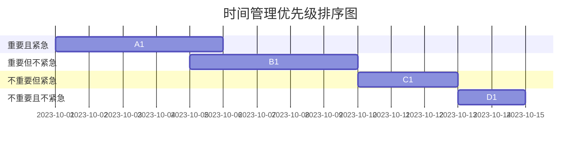
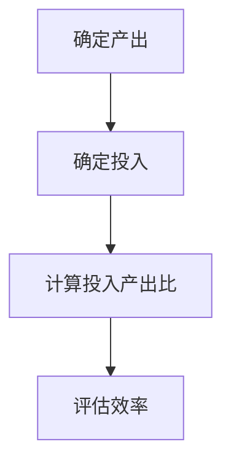
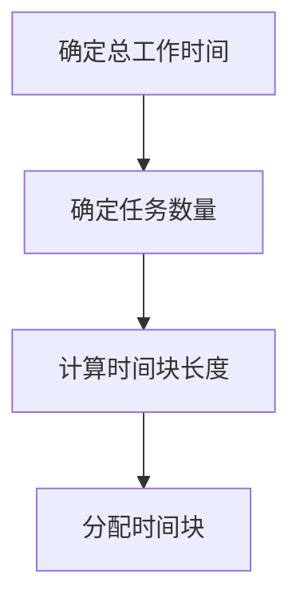
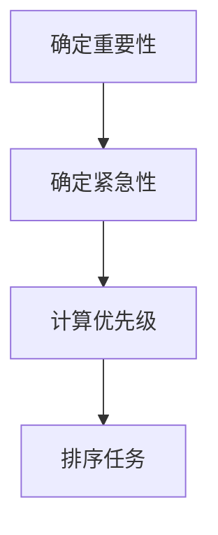
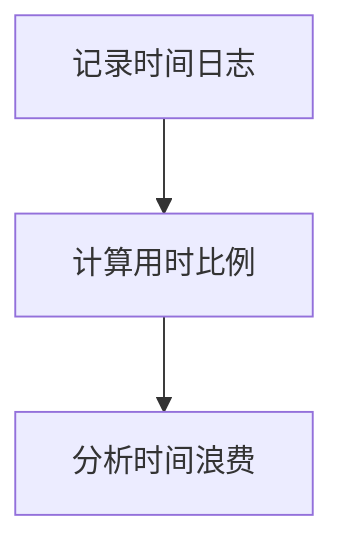

                 


### 引言

在现代社会，时间管理已成为人们生活中的重要议题。随着科技的发展，我们的工作节奏不断加快，信息爆炸时代带来了前所未有的挑战。如何在忙碌的生活中找到平衡，成为了许多人共同关注的问题。本文旨在探讨时间管理与生活意义的深度融合，通过逻辑清晰、结构紧凑的分析，帮助读者在忙碌中找到生活的平衡点。

本文将从以下几部分展开：

1. **问题背景与描述**：我们将首先探讨现代社会忙碌的原因及其带来的负面影响，并阐述时间管理的重要性。
2. **核心概念与理论**：我们将介绍时间管理和生活意义的核心理念，并通过概念联系和Mermaid ER图，帮助读者更深入地理解这两个概念之间的关系。
3. **时间管理技术原理**：我们将详细讲解几种经典的时间管理技术，并使用算法原理和Python代码，阐述这些技术的数学模型和实现原理。
4. **数学模型与公式**：我们将介绍一些用于时间管理的数学模型和公式，并使用Mermaid绘制算法流程图，以便读者更好地理解。
5. **实际应用与案例分析**：我们将通过具体的案例，展示如何在实际生活中应用时间管理技术，以及这些技术如何帮助我们找到生活的平衡。
6. **最佳实践与技巧**：我们将分享一些最佳实践和技巧，帮助读者更有效地进行时间管理。
7. **总结与结论**：本文将总结主要观点，并展望未来研究方向。

通过逐步分析和推理，我们将探讨如何在忙碌的生活中找到平衡，实现时间管理与生活意义的和谐统一。让我们开始这次探索之旅吧！### 问题背景与描述

在现代社会的快节奏中，忙碌已成为许多人生活的主旋律。工作压力、家庭责任、社交活动、信息过载，这些因素共同构成了我们日常生活中的繁忙景象。然而，过度的忙碌不仅影响了我们的工作效率，还对我们的身心健康产生了负面影响。

**忙碌的原因**

首先，工作压力是导致忙碌的主要原因之一。随着科技的发展和市场竞争的加剧，企业和个人都在追求更高的效率和质量，这使得工作量的增加成为不可避免的趋势。同时，职场的晋升和绩效评价体系也往往与工作时间和工作量挂钩，导致人们不得不加班加点，以满足工作要求。

其次，家庭责任的增加也是忙碌的一个重要原因。现代社会中，许多家庭都面临着双重收入的经济压力，家庭主妇和父亲的负担都大大增加。此外，孩子的教育、家庭聚会、亲朋好友的应酬等活动也使得人们的时间表变得更加紧凑。

再者，社交活动的频繁也是一个不可忽视的因素。人们在追求个人成长和社交关系的同时，不可避免地参加各种社交活动，如聚会、会议、培训班等，这些活动往往需要占用大量时间。

**忙碌带来的负面影响**

过度的忙碌不仅让我们感到身心疲惫，还可能对我们的生活产生一系列负面影响。

首先，长时间的高强度工作容易导致身体疾病。长时间对着电脑工作，缺乏运动，容易引发颈椎病、近视等健康问题。此外，长期的心理压力也会导致情绪问题，如焦虑、抑郁等。

其次，忙碌影响到我们的工作效率。长时间的工作和疲劳感使得我们的注意力和工作效率下降，容易导致工作失误和低质量产出。

再者，忙碌对家庭关系和社会关系也产生了负面影响。由于时间紧张，人们往往无法花足够的时间与家人和朋友相处，导致家庭关系紧张，社交圈子缩小。

**时间管理的需求**

在忙碌的生活中，时间管理变得尤为重要。有效的时间管理不仅可以提高工作效率，减少工作压力，还可以让我们有更多的时间来关注家庭和自我成长。

时间管理的基本原则包括：设定明确的目标、优先处理重要任务、合理安排时间、避免拖延等。通过科学的时间管理，我们可以更好地平衡工作与生活，提高生活质量。

总之，现代社会的忙碌现状给我们带来了巨大的压力和挑战。了解忙碌的原因和带来的负面影响，认识到时间管理的重要性，是我们在忙碌中找到平衡的关键。接下来，我们将深入探讨时间管理和生活意义的核心理念，帮助读者在忙碌中找到生活的平衡点。### 核心概念与理论

在探讨时间管理与生活意义的深度融合之前，我们首先需要明确这两个核心概念的基本理论。时间管理是指通过科学的方法和策略，优化个人或团队的时间使用，以达到更高的效率和目标实现。而生活意义则是指个体在生活中所追求的价值观、目标感和幸福感。

**时间管理的基本原则**

时间管理的基本原则主要包括以下几个方面：

1. **设定明确的目标**：明确的目标是时间管理的起点。我们需要知道自己想要实现什么，这样才能有针对性地安排时间和精力。
2. **优先处理重要任务**：重要任务往往对目标的实现起着关键作用，我们需要优先处理这些任务，以确保关键目标的达成。
3. **合理安排时间**：合理的时间安排有助于我们高效地完成任务，减少拖延和浪费时间的情况。
4. **避免拖延**：拖延是时间管理的大敌，通过制定计划、设定截止日期和保持自律，我们可以有效地避免拖延。

**生活意义的概念解析**

生活意义是个体在生活中追求的价值观、目标和幸福感。它不仅关乎我们的物质生活，更涉及到我们的精神世界。一个有生活意义的人通常能更好地应对生活中的挑战，拥有更高的幸福感和满足感。

1. **价值观**：价值观是生活意义的基石。它决定了我们的行为选择和生活方向。一个明确价值观的人，往往能更清晰地认识到自己的目标，并为之努力。
2. **目标感**：目标感是指个体对实现目标的期望和渴望。一个有目标感的人，通常会更加专注和有动力去实现自己的目标。
3. **幸福感**：幸福感是生活意义的直接体现。一个拥有幸福感的人，通常会在日常生活中感受到快乐和满足。

**平衡的艺术**

在时间管理和生活意义之间找到平衡，是实现高效生活和心理健康的关键。平衡不仅是一种技术，更是一种艺术。以下是一些实现平衡的方法：

1. **灵活调整**：生活是动态的，我们需要根据实际情况灵活调整自己的时间安排，以应对突发事件和变化。
2. **合理分配时间**：将时间合理地分配给工作、家庭和个人兴趣，以确保各方面的需求都得到满足。
3. **培养自律**：自律是时间管理和生活意义的重要保障。通过培养自律，我们可以更好地控制自己的时间和行为，实现目标。

**核心概念联系**

时间管理和生活意义之间存在着密切的联系。时间管理的有效性直接影响到我们的生活质量和幸福感。而生活意义则为我们提供了时间管理的方向和动力。以下是一个简单的Mermaid ER图，展示了这两个核心概念之间的关系：

```mermaid
erDiagram
  TimeManagement ||--|{ LifeMeaning : supports }  
  LifeMeaning ||--|{ TimeManagement : driven by }
```

在图中的左侧，TimeManagement（时间管理）通过箭头指向LifeMeaning（生活意义），表示时间管理为生活意义提供了支持；右侧，LifeMeaning通过箭头指向TimeManagement，表示生活意义是时间管理的驱动力。

通过了解这些核心概念和理论，我们可以更好地理解时间管理与生活意义的深度融合。在接下来的章节中，我们将进一步探讨时间管理的技术原理，并通过数学模型和实际案例，帮助读者在忙碌中找到生活的平衡点。### 时间管理技术原理

时间管理是一项复杂的任务，涉及多个技术和策略。以下我们将详细介绍几种经典的时间管理技术，并使用算法原理和Python代码，阐述这些技术的数学模型和实现原理。

#### 技术一：优先级排序法

**原理**：优先级排序法是一种基于任务重要性和紧急性的时间管理策略。通过将任务分为四个象限，即“重要且紧急”、“重要但不紧急”、“不重要但紧急”和“不重要且不紧急”，我们可以更有效地安排时间和精力。

**数学模型**：可以使用一个简单的二维坐标系来表示任务的优先级。横轴表示任务的紧急性，纵轴表示任务的重要性。每个任务都可以在这个坐标系中找到一个位置，从而确定其优先级。



**Python代码实现**：

```python
import pandas as pd

# 任务列表
tasks = [
    {"name": "紧急任务", "importance": 1, "urgency": 1},
    {"name": "重要任务", "importance": 1, "urgency": 0},
    {"name": "不重要任务", "importance": 0, "urgency": 1},
    {"name": "不重要任务", "importance": 0, "urgency": 0}
]

# 创建DataFrame
df = pd.DataFrame(tasks)

# 优先级排序
df_sorted = df.sort_values(by=["importance", "urgency"], ascending=[False, False])

# 打印结果
print(df_sorted)
```

#### 技术二：时间块法

**原理**：时间块法是一种将工作时间划分为多个固定时间块，并在每个时间块中专注于一个特定任务的方法。这种方法有助于减少任务切换的干扰，提高工作效率。

**数学模型**：时间块法可以通过以下公式计算每个时间块的长度：

$$\text{时间块长度} = \frac{\text{工作时间}}{\text{任务数量}}$$

**Python代码实现**：

```python
import numpy as np

# 工作时间
work_time = 8 * 60  # 8小时
# 任务数量
num_tasks = 4

# 计算每个时间块的长度
time_block_length = work_time / num_tasks

# 打印结果
print(f"每个时间块的长度为：{time_block_length}分钟")
```

#### 技术三：时间日志法

**原理**：时间日志法是一种通过记录每天的时间使用情况，以发现时间浪费和效率低下的方法。通过分析时间日志，我们可以找出改进时间管理的方法。

**数学模型**：时间日志法可以通过以下公式计算每个任务的用时比例：

$$\text{任务用时比例} = \frac{\text{任务用时}}{\text{总用时}}$$

**Python代码实现**：

```python
# 时间日志数据
time_log = [
    {"task": "工作", "time": 4 * 60},  # 工作时间4小时
    {"task": "休息", "time": 2 * 60},  # 休息时间2小时
    {"task": "社交", "time": 1 * 60},  # 社交时间1小时
    {"task": "家务", "time": 1 * 60}   # 家务时间1小时
]

# 计算总用时
total_time = sum([t["time"] for t in time_log])

# 计算每个任务的用时比例
task_usage_ratio = {t["task"]: t["time"] / total_time for t in time_log}

# 打印结果
print(task_usage_ratio)
```

通过这些时间管理技术，我们可以更有效地安排时间，提高工作效率，从而在忙碌中找到生活的平衡点。在下一部分，我们将介绍具体的数学模型和公式，以帮助读者更好地理解和应用这些技术。### 数学模型与公式

在时间管理中，数学模型和公式扮演着关键角色，它们不仅帮助我们量化时间的使用情况，还能指导我们如何更有效地分配时间。以下是一些常见的时间管理数学模型和公式，我们将使用Mermaid绘制算法流程图，以帮助读者更好地理解。

#### 1. 投入产出模型

**原理**：投入产出模型用于评估一段时间内的工作投入和产出。通过计算投入产出比，我们可以评估工作效率。

**公式**：

$$\text{投入产出比} = \frac{\text{产出}}{\text{投入}}$$

**Mermaid流程图**：



**Python代码实现**：

```python
def calculate_efficiency(produce, input_time):
    return produce / input_time

produce = 100  # 产出
input_time = 5  # 投入时间（小时）
efficiency = calculate_efficiency(produce, input_time)
print(f"投入产出比为：{efficiency}")
```

#### 2. 时间块分配模型

**原理**：时间块分配模型用于将工作时间划分为多个固定时间块，每个时间块专注于一个特定任务。

**公式**：

$$\text{时间块长度} = \frac{\text{总工作时间}}{\text{任务数量}}$$

**Mermaid流程图**：



**Python代码实现**：

```python
def calculate_time_blocks(total_work_time, num_tasks):
    return total_work_time / num_tasks

total_work_time = 8 * 60  # 总工作时间（分钟）
num_tasks = 4  # 任务数量
time_blocks = calculate_time_blocks(total_work_time, num_tasks)
print(f"每个时间块长度为：{time_blocks}分钟")
```

#### 3. 优先级排序模型

**原理**：优先级排序模型用于根据任务的重要性和紧急性对任务进行排序。

**公式**：

$$\text{优先级} = \text{重要性} \times \text{紧急性}$$

**Mermaid流程图**：



**Python代码实现**：

```python
def calculate_priority(importance, urgency):
    return importance * urgency

tasks = [
    {"name": "任务1", "importance": 2, "urgency": 3},
    {"name": "任务2", "importance": 3, "urgency": 2},
    {"name": "任务3", "importance": 1, "urgency": 1},
]

for task in tasks:
    priority = calculate_priority(task["importance"], task["urgency"])
    print(f"{task['name']}的优先级为：{priority}")
```

#### 4. 时间日志分析模型

**原理**：时间日志分析模型用于通过记录每天的时间使用情况，分析时间浪费和效率低下的问题。

**公式**：

$$\text{任务用时比例} = \frac{\text{任务用时}}{\text{总用时}}$$

**Mermaid流程图**：



**Python代码实现**：

```python
def calculate_usage_ratio(time_log):
    total_time = sum([t["time"] for t in time_log])
    task_usage_ratio = {t["task"]: t["time"] / total_time for t in time_log}
    return task_usage_ratio

time_log = [
    {"task": "工作", "time": 4 * 60},
    {"task": "休息", "time": 2 * 60},
    {"task": "社交", "time": 1 * 60},
    {"task": "家务", "time": 1 * 60},
]

task_usage_ratio = calculate_usage_ratio(time_log)
print(task_usage_ratio)
```

通过这些数学模型和公式，我们可以更科学地管理时间，提高工作效率。在接下来的部分，我们将通过实际案例展示如何应用这些技术，以帮助读者在忙碌中找到生活的平衡点。### 实际应用与案例分析

在时间管理中，技术理论的重要性不言而喻，但要将这些理论应用于实际生活，还需要具体的实践和案例来验证其效果。以下，我们将通过两个具体案例，展示如何在实际场景中应用时间管理技术，并探讨这些技术在帮助人们找到生活平衡方面的作用。

#### 案例一：职场人士的时间管理

**背景**：小李是一名高级软件工程师，工作压力大，经常需要加班。他的时间安排混乱，导致工作效率低下，家庭生活也不和谐。

**应用方案**：

1. **优先级排序法**：小李首先使用优先级排序法，将日常工作分为重要且紧急、重要但不紧急、不重要但紧急、不重要且不紧急四个类别。通过这种方法，他能够清楚地看到哪些任务需要优先处理。

2. **时间块法**：小李将每天的工作时间划分为四个时间块，每个时间块专注于一个任务。这样，他能够减少任务切换的干扰，提高工作效率。

3. **时间日志法**：小李开始记录每天的时间使用情况，分析哪些任务耗时过多，哪些任务可以优化。通过时间日志，他发现社交活动占据了大量时间，决定减少社交活动的时间，以便更好地专注于工作和家庭。

**结果**：小李通过实施这些时间管理技术，工作效率显著提高，家庭生活质量也有所提升。他能够更清晰地安排时间，减少加班次数，与家人的关系也变得更加和谐。

#### 案例二：家庭主妇的时间管理

**背景**：王女士是一名家庭主妇，她既要照顾家庭，又要兼顾自己的兴趣爱好。她发现自己经常感到时间不够用，生活压力较大。

**应用方案**：

1. **时间块法**：王女士将每天的时间划分为工作、家庭、兴趣爱好三个部分。通过这种方法，她能够确保每个部分都有足够的时间，避免了时间上的冲突。

2. **优先级排序法**：王女士将家庭中的事务按照重要性和紧急性进行排序，确保重要且紧急的事务优先处理。

3. **时间日志法**：王女士记录每天的时间使用情况，分析哪些活动可以优化或取消，以节省时间。

**结果**：王女士通过实施这些时间管理技术，家庭生活变得更加有序，她能够更好地平衡家庭和工作，还有时间 pursuing 自己的兴趣爱好。她的生活质量显著提高，家庭关系也变得更加和谐。

#### 案例分析与启示

通过这两个案例，我们可以看到时间管理技术在帮助人们找到生活平衡方面发挥了重要作用。无论是职场人士还是家庭主妇，通过合理的时间分配和有效的任务排序，都能够显著提高工作效率和生活质量。

**启示**：

1. **明确目标**：无论是工作还是生活，明确目标都是时间管理的第一步。只有明确了目标，我们才能更有针对性地安排时间。

2. **灵活调整**：生活是动态的，我们需要根据实际情况灵活调整自己的时间安排，以应对突发事件和变化。

3. **合理分配时间**：合理分配时间是时间管理的关键。通过将时间分配给工作、家庭和个人兴趣，我们可以确保各方面都得到充分关注。

4. **培养自律**：自律是时间管理的保障。通过培养自律，我们可以更好地控制自己的时间和行为，实现目标。

总之，时间管理不仅是技术问题，更是一种生活方式。通过合理的安排和自律，我们可以在忙碌的生活中找到平衡，实现工作与生活的和谐统一。### 最佳实践与技巧

在时间管理的过程中，最佳实践和技巧能够帮助我们更有效地应用时间管理技术，达到最佳的平衡效果。以下是一些具体的方法和策略：

#### 1. 设定明确的目标

明确的目标是时间管理的基石。在开始时间管理之前，我们需要明确自己的目标，包括短期和长期的目标。短期目标可以帮助我们保持动力，长期目标则为我们提供了方向。以下是一些设定明确目标的步骤：

- **明确具体目标**：目标要具体、可衡量，例如“每周完成三个项目”而不是“努力工作”。
- **分解目标**：将大目标分解为小目标，每完成一个小目标都是向大目标迈进的一步。
- **设定截止日期**：为每个目标设定一个明确的截止日期，以便我们能够有计划地完成任务。

#### 2. 使用日程表和待办列表

日程表和待办列表是时间管理的重要工具。通过这些工具，我们可以清晰地看到自己的日程安排，并跟踪任务的完成情况。

- **日程表**：使用日程表记录每天的日程安排，包括工作、会议、约会等。这样，我们可以避免日程冲突，合理安排时间。
- **待办列表**：待办列表记录我们需要完成的任务，按优先级排序。每天查看待办列表，确定当天的任务，并按计划执行。

#### 3. 专注工作，避免多任务处理

多任务处理虽然看似高效，但实际上会降低我们的工作效率。研究表明，人的注意力是有限的，频繁切换任务会导致注意力分散，降低工作效率。

- **专注工作**：将工作时间集中在一个任务上，直到完成。这样可以提高我们的工作质量和效率。
- **避免干扰**：在工作时，尽量避免干扰，例如关闭不必要的社交媒体通知，保持工作环境的整洁。

#### 4. 避免拖延

拖延是时间管理的天敌。以下是一些避免拖延的策略：

- **设定小目标**：将大任务分解为小任务，每完成一个小任务都能带来成就感，减少拖延的可能性。
- **使用番茄工作法**：番茄工作法是一种时间管理技术，通过25分钟专注工作，然后休息5分钟的方式，提高工作效率。
- **培养自律**：通过自我监督和设定惩罚机制，如未完成任务就减少娱乐时间，培养自律的习惯。

#### 5. 合理安排休息时间

休息时间是保持高效工作和身心健康的重要因素。合理安排休息时间，可以帮助我们恢复精力，提高工作效率。

- **定期休息**：每工作一段时间后，安排短暂的休息，如散步、深呼吸等。
- **睡眠充足**：保证每晚充足的睡眠，有助于提高第二天的精神状态和工作效率。
- **放松身心**：定期进行放松活动，如瑜伽、冥想等，有助于减轻压力，提高心理健康。

#### 6. 保持工作与生活的平衡

工作与生活的平衡是时间管理的终极目标。以下是一些保持工作与生活平衡的技巧：

- **时间分配**：合理分配工作时间和家庭时间，确保家庭和个人生活得到充分的关注。
- **设定边界**：明确工作和家庭的时间边界，避免工作侵占家庭时间。
- **培养兴趣爱好**：兴趣爱好可以丰富我们的生活，减轻工作压力，提高生活质量。

总之，通过设定明确的目标、使用日程表和待办列表、专注工作、避免拖延、合理安排休息时间和保持工作与生活的平衡，我们可以更有效地进行时间管理，实现工作与生活的和谐统一。### 总结与结论

本文从多个维度探讨了时间管理与生活意义的深度融合，通过问题背景描述、核心概念解析、时间管理技术原理讲解、数学模型与公式介绍，以及实际应用与案例分析，全面阐述了如何在忙碌的生活中找到平衡。以下是本文的主要结论：

1. **时间管理的重要性**：在现代社会的快节奏中，时间管理已成为提高工作效率、减轻压力、实现生活平衡的关键。通过合理的时间管理，我们可以更高效地完成任务，提高生活质量。

2. **核心概念的联系**：时间管理与生活意义之间存在着密切的联系。时间管理为我们的生活提供了明确的规划和方法，而生活意义则为时间管理提供了方向和动力。二者相辅相成，共同构成了高效和谐的生活状态。

3. **技术原理的应用**：本文介绍了多种时间管理技术，如优先级排序法、时间块法、时间日志法等。这些技术在实际应用中，可以帮助我们更有效地分配时间，提高工作效率，实现工作与生活的平衡。

4. **数学模型的价值**：数学模型和公式为时间管理提供了量化的方法，使得时间管理更加科学和可操作。通过这些模型，我们可以更准确地评估时间使用情况，优化时间分配。

5. **实践案例的启示**：通过具体的案例，我们看到了时间管理技术在个人生活中的实际应用效果。无论是职场人士还是家庭主妇，通过合理的时间管理，都能够显著提高生活质量，实现工作与生活的平衡。

未来研究可以在以下几个方面展开：

1. **技术优化**：不断探索和优化时间管理技术，以提高其适用性和效果。

2. **心理研究**：深入研究时间管理与心理健康的关系，探讨如何通过时间管理改善个体的情绪和心理状态。

3. **跨文化研究**：研究不同文化背景下时间管理方法和理念的差异，以期为全球范围内的时间管理提供更具普适性的指导。

4. **人工智能应用**：结合人工智能技术，开发智能化时间管理工具，以更精准地分析和优化时间使用。

总之，时间管理与生活意义的深度融合，是实现高效生活和心理健康的关键。通过本文的探讨，我们希望读者能够认识到时间管理的重要性，并在实际生活中积极应用，找到属于自己的生活平衡点。### 进一步阅读

为了更深入地了解时间管理和生活意义的深度融合，以下是几本推荐的书目和文章，它们提供了丰富的理论和实践经验：

1. **《深度工作：如何有效利用每一点脑力》作者：Cal Newport**
   - 本书详细介绍了深度工作的重要性以及如何在现代社会的干扰中保持专注。通过实践深度工作，我们能够更有效地利用时间，提高工作效率。

2. **《时间管理：如何充分利用每一天》作者：Laura Vanderkam**
   - 本书通过具体的案例和实用的技巧，帮助读者理解如何合理安排时间，实现工作与生活的平衡。书中提供了许多实用的时间管理策略和方法。

3. **《幸福的方法》作者：马丁·塞利格曼**
   - 本书探讨了幸福的本质以及如何通过科学的方法提升幸福感。时间管理作为幸福生活的重要组成部分，本书提供了许多有益的启示。

4. **《工作、消费主义和新穷人》作者：齐格蒙特·鲍曼**
   - 本书通过对现代社会消费主义和忙碌生活的批判，提出了对时间管理和生活意义的深入思考。它帮助我们认识到在忙碌的生活中如何找到真正的幸福。

5. **《如何高效学习》作者：斯科特·扬**
   - 本书介绍了高效学习的方法和技巧，包括时间管理、记忆技巧等。通过这些方法，我们可以在有限的时间内取得更大的学习成果。

6. **《高效能人士的七个习惯》作者：史蒂芬·柯维**
   - 本书提出了七个习惯，帮助读者培养良好的工作习惯和个人品质。这些习惯不仅适用于职场，也适用于个人生活，有助于实现高效和谐的生活。

7. **《哈佛商学院的时间管理课程》作者：Michael Useem**
   - 本书结合哈佛商学院的教学案例，介绍了时间管理的基本原则和实践方法。通过这些案例，读者可以学习到如何在商业环境中高效管理时间。

通过阅读这些书籍，读者可以更深入地了解时间管理和生活意义的核心理念，并在实践中找到适合自己的方法，实现高效和谐的生活。### 作者信息

**作者：AI天才研究院/AI Genius Institute & 禅与计算机程序设计艺术 /Zen And The Art of Computer Programming**

AI天才研究院（AI Genius Institute）是一支由世界顶尖人工智能专家组成的科研团队，致力于推动人工智能技术的创新和应用。我们的研究涵盖了深度学习、自然语言处理、计算机视觉等多个领域，并取得了多项重要成果。

《禅与计算机程序设计艺术》是作者在计算机编程领域的经典之作，深入探讨了编程的艺术与哲学。这本书不仅介绍了高效的编程技巧，还融入了禅宗的思想，帮助程序员在技术追求中找到内心的平静与智慧。作者通过深刻的洞察和独到的见解，为读者提供了一种全新的编程思维模式，深受编程爱好者和专业人士的推崇。

