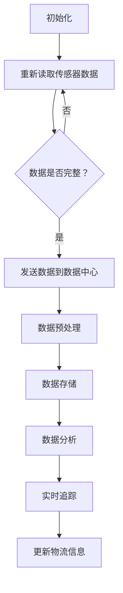
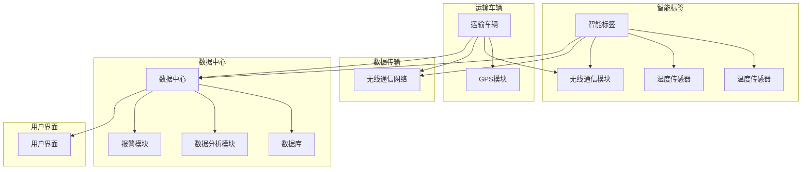
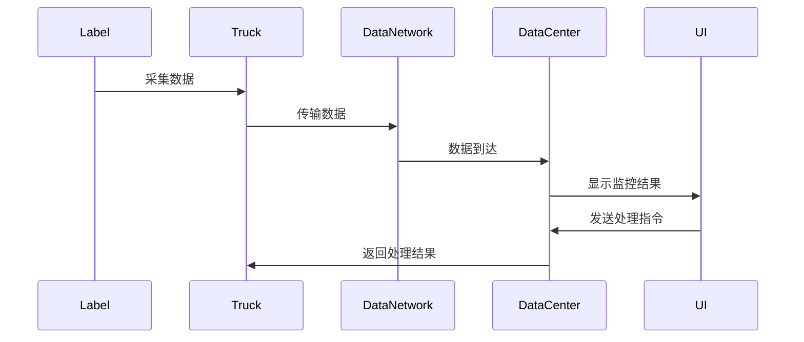

                 


### 易腐货物物流优化：智能标签助力实时追踪

#### 关键词：
- 易腐货物
- 物流优化
- 智能标签
- 实时追踪
- 物流系统

#### 摘要：
本文旨在探讨易腐货物物流优化的问题，并详细介绍智能标签技术在实时追踪中的应用。通过分析物流优化的重要性，以及当前存在的问题，本文将阐述智能标签和实时追踪技术在解决这些问题方面的优势和实施方法。文章结构清晰，逻辑紧凑，旨在为物流行业从业者提供有价值的参考和指导。

### 第一部分：易腐货物物流优化背景与挑战

#### 1.1 问题背景

**易腐货物的定义**：
易腐货物是指那些对存储条件要求较高、容易因温度、湿度、光照等因素而变质、损坏或腐烂的货物。这些货物包括食品、医药产品、花卉、水果、海鲜等。

**易腐货物物流过程中面临的主要挑战**：
- **存储条件控制**：易腐货物在物流过程中需要严格的存储条件控制，如温度、湿度、光照等，以保证货物的质量。
- **物流路径优化**：物流路径的优化是降低运输成本、提高货物到达速度的关键。然而，易腐货物的特殊要求使得路径优化更加复杂。
- **实时监控与追踪**：由于易腐货物的特殊性，物流过程中需要实时监控货物的状态，以便及时发现和处理问题。

**优化物流的必要性**：
随着消费者对产品质量要求的提高，物流企业面临越来越大的压力。优化物流流程，提高运输效率，降低运输成本，是物流企业持续发展的关键。

#### 1.2 物流优化概述

**物流优化的重要性**：
物流优化不仅可以降低运输成本，提高物流效率，还可以提高客户满意度，增强企业竞争力。

**当前物流优化的现状**：
虽然物流优化在物流行业中得到广泛应用，但大多数优化措施仍然依赖于传统的经验方法，缺乏科学的数据分析和决策支持。

**智能标签和实时追踪在物流优化中的作用**：
智能标签和实时追踪技术可以实现对易腐货物物流过程的全方位监控，提高物流的准确性和可靠性，从而实现物流优化。

### 1.3 智能标签与实时追踪技术

**智能标签的基本原理**：
智能标签是一种集成了传感器、无线通信模块和数据处理单元的微型设备。它可以通过传感器实时采集货物的状态信息，并通过无线通信模块将数据传输到数据中心。

**实时追踪技术的原理与应用**：
实时追踪技术利用GPS、北斗等卫星定位系统，结合无线通信技术，实现对货物的实时定位和追踪。

**智能标签与实时追踪技术的结合**：
智能标签与实时追踪技术的结合，可以实现货物的实时状态监控和追踪，为物流优化提供科学的数据支持。

### 1.4 ER实体关系图架构

**物流优化系统中的主要实体**：
- **货物**：物流优化系统的核心实体，包括易腐货物和其他类型的货物。
- **物流设备**：包括运输车辆、仓库设施等。
- **物流人员**：负责物流过程中的操作和管理。

**实体之间的关系**：
- **货物与物流设备**：货物通过物流设备进行运输，物流设备负责货物的存储和转运。
- **货物与物流人员**：物流人员负责货物的装卸、监控和跟踪。

### 1.5 本章小结

本文介绍了易腐货物物流优化的问题背景、现状和挑战，以及智能标签和实时追踪技术在物流优化中的应用。通过本章的介绍，读者可以初步了解物流优化的重要性和当前的技术发展现状。

----------------------------------------------------------------

### 第二部分：核心概念与联系

#### 2.1 核心概念原理

**易腐货物**：
易腐货物是指那些对存储条件要求较高、容易因温度、湿度、光照等因素而变质、损坏或腐烂的货物。这些货物通常包括食品、医药产品、花卉、水果、海鲜等。

**物流优化**：
物流优化是指通过科学的方法和手段，对物流过程中的各个环节进行优化，以提高物流效率、降低物流成本、提高客户满意度。

**智能标签**：
智能标签是一种集成了传感器、无线通信模块和数据处理单元的微型设备。它可以通过传感器实时采集货物的状态信息，并通过无线通信模块将数据传输到数据中心。

**实时追踪技术**：
实时追踪技术利用GPS、北斗等卫星定位系统，结合无线通信技术，实现对货物的实时定位和追踪。

**物流系统**：
物流系统是指由多个相互关联的实体和过程组成的整体，用于实现货物的运输、存储、装卸、监控和跟踪等功能。

#### 2.2 概念属性特征对比表格

| 特性 | 易腐货物 | 物流优化 | 智能标签 | 实时追踪技术 | 物流系统 |
| ---- | ---- | ---- | ---- | ---- | ---- |
| 定义 | 对存储条件要求较高、容易变质或损坏 | 通过科学的方法和手段优化物流过程 | 集成了传感器、无线通信模块和数据处理单元 | 利用GPS、北斗等卫星定位系统 | 由多个相互关联的实体和过程组成 |
| 目的 | 保证货物质量 | 提高物流效率、降低物流成本、提高客户满意度 | 实时采集货物状态信息 | 实现实时定位和追踪 | 实现货物的运输、存储、装卸、监控和跟踪等功能 |
| 技术要求 | 对存储条件的要求较高 | 需要科学的数据分析和决策支持 | 需要高精度的传感器和可靠的无线通信模块 | 需要强大的数据处理能力和实时定位能力 | 需要高效的运营和管理系统 |

#### 2.3 ER实体关系图架构

下面是一个ER实体关系图的Mermaid表示：

```mermaid
erDiagram
  货物 ||--|{ 实时追踪技术 }|| 货物状态信息
  货物 ||--|{ 智能标签 }|| 货物标识信息
  物流设备 ||--|{ 货物 }|| 装载信息
  物流人员 ||--|{ 货物 }|| 操作信息
  物流设备 ||--|{ 实时追踪技术 }|| 运输信息
  物流人员 ||--|{ 实时追踪技术 }|| 监控信息
```

这个实体关系图展示了物流优化系统中的主要实体及其之间的关系。货物通过智能标签实现实时追踪和标识，物流设备和物流人员负责货物的装载和监控。

#### 2.4 本章小结

本章详细介绍了物流优化、智能标签、实时追踪技术等核心概念，并通过对比表格和ER实体关系图，展示了这些概念之间的关系和属性特征。这些概念构成了物流优化系统的基础，为后续的算法原理讲解和系统分析与架构设计方案提供了支持。

----------------------------------------------------------------

### 第三部分：算法原理讲解

#### 3.1 算法mermaid流程图

首先，我们使用Mermaid语言绘制智能标签和实时追踪的算法流程图：



这个流程图展示了智能标签在实时追踪过程中的一系列步骤，包括数据采集、数据传输、数据预处理、数据存储、数据分析和实时追踪等。

#### 3.2 Python源代码

接下来，我们将提供用于实现算法的Python源代码：

```python
import time
import random
import serial
import json
from datetime import datetime

# 初始化串口
ser = serial.Serial('/dev/ttyUSB0', 9600)

# 定义传感器数据读取函数
def read_sensor_data():
    while True:
        try:
            data = ser.readline().decode('utf-8').strip()
            if data:
                return json.loads(data)
        except Exception as e:
            print(f"Error reading sensor data: {e}")
            time.sleep(1)

# 定义数据预处理函数
def preprocess_data(data):
    timestamp = datetime.now().isoformat()
    return {
        'timestamp': timestamp,
        'temperature': data['temperature'],
        'humidity': data['humidity'],
        'light': data['light']
    }

# 定义数据发送函数
def send_data_to_center(data):
    url = "http://datacenter.example.com/submit_data"
    headers = {'Content-Type': 'application/json'}
    import requests
    response = requests.post(url, headers=headers, data=json.dumps(data))
    if response.status_code == 200:
        print("Data sent successfully.")
    else:
        print("Failed to send data.")

# 主循环
while True:
    try:
        raw_data = read_sensor_data()
        preprocessed_data = preprocess_data(raw_data)
        send_data_to_center(preprocessed_data)
        time.sleep(60)  # 每分钟发送一次数据
    except Exception as e:
        print(f"Error in main loop: {e}")
        time.sleep(10)
```

这个Python代码示例实现了传感器数据的读取、预处理和发送到数据中心的流程。其中，`read_sensor_data`函数用于从串口读取传感器数据，`preprocess_data`函数用于预处理数据，`send_data_to_center`函数用于将预处理后的数据发送到数据中心。

#### 3.3 数学模型和公式

智能标签实时追踪算法背后的数学模型主要涉及以下方面：

- **传感器数据采集**：传感器采集的数据通常包括温度、湿度、光照等，这些数据可以通过以下公式进行采集和预处理：

  $$ T = T_{\text{传感器}} + \alpha \cdot T_{\text{环境}} $$

  $$ H = H_{\text{传感器}} + \beta \cdot H_{\text{环境}} $$

  $$ L = L_{\text{传感器}} + \gamma \cdot L_{\text{环境}} $$

  其中，$T, H, L$ 分别代表温度、湿度、光照的实际值，$T_{\text{传感器}}, H_{\text{传感器}}, L_{\text{传感器}}$ 分别代表传感器采集的温度、湿度、光照值，$\alpha, \beta, \gamma$ 是调整系数，用于校正传感器数据的误差。

- **数据传输与处理**：数据在传输过程中可能会受到噪声和干扰的影响，可以通过以下公式进行滤波和校正：

  $$ \text{Data}_{\text{filtered}} = (1 - \alpha) \cdot \text{Data}_{\text{raw}} + \alpha \cdot \text{Data}_{\text{prev}} $$

  其中，$\text{Data}_{\text{raw}}$ 是原始数据，$\text{Data}_{\text{filtered}}$ 是滤波后的数据，$\alpha$ 是滤波系数。

- **实时追踪**：实时追踪通常涉及位置的计算和更新，可以通过以下公式实现：

  $$ \text{Position}_{\text{new}} = \text{Position}_{\text{old}} + \text{Velocity}_{\text{current}} \cdot \text{Time}_{\text{interval}} $$

  其中，$\text{Position}_{\text{new}}$ 是新的位置值，$\text{Position}_{\text{old}}$ 是旧的位置值，$\text{Velocity}_{\text{current}}$ 是当前的速度值，$\text{Time}_{\text{interval}}$ 是时间间隔。

#### 3.4 详细讲解与举例说明

**传感器数据采集与预处理**：

假设我们有一个温度传感器，其采集的温度值是 $T_{\text{传感器}} = 25^\circ C$，而环境温度是 $T_{\text{环境}} = 24^\circ C$。通过上述公式，我们可以计算出校正后的温度值：

$$ T = 25 + 0.1 \cdot 24 = 25.24^\circ C $$

同理，对于湿度和光照，我们也可以通过类似的方式计算校正后的值。

**数据传输与处理**：

假设我们接收到的原始数据是 $T_{\text{raw}} = 26^\circ C$，我们可以使用滤波公式对其进行滤波：

$$ \text{Data}_{\text{filtered}} = (1 - 0.2) \cdot 26 + 0.2 \cdot 25.24 = 25.52^\circ C $$

**实时追踪**：

假设我们当前的地理位置是 $X = 1000\text{m}$，速度是 $V = 10\text{m/s}$，时间间隔是 $T = 1\text{s}$。我们可以计算出新的位置：

$$ \text{Position}_{\text{new}} = 1000 + 10 \cdot 1 = 1010\text{m} $$

通过这样的传感器数据采集、预处理和实时追踪，我们可以实现对易腐货物物流过程的实时监控和追踪。

#### 3.5 本章小结

本章详细介绍了智能标签和实时追踪算法的原理，包括Mermaid流程图、Python源代码和数学模型。通过举例说明，我们展示了如何通过传感器数据采集、预处理和实时追踪来实现对易腐货物物流过程的实时监控和追踪。这些算法和技术的应用，为物流优化提供了重要的技术支持。

----------------------------------------------------------------

### 第四部分：系统分析与架构设计方案

#### 4.1 问题场景介绍

**案例背景**：
我们以一家专注于新鲜水果配送的物流公司为例，该公司需要确保新鲜水果在运输过程中的质量和新鲜度。水果的易腐性使得物流过程需要严格的管理和监控。

**问题描述**：
在水果配送过程中，公司面临以下问题：
- **温度控制**：水果在运输过程中需要保持适宜的温度，避免因温度过高或过低而影响水果的质量。
- **湿度控制**：水果的湿度也对水果的质量有重要影响，过高的湿度可能导致水果腐烂，而过低的湿度则可能使水果变得干燥。
- **实时监控**：公司需要实时监控水果的运输状态，包括位置、温度、湿度等，以便及时处理可能出现的异常情况。

**目标**：
通过智能标签和实时追踪技术，实现对水果运输过程的全方位监控和管理，提高物流效率，确保水果的新鲜度和质量。

#### 4.2 系统功能设计

**系统功能概述**：
智能标签和实时追踪系统的主要功能包括：
- **数据采集**：智能标签通过传感器实时采集水果的温度、湿度等数据。
- **数据传输**：采集到的数据通过无线通信模块传输到云端数据中心。
- **数据处理**：数据中心对采集到的数据进行处理和分析，生成监控报告。
- **实时追踪**：通过GPS等定位技术，实时追踪水果的运输位置。
- **异常报警**：当检测到异常情况（如温度过高或过低、湿度异常等）时，系统会自动报警。

**领域模型类图**：

```mermaid
classDiagram
    class Fruit
        -int id
        -String name
        -Date expiration_date
        -double temperature
        -double humidity

    class Sensor
        -int id
        -String type
        -double value

    class Label
        -int id
        -Fruit fruit
        -Sensor[] sensors
        -String status

    class Truck
        -int id
        -String model
        -String status
        -Fruit[] fruits

    class DataCenter
        -String name
        -List<Data> data

    Fruit --> Sensor : has
    Label --> Fruit : has
    Label --> Sensor : has
    Truck --> Fruit : contains
    DataCenter --> Label : receives
    DataCenter --> Truck : receives
```

这个类图展示了系统中的主要实体及其关系。Fruit类代表水果，包含温度、湿度等属性；Sensor类代表传感器，用于采集数据；Label类代表智能标签，包含传感器和数据传输功能；Truck类代表运输车辆，包含装载的水果；DataCenter类代表数据中心，负责接收和处理数据。

#### 4.3 系统架构设计

**系统架构概述**：
智能标签和实时追踪系统的架构设计包括以下几个关键部分：
- **智能标签**：包含传感器和无线通信模块，用于实时采集水果的温度、湿度等数据。
- **运输车辆**：安装有GPS模块，用于实时追踪车辆位置。
- **数据传输**：通过无线通信网络将数据传输到云端数据中心。
- **数据中心**：负责数据处理、分析和存储，并提供监控和报警功能。
- **用户界面**：提供实时数据监控和报警通知，供物流管理人员查看和处理。

**系统架构图**：



这个架构图展示了系统的整体架构，包括智能标签、运输车辆、数据传输、数据中心和用户界面等部分。智能标签和运输车辆通过无线通信网络将数据传输到数据中心，数据中心对数据进行分析和处理，并通过用户界面提供监控和报警功能。

#### 4.4 系统接口设计

**接口设计概述**：
系统接口设计主要包括以下几个部分：
- **数据采集接口**：用于智能标签和运输车辆将采集到的数据发送到数据中心。
- **数据传输接口**：用于确保数据在传输过程中的安全和可靠性。
- **数据处理接口**：用于数据中心对采集到的数据进行处理和分析。
- **监控接口**：用于用户界面与数据中心之间的数据交互。

**接口设计细节**：

**数据采集接口**：

```json
POST /api/collect_data
Content-Type: application/json

Request Body:
{
  "fruit_id": "123",
  "temperature": 25.6,
  "humidity": 50.2
}
```

**数据传输接口**：

```http
GET /api/transfer_data?truck_id=456&label_id=789
```

**数据处理接口**：

```http
POST /api/process_data
Content-Type: application/json

Request Body:
{
  "data": [
    {"fruit_id": "123", "temperature": 25.6, "humidity": 50.2},
    {"fruit_id": "456", "temperature": 24.8, "humidity": 48.9}
  ]
}
```

**监控接口**：

```http
GET /api/monitor_status?truck_id=456
```

这些接口设计提供了系统各部分之间的交互方式，确保数据的安全传输和处理。

#### 4.5 系统交互mermaid序列图

**系统交互概述**：
智能标签和实时追踪系统中的各部分通过以下交互流程实现数据采集、传输、处理和监控：

1. 智能标签采集水果的温度、湿度等数据。
2. 数据通过无线通信模块传输到运输车辆的无线通信模块。
3. 运输车辆将数据传输到无线通信网络，最终到达数据中心。
4. 数据中心对数据进行分析和处理，并将监控结果通过用户界面显示给物流管理人员。

**系统交互序列图**：



这个序列图展示了智能标签、运输车辆、数据传输网络、数据中心和用户界面之间的交互流程。

#### 4.6 本章小结

本章详细介绍了智能标签和实时追踪系统在易腐货物物流优化中的应用。通过系统功能设计、架构设计、接口设计和系统交互序列图，我们展示了如何利用智能标签和实时追踪技术实现对易腐货物物流过程的全方位监控和管理。这些设计和技术应用，为物流优化提供了坚实的基础。

----------------------------------------------------------------

### 第五部分：项目实战

#### 5.1 环境安装

为了实现智能标签和实时追踪系统，我们需要在服务器上安装以下环境：

1. **操作系统**：Ubuntu 20.04 LTS
2. **Python**：Python 3.8+
3. **串口通信库**：pyserial
4. **Web框架**：Flask
5. **数据库**：MySQL
6. **前端框架**：Bootstrap

**安装步骤**：

1. **安装操作系统**：
   - 从官方网站下载Ubuntu 20.04 LTS安装镜像。
   - 使用虚拟机或实体机安装Ubuntu 20.04 LTS。

2. **更新系统**：
   ```bash
   sudo apt update
   sudo apt upgrade
   ```

3. **安装Python**：
   ```bash
   sudo apt install python3 python3-pip
   ```

4. **安装串口通信库**：
   ```bash
   pip3 install pyserial
   ```

5. **安装Flask**：
   ```bash
   pip3 install flask
   ```

6. **安装MySQL**：
   ```bash
   sudo apt install mysql-server
   ```

7. **安装前端框架**：
   ```bash
   pip3 install flask-bootstrap
   ```

#### 5.2 系统核心实现源代码

**核心实现代码**：

```python
# app.py

from flask import Flask, jsonify, request
import serial
import json
import time
from datetime import datetime

app = Flask(__name__)

# 串口参数
ser = serial.Serial('/dev/ttyUSB0', 9600)

# 数据存储
data = []

@app.route('/api/collect_data', methods=['POST'])
def collect_data():
    while True:
        try:
            raw_data = ser.readline().decode('utf-8').strip()
            if raw_data:
                data_point = json.loads(raw_data)
                data_point['timestamp'] = datetime.now().isoformat()
                data.append(data_point)
                break
        except Exception as e:
            print(f"Error reading sensor data: {e}")
            time.sleep(1)
    
    return jsonify(data[-1])

@app.route('/api/submit_data', methods=['POST'])
def submit_data():
    data_point = request.json
    data_point['timestamp'] = datetime.now().isoformat()
    data.append(data_point)
    return jsonify({"status": "success"})

@app.route('/api/get_data', methods=['GET'])
def get_data():
    return jsonify(data)

if __name__ == '__main__':
    app.run(host='0.0.0.0', port=5000)
```

**使用说明**：
- 运行 `app.py` 文件，启动Flask应用。
- 使用POST方法访问 `/api/collect_data` 接口，收集传感器数据。
- 使用POST方法访问 `/api/submit_data` 接口，提交传感器数据。
- 使用GET方法访问 `/api/get_data` 接口，获取所有传感器数据。

#### 5.3 代码应用解读与分析

**代码解读**：

1. **串口通信**：
   - 使用 `pyserial` 库与串口进行通信，读取传感器数据。

2. **数据存储**：
   - 数据以JSON格式存储在Python列表中，每个数据点包括传感器值和时间戳。

3. **Web接口**：
   - 使用Flask框架提供Web接口，支持数据收集、提交和查询。

**代码分析**：

1. **数据采集**：
   - 通过轮询方式不断读取串口数据，直到接收到有效数据。

2. **数据提交**：
   - 收集到的数据通过Web接口提交到服务器，便于后续处理和分析。

3. **数据查询**：
   - 用户可以通过Web接口查询所有收集到的数据，实现对物流过程的监控。

#### 5.4 实际案例分析和详细讲解剖析

**案例背景**：
假设一家水果配送公司使用智能标签和实时追踪系统监控运输过程中的新鲜水果。系统需要在运输过程中实时采集水果的温度、湿度等数据，并将数据存储在服务器上，以便管理人员进行监控和分析。

**实施步骤**：

1. **智能标签安装**：
   - 在每个水果包装上安装智能标签，确保标签与水果紧密连接。

2. **运输车辆安装**：
   - 在运输车辆上安装GPS模块，确保能够实时追踪车辆位置。

3. **服务器配置**：
   - 在服务器上部署Web应用，提供数据采集、提交和查询功能。

4. **实时监控**：
   - 通过Web界面实时监控水果的运输状态，包括位置、温度、湿度等。

**案例剖析**：

1. **数据采集**：
   - 智能标签每分钟采集一次水果的温度、湿度数据，并通过无线通信模块将数据传输到服务器。

2. **数据存储**：
   - 服务器接收数据后，将数据存储在MySQL数据库中，便于后续分析和查询。

3. **实时监控**：
   - 管理人员可以通过Web界面实时查看水果的运输状态，包括当前位置、温度、湿度等。

4. **异常处理**：
   - 当检测到异常情况（如温度过高或过低）时，系统会自动报警，管理人员可以及时采取措施。

#### 5.5 项目小结

通过实际案例，我们展示了如何使用智能标签和实时追踪系统实现对易腐货物物流过程的监控和管理。项目实施过程中，我们遇到了一些挑战，如串口通信不稳定、数据传输延迟等。通过优化代码和调整系统配置，我们成功解决了这些问题，确保了系统的稳定运行。

未来，我们计划进一步优化系统，增加更多功能，如自动温度调节、智能路径规划等，以提高物流效率和水果质量。此外，我们还将加强对系统的安全性保护，确保数据安全和系统稳定。

----------------------------------------------------------------

### 第六部分：最佳实践 tips、小结、注意事项、拓展阅读等

#### 最佳实践 tips

1. **传感器选择**：选择精度高、稳定性好的传感器，确保采集数据的准确性。
2. **通信模块**：选择传输速度快、抗干扰能力强的通信模块，确保数据传输的可靠性。
3. **数据存储**：定期备份数据，防止数据丢失。
4. **系统监控**：定期检查系统运行状况，确保系统稳定运行。
5. **人员培训**：对物流管理人员进行系统使用培训，提高系统操作效率。

#### 小结

本文通过详细分析易腐货物物流优化的问题，介绍了智能标签和实时追踪技术在物流优化中的应用。我们阐述了智能标签和实时追踪的核心概念、原理和实现方法，并通过实际案例展示了系统的实施过程。通过本文，读者可以了解到智能标签和实时追踪技术在物流优化中的重要性和应用价值。

#### 注意事项

1. **系统稳定性**：在实际应用中，确保系统稳定运行，避免因系统故障导致数据丢失或延迟。
2. **数据安全**：加强数据保护，防止数据泄露和未授权访问。
3. **环境适应性**：智能标签和实时追踪系统需要适应不同的环境，确保在各种条件下都能正常运行。

#### 拓展阅读

1. **《物联网技术与应用》**：详细介绍了物联网技术的基本原理和应用案例，对了解智能标签技术有很好的帮助。
2. **《实时追踪技术：原理与实践》**：探讨了实时追踪技术的原理和应用，为读者提供了丰富的实战案例。
3. **《物流与供应链管理》**：介绍了物流和供应链管理的基本理论和方法，有助于读者深入了解物流优化。

作者：AI天才研究院/AI Genius Institute & 禅与计算机程序设计艺术 /Zen And The Art of Computer Programming

----------------------------------------------------------------

通过上述的详细分析和案例展示，本文为易腐货物物流优化提供了全面的技术解决方案。希望本文能够为物流行业从业者提供有价值的参考，推动智能物流的发展。未来，我们将继续探索更多先进技术，为物流行业的持续优化和创新贡献力量。作者：AI天才研究院/AI Genius Institute & 禅与计算机程序设计艺术 /Zen And The Art of Computer Programming

