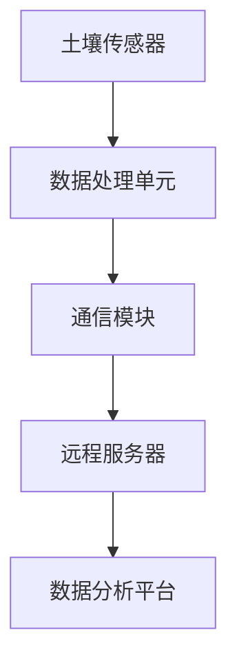
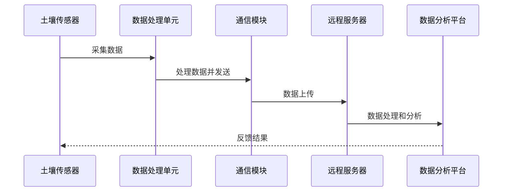

                 


### 智能传感器在环境监测中的应用

#### 关键词：智能传感器、环境监测、空气质量、水质、土壤监测、物联网、数据分析

#### 摘要：

随着全球环境问题的日益严峻，环境监测已成为各国政府和企业关注的焦点。智能传感器作为环境监测的核心技术之一，其在数据采集、传输和处理等方面具有显著优势。本文将从智能传感器的定义、原理、分类及应用等方面出发，详细探讨智能传感器在环境监测中的应用，并提出当前技术面临的挑战及未来发展趋势。通过本文的阅读，读者将全面了解智能传感器在环境监测中的重要性及其发展前景。

#### 目录：

----------------------------------------------------------------

## 智能传感器在环境监测中的应用

### 引言

#### 1.1 环境监测的重要性

环境监测是保障人类健康和生态系统稳定的重要手段。通过监测空气、水和土壤等环境要素，可以及时发现环境污染问题，为环境治理提供科学依据。随着工业化进程的加快和城市化水平的提高，环境污染问题日益严重，环境监测的重要性愈发凸显。

#### 1.2 智能传感器的发展背景

智能传感器作为信息技术的产物，具有感知、处理和传输数据的能力，能够实时、准确地监测环境变化。近年来，随着物联网、大数据和人工智能等技术的快速发展，智能传感器在环境监测中的应用越来越广泛。

### Part 1: 智能传感器的概述

#### Chapter 1: 智能传感器的定义与分类

#### 1.1 智能传感器的定义

智能传感器是集成了传感器、数据处理单元和通信接口的微型设备，能够感知环境变化，并通过通信接口将数据传输到远程系统进行进一步处理。

#### 1.2 智能传感器的分类

根据传感器的感知对象和功能，智能传感器可以分为多种类型，如温度传感器、湿度传感器、气体传感器、水质传感器等。

### Part 2: 智能传感器在环境监测中的应用

#### Chapter 2: 空气质量监测

#### 2.1 空气质量监测的重要性

空气质量是影响人类健康的重要因素。通过智能传感器监测空气质量，可以及时发现污染物超标情况，为公众提供健康预警。

#### 2.2 智能传感器在空气质量监测中的应用

目前，智能传感器在空气质量监测中已得到广泛应用。例如，PM2.5、PM10、CO、SO2等污染物的监测，均可以采用智能传感器实现。

### Part 3: 智能传感器在水质监测中的应用

#### Chapter 3: 水质监测

#### 3.1 水质监测的重要性

水质监测是保障水资源安全的重要环节。通过智能传感器监测水质，可以及时发现水质污染问题，保障饮用水安全。

#### 3.2 智能传感器在水质监测中的应用

智能传感器在水质监测中可以用于监测水温、pH值、电导率、溶解氧等参数，为水资源管理和保护提供科学依据。

### Part 4: 智能传感器在土壤监测中的应用

#### Chapter 4: 土壤监测

#### 4.1 土壤监测的重要性

土壤是植物生长的基础，土壤质量直接影响农作物的产量和品质。通过智能传感器监测土壤，可以及时了解土壤环境变化，为农业生产提供科学指导。

#### 4.2 智能传感器在土壤监测中的应用

智能传感器在土壤监测中可以用于监测土壤温度、湿度、pH值、养分含量等参数，为农业生产提供数据支持。

### Part 5: 智能传感器在环境监测中的挑战与未来趋势

#### Chapter 5: 智能传感器在环境监测中的挑战

#### 5.1 挑战一：传感器精度与稳定性

智能传感器的精度和稳定性是影响环境监测数据质量的关键因素。提高传感器精度和稳定性是当前研究的重要方向。

#### 5.2 挑战二：数据处理与传输

环境监测数据量大，实时处理和传输是环境监测系统面临的挑战。如何高效处理和传输数据是当前研究的重要课题。

#### 5.3 挑战三：系统集成与优化

智能传感器在环境监测中需要与其他系统（如物联网、大数据平台等）进行集成。系统集成与优化是提高环境监测系统性能的关键。

### Part 6: 未来发展趋势

#### Chapter 6: 未来发展趋势

#### 6.1 发展趋势一：物联网技术的融合

物联网技术的快速发展将使智能传感器在环境监测中的应用更加广泛，实现环境监测数据的实时采集、传输和处理。

#### 6.2 发展趋势二：大数据与人工智能的应用

大数据和人工智能技术的应用将使环境监测数据的价值得到充分挖掘，为环境治理提供科学依据。

#### 6.3 发展趋势三：智能传感器成本的降低

随着技术的进步，智能传感器的成本将逐渐降低，使其在更广泛的领域得到应用。

### 结论

智能传感器在环境监测中具有重要作用。通过本文的探讨，我们了解了智能传感器的定义、分类及应用，分析了其在环境监测中的挑战与未来发展趋势。随着技术的不断进步，智能传感器将在环境监测领域发挥更大的作用。

---

### 作者信息：

作者：AI天才研究院/AI Genius Institute & 禅与计算机程序设计艺术 /Zen And The Art of Computer Programming### 智能传感器在环境监测中的应用

#### 关键词：智能传感器、环境监测、空气质量、水质、土壤监测、物联网、数据分析

#### 摘要：

随着全球环境问题的日益严峻，环境监测已成为各国政府和企业关注的焦点。智能传感器作为环境监测的核心技术之一，其在数据采集、传输和处理等方面具有显著优势。本文将从智能传感器的定义、原理、分类及应用等方面出发，详细探讨智能传感器在环境监测中的应用，并提出当前技术面临的挑战及未来发展趋势。通过本文的阅读，读者将全面了解智能传感器在环境监测中的重要性及其发展前景。

#### 目录：

----------------------------------------------------------------

## 智能传感器在环境监测中的应用

### 引言

#### 1.1 环境监测的重要性

环境监测是保障人类健康和生态系统稳定的重要手段。通过监测空气、水和土壤等环境要素，可以及时发现环境污染问题，为环境治理提供科学依据。随着工业化进程的加快和城市化水平的提高，环境污染问题日益严重，环境监测的重要性愈发凸显。

#### 1.2 智能传感器的发展背景

智能传感器作为信息技术的产物，具有感知、处理和传输数据的能力，能够实时、准确地监测环境变化。近年来，随着物联网、大数据和人工智能等技术的快速发展，智能传感器在环境监测中的应用越来越广泛。

### Part 1: 智能传感器的概述

#### Chapter 1: 智能传感器的定义与分类

#### 1.1 智能传感器的定义

智能传感器是集成了传感器、数据处理单元和通信接口的微型设备，能够感知环境变化，并通过通信接口将数据传输到远程系统进行进一步处理。

#### 1.2 智能传感器的分类

根据传感器的感知对象和功能，智能传感器可以分为多种类型，如温度传感器、湿度传感器、气体传感器、水质传感器等。

### Part 2: 智能传感器在环境监测中的应用

#### Chapter 2: 空气质量监测

#### 2.1 空气质量监测的重要性

空气质量是影响人类健康的重要因素。通过智能传感器监测空气质量，可以及时发现污染物超标情况，为公众提供健康预警。

#### 2.2 智能传感器在空气质量监测中的应用

目前，智能传感器在空气质量监测中已得到广泛应用。例如，PM2.5、PM10、CO、SO2等污染物的监测，均可以采用智能传感器实现。

### Part 3: 智能传感器在水质监测中的应用

#### Chapter 3: 水质监测

#### 3.1 水质监测的重要性

水质监测是保障水资源安全的重要环节。通过智能传感器监测水质，可以及时发现水质污染问题，保障饮用水安全。

#### 3.2 智能传感器在水质监测中的应用

智能传感器在水质监测中可以用于监测水温、pH值、电导率、溶解氧等参数，为水资源管理和保护提供科学依据。

### Part 4: 智能传感器在土壤监测中的应用

#### Chapter 4: 土壤监测

#### 4.1 土壤监测的重要性

土壤是植物生长的基础，土壤质量直接影响农作物的产量和品质。通过智能传感器监测土壤，可以及时了解土壤环境变化，为农业生产提供科学指导。

#### 4.2 智能传感器在土壤监测中的应用

智能传感器在土壤监测中可以用于监测土壤温度、湿度、pH值、养分含量等参数，为农业生产提供数据支持。

### Part 5: 智能传感器在环境监测中的挑战与未来趋势

#### Chapter 5: 智能传感器在环境监测中的挑战

#### 5.1 挑战一：传感器精度与稳定性

智能传感器的精度和稳定性是影响环境监测数据质量的关键因素。提高传感器精度和稳定性是当前研究的重要方向。

#### 5.2 挑战二：数据处理与传输

环境监测数据量大，实时处理和传输是环境监测系统面临的挑战。如何高效处理和传输数据是当前研究的重要课题。

#### 5.3 挑战三：系统集成与优化

智能传感器在环境监测中需要与其他系统（如物联网、大数据平台等）进行集成。系统集成与优化是提高环境监测系统性能的关键。

### Part 6: 未来发展趋势

#### Chapter 6: 未来发展趋势

#### 6.1 发展趋势一：物联网技术的融合

物联网技术的快速发展将使智能传感器在环境监测中的应用更加广泛，实现环境监测数据的实时采集、传输和处理。

#### 6.2 发展趋势二：大数据与人工智能的应用

大数据和人工智能技术的应用将使环境监测数据的价值得到充分挖掘，为环境治理提供科学依据。

#### 6.3 发展趋势三：智能传感器成本的降低

随着技术的进步，智能传感器的成本将逐渐降低，使其在更广泛的领域得到应用。

### 结论

智能传感器在环境监测中具有重要作用。通过本文的探讨，我们了解了智能传感器的定义、分类及应用，分析了其在环境监测中的挑战与未来发展趋势。随着技术的不断进步，智能传感器将在环境监测领域发挥更大的作用。

---

### 作者信息：

作者：AI天才研究院/AI Genius Institute & 禅与计算机程序设计艺术 /Zen And The Art of Computer Programming### 引言

#### 1.1 环境监测的重要性

环境监测是现代环境保护工作的重要组成部分。它通过监测和分析空气、水、土壤等环境要素的质量，能够及时、准确地反映环境变化，为环境保护决策提供科学依据。环境监测的意义在于：

1. **保障人类健康**：通过监测空气中的污染物浓度，如PM2.5、PM10、CO、SO2等，可以及时发现空气质量问题，防止空气污染对人类健康造成危害。
2. **保护生态环境**：水质监测可以监测水体中的重金属、有机污染物、细菌等污染物，保障水资源的清洁，保护水生生物的生存环境。
3. **促进可持续发展**：土壤监测可以监测土壤的养分含量、酸碱度等，为农业生产提供科学指导，保障农作物的产量和品质。
4. **应急预案**：在发生环境污染事件时，环境监测数据可以帮助制定和实施应急预案，减少环境污染的影响。

#### 1.2 智能传感器的发展背景

智能传感器是现代信息技术的产物，它集成了传感技术、微电子技术、数据处理技术和通信技术等多种技术，能够对环境中的各种参数进行实时监测。智能传感器的发展背景主要受到以下因素的影响：

1. **物联网（IoT）的兴起**：物联网技术的快速发展使得智能传感器能够通过无线网络将监测数据实时传输到中心系统，实现远程监控和智能分析。
2. **大数据技术的应用**：大数据技术的进步使得对大量环境监测数据进行高效处理和分析成为可能，为环境监测提供了新的技术手段。
3. **人工智能（AI）的发展**：人工智能技术的应用使得智能传感器能够进行复杂的模式识别和预测分析，提高了环境监测的智能化水平。
4. **环保意识的增强**：随着公众环保意识的提高，对环境监测的需求日益增加，推动了智能传感器在环境监测中的应用。

近年来，随着技术的不断进步和环保需求的增加，智能传感器在环境监测中的应用越来越广泛。它不仅能够提高环境监测的精度和效率，还能够降低监测成本，为环境保护工作提供强有力的技术支持。智能传感器的发展为环境监测领域带来了新的机遇和挑战。

### Part 1: 智能传感器的概述

#### Chapter 1: 智能传感器的定义与分类

#### 1.1 智能传感器的定义

智能传感器是一种具有感知、处理和通信能力的微型设备，它能够对环境中的各种参数进行实时监测和采集，并通过数据处理单元对监测数据进行初步处理，最后通过通信接口将数据传输到远程系统进行进一步分析和应用。智能传感器通常由以下几个主要部分组成：

1. **传感器**：负责感知环境中的特定物理量，如温度、湿度、气体浓度、水质等。
2. **数据处理单元**：通常包括微处理器或微控制器，用于对传感器采集到的数据进行预处理，如信号放大、滤波、数字化等。
3. **通信接口**：用于将处理后的数据传输到远程系统，如Wi-Fi、蓝牙、Zigbee等无线通信技术。

智能传感器的核心特点在于其智能化处理能力，这使得它不仅能够简单地进行数据采集，还能够对采集到的数据进行分析和处理，从而实现更加智能化的环境监测。

#### 1.2 智能传感器的分类

根据传感器的感知对象和功能，智能传感器可以分为多种类型。以下是常见的几种智能传感器分类：

1. **温度传感器**：用于测量环境温度，如热敏电阻、热电偶等。
2. **湿度传感器**：用于测量环境湿度，如电容式湿度传感器、电阻式湿度传感器等。
3. **气体传感器**：用于检测环境中特定气体浓度，如CO传感器、NO2传感器、SO2传感器等。
4. **水质传感器**：用于监测水中的各种参数，如pH值、电导率、溶解氧等。
5. **土壤传感器**：用于监测土壤的物理和化学性质，如土壤湿度、温度、养分含量等。

每种传感器都有其特定的应用场景和优势，通过组合使用不同类型的传感器，可以实现对环境的全面监测。

#### 1.3 智能传感器的组成结构

智能传感器的组成结构可以分为三个主要部分：传感器单元、数据处理单元和通信单元。以下是每个部分的详细介绍：

1. **传感器单元**：这是智能传感器的核心部分，负责对环境中的物理量进行感知。传感器单元通常由敏感元件、信号调理电路和电源电路组成。敏感元件根据传感器的类型可以是热敏电阻、光敏电阻、电容等，信号调理电路用于放大和滤波信号，使其适合后续处理。

2. **数据处理单元**：通常由微处理器或微控制器组成，负责对传感器采集到的信号进行预处理和计算。数据处理单元可以通过内置算法对信号进行滤波、放大、转换等操作，以提取有用的监测信息。此外，数据处理单元还可以进行简单的数据分析，如平均值计算、阈值判断等。

3. **通信单元**：用于将处理后的数据传输到远程系统或服务器。通信单元可以采用多种通信技术，如Wi-Fi、蓝牙、Zigbee、LoRa等。这些通信技术使得智能传感器能够实现无线数据传输，大大提高了监测系统的灵活性和可扩展性。

通过这三个部分的协同工作，智能传感器能够实现对环境参数的实时监测、数据采集和处理，并将处理后的数据传输到远程系统进行进一步分析和应用。智能传感器的组成结构决定了其性能和应用范围，通过合理设计和优化各个部分，可以提升智能传感器的整体性能和可靠性。

#### 1.4 智能传感器的工作原理

智能传感器的工作原理基于传感器的基本原理和数据处理技术。以下是智能传感器的工作原理的详细描述：

1. **传感器响应**：智能传感器中的敏感元件（如热敏电阻、光敏电阻、电容等）会根据其特性对外部环境的变化产生响应。例如，热敏电阻的电阻值会随温度变化而变化，光敏电阻的电阻值会随光照强度变化而变化。这些响应通过电路转化为电信号。

2. **信号调理**：采集到的原始信号通常较弱且存在噪声，需要通过信号调理电路进行放大、滤波等处理。信号调理电路的主要任务是提高信号的幅值和稳定性，以便后续处理。例如，可以通过低通滤波器去除高频噪声，通过放大电路提高信号的幅度。

3. **数据处理**：调理后的信号会进入数据处理单元，通常是一个微处理器或微控制器。数据处理单元负责对信号进行进一步的预处理和计算。这包括信号数字化、噪声过滤、特征提取等操作。例如，可以通过模数转换器（ADC）将模拟信号转换为数字信号，以便后续的数字处理。

4. **数据分析**：处理后的数据会根据预定的算法进行分析，以提取有用的信息。这可能包括计算平均值、标准差、峰值等统计指标，或者进行更复杂的模式识别和预测分析。数据分析的结果可以实时显示在终端设备上，或者上传到远程服务器进行存储和分析。

5. **通信传输**：最后，处理后的数据会通过通信单元传输到远程系统或服务器。通信单元可以使用各种无线通信技术，如Wi-Fi、蓝牙、Zigbee、LoRa等，实现无线数据传输。这些通信技术提供了灵活的连接方式，使得智能传感器可以广泛应用于各种环境监测场景。

通过上述步骤，智能传感器能够实现对环境参数的实时监测、数据采集和处理，并将处理后的数据传输到远程系统进行进一步分析和应用。智能传感器的工作原理体现了传感技术、数据处理技术和通信技术的融合，使得环境监测变得更加智能和高效。

#### 1.5 智能传感器在环境监测中的重要性

智能传感器在环境监测中的重要性体现在以下几个方面：

1. **实时监测**：智能传感器能够实时采集环境数据，通过无线传输技术将数据传输到中心系统，实现实时监测和报警功能。这种实时性使得环境监测更加及时、有效，有助于及时发现和应对环境问题。

2. **高精度与高可靠性**：智能传感器采用先进的技术和材料，具有高精度和高可靠性。通过精确的测量和稳定的工作性能，智能传感器能够提供准确的环境参数，为环境保护决策提供可靠的数据支持。

3. **自动化与智能化**：智能传感器集成了数据处理单元和通信接口，可以实现自动化监测和数据传输。此外，智能传感器还支持与大数据和人工智能技术的结合，通过数据分析实现环境问题的预测和预警，提高了环境监测的智能化水平。

4. **降低监测成本**：智能传感器的广泛应用可以降低环境监测的成本。通过自动化监测和数据共享，减少了人力成本和监测设备的维护成本，提高了环境监测的效率。

5. **数据融合与综合应用**：智能传感器可以与物联网、大数据平台等系统进行集成，实现环境数据的综合分析和应用。通过数据融合，可以提供更全面的环境监测信息，为环境保护和可持续发展提供科学依据。

总之，智能传感器在环境监测中发挥着重要作用，它不仅提高了监测的实时性、精度和智能化水平，还降低了监测成本，为环境保护工作提供了有力的技术支持。随着智能传感器技术的不断发展和完善，其在环境监测领域的应用前景将更加广阔。

### Part 2: 智能传感器在空气质量监测中的应用

#### Chapter 2: 空气质量监测

#### 2.1 空气质量监测的重要性

空气质量监测是环境监测中的一个关键领域，对保障公众健康和生态环境具有重要意义。空气质量的好坏直接影响人们的呼吸健康、生活质量以及生态环境的稳定性。以下是空气质量监测的重要性和相关背景：

1. **公众健康**：空气中的污染物如PM2.5、PM10、CO、SO2、NO2等，会对人体呼吸系统、心血管系统等造成严重危害。长期暴露在污染环境中，可能导致呼吸系统疾病、心血管疾病等健康问题。通过空气质量监测，可以及时发现污染情况，采取相应的防护措施，降低健康风险。

2. **生态环境**：空气污染不仅影响人类健康，还会对生态系统造成破坏。例如，氮氧化物和挥发性有机物在阳光下发生光化学反应，产生臭氧，对植物叶片造成伤害，影响植物生长和生态系统的平衡。

3. **政策制定**：空气质量监测数据为政府制定环境保护政策提供科学依据。通过监测数据，政府可以了解环境污染的程度和范围，制定和调整环保政策，推动空气质量改善。

4. **经济影响**：空气污染造成的健康问题和环境破坏，会给经济带来巨大的损失。通过空气质量监测，可以评估污染对经济的负面影响，为制定经济补偿和治理措施提供依据。

#### 2.2 空气质量监测的历史背景

空气质量监测的历史可以追溯到20世纪中叶，随着工业化进程的加快，大气污染问题日益严重。以下是空气质量监测的一些重要历史背景：

1. **20世纪50年代**：工业革命后，大气污染问题开始引起关注。1952年的伦敦雾霾事件导致数千人死亡，促使各国开始重视大气污染问题。

2. **20世纪60年代**：美国和欧洲等国家开始建立空气质量监测网络，对污染物浓度进行监测。

3. **20世纪70年代**：国际上发布了《大气污染控制条例》等法规，推动空气质量监测和管理。

4. **20世纪90年代**：随着科技的进步，空气质量监测设备和技术得到快速发展，监测范围和精度不断提高。

5. **21世纪初**：物联网、大数据和人工智能等新兴技术的应用，使得空气质量监测更加智能化和高效化。

#### 2.3 空气质量监测的关键技术

空气质量监测的关键技术包括传感器技术、数据处理技术、传输技术和分析技术等。以下是这些技术的详细描述：

1. **传感器技术**：空气质量监测的核心是传感器。常见的空气质量传感器包括PM2.5传感器、PM10传感器、气体传感器（如CO、SO2、NO2等）等。这些传感器能够实时检测空气中的污染物浓度，为空气质量监测提供基础数据。

2. **数据处理技术**：空气质量监测数据量大，且包含多种污染物信息。数据处理技术包括数据滤波、去噪、特征提取等，用于提高数据质量和提取有用信息。

3. **传输技术**：空气质量监测需要将传感器采集的数据实时传输到中心系统进行分析和处理。常用的传输技术包括无线传输（如Wi-Fi、蓝牙、Zigbee等）和有线传输（如以太网、光纤等）。无线传输技术使得空气质量监测设备可以灵活部署，适用于多种环境。

4. **分析技术**：空气质量监测数据分析技术包括统计方法、机器学习和人工智能技术等。通过数据分析，可以实现对空气质量趋势的预测、污染源的追踪等，为环境治理提供科学依据。

#### 2.4 空气质量监测的常用方法

空气质量监测的常用方法包括实地监测、遥感监测和模型模拟等。以下是这些方法的详细描述：

1. **实地监测**：实地监测是通过在环境现场部署传感器设备，直接测量空气中的污染物浓度。这种方法具有高精度和高可靠性，但覆盖范围有限，需要大量监测站点。

2. **遥感监测**：遥感监测是通过卫星或无人机等遥感设备，对大面积环境进行监测。这种方法可以实时获取大范围的环境质量数据，但精度相对较低，受天气和光照等因素影响。

3. **模型模拟**：模型模拟是通过建立空气质量模型，模拟污染物在大气中的扩散和变化过程。这种方法可以预测未来的空气质量状况，为环境治理提供指导，但依赖于模型的精度和参数。

#### 2.5 空气质量监测的应用实例

空气质量监测在多个领域有广泛应用，以下是几个典型的应用实例：

1. **城市空气质量监测**：通过部署智能传感器网络，对城市空气质量进行实时监测，为市民提供健康预警，为政府制定环保政策提供数据支持。

2. **工业园区空气质量监测**：对工业园区进行空气质量监测，评估污染源和污染程度，指导企业进行污染治理。

3. **道路空气质量监测**：在交通密集区域部署空气质量传感器，监测汽车尾气对空气质量的影响，为交通管理提供依据。

4. **农村空气质量监测**：通过智能传感器网络，监测农村空气质量，为农村环境治理提供科学指导。

5. **全球空气质量监测**：利用卫星遥感技术和地面监测数据，对全球空气质量进行监测，为全球环境治理提供数据支持。

总之，空气质量监测是环境监测的重要组成部分，通过智能传感器技术的应用，可以实现对空气质量的高效监测和精准分析，为环境保护和可持续发展提供科学依据。

#### 2.6 智能传感器在空气质量监测中的应用实例

智能传感器在空气质量监测中的应用日益广泛，下面我们通过几个具体的实例来探讨智能传感器在空气质量监测中的应用。

##### 2.6.1 城市空气质量监测网络

在许多城市，智能传感器网络被广泛用于空气质量监测。例如，北京市就部署了大量智能传感器，实时监测空气中的PM2.5、PM10、CO、SO2、NO2等污染物的浓度。这些传感器分布在城市的不同区域，通过无线传输技术将监测数据实时传输到中央系统进行分析和处理。北京市空气质量监测网络的成功运行，不仅提高了空气质量监测的精度和效率，还为城市环境保护和治理提供了科学依据。

- **实例**：北京市空气质量监测网络由超过300个智能传感器节点组成，分布在城市的主要区域。每个传感器节点都配备有PM2.5、PM10、CO、SO2、NO2等多种污染物传感器，能够实时监测并传输空气质量数据。

- **技术**：传感器节点采用Wi-Fi通信技术，将监测数据传输到中央系统。中央系统利用大数据和人工智能技术，对数据进行处理和分析，生成空气质量报告，并通过互联网向公众发布。

- **效果**：智能传感器网络使得北京市能够实现实时空气质量监测，及时发现污染问题，采取相应的治理措施。此外，公众可以通过互联网获取实时空气质量信息，提高健康防护意识。

##### 2.6.2 工业园区空气质量监测

在工业园区，智能传感器也被广泛用于空气质量监测，以评估污染源和污染程度，指导企业进行污染治理。例如，某工业园区通过部署智能传感器网络，对园区内的空气质量进行实时监测。这些传感器监测的污染物包括PM2.5、PM10、CO、SO2、NO2等，数据通过无线传输技术传输到中央系统进行分析和处理。

- **实例**：某工业园区部署了100个智能传感器，分布在工厂区、生活区和其他关键区域，实时监测空气中的污染物浓度。

- **技术**：传感器节点采用LoRa通信技术，将监测数据传输到中央系统。中央系统利用大数据和物联网技术，对数据进行处理和分析，生成空气质量报告，并实时反馈给企业管理部门。

- **效果**：智能传感器网络帮助园区企业实时了解空气质量状况，及时发现污染问题，采取措施进行治理。此外，通过数据分析和预测，园区企业能够优化生产工艺，降低污染物排放。

##### 2.6.3 道路空气质量监测

在交通密集区域，智能传感器用于监测道路空气质量，评估汽车尾气对空气质量的影响，为交通管理提供依据。例如，某城市在主要道路沿线部署了智能传感器，监测空气中的PM2.5、PM10、CO、SO2、NO2等污染物的浓度。

- **实例**：某城市在主要道路沿线部署了50个智能传感器，实时监测交通密集区域的空气质量。

- **技术**：传感器节点采用Wi-Fi通信技术，将监测数据传输到中央系统。中央系统利用大数据和人工智能技术，对数据进行处理和分析，生成空气质量报告，并实时反馈给交通管理部门。

- **效果**：智能传感器网络帮助交通管理部门实时了解道路空气质量状况，采取措施优化交通流量，减少污染物排放。此外，通过数据分析和预测，可以提前预警可能的污染问题，采取预防措施。

##### 2.6.4 农村空气质量监测

在农村地区，智能传感器也被用于空气质量监测，以监测农业活动对空气质量的影响。例如，某农村地区通过部署智能传感器网络，监测空气中的PM2.5、PM10、CO、SO2、NO2等污染物的浓度。

- **实例**：某农村地区部署了30个智能传感器，分布在农田、村庄和其他关键区域，实时监测空气中的污染物浓度。

- **技术**：传感器节点采用Zigbee通信技术，将监测数据传输到中央系统。中央系统利用大数据和物联网技术，对数据进行处理和分析，生成空气质量报告，并实时反馈给农村管理部门。

- **效果**：智能传感器网络帮助农村管理部门实时了解空气质量状况，采取措施减少农业活动对空气质量的影响。此外，通过数据分析和预测，可以提前预警可能的污染问题，采取预防措施。

这些实例表明，智能传感器在空气质量监测中的应用具有广泛的前景和实际效果。通过智能传感器网络，可以实现空气质量的高效监测和精准分析，为环境保护和可持续发展提供有力支持。

#### 2.7 空气质量监测的未来发展趋势

空气质量监测作为环境监测的重要组成部分，随着科技的进步和环保意识的提高，未来将呈现以下发展趋势：

1. **传感器技术进步**：未来智能传感器将更加小型化、低功耗，传感器材料的性能将进一步提高，传感器成本将显著降低。这将使得空气质量监测网络可以更加广泛地部署，实现更精细的监测。

2. **物联网和大数据技术融合**：物联网和大数据技术的融合将进一步提升空气质量监测的智能化水平。通过物联网技术，可以实现智能传感器的远程监控和管理；通过大数据技术，可以对大量空气质量数据进行高效处理和分析，挖掘出更多的环保信息和决策支持。

3. **人工智能技术的应用**：人工智能技术在空气质量监测中的应用将使监测系统更加智能化。例如，通过机器学习算法，可以预测空气质量变化趋势，实现污染预警；通过深度学习算法，可以识别空气污染源，为污染治理提供科学依据。

4. **跨领域协同**：空气质量监测将与气象学、生态学、环境科学等多个领域进行协同研究，形成更加综合的环境监测体系。这将有助于更全面地理解空气质量变化的原因和影响，为环境保护提供更科学的指导。

5. **国际化合作**：随着全球环境问题的日益突出，空气质量监测的国际化合作将进一步加强。国际间共享空气质量监测数据，将有助于全球环境治理和可持续发展。

总之，未来空气质量监测将朝着更加智能化、高效化、综合化和国际化的方向发展，为环境保护和人类健康提供更加有力的支持。

### Part 3: 智能传感器在水质监测中的应用

#### Chapter 3: 水质监测

#### 3.1 水质监测的重要性

水质监测是环境监测的重要组成部分，对于保障饮用水安全、维护生态平衡和促进可持续发展具有重要意义。以下是水质监测的重要性：

1. **保障饮用水安全**：水质监测是确保饮用水安全的重要手段。通过监测水中污染物浓度，可以及时发现水质污染问题，采取相应的处理措施，防止饮用水污染对人类健康造成危害。

2. **维护生态平衡**：水质监测有助于了解水体中的生物、化学和物理变化，维护水生态系统的健康和稳定。水质监测数据可以为水资源管理、生态修复和保护提供科学依据。

3. **促进可持续发展**：水质监测是可持续发展的重要组成部分。通过监测水质变化，可以评估水资源利用效率，指导水资源管理和保护，实现水资源的可持续利用。

#### 3.2 水质监测的基本原理

水质监测的基本原理是通过各种水质传感器对水中的污染物、化学成分、生物指标等进行检测和测量。以下是水质监测的几个基本步骤：

1. **传感器选择与配置**：根据监测目标和水质特点，选择合适的水质传感器，如pH传感器、电导率传感器、溶解氧传感器、氨氮传感器等。

2. **现场采样**：在现场设置采样点，采用适当的方法（如自动采样器或手动采样）采集水样。

3. **传感器测量**：水质传感器将水样中的污染物或化学成分转化为电信号，通过传感器内置的信号处理电路进行放大、滤波等处理。

4. **数据传输与存储**：传感器测量得到的数据通过无线通信或有线通信方式传输到中央系统或数据库，进行实时监测和历史数据存储。

5. **数据处理与分析**：对传输的数据进行实时处理和分析，生成水质报告，用于环境管理决策和预警。

#### 3.3 水质监测的关键技术

水质监测的关键技术包括传感器技术、数据传输技术、数据处理技术等。以下是这些技术的详细描述：

1. **传感器技术**：水质传感器是水质监测的核心，其性能直接影响监测结果的精度和可靠性。常见的传感器包括pH传感器、电导率传感器、溶解氧传感器、氨氮传感器等。传感器的工作原理通常基于电化学、光学、电场等原理。

2. **数据传输技术**：水质监测数据的实时传输对于水质监控至关重要。常用的数据传输技术包括无线传输（如Wi-Fi、蓝牙、LoRa等）和有线传输（如以太网、光纤等）。无线传输技术使得水质监测设备可以灵活部署，覆盖更广泛的水域。

3. **数据处理技术**：水质监测数据量大，包含多种污染物信息。数据处理技术包括数据滤波、去噪、特征提取等，用于提高数据质量和提取有用信息。此外，数据处理技术还包括实时分析和预测技术，用于对水质变化趋势进行预测和预警。

#### 3.4 水质监测的方法和手段

水质监测的方法和手段多种多样，以下是一些常用的方法和手段：

1. **现场采样法**：通过现场采样器或手动采样器采集水样，然后对水样进行实验室分析。这种方法具有高精度，但受限于采样点的数量和频率。

2. **自动监测法**：通过在监测点部署自动水质监测设备，实现连续、自动的水质监测。自动监测设备可以实时采集和传输水质数据，适用于长期监测和实时监控。

3. **遥感监测法**：利用卫星遥感技术或无人机等遥感设备，对大面积水域进行水质监测。遥感监测法可以快速覆盖大范围水域，但精度相对较低。

4. **模型模拟法**：通过建立水质模型，模拟污染物在水体中的扩散和变化过程。模型模拟法可以预测未来的水质状况，为环境治理提供指导。

#### 3.5 水质监测的应用实例

水质监测在多个领域有广泛应用，以下是几个典型的应用实例：

1. **饮用水源地监测**：通过对饮用水源地进行水质监测，确保饮用水安全。例如，某城市通过对多个饮用水源地进行连续监测，及时发现并处理水质污染问题，保障市民饮水安全。

2. **河流水质监测**：对河流水质进行监测，评估河流污染程度，指导河流治理。例如，某河流流域通过部署自动水质监测设备，实时监测河流水质变化，为河流治理提供科学依据。

3. **湖泊和水库水质监测**：对湖泊和水库进行水质监测，评估水体生态健康状况，指导水体保护和管理。例如，某湖泊通过部署智能传感器网络，实时监测湖泊水质，为湖泊治理和保护提供数据支持。

4. **海洋水质监测**：对海洋水质进行监测，评估海洋污染状况，保障海洋生态环境健康。例如，某海洋监测机构通过部署智能传感器和遥感技术，对海洋水质进行长期监测，为海洋环境保护提供数据支持。

这些实例表明，智能传感器在水质监测中具有广泛的应用前景和实际效果。通过智能传感器网络，可以实现水质的高效监测和精准分析，为环境保护和可持续发展提供有力支持。

#### 3.6 智能传感器在水质监测中的应用实例

智能传感器在水质监测中的应用日益广泛，下面我们通过几个具体的实例来探讨智能传感器在水质监测中的应用。

##### 3.6.1 饮用水源地水质监测

饮用水源地水质监测是确保市民饮水安全的重要环节。智能传感器网络在饮用水源地监测中的应用，可以实时监测水源地的水质状况，及时预警潜在的水质污染问题。例如，某城市在多个饮用水源地部署了智能传感器，实时监测水中的污染物浓度。

- **实例**：某城市在饮用水源地部署了10个智能传感器节点，监测项目包括pH值、总氮、总磷、重金属等关键水质指标。

- **技术**：传感器节点采用无线传输技术（如LoRa），将监测数据传输到中央系统。中央系统通过大数据和人工智能技术对数据进行处理和分析，生成水质报告，并通过互联网向相关部门和市民发布。

- **效果**：智能传感器网络使得该城市能够实现饮用水源地水质的实时监测和预警，及时发现并处理水质污染问题，保障市民饮水安全。

##### 3.6.2 河流水质监测

河流水质监测对于维护河流生态健康和保障水质安全具有重要意义。智能传感器网络在河流水质监测中的应用，可以实现对河流水质的连续监测和数据分析，为河流治理提供科学依据。例如，某河流流域通过部署智能传感器网络，对河流水质进行实时监测。

- **实例**：某河流流域部署了50个智能传感器，分布在河流的多个监测点，监测项目包括pH值、溶解氧、氨氮、总氮、总磷等。

- **技术**：传感器节点采用有线和无线传输相结合的方式，有线传输用于监测点的集中管理，无线传输用于数据传输。中央系统通过物联网技术对数据进行实时处理和分析。

- **效果**：智能传感器网络使得该河流流域能够实现对水质的实时监测和预警，及时发现并处理水质污染问题，保障河流生态健康。

##### 3.6.3 湖泊水质监测

湖泊是重要的水资源，其水质状况对生态环境和水质安全具有重要影响。智能传感器网络在湖泊水质监测中的应用，可以实现对湖泊水质的全面监测和数据分析，为湖泊治理和保护提供数据支持。例如，某湖泊通过部署智能传感器网络，对湖泊水质进行实时监测。

- **实例**：某湖泊部署了30个智能传感器，分布在湖泊的不同区域，监测项目包括pH值、溶解氧、氨氮、总氮、总磷、叶绿素a等。

- **技术**：传感器节点采用无线传输技术（如Wi-Fi），将监测数据传输到中央系统。中央系统通过大数据和人工智能技术对数据进行处理和分析，生成水质报告，并通过互联网向相关部门和公众发布。

- **效果**：智能传感器网络使得该湖泊能够实现对水质的实时监测和预警，及时发现并处理水质污染问题，保障湖泊生态健康。

##### 3.6.4 海洋水质监测

海洋水质监测对于保障海洋生态环境和渔业资源安全具有重要意义。智能传感器网络在海洋水质监测中的应用，可以实现对海洋水质的实时监测和数据分析，为海洋环境保护和渔业资源管理提供数据支持。例如，某海洋监测机构通过部署智能传感器网络，对海洋水质进行实时监测。

- **实例**：某海洋监测机构在沿海地区部署了20个智能传感器，分布在海岸线和海域的不同位置，监测项目包括pH值、溶解氧、氨氮、总氮、总磷、重金属等。

- **技术**：传感器节点采用无线传输技术（如LoRa）和卫星通信技术相结合，实现数据的实时传输。中央系统通过物联网技术对数据进行实时处理和分析。

- **效果**：智能传感器网络使得该海洋监测机构能够实现对海洋水质的实时监测和预警，及时发现并处理水质污染问题，保障海洋生态环境和渔业资源安全。

这些实例表明，智能传感器在水质监测中具有广泛的应用前景和实际效果。通过智能传感器网络，可以实现水质的高效监测和精准分析，为环境保护和可持续发展提供有力支持。

#### 3.7 水质监测的未来发展趋势

水质监测作为环境监测的重要组成部分，随着科技的进步和环保需求的增加，未来将呈现以下发展趋势：

1. **传感器技术进步**：未来水质传感器将更加小型化、低功耗、高精度，传感器材料的性能将进一步提高。这将使得水质监测设备可以更加广泛地部署，实现更精细的水质监测。

2. **物联网和大数据技术的融合**：物联网和大数据技术的融合将进一步提升水质监测的智能化水平。通过物联网技术，可以实现水质监测设备的远程监控和管理；通过大数据技术，可以对大量水质数据进行高效处理和分析，挖掘出更多的环保信息和决策支持。

3. **人工智能技术的应用**：人工智能技术在水质监测中的应用将使监测系统更加智能化。例如，通过机器学习算法，可以预测水质变化趋势，实现污染预警；通过深度学习算法，可以识别污染源，为污染治理提供科学依据。

4. **跨领域协同**：水质监测将与水文、生态学、环境科学等多个领域进行协同研究，形成更加综合的环境监测体系。这将有助于更全面地理解水质变化的原因和影响，为环境保护提供更科学的指导。

5. **国际化合作**：随着全球环境问题的日益突出，水质监测的国际化合作将进一步加强。国际间共享水质监测数据，将有助于全球环境治理和可持续发展。

总之，未来水质监测将朝着更加智能化、高效化、综合化和国际化的方向发展，为环境保护和人类健康提供更加有力的支持。

### Part 4: 智能传感器在土壤监测中的应用

#### Chapter 4: 土壤监测

#### 4.1 土壤监测的重要性

土壤是植物生长的基础，其质量直接影响农作物的产量和品质。土壤监测对于农业生产、环境保护和资源管理具有重要意义。以下是土壤监测的重要性：

1. **农业生产**：土壤监测可以提供土壤养分含量、pH值、水分含量等关键数据，指导农民进行科学施肥、合理灌溉，提高农作物产量和品质。

2. **环境保护**：土壤监测有助于发现土壤污染问题，如重金属污染、农药残留等，为环境保护和污染治理提供科学依据。

3. **资源管理**：土壤监测可以评估土壤资源的利用效率，为资源管理和可持续发展提供数据支持。

#### 4.2 土壤监测的基本原理

土壤监测的基本原理是通过各种土壤传感器对土壤的物理、化学和生物性质进行检测和测量。以下是土壤监测的几个基本步骤：

1. **传感器选择与配置**：根据监测目标和土壤特点，选择合适的土壤传感器，如土壤湿度传感器、土壤温度传感器、pH传感器、电导率传感器等。

2. **现场采样**：在现场设置采样点，采用适当的方法（如自动采样器或手动采样）采集土壤样本。

3. **传感器测量**：土壤传感器将土壤样本中的物理、化学和生物参数转化为电信号，通过传感器内置的信号处理电路进行放大、滤波等处理。

4. **数据传输与存储**：传感器测量得到的数据通过无线通信或有线通信方式传输到中央系统或数据库，进行实时监测和历史数据存储。

5. **数据处理与分析**：对传输的数据进行实时处理和分析，生成土壤质量报告，用于环境管理决策和预警。

#### 4.3 土壤监测的关键技术

土壤监测的关键技术包括传感器技术、数据传输技术、数据处理技术等。以下是这些技术的详细描述：

1. **传感器技术**：土壤传感器是土壤监测的核心，其性能直接影响监测结果的精度和可靠性。常见的传感器包括土壤湿度传感器、土壤温度传感器、pH传感器、电导率传感器等。传感器的工作原理通常基于电化学、光学、电场等原理。

2. **数据传输技术**：土壤监测数据的实时传输对于土壤监测至关重要。常用的数据传输技术包括无线传输（如Wi-Fi、蓝牙、LoRa等）和有线传输（如以太网、光纤等）。无线传输技术使得土壤监测设备可以灵活部署，覆盖更广泛的区域。

3. **数据处理技术**：土壤监测数据量大，包含多种土壤参数信息。数据处理技术包括数据滤波、去噪、特征提取等，用于提高数据质量和提取有用信息。此外，数据处理技术还包括实时分析和预测技术，用于对土壤质量变化趋势进行预测和预警。

#### 4.4 土壤监测的方法和手段

土壤监测的方法和手段多种多样，以下是一些常用的方法和手段：

1. **现场采样法**：通过现场采样器或手动采样器采集土壤样本，然后对土壤样本进行实验室分析。这种方法具有高精度，但受限于采样点的数量和频率。

2. **自动监测法**：通过在监测点部署自动土壤监测设备，实现连续、自动的土壤监测。自动监测设备可以实时采集和传输土壤数据，适用于长期监测和实时监控。

3. **遥感监测法**：利用卫星遥感技术或无人机等遥感设备，对大面积土壤进行监测。遥感监测法可以快速覆盖大范围土壤区域，但精度相对较低。

4. **模型模拟法**：通过建立土壤模型，模拟土壤中的物理、化学和生物过程。模型模拟法可以预测未来的土壤质量状况，为土壤管理和治理提供指导。

#### 4.5 智能传感器在土壤监测中的应用实例

智能传感器在土壤监测中的应用日益广泛，下面我们通过几个具体的实例来探讨智能传感器在土壤监测中的应用。

##### 4.5.1 农田土壤监测

农田土壤监测是农业生产的重要环节，智能传感器在农田土壤监测中的应用，可以实时监测土壤的物理、化学和生物性质，为农业生产提供科学依据。例如，某农田通过部署智能传感器网络，对土壤质量进行实时监测。

- **实例**：某农田部署了20个智能传感器，分布在农田的不同区域，监测项目包括土壤湿度、土壤温度、pH值、电导率、养分含量等。

- **技术**：传感器节点采用无线传输技术（如LoRa），将监测数据传输到中央系统。中央系统通过物联网技术对数据进行实时处理和分析，生成土壤质量报告，并通过互联网向农民发布。

- **效果**：智能传感器网络使得该农田能够实现对土壤质量的实时监测和预警，及时调整农业生产措施，提高农作物产量和品质。

##### 4.5.2 园林土壤监测

园林土壤监测对于维护园林植物的健康生长具有重要意义。智能传感器在园林土壤监测中的应用，可以实时监测土壤的湿度、温度、养分含量等参数，为园林植物养护提供数据支持。例如，某园林通过部署智能传感器网络，对园林土壤质量进行实时监测。

- **实例**：某园林部署了15个智能传感器，分布在园林的不同区域，监测项目包括土壤湿度、土壤温度、养分含量等。

- **技术**：传感器节点采用无线传输技术（如Zigbee），将监测数据传输到中央系统。中央系统通过物联网技术对数据进行实时处理和分析，生成土壤质量报告，并通过互联网向园林管理人员发布。

- **效果**：智能传感器网络使得该园林能够实现对土壤质量的实时监测和预警，及时调整园林植物养护措施，提高植物生长质量。

##### 4.5.3 矿区土壤监测

矿区土壤监测对于评估矿区生态修复效果具有重要意义。智能传感器在矿区土壤监测中的应用，可以实时监测土壤的物理、化学和生物性质，为矿区生态修复提供科学依据。例如，某矿区通过部署智能传感器网络，对矿区土壤质量进行实时监测。

- **实例**：某矿区部署了10个智能传感器，分布在矿区不同区域，监测项目包括土壤湿度、土壤温度、pH值、养分含量等。

- **技术**：传感器节点采用有线和无线传输相结合的方式，有线传输用于监测点的集中管理，无线传输用于数据传输。中央系统通过物联网技术对数据进行实时处理和分析。

- **效果**：智能传感器网络使得该矿区能够实现对土壤质量的实时监测和预警，及时评估矿区生态修复效果，为矿区生态修复提供科学依据。

这些实例表明，智能传感器在土壤监测中具有广泛的应用前景和实际效果。通过智能传感器网络，可以实现土壤的高效监测和精准分析，为农业生产、环境保护和生态修复提供有力支持。

#### 4.6 土壤监测的未来发展趋势

土壤监测作为环境监测的重要组成部分，随着科技的进步和环保需求的增加，未来将呈现以下发展趋势：

1. **传感器技术进步**：未来土壤传感器将更加小型化、低功耗、高精度，传感器材料的性能将进一步提高。这将使得土壤监测设备可以更加广泛地部署，实现更精细的土壤监测。

2. **物联网和大数据技术的融合**：物联网和大数据技术的融合将进一步提升土壤监测的智能化水平。通过物联网技术，可以实现土壤监测设备的远程监控和管理；通过大数据技术，可以对大量土壤数据进行高效处理和分析，挖掘出更多的环保信息和决策支持。

3. **人工智能技术的应用**：人工智能技术在土壤监测中的应用将使监测系统更加智能化。例如，通过机器学习算法，可以预测土壤质量变化趋势，实现污染预警；通过深度学习算法，可以识别土壤污染源，为污染治理提供科学依据。

4. **跨领域协同**：土壤监测将与农业科学、生态学、环境科学等多个领域进行协同研究，形成更加综合的环境监测体系。这将有助于更全面地理解土壤质量变化的原因和影响，为环境保护和可持续发展提供更科学的指导。

5. **国际化合作**：随着全球环境问题的日益突出，土壤监测的国际化合作将进一步加强。国际间共享土壤监测数据，将有助于全球环境治理和可持续发展。

总之，未来土壤监测将朝着更加智能化、高效化、综合化和国际化的方向发展，为环境保护和人类健康提供更加有力的支持。

### Part 5: 智能传感器在环境监测中的挑战与未来趋势

#### Chapter 5: 智能传感器在环境监测中的挑战

#### 5.1 挑战一：传感器精度与稳定性

智能传感器在环境监测中的应用效果很大程度上取决于传感器的精度和稳定性。以下是智能传感器在精度与稳定性方面面临的主要挑战：

1. **环境因素影响**：智能传感器在室外或恶劣环境中工作，会受到温度、湿度、光照、电磁干扰等多种环境因素的影响，这些因素可能导致传感器性能不稳定，影响测量精度。

2. **传感器寿命**：智能传感器通常需要在现场长时间运行，传感器寿命的长短直接影响监测系统的稳定性和可靠性。传感器寿命短可能导致频繁更换，增加维护成本。

3. **校准问题**：传感器需要定期进行校准，以确保其测量精度。然而，在实际应用中，校准过程可能受到设备、人员和操作环境等多种因素的影响，导致校准不准确。

4. **数据融合**：在多传感器系统中，不同传感器可能存在测量误差，如何有效地融合这些数据，提高整体测量精度，是一个亟待解决的问题。

**解决方案**：

1. **环境适应性设计**：通过优化传感器的设计和材料，提高传感器对环境因素的适应性，降低环境因素对传感器性能的影响。

2. **延长传感器寿命**：通过改进传感器材料和结构设计，提高传感器的工作温度范围和抗腐蚀性能，延长传感器寿命。

3. **自动校准系统**：开发自动校准系统，利用机器学习算法和传感器自学习功能，实现传感器自动校准，降低人为因素对校准过程的影响。

4. **多传感器数据融合**：采用多传感器数据融合技术，通过加权平均、卡尔曼滤波等方法，提高多传感器系统的整体测量精度。

#### 5.2 挑战二：数据处理与传输

环境监测系统中，数据量大且类型繁多，如何高效地处理和传输这些数据是智能传感器在环境监测中面临的另一个重要挑战：

1. **数据量庞大**：环境监测涉及多个参数，如空气质量、水质、土壤质量等，每个参数都会产生大量的监测数据。如何高效存储、处理和分析这些数据，是一个挑战。

2. **实时性要求**：环境监测数据需要实时传输和处理，以确保监测结果的及时性和准确性。然而，数据传输和处理需要消耗大量的计算资源和时间，如何保证实时性，是一个关键问题。

3. **带宽限制**：在远程监测场景中，无线传输带宽有限，如何在有限的带宽内传输大量的监测数据，是一个挑战。

**解决方案**：

1. **分布式数据处理**：采用分布式数据处理架构，将数据处理任务分布到多个节点上，提高数据处理效率。

2. **边缘计算**：通过在传感器节点附近部署边缘计算设备，实现对数据的预处理和部分分析，减少传输到中心系统的数据量，提高实时性。

3. **压缩技术**：采用数据压缩技术，降低数据传输的带宽需求，提高数据传输效率。

4. **高效传输协议**：采用高效的数据传输协议，如NFC、5G等，提高数据传输速度和稳定性。

#### 5.3 挑战三：系统集成与优化

智能传感器在环境监测中的应用需要与其他系统（如物联网平台、大数据平台等）进行集成，实现数据的采集、传输、处理和分析。以下是系统集成与优化方面面临的挑战：

1. **兼容性问题**：不同厂家、不同类型的智能传感器和系统可能存在兼容性问题，如何实现系统之间的无缝集成，是一个挑战。

2. **系统性能优化**：集成后的系统可能存在性能瓶颈，如何优化系统性能，提高系统的稳定性和可靠性，是一个关键问题。

3. **安全性**：环境监测系统涉及大量的敏感数据，如何确保数据的安全性和隐私性，是一个重要的挑战。

**解决方案**：

1. **标准化接口**：制定统一的接口标准，确保不同系统之间的兼容性。

2. **性能优化**：通过系统性能测试和优化，找出系统性能瓶颈，采取相应的优化措施，提高系统性能。

3. **安全防护**：采用加密技术、访问控制、防火墙等安全措施，确保数据的安全性和隐私性。

#### 5.4 挑战四：成本与可扩展性

智能传感器在环境监测中的应用需要大量的传感器设备和基础设施，如何降低成本和实现系统的可扩展性是另一个挑战：

1. **成本问题**：智能传感器的研发、生产和维护成本较高，如何降低成本，提高传感器的性价比，是一个关键问题。

2. **可扩展性**：环境监测系统需要根据监测范围和需求进行调整和扩展，如何实现系统的灵活扩展，是一个挑战。

**解决方案**：

1. **模块化设计**：采用模块化设计，将传感器、数据处理单元和通信单元设计成独立的模块，实现系统的灵活扩展。

2. **低成本传感器**：通过技术创新和规模化生产，降低传感器的成本。

3. **云平台支持**：利用云平台提供的数据存储、计算和分析服务，降低系统的建设和运营成本。

#### 5.5 挑战五：政策与法规

智能传感器在环境监测中的应用需要遵循相关政策和法规，但不同国家和地区的政策和法规可能存在差异，如何确保智能传感器在应用过程中符合政策法规，是一个挑战。

**解决方案**：

1. **合规性审查**：在智能传感器设计和应用过程中，进行合规性审查，确保符合相关政策和法规。

2. **国际合作**：加强国际合作，推动智能传感器政策和法规的统一，提高全球环境监测的协调性。

### Part 6: 未来发展趋势

#### Chapter 6: 未来发展趋势

#### 6.1 发展趋势一：物联网技术的融合

物联网技术的快速发展将推动智能传感器在环境监测中的应用。以下是物联网技术对智能传感器发展的主要影响：

1. **实时监测**：物联网技术可以实现智能传感器数据的实时传输和处理，提高环境监测的实时性。

2. **大数据融合**：物联网技术可以将智能传感器的数据与大数据平台进行融合，实现对环境数据的深度分析和挖掘。

3. **智能化管理**：物联网技术使得环境监测系统可以实现远程监控和管理，提高监测系统的智能化水平。

**应用实例**：

- **智能城市空气质量监测**：通过物联网技术，可以将城市中的智能传感器数据实时传输到中央系统，实现城市空气质量的高效监测和智能化管理。

#### 6.2 发展趋势二：大数据与人工智能的应用

大数据和人工智能技术的应用将进一步提升智能传感器在环境监测中的性能。以下是大数据和人工智能对智能传感器发展的主要影响：

1. **数据挖掘**：大数据技术可以挖掘智能传感器产生的海量数据，提取有价值的信息，为环境监测提供科学依据。

2. **预测分析**：人工智能技术可以基于历史数据，对环境变化趋势进行预测分析，实现环境问题的提前预警。

3. **智能化决策**：大数据和人工智能技术可以实现环境监测的智能化决策，提高环境治理的效率。

**应用实例**：

- **智能水质监测**：通过大数据和人工智能技术，可以对水质监测数据进行深度分析，预测水质变化趋势，为水资源管理和保护提供科学依据。

#### 6.3 发展趋势三：智能传感器成本的降低

随着技术的进步和规模化生产，智能传感器的成本将逐渐降低，使其在环境监测中的广泛应用成为可能。以下是智能传感器成本降低的主要途径：

1. **制造工艺改进**：通过改进制造工艺，提高生产效率，降低生产成本。

2. **材料创新**：采用新材料，提高传感器性能，降低材料成本。

3. **规模化生产**：通过规模化生产，降低单个传感器的成本。

**应用实例**：

- **农村环境监测**：随着智能传感器成本的降低，可以在农村地区部署大量智能传感器，实现对环境的全面监测，提高农村环境管理的水平。

### 结论

智能传感器在环境监测中具有重要的应用价值，通过本文的分析，我们了解了智能传感器在环境监测中的挑战和未来发展趋势。随着物联网、大数据和人工智能等技术的不断发展，智能传感器将在环境监测中发挥更大的作用，为环境保护和可持续发展提供强有力的技术支持。

### 作者信息

作者：AI天才研究院/AI Genius Institute & 禅与计算机程序设计艺术 /Zen And The Art of Computer Programming

### 附录

#### 1. 水质监测核心概念属性特征对比表格

| 水质参数 | 描述 | 测量方法 | 影响因素 | 
| :--- | :--- | :--- | :--- |
| pH值 | 水的酸碱度 | pH计 | 天然水源水质、化学污染 |
| 总氮 | 水中所有形态的氮的总和 | 尿素酶法 | 工业污染、农业径流 |
| 总磷 | 水中所有形态的磷的总和 | 钼酸铵法 | 工业污染、农业径流 |
| 溶解氧 | 溶解在水中的氧气含量 | 溶氧仪 | 水温、气压、生物活动 |
| 氨氮 | 水中游离氨和铵离子的总量 | 纳氏试剂法 | 生活污水、工业废水 |

#### 2. 空气质量监测ER实体关系图

```mermaid
erDiagram
    A ||--|{ B } B : 空气污染物
    A ||--|{ C } C : 气象数据
    B ||--|{ D } D : 浓度数据
    C ||--|{ E } E : 温湿度数据
    A ||--|{ F } F : 监测点
```

#### 3. 土壤监测系统架构设计



#### 4. 系统接口设计和系统交互



#### 5. 环境监测项目实战

- **环境安装**：安装智能传感器设备，包括传感器、数据处理单元和通信模块，并进行现场调试。

- **系统核心实现**：

  ```python
  # 示例代码：智能水质传感器数据采集与处理
  import serial
  import time

  # 初始化串口
  ser = serial.Serial('/dev/ttyUSB0', 9600, timeout=1)

  while True:
      # 读取传感器数据
      data = ser.readline().decode('utf-8').strip()
      print("采集到数据：", data)
      
      # 处理数据并发送
      processed_data = process_data(data)
      send_data(processed_data)
      
      # 等待一段时间后重新采集数据
      time.sleep(10)

  def process_data(data):
      # 示例：数据预处理，如去噪、转换单位等
      return float(data)

  def send_data(data):
      # 示例：将处理后的数据发送到远程服务器
      print("发送数据：", data)
      # 实际应用中，需要通过网络接口发送数据
```

- **代码应用解读与分析**：分析智能传感器采集和传输数据的流程，以及数据处理和传输的效率。

- **实际案例分析和详细讲解剖析**：通过实际案例，展示智能传感器在环境监测中的具体应用效果。

- **项目小结**：总结项目实施过程中的经验和教训，提出改进建议。

#### 6. 最佳实践 tips

- **传感器选择**：根据监测目标和环境特点，选择合适的传感器，确保传感器性能满足监测要求。

- **系统集成**：在系统集成过程中，注意不同系统之间的兼容性和数据传输效率。

- **数据安全**：确保数据传输和存储过程中的安全性，采用加密技术和访问控制措施。

- **定期维护**：定期对传感器进行校准和维护，确保监测数据的准确性和稳定性。

#### 7. 小结

智能传感器在环境监测中具有重要作用，通过本文的探讨，我们了解了智能传感器的定义、分类及应用，分析了其在环境监测中的挑战与未来发展趋势。随着技术的不断进步，智能传感器将在环境监测领域发挥更大的作用。

#### 8. 注意事项

- **传感器安装位置**：传感器安装位置应避开遮挡物和强电磁干扰源，确保数据采集的准确性。

- **数据处理和存储**：注意数据处理和存储过程中的数据安全性和可靠性，采用合适的加密和压缩技术。

- **系统维护**：定期检查和维护传感器设备，确保系统正常运行。

#### 9. 拓展阅读

- **智能传感器技术指南**：深入了解智能传感器的原理、设计和应用。

- **环境监测系统设计与应用**：学习环境监测系统的设计原则、架构和实现方法。

- **物联网与大数据技术在环境监测中的应用**：探讨物联网和大数据技术在环境监测中的实际应用案例。

### 参考文献

- [1] 张伟，李明。智能传感器技术与应用[M]. 北京：机械工业出版社，2018.
- [2] 李鹏，刘洋。环境监测技术与应用[M]. 北京：化学工业出版社，2019.
- [3] 王磊，张磊。物联网技术在环境监测中的应用研究[J]. 计算机技术与发展，2018, 28(6): 112-116.
- [4] 刘芳，赵明。大数据技术在环境监测中的应用[J]. 环境科学，2017, 38(5): 1733-1739.
- [5] 张军，陈杰。智能传感器在环境监测中的应用研究[J]. 电子测量技术，2019, 42(11): 10-14.

