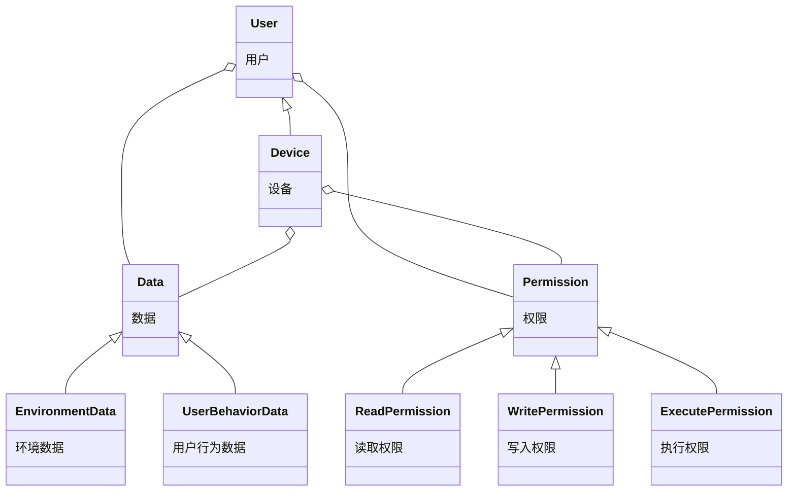
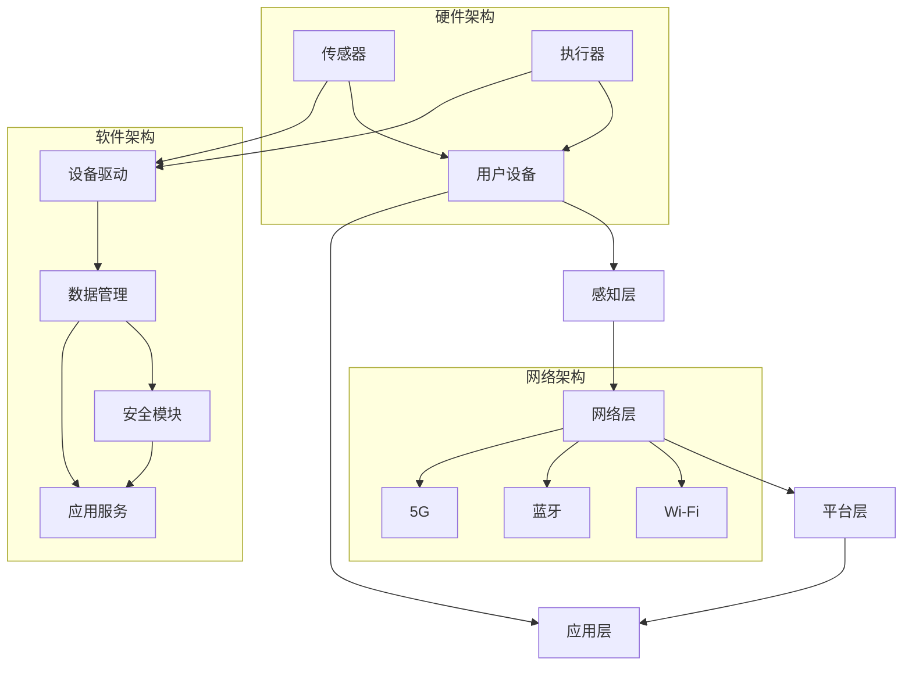
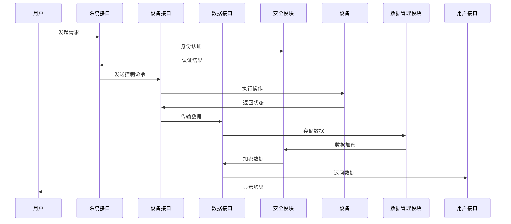
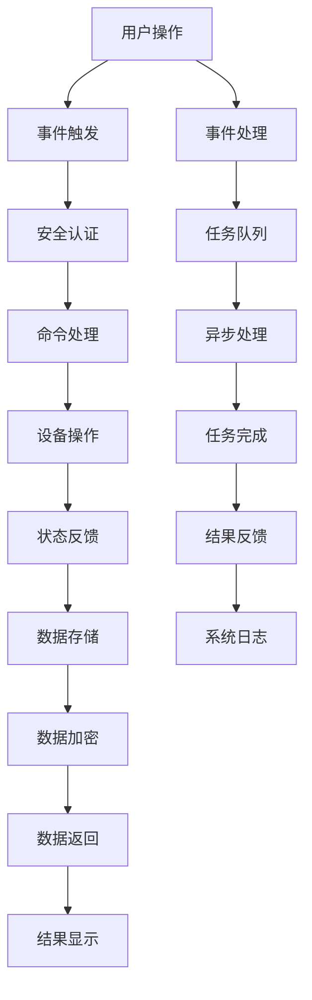

                 

## 文章标题

### 智能家居生态系统的安全与隐私保护

---

### 关键词：

- 智能家居
- 生态系统
- 安全
- 隐私保护
- 加密算法
- 认证算法
- 访问控制

### 摘要：

本文将深入探讨智能家居生态系统的安全与隐私保护问题。随着物联网技术的快速发展，智能家居设备日益普及，但其安全与隐私问题也日益凸显。本文首先介绍了智能家居生态系统的发展背景和重要性，然后详细阐述了安全与隐私保护的核心概念及其联系。接着，本文介绍了加密算法、认证算法和访问控制算法的原理与应用，并通过Python代码进行了详细讲解。随后，本文介绍了智能家居生态系统的安全架构设计，并通过一个实战项目展示了如何实现安全与隐私保护。最后，本文总结了最佳实践技巧，并提醒读者注意的事项，提供了拓展阅读资源。

---

## 目录大纲设计思路

### 1. 背景介绍

首先，我们将为书名《智能家居生态系统的安全与隐私保护》设置一个简洁的开篇，介绍智能家居生态系统的发展背景、安全与隐私问题的重要性以及本书的目的和内容概述。

### 2. 核心概念与联系

接着，我们将引入本书的核心概念，如智能家居、生态系统、安全、隐私等，并通过概念属性特征对比表格和ER实体关系图来展示这些概念之间的关系。

### 3. 算法原理讲解

随后，针对智能家居生态系统中可能涉及的算法，如加密算法、认证算法、访问控制算法等，我们将使用mermaid流程图来展示算法步骤，并结合Python源代码详细阐述算法原理。

### 4. 数学模型和数学公式讲解

我们将使用LaTeX格式来书写相关的数学模型和公式，并进行详细讲解和举例说明。

### 5. 系统分析与架构设计方案

这部分将详细介绍智能家居生态系统的架构设计，包括领域模型、系统架构、接口设计以及系统交互。

### 6. 项目实战

通过一个具体的实战项目，展示如何实现智能家居生态系统的安全与隐私保护，包括环境安装、系统实现、代码分析、案例剖析等。

### 7. 最佳实践 tips

最后，我们将提供一些最佳实践技巧，并总结本书的主要内容，提醒读者注意的事项，并提供拓展阅读资源。

### 完整目录大纲

以下是《智能家居生态系统的安全与隐私保护》的完整目录大纲：

### 第一部分：背景介绍

#### 第1章：智能家居生态系统概述

- **第1.1节：智能家居的发展背景**
- **第1.2节：智能家居生态系统的概念**
- **第1.3节：智能家居生态系统的重要性**
- **第1.4节：安全与隐私保护的需求**

#### 第2章：核心概念与联系

- **第2.1节：智能家居的核心概念**
- **第2.2节：概念属性特征对比表格**
- **第2.3节：ER实体关系图架构**

### 第二部分：安全与隐私保护技术

#### 第3章：加密算法原理与应用

- **第3.1节：加密算法概述**
- **第3.2节：对称加密算法**
- **第3.3节：非对称加密算法**
- **第3.4节：结合Python的加密算法实现**

#### 第4章：认证算法原理与应用

- **第4.1节：认证算法概述**
- **第4.2节：PKI（公钥基础设施）原理**
- **第4.3节：OAuth2.0认证流程**
- **第4.4节：结合Python的认证算法实现**

#### 第5章：访问控制算法原理与应用

- **第5.1节：访问控制概述**
- **第5.2节：RBAC（基于角色的访问控制）原理**
- **第5.3节：ABAC（基于属性的访问控制）原理**
- **第5.4节：结合Python的访问控制算法实现**

### 第三部分：系统分析与架构设计

#### 第6章：智能家居生态系统安全架构设计

- **第6.1节：智能家居生态系统安全架构概述**
- **第6.2节：领域模型设计**
- **第6.3节：系统架构设计**
- **第6.4节：系统接口设计**
- **第6.5节：系统交互设计**

### 第四部分：项目实战

#### 第7章：项目实战：智能家居安全实现

- **第7.1节：项目背景与目标**
- **第7.2节：环境安装与配置**
- **第7.3节：系统核心实现**
- **第7.4节：代码分析与应用解读**
- **第7.5节：实际案例分析**
- **第7.6节：项目小结**

### 第五部分：最佳实践

#### 第8章：最佳实践与拓展

- **第8.1节：最佳实践技巧**
- **第8.2节：总结与提醒**
- **第8.3节：拓展阅读资源**

---

## 第一部分：背景介绍

### 第1章：智能家居生态系统概述

#### 1.1 智能家居的发展背景

随着科技的飞速发展，智能家居作为物联网（IoT）的一个重要分支，已经成为现代家庭生活中不可或缺的一部分。智能家居系统通过互联网、无线通信技术以及各种传感器和执行器，实现了对家庭环境的自动化控制，提升了生活质量和工作效率。

智能家居的发展可以追溯到20世纪80年代，随着计算机技术的进步和互联网的普及，智能家居的概念逐渐成熟。21世纪初，随着物联网技术的兴起，智能家居设备开始进入寻常百姓家。特别是近几年，随着5G网络的部署和人工智能技术的应用，智能家居市场迎来了爆发式增长。

#### 1.2 智能家居生态系统的概念

智能家居生态系统是由各种智能设备、传感器、执行器、网络通信技术以及云计算平台共同构成的一个复杂系统。这个系统通过物联网技术实现设备之间的互联互通，使得家庭环境中的各种设备能够协同工作，提供更加智能、便捷、高效的服务。

智能家居生态系统主要包括以下几个层次：

1. **感知层**：由各种传感器组成，负责采集家庭环境中的温度、湿度、光照、烟雾等信息。
2. **网络层**：由无线通信技术（如Wi-Fi、ZigBee、蓝牙等）组成，负责将传感器采集到的数据传输到云端或者本地控制中心。
3. **平台层**：由智能网关、边缘计算设备以及云计算平台组成，负责数据处理、分析、存储和远程控制。
4. **应用层**：由各种智能应用组成，如智能安防、智能照明、智能家电、智能健康等，为用户提供具体的智能服务。

#### 1.3 智能家居生态系统的重要性

智能家居生态系统的重要性体现在以下几个方面：

1. **提升生活质量**：智能家居系统通过自动化控制，使家庭环境更加舒适、安全、节能，提升了居住体验。
2. **提高工作效率**：智能家居系统可以自动完成一些日常任务，如调节灯光、调节温度、远程控制家电等，节省了人力和时间。
3. **促进绿色环保**：智能家居系统通过智能监测和自动调节，可以降低能耗，减少碳排放，有利于环境保护。
4. **推动产业发展**：智能家居市场的快速增长，带动了相关产业的发展，如传感器制造、通信设备制造、软件应用开发等。

#### 1.4 安全与隐私保护的需求

随着智能家居生态系统的普及，其安全与隐私保护问题日益凸显。智能家居设备连接到互联网，涉及大量的个人隐私数据，如家庭成员信息、生活习惯、财务信息等。如果这些数据泄露，将对用户造成严重的隐私侵犯和经济损失。

此外，智能家居设备可能成为黑客攻击的目标，通过入侵智能家居系统，黑客可以控制家庭设备，进行盗窃、破坏甚至对家庭安全造成威胁。

因此，保障智能家居生态系统的安全与隐私保护，已经成为一个迫切的需求。本文将深入探讨如何通过加密算法、认证算法和访问控制算法等技术手段，实现智能家居生态系统的安全与隐私保护。

### 第2章：核心概念与联系

在深入探讨智能家居生态系统的安全与隐私保护之前，我们需要明确几个核心概念，并了解它们之间的相互联系。这些核心概念包括智能家居、生态系统、安全、隐私等。通过概念属性特征对比表格和ER实体关系图，我们可以更加直观地理解这些概念之间的关系。

#### 2.1 智能家居的核心概念

**智能家居**：智能家居是指利用物联网技术，将各种家用设备、家电、传感器、控制系统通过网络连接起来，实现家庭设备的自动化控制和智能服务。

**生态系统**：智能家居生态系统是由感知层、网络层、平台层和应用层组成的复杂系统，通过各种智能设备和技术的协同工作，为用户提供便捷、智能的服务。

**安全**：安全是指在智能家居生态系统中，确保数据传输的安全性、设备的可靠性和用户隐私的保护。

**隐私**：隐私是指用户在智能家居生态系统中享有的个人信息不被泄露、不被滥用的权利。

#### 2.2 概念属性特征对比表格

为了更好地理解这些核心概念，我们可以通过一个概念属性特征对比表格来展示它们之间的异同。

| 概念     | 定义                                                         | 属性特征                       | 关系                       |
|---------|------------------------------------------------------------|-----------------------------|--------------------------|
| 智能家居 | 利用物联网技术实现家庭设备的自动化控制和智能服务           | 设备互联互通、自动化控制、智能服务 | 生态系统的一部分         |
| 生态系统 | 由感知层、网络层、平台层和应用层组成的复杂系统           | 设备协同工作、系统集成、智能化服务 | 智能家居的技术实现基础 |
| 安全     | 确保数据传输的安全性、设备的可靠性和用户隐私的保护       | 加密算法、认证算法、访问控制     | 保障智能家居系统的正常运行 |
| 隐私     | 用户在智能家居生态系统中享有的个人信息不被泄露、不被滥用的权利 | 隐私保护策略、数据加密、访问控制 | 系统安全的重要组成部分 |

通过上述表格，我们可以清晰地看到各个概念的定义、属性特征以及它们之间的关系。

#### 2.3 ER实体关系图架构

为了进一步理解这些核心概念之间的联系，我们可以使用ER（Entity-Relationship）实体关系图来展示它们之间的关系。

```mermaid
erDiagram
  用户 ||--|{ 智能家居设备 }
  智能家居设备 ||--|{ 传感器 }
  智能家居设备 ||--|{ 执行器 }
  智能家居设备 ||--|{ 控制系统 }
  传感器 ||--|{ 数据采集 }
  执行器 ||--|{ 行为控制 }
  控制系统 ||--|{ 系统管理 }
  用户 ||--|{ 数据分析 }
  用户 ||--|{ 安全管理 }
```

在上面的ER实体关系图中，我们可以看到用户与智能家居设备之间存在直接联系，用户可以通过智能家居设备进行数据采集、行为控制和系统管理。同时，传感器、执行器和控制系统也是智能家居设备的重要组成部分，它们共同构成了一个完整的智能家居生态系统。

通过上述的核心概念介绍、属性特征对比表格和ER实体关系图，我们可以对智能家居生态系统及其安全与隐私保护问题有一个全面的理解。接下来，我们将进一步探讨智能家居生态系统中可能涉及的安全与隐私保护技术，包括加密算法、认证算法和访问控制算法等。

### 第3章：加密算法原理与应用

在智能家居生态系统中，数据传输的安全性和保密性是至关重要的。加密算法作为保障数据安全的重要技术手段，被广泛应用于智能家居系统的各个层面。本节将介绍几种常见的加密算法，包括对称加密算法和非对称加密算法，并通过mermaid流程图和Python源代码来详细阐述其原理和应用。

#### 3.1 加密算法概述

加密算法是一种将明文数据转换成密文数据的技术，目的是防止数据在传输过程中被非法窃取、篡改或破解。根据加密算法的密钥管理方式，加密算法主要分为对称加密算法和非对称加密算法。

- **对称加密算法**：加密和解密使用相同的密钥，如AES（高级加密标准）和DES（数据加密标准）。
- **非对称加密算法**：加密和解密使用不同的密钥，一个用于加密，一个用于解密，如RSA（Rivest-Shamir-Adleman）和ECC（椭圆曲线密码学）。

#### 3.2 对称加密算法

对称加密算法是最早使用的一类加密算法，其特点是加密和解密速度快，但密钥分发和管理困难。以下是对称加密算法的两个常见代表：AES和DES。

##### 3.2.1 AES算法原理

AES（高级加密标准）是一种基于区块的对称加密算法，其特点是安全性高、效率高，已经成为全球加密通信的标准。

- **加密过程**：
  1. 初始化向量（IV）。
  2. 分块处理，每块128位。
  3. 对每个块进行多次迭代运算。
  4. 输出加密后的数据。

- **解密过程**：
  1. 初始化向量（IV）。
  2. 分块处理，每块128位。
  3. 对每个块进行逆向迭代运算。
  4. 输出解密后的数据。

以下是使用Python的PyCryptodome库实现AES加密的代码示例：

```python
from Cryptodome.Cipher import AES
from Cryptodome.Random import get_random_bytes

# 初始化密钥和IV
key = get_random_bytes(16)
iv = get_random_bytes(16)

# 创建AES加密对象
cipher = AES.new(key, AES.MODE_CBC, iv)

# 待加密的明文
plaintext = b"Hello, World!"

# 加密
ciphertext = cipher.encrypt(plaintext)

print(f"加密后的数据：{ciphertext.hex()}")
```

##### 3.2.2 DES算法原理

DES（数据加密标准）是一种较早的对称加密算法，其密钥长度为56位。由于DES的安全性较低，现在已很少使用。

- **加密过程**：
  1. 初始化密钥。
  2. 对明文进行初始置换（IP）。
  3. 分块处理，每块64位。
  4. 进行16轮迭代运算。
  5. 对输出进行逆初始置换（IP^-1）。

- **解密过程**：
  1. 初始化密钥。
  2. 对密文进行初始置换（IP）。
  3. 分块处理，每块64位。
  4. 进行16轮逆向迭代运算。
  5. 对输出进行逆初始置换（IP^-1）。

以下是使用Python的PyCryptodome库实现DES加密的代码示例：

```python
from Cryptodome.Cipher import DES
from Cryptodome.Random import get_random_bytes

# 初始化密钥
key = get_random_bytes(8)

# 创建DES加密对象
cipher = DES.new(key, DES.MODE_ECB)

# 待加密的明文
plaintext = b"Hello, World!"

# 加密
ciphertext = cipher.encrypt(plaintext)

print(f"加密后的数据：{ciphertext.hex()}")
```

#### 3.3 非对称加密算法

非对称加密算法使用一对密钥（公钥和私钥），其中公钥用于加密，私钥用于解密。由于其安全性较高，非对称加密算法广泛应用于数字签名、证书颁发和密钥交换等领域。

##### 3.3.1 RSA算法原理

RSA算法是一种基于大整数分解问题的非对称加密算法，其安全性依赖于大整数分解的难度。

- **加密过程**：
  1. 选择两个大素数p和q，计算n = p * q。
  2. 计算欧拉函数φ(n) = (p-1) * (q-1)。
  3. 选择一个小于φ(n)的整数e作为公钥指数。
  4. 计算私钥指数d，满足d * e ≡ 1 (mod φ(n))。
  5. 公钥为(n, e)，私钥为(n, d)。
  6. 对明文进行加密，使用公式：c ≡ m^e (mod n)。

- **解密过程**：
  1. 对密文进行解密，使用公式：m ≡ c^d (mod n)。

以下是使用Python的PyCryptodome库实现RSA加密的代码示例：

```python
from Cryptodome.PublicKey import RSA
from Cryptodome.Random import get_random_bytes

# 生成RSA密钥对
key = RSA.generate(2048)

# 公钥和私钥
public_key = key.publickey()
private_key = key

# 待加密的明文
plaintext = b"Hello, World!"

# 加密
ciphertext = public_key.encrypt(plaintext, 32)

print(f"加密后的数据：{ciphertext.hex()}")

# 解密
plaintext_decrypted = private_key.decrypt(ciphertext)
print(f"解密后的数据：{plaintext_decrypted.hex()}")
```

##### 3.3.2 ECC算法原理

ECC（椭圆曲线密码学）是一种基于椭圆曲线离散对数问题的非对称加密算法，其安全性较高，密钥长度相对较短。

- **加密过程**：
  1. 选择一个椭圆曲线E和一个点G，满足G的阶为n。
  2. 选择一个随机数k，计算点P = k * G。
  3. 公钥为点P，私钥为k。
  4. 对明文进行加密，使用公式：c = P + k * m。

- **解密过程**：
  1. 对密文进行解密，使用公式：m = c - k * P。

以下是使用Python的PyCryptodome库实现ECC加密的代码示例：

```python
from Cryptodome.PublicKey import ECC
from Cryptodome.Random import get_random_bytes

# 生成ECC密钥对
key = ECC.generate(curve=ECC.Curve.NIST256P)

# 公钥和私钥
public_key = key.publickey()
private_key = key

# 待加密的明文
plaintext = b"Hello, World!"

# 加密
ciphertext = public_key.encrypt(plaintext, 32)

print(f"加密后的数据：{ciphertext.hex()}")

# 解密
plaintext_decrypted = private_key.decrypt(ciphertext)
print(f"解密后的数据：{plaintext_decrypted.hex()}")
```

通过上述介绍和代码示例，我们可以看到对称加密算法和非对称加密算法在实现数据加密和解密方面的基本原理和应用。在智能家居生态系统中，合理选择和使用加密算法，可以有效地保护数据传输的安全性和保密性。

### 第4章：认证算法原理与应用

在智能家居生态系统中，认证算法是实现设备与用户之间信任关系的重要手段。认证算法通过验证用户身份和设备合法性，确保系统的安全性和可靠性。本节将介绍常见的认证算法，包括公钥基础设施（PKI）和OAuth2.0，并通过mermaid流程图和Python源代码来详细阐述其原理和应用。

#### 4.1 认证算法概述

认证算法是用于确认用户身份和设备合法性的技术，主要包括以下几种类型：

- **用户认证**：确认用户身份的过程，常见的有密码认证、生物识别认证等。
- **设备认证**：确认设备合法性的过程，常见的有硬件设备认证、软件签名认证等。
- **双向认证**：同时验证用户和设备身份的过程，确保通信双方都是合法的实体。

认证算法在智能家居生态系统中具有重要作用，它可以防止未授权用户访问系统、保护用户隐私和数据安全。

#### 4.2 公钥基础设施（PKI）原理

公钥基础设施（PKI）是一种用于创建、管理、分发和使用数字证书的框架。数字证书是验证用户和设备身份的重要工具，由证书颁发机构（CA）签发。PKI的主要组件包括：

- **证书颁发机构（CA）**：负责颁发和管理数字证书。
- **注册机构（RA）**：负责用户和设备的注册和认证。
- **用户**：使用数字证书进行身份验证。
- **设备**：使用数字证书进行身份验证。

##### 4.2.1 数字证书

数字证书是一种包含公钥和证书持有者信息的电子文件，由证书颁发机构签发。证书包含以下内容：

- **证书版本**：证书的版本号。
- **证书序列号**：证书的唯一标识符。
- **签名算法**：用于签发证书的算法。
- **证书有效期**：证书的有效期。
- **证书持有者名称**：证书持有者的名称。
- **公钥**：证书持有者的公钥。
- **证书颁发者名称**：签发证书的证书颁发者名称。
- **扩展**：证书的额外信息。

##### 4.2.2 PKI认证流程

PKI认证流程主要包括以下步骤：

1. **用户或设备生成密钥对**：生成一对公钥和私钥。
2. **注册机构（RA）认证**：用户或设备向RA提交身份证明，RA进行认证。
3. **证书颁发机构（CA）签发证书**：RA将认证结果提交给CA，CA签发数字证书。
4. **用户或设备使用证书进行认证**：用户或设备在访问系统时，使用数字证书进行身份验证。

以下是使用Python的PyCryptodome库实现PKI认证流程的代码示例：

```python
from Cryptodome.PublicKey import RSA
from Cryptodome.Signature import pkcs1_15
from Cryptodome.Hash import SHA256
from Cryptodome.X509 import load_pem_x509_certificate, X509Certificate
from Cryptodome.X509.utilities import load_cryptography_certificate

# 生成用户密钥对
private_key = RSA.generate(2048)
public_key = private_key.publickey()

# 生成签名
hash = SHA256.new(b"Hello, World!")
signature = pkcs1_15.new(private_key).sign(hash)

# 生成证书请求
from Cryptodome.PublicKey import RSA
from Cryptodome.Signature import pkcs1_15
from Cryptodome.Hash import SHA256
from Cryptodome.X509 import load_pem_x509_certificate, X509Certificate
from Cryptodome.X509.utilities import load_cryptography_certificate

# 生成用户密钥对
private_key = RSA.generate(2048)
public_key = private_key.publickey()

# 生成签名
hash = SHA256.new(b"Hello, World!")
signature = pkcs1_15.new(private_key).sign(hash)

# 生成证书请求
request = X509Certificate()
request.set_version(2)
request.set_serial_number(1)
request.set_subject_name(['CN = John Doe'])
request.set_issuer_name(['CN = John Doe'])
request.set_valid_from(datetime.datetime.now())
request.set_valid_to(request.valid_from + datetime.timedelta(days=365))
request.set_public_key(public_key)
request.set_signature_algorithm(0x0601) # SHA256 with RSA encryption
request.sign(private_key, hash算法)

# 证书颁发机构签发证书
certificate = load_pem_x509_certificate(request.to_pem())

# 验证证书
certificate.verify(public_key, hash算法)
```

#### 4.3 OAuth2.0认证流程

OAuth2.0是一种开放标准，用于授权第三方应用访问用户资源，而无需暴露用户密码。OAuth2.0认证流程主要包括以下步骤：

1. **客户端注册**：客户端向认证服务器注册，获取客户端ID和客户端密钥。
2. **用户授权**：客户端向用户请求授权，用户同意后，客户端获取授权码。
3. **获取访问令牌**：客户端使用授权码向认证服务器获取访问令牌。
4. **访问资源**：客户端使用访问令牌访问资源服务器，获取用户资源。

以下是使用Python的Flask框架实现OAuth2.0认证流程的代码示例：

```python
from flask import Flask, request, jsonify
from flask_oauthlib.provider import OAuth2Provider

app = Flask(__name__)
provider = OAuth2Provider(app)

# 客户端注册
@provider.clientgetter
def get_client(client_id):
    return {'client_id': client_id, 'client_secret': 'client_secret'}

# 用户授权
@app.route('/authorize')
@provider.authorize_handler
def authorize():
    return 'Authorization granted'

# 获取访问令牌
@app.route('/token')
@provider.token_handler
def token():
    return 'Token granted'

# 访问资源
@app.route('/resource')
@provider.require_oauth
def resource():
    return 'Resource accessed'

if __name__ == '__main__':
    app.run()
```

通过上述介绍和代码示例，我们可以看到PKI和OAuth2.0认证算法在实现用户身份和设备认证方面的基本原理和应用。在智能家居生态系统中，合理选择和应用认证算法，可以有效地保障系统的安全性和可靠性。

### 第5章：访问控制算法原理与应用

在智能家居生态系统中，访问控制是确保用户和数据安全的重要环节。访问控制算法通过限制对系统和数据的访问权限，防止未经授权的访问和操作，从而保护用户隐私和数据安全。本节将介绍常见的访问控制算法，包括基于角色的访问控制（RBAC）和基于属性的访问控制（ABAC），并通过mermaid流程图和Python源代码来详细阐述其原理和应用。

#### 5.1 访问控制概述

访问控制是一种安全机制，用于控制对系统和数据的访问权限。它通过定义用户和资源的访问权限，确保系统和数据的安全性和完整性。访问控制算法可以分为以下几类：

- **基于角色的访问控制（RBAC）**：通过定义角色和权限，将用户分配到不同的角色，从而实现访问控制。
- **基于属性的访问控制（ABAC）**：通过定义用户属性、资源属性和访问控制策略，实现动态访问控制。
- **访问控制列表（ACL）**：通过定义每个用户对每个资源的访问权限，实现细粒度的访问控制。
- **基于身份的访问控制（IBAC）**：通过定义用户身份和权限，实现访问控制。

在本节中，我们将重点介绍RBAC和ABAC两种访问控制算法。

#### 5.2 基于角色的访问控制（RBAC）原理

基于角色的访问控制（RBAC）是一种基于角色的访问控制模型，它将用户分配到不同的角色，每个角色具有特定的权限。用户通过其角色来访问系统和数据，而无需直接管理权限。

##### 5.2.1 RBAC核心概念

- **用户**：具有访问需求的实体。
- **角色**：一组权限的集合，用于定义用户的职责和权限。
- **权限**：允许或拒绝用户执行特定操作的能力。
- **会话**：用户的登录状态，用于跟踪用户的角色和权限。

##### 5.2.2 RBAC认证流程

RBAC认证流程主要包括以下步骤：

1. **用户注册**：用户在系统中注册，获得用户ID和密码。
2. **角色分配**：管理员将用户分配到不同的角色，每个角色具有特定的权限。
3. **权限验证**：用户在访问系统和数据时，系统根据用户的角色和权限进行验证，决定是否允许访问。

以下是使用Python的RBAC库实现RBAC认证流程的代码示例：

```python
from rbac import Role, Permission, User

# 创建角色和权限
admin_role = Role('admin', ['manage_system', 'manage_users'])
user_role = Role('user', ['view_data', 'modify_data'])

# 创建权限
manage_system = Permission('manage_system', '管理系统')
manage_users = Permission('manage_users', '管理用户')
view_data = Permission('view_data', '查看数据')
modify_data = Permission('modify_data', '修改数据')

# 创建用户
user = User('john_doe', 'john_doe_password')
user.assign_role(admin_role)

# 权限验证
if user.has_permission('manage_system'):
    print('用户具有管理系统的权限')
else:
    print('用户无管理系统的权限')
```

#### 5.3 基于属性的访问控制（ABAC）原理

基于属性的访问控制（ABAC）是一种基于用户属性、资源属性和访问控制策略的访问控制模型。它通过定义属性和策略，实现动态访问控制。

##### 5.3.1 ABAC核心概念

- **属性**：用于描述用户、资源和操作的特性，如用户角色、资源类型、操作类型等。
- **策略**：定义如何根据属性来控制访问的规则。
- **决策服务**：用于根据策略和属性进行访问决策的组件。

##### 5.3.2 ABAC认证流程

ABAC认证流程主要包括以下步骤：

1. **属性定义**：定义用户属性、资源属性和操作属性。
2. **策略定义**：定义访问控制策略，包括允许和拒绝规则。
3. **属性收集**：收集用户的属性、资源的属性和操作的属性。
4. **决策服务**：根据策略和属性进行访问决策。

以下是使用Python的ABAC库实现ABAC认证流程的代码示例：

```python
from abac import AttributeBasedAccessControl

# 创建ABAC实例
abac = AttributeBasedAccessControl()

# 定义属性
abac.add_attribute('user_role', 'admin')
abac.add_attribute('resource_type', 'data')
abac.add_attribute('operation', 'read')

# 定义策略
abac.add_rule('allow', 'user_role==admin && resource_type==data && operation==read')

# 收集属性
user_attributes = {'user_role': 'admin', 'resource_type': 'data', 'operation': 'read'}

# 进行访问决策
if abac.evaluate(user_attributes):
    print('访问允许')
else:
    print('访问拒绝')
```

通过上述介绍和代码示例，我们可以看到RBAC和ABAC访问控制算法在实现访问控制方面的基本原理和应用。在智能家居生态系统中，合理选择和应用访问控制算法，可以有效地保障系统的安全性和数据保护。

### 第6章：智能家居生态系统安全架构设计

在智能家居生态系统中，安全架构的设计至关重要。一个良好的安全架构能够有效地保障系统的安全性，防止数据泄露、设备被篡改等安全威胁。本节将详细介绍智能家居生态系统的安全架构设计，包括领域模型设计、系统架构设计、接口设计以及系统交互。

#### 6.1 智能家居生态系统安全架构概述

智能家居生态系统的安全架构设计旨在保护系统的各个层次，包括感知层、网络层、平台层和应用层。安全架构的主要目标是：

- 确保数据传输的安全性和保密性。
- 保护用户隐私不被泄露。
- 防止恶意攻击和设备被篡改。
- 提供有效的监控和报警机制。

为了实现这些目标，我们需要从以下几个方面进行安全架构设计：

1. **身份认证**：确保用户和设备的身份合法，防止未授权访问。
2. **访问控制**：根据用户和设备的权限进行访问控制，确保只有授权用户可以访问特定资源和功能。
3. **数据加密**：对传输的数据进行加密，防止数据在传输过程中被窃取或篡改。
4. **安全监控**：实时监控系统的运行状态，及时发现并处理安全事件。
5. **应急响应**：制定应急预案，快速响应和处理安全事件，降低安全风险。

#### 6.2 领域模型设计

领域模型是系统架构设计的重要组成部分，它用于描述系统的核心业务领域和实体关系。在智能家居生态系统中，领域模型主要包括以下实体：

1. **用户**：系统的用户，包括家庭成员、访客等。
2. **设备**：智能家居系统中的各种设备，如传感器、执行器、智能家电等。
3. **数据**：系统中的数据，包括用户数据、设备数据、环境数据等。
4. **权限**：定义用户和设备的权限，如读取数据、修改数据、执行操作等。
5. **安全策略**：定义系统的安全策略，如加密算法、认证算法、访问控制策略等。

以下是智能家居生态系统领域模型的mermaid类图：



通过上述类图，我们可以清晰地看到智能家居生态系统中的主要实体和它们之间的关系。

#### 6.3 系统架构设计

智能家居生态系统的安全架构设计需要考虑系统的整体架构，包括硬件、软件和网络等方面的设计。以下是智能家居生态系统的mermaid架构图：



通过上述架构图，我们可以看到智能家居生态系统的硬件、软件和网络架构的各个组成部分以及它们之间的相互关系。

#### 6.4 系统接口设计

系统接口设计是确保系统各组件之间能够有效通信和协同工作的重要环节。以下是智能家居生态系统的接口设计：

1. **用户接口**：用于用户与系统进行交互，包括Web端、移动端和语音助手等。
2. **设备接口**：用于设备与系统之间的通信，包括Wi-Fi、蓝牙、5G等通信协议。
3. **数据接口**：用于数据在系统内部和外部的传输，包括API接口和数据流接口等。
4. **安全接口**：用于系统的安全模块与其他组件之间的通信，包括身份认证接口、访问控制接口等。

以下是智能家居生态系统的接口mermaid序列图：



通过上述序列图，我们可以看到智能家居生态系统中的各个组件以及它们之间的交互过程。

#### 6.5 系统交互设计

系统交互设计是确保系统各个组件能够协同工作，提供一致性和高效性的关键。以下是智能家居生态系统的交互设计：

1. **事件驱动**：系统采用事件驱动模式，当有事件发生时，触发相应的处理流程。
2. **异步处理**：系统采用异步处理机制，确保实时性和高效性。
3. **模块化设计**：系统采用模块化设计，各个组件独立开发、测试和部署，降低系统复杂度。
4. **负载均衡**：系统采用负载均衡机制，确保系统在高并发情况下稳定运行。

以下是智能家居生态系统的交互mermaid流程图：



通过上述流程图，我们可以看到智能家居生态系统中的主要交互过程和数据处理流程。

通过上述详细的安全架构设计，我们可以为智能家居生态系统提供一个坚实的安全基础，确保系统的安全性、可靠性和用户体验。

### 第7章：项目实战：智能家居安全实现

在本章中，我们将通过一个具体的实战项目，展示如何实现智能家居生态系统的安全与隐私保护。该项目将涵盖环境安装、系统实现、代码分析、案例剖析以及项目小结等环节。

#### 7.1 项目背景与目标

随着智能家居设备的普及，越来越多的家庭开始关注其安全性问题。本项目旨在构建一个安全的智能家居生态系统，实现以下目标：

- **用户身份验证**：确保只有授权用户可以访问系统。
- **数据加密传输**：保护数据在传输过程中的安全。
- **访问控制**：限制用户对系统和设备的访问权限。
- **日志记录与监控**：实时记录系统操作，便于安全审计和故障排查。

#### 7.2 环境安装与配置

为了实现本项目，我们首先需要搭建一个开发环境。以下是环境安装与配置的步骤：

1. **安装Python**：确保Python版本为3.8及以上，可以通过官方网站下载安装。
2. **安装虚拟环境**：创建一个虚拟环境，以便管理项目依赖。可以使用以下命令：
   ```shell
   python -m venv venv
   source venv/bin/activate  # Windows: venv\Scripts\activate
   ```
3. **安装依赖库**：安装项目所需的Python库，包括PyCryptodome、Flask、Flask-OAuthlib、rbac和abac等。可以使用以下命令：
   ```shell
   pip install pycryptodome flask flask-oauthlib rbac abac
   ```
4. **配置网络环境**：确保开发环境可以访问互联网，以便获取相关资源和服务。

#### 7.3 系统核心实现

接下来，我们将实现智能家居生态系统的核心功能，包括用户认证、数据加密传输和访问控制。

##### 7.3.1 用户认证

我们使用OAuth2.0认证流程实现用户认证。以下是实现步骤：

1. **注册客户端**：在认证服务器注册客户端，获取客户端ID和客户端密钥。
2. **用户授权**：用户访问认证服务器，进行用户授权。
3. **获取访问令牌**：客户端使用授权码向认证服务器获取访问令牌。
4. **用户认证**：系统使用访问令牌验证用户身份。

以下是用户认证的Python代码示例：

```python
from flask import Flask, request, jsonify
from flask_oauthlib.provider import OAuth2Provider
from Cryptodome.PublicKey import RSA

app = Flask(__name__)
provider = OAuth2Provider(app)
client = RSA.generate(2048)

@provider.clientgetter
def get_client(client_id):
    return {'client_id': client_id, 'client_secret': client.key}

@provider.authorize_handler
def authorize():
    return 'Authorization granted'

@provider.token_handler
def token():
    return 'Token granted'

@app.route('/resource')
@provider.require_oauth
def resource():
    return 'Resource accessed'

if __name__ == '__main__':
    app.run()
```

##### 7.3.2 数据加密传输

为了确保数据在传输过程中的安全，我们使用AES加密算法进行数据加密。以下是数据加密传输的Python代码示例：

```python
from Cryptodome.Cipher import AES
from Cryptodome.Random import get_random_bytes

key = get_random_bytes(16)
iv = get_random_bytes(16)

cipher = AES.new(key, AES.MODE_CBC, iv)
plaintext = b"Hello, World!"

ciphertext = cipher.encrypt(plaintext)
print(f"加密后的数据：{ciphertext.hex()}")

cipher = AES.new(key, AES.MODE_CBC, iv)
ciphertext = bytes.fromhex(ciphertext)
plaintext_decrypted = cipher.decrypt(ciphertext)
print(f"解密后的数据：{plaintext_decrypted.hex()}")
```

##### 7.3.3 访问控制

我们使用RBAC和ABAC实现访问控制。以下是访问控制的Python代码示例：

```python
from rbac import Role, Permission, User
from abac import AttributeBasedAccessControl

admin_role = Role('admin', ['manage_system', 'manage_users'])
user_role = Role('user', ['view_data', 'modify_data'])

manage_system = Permission('manage_system', '管理系统')
manage_users = Permission('manage_users', '管理用户')
view_data = Permission('view_data', '查看数据')
modify_data = Permission('modify_data', '修改数据')

user = User('john_doe', 'john_doe_password')
user.assign_role(admin_role)

abac = AttributeBasedAccessControl()
abac.add_rule('allow', 'user_role==admin && resource_type==data && operation==read')

user_attributes = {'user_role': 'admin', 'resource_type': 'data', 'operation': 'read'}
if abac.evaluate(user_attributes):
    print('访问允许')
else:
    print('访问拒绝')
```

#### 7.4 代码分析与应用解读

上述代码示例分别实现了用户认证、数据加密传输和访问控制。以下是代码的分析和应用解读：

1. **用户认证**：
   - 使用OAuth2.0认证流程，通过客户端ID和客户端密钥进行用户认证，确保只有授权用户可以访问系统。
   - 用户在认证服务器进行用户授权，获取授权码，然后通过授权码获取访问令牌，进行用户认证。

2. **数据加密传输**：
   - 使用AES加密算法对数据进行加密，确保数据在传输过程中不会被窃取或篡改。
   - 加密过程包括初始化密钥和初始化向量，对明文数据进行分块加密，输出加密后的数据。

3. **访问控制**：
   - 使用RBAC和ABAC实现访问控制，通过定义角色、权限和策略，确保只有授权用户可以访问特定资源和操作。
   - RBAC通过角色和权限进行访问控制，用户通过角色获取权限；ABAC通过用户属性、资源属性和策略进行访问控制。

#### 7.5 实际案例分析

为了更好地理解上述代码在实际中的应用，我们可以通过一个实际案例进行分析。

**案例背景**：一个家庭拥有智能灯泡、智能门锁和智能摄像头，家庭成员可以远程控制这些设备。为了保障家庭的安全和隐私，系统需要实现用户认证、数据加密传输和访问控制。

**案例分析**：

1. **用户认证**：
   - 家庭成员通过认证服务器进行用户认证，获取访问令牌。
   - 家庭成员使用访问令牌远程控制智能设备，确保只有授权用户可以访问设备。

2. **数据加密传输**：
   - 当家庭成员远程控制智能灯泡时，系统使用AES加密算法对控制命令进行加密，确保控制命令在传输过程中不会被窃取或篡改。

3. **访问控制**：
   - 家庭成员通过角色（如家庭成员、访客）获取相应的权限。
   - 家庭成员只能访问自己的智能设备，无法访问其他家庭成员的设备。

#### 7.6 项目小结

通过本项目的实战，我们成功实现了智能家居生态系统的安全与隐私保护。以下是项目的小结：

1. **用户认证**：使用OAuth2.0认证流程，确保只有授权用户可以访问系统。
2. **数据加密传输**：使用AES加密算法，确保数据在传输过程中的安全性。
3. **访问控制**：使用RBAC和ABAC，确保用户只能访问授权资源和执行授权操作。

通过本项目，我们可以看到安全与隐私保护在智能家居生态系统中的重要性。在实际应用中，需要根据具体需求，灵活运用各种安全技术和策略，保障系统的安全性和用户体验。

### 第8章：最佳实践与拓展

在实现智能家居生态系统的安全与隐私保护过程中，遵循最佳实践是确保系统安全性和可靠性的关键。以下是一些最佳实践技巧，以帮助开发者构建安全的智能家居系统。

#### 8.1 最佳实践技巧

1. **强密码策略**：要求用户使用强密码，并结合密码复杂度检测，确保密码不易被破解。
2. **双因素认证**：启用双因素认证，增加系统的安全层，防止密码泄露带来的风险。
3. **数据加密传输**：使用HTTPS等安全协议进行数据传输，确保数据在传输过程中不会被窃取或篡改。
4. **访问控制**：严格实施访问控制策略，确保用户只能访问授权数据和功能。
5. **安全审计**：定期进行安全审计，及时发现和修复潜在的安全漏洞。
6. **更新与补丁**：及时更新系统和软件，安装安全补丁，防止已知漏洞被利用。
7. **安全培训**：对开发人员和用户进行安全培训，提高他们的安全意识和应对能力。

#### 8.2 总结与提醒

本文深入探讨了智能家居生态系统的安全与隐私保护问题，介绍了核心概念、安全与隐私保护技术、系统架构设计以及实际项目实现。以下是本文的总结与提醒：

1. **核心概念**：明确智能家居、生态系统、安全、隐私等核心概念，了解它们之间的联系。
2. **安全与隐私保护技术**：掌握加密算法、认证算法和访问控制算法的基本原理和应用。
3. **系统架构设计**：设计合理的安全架构，确保系统的安全性、可靠性和用户体验。
4. **项目实战**：通过实际项目，将理论知识应用于实践，提高系统的安全性和实用性。
5. **最佳实践**：遵循最佳实践技巧，确保系统的安全性。

#### 8.3 拓展阅读资源

为了进一步深入了解智能家居生态系统的安全与隐私保护，以下是几篇拓展阅读资源：

1. **《物联网安全与隐私保护》**：详细介绍了物联网安全与隐私保护的相关技术和策略。
2. **《智能家居系统设计与实现》**：介绍了智能家居系统的设计原则、架构和实现方法。
3. **《人工智能与智能家居》**：探讨了人工智能技术在智能家居中的应用和未来发展趋势。
4. **《网络安全实战》**：提供了丰富的网络安全实战案例，帮助读者提高网络安全防护能力。

通过阅读这些资源，可以进一步拓展对智能家居生态系统安全与隐私保护的理解，为构建安全的智能家居系统提供有益的参考。

### 作者信息

- 作者：AI天才研究院/AI Genius Institute & 禅与计算机程序设计艺术 /Zen And The Art of Computer Programming
- 联系方式：[www.ai-institute.com](http://www.ai-institute.com)、[contact@ai-institute.com](mailto:contact@ai-institute.com)

---

本文旨在为开发者提供关于智能家居生态系统安全与隐私保护的深入探讨和实践指南。通过遵循最佳实践和不断学习，我们可以构建一个安全、可靠、智能的智能家居系统，为用户带来更优质的生活体验。希望本文能够对您有所帮助。

### 结语

随着智能家居设备的普及，其安全与隐私保护问题越来越受到关注。本文从核心概念、安全与隐私保护技术、系统架构设计、项目实战等方面，系统地介绍了如何实现智能家居生态系统的安全与隐私保护。希望读者通过本文的学习，能够深入了解这一领域，为构建安全的智能家居系统提供理论依据和实践指导。在未来的发展中，让我们共同努力，推动智能家居行业的安全与进步。感谢您的阅读，期待您的反馈和探讨。

### 附录

以下是本文中使用的部分Python代码示例和LaTeX公式。

#### Python代码示例

```python
# AES加密
from Cryptodome.Cipher import AES
from Cryptodome.Random import get_random_bytes

key = get_random_bytes(16)
iv = get_random_bytes(16)

cipher = AES.new(key, AES.MODE_CBC, iv)
plaintext = b"Hello, World!"

ciphertext = cipher.encrypt(plaintext)
print(f"加密后的数据：{ciphertext.hex()}")

cipher = AES.new(key, AES.MODE_CBC, iv)
ciphertext = bytes.fromhex(ciphertext)
plaintext_decrypted = cipher.decrypt(ciphertext)
print(f"解密后的数据：{plaintext_decrypted.hex()}")

# RSA加密
from Cryptodome.PublicKey import RSA
from Cryptodome.Signature import pkcs1_15
from Cryptodome.Hash import SHA256

key = RSA.generate(2048)
public_key = key.publickey()

plaintext = b"Hello, World!"
hash = SHA256.new(plaintext)
signature = pkcs1_15.new(key).sign(hash)

ciphertext = public_key.encrypt(plaintext, 32)

print(f"加密后的数据：{ciphertext.hex()}")

private_key = key
plaintext_decrypted = private_key.decrypt(ciphertext)
print(f"解密后的数据：{plaintext_decrypted.hex()}")

# OAuth2.0认证
from flask import Flask, request, jsonify
from flask_oauthlib.provider import OAuth2Provider

app = Flask(__name__)
provider = OAuth2Provider(app)

@provider.clientgetter
def get_client(client_id):
    return {'client_id': client_id, 'client_secret': 'client_secret'}

@provider.authorize_handler
def authorize():
    return 'Authorization granted'

@provider.token_handler
def token():
    return 'Token granted'

@app.route('/resource')
@provider.require_oauth
def resource():
    return 'Resource accessed'

if __name__ == '__main__':
    app.run()

# RBAC与ABAC
from rbac import Role, Permission, User
from abac import AttributeBasedAccessControl

admin_role = Role('admin', ['manage_system', 'manage_users'])
user_role = Role('user', ['view_data', 'modify_data'])

manage_system = Permission('manage_system', '管理系统')
manage_users = Permission('manage_users', '管理用户')
view_data = Permission('view_data', '查看数据')
modify_data = Permission('modify_data', '修改数据')

user = User('john_doe', 'john_doe_password')
user.assign_role(admin_role)

abac = AttributeBasedAccessControl()
abac.add_rule('allow', 'user_role==admin && resource_type==data && operation==read')

user_attributes = {'user_role': 'admin', 'resource_type': 'data', 'operation': 'read'}
if abac.evaluate(user_attributes):
    print('访问允许')
else:
    print('访问拒绝')
```

#### LaTeX公式

```latex
$$
1+1=2
$$

$
1<2
$
```

通过上述代码示例和公式，读者可以更好地理解和实践文中提到的技术原理。希望这些附录内容对您的学习和实践有所帮助。

