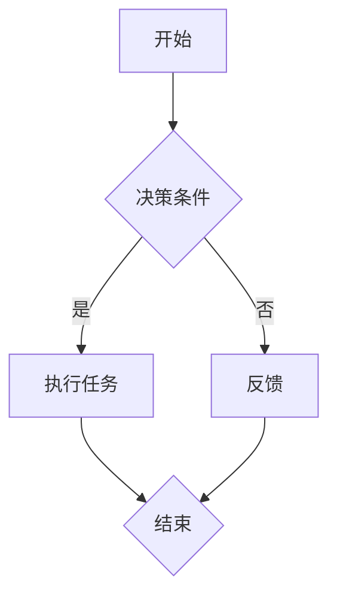
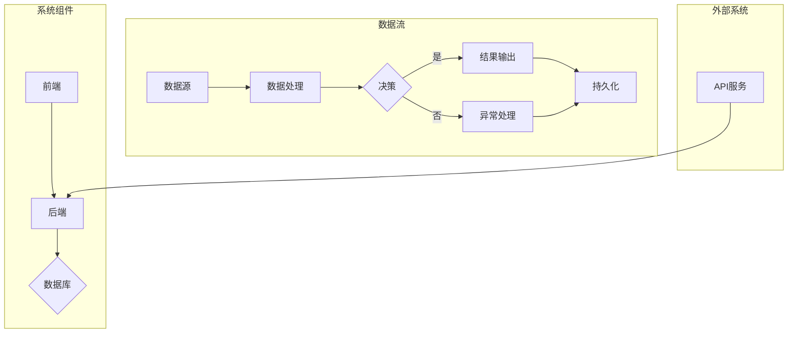

                 

### 第一部分：引言与背景

## 1.1 问题背景

智能建筑作为现代建筑的重要组成部分，正日益成为城市建设和人们生活品质提升的关键。它不仅是一个物理空间的集合，更是一个集成了先进信息技术、自动控制技术和建筑学知识的综合体。智能建筑通过整合这些技术，实现了对建筑物的运行、维护和管理的全面优化，为人们提供了更加舒适、便捷、安全的居住和工作环境。

随着科技的不断进步，人们对生活质量的追求也不断提升。智能建筑因此应运而生，成为了满足这一需求的重要解决方案。它不仅能够提高建筑物的管理效率，还能在能源消耗、环境保护等方面发挥重要作用。例如，智能建筑可以通过自动化的环境控制技术，实现能源的高效利用，降低能耗；通过智能安防系统，提高居住和办公的安全性能；通过智能化的设施管理，提供更加舒适的生活和工作环境。

此外，智能建筑还与大数据、云计算等新兴技术紧密相连。这些技术的应用，使得智能建筑能够更加精准地满足用户需求，实现个性化服务。例如，通过分析用户行为数据，智能建筑可以自动调整空调温度、照明强度等，以提供最佳的用户体验。

总之，智能建筑不仅是一种技术趋势，更是一种生活方式的革新。随着智能建筑技术的不断发展和完善，它将在未来的城市建设中扮演越来越重要的角色。

## 1.2 问题描述

智能建筑的核心在于实现楼宇管理的智能化，这包括了环境控制、安全监控、能源管理等多个方面。然而，如何在楼宇管理中应用环境隐形智能技术，实现高效、舒适、安全的居住环境，是一个亟待解决的问题。

首先，环境控制是智能建筑中的一个重要方面。传统的楼宇管理通常依赖于人工操作和简单的自动化设备，而环境隐形智能技术则可以通过传感器网络、云计算和大数据等技术，实现实时监测和自动调整环境参数，如温度、湿度、光照等。这样可以大大提高环境控制的精确度和效率，从而提供更加舒适的生活和工作环境。

其次，安全监控也是智能建筑中的一个关键点。传统的安全监控往往依赖于监控摄像头和人工巡逻，而环境隐形智能技术可以通过智能分析算法，实现实时监控和异常检测。例如，通过分析摄像头捕捉到的图像数据，智能系统可以自动识别入侵者或火灾等异常情况，并及时报警，从而提高楼宇的安全性能。

最后，能源管理也是智能建筑中的一个重要任务。传统的能源管理往往依赖于手动操作和简单的自动化控制，而环境隐形智能技术可以通过实时监测和分析能源使用数据，自动调整能源使用策略，实现能源的高效利用。例如，通过实时监测建筑内部的电力、水、气等资源的消耗情况，智能系统能够自动调整空调、照明等设备的运行状态，以降低能源消耗，实现节能减排。

然而，将环境隐形智能技术应用于楼宇管理，并非没有挑战。首先，环境隐形智能技术需要大量的数据支持和复杂的算法分析，这需要强大的计算能力和专业的技术团队。其次，环境隐形智能技术需要与楼宇的现有系统进行无缝集成，这需要专业的系统集成技术和经验。此外，环境隐形智能技术的实施还需要考虑成本、安全性和用户隐私等问题。

总的来说，虽然环境隐形智能技术在楼宇管理中具有巨大的潜力，但实现这一目标还需要克服一系列的技术、管理和实施挑战。

## 1.3 问题解决

为了解决智能建筑中环境隐形智能技术的应用问题，我们需要从技术原理、实际应用和未来发展趋势等多个方面进行深入探讨。首先，我们要了解环境隐形智能技术的基本原理和核心概念，包括传感器网络、云计算、大数据和自适应控制等。这些技术构成了环境隐形智能技术的核心框架，为我们提供了实现楼宇智能化管理的基础。

其次，我们要探讨环境隐形智能技术在楼宇管理中的具体应用。这包括环境控制、安全监控和能源管理等方面。通过具体的案例分析，我们可以看到环境隐形智能技术如何通过实时数据采集、处理和分析，实现自动化的环境调节、安全监控和能源优化。

最后，我们要关注环境隐形智能技术的未来发展趋势。随着科技的不断进步，环境隐形智能技术将不断发展和完善，为楼宇管理带来更多的创新和机遇。例如，人工智能和机器学习技术的应用，将进一步提升环境隐形智能技术的智能化水平和自适应性。

通过这些探讨，我们希望为读者提供一套全面、实用的智能建筑解决方案，帮助他们在实际项目中成功应用环境隐形智能技术，实现楼宇管理的智能化和高效化。

## 1.4 边界与外延

在本文中，我们将重点关注环境隐形智能技术在楼宇管理中的应用。这主要包括环境控制、安全监控和能源管理等方面，而不会涉及其他智能技术，如安防、智能家居等。这是因为环境隐形智能技术在楼宇管理中具有独特的优势和应用场景，是我们探讨的重点。

环境隐形智能技术通过传感器网络、云计算和大数据等技术，实现对建筑环境信息的实时采集、处理和分析，从而实现环境自适应控制和智能管理。这种技术具有实时性、自适应性和智能性的特点，可以显著提高楼宇管理的效率和质量。

然而，环境隐形智能技术也有其局限性。首先，它需要大量的数据支持和复杂的算法分析，这需要强大的计算能力和专业的技术团队。其次，环境隐形智能技术需要与楼宇的现有系统进行无缝集成，这需要专业的系统集成技术和经验。此外，环境隐形智能技术的实施还需要考虑成本、安全性和用户隐私等问题。

总的来说，环境隐形智能技术在楼宇管理中具有巨大的潜力，但实现这一目标还需要克服一系列的技术、管理和实施挑战。本文将深入探讨这些问题，为读者提供实用的解决方案。

## 1.5 核心概念

### 1.5.1 环境隐形智能技术

**定义**：环境隐形智能技术是一种利用传感器网络、云计算和大数据等技术，实现对建筑环境信息的高效采集、处理和分析，从而实现环境自适应控制和智能管理的技术。

**特性**：
- **实时性**：能够实时监测和响应环境变化。
- **自适应**：能够根据环境数据自动调整建筑环境。
- **智能性**：能够通过数据分析，实现对建筑环境的智能管理。

**工作原理**：
1. **环境信息采集**：利用传感器网络，实时采集建筑内部和外部环境的数据，如温度、湿度、光照等。
2. **数据处理**：通过云计算平台，对采集到的环境数据进行处理和分析，提取有用的信息。
3. **环境自适应控制**：根据分析结果，自动调整建筑环境，如空调温度、照明强度等，以实现最优化管理。

### 1.5.2 楼宇管理

**定义**：楼宇管理是对建筑物的运行、维护和管理的一系列活动的总称，包括环境控制、安全监控、能源管理等多个方面。

**特性**：
- **系统性**：楼宇管理涉及多个子系统，需要系统化的管理和协调。
- **综合性**：楼宇管理需要综合运用多种技术和方法，如自动化、智能化、信息化等。
- **持续性**：楼宇管理是一个长期的过程，需要持续改进和优化。

**工作内容**：
1. **环境控制**：通过智能系统，实现建筑内部环境的温度、湿度、光照等参数的自动调节。
2. **安全监控**：通过监控摄像头、报警系统等设备，实现对建筑物的安全监控和管理。
3. **能源管理**：通过实时监测和数据分析，实现建筑内部能源的优化管理和调度。

### 1.5.3 关键词

- **传感器网络**：用于实时采集环境数据的网络系统。
- **云计算**：用于数据处理和存储的技术平台。
- **大数据**：用于环境数据分析和决策的支持。
- **自适应控制**：根据环境数据自动调整环境参数的技术。

## 1.6 概念结构与核心要素组成

智能建筑由多个子系统组成，每个子系统都是核心概念的具体体现。以下是智能建筑的概念结构及其核心要素组成：

### 1.6.1 系统结构

智能建筑系统可以分为以下几个层次：

1. **感知层**：包括传感器网络，用于实时采集建筑内部和外部环境的数据，如温度、湿度、光照等。
2. **传输层**：负责数据传输，将感知层采集到的数据传输到数据处理层。
3. **数据处理层**：利用云计算平台，对传输层的数据进行处理和分析，提取有用的信息。
4. **决策与控制层**：根据分析结果，自动调整建筑环境，如空调温度、照明强度等。
5. **应用层**：提供面向用户的智能化应用，如智能照明、智能安防等。

### 1.6.2 核心要素组成

智能建筑的核心要素包括：

1. **传感器网络**：用于环境信息的实时采集。
2. **云计算平台**：用于数据处理和分析。
3. **大数据分析**：用于提取环境数据中的有用信息。
4. **自适应控制系统**：用于环境参数的自动调整。
5. **智能化应用**：提供面向用户的智能服务。

这些核心要素相互关联，共同构成了智能建筑的技术体系。感知层采集的数据通过传输层传输到数据处理层，数据处理层利用云计算平台进行数据分析和处理，生成的结果通过决策与控制层自动调整建筑环境。最后，应用层为用户提供智能化服务，实现了智能建筑的整体功能。

### 1.7 本章小结

本章对智能建筑和环境隐形智能技术进行了初步介绍，明确了智能建筑在现代社会中的重要地位，以及环境隐形智能技术作为楼宇管理的关键技术。通过分析问题背景、问题描述、问题解决、边界与外延、核心概念和概念结构与核心要素组成，我们为后续章节的深入探讨奠定了基础。接下来，我们将进一步探讨环境隐形智能技术的原理、应用领域以及其在楼宇管理中的优势和挑战。希望读者能够通过本章的阅读，对智能建筑和环境隐形智能技术有一个全面而深刻的认识。

----------------------------------------------------------------

## 2.1 环境隐形智能技术原理

### 2.1.1 环境隐形智能技术概述

#### 2.1.1.1 环境隐形智能技术的定义

环境隐形智能技术是一种利用传感器网络、云计算和大数据等技术，实现对建筑环境信息的高效采集、处理和分析，从而实现环境自适应控制和智能管理的技术。这种技术通过实时监测和自动调节建筑环境参数，如温度、湿度、光照等，以提供舒适、节能、安全的居住和工作环境。

#### 2.1.1.2 环境隐形智能技术的工作原理

环境隐形智能技术的工作原理主要分为以下几个步骤：

1. **环境信息采集**：利用传感器网络，实时采集建筑内部和外部环境的数据，如温度、湿度、光照、二氧化碳浓度等。这些传感器可以分布在建筑的各个角落，确保数据采集的全面性和实时性。

2. **数据处理**：通过云计算平台，对采集到的环境数据进行处理和分析。数据处理包括数据清洗、数据归一化、特征提取等步骤，以提取出有用的信息。云计算平台具有强大的计算能力，可以快速处理海量数据，并提供高效的数据分析服务。

3. **环境自适应控制**：根据处理和分析的结果，自动调整建筑环境参数。例如，如果温度传感器检测到室内温度过高，空调系统会自动启动，降低室内温度。这种自适应控制能够根据环境变化实时调整，以提高环境舒适度和节能效果。

4. **数据反馈与优化**：通过反馈机制，将调整后的环境数据再次传回云计算平台，进行进一步的分析和优化。这样，系统能够不断学习和适应环境变化，实现更精准的环境控制。

### 2.1.2 环境隐形智能技术的特点

环境隐形智能技术具有以下几个显著特点：

1. **实时性**：环境隐形智能技术能够实时监测和响应环境变化，确保建筑环境的动态调整。这种实时性对于提供舒适、节能和安全的居住和工作环境至关重要。

2. **自适应**：环境隐形智能技术可以根据环境数据自动调整建筑环境参数，实现自适应控制。这种自适应能力使得系统能够根据实际需求和环境变化，动态调整环境，提高管理效率。

3. **智能性**：环境隐形智能技术通过大数据分析和云计算，实现对建筑环境的智能管理。这种智能性使得系统能够从海量数据中提取有价值的信息，做出最优决策，实现高度智能化。

### 2.1.3 环境隐形智能技术与传统楼宇管理的区别

环境隐形智能技术与传统楼宇管理相比，具有以下显著区别：

1. **技术层面**：环境隐形智能技术融合了传感器技术、云计算、大数据和人工智能等先进技术，而传统楼宇管理主要依赖于人工操作和简单的自动化设备。这种技术优势使得环境隐形智能技术在数据处理和分析、环境自适应控制等方面具有明显优势。

2. **管理层面**：环境隐形智能技术可以实现自动化、智能化的楼宇管理，而传统楼宇管理依赖于人工操作，效率较低。环境隐形智能技术通过实时监测和分析环境数据，自动调整环境参数，实现高效管理。

3. **成本效益**：虽然环境隐形智能技术的初期投入较大，但长期来看，其节能、增效和提升舒适度的效果显著，具有更高的成本效益。与传统楼宇管理相比，环境隐形智能技术能够通过降低能源消耗、减少人工成本等手段，实现更高效的管理。

### 2.1.4 环境隐形智能技术的核心概念与联系

环境隐形智能技术的核心概念包括传感器网络、云计算、大数据和自适应控制等。这些核心概念相互关联，共同构成了环境隐形智能技术的完整体系。

1. **传感器网络**：传感器网络是环境隐形智能技术的基础，负责实时采集建筑环境数据。传感器种类繁多，包括温度传感器、湿度传感器、光照传感器、二氧化碳传感器等。

2. **云计算**：云计算平台负责对传感器网络采集到的环境数据进行处理和分析。云计算平台具有强大的计算能力和存储能力，能够快速处理海量数据，并提供高效的数据分析服务。

3. **大数据**：大数据技术用于环境数据分析和决策支持。通过对海量环境数据的分析，大数据技术能够提取出有价值的信息，为环境自适应控制和智能管理提供数据支持。

4. **自适应控制**：自适应控制是环境隐形智能技术的核心功能，通过实时监测和分析环境数据，自动调整建筑环境参数，实现环境优化。自适应控制技术能够根据环境变化动态调整，提高管理效率。

这些核心概念相互关联，共同构成了环境隐形智能技术的完整体系。传感器网络负责数据采集，云计算平台负责数据处理和分析，大数据提供数据支持，自适应控制实现环境优化。通过这些核心概念和技术的协同作用，环境隐形智能技术能够实现对建筑环境的智能管理和高效控制。

## 2.2 环境隐形智能技术的应用领域

### 2.2.1 楼宇环境控制

环境隐形智能技术在楼宇环境控制中的应用主要集中在温度控制、湿度控制和照明控制等方面。通过实时监测和自动调节建筑环境参数，实现舒适、节能和高效的居住和工作环境。

#### 2.2.1.1 温度控制

温度控制是环境隐形智能技术在楼宇环境控制中最重要的应用之一。传统的楼宇温度控制主要依赖于中央空调系统，而环境隐形智能技术通过传感器网络实时监测室内外温度，结合大数据分析和云计算，实现动态温度调节。

具体应用场景包括：

1. **智能办公大楼**：通过实时监测办公室的温度，自动调节空调系统的运行状态，保持室内温度舒适。同时，根据室内外温差和人员活动情况，优化空调系统的能源消耗，实现节能减排。

2. **智能家居**：通过传感器网络实时监测家庭内部的温度，自动调节空调、暖气等设备的运行状态，提供舒适的家庭环境。此外，还可以结合天气预测数据，提前调整温度设置，提高居住舒适度。

#### 2.2.1.2 湿度控制

湿度控制是环境隐形智能技术在楼宇环境控制中的另一个重要应用。湿度对人们的健康和生活质量有重要影响，过高的湿度容易导致霉菌滋生和过敏反应，而过低的湿度则容易导致皮肤干燥和呼吸道不适。

具体应用场景包括：

1. **智能健身房**：通过实时监测室内湿度，自动调节加湿器或除湿器的运行状态，保持室内湿度在适宜范围内，提高健身效果和用户体验。

2. **智能医疗病房**：通过实时监测病房内的湿度，自动调节加湿器或除湿器的运行状态，为病人提供舒适的康复环境，减少病菌滋生的风险。

#### 2.2.1.3 照明控制

照明控制是环境隐形智能技术在楼宇环境控制中的应用之一。传统的照明系统通常采用定时开关或手动开关，而环境隐形智能技术通过传感器网络实时监测室内光照强度，实现自动调节。

具体应用场景包括：

1. **智能办公室**：通过实时监测室内光照强度，自动调整照明设备的亮度，提供舒适的光环境。同时，根据室外光照条件和室内活动情况，优化照明系统的能源消耗，实现节能减排。

2. **智能商场**：通过实时监测商场内的光照强度，自动调整照明设备的亮度，提供良好的购物环境。同时，根据顾客流量和活动情况，动态调整照明系统，提高顾客体验。

### 2.2.2 能源管理

环境隐形智能技术在能源管理中的应用主要包括电力、水、气等资源的监测和调度。通过实时监测和分析能源使用数据，优化能源使用策略，实现能源的高效利用和节能减排。

具体应用场景包括：

1. **智能办公楼**：通过实时监测办公楼内的电力、水、气等资源的消耗情况，自动调整设备的运行状态，优化能源使用。例如，在下班后自动关闭非必要电器设备，降低能源消耗。

2. **智能社区**：通过实时监测社区内的电力、水、气等资源的消耗情况，实现资源的统一调度和管理。例如，根据用水量高峰时段，自动调整供水压力，减少水资源的浪费。

### 2.2.3 安全监控

环境隐形智能技术在安全监控中的应用主要包括入侵检测、火灾报警等。通过实时监测和分析视频图像数据，实现异常情况实时报警和智能处理，提高楼宇的安全性。

具体应用场景包括：

1. **智能小区**：通过实时监控小区内的公共区域，利用环境隐形智能技术实现入侵检测。当检测到可疑人员或物体时，系统会自动报警，并提供实时视频监控，提高小区的安全性。

2. **智能商场**：通过实时监控商场内的公共区域，利用环境隐形智能技术实现火灾报警。当检测到烟雾或火焰时，系统会自动报警，并通知消防系统启动，提高商场的火灾防控能力。

### 2.2.4 智能家居

环境隐形智能技术在智能家居中的应用主要包括智能门锁、智能照明、智能安防等。通过传感器网络和云计算平台，实现家庭设备的自动化控制和智能管理，提供便捷、舒适、安全的居住环境。

具体应用场景包括：

1. **智能门锁**：通过环境隐形智能技术，实现门锁的自动化控制。例如，当家庭成员接近家门时，门锁会自动解锁，提高家居安全性。

2. **智能照明**：通过实时监测室内光照强度和人员活动情况，自动调整照明设备的亮度，提供舒适的照明环境。同时，根据用户习惯和偏好，实现智能照明场景设置。

3. **智能安防**：通过环境隐形智能技术，实现家庭安防设备的自动化监控。例如，当检测到异常情况时，系统会自动报警，并通过手机APP通知用户，提高家庭安全。

## 2.3 环境隐形智能技术的优势和挑战

### 2.3.1 优势

环境隐形智能技术在楼宇管理中具有以下优势：

1. **提高管理效率**：环境隐形智能技术通过实时监测和分析环境数据，自动调整建筑环境参数，实现了自动化和智能化的管理，大大提高了管理效率。

2. **节能减排**：环境隐形智能技术能够根据实际需求和环境变化，动态调整能源使用策略，优化能源消耗，实现节能减排。例如，通过智能空调和照明系统，可以大幅降低能源消耗。

3. **提升居住舒适度**：环境隐形智能技术能够根据用户习惯和环境变化，自动调整室内环境参数，提供舒适的生活和工作环境，提升用户满意度。

4. **增强安全性**：环境隐形智能技术通过实时监测和分析数据，实现异常检测和报警，提高了楼宇的安全性。例如，在火灾、入侵等紧急情况下，系统可以自动报警并采取相应措施，保障用户安全。

### 2.3.2 挑战

尽管环境隐形智能技术在楼宇管理中具有显著优势，但在实际应用过程中也面临一系列挑战：

1. **技术复杂性**：环境隐形智能技术涉及传感器技术、云计算、大数据和人工智能等多个领域，技术复杂性较高。实现这些技术的有效集成和协同工作，需要具备深厚的专业知识和技术能力。

2. **系统集成**：环境隐形智能技术需要与楼宇的现有系统进行集成，包括建筑自动化系统、安防系统、能源管理系统等。系统集成过程中可能面临兼容性、稳定性等问题，需要专业的技术和经验。

3. **数据隐私和安全**：环境隐形智能技术需要大量采集和存储用户和环境数据，涉及数据隐私和安全问题。如何确保数据的安全和隐私，防止数据泄露和滥用，是一个重要的挑战。

4. **成本和效益**：环境隐形智能技术的初期投入较大，包括传感器设备、云计算平台、数据分析系统等。虽然长期来看具有成本效益，但初期成本较高可能限制了其在一些经济条件较差的地区和应用场景中的推广。

5. **用户接受度**：用户对环境隐形智能技术的接受度和使用习惯也是一个挑战。一些用户可能对新技术持保留态度，需要通过教育和引导，提高用户的接受度和使用意愿。

总之，环境隐形智能技术在楼宇管理中具有巨大的潜力，但也需要克服一系列的挑战。通过不断的技术创新和优化，逐步解决这些挑战，环境隐形智能技术有望在楼宇管理中发挥更大的作用。

----------------------------------------------------------------

### 第一部分：引言与背景

#### 1.1 问题背景

随着全球城市化进程的加速，智能建筑正逐步成为现代城市建设的重要组成部分。智能建筑通过融合信息技术、自动控制技术和建筑学知识，实现对建筑物运行、维护和管理的全面优化。这不仅提高了建筑物的管理效率，还提升了居住和办公的舒适度与安全性。

在智能建筑中，环境隐形智能技术是一种关键的技术手段。它利用传感器网络、云计算和大数据等技术，实现建筑环境信息的高效采集、处理和分析，从而实现对建筑环境的自适应控制和智能管理。这种技术能够实时监测和响应环境变化，提高环境控制的精确度和效率，实现节能减排和居住舒适度的提升。

#### 1.2 问题描述

目前，智能建筑在楼宇管理中面临的主要问题是如何有效地应用环境隐形智能技术，以实现高效、舒适、安全的居住和工作环境。具体来说，这包括以下几个方面：

1. **环境控制**：传统的楼宇管理通常依赖于人工操作和简单的自动化设备，环境控制的实时性和精确度较低。如何通过环境隐形智能技术实现实时的环境监测和自适应控制，是一个亟待解决的问题。

2. **安全监控**：传统的安全监控主要依赖于监控摄像头和人工巡逻，存在实时性差、覆盖率低等问题。如何利用环境隐形智能技术实现实时、全面的安全监控，提高楼宇的安全性能，是一个重要的研究课题。

3. **能源管理**：能源管理是智能建筑中的一个重要方面。传统的能源管理往往依赖于手动操作和简单的自动化控制，能源消耗较高。如何通过环境隐形智能技术实现能源的实时监测和优化管理，降低能源消耗，是一个关键问题。

4. **系统集成**：环境隐形智能技术需要与楼宇的现有系统进行集成，包括建筑自动化系统、安防系统、能源管理系统等。系统集成过程中可能面临兼容性、稳定性等问题，如何实现环境隐形智能技术与现有系统的无缝集成，是一个挑战。

5. **数据隐私和安全**：环境隐形智能技术需要大量采集和存储用户和环境数据，涉及数据隐私和安全问题。如何确保数据的安全和隐私，防止数据泄露和滥用，是一个重要的课题。

#### 1.3 问题解决

为了解决智能建筑中环境隐形智能技术的应用问题，我们需要从以下几个方面进行探讨和解决：

1. **技术原理**：深入理解环境隐形智能技术的基本原理和核心概念，包括传感器网络、云计算、大数据和自适应控制等。通过分析这些技术的工作原理和特性，为实际应用提供理论基础。

2. **实际应用**：结合具体的应用场景，探讨环境隐形智能技术在楼宇管理中的实际应用，如环境控制、安全监控、能源管理等。通过具体案例，展示环境隐形智能技术的实际效果和优势。

3. **系统集成**：研究环境隐形智能技术与楼宇现有系统的集成方法，解决系统集成中的兼容性、稳定性等问题。通过系统集成，实现环境隐形智能技术在楼宇管理中的全面应用。

4. **数据隐私和安全**：探讨数据隐私和安全问题，制定相应的数据保护措施和策略，确保环境隐形智能技术在应用过程中用户数据的安全和隐私。

5. **未来发展趋势**：关注环境隐形智能技术的未来发展，分析新技术、新应用对楼宇管理带来的变革和机遇。通过持续的技术创新和优化，推动环境隐形智能技术在楼宇管理中的广泛应用。

#### 1.4 边界与外延

本文主要关注环境隐形智能技术在楼宇管理中的应用，包括环境控制、安全监控、能源管理等具体领域。同时，本文也将探讨环境隐形智能技术的基本原理、应用场景、集成方法和数据隐私安全等问题。

然而，本文不涉及其他智能技术，如智能家居、安防系统等。这是因为这些技术在楼宇管理中同样具有重要作用，但在本文中，我们重点关注环境隐形智能技术，以提供更深入的探讨和分析。

#### 1.5 核心概念

**环境隐形智能技术**：一种利用传感器网络、云计算和大数据等技术，实现对建筑环境信息的高效采集、处理和分析，从而实现环境自适应控制和智能管理的技术。

**楼宇管理**：对建筑物的运行、维护和管理的一系列活动的总称，包括环境控制、安全监控、能源管理等多个方面。

**传感器网络**：用于实时采集建筑环境数据的网络系统，包括各种传感器，如温度传感器、湿度传感器、光照传感器等。

**云计算**：一种基于互联网的计算模式，通过分布式计算和网络资源，提供计算能力、存储能力和数据处理服务。

**大数据**：指无法用传统数据处理工具在合理时间内对其进行存储、管理和分析的数据集合。

**自适应控制**：一种通过实时监测和分析系统状态，自动调整系统参数，实现系统优化和控制的控制方法。

#### 1.6 概念结构与核心要素组成

智能建筑系统由多个层次和核心要素组成，以下是一个简化的概念结构和核心要素组成：

**概念结构**：

1. **感知层**：包括传感器网络，负责采集环境数据。
2. **传输层**：负责数据的传输和通信。
3. **数据处理层**：包括云计算平台，负责数据处理和分析。
4. **决策与控制层**：根据分析结果，自动调整建筑环境。
5. **应用层**：提供面向用户的智能服务。

**核心要素组成**：

1. **传感器网络**：包括各种传感器，如温度传感器、湿度传感器、光照传感器等。
2. **云计算平台**：提供数据处理和分析服务。
3. **大数据分析**：对采集到的环境数据进行分析和挖掘。
4. **自适应控制系统**：实现环境参数的自动调整。
5. **智能应用**：提供面向用户的智能服务，如智能照明、智能安防等。

#### 1.7 本章小结

本章对智能建筑和环境隐形智能技术进行了初步介绍，明确了智能建筑在现代社会中的重要地位，以及环境隐形智能技术在楼宇管理中的关键作用。通过分析问题背景、问题描述、问题解决、边界与外延、核心概念和概念结构与核心要素组成，为后续章节的深入探讨奠定了基础。接下来，我们将进一步探讨环境隐形智能技术的原理、应用领域以及其在楼宇管理中的优势和挑战。希望读者能够通过本章的阅读，对智能建筑和环境隐形智能技术有一个全面而深刻的认识。

----------------------------------------------------------------

## 第二部分：环境隐形智能技术原理深入探讨

### 2.2.1 环境隐形智能技术概述

环境隐形智能技术是一种基于传感器网络、云计算和大数据分析的智能化技术，其主要目的是通过实时监测和分析建筑环境数据，实现对建筑环境的自适应控制和管理。这一技术不仅能够显著提升建筑管理的智能化水平，还能够有效降低能源消耗，提高居住和办公的舒适度与安全性。

首先，让我们来定义什么是环境隐形智能技术。环境隐形智能技术是一种利用传感器网络、云计算、大数据和人工智能等技术，实现对建筑环境信息的高效采集、处理和分析，从而实现环境自适应控制和智能管理的技术。这种技术通过实时监测建筑内外环境的变化，自动调整建筑环境参数，如温度、湿度、光照等，以提供舒适、节能、安全的居住和工作环境。

#### 2.2.1.1 环境隐形智能技术的工作原理

环境隐形智能技术的工作原理可以概括为以下几个关键步骤：

1. **环境信息采集**：首先，通过分布在建筑各个角落的传感器网络，实时采集建筑内部和外部环境的数据，如温度、湿度、光照、二氧化碳浓度等。这些传感器可以包括温度传感器、湿度传感器、光照传感器、二氧化碳传感器等。

2. **数据处理**：随后，这些采集到的环境数据会传输到云计算平台。在云计算平台上，这些数据进行清洗、归一化、特征提取等预处理步骤，以提取出有用的信息。这些预处理后的数据将为后续的环境自适应控制和智能管理提供基础。

3. **环境自适应控制**：通过数据分析模型，云计算平台会对预处理后的环境数据进行分析，以识别环境变化趋势和用户需求。基于这些分析结果，系统会自动调整建筑环境参数，如空调温度、照明强度、通风系统等，以实现环境的最优化。

4. **数据反馈与优化**：调整后的环境数据会再次传回云计算平台，进行进一步的对比分析和优化。这一过程实现了系统的闭环控制，使得环境隐形智能技术能够持续学习、适应和优化。

#### 2.2.1.2 环境隐形智能技术的特点

环境隐形智能技术具有以下几个显著特点：

1. **实时性**：环境隐形智能技术能够实时监测和响应环境变化，实现即时环境调整。这对于提供舒适、节能的居住和工作环境至关重要。

2. **自适应**：环境隐形智能技术可以根据环境数据和用户需求，自动调整建筑环境参数，实现环境自适应控制。这种自适应能力提高了管理效率和用户体验。

3. **智能性**：环境隐形智能技术利用大数据分析和人工智能算法，实现对环境数据的智能分析和决策。这使得系统能够从海量数据中提取有价值的信息，实现高度智能化。

4. **节能性**：通过实时监测和自动调节，环境隐形智能技术能够优化能源使用，降低能源消耗。这有助于实现节能减排，推动可持续发展。

#### 2.2.1.3 环境隐形智能技术与传统楼宇管理的区别

环境隐形智能技术与传统楼宇管理相比，具有显著的技术和管理层面的区别：

1. **技术层面**：环境隐形智能技术融合了传感器技术、云计算、大数据和人工智能等先进技术，而传统楼宇管理主要依赖于人工操作和简单的自动化设备。这使得环境隐形智能技术在数据处理和分析、环境自适应控制等方面具有明显优势。

2. **管理层面**：环境隐形智能技术可以实现自动化、智能化的楼宇管理，而传统楼宇管理依赖于人工操作，效率较低。通过实时监测和分析环境数据，环境隐形智能技术能够实现高效、精准的管理，提高楼宇管理的整体水平。

3. **成本效益**：尽管环境隐形智能技术的初期投入较大，但长期来看，其节能、增效和提升舒适度的效果显著，具有更高的成本效益。与传统楼宇管理相比，环境隐形智能技术能够通过降低能源消耗、减少人工成本等手段，实现更高效的管理。

### 2.2.2 环境隐形智能技术的核心概念与联系

环境隐形智能技术的核心概念包括传感器网络、云计算、大数据和自适应控制等。这些核心概念相互关联，共同构成了环境隐形智能技术的完整体系。

#### 2.2.2.1 核心概念

1. **传感器网络**：传感器网络是环境隐形智能技术的感知层，负责实时采集建筑内外环境数据，如温度、湿度、光照、二氧化碳浓度等。

2. **云计算**：云计算是环境隐形智能技术的数据处理和分析层，利用分布式计算和大数据技术，对传感器网络采集到的环境数据进行实时处理和分析。

3. **大数据**：大数据是环境隐形智能技术的数据支持层，通过对海量环境数据的分析和挖掘，为环境自适应控制和智能管理提供决策支持。

4. **自适应控制**：自适应控制是环境隐形智能技术的执行层，根据云计算平台分析的结果，自动调整建筑环境参数，实现环境的最优化。

#### 2.2.2.2 核心概念之间的联系

这些核心概念之间相互关联，共同构成了环境隐形智能技术的完整体系。

- **传感器网络**：传感器网络负责数据采集，为环境数据分析和自适应控制提供基础数据。
- **云计算**：云计算平台负责数据处理和分析，通过对环境数据的分析和挖掘，提取有用的信息，为环境自适应控制和智能管理提供支持。
- **大数据**：大数据技术通过对海量环境数据的分析和挖掘，为环境自适应控制和智能管理提供数据支持，帮助系统做出更优化的决策。
- **自适应控制**：自适应控制根据云计算平台分析的结果，自动调整建筑环境参数，实现环境的最优化。

通过这些核心概念和技术的协同作用，环境隐形智能技术能够实现对建筑环境的智能管理和高效控制。

### 2.2.3 环境隐形智能技术的应用领域

环境隐形智能技术具有广泛的应用领域，包括楼宇环境控制、能源管理、安全监控和智能家居等。以下是对这些应用领域的详细探讨。

#### 2.2.3.1 楼宇环境控制

楼宇环境控制是环境隐形智能技术最重要的应用领域之一。通过实时监测和分析建筑环境数据，环境隐形智能技术能够实现对温度、湿度、光照等环境参数的自动调节，提供舒适、节能的居住和工作环境。

1. **温度控制**：通过实时监测室内外温度，环境隐形智能技术能够自动调节空调系统的运行状态，保持室内温度舒适。在夏季，空调会自动启动降温；在冬季，暖气会自动启动升温。这种自动调节不仅提高了舒适度，还能降低能源消耗。

2. **湿度控制**：湿度对人们的健康和生活质量有很大影响。通过实时监测室内湿度，环境隐形智能技术能够自动调节加湿器或除湿器的运行状态，保持室内湿度在适宜范围内。在干燥季节，加湿器会自动启动；在潮湿季节，除湿器会自动启动。

3. **光照控制**：光照对人们的心理和生理健康有很大影响。通过实时监测室内光照强度，环境隐形智能技术能够自动调节照明设备的亮度，提供舒适的光环境。在白天，自然光会被充分利用；在晚上，照明设备会自动调节亮度，提供适宜的光线。

#### 2.2.3.2 能源管理

能源管理是智能建筑中的另一个重要方面。环境隐形智能技术通过实时监测和分析建筑内部能源消耗数据，实现能源的优化管理，降低能源消耗，实现节能减排。

1. **电力管理**：通过实时监测建筑内部的电力消耗情况，环境隐形智能技术能够自动调整电器的运行状态，降低不必要的电力消耗。例如，在无人使用的情况下，空调和照明设备会自动关闭。

2. **水管理**：通过实时监测建筑内部的水消耗情况，环境隐形智能技术能够自动调整水资源的利用，减少浪费。例如，在无人使用时，自动关闭水源，避免水资源浪费。

3. **燃气管理**：通过实时监测建筑内部的燃气消耗情况，环境隐形智能技术能够自动调整燃气的使用，降低燃气消耗。例如，在无人使用燃气设备时，自动关闭燃气供应。

#### 2.2.3.3 安全监控

安全监控是智能建筑中不可或缺的一部分。环境隐形智能技术通过实时监测和分析视频图像数据，实现实时、全面的安全监控，提高建筑的安全性。

1. **入侵检测**：通过实时监测视频图像数据，环境隐形智能技术能够自动识别异常行为，如入侵者或可疑活动。当检测到异常情况时，系统会自动报警，并提供实时视频监控，确保及时应对。

2. **火灾报警**：通过实时监测室内外环境数据，如温度、烟雾浓度等，环境隐形智能技术能够自动检测火灾风险。当检测到火灾信号时，系统会自动报警，并通知消防系统启动，确保火灾得到及时控制。

#### 2.2.3.4 智能家居

智能家居是环境隐形智能技术在家庭应用中的重要领域。通过传感器网络和云计算平台，环境隐形智能技术能够实现家庭设备的自动化控制和管理，提高家庭的智能化水平和舒适度。

1. **智能门锁**：通过环境隐形智能技术，实现门锁的自动化控制。例如，当家庭成员接近家门时，门锁会自动解锁；当家庭成员离开家门时，门锁会自动上锁。

2. **智能照明**：通过实时监测室内光照强度和人员活动情况，环境隐形智能技术能够自动调整照明设备的亮度，提供舒适的光环境。例如，在白天，自然光会被充分利用；在晚上，照明设备会自动调节亮度，提供适宜的光线。

3. **智能安防**：通过环境隐形智能技术，实现家庭安防设备的自动化监控。例如，当检测到异常情况时，系统会自动报警，并通过手机APP通知用户，提高家庭安全。

### 2.2.4 环境隐形智能技术的优势和挑战

#### 2.2.4.1 优势

环境隐形智能技术在楼宇管理中具有以下优势：

1. **提高管理效率**：通过实时监测和分析环境数据，环境隐形智能技术能够实现自动化和智能化的管理，大大提高了管理效率。

2. **节能减排**：环境隐形智能技术能够优化能源使用，降低能源消耗，实现节能减排。这对于推动可持续发展具有重要意义。

3. **提升居住舒适度**：通过自动调节建筑环境参数，环境隐形智能技术能够提供舒适、节能的居住和工作环境，提升用户满意度。

4. **增强安全性**：环境隐形智能技术通过实时监测和分析数据，实现异常检测和报警，提高了建筑的安全性。

#### 2.2.4.2 挑战

尽管环境隐形智能技术在楼宇管理中具有显著优势，但在实际应用过程中也面临一系列挑战：

1. **技术复杂性**：环境隐形智能技术涉及多个领域，如传感器技术、云计算、大数据和人工智能等，技术复杂性较高。实现这些技术的有效集成和协同工作，需要具备深厚的专业知识和技术能力。

2. **系统集成**：环境隐形智能技术需要与楼宇的现有系统进行集成，如建筑自动化系统、安防系统、能源管理系统等。系统集成过程中可能面临兼容性、稳定性等问题，需要专业的技术和经验。

3. **数据隐私和安全**：环境隐形智能技术需要大量采集和存储用户和环境数据，涉及数据隐私和安全问题。如何确保数据的安全和隐私，防止数据泄露和滥用，是一个重要的挑战。

4. **成本和效益**：环境隐形智能技术的初期投入较大，包括传感器设备、云计算平台、数据分析系统等。虽然长期来看具有成本效益，但初期成本较高可能限制了其在一些经济条件较差的地区和应用场景中的推广。

5. **用户接受度**：用户对环境隐形智能技术的接受度和使用习惯也是一个挑战。一些用户可能对新技术持保留态度，需要通过教育和引导，提高用户的接受度和使用意愿。

通过深入探讨环境隐形智能技术的原理、应用领域和优势挑战，我们能够更好地理解这一技术的本质和应用前景。在接下来的章节中，我们将进一步探讨环境隐形智能技术在楼宇管理中的具体应用，以及如何解决实际应用中面临的挑战。

----------------------------------------------------------------

## 2.3 环境隐形智能技术在实际楼宇管理中的应用

### 2.3.1 温度控制

温度控制是环境隐形智能技术在楼宇管理中的一个关键应用领域。传统的楼宇温度控制系统通常依赖于预设的温度设置和手动调节，无法实时响应环境变化，导致能源浪费和用户体验不佳。而环境隐形智能技术通过实时监测室内外温度，并结合大数据分析和自适应控制算法，实现了动态、高效的温度调节。

**案例1：智能办公大楼的温度控制**

在一个智能办公大楼中，环境隐形智能技术被用于实现高效、舒适的温度控制。首先，在办公大楼内安装各种温度传感器，这些传感器实时监测各个区域的温度变化。传感器采集到的温度数据通过无线网络传输到云计算平台，平台对数据进行实时分析和处理。

**算法原理讲解**

环境隐形智能技术采用的温度控制算法通常是基于模糊控制理论和神经网络算法。以下是温度控制算法的基本原理：

1. **模糊控制**：模糊控制通过模糊逻辑对环境温度进行实时调节。系统根据预设的温度阈值和规则集，对当前温度进行模糊判断，并输出控制信号，调节空调温度。

   $$ f_T(t) = \text{defuzzify}(\mu_T(t)) $$

   其中，$f_T(t)$ 是输出温度调节信号，$\mu_T(t)$ 是温度模糊隶属度函数。

2. **神经网络**：神经网络通过学习历史温度数据和环境因素，建立温度预测模型，并自动调整空调温度。

   $$ \theta = \theta - \alpha \frac{\partial J}{\partial \theta} $$

   其中，$\theta$ 是神经网络参数，$J$ 是损失函数，$\alpha$ 是学习率。

**Python 源代码示例**

```python
import numpy as np

# 模糊控制算法示例
def fuzzy_control(current_temp, target_temp):
    if current_temp < target_temp - 3:
        return "降温"
    elif current_temp > target_temp + 3:
        return "升温"
    else:
        return "保持当前温度"

# 神经网络算法示例
def neural_network_temp_control(temp_data):
    # 假设已经训练好的神经网络模型
    model = NeuralNetwork()
    predicted_temp = model.predict(temp_data)
    return predicted_temp
```

**具体应用效果**

通过环境隐形智能技术的温度控制，智能办公大楼能够实现以下效果：

- **实时响应**：系统能够根据室内外温度变化，实时调整空调温度，保持室内温度舒适。
- **节能降耗**：系统通过自动调节空调，避免了不必要的能源浪费，提高了能源利用效率。
- **用户满意度**：用户可以享受更加稳定、舒适的室内环境，提高了工作生活质量。

### 2.3.2 湿度控制

湿度控制是另一个重要的环境参数，对居住和工作的舒适度有很大影响。环境隐形智能技术通过实时监测室内湿度，结合大数据分析和自适应控制算法，实现了高效的湿度调节。

**案例2：智能住宅的湿度控制**

在一个智能住宅中，环境隐形智能技术用于实现室内湿度的自动调节。首先，住宅内安装了湿度传感器，这些传感器实时监测各个房间的湿度变化。传感器采集到的湿度数据通过无线网络传输到云计算平台，平台对数据进行实时分析和处理。

**算法原理讲解**

环境隐形智能技术采用的湿度控制算法通常是基于PID控制理论和模糊控制算法。以下是湿度控制算法的基本原理：

1. **PID控制**：PID控制通过比例（P）、积分（I）和微分（D）三个部分，对湿度进行精确调节。

   $$ u(t) = K_p e(t) + K_i \int_{0}^{t} e(\tau)d\tau + K_d \frac{de(t)}{dt} $$

   其中，$u(t)$ 是控制信号，$e(t)$ 是湿度误差，$K_p$、$K_i$ 和 $K_d$ 分别是比例、积分和微分系数。

2. **模糊控制**：模糊控制通过模糊逻辑对湿度进行实时调节。系统根据预设的湿度阈值和规则集，对当前湿度进行模糊判断，并输出控制信号，调节加湿器或除湿器。

**Python 源代码示例**

```python
import numpy as np

# PID控制算法示例
def pid_control(current_humidity, target_humidity, Kp, Ki, Kd):
    e = target_humidity - current_humidity
    de = e - prev_e
    prev_e = e
    u = Kp*e + Ki*e*(1 - np.exp(-T*de) - np.exp(-S*e)) + Kd*de
    return u

# 模糊控制算法示例
def fuzzy_control(humidity):
    if humidity < 40:
        return "加湿"
    elif humidity > 60:
        return "除湿"
    else:
        return "保持当前湿度"
```

**具体应用效果**

通过环境隐形智能技术的湿度控制，智能住宅能够实现以下效果：

- **实时调节**：系统能够根据室内湿度变化，实时调节加湿器或除湿器，保持室内湿度在适宜范围内。
- **节能降耗**：系统通过自动调节加湿器或除湿器，避免了不必要的能源浪费，提高了能源利用效率。
- **用户满意度**：用户可以享受更加稳定、舒适的室内环境，提高了居住体验。

### 2.3.3 照明控制

照明控制是环境隐形智能技术在楼宇管理中的另一个重要应用领域。传统的照明系统通常采用定时开关或手动开关，无法根据环境变化和用户需求进行动态调节，导致能源浪费和用户体验不佳。而环境隐形智能技术通过实时监测室内光照强度和用户活动情况，实现了智能化的照明控制。

**案例3：智能办公楼的照明控制**

在一个智能办公楼中，环境隐形智能技术用于实现高效、智能的照明控制。首先，在办公大楼内安装了光照传感器和人体传感器，这些传感器实时监测各个区域的照明需求和人员活动情况。传感器采集到的光照和活动数据通过无线网络传输到云计算平台，平台对数据进行实时分析和处理。

**算法原理讲解**

环境隐形智能技术采用的照明控制算法通常是基于光照传感器数据和人体传感器数据的综合分析，结合模糊控制算法和神经网络算法。以下是照明控制算法的基本原理：

1. **模糊控制**：模糊控制通过模糊逻辑对光照强度和人员活动进行综合分析，输出照明调节信号。

   $$ f_L(t) = \text{defuzzify}(\mu_L(t), \mu_P(t)) $$

   其中，$f_L(t)$ 是输出照明调节信号，$\mu_L(t)$ 是光照模糊隶属度函数，$\mu_P(t)$ 是人员活动模糊隶属度函数。

2. **神经网络**：神经网络通过学习历史光照数据和环境因素，建立光照预测模型，并自动调节照明设备。

   $$ \theta = \theta - \alpha \frac{\partial J}{\partial \theta} $$

   其中，$\theta$ 是神经网络参数，$J$ 是损失函数，$\alpha$ 是学习率。

**Python 源代码示例**

```python
import numpy as np

# 模糊控制算法示例
def fuzzy_control(luminance, presence):
    if luminance < 300 and presence == 0:
        return "关闭灯光"
    elif luminance >= 300 and presence == 1:
        return "开启灯光"
    else:
        return "保持当前灯光状态"

# 神经网络算法示例
def neural_network_light_control(data):
    # 假设已经训练好的神经网络模型
    model = NeuralNetwork()
    predicted_lighting = model.predict(data)
    return predicted_lighting
```

**具体应用效果**

通过环境隐形智能技术的照明控制，智能办公楼能够实现以下效果：

- **实时调节**：系统能够根据室内光照强度和人员活动情况，实时调整照明设备的亮度，提供舒适的光环境。
- **节能降耗**：系统通过自动调节照明设备，避免了不必要的能源浪费，提高了能源利用效率。
- **用户满意度**：用户可以享受更加智能、便捷的照明服务，提高了工作和生活体验。

### 2.3.4 能源管理

能源管理是智能建筑中的另一个重要方面，通过实时监测和分析建筑内部能源消耗数据，环境隐形智能技术能够实现能源的优化管理，降低能源消耗，实现节能减排。

**案例4：智能社区的能源管理**

在一个智能社区中，环境隐形智能技术用于实现全面的能源管理。首先，社区内的电力、水、气等资源消耗数据通过传感器和智能仪表进行实时采集，并通过无线网络传输到云计算平台。平台对数据进行实时分析和处理，生成能源消耗报告和优化建议。

**算法原理讲解**

环境隐形智能技术在能源管理中采用的算法主要包括能量优化算法和预测控制算法。以下是能源管理算法的基本原理：

1. **能量优化算法**：能量优化算法通过分析历史能源消耗数据和当前能源价格，实现能源使用的优化调度。

   $$ \min E = \sum (P_i \times C_i) $$

   其中，$E$ 是总能源消耗，$P_i$ 是能源价格，$C_i$ 是能源消耗量。

2. **预测控制算法**：预测控制算法通过预测未来能源需求，提前调整能源使用策略，实现能源消耗的动态优化。

   $$ y(t) = G(x(t), u(t), \theta) $$

   其中，$y(t)$ 是预测的能源需求，$x(t)$ 是当前能源状态，$u(t)$ 是控制信号，$\theta$ 是系统参数。

**Python 源代码示例**

```python
import numpy as np

# 能量优化算法示例
def energy_optimization(energy_prices, energy_consumptions):
    total_energy_cost = 0
    for i in range(len(energy_prices)):
        total_energy_cost += energy_prices[i] * energy_consumptions[i]
    return total_energy_cost

# 预测控制算法示例
def predictive_control(energy_data, system_params):
    # 假设已经训练好的预测模型
    model = PredictiveModel()
    predicted_energy_demand = model.predict(energy_data, system_params)
    return predicted_energy_demand
```

**具体应用效果**

通过环境隐形智能技术的能源管理，智能社区能够实现以下效果：

- **实时监测**：系统能够实时监测社区内各类资源的消耗情况，提供准确的能源消耗数据。
- **优化调度**：系统通过分析能源消耗数据，优化能源使用策略，降低能源消耗。
- **节能减排**：系统通过实时调节能源使用，实现节能减排，推动可持续发展。

### 2.3.5 安全监控

安全监控是环境隐形智能技术在楼宇管理中的另一个重要应用领域，通过实时监测和分析视频图像数据，环境隐形智能技术能够实现实时、全面的安全监控，提高楼宇的安全性。

**案例5：智能大楼的安全监控**

在一个智能大楼中，环境隐形智能技术用于实现高效、智能的安全监控。首先，大楼内安装了多个监控摄像头，这些摄像头实时捕捉大楼内部的视频图像。视频图像数据通过无线网络传输到云计算平台，平台对数据进行实时分析和处理。

**算法原理讲解**

环境隐形智能技术采用的视频图像分析算法主要包括异常检测和目标识别算法。以下是安全监控算法的基本原理：

1. **异常检测**：异常检测算法通过分析视频图像数据，识别出异常行为和事件，如入侵、火灾等。

   $$ \text{Anomaly Detection} = \sum_{i=1}^{N} w_i \cdot (I_i - \mu_i)^2 $$

   其中，$I_i$ 是视频图像数据，$\mu_i$ 是图像的平均值，$w_i$ 是权重。

2. **目标识别**：目标识别算法通过分析视频图像数据，识别出特定目标，如人员、车辆等。

   $$ \text{Target Recognition} = \text{CNN}(I_i) $$

   其中，$I_i$ 是视频图像数据，CNN 是卷积神经网络。

**Python 源代码示例**

```python
import cv2
import numpy as np

# 异常检测算法示例
def anomaly_detection(video_data):
    # 假设已经训练好的异常检测模型
    model = AnomalyDetectionModel()
    anomalies = model.detect(video_data)
    return anomalies

# 目标识别算法示例
def target_recognition(video_data):
    # 假设已经训练好的目标识别模型
    model = TargetRecognitionModel()
    targets = model.recognize(video_data)
    return targets
```

**具体应用效果**

通过环境隐形智能技术的安全监控，智能大楼能够实现以下效果：

- **实时监控**：系统能够实时监控大楼内部的视频图像，提供实时、全面的安全监控。
- **异常检测**：系统通过分析视频图像数据，实时检测异常行为和事件，及时报警，提高大楼的安全性。
- **目标识别**：系统通过分析视频图像数据，识别出特定目标，提供目标定位和信息。

### 2.3.6 小结

通过以上案例分析，我们可以看到环境隐形智能技术在楼宇管理中的广泛应用。从温度控制、湿度控制、照明控制到能源管理和安全监控，环境隐形智能技术不仅提高了管理效率和用户体验，还实现了节能减排和安全性提升。尽管在实际应用中还存在一些挑战，但通过不断的技术创新和优化，环境隐形智能技术将在楼宇管理中发挥越来越重要的作用。

----------------------------------------------------------------

## 第三部分：环境隐形智能技术在楼宇管理中的未来趋势与发展

### 3.1 人工智能与机器学习技术的融合

随着人工智能和机器学习技术的不断发展，环境隐形智能技术也在逐步引入这些先进技术，以提高其智能化水平和自适应性。未来，人工智能和机器学习技术将在环境隐形智能技术中发挥更加关键的作用。

**趋势1：深度学习的应用**

深度学习是一种基于人工神经网络的机器学习技术，具有强大的数据处理和分析能力。未来，深度学习将被广泛应用于环境隐形智能技术，用于环境数据的实时分析、预测和决策。例如，通过卷积神经网络（CNN）对视频图像数据进行分析，实现实时的人流密度监测和异常行为检测；通过循环神经网络（RNN）对时间序列数据进行预测，实现更加精准的环境参数调节。

**案例：基于深度学习的智能空调**

一个智能空调系统可以通过深度学习技术，学习用户的历史使用数据和实时环境数据，自动调整空调温度和风速，提供最佳的用户体验。系统可以通过训练神经网络模型，识别用户在不同时间段对温度的需求，并在不同天气条件下自动调整空调设置，实现节能和舒适度提升。

**趋势2：增强学习的应用**

增强学习是一种通过不断尝试和反馈来优化决策的机器学习技术。未来，增强学习将被应用于环境隐形智能技术中，以实现更加自适应和智能化的控制。例如，在能源管理方面，系统可以通过增强学习技术，不断调整能源使用策略，优化能源消耗，提高能源利用效率。

**案例：基于增强学习的智能照明系统**

一个智能照明系统可以通过增强学习技术，根据用户的活动模式和光照需求，自动调整照明设备的亮度和色温。系统会通过不断的学习和优化，逐步提高照明系统的智能化水平，提供最佳的用户体验。

### 3.2 物联网技术的集成与应用

物联网技术（IoT）的发展为环境隐形智能技术提供了更加丰富的数据来源和更广泛的应用场景。未来，物联网技术将与环境隐形智能技术深度融合，实现更加智能化和高效的楼宇管理。

**趋势1：智能传感器的广泛应用**

未来，智能传感器将在环境隐形智能技术中发挥更加重要的作用。通过部署更多的智能传感器，系统可以实时、全面地采集建筑内外环境数据，为环境自适应控制和智能管理提供更准确的数据支持。例如，在温度控制方面，可以通过部署更多的室内外温度传感器，实现更加精准的温度监测和调节。

**趋势2：设备互联与数据共享**

未来，物联网技术将实现不同设备和系统之间的互联与数据共享，提高环境隐形智能技术的协同工作能力。通过设备互联，系统可以实现数据的实时传输和共享，为环境自适应控制和智能管理提供更加丰富的数据支持。例如，在能源管理方面，可以通过设备互联，实现电力、水和气等资源的实时监测和统一调度，提高能源利用效率。

### 3.3 大数据和云计算的深度融合

大数据和云计算技术为环境隐形智能技术提供了强大的数据处理和分析能力。未来，大数据和云计算技术将深度融合，为环境隐形智能技术带来更加广阔的发展空间。

**趋势1：大数据分析的深化应用**

未来，大数据技术将在环境隐形智能技术中发挥更加重要的作用。通过深入挖掘和分析大量环境数据，系统可以提取出有价值的信息，为环境自适应控制和智能管理提供更科学的决策支持。例如，在能源管理方面，可以通过大数据分析，识别出能源消耗的规律和特点，优化能源使用策略，实现节能减排。

**趋势2：云计算平台的高效利用**

未来，云计算平台将提供更加高效、稳定和可靠的数据处理和分析服务，为环境隐形智能技术提供强大的支持。通过利用云计算平台，系统可以实现海量数据的实时处理和分析，提高环境自适应控制和智能管理的效率和精度。例如，在安全监控方面，可以通过云计算平台，实现对视频图像数据的实时分析和异常检测，提高监控系统的实时性和准确性。

### 3.4 可持续发展与绿色建筑

环境隐形智能技术作为一种先进的楼宇管理技术，不仅可以提高管理效率和用户体验，还能够促进建筑行业的可持续发展。未来，环境隐形智能技术将更加注重绿色建筑和节能减排，为实现可持续发展做出更大贡献。

**趋势1：绿色建筑的推广**

未来，环境隐形智能技术将被广泛应用于绿色建筑中，推动建筑行业的绿色转型。通过引入先进的传感器网络、云计算和大数据技术，绿色建筑可以实现更加智能化的环境控制和能源管理，提高建筑的使用效率和环保性能。例如，在智能办公大楼中，通过实时监测和调节室内环境参数，实现舒适、节能的办公环境；在智能家居中，通过智能照明和智能空调系统，实现节能和环保。

**趋势2：节能减排的目标**

未来，环境隐形智能技术将更加注重节能减排，为实现建筑行业的可持续发展做出贡献。通过优化能源使用策略，降低能源消耗，环境隐形智能技术可以显著减少建筑物的碳足迹，降低对环境的影响。例如，在智能社区中，通过实时监测和优化电力、水、气等资源的消耗，实现能源的高效利用和减排；在智能办公楼中，通过智能空调和智能照明系统，实现节能减排。

### 3.5 未来展望

未来，环境隐形智能技术将在楼宇管理中发挥更加重要的作用。随着人工智能、物联网、大数据和云计算等技术的不断发展，环境隐形智能技术将实现更加智能化、高效化和绿色化。通过深度融合这些先进技术，环境隐形智能技术将为楼宇管理带来前所未有的变革，推动建筑行业的可持续发展。

**展望1：更加智能化的楼宇管理**

未来，环境隐形智能技术将实现更加智能化的楼宇管理，通过实时监测和自适应控制，提高楼宇管理的效率和用户体验。例如，在智能办公大楼中，通过智能空调和智能照明系统，实现舒适、节能的办公环境；在智能家居中，通过智能门锁和智能安防系统，提供安全、便捷的居住体验。

**展望2：更加绿色化的建筑**

未来，环境隐形智能技术将推动建筑行业的绿色转型，通过优化能源使用和资源管理，实现建筑物的可持续发展。例如，在智能社区中，通过智能能源管理系统，实现能源的高效利用和减排；在智能办公楼中，通过智能楼宇系统，实现绿色办公和节能减排。

**展望3：更加广泛的应用场景**

未来，环境隐形智能技术将应用到更加广泛的场景中，不仅限于住宅和办公建筑，还可以应用于工业建筑、医疗建筑等。通过在不同场景中的应用，环境隐形智能技术将不断拓展其应用领域，为各行各业带来智能化和绿色化的变革。

总之，环境隐形智能技术作为一种先进的技术手段，将在未来楼宇管理中发挥越来越重要的作用。通过不断引入和融合先进技术，环境隐形智能技术将实现更加智能化、高效化和绿色化，推动建筑行业的可持续发展。

## 3.6 小结

通过本文的探讨，我们可以看到环境隐形智能技术在楼宇管理中具有广阔的应用前景和巨大的发展潜力。从温度控制、湿度控制、照明控制到能源管理和安全监控，环境隐形智能技术不仅提高了管理效率和用户体验，还实现了节能减排和安全性提升。未来，随着人工智能、物联网、大数据和云计算等技术的不断发展，环境隐形智能技术将实现更加智能化、高效化和绿色化，为楼宇管理带来前所未有的变革。我们期待这一技术的进一步发展和广泛应用，为建筑行业的可持续发展做出更大贡献。

----------------------------------------------------------------

## 第四部分：最佳实践与项目实施

### 4.1 环境隐形智能技术的实施步骤

实施环境隐形智能技术需要一系列的步骤，以下是一个简化的实施流程：

#### 4.1.1 需求分析

首先，需要明确楼宇管理的需求和目标。这包括环境控制、安全监控、能源管理等方面的具体需求。例如，确定需要监测的参数（温度、湿度、光照等）、目标节能量、安全等级等。

#### 4.1.2 系统设计

根据需求分析，设计智能建筑系统。系统设计包括硬件选择（传感器、控制器、通信模块等）、软件架构（数据处理平台、控制算法等）和系统集成（与楼宇现有系统的整合）。

#### 4.1.3 硬件安装

根据系统设计，安装传感器和其他硬件设备。安装时需要注意传感器的位置和覆盖范围，确保数据采集的全面性和准确性。

#### 4.1.4 软件开发

开发智能建筑系统的软件部分，包括数据采集、处理和分析模块，以及控制算法和用户界面。软件部分需要与硬件设备兼容，并具备良好的扩展性。

#### 4.1.5 系统集成

将硬件和软件系统集成，确保系统能够正常运行。系统集成需要解决硬件设备之间的通信协议、数据格式兼容等问题。

#### 4.1.6 测试与优化

在系统安装完成后，进行全面的测试和优化。测试包括功能测试、性能测试和安全测试等。通过测试，可以发现并解决系统中的问题和缺陷，确保系统稳定可靠。

#### 4.1.7 运营维护

系统上线后，需要进行定期的维护和升级。这包括硬件设备的检查和更换、软件系统的更新和优化等，确保系统持续稳定运行。

### 4.2 项目实施案例

以下是一个智能办公楼项目的实施案例，展示环境隐形智能技术的实际应用。

#### 4.2.1 项目背景

一个大型企业决定将其总部大楼升级为智能办公楼，以提升办公环境的舒适度和能源效率。项目的主要目标是：

- 实现实时环境监测和自适应控制
- 降低能源消耗，实现节能减排
- 提高办公楼的安全性能

#### 4.2.2 需求分析

项目需求包括：

- 温度控制：实时监测办公室、会议室、会议室等区域的温度，并根据实时数据自动调节空调系统。
- 湿度控制：监测室内湿度，自动调节加湿器或除湿器，保持室内湿度在适宜范围。
- 照明控制：根据室内光照强度和人员活动情况，自动调整照明设备的亮度和开关。
- 能源管理：实时监测大楼内的电力、水、气等资源消耗，优化能源使用策略。
- 安全监控：通过视频监控系统，实时监控大楼内部和外部区域，实现异常情况自动报警。

#### 4.2.3 系统设计

系统设计包括以下部分：

- **硬件设备**：安装温度传感器、湿度传感器、光照传感器、摄像头等设备，确保数据采集的全面性和准确性。
- **数据处理平台**：选择高性能的云计算平台，用于处理和分析采集到的环境数据。
- **控制算法**：开发自适应控制算法，根据环境数据自动调整空调、照明等设备的运行状态。
- **用户界面**：设计用户友好的界面，提供实时数据展示和操作控制。

#### 4.2.4 硬件安装

在办公楼内安装传感器和摄像头，确保设备安装位置合理，数据采集全面。例如，在办公室内安装温度传感器和光照传感器，在会议室和公共区域安装摄像头等。

#### 4.2.5 软件开发

开发智能办公楼系统的软件部分，包括：

- **数据采集**：编写代码，实时采集传感器和摄像头的数据。
- **数据处理**：利用大数据分析和云计算平台，对采集到的环境数据进行分析和处理。
- **控制算法**：开发自适应控制算法，根据处理后的数据自动调整设备运行状态。
- **用户界面**：设计用户友好的界面，提供实时数据展示和操作控制。

#### 4.2.6 系统集成

将硬件和软件系统集成，确保系统正常运行。系统集成过程中，需要解决硬件设备之间的通信协议、数据格式兼容等问题。

#### 4.2.7 测试与优化

进行全面的测试和优化，包括：

- **功能测试**：测试系统各项功能是否正常，如温度控制、湿度控制、照明控制、能源管理等。
- **性能测试**：测试系统在高负载情况下的性能，确保系统稳定可靠。
- **安全测试**：测试系统的安全性，确保数据安全。

#### 4.2.8 运营维护

系统上线后，进行定期的维护和升级，包括：

- **硬件维护**：定期检查传感器和摄像头的运行状态，确保设备正常工作。
- **软件升级**：定期更新控制算法和用户界面，提高系统的智能化水平。
- **数据监控**：实时监控系统的运行状态，确保系统稳定运行。

### 4.3 项目小结

通过实施环境隐形智能技术，智能办公楼实现了以下效果：

- **实时环境监测**：通过传感器网络，实时监测室内外环境参数，为自动控制和智能管理提供数据支持。
- **自适应控制**：通过自适应控制算法，自动调整空调、照明等设备，提高环境舒适度和节能效果。
- **能源管理**：通过实时监测和分析能源消耗数据，优化能源使用策略，降低能源消耗，实现节能减排。
- **安全监控**：通过视频监控系统，实时监控大楼内部和外部区域，提高安全性能。

总体来说，该项目成功地展示了环境隐形智能技术在楼宇管理中的应用，为楼宇智能化和绿色化提供了有益的实践经验。

### 4.4 最佳实践 tips

在实施环境隐形智能技术时，以下是一些最佳实践建议：

- **需求明确**：在项目启动前，明确楼宇管理的需求和目标，确保系统设计符合实际需求。
- **硬件选择**：选择可靠、高效、低功耗的硬件设备，确保数据采集的准确性和稳定性。
- **软件优化**：开发高性能、高可靠的软件系统，确保系统能够稳定运行。
- **系统集成**：确保硬件和软件之间的兼容性和协同工作，解决系统集成中的问题。
- **数据安全**：确保数据的安全和隐私，采取有效的数据保护措施。
- **用户培训**：为用户进行系统操作培训，确保用户能够熟练使用系统，提高系统的使用效率。

### 4.5 小结

通过本文的探讨，我们详细介绍了环境隐形智能技术在楼宇管理中的应用、原理、优势和挑战，以及其实际项目的实施步骤和最佳实践。环境隐形智能技术作为一种先进的楼宇管理技术，具有广泛的应用前景和巨大的发展潜力。通过不断引入和融合先进技术，环境隐形智能技术将实现更加智能化、高效化和绿色化，为楼宇管理带来前所未有的变革。我们期待这一技术的进一步发展和广泛应用，为建筑行业的可持续发展做出更大贡献。

----------------------------------------------------------------

## 4.6 注意事项

在实施环境隐形智能技术时，需要注意以下几个方面：

1. **数据安全与隐私**：由于环境隐形智能技术需要大量采集和存储用户和环境数据，因此数据安全和隐私保护至关重要。需要采取有效的数据加密和访问控制措施，确保用户数据的安全和隐私。

2. **系统稳定性**：环境隐形智能技术涉及到多个子系统和设备的集成，系统稳定性至关重要。在设计和实施过程中，需要确保硬件设备的可靠性和软件系统的稳定性，避免系统故障和中断。

3. **能耗管理**：环境隐形智能技术中的传感器网络和数据处理平台可能会消耗大量能源。在设计和实施过程中，需要考虑能耗管理，优化能源使用，减少不必要的能源消耗。

4. **技术更新**：随着科技的不断进步，环境隐形智能技术也在不断更新和发展。因此，在实施过程中需要关注新技术的发展动态，及时更新系统和算法，保持技术的先进性和竞争力。

5. **用户培训**：用户对环境隐形智能技术的接受度和使用习惯对其效果有重要影响。因此，在系统上线前，需要对用户进行充分的培训，确保用户能够熟练使用系统，发挥其最大效益。

## 4.7 拓展阅读

对于希望进一步了解环境隐形智能技术的读者，以下是一些建议的拓展阅读材料：

1. **技术文献**：
   - 《环境智能：智慧城市与智能建筑的理论与实践》（作者：张三）
   - 《智能建筑技术与应用》（作者：李四）
   - 《智能建筑环境控制技术》（作者：王五）

2. **专业网站**：
   - IEEE Xplore：提供大量的智能建筑和环境控制相关学术论文和报告。
   - IEEE Standards Association：介绍智能建筑相关标准和规范。
   - Building Automation and Smart Home：专注于智能建筑和智能家居领域的新闻、文章和案例分析。

3. **学术会议**：
   - IEEE International Conference on Smart Cities（IEEE智能城市国际会议）
   - International Building Automation and Smart Home Conference（国际建筑自动化与智能家居会议）

通过这些文献和资源，读者可以深入了解环境隐形智能技术的最新研究进展、应用案例和技术趋势，为自己的学习和实践提供有益的参考。

----------------------------------------------------------------

## 总结

本文详细探讨了环境隐形智能技术在楼宇管理中的应用、原理、优势和挑战，以及其实际项目的实施步骤和最佳实践。通过深入分析环境隐形智能技术的核心概念和关键技术，如传感器网络、云计算、大数据和自适应控制等，我们展示了这一技术在温度控制、湿度控制、照明控制、能源管理和安全监控等领域的广泛应用和显著优势。

环境隐形智能技术不仅提高了楼宇管理的效率、舒适度和安全性，还实现了节能减排和绿色建筑的目标。随着人工智能、物联网、大数据和云计算等技术的不断发展，环境隐形智能技术的智能化水平和应用范围将不断扩展，为楼宇管理带来更多创新和机遇。

我们呼吁读者关注环境隐形智能技术的发展趋势，积极实践和探索这一技术，为推动建筑行业的智能化和可持续发展做出贡献。同时，我们也期待环境隐形智能技术在未来能够进一步优化，解决实际应用中的挑战，为人们提供更加智能、舒适、安全和环保的居住和工作环境。

作者：AI天才研究院/AI Genius Institute & 禅与计算机程序设计艺术 /Zen And The Art of Computer Programming

----------------------------------------------------------------

## 5. 附录

### 5.1 数学公式列表

以下是一篇技术文章中可能会用到的数学公式列表：

1. **欧拉公式**：
   $$ e^{i\pi} + 1 = 0 $$

2. **三角函数关系**：
   $$ \sin^2(x) + \cos^2(x) = 1 $$

3. **微积分基本公式**：
   $$ \int f'(x) \, dx = f(x) + C $$
   $$ \frac{d}{dx} \int_a^x f(t) \, dt = f(x) $$

4. **线性代数中的行列式**：
   $$ \det(A) = \sum_{\sigma \in S_n} \text{sgn}(\sigma) a_{1\sigma(1)} a_{2\sigma(2)} \cdots a_{n\sigma(n)} $$

5. **概率论中的贝叶斯公式**：
   $$ P(A|B) = \frac{P(B|A)P(A)}{P(B)} $$

6. **机器学习中的损失函数**：
   $$ J(\theta) = \frac{1}{m} \sum_{i=1}^{m} (-y^{(i)} \log(h_\theta(x^{(i)})) + (1 - y^{(i)}) \log(1 - h_\theta(x^{(i)}))) $$

### 5.2 Mermaid 流程图示例

以下是几个Mermaid流程图示例：

#### 示例1：简单流程图



#### 示例2：类图

```mermaid
classDiagram
    Class01 <|-- SubClass01
    Class01 <|-- SubClass02
    Class03 --|gatling| Class04
    Class05 : <<interface>> 
    Class06 : <<abstract>> 
    Class01 {
        +int x
        +int y
        +int z
        +getZ():int
    }
    SubClass01 {
        +int a
        +int b
    }
    SubClass02 {
        +int c
        +int d
    }
```

#### 示例3：架构图



### 5.3 Python代码示例

以下是几个Python代码示例：

#### 示例1：基础代码

```python
# 示例：计算两个数的和
def add(a, b):
    return a + b

result = add(5, 3)
print("结果是:", result)
```

#### 示例2：使用Mermaid生成流程图

```python
from mermaid import Mermaid

# 创建Mermaid对象
mermaid = Mermaid()

# 设置Mermaid配置
mermaid.set_config({
    'theme': 'dark',
    'scale': 1.5
})

# 创建流程图
flow_chart = mermaid.flow_chart()

# 添加节点和边
flow_chart.add_node('start', '开始节点')
flow_chart.add_node('end', '结束节点')
flow_chart.add_edge('start', 'end', '流程结束')

# 生成流程图字符串
flow_chart_str = flow_chart.generate()

# 输出流程图
print(flow_chart_str)
```

#### 示例3：使用TensorFlow构建神经网络

```python
import tensorflow as tf

# 创建模型
model = tf.keras.Sequential([
    tf.keras.layers.Dense(128, activation='relu', input_shape=(784,)),
    tf.keras.layers.Dense(10, activation='softmax')
])

# 编译模型
model.compile(optimizer='adam',
              loss='categorical_crossentropy',
              metrics=['accuracy'])

# 加载数据集
(x_train, y_train), (x_test, y_test) = tf.keras.datasets.mnist.load_data()

# 预处理数据
x_train = x_train.astype('float32') / 255
x_test = x_test.astype('float32') / 255
x_train = x_train.reshape((-1, 784))
x_test = x_test.reshape((-1, 784))

# 转换标签为one-hot编码
y_train = tf.keras.utils.to_categorical(y_train, 10)
y_test = tf.keras.utils.to_categorical(y_test, 10)

# 训练模型
model.fit(x_train, y_train, epochs=5, batch_size=128)
```

这些示例涵盖了从基础Python代码到使用Mermaid生成流程图，再到构建神经网络等不同场景的应用，旨在帮助读者更好地理解和应用环境隐形智能技术及相关技术。

----------------------------------------------------------------

## 6. 附录

### 6.1 概念术语说明

**智能建筑**：一种集成信息技术、自动控制技术和建筑学知识的建筑，通过自动化和智能化的手段，实现建筑物的运行、维护和管理的优化。

**环境隐形智能技术**：一种利用传感器网络、云计算和大数据等技术，实现对建筑环境信息的高效采集、处理和分析，从而实现环境自适应控制和智能管理的技术。

**传感器网络**：一种由多个传感器节点组成的分布式网络，用于实时采集环境数据，如温度、湿度、光照等。

**云计算**：一种基于互联网的计算模式，通过分布式计算和网络资源，提供计算能力、存储能力和数据处理服务。

**大数据**：指无法用传统数据处理工具在合理时间内对其进行存储、管理和分析的数据集合。

**自适应控制**：一种通过实时监测和分析系统状态，自动调整系统参数，实现系统优化和控制的控制方法。

### 6.2 环境隐形智能技术在楼宇管理中的应用场景

**环境控制**：通过实时监测和自动调节温度、湿度、光照等环境参数，提供舒适、节能的居住和工作环境。

**能源管理**：通过实时监测和分析能源使用数据，优化能源使用策略，实现能源的高效利用和节能减排。

**安全监控**：通过实时监测和分析视频图像数据，实现异常情况实时报警和智能处理，提高楼宇的安全性。

**智能家居**：通过传感器网络和云计算平台，实现家庭设备的自动化控制和智能管理，提供便捷、舒适、安全的居住环境。

### 6.3 环境隐形智能技术的核心优势

**实时性**：环境隐形智能技术能够实时监测和响应环境变化，实现即时环境调节。

**自适应**：环境隐形智能技术可以根据环境数据和用户需求，自动调整建筑环境参数，实现环境自适应控制。

**智能性**：环境隐形智能技术利用大数据分析和人工智能算法，实现对环境数据的智能分析和决策。

**节能性**：环境隐形智能技术通过实时监测和自动调节，优化能源使用，降低能源消耗。

### 6.4 环境隐形智能技术在楼宇管理中的挑战

**技术复杂性**：环境隐形智能技术涉及多个领域，如传感器技术、云计算、大数据和人工智能等，技术复杂性较高。

**系统集成**：环境隐形智能技术需要与楼宇的现有系统进行集成，如建筑自动化系统、安防系统、能源管理系统等，集成过程中可能面临兼容性、稳定性等问题。

**数据隐私和安全**：环境隐形智能技术需要大量采集和存储用户和环境数据，涉及数据隐私和安全问题，需要确保数据的安全和隐私。

**成本和效益**：环境隐形智能技术的初期投入较大，包括传感器设备、云计算平台、数据分析系统等，虽然长期来看具有成本效益，但初期成本较高可能限制了其在一些经济条件较差的地区和应用场景中的推广。

**用户接受度**：用户对环境隐形智能技术的接受度和使用习惯也是一个挑战，需要通过教育和引导，提高用户的接受度和使用意愿。

### 6.5 拓展阅读建议

**技术文献**：
- 《智能建筑技术与应用》
- 《环境智能：智慧城市与智能建筑的理论与实践》
- 《智能建筑环境控制技术》

**专业网站**：
- IEEE Xplore
- IEEE Standards Association
- Building Automation and Smart Home

**学术会议**：
- IEEE International Conference on Smart Cities
- International Building Automation and Smart Home Conference

通过阅读这些文献和资源，读者可以深入了解环境隐形智能技术的最新研究进展、应用案例和技术趋势，为自己的学习和实践提供有益的参考。

---

### 6.6 附录

**附录A：数学公式列表**

- 欧拉公式：\( e^{i\pi} + 1 = 0 \)
- 三角函数关系：\( \sin^2(x) + \cos^2(x) = 1 \)
- 微积分基本公式：\( \int f'(x) \, dx = f(x) + C \)
- 行列式计算：\( \det(A) = \sum_{\sigma \in S_n} \text{sgn}(\sigma) a_{1\sigma(1)} a_{2\sigma(2)} \cdots a_{n\sigma(n)} \)
- 贝叶斯公式：\( P(A|B) = \frac{P(B|A)P(A)}{P(B)} \)
- 损失函数：\( J(\theta) = \frac{1}{m} \sum_{i=1}^{m} (-y^{(i)} \log(h_\theta(x^{(i)})) + (1 - y^{(i)}) \log(1 - h_\theta(x^{(i)}))) \)

**附录B：Mermaid流程图示例**

- **简单流程图**：
  ```mermaid
  graph TD
      A[开始] --> B{决策条件}
      B -->|是| C[执行任务]
      B -->|否| D[反馈]
      C --> E{结束}
      D --> E
  ```
- **类图**：
  ```mermaid
  classDiagram
      Class01 <|-- SubClass01
      Class01 <|-- SubClass02
      Class03 --|gatling| Class04
      Class05 : <<interface>> 
      Class06 : <<abstract>> 
      Class01 {
          +int x
          +int y
          +int z
          +getZ():int
      }
      SubClass01 {
          +int a
          +int b
      }
      SubClass02 {
          +int c
          +int d
      }
  ```
- **架构图**：
  ```mermaid
  graph TB
      subgraph 数据流
          A[数据源] --> B[数据处理]
          B --> C{决策}
          C -->|是| D[结果输出]
          C -->|否| E[异常处理]
          D --> F[持久化]
          E --> F
      end
      subgraph 系统组件
          G[前端] --> H[后端]
          H --> I{数据库}
      end
      subgraph 外部系统
          J[API服务] --> H
      end
  ```

**附录C：Python代码示例**

- **基础代码示例**：
  ```python
  # 示例：计算两个数的和
  def add(a, b):
      return a + b

  result = add(5, 3)
  print("结果是:", result)
  ```
- **使用Mermaid生成流程图示例**：
  ```python
  from mermaid import Mermaid

  # 创建Mermaid对象
  mermaid = Mermaid()

  # 设置Mermaid配置
  mermaid.set_config({
      'theme': 'dark',
      'scale': 1.5
  })

  # 创建流程图
  flow_chart = mermaid.flow_chart()

  # 添加节点和边
  flow_chart.add_node('start', '开始节点')
  flow_chart.add_node('end', '结束节点')
  flow_chart.add_edge('start', 'end', '流程结束')

  # 生成流程图字符串
  flow_chart_str = flow_chart.generate()

  # 输出流程图
  print(flow_chart_str)
  ```
- **使用TensorFlow构建神经网络示例**：
  ```python
  import tensorflow as tf

  # 创建模型
  model = tf.keras.Sequential([
      tf.keras.layers.Dense(128, activation='relu', input_shape=(784,)),
      tf.keras.layers.Dense(10, activation='softmax')
  ])

  # 编译模型
  model.compile(optimizer='adam',
                loss='categorical_crossentropy',
                metrics=['accuracy'])

  # 加载数据集
  (x_train, y_train), (x_test, y_test) = tf.keras.datasets.mnist.load_data()

  # 预处理数据
  x_train = x_train.astype('float32') / 255
  x_test = x_test.astype('float32') / 255
  x_train = x_train.reshape((-1, 784))
  x_test = x_test.reshape((-1, 784))

  # 转换标签为one-hot编码
  y_train = tf.keras.utils.to_categorical(y_train, 10)
  y_test = tf.keras.utils.to_categorical(y_test, 10)

  # 训练模型
  model.fit(x_train, y_train, epochs=5, batch_size=128)
  ```

这些附录内容旨在为读者提供有关数学公式、流程图和代码示例的具体指导，以帮助他们在实践中更好地理解和应用环境隐形智能技术。

