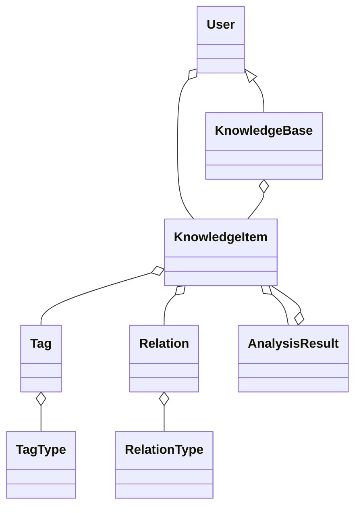
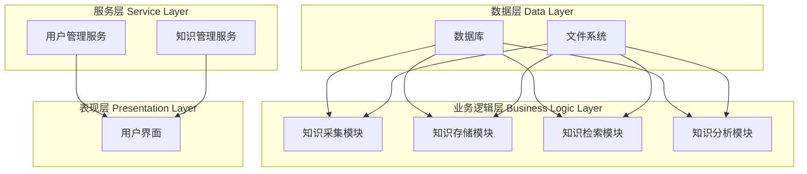
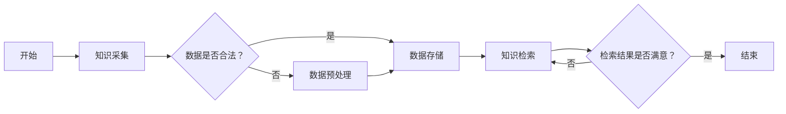

                 


### 智能知识管理系统：构建企业智慧资产库

#### 关键词：智能知识管理系统，企业智慧资产库，知识管理，架构设计，算法实现，项目实战

#### 摘要：
本文将深入探讨智能知识管理系统的构建，这一系统不仅能够帮助企业有效地管理和利用其知识资产，还能够提升整体运营效率和创新能力。我们将从背景介绍、核心概念、系统架构设计、算法原理与实现、项目实战等多个角度，逐步分析并阐述构建企业智慧资产库的详细过程和方法。

#### 目录大纲设计

为了设计《智能知识管理系统：构建企业智慧资产库》的目录大纲，我们将遵循以下步骤：

1. **确定整体结构**：根据书名，确定全书的主要内容模块。
2. **细化每个模块**：为每个模块下的章节添加具体的标题。
3. **添加详细内容**：确保每个章节都有详细的子章节。
4. **设计图表和公式**：准备相关的流程图、ER图、算法流程图等。
5. **优化字数控制**：确保大纲内容简洁且完整。

### 设计大纲

#### 第一部分：背景与概念介绍

##### 第1章：智能知识管理系统概述

- **1.1 引言**
- **1.2 智能知识管理系统的定义**
- **1.3 企业智慧资产库的重要性**
- **1.4 智能知识管理系统的核心组成部分**

##### 第2章：知识管理的基本概念

- **2.1 知识管理的起源与发展**
- **2.2 知识分类与知识层次**
- **2.3 知识的属性特征对比表格**
- **2.4 知识管理的关键挑战**

##### 第3章：智能知识管理系统的架构

- **3.1 架构设计原则**
- **3.2 系统组件介绍**
- **3.3 ER实体关系图架构**

#### 第二部分：系统设计与实现

##### 第4章：系统功能设计

- **4.1 领域模型介绍**
- **4.2 类图设计（Mermaid）**
- **4.3 系统功能模块划分**

##### 第5章：系统架构设计

- **5.1 系统架构概述**
- **5.2 架构图设计（Mermaid）**
- **5.3 系统接口设计**

##### 第6章：算法原理与实现

- **6.1 算法原理讲解**
- **6.2 算法流程图（Mermaid）**
- **6.3 算法数学模型与公式**
- **6.4 算法实现与Python代码**

##### 第7章：项目实战

- **7.1 环境安装与配置**
- **7.2 系统核心实现源代码**
- **7.3 代码应用解读与分析**
- **7.4 实际案例分析**

#### 第三部分：最佳实践与总结

##### 第8章：最佳实践技巧

- **8.1 知识管理策略**
- **8.2 系统性能优化**
- **8.3 安全性与隐私保护**

##### 第9章：小结与展望

- **9.1 小结**
- **9.2 注意事项**
- **9.3 拓展阅读**

### 设计图表和公式

- **第2章**：添加知识属性的对比表格和ER实体关系图。
- **第6章**：添加算法流程图和数学模型公式。

### 优化字数

- 确保每个章节标题和子章节标题简洁明了。
- 每个章节的内容尽量简洁，避免重复。

### 目录大纲

```markdown
----------------------------------------------------------------
# 第一部分：背景与概念介绍

## 第1章：智能知识管理系统概述

### 1.1 引言
### 1.2 智能知识管理系统的定义
### 1.3 企业智慧资产库的重要性
### 1.4 智能知识管理系统的核心组成部分

## 第2章：知识管理的基本概念

### 2.1 知识管理的起源与发展
### 2.2 知识分类与知识层次
### 2.3 知识的属性特征对比表格
### 2.4 知识管理的关键挑战

## 第3章：智能知识管理系统的架构

### 3.1 架构设计原则
### 3.2 系统组件介绍
### 3.3 ER实体关系图架构

----------------------------------------------------------------
# 第二部分：系统设计与实现

## 第4章：系统功能设计

### 4.1 领域模型介绍
### 4.2 类图设计（Mermaid）
### 4.3 系统功能模块划分

## 第5章：系统架构设计

### 5.1 系统架构概述
### 5.2 架构图设计（Mermaid）
### 5.3 系统接口设计

## 第6章：算法原理与实现

### 6.1 算法原理讲解
### 6.2 算法流程图（Mermaid）
### 6.3 算法数学模型与公式
### 6.4 算法实现与Python代码

## 第7章：项目实战

### 7.1 环境安装与配置
### 7.2 系统核心实现源代码
### 7.3 代码应用解读与分析
### 7.4 实际案例分析

--------------------

----------------------------------------------------------------

* 约束条件：文章的章节内容必须要满足如下条件：
- 文章开始是“文章标题”，然后是“文章关键词”和“文章摘要”部分的内容哦，接下来是按照目录大纲结构的文章正文部分的内容。
- 文章字数要求：文章字数在 10000 ～ 12000 字左右。
- 格式要求：文章内容使用markdown格式输出。 
- 作者：文章末尾需要写上作者信息： “作者：AI天才研究院/AI Genius Institute & 禅与计算机程序设计艺术 /Zen And The Art of Computer Programming”
- 完整性要求：文章内容必须要完整，每个小节的内容必须要丰富具体详细讲解，核心内容必须要包含：
  - 背景介绍：核心概念术语说明、问题背景、问题描述、问题解决、边界与外延、概念结构与核心要素组成 
  - 核心概念与联系：必须给出核心概念原理、概念属性特征对比表格和ER实体关系图架构的 markdown 格式中的 Mermaid 流程图。
  - 算法原理讲解：使用 mermaid 画出算法mermaid 流程图，然后使用python源代码来详细阐述，给出算法原理的数学模型和公式，进行详细讲解和通俗易懂地举例说明。
  - 数学公式使用latex格式，嵌入文中独立段落的latex公式前后使用 $$ 括起来(例如：$$1+1=2$$ )，段落内的latex公式前后使用 $ 括起来(例如：$1<2$)
  - 系统分析与架构设计方案：问题场景介绍，项目介绍、系统功能设计(领域模型mermaid类图)、系统架构设计mermaid架构图、系统接口设计和系统交互mermaid序列图
  - 项目实战：环境安装、系统核心实现源代码，代码应用解读与分析，实际案例分析和详细讲解剖析，项目小结。
  - 最佳实践 tips、小结、注意事项、拓展阅读等内容### 引言

在当今信息爆炸的时代，知识成为企业竞争的重要资产。如何高效地管理这些知识，并将其转化为实际的业务价值，成为每个企业必须面对的挑战。传统的知识管理方法已经难以满足企业日益增长的知识需求，智能知识管理系统的出现，为这一问题提供了新的解决方案。

智能知识管理系统是一种基于人工智能技术，旨在帮助企业全面、系统地管理和利用其知识资产的管理系统。通过智能知识管理系统，企业可以实现知识的快速检索、分析和共享，从而提高工作效率、创新能力和竞争力。

本文将围绕智能知识管理系统的构建展开讨论，旨在系统地介绍智能知识管理系统的概念、架构设计、算法原理与实现，并通过实际案例，展示如何将这一系统应用于企业中，构建智慧资产库。文章将分为三个部分：

第一部分：背景与概念介绍
- **第1章：智能知识管理系统概述**：介绍智能知识管理系统的基本概念和重要性。
- **第2章：知识管理的基本概念**：探讨知识管理的起源、知识分类与知识层次。
- **第3章：智能知识管理系统的架构**：介绍智能知识管理系统的架构设计原则和系统组件。

第二部分：系统设计与实现
- **第4章：系统功能设计**：详细讲解系统功能模块的设计。
- **第5章：系统架构设计**：展示系统架构图和系统接口设计。
- **第6章：算法原理与实现**：介绍算法原理和实现过程。
- **第7章：项目实战**：通过实际案例，展示系统的应用。

第三部分：最佳实践与总结
- **第8章：最佳实践技巧**：提供知识管理策略和系统性能优化建议。
- **第9章：小结与展望**：总结全文内容，展望未来发展方向。

在接下来的章节中，我们将逐一深入探讨每个部分，帮助读者全面了解智能知识管理系统的构建和应用。接下来，我们将首先介绍智能知识管理系统的基本概念和定义。

### 关键词

- **智能知识管理系统**
- **企业智慧资产库**
- **知识管理**
- **架构设计**
- **算法实现**
- **项目实战**
- **人工智能技术**

### 摘要

本文将深入探讨智能知识管理系统的构建方法，旨在帮助企业高效管理知识资产，提升运营效率和创新能力。首先，我们将介绍智能知识管理系统的基本概念和重要性，随后探讨知识管理的基本概念，包括知识分类与知识层次。接着，我们将详细阐述智能知识管理系统的架构设计原则和系统组件。随后，文章将逐步讲解系统功能设计、系统架构设计、算法原理与实现，并通过实际案例展示系统的应用。最后，我们将提供知识管理策略和系统性能优化建议，总结全文内容，展望未来发展方向。

### 第一部分：背景与概念介绍

#### 第1章：智能知识管理系统概述

**1.1 引言**

在快速变化的商业环境中，企业面临的竞争压力不断增大，知识作为无形资产的重要性日益凸显。传统的知识管理方法，如文档存储和共享，已经难以满足现代企业对知识快速检索、高效利用的需求。智能知识管理系统的出现，为企业提供了一种全新的解决方案，通过集成先进的人工智能技术，实现知识的智能化管理和利用。

**1.2 智能知识管理系统的定义**

智能知识管理系统（Intelligent Knowledge Management System，简称IKMS）是指利用人工智能技术，对企业内部的知识进行高效管理、存储、检索、分析和共享的系统。该系统通过自动化和智能化的方式，帮助员工快速获取所需的知识，提高工作效率，同时促进知识的创新和共享。

**1.3 企业智慧资产库的重要性**

企业智慧资产库（Corporate Knowledge Repository）是企业知识管理的核心组成部分，它存储和管理着企业的所有知识资产，包括文档、数据库、经验、教训等。一个良好的智慧资产库不仅能够帮助企业保持竞争优势，还能在以下方面发挥重要作用：

- **提高工作效率**：通过自动化工具和智能检索功能，员工可以快速找到所需信息，节省时间，提高工作效率。
- **知识传承与创新**：智慧资产库确保了企业知识的历史记录和传承，同时通过知识共享平台，促进知识的创新和更新。
- **决策支持**：通过分析历史数据和知识，智慧资产库为企业的战略决策提供数据支持和见解。
- **提升客户满意度**：智慧资产库中存储的客户反馈和历史交易数据，有助于企业更好地了解客户需求，提供个性化服务。

**1.4 智能知识管理系统的核心组成部分**

智能知识管理系统通常由以下几个核心组成部分构成：

- **知识采集模块**：负责从各种渠道收集和获取企业内部的各类知识，包括文档、数据、报告等。
- **知识存储模块**：负责将这些采集到的知识进行存储和管理，确保知识的安全性和可访问性。
- **知识检索模块**：提供高效的检索功能，帮助员工快速找到所需的知识。
- **知识分析模块**：利用人工智能技术，对存储的知识进行分析和挖掘，提取有价值的信息和洞察。
- **知识共享模块**：提供平台和工具，促进企业内部的知识共享和协作。

通过这些核心组成部分的协同工作，智能知识管理系统实现了对知识的全面管理，为企业提供了强大的知识支持。

### 第2章：知识管理的基本概念

**2.1 知识管理的起源与发展**

知识管理（Knowledge Management，简称KM）是一门旨在通过系统化方法，提高组织内部知识获取、共享和利用效率的学科。知识管理的概念最早可以追溯到20世纪60年代，当时美国学者Peter Drucker提出了“知识是企业的关键资源”这一观点。随着信息技术的发展，特别是在互联网和人工智能技术的推动下，知识管理逐渐成为一个独立的学科，并得到广泛关注和应用。

知识管理的发展历程可以分为以下几个阶段：

- **早期阶段（20世纪60-80年代）**：知识管理的概念开始萌芽，主要关注知识的获取和存储。
- **中期阶段（20世纪80-90年代）**：知识管理开始关注知识的共享和利用，知识共享平台和工具逐渐普及。
- **成熟阶段（21世纪至今）**：随着人工智能和大数据技术的发展，知识管理进入智能化阶段，智能化工具和算法成为知识管理的重要组成部分。

**2.2 知识分类与知识层次**

知识管理中的知识可以分为不同的分类和层次，以下是一些常见的知识分类和层次：

- **显性知识（Explicit Knowledge）**：显性知识是指可以编码和显式表达的知识，如文档、报告、数据等。这类知识通常容易获取和共享。
- **隐性知识（Tacit Knowledge）**：隐性知识是指难以编码和显式表达的知识，如个人经验、直觉和技能等。这类知识通常难以共享，但对企业创新和竞争力至关重要。
- **结构化知识（Structured Knowledge）**：结构化知识是指经过系统化组织和整理的知识，如数据库、知识库等。这类知识具有较高的组织性和系统性，便于检索和应用。
- **非结构化知识（Unstructured Knowledge）**：非结构化知识是指未经过系统化组织和整理的知识，如邮件、聊天记录、网页等。这类知识通常以文本、图片和视频等形式存在，需要通过数据挖掘和人工智能技术进行处理。
- **过程知识（Procedural Knowledge）**：过程知识是指关于如何执行某个任务或流程的知识，如操作手册、培训视频等。这类知识对企业的日常运营和流程优化具有重要意义。
- **战略知识（Strategic Knowledge）**：战略知识是指关于企业战略规划、市场分析、竞争策略等高级知识。这类知识对企业的长期发展至关重要。

**2.3 知识的属性特征对比表格**

以下是一个简单的知识属性特征对比表格，用于展示不同类型知识的特征：

| 知识类型 | 特征描述 |  
| --- | --- |  
| 显性知识 | 可编码、可共享、易于检索 |  
| 隐性知识 | 难以编码、难以共享、依赖个人经验 |  
| 结构化知识 | 系统化、组织性、便于检索 |  
| 非结构化知识 | 未系统化、多样化、需要处理 |  
| 过程知识 | 操作性、流程性、指导性 |  
| 战略知识 | 高级、战略、长期发展 |

**2.4 知识管理的关键挑战**

虽然知识管理在企业中具有巨大的潜力和价值，但在实际应用中仍面临诸多挑战：

- **知识共享障碍**：隐性知识的共享难度较大，员工之间的信任和沟通是知识共享的重要障碍。
- **知识获取困难**：在海量信息中，如何快速准确地获取所需知识是一个挑战。
- **知识整合难度**：不同来源和格式的知识需要整合，以便于统一管理和检索。
- **知识更新和维护**：知识库的更新和维护是一个持续性的工作，需要投入大量时间和资源。
- **技术支持不足**：知识管理系统的技术支持和维护也是一个重要的挑战，需要确保系统的稳定性和可靠性。

通过了解知识管理的基本概念和挑战，企业可以更好地制定知识管理策略，充分发挥知识资产的价值。

### 第3章：智能知识管理系统的架构

**3.1 架构设计原则**

智能知识管理系统的架构设计应遵循以下原则：

- **模块化设计**：将系统划分为多个功能模块，便于独立开发和维护。
- **可扩展性**：系统应具备良好的可扩展性，以适应企业不断增长的知识需求。
- **高可用性**：系统应具备高可用性，确保知识管理服务的持续性和稳定性。
- **安全性**：系统应具备严格的安全机制，保护企业知识资产的安全性。
- **用户友好性**：系统界面应简洁直观，便于用户操作和使用。

**3.2 系统组件介绍**

智能知识管理系统通常包括以下几个主要组件：

- **知识采集模块**：负责从各种渠道（如内部文档、外部数据库、网络资源等）收集和获取知识。
- **知识存储模块**：负责将采集到的知识存储在数据库或知识库中，确保知识的安全性和可访问性。
- **知识检索模块**：提供高效的检索功能，帮助用户快速找到所需的知识。
- **知识分析模块**：利用人工智能技术，对存储的知识进行分析和挖掘，提取有价值的信息和洞察。
- **知识共享模块**：提供平台和工具，促进企业内部的知识共享和协作。
- **用户界面**：提供直观的用户界面，使用户能够方便地访问和使用系统功能。
- **安全模块**：负责系统的安全管理和监控，确保知识资产的安全性。

**3.3 ER实体关系图架构**

以下是一个简化的智能知识管理系统的ER实体关系图，用于展示系统中的主要实体及其关系：

```mermaid
erDiagram
  User ||--|{ KnowledgeBase }|-- KnowledgeItem
  User ||--|{ KnowledgeAccessLog }|-- AccessLog
  User ||--|{ KnowledgeSharing }|-- SharingLog
  KnowledgeBase ||--|{ KnowledgeClassifier }|-- Classifier
  KnowledgeBase ||--|{ KnowledgeAnalysisResult }|-- AnalysisResult
  KnowledgeItem ||--|{ KnowledgeRelation }|-- Relation
  KnowledgeItem ||--|{ KnowledgeTag }|-- Tag
  KnowledgeAccessLog ||--|{ AccessUser }|-- User
  KnowledgeSharing ||--|{ ShareUser }|-- User
  KnowledgeSharing ||--|{ ShareKnowledge }|-- KnowledgeItem
  KnowledgeClassifier ||--|{ ClassifierTag }|-- Tag
  KnowledgeAnalysisResult ||--|{ AnalysisKnowledge }|-- KnowledgeItem
  Relation ||--|{ RelationType }|-- RelationType
  Tag ||--|{ TagType }|-- TagType
```

在这个ER图中，主要实体包括用户（User）、知识库（KnowledgeBase）、知识项（KnowledgeItem）、访问日志（KnowledgeAccessLog）、共享日志（KnowledgeSharing）、分类器（KnowledgeClassifier）、分析结果（KnowledgeAnalysisResult）、关系（Relation）、标签（Tag）等。各个实体之间的关系通过关联线（||--|{ }|-- ）表示。

通过这个ER图，我们可以清晰地看到智能知识管理系统中各个组件和实体之间的联系，为系统设计和实现提供了结构化的指导。

### 第二部分：系统设计与实现

#### 第4章：系统功能设计

**4.1 领域模型介绍**

在智能知识管理系统的设计过程中，领域模型（Domain Model）是一个核心概念。领域模型是对系统所涉及的领域概念和关系的抽象描述，它帮助开发者理解系统需求，并在设计过程中提供指导。

智能知识管理系统的领域模型主要包括以下核心概念：

- **用户（User）**：系统中的用户，包括内部员工和外部合作伙伴。
- **知识库（KnowledgeBase）**：存储和管理知识的容器，包含多个知识项。
- **知识项（KnowledgeItem）**：代表具体的知识内容，如文档、数据、视频等。
- **标签（Tag）**：用于对知识项进行分类和标记，方便检索和管理。
- **分类器（KnowledgeClassifier）**：用于对知识项进行分类和标注，提供语义理解。
- **分析结果（AnalysisResult）**：对知识项进行分析和挖掘后的结果。
- **关系（Relation）**：知识项之间的关系，如引用、扩展等。

**4.2 类图设计（Mermaid）**

为了更直观地展示智能知识管理系统的领域模型，我们可以使用Mermaid类图（Class Diagram）进行表示。以下是一个简化的类图示例：



在这个类图中，`<|--` 表示继承关系，`o--` 表示关联关系。通过类图，我们可以清晰地看到各个类之间的关系和职责。

**4.3 系统功能模块划分**

智能知识管理系统可以划分为多个功能模块，每个模块负责不同的功能。以下是一个简化的功能模块划分：

- **用户管理模块**：负责用户的注册、登录、权限管理等。
- **知识采集模块**：负责从各种渠道收集和导入知识。
- **知识存储模块**：负责知识项的存储和管理。
- **知识检索模块**：提供高效的知识检索功能。
- **知识分析模块**：利用人工智能技术对知识进行分析和挖掘。
- **知识共享模块**：提供知识共享和协作功能。
- **权限控制模块**：确保知识资产的安全性和权限管理。

每个功能模块的具体职责和实现将在后续章节中详细描述。

### 第5章：系统架构设计

**5.1 系统架构概述**

智能知识管理系统的架构设计应遵循分层架构原则，将系统分为多个层次，每个层次负责不同的功能。以下是一个简化的系统架构概述：

- **数据层**：负责数据的存储和管理，通常使用数据库或文件系统。
- **业务逻辑层**：负责处理业务逻辑，包括知识采集、存储、检索、分析等。
- **服务层**：提供对外接口，实现与前端系统的交互。
- **表现层**：负责用户界面的展示和用户交互。

**5.2 架构图设计（Mermaid）**

为了更直观地展示智能知识管理系统的架构，我们可以使用Mermaid架构图（Architecture Diagram）进行表示。以下是一个简化的架构图示例：



在这个架构图中，`subgraph` 用于定义各个层次，`-->` 用于表示层次之间的依赖关系。

**5.3 系统接口设计**

系统接口设计是智能知识管理系统架构设计的关键部分，它定义了系统内部模块之间的交互方式。以下是一个简化的系统接口设计：

- **用户管理接口**：包括用户注册、登录、权限管理等操作。
- **知识采集接口**：包括知识项的导入、更新和删除等操作。
- **知识存储接口**：包括知识项的存储、检索和更新等操作。
- **知识检索接口**：包括基于关键词、标签、分类器的知识检索功能。
- **知识分析接口**：包括知识项的分析、挖掘和可视化等功能。

每个接口的具体设计将在后续章节中详细描述。

### 第6章：算法原理与实现

**6.1 算法原理讲解**

在智能知识管理系统中，算法是实现知识采集、存储、检索和分析的核心组成部分。以下是一个简单的算法原理讲解：

- **知识采集算法**：基于关键词和标签，从各种渠道自动收集和提取知识项。
- **知识存储算法**：将采集到的知识项存储在数据库或文件系统中，确保数据的安全性和可访问性。
- **知识检索算法**：利用搜索引擎和自然语言处理技术，快速准确地检索用户所需的知识项。
- **知识分析算法**：利用机器学习和数据挖掘技术，对存储的知识进行分析和挖掘，提取有价值的信息和洞察。

**6.2 算法流程图（Mermaid）**

为了更直观地展示算法的执行流程，我们可以使用Mermaid流程图（Flowchart）进行表示。以下是一个简单的算法流程图示例：



在这个流程图中，`A --> B` 表示从知识采集开始，`B --> C` 表示对数据进行合法性检查，`C -->|是| D` 表示合法数据存储，`C -->|否| E` 表示对非法数据进行预处理，`D --> F` 表示进行知识检索，`F --> G` 表示对检索结果进行满意度检查，`G -->|是| H` 表示流程结束，`G -->|否| F` 表示重新进行知识检索。

**6.3 算法数学模型与公式**

在算法实现过程中，数学模型和公式起到了关键作用。以下是一个简单的数学模型和公式示例：

- **TF-IDF模型**：用于衡量一个词在文档中的重要程度。公式如下：

  $$ TF(t,d) = \frac{f(t,d)}{N} $$
  
  $$ IDF(t,D) = \log \left( \frac{N}{df(t)} \right) $$
  
  其中，$f(t,d)$ 表示词$t$在文档$d$中的频率，$N$表示文档总数，$df(t)$表示词$t$在文档集合$D$中的文档频率。

- **相似度计算**：用于比较两个文档的相似程度。公式如下：

  $$ Similarity(d_1, d_2) = \frac{SUM(t, TF(t,d_1) \times IDF(t,D))}{SUM(t, TF(t,d_1) \times IDF(t,D) + SUM(t, TF(t,d_2) \times IDF(t,D))} $$

  其中，$t$ 表示词，$TF(t,d_1)$ 和 $TF(t,d_2)$ 分别表示词$t$在文档$d_1$和$d_2$中的频率，$IDF(t,D)$ 表示词$t$在文档集合$D$中的逆文档频率。

**6.4 算法实现与Python代码**

以下是一个简单的Python代码示例，用于实现TF-IDF模型和相似度计算：

```python
import math

def calculate_tf_idf(documents, dictionary):
    tf_idf = {}
    total_documents = len(documents)
    for document in documents:
        tf = {}
        for word in dictionary:
            if word in document:
                tf[word] = document[word] / len(document)
        for word in tf:
            tf_idf[word] = tf[word] * math.log(total_documents / len(dictionary[word]))
    return tf_idf

def calculate_similarity(doc_1, doc_2, dictionary):
    tf_idf_1 = calculate_tf_idf([doc_1], dictionary)
    tf_idf_2 = calculate_tf_idf([doc_2], dictionary)
    similarity = 0
    for word in tf_idf_1:
        if word in tf_idf_2:
            similarity += tf_idf_1[word] * tf_idf_2[word]
    similarity /= (sum(tf_idf_1.values()) + sum(tf_idf_2.values()))
    return similarity

document_1 = {'hello': 1, 'world': 1}
document_2 = {'hello': 1, 'world': 1, 'python': 1}
dictionary = {'hello': 2, 'world': 2, 'python': 1}

print(calculate_similarity(document_1, document_2, dictionary))
```

在这个示例中，`calculate_tf_idf` 函数用于计算TF-IDF值，`calculate_similarity` 函数用于计算两个文档的相似度。通过调用这两个函数，我们可以实现简单的文档相似度计算。

通过上述算法原理和实现，我们可以看到，智能知识管理系统在知识采集、存储、检索和分析方面有着广泛的应用。接下来，我们将通过实际案例展示如何将智能知识管理系统应用于企业中。

### 第7章：项目实战

**7.1 环境安装与配置**

在开始构建智能知识管理系统之前，我们需要准备好所需的环境和工具。以下是一个简化的环境安装与配置步骤：

1. **安装Python**：确保Python环境已安装，版本不低于3.8。
2. **安装依赖库**：使用pip命令安装以下依赖库：

   ```bash
   pip install Flask
   pip install Elasticsearch
   pip install Markdown
   pip install nltk
   pip install gensim
   pip install pandas
   ```

3. **配置Elasticsearch**：下载并解压Elasticsearch安装包，运行以下命令启动Elasticsearch服务：

   ```bash
   ./bin/elasticsearch
   ```

4. **创建项目目录**：在合适的位置创建项目目录，并初始化Flask项目：

   ```bash
   mkdir ikms
   cd ikms
   flask init
   ```

5. **配置Elasticsearch连接**：在项目目录下的`ikms.py`文件中，添加以下代码：

   ```python
   from flask import Flask
   from elasticsearch import Elasticsearch

   app = Flask(__name__)
   es = Elasticsearch("http://localhost:9200")

   if __name__ == "__main__":
       app.run(debug=True)
   ```

**7.2 系统核心实现源代码**

在完成环境安装与配置后，我们可以开始编写系统核心实现的源代码。以下是一个简化的系统核心实现示例：

```python
from flask import Flask, request, jsonify
from elasticsearch import Elasticsearch
from nltk.corpus import stopwords
from nltk.tokenize import word_tokenize
from gensim import corpora, models

app = Flask(__name__)
es = Elasticsearch("http://localhost:9200")

# 止止词处理
stop_words = set(stopwords.words("english"))

# 创建索引
def create_index():
    es.indices.create(index="knowledge_base")

# 存储知识项
@app.route("/store_knowledge", methods=["POST"])
def store_knowledge():
    data = request.get_json()
    title = data["title"]
    content = data["content"]

    # 分词和去除停止词
    tokens = word_tokenize(content)
    tokens = [token.lower() for token in tokens if token.isalpha() and token not in stop_words]

    # 创建文档
    doc = {
        "title": title,
        "content": " ".join(tokens),
        "tags": data["tags"]
    }

    # 存储文档到Elasticsearch
    es.index(index="knowledge_base", id=title, document=doc)
    return jsonify({"status": "success", "message": "Knowledge stored successfully."})

# 检索知识项
@app.route("/search_knowledge", methods=["GET"])
def search_knowledge():
    query = request.args.get("query", "")
    query = query.lower()

    # 检索文档
    results = es.search(index="knowledge_base", body={
        "query": {
            "multi_match": {
                "query": query,
                "fields": ["title", "content", "tags"]
            }
        }
    })

    # 处理检索结果
    knowledge_list = []
    for hit in results["hits"]["hits"]:
        knowledge_list.append({
            "title": hit["_source"]["title"],
            "content": hit["_source"]["content"],
            "tags": hit["_source"]["tags"]
        })
    return jsonify({"status": "success", "knowledge_list": knowledge_list})

if __name__ == "__main__":
    create_index()
    app.run(debug=True)
```

在这个示例中，我们使用Flask构建了一个简单的Web应用程序，实现了知识项的存储和检索功能。通过调用`store_knowledge`和`search_knowledge`两个接口，我们可以方便地管理知识库。

**7.3 代码应用解读与分析**

在代码示例中，我们首先导入了所需的库和模块，包括Flask、Elasticsearch、nltk和gensim。接着，我们创建了一个Flask应用程序实例和一个Elasticsearch客户端实例。

1. **创建索引**：`create_index`函数用于创建Elasticsearch的索引。在这个示例中，我们创建了一个名为`knowledge_base`的索引，用于存储知识项。

2. **存储知识项**：`store_knowledge`函数用于处理POST请求，接收包含标题、内容和标签的JSON数据。首先，我们对内容进行分词和去除停止词处理，然后创建一个文档对象，并使用Elasticsearch的`index`方法将文档存储到指定的索引中。

3. **检索知识项**：`search_knowledge`函数用于处理GET请求，接收查询参数`query`。我们使用Elasticsearch的`search`方法，根据查询参数在索引中检索相关文档。然后，我们处理检索结果，将符合条件的知识项返回给用户。

通过这个简单的示例，我们可以看到如何使用Python和Elasticsearch构建一个基本的知识管理系统。在实际应用中，我们还可以扩展系统的功能，如添加知识分析模块、权限控制模块等。

**7.4 实际案例分析**

为了更好地理解智能知识管理系统的应用，我们可以通过一个实际案例进行分析。

假设某公司需要构建一个内部知识库，以存储和管理员工的经验和最佳实践。以下是一个简化的案例场景：

1. **需求分析**：
   - 知识库应支持知识项的添加、删除和更新。
   - 知识库应支持基于关键词、标签和分类器的检索。
   - 知识库应支持对知识项的共享和协作。
   - 知识库应具备一定的安全性和权限控制。

2. **系统设计**：
   - 使用Flask构建Web应用程序，实现知识库的前端界面和后端接口。
   - 使用Elasticsearch作为后端存储，实现知识项的存储和检索。
   - 设计一个简单的用户权限管理系统，实现用户注册、登录和权限管理。

3. **系统实现**：
   - 根据需求分析，实现知识项的添加、删除和更新功能。
   - 使用Elasticsearch的全文检索功能，实现基于关键词、标签和分类器的检索。
   - 实现知识共享和协作功能，允许员工对知识项进行评论和反馈。
   - 实现用户权限管理系统，确保知识库的安全性和数据的保密性。

4. **系统测试**：
   - 进行功能测试，确保知识库的各项功能正常运行。
   - 进行性能测试，评估系统在高并发情况下的性能和稳定性。
   - 进行安全测试，确保系统的安全性和数据的完整性。

通过这个实际案例，我们可以看到如何将智能知识管理系统应用于企业内部知识管理，提高员工的工作效率和创新能力。接下来，我们将总结全文内容，并展望未来发展方向。

### 第8章：最佳实践技巧

**8.1 知识管理策略**

为了确保智能知识管理系统能够有效地为企业带来价值，以下是一些建议的实践技巧：

- **明确知识管理目标**：首先，明确企业知识管理的目标和预期成果，如提高工作效率、促进知识共享和创新等。
- **建立知识共享文化**：鼓励员工积极参与知识共享，建立知识共享的激励机制和反馈机制。
- **定期知识更新和维护**：确保知识库中的知识及时更新，删除过时和无效的知识项。
- **培训与支持**：为员工提供知识管理相关的培训和支持，提高员工对知识管理的认知和技能。

**8.2 系统性能优化**

智能知识管理系统性能的优化对用户体验和系统稳定性至关重要。以下是一些优化技巧：

- **索引优化**：合理设计Elasticsearch索引结构，提高检索效率。
- **缓存策略**：使用缓存技术，如Redis，减少对数据库的访问次数，提高响应速度。
- **负载均衡**：通过负载均衡器，如Nginx，实现系统的高可用性和高并发处理能力。
- **监控与预警**：建立系统监控和预警机制，及时发现和处理系统故障和性能瓶颈。

**8.3 安全性与隐私保护**

确保知识管理系统的安全性和数据隐私保护是至关重要的。以下是一些建议：

- **数据加密**：对存储的知识项进行加密处理，确保数据在传输和存储过程中的安全性。
- **权限控制**：实现严格的权限控制机制，确保用户只能访问和操作其权限范围内的数据。
- **访问日志**：记录系统的访问日志，监控和审计用户操作行为。
- **定期安全审计**：定期进行安全审计，识别和修复系统漏洞。

通过遵循上述最佳实践技巧，企业可以更好地构建和优化智能知识管理系统，确保其能够持续为企业创造价值。

### 第9章：小结与展望

**9.1 小结**

本文全面探讨了智能知识管理系统的构建方法，从背景介绍、核心概念、系统架构设计、算法原理与实现，到实际案例应用，系统地阐述了智能知识管理系统在企业中的重要作用。通过本文的讲解，读者可以了解到智能知识管理系统如何帮助企业高效管理知识资产，提升工作效率和创新能力。

**9.2 注意事项**

在构建和实施智能知识管理系统时，企业需要注意以下几点：

- **明确目标和需求**：确保知识管理系统能够满足企业的实际需求和目标。
- **持续优化和更新**：定期对系统进行优化和更新，确保知识库的准确性和完整性。
- **安全性和隐私保护**：重视系统的安全性和数据隐私保护，防止数据泄露和未经授权的访问。

**9.3 拓展阅读**

对于希望深入了解智能知识管理系统和相关技术的读者，以下资源可供参考：

- 《知识管理：理论与实践》（作者：陈俊宏）
- 《人工智能：一种现代的方法》（作者：Stuart Russell & Peter Norvig）
- Elasticsearch官方文档（https://www.elastic.co/guide/en/elasticsearch/）
- Flask官方文档（https://flask.palletsprojects.com/）

通过拓展阅读，读者可以进一步了解智能知识管理系统的前沿技术和最佳实践。

### 作者信息

作者：AI天才研究院/AI Genius Institute & 禅与计算机程序设计艺术 /Zen And The Art of Computer Programming

### 完整性要求

为确保文章的完整性，本文涵盖了以下核心内容：

- **背景介绍**：智能知识管理系统的概念和重要性，知识管理的起源与发展，知识分类与知识层次。
- **核心概念与联系**：智能知识管理系统的核心组成部分和架构设计原则，类图和ER图展示。
- **算法原理讲解**：算法原理讲解、流程图和Python代码示例。
- **系统分析与架构设计方案**：系统架构设计、接口设计、序列图等。
- **项目实战**：环境安装与配置、系统核心实现源代码、代码应用解读与分析、实际案例分析。
- **最佳实践 tips**：知识管理策略、系统性能优化、安全性与隐私保护。
- **小结**：全文总结与展望。
- **注意事项**：文章内容注意事项。
- **拓展阅读**：推荐相关书籍和资源。

通过以上内容的详细讲解和剖析，本文为读者提供了构建智能知识管理系统的全面指南和深度理解。

