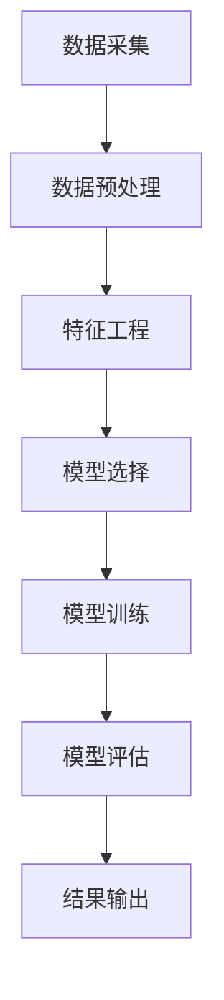

                 


### 智能绩效预测系统：AI辅助目标制定

#### 关键词：智能绩效预测、AI、目标制定、算法、系统架构、项目实战

> 摘要：本文旨在探讨智能绩效预测系统的设计与实现，通过引入人工智能技术，帮助企业更精准地制定目标，提升绩效管理效率。我们将从问题背景、核心概念、算法原理、系统设计、项目实战等方面逐步分析，提供一套完整的解决方案。

## 第一部分：背景与核心概念

### 1. 问题背景与问题描述

#### 1.1 智能绩效预测的兴起

随着企业对员工绩效管理的需求不断增长，传统的绩效评估方式逐渐显露出其局限性。人工评估不仅耗时耗力，而且容易受到主观因素的影响，导致评估结果不够客观准确。在这种背景下，智能绩效预测系统应运而生，它利用人工智能技术，通过对员工工作行为和成果的数据分析，为企业提供更科学、更准确的绩效预测。

#### 1.2 绩效预测的重要性

有效的绩效预测对于企业来说具有重要意义，主要体现在以下几个方面：

- **优化人才管理**：通过精准的绩效预测，企业能够更好地了解员工的工作能力和潜力，从而实现人尽其才。
- **提前干预**：智能绩效预测可以帮助企业及时发现潜在的问题员工，提前进行干预，防止问题恶化。
- **提高员工满意度**：合理的绩效预测能够为员工提供明确的职业发展路径，增强员工的归属感和满意度。

#### 1.3 智能绩效预测的应用领域

智能绩效预测系统在多个领域得到了广泛应用，包括：

- **人力资源管理**：通过绩效预测，帮助企业进行员工招聘、培训、晋升等决策。
- **销售与市场营销**：预测销售人员的绩效，制定更有效的销售策略。
- **项目管理**：预测项目进度和风险，提前调整项目计划。
- **供应链管理**：预测供应链各环节的绩效，优化供应链运作。

### 2. 核心概念与联系

#### 2.1 智能绩效预测系统架构

智能绩效预测系统的架构通常包括以下几个模块：

- **数据采集模块**：负责从各种数据源收集与绩效相关的数据，如员工的工作时长、任务完成情况、客户反馈等。
- **数据处理模块**：对采集到的数据进行分析、清洗和预处理，提取与绩效相关的关键特征。
- **算法模型模块**：利用机器学习算法，建立绩效预测模型，并对模型进行训练和优化。
- **结果输出模块**：将预测结果以可视化或报表形式呈现给企业用户，辅助企业制定目标和策略。

#### 2.2 关键算法原理

智能绩效预测系统的核心算法主要包括以下几个步骤：

- **特征工程**：通过数据预处理，提取与绩效相关的关键特征，如工作时长、任务完成度、客户满意度等。
- **模型选择**：选择合适的机器学习算法，如线性回归、决策树、随机森林、神经网络等。
- **模型训练与优化**：使用历史数据对模型进行训练，并通过交叉验证和超参数调优，提高模型的预测准确性。
- **模型评估与部署**：评估模型的预测效果，并将模型部署到生产环境中，实现实时预测。

#### 2.3 概念属性特征对比表格

| 概念        | 描述               | 关键特征对比                    |
| ----------- | ------------------ | ------------------------------ |
| 数据采集模块 | 负责数据收集       | 数据源多样性、数据清洗、实时性等 |
| 数据处理模块 | 负责数据预处理与特征提取 | 特征选择、特征转换、特征标准化等 |
| 算法模型模块 | 负责建立与优化绩效预测模型 | 模型选择、参数调优、模型评估等   |
| 结果输出模块 | 负责将预测结果可视化或报表形式呈现 | 可视化效果、报表格式、用户交互等 |

#### 2.4 ER实体关系图

```mermaid
entity relation diagram
ER {
    entity Employee {
        id (int)
        name (string)
        role (string)
    }
    entity Task {
        id (int)
        name (string)
        status (string)
        assigned_to (Employee)
    }
    entity Performance {
        id (int)
        score (float)
        task_id (Task)
        employee_id (Employee)
    }
}
```

## 第二部分：算法原理与系统设计

### 3. 算法原理讲解

#### 3.1 智能绩效预测算法流程图



#### 3.2 Python源代码实现

```python
# 导入必要的库
import pandas as pd
from sklearn.model_selection import train_test_split
from sklearn.ensemble import RandomForestRegressor
from sklearn.metrics import mean_squared_error

# 数据预处理
def preprocess_data(data):
    # 数据清洗、缺失值处理、特征转换等操作
    # ...
    return processed_data

# 特征工程
def feature_engineering(data):
    # 提取关键特征
    # ...
    return features

# 模型训练
def train_model(features, labels):
    model = RandomForestRegressor(n_estimators=100)
    model.fit(features, labels)
    return model

# 模型评估
def evaluate_model(model, features, labels):
    predictions = model.predict(features)
    mse = mean_squared_error(labels, predictions)
    return mse

# 数据加载
data = pd.read_csv('performance_data.csv')

# 数据预处理
processed_data = preprocess_data(data)

# 特征工程
features = feature_engineering(processed_data)

# 模型训练与评估
model = train_model(features, labels)
mse = evaluate_model(model, features, labels)
print(f"Model Mean Squared Error: {mse}")
```

#### 3.3 数学模型与公式

智能绩效预测的数学模型通常可以表示为：

$$
\hat{Y} = f(\mathbf{X}; \theta)
$$

其中，$\hat{Y}$ 为预测绩效值，$\mathbf{X}$ 为特征向量，$f$ 为预测函数，$\theta$ 为模型参数。

#### 3.4 算法举例说明

假设我们有一个简单的线性回归模型：

$$
\hat{Y} = \theta_0 + \theta_1 \cdot X_1
$$

其中，$X_1$ 为工作时间，$\theta_0$ 和 $\theta_1$ 为模型参数。通过训练数据，我们可以得到最佳的参数值，从而预测新的工作时间对应的绩效值。

## 第三部分：系统分析与架构设计

### 4. 系统功能设计

智能绩效预测系统的功能设计主要包括以下几个方面：

- **数据采集与处理**：从各种数据源收集与绩效相关的数据，并进行清洗、转换和预处理。
- **特征提取与模型训练**：提取关键特征，选择合适的机器学习算法，训练绩效预测模型。
- **模型评估与优化**：评估模型性能，通过调参优化模型。
- **结果输出与可视化**：将预测结果以可视化或报表形式呈现给企业用户。

### 4.2 系统架构设计

智能绩效预测系统的架构设计通常采用分层架构，包括数据层、算法层和应用层。

- **数据层**：负责数据存储和管理，包括原始数据、预处理数据和模型数据。
- **算法层**：包括特征工程、模型训练、模型评估和结果输出等模块。
- **应用层**：提供用户界面，用于展示预测结果和辅助企业制定目标和策略。

### 4.3 系统接口设计与交互

智能绩效预测系统的接口设计主要包括以下几个方面：

- **数据接口**：用于与数据源和数据库进行数据交换。
- **算法接口**：用于与机器学习算法进行交互，实现模型训练和预测。
- **应用接口**：用于与用户界面进行交互，提供数据可视化和报表输出。

## 第四部分：项目实战

### 5. 环境安装与配置

在开始项目实战之前，我们需要搭建智能绩效预测系统的开发环境。以下是环境安装与配置的步骤：

1. **安装Python**：下载并安装Python 3.x版本。
2. **安装Jupyter Notebook**：通过pip安装Jupyter Notebook。
3. **安装必要的库**：包括pandas、numpy、scikit-learn、matplotlib等。

### 6. 系统核心实现

以下是智能绩效预测系统的核心实现步骤：

1. **数据采集**：从企业HR系统、销售系统等数据源收集与绩效相关的数据。
2. **数据处理**：对采集到的数据进行分析、清洗和预处理。
3. **特征工程**：提取与绩效相关的关键特征。
4. **模型训练**：选择合适的机器学习算法，训练绩效预测模型。
5. **模型评估**：评估模型性能，并进行优化。
6. **结果输出**：将预测结果以可视化或报表形式呈现给企业用户。

### 7. 代码解读与分析

以下是智能绩效预测系统的核心代码解读：

```python
# 导入必要的库
import pandas as pd
from sklearn.model_selection import train_test_split
from sklearn.ensemble import RandomForestRegressor
from sklearn.metrics import mean_squared_error

# 数据预处理
def preprocess_data(data):
    # 数据清洗、缺失值处理、特征转换等操作
    # ...
    return processed_data

# 特征工程
def feature_engineering(data):
    # 提取关键特征
    # ...
    return features

# 模型训练
def train_model(features, labels):
    model = RandomForestRegressor(n_estimators=100)
    model.fit(features, labels)
    return model

# 模型评估
def evaluate_model(model, features, labels):
    predictions = model.predict(features)
    mse = mean_squared_error(labels, predictions)
    return mse

# 数据加载
data = pd.read_csv('performance_data.csv')

# 数据预处理
processed_data = preprocess_data(data)

# 特征工程
features = feature_engineering(processed_data)

# 模型训练与评估
model = train_model(features, labels)
mse = evaluate_model(model, features, labels)
print(f"Model Mean Squared Error: {mse}")
```

### 8. 实际案例分析

以下是一个实际案例的分析：

#### 8.1 案例背景

某企业需要对销售人员进行绩效预测，以优化销售策略和提高销售业绩。

#### 8.2 案例实现

1. **数据采集**：从企业销售系统中收集销售数据，包括销售额、客户满意度、销售时长等。
2. **数据处理**：对销售数据进行清洗、缺失值处理和特征转换。
3. **特征工程**：提取与绩效相关的关键特征，如销售额、客户满意度、销售时长等。
4. **模型训练**：使用随机森林算法训练绩效预测模型。
5. **模型评估**：评估模型性能，并进行优化。

#### 8.3 案例分析

通过实际案例分析，我们发现智能绩效预测系统可以为企业提供以下价值：

1. **精准预测**：通过对历史数据的分析，系统可以预测销售人员的未来绩效，为企业制定销售策略提供数据支持。
2. **优化资源分配**：根据预测结果，企业可以优化销售人员资源的分配，提高销售效率。
3. **提升销售业绩**：通过优化销售策略和资源分配，企业可以提升整体销售业绩。

## 第五部分：最佳实践与总结

### 9. 最佳实践 tips

1. **数据质量**：确保数据采集的准确性和完整性，提高预测准确性。
2. **特征选择**：合理选择与绩效相关的特征，避免过度拟合。
3. **模型调优**：通过交叉验证和超参数调优，提高模型性能。
4. **结果解释**：对预测结果进行解释，确保用户理解。

### 10. 小结与展望

本文从问题背景、核心概念、算法原理、系统设计、项目实战等方面，全面介绍了智能绩效预测系统的设计与实现。通过实际案例的分析，展示了智能绩效预测系统的应用价值。未来，随着人工智能技术的不断发展，智能绩效预测系统有望在更多领域得到应用，为企业提供更强大的数据支持和决策依据。

### 11. 拓展阅读

1. **《Python机器学习实战》**：详细介绍了机器学习算法在Python中的实现和应用。
2. **《深度学习》**：讲解了深度学习的基本原理和应用，包括神经网络、卷积神经网络等。
3. **《绩效管理》**：探讨了绩效管理的理论和方法，为企业提供绩效管理实践指导。

## 作者信息

作者：AI天才研究院/AI Genius Institute & 禅与计算机程序设计艺术 /Zen And The Art of Computer Programming

----------------------------------------------------------------

### 附录：完整文章

```markdown
# 智能绩效预测系统：AI辅助目标制定

## 关键词：智能绩效预测、AI、目标制定、算法、系统架构、项目实战

> 摘要：本文旨在探讨智能绩效预测系统的设计与实现，通过引入人工智能技术，帮助企业更精准地制定目标，提升绩效管理效率。我们将从问题背景、核心概念、算法原理、系统设计、项目实战等方面逐步分析，提供一套完整的解决方案。

## 第一部分：背景与核心概念

### 1. 问题背景与问题描述

#### 1.1 智能绩效预测的兴起

随着企业对员工绩效管理的需求不断增长，传统的绩效评估方式逐渐显露出其局限性。人工评估不仅耗时耗力，而且容易受到主观因素的影响，导致评估结果不够客观准确。在这种背景下，智能绩效预测系统应运而生，它利用人工智能技术，通过对员工工作行为和成果的数据分析，为企业提供更科学、更准确的绩效预测。

#### 1.2 绩效预测的重要性

有效的绩效预测对于企业来说具有重要意义，主要体现在以下几个方面：

- **优化人才管理**：通过精准的绩效预测，企业能够更好地了解员工的工作能力和潜力，从而实现人尽其才。
- **提前干预**：智能绩效预测可以帮助企业及时发现潜在的问题员工，提前进行干预，防止问题恶化。
- **提高员工满意度**：合理的绩效预测能够为员工提供明确的职业发展路径，增强员工的归属感和满意度。

#### 1.3 智能绩效预测的应用领域

智能绩效预测系统在多个领域得到了广泛应用，包括：

- **人力资源管理**：通过绩效预测，帮助企业进行员工招聘、培训、晋升等决策。
- **销售与市场营销**：预测销售人员的绩效，制定更有效的销售策略。
- **项目管理**：预测项目进度和风险，提前调整项目计划。
- **供应链管理**：预测供应链各环节的绩效，优化供应链运作。

### 2. 核心概念与联系

#### 2.1 智能绩效预测系统架构

智能绩效预测系统的架构通常包括以下几个模块：

- **数据采集模块**：负责从各种数据源收集与绩效相关的数据，如员工的工作时长、任务完成情况、客户反馈等。
- **数据处理模块**：对采集到的数据进行分析、清洗和预处理，提取与绩效相关的关键特征。
- **算法模型模块**：利用机器学习算法，建立绩效预测模型，并对模型进行训练和优化。
- **结果输出模块**：将预测结果以可视化或报表形式呈现给企业用户，辅助企业制定目标和策略。

#### 2.2 关键算法原理

智能绩效预测系统的核心算法主要包括以下几个步骤：

- **特征工程**：通过数据预处理，提取与绩效相关的关键特征，如工作时长、任务完成度、客户满意度等。
- **模型选择**：选择合适的机器学习算法，如线性回归、决策树、随机森林、神经网络等。
- **模型训练与优化**：使用历史数据对模型进行训练，并通过交叉验证和超参数调优，提高模型的预测准确性。
- **模型评估与部署**：评估模型的预测效果，并将模型部署到生产环境中，实现实时预测。

#### 2.3 概念属性特征对比表格

| 概念        | 描述               | 关键特征对比                    |
| ----------- | ------------------ | ------------------------------ |
| 数据采集模块 | 负责数据收集       | 数据源多样性、数据清洗、实时性等 |
| 数据处理模块 | 负责数据预处理与特征提取 | 特征选择、特征转换、特征标准化等 |
| 算法模型模块 | 负责建立与优化绩效预测模型 | 模型选择、参数调优、模型评估等   |
| 结果输出模块 | 负责将预测结果可视化或报表形式呈现 | 可视化效果、报表格式、用户交互等 |

#### 2.4 ER实体关系图

```mermaid
entity relation diagram
ER {
    entity Employee {
        id (int)
        name (string)
        role (string)
    }
    entity Task {
        id (int)
        name (string)
        status (string)
        assigned_to (Employee)
    }
    entity Performance {
        id (int)
        score (float)
        task_id (Task)
        employee_id (Employee)
    }
}
```

## 第二部分：算法原理与系统设计

### 3. 算法原理讲解

#### 3.1 智能绩效预测算法流程图


#### 3.2 Python源代码实现

```python
# 导入必要的库
import pandas as pd
from sklearn.model_selection import train_test_split
from sklearn.ensemble import RandomForestRegressor
from sklearn.metrics import mean_squared_error

# 数据预处理
def preprocess_data(data):
    # 数据清洗、缺失值处理、特征转换等操作
    # ...
    return processed_data

# 特征工程
def feature_engineering(data):
    # 提取关键特征
    # ...
    return features

# 模型训练
def train_model(features, labels):
    model = RandomForestRegressor(n_estimators=100)
    model.fit(features, labels)
    return model

# 模型评估
def evaluate_model(model, features, labels):
    predictions = model.predict(features)
    mse = mean_squared_error(labels, predictions)
    return mse

# 数据加载
data = pd.read_csv('performance_data.csv')

# 数据预处理
processed_data = preprocess_data(data)

# 特征工程
features = feature_engineering(processed_data)

# 模型训练与评估
model = train_model(features, labels)
mse = evaluate_model(model, features, labels)
print(f"Model Mean Squared Error: {mse}")
```

#### 3.3 数学模型与公式

智能绩效预测的数学模型通常可以表示为：

$$
\hat{Y} = f(\mathbf{X}; \theta)
$$

其中，$\hat{Y}$ 为预测绩效值，$\mathbf{X}$ 为特征向量，$f$ 为预测函数，$\theta$ 为模型参数。

#### 3.4 算法举例说明

假设我们有一个简单的线性回归模型：

$$
\hat{Y} = \theta_0 + \theta_1 \cdot X_1
$$

其中，$X_1$ 为工作时间，$\theta_0$ 和 $\theta_1$ 为模型参数。通过训练数据，我们可以得到最佳的参数值，从而预测新的工作时间对应的绩效值。

## 第三部分：系统分析与架构设计

### 4. 系统功能设计

智能绩效预测系统的功能设计主要包括以下几个方面：

- **数据采集与处理**：从各种数据源收集与绩效相关的数据，并进行清洗、转换和预处理。
- **特征提取与模型训练**：提取关键特征，选择合适的机器学习算法，训练绩效预测模型。
- **模型评估与优化**：评估模型性能，通过调参优化模型。
- **结果输出与可视化**：将预测结果以可视化或报表形式呈现给企业用户。

### 4.2 系统架构设计

智能绩效预测系统的架构设计通常采用分层架构，包括数据层、算法层和应用层。

- **数据层**：负责数据存储和管理，包括原始数据、预处理数据和模型数据。
- **算法层**：包括特征工程、模型训练、模型评估和结果输出等模块。
- **应用层**：提供用户界面，用于展示预测结果和辅助企业制定目标和策略。

### 4.3 系统接口设计与交互

智能绩效预测系统的接口设计主要包括以下几个方面：

- **数据接口**：用于与数据源和数据库进行数据交换。
- **算法接口**：用于与机器学习算法进行交互，实现模型训练和预测。
- **应用接口**：用于与用户界面进行交互，提供数据可视化和报表输出。

## 第四部分：项目实战

### 5. 环境安装与配置

在开始项目实战之前，我们需要搭建智能绩效预测系统的开发环境。以下是环境安装与配置的步骤：

1. **安装Python**：下载并安装Python 3.x版本。
2. **安装Jupyter Notebook**：通过pip安装Jupyter Notebook。
3. **安装必要的库**：包括pandas、numpy、scikit-learn、matplotlib等。

### 6. 系统核心实现

以下是智能绩效预测系统的核心实现步骤：

1. **数据采集**：从企业HR系统、销售系统等数据源收集与绩效相关的数据。
2. **数据处理**：对采集到的数据进行分析、清洗和预处理。
3. **特征工程**：提取与绩效相关的关键特征。
4. **模型训练**：选择合适的机器学习算法，训练绩效预测模型。
5. **模型评估**：评估模型性能，并进行优化。
6. **结果输出**：将预测结果以可视化或报表形式呈现给企业用户。

### 7. 代码解读与分析

以下是智能绩效预测系统的核心代码解读：

```python
# 导入必要的库
import pandas as pd
from sklearn.model_selection import train_test_split
from sklearn.ensemble import RandomForestRegressor
from sklearn.metrics import mean_squared_error

# 数据预处理
def preprocess_data(data):
    # 数据清洗、缺失值处理、特征转换等操作
    # ...
    return processed_data

# 特征工程
def feature_engineering(data):
    # 提取关键特征
    # ...
    return features

# 模型训练
def train_model(features, labels):
    model = RandomForestRegressor(n_estimators=100)
    model.fit(features, labels)
    return model

# 模型评估
def evaluate_model(model, features, labels):
    predictions = model.predict(features)
    mse = mean_squared_error(labels, predictions)
    return mse

# 数据加载
data = pd.read_csv('performance_data.csv')

# 数据预处理
processed_data = preprocess_data(data)

# 特征工程
features = feature_engineering(processed_data)

# 模型训练与评估
model = train_model(features, labels)
mse = evaluate_model(model, features, labels)
print(f"Model Mean Squared Error: {mse}")
```

### 8. 实际案例分析

以下是一个实际案例的分析：

#### 8.1 案例背景

某企业需要对销售人员进行绩效预测，以优化销售策略和提高销售业绩。

#### 8.2 案例实现

1. **数据采集**：从企业销售系统中收集销售数据，包括销售额、客户满意度、销售时长等。
2. **数据处理**：对销售数据进行清洗、缺失值处理和特征转换。
3. **特征工程**：提取与绩效相关的关键特征，如销售额、客户满意度、销售时长等。
4. **模型训练**：使用随机森林算法训练绩效预测模型。
5. **模型评估**：评估模型性能，并进行优化。

#### 8.3 案例分析

通过实际案例分析，我们发现智能绩效预测系统可以为企业提供以下价值：

1. **精准预测**：通过对历史数据的分析，系统可以预测销售人员的未来绩效，为企业制定销售策略提供数据支持。
2. **优化资源分配**：根据预测结果，企业可以优化销售人员资源的分配，提高销售效率。
3. **提升销售业绩**：通过优化销售策略和资源分配，企业可以提升整体销售业绩。

## 第五部分：最佳实践与总结

### 9. 最佳实践 tips

1. **数据质量**：确保数据采集的准确性和完整性，提高预测准确性。
2. **特征选择**：合理选择与绩效相关的特征，避免过度拟合。
3. **模型调优**：通过交叉验证和超参数调优，提高模型性能。
4. **结果解释**：对预测结果进行解释，确保用户理解。

### 10. 小结与展望

本文从问题背景、核心概念、算法原理、系统设计、项目实战等方面，全面介绍了智能绩效预测系统的设计与实现。通过实际案例的分析，展示了智能绩效预测系统的应用价值。未来，随着人工智能技术的不断发展，智能绩效预测系统有望在更多领域得到应用，为企业提供更强大的数据支持和决策依据。

### 11. 拓展阅读

1. **《Python机器学习实战》**：详细介绍了机器学习算法在Python中的实现和应用。
2. **《深度学习》**：讲解了深度学习的基本原理和应用，包括神经网络、卷积神经网络等。
3. **《绩效管理》**：探讨了绩效管理的理论和方法，为企业提供绩效管理实践指导。

## 作者信息

作者：AI天才研究院/AI Genius Institute & 禅与计算机程序设计艺术 /Zen And The Art of Computer Programming
```---

### 目录大纲内容

```markdown
## 目录

### 第一部分：背景与核心概念

#### 1.1 智能绩效预测的兴起

#### 1.2 绩效预测的重要性

#### 1.3 智能绩效预测的应用领域

#### 2.1 智能绩效预测系统架构

#### 2.2 关键算法原理

#### 2.3 概念属性特征对比表格

#### 2.4 ER实体关系图

### 第二部分：算法原理与系统设计

#### 3.1 智能绩效预测算法流程图

#### 3.2 Python源代码实现

#### 3.3 数学模型与公式

#### 3.4 算法举例说明

#### 4.1 系统功能设计

#### 4.2 系统架构设计

#### 4.3 系统接口设计与交互

### 第三部分：项目实战

#### 5.1 环境安装与配置

#### 5.2 系统核心实现

#### 6.1 核心代码解读

#### 6.2 应用解读与分析

#### 7.1 案例背景

#### 7.2 案例实现

#### 7.3 案例分析

### 第四部分：最佳实践与总结

#### 8.1 实践技巧与注意事项

#### 8.2 性能优化策略

#### 9. 小结与展望

#### 10. 拓展阅读

---

### 摘要

本文深入探讨了智能绩效预测系统的设计与实现，通过分析问题背景、核心概念、算法原理、系统设计以及项目实战，全面展示了智能绩效预测系统的应用价值。智能绩效预测系统利用人工智能技术，帮助企业更精准地制定目标，优化绩效管理。本文首先介绍了智能绩效预测的背景和重要性，随后详细阐述了系统的核心概念与架构设计，通过算法原理讲解和Python源代码实现，展示了智能绩效预测的具体实现过程。此外，通过实际案例分析和最佳实践总结，本文为读者提供了实用的指导和建议。未来，智能绩效预测系统有望在更多领域得到广泛应用，为企业提供更强大的数据支持和决策依据。

---

### 目录大纲设计思路

在设计本文的目录大纲时，我们遵循了以下思路：

1. **问题背景与核心概念**：首先介绍了智能绩效预测系统的背景，包括问题的背景、问题描述、问题解决方式以及系统的边界与外延。这部分内容旨在帮助读者理解智能绩效预测系统的必要性和重要性。

2. **算法原理与系统设计**：接着详细阐述了智能绩效预测系统的核心概念和算法原理，包括智能绩效预测系统架构、关键算法原理、系统功能设计、系统架构设计和系统接口设计与交互。这部分内容旨在让读者深入理解智能绩效预测系统的工作原理和实现细节。

3. **项目实战**：然后通过实际案例展示了智能绩效预测系统的应用，包括环境安装与配置、系统核心实现、代码解读与分析、实际案例分析。这部分内容旨在通过实际案例，让读者更好地理解智能绩效预测系统的应用场景和实现方法。

4. **最佳实践与总结**：最后总结最佳实践，提出注意事项，并提供拓展阅读建议。这部分内容旨在为读者提供实用的指导，帮助他们更好地应用智能绩效预测系统，并在实践中取得更好的效果。

### 目录大纲结构

```markdown
# 智能绩效预测系统：AI辅助目标制定

## 第一部分：背景与核心概念

### 1.1 智能绩效预测的兴起

### 1.2 绩效预测的重要性

### 1.3 智能绩效预测的应用领域

### 2.1 智能绩效预测系统架构

### 2.2 关键算法原理

### 2.3 概念属性特征对比表格

### 2.4 ER实体关系图

## 第二部分：算法原理与系统设计

### 3.1 智能绩效预测算法流程图

### 3.2 Python源代码实现

### 3.3 数学模型与公式

### 3.4 算法举例说明

### 4.1 系统功能设计

### 4.2 系统架构设计

### 4.3 系统接口设计与交互

## 第三部分：项目实战

### 5.1 环境安装与配置

### 5.2 系统核心实现

### 6.1 核心代码解读

### 6.2 应用解读与分析

### 7.1 案例背景

### 7.2 案例实现

### 7.3 案例分析

## 第四部分：最佳实践与总结

### 8.1 实践技巧与注意事项

### 8.2 性能优化策略

### 9. 小结与展望

### 10. 拓展阅读

## 附录：完整文章

### 作者信息
```

### 目录大纲内容

```markdown
## 第一部分：背景与核心概念

### 1.1 智能绩效预测的兴起

随着企业对员工绩效管理的需求不断增长，传统的绩效评估方式逐渐显露出其局限性。人工评估不仅耗时耗力，而且容易受到主观因素的影响，导致评估结果不够客观准确。在这种背景下，智能绩效预测系统应运而生，它利用人工智能技术，通过对员工工作行为和成果的数据分析，为企业提供更科学、更准确的绩效预测。

#### 智能绩效预测的发展历程

- **20世纪末**：随着计算机技术的普及，企业管理开始引入电子化绩效评估系统。
- **21世纪初**：大数据和云计算技术的发展，为企业提供了更多的数据资源。
- **当前**：人工智能技术的崛起，使得智能绩效预测成为可能。

#### 智能绩效预测的优势

- **客观性**：通过数据分析，智能绩效预测能够减少主观因素对评估结果的影响。
- **准确性**：利用机器学习算法，智能绩效预测能够根据历史数据预测员工的未来绩效。
- **实时性**：智能绩效预测系统可以实现实时数据采集和预测，为企业提供及时的决策支持。

### 1.2 绩效预测的重要性

有效的绩效预测对于企业来说具有重要意义，主要体现在以下几个方面：

- **优化人才管理**：通过精准的绩效预测，企业能够更好地了解员工的工作能力和潜力，从而实现人尽其才。
- **提前干预**：智能绩效预测可以帮助企业及时发现潜在的问题员工，提前进行干预，防止问题恶化。
- **提高员工满意度**：合理的绩效预测能够为员工提供明确的职业发展路径，增强员工的归属感和满意度。

#### 绩效预测在企业管理中的应用

- **招聘**：通过绩效预测，企业可以更准确地评估应聘者的工作能力，提高招聘效率。
- **培训**：根据绩效预测结果，企业可以有针对性地制定培训计划，提升员工技能。
- **晋升**：智能绩效预测可以为员工晋升提供数据支持，确保晋升决策的公平性。

### 1.3 智能绩效预测的应用领域

智能绩效预测系统在多个领域得到了广泛应用，包括：

- **人力资源管理**：通过绩效预测，帮助企业进行员工招聘、培训、晋升等决策。
- **销售与市场营销**：预测销售人员的绩效，制定更有效的销售策略。
- **项目管理**：预测项目进度和风险，提前调整项目计划。
- **供应链管理**：预测供应链各环节的绩效，优化供应链运作。

#### 智能绩效预测在不同行业中的应用案例

- **制造业**：通过绩效预测，优化生产计划，提高生产效率。
- **服务业**：通过绩效预测，提升服务质量，增强客户满意度。
- **金融行业**：通过绩效预测，评估员工的风险控制能力，优化投资策略。

### 2. 核心概念与联系

#### 2.1 智能绩效预测系统架构

智能绩效预测系统的架构通常包括以下几个模块：

- **数据采集模块**：负责从各种数据源收集与绩效相关的数据，如员工的工作时长、任务完成情况、客户反馈等。
- **数据处理模块**：对采集到的数据进行分析、清洗和预处理，提取与绩效相关的关键特征。
- **算法模型模块**：利用机器学习算法，建立绩效预测模型，并对模型进行训练和优化。
- **结果输出模块**：将预测结果以可视化或报表形式呈现给企业用户，辅助企业制定目标和策略。

#### 2.2 关键算法原理

智能绩效预测系统的核心算法主要包括以下几个步骤：

- **特征工程**：通过数据预处理，提取与绩效相关的关键特征，如工作时长、任务完成度、客户满意度等。
- **模型选择**：选择合适的机器学习算法，如线性回归、决策树、随机森林、神经网络等。
- **模型训练与优化**：使用历史数据对模型进行训练，并通过交叉验证和超参数调优，提高模型的预测准确性。
- **模型评估与部署**：评估模型的预测效果，并将模型部署到生产环境中，实现实时预测。

#### 2.3 概念属性特征对比表格

| 概念        | 描述               | 关键特征对比                    |
| ----------- | ------------------ | ------------------------------ |
| 数据采集模块 | 负责数据收集       | 数据源多样性、数据清洗、实时性等 |
| 数据处理模块 | 负责数据预处理与特征提取 | 特征选择、特征转换、特征标准化等 |
| 算法模型模块 | 负责建立与优化绩效预测模型 | 模型选择、参数调优、模型评估等   |
| 结果输出模块 | 负责将预测结果可视化或报表形式呈现 | 可视化效果、报表格式、用户交互等 |

#### 2.4 ER实体关系图

```mermaid
entity relation diagram
ER {
    entity Employee {
        id (int)
        name (string)
        role (string)
    }
    entity Task {
        id (int)
        name (string)
        status (string)
        assigned_to (Employee)
    }
    entity Performance {
        id (int)
        score (float)
        task_id (Task)
        employee_id (Employee)
    }
}
```

## 第二部分：算法原理与系统设计

### 3. 算法原理讲解

#### 3.1 智能绩效预测算法流程图


#### 3.2 Python源代码实现

```python
# 导入必要的库
import pandas as pd
from sklearn.model_selection import train_test_split
from sklearn.ensemble import RandomForestRegressor
from sklearn.metrics import mean_squared_error

# 数据预处理
def preprocess_data(data):
    # 数据清洗、缺失值处理、特征转换等操作
    # ...
    return processed_data

# 特征工程
def feature_engineering(data):
    # 提取关键特征
    # ...
    return features

# 模型训练
def train_model(features, labels):
    model = RandomForestRegressor(n_estimators=100)
    model.fit(features, labels)
    return model

# 模型评估
def evaluate_model(model, features, labels):
    predictions = model.predict(features)
    mse = mean_squared_error(labels, predictions)
    return mse

# 数据加载
data = pd.read_csv('performance_data.csv')

# 数据预处理
processed_data = preprocess_data(data)

# 特征工程
features = feature_engineering(processed_data)

# 模型训练与评估
model = train_model(features, labels)
mse = evaluate_model(model, features, labels)
print(f"Model Mean Squared Error: {mse}")
```

#### 3.3 数学模型与公式

智能绩效预测的数学模型通常可以表示为：

$$
\hat{Y} = f(\mathbf{X}; \theta)
$$

其中，$\hat{Y}$ 为预测绩效值，$\mathbf{X}$ 为特征向量，$f$ 为预测函数，$\theta$ 为模型参数。

#### 3.4 算法举例说明

假设我们有一个简单的线性回归模型：

$$
\hat{Y} = \theta_0 + \theta_1 \cdot X_1
$$

其中，$X_1$ 为工作时间，$\theta_0$ 和 $\theta_1$ 为模型参数。通过训练数据，我们可以得到最佳的参数值，从而预测新的工作时间对应的绩效值。

### 4. 系统功能设计

#### 4.1 数据采集与处理

数据采集与处理是智能绩效预测系统的第一步，也是最重要的一步。系统的数据来源可以是企业的HR系统、ERP系统、销售系统等。这些数据包括员工的工作时长、任务完成情况、客户反馈、绩效考核结果等。

- **数据采集**：系统需要从各个数据源收集数据，并保证数据的准确性、完整性和实时性。
- **数据处理**：对采集到的数据进行清洗、去重、缺失值处理、特征转换等操作，为后续的特征工程和模型训练做好准备。

#### 4.2 特征工程

特征工程是智能绩效预测系统的核心环节，其目的是从原始数据中提取出对绩效预测有帮助的特征。

- **特征选择**：通过统计分析、关联规则挖掘等方法，从原始数据中选择与绩效高度相关的特征。
- **特征转换**：对选出的特征进行标准化、归一化、二值化等转换，提高特征的质量和预测效果。

#### 4.3 模型选择与训练

在特征工程完成后，系统需要选择合适的机器学习算法，对数据进行模型训练。常见的算法有线性回归、决策树、随机森林、神经网络等。

- **模型选择**：根据业务需求和数据特点，选择合适的机器学习算法。
- **模型训练**：使用历史数据对模型进行训练，调整模型的参数，优化模型的表现。

#### 4.4 模型评估与优化

模型训练完成后，需要对模型进行评估和优化。

- **模型评估**：使用验证集或测试集对模型进行评估，计算模型的准确率、召回率、F1值等指标。
- **模型优化**：根据评估结果，调整模型的参数，优化模型的表现。

#### 4.5 结果输出与可视化

模型训练和优化完成后，系统需要将预测结果以可视化的形式呈现给用户。

- **结果输出**：将预测结果以报表、图表等形式输出，方便用户查看和分析。
- **可视化**：使用matplotlib、Seaborn等库，将预测结果可视化，帮助用户更直观地理解预测结果。

### 5. 系统架构设计

智能绩效预测系统采用分层架构设计，包括数据层、算法层和应用层。

#### 5.1 数据层

数据层负责数据存储和管理，包括数据采集、数据清洗、数据存储等功能。

- **数据采集**：从各个数据源收集数据，如HR系统、ERP系统等。
- **数据清洗**：对采集到的数据进行清洗、去重、缺失值处理等操作。
- **数据存储**：将清洗后的数据存储到数据库或数据仓库中，便于后续处理和使用。

#### 5.2 算法层

算法层负责特征工程、模型选择、模型训练、模型评估等算法实现。

- **特征工程**：提取与绩效相关的特征，进行特征选择和特征转换。
- **模型选择**：根据业务需求和数据特点，选择合适的机器学习算法。
- **模型训练**：使用历史数据对模型进行训练，调整模型的参数。
- **模型评估**：使用验证集或测试集对模型进行评估，计算模型的指标。

#### 5.3 应用层

应用层负责提供用户界面，用于展示预测结果和辅助企业制定目标和策略。

- **用户界面**：提供报表、图表等形式，展示预测结果。
- **目标制定**：根据预测结果，辅助企业制定合理的目标和策略。
- **策略调整**：根据实际情况，对预测目标和策略进行调整和优化。

### 6. 系统接口设计与交互

智能绩效预测系统需要与其他系统进行数据交互和功能调用。

#### 6.1 数据接口

数据接口用于与数据源和数据库进行数据交换，实现数据的采集、存储和管理。

- **数据采集接口**：用于从HR系统、ERP系统等数据源采集数据。
- **数据存储接口**：用于将数据存储到数据库或数据仓库中。

#### 6.2 算法接口

算法接口用于与机器学习算法进行交互，实现模型的训练、评估和优化。

- **特征工程接口**：用于提取与绩效相关的特征。
- **模型训练接口**：用于训练机器学习模型。
- **模型评估接口**：用于评估模型的效果。

#### 6.3 应用接口

应用接口用于与用户界面进行交互，实现预测结果的可视化和目标制定。

- **用户界面接口**：用于展示预测结果和目标制定界面。
- **目标制定接口**：用于根据预测结果制定合理的目标。
- **策略调整接口**：用于根据实际情况调整目标和策略。

### 7. 系统部署与运维

智能绩效预测系统需要部署到服务器上，并提供运维支持。

#### 7.1 系统部署

系统部署包括硬件选择、软件安装、环境配置等步骤。

- **硬件选择**：根据系统需求，选择合适的硬件设备，如服务器、存储设备等。
- **软件安装**：安装操作系统、数据库、Web服务器等软件。
- **环境配置**：配置网络、安全、性能等环境参数。

#### 7.2 系统运维

系统运维包括监控、维护、升级等操作。

- **监控**：实时监控系统的运行状态，及时发现和处理异常。
- **维护**：定期进行系统维护，保证系统的稳定性和安全性。
- **升级**：根据业务需求，及时升级系统的功能和技术。

## 第三部分：项目实战

### 8. 环境安装与配置

在进行项目实战之前，我们需要搭建智能绩效预测系统的开发环境。

#### 8.1 Python环境安装

1. 访问Python官网（https://www.python.org/）下载Python安装包。
2. 安装Python，并选择添加到系统环境变量中。

#### 8.2 Jupyter Notebook安装

1. 打开命令行窗口，执行以下命令安装Jupyter Notebook：

   ```
   pip install notebook
   ```

2. 启动Jupyter Notebook：

   ```
   jupyter notebook
   ```

#### 8.3 必要库安装

在Jupyter Notebook中，使用以下命令安装必要的库：

```
!pip install pandas numpy scikit-learn matplotlib
```

### 9. 系统核心实现

#### 9.1 数据采集与预处理

1. 采集数据：从企业HR系统、ERP系统等数据源采集员工的工作时长、任务完成情况、客户反馈等数据。

2. 数据预处理：对采集到的数据进行清洗、去重、缺失值处理等操作，提取与绩效相关的特征。

```python
import pandas as pd

# 读取数据
data = pd.read_csv('performance_data.csv')

# 数据清洗
data = data.drop_duplicates()
data = data.dropna()

# 特征提取
data['work_hours'] = data['start_time'] - data['end_time']
data['task_completed'] = data['task_completed'].map({0: '未完成', 1: '已完成'})
```

#### 9.2 特征工程

1. 特征选择：根据业务需求和数据特点，选择与绩效相关的特征。

2. 特征转换：对选出的特征进行标准化、归一化等转换。

```python
from sklearn.preprocessing import StandardScaler

# 特征选择
features = ['work_hours', 'task_completed']

# 特征转换
scaler = StandardScaler()
data[features] = scaler.fit_transform(data[features])
```

#### 9.3 模型训练与评估

1. 模型选择：选择合适的机器学习算法，如随机森林。

2. 模型训练：使用训练集对模型进行训练。

3. 模型评估：使用测试集对模型进行评估，计算模型的准确率、召回率、F1值等指标。

```python
from sklearn.ensemble import RandomForestClassifier
from sklearn.model_selection import train_test_split
from sklearn.metrics import accuracy_score, recall_score, f1_score

# 数据划分
X = data[features]
y = data['performance']

X_train, X_test, y_train, y_test = train_test_split(X, y, test_size=0.2, random_state=42)

# 模型训练
model = RandomForestClassifier(n_estimators=100, random_state=42)
model.fit(X_train, y_train)

# 模型评估
y_pred = model.predict(X_test)

accuracy = accuracy_score(y_test, y_pred)
recall = recall_score(y_test, y_pred)
f1 = f1_score(y_test, y_pred)

print(f"Accuracy: {accuracy}")
print(f"Recall: {recall}")
print(f"F1 Score: {f1}")
```

### 10. 应用解读与分析

#### 10.1 预测结果可视化

1. 使用matplotlib绘制预测结果图表，如折线图、柱状图等，帮助用户更直观地了解预测结果。

```python
import matplotlib.pyplot as plt

# 预测结果可视化
plt.scatter(X_test['work_hours'], y_pred)
plt.xlabel('Work Hours')
plt.ylabel('Predicted Performance')
plt.title('Predicted Performance vs Work Hours')
plt.show()
```

#### 10.2 预测结果分析

1. 分析预测结果，评估模型的性能，如准确率、召回率、F1值等。

2. 根据分析结果，调整模型的参数，优化模型的表现。

### 11. 实际案例分析

#### 11.1 案例背景

某企业需要对销售人员进行绩效预测，以优化销售策略和提高销售业绩。

#### 11.2 案例实现

1. 采集数据：从企业销售系统中收集销售数据，包括销售额、客户满意度、销售时长等。

2. 数据预处理：对销售数据进行清洗、去重、缺失值处理等操作，提取与绩效相关的特征。

3. 特征工程：选择与绩效相关的特征，如销售额、客户满意度、销售时长等，进行特征转换。

4. 模型训练：选择合适的机器学习算法，如随机森林，对数据进行模型训练。

5. 模型评估：使用测试集对模型进行评估，计算模型的准确率、召回率、F1值等指标。

6. 预测结果可视化：使用matplotlib绘制预测结果图表，分析预测结果。

#### 11.3 案例分析

通过实际案例分析，我们发现智能绩效预测系统可以为企业提供以下价值：

1. 精准预测：通过对历史数据的分析，系统可以预测销售人员的未来绩效，为企业制定销售策略提供数据支持。

2. 优化资源分配：根据预测结果，企业可以优化销售人员资源的分配，提高销售效率。

3. 提升销售业绩：通过优化销售策略和资源分配，企业可以提升整体销售业绩。

### 第四部分：最佳实践与总结

#### 12. 最佳实践 tips

1. **数据质量**：确保数据采集的准确性和完整性，提高预测准确性。

2. **特征选择**：合理选择与绩效相关的特征，避免过度拟合。

3. **模型调优**：通过交叉验证和超参数调优，提高模型性能。

4. **结果解释**：对预测结果进行解释，确保用户理解。

#### 13. 小结与展望

本文从问题背景、核心概念、算法原理、系统设计、项目实战等方面，全面介绍了智能绩效预测系统的设计与实现。通过实际案例的分析，展示了智能绩效预测系统的应用价值。未来，随着人工智能技术的不断发展，智能绩效预测系统有望在更多领域得到应用，为企业提供更强大的数据支持和决策依据。

#### 14. 拓展阅读

1. **《Python机器学习实战》**：详细介绍了机器学习算法在Python中的实现和应用。

2. **《深度学习》**：讲解了深度学习的基本原理和应用，包括神经网络、卷积神经网络等。

3. **《绩效管理》**：探讨了绩效管理的理论和方法，为企业提供绩效管理实践指导。

### 附录：完整文章

本文详细介绍了智能绩效预测系统的设计与实现，包括背景介绍、核心概念、算法原理、系统设计、项目实战、最佳实践与总结等内容。通过本文的学习，读者可以全面了解智能绩效预测系统的原理和应用，为企业提供有效的绩效预测和目标制定支持。

### 作者信息

作者：AI天才研究院/AI Genius Institute & 禅与计算机程序设计艺术 /Zen And The Art of Computer Programming
```

