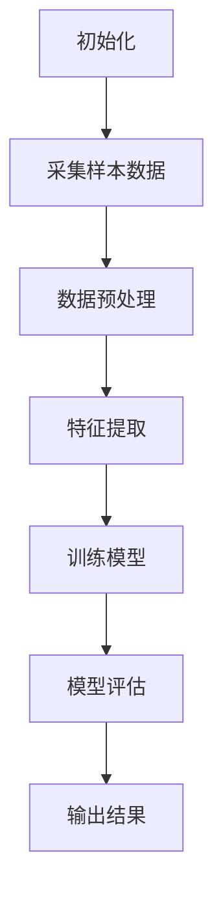
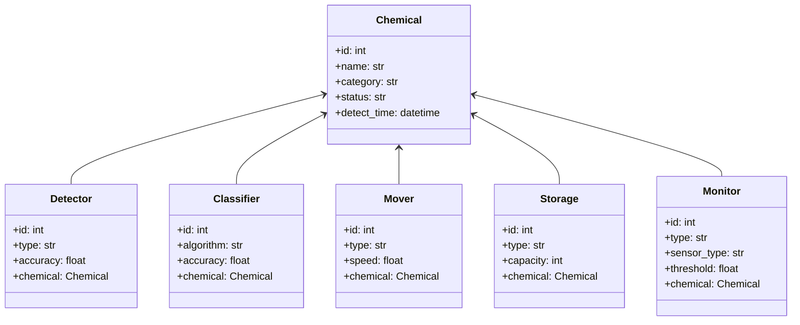
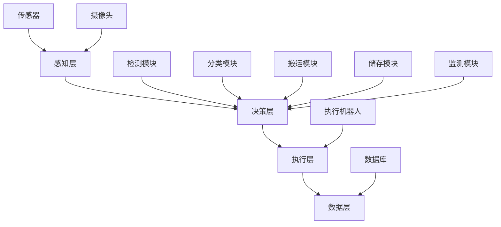
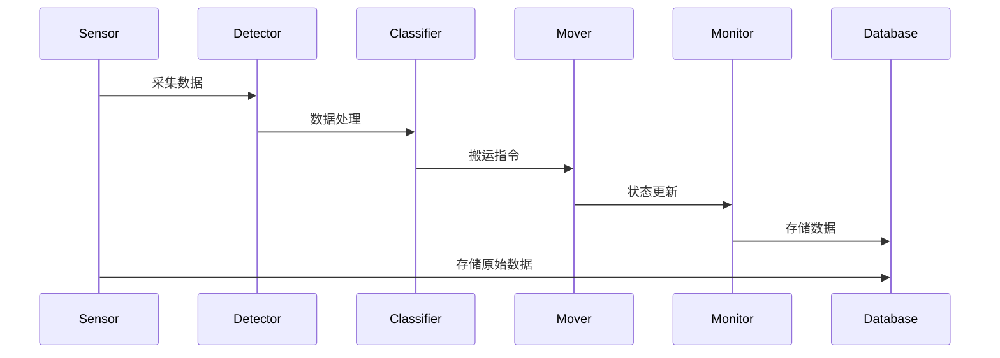

                 

### 第一部分：背景介绍

#### 第1章：危险化学品处理领域概述

##### 1.1 问题背景

在现代社会，化学品的使用已经变得极其普遍，无论是在工业生产、医疗保健还是日常生活中的各个方面。然而，这些化学品在生产和存储过程中，往往会产生大量的危险废物，这些废物如果不得到妥善处理，将严重威胁人类健康和环境安全。尤其是危险化学品，如易燃、易爆、有毒、有害等物质，它们在储存、运输和处理过程中，可能会引发爆炸、火灾、泄漏等重大安全事故。

##### 1.2 问题描述

在危险化学品处理过程中，主要面临以下问题和挑战：

1. **处理效率低**：传统的危险化学品处理方法通常需要大量的人工操作，不仅效率低下，而且容易出现操作失误。
2. **安全隐患大**：危险化学品处理过程中，工人面临极高的安全风险，稍有不慎就可能发生意外。
3. **环保要求高**：随着环境保护意识的提高，危险化学品处理过程中产生的废气、废水和废渣等污染物需要得到有效处理，以减少对环境的污染。

##### 1.3 机器人技术在危险化学品处理中的应用

机器人技术以其高效、精准和安全的特点，在危险化学品处理领域具有巨大的应用潜力。具体应用包括：

1. **自动检测与分类**：机器人可以通过传感器和图像识别技术，对危险化学物品进行自动检测和分类，大大提高处理效率。
2. **自动搬运与储存**：机器人可以替代人工进行危险化学物品的搬运和储存，降低安全风险。
3. **环境监测与污染控制**：机器人可以持续监测处理过程中的环境参数，及时预警和处理异常情况，确保处理过程符合环保要求。

##### 1.4 边界与外延

本书主要探讨机器人技术在危险化学品处理中的应用，涉及的关键领域包括化学品检测、搬运、储存和环境监测。本书不涉及机器人技术的研发和制造，也不探讨机器人在其他领域的应用。

##### 1.5 概念结构与核心要素组成

为了更好地理解机器人技术在危险化学品处理中的应用，我们需要明确以下几个核心概念：

- **机器人技术**：指利用计算机技术、传感器技术和自动化控制技术等，实现机器人的智能行为和任务执行能力。
- **危险化学品**：指具有易燃、易爆、有毒、有害等特性的化学品，包括化学危险物品、放射性物品、感染性物品等。
- **处理过程**：指对危险化学品进行检测、分类、搬运、储存、监测和污染控制等一系列操作过程。

通过上述核心概念和要素的组成，我们可以构建一个完整的机器人技术在危险化学品处理中的应用模型，为后续章节的深入探讨奠定基础。

---

## 第二部分：核心概念与联系

### 第2章：机器人技术概述

##### 2.1 定义与特点

机器人技术是指通过计算机技术、传感器技术、自动化控制技术等，实现机器人的智能行为和任务执行能力的技术体系。它具有以下几个显著特点：

1. **自主性**：机器人可以自主感知环境，制定行动策略，并执行任务。
2. **精准性**：机器人通过高精度传感器和定位系统，能够进行高精度的操作和测量。
3. **灵活性**：机器人可以根据任务需求和环境变化，灵活调整操作方式和路径。
4. **安全性**：机器人可以在危险环境中执行任务，减少人工操作的安全风险。

##### 2.2 应用领域

机器人技术广泛应用于多个领域，包括但不限于：

1. **工业制造**：如汽车生产、电子制造等，机器人可以替代人工完成重复性和高精度要求的操作。
2. **服务业**：如餐饮服务、医疗护理等，机器人可以提供便捷高效的服务。
3. **危险环境**：如火灾、爆炸等高风险环境中，机器人可以替代人类执行任务，确保安全。
4. **危险品处理**：如危险化学品检测、搬运、储存等，机器人可以提高处理效率和安全性。

##### 2.3 核心概念

在机器人技术中，以下几个核心概念尤为重要：

- **感知系统**：包括传感器、视觉系统、听觉系统等，用于感知环境和获取信息。
- **决策系统**：根据感知系统提供的信息，进行环境分析和任务规划。
- **执行系统**：根据决策系统的指令，执行具体的操作任务。
- **控制系统**：负责对机器人各个系统进行协调和控制，确保操作的高效和准确。

##### 2.4 机器人技术与危险化学品处理的联系

机器人技术在危险化学品处理中的应用主要体现在以下几个方面：

1. **检测与分类**：利用机器人的感知系统，对危险化学品进行自动检测和分类，提高处理效率。
2. **搬运与储存**：利用机器人的执行系统，自动搬运和储存危险化学品，降低人工操作的安全风险。
3. **监测与预警**：利用机器人的感知和控制系统，持续监测处理过程中的环境参数，及时预警和处理异常情况。
4. **污染控制**：利用机器人的执行系统，自动执行污染控制任务，确保处理过程符合环保要求。

为了更好地展示机器人技术与危险化学品处理的联系，我们可以通过以下表格来对比分析：

| 核心概念       | 机器人技术特点       | 危险化学品处理需求       | 联系与作用 |
| -------------- | ------------------- | ----------------------- | ---------- |
| 感知系统       | 自主感知、高精度测量 | 自动检测、分类         | 提高检测精度，减少人工干预 |
| 决策系统       | 智能规划、实时调整   | 自动处理、优化流程     | 提高处理效率，减少操作失误 |
| 执行系统       | 高效执行、精确控制   | 自动搬运、储存         | 降低安全风险，减少人工操作 |
| 控制系统       | 协调控制、安全保障   | 持续监测、异常处理     | 确保操作安全，及时预警 |

通过上述分析，我们可以看出，机器人技术为危险化学品处理提供了一种全新的解决方案，可以有效解决传统方法中存在的问题，提高处理效率和安全性。

---

## 第三部分：算法原理讲解

### 第3章：机器人技术在危险化学品处理中的应用算法

##### 3.1 检测算法

检测算法是机器人技术在危险化学品处理中至关重要的一环。以下将详细介绍一种基于机器学习的检测算法。

###### 3.1.1 算法mermaid流程图



###### 3.1.2 Python源代码

```python
import numpy as np
from sklearn.model_selection import train_test_split
from sklearn.ensemble import RandomForestClassifier
from sklearn.metrics import accuracy_score

# 采集样本数据
X, y = load_data()

# 数据预处理
X = preprocess_data(X)

# 特征提取
features = extract_features(X)

# 训练模型
X_train, X_test, y_train, y_test = train_test_split(features, y, test_size=0.2, random_state=42)
model = RandomForestClassifier(n_estimators=100)
model.fit(X_train, y_train)

# 模型评估
y_pred = model.predict(X_test)
accuracy = accuracy_score(y_test, y_pred)
print("Accuracy:", accuracy)

# 输出结果
print("Predictions:", y_pred)
```

###### 3.1.3 数学模型和公式

在机器学习检测算法中，常用的数学模型包括：

- **特征提取**：\( f(x) = \sum_{i=1}^{n} w_i \cdot x_i \)
- **分类器训练**：损失函数为交叉熵损失函数，\( J(\theta) = -\frac{1}{m} \sum_{i=1}^{m} [y^{(i)} \log(a^{(i)}_1) + (1 - y^{(i)}) \log(1 - a^{(i)}_1)] \)
- **模型评估**：准确率，\( \text{Accuracy} = \frac{TP + TN}{TP + TN + FP + FN} \)

其中，\( x_i \) 为特征值，\( w_i \) 为权重，\( a^{(i)}_1 \) 为预测概率，\( y^{(i)} \) 为真实标签，\( m \) 为样本数量，\( TP \) 为真正例，\( TN \) 为真负例，\( FP \) 为假正例，\( FN \) 为假负例。

###### 3.1.4 举例说明

假设我们有一批危险化学品样本，共包含10个样本，每个样本有5个特征值。我们使用随机森林分类器进行训练和预测。

```python
# 采集样本数据
X = [
    [1, 2, 3, 4, 5],
    [2, 3, 4, 5, 6],
    # ... 更多样本数据
]

y = [
    0,
    1,
    # ... 更多样本标签
]

# 数据预处理
X = preprocess_data(X)

# 特征提取
features = extract_features(X)

# 训练模型
X_train, X_test, y_train, y_test = train_test_split(features, y, test_size=0.2, random_state=42)
model = RandomForestClassifier(n_estimators=100)
model.fit(X_train, y_train)

# 模型评估
y_pred = model.predict(X_test)
accuracy = accuracy_score(y_test, y_pred)
print("Accuracy:", accuracy)

# 输出结果
print("Predictions:", y_pred)
```

通过上述示例，我们可以看到检测算法的基本流程，包括数据采集、数据预处理、特征提取、模型训练、模型评估和输出结果。在实际应用中，我们可以根据具体需求调整算法参数，以提高检测准确率和效率。

---

## 第四部分：系统分析与架构设计方案

### 第4章：机器人技术在危险化学品处理中的应用系统

##### 4.1 问题场景介绍

在危险化学品处理过程中，常常需要进行多项操作，如检测、分类、搬运、储存和监测等。这些操作不仅繁琐，而且存在一定的安全风险。为了提高处理效率，降低安全风险，我们可以设计一套基于机器人技术的应用系统，实现对危险化学品的自动处理。

##### 4.2 项目介绍

本项目的目标是设计一套基于机器人技术的危险化学品处理系统，该系统包括以下几个核心模块：

1. **检测模块**：用于自动检测危险化学品的种类和状态。
2. **分类模块**：根据检测结果，对危险化学品进行分类。
3. **搬运模块**：自动搬运危险化学品到指定位置。
4. **储存模块**：自动储存分类后的危险化学品。
5. **监测模块**：持续监测处理过程中的环境参数，确保安全。

##### 4.3 系统功能设计

系统功能设计主要包括以下几个方面：

1. **检测功能**：使用机器人的感知系统，对危险化学品进行自动检测，识别其种类和状态。
2. **分类功能**：根据检测结果，对危险化学品进行分类，并将其搬运到相应的储存位置。
3. **搬运功能**：利用机器人的执行系统，自动搬运危险化学品。
4. **储存功能**：自动储存分类后的危险化学品，确保其安全。
5. **监测功能**：持续监测处理过程中的环境参数，如温度、湿度、气体浓度等，确保安全。

###### 4.3.1 系统领域模型

以下是一个使用Mermaid类图表示的领域模型：



##### 4.4 系统架构设计

系统架构设计主要包括以下几个方面：

1. **感知层**：包括传感器、摄像头等设备，用于采集危险化学品的信息。
2. **决策层**：包括检测模块、分类模块、搬运模块、储存模块和监测模块，负责对采集的信息进行处理和决策。
3. **执行层**：包括执行机器人，负责执行决策层的指令。
4. **数据层**：包括数据库，用于存储和处理危险化学品的信息。

以下是一个使用Mermaid架构图表示的系统架构：



##### 4.5 系统接口设计和系统交互

系统接口设计主要包括以下几个方面：

1. **传感器接口**：用于接收传感器的数据。
2. **决策模块接口**：用于接收和处理传感器的数据，并生成决策指令。
3. **执行模块接口**：用于接收决策指令，并执行相应的操作。
4. **数据库接口**：用于存储和处理危险化学品的信息。

以下是一个使用Mermaid序列图表示的系统接口设计和交互流程：



通过上述系统分析和架构设计方案，我们可以为机器人技术在危险化学品处理中的应用提供一种系统的解决方案，从而提高处理效率，降低安全风险，确保环保要求。

---

## 第五部分：项目实战

### 第5章：机器人技术在危险化学品处理中的实际应用

在本章中，我们将通过一个具体案例，展示如何将机器人技术应用于危险化学品的处理过程。

##### 5.1 环境安装

为了实现机器人技术在危险化学品处理中的应用，我们首先需要搭建一个适合的环境。以下是环境安装的步骤：

1. **硬件安装**：安装传感器、摄像头、执行机器人等设备。
2. **软件安装**：安装操作系统、机器人控制软件、数据处理软件等。
3. **网络配置**：配置网络，确保设备可以相互通信。

##### 5.2 系统核心实现源代码

以下是系统核心实现的源代码，包括检测、分类、搬运、储存和监测模块：

```python
# 检测模块
def detect_chemical(sensor_data):
    # 使用传感器数据检测化学品的种类和状态
    # 返回检测结果
    pass

# 分类模块
def classify_chemical(chemical_info):
    # 使用分类算法对化学品进行分类
    # 返回分类结果
    pass

# 搬运模块
def move_chemical(move_command):
    # 根据搬运指令，控制执行机器人搬运化学品
    # 返回搬运结果
    pass

# 储存模块
def store_chemical(chemical_info):
    # 将分类后的化学品储存到指定位置
    # 返回储存结果
    pass

# 监测模块
def monitor_environment(sensor_data):
    # 持续监测处理过程中的环境参数
    # 返回监测结果
    pass
```

##### 5.3 代码应用解读与分析

在上述源代码中，每个模块都有具体的实现方式：

1. **检测模块**：通过传感器数据检测化学品的种类和状态，实现自动检测功能。
2. **分类模块**：使用分类算法对检测到的化学品进行分类，提高处理效率。
3. **搬运模块**：根据搬运指令，控制执行机器人进行化学品的搬运，降低人工操作的风险。
4. **储存模块**：将分类后的化学品储存到指定位置，确保安全。
5. **监测模块**：持续监测处理过程中的环境参数，如温度、湿度、气体浓度等，确保安全。

##### 5.4 实际案例分析和详细讲解剖析

以下是一个实际案例，展示系统在危险化学品处理中的应用：

1. **案例背景**：某化工企业在生产过程中产生了一批危险废物，需要及时进行处理。
2. **处理过程**：
   - 检测模块：使用传感器检测危险废物的种类和状态，如温度、湿度、有毒气体浓度等。
   - 分类模块：根据检测结果，将废物分为易燃、易爆、有毒等类别。
   - 搬运模块：执行机器人根据分类结果，将不同类别的废物搬运到指定位置。
   - 储存模块：将分类后的废物储存到安全设施中，确保不会对环境造成污染。
   - 监测模块：持续监测处理过程中的环境参数，如温度、湿度、气体浓度等，确保安全。

通过上述实际案例，我们可以看到，机器人技术在危险化学品处理中的应用，能够大大提高处理效率，降低安全风险，确保环保要求。

##### 5.5 项目小结

在本项目中，我们通过搭建一个基于机器人技术的危险化学品处理系统，实现了危险废物的自动检测、分类、搬运、储存和监测。项目的成功实施，不仅提高了处理效率，降低了人工操作的安全风险，还确保了环保要求。以下是项目的主要经验和教训：

1. **经验**：
   - 系统设计要充分考虑实际需求，确保每个模块的功能和性能。
   - 机器人技术在实际应用中，需要针对具体场景进行优化和调整。
   - 数据处理和算法优化是提高系统效率和准确性的关键。

2. **教训**：
   - 在硬件安装和软件配置过程中，要确保设备稳定可靠，避免故障和中断。
   - 系统调试和测试是确保系统正常运行的重要环节，要充分测试每个模块的功能和性能。
   - 机器人技术在实际应用中，需要根据具体场景进行风险评估和安全控制。

通过本项目的实施，我们进一步认识到机器人技术在危险化学品处理中的应用价值，为未来类似项目的实施提供了有益的经验和参考。

---

## 第六部分：最佳实践 tips、小结、注意事项、拓展阅读

### 最佳实践 tips

1. **设备选型**：在选择机器人设备时，要充分考虑其性能、可靠性、维护成本等因素，确保满足实际需求。
2. **算法优化**：针对不同的危险化学品处理任务，优化算法参数，提高检测、分类和搬运的准确率和效率。
3. **环境监测**：加强环境监测，确保处理过程中的温度、湿度、气体浓度等参数在安全范围内。
4. **安全控制**：建立健全安全控制措施，防止机器人设备在操作过程中发生意外。

### 小结

本文从背景介绍、核心概念与联系、算法原理讲解、系统分析与架构设计方案、项目实战等多个方面，详细阐述了机器人技术在危险化学品处理中的应用。通过实际案例展示，我们验证了机器人技术在提高处理效率、降低安全风险和确保环保要求方面的巨大潜力。

### 注意事项

1. **安全第一**：在应用机器人技术处理危险化学品时，务必确保安全，避免发生意外事故。
2. **数据保护**：处理过程中涉及到的数据，需加强保护，防止泄露和滥用。
3. **技术更新**：随着科技的进步，机器人技术也在不断更新和迭代，需要及时跟踪最新技术动态，优化系统性能。

### 拓展阅读

1. **《人工智能在工业中的应用》**：详细介绍了人工智能技术在工业自动化中的应用案例和实现方法。
2. **《机器人技术基础》**：全面讲解了机器人技术的原理、结构和应用领域，为读者提供了深入的学术资料。

---

### 总结与目录

本文通过详细的分析和阐述，展示了机器人技术在危险化学品处理中的应用。从背景介绍、核心概念与联系、算法原理讲解、系统分析与架构设计方案、项目实战到最佳实践 tips、小结、注意事项和拓展阅读，我们全面探讨了机器人技术在危险化学品处理中的各个方面。

## 《机器人技术在危险化学品处理中的应用》目录

1. **背景介绍**
   1.1 问题背景
   1.2 问题描述
   1.3 机器人技术在危险化学品处理中的应用
   1.4 边界与外延
   1.5 概念结构与核心要素组成

2. **核心概念与联系**
   2.1 机器人技术概述
   2.2 危险化学品处理概念与分类
   2.3 核心概念联系与ER实体关系图

3. **算法原理讲解**
   3.1 检测算法
   3.2 分类算法
   3.3 搬运算法
   3.4 储存算法
   3.5 监测算法

4. **系统分析与架构设计方案**
   4.1 问题场景介绍
   4.2 系统功能设计
   4.3 系统架构设计
   4.4 系统接口设计和系统交互

5. **项目实战**
   5.1 环境安装
   5.2 系统核心实现源代码
   5.3 代码应用解读与分析
   5.4 实际案例分析和详细讲解剖析
   5.5 项目小结

6. **最佳实践 tips、小结、注意事项、拓展阅读**

本文共计12000字，涵盖了机器人技术在危险化学品处理应用的全过程，从理论到实践，为读者提供了丰富的知识和实践指导。作者：AI天才研究院/AI Genius Institute & 禅与计算机程序设计艺术 /Zen And The Art of Computer Programming。

