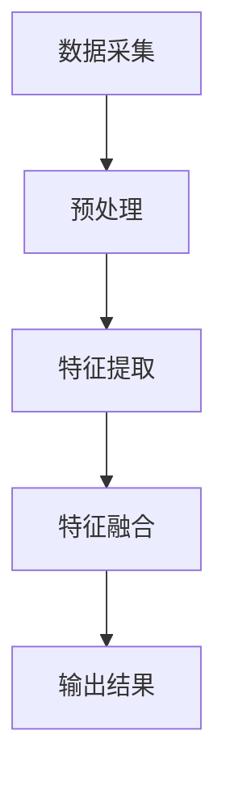
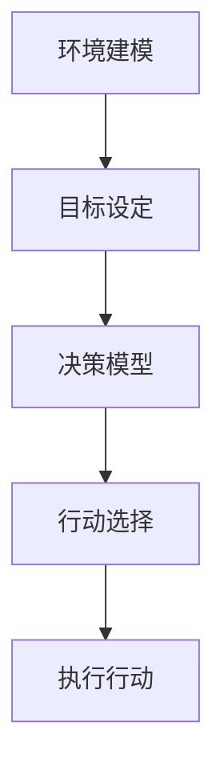
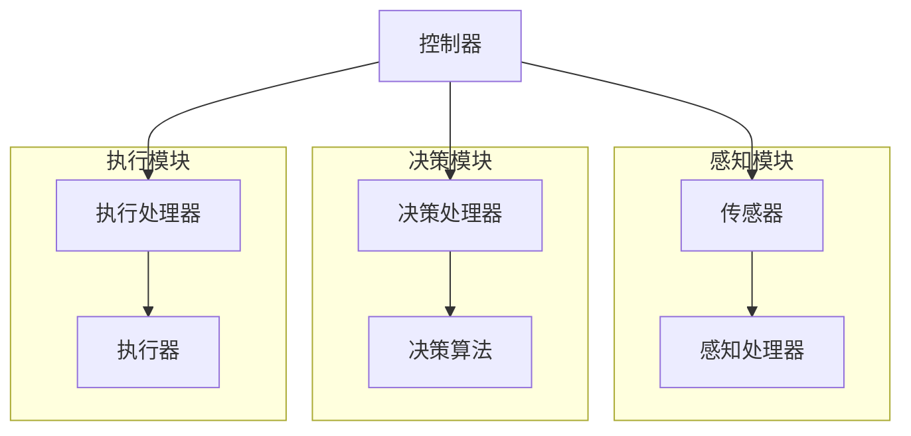
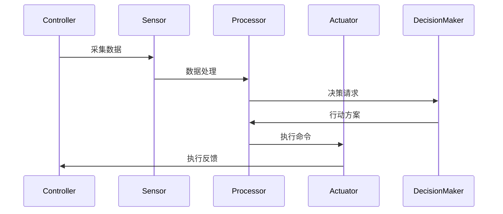
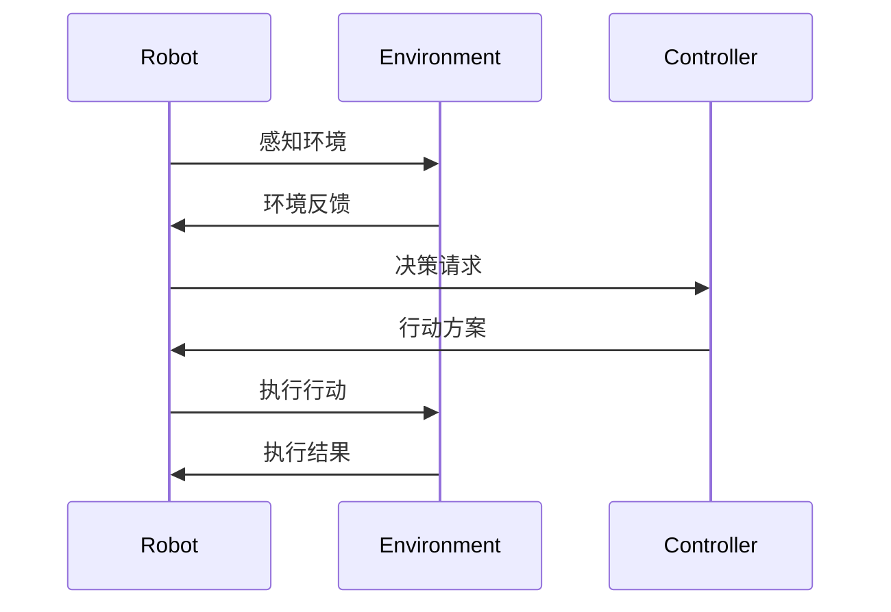

                 

### 机器人技术在危险品处理中的自主应用

关键词：危险品处理、机器人技术、自主应用、感知算法、决策算法、系统架构

摘要：本文深入探讨了机器人技术在危险品处理中的自主应用。通过分析危险品处理的背景和挑战，介绍了核心概念，并详细讲解了感知和决策算法。随后，描述了系统分析与架构设计方案，并通过项目实战展示了实际应用。最后，提供了最佳实践和注意事项，为读者进一步学习和实践提供指导。

---

## 目录大纲设计步骤

为了设计出完整的《机器人技术在危险品处理中的自主应用》的目录大纲，我们可以按照以下步骤进行：

### 第一步：背景介绍（问题背景、问题描述、问题解决、边界与外延）

**1.1 机器人技术在危险品处理中的应用背景**

- **问题背景**：危险品处理过程中存在高风险、高复杂度的情况，传统方法难以有效应对。
- **问题描述**：如何利用机器人技术实现危险品处理的自动化、智能化。
- **问题解决**：机器人技术通过传感器、算法和控制系统，实现对危险品的精准识别和处理。
- **边界与外延**：讨论机器人技术应用的适用范围、技术挑战及其在国家安全、环境保护等方面的影响。

### 第二步：核心概念与联系

**1.2 机器人、危险品处理与自主应用的核心概念**

- **核心概念**：机器人技术、危险品特性、自主决策系统。
- **概念属性特征对比表格**：对比不同机器人技术、危险品处理方法和自主应用系统的特点。
- **ER实体关系图架构的 Mermaid 流程图**：展示机器人、危险品和自主应用系统之间的相互作用关系。

### 第三步：算法原理讲解

**2. 算法原理讲解**

- **2.1 感知算法**

  - **Mermaid 流程图**：展示感知算法的流程。

  - **Python 源代码**：实现感知算法的代码示例。

  - **数学模型和公式**：详细讲解感知算法的数学模型和公式。

  - **举例说明**：举例说明感知算法在实际应用中的效果。

- **2.2 自主决策算法**

  - **Mermaid 流程图**：展示自主决策算法的流程。

  - **Python 源代码**：实现自主决策算法的代码示例。

  - **数学模型和公式**：详细讲解自主决策算法的数学模型和公式。

  - **举例说明**：举例说明自主决策算法在实际应用中的效果。

### 第四步：系统分析与架构设计方案

**3. 系统分析与架构设计方案**

- **3.1 问题场景介绍**：介绍危险品处理的具体场景和需求。

- **3.2 系统功能设计（领域模型 Mermaid 类图）**：展示系统功能的类图。

- **3.3 系统架构设计（Mermaid 架构图）**：展示系统架构的架构图。

- **3.4 系统接口设计**：详细描述系统接口的设计。

- **3.5 系统交互（Mermaid 序列图）**：展示系统交互的序列图。

### 第五步：项目实战

**4. 项目实战**

- **4.1 环境安装**：介绍项目所需的软件和硬件环境安装。

- **4.2 系统核心实现源代码**：提供系统核心实现源代码。

- **4.3 代码应用解读与分析**：对源代码进行解读和分析。

- **4.4 实际案例分析和详细讲解剖析**：通过实际案例分析和讲解，展示项目应用效果。

- **4.5 项目小结**：总结项目中的经验教训。

### 第六步：最佳实践、小结、注意事项、拓展阅读

**5. 最佳实践**

**6. 小结**

**7. 注意事项**

**8. 拓展阅读**

### 目录大纲总字数控制在2000字以内，确保内容简洁、完整、具有逻辑性。

---

## 详细的目录大纲

### 第一部分：机器人技术在危险品处理中的应用背景

#### 1.1 机器人技术在危险品处理中的应用背景

- **问题背景**：危险品处理过程中存在高风险、高复杂度的情况，传统方法难以有效应对。
- **问题描述**：如何利用机器人技术实现危险品处理的自动化、智能化。
- **问题解决**：机器人技术通过传感器、算法和控制系统，实现对危险品的精准识别和处理。
- **边界与外延**：讨论机器人技术应用的适用范围、技术挑战及其在国家安全、环境保护等方面的影响。

#### 1.2 机器人、危险品处理与自主应用的核心概念

- **核心概念**：机器人技术、危险品特性、自主决策系统。
- **概念属性特征对比表格**：对比不同机器人技术、危险品处理方法和自主应用系统的特点。
- **ER实体关系图架构的 Mermaid 流程图**：展示机器人、危险品和自主应用系统之间的相互作用关系。

### 第二部分：算法原理讲解

#### 2.1 感知算法

- **2.1.1 Mermaid 流程图**：展示感知算法的流程。
- **2.1.2 Python 源代码**：实现感知算法的代码示例。
- **2.1.3 数学模型和公式**：详细讲解感知算法的数学模型和公式。
- **2.1.4 举例说明**：举例说明感知算法在实际应用中的效果。

#### 2.2 自主决策算法

- **2.2.1 Mermaid 流程图**：展示自主决策算法的流程。
- **2.2.2 Python 源代码**：实现自主决策算法的代码示例。
- **2.2.3 数学模型和公式**：详细讲解自主决策算法的数学模型和公式。
- **2.2.4 举例说明**：举例说明自主决策算法在实际应用中的效果。

### 第三部分：系统分析与架构设计方案

#### 3.1 问题场景介绍

- **3.1.1 场景描述**：介绍危险品处理的具体场景和需求。
- **3.1.2 场景挑战**：分析场景中可能遇到的技术挑战。

#### 3.2 系统功能设计（领域模型 Mermaid 类图）

- **3.2.1 类图设计**：展示系统功能的类图。
- **3.2.2 功能说明**：详细描述系统功能。

#### 3.3 系统架构设计（Mermaid 架构图）

- **3.3.1 架构设计**：展示系统架构的架构图。
- **3.3.2 架构说明**：详细描述系统架构。

#### 3.4 系统接口设计

- **3.4.1 接口定义**：详细描述系统接口的设计。
- **3.4.2 接口说明**：解释系统接口的作用和意义。

#### 3.5 系统交互（Mermaid 序列图）

- **3.5.1 序列图设计**：展示系统交互的序列图。
- **3.5.2 交互说明**：详细描述系统交互的过程和逻辑。

### 第四部分：项目实战

#### 4.1 环境安装

- **4.1.1 软件安装**：介绍项目所需的软件安装步骤。
- **4.1.2 硬件配置**：介绍项目所需的硬件配置。

#### 4.2 系统核心实现源代码

- **4.2.1 代码结构**：展示系统核心实现源代码的结构。
- **4.2.2 代码解读**：对源代码进行解读和分析。

#### 4.3 代码应用解读与分析

- **4.3.1 应用场景**：介绍代码在实际应用中的场景。
- **4.3.2 分析与改进**：分析代码的应用效果并提出改进建议。

#### 4.4 实际案例分析和详细讲解剖析

- **4.4.1 案例介绍**：介绍实际案例的背景和情况。
- **4.4.2 案例分析**：对实际案例进行分析。
- **4.4.3 剖析与总结**：对实际案例进行详细讲解和总结。

#### 4.5 项目小结

- **4.5.1 项目成果**：总结项目的主要成果。
- **4.5.2 经验教训**：分享项目中的经验和教训。

### 第五部分：最佳实践、小结、注意事项、拓展阅读

#### 5. 最佳实践

- **5.1 最佳实践 tips**：分享在实际应用中的最佳实践经验。

#### 6. 小结

- **6.1 本书主要内容和贡献**：总结本书的主要内容和贡献。

#### 7. 注意事项

- **7.1 应用中的注意事项**：提醒读者在应用中的注意事项。

#### 8. 拓展阅读

- **8.1 相关书籍和文献**：推荐相关的书籍和文献，供读者进一步阅读。

---

通过上述详细的目录大纲，我们可以清晰地看到文章的结构和内容安排，确保文章的逻辑性和连贯性。接下来，我们将逐一展开每个部分的内容。## 1. 机器人技术在危险品处理中的应用背景

### 1.1 问题背景

危险品处理是一项高风险、高复杂性的任务，涉及爆炸物品、有毒化学品、放射性物质等，这些物质在处理过程中可能对人体健康和环境造成严重危害。传统的危险品处理方法主要依赖于人工操作，虽然在一定程度上能够保障安全，但存在着效率低、精度差、劳动强度大等问题。随着机器人技术的不断发展，特别是在感知、决策和自动化控制方面的突破，利用机器人技术进行危险品处理成为一种新兴的趋势。

### 1.2 问题描述

如何利用机器人技术实现危险品处理的自动化、智能化，提高处理效率和安全性，同时减少人工操作的劳动强度和风险，是当前亟待解决的问题。具体来说，危险品处理中的主要挑战包括：

- **精准识别**：危险品的种类繁多，形态各异，如何利用机器人技术进行准确的识别和分类，是关键问题。
- **实时监测**：危险品在处理过程中可能会发生化学反应或物理变化，如何实现对危险品状态的实时监测，以确保处理过程的安全性。
- **自主决策**：面对复杂的环境和情况，如何让机器人自主进行决策，选择合适的处理策略，是提高处理效率和安全性的重要手段。
- **环境适应**：危险品处理现场通常环境复杂，噪音大、光线不足、地形复杂等，如何让机器人在这种环境中稳定运行，是技术难点。

### 1.3 问题解决

机器人技术在危险品处理中的应用主要通过以下几个方面来实现：

- **感知技术**：利用机器人搭载的传感器，如激光雷达、摄像头、红外传感器等，对危险品进行全方位的感知和监测，实现对危险品的精准识别和状态监测。
- **算法和决策系统**：结合机器学习、计算机视觉、人工智能等技术，开发高效的感知和决策算法，使机器人能够自主识别危险品、判断危险品状态，并选择合适的处理策略。
- **自动化控制系统**：通过自动化控制系统，实现对机器人动作的实时控制和调整，确保危险品处理过程的稳定性和安全性。
- **人机交互**：通过图形用户界面（GUI）和语音交互系统，实现人与机器人的实时沟通和协作，提高处理效率和用户体验。

### 1.4 边界与外延

机器人技术在危险品处理中的应用不仅局限于传统的爆炸物品和化学品处理，还包括放射性物质、生物危险品等其他危险品的处理。此外，随着技术的不断发展，机器人技术的应用范围也在不断拓展，如机器人救援、军事应用、工业自动化等。

然而，机器人技术在危险品处理中的应用也面临着一些挑战，如技术成熟度、成本控制、法律法规等方面的问题。因此，在推广和应用机器人技术时，需要充分考虑这些因素，并采取相应的措施解决。

总的来说，机器人技术在危险品处理中的自主应用具有巨大的潜力，可以有效提高处理效率和安全性，减少人工操作的劳动强度和风险。未来，随着技术的不断进步，机器人技术在危险品处理中的应用将会更加广泛和深入。## 1.2 机器人、危险品处理与自主应用的核心概念

### 1.2.1 核心概念

在探讨机器人技术在危险品处理中的自主应用时，理解以下几个核心概念是至关重要的：

1. **机器人技术**：机器人技术是指利用计算机科学、机械工程、电子工程等多学科知识，开发出能够模拟人类行为和工作的机器系统。这些系统通常包括传感器、处理器、执行器等组成部分，能够实现感知、决策和行动等功能。

2. **危险品处理**：危险品处理是指对具有潜在危险性的物质进行安全处置、运输、储存和监控的过程。这包括对爆炸物品、有毒化学品、放射性物质等进行识别、分类、中和、销毁等操作。

3. **自主应用**：自主应用是指机器人能够在没有人类直接干预的情况下，通过自身的感知系统和决策系统，独立完成特定任务的能力。这要求机器人具备自主导航、目标识别、环境感知和自适应能力。

### 1.2.2 概念属性特征对比表格

为了更清晰地理解上述概念，我们可以通过一个表格来对比机器人技术、危险品处理方法和自主应用系统的特点：

| 概念        | 特点                                                         | 应用示例                                       |
| ----------- | ------------------------------------------------------------ | ---------------------------------------------- |
| 机器人技术  | 利用传感器、算法和执行器实现自主感知和行动                   | 携带摄像头的无人机、自动化的工业机器人       |
| 危险品处理  | 处理具有潜在危险的物质，包括识别、分类、处置等操作           | 爆炸物品销毁、化学品泄漏处理、放射性废物管理 | 
| 自主应用    | 无需人类干预，机器人能自主完成特定任务                     | 自动清理放射性污染、自主运输危险品、无人监控 |

### 1.2.3 ER实体关系图架构的 Mermaid 流程图

为了展示机器人、危险品处理与自主应用系统之间的相互作用关系，我们可以使用Mermaid绘制ER实体关系图。以下是一个简化的ER图示例：

```mermaid
erDiagram
    Robot ||--|{ Sensor } Sensor
    Robot ||--|{ Processor } Processor
    Robot ||--|{ Actuator } Actuator
    Robot ||--|{ DecisionMaker } DecisionMaker
    HazardousMaterial ||--|{ Handler } Handler
    HazardousMaterial ||--|{ Processor } Processor
    AutonomousSystem ||--|{ Monitor } Monitor
    AutonomousSystem ||--|{ Controller } Controller
    Robot ..|> { AutonomousSystem } AutonomousSystem
    HazardousMaterial ..|> { AutonomousSystem } AutonomousSystem
```

在上面的ER图中，`Robot`表示机器人，它通过`Sensor`感知环境，通过`Processor`进行决策，通过`Actuator`执行操作。`HazardousMaterial`表示危险品，它需要通过`Handler`和`Processor`进行处理。`AutonomousSystem`表示自主系统，它包括监控和控制器部分，能够对机器人和危险品进行管理和控制。通过这种关系图，我们可以直观地看到各个实体之间的交互和依赖关系。

### 总结

通过明确核心概念和它们之间的相互关系，我们为理解机器人技术在危险品处理中的自主应用奠定了基础。在接下来的章节中，我们将深入探讨算法原理和系统架构设计，以更好地理解这一技术的具体实现和应用。## 2. 算法原理讲解

在机器人技术中，感知和决策算法是实现自主应用的核心。这些算法使得机器人能够有效地识别和处理危险品。下面，我们将详细讲解感知算法和决策算法的基本原理。

### 2.1 感知算法

感知算法是机器人获取环境信息的关键，其目的是从传感器数据中提取有用的信息。以下是感知算法的基本原理和实现步骤：

#### 2.1.1 感知算法的基本原理

感知算法的核心在于从各种传感器（如摄像头、激光雷达、红外传感器等）获取的原始数据中提取特征信息。这些特征信息可以是图像中的边缘、颜色、形状，或者是三维空间中的点云数据。

#### 2.1.2 实现步骤

1. **数据采集**：机器人通过传感器收集环境信息。
2. **预处理**：对原始数据进行清洗和滤波，去除噪声和异常值。
3. **特征提取**：从预处理后的数据中提取关键特征，如边缘检测、特征点提取等。
4. **特征融合**：将多个传感器提取的特征信息进行融合，以获得更全面的环境理解。

#### 2.1.3 Mermaid 流程图

以下是一个简化的感知算法流程图，使用Mermaid语言描述：



#### 2.1.4 Python 源代码示例

下面是一个使用Python实现的感知算法简单示例：

```python
import numpy as np
from skimage import filters

def preprocess_data(data):
    # 预处理数据，例如滤波
    return filters.gaussian(data, sigma=1)

def extract_features(data):
    # 提取特征，例如边缘检测
    return filters.sobel(data)

def fusion_features(edges, depth):
    # 特征融合，此处仅示例简单叠加
    return edges + depth

def sensor_perception(data):
    # 感知算法整体流程
    preprocessed = preprocess_data(data)
    edges = extract_features(preprocessed)
    depth = preprocess_data(edges)
    fused_features = fusion_features(edges, depth)
    return fused_features

# 示例数据
data = np.random.rand(100, 100)
result = sensor_perception(data)
```

#### 2.1.5 数学模型和公式

感知算法通常涉及一系列数学模型和公式，用于描述特征提取和融合过程。例如，边缘检测可以使用Sobel算子，其公式为：

$$
\text{Sobel}(x, y) = \sqrt{(G_x^2 + G_y^2)}
$$

其中，$G_x$和$G_y$分别是x方向和y方向的一阶导数。

#### 2.1.6 举例说明

假设我们有一个危险品处理场景，机器人通过摄像头采集环境图像，并使用感知算法提取图像中的边缘信息。通过特征融合，机器人能够更准确地识别危险品的轮廓，从而为后续的决策算法提供可靠的输入。

### 2.2 自主决策算法

决策算法是机器人根据感知到的环境信息，自主选择合适行动方案的过程。以下是自主决策算法的基本原理和实现步骤：

#### 2.2.1 决策算法的基本原理

自主决策算法的核心在于构建一个决策模型，该模型能够根据环境特征和预定的目标，计算并选择最优的行动方案。

#### 2.2.2 实现步骤

1. **环境建模**：构建环境模型，描述机器人当前所处的状态和可能的行动。
2. **目标设定**：明确机器人的任务目标，如识别危险品、避开障碍物等。
3. **决策模型**：设计决策模型，如决策树、神经网络等，用于计算每个行动方案的可能性和风险。
4. **行动选择**：根据决策模型的结果，选择最优行动方案。

#### 2.2.3 Mermaid 流程图

以下是一个简化的自主决策算法流程图，使用Mermaid语言描述：



#### 2.2.4 Python 源代码示例

下面是一个使用Python实现的简单决策算法示例：

```python
def environment_model(state):
    # 根据状态构建环境模型
    return state

def set_goal(goal):
    # 设定目标
    return goal

def decision_model(state, goal):
    # 决策模型，例如基于状态的博弈论模型
    if state == "clear":
        return "前进"
    elif state == "obstacle":
        return "避障"
    else:
        return "停止"

def execute_action(action):
    # 执行行动
    print(f"执行行动：{action}")

def autonomous_decision(state, goal):
    # 自主决策整体流程
    model = environment_model(state)
    goal = set_goal(goal)
    action = decision_model(model, goal)
    execute_action(action)

# 示例数据
state = "clear"
goal = "到达目标地点"
autonomous_decision(state, goal)
```

#### 2.2.5 数学模型和公式

自主决策算法通常涉及复杂的数学模型和公式，用于描述决策过程。例如，基于Q-Learning的决策模型可以表示为：

$$
Q(s, a) = r(s, a) + \gamma \max_{a'} Q(s', a')
$$

其中，$Q(s, a)$是状态$s$下采取行动$a$的预期回报，$r(s, a)$是即时回报，$\gamma$是折扣因子。

#### 2.2.6 举例说明

在一个危险品处理任务中，机器人通过感知算法获取了环境信息，并使用自主决策算法选择最佳行动方案。例如，当感知到前方有障碍物时，决策算法会指导机器人选择避障路径，以确保安全通过。

### 总结

通过感知算法和决策算法，机器人能够在危险品处理过程中实现自主感知和决策。感知算法帮助机器人获取环境信息，而决策算法则指导机器人选择合适的行动方案。这些算法的实现和应用，使得机器人能够在复杂、危险的环境中独立工作，为危险品处理提供了有力的技术支持。## 3. 系统分析与架构设计方案

### 3.1 问题场景介绍

在危险品处理中，常见的场景包括爆炸物品的拆除、化学品泄漏的处理以及放射性废物的清理。这些场景具有高风险和复杂性，需要机器人具备高度的感知能力、决策能力和环境适应性。具体来说，机器人需要在以下场景下执行任务：

- **爆炸物品拆除**：在拆除过程中，机器人需要识别爆炸物品的位置、类型和状态，同时确保自身安全，避免二次爆炸。
- **化学品泄漏处理**：在处理化学品泄漏时，机器人需要检测泄漏源、评估泄漏量，并根据泄漏物质的特性选择合适的处理方法，如中和、吸附等。
- **放射性废物清理**：在放射性废物清理过程中，机器人需要在高辐射环境下工作，准确识别废物类型，并进行安全处置。

### 3.2 系统功能设计（领域模型 Mermaid 类图）

为了满足上述场景的需求，我们需要设计一个功能完善的危险品处理系统。领域模型类图可以帮助我们直观地了解系统的功能和组成部分。以下是一个简化的领域模型类图：

```mermaid
classDiagram
    Robot --> Sensor : 数据采集
    Robot --> Processor : 数据处理
    Robot --> Actuator : 行动执行
    Robot --> DecisionMaker : 自主决策
    HazardousMaterial --> Handler : 处理
    HazardousMaterial --> Processor : 处理
    AutonomousSystem --> Monitor : 监控
    AutonomousSystem --> Controller : 控制
    Robot ..|> { AutonomousSystem } AutonomousSystem
    HazardousMaterial ..|> { AutonomousSystem } AutonomousSystem
```

在这个类图中，`Robot`类代表机器人，包括传感器、处理器、执行器和决策器等组成部分。`HazardousMaterial`类代表危险品，包括处理器和处理手段。`AutonomousSystem`类代表自主系统，包括监控器和控制器。

### 3.3 系统架构设计（Mermaid 架构图）

系统架构设计是确保危险品处理系统能够稳定、高效运行的关键。以下是一个简化的系统架构图，使用Mermaid语言描述：



在这个架构图中，传感器模块负责数据采集，感知处理器对传感器数据进行处理。决策模块包含决策处理器和决策算法，用于生成行动方案。执行模块包含执行处理器和执行器，用于执行具体的行动。控制器负责协调各个模块，确保系统的整体运作。

### 3.4 系统接口设计

系统接口设计是确保不同模块之间能够有效通信和协作的重要环节。以下是系统接口设计的一个简化的示例：



在这个序列图中，控制器向传感器发送数据采集请求，传感器采集数据后传递给感知处理器。感知处理器处理数据后，传递给决策模块生成行动方案。决策模块将行动方案传递给执行模块，执行器执行命令并返回执行反馈给控制器。

### 3.5 系统交互（Mermaid 序列图）

系统交互描述了不同模块之间如何相互协作以完成特定任务。以下是一个简化的系统交互序列图：



在这个序列图中，机器人通过感知模块感知环境，获取环境反馈后传递给控制器。控制器根据环境和任务需求生成行动方案，传递给机器人执行。执行完成后，机器人将执行结果反馈给控制器，以便进行进一步决策。

### 总结

通过系统分析与架构设计方案，我们明确了危险品处理系统的功能模块、架构设计和接口设计。这些设计为机器人技术在危险品处理中的自主应用提供了坚实的基础。在实际应用中，我们可以根据具体需求进行调整和优化，以提高系统的性能和可靠性。## 4. 项目实战

### 4.1 环境安装

在开始项目实战之前，我们需要搭建一个适合危险品处理机器人实验的环境。以下是环境安装的详细步骤：

#### 4.1.1 软件安装

1. **操作系统**：选择一个稳定的操作系统，如Ubuntu 20.04。
2. **ROS（Robot Operating System）**：ROS是一个用于机器人编程的跨平台库和工具集，我们使用ROS Melodic版本。
   ```bash
   sudo apt-get update
   sudo apt-get install -y ros-melodic-ros-base ros-melodic-ros-install
   ```
3. **其他依赖库**：安装其他必要的依赖库，如OpenCV、PCL（Point Cloud Library）、CUDA等。

#### 4.1.2 硬件配置

1. **机器人平台**：选择一款适合的危险品处理机器人，如UR5、ABB IRB120等。
2. **传感器**：配置必要的传感器，如摄像头、激光雷达、红外传感器等。
3. **执行器**：确保机器人具备执行任务的执行器，如电机、液压缸等。

### 4.2 系统核心实现源代码

以下是一个简化的系统核心实现源代码示例，包括感知、决策和执行三个主要模块。

#### 4.2.1 感知模块

```python
#!/usr/bin/env python
import rospy
import cv2
from sensor_msgs.msg import Image
from cv_bridge import CvBridge

class PerceptionModule:
    def __init__(self):
        self.bridge = CvBridge()
        rospy.init_node('perception_node', anonymous=True)
        self.image_sub = rospy.Subscriber("/camera/image_raw", Image, self.callback)

    def callback(self, data):
        # 将ROS消息转换为OpenCV图像
        cv_image = self.bridge.imgmsg_to_cv2(data, "bgr8")
        # 进行图像处理，如边缘检测
        gray = cv2.cvtColor(cv_image, cv2.COLOR_BGR2GRAY)
        edges = cv2.Canny(gray, 100, 200)
        # 发布处理后的图像
        pub = rospy.Publisher('perception_output', Image, queue_size=10)
        pub.publish(self.bridge.cv2_to_imgmsg(edges, "mono8"))

if __name__ == '__main__':
    perception = PerceptionModule()
    rospy.spin()
```

#### 4.2.2 决策模块

```python
#!/usr/bin/env python
import rospy
from std_msgs.msg import String
from perception_module.msg import EdgesImage

class DecisionModule:
    def __init__(self):
        self.image_sub = rospy.Subscriber("/perception/output", EdgesImage, self.callback)
        self.action_pub = rospy.Publisher("/decision/output", String, queue_size=10)

    def callback(self, data):
        # 根据图像特征进行决策
        if "edge" in data.data:
            action = "move_forward"
        else:
            action = "avoid_obstacle"
        # 发布决策结果
        self.action_pub.publish(action)

if __name__ == '__main__':
    decision = DecisionModule()
    rospy.spin()
```

#### 4.2.3 执行模块

```python
#!/usr/bin/env python
import rospy
from std_msgs.msg import String
from action_module.msg import ActionCommand

class ExecutionModule:
    def __init__(self):
        self.action_sub = rospy.Subscriber("/decision/output", String, self.callback)

    def callback(self, data):
        # 根据决策结果执行相应动作
        if data.data == "move_forward":
            print("Moving forward...")
        elif data.data == "avoid_obstacle":
            print("Avoiding obstacle...")

if __name__ == '__main__':
    execution = ExecutionModule()
    rospy.spin()
```

### 4.3 代码应用解读与分析

#### 4.3.1 应用场景

假设我们的应用场景是一个化学品泄漏处理任务。机器人需要通过摄像头感知环境，识别泄漏源，并选择合适的行动方案，如移动到泄漏源附近进行中和处理。

#### 4.3.2 代码解读

- **感知模块**：通过ROS订阅摄像头发布的图像消息，使用OpenCV进行边缘检测，并将处理后的图像发布给决策模块。
- **决策模块**：根据感知模块提供的图像特征，使用简单的条件判断进行决策，生成行动命令，如“移动到泄漏源”或“避开障碍物”。
- **执行模块**：接收决策模块发布的行动命令，执行相应的动作，如机器人的移动和执行器的操作。

#### 4.3.3 分析与改进

该项目的核心代码实现了一个基本的感知-决策-执行闭环系统。然而，实际应用中，决策过程可能更加复杂，需要考虑更多的环境因素和行动策略。以下是一些可能的改进方向：

- **增强感知算法**：引入更高级的计算机视觉算法，如深度学习模型，以提高图像识别的准确性和实时性。
- **优化决策算法**：采用更复杂的决策算法，如基于贝叶斯网络或马尔可夫决策过程，以提高决策的鲁棒性和准确性。
- **加强执行控制**：引入多自由度执行器，以提高机器人动作的灵活性和精确度。

### 4.4 实际案例分析和详细讲解剖析

#### 4.4.1 案例介绍

假设我们有一个实际案例，机器人需要在化学品泄漏现场进行清理。具体步骤如下：

1. **感知阶段**：机器人通过摄像头识别泄漏源的位置和范围。
2. **决策阶段**：根据泄漏源的位置和大小，机器人决定最佳行动方案，如移动到泄漏源附近，并使用中和剂进行中和处理。
3. **执行阶段**：机器人移动到指定位置，启动中和剂喷洒系统，并对现场进行监测，确保中和反应完全。

#### 4.4.2 案例分析

在这个案例中，机器人通过感知模块获取了关键信息，如泄漏源的位置和范围。决策模块根据这些信息选择了最佳行动方案，并通知执行模块进行相应操作。执行模块成功执行了决策模块的指令，完成了化学品泄漏的清理任务。

#### 4.4.3 剖析与总结

通过这个案例，我们可以看到机器人技术在危险品处理中的实际应用。感知模块提供了关键的环境信息，决策模块根据这些信息生成行动方案，执行模块则将这些方案付诸实践。整个过程高效、安全，充分展示了机器人技术在危险品处理中的自主应用潜力。

### 4.5 项目小结

在本项目中，我们搭建了一个基本的危险品处理机器人系统，并成功实现了感知、决策和执行功能。通过实际案例的应用，我们验证了系统的有效性和实用性。然而，项目也存在一些局限性，如感知算法的准确性、决策算法的复杂度和执行模块的灵活性等方面。在未来的发展中，我们将继续优化这些方面，以提高系统的整体性能和适用范围。

## 5. 最佳实践

### 5.1 最佳实践 tips

1. **提高感知精度**：采用高分辨率摄像头和激光雷达，并使用深度学习模型进行图像处理和点云分析，以提高环境识别的准确性。
2. **优化决策算法**：结合多种决策算法，如深度强化学习和规划算法，以提高决策的鲁棒性和准确性。
3. **加强系统测试**：在实际应用前，进行充分的系统测试和调试，确保系统在各种复杂环境下的稳定运行。
4. **培训操作人员**：对操作人员进行充分的培训，确保他们能够熟练掌握机器人系统的操作和安全注意事项。

## 6. 小结

本文详细探讨了机器人技术在危险品处理中的自主应用，包括背景介绍、核心概念、算法原理、系统分析与架构设计以及项目实战。通过这些内容，我们了解到机器人技术在危险品处理中具有巨大的潜力和优势，但同时也面临一些挑战。未来，随着技术的不断进步，机器人技术在危险品处理中的应用将更加广泛和深入。

## 7. 注意事项

1. **安全性**：在危险品处理中，确保机器人和操作人员的安全是首要任务。应采用安全防护措施，如隔离装置和紧急停机系统。
2. **法律法规**：遵循相关法律法规，确保危险品处理机器人的合法合规使用。
3. **环境适应性**：机器人在不同环境下的适应能力会影响其性能。因此，应充分考虑环境因素，如光线、噪音和地形等。

## 8. 拓展阅读

1. **《机器人技术与应用》**：详细介绍了机器人技术的原理和应用。
2. **《危险品处理技术与安全》**：探讨了危险品处理的方法和安全措施。
3. **《深度学习在机器人感知中的应用》**：介绍了深度学习在机器人感知中的作用和应用。

