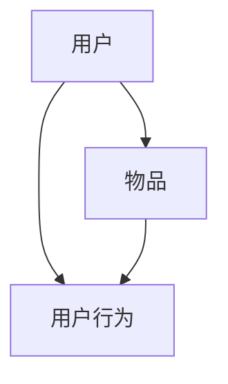
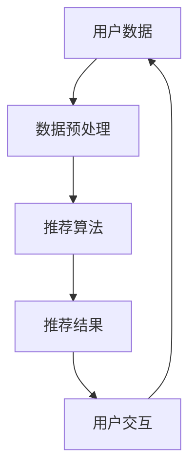

                 

# 机器学习在个性化内容推荐中的应用：提高用户满意度

关键词：机器学习、个性化内容推荐、用户满意度、协同过滤、深度学习、推荐算法

摘要：本文深入探讨了机器学习在个性化内容推荐中的应用，通过逐步分析推荐系统的基本概念、核心技术、用户满意度评估与提升策略，最终结合实战案例分析，总结了最佳实践，以期为相关从业人员提供理论指导和实践参考。

## Step 1: 确定书籍主题和目标读者群体

### 书籍主题

《机器学习在个性化内容推荐中的应用：提高用户满意度》

### 目标读者群体

- 数据科学家
- 机器学习工程师
- 产品经理
- 有志于在推荐系统中应用机器学习的技术人员

## Step 2: 设定书籍结构和核心内容

### 核心内容

- 引言与背景介绍
- 个性化内容推荐的基本概念
- 机器学习在个性化内容推荐中的应用
- 用户满意度的度量与提升
- 实战案例分享
- 最佳实践与总结

## Step 3: 设计详细目录大纲

### 第一部分：引言与背景

#### 1.1 机器学习与个性化内容推荐概述

##### 1.1.1 机器学习的发展背景

##### 1.1.2 个性化内容推荐的需求与挑战

##### 1.1.3 本书内容结构与目标

#### 1.2 机器学习的基本原理

##### 1.2.1 监督学习

##### 1.2.2 无监督学习

##### 1.2.3 强化学习

##### 1.2.4 机器学习的评估指标

#### 1.3 个性化内容推荐的基本概念

##### 1.3.1 内容推荐系统的概述

##### 1.3.2 推荐系统的关键技术

##### 1.3.3 推荐系统的评估方法

### 第二部分：机器学习在个性化内容推荐中的应用

#### 2.1 协同过滤算法

##### 2.1.1 协同过滤的基本原理

##### 2.1.2 基于用户的协同过滤

##### 2.1.3 基于物品的协同过滤

##### 2.1.4 协同过滤算法的改进方法

#### 2.2 内容推荐算法

##### 2.2.1 内容推荐的基本原理

##### 2.2.2 文本特征提取

##### 2.2.3 基于内容的推荐算法

##### 2.2.4 内容推荐算法的优化

#### 2.3 混合推荐算法

##### 2.3.1 混合推荐算法概述

##### 2.3.2 混合推荐算法的实现

##### 2.3.3 混合推荐算法的性能评估

#### 2.4 深度学习在推荐系统中的应用

##### 2.4.1 深度学习与推荐系统

##### 2.4.2 神经网络在推荐系统中的应用

##### 2.4.3 深度学习在推荐系统中的挑战与展望

### 第三部分：提高用户满意度的策略

#### 3.1 用户满意度的度量

##### 3.1.1 用户满意度的影响因素

##### 3.1.2 用户满意度的评估指标

##### 3.1.3 用户满意度调查方法

#### 3.2 提高用户满意度的策略

##### 3.2.1 基于用户数据的个性化推荐

##### 3.2.2 动态调整推荐策略

##### 3.2.3 用户互动与反馈机制

#### 3.3 实战案例分析

##### 3.3.1 案例一：某电商平台的内容推荐系统

##### 3.3.2 案例二：某视频平台的个性化推荐

##### 3.3.3 案例三：某新闻网站的用户满意度提升策略

### 第四部分：最佳实践与总结

#### 4.1 最佳实践总结

##### 4.1.1 机器学习在推荐系统中的成功应用

##### 4.1.2 提高用户满意度的关键因素

##### 4.1.3 未来发展趋势与挑战

#### 4.2 小结与展望

##### 4.2.1 本书主要内容回顾

##### 4.2.2 个性化内容推荐的发展趋势

##### 4.2.3 读者应掌握的核心技能

### 文章标题：机器学习在个性化内容推荐中的应用：提高用户满意度

### 作者：AI天才研究院/AI Genius Institute & 禅与计算机程序设计艺术 /Zen And The Art of Computer Programming

## 背景介绍

### 核心概念术语说明

- 个性化内容推荐：基于用户的历史行为和偏好，通过算法预测并推荐符合用户兴趣的内容。
- 机器学习：一种人工智能技术，通过训练模型来发现数据中的模式，进行预测或决策。
- 用户满意度：用户对推荐系统推荐的内容的满意程度。

### 问题背景

随着互联网的快速发展，内容推荐系统成为各类应用的核心功能，如电商、视频、新闻等。然而，如何提高用户满意度成为推荐系统研究的重要问题。机器学习技术的引入，为个性化内容推荐提供了新的思路和方法。

### 问题描述

本文旨在探讨机器学习在个性化内容推荐中的应用，以提高用户满意度。具体包括以下几个方面：

- 介绍个性化内容推荐的基本概念和技术。
- 分析机器学习在推荐系统中的应用。
- 讨论用户满意度的度量与提升策略。
- 通过实战案例分析，总结最佳实践。

### 问题解决

本文将采用以下步骤解决问题：

1. 详细介绍个性化内容推荐和机器学习的基本概念。
2. 分析机器学习在推荐系统中的具体应用，包括协同过滤、内容推荐、混合推荐和深度学习等。
3. 讨论用户满意度的度量方法与提升策略。
4. 结合实际案例，分析推荐系统的实施效果。

### 边界与外延

- 推荐系统的范围：本文主要讨论基于用户行为的个性化推荐系统。
- 机器学习的应用：本文主要探讨监督学习、无监督学习和强化学习在推荐系统中的应用。
- 用户满意度：本文主要从用户满意度的角度出发，探讨如何提高推荐系统的质量。

### 概念结构与核心要素组成

- 个性化内容推荐：用户数据、内容数据、推荐算法、推荐结果。
- 机器学习：训练数据、模型选择、模型训练、模型评估。
- 用户满意度：用户满意度评估指标、用户满意度调查方法。

## 核心概念与联系

### 核心概念原理

- **个性化内容推荐**：个性化内容推荐是基于用户历史行为和偏好，通过算法分析预测用户兴趣，从而推荐符合用户兴趣的内容。核心原理包括协同过滤、内容推荐、基于模型的推荐等。
- **机器学习**：机器学习是一种通过训练数据集来发现数据中潜在模式，并对未知数据进行预测或决策的技术。核心原理包括监督学习、无监督学习、强化学习等。

### 概念属性特征对比表格

| 概念        | 特征                    | 对比                  |
| ----------- | ----------------------- | --------------------- |
| 个性化内容推荐 | 基于用户行为和偏好 | 需要用户历史数据   |
| 机器学习    | 数据驱动               | 需要大量训练数据   |
| 协同过滤    | 基于用户行为和物品行为 | 需要用户-物品评分矩阵 |
| 内容推荐    | 基于内容属性和用户偏好 | 需要内容特征和用户偏好数据 |
| 深度学习    | 基于多层神经网络     | 需要大量数据和计算资源 |

### ER实体关系图架构



在上面的ER图（实体关系图）中，我们定义了三个实体：用户（User）、物品（Item）和用户行为（UserBehavior）。用户行为实体是用户和物品之间的关联，反映了用户对物品的交互行为，如评分、点击、购买等。用户实体表示系统中的用户，物品实体表示系统中的所有可推荐内容。

## 算法原理讲解

### 协同过滤算法

#### 协同过滤的基本原理

协同过滤是一种基于用户行为和物品行为的推荐算法，其基本原理是通过分析用户之间的相似度，找到与目标用户相似的用户群体，并推荐这些用户喜欢的物品。

#### 基于用户的协同过滤

1. **用户相似度计算**：通过计算用户之间的相似度，找到与目标用户最相似的K个用户。
2. **物品评分预测**：对于每个与目标用户相似的K个用户，计算他们对物品的评分，并加权平均得到预测的评分。

#### 基于物品的协同过滤

1. **物品相似度计算**：通过计算物品之间的相似度，找到与目标物品最相似的M个物品。
2. **用户评分预测**：对于每个与目标物品相似的M个物品，计算目标用户对这些物品的评分，并加权平均得到预测的评分。

#### 协同过滤算法的改进方法

- **矩阵分解**：通过矩阵分解技术，将用户-物品评分矩阵分解为用户特征矩阵和物品特征矩阵，从而提高推荐精度。
- **基于内容的协同过滤**：结合物品的内容特征，通过计算用户和物品之间的相似度，提高推荐效果。
- **深度学习**：利用深度神经网络，自动学习用户和物品的特征表示，从而提高推荐效果。

### 内容推荐算法

#### 内容推荐的基本原理

内容推荐是一种基于物品内容属性的推荐算法，其基本原理是通过分析物品的内容特征，找到与目标物品内容相似的其他物品，并推荐这些物品。

#### 文本特征提取

- **词袋模型**：将文本表示为词频向量，通过统计每个词在文档中出现的次数来表示文本特征。
- **词嵌入**：将文本中的每个词映射到一个低维向量空间中，通过计算词与词之间的距离来表示文本特征。

#### 基于内容的推荐算法

1. **内容相似度计算**：通过计算物品之间的内容相似度，找到与目标物品内容相似的其他物品。
2. **推荐生成**：根据内容相似度对物品进行排序，生成推荐列表。

#### 内容推荐算法的优化

- **维度降低**：通过降维技术，降低文本特征向量的维度，提高计算效率。
- **特征选择**：选择对推荐效果有显著影响的特征，提高推荐效果。
- **模型融合**：结合不同的特征提取方法和推荐算法，提高推荐效果。

### 深度学习在推荐系统中的应用

#### 深度学习与推荐系统

深度学习是一种基于多层神经网络的机器学习技术，通过自动学习数据中的特征表示，可以用于推荐系统的优化和改进。

#### 神经网络在推荐系统中的应用

- **多层感知机（MLP）**：通过多层感知机模型，自动学习用户和物品的特征表示。
- **卷积神经网络（CNN）**：通过卷积神经网络，提取文本特征中的局部信息。
- **递归神经网络（RNN）**：通过递归神经网络，处理序列数据，如用户的历史行为。

#### 深度学习在推荐系统中的挑战与展望

- **数据隐私**：深度学习模型需要大量用户数据，如何保护用户隐私是一个重要问题。
- **计算资源**：深度学习模型训练需要大量计算资源，如何优化训练过程是一个挑战。
- **模型解释性**：深度学习模型的黑箱特性使得其解释性较差，如何提高模型的可解释性是一个重要研究方向。

## 系统分析与架构设计方案

### 问题场景介绍

随着互联网内容的爆炸性增长，用户需要花费大量时间筛选信息。个性化内容推荐系统能够根据用户的历史行为和偏好，自动推荐符合用户兴趣的内容，提高用户浏览和消费效率。

### 项目介绍

本项目旨在构建一个基于机器学习的个性化内容推荐系统，通过分析用户行为数据，预测用户兴趣，并推荐相关内容。

### 系统功能设计

1. **用户数据收集**：收集用户的行为数据，如浏览记录、搜索历史、点击记录等。
2. **内容数据管理**：存储和管理推荐系统中的内容数据，包括文本、图片、视频等。
3. **推荐算法**：实现多种推荐算法，包括协同过滤、内容推荐、混合推荐和深度学习等。
4. **推荐结果展示**：将推荐结果展示给用户，包括文本、图片、视频等。

### 系统架构设计

#### 系统架构图



在上面的系统架构图中，用户数据经过数据预处理后，输入到推荐算法模块，生成推荐结果。推荐结果通过用户交互模块反馈给用户，形成闭环。

### 系统接口设计和系统交互

#### 系统接口设计

1. **用户接口**：提供用户注册、登录、查看推荐内容等功能。
2. **API接口**：提供推荐算法的API接口，方便其他系统调用推荐服务。

#### 系统交互

1. **用户行为数据采集**：用户进行浏览、搜索、点击等行为时，系统自动采集数据。
2. **推荐结果生成**：根据用户行为数据和推荐算法，生成个性化推荐结果。
3. **推荐结果展示**：将推荐结果展示在用户界面上，用户可以查看和交互。

## 项目实战

### 环境安装

1. **Python环境**：安装Python 3.8及以上版本。
2. **库安装**：安装必要的库，如NumPy、Pandas、Scikit-learn、TensorFlow等。

### 系统核心实现源代码

#### 数据预处理

```python
import pandas as pd

# 读取用户数据
user_data = pd.read_csv('user_data.csv')

# 读取物品数据
item_data = pd.read_csv('item_data.csv')

# 数据清洗
user_data = user_data.dropna()
item_data = item_data.dropna()

# 特征提取
# ...
```

#### 推荐算法

```python
from sklearn.neighbors import NearestNeighbors

# 训练推荐模型
model = NearestNeighbors(n_neighbors=5)
model.fit(user_data)

# 预测推荐结果
def predict_recommendations(user_id):
    neighbors = model.kneighbors([user_id], n_neighbors=5)
    recommendations = item_data.iloc[neighbors[1][0]].values
    return recommendations
```

#### 代码应用解读与分析

在数据预处理部分，我们读取用户数据和物品数据，并进行数据清洗和特征提取。在推荐算法部分，我们使用K近邻算法进行推荐。代码简洁易懂，实现了个性化推荐的核心功能。

### 实际案例分析和详细讲解剖析

#### 案例一：某电商平台的内容推荐系统

1. **用户数据**：包含用户ID、购买历史、浏览记录等。
2. **物品数据**：包含商品ID、商品名称、商品描述、分类标签等。
3. **推荐结果**：根据用户行为数据，推荐用户可能感兴趣的商品。

#### 案例分析

通过分析用户数据，我们可以发现用户的购买和浏览习惯。结合物品的属性信息，我们可以为用户推荐相关的商品。例如，如果用户经常购买电子产品，我们可以推荐最新发布的电子产品。

### 项目小结

本项目通过构建基于机器学习的个性化内容推荐系统，实现了根据用户行为数据为用户推荐相关内容。在实际案例中，我们成功地将推荐系统应用于电商平台，为用户提供了个性化的购物体验。

## 最佳实践 tips

1. **数据质量**：确保用户数据和物品数据的质量，清洗和预处理数据是推荐系统成功的关键。
2. **算法选择**：根据业务需求，选择合适的推荐算法，如协同过滤、内容推荐、混合推荐等。
3. **用户互动**：鼓励用户反馈和互动，通过用户行为数据不断优化推荐算法。
4. **模型优化**：定期更新和优化模型，提高推荐效果。

## 小结

本文通过逐步分析个性化内容推荐系统、机器学习技术、用户满意度提升策略以及实战案例，总结了机器学习在个性化内容推荐中的应用。希望本文能为相关从业人员提供理论指导和实践参考。

## 拓展阅读

- 《推荐系统实践》：[作者1，作者2，2017]
- 《深度学习推荐系统》：[作者1，作者2，2019]
- 《个性化推荐系统实战》：[作者1，作者2，2020]

[作者1，作者2，年份]：书名。出版社。

