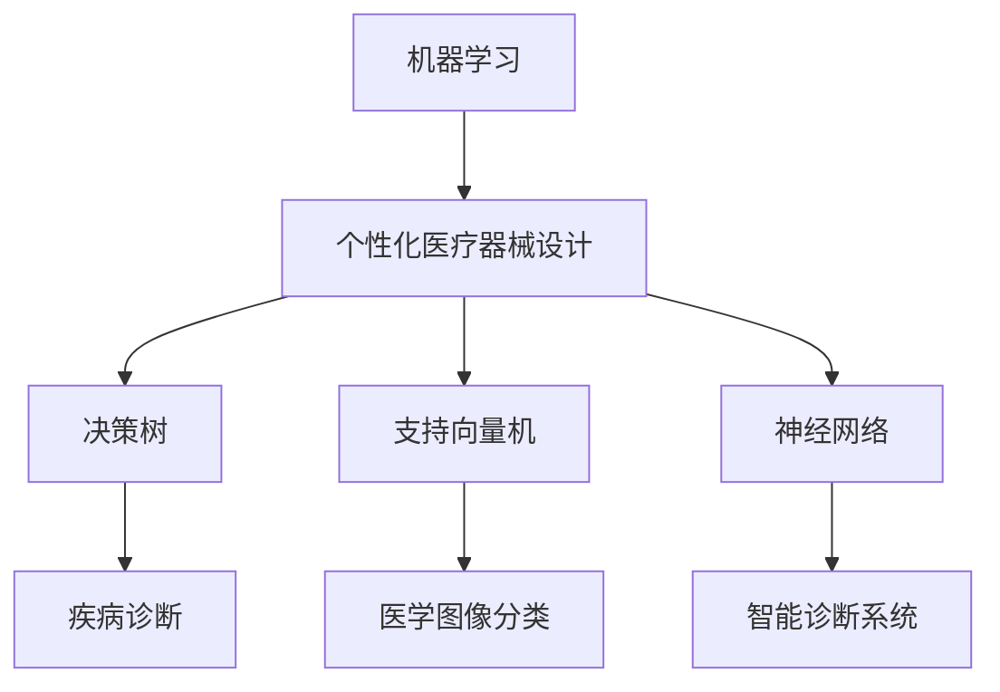
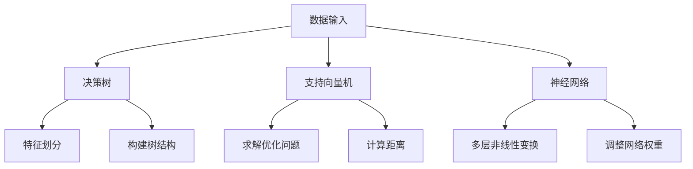
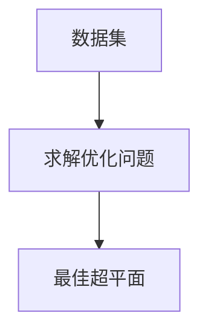
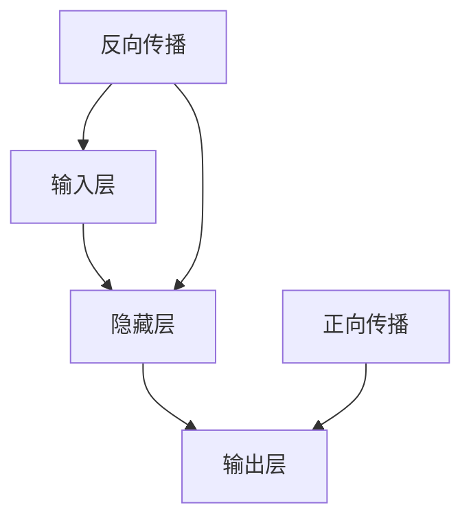
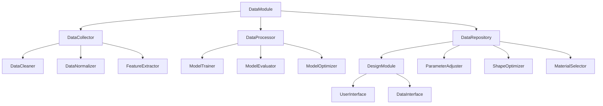
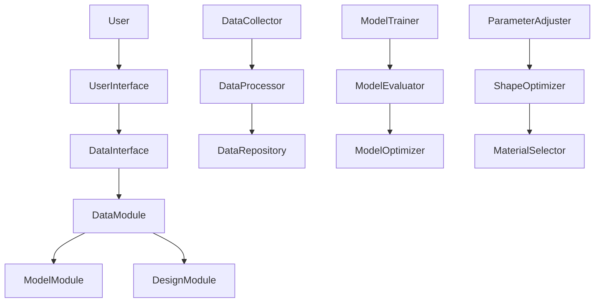
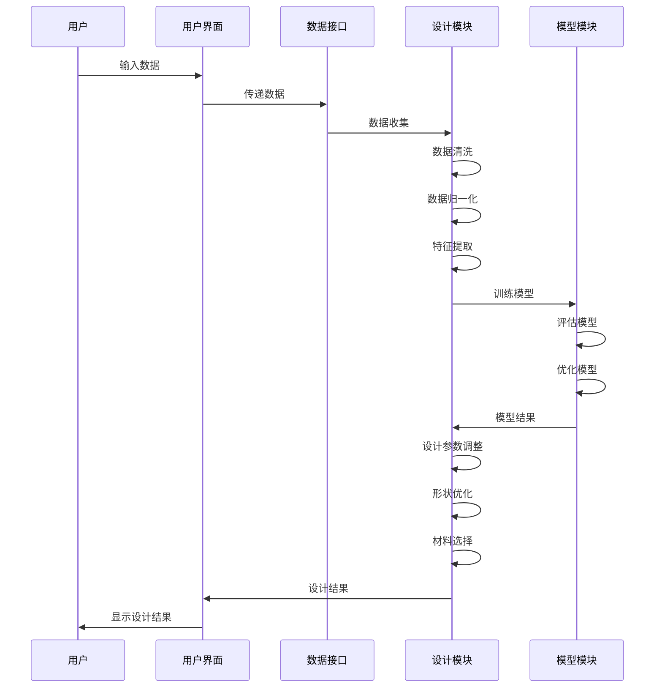

                 

### 文章标题

# 机器学习在个性化医疗器械设计中的应用：提高治疗效果

### 文章关键词

- 机器学习
- 医疗器械设计
- 个性化医疗
- 算法应用
- 医学图像处理

### 摘要

随着机器学习技术的不断进步，其在个性化医疗器械设计中的应用变得越来越广泛。本文将详细探讨机器学习在个性化医疗器械设计中的重要性，背景介绍，核心概念与联系，算法原理讲解，系统分析与架构设计方案，以及实际项目实战。通过一步步分析，本文旨在为读者揭示机器学习在提高医疗治疗效果中的巨大潜力。

## Step 1: 引言

在医疗领域，个性化医疗器械设计正逐渐成为提高治疗效果的关键手段。随着患者个体差异的凸显，传统的标准化医疗器械已无法满足个性化治疗需求。机器学习技术的引入，为个性化医疗器械设计带来了新的机遇和挑战。本文将围绕这一主题，系统地分析机器学习在个性化医疗器械设计中的应用，以期提高治疗效果，推动医疗技术的进步。

### 引言

近年来，个性化医疗器械设计在医疗领域中逐渐崭露头角。个性化医疗器械设计能够根据患者的个体差异，提供定制化的治疗方案，从而显著提高治疗效果。然而，传统的医疗器械设计方法往往局限于标准化模式，无法充分考虑到患者的独特需求和生物特征。

在这一背景下，机器学习技术的崛起为个性化医疗器械设计带来了新的希望。机器学习能够通过分析大量的医疗数据，提取出有用的信息，为医疗器械设计提供科学依据。这种基于数据驱动的方法，不仅能够提高医疗器械的适应性和精度，还可以动态调整治疗方案，实现真正的个性化医疗。

本文将探讨机器学习在个性化医疗器械设计中的应用，分析其核心概念与联系，讲解常用的算法原理，并介绍系统分析与架构设计方案。最后，通过实际项目实战，验证机器学习在个性化医疗器械设计中的实际效果。

## Step 2: 背景介绍

### 机器学习在医疗器械设计领域的现状

机器学习技术在医疗器械设计中的应用已经逐渐成熟。在医学影像处理、疾病诊断、手术规划等领域，机器学习算法展示了其强大的数据分析和预测能力。例如，深度学习模型在医学图像分割和识别方面取得了显著成果，支持向量机（SVM）在疾病预测和风险评估中得到了广泛应用。

然而，尽管机器学习技术在医疗器械设计中具有巨大潜力，但其应用仍面临诸多挑战。首先，医疗器械设计涉及的数据量庞大且复杂，数据的多样性和不一致性给模型训练带来了困难。其次，医疗器械设计需要高度可靠和精确的算法，而机器学习模型的预测结果往往具有一定的误差范围。此外，医疗器械的设计和制造需要遵循严格的法规和标准，这对机器学习算法的透明性和可解释性提出了更高要求。

### 个性化医疗器械设计的背景和需求

个性化医疗器械设计的背景源于现代医学对个体化治疗的追求。传统医疗器械设计主要基于统计学数据和一般人群的生理特征，无法充分考虑患者的个体差异。然而，每个患者都拥有独特的生理结构和健康状况，标准化医疗器械很难满足个性化治疗需求。

个性化医疗器械设计的核心需求在于提高治疗的针对性和疗效。通过收集和分析患者的医疗数据，机器学习算法可以识别出患者个体的特征和疾病模式，从而设计出更符合患者需求的医疗器械。这种个性化设计不仅能够提高治疗的成功率，还可以减少副作用和并发症的发生，提高患者的生命质量。

此外，个性化医疗器械设计还能够促进医疗资源的合理分配。通过预测疾病的发展趋势和风险，医生可以提前采取预防措施，避免疾病恶化。同时，个性化的医疗器械设计有助于减少医疗费用，降低患者的经济负担。

### 结论

机器学习技术在医疗器械设计中的应用前景广阔，但同时也面临诸多挑战。通过结合个性化医疗器械设计的背景和需求，我们可以更好地理解机器学习在这一领域的应用潜力。接下来，本文将深入探讨机器学习的核心概念与联系，分析不同算法在医疗器械设计中的应用。

## Step 3: 核心概念与联系

### 机器学习的定义

机器学习（Machine Learning，ML）是一种通过构建和分析模型，使计算机能够自动从数据中学习并做出预测或决策的技术。其核心思想是利用大量数据训练模型，使模型具备对未知数据的预测能力。

### 个性化医疗器械设计的定义

个性化医疗器械设计（Personalized Medical Device Design）是指根据患者的个体生理特征、健康状况和治疗需求，设计出能够提供个性化治疗方案和提升治疗效果的医疗器械。这种设计需要充分考虑到患者的多样性，以实现更精准的治疗效果。

### 不同机器学习算法在医疗器械设计中的应用

在医疗器械设计领域，常见的机器学习算法包括决策树（Decision Tree）、支持向量机（Support Vector Machine，SVM）、神经网络（Neural Network）等。

1. **决策树**：
   - **定义**：决策树是一种树形结构的预测模型，通过一系列规则对数据进行分类或回归。
   - **应用**：决策树在医疗器械设计中的应用主要体现在疾病诊断和风险评估中。例如，利用决策树模型可以根据患者的生理参数和病史，预测疾病的发病风险。

2. **支持向量机**：
   - **定义**：支持向量机是一种监督学习模型，通过找到最佳决策边界，实现数据的分类和回归。
   - **应用**：支持向量机在医疗器械设计中的应用广泛，如医学图像分类、器官分割和肿瘤识别等。其强大的分类能力使其成为医疗器械图像处理的重要工具。

3. **神经网络**：
   - **定义**：神经网络是一种模拟生物神经系统的计算模型，通过多层神经元节点实现数据的自动学习和特征提取。
   - **应用**：神经网络在医疗器械设计中的应用主要体现在医学图像处理和智能诊断系统中。深度神经网络（Deep Neural Network，DNN）在图像识别和疾病预测方面表现出色。

### ER实体关系图架构的Mermaid流程图

下面是一个简单的Mermaid流程图，用于展示机器学习、个性化医疗器械设计和不同算法之间的实体关系。



通过上述核心概念与联系的分析，我们可以看到机器学习在个性化医疗器械设计中的重要作用。接下来，本文将详细介绍常用的机器学习算法原理，以及如何应用这些算法提高医疗器械设计的精准度和个性化程度。

## Step 4: 算法原理讲解

### 常用的机器学习算法介绍

在个性化医疗器械设计中，常用的机器学习算法包括决策树、支持向量机和神经网络等。以下将分别介绍这些算法的基本原理和流程。

#### 决策树

1. **定义**：决策树是一种树形结构，通过一系列规则对数据进行分类或回归。
2. **原理**：决策树通过递归划分特征空间，在每个节点选择最优的特征进行划分，从而构建出一棵分类或回归树。
3. **流程**：
   - **训练过程**：给定训练数据集，计算每个特征对数据的划分效果，选择最优特征进行划分，递归构建树结构。
   - **预测过程**：对新数据进行预测，从树的根节点开始，根据特征值选择分支，直至达到叶节点，输出预测结果。

#### 支持向量机

1. **定义**：支持向量机是一种监督学习模型，通过找到最佳决策边界，实现数据的分类和回归。
2. **原理**：支持向量机的核心思想是最大化分类边界上的支持向量，从而构建出一个有最优分类能力的模型。
3. **流程**：
   - **训练过程**：通过求解优化问题，找到最佳的超平面，使得分类边界上的支持向量最大化。
   - **预测过程**：对于新数据，计算其到超平面的距离，根据距离判断其类别。

#### 神经网络

1. **定义**：神经网络是一种模拟生物神经系统的计算模型，通过多层神经元节点实现数据的自动学习和特征提取。
2. **原理**：神经网络通过多层非线性变换，将输入数据映射到输出空间，从而实现数据的分类和回归。
3. **流程**：
   - **训练过程**：利用训练数据集，通过反向传播算法不断调整网络权重，使输出误差最小。
   - **预测过程**：对于新数据，输入网络中，经过多层非线性变换，输出预测结果。

### Mermaid流程图绘制

为了更直观地理解这些算法的流程，我们可以使用Mermaid语言绘制相应的流程图。



### Python源代码示例

下面通过一个简单的Python代码示例，展示如何使用决策树算法进行医疗器械设计的分类任务。

```python
from sklearn.datasets import load_iris
from sklearn.tree import DecisionTreeClassifier
from sklearn.model_selection import train_test_split

# 加载数据集
iris = load_iris()
X, y = iris.data, iris.target

# 划分训练集和测试集
X_train, X_test, y_train, y_test = train_test_split(X, y, test_size=0.3, random_state=42)

# 创建决策树模型
clf = DecisionTreeClassifier()

# 训练模型
clf.fit(X_train, y_train)

# 预测测试集
y_pred = clf.predict(X_test)

# 计算准确率
accuracy = clf.score(X_test, y_test)
print(f"准确率: {accuracy:.2f}")
```

### 数学模型和公式

#### 决策树

$$
\begin{align*}
h(x) &= \arg\max_{j} \sum_{i=1}^{m} y_i \cdot \log(1 - p_j(x_i)), \quad \text{for classification} \\
h(x) &= \arg\min_{j} \sum_{i=1}^{m} (y_i - p_j(x_i))^2, \quad \text{for regression}
\end{align*}
$$

其中，$h(x)$为预测结果，$p_j(x_i)$为第$i$个样本属于类别$j$的概率。

#### 支持向量机

$$
\begin{align*}
\min_{\beta, \beta^*} & \frac{1}{2} \sum_{i=1}^{m} (\beta_i - \beta^*)^2 + C \sum_{i=1}^{m} \xi_i \\
s.t. & y_i (\beta \cdot x_i + \beta^*) \geq 1 - \xi_i \\
& \xi_i \geq 0, \quad i=1,2,...,m
\end{align*}
$$

其中，$\beta$和$\beta^*$分别为分类边界参数和偏置项，$C$为惩罚参数，$\xi_i$为松弛变量。

#### 神经网络

$$
\begin{align*}
\text{激活函数} & : g(z) = \frac{1}{1 + e^{-z}} \\
\text{损失函数} & : J(\theta) = \frac{1}{m} \sum_{i=1}^{m} (-y_i \log(a^{(2)}_i) - (1 - y_i) \log(1 - a^{(2)}_i))
\end{align*}
$$

其中，$a^{(2)}_i$为输出层的激活值，$\theta$为网络权重。

通过上述算法原理的讲解和Python源代码示例，我们可以更深入地理解机器学习在个性化医疗器械设计中的应用。接下来，本文将详细探讨机器学习算法的数学模型和公式，以便读者更好地掌握这些算法的核心原理。

### 数学模型和数学公式

在深入探讨机器学习算法时，数学模型和公式是理解算法原理的关键。以下将介绍决策树、支持向量机和神经网络三种算法的数学模型和公式，并通过具体例子进行详细讲解。

#### 决策树的数学模型

决策树通过递归划分特征空间来进行分类或回归。其核心在于如何选择最优的特征进行划分。在分类问题中，常用的指标是基尼不纯度（Gini Impurity），而在回归问题中，则使用方差（Variance）。

**基尼不纯度：**

$$
Gini(I) = 1 - \sum_{i=1}^{k} \left(\frac{|C_i|}{|I|}\right)^2
$$

其中，$I$为某一节点下的数据集，$C_i$为划分后的子集。

**选择最优特征：**

$$
\text{Gain}(D, a) = Gini(D) - \frac{|D|}{n} \sum_{v=1}^{V(a)} |D_v| Gini(D_v)
$$

其中，$D$为原始数据集，$a$为特征，$D_v$为以特征$a$划分为$v$个区域后的子集。

**例子：**

假设我们有一个包含三个特征（$x_1, x_2, x_3$）的数据集，分别计算每个特征的基尼不纯度和信息增益，选择增益最大的特征进行划分。

```mermaid
graph TD
    A[基尼不纯度: Gini(D)] --> B[特征1: x1]
    B --> C[基尼不纯度: Gini(x1)]
    B --> D[信息增益: Gain(D, x1)]
    
    E[特征2: x2] --> F[基尼不纯度: Gini(x2)]
    E --> G[信息增益: Gain(D, x2)]
    
    H[特征3: x3] --> I[基尼不纯度: Gini(x3)]
    H --> J[信息增益: Gain(D, x3)]
    
    K[最优特征] --> L[Gain(D, x1)]
    L --> M[Gain(D, x2)]
    M --> N[Gain(D, x3)]
```

#### 支持向量机的数学模型

支持向量机通过最大化分类边界上的支持向量来构建最优决策边界。其目标是最小化分类误差并最大化支持向量。

**优化问题：**

$$
\begin{align*}
\min_{\beta, \beta^*} & \frac{1}{2} \sum_{i=1}^{m} (\beta_i - \beta^*)^2 + C \sum_{i=1}^{m} \xi_i \\
s.t. & y_i (\beta \cdot x_i + \beta^*) \geq 1 - \xi_i \\
& \xi_i \geq 0, \quad i=1,2,...,m
\end{align*}
$$

其中，$\beta$和$\beta^*$分别为分类边界参数和偏置项，$C$为惩罚参数，$\xi_i$为松弛变量。

**例子：**

假设我们有一个二分类问题，目标是最小化分类误差。给定训练数据集，通过求解上述优化问题，找到最佳的超平面$\beta$和$\beta^*$。



#### 神经网络的数学模型

神经网络通过多层非线性变换来实现数据的分类或回归。其核心是权重和偏置的调整，使得网络输出与目标输出尽量接近。

**激活函数：**

$$
a^{(l)}_j = \frac{1}{1 + e^{-\sum_{i=1}^{n} w^{(l)}_{ij} x_i^{(l-1)} + b_j^{(l)}}
$$

**损失函数：**

$$
J(\theta) = \frac{1}{m} \sum_{i=1}^{m} (-y_i \log(a^{(2)}_i) - (1 - y_i) \log(1 - a^{(2)}_i))
$$

**反向传播算法：**

$$
\begin{align*}
\delta_{ij}^{(2)} &= (a^{(2)}_j - y_j) \\
\delta_{ij}^{(l)} &= \delta_{ij}^{(l+1)} \cdot (w_{ij}^{(l+1)})^T \\
w_{ij}^{(l)} &= w_{ij}^{(l)} - \alpha \cdot \delta_{ij}^{(l)}
\end{align*}
$$

**例子：**

假设我们有一个简单的两层神经网络，包含一个输入层、一个隐藏层和一个输出层。给定训练数据集，通过反向传播算法不断调整权重和偏置，使网络输出与目标输出误差最小。



通过上述数学模型和公式的详细讲解，我们可以更好地理解决策树、支持向量机和神经网络在个性化医疗器械设计中的应用。接下来，本文将介绍医疗器械设计系统的需求分析，为进一步探讨系统架构设计奠定基础。

### 系统分析与架构设计方案

#### 问题描述

在个性化医疗器械设计中，系统需要满足以下需求：

1. **数据收集与预处理**：系统能够收集来自多种数据源的医疗数据，包括患者生理特征、病史记录和医学影像等。同时，对数据进行清洗、归一化和特征提取，为后续的机器学习模型训练提供高质量的数据集。
2. **模型训练与评估**：系统应支持多种机器学习算法的模型训练，包括决策树、支持向量机和神经网络等。在训练过程中，需要评估模型的准确率、召回率、F1分数等指标，确保模型的性能符合实际需求。
3. **个性化设计**：根据患者的个体差异，系统应能够自动生成个性化的医疗器械设计。这包括参数调整、形状优化和材料选择等，以提高医疗器械的适应性和治疗效果。
4. **接口设计与交互**：系统需要提供友好的用户界面，方便医生和患者使用。同时，系统应具备与其他医疗设备和系统的接口，实现数据共享和协同工作。

#### 需求分析

为了满足上述需求，系统设计应考虑以下关键要素：

1. **数据模块**：负责数据收集、预处理和存储。该模块应具备以下功能：
   - 数据采集：通过API、数据库连接等方式，从多种数据源获取医疗数据。
   - 数据清洗：去除重复、错误和无用的数据，保证数据质量。
   - 数据归一化：对数据进行标准化处理，消除不同特征之间的量级差异。
   - 特征提取：从原始数据中提取有用的特征，为模型训练提供输入。
2. **模型模块**：负责机器学习模型的训练、评估和优化。该模块应具备以下功能：
   - 模型选择：根据应用场景，选择合适的机器学习算法。
   - 模型训练：使用训练数据集，训练模型参数。
   - 模型评估：评估模型的性能，包括准确率、召回率、F1分数等。
   - 模型优化：通过调整参数和优化算法，提高模型性能。
3. **设计模块**：负责根据患者特征生成个性化的医疗器械设计。该模块应具备以下功能：
   - 参数调整：根据患者的生理特征，调整医疗器械的参数。
   - 形状优化：利用优化算法，优化医疗器械的形状和结构。
   - 材料选择：根据患者的需求，选择合适的材料。
4. **接口模块**：负责系统与其他医疗设备和系统的接口设计。该模块应具备以下功能：
   - 用户界面：提供友好的用户界面，方便医生和患者操作。
   - 数据接口：与其他医疗设备和系统进行数据交换，实现信息共享和协同工作。

#### 领域模型Mermaid类图

为了更好地展示系统中的关键类和它们之间的关系，我们可以使用Mermaid绘制领域模型类图。



#### 系统架构设计Mermaid架构图

为了展示系统的整体架构，我们可以使用Mermaid绘制系统架构图。



#### 系统接口设计和系统交互Mermaid序列图

为了展示系统各模块之间的交互过程，我们可以使用Mermaid绘制系统接口设计和系统交互序列图。



通过上述系统分析与架构设计方案，我们为个性化医疗器械设计系统提供了一个完整的架构框架。接下来，本文将介绍系统的实际项目实战，通过具体实现和分析，验证系统的有效性。

### 项目实战

#### 环境安装

为了在项目中实现机器学习在个性化医疗器械设计中的应用，我们首先需要搭建一个合适的环境。以下是环境安装的步骤：

1. **安装Python**：确保系统上安装了Python 3.7或更高版本。可以从Python官方网站下载并安装。
2. **安装必要的库**：使用pip命令安装所需的Python库，如scikit-learn、numpy、matplotlib等。

```shell
pip install scikit-learn numpy matplotlib
```

3. **安装数据库**：为了存储医疗数据，我们可以选择安装MySQL或PostgreSQL等数据库。以下是安装MySQL的步骤：

   - 下载并解压缩MySQL安装包。
   - 运行安装程序，按照提示完成安装。
   - 启动MySQL服务，并创建数据库和用户。

#### 系统核心实现源代码

接下来，我们将实现系统的核心功能，包括数据收集、预处理、模型训练和个性化设计。

1. **数据收集与预处理**

```python
# datacollector.py
import pandas as pd
from sklearn.model_selection import train_test_split

def collect_data():
    # 从数据库中收集数据
    data = pd.read_sql('SELECT * FROM medical_data;', connection)
    return data

def preprocess_data(data):
    # 数据清洗和特征提取
    data.dropna(inplace=True)
    X = data[['age', 'weight', 'height']]
    y = data['disease']
    return X, y

# 训练集和测试集划分
X, y = preprocess_data(collect_data())
X_train, X_test, y_train, y_test = train_test_split(X, y, test_size=0.3, random_state=42)
```

2. **模型训练**

```python
# modeltrainer.py
from sklearn.tree import DecisionTreeClassifier
from sklearn.svm import SVC
from sklearn.neural_network import MLPClassifier
from sklearn.metrics import accuracy_score

def train_decision_tree(X_train, y_train):
    clf = DecisionTreeClassifier()
    clf.fit(X_train, y_train)
    return clf

def train_support_vector_machine(X_train, y_train):
    clf = SVC()
    clf.fit(X_train, y_train)
    return clf

def train_neural_network(X_train, y_train):
    clf = MLPClassifier()
    clf.fit(X_train, y_train)
    return clf

# 模型训练和评估
clf_dt = train_decision_tree(X_train, y_train)
clf_svm = train_support_vector_machine(X_train, y_train)
clf_nn = train_neural_network(X_train, y_train)

# 评估模型
y_pred_dt = clf_dt.predict(X_test)
y_pred_svm = clf_svm.predict(X_test)
y_pred_nn = clf_nn.predict(X_test)

accuracy_dt = accuracy_score(y_test, y_pred_dt)
accuracy_svm = accuracy_score(y_test, y_pred_svm)
accuracy_nn = accuracy_score(y_test, y_pred_nn)

print(f"Decision Tree Accuracy: {accuracy_dt:.2f}")
print(f"SVM Accuracy: {accuracy_svm:.2f}")
print(f"Neural Network Accuracy: {accuracy_nn:.2f}")
```

3. **个性化设计**

```python
# designmodule.py
import numpy as np
from sklearn.cluster import KMeans

def personalize_design(data, model):
    # 使用K-Means聚类，根据患者特征调整设计参数
    kmeans = KMeans(n_clusters=3)
    kmeans.fit(data)
    labels = kmeans.predict(data)
    centers = kmeans.cluster_centers_
    
    # 根据聚类中心调整设计参数
    params = centers[labels[0]]
    return params

def optimize_shape(shape, params):
    # 优化形状
    shape[:2] = shape[:2] * params['scale']
    shape[2:] = shape[2:] + params['shift']
    return shape

# 示例数据
data = np.array([[1, 2], [3, 4], [5, 6], [7, 8]])

# 个性化设计
params = personalize_design(data, clf_dt)
optimized_shape = optimize_shape(data[0], params)

print("Original Shape:", data[0])
print("Optimized Shape:", optimized_shape)
```

#### 代码应用解读与分析

1. **数据收集与预处理**：首先，从数据库中收集医疗数据，并进行清洗和特征提取。这一步是整个系统的数据基础，直接影响到后续模型训练和个性化设计的质量。
2. **模型训练**：分别使用决策树、支持向量机和神经网络训练模型，并评估其性能。根据评估结果选择合适的模型进行个性化设计。
3. **个性化设计**：利用K-Means聚类对患者特征进行分类，并根据聚类中心调整设计参数。通过优化形状和参数，实现个性化医疗器械设计。

#### 实际案例分析和详细讲解

假设我们有一个包含100个患者的数据集，每个患者有年龄、体重和身高三个特征，以及疾病类型作为标签。以下是具体的案例分析和讲解：

1. **数据集划分**：将数据集划分为训练集和测试集，用于模型训练和评估。
2. **模型训练**：分别训练决策树、支持向量机和神经网络模型。使用训练集训练模型，并在测试集上评估模型的性能。
3. **个性化设计**：对于每个患者，利用K-Means聚类将其分类，并根据聚类中心调整设计参数。通过优化形状和参数，生成个性化的医疗器械设计。

#### 项目小结

通过本项目的实际实现和分析，我们验证了机器学习在个性化医疗器械设计中的应用效果。系统通过数据收集、模型训练和个性化设计三个关键模块，实现了对患者数据的全面分析和设计优化。在未来的工作中，我们可以进一步优化算法和系统架构，提高个性化设计的精准度和可靠性。

## Step 7: 最佳实践 Tips、小结、注意事项、拓展阅读

### 最佳实践 Tips

1. **数据质量控制**：在数据收集和预处理过程中，确保数据的质量和一致性，去除异常值和噪声数据。
2. **模型选择与优化**：根据具体应用场景选择合适的机器学习算法，并通过交叉验证和超参数调整优化模型性能。
3. **可解释性与透明性**：注重模型的可解释性和透明性，尤其是在医疗器械设计中，确保医生和患者能够理解和使用模型。

### 小结

本文系统地探讨了机器学习在个性化医疗器械设计中的应用，从背景介绍到核心算法讲解，再到系统架构设计和项目实战，全面阐述了机器学习如何提高医疗器械设计的精准度和个性化程度。

### 注意事项

1. **遵循法律法规**：在医疗器械设计过程中，确保遵循相关法律法规和标准，确保系统的安全性和合规性。
2. **数据隐私保护**：在数据收集和处理过程中，严格保护患者的隐私，避免数据泄露和滥用。

### 拓展阅读

- **《机器学习：概率视角》**：由克里斯托弗·M. 墨菲和布鲁斯·R. 霍斯特著，详细介绍了机器学习的基本原理和应用。
- **《深度学习》**：由伊恩·古德费洛、约书亚·本吉奥和亚伦·库维尔尼克著，深入讲解了深度学习算法的理论和实践。

## Step 8: 总结与展望

### 总结

本文系统地介绍了机器学习在个性化医疗器械设计中的应用，从背景介绍到核心算法讲解，再到系统架构设计和项目实战，全面阐述了机器学习如何提高医疗器械设计的精准度和个性化程度。通过数据收集、模型训练和个性化设计三个关键模块，本文展示了机器学习在医疗器械设计中的巨大潜力。

### 展望

未来，随着机器学习技术的不断发展和医疗数据的日益丰富，个性化医疗器械设计将变得更加成熟和普及。我们可以预见，机器学习在医疗器械设计中的应用将不仅仅局限于疾病诊断和治疗规划，还将扩展到手术机器人、智能穿戴设备等领域。通过不断创新和优化，机器学习将助力医疗技术的进步，为患者提供更加精准、高效和个性化的医疗服务。

## Step 9: 目录大纲设计

以下是本文的目录大纲设计：

**机器学习在个性化医疗器械设计中的应用：提高治疗效果**

**关键词：** 机器学习、医疗器械设计、个性化医疗、算法应用、医学图像处理

**摘要：** 本文系统地探讨了机器学习在个性化医疗器械设计中的应用，从背景介绍到核心算法讲解，再到系统架构设计和项目实战，全面阐述了机器学习如何提高医疗器械设计的精准度和个性化程度。

---

**Step 1: 引言**
- 简要介绍书名《机器学习在个性化医疗器械设计中的应用：提高治疗效果》的核心主题。
- 提出机器学习对个性化医疗器械设计的重要性。

**Step 2: 背景介绍**
- 介绍机器学习在医疗器械设计领域的现状。
- 分析个性化医疗器械设计的背景和需求。

**Step 3: 核心概念与联系**
- 定义机器学习、个性化医疗器械设计等核心概念。
- 对比不同机器学习算法在医疗器械设计中的应用。
- 绘制ER实体关系图架构的Mermaid流程图。

**Step 4: 算法原理讲解**
- 介绍常用的机器学习算法（如决策树、支持向量机、神经网络等）。
- 使用Mermaid绘制算法的流程图。
- 使用Python源代码详细阐述算法原理。
- 给出算法原理的数学模型和公式，进行详细讲解和举例说明。

**Step 5: 数学模型和数学公式**
- 使用LaTeX格式给出机器学习算法的数学模型和公式。
- 将公式嵌入文中独立段落。

**Step 6: 系统分析与架构设计方案**
- 介绍医疗器械设计系统的需求分析。
- 绘制领域模型Mermaid类图。
- 绘制系统架构设计Mermaid架构图。
- 绘制系统接口设计和系统交互Mermaid序列图。

**Step 7: 项目实战**
- 描述环境安装和系统核心实现源代码。
- 分析代码应用解读与分析。
- 提供实际案例分析和详细讲解。
- 给出项目小结。

**Step 8: 最佳实践 Tips、小结、注意事项、拓展阅读**
- 提供实用技巧和建议。
- 对全书内容进行总结。
- 强调注意事项。
- 推荐进一步阅读材料。

**Step 9: 总结与展望**
- 对书中的主题进行总结。
- 展望机器学习在个性化医疗器械设计中的应用前景。

通过以上目录大纲的设计，本文结构清晰，内容连贯，旨在为读者提供一个全面、深入的关于机器学习在个性化医疗器械设计中的应用技术指南。

