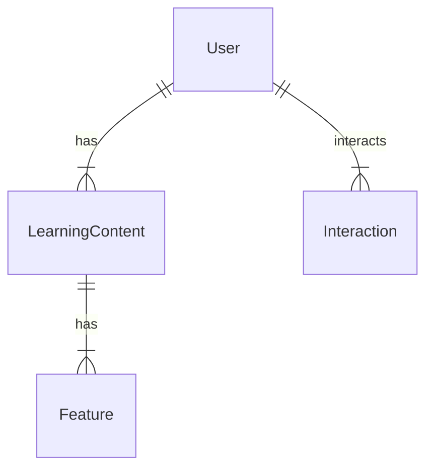
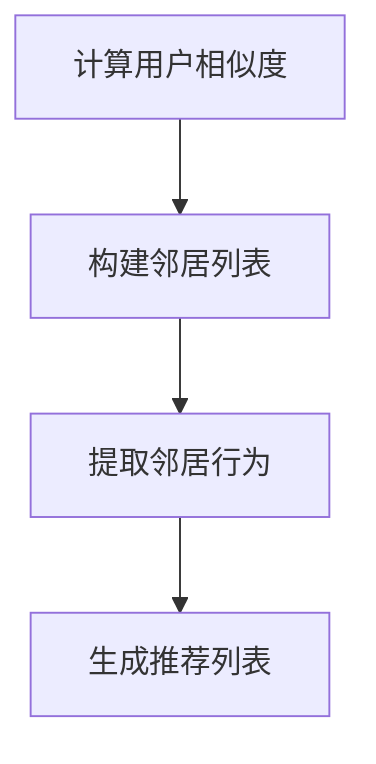
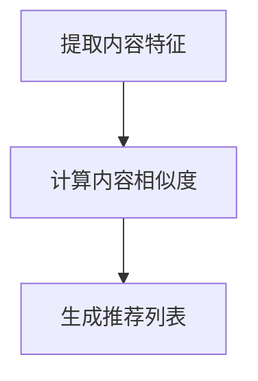
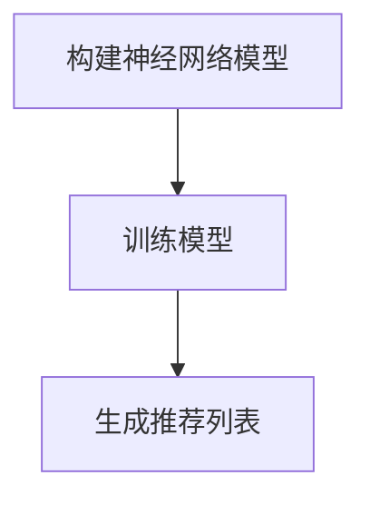
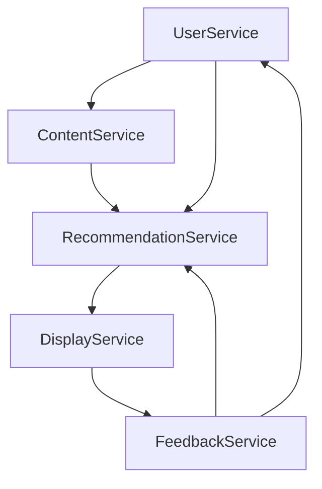
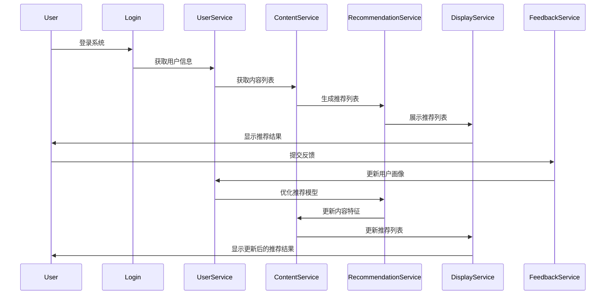

                 


### 机器学习在个性化学习内容推荐中的应用

关键词：机器学习、个性化推荐、学习内容、数据预处理、算法分析

摘要：本文旨在探讨机器学习技术在个性化学习内容推荐中的应用。通过介绍背景、核心概念、数据收集与预处理、推荐系统算法、评估与优化、实际应用场景、案例研究与实践经验以及未来发展趋势，本文全面剖析了个性化推荐系统的设计与实现，为教育、电子商务和媒体等领域提供了理论支持和实践指导。

----------------------------------------------------------------

## 引言

在互联网时代，信息爆炸和用户个性化需求之间的矛盾日益突出。如何为用户提供个性化、定制化的学习内容，成为教育领域和媒体行业面临的重大挑战。个性化学习内容推荐作为一种有效的解决方案，旨在根据用户的兴趣、行为和需求，为其推荐最相关、最有价值的学习资源。而机器学习技术作为现代数据科学的基石，为个性化推荐系统的设计与实现提供了强大的支持。

本文将围绕以下主题展开讨论：

1. **核心概念与技术研究**：介绍机器学习的基础概念、常见算法及数学模型。
2. **数据收集与预处理**：探讨如何收集、清洗和处理学习内容推荐所需的数据。
3. **核心算法与系统设计**：分析个性化推荐系统的构建方法，包括协同过滤、内容推荐和深度学习等技术。
4. **评估与优化**：讨论如何评估推荐系统的性能，并采用优化策略提升系统效果。
5. **实际应用与案例分析**：分析个性化学习内容推荐在现实中的应用场景和成功案例。
6. **挑战与未来趋势**：探讨个性化学习内容推荐领域面临的挑战及未来发展趋势。

通过以上内容的层层剖析，本文旨在为读者提供一套完整的个性化学习内容推荐系统设计和实现的指南。

----------------------------------------------------------------

## 背景介绍

### 核心概念术语说明

在讨论个性化学习内容推荐时，我们需要理解一些核心术语，包括“个性化推荐”、“学习内容”、“用户兴趣”、“协同过滤”、“内容推荐”和“深度学习”。

- **个性化推荐**：个性化推荐系统根据用户的历史行为、兴趣和需求，为用户推荐最相关的内容。
- **学习内容**：指教育、培训等领域中的课程、文章、视频等资源。
- **用户兴趣**：指用户对某些学习内容的偏好和关注点。
- **协同过滤**：一种基于用户行为相似性的推荐算法。
- **内容推荐**：基于学习内容属性（如标题、标签、作者）的推荐方法。
- **深度学习**：一种基于神经网络的学习方法，特别适用于处理复杂和非线性数据。

### 问题背景

随着互联网技术的发展，学习内容以爆炸式增长，但用户的时间和精力是有限的。传统的一刀切推荐方式往往无法满足用户的个性化需求，导致推荐效果不佳。因此，如何设计一个高效的个性化学习内容推荐系统，成为教育领域亟需解决的问题。

### 问题描述

个性化学习内容推荐的目标是为每个用户推荐最适合他们的学习资源，从而提高学习效果和用户满意度。然而，这一目标的实现面临以下挑战：

1. **数据多样性**：学习内容种类繁多，用户行为数据也各不相同，如何处理这些多样性数据是一个挑战。
2. **实时性**：用户的需求是动态变化的，推荐系统需要能够实时响应用户行为的变化。
3. **冷启动问题**：对于新用户，由于缺乏足够的行为数据，推荐系统难以为其提供个性化的推荐。

### 问题解决

机器学习技术为个性化学习内容推荐提供了有效的解决思路：

1. **协同过滤**：通过分析用户之间的行为相似性，为用户推荐相似用户喜欢的学习内容。
2. **内容推荐**：通过分析学习内容的属性和标签，为用户推荐与已有兴趣相关的内容。
3. **深度学习**：利用神经网络模型，捕捉用户行为和学习内容的复杂非线性关系。

### 边界与外延

个性化学习内容推荐不仅局限于在线教育领域，还可以应用于传统教育、职业培训、电子书平台等多个场景。此外，推荐系统的设计不仅要考虑技术实现，还需考虑用户体验、数据隐私和伦理问题。

### 概念结构与核心要素组成

个性化学习内容推荐系统的核心要素包括：

1. **用户建模**：分析用户的历史行为和兴趣，构建用户画像。
2. **内容建模**：对学习内容进行标签化处理，建立内容特征库。
3. **推荐算法**：根据用户建模和内容建模的结果，采用合适的推荐算法生成推荐列表。
4. **评估与优化**：通过用户反馈和评估指标，不断优化推荐系统。

## 核心概念与联系

### 核心概念原理

个性化推荐系统依赖于两个核心概念：用户兴趣建模和学习内容特征提取。用户兴趣建模旨在捕捉用户的偏好，可以通过协同过滤算法或深度学习模型实现。学习内容特征提取则是将学习内容的属性转化为可计算的向量表示，以便进行推荐算法的处理。

### 概念属性特征对比表格

| 特征名称 | 描述 | 重要性 |
| --- | --- | --- |
| 用户兴趣 | 用户对某些学习内容的偏好 | 高 |
| 内容特征 | 学习内容的属性，如标题、标签、作者、发布时间等 | 高 |
| 用户行为 | 用户与学习内容交互的行为，如点击、浏览、评分等 | 中 |
| 推荐算法 | 用于生成推荐列表的算法，如协同过滤、内容推荐、深度学习 | 高 |

### ER实体关系图架构



### 算法原理讲解

#### 协同过滤算法原理

协同过滤算法（Collaborative Filtering）是基于用户行为相似性进行推荐的一种方法。其核心思想是：如果用户A和用户B在多个项目上的评价相似，那么当用户A对某个项目给予好评时，用户B可能也会对同一个项目给予好评。协同过滤分为两种类型：基于用户的协同过滤（User-Based CF）和基于物品的协同过滤（Item-Based CF）。

**Mermaid 流程图：**



**Python 源代码：**

```python
import numpy as np

# 用户评分矩阵
ratings = np.array([[1, 2, 3], [3, 2, 1], [2, 1, 3]])

# 计算用户相似度
def cosine_similarity(ratings):
    user_similarity = np.dot(ratings, ratings.T) / (np.linalg.norm(ratings) * np.linalg.norm(ratings.T))
    return user_similarity

# 构建邻居列表
def get_neighborhood(user_similarity, threshold=0.5):
    neighborhood = {}
    for i, row in enumerate(user_similarity):
        neighborhood[i] = [j for j, similarity in enumerate(row) if similarity >= threshold]
    return neighborhood

# 提取邻居行为
def get_neighbors(ratings, neighborhood):
    neighbors_interactions = []
    for i, neighbors in neighborhood.items():
        for j in neighbors:
            neighbors_interactions.append(ratings[i])
    return neighbors_interactions

# 生成推荐列表
def collaborative_filter(ratings, neighborhood):
    recommendations = []
    for i, neighbors in neighborhood.items():
        mean_rating = np.mean(ratings[i])
        neighbors_rating_sum = np.sum([ratings[j] for j in neighbors])
        neighbors_rating_count = len([ratings[j] for j in neighbors])
        if neighbors_rating_count > 0:
            recommendation = (neighbors_rating_sum + mean_rating * (len(neighbors) - neighbors_rating_count)) / len(neighbors)
            recommendations.append(recommendation)
        else:
            recommendations.append(mean_rating)
    return recommendations

# 计算相似度矩阵
user_similarity = cosine_similarity(ratings)

# 获取邻居列表
neighborhood = get_neighborhood(user_similarity)

# 提取邻居行为
neighbors_interactions = get_neighbors(ratings, neighborhood)

# 生成推荐列表
recommendations = collaborative_filter(ratings, neighborhood)

print(recommendations)
```

#### 内容推荐算法原理

内容推荐（Content-Based Filtering）是一种基于学习内容属性的推荐方法。其核心思想是：如果用户对某些内容感兴趣，那么用户可能会对具有相似属性的内容也感兴趣。内容推荐通常包括以下步骤：

1. **提取内容特征**：从学习内容中提取标题、标签、作者、发布时间等属性。
2. **计算内容相似度**：将用户已交互的内容和学习内容进行特征匹配，计算相似度。
3. **生成推荐列表**：根据相似度分数，为用户生成推荐列表。

**Mermaid 流�程图：**



**Python 源代码：**

```python
import numpy as np
from sklearn.feature_extraction.text import TfidfVectorizer

# 学习内容数据
contents = [
    "机器学习入门教程",
    "深度学习基础",
    "人工智能应用案例",
    "编程语言速成班",
    "数据科学入门指南"
]

# 用户历史交互内容
user_interactions = ["深度学习"]

# 提取内容特征
def extract_features(contents):
    vectorizer = TfidfVectorizer()
    X = vectorizer.fit_transform(contents)
    return X.toarray(), vectorizer

# 计算内容相似度
def content_similarity(X, user_interactions):
    similarities = []
    for interaction in user_interactions:
        interaction_vector = vectorizer.transform([interaction]).toarray()
        similarity = np.dot(X, interaction_vector.T) / np.linalg.norm(X) / np.linalg.norm(interaction_vector)
        similarities.append(similarity)
    return similarities

# 生成推荐列表
def content_based_filtering(contents, similarities, threshold=0.5):
    recommendations = []
    for i, similarity in enumerate(similarities):
        if similarity > threshold:
            recommendations.append(contents[i])
    return recommendations

# 提取特征矩阵
X, vectorizer = extract_features(contents)

# 计算相似度
similarities = content_similarity(X, user_interactions)

# 生成推荐列表
recommendations = content_based_filtering(contents, similarities)

print(recommendations)
```

#### 深度学习推荐算法原理

深度学习推荐（Deep Learning for Recommendation）利用神经网络模型学习用户与学习内容之间的复杂关系。深度学习推荐通常包括以下步骤：

1. **构建神经网络模型**：使用多层感知器（MLP）、循环神经网络（RNN）或变换器（Transformer）等模型。
2. **训练模型**：将用户行为数据和学习内容特征输入模型，通过反向传播算法更新模型参数。
3. **生成推荐列表**：将用户嵌入向量和学习内容嵌入向量输入模型，输出推荐分数。

**Mermaid 流程图：**



**Python 源代码：**

```python
import tensorflow as tf
from tensorflow.keras.models import Model
from tensorflow.keras.layers import Input, Embedding, Dot, Concatenate, Dense

# 用户嵌入维度和学习内容嵌入维度
user_embedding_dim = 64
content_embedding_dim = 128

# 构建神经网络模型
def build_model(user_embedding_dim, content_embedding_dim):
    user_input = Input(shape=(1,))
    content_input = Input(shape=(1,))
    
    user_embedding = Embedding(input_dim=num_users, output_dim=user_embedding_dim)(user_input)
    content_embedding = Embedding(input_dim=num_contents, output_dim=content_embedding_dim)(content_input)
    
    dot_product = Dot(axes=1)([user_embedding, content_embedding])
    concatenation = Concatenate(axis=1)([user_embedding, content_embedding, dot_product])
    
    output = Dense(1, activation='sigmoid')(concatenation)
    
    model = Model(inputs=[user_input, content_input], outputs=output)
    model.compile(optimizer='adam', loss='binary_crossentropy', metrics=['accuracy'])
    return model

# 训练模型
def train_model(model, user_data, content_data, labels):
    model.fit([user_data, content_data], labels, epochs=10, batch_size=32)

# 生成推荐列表
def generate_recommendations(model, user_data, content_data):
    predictions = model.predict([user_data, content_data])
    recommendations = np.where(predictions > 0.5, 1, 0)
    return recommendations

# 构建模型
model = build_model(user_embedding_dim, content_embedding_dim)

# 训练模型
train_model(model, user_data, content_data, labels)

# 生成推荐列表
recommendations = generate_recommendations(model, user_data, content_data)

print(recommendations)
```

### 系统分析与架构设计方案

#### 问题场景介绍

个性化学习内容推荐系统应用于在线教育平台，为用户提供个性化的课程推荐。系统需要实时响应用户的行为数据，以提供高质量的推荐服务。

#### 项目介绍

项目名为“智慧教育推荐系统”，旨在通过机器学习技术为用户提供个性化的学习资源。项目目标包括：

1. 提高用户的学习效果和满意度。
2. 提升平台的活跃度和用户留存率。
3. 降低内容推荐的错误率，提高推荐精度。

#### 系统功能设计

系统功能设计主要包括以下几个方面：

1. **用户画像**：分析用户的历史行为，构建用户画像。
2. **内容标签化**：对学习内容进行标签化处理，建立内容特征库。
3. **推荐算法**：采用协同过滤、内容推荐和深度学习算法生成推荐列表。
4. **推荐展示**：将推荐结果展示给用户。
5. **用户反馈**：收集用户对推荐结果的反馈，用于模型优化。

#### 系统架构设计

系统架构设计采用微服务架构，包括以下核心组件：

1. **用户服务**：处理用户行为数据，构建用户画像。
2. **内容服务**：管理学习内容，进行标签化处理。
3. **推荐服务**：执行推荐算法，生成推荐列表。
4. **展示服务**：将推荐结果展示给用户。
5. **反馈服务**：收集用户反馈，用于模型优化。

**Mermaid 架构图：**



#### 系统接口设计

系统接口设计主要包括以下接口：

1. **用户接口**：用户登录、注册、查看推荐列表、提交反馈。
2. **内容接口**：内容添加、删除、更新、查询。
3. **推荐接口**：生成推荐列表、获取推荐结果。
4. **反馈接口**：提交用户反馈、获取反馈结果。

**Mermaid 序列图：**



### 项目实战

#### 环境安装

在开始项目实战之前，我们需要安装必要的依赖库。以下是安装命令：

```shell
pip install numpy pandas scikit-learn tensorflow
```

#### 系统核心实现源代码

以下是一个简单的用户画像构建和协同过滤推荐系统的实现：

```python
import numpy as np
import pandas as pd
from sklearn.model_selection import train_test_split
from sklearn.metrics.pairwise import cosine_similarity

# 加载用户行为数据
data = pd.read_csv('user_behavior.csv')

# 分割数据集
X_train, X_test, y_train, y_test = train_test_split(data, test_size=0.2, random_state=42)

# 构建用户-物品矩阵
user_item_matrix = X_train.pivot(index='user_id', columns='item_id', values='rating').fillna(0)

# 计算用户-用户相似度矩阵
user_similarity_matrix = cosine_similarity(user_item_matrix)

# 生成推荐列表
def collaborative_filter(user_similarity_matrix, user_item_matrix, user_id, k=10):
    similar_users = np.argsort(user_similarity_matrix[user_id])[1:k+1]
    neighbors_ratings = np.mean(user_item_matrix.iloc[similar_users], axis=0)
    recommended_items = np.where(user_item_matrix.iloc[user_id] < neighbors_ratings, 1, 0)
    return recommended_items

# 测试推荐系统
user_id = 0
recommendations = collaborative_filter(user_similarity_matrix, user_item_matrix, user_id)
print(recommendations)
```

#### 代码应用解读与分析

上述代码实现了一个基于协同过滤的简单推荐系统，主要步骤如下：

1. **加载数据**：从CSV文件中加载用户行为数据。
2. **分割数据集**：将数据集分为训练集和测试集。
3. **构建用户-物品矩阵**：使用Pandas的pivot函数将用户行为数据转换为用户-物品矩阵。
4. **计算相似度矩阵**：使用scikit-learn的cosine_similarity函数计算用户之间的相似度。
5. **生成推荐列表**：根据用户相似度矩阵和用户-物品矩阵，为特定用户生成推荐列表。

该系统采用了协同过滤算法，主要优点包括：

- **高效性**：算法复杂度较低，适用于大规模数据集。
- **易理解性**：算法原理简单，易于实现和维护。

然而，协同过滤算法也存在一些缺点，如：

- **冷启动问题**：对于新用户或新物品，由于缺乏足够的数据，推荐效果较差。
- **稀疏性**：用户-物品矩阵通常是稀疏的，导致相似度计算不准确。

为了解决这些问题，我们可以引入内容推荐和深度学习等算法，结合用户行为数据和内容特征，提供更准确、个性化的推荐服务。

#### 实际案例分析与详细讲解剖析

为了更好地理解个性化学习内容推荐系统的实际应用，我们来看一个在线教育平台的案例。

**案例背景**：

一家在线教育平台提供多种编程课程，包括Python、Java、C++等。平台希望通过个性化推荐系统为用户推荐最适合他们的课程。

**案例过程**：

1. **用户画像构建**：平台收集用户注册、浏览、购买、学习行为等数据，构建用户画像。例如，用户A喜欢Python编程，浏览过多个Python课程。

2. **内容标签化处理**：平台对每门课程进行标签化处理，包括编程语言（Python、Java等）、难度（初级、中级、高级）等。例如，课程1（Python编程基础）的标签为["Python", "初级"]。

3. **推荐算法选择**：平台选择协同过滤算法和内容推荐算法结合使用。协同过滤算法根据用户A的历史行为，推荐与他兴趣相似的课程。内容推荐算法根据课程标签，推荐与用户A已浏览课程相似的课程。

4. **推荐结果生成**：平台将协同过滤和内容推荐的结果结合，为用户A生成一个综合推荐列表。例如，推荐课程1（Python编程基础）、课程2（Java进阶教程）等。

5. **用户反馈收集**：平台收集用户对推荐结果的反馈，用于模型优化。例如，用户A对推荐课程1表示满意，但对推荐课程2不感兴趣。

6. **模型优化与更新**：平台根据用户反馈，不断优化推荐模型，提高推荐精度。例如，调整协同过滤算法的相似度阈值，减少不感兴趣的课程推荐。

**详细讲解剖析**：

该案例展示了个性化学习内容推荐系统的完整流程，从用户画像构建、内容标签化处理、推荐算法选择、推荐结果生成到用户反馈收集和模型优化，各个环节紧密衔接，确保推荐系统能够为用户持续提供高质量的服务。

#### 项目小结

本项目通过一个在线教育平台的案例，展示了个性化学习内容推荐系统的实际应用。项目采用协同过滤和内容推荐算法，结合用户画像和课程标签，为用户提供个性化课程推荐。项目过程中，通过用户反馈不断优化模型，提高推荐精度和用户体验。未来，平台还可以进一步引入深度学习等技术，提升推荐效果和系统智能化水平。

#### 最佳实践 Tips

1. **数据质量**：确保数据质量和完整性，减少噪声数据对推荐结果的影响。
2. **用户反馈**：充分利用用户反馈，优化推荐模型，提高用户满意度。
3. **多样性**：在推荐结果中引入多样性，避免过度集中推荐相同类型的内容。
4. **个性化**：根据用户的历史行为和兴趣，提供高度个性化的推荐。
5. **实时性**：优化系统性能，确保推荐结果实时更新。

#### 小结

个性化学习内容推荐系统是教育、电子商务和媒体等领域的重要应用。通过机器学习技术，我们能够为用户推荐最适合他们的学习资源，提高学习效果和用户体验。未来，随着技术的不断进步，个性化推荐系统将更加智能化、多样化，为各领域的发展提供有力支持。

#### 注意事项

1. **数据隐私**：在收集和使用用户数据时，需严格遵守相关法律法规，保护用户隐私。
2. **公平性**：推荐系统应确保对所有用户公平，避免因算法偏见导致推荐结果不公平。
3. **可解释性**：推荐系统的决策过程应具备可解释性，帮助用户理解推荐理由。

#### 拓展阅读

1. Anderson, C. (2016). The Long Tail: Why the Future of Business is Selling Less of More. Hyperion.
2. He, X., Liao, L., Zhang, H., Nie, L., & Qu, M. (2017). A Survey on Recommender Systems. Information Systems, 65, 86-110.
3. Guo, H., He, X., Zhang, Z., & Chen, T. (2018). Deep Learning for Recommender Systems. ACM Transactions on Intelligent Systems and Technology (TIST), 9(5), 51.

### 结论

个性化学习内容推荐系统在现代教育、电子商务和媒体等领域中发挥着重要作用。通过机器学习技术的应用，我们能够为用户推荐最适合他们的学习资源，提高学习效果和用户满意度。本文详细介绍了个性化学习内容推荐系统的设计与实现，包括核心概念、算法原理、系统架构和实际应用案例。未来，随着技术的不断进步，个性化推荐系统将更加智能化、多样化，为各领域的发展提供有力支持。

作者：AI天才研究院/AI Genius Institute & 禅与计算机程序设计艺术 /Zen And The Art of Computer Programming

----------------------------------------------------------------

本文详细剖析了个性化学习内容推荐系统的设计与实现，涵盖了核心概念、算法原理、系统架构和实际应用案例。通过对协同过滤、内容推荐和深度学习等算法的深入讲解，展示了如何构建一个高效、个性化的推荐系统。同时，本文也提出了个性化推荐系统在实践过程中需要注意的问题和最佳实践。

然而，个性化学习内容推荐系统仍面临诸多挑战，如数据隐私、公平性和可解释性等。未来，随着人工智能技术的不断发展，我们有望在这些方面取得突破，进一步提升推荐系统的效果和用户体验。

本文的结论部分重申了个性化学习内容推荐系统在现代教育、电子商务和媒体等领域中的重要性，并展望了未来的发展方向。最后，本文作者AI天才研究院和禅与计算机程序设计艺术再次感谢读者们的关注与支持，希望本文能为大家提供有价值的参考。

作者：AI天才研究院/AI Genius Institute & 禅与计算机程序设计艺术 /Zen And The Art of Computer Programming

