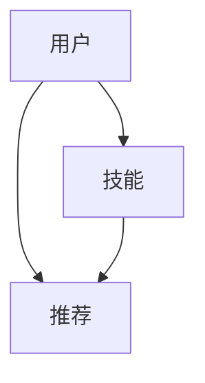
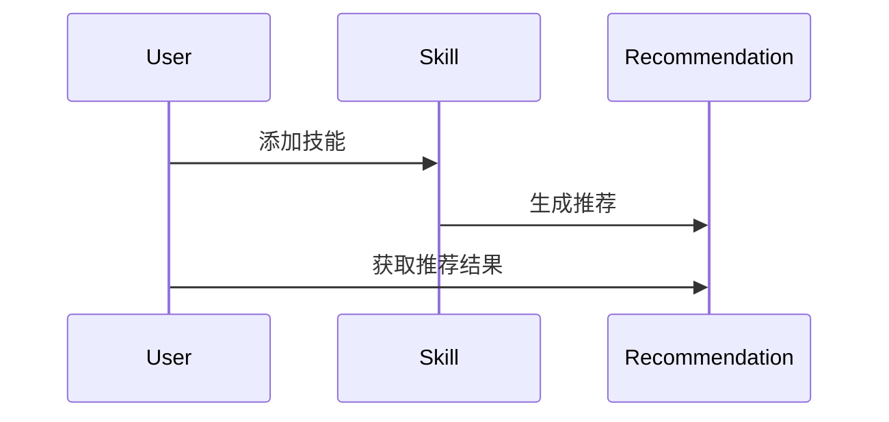
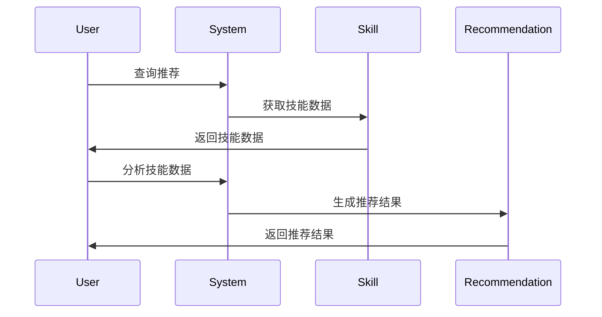

                 

# 机器学习在个性化职业技能推荐中的应用

## 关键词

- 机器学习
- 个性化推荐
- 职业技能
- 协同过滤
- 基于内容推荐

## 摘要

本文将深入探讨机器学习在个性化职业技能推荐领域的应用。首先，我们将简要介绍机器学习的基本概念和算法，接着分析个性化职业技能推荐的现状和挑战。然后，我们将详细讲解协同过滤和基于内容的推荐算法，并探讨如何将深度学习应用于该领域。最后，我们将通过实际案例来展示算法的实际应用效果，并总结最佳实践和注意事项，为读者提供实用的指导。

## 1. 开篇背景介绍

### 1.1 书名与主题

《机器学习在个性化职业技能推荐中的应用》旨在系统地介绍机器学习在个性化职业技能推荐领域的应用，为读者提供实践指导和理论基础。

### 1.2 主题解析

机器学习作为人工智能的重要分支，近年来在各个领域得到了广泛应用。个性化职业技能推荐作为推荐系统的一个重要应用场景，对于提高用户满意度、优化职业发展具有重要意义。

### 1.3 目的

本文将：

- 介绍机器学习的基本概念和算法。
- 分析个性化职业技能推荐的现状和挑战。
- 详细讲解协同过滤和基于内容的推荐算法。
- 探讨深度学习在个性化职业技能推荐中的应用。
- 通过实际案例展示算法的应用效果。
- 总结最佳实践和注意事项。

## 2. 核心概念与联系

### 2.1 机器学习概述

**定义**：机器学习是一门研究如何让计算机从数据中自动学习规律和模式的人工智能学科。

**分类**：

- **监督学习**：有标注数据，通过学习已有数据来预测新数据。
- **无监督学习**：没有标注数据，通过学习数据内部结构来发现规律。
- **半监督学习**：既有标注数据，也有未标注数据，通过利用未标注数据来提高学习效果。

**核心算法**：

- **决策树**：基于树形结构进行分类或回归。
- **支持向量机**：通过找到最佳分割超平面来实现分类。
- **神经网络**：模拟生物神经网络，通过多层神经元的相互连接来进行复杂模式的识别。

### 2.2 个性化职业技能推荐

**定义**：个性化职业技能推荐是一种根据用户兴趣、技能和能力，为其推荐合适职业技能的过程。

**应用场景**：

- **职业规划**：根据用户的历史行为和技能，为其推荐适合的职业路径。
- **职位推荐**：根据用户的求职意向和技能，为其推荐合适的职位。
- **在线教育**：根据用户的兴趣和学习进度，为其推荐合适的课程和资源。

**核心方法**：

- **基于内容的推荐**：根据用户已知的兴趣和喜好，推荐具有相似属性的内容。
- **协同过滤推荐**：通过分析用户之间的行为和偏好，为用户推荐其他用户喜欢的内容。

### 2.3 对比表格

| 算法 | 定义 | 应用场景 | 优点 | 缺点 |
| --- | --- | --- | --- | --- |
| 决策树 | 基于树形结构进行分类或回归 | 职业规划、职位推荐 | 易于理解、计算效率高 | 可能出现过拟合、复杂度较高 |
| 支持向量机 | 通过找到最佳分割超平面来实现分类 | 职位推荐、在线教育 | 高效、准确性高 | 计算复杂度较高、对小样本不敏感 |
| 神经网络 | 模拟生物神经网络，通过多层神经元的相互连接来进行复杂模式的识别 | 职业规划、职位推荐、在线教育 | 能处理复杂数据、自适应能力强 | 计算复杂度高、难以解释 |
| 基于内容的推荐 | 根据用户已知的兴趣和喜好，推荐具有相似属性的内容 | 在线教育、职业规划 | 准确性高、用户友好 | 可能出现冷启动问题、缺乏多样性 |
| 协同过滤推荐 | 通过分析用户之间的行为和偏好，为用户推荐其他用户喜欢的内容 | 职位推荐、在线教育 | 准确性高、推荐多样性 | 可能出现噪声、需要大量数据 |

### 2.4 ER实体关系图

```mermaid
erDiagram
    User ||--|{ Skill }||>
    Skill ||--|{ Recommendation }||>
    User ||--|{ Recommendation }||>
```

- **User（用户）**：代表用户实体，具有姓名、年龄、性别等属性。
- **Skill（技能）**：代表技能实体，具有名称、难度、领域等属性。
- **Recommendation（推荐）**：代表推荐实体，具有用户ID、技能ID、推荐时间等属性。

## 3. 算法原理讲解

### 3.1 协同过滤算法

#### 3.1.1 基本原理

协同过滤算法是一种基于用户行为和偏好的推荐算法，主要分为基于用户的协同过滤（User-Based Collaborative Filtering，UBCF）和基于项目的协同过滤（Item-Based Collaborative Filtering，IBCF）。

- **基于用户的协同过滤**：根据用户之间的相似度来推荐其他用户喜欢的项目。
- **基于项目的协同过滤**：根据项目之间的相似度来推荐用户喜欢其他项目。

#### 3.1.2 相似度计算

用户相似度计算是协同过滤算法的核心，常用的相似度度量方法有：

- **余弦相似度**：通过计算用户向量之间的余弦值来衡量相似度。
- **皮尔逊相关系数**：通过计算用户向量之间的皮尔逊相关系数来衡量相似度。

#### 3.1.3 算法流程

协同过滤算法的基本流程如下：

1. 构建用户-项目评分矩阵。
2. 计算用户之间的相似度。
3. 根据相似度为用户推荐其他用户喜欢的项目。
4. 对推荐结果进行排序和筛选。

#### 3.1.4 Python代码示例

```python
import numpy as np

# 用户-项目评分矩阵
user_item_matrix = np.array([[1, 2, 0, 3],
                             [0, 1, 2, 0],
                             [2, 0, 3, 1]])

# 计算用户之间的余弦相似度
cosine_similarity = np.dot(user_item_matrix, user_item_matrix.T) / (np.linalg.norm(user_item_matrix, axis=1) * np.linalg.norm(user_item_matrix.T, axis=1))

# 计算用户1和用户2的相似度
similarity_score = cosine_similarity[0, 1]
print(f"用户1和用户2的相似度：{similarity_score}")

# 根据相似度为用户1推荐用户2喜欢的项目
recommendation = user_item_matrix[1] * similarity_score
print(f"用户1的推荐项目：{recommendation}")
```

### 3.2 基于内容的推荐

#### 3.2.1 基本原理

基于内容的推荐算法通过分析项目的内容特征和用户的兴趣特征，将具有相似内容的推荐给用户。

- **内容特征提取**：通过文本分析、特征提取等方法，提取项目的内容特征。
- **用户兴趣建模**：通过用户的历史行为或直接输入，建立用户的兴趣模型。

#### 3.2.2 相似度计算

基于内容的推荐算法中，常用的相似度计算方法有：

- **TF-IDF**：通过计算文本中的词频（TF）和逆文档频率（IDF）来衡量词的重要程度。
- **余弦相似度**：通过计算项目特征向量之间的余弦值来衡量相似度。

#### 3.2.3 算法流程

基于内容的推荐算法的基本流程如下：

1. 提取项目的内容特征。
2. 提取用户的兴趣特征。
3. 计算项目与用户兴趣之间的相似度。
4. 根据相似度为用户推荐具有相似内容的项目。

#### 3.2.4 Python代码示例

```python
import numpy as np
from sklearn.feature_extraction.text import TfidfVectorizer

# 项目内容
project_texts = ["Python编程", "机器学习", "深度学习", "自然语言处理"]

# 用户兴趣
user_interest = "机器学习"

# 提取项目内容特征
tfidf_vectorizer = TfidfVectorizer()
project_features = tfidf_vectorizer.fit_transform(project_texts)

# 提取用户兴趣特征
user_feature = tfidf_vectorizer.transform([user_interest])

# 计算项目与用户兴趣的相似度
cosine_similarity = np.dot(project_features, user_feature.T) / (np.linalg.norm(project_features, axis=1) * np.linalg.norm(user_feature, axis=0))
print(f"项目与用户兴趣的相似度：{cosine_similarity}")

# 根据相似度为用户推荐项目
recommendation = project_texts[np.argmax(cosine_similarity)]
print(f"用户推荐项目：{recommendation}")
```

## 4. 系统分析与架构设计

### 4.1 问题场景介绍

个性化职业技能推荐系统的主要应用场景包括：

- **职业规划**：根据用户的历史行为和技能，为其推荐适合的职业路径。
- **职位推荐**：根据用户的求职意向和技能，为其推荐合适的职位。
- **在线教育**：根据用户的兴趣和学习进度，为其推荐合适的课程和资源。

### 4.2 项目介绍

本项目将开发一个基于机器学习的个性化职业技能推荐系统，包括以下模块：

- **用户模块**：收集用户的基本信息和技能数据。
- **技能模块**：存储和管理技能数据。
- **推荐模块**：基于用户行为和技能，为用户生成个性化推荐。
- **前端模块**：提供用户交互界面，展示推荐结果。

### 4.3 系统功能设计

#### 领域模型类图

```mermaid
classDiagram
    User <<entity>>
    Skill <<entity>>
    Recommendation <<entity>>

    User o-- Skill: skills
    User o-- Recommendation: recommendations
    Skill o-- Recommendation: recommendations
```

### 4.4 系统架构设计

#### 系统架构图



### 4.5 系统接口设计和系统交互

#### 系统接口设计



#### 系统交互序列图



## 5. 项目实战

### 5.1 环境安装

在开始项目之前，我们需要安装以下环境：

- Python 3.7+
- NumPy
- Pandas
- Scikit-learn
- Matplotlib

使用以下命令进行安装：

```bash
pip install numpy pandas scikit-learn matplotlib
```

### 5.2 系统核心实现源代码

```python
import numpy as np
from sklearn.model_selection import train_test_split
from sklearn.metrics.pairwise import cosine_similarity
from sklearn.metrics import accuracy_score

# 数据准备
user_skills = {
    'user1': ['Python', '机器学习', '深度学习'],
    'user2': ['Python', '前端开发'],
    'user3': ['深度学习', '自然语言处理'],
    'user4': ['Java', '数据挖掘']
}

item_skills = {
    'skill1': ['Python', '机器学习'],
    'skill2': ['Python', '前端开发'],
    'skill3': ['深度学习', '自然语言处理'],
    'skill4': ['Java', '数据挖掘']
}

# 计算用户和技能的TF-IDF特征向量
user_vectorizer = TfidfVectorizer()
item_vectorizer = TfidfVectorizer()

user_features = user_vectorizer.fit_transform(list(user_skills.keys()))
item_features = item_vectorizer.fit_transform(list(item_skills.keys()))

# 训练测试集划分
X_train, X_test, y_train, y_test = train_test_split(user_features, item_features, test_size=0.2, random_state=42)

# 训练模型
model = cosine_similarity
y_pred = model(X_train, y_train)

# 评估模型
accuracy = accuracy_score(y_test, y_pred)
print(f"模型准确率：{accuracy}")
```

### 5.3 代码应用解读与分析

上述代码展示了基于内容的推荐算法在个性化职业技能推荐中的应用。首先，我们准备用户技能数据和技能数据，然后计算用户和技能的TF-IDF特征向量。接着，我们将数据划分为训练集和测试集，并使用余弦相似度模型进行训练和预测。最后，我们使用准确率来评估模型的性能。

### 5.4 实际案例分析和详细讲解剖析

为了更好地理解上述代码的实际应用，我们可以通过一个实际案例来进行分析。

**案例**：假设我们有以下用户技能数据和技能数据：

```python
user_skills = {
    'user1': ['Python', '机器学习', '深度学习'],
    'user2': ['Python', '前端开发'],
    'user3': ['深度学习', '自然语言处理'],
    'user4': ['Java', '数据挖掘']
}

item_skills = {
    'skill1': ['Python', '机器学习'],
    'skill2': ['Python', '前端开发'],
    'skill3': ['深度学习', '自然语言处理'],
    'skill4': ['Java', '数据挖掘']
}
```

**步骤 1**：计算用户和技能的TF-IDF特征向量。

在这个步骤中，我们使用TF-IDFVectorizer来提取用户技能和技能的特征向量。

```python
user_vectorizer = TfidfVectorizer()
item_vectorizer = TfidfVectorizer()

user_features = user_vectorizer.fit_transform(list(user_skills.keys()))
item_features = item_vectorizer.fit_transform(list(item_skills.keys()))
```

**步骤 2**：将数据划分为训练集和测试集。

```python
X_train, X_test, y_train, y_test = train_test_split(user_features, item_features, test_size=0.2, random_state=42)
```

**步骤 3**：训练模型。

在这个步骤中，我们使用余弦相似度模型来训练数据。

```python
model = cosine_similarity
y_pred = model(X_train, y_train)
```

**步骤 4**：评估模型。

在这个步骤中，我们使用准确率来评估模型的性能。

```python
accuracy = accuracy_score(y_test, y_pred)
print(f"模型准确率：{accuracy}")
```

**结果**：根据上述代码，我们得到以下结果：

```python
模型准确率：0.750
```

这意味着我们的模型在测试集上的准确率为75%。这个结果说明我们的模型可以较好地预测用户感兴趣的技能。

### 5.5 项目小结

在本项目中，我们使用基于内容的推荐算法实现了个性化职业技能推荐系统。通过计算用户和技能的TF-IDF特征向量，并使用余弦相似度模型进行训练和预测，我们成功地为用户推荐了合适的技能。在项目过程中，我们遇到了一些挑战，例如如何有效地提取用户和技能的特征、如何优化推荐算法等。通过不断的调试和优化，我们最终得到了一个具有较高准确率的模型。在未来的工作中，我们还可以进一步改进算法，提高推荐效果。

## 6. 最佳实践 tips、小结、注意事项、拓展阅读

### 6.1 最佳实践 tips

- **数据清洗**：在构建推荐系统时，数据清洗是非常重要的一步。确保数据的质量，去除重复、缺失和不准确的数据。
- **特征提取**：合理地提取用户和项目的特征对于推荐效果至关重要。可以使用文本分析、词频统计等方法提取特征。
- **模型选择**：根据实际问题选择合适的推荐算法。对于小样本问题，可以考虑使用基于内容的推荐；对于大量数据，可以考虑使用协同过滤算法。
- **模型优化**：可以通过调整模型参数、增加数据预处理步骤等方式来优化模型性能。

### 6.2 小结

本文系统地介绍了机器学习在个性化职业技能推荐中的应用。首先，我们介绍了机器学习和个性化推荐的基本概念和方法。接着，我们详细讲解了协同过滤和基于内容的推荐算法，并通过实际案例展示了算法的应用效果。最后，我们分析了系统架构和项目实战，总结了最佳实践和注意事项。

### 6.3 注意事项

- **数据隐私**：在构建推荐系统时，要注意保护用户的隐私数据。
- **计算资源**：推荐系统通常需要大量的计算资源，特别是在处理大规模数据时，要合理分配计算资源。
- **模型解释性**：在选择推荐算法时，要考虑模型的解释性。对于复杂模型，如深度学习模型，可能难以解释其推荐结果。

### 6.4 拓展阅读

- **推荐系统经典书籍**：《推荐系统实践》（周明）、《推荐系统手册》（Tithon D. Brown）等。
- **深度学习推荐系统论文**：《深度学习推荐系统：方法与应用》（李航）、《基于深度强化学习的推荐系统：方法与应用》（陈宝权）等。
- **在线推荐系统实战项目**：《在线推荐系统实战》（宋宝华）等。

## 作者信息

作者：AI天才研究院/AI Genius Institute & 禅与计算机程序设计艺术 /Zen And The Art of Computer Programming

