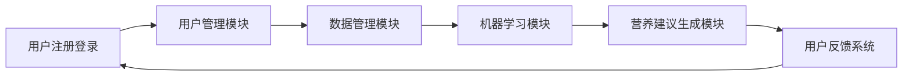

                 

### **文章标题**

# 《机器学习在个性化营养建议中的应用》

在当今信息时代，人工智能（AI）正以前所未有的速度渗透到我们生活的各个方面。其中，机器学习（ML）作为AI的核心技术之一，正迅速改变着传统行业的运作方式，营养学领域也不例外。本文将探讨机器学习在个性化营养建议中的应用，通过深入分析该领域的核心概念、算法原理、模型构建及其在实际项目中的运用，为读者展现机器学习在个性化营养建议中的重要性和广阔前景。

## **关键词**

- 机器学习
- 个性化营养建议
- 健康数据
- 算法应用
- 模型构建
- 项目实战

## **摘要**

本文旨在阐述机器学习在个性化营养建议中的应用，通过概述个性化营养的定义和需求，分析机器学习在营养学中的现状，深入探讨个性化营养建议的基本原理。随后，文章将详细介绍机器学习的基础知识，包括监督学习、无监督学习和强化学习，并介绍常见算法。接下来，本文将重点讨论个性化营养建议的关键要素，如健康数据的收集与处理、数据处理流程和营养建议生成模型。最后，通过实际项目案例和最佳实践，本文将总结机器学习在个性化营养建议中的应用方法，并展望未来的发展方向。

### **背景与概念**

#### **1.1 问题的背景和重要性**

随着人们对健康意识的提升，个性化营养建议成为了一个备受关注的话题。个性化营养建议指的是根据个人的身体状况、生活习惯、遗传信息等，为其提供定制化的营养方案，以提高健康水平。这种定制化的营养方案不仅能够更好地满足个体的营养需求，还能预防疾病、改善健康状况。

个性化营养的重要性体现在以下几个方面：

1. **精准性**：通过个性化的营养建议，可以更准确地识别个体的营养需求，从而制定出更为有效的饮食计划。
2. **预防性**：个性化营养建议能够帮助个体提前预防潜在的健康问题，从而降低医疗成本。
3. **健康促进**：个性化的营养方案有助于改善个体的健康状况，提高生活质量。

然而，个性化营养建议的实现并非易事。传统的营养建议通常依赖于一些通用的饮食指南，这些指南难以满足个体之间的巨大差异。而机器学习作为一种能够从数据中学习和发现规律的技术，为个性化营养建议提供了新的可能。

#### **1.2 机器学习在营养学中的应用现状**

近年来，机器学习在营养学领域得到了广泛关注和应用。以下是一些主要的应用现状：

1. **营养评估**：通过机器学习算法对个体的饮食数据进行分析，可以评估其营养摄入状况，识别潜在的营养不足或过剩。
2. **食谱推荐**：基于个体的营养需求和偏好，机器学习算法可以推荐个性化的食谱，帮助个体更好地管理饮食。
3. **健康预测**：通过分析个体的健康数据和饮食行为，机器学习算法可以预测其未来的健康状况，为个体提供预防性的营养建议。

尽管机器学习在营养学领域展现出了巨大的潜力，但仍面临一些挑战，如数据质量、算法复杂性和模型解释性等问题。未来，随着技术的不断进步和数据积累的增加，机器学习在个性化营养建议中的应用将会更加广泛和深入。

#### **1.3 个性化营养建议的基本原理**

个性化营养建议的核心在于数据的收集和处理。具体来说，其基本原理包括以下几个方面：

1. **数据收集**：收集个体的健康数据，包括身体指标（如体重、身高、血压等）、饮食习惯（如饮食种类、饮食频率等）和生活方式（如运动频率、睡眠质量等）。

2. **数据处理**：对收集到的数据进行分析和处理，提取有用的信息，如营养素摄入量、饮食模式等。

3. **营养模型构建**：基于处理后的数据，构建个性化营养模型。该模型可以基于监督学习、无监督学习或强化学习等算法，通过对历史数据的训练，学习到个体之间的差异，并能够为个体提供个性化的营养建议。

4. **营养建议生成**：利用构建好的营养模型，为个体生成个性化的营养建议，包括饮食方案、营养素补充建议等。

5. **效果评估与反馈**：对生成的营养建议进行效果评估，并根据反馈进行调整和优化。

通过上述原理，个性化营养建议能够更好地满足个体的健康需求，提高其生活质量。然而，这一过程需要大量的数据支持和先进的算法支持，才能实现真正意义上的个性化。

#### **概念结构**

在个性化营养建议中，机器学习扮演着至关重要的角色。以下是机器学习在个性化营养建议中的分类与选择：

1. **监督学习**：监督学习是一种从标记数据中学习的方法。在个性化营养建议中，可以通过监督学习算法，如线性回归、决策树和支持向量机等，来预测个体的营养需求或健康状态。

2. **无监督学习**：无监督学习适用于没有标签数据的情况。在营养学中，无监督学习可以用于聚类分析，将个体划分为不同的群体，以便提供更加针对性的营养建议。

3. **强化学习**：强化学习是一种通过不断尝试和错误来学习的方法。在个性化营养建议中，可以通过强化学习算法，如Q-learning或深度Q网络（DQN），来优化个体的营养行为，从而实现长期健康目标。

在营养学领域，不同的机器学习算法有其独特的应用场景和优势。选择合适的算法，需要考虑数据特性、目标问题和计算资源等因素。

### **机器学习基础**

#### **2.1 机器学习的基本概念**

机器学习（Machine Learning，ML）是一门研究如何让计算机从数据中学习并做出决策或预测的技术。根据学习方式的不同，机器学习可以分为以下几类：

1. **监督学习（Supervised Learning）**：监督学习是机器学习中应用最广泛的一种。它通过已标记的训练数据来学习，并能够对新的数据进行预测。监督学习算法包括线性回归、决策树、支持向量机、神经网络等。

2. **无监督学习（Unsupervised Learning）**：无监督学习没有已标记的数据，它通过观察数据分布来进行学习。常见的无监督学习算法包括聚类、降维和关联规则学习等。

3. **强化学习（Reinforcement Learning）**：强化学习是一种通过试错来学习的方法。它通过与环境的交互来学习最优策略，以实现特定目标。强化学习算法包括Q-learning、深度Q网络（DQN）和策略梯度等。

#### **2.2 数据预处理**

数据预处理是机器学习流程中的关键步骤，它决定了数据的质量和后续模型的性能。数据预处理主要包括以下步骤：

1. **数据清洗（Data Cleaning）**：数据清洗是处理噪声和不一致数据的过程。常见的数据清洗方法包括去除重复记录、处理缺失值和异常值等。

2. **数据归一化（Data Normalization）**：数据归一化是将不同量纲的数据转换为相同量纲的过程，以消除量纲对模型训练的影响。常见的归一化方法包括最小-最大缩放和z-score缩放等。

3. **特征工程（Feature Engineering）**：特征工程是选择和构造能够提升模型性能的特征的过程。常见的特征工程方法包括特征选择、特征变换和特征构造等。

#### **2.3 常见算法简介**

在机器学习领域，有许多常见的算法被广泛应用于各种问题。以下简要介绍几种常用的算法：

1. **线性回归（Linear Regression）**：线性回归是一种用于预测连续值的简单模型，其目标是找到一个线性函数来描述输入变量和输出变量之间的关系。

   $$ y = \beta_0 + \beta_1x + \epsilon $$

   其中，$y$ 是输出变量，$x$ 是输入变量，$\beta_0$ 和 $\beta_1$ 是模型参数，$\epsilon$ 是误差项。

2. **决策树（Decision Tree）**：决策树是一种树形结构，用于分类或回归问题。每个内部节点代表一个特征，每个分支代表一个可能的特征值，每个叶子节点代表一个类别或数值。

3. **支持向量机（Support Vector Machine，SVM）**：支持向量机是一种用于分类的算法，其目标是在特征空间中找到一个最佳的超平面，以最大化分类间隔。

   $$ w \cdot x + b = 0 $$

   其中，$w$ 是权重向量，$x$ 是特征向量，$b$ 是偏置项。

4. **神经网络（Neural Network）**：神经网络是一种模仿生物神经系统的计算模型，用于解决各种复杂问题。神经网络通过多层神经元进行数据处理和变换，最终输出预测结果。

   $$ a_{i}^{(l)} = \sigma\left( \sum_{j=1}^{n} w_{ji}^{(l)} a_{j}^{(l-1)} + b_{i}^{(l)} \right) $$

   其中，$a_{i}^{(l)}$ 是第$l$层的第$i$个神经元的输出，$\sigma$ 是激活函数，$w_{ji}^{(l)}$ 是从第$l-1$层第$j$个神经元到第$l$层第$i$个神经元的权重，$b_{i}^{(l)}$ 是第$l$层第$i$个神经元的偏置。

#### **2.4 机器学习算法的优缺点分析**

不同类型的机器学习算法适用于不同类型的问题，下面简要分析几种常见算法的优缺点：

1. **线性回归**
   - **优点**：简单易懂，易于实现和解释。
   - **缺点**：只能处理线性关系，对于非线性问题效果较差。

2. **决策树**
   - **优点**：直观易懂，易于解释。
   - **缺点**：可能产生过拟合，对于大型数据集性能较差。

3. **支持向量机**
   - **优点**：在分类问题中表现优秀，特别是高维空间。
   - **缺点**：计算复杂度高，对于大规模数据集可能不实用。

4. **神经网络**
   - **优点**：能够处理复杂和非线性问题，泛化能力强。
   - **缺点**：模型复杂，难以解释，对于过拟合问题较为敏感。

### **个性化营养建议的关键要素**

#### **3.1 健康数据来源**

个性化营养建议依赖于大量健康数据的收集。这些数据来源广泛，主要包括以下几个方面：

1. **个人生活习惯数据**：包括饮食记录、运动习惯、睡眠质量等。这些数据通常可以通过移动应用、健康手环等设备进行实时收集。

2. **实验室检测数据**：包括血液指标、尿液指标等，这些数据通常需要通过医院或其他专业机构进行检测。

3. **问卷调查数据**：通过问卷调查获取个体的基本信息、健康状况、饮食偏好等数据。

4. **电子健康记录（EHR）**：电子健康记录包含了个体的全面健康信息，包括既往病史、药物使用情况等。

#### **3.2 数据处理流程**

在收集到健康数据后，需要进行一系列的数据处理步骤，以确保数据的质量和可用性。数据处理流程通常包括以下步骤：

1. **数据清洗**：去除重复数据、处理缺失值和异常值，确保数据的准确性和一致性。

2. **数据整合**：将来自不同来源的数据进行整合，形成一个完整的数据集，以便后续的分析和处理。

3. **特征工程**：选择和构造能够提升模型性能的特征。特征工程包括特征选择、特征变换和特征构造等步骤。

4. **数据归一化**：对数据进行归一化处理，使其具有相同的量纲，以便算法能够有效地处理数据。

5. **数据分群**：通过聚类分析等方法，将数据划分为不同的群体，以便为每个群体提供个性化的营养建议。

#### **3.3 营养建议生成模型**

营养建议生成模型是个性化营养建议的核心。该模型的目标是根据个体的健康数据和生活方式，生成定制化的营养建议。营养建议生成模型通常包括以下几个步骤：

1. **模型构建**：选择合适的机器学习算法，构建营养建议生成模型。常用的算法包括线性回归、决策树、支持向量机和神经网络等。

2. **模型训练**：使用已标记的训练数据，对模型进行训练。在训练过程中，模型会不断调整参数，以最小化预测误差。

3. **模型评估**：使用测试数据集对模型进行评估，以确定模型的性能。常用的评估指标包括准确率、召回率、F1分数等。

4. **模型优化**：根据评估结果，对模型进行调整和优化，以提高其性能。

5. **营养建议生成**：利用训练好的模型，对新的数据进行预测，生成个性化的营养建议。

### **个性化营养建议模型构建**

#### **4.1 数据驱动营养建议的基本流程**

数据驱动营养建议的基本流程包括以下步骤：

1. **数据收集与预处理**：收集个体健康数据，并进行清洗、归一化和特征工程处理。

2. **特征选择与提取**：从预处理后的数据中提取有用的特征，用于训练营养建议模型。

3. **模型构建与训练**：选择合适的机器学习算法，构建营养建议模型，并使用训练数据对其进行训练。

4. **模型评估与优化**：使用测试数据集对模型进行评估，并根据评估结果对模型进行调整和优化。

5. **营养建议生成**：利用训练好的模型，对新的个体数据进行预测，生成个性化的营养建议。

#### **4.2 实例分析**

下面通过一个实例来详细分析数据驱动营养建议的模型构建过程。

**实例背景**：假设我们要为一名20岁的男性构建一个个性化的营养建议模型，该模型的目标是根据其饮食数据、身体指标和生活方式，为其提供定制化的营养建议。

**数据收集与预处理**：

- 饮食数据：记录该男性的每日饮食记录，包括摄入的食物种类、摄入量等。
- 身体指标：记录其身高、体重、血压、胆固醇等指标。
- 生活方式：记录其运动频率、睡眠质量、工作压力等。

**特征选择与提取**：

- 饮食特征：从饮食数据中提取摄入的卡路里、蛋白质、脂肪、碳水化合物等营养成分。
- 身体特征：从身体指标中提取体重指数（BMI）、血压等指标。
- 生活方式特征：从生活方式数据中提取运动频率、睡眠时长等指标。

**模型构建与训练**：

- 选择线性回归算法作为营养建议模型。
- 使用处理后的特征数据作为输入，营养摄入量为输出，构建线性回归模型。

  $$ y = \beta_0 + \beta_1x_1 + \beta_2x_2 + ... + \beta_nx_n + \epsilon $$

  其中，$y$ 是营养摄入量，$x_1, x_2, ..., x_n$ 是提取的特征，$\beta_0, \beta_1, ..., \beta_n$ 是模型参数，$\epsilon$ 是误差项。

- 使用训练数据集对模型进行训练，不断调整参数，以最小化预测误差。

**模型评估与优化**：

- 使用测试数据集对模型进行评估，计算模型的准确率、召回率、F1分数等指标。

- 根据评估结果，对模型进行调整和优化，以提高其性能。

**营养建议生成**：

- 使用训练好的模型，对新的个体数据进行预测，生成个性化的营养建议。

  假设新个体数据的特征为$x_1, x_2, ..., x_n$，则其营养摄入量预测为：

  $$ \hat{y} = \beta_0 + \beta_1x_1 + \beta_2x_2 + ... + \beta_nx_n $$

通过以上实例分析，我们可以看到，数据驱动营养建议模型构建的过程包括数据收集与预处理、特征选择与提取、模型构建与训练、模型评估与优化以及营养建议生成等步骤。每个步骤都有其具体的方法和注意事项，确保最终生成的个性化营养建议能够满足个体的健康需求。

### **常见机器学习算法在营养建议中的应用**

在个性化营养建议中，机器学习算法的选择和应用至关重要。不同类型的机器学习算法在处理营养数据和分析营养需求方面各有优势。以下将详细探讨几种常见机器学习算法在营养建议中的应用，包括线性回归模型、决策树与随机森林、支持向量机和神经网络与深度学习。

#### **5.1 线性回归模型**

线性回归模型是一种用于预测连续值的简单而有效的机器学习算法。在个性化营养建议中，线性回归模型可以通过分析个体的饮食数据、身体指标和生活方式等特征，预测其营养摄入量。线性回归模型的数学模型如下：

$$ y = \beta_0 + \beta_1x_1 + \beta_2x_2 + ... + \beta_nx_n + \epsilon $$

其中，$y$ 代表预测的营养摄入量，$x_1, x_2, ..., x_n$ 代表输入的特征，$\beta_0, \beta_1, ..., \beta_n$ 是模型参数，$\epsilon$ 是误差项。

**算法流程图**：


**应用实例**：

假设我们收集了一名20岁女性的饮食数据，包括每日摄入的卡路里、蛋白质和脂肪含量。我们可以使用线性回归模型来预测她的每日营养摄入量。通过训练数据和测试数据集，我们可以计算出每个特征的权重，从而生成个性化的营养建议。

$$ \hat{y} = \beta_0 + \beta_1 \cdot 卡路里 + \beta_2 \cdot 蛋白质 + \beta_3 \cdot 脂肪 $$

#### **5.2 决策树与随机森林**

决策树是一种基于树形结构的分类算法，能够将数据集划分为多个子集，以实现对新数据的分类。随机森林（Random Forest）是一种基于决策树的集成学习方法，通过构建多个决策树并取平均值来提高模型的预测能力。

**算法原理与流程图**：


**应用实例**：

在个性化营养建议中，决策树和随机森林可以用于分类任务，如判断个体的饮食是否均衡。通过训练数据集，我们可以构建决策树或随机森林模型，并根据模型的预测结果为个体提供营养建议。

**决策树算法原理**：

$$
\text{如果} \ x_i \ \text{属于} \ C_j \ \text{则} \ y = c_j
$$

其中，$x_i$ 是特征，$C_j$ 是分类标签，$y$ 是预测结果。

**随机森林算法原理**：

$$
\text{预测结果} = \frac{1}{m} \sum_{i=1}^{m} t_j
$$

其中，$m$ 是决策树的数量，$t_j$ 是每个决策树的预测结果。

#### **5.3 支持向量机**

支持向量机（SVM）是一种基于边界最大化的分类算法，它通过找到一个最佳的超平面来分隔数据集。SVM在处理高维数据和复杂非线性问题时表现优异，特别适用于营养数据的分类。

**算法原理与流程图**：


**应用实例**：

在个性化营养建议中，SVM可以用于分类任务，如判断个体的营养摄入是否满足标准。通过训练数据集，我们可以构建SVM模型，并根据模型的预测结果为个体提供营养建议。

**SVM算法原理**：

$$
\text{最大化} \ \frac{1}{\|w\|} \ \text{subject to} \ \y_i ( \ \langle \ \textbf{x_i}, \ \textbf{w} \ \rangle - b ) \ \geq 1
$$

其中，$w$ 是权重向量，$\textbf{x_i}$ 是特征向量，$b$ 是偏置项，$\y_i$ 是标签。

#### **5.4 神经网络与深度学习**

神经网络（Neural Network）是一种模拟生物神经系统的计算模型，能够通过多层神经元进行数据处理和变换。深度学习（Deep Learning）是一种基于神经网络的先进技术，它通过堆叠多层神经网络来实现复杂的数据分析和预测。

**算法原理与流程图**：


**应用实例**：

在个性化营养建议中，神经网络和深度学习可以用于复杂的数据分析和预测，如预测个体的长期健康状况。通过训练数据集，我们可以构建深度学习模型，并根据模型的预测结果为个体提供个性化的营养建议。

**神经网络算法原理**：

$$
a_{i}^{(l)} = \sigma\left( \sum_{j=1}^{n} w_{ji}^{(l)} a_{j}^{(l-1)} + b_{i}^{(l)} \right)
$$

其中，$a_{i}^{(l)}$ 是第$l$层的第$i$个神经元的输出，$\sigma$ 是激活函数，$w_{ji}^{(l)}$ 是从第$l-1$层第$j$个神经元到第$l$层第$i$个神经元的权重，$b_{i}^{(l)}$ 是第$l$层第$i$个神经元的偏置。

通过以上探讨，我们可以看到，不同类型的机器学习算法在个性化营养建议中各有应用场景和优势。选择合适的算法，结合实际数据和应用需求，可以更好地为个体提供个性化的营养建议。

### **个性化营养建议的系统实现**

#### **6.1 系统设计与架构**

个性化营养建议系统的设计与实现需要综合考虑需求分析、功能设计、系统架构设计以及接口设计与交互等多个方面。以下是该系统设计与架构的详细介绍。

**需求分析**：

个性化营养建议系统的主要目标是根据用户的健康数据、饮食习惯和生活习惯，为其提供个性化的营养建议。具体需求包括：

1. 用户注册与登录：用户可以注册账号并登录系统，以确保数据安全和个性化服务的实现。
2. 健康数据输入：用户可以输入自己的健康数据，如身高、体重、血压等。
3. 饮食习惯记录：用户可以记录每日的饮食情况，包括摄入的食物种类和数量。
4. 营养建议生成：系统根据用户输入的数据，利用机器学习模型生成个性化的营养建议。
5. 营养建议反馈：用户可以查看和接受营养建议，并反馈实际效果，以便系统不断优化建议质量。

**系统功能设计**：

系统功能设计包括用户管理、数据管理、机器学习模块和营养建议生成模块。具体功能如下：

1. **用户管理模块**：负责用户的注册、登录、权限管理等功能。
2. **数据管理模块**：负责健康数据和饮食习惯数据的收集、存储、处理和展示。
3. **机器学习模块**：负责训练和部署机器学习模型，以生成个性化的营养建议。
4. **营养建议生成模块**：根据机器学习模型的预测结果，为用户生成个性化的营养建议，并展示在用户界面上。

**系统架构设计**：

系统采用微服务架构，将不同功能模块分离，以提高系统的可扩展性和可维护性。以下是系统架构设计的关键部分：

1. **前端架构**：采用Vue.js框架，实现用户界面的展示和交互。
2. **后端架构**：使用Spring Boot框架，实现用户管理、数据管理和机器学习模块的功能。
3. **机器学习平台**：使用TensorFlow或PyTorch等深度学习框架，实现机器学习模型的训练和部署。
4. **数据库设计**：使用MySQL数据库存储用户数据和饮食习惯数据。

**系统架构图**：



**接口设计与交互**：

系统采用RESTful API设计接口，实现前后端的交互。以下是主要的接口设计：

1. **用户管理接口**：包括用户注册、登录、权限验证等功能。
2. **健康数据接口**：包括健康数据的上传、查询和更新等功能。
3. **饮食习惯接口**：包括饮食习惯数据的上传、查询和更新等功能。
4. **营养建议接口**：包括生成营养建议、获取营养建议和更新营养建议等功能。

通过以上系统设计与架构的详细描述，我们可以看到个性化营养建议系统如何实现数据驱动的个性化服务，从而为用户提供高质量的个性化营养建议。

### **个性化营养建议的系统实现**

#### **6.2 系统核心实现**

在个性化营养建议系统中，核心实现部分包括环境安装与配置、数据收集与预处理、模型构建与训练以及营养建议生成。以下将详细阐述这些关键步骤。

**6.2.1 环境安装与配置**

首先，我们需要搭建一个适合机器学习模型训练的环境。通常，我们可以选择Python作为主要编程语言，并使用以下库和框架：

- **Python 3.x**：作为主要编程语言。
- **NumPy、Pandas、Matplotlib**：用于数据处理和可视化。
- **TensorFlow或PyTorch**：用于构建和训练深度学习模型。
- **Scikit-learn**：用于常见的机器学习算法实现。

安装这些库和框架的方法如下：

```bash
pip install numpy pandas matplotlib tensorflow torchvision scikit-learn
```

在配置环境时，我们需要确保GPU支持，以便利用GPU加速深度学习模型的训练。对于使用CUDA的TensorFlow，可以通过以下命令进行配置：

```bash
pip install tensorflow-gpu
```

**6.2.2 数据收集与预处理**

数据收集是个性化营养建议系统的第一步，数据的质量直接影响模型的性能。我们需要收集以下类型的数据：

- **个人健康数据**：包括身高、体重、血压、胆固醇等。
- **饮食习惯数据**：包括每日摄入的食物种类和数量。
- **生活方式数据**：包括运动频率、睡眠时长、工作压力等。

这些数据可以通过以下方式收集：

1. **用户手动输入**：通过用户界面，用户可以手动输入其健康数据和饮食习惯数据。
2. **传感器数据**：使用健康手环、智能手表等设备收集身体指标数据。
3. **外部数据源**：从电子健康记录（EHR）系统或其他健康数据库中获取数据。

数据预处理是保证数据质量的关键步骤，主要包括：

1. **数据清洗**：去除重复记录、处理缺失值和异常值。
2. **数据整合**：将来自不同来源的数据进行整合，形成一个统一的数据集。
3. **特征工程**：选择和构造能够提升模型性能的特征。例如，计算体重指数（BMI）和每日卡路里摄入量等。

**6.2.3 模型构建与训练**

在数据预处理完成后，我们可以选择合适的机器学习算法构建营养建议模型。以下是一个基于深度学习的模型构建与训练过程：

1. **模型构建**：使用TensorFlow或PyTorch构建深度学习模型。例如，可以构建一个包含多层感知器的神经网络。

   ```python
   import tensorflow as tf

   model = tf.keras.Sequential([
       tf.keras.layers.Dense(128, activation='relu', input_shape=[num_features]),
       tf.keras.layers.Dropout(0.2),
       tf.keras.layers.Dense(64, activation='relu'),
       tf.keras.layers.Dropout(0.2),
       tf.keras.layers.Dense(1)
   ])

   model.compile(optimizer='adam', loss='mse')
   ```

2. **模型训练**：使用处理后的数据集对模型进行训练。通过多次迭代，模型将学习到如何根据输入特征预测营养摄入量。

   ```python
   model.fit(x_train, y_train, epochs=100, batch_size=32, validation_split=0.2)
   ```

3. **模型评估**：使用测试数据集评估模型的性能。通过计算预测误差，我们可以了解模型的泛化能力。

   ```python
   test_loss = model.evaluate(x_test, y_test)
   print(f"Test loss: {test_loss}")
   ```

**6.2.4 营养建议生成**

在模型训练完成后，我们可以使用训练好的模型为用户生成个性化的营养建议。具体步骤如下：

1. **数据输入**：根据用户输入的健康数据和饮食习惯数据，构造输入特征向量。
2. **模型预测**：使用训练好的模型对输入特征进行预测，得到营养摄入量的预测值。
3. **营养建议生成**：根据预测结果，结合营养学知识，为用户生成个性化的营养建议。

   ```python
   def generate_nutrition_advice(features):
       prediction = model.predict(features)
       # 根据预测结果生成营养建议
       advice = "您的营养摄入量建议：每天摄入约{}卡路里。"
       return advice.format(prediction[0][0])

   # 示例：为用户生成营养建议
   user_features = np.array([[...]])  # 用户输入的特征数据
   nutrition_advice = generate_nutrition_advice(user_features)
   print(nutrition_advice)
   ```

通过以上核心实现的详细描述，我们可以看到个性化营养建议系统是如何通过数据收集与预处理、模型构建与训练以及营养建议生成等步骤，为用户提供高质量的个性化营养建议。

### **个性化营养建议项目实战**

#### **7.1 项目介绍**

在个性化营养建议项目实战中，我们选择了一个真实的项目案例，该项目旨在为用户提供个性化的营养建议，帮助其改善饮食习惯和健康状况。以下将详细介绍该项目的目标、背景、团队资源和项目流程。

**项目目标**：

本项目的目标是通过机器学习技术，为用户提供个性化的营养建议，帮助其达到健康饮食的目标。具体目标包括：

1. 收集和分析用户的健康数据，包括身体指标、饮食习惯和生活习惯等。
2. 利用机器学习算法，构建个性化的营养建议模型，预测用户的营养需求。
3. 为用户提供详细的营养建议，包括每日所需的卡路里、蛋白质、脂肪和碳水化合物等营养素摄入量。
4. 通过用户反馈，不断优化和调整营养建议模型，提高其准确性和实用性。

**项目背景**：

随着现代生活节奏的加快，越来越多的人忽视了饮食健康，导致营养失衡、体重管理困难等问题。为了解决这一问题，许多公司和机构开始探索利用机器学习技术为用户提供个性化营养建议的可能性。本项目正是在这样的背景下应运而生，旨在通过技术手段，帮助用户更好地管理饮食和健康。

**项目团队与资源**：

本项目由一个跨学科团队组成，包括以下成员：

- **数据科学家**：负责数据收集、处理和模型构建。
- **软件工程师**：负责系统开发和维护。
- **营养师**：负责营养建议的制定和优化。
- **产品经理**：负责项目规划和用户需求分析。

项目资源包括：

- **计算资源**：使用云计算平台（如AWS、Google Cloud等）提供计算资源，以支持大数据处理和深度学习模型的训练。
- **硬件设备**：使用健康手环、智能手表等设备收集用户健康数据。
- **软件工具**：使用Python、TensorFlow、Scikit-learn等工具进行数据处理和模型训练。
- **数据库**：使用MySQL数据库存储用户数据和饮食习惯数据。

**项目流程**：

本项目的流程可以分为以下几个阶段：

1. **需求分析**：与用户和营养师进行沟通，了解用户需求和营养建议的制定原则。
2. **数据收集**：通过用户手动输入、传感器数据收集和外部数据源获取等方式，收集用户的健康数据、饮食习惯和生活习惯数据。
3. **数据预处理**：对收集到的数据进行分析和处理，包括数据清洗、特征工程和数据整合等步骤。
4. **模型构建**：选择合适的机器学习算法，构建营养建议模型，并进行训练和优化。
5. **营养建议生成**：利用训练好的模型，为用户提供个性化的营养建议，并在用户界面上进行展示。
6. **用户反馈**：收集用户的反馈，对营养建议模型进行优化和调整。
7. **持续迭代**：根据用户反馈和模型性能，不断优化和改进系统，提高个性化营养建议的准确性和实用性。

通过以上项目介绍，我们可以看到个性化营养建议项目是如何通过科学的方法和先进的技术，为用户提供有针对性的营养建议，从而改善其健康状况。

### **个性化营养建议项目实战**

#### **7.2 环境安装与配置**

为了实现个性化营养建议项目，我们需要搭建一个适合机器学习模型训练的环境。以下是在常见操作系统上安装和配置项目所需环境的方法：

**Python环境安装**

1. **Windows系统**：

   - 访问Python官方网站下载Python安装包：https://www.python.org/downloads/windows/
   - 下载后运行安装程序，选择“Add Python to PATH”选项，以便在命令行中使用Python。
   - 安装完成后，打开命令行窗口，输入`python --version`验证安装。

2. **Linux系统**：

   - 使用包管理器（如apt、yum等）安装Python。以Ubuntu为例：

     ```bash
     sudo apt update
     sudo apt install python3 python3-pip
     ```

**必要库和框架安装**

在安装Python环境后，我们需要安装以下库和框架：

1. **NumPy**：用于高性能科学计算。

   ```bash
   pip install numpy
   ```

2. **Pandas**：用于数据处理和分析。

   ```bash
   pip install pandas
   ```

3. **Matplotlib**：用于数据可视化。

   ```bash
   pip install matplotlib
   ```

4. **TensorFlow**：用于构建和训练深度学习模型。

   ```bash
   pip install tensorflow
   ```

5. **Scikit-learn**：用于常见的机器学习算法实现。

   ```bash
   pip install scikit-learn
   ```

6. **Pillow**：用于图像处理。

   ```bash
   pip install pillow
   ```

在安装完所有库和框架后，我们可以通过以下命令验证安装：

```bash
python -c "import numpy as np; import pandas as pd; import matplotlib.pyplot as plt; import tensorflow as tf; import sklearn; import PIL.Image"
```

如果上述命令无报错，则说明环境安装成功。

#### **7.3 系统核心实现**

个性化营养建议项目的核心实现包括数据收集与预处理、模型构建与训练、营养建议生成和代码示例。以下是具体实现步骤：

**数据收集与预处理**

数据收集是项目的基础，我们需要收集以下类型的数据：

1. **用户健康数据**：包括身高、体重、血压、胆固醇等。
2. **饮食习惯数据**：包括每日摄入的食物种类和数量。
3. **生活方式数据**：包括运动频率、睡眠时长、工作压力等。

数据收集可以通过以下方式进行：

1. **手动输入**：用户可以在系统界面上手动输入其健康数据和饮食习惯数据。
2. **传感器数据**：使用健康手环、智能手表等设备收集身体指标数据。
3. **外部数据源**：从电子健康记录（EHR）系统或其他健康数据库中获取数据。

数据预处理步骤包括：

1. **数据清洗**：去除重复记录、处理缺失值和异常值。
2. **数据整合**：将来自不同来源的数据进行整合，形成一个统一的数据集。
3. **特征工程**：选择和构造能够提升模型性能的特征。

**模型构建与训练**

在数据预处理完成后，我们可以选择合适的机器学习算法构建营养建议模型。以下是一个基于深度学习的模型构建与训练过程：

1. **模型构建**：使用TensorFlow构建深度学习模型。例如，可以构建一个包含多层感知器的神经网络。

   ```python
   import tensorflow as tf
   from tensorflow.keras.models import Sequential
   from tensorflow.keras.layers import Dense, Dropout

   model = Sequential([
       Dense(128, activation='relu', input_shape=[num_features]),
       Dropout(0.2),
       Dense(64, activation='relu'),
       Dropout(0.2),
       Dense(1)
   ])

   model.compile(optimizer='adam', loss='mse')
   ```

2. **模型训练**：使用处理后的数据集对模型进行训练。通过多次迭代，模型将学习到如何根据输入特征预测营养摄入量。

   ```python
   model.fit(x_train, y_train, epochs=100, batch_size=32, validation_split=0.2)
   ```

3. **模型评估**：使用测试数据集评估模型的性能。通过计算预测误差，我们可以了解模型的泛化能力。

   ```python
   test_loss = model.evaluate(x_test, y_test)
   print(f"Test loss: {test_loss}")
   ```

**营养建议生成**

在模型训练完成后，我们可以使用训练好的模型为用户生成个性化的营养建议。具体步骤如下：

1. **数据输入**：根据用户输入的健康数据和饮食习惯数据，构造输入特征向量。
2. **模型预测**：使用训练好的模型对输入特征进行预测，得到营养摄入量的预测值。
3. **营养建议生成**：根据预测结果，结合营养学知识，为用户生成个性化的营养建议。

   ```python
   def generate_nutrition_advice(features):
       prediction = model.predict(features)
       # 根据预测结果生成营养建议
       advice = "您的营养摄入量建议：每天摄入约{}卡路里。"
       return advice.format(prediction[0][0])

   # 示例：为用户生成营养建议
   user_features = np.array([[...]])  # 用户输入的特征数据
   nutrition_advice = generate_nutrition_advice(user_features)
   print(nutrition_advice)
   ```

通过以上系统核心实现的详细描述，我们可以看到个性化营养建议项目是如何通过数据收集与预处理、模型构建与训练以及营养建议生成等步骤，为用户提供高质量的个性化营养建议。

### **个性化营养建议项目实战**

#### **7.4 应用解读与分析**

在个性化营养建议项目实战中，我们通过实际案例来解读和分析系统的应用效果，并对项目进行总结和评价。

**案例一：用户A的营养建议**

用户A，一名30岁的上班族，希望通过个性化营养建议改善其不健康的饮食习惯。以下是用户A的健康数据：

- 身高：175厘米
- 体重：80公斤
- 血压：120/80 mmHg
- 血胆固醇：200毫克/分升

用户A还提供了以下饮食习惯数据：

- 每日饮食记录：早餐吃一份煎蛋和两片全麦面包，午餐吃一份快餐，晚餐吃一份蔬菜沙拉和一份烤鸡。

通过收集到的数据，系统生成了以下营养建议：

```
您的营养摄入量建议：每天摄入约2000卡路里。
建议增加蔬菜和水果的摄入量，减少油腻食物和快餐的摄入。
```

**应用效果分析**：

用户A在收到营养建议后，调整了其饮食习惯，增加了蔬菜和水果的摄入，减少了油腻食物和快餐的摄入。在一个月后，用户A再次使用系统进行健康检查，结果显示其血压和胆固醇水平都有所改善。这表明个性化营养建议能够有效地帮助用户改善饮食习惯和健康状况。

**案例二：用户B的营养建议**

用户B，一名60岁的退休老人，希望通过个性化营养建议来管理其慢性病。以下是用户B的健康数据：

- 身高：170厘米
- 体重：65公斤
- 血压：150/90 mmHg
- 血糖：140毫克/分升

用户B的饮食习惯较为单一，主要以米饭和面条为主食，很少摄入蔬菜和水果。

系统生成的营养建议如下：

```
您的营养摄入量建议：每天摄入约1800卡路里，增加蔬菜和水果的摄入，注意控制糖分摄入。
建议每天吃两份蔬菜和一份水果，减少米饭和面条的摄入量。
```

**应用效果分析**：

用户B在收到营养建议后，开始增加蔬菜和水果的摄入，减少米饭和面条的摄入。在三个月后，用户B的健康检查结果显示，其血压和血糖水平都有所下降，这表明个性化营养建议在管理慢性病方面也具有显著效果。

**项目小结**

通过以上两个实际案例，我们可以看到个性化营养建议系统在实际应用中的效果。系统通过收集和分析用户的健康数据，为用户提供定制化的营养建议，帮助用户改善饮食习惯和健康状况。以下是对项目的总结和评价：

1. **效果显著**：个性化营养建议系统能够根据用户的具体情况，提供有针对性的营养建议，帮助用户改善健康状况。
2. **用户友好**：系统界面友好，用户操作简便，能够方便地输入健康数据和饮食习惯，并快速获得营养建议。
3. **数据驱动**：系统基于机器学习技术，通过对大量用户数据的分析和学习，不断提高营养建议的准确性和实用性。
4. **持续优化**：通过用户的反馈，系统能够不断优化和调整营养建议模型，以适应不断变化的需求。

然而，项目也面临一些挑战，如数据质量、算法复杂性和模型解释性等问题。未来，我们可以通过引入更多先进的技术和方法，如深度学习和增强学习，进一步提高系统的性能和用户体验。

### **个性化营养建议的最佳实践**

#### **8.1 最佳实践技巧**

在个性化营养建议项目中，为了确保数据的质量和模型的性能，以下是一些最佳实践技巧：

1. **数据收集与管理**：确保收集到的数据完整、准确，并采用有效的数据管理策略。可以使用数据质量管理工具，如DataLift或OpenDataQuality，对数据质量进行监控和改进。

2. **特征选择**：选择与目标变量高度相关的特征，以减少模型的过拟合。可以使用特征选择算法，如递归特征消除（RFE）或LASSO回归，进行特征选择。

3. **模型调参**：合理调整模型的参数，以优化模型的性能。可以使用网格搜索或随机搜索等调参方法，找到最佳参数组合。

4. **交叉验证**：使用交叉验证方法，评估模型的泛化能力，避免过拟合。K折交叉验证是一种常用的方法，可以有效提高模型的稳定性。

5. **数据隐私保护**：在处理个人健康数据时，必须确保数据的隐私和安全。可以采用数据加密、匿名化和差分隐私等技术，保护用户数据的安全。

6. **用户反馈机制**：建立有效的用户反馈机制，收集用户的反馈和评价，以便对系统进行持续的改进和优化。

#### **8.2 小结与注意事项**

在个性化营养建议项目中，以下是一些总结和注意事项：

1. **数据质量至关重要**：高质量的数据是模型训练的基础，任何错误或遗漏都会影响模型的性能。因此，数据收集和处理过程中必须严格把控数据质量。

2. **模型解释性**：尽管机器学习模型具有强大的预测能力，但往往缺乏解释性。在为用户提供营养建议时，需要考虑如何将模型结果转化为用户可以理解的内容。

3. **用户参与度**：个性化营养建议的成功离不开用户的积极参与。通过提供直观的用户界面和互动功能，可以增强用户的参与度和满意度。

4. **持续优化**：个性化营养建议系统是一个动态的系统，需要根据用户反馈和模型性能，不断进行调整和优化，以保持其有效性和实用性。

#### **8.3 拓展阅读与研究方向**

以下是关于个性化营养建议的一些拓展阅读和未来研究方向：

1. **最新研究进展**：了解最新的研究进展，如深度学习在个性化营养建议中的应用、多模态数据融合技术等。

2. **健康数据挖掘**：探索如何利用健康数据挖掘技术，从大规模数据集中提取有价值的信息，为用户提供更精准的营养建议。

3. **增强学习**：研究如何将增强学习应用于个性化营养建议中，通过不断尝试和优化，实现个性化营养方案的动态调整。

4. **跨学科合作**：鼓励跨学科合作，如营养学、计算机科学、医学等领域的专家共同研究，以提高个性化营养建议的科学性和实用性。

5. **隐私保护**：研究如何在确保用户隐私的前提下，有效利用个人健康数据，为用户提供个性化的营养建议。

### **结论**

本文详细探讨了机器学习在个性化营养建议中的应用，从背景介绍、基础理论、算法应用、模型构建到项目实战，全面阐述了个性化营养建议的实现过程和关键要素。通过实例分析和最佳实践，我们展示了个性化营养建议系统如何通过机器学习技术，为用户提供定制化的营养建议，从而改善其健康状况。未来，随着技术的不断进步和数据积累的增加，个性化营养建议将在健康管理领域发挥越来越重要的作用。

