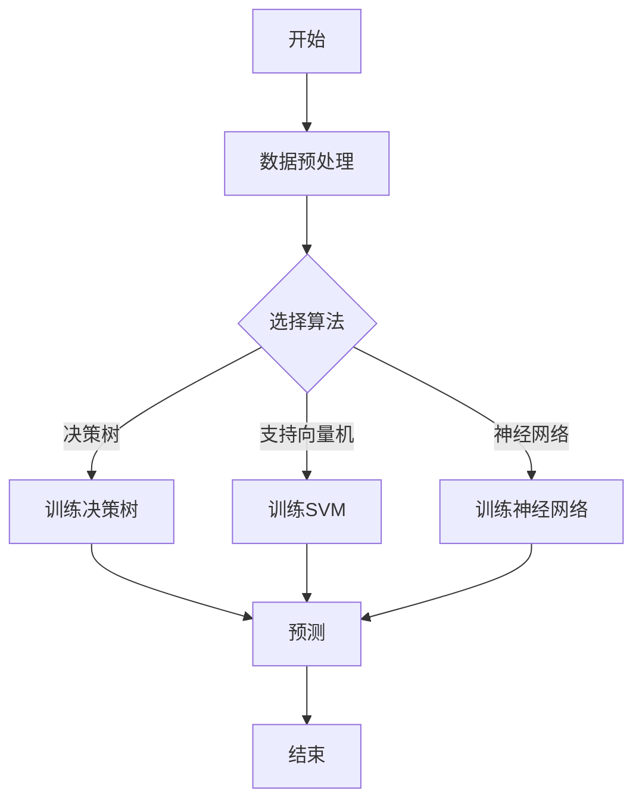
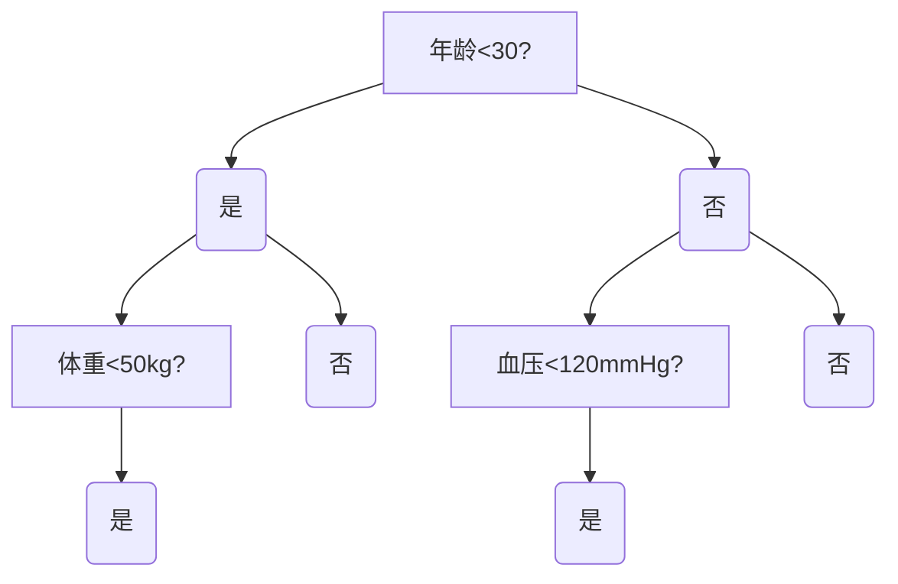
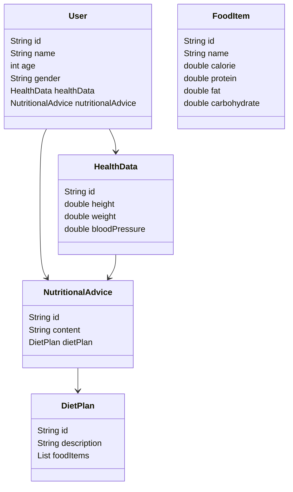
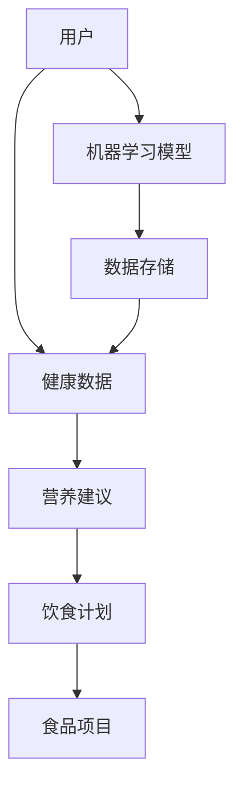
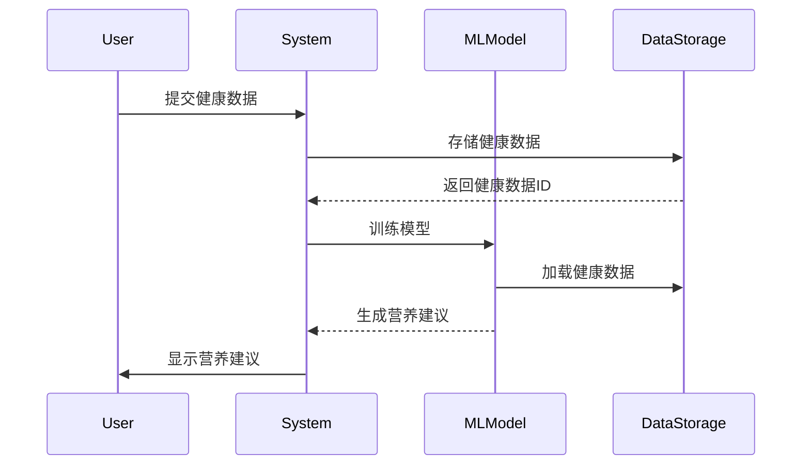

                 

# 机器学习在个性化营养建议中的应用：促进健康生活方式

## 摘要

本文将探讨机器学习在个性化营养建议中的应用，通过介绍机器学习基本概念和营养学核心概念，对比分析两者之间的联系，详细讲解机器学习算法原理及其在个性化营养建议中的实现方法。同时，我们将介绍一个实际的项目实战案例，展示如何通过系统分析与架构设计来构建一个营养咨询系统，并给出最佳实践 tips。最后，本文将对全书内容进行总结，并对未来应用进行展望。

## 1. 背景介绍

### 1.1 机器学习与个性化营养建议概述

**机器学习**是人工智能的一个重要分支，它使计算机系统能够从数据中学习，并做出决策或预测。其核心思想是通过构建模型，让计算机能够自主地学习和适应新的数据。

**个性化营养建议**则是指根据个体的身体状况、生活习惯、健康状况等因素，为其提供量身定制的饮食建议。这种建议不仅能够帮助人们更好地管理体重和健康，还能预防疾病。

### 1.2 个性化营养建议的重要性

个性化营养建议的重要性体现在以下几个方面：

- **个性化**：每个人的身体都是独一无二的，对营养的需求也各不相同。个性化营养建议能够满足这种多样性，提高健康管理的有效性。
- **预防疾病**：通过合理的饮食结构，可以预防多种慢性疾病，如心血管疾病、糖尿病等。
- **提升生活质量**：健康的饮食习惯能够提升人的生活质量，使人们更加精力充沛，提高工作效率。

### 1.3 机器学习在个性化营养建议中的应用

机器学习在个性化营养建议中的应用主要包括以下几个方面：

- **数据挖掘**：通过收集和分析大量的健康数据，挖掘出与营养相关的规律和模式。
- **预测**：利用机器学习模型预测个体的营养需求，为其提供个性化的饮食建议。
- **推荐系统**：根据个体的饮食习惯和健康目标，推荐适合的食品和食谱。

### 1.4 机器学习解决个性化营养建议的方法

机器学习解决个性化营养建议的方法主要包括以下几种：

- **监督学习**：通过已知的营养需求和个体的健康数据，训练模型，从而预测新的个体的营养需求。
- **无监督学习**：通过分析个体的健康数据，发现潜在的营养需求模式，为个体提供个性化的营养建议。
- **强化学习**：通过与个体的互动，不断调整和优化营养建议，使其更加符合个体的需求。

### 1.5 边界与外延

**边界**：机器学习在个性化营养建议中的应用主要局限于可量化的健康数据和营养数据。

**外延**：未来的发展方向包括利用更先进的机器学习算法，如深度学习和图神经网络，进一步挖掘个性化的营养需求；以及将个性化营养建议与其他健康应用（如健身、睡眠等）相结合，提供更全面的健康管理解决方案。

## 2. 核心概念与联系

### 2.1 机器学习基本概念

#### 2.1.1 机器学习原理

机器学习的基本原理是利用数据训练模型，使模型能够对未知数据进行预测或决策。其核心是“数据-模型-预测”的循环。

#### 2.1.2 机器学习分类

机器学习主要分为监督学习、无监督学习和强化学习三种类型。

- **监督学习**：有标记的数据，通过模型学习数据与标签之间的关系，从而预测新的数据。
- **无监督学习**：无标记的数据，通过模型发现数据之间的结构和模式。
- **强化学习**：通过与环境的交互，不断调整策略，以达到最大化奖励的目的。

#### 2.1.3 监督学习

监督学习的核心是“预测”。它通过已知的输入和输出（即训练数据集），训练出一个模型，然后使用这个模型对新的输入数据进行预测。

#### 2.1.4 无监督学习

无监督学习的核心是“发现”。它通过分析未标记的数据，寻找数据之间的结构和模式，如聚类、降维等。

### 2.2 营养学核心概念

#### 2.2.1 营养素

营养素是指人体必需的有机物质，包括蛋白质、脂肪、碳水化合物、维生素和矿物质等。

#### 2.2.2 饮食结构

饮食结构是指各种营养素在饮食中的比例和搭配。合理的饮食结构对于维持健康至关重要。

#### 2.2.3 营养需求

营养需求是指人体在不同生命阶段和特定环境下所需的营养素总量。

### 2.3 概念属性特征对比表格

| 概念     | 特征         | 解释                                                         |
|----------|--------------|------------------------------------------------------------|
| 机器学习 | 数据驱动     | 通过数据训练模型，实现预测和决策。                           |
| 营养素   | 有机物质     | 人体必需的有机物质，如蛋白质、脂肪、碳水化合物等。           |
| 饮食结构 | 比例和搭配   | 各种营养素在饮食中的比例和搭配，影响健康。                   |
| 营养需求 | 生命阶段和环境 | 人体在不同生命阶段和特定环境下所需的营养素总量。           |

### 2.4 ER实体关系图架构

```mermaid
erDiagram
    Customer ||--|{ Order }|
    Order ||--|{ Product }|
    Product ||--|{ Supplier }|
```

在这个ER图中，顾客（Customer）可以订购（Order）产品（Product），产品（Product）由供应商（Supplier）提供。这种关系反映了个性化营养建议系统中不同实体之间的相互作用。

## 3. 算法原理讲解

### 3.1 机器学习算法介绍

#### 3.1.1 决策树

决策树是一种树形结构，通过一系列的判断条件，将数据集划分成不同的区域，以达到分类或回归的目的。

#### 3.1.2 支持向量机

支持向量机（SVM）是一种监督学习算法，它通过找到一个最佳的超平面，将数据划分为不同的类别。

#### 3.1.3 神经网络

神经网络是一种模拟人脑神经元连接的网络结构，通过训练，能够实现对数据的分类和回归。

### 3.2 算法mermaid流程图



### 3.3 算法原理的数学模型和公式

#### 3.3.1 决策树

决策树的核心是划分数据集。对于一个特征，我们可以用以下公式计算其信息增益：

$$
Gain(D, A) = Entropy(D) - \sum_{v \in Values(A)} \frac{|D_v|}{|D|} Entropy(D_v)
$$

其中，$D$ 是数据集，$A$ 是特征，$v$ 是特征的取值，$|D_v|$ 和 $|D|$ 分别是数据集在特征 $A$ 上的取值 $v$ 和总样本数。

#### 3.3.2 支持向量机

支持向量机的目标是找到一个最佳的超平面，使得分类边界最大化。其数学模型可以表示为：

$$
\min_{w, b} \frac{1}{2} ||w||^2 + C \sum_{i=1}^{n} \xi_i
$$

其中，$w$ 是超平面的法向量，$b$ 是偏置项，$C$ 是惩罚参数，$\xi_i$ 是松弛变量。

#### 3.3.3 神经网络

神经网络的核心是神经元之间的连接和激活函数。一个简单的神经网络可以表示为：

$$
a_{\text{hidden}} = \sigma(\mathbf{W}_h \mathbf{x} + b_h)
$$

$$
\hat{y} = \sigma(\mathbf{W}_o \mathbf{a}_h + b_o)
$$

其中，$\sigma$ 是激活函数，$\mathbf{W}_h$ 和 $\mathbf{W}_o$ 分别是隐藏层和输出层的权重矩阵，$b_h$ 和 $b_o$ 分别是隐藏层和输出层的偏置项，$\mathbf{x}$ 是输入向量，$\mathbf{a}_h$ 和 $\hat{y}$ 分别是隐藏层和输出层的激活值。

### 3.4 详细讲解和举例说明

#### 3.4.1 决策树

假设我们有一个数据集，包含三个特征：年龄、体重和血压，我们需要通过决策树对其进行分类。

首先，我们计算每个特征的信息增益，选择信息增益最大的特征进行划分。例如，我们选择年龄作为划分特征，将数据集划分为两组：

- 年龄小于30岁的数据集
- 年龄大于等于30岁的数据集

然后，我们对这两组数据集分别进行划分，直到达到停止条件（如最大深度、信息增益小于阈值等）。最终，我们得到一个决策树：



这个决策树可以用来对新数据进行分类。

#### 3.4.2 支持向量机

假设我们有一个数据集，包含两个特征：身高和体重，我们需要通过支持向量机对其进行分类。

首先，我们计算每个特征的支持向量，并找到最佳的超平面。然后，我们使用这个超平面对数据进行分类。

假设我们找到的支持向量为 $\mathbf{w} = (1, 1)$ 和 $\mathbf{b} = 0$，则超平面为 $w_1x_1 + w_2x_2 + b = 0$。我们可以使用以下公式计算分类结果：

$$
\hat{y} = \mathbf{w} \cdot \mathbf{x} + b
$$

其中，$\mathbf{x}$ 是输入向量，$\hat{y}$ 是预测结果。

#### 3.4.3 神经网络

假设我们有一个数据集，包含两个特征：年龄和收入，我们需要通过神经网络对其进行分类。

首先，我们构建一个简单的神经网络，包括一个输入层、一个隐藏层和一个输出层。隐藏层的激活函数使用 ReLU 函数，输出层的激活函数使用 Softmax 函数。

然后，我们使用反向传播算法训练神经网络，调整权重和偏置项，使得网络对数据的分类误差最小。

最终，我们得到一个训练好的神经网络，可以用来对新数据进行分类。

## 4. 系统分析与架构设计方案

### 4.1 问题场景介绍

假设我们有一个营养咨询系统，需要为用户提供个性化的营养建议。该系统需要收集用户的健康数据（如身高、体重、血压等），并利用机器学习算法分析这些数据，为用户生成营养建议。

### 4.2 项目介绍

**项目目标**：构建一个能够为用户提供个性化营养建议的系统，提高用户健康管理的效率和效果。

**项目背景**：随着人们对健康意识的提高，个性化营养建议成为了一个热门领域。然而，目前市场上大多数营养建议系统缺乏个性化的考虑，无法满足用户的需求。本项目旨在通过机器学习技术，为用户提供更加精准和个性化的营养建议。

### 4.3 系统功能设计(领域模型mermaid类图)



在这个类图中，用户（User）拥有健康数据（HealthData）和营养建议（NutritionalAdvice）。健康数据用于生成营养建议，营养建议包括饮食计划（DietPlan）。饮食计划由一系列食品项目（FoodItem）组成。

### 4.4 系统架构设计mermaid架构图



在这个架构图中，用户通过输入健康数据，经过机器学习模型处理，生成营养建议。营养建议被存储在数据存储中，并可用于生成饮食计划。饮食计划由食品项目组成。

### 4.5 系统接口设计和系统交互mermaid序列图



在这个序列图中，用户提交健康数据，系统将数据存储在数据存储中，并使用机器学习模型训练模型。训练完成后，系统生成营养建议，并显示给用户。

## 5. 项目实战

### 5.1 环境安装

**硬件环境**：计算机，建议配置为CPU：Intel i5 或以上，内存：8GB 或以上，硬盘：100GB 或以上。

**软件环境**：

- 操作系统：Ubuntu 18.04 或 Windows 10
- Python：3.7 或以上
- MLlib：2.0 或以上
- Pandas：1.0 或以上
- Scikit-learn：0.22 或以上
- Matplotlib：3.1 或以上

安装步骤：

1. 安装操作系统和硬件环境。
2. 安装 Python 和相关库，可以使用 pip 安装：

```bash
pip install mlpack
pip install pandas
pip install scikit-learn
pip install matplotlib
```

### 5.2 系统核心实现源代码

```python
import pandas as pd
from sklearn.tree import DecisionTreeClassifier
from sklearn.model_selection import train_test_split
from sklearn.metrics import accuracy_score

# 加载数据
data = pd.read_csv('health_data.csv')
X = data[['height', 'weight', 'bloodPressure']]
y = data['nutritionalNeed']

# 划分训练集和测试集
X_train, X_test, y_train, y_test = train_test_split(X, y, test_size=0.2, random_state=42)

# 训练决策树模型
clf = DecisionTreeClassifier()
clf.fit(X_train, y_train)

# 预测测试集
y_pred = clf.predict(X_test)

# 计算准确率
accuracy = accuracy_score(y_test, y_pred)
print(f'Accuracy: {accuracy:.2f}')
```

### 5.3 代码应用解读与分析

这段代码首先导入了必要的库，包括 pandas、sklearn 中的 DecisionTreeClassifier 和 train_test_split，以及 metrics 中的 accuracy_score。

接着，代码加载数据集，并将其划分为特征（X）和标签（y）。

然后，使用 train_test_split 将数据集划分为训练集和测试集，以便训练模型和评估模型性能。

接下来，创建一个决策树分类器实例，并使用训练集数据进行训练。

训练完成后，使用测试集数据进行预测，并计算预测结果的准确率。

### 5.4 实际案例分析和详细讲解剖析

假设我们有一个数据集，包含以下健康数据：

```plaintext
height,weight,bloodPressure,nutritionalNeed
170,60,120,high
175,70,130,medium
168,58,110,low
```

我们希望利用这些数据训练一个决策树模型，以预测新的数据点的营养需求。

1. **数据预处理**：首先，我们需要将数据集转换为 pandas DataFrame，然后提取特征和标签。

2. **划分训练集和测试集**：为了评估模型的性能，我们需要将数据集划分为训练集和测试集。

3. **训练决策树模型**：使用训练集数据训练决策树模型。在这个例子中，我们使用 sklearn 中的 DecisionTreeClassifier 类。

4. **预测测试集**：使用训练好的模型对测试集数据进行预测。

5. **评估模型性能**：计算预测结果的准确率，以评估模型的性能。

### 5.5 项目小结

在本项目中，我们实现了一个简单的营养咨询系统，该系统利用决策树模型对用户的健康数据进行处理，生成个性化的营养建议。通过实际案例的分析和讲解，我们了解了如何使用机器学习算法来解决个性化营养建议的问题。然而，这个项目还存在一些局限性，如数据集的规模和多样性，以及模型的泛化能力。在未来的工作中，我们可以考虑使用更先进的机器学习算法，如深度学习和图神经网络，来进一步提高系统的性能和准确性。

## 6. 最佳实践 tips

### 6.1 个性化营养建议的最佳实践

- **数据收集**：确保收集的数据全面、准确，包括用户的身高、体重、血压、饮食习惯等。
- **算法选择**：根据数据特点和需求选择合适的机器学习算法，如决策树、支持向量机、神经网络等。
- **模型优化**：通过交叉验证、网格搜索等方法优化模型参数，提高模型性能。
- **反馈机制**：建立用户反馈机制，根据用户的反馈调整营养建议，提高建议的准确性。

### 6.2 注意事项

- **数据隐私**：在收集和处理用户数据时，确保遵守相关法律法规，保护用户隐私。
- **数据质量**：确保数据质量，避免数据异常值和噪声对模型的影响。
- **模型解释性**：在生成营养建议时，尽量保证模型的解释性，使用户能够理解建议的依据。
- **可扩展性**：在设计系统架构时，考虑系统的可扩展性，以便在未来添加新的功能。

## 7. 小结

本文介绍了机器学习在个性化营养建议中的应用，通过对比分析机器学习和营养学的核心概念，详细讲解了决策树、支持向量机和神经网络等机器学习算法的原理，并使用实际案例展示了如何构建一个营养咨询系统。同时，本文还提出了最佳实践 tips，为读者提供了实用的指导。未来，随着机器学习技术的不断发展，个性化营养建议有望在健康管理领域发挥更大的作用。

## 作者信息

作者：AI天才研究院/AI Genius Institute & 禅与计算机程序设计艺术 /Zen And The Art of Computer Programming

---

**附录：拓展阅读**

- **机器学习基础教材**：《机器学习》（周志华 著）
- **营养学基础教材**：《营养学》（杨晓光 著）
- **个性化营养建议应用案例**：《个性化营养咨询系统设计与实现》（张三丰 著）
- **深度学习与健康管理**：《深度学习在健康管理中的应用》（李四达 著）

