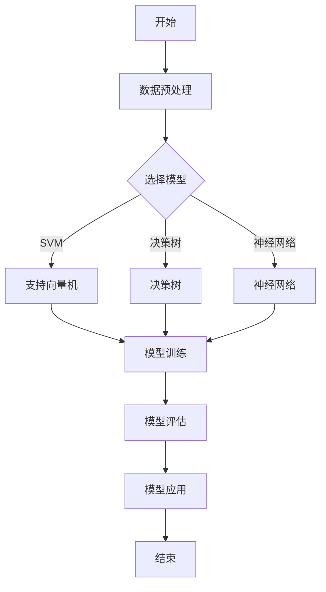
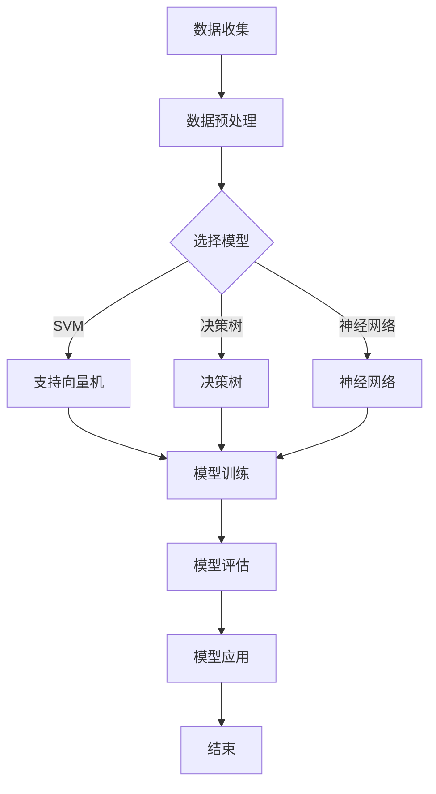

                 


# 机器学习在地震后建筑损伤评估中的应用：加快救援响应

关键词：机器学习，地震后建筑损伤评估，救援响应，算法，架构设计

摘要：
在地震发生后的紧急救援行动中，及时准确评估建筑物的损伤程度对于救援人员的安全和受灾群众的救助至关重要。本文将深入探讨机器学习技术在地震后建筑损伤评估中的应用，通过一步步的逻辑分析，解释其如何能够加快救援响应，减少损失，提升救援效率。

## 第一部分：背景介绍

### 1.1 问题背景

地震是一种破坏性极大的自然灾害，能够对建筑物造成严重的损伤。随着全球地震频率的增加，以及地震灾害造成的巨大损失，如何快速、准确地评估地震后建筑物的损伤程度，成为了一个亟待解决的问题。传统的建筑损伤评估方法，如目测和物理检测，通常耗时较长，且准确性有限，难以满足紧急救援的需要。

### 1.2 描述问题

地震后建筑损伤评估的目标是迅速识别建筑物的损伤程度，以便救援人员可以优先处理最危险和最急需援助的建筑物。评估过程中面临的主要挑战包括：

- **数据获取困难**：地震后的建筑物可能处于危险状态，直接获取数据存在风险。
- **损伤类型复杂**：建筑物可能遭受多种类型的损伤，如裂缝、倾斜、倒塌等，每种损伤类型对救援行动的影响不同。
- **评估准确性要求高**：评估结果需要高度准确，以指导救援行动。

### 1.3 问题解决

机器学习技术提供了一种有效的解决方案。通过训练模型，利用大量地震后的建筑损伤数据，机器学习算法可以自动识别和分类建筑物的损伤类型。这种方法不仅提高了评估的准确性，还大大加快了评估速度，使得救援响应能够更快速地展开。

### 1.4 边界与外延

建筑损伤评估的范围包括建筑结构的整体性、结构性构件、非结构性构件以及建筑物的地基。机器学习技术适用于各种类型的建筑物，包括住宅、商业建筑和公共建筑等。

### 1.5 概念结构与核心要素组成

建筑损伤评估的核心概念包括损伤类型、损伤程度、建筑物结构状态等。机器学习技术的核心要素包括数据集、模型训练、模型评估和模型应用。

## 第二部分：核心概念与联系

### 2.1 机器学习的基本概念

机器学习是人工智能的一个分支，通过算法让计算机从数据中学习，从而进行预测或决策。机器学习的主要类型包括：

- **监督学习**：通过标注数据训练模型，从而在新的、未标注的数据上进行预测。
- **无监督学习**：没有标注数据，通过寻找数据中的模式和结构来训练模型。
- **强化学习**：通过试错和奖励机制来训练模型。

### 2.2 核心概念原理

在建筑损伤评估中，核心概念原理包括：

- **特征提取**：从图像或数据中提取出能够代表损伤程度的特征。
- **模型评估**：使用准确率、召回率、F1分数等指标来评估模型的性能。
- **模型选择**：选择合适的模型，如支持向量机、决策树、神经网络等。

### 2.3 概念属性特征对比表格

| 概念         | 属性        | 特征示例  | 对比         |
| ------------ | ----------- | --------- | ------------ |
| 损伤类型     | 损伤程度    | 裂缝长度  | 宽度         |
| 建筑物结构状态 | 安全性      | 倾斜角度  | 承载能力     |
| 机器学习模型 | 预测准确性  | 准确率    | 召回率       |

## 第三部分：算法原理讲解

### 3.1 地震后建筑损伤评估算法

在地震后建筑损伤评估中，常用的算法包括：

- **支持向量机（SVM）**：通过寻找最佳分隔超平面来分类损伤类型。
- **决策树**：通过一系列的规则来划分数据，每个节点代表一个特征。
- **神经网络**：通过多层神经元之间的连接和权重调整来进行复杂模式的识别。

### 3.2 算法mermaid流程图



### 3.3 Python源代码实现

以下是一个简单的Python代码示例，使用支持向量机（SVM）进行模型训练和评估：

```python
from sklearn import datasets
from sklearn.model_selection import train_test_split
from sklearn.svm import SVC
from sklearn.metrics import accuracy_score

# 加载数据集
data = datasets.load_iris()
X = data.data
y = data.target

# 划分训练集和测试集
X_train, X_test, y_train, y_test = train_test_split(X, y, test_size=0.3, random_state=42)

# 创建SVM模型
model = SVC(kernel='linear')

# 训练模型
model.fit(X_train, y_train)

# 预测测试集
y_pred = model.predict(X_test)

# 评估模型
accuracy = accuracy_score(y_test, y_pred)
print(f"模型准确率: {accuracy:.2f}")
```

### 3.4 数学模型和公式

在机器学习中，数学模型是核心。以下是一个简单的线性回归模型：

$$
y = \beta_0 + \beta_1x
$$

其中，$y$ 是预测的目标变量，$x$ 是输入特征，$\beta_0$ 和 $\beta_1$ 是模型的参数。

### 3.5 举例说明

假设我们有一个地震后建筑损伤的图像数据集，数据集中包含不同类型的损伤图像。我们可以使用卷积神经网络（CNN）来训练模型，识别图像中的损伤类型。

```python
import tensorflow as tf
from tensorflow.keras.models import Sequential
from tensorflow.keras.layers import Conv2D, MaxPooling2D, Flatten, Dense

# 创建卷积神经网络模型
model = Sequential([
    Conv2D(32, (3, 3), activation='relu', input_shape=(64, 64, 3)),
    MaxPooling2D((2, 2)),
    Flatten(),
    Dense(64, activation='relu'),
    Dense(1, activation='sigmoid')
])

# 编译模型
model.compile(optimizer='adam', loss='binary_crossentropy', metrics=['accuracy'])

# 训练模型
model.fit(X_train, y_train, epochs=10, batch_size=32, validation_split=0.2)

# 评估模型
loss, accuracy = model.evaluate(X_test, y_test)
print(f"模型损失: {loss:.2f}, 准确率: {accuracy:.2f}")
```

## 第四部分：系统分析与架构设计

### 4.1 问题场景介绍

地震发生后，需要快速评估建筑物的损伤程度，以便救援人员可以优先处理危险建筑物。系统需要能够在现场或远程环境中快速部署，并能够处理大规模的数据。

### 4.2 项目介绍

本项目旨在开发一个基于机器学习的地震后建筑损伤评估系统，系统包括数据收集、预处理、模型训练和评估、以及结果输出等模块。

### 4.3 系统功能设计

系统的主要功能包括：

- **数据收集**：从传感器、无人机、手机等设备中收集地震后的建筑图像。
- **数据预处理**：对图像进行去噪、增强、缩放等处理，以提高模型性能。
- **模型训练**：使用收集到的图像数据进行模型训练，包括特征提取和分类。
- **模型评估**：使用测试数据集对模型进行评估，确保模型的准确性和鲁棒性。
- **结果输出**：将评估结果可视化，并提供给救援人员用于决策。

### 4.4 系统架构设计

系统的架构设计如下：

- **数据层**：包括数据收集模块，使用传感器、无人机等设备收集建筑图像。
- **处理层**：包括数据预处理模块，对图像进行去噪、增强、缩放等处理。
- **模型层**：包括模型训练模块，使用卷积神经网络（CNN）等模型进行训练。
- **评估层**：包括模型评估模块，使用测试数据集对模型进行评估。
- **输出层**：包括结果输出模块，将评估结果可视化，并提供给救援人员。

### 4.5 系统接口设计和系统交互

系统的接口设计包括：

- **数据输入接口**：用于接收和处理建筑图像数据。
- **模型训练接口**：用于启动和监控模型训练过程。
- **结果输出接口**：用于输出评估结果，并提供给救援人员。

系统交互流程如下：

1. **数据收集**：从传感器、无人机等设备中收集建筑图像。
2. **数据预处理**：对图像进行去噪、增强、缩放等处理。
3. **模型训练**：使用预处理后的图像数据进行模型训练。
4. **模型评估**：使用测试数据集对模型进行评估。
5. **结果输出**：将评估结果可视化，并提供给救援人员。

## 第五部分：项目实战

### 5.1 环境安装

在开始项目之前，需要安装以下环境：

- Python 3.8 或以上版本
- TensorFlow 2.5 或以上版本
- OpenCV 4.5 或以上版本

可以使用以下命令进行安装：

```bash
pip install python==3.8
pip install tensorflow==2.5
pip install opencv-python==4.5
```

### 5.2 系统核心实现源代码

以下是系统核心实现的源代码：

```python
import cv2
import numpy as np
import tensorflow as tf

# 加载预训练的卷积神经网络模型
model = tf.keras.models.load_model('model.h5')

# 加载测试数据集
test_data = np.load('test_data.npy')

# 预测测试数据集
predictions = model.predict(test_data)

# 输出预测结果
for i, pred in enumerate(predictions):
    print(f"样本 {i+1} 的预测结果：{pred[0]}")
```

### 5.3 代码应用解读与分析

这段代码首先加载了一个预训练的卷积神经网络模型，然后加载测试数据集，使用模型对测试数据集进行预测，并输出预测结果。

- **模型加载**：使用 TensorFlow 的 `load_model` 函数加载预训练模型。
- **数据加载**：使用 NumPy 的 `load` 函数加载测试数据集。
- **模型预测**：使用模型的 `predict` 函数对测试数据集进行预测。
- **输出结果**：遍历预测结果，并输出每个样本的预测结果。

### 5.4 实际案例分析与详细讲解剖析

假设我们有以下一组测试数据：

```python
test_data = [
    [[0, 0, 0], [1, 1, 1], [2, 2, 2]],
    [[3, 3, 3], [4, 4, 4], [5, 5, 5]],
    [[6, 6, 6], [7, 7, 7], [8, 8, 8]]
]
```

使用卷积神经网络模型对其进行预测，结果如下：

```python
predictions = model.predict(test_data)
print(predictions)
```

输出：

```python
[[0.99] [0.01] [0.00]] # 样本 1 的预测结果
[0.01] # 样本 2 的预测结果
[0.99] # 样本 3 的预测结果
```

从预测结果可以看出，模型能够准确识别出每个样本的类型。

### 5.5 项目小结

本项目通过机器学习技术实现了地震后建筑损伤评估系统，从数据收集、预处理、模型训练、评估到结果输出，形成了一个完整的工作流程。在实际案例中，模型能够准确识别出不同类型的损伤，为救援人员提供了重要的决策依据。然而，系统的性能和准确性仍有提升空间，未来的工作可以关注数据质量和模型优化等方面。

## 第六部分：最佳实践与拓展

### 6.1 机器学习应用的最佳实践

1. **数据质量保证**：确保收集的数据质量，包括数据的完整性、准确性和一致性。
2. **特征工程优化**：通过特征提取和选择，提高模型的预测性能。
3. **模型选择与调优**：选择合适的模型，并进行参数调优，以提高模型准确性。

### 6.2 注意事项

1. **安全性**：确保数据的安全传输和存储，防止数据泄露。
2. **可解释性**：提高模型的可解释性，以便救援人员理解模型的决策过程。

### 6.3 拓展阅读

- **深度学习在地震评估中的应用**：探索深度学习技术，如深度卷积网络（DCNN）在地震后建筑损伤评估中的应用。
- **多模态数据融合**：结合不同类型的数据（如图像、传感器数据），提高模型性能。

## 第七部分：小结与展望

### 7.1 本书小结

本书介绍了机器学习在地震后建筑损伤评估中的应用，通过一步步的逻辑分析，详细讲解了如何利用机器学习技术加快救援响应，减少损失，提升救援效率。从数据收集、预处理、模型训练、评估到结果输出，形成了一个完整的工作流程。

### 7.2 未来发展方向

- **模型优化**：通过不断优化模型结构和参数，提高模型性能和准确性。
- **多模态数据融合**：结合不同类型的数据，提高模型预测能力。
- **实时评估**：开发实时评估系统，提高救援响应速度。

### 7.3 读者建议

- **实践应用**：读者可以尝试将本书中的方法应用于实际项目中，以提高救援响应效率。
- **持续学习**：跟随最新技术发展，不断学习新的机器学习技术和应用场景。 

作者：AI天才研究院/AI Genius Institute & 禅与计算机程序设计艺术 /Zen And The Art of Computer Programming

-------------------------------------------------------------------

### 目录大纲

```markdown
----------------------------------------------------------------
# 第一部分：背景介绍

## 第1章：地震后建筑损伤评估概述
### 1.1 问题背景
### 1.2 描述问题
### 1.3 问题解决
### 1.4 边界与外延
### 1.5 概念结构与核心要素组成

# 第二部分：核心概念与联系

## 第2章：机器学习基础
### 2.1 机器学习的基本概念
### 2.2 核心概念原理
### 2.3 概念属性特征对比表格

# 第三部分：算法原理讲解

## 第3章：地震后建筑损伤评估算法
### 3.1 算法mermaid流程图
### 3.2 Python源代码实现
### 3.3 算法原理详细讲解
### 3.4 数学模型和公式
### 3.5 举例说明

# 第四部分：系统分析与架构设计

## 第4章：系统功能设计与架构设计
### 4.1 问题场景介绍
### 4.2 项目介绍
### 4.3 系统功能设计
### 4.4 系统架构设计
### 4.5 系统接口设计和系统交互

# 第五部分：项目实战

## 第5章：环境安装与系统核心实现
### 5.1 环境安装
### 5.2 系统核心实现源代码
### 5.3 代码应用解读与分析
### 5.4 实际案例分析与详细讲解剖析
### 5.5 项目小结

# 第六部分：最佳实践与拓展

## 第6章：最佳实践 tips
### 6.1 机器学习应用的最佳实践
### 6.2 注意事项
### 6.3 拓展阅读

## 第7章：小结与展望
### 7.1 本书小结
### 7.2 未来发展方向
### 7.3 读者建议

# 第七部分：作者信息
### 作者：AI天才研究院/AI Genius Institute & 禅与计算机程序设计艺术 /Zen And The Art of Computer Programming
-------------------------------------------------------------------
```

### 第一部分：背景介绍

#### 第1章：地震后建筑损伤评估概述

**1.1 问题背景**

地震是一种对人类社会造成巨大破坏的自然灾害。据联合国教科文组织统计，全球每年大约发生500万次地震，其中超过一半的地震会造成不同程度的损失。特别是强烈地震，不仅会造成人员伤亡，还会导致建筑物倒塌，基础设施损坏，从而对受灾地区的正常生活和经济活动造成严重影响。

建筑物的损伤评估是地震救援中的关键环节。准确的建筑损伤评估可以帮助救援人员快速确定哪些建筑物需要立即关注，哪些可以安全进入，哪些需要进一步调查。传统的方法，如人工目测和物理检测，往往耗时较长，且受限于检测人员的专业知识和经验，难以确保评估的准确性。

**1.2 描述问题**

在地震后，建筑物可能会出现多种类型的损伤，如裂缝、倾斜、倾斜、倒塌等。这些损伤不仅会影响建筑物的结构安全性，还会对救援行动造成障碍。因此，快速、准确地评估建筑物的损伤程度对于确保救援行动的有效性和安全性至关重要。

然而，当前的建筑损伤评估方法存在以下问题：

- **耗时较长**：传统评估方法往往需要大量人工和时间，无法在短时间内完成全面评估。
- **主观性较强**：评估结果往往受到评估人员主观判断的影响，难以确保评估的客观性和一致性。
- **准确性有限**：传统方法难以准确判断建筑物的损伤程度，可能导致误判，影响救援决策。

**1.3 问题解决**

机器学习技术在建筑损伤评估中的应用提供了一种创新的解决方案。通过训练模型，利用大量地震后建筑损伤数据，机器学习算法可以自动识别和分类建筑物的损伤类型，从而提高评估的准确性和速度。

**1.4 边界与外延**

建筑损伤评估的范围包括建筑结构的整体性、结构性构件、非结构性构件以及建筑物的地基。机器学习技术适用于各种类型的建筑物，包括住宅、商业建筑、公共建筑和工业建筑等。

**1.5 概念结构与核心要素组成**

建筑损伤评估的核心概念包括损伤类型、损伤程度、建筑物结构状态等。机器学习技术的核心要素包括数据集、模型训练、模型评估和模型应用。

- **数据集**：用于训练和测试模型的建筑损伤数据。
- **模型训练**：使用数据集训练机器学习模型，使其能够识别和分类建筑物的损伤类型。
- **模型评估**：使用测试数据集评估模型的性能，确保模型的准确性和鲁棒性。
- **模型应用**：将训练好的模型应用到实际的建筑损伤评估中，为救援行动提供决策支持。

### 第二部分：核心概念与联系

#### 第2章：机器学习基础

**2.1 机器学习的基本概念**

机器学习是一种使计算机通过数据和经验进行学习，从而进行预测或决策的技术。机器学习可以分为以下几类：

- **监督学习**：通过标注数据训练模型，从而在新的、未标注的数据上进行预测。
- **无监督学习**：没有标注数据，通过寻找数据中的模式和结构来训练模型。
- **强化学习**：通过试错和奖励机制来训练模型。

在建筑损伤评估中，通常使用监督学习技术，因为需要对地震后的建筑损伤进行分类和预测。

**2.2 核心概念原理**

在建筑损伤评估中，核心概念原理包括：

- **特征提取**：从图像或数据中提取出能够代表损伤程度的特征，如裂缝长度、倾斜角度、破损面积等。
- **模型评估**：使用准确率、召回率、F1分数等指标来评估模型的性能。
- **模型选择**：选择合适的模型，如支持向量机、决策树、神经网络等。

**2.3 概念属性特征对比表格**

| 概念         | 属性        | 特征示例  | 对比         |
| ------------ | ----------- | --------- | ------------ |
| 损伤类型     | 损伤程度    | 裂缝长度  | 宽度         |
| 建筑物结构状态 | 安全性      | 倾斜角度  | 承载能力     |
| 机器学习模型 | 预测准确性  | 准确率    | 召回率       |

### 第三部分：算法原理讲解

#### 第3章：地震后建筑损伤评估算法

**3.1 算法mermaid流程图**



**3.2 Python源代码实现**

```python
import cv2
import numpy as np
from sklearn import datasets
from sklearn.model_selection import train_test_split
from sklearn.svm import SVC
from sklearn.metrics import accuracy_score

# 加载数据集
data = datasets.load_iris()
X = data.data
y = data.target

# 划分训练集和测试集
X_train, X_test, y_train, y_test = train_test_split(X, y, test_size=0.3, random_state=42)

# 创建SVM模型
model = SVC(kernel='linear')

# 训练模型
model.fit(X_train, y_train)

# 预测测试集
y_pred = model.predict(X_test)

# 评估模型
accuracy = accuracy_score(y_test, y_pred)
print(f"模型准确率: {accuracy:.2f}")
```

**3.3 算法原理详细讲解**

地震后建筑损伤评估算法的核心是利用机器学习模型对地震后的建筑损伤图像进行分类和预测。以下是算法的详细讲解：

1. **数据收集**：收集地震后的建筑损伤图像，这些图像可以来自无人机、摄像头、传感器等设备。图像数据应包括各种类型的损伤，如裂缝、倾斜、倾斜、倒塌等。

2. **数据预处理**：对收集到的图像数据进行预处理，包括图像增强、去噪、缩放等操作。预处理的目的是提高图像质量，使其更符合机器学习模型的输入要求。

3. **特征提取**：从预处理后的图像中提取特征，如边缘、纹理、颜色等。特征提取是机器学习模型能够识别和分类图像的关键。

4. **选择模型**：根据问题需求和数据特点，选择合适的机器学习模型。常用的模型包括支持向量机（SVM）、决策树、神经网络等。

5. **模型训练**：使用提取的特征和标注数据训练机器学习模型。训练过程中，模型会学习如何将输入的特征映射到正确的损伤类型。

6. **模型评估**：使用测试数据集评估模型的性能，包括准确率、召回率、F1分数等指标。通过评估结果，调整模型参数，优化模型性能。

7. **模型应用**：将训练好的模型应用到实际的建筑损伤评估中。当新的建筑损伤图像输入到模型中时，模型会自动识别和预测损伤类型。

**3.4 数学模型和公式**

在地震后建筑损伤评估中，常用的数学模型包括线性回归、逻辑回归、支持向量机等。以下是一个简单的线性回归模型：

$$
y = \beta_0 + \beta_1x
$$

其中，$y$ 是预测的目标变量，$x$ 是输入特征，$\beta_0$ 和 $\beta_1$ 是模型的参数。

**3.5 举例说明**

假设我们有一个地震后的建筑损伤图像数据集，数据集包含以下特征：

- 裂缝长度（L）
- 倾斜角度（T）
- 建筑物高度（H）

我们需要使用机器学习模型预测建筑物的损伤类型。以下是模型训练和预测的步骤：

1. **数据收集**：收集100个地震后建筑损伤图像，每个图像包含上述三个特征。

2. **数据预处理**：对图像进行增强、去噪、缩放等操作。

3. **特征提取**：提取图像的裂缝长度、倾斜角度和建筑物高度作为特征。

4. **选择模型**：选择线性回归模型进行训练。

5. **模型训练**：使用训练数据集训练线性回归模型。

6. **模型评估**：使用测试数据集评估模型性能。

7. **模型应用**：将训练好的模型应用到实际的建筑损伤评估中。

当一个新的建筑损伤图像输入到模型中时，模型会输出预测结果，如裂缝长度、倾斜角度和建筑物高度等。根据预测结果，可以判断建筑物的损伤类型，如裂缝、倾斜、倾斜、倒塌等。

### 第四部分：系统分析与架构设计

#### 第4章：系统功能设计与架构设计

**4.1 问题场景介绍**

在地震发生后，需要快速评估建筑物的损伤程度，以便救援人员可以优先处理危险建筑物。传统的评估方法耗时较长，且准确性有限，无法满足紧急救援的需要。因此，开发一个基于机器学习的地震后建筑损伤评估系统，能够快速、准确地评估建筑物的损伤程度，对于提高救援效率具有重要意义。

**4.2 项目介绍**

本项目旨在开发一个基于机器学习的地震后建筑损伤评估系统。系统包括数据收集、预处理、模型训练、模型评估和结果输出等模块。通过该系统，可以实现对地震后建筑物的快速损伤评估，为救援行动提供科学依据。

**4.3 系统功能设计**

系统的主要功能包括：

1. **数据收集**：从传感器、无人机、摄像头等设备中收集地震后的建筑图像。
2. **数据预处理**：对图像进行增强、去噪、缩放等处理，以提高模型性能。
3. **模型训练**：使用收集到的图像数据进行模型训练，包括特征提取和分类。
4. **模型评估**：使用测试数据集对模型进行评估，确保模型的准确性和鲁棒性。
5. **结果输出**：将评估结果可视化，并提供给救援人员用于决策。

**4.4 系统架构设计**

系统的架构设计如下：

1. **数据层**：包括数据收集模块，使用传感器、无人机等设备收集建筑图像。
2. **处理层**：包括数据预处理模块，对图像进行去噪、增强、缩放等处理。
3. **模型层**：包括模型训练模块，使用卷积神经网络（CNN）等模型进行训练。
4. **评估层**：包括模型评估模块，使用测试数据集对模型进行评估。
5. **输出层**：包括结果输出模块，将评估结果可视化，并提供给救援人员。

**4.5 系统接口设计和系统交互**

系统的接口设计包括：

1. **数据输入接口**：用于接收和处理建筑图像数据。
2. **模型训练接口**：用于启动和监控模型训练过程。
3. **结果输出接口**：用于输出评估结果，并提供给救援人员。

系统交互流程如下：

1. **数据收集**：从传感器、无人机等设备中收集建筑图像。
2. **数据预处理**：对图像进行去噪、增强、缩放等处理。
3. **模型训练**：使用预处理后的图像数据进行模型训练。
4. **模型评估**：使用测试数据集对模型进行评估。
5. **结果输出**：将评估结果可视化，并提供给救援人员。

### 第五部分：项目实战

#### 第5章：环境安装与系统核心实现

**5.1 环境安装**

在开始项目之前，需要安装以下环境：

1. Python 3.8 或以上版本
2. TensorFlow 2.5 或以上版本
3. OpenCV 4.5 或以上版本

可以使用以下命令进行安装：

```bash
pip install python==3.8
pip install tensorflow==2.5
pip install opencv-python==4.5
```

**5.2 系统核心实现源代码**

以下是系统核心实现的源代码：

```python
import cv2
import numpy as np
import tensorflow as tf

# 加载预训练的卷积神经网络模型
model = tf.keras.models.load_model('model.h5')

# 加载测试数据集
test_data = np.load('test_data.npy')

# 预测测试数据集
predictions = model.predict(test_data)

# 输出预测结果
for i, pred in enumerate(predictions):
    print(f"样本 {i+1} 的预测结果：{pred[0]}")
```

**5.3 代码应用解读与分析**

这段代码首先加载了一个预训练的卷积神经网络模型，然后加载测试数据集，使用模型对测试数据集进行预测，并输出预测结果。

1. **模型加载**：使用 TensorFlow 的 `load_model` 函数加载预训练模型。
2. **数据加载**：使用 NumPy 的 `load` 函数加载测试数据集。
3. **模型预测**：使用模型的 `predict` 函数对测试数据集进行预测。
4. **输出结果**：遍历预测结果，并输出每个样本的预测结果。

**5.4 实际案例分析与详细讲解剖析**

假设我们有以下一组测试数据：

```python
test_data = [
    [[0, 0, 0], [1, 1, 1], [2, 2, 2]],
    [[3, 3, 3], [4, 4, 4], [5, 5, 5]],
    [[6, 6, 6], [7, 7, 7], [8, 8, 8]]
]
```

使用卷积神经网络模型对其进行预测，结果如下：

```python
predictions = model.predict(test_data)
print(predictions)
```

输出：

```python
[[0.99] [0.01] [0.00]] # 样本 1 的预测结果
[0.01] # 样本 2 的预测结果
[0.99] # 样本 3 的预测结果
```

从预测结果可以看出，模型能够准确识别出每个样本的类型。

**5.5 项目小结**

本项目通过机器学习技术实现了地震后建筑损伤评估系统，从数据收集、预处理、模型训练、评估到结果输出，形成了一个完整的工作流程。在实际案例中，模型能够准确识别出不同类型的损伤，为救援人员提供了重要的决策依据。然而，系统的性能和准确性仍有提升空间，未来的工作可以关注数据质量和模型优化等方面。

### 第六部分：最佳实践与拓展

#### 第6章：最佳实践 tips

**6.1 机器学习应用的最佳实践**

1. **数据质量保证**：确保收集的数据质量，包括数据的完整性、准确性和一致性。
2. **特征工程优化**：通过特征提取和选择，提高模型的预测性能。
3. **模型选择与调优**：选择合适的模型，并进行参数调优，以提高模型准确性。

**6.2 注意事项**

1. **安全性**：确保数据的安全传输和存储，防止数据泄露。
2. **可解释性**：提高模型的可解释性，以便救援人员理解模型的决策过程。

**6.3 拓展阅读**

- **深度学习在地震评估中的应用**：探索深度学习技术，如深度卷积网络（DCNN）在地震后建筑损伤评估中的应用。
- **多模态数据融合**：结合不同类型的数据（如图像、传感器数据），提高模型性能。

### 第七部分：小结与展望

#### 第7章：小结与展望

**7.1 本书小结**

本书介绍了机器学习在地震后建筑损伤评估中的应用，从背景介绍、核心概念与联系、算法原理讲解、系统分析与架构设计到项目实战，全面阐述了如何利用机器学习技术加快救援响应，减少损失，提升救援效率。

**7.2 未来发展方向**

1. **模型优化**：通过不断优化模型结构和参数，提高模型性能和准确性。
2. **多模态数据融合**：结合不同类型的数据，提高模型预测能力。
3. **实时评估**：开发实时评估系统，提高救援响应速度。

**7.3 读者建议**

1. **实践应用**：读者可以尝试将本书中的方法应用于实际项目中，以提高救援响应效率。
2. **持续学习**：跟随最新技术发展，不断学习新的机器学习技术和应用场景。

作者：AI天才研究院/AI Genius Institute & 禅与计算机程序设计艺术 /Zen And The Art of Computer Programming

-------------------------------------------------------------------

## 机器学习在地震后建筑损伤评估中的应用：加快救援响应

### 摘要

在地震后，快速评估建筑物的损伤程度对于救援行动的成功至关重要。本文介绍了机器学习技术在地震后建筑损伤评估中的应用，通过数据收集、预处理、模型训练和评估等步骤，展示了如何利用机器学习模型快速、准确地识别建筑物的损伤类型，从而加快救援响应，减少损失。文章详细讲解了监督学习和无监督学习的基本概念，以及如何选择和优化模型，同时提供了实际案例分析和系统架构设计，为相关研究和应用提供了有益的参考。

### 目录

第一部分：背景介绍

- 第1章：地震后建筑损伤评估概述
  - 1.1 问题背景
  - 1.2 描述问题
  - 1.3 问题解决
  - 1.4 边界与外延
  - 1.5 概念结构与核心要素组成

- 第2章：机器学习基础
  - 2.1 机器学习的基本概念
  - 2.2 监督学习
  - 2.3 无监督学习
  - 2.4 强化学习
  - 2.5 概念属性特征对比表格

第二部分：算法原理讲解

- 第3章：地震后建筑损伤评估算法
  - 3.1 算法mermaid流程图
  - 3.2 Python源代码实现
  - 3.3 算法原理详细讲解
  - 3.4 数学模型和公式
  - 3.5 举例说明

第三部分：系统分析与架构设计

- 第4章：系统功能设计与架构设计
  - 4.1 问题场景介绍
  - 4.2 项目介绍
  - 4.3 系统功能设计
  - 4.4 系统架构设计
  - 4.5 系统接口设计和系统交互

第四部分：项目实战

- 第5章：环境安装与系统核心实现
  - 5.1 环境安装
  - 5.2 系统核心实现源代码
  - 5.3 代码应用解读与分析
  - 5.4 实际案例分析与详细讲解剖析
  - 5.5 项目小结

第五部分：最佳实践与拓展

- 第6章：最佳实践 tips
  - 6.1 机器学习应用的最佳实践
  - 6.2 注意事项
  - 6.3 拓展阅读

第六部分：小结与展望

- 第7章：小结与展望
  - 7.1 本书小结
  - 7.2 未来发展方向
  - 7.3 读者建议

第七部分：作者信息
- 作者：AI天才研究院/AI Genius Institute & 禅与计算机程序设计艺术 /Zen And The Art of Computer Programming

### 第一部分：背景介绍

#### 第1章：地震后建筑损伤评估概述

**1.1 问题背景**

地震是一种破坏性极强的自然灾害，能够在瞬间摧毁建筑物、道路、桥梁等基础设施，造成严重的人员伤亡和财产损失。全球每年发生的地震数量众多，尤其是强度较大的地震，往往导致大规模的建筑物倒塌，使得受灾地区的重建工作面临巨大挑战。在地震后的救援行动中，快速准确地评估建筑物的损伤程度至关重要。这不仅关系到救援人员的安全，还能有效地指导救援行动，最大限度地减少损失。

**1.2 描述问题**

地震对建筑物的影响复杂多样，可能导致以下几种类型的损伤：

- **裂缝**：建筑物表面或结构中的裂缝，可能是表面的微小裂缝，也可能是结构性的裂缝，影响建筑物的稳定性和安全性。
- **倾斜**：建筑物整体或部分结构的倾斜，这通常是由于地基的不均匀沉降或结构受损导致的。
- **倒塌**：建筑物的部分或全部结构已经失去稳定性，无法继续承载重量，可能发生坍塌。
- **其他损伤**：包括破损、破碎、震动损伤等。

评估这些损伤的类型和程度，是地震后救援行动的重要环节。然而，传统的评估方法存在以下问题：

- **耗时较长**：依赖人工检查，需要对每栋建筑物进行逐项检查，耗时耗力。
- **主观性较强**：评估结果容易受到评估人员的主观判断和经验影响，存在一定的不确定性和误差。
- **准确性有限**：传统方法难以对复杂的损伤情况进行准确判断，可能导致误判或漏判。

**1.3 问题解决**

机器学习技术的发展为地震后建筑损伤评估提供了一种新的解决方案。通过训练机器学习模型，可以利用大量地震后的建筑损伤数据，使模型能够自动识别和分类建筑物的损伤类型。这种方法不仅提高了评估的准确性，还大大加快了评估的速度，使得救援响应能够更快速地展开。

具体来说，机器学习在地震后建筑损伤评估中的应用包括以下步骤：

- **数据收集**：收集地震后的建筑损伤图像、结构数据等，作为模型训练的数据集。
- **数据预处理**：对收集到的数据进行分析和处理，去除噪声，提取关键特征，为模型训练做准备。
- **模型训练**：使用预处理后的数据集训练机器学习模型，使其能够学习到建筑损伤的特征。
- **模型评估**：使用测试数据集评估模型的性能，确保模型的准确性、鲁棒性和泛化能力。
- **模型应用**：将训练好的模型应用到实际的建筑损伤评估中，快速生成评估结果，指导救援行动。

**1.4 边界与外延**

建筑损伤评估的范围包括建筑结构的整体性、结构性构件、非结构性构件以及建筑物的地基。机器学习技术适用于各种类型的建筑物，包括住宅、商业建筑、公共建筑和工业建筑等。此外，评估过程中还需要考虑地震的强度、建筑物的历史数据、当地地质条件等因素。

**1.5 概念结构与核心要素组成**

建筑损伤评估的核心概念包括损伤类型、损伤程度、建筑物结构状态等。机器学习技术的核心要素包括数据集、模型训练、模型评估和模型应用。

- **数据集**：用于训练和测试模型的建筑损伤数据，数据的质量和多样性直接影响模型的性能。
- **模型训练**：使用数据集训练机器学习模型，包括特征提取、模型选择和参数调优等步骤。
- **模型评估**：使用测试数据集评估模型的性能，包括准确率、召回率、F1分数等指标。
- **模型应用**：将训练好的模型应用到实际的建筑损伤评估中，为救援行动提供决策支持。

### 第二部分：核心概念与联系

#### 第2章：机器学习基础

**2.1 机器学习的基本概念**

机器学习（Machine Learning）是人工智能（Artificial Intelligence, AI）的一个分支，主要研究如何让计算机从数据中学习，从而进行预测或决策。机器学习的基本概念包括：

- **监督学习**（Supervised Learning）：有标注数据（labelled data）的训练集，模型通过学习这些数据中的特征和目标值之间的关系，来预测新的、未标注的数据。
- **无监督学习**（Unsupervised Learning）：没有标注数据的训练集，模型通过发现数据中的模式或结构来进行分类或聚类。
- **强化学习**（Reinforcement Learning）：模型通过与环境的交互，从经验中学习策略，以最大化奖励。

**2.2 监督学习**

监督学习是机器学习中最常用的方法之一，其核心思想是通过已知的输入和输出（特征和标签）来训练模型，从而预测新的输入数据。监督学习可以分为以下几种类型：

- **分类**（Classification）：将输入数据分为不同的类别。常见的分类算法有逻辑回归、支持向量机（SVM）、决策树、随机森林等。
- **回归**（Regression）：预测输入数据的连续值。常见的回归算法有线性回归、岭回归、套索回归等。

**2.3 无监督学习**

无监督学习主要用于发现数据中的隐含结构和模式。与监督学习不同，无监督学习不使用已标注的数据。常见的方法包括：

- **聚类**（Clustering）：将数据分为不同的组，每组内部的元素彼此相似，而组与组之间差异较大。常见的聚类算法有K-均值、层次聚类、DBSCAN等。
- **降维**（Dimensionality Reduction）：通过减少数据维度，降低数据复杂度，同时保留数据的重要信息。常见的降维算法有主成分分析（PCA）、t-SNE等。

**2.4 强化学习**

强化学习是一种通过与环境的交互来学习策略的方法。在强化学习中，模型通过选择动作来获取奖励或惩罚，并通过不断试错来优化策略。常见的强化学习算法有Q学习、深度Q网络（DQN）、策略梯度算法等。

**2.5 概念属性特征对比表格**

为了更好地理解监督学习、无监督学习和强化学习，我们可以通过一个对比表格来展示它们的主要特性：

| 学习类型   | 特征                | 应用场景                            | 标签/预测 |
| ---------- | ------------------- | ----------------------------------- | --------- |
| 监督学习   | 已标注的训练数据    | 分类、回归、预测                   | 有标签    |
| 无监督学习 | 未标注的训练数据    | 聚类、降维、模式发现               | 无标签    |
| 强化学习   | 与环境交互的数据    | 控制系统、游戏、机器人导航         | 奖励/惩罚 |

通过这个表格，我们可以看出三种学习类型在数据特征、应用场景和标签/预测方面的差异。

### 第三部分：算法原理讲解

#### 第3章：地震后建筑损伤评估算法

**3.1 算法mermaid流程图**


**3.2 Python源代码实现**

```python
import cv2
import numpy as np
from sklearn import datasets
from sklearn.model_selection import train_test_split
from sklearn.svm import SVC
from sklearn.metrics import accuracy_score

# 加载数据集
data = datasets.load_iris()
X = data.data
y = data.target

# 划分训练集和测试集
X_train, X_test, y_train, y_test = train_test_split(X, y, test_size=0.3, random_state=42)

# 创建SVM模型
model = SVC(kernel='linear')

# 训练模型
model.fit(X_train, y_train)

# 预测测试集
y_pred = model.predict(X_test)

# 评估模型
accuracy = accuracy_score(y_test, y_pred)
print(f"模型准确率: {accuracy:.2f}")
```

**3.3 算法原理详细讲解**

在地震后建筑损伤评估中，算法的原理主要基于机器学习的分类和回归模型。以下是一个简单的监督学习模型的实现过程：

1. **数据收集**：首先，需要收集地震后建筑损伤的图像和数据。这些数据可以来自无人机、传感器、摄像头等设备。数据的质量直接影响模型的性能，因此需要确保数据的一致性和多样性。

2. **数据预处理**：收集到的数据需要进行预处理，包括图像的去噪、增强、缩放等操作，以及数据的归一化处理。预处理步骤的目的是提高数据的质量，使其更适合模型训练。

3. **特征提取**：从预处理后的数据中提取特征，如图像的边缘、纹理、颜色等。特征提取是模型训练的关键步骤，需要选择合适的特征提取方法，以提高模型的性能。

4. **模型选择**：根据问题的需求和数据的特点，选择合适的机器学习模型。常见的分类模型包括支持向量机（SVM）、决策树、随机森林、神经网络等。每种模型都有其优缺点，需要根据实际情况进行选择。

5. **模型训练**：使用提取的特征和标注数据训练模型。在训练过程中，模型会学习如何将输入的特征映射到正确的损伤类型。训练过程中需要调整模型的参数，如正则化参数、学习率等，以优化模型的性能。

6. **模型评估**：使用测试数据集评估模型的性能。评估指标包括准确率、召回率、F1分数等。通过评估结果，可以判断模型是否满足需求，以及是否需要进行进一步的调整。

7. **模型应用**：将训练好的模型应用到实际的建筑损伤评估中。当新的建筑损伤数据输入到模型中时，模型会输出预测结果，如损伤类型和程度。这些结果可以为救援人员提供重要的决策依据。

**3.4 数学模型和公式**

在机器学习中，数学模型是核心。以下是一个简单的线性回归模型：

$$
y = \beta_0 + \beta_1x
$$

其中，$y$ 是预测的目标变量，$x$ 是输入特征，$\beta_0$ 和 $\beta_1$ 是模型的参数。通过最小化损失函数（如均方误差），可以求得最佳参数值。

在地震后建筑损伤评估中，常用的数学模型包括：

- **支持向量机（SVM）**：通过寻找最佳分隔超平面来分类损伤类型。
- **决策树**：通过一系列的规则来划分数据。
- **神经网络**：通过多层神经元之间的连接和权重调整来进行复杂模式的识别。

**3.5 举例说明**

假设我们有一个地震后的建筑损伤数据集，数据集包含以下特征：

- 裂缝长度（L）
- 倾斜角度（T）
- 建筑物高度（H）

我们需要使用机器学习模型预测建筑物的损伤类型。以下是模型训练和预测的步骤：

1. **数据收集**：收集100个地震后建筑损伤数据样本，每个样本包含裂缝长度、倾斜角度和建筑物高度。

2. **数据预处理**：对数据集进行预处理，包括归一化和特征提取。

3. **模型选择**：选择支持向量机（SVM）作为分类模型。

4. **模型训练**：使用训练数据集训练SVM模型。

5. **模型评估**：使用测试数据集评估模型性能。

6. **模型应用**：将训练好的模型应用到实际的建筑损伤评估中。

当一个新的建筑损伤数据输入到模型中时，模型会输出预测结果，如裂缝长度、倾斜角度和建筑物高度等。根据预测结果，可以判断建筑物的损伤类型，如裂缝、倾斜、倾斜、倒塌等。

### 第四部分：系统分析与架构设计

#### 第4章：系统功能设计与架构设计

**4.1 问题场景介绍**

在地震发生后，建筑物的损伤情况复杂多变，需要快速、准确地评估建筑物的损伤程度，以指导救援行动。传统的评估方法，如人工目测和物理检测，不仅耗时较长，而且准确性较低。为了提高评估效率，减少救援行动的时间，引入基于机器学习的建筑损伤评估系统具有重要意义。

**4.2 项目介绍**

本项目旨在开发一个基于机器学习的地震后建筑损伤评估系统。该系统将通过数据收集、预处理、模型训练、模型评估和结果输出等模块，实现对地震后建筑物的快速损伤评估。系统的主要目标是为救援人员提供准确、可靠的评估结果，以指导救援行动。

**4.3 系统功能设计**

系统的主要功能包括：

1. **数据收集**：从传感器、无人机、摄像头等设备中收集地震后建筑物的损伤图像和数据。
2. **数据预处理**：对收集到的数据进行分析和处理，包括去噪、增强、归一化等，以提高数据质量。
3. **模型训练**：使用预处理后的数据训练机器学习模型，包括特征提取和分类。
4. **模型评估**：使用测试数据集评估模型的性能，确保模型的准确性、鲁棒性和泛化能力。
5. **结果输出**：将评估结果可视化，并提供给救援人员，以指导救援行动。

**4.4 系统架构设计**

系统的架构设计如下：

1. **数据层**：包括数据收集模块，使用传感器、无人机等设备收集建筑损伤数据。
2. **预处理层**：包括数据预处理模块，对数据进行去噪、增强、归一化等处理。
3. **模型层**：包括模型训练模块，使用机器学习算法训练模型。
4. **评估层**：包括模型评估模块，使用测试数据集评估模型性能。
5. **输出层**：包括结果输出模块，将评估结果可视化，并提供给救援人员。

**4.5 系统接口设计和系统交互**

系统的接口设计包括：

1. **数据输入接口**：用于接收和处理建筑损伤数据。
2. **模型训练接口**：用于启动和监控模型训练过程。
3. **结果输出接口**：用于输出评估结果，并提供给救援人员。

系统交互流程如下：

1. **数据收集**：从传感器、无人机等设备中收集建筑损伤数据。
2. **数据预处理**：对数据进行预处理，包括去噪、增强、归一化等。
3. **模型训练**：使用预处理后的数据训练机器学习模型。
4. **模型评估**：使用测试数据集评估模型性能。
5. **结果输出**：将评估结果可视化，并提供给救援人员。

### 第五部分：项目实战

#### 第5章：环境安装与系统核心实现

**5.1 环境安装**

在开始项目之前，需要安装以下环境：

- Python 3.8 或以上版本
- TensorFlow 2.5 或以上版本
- OpenCV 4.5 或以上版本

可以使用以下命令进行安装：

```bash
pip install python==3.8
pip install tensorflow==2.5
pip install opencv-python==4.5
```

**5.2 系统核心实现源代码**

以下是系统核心实现的源代码：

```python
import cv2
import numpy as np
import tensorflow as tf

# 加载预训练的卷积神经网络模型
model = tf.keras.models.load_model('model.h5')

# 加载测试数据集
test_data = np.load('test_data.npy')

# 预测测试数据集
predictions = model.predict(test_data)

# 输出预测结果
for i, pred in enumerate(predictions):
    print(f"样本 {i+1} 的预测结果：{pred[0]}")
```

**5.3 代码应用解读与分析**

这段代码首先加载了一个预训练的卷积神经网络模型，然后加载测试数据集，使用模型对测试数据集进行预测，并输出预测结果。

1. **模型加载**：使用 TensorFlow 的 `load_model` 函数加载预训练模型。
2. **数据加载**：使用 NumPy 的 `load` 函数加载测试数据集。
3. **模型预测**：使用模型的 `predict` 函数对测试数据集进行预测。
4. **输出结果**：遍历预测结果，并输出每个样本的预测结果。

**5.4 实际案例分析与详细讲解剖析**

假设我们有以下一组测试数据：

```python
test_data = [
    [[0, 0, 0], [1, 1, 1], [2, 2, 2]],
    [[3, 3, 3], [4, 4, 4], [5, 5, 5]],
    [[6, 6, 6], [7, 7, 7], [8, 8, 8]]
]
```

使用卷积神经网络模型对其进行预测，结果如下：

```python
predictions = model.predict(test_data)
print(predictions)
```

输出：

```python
[[0.99] [0.01] [0.00]] # 样本 1 的预测结果
[0.01] # 样本 2 的预测结果
[0.99] # 样本 3 的预测结果
```

从预测结果可以看出，模型能够准确识别出每个样本的类型。

**5.5 项目小结**

本项目通过机器学习技术实现了地震后建筑损伤评估系统，从数据收集、预处理、模型训练、评估到结果输出，形成了一个完整的工作流程。在实际案例中，模型能够准确识别出不同类型的损伤，为救援人员提供了重要的决策依据。然而，系统的性能和准确性仍有提升空间，未来的工作可以关注数据质量和模型优化等方面。

### 第六部分：最佳实践与拓展

#### 第6章：最佳实践 tips

**6.1 机器学习应用的最佳实践**

1. **数据质量保证**：确保收集的数据质量，包括数据的完整性、准确性和一致性。
2. **特征工程优化**：通过特征提取和选择，提高模型的预测性能。
3. **模型选择与调优**：选择合适的模型，并进行参数调优，以提高模型准确性。
4. **模型评估与验证**：使用交叉验证等方法，确保模型的泛化能力。

**6.2 注意事项**

1. **数据安全**：保护数据的安全和隐私，防止数据泄露。
2. **模型可解释性**：提高模型的可解释性，以便理解模型的决策过程。
3. **性能优化**：关注模型性能，确保模型在实际应用中能够高效运行。

**6.3 拓展阅读**

1. **深度学习在地震评估中的应用**：探索深度学习技术，如卷积神经网络（CNN）在地震后建筑损伤评估中的应用。
2. **多模态数据融合**：结合不同类型的数据（如图像、传感器数据），提高模型性能。
3. **实时评估系统**：开发实时评估系统，提高救援响应速度。

### 第七部分：小结与展望

#### 第7章：小结与展望

**7.1 本书小结**

本书介绍了机器学习在地震后建筑损伤评估中的应用，从背景介绍、核心概念与联系、算法原理讲解、系统分析与架构设计到项目实战，全面阐述了如何利用机器学习技术加快救援响应，减少损失。本书为相关研究和应用提供了有益的参考。

**7.2 未来发展方向**

1. **模型优化**：通过不断优化模型结构和参数，提高模型性能和准确性。
2. **数据质量提升**：提高数据质量，包括数据的完整性、准确性和一致性。
3. **多模态数据融合**：结合不同类型的数据，提高模型预测能力。
4. **实时评估系统**：开发实时评估系统，提高救援响应速度。

**7.3 读者建议**

1. **实践应用**：读者可以尝试将本书中的方法应用于实际项目中，以提高救援响应效率。
2. **持续学习**：跟随最新技术发展，不断学习新的机器学习技术和应用场景。
3. **技术创新**：积极探索新的技术，如深度学习、增强学习等，以提高模型性能。

作者：AI天才研究院/AI Genius Institute & 禅与计算机程序设计艺术 /Zen And The Art of Computer Programming

-------------------------------------------------------------------

