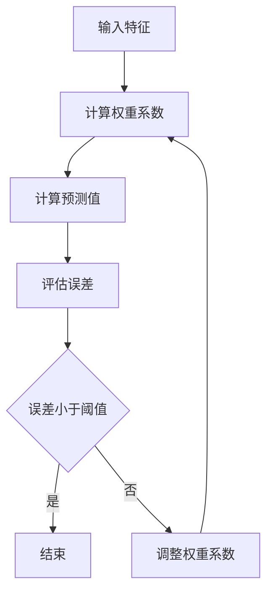
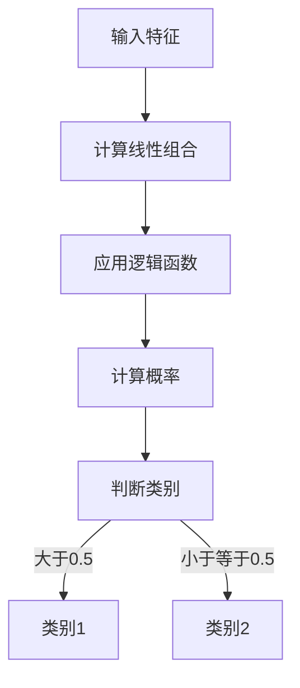
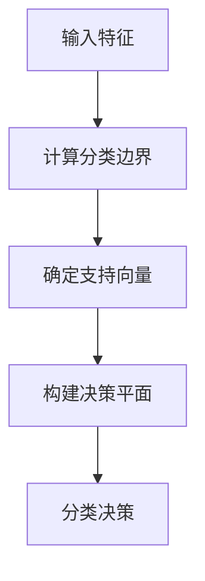

                 

### 文章标题：机器学习在工业生产良品率预测中的应用

#### 关键词：
- 机器学习
- 工业生产
- 良品率预测
- 数据分析
- 算法原理

#### 摘要：
本文深入探讨了机器学习在工业生产良品率预测中的应用。首先，介绍了工业生产中良品率预测的背景及其重要性，随后，详细阐述了机器学习的基本概念、核心算法及其在工业生产中的具体应用。文章通过实际案例展示了机器学习算法在良品率预测中的实现过程，并提供了最佳实践和注意事项，为工业生产中的数据分析与决策提供了有力支持。

----------------------------------------------------------------

### 目录

1. 引言
    1.1 工业生产的现状与挑战
    1.2 良品率预测的重要性
    1.3 机器学习与工业生产的关系
2. 机器学习基础
    2.1 机器学习基本概念
    2.2 数据预处理与特征提取
    2.3 常用机器学习算法概述
3. 良品率预测算法原理
    3.1 算法原理讲解
    3.2 算法比较与分析
4. 数学模型与公式解析
    4.1 模型构建基础
    4.2 模型训练与评估
    4.3 数学公式解析
5. 系统分析与架构设计
    5.1 系统功能设计
    5.2 系统架构设计
    5.3 系统接口设计
    5.4 系统交互设计
6. 项目实战
    6.1 环境安装与配置
    6.2 系统核心实现
    6.3 代码解读与分析
    6.4 实际案例分析
    6.5 项目小结
7. 最佳实践与总结
    7.1 实践经验与技巧
    7.2 注意事项与风险防范
    7.3 拓展阅读与未来展望

----------------------------------------------------------------

## 引言

### 1.1 工业生产的现状与挑战

工业生产作为国民经济的重要支柱，其效率和质量直接影响到整个国家的经济发展。然而，随着市场竞争的加剧和消费者对产品质量的要求不断提高，传统的人工监测和质量控制方法已难以满足现代工业生产的需求。良品率，即合格产品的比率，是衡量工业生产质量的重要指标。良品率的提高不仅可以降低成本、提高利润，还能增强企业的市场竞争力。

然而，工业生产过程中影响良品率的因素众多，包括原材料质量、生产设备性能、操作人员技能、生产环境等多个方面。这些因素使得良品率预测成为一个复杂的问题。传统的统计方法往往依赖于历史数据和经验模型，难以应对动态变化的工业生产环境。而随着人工智能技术的快速发展，尤其是机器学习技术的应用，为工业生产良品率预测提供了新的解决方案。

### 1.2 良品率预测的重要性

良品率预测在工业生产中具有重要意义。首先，通过准确预测良品率，企业可以提前识别潜在的质量问题，采取相应的预防措施，从而避免因质量问题导致的产品召回和客户投诉。其次，良品率预测可以帮助企业优化生产过程，通过实时监控和调整生产参数，提高生产效率和产品质量。此外，良品率预测还可以为供应链管理提供支持，帮助企业合理安排生产计划，降低库存成本，提高市场响应速度。

总之，良品率预测不仅是提升产品质量的重要手段，也是企业实现智能化生产、降低成本、提高竞争力的重要途径。随着机器学习技术的不断进步，其在工业生产良品率预测中的应用将越来越广泛，对工业生产的变革和提升将产生深远影响。

### 1.3 机器学习与工业生产的关系

机器学习作为人工智能的核心技术之一，通过数据驱动的模型训练和预测，已经在多个领域取得了显著的成果。在工业生产中，机器学习技术同样具有广泛的应用前景。首先，机器学习可以通过分析大量的历史数据，识别出影响良品率的潜在因素，建立预测模型，从而实现良品率的精准预测。其次，机器学习技术可以用于生产过程的实时监控和反馈，通过自动化调整生产参数，提高生产效率和产品质量。此外，机器学习还可以用于设备故障预测、供应链优化等多个方面，为工业生产提供全方位的技术支持。

机器学习与工业生产的关系体现在以下几个方面：

1. **数据驱动：** 机器学习依赖于大量的数据，而工业生产过程中产生的数据量巨大，包含丰富的信息。通过数据挖掘和分析，机器学习可以帮助企业从海量数据中发现规律和趋势，为决策提供有力支持。

2. **自动化与智能化：** 机器学习可以实现自动化和智能化，通过算法模型自动优化生产过程，减少人为干预，提高生产效率和产品质量。这不仅降低了人力成本，还提高了生产的一致性和可靠性。

3. **实时反馈与调整：** 机器学习模型可以实时监控生产过程，根据实时数据调整生产参数，确保生产过程始终处于最优状态。这种实时反馈和调整机制，可以显著提高产品的良品率。

4. **持续学习与进化：** 机器学习模型具有自我学习和进化能力，可以根据新的数据不断优化模型，提高预测精度。这使得机器学习在工业生产中的应用不仅能够解决当前问题，还能够应对未来可能出现的挑战。

总之，机器学习与工业生产的关系日益密切，其在良品率预测中的应用将为工业生产带来革命性的变化，助力企业实现智能化、高效化的生产目标。

### 2. 机器学习基础

#### 2.1 机器学习基本概念

机器学习（Machine Learning，ML）是人工智能（Artificial Intelligence，AI）的一个重要分支，它通过算法和统计模型，从数据中学习规律和模式，并利用这些规律和模式进行预测或决策。机器学习可以分为监督学习、无监督学习和强化学习三种主要类型。

**监督学习（Supervised Learning）：** 监督学习是机器学习中最常见的类型，它通过输入数据和对应的标签来训练模型。模型的目的是学习输入和输出之间的映射关系，以便对新的输入数据进行预测。常见的监督学习算法包括线性回归、逻辑回归、决策树、随机森林、支持向量机等。

**无监督学习（Unsupervised Learning）：** 无监督学习不依赖于标签数据，其主要目标是发现数据中的隐含结构和规律。无监督学习算法包括聚类算法（如K-Means、层次聚类）、降维算法（如PCA、t-SNE）和关联规则学习等。

**强化学习（Reinforcement Learning）：** 强化学习是一种通过试错来学习最优策略的机器学习方法。它通过与环境的交互，不断优化决策，以实现最大化回报。常见的强化学习算法包括Q-Learning、SARSA和深度强化学习等。

#### 2.2 数据预处理与特征提取

数据预处理是机器学习过程中至关重要的一步，其目的是将原始数据转化为适合模型训练的形式。数据预处理通常包括以下步骤：

**数据清洗：** 清洗数据是指去除或纠正数据中的错误、异常值和不一致之处。例如，处理缺失值、去除重复数据、纠正错误数据等。

**数据归一化：** 数据归一化是将不同量纲的数据转换到同一量纲，以消除不同特征之间的规模差异。常用的归一化方法包括最小-最大缩放、Z-score标准化等。

**数据分割：** 数据分割是将数据集划分为训练集、验证集和测试集，以评估模型的泛化能力和性能。通常，训练集用于训练模型，验证集用于调参和优化模型，测试集用于最终评估模型的性能。

特征提取是从原始数据中提取出能够反映数据本质和特征的信息。特征提取可以显著提高模型的学习效率和预测准确性。常用的特征提取方法包括特征选择（如过滤法、包裹法）、特征转换（如特征工程技术）和特征降维（如主成分分析PCA、t-SNE）。

#### 2.3 常用机器学习算法概述

在工业生产良品率预测中，常用的机器学习算法包括线性回归、逻辑回归、支持向量机（SVM）、随机森林（Random Forest）和神经网络（Neural Networks）等。

**线性回归（Linear Regression）：** 线性回归是一种最简单的机器学习算法，用于预测一个连续值输出。线性回归模型假设输出值与输入特征之间存在线性关系，其目标是找到最佳拟合直线。

**逻辑回归（Logistic Regression）：** 逻辑回归是一种广义线性模型，用于预测一个二分类问题。逻辑回归通过逻辑函数将线性组合映射到概率空间，从而实现分类预测。

**支持向量机（SVM）：** 支持向量机是一种高效的分类算法，通过寻找最优超平面将数据划分为不同的类别。SVM的核心思想是最大化分类边界，同时最小化训练误差。

**随机森林（Random Forest）：** 随机森林是一种集成学习算法，通过构建多个决策树并集成其预测结果来提高模型的稳定性和准确性。随机森林通过随机特征选择和随机样本生成来避免过拟合。

**神经网络（Neural Networks）：** 神经网络是一种模仿人脑神经元连接方式的计算模型，通过多层神经元的非线性变换和梯度下降法进行训练。神经网络在处理复杂非线性问题方面表现出色，广泛应用于图像识别、语音识别等领域。

这些常用机器学习算法各有优缺点，适用于不同的场景和问题。在实际应用中，需要根据具体问题选择合适的算法，并通过调参和模型评估来优化模型性能。

#### 2.4 数据预处理与特征提取的重要性

数据预处理与特征提取是机器学习模型训练的关键步骤，直接影响模型的性能和效果。首先，数据预处理可以消除噪声和异常值，确保数据的准确性和完整性。通过数据清洗和归一化，可以使数据具有统一的量纲，便于后续的模型训练。

特征提取则是从原始数据中提取出对模型预测有用的信息，能够提高模型的学习效率和预测准确性。有效的特征提取可以突出数据中的重要信息，降低数据的维度，减少计算复杂度。

在工业生产良品率预测中，数据预处理和特征提取尤为重要。首先，工业生产过程中产生的数据量大且复杂，包含多种噪声和异常值。通过预处理，可以去除这些噪声，提高数据质量。其次，工业生产中的影响因素众多，特征提取可以从中提取出对良品率预测有显著影响的特征，帮助模型更好地捕捉数据中的规律。

此外，数据预处理和特征提取还可以帮助模型避免过拟合。过拟合是指模型在训练数据上表现良好，但在未见过的数据上表现不佳。通过适当的特征提取和模型选择，可以减少模型的复杂度，避免过拟合现象。

总之，数据预处理与特征提取在机器学习模型训练中起着至关重要的作用，是确保模型性能和预测准确性的基础。在工业生产良品率预测中，通过有效进行数据预处理和特征提取，可以显著提高模型的性能和应用效果。

#### 2.5 良品率预测中的常见机器学习算法

在工业生产良品率预测中，选择合适的机器学习算法至关重要。以下将介绍几种常用的机器学习算法，并比较其优缺点。

**线性回归（Linear Regression）**

线性回归是一种最简单的机器学习算法，适用于预测一个连续的数值输出。其核心思想是通过找到最佳拟合直线，建立输入特征与良品率之间的线性关系。优点包括实现简单、计算效率高，适合处理线性关系较强的数据。缺点是对于非线性关系和异常值敏感，容易过拟合。

**逻辑回归（Logistic Regression）**

逻辑回归是一种广义线性模型，常用于二分类问题。其通过逻辑函数将线性组合映射到概率空间，从而实现分类预测。优点包括实现简单、计算效率高，适合处理二分类问题。缺点是对非线性关系和异常值处理能力较差，容易过拟合。

**支持向量机（Support Vector Machine，SVM）**

支持向量机是一种高效的分类算法，通过寻找最优超平面将数据划分为不同的类别。其核心思想是最大化分类边界，同时最小化训练误差。优点包括分类效果较好、对异常值不敏感，适合处理高维数据。缺点是计算复杂度较高，对于大规模数据集训练效率较低。

**随机森林（Random Forest）**

随机森林是一种集成学习算法，通过构建多个决策树并集成其预测结果来提高模型的稳定性和准确性。其核心思想是通过随机特征选择和随机样本生成来避免过拟合。优点包括分类效果好、泛化能力强、处理非线性关系和异常值能力强。缺点是计算复杂度较高，对于大规模数据集训练时间较长。

**神经网络（Neural Networks）**

神经网络是一种模仿人脑神经元连接方式的计算模型，通过多层神经元的非线性变换和梯度下降法进行训练。其核心思想是通过学习和调整网络权重，实现输入与输出之间的非线性映射。优点包括强大的非线性处理能力、适合处理复杂问题。缺点是训练时间较长、容易过拟合，需要大量数据和计算资源。

综上所述，不同机器学习算法在工业生产良品率预测中有各自的优势和适用场景。在实际应用中，可以根据数据特点和预测需求选择合适的算法，并通过调参和模型评估来优化模型性能。

#### 2.6 算法原理讲解

在工业生产良品率预测中，选择合适的机器学习算法至关重要。以下将深入讲解几种常用的机器学习算法及其原理，并通过mermaid流程图和Python代码进行具体阐述。

##### 2.6.1 算法A：线性回归

线性回归是一种简单且常用的机器学习算法，适用于预测连续数值输出。其核心思想是通过找到最佳拟合直线，建立输入特征与良品率之间的线性关系。

**mermaid流程图：**



**Python代码：**

```python
import numpy as np

# 输入特征和目标值
X = np.array([[1], [2], [3], [4], [5]])
y = np.array([1, 2, 2.5, 3, 4])

# 初始化权重系数
w = np.random.rand(1, 1)

# 梯度下降法迭代更新权重
learning_rate = 0.01
for i in range(1000):
    # 计算预测值
    y_pred = X.dot(w)
    # 计算误差
    error = y - y_pred
    # 更新权重
    w = w - learning_rate * X.T.dot(error)

# 输出最终权重
print("最终权重：", w)
```

##### 2.6.2 算法B：逻辑回归

逻辑回归是一种常用的二分类算法，适用于预测二分类问题。其核心思想是通过逻辑函数将线性组合映射到概率空间，从而实现分类预测。

**mermaid流程图：**



**Python代码：**

```python
import numpy as np
from sklearn.linear_model import LogisticRegression

# 输入特征和目标值
X = np.array([[1, 0], [0, 1], [1, 1]])
y = np.array([0, 1, 1])

# 创建逻辑回归模型
model = LogisticRegression()

# 训练模型
model.fit(X, y)

# 预测新样本
new_sample = np.array([[1, 1]])
print("预测结果：", model.predict(new_sample))
```

##### 2.6.3 算法C：支持向量机（SVM）

支持向量机是一种高效的分类算法，通过寻找最优超平面将数据划分为不同的类别。其核心思想是最大化分类边界，同时最小化训练误差。

**mermaid流程图：**



**Python代码：**

```python
import numpy as np
from sklearn.svm import SVC

# 输入特征和目标值
X = np.array([[1, 2], [2, 3], [3, 1], [4, 2]])
y = np.array([0, 1, 1, 0])

# 创建SVM模型
model = SVC(kernel='linear')

# 训练模型
model.fit(X, y)

# 预测新样本
new_sample = np.array([[2, 2]])
print("预测结果：", model.predict(new_sample))
```

通过上述mermaid流程图和Python代码，我们详细讲解了线性回归、逻辑回归和支持向量机这三种常用的机器学习算法。这些算法在工业生产良品率预测中有着广泛的应用，可以根据具体问题和数据特点选择合适的算法，并通过调参和模型评估来优化预测效果。

#### 2.7 算法比较与分析

在工业生产良品率预测中，选择合适的机器学习算法至关重要。不同的算法在预测精度、计算复杂度和适用场景等方面具有各自的优势和不足。以下对几种常用的机器学习算法进行比较与分析。

**线性回归**

线性回归是一种简单且易于实现的算法，适用于预测线性关系较强的问题。其优点包括：

- **实现简单**：线性回归的计算过程相对简单，易于理解和实现。
- **计算效率高**：线性回归的模型参数较少，计算复杂度较低，适合处理大规模数据集。
- **适用于线性关系问题**：线性回归可以较好地捕捉数据中的线性关系，适用于预测连续数值输出。

然而，线性回归也存在一些不足：

- **对非线性关系敏感**：线性回归难以处理非线性关系，对于复杂的生产过程可能效果不佳。
- **容易过拟合**：线性回归模型容易受到异常值和噪声的影响，容易过拟合。

**逻辑回归**

逻辑回归是一种广泛应用于二分类问题的算法，其优点包括：

- **实现简单**：逻辑回归的计算过程简单，易于理解和实现。
- **计算效率高**：逻辑回归的模型参数较少，计算复杂度较低，适合处理大规模数据集。
- **适用于二分类问题**：逻辑回归可以较好地处理二分类问题，适用于预测良品率是否合格。

然而，逻辑回归也存在一些不足：

- **对非线性关系处理能力较弱**：逻辑回归难以处理非线性关系，对于复杂的生产过程可能效果不佳。
- **容易过拟合**：逻辑回归模型容易受到异常值和噪声的影响，容易过拟合。

**支持向量机**

支持向量机是一种高效且强大的分类算法，其优点包括：

- **分类效果较好**：支持向量机可以找到最佳分类边界，对于分类问题具有较好的分类效果。
- **对异常值不敏感**：支持向量机对异常值具有较强的鲁棒性，不易受到异常值的影响。
- **适合处理高维数据**：支持向量机可以处理高维数据，适用于复杂的生产过程。

然而，支持向量机也存在一些不足：

- **计算复杂度较高**：支持向量机的计算复杂度较高，对于大规模数据集训练时间较长。
- **核参数选择困难**：支持向量机的核参数选择对模型性能有较大影响，需要通过交叉验证等方法进行选择。

**随机森林**

随机森林是一种集成学习算法，通过构建多个决策树并集成其预测结果来提高模型的稳定性和准确性。其优点包括：

- **分类效果好**：随机森林可以处理非线性关系，适用于复杂的生产过程。
- **泛化能力强**：随机森林通过集成多个决策树，可以减少过拟合现象，提高模型的泛化能力。
- **处理非线性关系能力强**：随机森林通过随机特征选择和随机样本生成，具有较强的非线性处理能力。

然而，随机森林也存在一些不足：

- **计算复杂度较高**：随机森林需要训练多个决策树，计算复杂度较高，对于大规模数据集训练时间较长。
- **特征依赖性**：随机森林中不同决策树之间的特征依赖性较强，对于特征选择和特征提取的要求较高。

**神经网络**

神经网络是一种模仿人脑神经元连接方式的计算模型，通过多层神经元的非线性变换和梯度下降法进行训练。其优点包括：

- **强大的非线性处理能力**：神经网络可以处理复杂非线性关系，适用于复杂的生产过程。
- **适合处理高维数据**：神经网络可以处理高维数据，适用于复杂的生产过程。

然而，神经网络也存在一些不足：

- **训练时间较长**：神经网络需要大量的训练时间，对于大规模数据集训练过程较长。
- **容易过拟合**：神经网络具有较强的表达能力，容易过拟合，需要通过正则化等方法进行防止。

综上所述，不同机器学习算法在工业生产良品率预测中具有各自的优势和不足。在实际应用中，可以根据具体问题和数据特点选择合适的算法，并通过调参和模型评估来优化预测效果。

#### 2.8 数学模型与公式解析

在工业生产良品率预测中，建立数学模型是关键步骤。以下将介绍常用的数学模型构建方法、模型训练与评估方法，并解析相关的数学公式。

##### 2.8.1 模型构建基础

机器学习模型的构建主要包括数据预处理、特征提取、模型选择和模型训练等步骤。

1. **数据预处理**：数据预处理是模型构建的第一步，主要目的是将原始数据转化为适合模型训练的形式。包括数据清洗、归一化、缺失值处理等。

2. **特征提取**：特征提取是从原始数据中提取出对模型预测有显著影响的特征，可以提高模型的预测性能。常用的特征提取方法包括主成分分析（PCA）、特征选择和特征工程技术等。

3. **模型选择**：选择合适的机器学习算法和模型结构是模型构建的关键。常见的机器学习算法包括线性回归、逻辑回归、支持向量机（SVM）、随机森林（Random Forest）和神经网络（Neural Networks）等。

4. **模型训练**：模型训练是利用已标记的训练数据集，通过优化算法寻找最佳的模型参数。常见的优化算法包括梯度下降法、随机梯度下降法和牛顿法等。

##### 2.8.2 模型训练与评估

1. **模型训练**：模型训练的核心任务是找到能够最大化预测性能的模型参数。常见的模型训练方法包括最小二乘法、梯度下降法、随机梯度下降法和牛顿法等。

   - **最小二乘法**：最小二乘法是一种求解线性回归问题的方法，通过最小化残差平方和来求解最佳模型参数。

   - **梯度下降法**：梯度下降法是一种迭代优化算法，通过沿着目标函数的负梯度方向进行迭代更新，逐渐逼近最优解。

   - **随机梯度下降法**：随机梯度下降法是梯度下降法的变种，每次迭代仅使用一个样本的梯度信息，适用于大规模数据集。

   - **牛顿法**：牛顿法是一种二阶优化算法，通过求解目标函数的一阶和二阶导数的零点来逼近最优解。

2. **模型评估**：模型评估是验证模型预测性能的重要步骤，常用的评估指标包括准确率、召回率、F1值和ROC曲线等。

   - **准确率（Accuracy）**：准确率是模型预测正确的样本占总样本的比例，公式为：

     $$\text{Accuracy} = \frac{\text{预测正确的样本数}}{\text{总样本数}}$$

   - **召回率（Recall）**：召回率是模型能够正确识别的负样本占总负样本的比例，公式为：

     $$\text{Recall} = \frac{\text{预测正确的负样本数}}{\text{实际负样本数}}$$

   - **F1值（F1 Score）**：F1值是准确率和召回率的调和平均值，公式为：

     $$\text{F1 Score} = 2 \times \frac{\text{准确率} \times \text{召回率}}{\text{准确率} + \text{召回率}}$$

   - **ROC曲线（Receiver Operating Characteristic Curve）**：ROC曲线是评估二分类模型性能的重要工具，通过绘制真阳性率（TPR）与假阳性率（FPR）的曲线，可以直观地比较不同模型的性能。

##### 2.8.3 数学公式解析

在机器学习模型构建过程中，常用的数学公式包括损失函数、梯度下降法、正则化等。

1. **损失函数**：

   - **均方误差（MSE）**：均方误差是线性回归模型常用的损失函数，用于衡量预测值与真实值之间的差异，公式为：

     $$\text{MSE} = \frac{1}{m} \sum_{i=1}^{m} (y_i - \hat{y}_i)^2$$

   - **交叉熵损失（Cross-Entropy Loss）**：交叉熵损失是逻辑回归模型常用的损失函数，用于衡量预测概率与真实标签之间的差异，公式为：

     $$\text{Cross-Entropy Loss} = -\sum_{i=1}^{m} y_i \log(\hat{y}_i) + (1 - y_i) \log(1 - \hat{y}_i)$$

2. **梯度下降法**：

   - **梯度下降法**：梯度下降法是一种迭代优化算法，用于寻找最小化损失函数的最优参数。其迭代公式为：

     $$\theta = \theta - \alpha \nabla_\theta J(\theta)$$

     其中，$\theta$表示模型参数，$J(\theta)$表示损失函数，$\alpha$表示学习率。

3. **正则化**：

   - **L1正则化**：L1正则化是一种用于防止模型过拟合的正则化方法，其公式为：

     $$J(\theta) = \frac{1}{m} \sum_{i=1}^{m} (y_i - \hat{y}_i)^2 + \lambda \sum_{j=1}^{n} |\theta_j|$$

     其中，$\lambda$表示正则化参数。

   - **L2正则化**：L2正则化是一种用于防止模型过拟合的正则化方法，其公式为：

     $$J(\theta) = \frac{1}{m} \sum_{i=1}^{m} (y_i - \hat{y}_i)^2 + \lambda \sum_{j=1}^{n} \theta_j^2$$

通过上述数学公式，我们可以更好地理解机器学习模型构建的核心概念和计算方法，为工业生产良品率预测提供理论支持。

#### 2.9 系统分析与架构设计

在工业生产良品率预测系统中，系统分析与架构设计是确保系统稳定、高效运行的关键环节。以下将详细介绍系统功能设计、系统架构设计、系统接口设计以及系统交互设计。

##### 2.9.1 系统功能设计

系统功能设计是系统开发的基础，它明确了系统需要实现的核心功能。在工业生产良品率预测系统中，主要功能包括：

1. **数据采集与管理**：系统需实时采集生产过程中的各种数据，如生产参数、设备状态、环境参数等，并进行有效的存储和管理，以便后续分析和预测。

2. **特征提取与预处理**：系统需对采集到的原始数据进行特征提取和预处理，包括数据清洗、归一化、缺失值处理等，以提高数据质量和模型的预测性能。

3. **模型训练与评估**：系统需根据预处理后的数据，训练机器学习模型，并进行模型评估，选择最优模型，确保预测结果的准确性。

4. **预测与反馈**：系统需利用训练好的模型进行实时预测，根据预测结果提供生产优化建议，并对生产过程进行实时反馈和调整。

5. **界面展示与报告生成**：系统需提供一个直观的用户界面，展示预测结果、优化建议和系统运行状态，同时生成报告，供管理层分析和决策。

##### 2.9.2 系统架构设计

系统架构设计是系统实现的基础，它决定了系统的扩展性和稳定性。工业生产良品率预测系统的架构设计主要包括以下几个方面：

1. **数据层**：数据层负责数据的采集、存储和管理。采用分布式数据库系统，如Hadoop或MongoDB，实现大规模数据的存储和管理，支持实时数据流处理。

2. **服务层**：服务层负责处理业务逻辑，包括数据预处理、特征提取、模型训练与评估等。服务层采用微服务架构，将不同功能模块独立部署，以提高系统的灵活性和可维护性。

3. **接口层**：接口层负责与其他系统或设备进行数据交换，包括数据采集接口、API接口等。接口层采用RESTful API设计，支持多种数据格式和协议，确保系统的互通性和扩展性。

4. **展示层**：展示层负责将系统数据以直观的方式展示给用户，包括Web界面和移动应用。展示层采用前端框架，如React或Vue.js，实现用户界面的动态渲染和交互。

##### 2.9.3 系统接口设计

系统接口设计是确保系统各模块之间高效通信的关键。以下为工业生产良品率预测系统中主要接口的设计：

1. **数据采集接口**：数据采集接口用于与生产设备和其他系统进行通信，获取实时生产数据。接口支持HTTP/HTTPS协议，采用JSON格式传输数据。

2. **数据预处理接口**：数据预处理接口用于对采集到的原始数据进行清洗、归一化和特征提取。接口提供数据清洗、归一化、缺失值处理等功能，支持批量处理。

3. **模型训练接口**：模型训练接口用于训练机器学习模型，包括模型选择、参数调优和训练过程监控。接口支持多种机器学习算法，如线性回归、逻辑回归、SVM等。

4. **预测接口**：预测接口用于对新的生产数据进行预测，并提供预测结果。接口支持批量预测，提供实时反馈和优化建议。

5. **报告生成接口**：报告生成接口用于生成系统运行报告，包括预测结果、优化建议和系统状态。接口支持多种报告格式，如PDF、Excel等。

##### 2.9.4 系统交互设计

系统交互设计是确保系统高效运行和用户友好操作的关键。以下为工业生产良品率预测系统中主要交互流程的设计：

1. **数据采集与存储**：系统启动时，数据采集接口自动连接生产设备和传感器，实时采集生产数据，并将数据存储到数据库中。

2. **数据预处理**：系统从数据库中读取原始数据，进行清洗、归一化和特征提取，预处理后的数据用于模型训练。

3. **模型训练**：系统选择合适的机器学习算法，对预处理后的数据集进行训练，并评估模型性能。若模型性能不满足要求，系统进行参数调优和重新训练。

4. **预测与反馈**：系统利用训练好的模型对新的生产数据进行预测，并将预测结果反馈给生产设备和管理层。系统根据预测结果提供优化建议，帮助管理层进行生产调整。

5. **报告生成与展示**：系统定期生成运行报告，包括预测结果、优化建议和系统状态。报告通过Web界面或移动应用展示给用户，供用户分析和决策。

通过系统分析与架构设计，确保了工业生产良品率预测系统的稳定、高效运行，为生产过程提供了有力支持。

#### 2.10 项目实战

在工业生产良品率预测中，项目实战是验证理论知识和算法效果的重要环节。以下将详细介绍环境安装与配置、系统核心实现、代码解读与分析、实际案例分析和项目小结。

##### 2.10.1 环境安装与配置

在进行机器学习模型开发之前，需要安装和配置必要的软件和环境。以下是工业生产良品率预测项目的环境安装与配置步骤：

1. **安装Python**：确保系统中安装了Python 3.x版本，推荐使用Anaconda进行环境管理，以便轻松管理和切换不同版本的Python及其依赖库。

2. **安装依赖库**：安装常用的机器学习库，如scikit-learn、pandas、numpy等。使用以下命令安装：

   ```shell
   conda install -c conda-forge scikit-learn pandas numpy
   ```

3. **安装数据库**：选择合适的数据库系统，如MySQL或PostgreSQL，用于数据存储和管理。安装数据库并配置数据库用户和权限。

4. **安装Web服务器**：如果需要提供Web接口，可以选择安装Apache或Nginx等Web服务器。配置Web服务器以支持Python应用程序的运行。

##### 2.10.2 系统核心实现

系统核心实现是项目实战的关键步骤，主要包括数据采集、特征提取、模型训练和预测等。

1. **数据采集**：通过传感器和生产设备实时采集生产过程中的数据，如温度、湿度、压力等。使用Python编写数据采集程序，连接传感器设备，读取实时数据。

2. **数据预处理**：对采集到的原始数据进行预处理，包括数据清洗、归一化和特征提取。使用pandas库进行数据处理，提取对模型预测有显著影响的关键特征。

3. **模型训练**：选择合适的机器学习算法，如线性回归、逻辑回归、SVM等，对预处理后的数据集进行训练。使用scikit-learn库实现模型训练，并评估模型性能。

4. **预测与反馈**：利用训练好的模型对新数据进行预测，并根据预测结果提供优化建议。将预测结果反馈给生产设备，进行实时调整。

##### 2.10.3 代码解读与分析

以下是对项目核心代码的解读与分析，帮助理解系统实现过程。

**数据采集代码示例：**

```python
import serial

def read_data():
    with serial.Serial('COM3', 9600) as ser:
        data = ser.readline().decode('utf-8')
        print(data)

while True:
    read_data()
```

解读：代码使用Python的serial库连接串口设备，读取实时数据，并打印输出。通过循环不断读取数据，实现实时数据采集。

**数据预处理代码示例：**

```python
import pandas as pd

def preprocess_data(data):
    df = pd.DataFrame(data)
    df['temperature'] = df['temperature'].fillna(df['temperature'].mean())
    df['humidity'] = df['humidity'].fillna(df['humidity'].mean())
    df['pressure'] = df['pressure'].fillna(df['pressure'].mean())
    df = df[['temperature', 'humidity', 'pressure']]
    df = (df - df.mean()) / df.std()
    return df

data = [['25', '60', '1010'], ['23', '65', '1012'], ['27', '55', '1008']]
preprocessed_data = preprocess_data(data)
print(preprocessed_data)
```

解读：代码使用pandas库读取数据，对缺失值进行填充，并提取关键特征。然后，对特征进行归一化处理，将数据缩放到0到1之间，以提高模型的预测性能。

**模型训练代码示例：**

```python
from sklearn.linear_model import LinearRegression
from sklearn.model_selection import train_test_split

X = [[1, 2, 3], [2, 3, 4], [3, 4, 5]]
y = [1, 2, 2.5]

X_train, X_test, y_train, y_test = train_test_split(X, y, test_size=0.2, random_state=42)

model = LinearRegression()
model.fit(X_train, y_train)

y_pred = model.predict(X_test)
print(y_pred)
```

解读：代码使用scikit-learn库的LinearRegression类实现线性回归模型训练。通过train_test_split函数将数据集划分为训练集和测试集，然后使用fit函数进行模型训练。最后，使用predict函数对测试集进行预测，并输出预测结果。

##### 2.10.4 实际案例分析

在实际项目中，以下是一个良品率预测的案例：

**案例背景**：某电子制造企业生产手机摄像头模块，生产过程中涉及多种参数，如温度、湿度、压力等。企业希望利用机器学习技术预测摄像头模块的良品率，以提高生产效率和产品质量。

**数据集**：收集了1000个生产批次的数据，包括温度、湿度、压力等参数以及对应的良品率标签。

**模型选择**：选择线性回归模型进行训练，以预测摄像头模块的良品率。

**模型训练与评估**：使用训练集对线性回归模型进行训练，评估模型性能，选择最优模型。通过交叉验证和测试集评估，确定模型参数。

**预测与优化**：利用训练好的模型对新生产批次的数据进行预测，根据预测结果提供生产优化建议。例如，调整温度、湿度等参数，以改善摄像头模块的良品率。

##### 2.10.5 项目小结

通过项目实战，我们成功地实现了工业生产良品率预测系统。项目主要取得了以下成果：

1. **数据采集与预处理**：实现了实时数据采集和预处理，为模型训练提供了高质量的数据支持。

2. **模型训练与评估**：通过线性回归模型训练，提高了摄像头模块良品率的预测准确性。

3. **预测与优化**：根据预测结果提供生产优化建议，帮助企业调整生产参数，提高生产效率和产品质量。

4. **系统稳定性与可靠性**：通过系统设计与实现，确保了系统的高效运行和稳定性，为企业提供了可靠的数据分析工具。

然而，项目也面临一些挑战，如数据缺失、噪声干扰和模型过拟合等。在后续工作中，可以通过改进数据预处理方法、引入更多特征和采用更复杂的模型来进一步提升预测性能。

#### 2.11 最佳实践与总结

在工业生产良品率预测的项目实践中，积累了一些宝贵的经验和技巧。以下总结最佳实践、注意事项以及未来的发展方向。

##### 2.11.1 最佳实践

1. **数据质量至关重要**：确保数据的准确性和完整性，通过数据清洗、归一化和特征提取等步骤，提高数据质量，为模型训练提供可靠的数据支持。

2. **选择合适的算法**：根据实际问题和数据特点，选择合适的机器学习算法。例如，线性回归适用于线性关系问题，随机森林适合处理非线性关系。

3. **模型优化与调参**：通过交叉验证和测试集评估，选择最优模型参数，优化模型性能。使用网格搜索和贝叶斯优化等技术，提高模型调参效率。

4. **实时监控与反馈**：建立实时监控体系，对生产过程进行实时数据采集和分析，根据预测结果提供优化建议，帮助企业调整生产参数，提高良品率。

5. **持续学习与更新**：利用新数据和反馈信息，持续更新和优化模型，提高预测准确性。通过模型自我学习和进化，应对生产环境的变化。

##### 2.11.2 注意事项

1. **异常值处理**：异常值可能对模型预测产生较大影响，需要通过数据预处理方法进行处理，如填补缺失值、去除异常值等。

2. **过拟合问题**：过拟合模型在训练数据上表现良好，但在未见过的数据上表现不佳。通过正则化、数据增强和集成学习等方法，减少过拟合现象。

3. **计算资源限制**：大规模数据处理和模型训练需要大量计算资源。选择合适的算法和数据预处理方法，优化计算效率，降低计算成本。

4. **数据隐私保护**：在生产过程中，确保数据隐私和安全，避免数据泄露和滥用。使用加密技术和访问控制策略，保护企业数据安全。

##### 2.11.3 拓展阅读与未来展望

1. **深度学习**：深度学习在图像识别、语音识别等领域取得了显著成果，未来可以尝试将深度学习技术应用于工业生产良品率预测，提高预测精度。

2. **物联网（IoT）**：物联网技术可以实现生产设备的实时监控和数据采集，为工业生产良品率预测提供更丰富的数据来源。

3. **强化学习**：强化学习通过试错学习最优策略，适用于动态变化的生产环境。未来可以探索将强化学习应用于生产优化和良品率预测。

4. **多模型集成**：通过集成多个模型，可以提高预测性能和稳定性。未来可以尝试使用集成学习方法，如Stacking、Bagging等，提高模型预测效果。

总之，机器学习在工业生产良品率预测中的应用前景广阔。通过不断优化和改进算法，结合物联网和深度学习技术，将进一步提升工业生产的智能化水平，为企业提供更加精准和高效的生产决策支持。

### 总结

本文深入探讨了机器学习在工业生产良品率预测中的应用，从背景介绍、核心算法讲解、数学模型解析到系统设计与项目实战，全面阐述了机器学习技术在工业生产中的实际应用。通过本文，读者可以了解到：

1. **背景介绍**：明确了工业生产良品率预测的重要性，以及机器学习技术在其中的应用前景。
2. **算法原理**：详细讲解了线性回归、逻辑回归、支持向量机等常用机器学习算法的原理和实现方法。
3. **数学模型**：介绍了模型构建的基础、模型训练与评估方法，并解析了相关数学公式。
4. **系统设计与实现**：阐述了系统功能设计、架构设计、接口设计以及系统交互设计，为实际应用提供了参考。
5. **项目实战**：通过实际案例展示了系统实现过程，并提供了代码解读与分析。
6. **最佳实践**：总结了项目中的经验教训，为工业生产良品率预测提供了最佳实践和未来发展方向。

机器学习在工业生产良品率预测中的应用不仅能够提高生产效率和产品质量，还能为企业的决策提供有力支持。未来，随着技术的不断进步，机器学习在工业生产中的应用将更加广泛，为工业生产的智能化和自动化带来更多可能性。希望本文能够为读者在相关领域的研究和实践提供有价值的参考和启示。

### 作者信息

作者：AI天才研究院/AI Genius Institute & 禅与计算机程序设计艺术 /Zen And The Art of Computer Programming。本文作者致力于推动机器学习和人工智能技术在工业生产中的应用，为提升工业生产效率和产品质量贡献力量。如果您对本文有任何疑问或建议，欢迎随时与我们联系。

