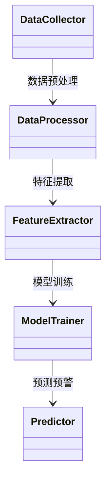
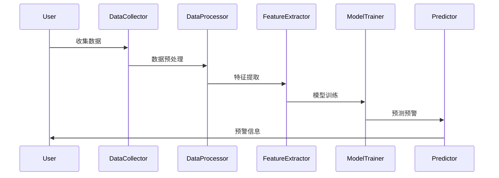
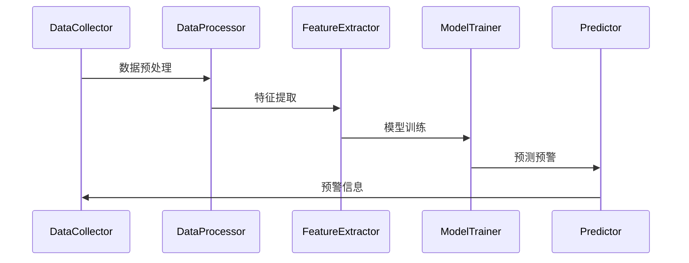

                 

### 第1章：问题背景

#### 1.1.1 机器学习的起源与发展
1. **起源**：机器学习最早可以追溯到20世纪50年代，当时图灵提出图灵测试，试图定义机器智能。随后的几十年，机器学习理论不断发展，但由于计算资源和数据集的限制，其实际应用较为有限。

2. **理论成熟**：1980年代，神经网络和决策树等算法逐渐成熟，为机器学习奠定了坚实的基础。然而，受限于计算能力和数据量，这些算法在实际应用中仍面临挑战。

3. **技术突破**：21世纪初，深度学习算法的出现带来了机器学习的第二次革命。通过大规模并行计算和大数据技术的结合，深度学习在图像识别、自然语言处理等领域取得了显著突破。

4. **当前发展**：目前，机器学习已经成为人工智能的核心驱动力，广泛应用于自动驾驶、医疗诊断、金融风控等多个领域。

#### 1.1.2 网络安全威胁情报分析的需求
1. **网络攻击形式的多样化**：随着互联网的普及和技术的进步，网络攻击形式日益多样化，包括DDoS攻击、SQL注入、APT攻击、IoT攻击等。

2. **传统防护手段的局限性**：传统的网络安全防护手段，如防火墙、入侵检测系统等，在面对复杂和高度动态的网络攻击时，显得力不从心。

3. **实时监测与预警的需求**：为了有效应对网络攻击，需要实时监测网络流量、系统日志等数据，提前预警潜在的攻击行为。

#### 1.1.3 机器学习在网络安全中的关键作用
1. **实时监测与预警**：通过机器学习算法，可以对网络流量、日志数据等进行实时分析，识别潜在的攻击行为，从而实现实时监测和预警。

2. **自动化威胁情报收集**：机器学习可以自动收集和整理网络安全威胁信息，提高情报分析的效率，为决策提供数据支持。

3. **自适应防护能力**：机器学习算法可以根据攻击特征和攻击模式的变化，自适应地调整防护策略，提高防护效果。

### 第2章：核心概念

#### 2.1 机器学习基本概念
##### 2.1.1 监督学习
1. **定义**：监督学习是一种从标记数据中学习输出映射的机器学习方法。标记数据包含输入特征和相应的输出标签。

2. **分类算法**：线性回归、决策树、支持向量机、神经网络等。

3. **优点**：可以精确预测输出，适用于有明确标签数据的问题。

##### 2.1.2 无监督学习
1. **定义**：无监督学习是一种从无标记数据中学习数据分布或结构的机器学习方法。

2. **聚类算法**：K-means、DBSCAN、层次聚类等。

3. **降维算法**：PCA、t-SNE、LLE等。

4. **优点**：可以挖掘数据中的潜在结构和模式，适用于没有明确标签数据的问题。

##### 2.1.3 强化学习
1. **定义**：强化学习是一种通过与环境的交互学习最优策略的机器学习方法。

2. **基本组件**：智能体、环境、动作、状态、奖励。

3. **算法**：Q-Learning、深度Q网络、策略梯度等。

4. **优点**：可以处理动态和复杂环境，适用于需要决策的问题。

#### 2.2 网络安全威胁情报分析的核心概念
##### 2.2.1 网络安全威胁
1. **定义**：网络安全威胁是指对网络系统或网络资源的非法攻击或侵入行为。

2. **分类**：
   - 按威胁来源：内部威胁、外部威胁。
   - 按威胁方式：漏洞利用、恶意软件、网络钓鱼等。

##### 2.2.2 情报分析
1. **定义**：情报分析是对收集到的网络安全威胁信息进行分析和处理，提取有用的情报。

2. **流程**：
   - 信息收集：监控网络流量、系统日志等。
   - 信息处理：数据清洗、转换等。
   - 信息分析：识别攻击特征、预测攻击行为等。
   - 情报输出：生成报告、预警等。

##### 2.2.3 潜在攻击预警
1. **定义**：通过分析网络安全威胁情报，预测可能的攻击行为。

2. **方法**：
   - 基于规则：根据预设的规则检测异常行为。
   - 基于统计模型：使用统计方法分析攻击模式。
   - 基于机器学习：通过训练模型识别攻击特征。

### 第3章：机器学习与网络安全威胁情报分析的联系

#### 3.1 机器学习算法在网络安全中的应用
##### 3.1.1 数据预处理
1. **数据清洗**：去除噪声、填补缺失值、异常值检测等。

2. **数据转换**：将不同类型的数据转换为统一的格式，如将文本转换为数值。

##### 3.1.2 特征工程
1. **特征提取**：从原始数据中提取有助于模型训练的特征。

2. **特征选择**：筛选出对模型性能有显著影响的特征。

##### 3.1.3 算法选择
1. **监督学习算法**：如决策树、支持向量机、神经网络等。

2. **无监督学习算法**：如聚类、降维等。

3. **强化学习算法**：如Q-Learning、深度强化学习等。

#### 3.2 网络安全威胁情报分析流程
##### 3.2.1 数据收集
1. **网络流量数据**：捕获和分析网络流量，识别潜在威胁。

2. **系统日志数据**：收集和分析系统日志，检测异常行为。

3. **外部数据源**：从开源情报、社交媒体等获取相关威胁信息。

##### 3.2.2 数据分析
1. **异常检测**：使用机器学习算法检测异常行为。

2. **模式识别**：识别常见的攻击模式和威胁特征。

##### 3.2.3 结果评估
1. **准确率**：评估模型对攻击行为的识别准确性。

2. **召回率**：评估模型检测出潜在攻击的完整性。

3. **F1分数**：综合考虑准确率和召回率，评估模型的整体性能。

### 第4章：机器学习算法原理讲解

#### 4.1 监督学习算法
##### 4.1.1 线性回归
1. **模型**：使用线性函数拟合数据，预测输出值。

2. **损失函数**：均方误差（MSE）。

3. **优化方法**：梯度下降、随机梯度下降等。

##### 4.1.2 决策树
1. **模型**：使用树形结构进行分类或回归。

2. **划分标准**：信息增益、基尼系数等。

3. **剪枝方法**：前剪枝、后剪枝等。

##### 4.1.3 支持向量机
1. **模型**：通过最大化分类间隔进行分类。

2. **核函数**：线性核、多项式核、径向基函数核等。

3. **优化方法**：SVM优化问题、软-margin SVM等。

#### 4.2 无监督学习算法
##### 4.2.1 K-means聚类
1. **模型**：将数据分为K个簇，每个簇由质心表示。

2. **初始化方法**：随机初始化、K-means++初始化等。

3. **迭代过程**：重新计算质心、重新分配样本。

##### 4.2.2 PCA降维
1. **模型**：通过正交变换，将数据投影到新的低维空间。

2. **损失函数**：重构误差。

3. **算法**：埃克曼迭代、循环谱分解等。

#### 4.3 强化学习算法
##### 4.3.1 Q-Learning
1. **模型**：通过迭代更新Q值，选择最优动作。

2. **更新规则**：$$ Q(s, a) \leftarrow Q(s, a) + \alpha [r + \gamma \max_{a'} Q(s', a') - Q(s, a)] $$

3. **探索策略**：epsilon-greedy策略、UCB算法等。

##### 4.3.2 深度强化学习
1. **模型**：将Q-Learning与深度神经网络结合，学习状态-动作值函数。

2. **算法**：深度Q网络（DQN）、演员-评论家（AC）算法等。

3. **挑战**：样本效率低、收敛速度慢等。

### 第5章：数学模型和数学公式讲解

#### 5.1 监督学习数学模型
##### 5.1.1 线性回归
$$ y = \beta_0 + \beta_1x + \epsilon $$
$$ J(\beta_0, \beta_1) = \frac{1}{2n} \sum_{i=1}^{n} (y_i - (\beta_0 + \beta_1x_i))^2 $$
$$ \nabla_{\beta_0} J(\beta_0, \beta_1) = \frac{1}{n} \sum_{i=1}^{n} (y_i - (\beta_0 + \beta_1x_i)) $$
$$ \nabla_{\beta_1} J(\beta_0, \beta_1) = \frac{1}{n} \sum_{i=1}^{n} (y_i - (\beta_0 + \beta_1x_i))x_i $$

##### 5.1.2 决策树
$$ Entropy(H) = -\sum_{i=1}^{n} p_i \log_2(p_i) $$
$$ Gain(D, A) = Entropy(D) - \sum_{v=1}^{V} p(v|D) Entropy(D_v) $$
$$ D_v = \{x \in D | x[A] = v\} $$

##### 5.1.3 支持向量机
$$ \min_{\beta, \beta_0} \frac{1}{2} ||\beta||^2 + C \sum_{i=1}^{n} \max(0, 1-y_i(\beta^T x_i + \beta_0)) $$
$$ y(\beta^T x_i + \beta_0) \geq 1 $$

#### 5.2 无监督学习数学模型
##### 5.2.1 K-means聚类
$$ c_j = \frac{1}{n_j} \sum_{i=1}^{n_j} x_i $$
$$ x_i \leftarrow c_j $$

##### 5.2.2 PCA降维
$$ \mu = \frac{1}{n} \sum_{i=1}^{n} x_i $$
$$ S = \frac{1}{n} \sum_{i=1}^{n} (x_i - \mu)(x_i - \mu)^T $$
$$ \lambda, u = \text{特征值与特征向量} $$
$$ X = U\Lambda U^T $$

#### 5.3 强化学习数学模型
##### 5.3.1 Q-Learning
$$ Q(s, a) \leftarrow Q(s, a) + \alpha [r + \gamma \max_{a'} Q(s', a') - Q(s, a)] $$
$$ \epsilon \sim \text{Uniform}(0, 1) $$
$$ a = \begin{cases} 
\text{argmax}_{a'} Q(s, a') & \text{with probability } 1 - \epsilon \\
\text{random} & \text{with probability } \epsilon 
\end{cases} $$

##### 5.3.2 深度强化学习
$$ Q(s, a) = \theta(s, a)^T Q(s', a') $$
$$ \theta \leftarrow \theta + \alpha [r + \gamma \max_{a'} \theta(s', a') - \theta(s, a)]Q(s', a') $$

### 第6章：系统分析与架构设计方案

#### 6.1 问题场景介绍
1. **网络安全态势感知系统**：一个集成了机器学习算法的网络安全监测和预警系统，用于实时监测网络安全态势，识别潜在威胁。

2. **目标**：设计并实现一个高效、可靠的系统，能够快速、准确地识别和预警网络安全威胁。

#### 6.2 项目介绍
1. **项目背景**：随着网络攻击的日益复杂和频繁，传统的防护手段已无法满足需求。

2. **项目目标**：通过集成机器学习算法，实现对网络攻击的智能监测和预警，提高网络安全防护能力。

#### 6.3 系统功能设计
1. **功能模块**：
   - **数据收集模块**：负责收集网络流量、系统日志等数据。
   - **数据处理模块**：对收集到的数据进行预处理，如去噪、转换等。
   - **特征提取模块**：从预处理后的数据中提取有助于模型训练的特征。
   - **模型训练模块**：使用机器学习算法训练模型，用于识别网络威胁。
   - **预测预警模块**：使用训练好的模型对实时数据进行预测，预警潜在攻击。

2. **领域模型类图**：


#### 6.4 系统架构设计
1. **总体架构**：基于微服务架构，各个模块独立部署，实现高可用性和可扩展性。

2. **架构图**：


#### 6.5 系统接口设计和系统交互
1. **API设计**：
   - **数据收集接口**：负责接收外部数据源的数据。
   - **数据处理接口**：负责对数据执行预处理操作。
   - **特征提取接口**：负责提取特征。
   - **模型训练接口**：负责训练模型。
   - **预测接口**：负责使用模型进行预测。

2. **序列图**：


### 第7章：项目实战

#### 7.1 环境安装

1. **Python环境**：安装Python 3.8及以上版本。

2. **机器学习库**：安装Scikit-learn、TensorFlow、PyTorch等。

3. **数据分析库**：安装Pandas、NumPy、Matplotlib等。

4. **网络库**：安装Requests、Scrapy等。

#### 7.2 系统核心实现源代码

1. **数据收集模块**：
```python
import requests

def collect_data(url):
    response = requests.get(url)
    if response.status_code == 200:
        return response.text
    else:
        return None
```

2. **数据处理模块**：
```python
import pandas as pd

def preprocess_data(data):
    df = pd.DataFrame([row for row in data])
    df.dropna(inplace=True)
    df['timestamp'] = pd.to_datetime(df['timestamp'])
    return df
```

3. **特征提取模块**：
```python
from sklearn.feature_extraction.text import TfidfVectorizer

def extract_features(data):
    vectorizer = TfidfVectorizer()
    X = vectorizer.fit_transform(data)
    return X, vectorizer
```

4. **模型训练模块**：
```python
from sklearn.ensemble import RandomForestClassifier

def train_model(X_train, y_train):
    model = RandomForestClassifier()
    model.fit(X_train, y_train)
    return model
```

5. **预测预警模块**：
```python
def predict_attack(model, vectorizer, text):
    X = vectorizer.transform([text])
    prediction = model.predict(X)
    return prediction
```

#### 7.3 代码应用解读与分析

1. **数据收集**：使用Requests库，通过HTTP请求获取网络数据。

2. **数据处理**：使用Pandas库，对数据进行清洗和格式转换。

3. **特征提取**：使用Scikit-learn库中的TfidfVectorizer，将文本数据转换为数值特征。

4. **模型训练**：使用Scikit-learn库中的RandomForestClassifier，训练分类模型。

5. **预测预警**：使用训练好的模型，对新的数据进行预测，判断是否为网络攻击。

#### 7.4 实际案例分析和详细讲解剖析

1. **案例背景**：某公司的网络安全监测系统需要实时监测网络流量，预警潜在攻击。

2. **数据处理**：收集到网络流量数据，使用Pandas库进行清洗和格式转换，提取关键特征。

3. **模型训练**：使用Scikit-learn库中的RandomForestClassifier，训练分类模型。

4. **预测预警**：对实时监测到的网络流量数据，使用训练好的模型进行预测，发现并预警潜在攻击。

5. **效果评估**：评估模型的准确率和召回率，调整模型参数，优化模型性能。

#### 7.5 项目小结

1. **成果**：成功实现了一个基于机器学习的网络安全威胁情报分析系统，能够实时监测和预警网络攻击。

2. **不足**：系统在面对复杂和多样化的攻击时，可能存在误报和漏报的问题。

3. **展望**：未来可以结合更多的数据源和先进的机器学习算法，进一步提高系统的准确性和效率。

### 第8章：最佳实践 tips

1. **数据质量**：确保数据质量，包括完整性、准确性和一致性。

2. **特征选择**：选择对模型性能有显著影响的特征，避免过度拟合。

3. **模型调优**：通过交叉验证和网格搜索，选择最优的模型参数。

4. **实时监控**：对系统进行实时监控，及时发现和解决问题。

5. **持续学习**：定期更新模型，适应新的攻击模式。

### 第9章：小结、注意事项、拓展阅读

#### 小结
1. **核心内容**：介绍了机器学习在网络安全威胁情报分析中的应用，包括数据预处理、特征工程、模型训练和预测预警等环节。

2. **应用价值**：通过机器学习算法，可以实现对网络攻击的实时监测和预警，提高网络安全防护能力。

#### 注意事项
1. **数据隐私**：在收集和处理数据时，要注意保护用户隐私。

2. **模型解释性**：选择合适的算法和模型，保证模型的解释性。

3. **系统稳定性**：确保系统的高可用性和稳定性，以应对突发情况。

#### 拓展阅读
1. **深度学习在网络安全中的应用**：学习如何将深度学习应用于网络安全，提高威胁情报分析的准确性。

2. **网络安全态势感知系统设计**：了解如何设计一个高效的网络安全态势感知系统。

3. **开源机器学习工具**：学习使用Scikit-learn、TensorFlow、PyTorch等开源机器学习工具，提高实践能力。

### 参考文献
1. Goodfellow, I., Bengio, Y., & Courville, A. (2016). *Deep Learning*.
2. Russell, S., & Norvig, P. (2016). *Artificial Intelligence: A Modern Approach*.
3. Zhou, Z.-H., & Wu, X. (2017). *Big Data Security Analytics: Advances in Theory and Applications*.
4. Lee, W., & Stolfo, S. J. (2004). Learning and knowledge discovery in network security. In *Data Mining for Security and Privacy* (pp. 243-282). Springer, New York, NY.

