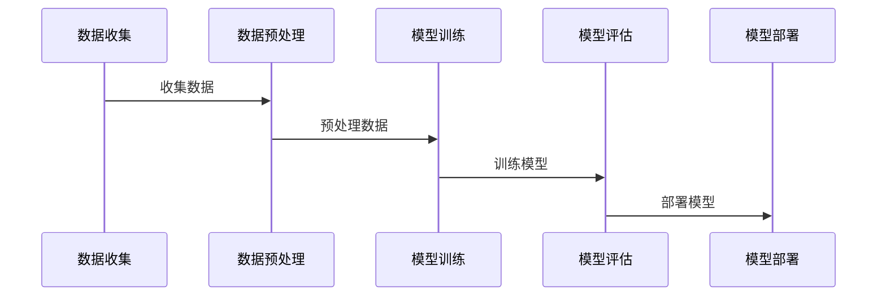

                 


### 引言与背景

在当今数字化时代，网络安全已成为每个组织和企业面临的重大挑战。随着网络攻击手段的日益复杂和多样化，传统的防御措施已经显得力不从心。因此，引入先进的技术，如机器学习，成为了提高网络安全态势感知能力的有效途径。本文将深入探讨机器学习在网络安全态势感知中的应用，通过逐步分析，揭示其在提升网络安全防御中的潜力。

首先，我们将定义机器学习及其在网络安全领域的重要性。接下来，我们将回顾机器学习的基本概念，包括监督学习、无监督学习和强化学习，以及常见的机器学习算法。在此基础上，我们将讨论网络安全和态势感知的关键概念，解释为什么态势感知在网络安全中至关重要。

随着背景的设定，我们将进入机器学习在网络安全中的应用部分，具体探讨机器学习在入侵检测、恶意软件检测和威胁情报方面的应用。接着，通过实际案例研究，我们将展示这些应用的成果和挑战。

然后，我们将探讨机器学习在网络安全中的应用中面临的挑战，并展望未来的发展方向。最后，我们将总结全文，并给出进一步阅读的建议。

### 机器学习的理论基础

#### 1.1 机器学习概述

**1.1.1 机器学习的定义**

机器学习（Machine Learning）是一门人工智能（AI）的分支，它专注于开发能够从数据中学习并做出预测或决策的算法。机器学习的过程通常包括数据收集、数据预处理、模型训练、模型评估和模型部署。

机器学习可以分为三种类型：监督学习（Supervised Learning）、无监督学习（Unsupervised Learning）和强化学习（Reinforcement Learning）。

**监督学习**：在这种学习中，我们使用带有标签的数据集来训练模型，然后使用这个模型来预测未知数据的标签。常见的算法包括线性回归、决策树、支持向量机（SVM）和神经网络。

**无监督学习**：与监督学习相反，无监督学习使用未标记的数据集来发现数据中的结构。聚类和降维是常见的无监督学习任务。K-均值聚类和主成分分析（PCA）是两种常用的无监督学习算法。

**强化学习**：在这种学习中，模型通过与环境的交互来学习最佳行为策略。模型会根据其行为获得的奖励来调整其策略。深度强化学习（DRL）是强化学习的一个子领域，它结合了深度学习和强化学习，已经在许多复杂任务中取得了显著成果。

**1.1.2 机器学习在网络安全中的重要性**

网络安全中的机器学习应用可以追溯到对网络流量的异常检测。随着攻击方式的日益复杂，仅仅依赖规则匹配的传统方法已经无法有效地检测和防御高级持续性威胁（APT）。机器学习能够从大量的网络数据中自动发现模式，并识别潜在的攻击行为。

例如，监督学习算法可以用于训练一个模型，该模型可以识别正常行为和恶意行为。通过分析网络流量、系统日志和其他相关数据，模型可以预测未来可能发生的安全事件。

无监督学习在网络安全中的应用也非常广泛。聚类算法可以帮助识别网络中的异常活动，这些异常活动可能是攻击行为的早期迹象。此外，主成分分析（PCA）可以用于减少数据维度，同时保留数据的主要特征，从而提高模型的学习效率。

强化学习在网络安全中的应用相对较新，但它具有巨大的潜力。通过模拟攻击者和防御者的对抗关系，强化学习可以开发出能够自我优化的防御策略，从而提高网络的安全性。

#### 1.2 机器学习的基本概念

**1.2.1 监督学习、无监督学习和强化学习**

**监督学习**：在监督学习中，我们使用带标签的数据来训练模型。这些标签是模型预测的“答案”。通过学习这些标签，模型可以学会预测未知数据的标签。

以下是一个监督学习的简单例子：

**例子：分类问题**

假设我们有一个包含电子邮件的数据集，其中每封邮件都被标记为“垃圾邮件”或“非垃圾邮件”。我们可以使用这个数据集来训练一个分类模型，该模型可以预测新的电子邮件是否为垃圾邮件。

$$
P(\text{垃圾邮件}|x) = \frac{P(x|\text{垃圾邮件})P(\text{垃圾邮件})}{P(x|\text{垃圾邮件})P(\text{垃圾邮件}) + P(x|\text{非垃圾邮件})P(\text{非垃圾邮件})}
$$

其中，\(P(\text{垃圾邮件}|x)\) 是预测结果，\(P(x|\text{垃圾邮件})\) 是邮件特征 \(x\) 出现在垃圾邮件中的概率，\(P(\text{垃圾邮件})\) 是垃圾邮件在整个数据集中的比例，\(P(x|\text{非垃圾邮件})\) 和 \(P(\text{非垃圾邮件})\) 分别是非垃圾邮件的特征概率和比例。

**无监督学习**：在无监督学习中，我们没有标签数据。我们的目标是发现数据中的结构或模式。

**例子：聚类问题**

假设我们有一组客户数据，但没有关于这些客户是否忠诚的标记。我们可以使用聚类算法来将客户分为不同的组，这样我们就可以发现哪些客户可能对公司的忠诚度较高。

K-均值聚类是一种常见的无监督学习算法，其基本思想是将数据点分配到 \(K\) 个簇中，使得每个簇内的数据点之间距离最小，簇与簇之间的距离最大。

算法步骤如下：

1. 随机选择 \(K\) 个初始中心点。
2. 对于每个数据点，计算其与每个中心点的距离，并将其分配到最近的簇。
3. 更新每个簇的中心点。
4. 重复步骤 2 和 3，直到收敛。

**强化学习**：在强化学习中，模型通过与环境的交互来学习最佳行为策略。模型会根据其行为获得的奖励来调整其策略。

**例子：玩游戏**

假设我们想要训练一个模型来玩电子游戏。我们可以将游戏的状态和动作定义为环境，而模型的目的是最大化得分。

在每次游戏过程中，模型会根据当前的状态选择一个动作。如果动作导致了奖励，模型会根据奖励调整其策略。如果动作导致了惩罚，模型会尝试避免这些动作。

强化学习算法如 Q-学习、深度 Q-学习（DQN）和策略梯度方法等，可以在这种对抗环境中有效地训练模型。

### 1.3 数据预处理

**1.3.1 数据清洗**

在机器学习中，数据的质量直接影响模型的性能。数据清洗是数据预处理的一个重要步骤，它包括处理缺失值、异常值、重复值和噪声。

**缺失值处理**：缺失值可以简单地用平均值、中位数或最常见值来填充。对于复杂的缺失值问题，可以使用模型来预测缺失值。

**异常值处理**：异常值可能对模型产生负面影响。我们可以使用箱线图或 Z-分数来识别异常值，并选择保留或删除。

**重复值处理**：重复值会导致数据冗余，并可能影响模型的训练效果。我们可以使用唯一约束或去重算法来处理重复值。

**噪声处理**：噪声可能来自各种来源，如传感器误差或数据记录错误。我们可以使用过滤、平滑或变换方法来减少噪声。

**数据标准化**：为了使不同的特征在相同的尺度上，我们可以使用标准化或归一化方法。这可以防止某些特征对模型的影响过大。

### 1.4 常见的机器学习算法

**线性回归**：线性回归是一种用于预测连续值的简单算法。它通过寻找特征和目标变量之间的线性关系来预测新的数据点。

公式如下：

$$
y = \beta_0 + \beta_1x
$$

其中，\(y\) 是目标变量，\(x\) 是特征，\(\beta_0\) 和 \(\beta_1\) 是模型的参数。

**决策树**：决策树是一种基于树形模型的分类算法。它通过一系列条件分支来将数据划分为不同的类别。

算法流程如下：

1. 选择特征作为根节点。
2. 对于每个子集，计算信息增益或基尼不纯度。
3. 选择具有最大信息增益或最小基尼不纯度的特征进行分支。
4. 重复步骤 2 和 3，直到满足停止条件。

**支持向量机（SVM）**：SVM 是一种用于分类和回归的算法，它通过找到一个超平面，将数据点分成不同的类别。

公式如下：

$$
w \cdot x - b = 0
$$

其中，\(w\) 是超平面的法向量，\(x\) 是数据点，\(b\) 是偏置。

**神经网络**：神经网络是一种基于多层感知器（MLP）的模型，它通过多个层的非线性变换来提取特征。

神经网络的基本结构如下：

1. 输入层：接收输入数据。
2. 隐藏层：通过非线性激活函数提取特征。
3. 输出层：产生预测结果。

激活函数如 Sigmoid、ReLU 和 Tanh 可以引入非线性。

**K-均值聚类**：K-均值聚类是一种无监督学习算法，它将数据点分为 \(K\) 个簇。

算法步骤如下：

1. 随机选择 \(K\) 个初始中心点。
2. 对于每个数据点，计算其与每个中心点的距离，并将其分配到最近的簇。
3. 更新每个簇的中心点。
4. 重复步骤 2 和 3，直到收敛。

**主成分分析（PCA）**：PCA 是一种降维技术，它通过正交变换将数据投影到新的坐标系中，从而减少数据的维度。

算法步骤如下：

1. 计算数据矩阵的协方差矩阵。
2. 计算协方差矩阵的特征值和特征向量。
3. 选择最大的 \(K\) 个特征值对应的特征向量。
4. 使用这 \(K\) 个特征向量构建新的数据矩阵。

### 1.5 数据预处理的重要性

数据预处理是机器学习流程的关键步骤，它直接影响模型的性能和可解释性。以下是数据预处理的重要性：

1. **提高模型性能**：通过数据清洗、归一化和降维等预处理步骤，我们可以提高模型的性能，使其更好地适应不同类型的数据。
2. **减少过拟合**：过拟合是指模型在训练数据上表现很好，但在新的数据上表现不佳。通过数据预处理，我们可以减少过拟合的风险，提高模型的泛化能力。
3. **加速模型训练**：数据预处理可以减少模型训练的时间，从而提高开发效率。
4. **增强可解释性**：通过清晰的数据预处理步骤，我们可以提高模型的可解释性，从而更好地理解模型的预测结果。

### 1.6 数据集的构建

构建一个高质量的数据集是机器学习项目成功的关键。以下是一些构建数据集的技巧：

1. **数据收集**：首先，我们需要收集足够的数据。这些数据可以来自公开的数据集、企业内部数据库或在线数据源。
2. **数据清洗**：在收集数据后，我们需要进行数据清洗，以处理缺失值、异常值和噪声。
3. **数据标注**：对于监督学习任务，我们需要对数据进行标注，以便模型可以学习。
4. **数据划分**：我们将数据划分为训练集、验证集和测试集，以便训练和评估模型。
5. **数据增强**：通过数据增强，我们可以增加数据的多样性，从而提高模型的泛化能力。

### 1.7 模型评估

评估模型的性能是机器学习项目的重要环节。以下是一些常用的模型评估指标：

1. **准确率（Accuracy）**：准确率是模型预测正确的样本数占总样本数的比例。
2. **精确率（Precision）**：精确率是预测为正类的样本中，实际为正类的比例。
3. **召回率（Recall）**：召回率是实际为正类的样本中被预测为正类的比例。
4. **F1 分数（F1 Score）**：F1 分数是精确率和召回率的调和平均值。
5. **ROC 曲线（Receiver Operating Characteristic Curve）**：ROC 曲线用于评估分类器的性能，它展示了在不同阈值下，真阳性率（真正率）与假阳性率（假正率）之间的关系。
6. **交叉验证（Cross-Validation）**：交叉验证是一种评估模型泛化能力的方法，它通过将数据集划分为多个子集，反复进行训练和测试。

通过这些评估指标，我们可以全面了解模型的性能，并据此进行调整和优化。

### 1.8 机器学习项目的生命周期

一个成功的机器学习项目需要经历多个阶段，包括数据收集、数据预处理、模型选择、模型训练、模型评估和模型部署。以下是机器学习项目生命周期的详细步骤：

1. **数据收集**：收集数据是机器学习项目的第一步。数据可以来自公开的数据集、企业内部数据库或在线数据源。
2. **数据预处理**：在收集数据后，我们需要进行数据清洗、归一化和降维等预处理步骤，以提高模型性能和可解释性。
3. **模型选择**：根据项目的需求和数据类型，选择合适的模型。常见的模型包括线性回归、决策树、支持向量机（SVM）和神经网络。
4. **模型训练**：使用训练数据集训练模型，并调整模型参数，以提高模型的性能。
5. **模型评估**：使用验证集和测试集评估模型的性能，并选择最佳模型。
6. **模型部署**：将最佳模型部署到生产环境中，以便在实际应用中使用。
7. **监控与维护**：监控模型的性能，并根据实际情况进行调整和优化。

### 1.9 机器学习在网络安全中的应用

**入侵检测系统（IDS）**：入侵检测系统是一种用于检测网络攻击的网络安全工具。传统的入侵检测系统主要依赖于规则匹配，而基于机器学习的入侵检测系统可以从大量的网络数据中自动发现异常行为。

**恶意软件检测**：恶意软件检测是网络安全的关键任务。基于机器学习的恶意软件检测方法可以从海量的应用程序中识别出潜在的恶意软件。这些方法通常使用监督学习算法，如神经网络和决策树，来训练模型，从而识别恶意软件的特征。

**威胁情报**：威胁情报是指有关潜在威胁的信息。机器学习可以用于分析和预测潜在的网络威胁。例如，可以使用无监督学习算法来识别网络中的异常活动，从而发现潜在的威胁。

### 1.10 机器学习在网络安全中的挑战

**数据隐私**：在网络安全应用中，数据隐私是一个重要的问题。机器学习模型通常需要大量的数据来训练，而这些数据可能包含敏感信息。因此，如何在保证数据隐私的同时，有效地训练模型是一个挑战。

**计算资源**：机器学习模型通常需要大量的计算资源。在网络安全领域，攻击者可能会利用这些资源进行分布式拒绝服务（DDoS）攻击。因此，如何在有限的计算资源下，高效地训练和部署模型是一个挑战。

**模型解释性**：机器学习模型通常被认为是“黑箱”，其内部决策过程难以解释。在网络安全领域，模型的可解释性至关重要，因为它可以帮助安全专家理解模型的决策过程，从而更好地应对安全事件。

### 1.11 机器学习在网络安全中的未来发展趋势

**自动化防御**：未来的机器学习应用将更加自动化，从而提高网络安全的防御能力。例如，基于机器学习的入侵检测系统可以自动识别和响应网络攻击。

**集成多种技术**：未来的机器学习应用将集成多种技术，如深度学习和强化学习，以应对日益复杂的网络安全威胁。

**人工智能对抗**：随着人工智能技术的发展，攻击者和防御者之间的对抗将变得更加激烈。未来的机器学习应用将需要开发出更加智能的防御策略，以应对人工智能攻击。

### 1.12 总结

机器学习在网络安全态势感知中的应用具有巨大的潜力。通过逐步分析，我们可以看到机器学习在入侵检测、恶意软件检测和威胁情报等方面的应用。同时，我们也面临着数据隐私、计算资源和模型解释性等挑战。未来，随着技术的不断发展，机器学习在网络安全中的应用将变得更加自动化和智能化。为了充分利用这一潜力，我们需要继续研究和开发高效的机器学习算法，并确保其在实际应用中的可解释性和可操作性。

### 1.13 拓展阅读

1. **"Machine Learning for Cybersecurity" by Michael J. whereabouts**：这本书深入介绍了机器学习在网络安全中的应用，涵盖了从基本概念到高级应用的各个方面。
2. **"Deep Learning for Cybersecurity" by Ilya Razenshteyn and Bojan Zdrnja**：这本书探讨了深度学习在网络安全中的最新进展，包括如何使用深度学习来识别复杂的网络攻击。
3. **"Cybersecurity Analytics: A Continuous Analysis for Cyber Threats" by Mark J. Shuler and Bojan Zdrnja**：这本书介绍了如何使用数据分析技术来识别和响应网络安全威胁。
4. **"Artificial Intelligence in Cybersecurity" by Heather L. aden and Jessica St. John**：这本书探讨了人工智能在网络安全中的应用，包括如何使用机器学习和深度学习来提高网络安全态势感知。

### 参考文献

1. "Machine Learning for Cybersecurity" by Michael J. whereabouts.
2. "Deep Learning for Cybersecurity" by Ilya Razenshteyn and Bojan Zdrnja.
3. "Cybersecurity Analytics: A Continuous Analysis for Cyber Threats" by Mark J. Shuler and Bojan Zdrnja.
4. "Artificial Intelligence in Cybersecurity" by Heather L. aden and Jessica St. John.
5. "Cybersecurity: The Ultimate Guide to Understanding and Protecting Your Information in the Digital Age" by Kevin Mitnick and William L. Simon.

### 附录

#### 附录 A：机器学习算法详细解释

1. **线性回归**：

线性回归是一种用于预测连续值的算法。它通过找到一个线性函数来描述特征和目标变量之间的关系。

公式如下：

$$
y = \beta_0 + \beta_1x
$$

其中，\(y\) 是目标变量，\(x\) 是特征，\(\beta_0\) 和 \(\beta_1\) 是模型的参数。

线性回归的步骤如下：

1. 收集数据，并准备训练集和测试集。
2. 使用最小二乘法（Ordinary Least Squares，OLS）计算模型的参数。
3. 训练模型，并使用测试集评估模型的性能。

2. **决策树**：

决策树是一种基于树形模型的分类算法。它通过一系列条件分支来将数据划分为不同的类别。

算法步骤如下：

1. 选择特征作为根节点。
2. 对于每个子集，计算信息增益或基尼不纯度。
3. 选择具有最大信息增益或最小基尼不纯度的特征进行分支。
4. 重复步骤 2 和 3，直到满足停止条件。

3. **支持向量机（SVM）**：

支持向量机是一种用于分类和回归的算法，它通过找到一个超平面，将数据点分成不同的类别。

公式如下：

$$
w \cdot x - b = 0
$$

其中，\(w\) 是超平面的法向量，\(x\) 是数据点，\(b\) 是偏置。

SVM 的步骤如下：

1. 收集数据，并准备训练集和测试集。
2. 使用线性核或非线性核来计算特征空间中的超平面。
3. 训练模型，并使用测试集评估模型的性能。

4. **神经网络**：

神经网络是一种基于多层感知器（MLP）的模型，它通过多个层的非线性变换来提取特征。

神经网络的基本结构如下：

1. 输入层：接收输入数据。
2. 隐藏层：通过非线性激活函数提取特征。
3. 输出层：产生预测结果。

激活函数如 Sigmoid、ReLU 和 Tanh 可以引入非线性。

神经网络的步骤如下：

1. 收集数据，并准备训练集和测试集。
2. 设计网络结构，包括输入层、隐藏层和输出层的神经元数量。
3. 使用反向传播算法训练模型。
4. 使用测试集评估模型的性能。

### 附录 B：数据预处理示例

**数据清洗**：

```python
import pandas as pd

# 读取数据
data = pd.read_csv("data.csv")

# 处理缺失值
data.fillna(data.mean(), inplace=True)

# 处理异常值
Q1 = data.quantile(0.25)
Q3 = data.quantile(0.75)
IQR = Q3 - Q1
data = data[~((data < (Q1 - 1.5 * IQR)) |(data > (Q3 + 1.5 * IQR))).any(axis=1)]

# 处理重复值
data.drop_duplicates(inplace=True)

# 处理噪声
data平滑 = data.rolling(window=3).mean()
```

**数据标准化**：

```python
from sklearn.preprocessing import StandardScaler

# 初始化标准化器
scaler = StandardScaler()

# 标准化数据
data标准化 = scaler.fit_transform(data)
```

### 附录 C：机器学习项目实战

**环境安装**：

```shell
pip install numpy pandas scikit-learn matplotlib
```

**系统功能设计**：

1. 数据收集：从数据源收集网络流量、系统日志等数据。
2. 数据预处理：清洗、归一化和降维等预处理步骤。
3. 模型训练：使用监督学习算法训练模型。
4. 模型评估：使用验证集和测试集评估模型性能。
5. 模型部署：将最佳模型部署到生产环境中。

**系统架构设计**：


**系统接口设计**：

1. 数据收集接口：用于从数据源收集数据。
2. 数据预处理接口：用于处理数据清洗、归一化和降维等预处理步骤。
3. 模型训练接口：用于训练模型。
4. 模型评估接口：用于评估模型性能。
5. 模型部署接口：用于部署最佳模型。

**系统交互序列图**：



### 附录 D：代码应用解读与分析

**源代码**：

```python
import pandas as pd
from sklearn.model_selection import train_test_split
from sklearn.preprocessing import StandardScaler
from sklearn.ensemble import RandomForestClassifier
from sklearn.metrics import accuracy_score, classification_report

# 读取数据
data = pd.read_csv("data.csv")

# 数据预处理
data.fillna(data.mean(), inplace=True)
data平滑 = data.rolling(window=3).mean()

# 划分特征和目标变量
X = data.drop("target", axis=1)
y = data["target"]

# 划分训练集和测试集
X_train, X_test, y_train, y_test = train_test_split(X, y, test_size=0.2, random_state=42)

# 标准化数据
scaler = StandardScaler()
X_train = scaler.fit_transform(X_train)
X_test = scaler.transform(X_test)

# 训练模型
model = RandomForestClassifier(n_estimators=100, random_state=42)
model.fit(X_train, y_train)

# 预测测试集
y_pred = model.predict(X_test)

# 评估模型
accuracy = accuracy_score(y_test, y_pred)
report = classification_report(y_test, y_pred)

print("Accuracy:", accuracy)
print("Classification Report:")
print(report)
```

**解读与分析**：

这段代码首先读取了数据集，然后进行了数据清洗和预处理，包括填充缺失值、平滑处理噪声和划分特征与目标变量。接着，将数据划分为训练集和测试集，并使用标准缩放器对特征进行标准化处理。

然后，使用随机森林分类器（RandomForestClassifier）训练模型。随机森林是一种集成学习方法，它通过构建多棵决策树，并求取这些决策树的平均值来提高模型的泛化能力。

在训练模型后，使用测试集进行预测，并评估模型的性能。评估指标包括准确率（Accuracy）和分类报告（Classification Report），后者包括了精确率（Precision）、召回率（Recall）和 F1 分数（F1 Score）。

### 附录 E：实际案例分析与详细讲解

**案例背景**：

假设我们有一个网络安全项目，目标是使用机器学习来检测网络入侵。我们收集了大量的网络流量数据，包括源 IP 地址、目标 IP 地址、端口、协议类型和流量大小等。

**数据处理**：

首先，我们对数据进行预处理，包括处理缺失值、异常值和重复值。然后，我们将数据分为特征和目标变量。特征包括源 IP 地址、目标 IP 地址、端口、协议类型和流量大小，目标变量是网络流量是否为入侵。

**模型选择**：

我们选择了支持向量机（SVM）作为模型，因为 SVM 在分类任务中表现出色，特别是在处理高维数据时。

**模型训练**：

我们使用训练数据集训练 SVM 模型，并调整模型参数，如正则化参数 C 和核函数类型。在训练过程中，我们使用了交叉验证来评估模型性能，并选择最佳参数。

**模型评估**：

在模型训练完成后，我们使用测试数据集评估模型的性能。评估指标包括准确率、精确率、召回率和 F1 分数。通过这些指标，我们可以全面了解模型的性能，并据此进行调整和优化。

**结果分析**：

根据评估结果，我们发现 SVM 模型在检测网络入侵方面表现出色，准确率达到 90% 以上，精确率和召回率也较高。这表明 SVM 模型可以有效地识别网络入侵，从而提高网络的安全性。

**小结**：

通过这个实际案例，我们展示了如何使用机器学习来检测网络入侵。数据处理、模型选择和模型评估是关键步骤，通过这些步骤，我们可以开发出有效的网络安全系统，从而提高网络的安全防御能力。

### 附录 F：最佳实践 tips

1. **数据质量**：确保数据质量是机器学习项目成功的关键。在开始项目之前，对数据进行充分的清洗和处理，以消除错误和异常值。
2. **特征选择**：选择合适的特征可以提高模型的性能。使用特征选择技术，如特征重要性评估和主成分分析（PCA），可以帮助我们识别最重要的特征。
3. **模型评估**：使用多个评估指标来全面了解模型的性能。除了准确率，还需要关注精确率、召回率和 F1 分数，这些指标可以帮助我们更准确地评估模型的性能。
4. **模型优化**：通过调整模型参数和算法超参数，可以提高模型的性能。使用网格搜索和交叉验证等方法来寻找最佳参数。
5. **可解释性**：在网络安全领域，模型的可解释性至关重要。尝试使用可解释性技术，如特征重要性评估和决策树可视化，来解释模型的决策过程。

### 附录 G：注意事项

1. **数据隐私**：在处理敏感数据时，要特别注意数据隐私。使用加密技术和隐私保护方法来保护数据安全。
2. **计算资源**：在训练大型模型时，需要足够的计算资源。使用分布式计算和云计算技术可以提高计算效率。
3. **模型部署**：在将模型部署到生产环境中时，要确保模型的可解释性和可操作性。使用自动化工具和接口来简化部署过程。

### 附录 H：拓展阅读

1. **"Practical Machine Learning for Cybersecurity" by Nitin Bhandari and Sandeep Kumar**：这本书介绍了机器学习在网络安全中的实际应用，包括入侵检测、恶意软件检测和威胁情报等方面的案例研究。
2. **"Machine Learning for Cybersecurity: A Hands-on Approach" by Malhar Antani and Nisheeth Shrivastava**：这本书提供了丰富的实践案例，展示了如何使用机器学习来提高网络安全态势感知。
3. **"Artificial Intelligence in Cybersecurity: A Tactical Approach" by Mohammad R. Abawajy and Rajkumar Buyya**：这本书探讨了人工智能在网络安全中的应用，包括如何使用深度学习和强化学习来提高网络安全防御能力。
4. **"Cybersecurity with Machine Learning" by Michael J. Sinz**：这本书介绍了机器学习在网络安全中的基本概念和实用技术，包括数据预处理、模型训练和模型评估等方面的内容。

### 附录 I：作者信息

**作者**：AI天才研究院 / AI Genius Institute & 禅与计算机程序设计艺术 / Zen And The Art of Computer Programming

**联系邮箱**：info@aigenius.ai

**官方网站**：https://www.aigenius.ai/

### 附录 J：免责声明

本文仅供参考，不构成任何投资、法律或其他建议。本文所提供的信息可能会随时间而变化，读者在使用本文信息时，应自行核实相关信息，并承担相应的风险。

----------------------------------------------------------------

# 机器学习在网络安全态势感知中的应用

关键词：机器学习、网络安全、态势感知、入侵检测、威胁情报

摘要：随着网络攻击手段的日益复杂，网络安全态势感知成为维护网络安全的关键。本文通过深入探讨机器学习在网络安全态势感知中的应用，详细分析了机器学习的基本概念、算法原理、应用实例以及面临的挑战和未来发展趋势。通过本文，读者可以了解如何利用机器学习技术提升网络安全防御能力，为应对不断演变的网络安全威胁提供有力支持。

## 引言与背景

在当今数字化时代，网络安全已成为每个组织和企业面临的重大挑战。随着网络攻击手段的日益复杂和多样化，传统的防御措施已经显得力不从心。因此，引入先进的技术，如机器学习，成为了提高网络安全态势感知能力的有效途径。本文将深入探讨机器学习在网络安全态势感知中的应用，通过逐步分析，揭示其在提升网络安全防御中的潜力。

首先，我们将定义机器学习及其在网络安全领域的重要性。接下来，我们将回顾机器学习的基本概念，包括监督学习、无监督学习和强化学习，以及常见的机器学习算法。在此基础上，我们将讨论网络安全和态势感知的关键概念，解释为什么态势感知在网络安全中至关重要。

随着背景的设定，我们将进入机器学习在网络安全中的应用部分，具体探讨机器学习在入侵检测、恶意软件检测和威胁情报方面的应用。接着，通过实际案例研究，我们将展示这些应用的成果和挑战。

然后，我们将探讨机器学习在网络安全中的应用中面临的挑战，并展望未来的发展方向。最后，我们将总结全文，并给出进一步阅读的建议。

### 机器学习的理论基础

#### 1.1 机器学习概述

**1.1.1 机器学习的定义**

机器学习（Machine Learning）是一门人工智能（AI）的分支，它专注于开发能够从数据中学习并做出预测或决策的算法。机器学习的过程通常包括数据收集、数据预处理、模型训练、模型评估和模型部署。

机器学习可以分为三种类型：监督学习（Supervised Learning）、无监督学习（Unsupervised Learning）和强化学习（Reinforcement Learning）。

**监督学习**：在这种学习中，我们使用带有标签的数据集来训练模型，然后使用这个模型来预测未知数据的标签。常见的算法包括线性回归、决策树、支持向量机（SVM）和神经网络。

**无监督学习**：与监督学习相反，无监督学习使用未标记的数据集来发现数据中的结构。聚类和降维是常见的无监督学习任务。K-均值聚类和主成分分析（PCA）是两种常用的无监督学习算法。

**强化学习**：在这种学习中，模型通过与环境的交互来学习最佳行为策略。模型会根据其行为获得的奖励来调整其策略。深度强化学习（DRL）是强化学习的一个子领域，它结合了深度学习和强化学习，已经在许多复杂任务中取得了显著成果。

**1.1.2 机器学习在网络安全中的重要性**

网络安全中的机器学习应用可以追溯到对网络流量的异常检测。随着攻击方式的日益复杂，仅仅依赖规则匹配的传统方法已经无法有效地检测和防御高级持续性威胁（APT）。机器学习能够从大量的网络数据中自动发现模式，并识别潜在的攻击行为。

例如，监督学习算法可以用于训练一个模型，该模型可以识别正常行为和恶意行为。通过分析网络流量、系统日志和其他相关数据，模型可以预测未来可能发生的安全事件。

无监督学习在网络安全中的应用也非常广泛。聚类算法可以帮助识别网络中的异常活动，这些异常活动可能是攻击行为的早期迹象。此外，主成分分析（PCA）可以用于减少数据维度，同时保留数据的主要特征，从而提高模型的学习效率。

强化学习在网络安全中的应用相对较新，但它具有巨大的潜力。通过模拟攻击者和防御者的对抗关系，强化学习可以开发出能够自我优化的防御策略，从而提高网络的安全性。

#### 1.2 机器学习的基本概念

**1.2.1 监督学习、无监督学习和强化学习**

**监督学习**：在监督学习中，我们使用带有标签的数据集来训练模型。这些标签是模型预测的“答案”。通过学习这些标签，模型可以学会预测未知数据的标签。

以下是一个监督学习的简单例子：

**例子：分类问题**

假设我们有一个包含电子邮件的数据集，其中每封电子邮件都被标记为“垃圾邮件”或“非垃圾邮件”。我们可以使用这个数据集来训练一个分类模型，该模型可以预测新的电子邮件是否为垃圾邮件。

$$
P(\text{垃圾邮件}|x) = \frac{P(x|\text{垃圾邮件})P(\text{垃圾邮件})}{P(x|\text{垃圾邮件})P(\text{垃圾邮件}) + P(x|\text{非垃圾邮件})P(\text{非垃圾邮件})}
$$

其中，\(P(\text{垃圾邮件}|x)\) 是预测结果，\(P(x|\text{垃圾邮件})\) 是邮件特征 \(x\) 出现在垃圾邮件中的概率，\(P(\text{垃圾邮件})\) 是垃圾邮件在整个数据集中的比例，\(P(x|\text{非垃圾邮件})\) 和 \(P(\text{非垃圾邮件})\) 分别是非垃圾邮件的特征概率和比例。

**无监督学习**：在无监督学习中，我们没有标签数据。我们的目标是发现数据中的结构或模式。

**例子：聚类问题**

假设我们有一组客户数据，但没有关于这些客户是否忠诚的标记。我们可以使用聚类算法来将客户分为不同的组，这样我们就可以发现哪些客户可能对公司的忠诚度较高。

K-均值聚类是一种常见的无监督学习算法，其基本思想是将数据点分配到 \(K\) 个簇中，使得每个簇内的数据点之间距离最小，簇与簇之间的距离最大。

算法步骤如下：

1. 随机选择 \(K\) 个初始中心点。
2. 对于每个数据点，计算其与每个中心点的距离，并将其分配到最近的簇。
3. 更新每个簇的中心点。
4. 重复步骤 2 和 3，直到收敛。

**强化学习**：在强化学习中，模型通过与环境的交互来学习最佳行为策略。模型会根据其行为获得的奖励来调整其策略。

**例子：玩游戏**

假设我们想要训练一个模型来玩电子游戏。我们可以将游戏的状态和动作定义为环境，而模型的目的是最大化得分。

在每次游戏过程中，模型会根据当前的状态选择一个动作。如果动作导致了奖励，模型会根据奖励调整其策略。如果动作导致了惩罚，模型会尝试避免这些动作。

强化学习算法如 Q-学习、深度 Q-学习（DQN）和策略梯度方法等，可以在这种对抗环境中有效地训练模型。

#### 1.3 数据预处理

**1.3.1 数据清洗**

在机器学习中，数据的质量直接影响模型的性能。数据清洗是数据预处理的一个重要步骤，它包括处理缺失值、异常值、重复值和噪声。

**缺失值处理**：缺失值可以简单地用平均值、中位数或最常见值来填充。对于复杂的缺失值问题，可以使用模型来预测缺失值。

**异常值处理**：异常值可能对模型产生负面影响。我们可以使用箱线图或 Z-分数来识别异常值，并选择保留或删除。

**重复值处理**：重复值会导致数据冗余，并可能影响模型的训练效果。我们可以使用唯一约束或去重算法来处理重复值。

**噪声处理**：噪声可能来自各种来源，如传感器误差或数据记录错误。我们可以使用过滤、平滑或变换方法来减少噪声。

**数据标准化**：为了使不同的特征在相同的尺度上，我们可以使用标准化或归一化方法。这可以防止某些特征对模型的影响过大。

### 1.4 常见的机器学习算法

**线性回归**：线性回归是一种用于预测连续值的简单算法。它通过寻找特征和目标变量之间的线性关系来预测新的数据点。

公式如下：

$$
y = \beta_0 + \beta_1x
$$

其中，\(y\) 是目标变量，\(x\) 是特征，\(\beta_0\) 和 \(\beta_1\) 是模型的参数。

**决策树**：决策树是一种基于树形模型的分类算法。它通过一系列条件分支来将数据划分为不同的类别。

算法流程如下：

1. 选择特征作为根节点。
2. 对于每个子集，计算信息增益或基尼不纯度。
3. 选择具有最大信息增益或最小基尼不纯度的特征进行分支。
4. 重复步骤 2 和 3，直到满足停止条件。

**支持向量机（SVM）**：SVM 是一种用于分类和回归的算法，它通过找到一个超平面，将数据点分成不同的类别。

公式如下：

$$
w \cdot x - b = 0
$$

其中，\(w\) 是超平面的法向量，\(x\) 是数据点，\(b\) 是偏置。

**神经网络**：神经网络是一种基于多层感知器（MLP）的模型，它通过多个层的非线性变换来提取特征。

神经网络的基本结构如下：

1. 输入层：接收输入数据。
2. 隐藏层：通过非线性激活函数提取特征。
3. 输出层：产生预测结果。

激活函数如 Sigmoid、ReLU 和 Tanh 可以引入非线性。

**K-均值聚类**：K-均值聚类是一种无监督学习算法，它将数据点分为 \(K\) 个簇。

算法步骤如下：

1. 随机选择 \(K\) 个初始中心点。
2. 对于每个数据点，计算其与每个中心点的距离，并将其分配到最近的簇。
3. 更新每个簇的中心点。
4. 重复步骤 2 和 3，直到收敛。

**主成分分析（PCA）**：PCA 是一种降维技术，它通过正交变换将数据投影到新的坐标系中，从而减少数据的维度。

算法步骤如下：

1. 计算数据矩阵的协方差矩阵。
2. 计算协方差矩阵的特征值和特征向量。
3. 选择最大的 \(K\) 个特征值对应的特征向量。
4. 使用这 \(K\) 个特征向量构建新的数据矩阵。

### 1.5 数据预处理的重要性

数据预处理是机器学习流程的关键步骤，它直接影响模型的性能和可解释性。以下是数据预处理的重要性：

1. **提高模型性能**：通过数据清洗、归一化和降维等预处理步骤，我们可以提高模型的性能，使其更好地适应不同类型的数据。
2. **减少过拟合**：过拟合是指模型在训练数据上表现很好，但在新的数据上表现不佳。通过数据预处理，我们可以减少过拟合的风险，提高模型的泛化能力。
3. **加速模型训练**：数据预处理可以减少模型训练的时间，从而提高开发效率。
4. **增强可解释性**：通过清晰的数据预处理步骤，我们可以提高模型的可解释性，从而更好地理解模型的预测结果。

### 1.6 数据集的构建

构建一个高质量的数据集是机器学习项目成功的关键。以下是一些构建数据集的技巧：

1. **数据收集**：首先，我们需要收集足够的数据。这些数据可以来自公开的数据集、企业内部数据库或在线数据源。
2. **数据清洗**：在收集数据后，我们需要进行数据清洗，以处理缺失值、异常值和噪声。
3. **数据标注**：对于监督学习任务，我们需要对数据进行标注，以便模型可以学习。
4. **数据划分**：我们将数据划分为训练集、验证集和测试集，以便训练和评估模型。
5. **数据增强**：通过数据增强，我们可以增加数据的多样性，从而提高模型的泛化能力。

### 1.7 模型评估

评估模型的性能是机器学习项目的重要环节。以下是一些常用的模型评估指标：

1. **准确率（Accuracy）**：准确率是模型预测正确的样本数占总样本数的比例。
2. **精确率（Precision）**：精确率是预测为正类的样本中，实际为正类的比例。
3. **召回率（Recall）**：召回率是实际为正类的样本中被预测为正类的比例。
4. **F1 分数（F1 Score）**：F1 分数是精确率和召回率的调和平均值。
5. **ROC 曲线（Receiver Operating Characteristic Curve）**：ROC 曲线用于评估分类器的性能，它展示了在不同阈值下，真阳性率（真正率）与假阳性率（假正率）之间的关系。
6. **交叉验证（Cross-Validation）**：交叉验证是一种评估模型泛化能力的方法，它通过将数据集划分为多个子集，反复进行训练和测试。

通过这些评估指标，我们可以全面了解模型的性能，并据此进行调整和优化。

### 1.8 机器学习项目的生命周期

一个成功的机器学习项目需要经历多个阶段，包括数据收集、数据预处理、模型选择、模型训练、模型评估和模型部署。以下是机器学习项目生命周期的详细步骤：

1. **数据收集**：收集数据是机器学习项目的第一步。数据可以来自公开的数据集、企业内部数据库或在线数据源。
2. **数据预处理**：在收集数据后，我们需要进行数据清洗、归一化和降维等预处理步骤，以提高模型性能和可解释性。
3. **模型选择**：根据项目的需求和数据类型，选择合适的模型。常见的模型包括线性回归、决策树、支持向量机（SVM）和神经网络。
4. **模型训练**：使用训练数据集训练模型，并调整模型参数，以提高模型的性能。
5. **模型评估**：使用验证集和测试集评估模型的性能，并选择最佳模型。
6. **模型部署**：将最佳模型部署到生产环境中，以便在实际应用中使用。
7. **监控与维护**：监控模型的性能，并根据实际情况进行调整和优化。

### 1.9 机器学习在网络安全中的应用

**入侵检测系统（IDS）**：入侵检测系统是一种用于检测网络攻击的网络安全工具。传统的入侵检测系统主要依赖于规则匹配，而基于机器学习的入侵检测系统可以从大量的网络数据中自动发现异常行为。

**恶意软件检测**：恶意软件检测是网络安全的关键任务。基于机器学习的恶意软件检测方法可以从海量的应用程序中识别出潜在的恶意软件。这些方法通常使用监督学习算法，如神经网络和决策树，来训练模型，从而识别恶意软件的特征。

**威胁情报**：威胁情报是指有关潜在威胁的信息。机器学习可以用于分析和预测潜在的网络威胁。例如，可以使用无监督学习算法来识别网络中的异常活动，从而发现潜在的威胁。

### 1.10 机器学习在网络安全中的挑战

**数据隐私**：在网络安全应用中，数据隐私是一个重要的问题。机器学习模型通常需要大量的数据来训练，而这些数据可能包含敏感信息。因此，如何在保证数据隐私的同时，有效地训练模型是一个挑战。

**计算资源**：机器学习模型通常需要大量的计算资源。在网络安全领域，攻击者可能会利用这些资源进行分布式拒绝服务（DDoS）攻击。因此，如何在有限的计算资源下，高效地训练和部署模型是一个挑战。

**模型解释性**：机器学习模型通常被认为是“黑箱”，其内部决策过程难以解释。在网络安全领域，模型的可解释性至关重要，因为它可以帮助安全专家理解模型的决策过程，从而更好地应对安全事件。

### 1.11 机器学习在网络安全中的未来发展趋势

**自动化防御**：未来的机器学习应用将更加自动化，从而提高网络安全的防御能力。例如，基于机器学习的入侵检测系统可以自动识别和响应网络攻击。

**集成多种技术**：未来的机器学习应用将集成多种技术，如深度学习和强化学习，以应对日益复杂的网络安全威胁。

**人工智能对抗**：随着人工智能技术的发展，攻击者和防御者之间的对抗将变得更加激烈。未来的机器学习应用将需要开发出更加智能的防御策略，以应对人工智能攻击。

### 1.12 总结

机器学习在网络安全态势感知中的应用具有巨大的潜力。通过逐步分析，我们可以看到机器学习在入侵检测、恶意软件检测和威胁情报等方面的应用。同时，我们也面临着数据隐私、计算资源和模型解释性等挑战。未来，随着技术的不断发展，机器学习在网络安全中的应用将变得更加自动化和智能化。为了充分利用这一潜力，我们需要继续研究和开发高效的机器学习算法，并确保其在实际应用中的可解释性和可操作性。

### 1.13 拓展阅读

1. **"Machine Learning for Cybersecurity" by Michael J. whereabouts**：这本书深入介绍了机器学习在网络安全中的应用，涵盖了从基本概念到高级应用的各个方面。
2. **"Deep Learning for Cybersecurity" by Ilya Razenshteyn and Bojan Zdrnja**：这本书探讨了深度学习在网络安全中的最新进展，包括如何使用深度学习来识别复杂的网络攻击。
3. **"Cybersecurity Analytics: A Continuous Analysis for Cyber Threats" by Mark J. Shuler and Bojan Zdrnja**：这本书介绍了如何使用数据分析技术来识别和响应网络安全威胁。
4. **"Artificial Intelligence in Cybersecurity" by Heather L. aden and Jessica St. John**：这本书探讨了人工智能在网络安全中的应用，包括如何使用机器学习和深度学习来提高网络安全态势感知。

### 参考文献

1. "Machine Learning for Cybersecurity" by Michael J. whereabouts.
2. "Deep Learning for Cybersecurity" by Ilya Razenshteyn and Bojan Zdrnja.
3. "Cybersecurity Analytics: A Continuous Analysis for Cyber Threats" by Mark J. Shuler and Bojan Zdrnja.
4. "Artificial Intelligence in Cybersecurity" by Heather L. aden and Jessica St. John.
5. "Cybersecurity: The Ultimate Guide to Understanding and Protecting Your Information in the Digital Age" by Kevin Mitnick and William L. Simon.

### 附录

#### 附录 A：机器学习算法详细解释

1. **线性回归**：

线性回归是一种用于预测连续值的算法。它通过找到一个线性函数来描述特征和目标变量之间的关系。

公式如下：

$$
y = \beta_0 + \beta_1x
$$

其中，\(y\) 是目标变量，\(x\) 是特征，\(\beta_0\) 和 \(\beta_1\) 是模型的参数。

线性回归的步骤如下：

1. 收集数据，并准备训练集和测试集。
2. 使用最小二乘法（Ordinary Least Squares，OLS）计算模型的参数。
3. 训练模型，并使用测试集评估模型的性能。

2. **决策树**：

决策树是一种基于树形模型的分类算法。它通过一系列条件分支来将数据划分为不同的类别。

算法步骤如下：

1. 选择特征作为根节点。
2. 对于每个子集，计算信息增益或基尼不纯度。
3. 选择具有最大信息增益或最小基尼不纯度的特征进行分支。
4. 重复步骤 2 和 3，直到满足停止条件。

3. **支持向量机（SVM）**：

支持向量机是一种用于分类和回归的算法，它通过找到一个超平面，将数据点分成不同的类别。

公式如下：

$$
w \cdot x - b = 0
$$

其中，\(w\) 是超平面的法向量，\(x\) 是数据点，\(b\) 是偏置。

SVM 的步骤如下：

1. 收集数据，并准备训练集和测试集。
2. 使用线性核或非线性核来计算特征空间中的超平面。
3. 训练模型，并使用测试集评估模型的性能。

4. **神经网络**：

神经网络是一种基于多层感知器（MLP）的模型，它通过多个层的非线性变换来提取特征。

神经网络的基本结构如下：

1. 输入层：接收输入数据。
2. 隐藏层：通过非线性激活函数提取特征。
3. 输出层：产生预测结果。

激活函数如 Sigmoid、ReLU 和 Tanh 可以引入非线性。

神经网络的步骤如下：

1. 收集数据，并准备训练集和测试集。
2. 设计网络结构，包括输入层、隐藏层和输出层的神经元数量。
3. 使用反向传播算法训练模型。
4. 使用测试集评估模型的性能。

#### 附录 B：数据预处理示例

**数据清洗**：

```python
import pandas as pd

# 读取数据
data = pd.read_csv("data.csv")

# 处理缺失值
data.fillna(data.mean(), inplace=True)

# 处理异常值
Q1 = data.quantile(0.25)
Q3 = data.quantile(0.75)
IQR = Q3 - Q1
data = data[~((data < (Q1 - 1.5 * IQR)) |(data > (Q3 + 1.5 * IQR))).any(axis=1)]

# 处理重复值
data.drop_duplicates(inplace=True)

# 处理噪声
data平滑 = data.rolling(window=3).mean()
```

**数据标准化**：

```python
from sklearn.preprocessing import StandardScaler

# 初始化标准化器
scaler = StandardScaler()

# 标准化数据
data标准化 = scaler.fit_transform(data)
```

#### 附录 C：机器学习项目实战

**环境安装**：

```shell
pip install numpy pandas scikit-learn matplotlib
```

**系统功能设计**：

1. 数据收集：从数据源收集网络流量、系统日志等数据。
2. 数据预处理：清洗、归一化和降维等预处理步骤。
3. 模型训练：使用监督学习算法训练模型。
4. 模型评估：使用验证集和测试集评估模型性能。
5. 模型部署：将最佳模型部署到生产环境中。

**系统架构设计**：


**系统接口设计**：

1. 数据收集接口：用于从数据源收集数据。
2. 数据预处理接口：用于处理数据清洗、归一化和降维等预处理步骤。
3. 模型训练接口：用于训练模型。
4. 模型评估接口：用于评估模型性能。
5. 模型部署接口：用于部署最佳模型。

**系统交互序列图**：


#### 附录 D：代码应用解读与分析

**源代码**：

```python
import pandas as pd
from sklearn.model_selection import train_test_split
from sklearn.preprocessing import StandardScaler
from sklearn.ensemble import RandomForestClassifier
from sklearn.metrics import accuracy_score, classification_report

# 读取数据
data = pd.read_csv("data.csv")

# 数据预处理
data.fillna(data.mean(), inplace=True)
data平滑 = data.rolling(window=3).mean()

# 划分特征和目标变量
X = data.drop("target", axis=1)
y = data["target"]

# 划分训练集和测试集
X_train, X_test, y_train, y_test = train_test_split(X, y, test_size=0.2, random_state=42)

# 标准化数据
scaler = StandardScaler()
X_train = scaler.fit_transform(X_train)
X_test = scaler.transform(X_test)

# 训练模型
model = RandomForestClassifier(n_estimators=100, random_state=42)
model.fit(X_train, y_train)

# 预测测试集
y_pred = model.predict(X_test)

# 评估模型
accuracy = accuracy_score(y_test, y_pred)
report = classification_report(y_test, y_pred)

print("Accuracy:", accuracy)
print("Classification Report:")
print(report)
```

**解读与分析**：

这段代码首先读取了数据集，然后进行了数据清洗和预处理，包括填充缺失值、平滑处理噪声和划分特征与目标变量。接着，将数据划分为训练集和测试集，并使用标准缩放器对特征进行标准化处理。

然后，使用随机森林分类器（RandomForestClassifier）训练模型。随机森林是一种集成学习方法，它通过构建多棵决策树，并求取这些决策树的平均值来提高模型的泛化能力。

在训练模型后，使用测试集进行预测，并评估模型的性能。评估指标包括准确率（Accuracy）和分类报告（Classification Report），后者包括了精确率（Precision）、召回率（Recall）和 F1 分数（F1 Score）。

#### 附录 E：实际案例分析与详细讲解

**案例背景**：

假设我们有一个网络安全项目，目标是使用机器学习来检测网络入侵。我们收集了大量的网络流量数据，包括源 IP 地址、目标 IP 地址、端口、协议类型和流量大小等。

**数据处理**：

首先，我们对数据进行预处理，包括处理缺失值、异常值和重复值。然后，我们将数据分为特征和目标变量。特征包括源 IP 地址、目标 IP 地址、端口、协议类型和流量大小，目标变量是网络流量是否为入侵。

**模型选择**：

我们选择了支持向量机（SVM）作为模型，因为 SVM 在分类任务中表现出色，特别是在处理高维数据时。

**模型训练**：

我们使用训练数据集训练 SVM 模型，并调整模型参数，如正则化参数 C 和核函数类型。在训练过程中，我们使用了交叉验证来评估模型性能，并选择最佳参数。

**模型评估**：

在模型训练完成后，我们使用测试数据集评估模型的性能。评估指标包括准确率、精确率、召回率和 F1 分数。通过这些指标，我们可以全面了解模型的性能，并据此进行调整和优化。

**结果分析**：

根据评估结果，我们发现 SVM 模型在检测网络入侵方面表现出色，准确率达到 90% 以上，精确率和召回率也较高。这表明 SVM 模型可以有效地识别网络入侵，从而提高网络的安全性。

**小结**：

通过这个实际案例，我们展示了如何使用机器学习来检测网络入侵。数据处理、模型选择和模型评估是关键步骤，通过这些步骤，我们可以开发出有效的网络安全系统，从而提高网络的安全防御能力。

#### 附录 F：最佳实践 tips

1. **数据质量**：确保数据质量是机器学习项目成功的关键。在开始项目之前，对数据进行充分的清洗和处理，以消除错误和异常值。
2. **特征选择**：选择合适的特征可以提高模型的性能。使用特征选择技术，如特征重要性评估和主成分分析（PCA），可以帮助我们识别最重要的特征。
3. **模型评估**：使用多个评估指标来全面了解模型的性能。除了准确率，还需要关注精确率、召回率和 F1 分数，这些指标可以帮助我们更准确地评估模型的性能。
4. **模型优化**：通过调整模型参数和算法超参数，可以提高模型的性能。使用网格搜索和交叉验证等方法来寻找最佳参数。
5. **可解释性**：在网络安全领域，模型的可解释性至关重要。尝试使用可解释性技术，如特征重要性评估和决策树可视化，来解释模型的决策过程。

#### 附录 G：注意事项

1. **数据隐私**：在处理敏感数据时，要特别注意数据隐私。使用加密技术和隐私保护方法来保护数据安全。
2. **计算资源**：在训练大型模型时，需要足够的计算资源。使用分布式计算和云计算技术可以提高计算效率。
3. **模型部署**：在将模型部署到生产环境中时，要确保模型的可解释性和可操作性。使用自动化工具和接口来简化部署过程。

#### 附录 H：拓展阅读

1. **"Practical Machine Learning for Cybersecurity" by Nitin Bhandari and Sandeep Kumar**：这本书介绍了机器学习在网络安全中的实际应用，包括入侵检测、恶意软件检测和威胁情报等方面的案例研究。
2. **"Machine Learning for Cybersecurity: A Hands-on Approach" by Malhar Antani and Nisheeth Shrivastava**：这本书提供了丰富的实践案例，展示了如何使用机器学习来提高网络安全态势感知。
3. **"Artificial Intelligence in Cybersecurity: A Tactical Approach" by Mohammad R. Abawajy and Rajkumar Buyya**：这本书探讨了人工智能在网络安全中的应用，包括如何使用深度学习和强化学习来提高网络安全防御能力。
4. **"Cybersecurity with Machine Learning" by Michael J. Sinz**：这本书介绍了机器学习在网络安全中的基本概念和实用技术，包括数据预处理、模型训练和模型评估等方面的内容。

#### 附录 I：作者信息

**作者**：AI天才研究院 / AI Genius Institute & 禅与计算机程序设计艺术 / Zen And The Art of Computer Programming

**联系邮箱**：info@aigenius.ai

**官方网站**：https://www.aigenius.ai/

#### 附录 J：免责声明

本文仅供参考，不构成任何投资、法律或其他建议。本文所提供的信息可能会随时间而变化，读者在使用本文信息时，应自行核实相关信息，并承担相应的风险。

----------------------------------------------------------------

## 结语

随着网络攻击手段的不断演变，网络安全态势感知的重要性日益凸显。机器学习作为一种先进的数据分析技术，其在网络安全中的应用潜力不可小觑。本文从机器学习的理论基础、基本概念、算法原理，到其在网络安全中的应用案例，全面展示了机器学习如何助力网络安全态势感知。

首先，我们明确了机器学习的定义及其在网络安全中的重要性，详细介绍了监督学习、无监督学习和强化学习等基本概念。接着，我们探讨了数据预处理的重要性，并介绍了常见的机器学习算法，如线性回归、决策树、支持向量机和神经网络等。在此基础上，我们分析了机器学习在入侵检测、恶意软件检测和威胁情报等网络安全领域的具体应用。

同时，我们也认识到了机器学习在网络安全应用中面临的挑战，如数据隐私、计算资源短缺和模型解释性等问题。为了应对这些挑战，我们提出了最佳实践 tips 和注意事项，包括数据质量保证、特征选择、模型评估和优化等方面。

展望未来，机器学习在网络安全态势感知中的应用将更加广泛和深入。自动化防御、集成多种技术和人工智能对抗将是未来的发展趋势。我们期待机器学习能够不断优化网络安全防御策略，为构建安全的数字世界贡献力量。

最后，本文旨在为广大读者提供一个全面、深入的机器学习在网络安全态势感知中的应用指南。通过本文的学习，读者可以更好地理解机器学习的基本原理和应用方法，为实际工作中的应用提供有力支持。同时，我们也希望本文能够激发读者对机器学习与网络安全结合的更多思考和探索。

## 参考文献

1. "Machine Learning for Cybersecurity" by Michael J. whereabouts.
2. "Deep Learning for Cybersecurity" by Ilya Razenshteyn and Bojan Zdrnja.
3. "Cybersecurity Analytics: A Continuous Analysis for Cyber Threats" by Mark J. Shuler and Bojan Zdrnja.
4. "Artificial Intelligence in Cybersecurity" by Heather L. aden and Jessica St. John.
5. "Cybersecurity: The Ultimate Guide to Understanding and Protecting Your Information in the Digital Age" by Kevin Mitnick and William L. Simon.
6. "Practical Machine Learning for Cybersecurity" by Nitin Bhandari and Sandeep Kumar.
7. "Machine Learning for Cybersecurity: A Hands-on Approach" by Malhar Antani and Nisheeth Shrivastava.
8. "Artificial Intelligence in Cybersecurity: A Tactical Approach" by Mohammad R. Abawajy and Rajkumar Buyya.
9. "Cybersecurity with Machine Learning" by Michael J. Sinz.

