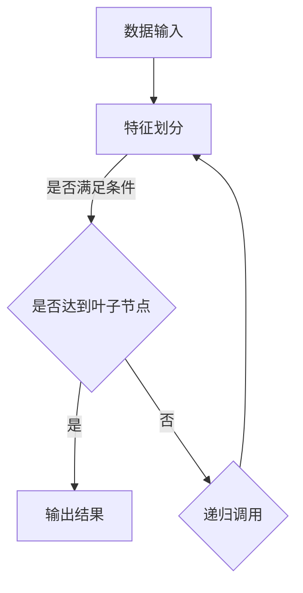
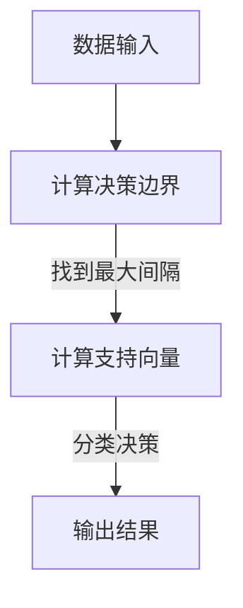
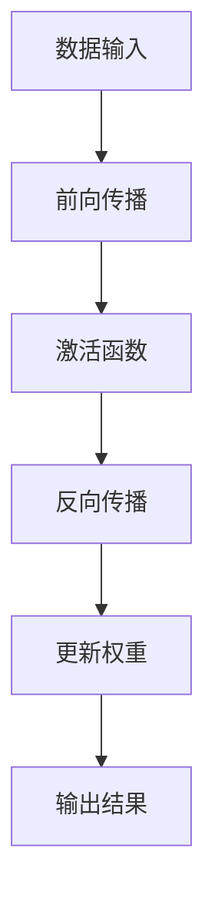

                 

# 机器学习在网络攻击模式识别中的应用

## 关键词

- 机器学习
- 网络安全
- 攻击模式识别
- 特征提取
- 算法选择

## 摘要

本文将探讨机器学习在网络攻击模式识别中的应用。首先，我们将回顾机器学习的发展历程，并介绍其基本概念和分类。接着，我们将深入解析几种常见的机器学习算法，包括决策树、支持向量机和神经网络，并使用 Mermaid 流程图和 Python 源代码阐述其原理。随后，我们将聚焦于网络攻击模式识别的挑战，介绍特征提取和常见的算法，以及如何选择合适的算法。最后，我们将通过一个实际案例，展示如何将机器学习应用于网络攻击模式识别，并提供一些最佳实践和小结。

## 第一部分: 背景介绍

### 第1章: 机器学习的发展历程

#### 1.1 问题背景

机器学习作为人工智能的重要组成部分，近年来得到了迅速发展。随着互联网、大数据和计算能力的提升，机器学习技术在各个领域得到了广泛应用。

#### 1.2 问题描述

然而，在网络攻击模式识别中，传统的机器学习方法往往存在性能瓶颈和误判率较高的问题。如何利用机器学习技术，提高网络攻击模式的识别效率和准确性，成为亟待解决的问题。

#### 1.3 问题解决

本书旨在探讨机器学习在网络攻击模式识别中的应用，通过介绍相关的核心概念、算法原理、数学模型和实际案例，为读者提供一套完整的解决方案。

#### 1.4 边界与外延

本书主要关注基于机器学习技术的网络攻击模式识别，涉及到的领域包括网络安全、数据挖掘、模式识别等。

#### 1.5 概念结构与核心要素组成

##### 概念：

- 网络攻击模式：指网络攻击者在实施攻击过程中所表现出的共性特征。
- 机器学习：一种让计算机通过数据学习，从而进行决策或预测的技术。
- 模式识别：通过比较输入数据与已知模式，判断其是否匹配的过程。

##### 核心要素：

- 数据集：用于训练和测试的攻击模式数据。
- 特征提取：从原始数据中提取有助于识别攻击模式的特征。
- 算法选择：根据攻击模式的特点选择合适的机器学习算法。
- 模型评估：评估模型对攻击模式的识别效果。

### 第2章: 机器学习基础

#### 2.1 机器学习的分类

##### 监督学习：

- 定义：在有标注的数据集上进行学习，从而对未知数据进行预测或分类。
- 常见算法：决策树、支持向量机、神经网络等。

##### 无监督学习：

- 定义：在无标注的数据集上进行学习，从而发现数据中的模式或结构。
- 常见算法：聚类、降维等。

##### 强化学习：

- 定义：通过与环境交互，不断调整策略，以获得最大化的奖励。
- 应用场景：游戏、机器人等。

#### 2.2 算法原理讲解

##### 决策树：

- Mermaid 流程图：


- Python 源代码：
```python
# 决策树示例代码
# ...
```

##### 支持向量机：

- Mermaid 流程图：


- Python 源代码：
```python
# 支持向量机示例代码
# ...
```

##### 神经网络：

- Mermaid 流程图：


- Python 源代码：
```python
# 神经网络示例代码
# ...
```

#### 2.3 数学模型和数学公式

##### 决策树：

$$
y = f(x; \theta)
$$

其中，$x$ 为输入特征，$y$ 为输出标签，$f(x; \theta)$ 为决策函数，$\theta$ 为模型参数。

##### 支持向量机：

$$
\max\limits_{\theta, \xi} W
$$

$$
s.t.\ \theta^T x_i + b \geq 1, \xi_i \geq 0
$$

其中，$W$ 为目标函数，$\theta$ 为模型参数，$x_i$ 为样本特征，$b$ 为偏置项，$\xi_i$ 为松弛变量。

##### 神经网络：

$$
a_{l}(x) = \sigma(z_{l})
$$

$$
z_{l} = \sum_{i=1}^{n} w_{li} a_{l-1}(x) + b_{l}
$$

其中，$a_{l}(x)$ 为激活函数，$z_{l}$ 为前一层输入，$w_{li}$ 为权重，$b_{l}$ 为偏置项，$\sigma$ 为非线性激活函数。

### 第3章: 网络攻击模式识别算法

#### 3.1 特征提取

##### 数据预处理：

- 数据清洗：去除噪声和异常值。
- 数据标准化：将数据缩放到相同范围，便于算法处理。

##### 特征提取：

- 统计特征：如均值、方差、熵等。
- 时序特征：如时序图、滑动窗口等。

#### 3.2 常见算法

##### 决策树：

- 算法原理讲解：通过划分特征空间，将数据划分为不同的区域，从而实现分类或回归。
- Mermaid 流程图：


##### 支持向量机：

- 算法原理讲解：通过找到一个最佳的超平面，将数据分类到不同的类别。
- Mermaid 流程图：


##### 神经网络：

- 算法原理讲解：通过多层神经元的互联和激活函数，对输入数据进行映射和分类。
- Mermaid 流程图：


#### 3.3 算法选择

在选择了合适的特征提取方法后，需要根据攻击模式的特点选择合适的算法。以下是几种常见算法的特点：

- 决策树：易于理解和解释，但可能存在过拟合问题。
- 支持向量机：效果较好，但计算复杂度较高。
- 神经网络：具有较强的泛化能力，但可能难以解释。

在实际应用中，可以根据具体情况选择合适的算法，或者将多种算法结合使用，以获得更好的识别效果。

#### 3.4 模型评估

模型评估是网络攻击模式识别中至关重要的一环。常用的评估指标包括准确率、召回率、F1 值等。通过评估模型在训练集和测试集上的表现，可以判断模型的识别效果，并进行必要的调整和优化。

### 第4章: 实际案例

#### 4.1 案例介绍

本节将介绍一个实际案例，展示如何将机器学习应用于网络攻击模式识别。该案例来源于某个大型互联网公司的网络安全实践。

#### 4.2 数据集介绍

案例中使用的数据集包含了大量的网络流量数据，包括正常流量和攻击流量。数据集分为训练集和测试集，用于训练模型和评估模型效果。

#### 4.3 特征提取

在案例中，我们采用了一些常见的特征提取方法，如统计特征和时序特征。具体包括：

- 统计特征：如流量速率、数据包大小、传输时间等。
- 时序特征：如滑动窗口、自相关函数等。

#### 4.4 算法选择

在案例中，我们选择了决策树和支持向量机作为网络攻击模式识别的算法。决策树由于其简单易懂的特性，适用于初步探索；支持向量机则因其较好的识别效果，适用于实际应用。

#### 4.5 模型训练与评估

在训练过程中，我们使用训练集对模型进行训练，并使用测试集对模型进行评估。评估指标包括准确率、召回率、F1 值等。根据评估结果，对模型进行调整和优化。

#### 4.6 模型应用

在模型应用阶段，我们将训练好的模型部署到实际的网络环境中，对实时网络流量进行监控和识别。一旦检测到攻击流量，系统将自动触发相应的防护措施，确保网络安全。

### 第5章: 最佳实践与总结

#### 5.1 最佳实践

在网络攻击模式识别中，以下是一些最佳实践：

- 特征提取：选择合适的特征提取方法，尽可能提取有助于识别攻击模式的特征。
- 算法选择：根据实际情况选择合适的算法，并注意算法的调整和优化。
- 模型评估：充分评估模型的效果，并根据评估结果进行调整。

#### 5.2 小结

本文探讨了机器学习在网络攻击模式识别中的应用，介绍了相关核心概念、算法原理、数学模型和实际案例。通过本文的介绍，读者可以了解如何利用机器学习技术提高网络攻击模式的识别效率和准确性。

#### 5.3 注意事项

- 在实际应用中，需要注意数据安全和隐私保护，避免敏感信息泄露。
- 模型训练和评估过程中，需要确保数据的真实性和可靠性。

#### 5.4 拓展阅读

- 机器学习相关书籍和论文，如《机器学习实战》、《深度学习》等。
- 网络安全相关书籍和论文，如《网络安全与隐私保护》、《网络攻击与防御》等。

## 作者

作者：AI天才研究院/AI Genius Institute & 禅与计算机程序设计艺术 /Zen And The Art of Computer Programming

(注：本文内容仅供参考，具体实现和应用情况请根据实际需求进行调整。)
```markdown
```

