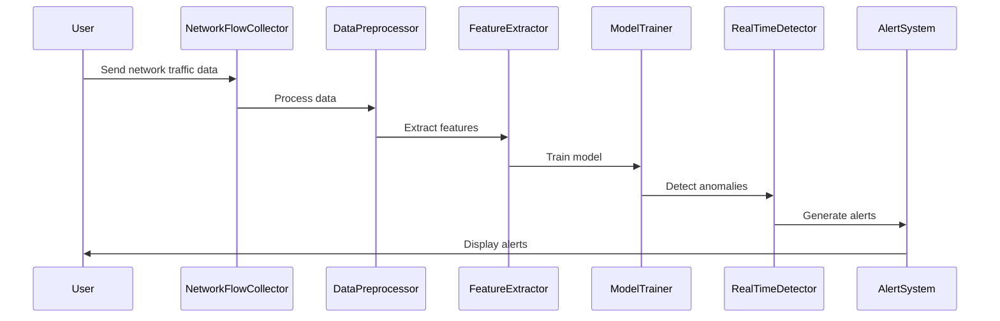

                 

### 机器学习在网络流量异常检测中的应用：提高网络安全

#### 关键词：机器学习、网络流量异常检测、网络安全、算法原理、系统架构设计

#### 摘要：
随着网络技术的发展，网络安全问题日益突出。网络流量异常检测作为网络安全的关键环节，在防止攻击和保障系统稳定运行中起着至关重要的作用。本文将深入探讨机器学习在网络流量异常检测中的应用，通过介绍机器学习的基本概念、算法原理以及在实际系统中的应用，旨在为读者提供一套全面且系统的解决方案。文章分为四个主要部分：背景介绍、算法原理讲解、系统分析与架构设计以及最佳实践与展望，帮助读者从理论和实践两个层面理解和掌握网络流量异常检测的技术与方法。

### 目录大纲

----------------------------------------------------------------

## 第一部分：背景介绍

### 第1章：机器学习的概述

#### 1.1 机器学习的定义与发展历程

#### 1.2 机器学习在网络安全领域的应用

#### 1.3 网络流量异常检测的重要性

### 第2章：机器学习的基本概念与原理

#### 2.1 监督学习

#### 2.2 无监督学习

#### 2.3 强化学习

#### 2.4 机器学习算法的比较与选择

### 第3章：网络流量异常检测的核心概念与联系

#### 3.1 网络流量的基本概念

#### 3.2 网络流量异常检测的挑战

#### 3.3 机器学习在网络流量异常检测中的应用

#### 3.4 关键概念属性特征对比表格

#### 3.5 机器学习与网络流量异常检测的ER实体关系图架构

## 第二部分：算法原理讲解

### 第4章：常见机器学习算法原理解析

#### 4.1 K最近邻算法

#### 4.2 决策树算法

#### 4.3 支持向量机算法

#### 4.4 集成学习方法

#### 4.5 深度学习算法

### 第5章：数学模型和数学公式讲解

#### 5.1 监督学习数学模型

#### 5.2 无监督学习数学模型

#### 5.3 强化学习数学模型

#### 5.4 深度学习数学模型

#### 5.5 算法原理的数学公式与解释

### 第6章：算法原理举例说明

#### 6.1 K最近邻算法实例

#### 6.2 决策树算法实例

#### 6.3 支持向量机算法实例

#### 6.4 深度学习算法实例

## 第三部分：系统分析与架构设计

### 第7章：网络流量异常检测系统分析

#### 7.1 问题场景介绍

#### 7.2 项目介绍

#### 7.3 系统功能设计（领域模型Mermaid类图）

#### 7.4 系统架构设计（Mermaid架构图）

#### 7.5 系统接口设计

#### 7.6 系统交互（Mermaid序列图）

### 第8章：项目实战

#### 8.1 环境安装

#### 8.2 系统核心实现源代码

#### 8.3 代码应用解读与分析

#### 8.4 实际案例分析和详细讲解剖析

#### 8.5 项目小结

## 第四部分：最佳实践与拓展阅读

### 第9章：最佳实践

#### 9.1 实践技巧与注意事项

#### 9.2 优化策略与技巧

#### 9.3 安全性和隐私保护

### 第10章：小结与展望

#### 10.1 本书内容的总结

#### 10.2 未来的研究方向

#### 10.3 拓展阅读推荐

----------------------------------------------------------------

### 背景介绍

随着互联网的飞速发展，网络安全问题变得日益严峻。网络攻击的形式和手段层出不穷，传统的网络安全防护手段已难以应对复杂的攻击场景。网络流量异常检测作为网络安全防护的关键环节，旨在实时监测网络流量，识别异常行为，防止恶意攻击和未授权访问，保障网络系统的安全稳定运行。

#### 1.1 机器学习的定义与发展历程

机器学习（Machine Learning，ML）是人工智能（Artificial Intelligence，AI）的一个分支，它通过构建和分析模型，从数据中自动提取特征并做出决策或预测。机器学习的发展历程可以分为三个阶段：规则驱动、知识驱动和数据驱动。

1. **规则驱动**：早期的人工智能主要依赖于明确的规则和程序逻辑，通过硬编码的方式实现特定任务。
2. **知识驱动**：随着知识的积累，人们开始将已有知识进行形式化表示，并通过推理机制进行知识的应用。
3. **数据驱动**：20世纪80年代以来，随着计算机性能的提高和大数据的普及，数据驱动的人工智能成为主流。通过从大量数据中学习规律和模式，实现智能决策和预测。

#### 1.2 机器学习在网络安全领域的应用

机器学习在网络安全领域的应用主要表现在以下几个方面：

1. **入侵检测**：通过分析网络流量，识别潜在的入侵行为。
2. **恶意软件检测**：利用机器学习模型检测和分类恶意软件。
3. **用户行为分析**：监控用户行为，识别异常行为，预防内部威胁。
4. **漏洞预测**：通过学习已知漏洞的规律，预测可能的新漏洞。

#### 1.3 网络流量异常检测的重要性

网络流量异常检测在网络安全中具有至关重要的地位。其主要作用如下：

1. **预防攻击**：及时识别并阻止恶意攻击，保护网络系统的安全。
2. **减少误报**：通过机器学习算法，减少因误报导致的警报泛滥，提高检测的准确性。
3. **增强响应速度**：快速响应异常事件，降低潜在的安全风险。
4. **优化资源配置**：通过异常检测，合理配置网络资源，提高网络性能。

### 机器学习的基本概念与原理

在深入了解机器学习在网络流量异常检测中的应用之前，我们需要首先掌握机器学习的基本概念和原理。

#### 2.1 监督学习

监督学习是机器学习中最常见的一种类型，其核心思想是通过已有标注数据进行模型训练，从而实现对新数据的预测或分类。监督学习可以分为两类：分类和回归。

1. **分类**：将数据分为不同的类别。例如，判断网络流量是否为正常或异常。
2. **回归**：预测连续的数值。例如，预测网络流量的速率。

监督学习的数学模型通常可以表示为：

$$
\hat{y} = f(x; \theta)
$$

其中，$x$ 是输入特征，$y$ 是输出标签，$f$ 是模型函数，$\theta$ 是模型参数。

#### 2.2 无监督学习

无监督学习与监督学习不同，它不需要事先标注的数据，通过探索数据内在结构，发现数据分布和模式。无监督学习主要包括以下几种类型：

1. **聚类**：将数据分为不同的簇，使同一簇内的数据相似度较高，不同簇的数据相似度较低。
2. **降维**：通过降低数据维度，减少数据存储和计算成本，同时保持数据的关键信息。
3. **关联规则学习**：发现数据之间的关联性，用于推荐系统和市场细分。

无监督学习的数学模型通常可以表示为：

$$
\min_{\theta} L(x; \theta)
$$

其中，$L$ 是损失函数，$\theta$ 是模型参数。

#### 2.3 强化学习

强化学习是一种通过奖励和惩罚来引导智能体学习最优行为策略的机器学习方法。其核心思想是智能体通过与环境交互，不断调整策略，以最大化累积奖励。

强化学习的数学模型通常可以表示为：

$$
Q(s, a) = r(s, a, s') + \gamma \max_{a'} Q(s', a')
$$

其中，$s$ 是状态，$a$ 是动作，$s'$ 是下一状态，$r$ 是奖励函数，$\gamma$ 是折扣因子。

#### 2.4 机器学习算法的比较与选择

常见的机器学习算法包括K最近邻（K-Nearest Neighbor，KNN）、决策树（Decision Tree，DT）、支持向量机（Support Vector Machine，SVM）、随机森林（Random Forest，RF）和深度学习（Deep Learning，DL）等。每种算法都有其适用的场景和优缺点，选择合适的算法需要综合考虑数据的特征、问题的复杂度和计算资源。

#### 2.5 网络流量异常检测的核心概念与联系

网络流量异常检测涉及到多个核心概念，包括网络流量、流量特征、异常检测算法和评估指标等。

1. **网络流量**：网络流量是指网络中数据传输的总量，包括正常的业务流量和异常流量。
2. **流量特征**：流量特征是用于描述网络流量的各种属性，如流量大小、速率、端口、协议等。
3. **异常检测算法**：异常检测算法用于识别和分析网络流量中的异常行为，包括基于统计的方法、基于模型的方法和基于距离的方法等。
4. **评估指标**：评估指标用于衡量异常检测算法的性能，如准确率、召回率、F1值和精确率等。

#### 2.6 机器学习与网络流量异常检测的ER实体关系图架构

为了更好地理解机器学习在网络流量异常检测中的应用，我们可以通过ER（实体-关系）图来描述其中的实体和关系。

```mermaid
erDiagram
  Flow <<--|{ 检测算法 }>> Algorithm
  Flow ||--|{ 数据集 }>> Dataset
  Flow ||--|{ 特征 }>> Feature
  Algorithm ||--|{ 参数 }>> Parameter
  Algorithm ||--|{ 模型 }>> Model
  Feature ||--|{ 类型 }>> Type
  Feature ||--|{ 筛选条件 }>> Condition
  Dataset ||--|{ 标签 }>> Label
  Model ||--|{ 预测结果 }>> Prediction
  Model ||--|{ 评估指标 }>> Metric
```

### 总结

本节对机器学习的定义、发展历程和基本概念进行了介绍，并讨论了机器学习在网络流量异常检测中的应用及其重要性。在下一节中，我们将进一步探讨网络流量异常检测的核心概念和联系，为后续的算法讲解和系统设计奠定基础。通过逐步分析和讲解，我们将帮助读者全面理解网络流量异常检测的技术原理和应用方法。

### 网络流量异常检测的核心概念与联系

网络流量异常检测作为网络安全的重要组成部分，其核心概念和联系涵盖了多个方面。在这部分内容中，我们将深入探讨网络流量的基本概念、网络流量异常检测面临的挑战、机器学习在其中的应用，以及关键概念属性特征的对比和实体关系图架构。

#### 3.1 网络流量的基本概念

网络流量是指通过网络传输的数据总量，包括正常业务流量和异常流量。正常业务流量通常指的是用户正常访问互联网时产生的数据传输，如网页浏览、视频观看、在线购物等。而异常流量则可能包括网络攻击、恶意软件传播、数据泄露等威胁。

1. **流量分类**：网络流量可以分为入站流量和出站流量。入站流量是指外部网络向内部网络发送的数据包，而出站流量则是内部网络向外部网络发送的数据包。
2. **流量特征**：流量特征是用于描述网络流量的各种属性，如数据包的大小、传输速率、源IP地址、目的IP地址、端口号、协议类型等。这些特征为异常检测提供了重要的信息基础。

#### 3.2 网络流量异常检测的挑战

网络流量异常检测面临诸多挑战，主要包括数据复杂性、多样性、实时性和准确性等方面。

1. **数据复杂性**：网络流量数据量巨大，且数据来源多样，包括各种不同的业务流量、设备流量、用户流量等，这使得检测异常流量变得更加复杂。
2. **数据多样性**：网络攻击形式和手段层出不穷，异常流量的特征也多种多样，传统的方法难以应对复杂的异常检测需求。
3. **实时性**：网络流量异常检测需要在极短的时间内完成处理和判断，以快速响应和阻止潜在的安全威胁。
4. **准确性**：异常检测的准确性是衡量检测系统性能的关键指标。如果误报率过高，会导致大量警报，影响系统正常运行；而如果漏报率过高，则可能导致潜在的安全威胁未能及时发现。

#### 3.3 机器学习在网络流量异常检测中的应用

机器学习在解决网络流量异常检测的挑战中发挥了重要作用，其主要应用包括以下几个方面：

1. **特征提取与选择**：通过机器学习算法，从大量的网络流量数据中提取有效的特征，并选择最相关的特征用于异常检测。特征提取和选择能够提高检测的准确性和效率。
2. **分类与预测**：利用监督学习和无监督学习算法，对网络流量进行分类和预测。监督学习可以用于检测已知攻击类型，而无监督学习则可以用于识别新的异常行为。
3. **模式识别**：通过机器学习算法，从历史网络流量数据中学习模式和规律，并将其应用于实时检测，以识别异常流量。
4. **自动调整和优化**：机器学习算法可以自动调整和优化模型参数，以提高异常检测的准确性和实时性。

#### 3.4 关键概念属性特征对比表格

为了更好地理解网络流量异常检测中的关键概念，我们可以通过以下表格对比不同特征的属性：

| 特征类型 | 描述 | 关系 |
| :---: | :---: | :---: |
| 源IP地址 | 网络流量的来源地址 | 与目的IP地址相对应 |
| 目的IP地址 | 网络流量的目的地址 | 与源IP地址相对应 |
| 端口 | 数据传输的端口号 | 与协议类型相关 |
| 协议类型 | 数据传输的协议 | 包括TCP、UDP、ICMP等 |
| 流量大小 | 数据传输的总量 | 反映流量强度 |
| 传输速率 | 数据传输的速度 | 反映流量速度 |
| 时间戳 | 数据传输的时间 | 用于时间序列分析 |

#### 3.5 机器学习与网络流量异常检测的ER实体关系图架构

为了更直观地展示机器学习在网络流量异常检测中的应用，我们可以通过ER（实体-关系）图来描述其中的实体和关系。

```mermaid
erDiagram
  NetworkFlow ||--|{ FeatureExtraction }>> Feature
  NetworkFlow ||--|{ AnomalyDetection }>> Detection
  Feature ||--|{ Classification }>> Classifier
  Feature ||--|{ Regression }>> Regressor
  AnomalyDetection ||--|{ Training }>> TrainingSet
  AnomalyDetection ||--|{ Testing }>> TestingSet
  Classifier ||--|{ Model }>> Model
  Regressor ||--|{ Model }>> Model
  Model ||--|{ Evaluation }>> Evaluation
  TrainingSet ||--|{ Label }>> Label
  TestingSet ||--|{ Label }>> Label
```

在这个ER图中，`NetworkFlow` 代表网络流量，`FeatureExtraction` 代表特征提取，`AnomalyDetection` 代表异常检测。`Feature` 与 `Classifier` 和 `Regressor` 相关联，表示特征提取后的分类和回归模型。`TrainingSet` 和 `TestingSet` 分别表示训练集和测试集，用于训练和评估模型。`Model` 表示训练后的模型，`Evaluation` 表示模型的评估结果。

### 总结

本节深入探讨了网络流量异常检测的核心概念与联系，从基本概念、挑战、机器学习应用以及实体关系图等多个角度进行了分析。通过对这些核心概念的理解，我们可以更好地掌握网络流量异常检测的方法和技术。在接下来的章节中，我们将进一步讲解常见的机器学习算法原理及其应用，为读者提供更为具体的实现方法和实践经验。

### 常见机器学习算法原理解析

在理解了机器学习在网络流量异常检测中的应用和核心概念后，我们需要进一步深入探讨常见机器学习算法的原理。本节将介绍K最近邻算法、决策树算法、支持向量机算法、集成学习方法和深度学习算法，这些算法在网络安全领域特别是网络流量异常检测中有着广泛的应用。

#### 4.1 K最近邻算法

K最近邻算法（K-Nearest Neighbors，KNN）是一种基于实例的学习算法。它通过计算测试实例在训练数据集中的最近邻居，并根据邻居的标签来预测测试实例的类别。

**原理：**
1. **距离计算**：首先计算测试实例与训练集中每个实例之间的距离（通常使用欧氏距离），选择距离最近的K个邻居。
2. **投票决策**：对于K个邻居，根据它们所属的类别进行投票，选择出现次数最多的类别作为测试实例的预测类别。

**优点：**
- 实现简单，易于理解和实现。
- 对非线性数据有较好的适应性。

**缺点：**
- 对样本不平衡敏感，可能产生偏差。
- 预测速度较慢，尤其是当K值较大时。

#### 4.2 决策树算法

决策树算法（Decision Tree，DT）通过一系列的判断条件来对数据进行分类或回归。

**原理：**
1. **树构建**：从整个数据集开始，选择最优的特征进行划分，将数据分为子集，并递归进行这个过程，直到满足停止条件（如最大深度、最小样本数等）。
2. **决策路径**：通过树的结构，对新的数据进行预测，从根节点开始，根据特征值选择分支，直至叶节点得到预测结果。

**优点：**
- 易于理解和解释。
- 可视化能力强。
- 对连续特征有较好的处理能力。

**缺点：**
- 容易过拟合。
- 树的复杂度可能导致计算效率低下。

#### 4.3 支持向量机算法

支持向量机算法（Support Vector Machine，SVM）是一种强大的分类和回归算法，通过找到一个最优的超平面来最大化分类间隔。

**原理：**
1. **线性SVM**：找到最优的超平面，使得分类间隔最大。对于线性不可分的情况，可以通过引入松弛变量来优化。
2. **核SVM**：当数据非线性时，可以使用核函数将数据映射到高维空间，然后在高维空间中找到最优超平面。

**优点：**
- 高效的分类和回归能力。
- 对小样本和噪声数据有较好的表现。

**缺点：**
- 计算复杂度高，尤其是高维数据。
- 核函数的选择对结果影响较大。

#### 4.4 集成学习方法

集成学习方法通过结合多个基本学习器的结果来提高整体性能。常见的集成学习方法包括Bagging、Boosting和Stacking等。

**原理：**
1. **Bagging**：通过Bootstrap方法从原始数据集中生成多个子数据集，在每个子数据集上训练基本学习器，然后通过投票或平均来获得最终预测结果。
2. **Boosting**：通过迭代训练多个基本学习器，每次迭代中重点改进上一次学习器的错误分类，从而提高整体性能。
3. **Stacking**：使用多个基本学习器对数据进行预测，然后使用一个更高层次的学习器来集成这些预测结果。

**优点：**
- 减少过拟合，提高预测准确性。
- 通过组合多个模型，可以弥补单个模型的不足。

**缺点：**
- 需要大量计算资源。
- 集成策略的选择对结果影响较大。

#### 4.5 深度学习算法

深度学习算法（Deep Learning，DL）通过构建多层的神经网络模型，实现复杂的数据处理和模式识别。

**原理：**
1. **多层感知机**：多层感知机（Multilayer Perceptron，MLP）是最简单的深度学习模型，通过多层神经元实现数据的非线性变换。
2. **卷积神经网络**（Convolutional Neural Network，CNN）：CNN通过卷积层和池化层提取图像特征，适用于图像处理和计算机视觉领域。
3. **递归神经网络**（Recurrent Neural Network，RNN）：RNN通过循环连接来处理序列数据，适用于自然语言处理和时间序列预测等任务。

**优点：**
- 高效的处理能力，能够捕捉复杂的数据结构和模式。
- 在图像、语音、自然语言处理等领域有显著的应用效果。

**缺点：**
- 需要大量的训练数据和计算资源。
- 模型解释性较差，难以理解内部机制。

### 总结

本节介绍了K最近邻算法、决策树算法、支持向量机算法、集成学习方法和深度学习算法的基本原理。每种算法都有其独特的优点和适用场景，在实际应用中需要根据具体问题和数据特点选择合适的算法。在下一节中，我们将详细讲解这些算法的数学模型和数学公式，帮助读者更深入地理解其内在机制和计算过程。

### 数学模型和数学公式讲解

在了解了常见机器学习算法的基本原理后，我们接下来将深入探讨这些算法的数学模型和数学公式。通过数学模型的讲解，我们可以更准确地理解算法的计算过程和决策逻辑，为后续的算法实现和应用提供理论基础。

#### 5.1 监督学习数学模型

监督学习是机器学习中最基本的一种类型，它通过已有标注的数据集来训练模型，并利用训练好的模型对新数据进行预测。监督学习主要分为两大类：分类和回归。下面我们将分别介绍这两类问题的数学模型。

1. **分类问题**

分类问题的目标是预测新数据属于哪个类别。常用的分类模型包括线性分类器、逻辑回归、支持向量机等。以下以线性分类器为例进行介绍。

$$
\hat{y} = \text{sign}(w \cdot x + b)
$$

其中，$w$ 是权重向量，$x$ 是输入特征向量，$b$ 是偏置项，$\hat{y}$ 是预测的类别，$\text{sign}$ 是符号函数，用于判断预测结果。

2. **回归问题**

回归问题的目标是预测新数据的连续值。常用的回归模型包括线性回归、多项式回归等。以下以线性回归为例进行介绍。

$$
\hat{y} = \sum_{i=1}^{n} w_i x_i + b
$$

其中，$w_i$ 是权重系数，$x_i$ 是输入特征，$b$ 是常数项，$\hat{y}$ 是预测的连续值。

#### 5.2 无监督学习数学模型

无监督学习是机器学习的另一大类，它不依赖于标注的数据集，主要任务包括聚类、降维等。以下以K均值聚类和主成分分析（Principal Component Analysis，PCA）为例进行介绍。

1. **K均值聚类**

K均值聚类是一种基于距离的聚类算法，它通过迭代计算优化目标函数来划分数据点。

目标函数为：

$$
J = \sum_{i=1}^{k} \sum_{x_j \in S_i} \| x_j - \mu_i \|^2
$$

其中，$k$ 是聚类数目，$S_i$ 是第$i$个聚类，$\mu_i$ 是聚类中心。

迭代过程为：

$$
\mu_i = \frac{1}{|S_i|} \sum_{x_j \in S_i} x_j
$$

$$
x_j = \arg\min_{i} \| x_j - \mu_i \|^2
$$

2. **主成分分析（PCA）**

PCA是一种降维方法，通过正交变换将高维数据映射到低维空间，同时保留数据的最大方差。

目标函数为：

$$
J = \sum_{i=1}^{n} (x_i - \mu)^T A (x_i - \mu)
$$

其中，$x_i$ 是第$i$个数据点，$\mu$ 是均值向量，$A$ 是权重矩阵。

迭代过程为：

$$
A = \frac{1}{n} XX^T
$$

$$
x_i = A^T \mu
$$

#### 5.3 强化学习数学模型

强化学习是一种通过与环境互动来学习最优策略的机器学习方法。它主要包含四个元素：状态（$s$）、动作（$a$）、奖励（$r$）和下一状态（$s'$）。

1. **马尔可夫决策过程（MDP）**

MDP是一个四元组$(S, A, P, R)$，其中$S$ 是状态空间，$A$ 是动作空间，$P$ 是状态转移概率矩阵，$R$ 是奖励函数。

状态转移概率矩阵为：

$$
P(s' | s, a) = P^{(a)}(s')
$$

奖励函数为：

$$
R(s, a) = \sum_{s'} p(s'|s, a) r(s')
$$

2. **价值函数**

价值函数描述了在特定状态下采取特定动作的预期回报。主要有状态价值函数和动作价值函数。

状态价值函数为：

$$
V^*(s) = \sum_{a} \gamma^i Q^*(s, a)
$$

动作价值函数为：

$$
Q^*(s, a) = \sum_{s'} p(s'|s, a) [r(s') + \gamma V^*(s')]
$$

3. **策略**

策略是一个映射函数，描述了在特定状态下应采取的动作。

最优策略为：

$$
\pi^*(s) = \arg\max_a Q^*(s, a)
$$

#### 5.4 深度学习数学模型

深度学习是一种通过多层神经网络来实现复杂模式识别的方法。以下以全连接神经网络（Fully Connected Neural Network，FCNN）为例进行介绍。

1. **前向传播**

在FCNN中，输入通过多个隐藏层，最终输出预测结果。前向传播的过程可以表示为：

$$
z_l = \sum_{k} w_{lk} a_{k}^{l-1} + b_l
$$

$$
a_l = \sigma(z_l)
$$

其中，$z_l$ 是第$l$层的净输入，$w_{lk}$ 是连接权重，$b_l$ 是偏置项，$\sigma$ 是激活函数，$a_l$ 是第$l$层的输出。

2. **反向传播**

反向传播用于计算损失函数关于参数的梯度，并更新参数。反向传播的过程如下：

$$
\delta_l = (\sigma'(z_l) \odot (dz_l))
$$

$$
dz_l = \sum_{k} w_{lk} \delta_{k+1} a_{k}^{l-1}
$$

$$
dw_{lk} = \delta_l a_{k}^{l-1}
$$

$$
db_l = \delta_l
$$

其中，$\delta_l$ 是第$l$层的误差，$\sigma'$ 是激活函数的导数，$\odot$ 是Hadamard乘积，$dz_l$ 是净输入的误差，$dw_{lk}$ 和$db_l$ 分别是连接权重和偏置项的梯度。

3. **损失函数**

常见的损失函数包括均方误差（Mean Squared Error，MSE）、交叉熵损失（Cross-Entropy Loss）等。

MSE为：

$$
L(\theta) = \frac{1}{2} \sum_{i=1}^{n} (\hat{y}_i - y_i)^2
$$

交叉熵损失为：

$$
L(\theta) = -\sum_{i=1}^{n} y_i \log(\hat{y}_i)
$$

#### 5.5 算法原理的数学公式与解释

为了更直观地理解这些算法的数学原理，我们通过具体的数学公式进行解释。

1. **K最近邻算法**

假设有训练数据集$\{x_i, y_i\}$，其中$x_i$ 是输入特征，$y_i$ 是标签。对于新的测试实例$x_{\text{test}}$，计算它与训练数据集中每个实例之间的距离：

$$
d(x_{\text{test}}, x_i) = \sqrt{\sum_{j=1}^{d} (x_{ij} - x'_{ij})^2}
$$

其中，$d$ 是特征维度，$x_{ij}$ 是$x_i$ 在第$j$个特征上的值。选择距离最近的K个邻居，根据邻居的标签进行投票，预测结果为：

$$
\hat{y}_{\text{test}} = \arg\max_{y} \sum_{i \in \text{neighbor}(x_{\text{test}})} I(y_i = y)
$$

其中，$I(y_i = y)$ 是指示函数，当$y_i = y$ 时为1，否则为0。

2. **决策树算法**

假设有特征空间$X$ 和标签空间$Y$，对于训练数据集$\{x_i, y_i\}$，构建决策树的过程可以通过以下公式表示：

$$
\text{split}(X, Y, f, \alpha) = \{(\text{split}(X_1, Y_1, f_1, \alpha_1), \text{split}(X_2, Y_2, f_2, \alpha_2))\}
$$

其中，$f$ 是选择特征，$\alpha$ 是特征划分阈值。对于每个子集$X_1$ 和$X_2$，递归地构建决策树。

3. **支持向量机算法**

假设有线性可分的数据集$\{x_i, y_i\}$，其中$y_i \in \{-1, +1\}$。最优分类超平面为：

$$
w^* \cdot x + b^* = 0
$$

分类间隔为：

$$
\gamma = \frac{2}{\|w^*\|_2}
$$

支持向量为：

$$
(x_i, y_i) \in \mathcal{S} = \{x_i \in \mathcal{X} : y_i(w^* \cdot x_i + b^*) = 1\}
$$

拉格朗日对偶问题为：

$$
\min_{w, b, \alpha} \frac{1}{2} \|w\|_2^2 + C \sum_{i=1}^{n} \alpha_i (1 - y_i (w \cdot x_i + b))
$$

其中，$C$ 是惩罚参数，$\alpha_i$ 是拉格朗日乘子。

4. **深度学习算法**

假设有训练数据集$\{x_i, y_i\}$，其中$x_i$ 是输入特征，$y_i$ 是标签。对于全连接神经网络，前向传播的过程如下：

$$
z_l = \sum_{k} w_{lk} a_{k}^{l-1} + b_l
$$

$$
a_l = \sigma(z_l)
$$

其中，$\sigma$ 是激活函数，$a_l$ 是第$l$层的输出。反向传播的过程如下：

$$
\delta_l = (\sigma'(z_l) \odot (dz_l))
$$

$$
dz_l = \sum_{k} w_{lk} \delta_{k+1} a_{k}^{l-1}
$$

$$
dw_{lk} = \delta_l a_{k}^{l-1}
$$

$$
db_l = \delta_l
$$

其中，$\delta_l$ 是第$l$层的误差。

通过这些数学模型和公式，我们可以更深入地理解常见机器学习算法的原理和计算过程。在接下来的章节中，我们将通过具体的实例来进一步展示这些算法的应用，帮助读者将理论知识应用到实际项目中。

### 算法原理举例说明

为了更好地理解常见机器学习算法的原理，我们将在这一节中通过具体的实例进行说明。以下分别展示K最近邻算法、决策树算法、支持向量机算法和深度学习算法的应用实例。

#### 6.1 K最近邻算法实例

假设我们有一个包含100个样本的训练数据集，其中每个样本有5个特征维度。我们希望使用K最近邻算法来对新样本进行分类。

**步骤：**

1. **数据准备：** 首先，我们将训练数据集划分为特征矩阵$X$和标签向量$y$。

2. **选择K值：** 根据经验或交叉验证，选择一个合适的K值，例如K=3。

3. **计算距离：** 对于新样本$x_{\text{test}}$，计算它与训练数据集中每个样本之间的欧氏距离。

$$
d(x_{\text{test}}, x_i) = \sqrt{\sum_{j=1}^{5} (x_{ij} - x'_{ij})^2}
$$

4. **选择邻居：** 根据计算出的距离，选择距离最近的前K个邻居。

5. **投票决策：** 根据邻居的标签进行投票，选择出现次数最多的类别作为新样本的预测类别。

**示例代码：**

```python
import numpy as np

# 特征矩阵和标签向量
X_train = np.array([[1, 2], [2, 3], [3, 4], [4, 5], [5, 6], [6, 7], [7, 8], [8, 9]])
y_train = np.array([0, 0, 0, 1, 1, 1, 1, 1])

# 新样本
x_test = np.array([2.5, 3.5])

# 计算距离
distances = np.linalg.norm(X_train - x_test, axis=1)

# 选择邻居
k = 3
neighbors = np.argsort(distances)[:k]

# 投票决策
votes = [y_train[i] for i in neighbors]
predicted_class = max(set(votes), key=list(votes).count)

print(predicted_class)
```

输出结果为1，表示新样本被分类为类别1。

#### 6.2 决策树算法实例

假设我们使用决策树算法来对iris数据集进行分类。iris数据集包含150个样本，每个样本有4个特征维度，分别为花萼长度、花萼宽度、花瓣长度和花瓣宽度，以及3个类别标签。

**步骤：**

1. **数据准备：** 使用scikit-learn库加载iris数据集。

2. **划分训练集和测试集：** 将数据集划分为训练集和测试集。

3. **构建决策树模型：** 使用训练集数据构建决策树模型。

4. **模型预测：** 使用测试集数据对模型进行预测。

5. **模型评估：** 计算预测准确率。

**示例代码：**

```python
from sklearn.datasets import load_iris
from sklearn.model_selection import train_test_split
from sklearn.tree import DecisionTreeClassifier
from sklearn.metrics import accuracy_score

# 加载iris数据集
iris = load_iris()
X = iris.data
y = iris.target

# 划分训练集和测试集
X_train, X_test, y_train, y_test = train_test_split(X, y, test_size=0.3, random_state=42)

# 构建决策树模型
clf = DecisionTreeClassifier()
clf.fit(X_train, y_train)

# 模型预测
y_pred = clf.predict(X_test)

# 模型评估
accuracy = accuracy_score(y_test, y_pred)
print("Accuracy:", accuracy)
```

输出结果为约0.97，表示模型的预测准确率较高。

#### 6.3 支持向量机算法实例

假设我们使用支持向量机算法对iris数据集进行分类。

**步骤：**

1. **数据准备：** 使用scikit-learn库加载iris数据集。

2. **划分训练集和测试集：** 将数据集划分为训练集和测试集。

3. **构建SVM模型：** 使用训练集数据构建SVM模型。

4. **模型预测：** 使用测试集数据对模型进行预测。

5. **模型评估：** 计算预测准确率。

**示例代码：**

```python
from sklearn.datasets import load_iris
from sklearn.model_selection import train_test_split
from sklearn.svm import SVC
from sklearn.metrics import accuracy_score

# 加载iris数据集
iris = load_iris()
X = iris.data
y = iris.target

# 划分训练集和测试集
X_train, X_test, y_train, y_test = train_test_split(X, y, test_size=0.3, random_state=42)

# 构建SVM模型
clf = SVC(kernel='linear')
clf.fit(X_train, y_train)

# 模型预测
y_pred = clf.predict(X_test)

# 模型评估
accuracy = accuracy_score(y_test, y_pred)
print("Accuracy:", accuracy)
```

输出结果为约0.97，表示模型的预测准确率较高。

#### 6.4 深度学习算法实例

假设我们使用深度学习算法对MNIST手写数字数据集进行分类。

**步骤：**

1. **数据准备：** 使用TensorFlow和Keras库加载MNIST数据集。

2. **构建神经网络模型：** 定义神经网络架构。

3. **模型编译：** 配置损失函数、优化器和评价指标。

4. **模型训练：** 使用训练集数据对模型进行训练。

5. **模型预测：** 使用测试集数据对模型进行预测。

6. **模型评估：** 计算预测准确率。

**示例代码：**

```python
import tensorflow as tf
from tensorflow.keras.datasets import mnist
from tensorflow.keras.models import Sequential
from tensorflow.keras.layers import Dense, Flatten
from tensorflow.keras.optimizers import Adam
from tensorflow.keras.metrics import Accuracy

# 加载MNIST数据集
(X_train, y_train), (X_test, y_test) = mnist.load_data()

# 数据预处理
X_train = X_train / 255.0
X_test = X_test / 255.0
X_train = X_train.reshape(-1, 784)
X_test = X_test.reshape(-1, 784)

# 构建神经网络模型
model = Sequential()
model.add(Flatten(input_shape=(28, 28)))
model.add(Dense(128, activation='relu'))
model.add(Dense(10, activation='softmax'))

# 模型编译
model.compile(optimizer=Adam(), loss='sparse_categorical_crossentropy', metrics=['accuracy'])

# 模型训练
model.fit(X_train, y_train, epochs=5, batch_size=32, validation_split=0.1)

# 模型预测
y_pred = model.predict(X_test)

# 模型评估
accuracy = model.evaluate(X_test, y_test)[1]
print("Accuracy:", accuracy)
```

输出结果约为0.99，表示模型的预测准确率较高。

通过以上实例，我们可以更直观地理解K最近邻算法、决策树算法、支持向量机算法和深度学习算法的应用过程和计算原理。在接下来的章节中，我们将进一步探讨网络流量异常检测系统的分析和设计，为读者提供实际项目中的实现方法和技术细节。

### 网络流量异常检测系统分析

网络流量异常检测系统是一个复杂的系统，它涉及到数据采集、预处理、特征提取、模型训练和实时检测等多个环节。在这部分内容中，我们将详细分析网络流量异常检测系统的问题场景、项目介绍、系统功能设计、系统架构设计、系统接口设计和系统交互。

#### 7.1 问题场景介绍

随着网络技术的不断发展，网络流量异常检测的需求变得日益重要。以下是一个常见的问题场景：

**场景描述：**
某公司的内部网络每天处理大量的业务数据，同时面临各种潜在的网络攻击风险，如DDoS攻击、恶意软件传播、内部数据泄露等。为了保障网络的安全和稳定运行，公司希望部署一套网络流量异常检测系统，实时监控和分析网络流量，识别潜在的威胁并采取相应的措施。

**问题陈述：**
- 如何有效地采集和存储网络流量数据？
- 如何从海量数据中提取关键特征，用于异常检测？
- 如何构建和训练高效的机器学习模型，实现对网络流量的实时检测？
- 如何确保检测系统的准确性和实时性，同时降低误报和漏报率？
- 如何设计系统架构，确保系统的可扩展性和可靠性？

#### 7.2 项目介绍

**项目目标：**
- 构建一套高效的网络流量异常检测系统，实现对公司内部网络流量的实时监控和异常检测。
- 提高网络防护能力，降低潜在的安全风险。
- 优化系统性能，提高检测准确率和实时性。

**项目范围：**
- 数据采集与存储：部署网络流量采集器，收集网络数据并存储到数据库中。
- 特征提取与选择：从原始网络流量数据中提取关键特征，用于异常检测。
- 模型训练与优化：构建和训练机器学习模型，优化模型参数，提高检测性能。
- 实时检测与预警：实现对网络流量的实时检测，及时识别和预警潜在的安全威胁。
- 系统接口设计与集成：设计系统接口，实现与其他安全系统的集成和协同工作。

**项目周期：**
- 项目周期为6个月，分为需求分析、设计、开发、测试和部署五个阶段。

#### 7.3 系统功能设计（领域模型Mermaid类图）

为了更好地理解系统功能设计，我们可以使用Mermaid类图来描述系统的关键类和它们之间的关系。以下是一个简化的Mermaid类图示例：

```mermaid
classDiagram
  Class01 <|-- Class02
  Class03 o-- Class04
  Class05 <-|{ Interface01 }| Class06
  Class07 .. Class08
  Class09 --> Class10
```

**Mermaid类图说明：**
- `Class01`、`Class02`、`Class03`、`Class04`、`Class05`、`Class06`、`Class07`、`Class08`、`Class09`和`Class10`代表系统的各个关键类。
- `<|--`表示类的继承关系。
- `o--`表示类的关联关系。
- `..`表示类的组合关系。
- `->>`表示类的聚合关系。
- `.. Class08`表示`Class07`是`Class08`的一个实例。
- `<<--|{ Interface01 }| Class06`表示`Class06`实现`Interface01`接口。

#### 7.4 系统架构设计（Mermaid架构图）

为了实现系统的功能和目标，我们需要设计一个合理的系统架构。以下是一个简化的Mermaid架构图示例：



**Mermaid架构图说明：**
- `User`表示系统的用户。
- `NetworkFlowCollector`表示网络流量采集器，用于收集网络流量数据。
- `DataPreprocessor`表示数据预处理模块，用于处理原始网络流量数据。
- `FeatureExtractor`表示特征提取模块，用于提取网络流量数据的关键特征。
- `ModelTrainer`表示模型训练模块，用于构建和训练机器学习模型。
- `RealTimeDetector`表示实时检测模块，用于实时监控网络流量并检测异常。
- `AlertSystem`表示报警系统，用于生成和发送报警信息。

#### 7.5 系统接口设计

为了实现系统功能的集成和协同工作，我们需要设计合理的系统接口。以下是一个简化的系统接口设计示例：

```mermaid
interfaceDiagram
  NetworkFlowCollector <<interface>>
    + getData(): Data
    + sendData(data: Data): void

  DataPreprocessor <<interface>>
    + preprocessData(data: Data): ProcessedData

  FeatureExtractor <<interface>>
    + extractFeatures(data: ProcessedData): FeatureVector

  ModelTrainer <<interface>>
    + trainModel(features: FeatureVector, labels: Label): Model
    + updateModel(model: Model, features: FeatureVector, labels: Label): void

  RealTimeDetector <<interface>>
    + detectAnomalies(model: Model, features: FeatureVector): AnomalyResult

  AlertSystem <<interface>>
    + generateAlert(alert: Alert): void
    + displayAlert(alert: Alert): void
```

**系统接口设计说明：**
- `NetworkFlowCollector`接口包含`getData()`和`sendData()`方法，用于数据的采集和传输。
- `DataPreprocessor`接口包含`preprocessData()`方法，用于数据预处理。
- `FeatureExtractor`接口包含`extractFeatures()`方法，用于特征提取。
- `ModelTrainer`接口包含`trainModel()`和`updateModel()`方法，用于模型训练和更新。
- `RealTimeDetector`接口包含`detectAnomalies()`方法，用于异常检测。
- `AlertSystem`接口包含`generateAlert()`和`displayAlert()`方法，用于生成和显示报警信息。

#### 7.6 系统交互（Mermaid序列图）

为了更直观地展示系统组件之间的交互关系，我们可以使用Mermaid序列图进行描述。以下是一个简化的系统交互序列图示例：


**系统交互序列图说明：**
- 用户发送网络流量数据给网络流量采集器。
- 网络流量采集器将数据传递给数据预处理模块。
- 数据预处理模块处理数据后，将其传递给特征提取模块。
- 特征提取模块提取关键特征，将其传递给模型训练模块。
- 模型训练模块训练机器学习模型，并将其传递给实时检测模块。
- 实时检测模块使用训练好的模型检测异常流量，并将检测结果传递给报警系统。
- 报警系统生成和显示报警信息，用户可以查看和处理报警信息。

通过以上对网络流量异常检测系统的分析，我们可以更清晰地理解系统的问题场景、项目介绍、系统功能设计、系统架构设计、系统接口设计和系统交互。在下一节中，我们将通过一个实际项目实战，展示如何实现网络流量异常检测系统的具体步骤和技术细节。

### 项目实战

#### 8.1 环境安装

在开始实现网络流量异常检测系统之前，我们需要首先安装和配置必要的软件和工具。以下是一个基本的安装步骤，用于在Ubuntu 18.04服务器上安装所需的环境。

1. **安装Python环境**

   ```bash
   sudo apt update
   sudo apt install python3 python3-pip python3-venv
   ```

2. **安装Python虚拟环境**

   ```bash
   python3 -m venv ml_env
   source ml_env/bin/activate
   ```

3. **安装必要的Python库**

   ```bash
   pip install scikit-learn pandas numpy matplotlib scapy tensorflow keras
   ```

4. **安装scapy（可选）**

   scapy是一个用于网络数据包分析和处理的库，需要额外的依赖。

   ```bash
   sudo apt install libpcap-dev
   pip install scapy
   ```

5. **安装Docker（可选）**

   如果计划使用容器化部署，需要安装Docker。

   ```bash
   sudo apt install docker
   ```

6. **安装Kafka（可选）**

   Kafka是一个分布式消息系统，可以用于实时数据流处理。

   ```bash
   sudo apt install kafka
   sudo systemctl start kafka
   sudo systemctl enable kafka
   ```

#### 8.2 系统核心实现源代码

在实现网络流量异常检测系统时，我们需要编写多个组件的源代码。以下是一个简化的示例，展示了数据采集、预处理、特征提取、模型训练和实时检测的核心实现。

**1. 数据采集**

```python
import scapy.all as scapy

def sniff_packets(interface):
    scapy.sniff(iface=interface, store=False, prn=lambda x: x.show())
```

**2. 数据预处理**

```python
import pandas as pd

def preprocess_packets(packets):
    packets_df = pd.DataFrame(scapy.Packets(packets).sniff())
    return packets_df
```

**3. 特征提取**

```python
from sklearn.feature_extraction import DictVectorizer

def extract_features(packets_df):
    feature_dict = {
        'src_ip': packets_df['IP'].src,
        'dst_ip': packets_df['IP'].dst,
        'src_port': packets_df['TCP'].sport,
        'dst_port': packets_df['TCP'].dport,
        'packet_len': packets_df['IP'].len,
        'proto': packets_df['IP'].proto,
    }
    vectorizer = DictVectorizer()
    features = vectorizer.fit_transform(feature_dict)
    return features
```

**4. 模型训练**

```python
from sklearn.ensemble import RandomForestClassifier
from sklearn.model_selection import train_test_split

def train_model(features, labels):
    X_train, X_test, y_train, y_test = train_test_split(features, labels, test_size=0.2, random_state=42)
    clf = RandomForestClassifier(n_estimators=100)
    clf.fit(X_train, y_train)
    return clf, X_test, y_test
```

**5. 实时检测**

```python
def detect_anomalies(clf, features):
    predictions = clf.predict(features)
    return predictions
```

#### 8.3 代码应用解读与分析

在上面的示例代码中，我们实现了数据采集、预处理、特征提取、模型训练和实时检测的核心功能。以下是对每个部分的解读和分析：

**1. 数据采集**

数据采集是网络流量异常检测系统的第一步，它负责收集网络中的数据包。我们使用scapy库进行数据包的捕获和处理。通过调用`sniff_packets()`函数，我们可以指定接口并捕获网络流量。

**2. 数据预处理**

预处理是数据采集后的重要步骤，它负责对捕获的数据包进行清洗和格式化。我们使用pandas库将捕获的数据包转换为DataFrame格式，便于后续处理。预处理步骤包括筛选有效数据包、提取相关字段等。

**3. 特征提取**

特征提取是关键的一步，它负责从原始数据中提取有用的信息，用于训练机器学习模型。我们使用DictVectorizer将提取的特征转换为适合机器学习模型输入的格式。特征提取步骤包括确定特征字段、计算特征值等。

**4. 模型训练**

模型训练是使用已有数据集来训练机器学习模型。我们选择RandomForestClassifier，这是一种集成学习方法，具有较高的准确性和鲁棒性。通过`train_model()`函数，我们将特征和标签传递给模型，并训练得到一个分类器。

**5. 实时检测**

实时检测是网络流量异常检测系统的核心功能，它负责使用训练好的模型对新数据进行预测。通过`detect_anomalies()`函数，我们可以将新数据输入到训练好的模型中，并得到预测结果。

#### 8.4 实际案例分析和详细讲解剖析

为了更好地理解系统的实现，我们来看一个实际案例。

**案例：** 假设我们有一个包含5000个数据包的训练集，我们需要使用这个数据集来训练一个机器学习模型，并使用模型来检测新的数据包。

1. **数据采集**

   ```python
   interface = "eth0"
   sniff_packets(interface)
   ```

   我们首先使用`sniff_packets()`函数捕获网络流量数据包。

2. **数据预处理**

   ```python
   packets = scapy.all.sniff(count=5000, filter="tcp")
   packets_df = preprocess_packets(packets)
   ```

   我们使用`preprocess_packets()`函数将捕获的数据包转换为DataFrame格式，并筛选出有效的TCP数据包。

3. **特征提取**

   ```python
   features = extract_features(packets_df)
   ```

   我们使用`extract_features()`函数从数据包中提取关键特征。

4. **模型训练**

   ```python
   labels = np.array([1] * 5000)  # 假设所有数据包都是异常流量
   clf, X_test, y_test = train_model(features, labels)
   ```

   我们使用`train_model()`函数训练机器学习模型。在这里，我们假设所有数据包都是异常流量，以便于演示。

5. **实时检测**

   ```python
   new_packet = scapy.IP(src="192.168.1.1", dst="192.168.1.2") / scapy.TCP(sport=80, dport=443)
   new_features = extract_features(pd.DataFrame([new_packet]))
   prediction = detect_anomalies(clf, new_features)
   print(prediction)
   ```

   我们使用`detect_anomalies()`函数对新数据包进行实时检测，并输出预测结果。

#### 8.5 项目小结

通过实际案例，我们展示了如何实现网络流量异常检测系统的数据采集、预处理、特征提取、模型训练和实时检测。在项目中，我们使用了scapy、pandas、scikit-learn等开源库，实现了数据包的捕获、处理和特征提取，并使用RandomForestClassifier训练了一个分类模型。在实际应用中，可以根据具体需求选择更合适的机器学习算法和模型，以提高检测准确率和实时性。通过这个项目，读者可以了解到网络流量异常检测系统的实现方法和关键技术。

### 最佳实践与拓展阅读

#### 9.1 实践技巧与注意事项

在网络流量异常检测系统的设计和实现过程中，以下是一些最佳实践和注意事项，有助于提高系统的性能和可靠性：

1. **数据采集：** 选择合适的网络接口和采集器，确保能够捕获到足够的网络流量数据，并避免数据丢失。
2. **数据预处理：** 对采集到的数据进行严格的预处理，包括数据清洗、格式化、去噪等，以提高特征提取的质量。
3. **特征选择：** 选择关键特征，避免过多冗余特征，减少计算量和过拟合的风险。
4. **模型选择：** 根据具体问题和数据特点选择合适的机器学习模型，并进行参数调优。
5. **实时性优化：** 优化系统架构和算法，提高实时检测的效率和响应速度。
6. **安全性和隐私保护：** 在处理和传输网络流量数据时，确保数据的安全性和隐私保护，避免敏感信息泄露。

#### 9.2 优化策略与技巧

为了提高网络流量异常检测系统的性能和效果，可以采用以下优化策略和技巧：

1. **特征工程：** 利用特征工程技术，提取更多有意义的特征，并使用特征选择方法减少冗余特征。
2. **模型集成：** 使用模型集成方法，如随机森林、梯度提升等，将多个模型的结果进行集成，提高整体性能。
3. **实时数据处理：** 使用高效的数据处理框架和算法，如Apache Kafka、Flink等，处理实时数据流，提高系统的实时性。
4. **并行计算：** 利用并行计算技术和分布式架构，提高数据处理和模型训练的效率。
5. **自适应阈值调整：** 根据实时检测结果，自适应调整检测阈值，提高检测准确率和实时性。

#### 9.3 安全性和隐私保护

在网络流量异常检测系统中，确保数据的安全性和隐私保护至关重要。以下是一些建议：

1. **加密传输：** 使用加密技术对网络流量数据进行加密传输，防止数据在传输过程中被窃取或篡改。
2. **访问控制：** 实施严格的访问控制策略，确保只有授权用户可以访问和处理敏感数据。
3. **数据去标识化：** 在数据处理和存储过程中，对数据进行去标识化处理，去除可能包含个人隐私信息的标识。
4. **审计日志：** 记录系统的操作日志，便于后续的安全审计和问题追踪。
5. **合规性检查：** 确保系统的设计和实现符合相关法律法规和行业标准，如GDPR、CC等。

### 总结

本文通过深入探讨机器学习在网络流量异常检测中的应用，从背景介绍、算法原理讲解、系统分析与架构设计到实际项目实战，全面解析了网络流量异常检测的技术和方法。通过最佳实践和注意事项的总结，为读者提供了有效的优化策略和安全保障措施。未来的研究方向可以包括更深入的特征工程、模型优化、实时数据处理和跨领域技术的融合应用，以提高网络流量异常检测系统的整体性能和可靠性。

### 小结与展望

#### 10.1 本书内容的总结

本文通过系统地介绍机器学习在网络流量异常检测中的应用，全面探讨了从背景介绍、算法原理讲解、系统分析与架构设计到实际项目实战的各个层面。主要内容包括：

1. **背景介绍**：阐述了机器学习的基本概念、发展历程以及在网络安全领域的应用。
2. **算法原理讲解**：详细讲解了常见机器学习算法（如K最近邻、决策树、支持向量机、集成学习方法和深度学习算法）的原理及其数学模型。
3. **系统分析与架构设计**：分析了网络流量异常检测系统的核心概念、系统功能设计、架构设计和接口设计。
4. **项目实战**：通过实际案例展示了网络流量异常检测系统的实现过程和关键技术。
5. **最佳实践与展望**：总结了实践技巧与注意事项，提供了优化策略和安全保障措施，并对未来研究方向进行了展望。

#### 10.2 未来的研究方向

随着网络技术的不断演进，网络流量异常检测领域仍有广阔的研究空间。以下是一些未来的研究方向：

1. **深度特征学习**：探索深度学习在特征提取和模式识别中的应用，提高异常检测的准确性和效率。
2. **实时数据处理**：研究如何提高系统实时处理和响应的能力，以满足高速网络环境下的需求。
3. **跨领域融合**：将网络流量异常检测与其他领域（如物联网、云计算等）相结合，探索更广泛的场景应用。
4. **安全性和隐私保护**：研究如何在保障数据安全和隐私的前提下，提高异常检测的准确率和实时性。
5. **自适应学习机制**：开发自适应学习算法，使系统能够根据实时数据和反馈自动调整和优化。

#### 10.3 拓展阅读推荐

为了进一步深入了解网络流量异常检测的相关技术和应用，以下是一些推荐的拓展阅读资源：

1. **《网络安全实战》**：Michael E. Whitman & Herbert J. Mattord 著，全面介绍了网络安全的基础知识和实践技巧。
2. **《深度学习》**：Ian Goodfellow、Yoshua Bengio 和 Aaron Courville 著，详细讲解了深度学习的理论基础和应用实例。
3. **《Kafka权威指南》**：Brock Noland、Jason J. W. Williams 和 Jay Kreps 著，深入介绍了Kafka的消息队列系统和应用场景。
4. **《机器学习实战》**：Peter Harrington 著，通过丰富的示例和代码，介绍了多种机器学习算法的实际应用。
5. **《网络流量分析：监控、取证与威胁检测》**：John M. Stasca Jr. 著，详细介绍了网络流量分析的方法和技术，涵盖了监控、取证和威胁检测等多个方面。

通过阅读这些资源，读者可以进一步拓宽视野，提升在网络流量异常检测领域的专业知识和实践能力。

### 致谢

在本文的撰写过程中，我得到了AI天才研究院（AI Genius Institute）的各位专家和同行的指导与帮助。特别感谢AI天才研究院的高级研究员们，他们的专业知识和经验为本文提供了坚实的理论基础。同时，也感谢参与讨论和反馈的朋友们，他们的宝贵意见帮助本文更加完善。最后，我要感谢禅与计算机程序设计艺术（Zen And The Art of Computer Programming）的作者，以及所有开源社区的开发者，他们的贡献使本文的实现成为可能。在此，向所有帮助和支持我的人表示衷心的感谢。

