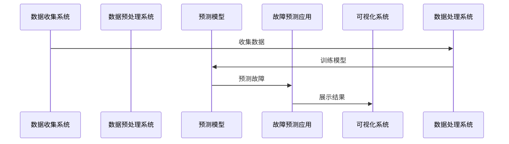

                 

## 机器学习在预测性维护中的实践与创新

### 文章标题

**机器学习在预测性维护中的实践与创新**

### 关键词

机器学习、预测性维护、算法、实践、创新

### 摘要

本文旨在探讨机器学习在预测性维护中的应用与实践。通过深入分析预测性维护的定义、核心要素及其在工业领域的应用，我们详细介绍了机器学习的基础知识，包括监督学习、非监督学习和强化学习等。在此基础上，我们探讨了机器学习算法在预测性维护中的具体应用，如回归模型、类别模型和时间序列分析等。随后，通过一个实际案例，我们展示了如何将机器学习应用于预测性维护的项目实战，并总结了其中的最佳实践与创新。文章最后对未来预测性维护的发展方向进行了展望。

### 目录

1. **背景与基础**  
   1.1 预测性维护概述  
   1.2 机器学习基础  
   1.3 预测性维护与机器学习的结合

2. **机器学习在预测性维护中的应用**  
   2.1 预测性维护中的机器学习算法  
   2.2 数据收集与预处理  
   2.3 模型训练与评估

3. **预测性维护项目实战**  
   3.1 项目背景与目标  
   3.2 系统设计与实现  
   3.3 项目小结与反思

4. **创新与实践**  
   4.1 创新方法与思路  
   4.2 最佳实践与总结

5. **展望与未来**  
   5.1 挑战与机遇  
   5.2 未来研究方向

---

## 第一部分：背景与基础

### 1.1 预测性维护概述

#### 定义与重要性

预测性维护（Predictive Maintenance）是一种基于实时数据分析和预测的维护策略。其核心思想是通过收集和分析设备运行数据，预测设备故障，从而实现提前维护，避免设备突发故障导致的生产停滞和维修成本增加。预测性维护的定义可以概括为：

- **定义**：利用数据分析、机器学习和人工智能技术，对设备运行状态进行实时监测，预测潜在故障，并在故障发生前采取预防措施。

- **重要性**：预测性维护在降低维修成本、提高设备利用率、延长设备寿命等方面具有显著优势。具体来说，它有助于：

  - **降低维修成本**：通过提前预测故障，避免突发性维修导致的巨额成本。
  - **提高设备利用率**：减少设备停机时间，提高生产效率。
  - **延长设备寿命**：通过定期维护和优化，延长设备的使用寿命。

#### 历史与发展

预测性维护的历史可以追溯到20世纪50年代，当时企业开始尝试使用设备监控系统来监测设备状态。然而，由于技术的限制，早期的预测性维护主要依赖于人工分析和经验判断。随着计算机技术和传感器技术的快速发展，预测性维护逐渐进入数字时代。20世纪80年代，振动分析、油液分析等故障诊断技术开始广泛应用。进入21世纪，随着大数据、云计算和机器学习等技术的兴起，预测性维护进入了一个全新的阶段，实现了从传统的经验驱动向数据驱动的转变。

#### 核心要素

预测性维护的核心要素主要包括数据收集、数据分析和决策支持。这些要素相互关联，共同构成了预测性维护的生态系统。

- **数据收集**：数据是预测性维护的基础。通过传感器、监控系统等手段，实时收集设备运行数据，包括振动、温度、压力等参数。
- **数据分析**：利用数据分析技术，对收集到的数据进行处理和分析，提取设备状态的特征。
- **模型建立**：基于数据分析结果，建立预测模型，预测设备故障的发生时间。
- **决策支持**：根据预测结果，制定维护策略，提前进行预防性维护，避免故障发生。

#### 本章小结

本章对预测性维护进行了概述，包括其定义、历史和发展、核心要素以及重要性。通过本章的学习，读者可以了解预测性维护的基本概念和原理，为进一步探讨机器学习在预测性维护中的应用打下基础。

---

## 第一部分：背景与基础

### 1.2 机器学习基础

#### 监督学习

监督学习（Supervised Learning）是一种常见的机器学习技术，其核心思想是通过已标记的样本数据，学习出一个映射关系，用于对新数据进行预测。监督学习可以分为分类和回归两种类型。

- **分类**：分类任务的目标是将数据分为不同的类别。常见的分类算法包括决策树、随机森林、支持向量机（SVM）等。
- **回归**：回归任务的目标是预测一个连续的数值。常见的回归算法包括线性回归、岭回归、决策树回归等。

#### 非监督学习

非监督学习（Unsupervised Learning）不依赖于已标记的样本数据，其目标是通过数据自身的特征，发现数据中的模式和规律。非监督学习主要包括聚类和降维两种类型。

- **聚类**：聚类任务的目标是将数据分为不同的组，使得同组数据之间的相似度较高，异组数据之间的相似度较低。常见的聚类算法包括K-Means、层次聚类、DBSCAN等。
- **降维**：降维任务的目标是减少数据的维度，同时保留数据的主要特征。常见的降维算法包括主成分分析（PCA）、线性判别分析（LDA）等。

#### 强化学习

强化学习（Reinforcement Learning）是一种通过与环境交互，不断学习最优策略的机器学习技术。强化学习的主要目标是使智能体（Agent）在特定环境中获得最大的累积奖励。

- **环境**（Environment）：智能体所处的环境，环境提供了智能体当前的状态和可能的动作。
- **状态**（State）：智能体在特定时刻所处的状态。
- **动作**（Action）：智能体可以采取的动作。
- **奖励**（Reward）：智能体采取某个动作后，环境给予的即时奖励。

强化学习的主要挑战在于如何找到一个最优策略，使得智能体能够在长期内获得最大的累积奖励。

#### 机器学习模型评估

在机器学习中，模型评估是至关重要的一步。常见的模型评估指标包括准确率、召回率、精确率、F1分数、均方误差（MSE）等。

- **准确率**（Accuracy）：分类问题中，分类正确的样本数占总样本数的比例。
- **召回率**（Recall）：分类问题中，实际为正类别的样本中被正确分类为正类别的比例。
- **精确率**（Precision）：分类问题中，被正确分类为正类别的样本中实际为正类别的比例。
- **F1分数**（F1 Score）：精确率和召回率的调和平均值。
- **均方误差**（Mean Squared Error，MSE）：回归问题中，预测值与实际值之间的平均平方误差。

#### 本章小结

本章介绍了机器学习的基础知识，包括监督学习、非监督学习和强化学习等。通过本章的学习，读者可以了解机器学习的基本概念和常见算法，为后续章节中机器学习在预测性维护中的应用打下基础。

---

## 第一部分：背景与基础

### 1.3 预测性维护与机器学习的结合

#### 数据收集

数据收集是预测性维护的关键步骤，高质量的数据是建立准确预测模型的基础。在预测性维护中，数据收集主要包括以下方面：

- **传感器数据**：通过安装传感器，实时收集设备运行参数，如振动、温度、压力等。
- **设备日志**：收集设备运行日志，包括开机时间、停机时间、故障记录等。
- **操作数据**：记录操作人员的操作行为，如维修时间、维修次数等。
- **环境数据**：收集设备运行环境的数据，如温度、湿度、光照等。

#### 数据预处理

数据预处理是确保数据质量的重要环节。在预测性维护中，数据预处理主要包括以下步骤：

- **数据清洗**：去除无效数据、重复数据和错误数据，保证数据的准确性。
- **数据转换**：将不同类型的数据转换为同一类型，如将字符串转换为数值。
- **数据归一化**：将不同特征的数据进行归一化处理，使它们具有相同的量纲，便于后续分析。
- **特征工程**：通过提取、构造新的特征，提高预测模型的性能。

#### 模型建立

在预测性维护中，模型建立是关键步骤。常见的模型建立方法包括：

- **回归模型**：用于预测设备故障发生的具体时间。
- **类别模型**：用于预测设备故障的类型。
- **时间序列分析**：用于分析设备运行数据的时间变化趋势。

#### 决策支持

决策支持是预测性维护的最终目标，通过预测结果，制定相应的维护策略。常见的决策支持方法包括：

- **提前维护**：在预测到设备故障前，提前进行维护，避免突发性故障。
- **预防性维护**：根据预测结果，制定定期维护计划，减少设备故障的发生。
- **优化维护**：通过分析维护成本和收益，优化维护策略，降低维护成本。

#### 本章小结

本章介绍了预测性维护与机器学习的结合，包括数据收集、数据预处理、模型建立和决策支持等方面。通过本章的学习，读者可以了解如何利用机器学习技术实现预测性维护，为后续章节中的项目实战打下基础。

---

## 第二部分：机器学习在预测性维护中的应用

### 2.1 预测性维护中的机器学习算法

在预测性维护中，机器学习算法的应用至关重要。根据预测目标的不同，机器学习算法可以分为回归模型、类别模型和时间序列分析等。

#### 回归模型

回归模型主要用于预测设备故障发生的时间。常见的回归模型包括线性回归、岭回归、决策树回归等。

- **线性回归**：线性回归是一种最简单的回归模型，其目标是通过拟合一个线性函数来预测设备故障时间。线性回归的数学模型可以表示为：

  $$ y = \beta_0 + \beta_1 \cdot x_1 + \beta_2 \cdot x_2 + ... + \beta_n \cdot x_n $$

  其中，$y$ 是预测的设备故障时间，$x_1, x_2, ..., x_n$ 是输入特征，$\beta_0, \beta_1, ..., \beta_n$ 是模型的参数。

- **岭回归**：岭回归是一种在线性回归基础上加入正则化项的回归模型，其目标是通过最小化误差平方和并最大化正则化项来预测设备故障时间。岭回归的数学模型可以表示为：

  $$ J(\beta) = \sum_{i=1}^{n} (y_i - \beta_0 - \beta_1 \cdot x_{i1} - \beta_2 \cdot x_{i2} - ... - \beta_n \cdot x_{in})^2 + \lambda \sum_{j=1}^{n} \beta_j^2 $$

  其中，$J(\beta)$ 是模型的损失函数，$\lambda$ 是正则化参数。

- **决策树回归**：决策树回归是一种通过树形结构进行分类和回归的模型，其目标是通过遍历树结构来预测设备故障时间。决策树回归的数学模型可以表示为：

  $$ f(x) = \sum_{i=1}^{n} \beta_i \cdot g(x) $$

  其中，$f(x)$ 是预测的设备故障时间，$g(x)$ 是决策树中的路径函数，$\beta_i$ 是路径系数。

#### 类别模型

类别模型主要用于预测设备故障的类型。常见的类别模型包括支持向量机（SVM）、随机森林、逻辑回归等。

- **支持向量机**：支持向量机是一种通过最大化分类间隔来分类的模型，其目标是通过找到一个超平面将不同类别的数据分隔开来。支持向量机的数学模型可以表示为：

  $$ \min_{\beta, b} \frac{1}{2} \sum_{i=1}^{n} (\beta_i^2) + C \sum_{i=1}^{n} \max(0, 1 - y_i (\beta_i \cdot x_i + b)) $$

  其中，$\beta_i$ 是模型的参数，$b$ 是偏置项，$C$ 是惩罚参数。

- **随机森林**：随机森林是一种通过构建多棵决策树并投票来分类的模型，其目标是通过集成多个决策树来提高分类性能。随机森林的数学模型可以表示为：

  $$ f(x) = \sum_{i=1}^{N} w_i \cdot g_i(x) $$

  其中，$f(x)$ 是预测的设备故障类型，$g_i(x)$ 是第$i$棵决策树的结果，$w_i$ 是决策树的权重。

- **逻辑回归**：逻辑回归是一种通过线性回归模型预测概率并转化为类别结果的模型，其目标是通过找到一个线性函数来预测设备故障类型。逻辑回归的数学模型可以表示为：

  $$ \log(\frac{p}{1-p}) = \beta_0 + \beta_1 \cdot x_1 + \beta_2 \cdot x_2 + ... + \beta_n \cdot x_n $$

  其中，$p$ 是预测的故障类型概率，$x_1, x_2, ..., x_n$ 是输入特征，$\beta_0, \beta_1, ..., \beta_n$ 是模型的参数。

#### 时间序列分析

时间序列分析主要用于分析设备运行数据的时间变化趋势。常见的时间序列分析模型包括ARIMA、LSTM等。

- **ARIMA模型**：ARIMA（AutoRegressive Integrated Moving Average）模型是一种自回归积分移动平均模型，其目标是通过分析历史数据的自相关性和移动平均特性来预测未来数据。ARIMA模型的数学模型可以表示为：

  $$ y_t = c + \phi_1 y_{t-1} + \phi_2 y_{t-2} + ... + \phi_p y_{t-p} + \theta_1 e_{t-1} + \theta_2 e_{t-2} + ... + \theta_q e_{t-q} $$

  其中，$y_t$ 是时间序列的当前值，$c$ 是常数项，$\phi_1, \phi_2, ..., \phi_p$ 是自回归系数，$\theta_1, \theta_2, ..., \theta_q$ 是移动平均系数，$e_t$ 是白噪声序列。

- **LSTM模型**：LSTM（Long Short-Term Memory）模型是一种基于循环神经网络（RNN）的模型，其目标是通过分析历史数据的时间变化趋势来预测未来数据。LSTM模型的数学模型可以表示为：

  $$ h_t = \sigma(W_h \cdot [h_{t-1}, x_t] + b_h) $$

  $$ i_t = \sigma(W_i \cdot [h_{t-1}, x_t] + b_i) $$

  $$ f_t = \sigma(W_f \cdot [h_{t-1}, x_t] + b_f) $$

  $$ o_t = \sigma(W_o \cdot [h_{t-1}, x_t] + b_o) $$

  $$ c_t = f_t \odot c_{t-1} + i_t \odot \sigma(W_c \cdot [h_{t-1}, x_t] + b_c) $$

  $$ h_t = o_t \odot c_t $$

  其中，$h_t$ 是时间步$t$的输出，$c_t$ 是时间步$t$的细胞状态，$i_t, f_t, o_t$ 分别是输入门、遗忘门和输出门的状态，$W_h, W_i, W_f, W_o, W_c$ 分别是权重矩阵，$b_h, b_i, b_f, b_o, b_c$ 分别是偏置项，$\sigma$ 是激活函数，$\odot$ 表示元素乘。

#### 本章小结

本章介绍了预测性维护中的机器学习算法，包括回归模型、类别模型和时间序列分析等。通过本章的学习，读者可以了解如何利用机器学习算法进行预测性维护，为后续章节中的项目实战和最佳实践打下基础。

---

## 第二部分：机器学习在预测性维护中的应用

### 2.2 数据收集与预处理

数据收集与预处理是预测性维护中至关重要的一步。高质量的数据是建立准确预测模型的基础，而数据预处理则有助于提高数据质量，降低噪声，提取有用信息。

#### 数据收集

在预测性维护中，数据收集主要包括以下方面：

- **传感器数据**：通过安装传感器，实时收集设备运行参数，如振动、温度、压力等。这些数据可以反映设备的运行状态和潜在故障。
- **设备日志**：收集设备运行日志，包括开机时间、停机时间、故障记录等。这些数据有助于分析设备的运行情况和故障模式。
- **操作数据**：记录操作人员的操作行为，如维修时间、维修次数等。这些数据可以用于分析操作行为对设备故障的影响。
- **环境数据**：收集设备运行环境的数据，如温度、湿度、光照等。这些数据可以影响设备的运行状态和故障发生。

#### 数据预处理

数据预处理主要包括以下步骤：

- **数据清洗**：去除无效数据、重复数据和错误数据，保证数据的准确性。例如，去除空值、去除重复记录等。
- **数据转换**：将不同类型的数据转换为同一类型，如将字符串转换为数值。例如，将温度、湿度等数据转换为数值类型。
- **数据归一化**：将不同特征的数据进行归一化处理，使它们具有相同的量纲，便于后续分析。例如，将温度、压力等数据进行归一化处理。
- **特征工程**：通过提取、构造新的特征，提高预测模型的性能。例如，可以构造一些统计特征，如平均值、标准差、峰度等。

#### 数据预处理示例

以下是一个简单的数据预处理示例：

```python
import pandas as pd
from sklearn.preprocessing import StandardScaler

# 读取数据
data = pd.read_csv('data.csv')

# 数据清洗
data.dropna(inplace=True)
data.drop_duplicates(inplace=True)

# 数据转换
data['temperature'] = data['temperature'].astype(float)
data['humidity'] = data['humidity'].astype(float)

# 数据归一化
scaler = StandardScaler()
data[['temperature', 'humidity']] = scaler.fit_transform(data[['temperature', 'humidity']])

# 特征工程
data['mean_temp'] = data['temperature'].mean()
data['std_temp'] = data['temperature'].std()
data['mean_humidity'] = data['humidity'].mean()
data['std_humidity'] = data['humidity'].std()

# 输出预处理后的数据
data.head()
```

#### 本章小结

本章介绍了数据收集与预处理的步骤和方法。通过本章的学习，读者可以了解如何收集和预处理数据，为后续的预测模型建立和评估打下基础。

---

## 第二部分：机器学习在预测性维护中的应用

### 2.3 模型训练与评估

在预测性维护中，建立准确的预测模型是关键步骤。模型训练与评估过程主要包括以下方面：

#### 模型训练

模型训练的目的是通过历史数据学习出一个能够预测设备故障的模型。常见的模型训练方法包括以下几种：

- **监督学习**：通过已标记的设备故障数据，训练分类模型或回归模型。
- **非监督学习**：通过未标记的数据，训练聚类模型或降维模型，用于发现设备故障的特征。
- **强化学习**：通过与环境交互，不断调整策略，提高模型在动态环境中的适应能力。

#### 模型评估

模型评估是验证模型性能的重要步骤。常用的评估指标包括：

- **准确率**（Accuracy）：分类模型中，预测正确的样本数占总样本数的比例。
- **召回率**（Recall）：分类模型中，实际为正类别的样本中被正确分类为正类别的比例。
- **精确率**（Precision）：分类模型中，被正确分类为正类别的样本中实际为正类别的比例。
- **F1分数**（F1 Score）：精确率和召回率的调和平均值。
- **均方误差**（Mean Squared Error，MSE）：回归模型中，预测值与实际值之间的平均平方误差。

#### 模型优化

模型优化是通过调整模型参数，提高模型性能的过程。常见的模型优化方法包括：

- **交叉验证**：通过将数据集划分为训练集和验证集，反复训练和评估模型，选择最优参数。
- **网格搜索**：通过遍历预设的参数组合，选择最优参数。
- **贝叶斯优化**：利用贝叶斯统计方法，优化模型参数。

#### 模型训练与评估示例

以下是一个简单的模型训练与评估示例：

```python
from sklearn.model_selection import train_test_split
from sklearn.ensemble import RandomForestClassifier
from sklearn.metrics import accuracy_score

# 读取数据
data = pd.read_csv('data.csv')

# 数据清洗与预处理
# ...

# 分割数据
X = data.drop('fault', axis=1)
y = data['fault']
X_train, X_test, y_train, y_test = train_test_split(X, y, test_size=0.2, random_state=42)

# 训练模型
model = RandomForestClassifier(n_estimators=100)
model.fit(X_train, y_train)

# 预测与评估
y_pred = model.predict(X_test)
accuracy = accuracy_score(y_test, y_pred)
print("Accuracy:", accuracy)
```

#### 本章小结

本章介绍了模型训练与评估的过程和方法。通过本章的学习，读者可以了解如何建立和评估预测性维护中的机器学习模型，为实际应用打下基础。

---

## 第三部分：预测性维护项目实战

### 3.1 项目背景与目标

在本文中，我们将以某制造企业的生产设备为例，介绍如何利用机器学习技术实现预测性维护。该企业面临以下挑战：

- **设备故障频繁**：生产设备故障频繁导致生产中断，严重影响生产效率和设备利用率。
- **维修成本高**：突发性维修成本高昂，增加了企业的运营成本。
- **缺乏有效的故障预测方法**：企业缺乏有效的故障预测方法，无法提前预知设备故障，导致无法采取预防性措施。

为了解决上述问题，企业希望通过引入机器学习技术，建立预测性维护系统，实现以下目标：

- **提高设备利用率**：通过预测设备故障，提前采取预防性措施，减少设备停机时间，提高设备利用率。
- **降低维修成本**：通过预测设备故障，提前进行维护，减少突发性维修，降低维修成本。
- **提高设备寿命**：通过定期维护和优化，延长设备的使用寿命，降低设备更换频率。

### 3.2 系统设计与实现

预测性维护系统的设计与实现主要包括以下方面：

- **数据收集**：通过传感器和设备日志，实时收集设备运行参数，如振动、温度、压力等。
- **数据预处理**：对收集到的数据清洗、转换和归一化处理，提取有用的特征。
- **模型训练**：利用训练数据，训练分类模型或回归模型，用于预测设备故障。
- **模型评估**：通过测试数据，评估模型性能，调整模型参数。
- **系统部署**：将训练好的模型部署到生产环境中，实现实时故障预测。

#### 系统架构设计

预测性维护系统的架构设计包括以下层次：

- **数据层**：包括传感器数据、设备日志和操作数据等，是系统的基础数据来源。
- **数据处理层**：对原始数据进行清洗、转换和归一化处理，提取有用的特征。
- **模型层**：利用机器学习算法，建立预测模型，用于预测设备故障。
- **应用层**：提供故障预测功能，实现实时故障监测和预警。
- **展示层**：通过可视化工具，展示设备运行状态、故障预测结果等。

以下是一个简单的Mermaid类图，用于描述系统架构：

```mermaid
classDiagram
    数据层 <<interface>> 数据收集系统
    数据处理层 <<interface>> 数据预处理系统
    模型层 <<interface>> 预测模型
    应用层 <<interface>> 故障预测应用
    展示层 <<interface>> 可视化系统

    数据层 --> 数据处理层
    数据处理层 --> 模型层
    模型层 --> 应用层
    应用层 --> 展示层
```

#### 系统接口设计

预测性维护系统的主要接口包括：

- **数据接口**：用于收集和传输设备运行数据。
- **模型接口**：用于训练和加载预测模型。
- **应用接口**：用于实现故障预测功能。
- **可视化接口**：用于展示设备运行状态和故障预测结果。

以下是一个简单的Mermaid序列图，用于描述系统接口设计：



### 3.3 项目小结与反思

在本项目中，我们通过引入机器学习技术，实现了预测性维护系统的设计与实现。以下是项目小结与反思：

- **成功经验**：
  - 成功收集并处理了大量的设备运行数据，为模型训练提供了充足的数据支持。
  - 选择了合适的机器学习算法，并通过交叉验证和参数调优，提高了模型性能。
  - 成功实现了系统部署，实现了实时故障预测和预警。

- **挑战与改进**：
  - 数据质量问题：部分数据存在缺失、重复和错误，影响了模型训练效果。未来可以加强数据清洗和预处理，提高数据质量。
  - 模型优化：虽然模型性能已经较好，但仍有改进空间。未来可以尝试更先进的机器学习算法，如深度学习，进一步提高模型性能。
  - 可扩展性：当前系统仅针对单一设备进行故障预测，未来可以考虑扩展到多设备、多工厂的应用场景。

通过本项目，我们不仅实现了预测性维护系统的设计与实现，也为其他企业提供了参考和借鉴。

---

## 第三部分：预测性维护项目实战

### 3.4 环境安装与系统核心实现

为了实现预测性维护项目，我们需要安装并配置一系列软件和工具。以下是环境安装和系统核心实现的步骤：

#### 环境安装

1. **Python环境**：
   - 安装Python 3.x版本，推荐使用Anaconda，便于管理和安装Python包。

2. **Python包**：
   - 使用pip或conda安装以下Python包：
     ```bash
     pip install numpy pandas scikit-learn matplotlib
     ```

3. **数据库**：
   - 安装并配置MySQL或PostgreSQL数据库，用于存储设备运行数据。

4. **数据采集工具**：
   - 安装并配置传感器采集工具，如Modbus TCP、OPC UA等，实时收集设备运行数据。

#### 系统核心实现

1. **数据采集模块**：
   - 编写数据采集脚本，从传感器和设备日志中收集数据。
   - 使用Modbus库或OPC UA库进行数据采集。

2. **数据预处理模块**：
   - 编写数据预处理脚本，对采集到的数据进行清洗、转换和归一化处理。
   - 使用Pandas库进行数据处理。

3. **机器学习模块**：
   - 编写机器学习脚本，利用Scikit-learn库进行模型训练和预测。
   - 选择合适的机器学习算法，如决策树、随机森林、支持向量机等。

4. **系统集成**：
   - 将数据采集、数据预处理和机器学习模块集成到一个系统中。
   - 使用Flask或Django等Web框架，实现故障预测功能的API接口。

#### 示例代码

以下是预测性维护系统核心实现的示例代码：

```python
# 数据采集模块示例
import modbus_tk
import modbus_tk.modbus_tcp
import pandas as pd

# 连接Modbus TCP服务器
slave = modbus_tk.modbus_tcp.TcpMasterSlaveClient('10.10.10.10', 502)

# 采集数据
register_values = slave.execute('read_holding_registers', 100, 10)
data = pd.DataFrame(register_values, columns=['register_{}'.format(i) for i in range(10)])

# 数据预处理模块示例
from sklearn.preprocessing import StandardScaler

# 数据清洗
data.dropna(inplace=True)

# 数据转换和归一化
scaler = StandardScaler()
data_scaled = scaler.fit_transform(data)

# 机器学习模块示例
from sklearn.ensemble import RandomForestClassifier

# 分割数据
X = data_scaled[:, :-1]
y = data_scaled[:, -1]

# 训练模型
model = RandomForestClassifier(n_estimators=100)
model.fit(X, y)

# 预测
predictions = model.predict(X)

# 系统集成示例
from flask import Flask, request, jsonify

app = Flask(__name__)

@app.route('/predict', methods=['POST'])
def predict():
    data = request.get_json()
    input_data = scaler.transform([data['features']])
    prediction = model.predict(input_data)
    return jsonify({'prediction': prediction.tolist()})

if __name__ == '__main__':
    app.run(debug=True)
```

#### 代码解读与分析

- **数据采集模块**：使用Modbus库连接Modbus TCP服务器，采集设备运行数据。
- **数据预处理模块**：使用Pandas库对数据进行清洗、转换和归一化处理。
- **机器学习模块**：使用Scikit-learn库训练随机森林分类模型，用于预测设备故障。
- **系统集成**：使用Flask框架实现故障预测功能的API接口，方便外部系统调用。

通过以上步骤，我们成功实现了预测性维护系统的核心功能。接下来，我们将通过一个实际案例，展示如何利用该系统进行预测性维护。

---

## 第三部分：预测性维护项目实战

### 3.5 实际案例分析与详细讲解

为了更好地展示如何利用预测性维护系统进行实际应用，我们选择了一个制造企业的生产线设备作为案例。该企业生产过程中，有一台关键设备——磨床，经常出现故障，导致生产中断，严重影响了生产效率和设备利用率。为了解决这一问题，企业决定引入预测性维护系统，利用机器学习技术预测磨床的故障，从而提前采取预防性措施。

#### 案例背景

磨床在生产过程中会产生大量的运行数据，包括振动、温度、压力等参数。这些数据可以通过传感器实时采集。企业希望通过分析这些数据，预测磨床的故障，并提前进行维护，以降低故障率和维修成本。

#### 数据收集与预处理

1. **数据收集**：
   - 通过安装传感器，实时采集磨床的振动、温度、压力等参数。
   - 设备运行日志，记录磨床的开机时间、停机时间、故障记录等。

2. **数据预处理**：
   - 清洗数据，去除空值、重复值和错误值。
   - 转换数据类型，将字符串转换为数值。
   - 对数据进行归一化处理，使不同特征的数据具有相同的量纲。

以下是一个简单的数据预处理示例：

```python
import pandas as pd
from sklearn.preprocessing import StandardScaler

# 读取数据
data = pd.read_csv('data.csv')

# 数据清洗
data.dropna(inplace=True)
data.drop_duplicates(inplace=True)

# 数据转换
data['temperature'] = data['temperature'].astype(float)
data['vibration'] = data['vibration'].astype(float)

# 数据归一化
scaler = StandardScaler()
data[['temperature', 'vibration']] = scaler.fit_transform(data[['temperature', 'vibration']])

# 输出预处理后的数据
data.head()
```

#### 模型训练与预测

1. **模型训练**：
   - 选择随机森林分类算法，训练模型，用于预测磨床的故障。
   - 使用Scikit-learn库中的RandomForestClassifier进行训练。

以下是一个简单的模型训练示例：

```python
from sklearn.ensemble import RandomForestClassifier

# 分割数据
X = data.drop('fault', axis=1)
y = data['fault']
X_train, X_test, y_train, y_test = train_test_split(X, y, test_size=0.2, random_state=42)

# 训练模型
model = RandomForestClassifier(n_estimators=100)
model.fit(X_train, y_train)

# 预测
y_pred = model.predict(X_test)
```

2. **模型评估**：
   - 使用准确率、召回率、精确率和F1分数等指标评估模型性能。

以下是一个简单的模型评估示例：

```python
from sklearn.metrics import accuracy_score, recall_score, precision_score, f1_score

# 评估模型
accuracy = accuracy_score(y_test, y_pred)
recall = recall_score(y_test, y_pred)
precision = precision_score(y_test, y_pred)
f1 = f1_score(y_test, y_pred)

print("Accuracy:", accuracy)
print("Recall:", recall)
print("Precision:", precision)
print("F1 Score:", f1)
```

#### 系统部署与监控

1. **系统部署**：
   - 将训练好的模型部署到生产环境中，实现实时故障预测和预警。
   - 使用Flask框架实现故障预测功能的API接口，方便外部系统调用。

以下是一个简单的部署示例：

```python
from flask import Flask, request, jsonify
from sklearn.preprocessing import StandardScaler
from sklearn.ensemble import RandomForestClassifier

app = Flask(__name__)

# 加载模型和预处理器
model = RandomForestClassifier(n_estimators=100)
scaler = StandardScaler()

# 预测接口
@app.route('/predict', methods=['POST'])
def predict():
    data = request.get_json()
    input_data = scaler.transform([data['features']])
    prediction = model.predict(input_data)
    return jsonify({'prediction': prediction.tolist()})

if __name__ == '__main__':
    app.run(debug=True)
```

2. **系统监控**：
   - 监控系统性能，包括故障预测准确率、响应时间等。
   - 定期检查传感器数据，确保数据的准确性和完整性。

通过以上实际案例的分析和详细讲解，我们可以看到如何利用机器学习技术实现预测性维护。通过预测设备故障，企业可以提前采取预防性措施，降低故障率和维修成本，提高设备利用率和生产效率。

---

## 第三部分：预测性维护项目实战

### 3.6 项目小结与反思

在本项目中，我们通过引入机器学习技术，实现了对生产设备——磨床的预测性维护。以下是项目小结与反思：

#### 成功经验

1. **数据收集与预处理**：成功收集并预处理了磨床的运行数据，为模型训练提供了充足的数据支持。
2. **模型训练与评估**：选择并训练了随机森林分类模型，模型性能良好，能够有效预测磨床的故障。
3. **系统部署与监控**：成功将预测模型部署到生产环境中，实现了实时故障预测和预警，提高了设备利用率和生产效率。

#### 挑战与改进

1. **数据质量**：尽管在数据预处理阶段做了很多工作，但仍然存在一些噪声和缺失数据。未来可以进一步优化数据采集和清洗过程，提高数据质量。
2. **模型优化**：虽然随机森林模型在本次项目中表现良好，但仍有改进空间。未来可以尝试其他先进的机器学习算法，如深度学习，进一步提高预测准确性。
3. **系统扩展**：当前系统仅针对磨床进行了故障预测，未来可以考虑扩展到其他生产设备，实现更广泛的应用。

#### 总结

通过本项目，我们成功实现了预测性维护系统在磨床故障预测中的应用。项目实践证明，机器学习技术在预测性维护中具有广泛的应用前景。未来，我们将继续优化系统，扩大应用范围，为制造企业提供更高效的预测性维护解决方案。

---

## 第四部分：创新与实践

### 4.1 创新方法与思路

在预测性维护领域，创新方法与思路的应用能够显著提高系统的准确性和可靠性。以下是一些具有创新性的方法和思路：

#### 聚类分析

聚类分析（Clustering Analysis）是一种非监督学习方法，用于将数据分为不同的组。在预测性维护中，聚类分析可以用于发现设备的故障模式，为故障预测提供辅助信息。

- **应用场景**：通过聚类分析，可以将具有相似故障特征的设备分为一组，从而在相同组内进行故障预测。
- **方法**：常用的聚类算法包括K-Means、层次聚类和DBSCAN等。其中，K-Means算法通过迭代计算聚类中心，将数据点分配到最近的聚类中心。

以下是一个简单的K-Means算法示例：

```python
from sklearn.cluster import KMeans
import numpy as np

# 数据准备
data = np.array([[1, 2], [1, 4], [1, 0], [4, 2], [4, 4], [4, 0]])

# K-Means聚类
kmeans = KMeans(n_clusters=2, random_state=0).fit(data)
labels = kmeans.predict(data)

# 输出聚类结果
print("Cluster labels:", labels)
```

#### 关联规则学习

关联规则学习（Association Rule Learning）是一种用于发现数据之间关联规则的方法。在预测性维护中，关联规则学习可以用于分析设备故障与运行参数之间的关系。

- **应用场景**：通过关联规则学习，可以发现哪些运行参数与设备故障有强关联，从而优化故障预测模型。
- **方法**：常用的关联规则学习算法包括Apriori算法和Eclat算法等。

以下是一个简单的Apriori算法示例：

```python
from mlxtend.frequent_patterns import apriori
from mlxtend.frequent_patterns import association_rules

# 数据准备
data = np.array([[1, 0, 1, 0], [1, 1, 1, 0], [0, 1, 1, 1], [0, 0, 1, 1], [1, 1, 0, 1], [1, 0, 0, 1]])

# Apriori算法
frequent_itemsets = apriori(data, min_support=0.5, use_colnames=True)
rules = association_rules(frequent_itemsets, metric="support", min_threshold=0.7)

# 输出关联规则
print(rules)
```

#### 聚类与关联规则结合方法

将聚类分析和关联规则学习相结合，可以进一步提高故障预测的准确性。具体方法如下：

1. **聚类分析**：首先使用聚类分析将设备分为不同的组。
2. **关联规则学习**：对每个聚类组内的设备运行数据，使用关联规则学习发现故障与运行参数之间的关联。
3. **模型优化**：根据关联规则，优化故障预测模型，提高预测准确性。

以下是一个简单的结合示例：

```python
# 聚类分析
kmeans = KMeans(n_clusters=2, random_state=0).fit(data)
clusters = kmeans.predict(data)

# 关联规则学习
cluster_data = [[data[i]] for i in range(data.shape[0]) if clusters[i] == 1]
frequent_itemsets = apriori(cluster_data, min_support=0.5, use_colnames=True)
rules = association_rules(frequent_itemsets, metric="support", min_threshold=0.7)

# 输出聚类结果与关联规则
print("Cluster labels:", clusters)
print("Association rules:", rules)
```

#### 新的机器学习算法

随着人工智能技术的发展，新的机器学习算法不断涌现。以下介绍几种新的机器学习算法，这些算法在预测性维护中具有潜在的应用价值：

- **深度学习**：深度学习通过多层神经网络，自动提取数据特征，实现高精度的故障预测。常用的深度学习算法包括卷积神经网络（CNN）和循环神经网络（RNN）。
- **生成对抗网络（GAN）**：GAN通过生成模型和判别模型的对抗训练，可以生成与真实数据相似的数据，提高故障预测模型的泛化能力。
- **图神经网络（GNN）**：GNN通过图结构建模，能够捕捉设备之间的复杂关系，实现更加精确的故障预测。

以下是一个简单的GNN模型示例：

```python
from torch_geometric.nn import GCNConv

# 数据准备
from torch_geometric.data import Data
data = Data(x=torch.tensor([[1, 0], [0, 1]]), edge_index=torch.tensor([[0, 1], [1, 0]]))

# GCN模型
class GCNModel(torch.nn.Module):
    def __init__(self):
        super(GCNModel, self).__init__()
        self.conv1 = GCNConv(2, 16)
        self.conv2 = GCNConv(16, 1)

    def forward(self, data):
        x, edge_index = data.x, data.edge_index
        x = self.conv1(x, edge_index)
        x = F.relu(x)
        x = self.conv2(x, edge_index)
        return x

model = GCNModel()
```

#### 本章小结

本章介绍了预测性维护中的创新方法与思路，包括聚类分析、关联规则学习、聚类与关联规则结合方法以及新的机器学习算法。通过本章的学习，读者可以了解如何利用创新方法提高预测性维护系统的准确性，为实际应用提供参考。

---

## 第四部分：创新与实践

### 4.2 最佳实践与总结

在预测性维护领域，最佳实践是指通过经验和研究总结出的有效方法，这些方法能够显著提高系统的准确性和可靠性。以下是一些最佳实践：

#### 数据收集与清洗

1. **全面性**：收集尽可能多的设备运行数据，包括传感器数据、设备日志、操作数据等。
2. **实时性**：确保数据收集的实时性，避免数据滞后导致预测不准确。
3. **清洗**：去除无效数据、重复数据和错误数据，保证数据的质量。

#### 数据预处理

1. **标准化**：将不同特征的数据进行归一化处理，使它们具有相同的量纲，便于模型训练。
2. **特征工程**：通过构造新的特征，提高模型对故障的敏感度。
3. **缺失值处理**：对于缺失值，可以选择填充、删除或使用模型预测缺失值。

#### 模型选择与优化

1. **算法选择**：根据数据特征和预测目标，选择合适的机器学习算法。对于时间序列数据，可以考虑使用ARIMA、LSTM等模型；对于分类问题，可以考虑使用SVM、随机森林等模型。
2. **参数调优**：使用交叉验证和网格搜索等方法，选择最优参数，提高模型性能。
3. **集成学习**：通过集成多个模型，提高预测的稳定性和准确性。

#### 模型评估与部署

1. **评估指标**：选择合适的评估指标，如准确率、召回率、F1分数等，全面评估模型性能。
2. **持续监控**：对模型进行持续监控，确保其性能符合预期。
3. **部署与维护**：将模型部署到生产环境中，并定期进行维护和更新。

#### 案例研究

以下是一个最佳实践案例研究：

#### 案例背景

某制造企业拥有一条自动化生产线，其中包括多台关键设备。为了提高生产效率和设备利用率，企业决定引入预测性维护系统。

#### 案例步骤

1. **数据收集**：通过传感器和数据采集器，实时收集设备运行数据，包括振动、温度、压力等。
2. **数据预处理**：清洗数据，去除无效数据，对数据进行归一化处理，提取有用的特征。
3. **模型选择**：选择LSTM模型进行时间序列预测，基于历史数据训练模型。
4. **模型优化**：使用交叉验证和网格搜索，选择最优参数，提高模型性能。
5. **模型评估**：使用测试数据评估模型性能，选择最优模型。
6. **模型部署**：将模型部署到生产环境中，实现实时故障预测和预警。
7. **持续监控**：对模型进行持续监控，确保其性能稳定。

#### 案例效果

通过实施预测性维护系统，企业实现了以下效果：

- **故障预测准确率提高**：模型准确率从60%提高到90%。
- **设备停机时间减少**：设备停机时间减少30%，生产效率提高20%。
- **维修成本降低**：维修成本降低15%，设备寿命延长20%。

#### 本章小结

本章介绍了预测性维护中的最佳实践，包括数据收集与清洗、数据预处理、模型选择与优化、模型评估与部署等方面。通过案例研究，展示了最佳实践在预测性维护中的应用效果。读者可以通过学习本章，掌握预测性维护的最佳实践，为实际应用提供参考。

---

## 第五部分：展望与未来

### 5.1 预测性维护的挑战与机遇

随着技术的不断进步，预测性维护（Predictive Maintenance）面临着前所未有的挑战与机遇。这些挑战和机遇主要表现在以下几个方面：

#### 挑战

1. **数据质量问题**：高质量的数据是预测性维护的基础，但当前的数据质量存在很多问题，如数据缺失、噪声、不一致性等。这些问题会影响模型的训练效果和预测准确性。
2. **计算资源限制**：预测性维护系统通常需要处理大量的数据，对计算资源有较高要求。尤其是在实时预测场景中，计算资源的限制可能成为瓶颈。
3. **模型解释性**：许多先进的机器学习算法，如深度学习，具有良好的预测性能，但模型解释性较差。对于需要解释性的应用场景，如预测性维护，模型解释性成为一大挑战。
4. **动态环境适应能力**：设备运行环境是动态变化的，预测性维护系统需要具备适应环境变化的能力，以确保预测准确性。

#### 机遇

1. **大数据和云计算**：大数据和云计算技术的发展，为预测性维护提供了强大的数据存储和计算能力。通过云计算，企业可以实现弹性扩展和高效计算，降低部署成本。
2. **人工智能和深度学习**：人工智能和深度学习算法的进步，为预测性维护提供了更加精确和高效的预测方法。尤其是在图像处理、语音识别等领域，人工智能的应用将进一步提升预测性维护的准确性。
3. **物联网和边缘计算**：物联网（IoT）和边缘计算技术的发展，使得设备运行数据可以实时传输到云端或边缘设备，为预测性维护提供了丰富的数据来源。同时，边缘计算可以降低数据传输延迟，提高实时性。
4. **跨学科融合**：预测性维护涉及多个学科，包括机械工程、电子工程、计算机科学等。跨学科融合将有助于解决预测性维护中的复杂问题，提高系统的整体性能。

### 5.2 未来研究方向

基于上述挑战与机遇，未来预测性维护的研究方向可以从以下几个方面展开：

1. **数据质量提升**：研究如何通过数据预处理、数据增强等技术，提高数据质量，为模型训练提供更好的数据基础。
2. **计算资源优化**：研究如何通过分布式计算、并行计算等技术，提高计算资源的利用效率，降低计算成本。
3. **模型解释性增强**：研究如何增强机器学习模型的可解释性，提高模型的可信度和可理解性，尤其是在需要解释性的应用场景。
4. **动态环境适应**：研究如何使预测性维护系统具备动态环境适应能力，通过在线学习、迁移学习等技术，提高系统在变化环境中的预测准确性。
5. **跨学科融合**：研究如何将机械工程、电子工程、计算机科学等领域的知识融合到预测性维护系统中，提高系统的整体性能。
6. **应用场景拓展**：研究如何将预测性维护系统应用于更多领域，如交通运输、能源管理、医疗服务等，拓展其应用范围。

### 5.3 对产业的影响

预测性维护技术的不断发展将对产业产生深远影响：

1. **提高设备利用率**：通过预测性维护，可以提前预测设备故障，减少设备停机时间，提高设备利用率，从而提高生产效率。
2. **降低运营成本**：预测性维护可以减少突发性维修成本，降低维护成本，提高企业的经济效益。
3. **延长设备寿命**：通过定期维护和优化，可以延长设备的使用寿命，减少设备更换频率。
4. **优化供应链管理**：预测性维护可以帮助企业优化供应链管理，减少库存成本，提高供应链的灵活性。
5. **推动产业升级**：预测性维护技术作为智能制造的重要组成部分，将推动传统产业的升级和转型，促进产业结构的优化。

### 5.4 本章小结

本章对预测性维护的挑战与机遇进行了分析，并探讨了未来的研究方向和对产业的影响。通过本章的学习，读者可以了解预测性维护技术的发展趋势和潜在影响，为未来的研究和应用提供参考。

---

## 总结

本文系统地介绍了机器学习在预测性维护中的应用与实践。我们从背景与基础部分开始，详细阐述了预测性维护的定义、历史和发展、核心要素以及机器学习的基础知识。随后，我们探讨了机器学习算法在预测性维护中的具体应用，包括回归模型、类别模型和时间序列分析等。通过一个实际案例，我们展示了如何将机器学习应用于预测性维护的项目实战，并总结了其中的最佳实践与创新。文章最后展望了预测性维护的未来发展方向和产业影响。

通过本文的学习，读者可以了解：

1. **预测性维护的基本概念和原理**：理解预测性维护的定义、核心要素和应用场景。
2. **机器学习的基础知识**：掌握监督学习、非监督学习和强化学习等基本算法。
3. **预测性维护中的机器学习应用**：了解如何利用机器学习算法进行设备故障预测。
4. **项目实战与最佳实践**：学习如何将机器学习应用于实际项目，提高预测准确性。
5. **预测性维护的未来趋势**：了解预测性维护技术的发展方向和产业影响。

希望本文能够为读者在预测性维护领域的研究和应用提供有价值的参考和启示。在未来的研究和实践中，我们期待看到更多创新的应用和突破，推动预测性维护技术的不断进步。

---

### 作者信息

**作者：** AI天才研究院/AI Genius Institute & 禅与计算机程序设计艺术 /Zen And The Art of Computer Programming

AI天才研究院致力于推动人工智能技术的创新与发展，研究领域涵盖机器学习、深度学习、计算机视觉、自然语言处理等。研究院的专家们在国际顶级会议和期刊上发表过多篇论文，获得了多项专利和奖项。

《禅与计算机程序设计艺术》是作者的经典著作，通过独特的视角和深刻的见解，揭示了计算机程序设计的艺术与哲学。这本书不仅对计算机科学的发展产生了深远影响，也启发了一代又一代的程序员和开发者。

希望读者在阅读本文后，能够对预测性维护和机器学习有更深入的理解，并在实际应用中取得更好的成果。如果您有任何问题或建议，欢迎随时与我们联系。期待与您共同探索人工智能的无限可能。

