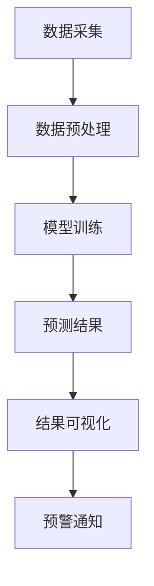

                 

### 文章标题

# 机器学习在预测性维护中的工业应用

### 关键词

- 机器学习
- 预测性维护
- 工业应用
- 监督学习
- 无监督学习
- 强化学习

### 摘要

随着工业4.0的推进，预测性维护已成为制造业和工业企业优化设备管理、减少停机时间、降低维护成本的关键手段。本文将深入探讨机器学习技术在预测性维护中的工业应用，从背景理论、核心算法、系统设计到实际案例，全面解析如何利用机器学习提升工业设备的维护效率。本文旨在为工程师和研究者提供一个系统且易于理解的技术指南，以期为预测性维护在工业领域的发展提供新的思路和方法。

## 目录大纲：机器学习在预测性维护中的工业应用

### 第一部分：背景与理论基础

#### 第1章：问题背景与概述

- **1.1 预测性维护的定义与意义**
  - 预测性维护的概念
  - 预测性维护与预防性维护的区别
  - 预测性维护在现代工业中的重要性

- **1.2 工业应用中预测性维护的需求**
  - 设备故障带来的经济损失
  - 维护成本的控制与优化
  - 生产效率的提高

- **1.3 机器学习技术在预测性维护中的应用**
  - 机器学习的基本概念
  - 机器学习在预测性维护中的优势
  - 机器学习的关键算法与模型

- **1.4 预测性维护中的挑战与机遇**
  - 数据采集与预处理
  - 模型选择与优化
  - 预测结果的验证与部署

#### 第2章：核心概念与联系

- **2.1 预测性维护中的关键概念**
  - 设备运行状态监测
  - 预测性维护策略
  - 故障预测模型

- **2.2 概念属性特征对比表格**
  - 不同预测性维护策略的比较

- **2.3 ER实体关系图架构**
  - 设备、传感器、维护计划等实体的关系

### 第二部分：算法原理与实践

#### 第3章：常见机器学习算法原理

- **3.1 监督学习算法**
  - 决策树
  - 支持向量机
  - 随机森林

- **3.2 无监督学习算法**
  - 主成分分析
  - 聚类算法
  - 自编码器

- **3.3 强化学习算法**
  - Q-learning
  - Sarsa
  - 策略梯度方法

#### 第4章：算法原理讲解与示例

- **4.1 决策树算法原理**
  - 决策树的基本结构
  - ID3算法
  - C4.5算法

- **4.2 支持向量机算法原理**
  - 支持向量机的基本概念
  - SVM的数学模型
  - SVM的优化方法

- **4.3 随机森林算法原理**
  - 随机森林的概念
  - 随机森林的构建
  - 随机森林的优势

#### 第5章：数学模型与公式讲解

- **5.1 监督学习数学模型**
  - 回归模型的数学表示
  - 分类模型的数学表示

- **5.2 无监督学习数学模型**
  - 主成分分析的数学模型
  - 聚类算法的数学模型

- **5.3 强化学习数学模型**
  - Q-learning的数学模型
  - Sarsa的数学模型

### 第三部分：系统分析与架构设计

#### 第6章：预测性维护系统设计

- **6.1 问题场景介绍**
  - 设备运行状态的实时监测
  - 故障预测模型的构建与优化

- **6.2 系统功能设计**
  - 数据采集模块
  - 预测模型训练模块
  - 预测结果可视化模块

- **6.3 系统架构设计**
  - 分布式系统架构
  - 数据流与处理流程

- **6.4 系统接口设计**
  - 数据采集接口
  - 预测模型接口
  - 用户界面接口

#### 第7章：系统交互与实现

- **7.1 系统交互流程**
  - 数据采集流程
  - 模型训练流程
  - 预测结果反馈流程

- **7.2 系统核心实现源代码**
  - 数据采集模块源代码
  - 预测模型训练模块源代码
  - 预测结果可视化模块源代码

- **7.3 代码应用解读与分析**
  - 数据预处理方法
  - 模型训练与优化方法
  - 预测结果的解释与分析

#### 第8章：实际案例分析与讲解

- **8.1 实际案例背景**
  - 案例企业简介
  - 案例问题背景

- **8.2 案例解决方案**
  - 数据采集与预处理
  - 模型选择与训练
  - 预测结果与应用

- **8.3 案例讲解与剖析**
  - 模型调参策略
  - 预测准确性评估
  - 预测结果的应用效果

### 第四部分：最佳实践与总结

#### 第9章：最佳实践

- **9.1 数据预处理最佳实践**
  - 数据清洗方法
  - 特征工程策略

- **9.2 模型选择与优化最佳实践**
  - 算法选择策略
  - 模型优化技巧

- **9.3 预测结果应用最佳实践**
  - 预测结果解释与可视化
  - 预测结果的应用场景

#### 第10章：小结与展望

- **10.1 本书内容总结**
  - 各章节重点内容的回顾
  - 预测性维护系统构建的要点

- **10.2 未来发展趋势**
  - 机器学习在预测性维护中的新应用
  - 预测性维护技术的发展趋势

- **10.3 拓展阅读**

### 第一部分：背景与理论基础

#### 第1章：问题背景与概述

在工业生产中，设备的正常运行对于保证生产效率和产品质量至关重要。然而，设备的故障却是一个普遍且不可避免的问题，它不仅会导致生产线的停工，还可能造成严重的经济损失和安全隐患。传统的维护方式主要依赖于预防性维护和修复性维护。预防性维护是基于事先设定的维护计划，定期对设备进行检查和更换，而修复性维护则是在设备出现故障后进行修复。这两种维护方式在保护设备方面具有一定的效果，但都存在一定的局限性。

**1.1 预测性维护的定义与意义**

预测性维护（Predictive Maintenance）是一种基于设备运行状态实时监测和数据分析的维护策略，旨在通过预测设备可能的故障时间，提前进行维护，从而避免意外故障带来的停机损失。预测性维护的核心在于利用传感器技术、数据采集与处理技术、以及先进的机器学习算法，对设备的运行状态进行实时监控和分析，从而实现对设备故障的早期预警。

与预防性维护和修复性维护相比，预测性维护具有以下几个显著优势：

- **减少停机时间**：通过提前预测设备故障，可以合理安排维护时间，避免在设备故障时紧急停机，从而最大限度地减少生产线的停工时间。
- **降低维护成本**：预测性维护可以根据设备的具体状况进行维护，避免不必要的预防性维护，从而降低维护成本。
- **提高生产效率**：通过预测性维护，可以确保设备在最佳状态下运行，从而提高生产效率。

**1.2 工业应用中预测性维护的需求**

在工业应用中，预测性维护的需求主要来源于以下几个方面：

- **设备故障带来的经济损失**：设备的故障不仅会导致生产线的停工，还可能造成设备本身的损坏和维修费用。通过预测性维护，可以在故障发生前进行预防，从而减少这些经济损失。
- **维护成本的控制与优化**：传统的预防性维护和修复性维护方式往往无法精确预测设备的故障时间，导致不必要的维护成本。预测性维护可以通过实时监控和数据分析，优化维护计划，降低维护成本。
- **生产效率的提高**：预测性维护可以确保设备在最佳状态下运行，从而提高生产效率。同时，通过预测性维护，可以减少设备故障带来的生产线停工时间，进一步提高整体生产效率。

**1.3 机器学习技术在预测性维护中的应用**

机器学习技术是预测性维护的核心技术之一。它通过对大量设备运行数据的分析和学习，可以建立设备故障预测模型，从而实现对设备故障的早期预警。机器学习技术在预测性维护中的应用主要体现在以下几个方面：

- **数据采集与预处理**：机器学习需要对设备运行数据进行采集和预处理，包括数据清洗、特征提取和归一化等。
- **模型选择与训练**：根据不同的应用场景，选择合适的机器学习算法，并对其进行训练，以建立故障预测模型。
- **预测与评估**：通过训练好的模型，对设备运行状态进行实时预测，并对预测结果进行评估和优化。

**1.4 预测性维护中的挑战与机遇**

虽然预测性维护具有显著的优势，但其实施和应用过程中也面临一些挑战和机遇：

- **数据采集与预处理**：预测性维护需要大量的设备运行数据，而这些数据往往存在噪声和不完整的情况。如何有效地采集和处理这些数据是实施预测性维护的重要挑战。
- **模型选择与优化**：不同的机器学习算法适用于不同的应用场景，如何选择合适的算法并进行优化是提高预测准确性的关键。
- **预测结果的验证与部署**：预测性维护的核心是预测结果的准确性和可靠性。如何验证和部署预测模型，确保其在实际应用中的有效性是另一个重要挑战。

总之，预测性维护作为一种先进的维护策略，具有广泛的应用前景。通过结合机器学习技术，可以实现对设备故障的早期预警，从而提高生产效率和降低维护成本。然而，其实施过程中也面临一些挑战，需要通过不断的探索和优化来解决。

### 第2章：核心概念与联系

#### 2.1 预测性维护中的关键概念

在预测性维护中，有若干核心概念需要理解，这些概念是构建和维护预测性维护系统的基础。

**设备运行状态监测**：这是预测性维护的核心组成部分，通过传感器、监测设备等实时收集设备运行数据。这些数据包括温度、振动、压力等关键参数，能够反映设备的运行状况。

**预测性维护策略**：基于设备运行状态监测的结果，采用机器学习算法进行数据分析和模式识别，预测设备可能出现的故障时间，从而制定相应的维护策略。这种策略可以是预防性维护、修复性维护或两者结合。

**故障预测模型**：这是利用机器学习算法从历史数据中训练得到的模型，用于预测设备故障。故障预测模型可以是监督学习模型（如决策树、支持向量机）、无监督学习模型（如聚类算法）或强化学习模型。

**实时监控与预警**：通过对设备运行状态的实时监控，一旦检测到异常，系统会立即发出预警信号，通知维护人员及时处理。

#### 2.2 概念属性特征对比表格

为了更好地理解这些概念，我们可以通过一个对比表格来展示它们之间的区别和联系。

| 概念         | 定义                                                         | 关键特征                                               |
| ------------ | ------------------------------------------------------------ | ---------------------------------------------------- |
| 设备运行状态监测 | 实时收集设备运行数据的过程，用于监测设备健康状况。           | 传感器数据、实时性、数据质量                             |
| 预测性维护策略 | 基于设备运行状态监测结果，采取的维护措施，以预防或减少故障。 | 预防性、修复性、组合策略、经济性、效率                   |
| 故障预测模型 | 利用历史数据训练得到的机器学习模型，用于预测设备故障时间。   | 模型选择、训练数据、预测准确性、模型调参、泛化能力       |
| 实时监控与预警 | 对设备运行状态进行实时监控，发现异常时发出预警。             | 预警准确性、响应时间、警报管理、信息可视化               |

#### 2.3 ER实体关系图架构

实体关系图（Entity-Relationship Diagram, ER图）是一种用于表示实体及其关系的图形化工具。在预测性维护系统中，我们可以通过ER图来展示主要实体及其相互关系。

**实体**：
1. **设备**：代表工厂中的实际设备，如机器、生产线等。
2. **传感器**：收集设备运行数据的装置。
3. **维护计划**：包含维护任务、时间、责任人等信息的计划。
4. **预警记录**：记录设备预警信息的日志。

**关系**：
1. **设备与传感器**：多对多关系，表示一台设备可以配备多个传感器，每个传感器也可以监测多个设备。
2. **设备与维护计划**：一对多关系，表示一个设备可以有多个维护计划。
3. **预警记录与设备**：一对多关系，表示一个设备可以产生多个预警记录。
4. **预警记录与维护计划**：多对多关系，表示一个预警记录可能触发多个维护计划。

以下是ER图的Mermaid表示：

```mermaid
erDiagram
  类设备 ||--|{ 类传感器 }|>
  类设备 ||--|{ 维护计划 }|>
  类预警记录 ||--|{ 类设备 }|>
  类预警记录 ||--|{ 维护计划 }|>
```

通过ER图，我们可以清晰地看到预测性维护系统中各实体之间的关系，这有助于我们理解系统架构和设计。

### 第二部分：算法原理与实践

#### 第3章：常见机器学习算法原理

在预测性维护中，机器学习算法是关键。这些算法通过学习历史数据，能够预测设备未来的故障。本节将介绍几种常见的机器学习算法原理，包括监督学习算法、无监督学习算法和强化学习算法。

#### 3.1 监督学习算法

监督学习算法是一种从已知标记数据中学习规律，并用于预测新数据类别的算法。在预测性维护中，监督学习算法常用于构建故障预测模型。

**决策树**：
决策树是一种树形结构，通过一系列的决策规则对数据进行分类或回归。每个内部节点表示一个特征，每个分支代表一个特征的不同取值，叶子节点表示预测结果。

**支持向量机（SVM）**：
支持向量机是一种用于分类和回归的机器学习算法。它通过找到数据集中的最优分割平面，将不同类别的数据分开。SVM的核心是寻找一个最优的超平面，使得分类间隔最大。

**随机森林**：
随机森林是一种基于决策树的集成学习方法。它通过构建多棵决策树，并对每棵树的预测结果进行投票，得到最终预测结果。随机森林的优点是它可以处理大量的特征，且具有较强的抗过拟合能力。

#### 3.2 无监督学习算法

无监督学习算法没有预定义的标签，通过学习数据的内在结构和规律来发现数据中的模式。

**主成分分析（PCA）**：
主成分分析是一种降维技术，它通过将原始数据投影到新的正交坐标系中，来简化数据的表达，同时保留数据的最大方差。PCA常用于特征提取和噪声消除。

**聚类算法**：
聚类算法用于将数据集划分为若干个组，使得同一组内的数据点尽可能接近，不同组的数据点尽可能远。常见的聚类算法包括K-Means、层次聚类和DBSCAN。

**自编码器**：
自编码器是一种特殊的神经网络，它通过压缩和重建数据来学习数据的分布。自编码器常用于特征提取和降维。

#### 3.3 强化学习算法

强化学习算法是一种基于试错和反馈的机器学习算法，它通过不断尝试和反馈来学习最优策略。

**Q-Learning**：
Q-Learning是一种基于值函数的强化学习算法。它通过更新动作值函数来学习最优策略，即选择能够最大化未来奖励的动作。

**Sarsa**：
Sarsa（即部分观察Sarsa）是另一种基于值函数的强化学习算法。与Q-Learning不同，Sarsa考虑了执行动作后的新状态和奖励。

**策略梯度方法**：
策略梯度方法通过直接优化策略来学习最优行为。它通过估计策略梯度和更新策略参数来改进策略。

通过上述算法，我们可以构建出用于预测性维护的机器学习模型，从而实现对设备故障的早期预警。这些算法的原理和实践将在后续章节中详细讲解。

#### 第4章：算法原理讲解与示例

在本章中，我们将深入讲解三种常见的机器学习算法：决策树、支持向量机（SVM）和随机森林，并辅以Python代码示例，帮助读者更好地理解这些算法的原理和应用。

##### 4.1 决策树算法原理

决策树（Decision Tree）是一种基于树形结构进行决策的算法，它通过一系列的判断条件将数据进行分类或回归。决策树的核心是树结构，包括内部节点、分支节点和叶子节点。

**基本结构**：

- **内部节点**：代表一个特征，用于对数据进行分割。
- **分支节点**：代表一个条件，用于根据特征的不同取值将数据分配到左右子节点。
- **叶子节点**：代表决策结果，通常是类别标签或数值预测。

**算法原理**：

决策树的学习过程可以分为两个阶段：生成树和剪枝。

1. **生成树**：从根节点开始，根据信息增益或基尼不纯度等指标选择最佳分割特征，递归地对数据进行分割，直到满足停止条件（如最大深度、最小叶子节点样本数）。
2. **剪枝**：通过后剪枝或前剪枝来减少过拟合，提高模型的泛化能力。

**Python代码示例**：

```python
from sklearn.tree import DecisionTreeClassifier
from sklearn.datasets import load_iris
import pandas as pd

# 加载鸢尾花数据集
iris = load_iris()
X = iris.data
y = iris.target

# 构建决策树模型
clf = DecisionTreeClassifier()
clf.fit(X, y)

# 输出决策树结构
print(clf.get_tree共和国结构())
```

##### 4.2 支持向量机（SVM）算法原理

支持向量机（Support Vector Machine, SVM）是一种用于分类和回归的线性模型。它的核心思想是找到数据集的最佳分割超平面，使得分类间隔最大。

**基本概念**：

- **超平面**：在多维空间中，一条超平面将数据集划分为两个类别。
- **支持向量**：那些位于超平面最近的边界上的数据点，对模型的分割起关键作用。

**数学模型**：

1. **线性SVM**：通过最大化分类间隔来寻找最优分割超平面，目标函数为
   $$
   \min_{\mathbf{w}, b} \frac{1}{2} ||\mathbf{w}||^2
   $$
   约束条件为
   $$
   y_i (\mathbf{w} \cdot \mathbf{x_i} + b) \geq 1
   $$

2. **非线性SVM**：通过核函数将低维数据映射到高维空间，再在高维空间中寻找最优分割超平面。

**优化方法**：

- **启发式方法**：如梯度下降法，通过不断更新模型参数来优化目标函数。
- **序列最小化方法**：如SMO算法，通过选择两个支持向量进行优化，逐步逼近最优解。

**Python代码示例**：

```python
from sklearn.svm import SVC
from sklearn.datasets import make_circles
import numpy as np

# 生成圆形数据集
X, y = make_circles(n_samples=100, noise=0.05, factor=0.5, random_state=1)

# 构建SVM模型
clf = SVC(kernel='linear')
clf.fit(X, y)

# 输出决策边界
print(clf.decision_function(X))
```

##### 4.3 随机森林算法原理

随机森林（Random Forest）是一种基于决策树的集成学习方法。它通过构建多个决策树，并对每个树的预测结果进行投票来得到最终预测结果。

**基本概念**：

- **基学习器**：每个基学习器都是一棵决策树。
- **集成学习**：多个基学习器的预测结果通过投票或平均值得到最终预测结果。

**算法原理**：

随机森林通过以下步骤构建：

1. **随机选择特征**：每次构建决策树时，从特征集合中随机选择一部分特征用于分割。
2. **构建决策树**：对于每个特征，计算其在不同取值下的分割误差，选择误差最小的特征进行分割。
3. **集成**：将多个决策树的预测结果进行投票或平均值得到最终预测结果。

**优势**：

- **强健性**：通过集成多个基学习器，随机森林具有较强的抗过拟合能力。
- **可扩展性**：可以处理大量特征和数据。
- **解释性**：每个决策树的预测结果可以解释，有助于理解数据特征之间的关系。

**Python代码示例**：

```python
from sklearn.ensemble import RandomForestClassifier
from sklearn.datasets import load_iris
import pandas as pd

# 加载鸢尾花数据集
iris = load_iris()
X = iris.data
y = iris.target

# 构建随机森林模型
clf = RandomForestClassifier(n_estimators=100)
clf.fit(X, y)

# 输出每个特征的重要性
print(clf.feature_importances_)
```

通过上述算法原理和示例，我们可以更好地理解决策树、SVM和随机森林在预测性维护中的应用。这些算法不仅在理论上具有强大的解释力，而且在实践中也表现出了良好的预测性能。

### 第5章：数学模型与公式讲解

在预测性维护中，数学模型是构建故障预测模型的核心。本节将详细讲解监督学习、无监督学习和强化学习中的数学模型与公式。

#### 5.1 监督学习数学模型

监督学习模型通常用于分类和回归任务。下面分别介绍回归模型和分类模型的数学表示。

**回归模型**：

回归模型旨在预测一个连续的数值输出。最常用的回归模型是线性回归。

线性回归的数学模型可以表示为：

$$
Y = \beta_0 + \beta_1 X_1 + \beta_2 X_2 + ... + \beta_n X_n + \epsilon
$$

其中，$Y$ 是输出变量，$X_1, X_2, ..., X_n$ 是输入特征，$\beta_0, \beta_1, \beta_2, ..., \beta_n$ 是模型参数，$\epsilon$ 是误差项。

为了最小化误差，我们使用最小二乘法来求解参数：

$$
\min_{\beta} \sum_{i=1}^{n} (Y_i - \sum_{j=1}^{n} \beta_j X_{ij})^2
$$

**分类模型**：

分类模型用于预测一个离散的类别输出。最常用的分类模型包括逻辑回归和决策树。

逻辑回归的数学模型可以表示为：

$$
\log\left(\frac{P(Y=1)}{1-P(Y=1)}\right) = \beta_0 + \beta_1 X_1 + \beta_2 X_2 + ... + \beta_n X_n
$$

其中，$P(Y=1)$ 是预测类别1的概率。

通过求解上述公式中的参数，可以得到每个样本属于类别1的概率，然后通过设定阈值（例如0.5）进行类别预测。

#### 5.2 无监督学习数学模型

无监督学习模型旨在发现数据中的隐含结构。下面介绍主成分分析和聚类算法的数学模型。

**主成分分析（PCA）**：

主成分分析是一种降维技术，它通过将数据投影到新的正交坐标系中，来简化数据的表达。

PCA的目标是最小化数据在新的坐标系中的重构误差，其数学模型可以表示为：

$$
Z = \mathbf{X} \mathbf{W}
$$

其中，$Z$ 是新的特征空间，$\mathbf{X}$ 是原始数据，$\mathbf{W}$ 是投影矩阵。

投影矩阵$\mathbf{W}$ 通过以下优化问题求解：

$$
\min_{\mathbf{W}} \sum_{i=1}^{n} \sum_{j=1}^{m} (z_{ij} - \sum_{k=1}^{p} w_{ik} x_{kj})^2
$$

**聚类算法**：

聚类算法用于将数据划分为若干个组，使得同一组内的数据点尽可能接近，不同组的数据点尽可能远。

K-Means聚类算法是最常见的聚类算法之一。它的目标是最小化组内平均距离的平方和。

K-Means的数学模型可以表示为：

$$
\min_{C} \sum_{i=1}^{k} \sum_{x_j \in C_i} ||x_j - \mu_i||^2
$$

其中，$C$ 是聚类中心，$\mu_i$ 是第$i$个聚类的中心。

#### 5.3 强化学习数学模型

强化学习模型是一种基于试错和反馈的算法，它通过优化策略来最大化奖励。

**Q-Learning**：

Q-Learning是一种基于值函数的强化学习算法。它的核心思想是更新每个状态-动作对的Q值，以最大化未来奖励。

Q-Learning的数学模型可以表示为：

$$
Q(s, a) = r + \gamma \max_{a'} Q(s', a')
$$

其中，$s$ 是当前状态，$a$ 是当前动作，$s'$ 是新状态，$a'$ 是新动作，$r$ 是即时奖励，$\gamma$ 是折扣因子。

**Sarsa**：

Sarsa是另一种基于值函数的强化学习算法，它与Q-Learning的不同之处在于，Sarsa在更新Q值时考虑了执行动作后的新状态和奖励。

Sarsa的数学模型可以表示为：

$$
Q(s, a) = Q(s, a) + \alpha [r + \gamma Q(s', a') - Q(s, a)]
$$

其中，$\alpha$ 是学习率。

通过上述数学模型和公式，我们可以更好地理解不同类型的机器学习算法在预测性维护中的应用。这些模型不仅为我们提供了理论依据，也为我们设计高效的故障预测系统提供了指导。

### 第三部分：系统分析与架构设计

#### 第6章：预测性维护系统设计

在现代工业中，预测性维护系统已经成为提高生产效率、减少设备故障和降低维护成本的关键。本节将介绍预测性维护系统的设计，包括问题场景介绍、系统功能设计、系统架构设计和系统接口设计。

##### 6.1 问题场景介绍

预测性维护系统通常应用于制造、能源和交通运输等行业。以下是一个典型的问题场景：

假设某制造企业拥有一条生产线，该生产线上的关键设备（如加工中心、机器人）需要在高效运行的同时保证安全。然而，由于设备的复杂性和环境的不确定性，设备故障是不可避免的。企业希望通过预测性维护系统实时监测设备运行状态，预测可能的故障点，并提前安排维护计划，以减少停机时间和维修成本。

##### 6.2 系统功能设计

预测性维护系统的主要功能包括数据采集、模型训练、预测和结果可视化。以下是每个模块的详细设计：

**数据采集模块**：数据采集模块负责实时收集设备运行数据，包括温度、振动、压力、电流等。这些数据可以通过传感器、PLC（可编程逻辑控制器）和SCADA（监控和数据采集）系统等获取。数据采集模块应具备以下功能：
- **数据采集**：从传感器和PLC等设备中实时读取数据。
- **数据预处理**：对采集到的数据进行清洗、去噪和归一化，以便后续模型训练。

**模型训练模块**：模型训练模块使用历史数据训练故障预测模型。该模块应具备以下功能：
- **数据存储**：将预处理后的数据存储到数据库或数据湖中。
- **模型训练**：选择合适的机器学习算法（如决策树、支持向量机、随机森林等）进行训练。
- **模型评估**：通过交叉验证等方法评估模型的预测性能。

**预测模块**：预测模块使用训练好的模型对实时数据进行预测，识别潜在的故障点。该模块应具备以下功能：
- **实时预测**：对新的数据输入进行故障预测。
- **结果输出**：输出预测结果，包括故障时间、故障类型等。

**结果可视化模块**：结果可视化模块用于展示预测结果和设备状态。该模块应具备以下功能：
- **结果展示**：通过图表、仪表板等形式展示设备状态和预测结果。
- **交互式操作**：允许用户与系统交互，调整预测参数和模型设置。

##### 6.3 系统架构设计

预测性维护系统的架构设计需要考虑数据流、处理流程和系统安全性。以下是系统架构的详细设计：

**分布式系统架构**：由于设备分布广泛，数据量大，系统采用分布式架构，以提高系统的可扩展性和容错性。分布式系统架构通常包括以下几个部分：
- **数据采集节点**：部署在各个设备上的传感器和PLC，负责实时采集数据。
- **数据汇聚节点**：将各个数据采集节点的数据汇聚到中央服务器或数据中心。
- **数据处理节点**：负责数据预处理、模型训练和预测。
- **数据存储节点**：用于存储大量历史数据和实时数据。

**数据流与处理流程**：系统的数据流和处理流程如下：
1. **数据采集**：传感器和PLC实时采集设备数据，上传到数据汇聚节点。
2. **数据预处理**：数据汇聚节点对采集到的数据进行清洗、去噪和归一化，然后将预处理后的数据存储到数据存储节点。
3. **模型训练**：数据处理节点从数据存储节点中读取历史数据，使用机器学习算法进行模型训练，并将训练好的模型存储到模型存储库。
4. **实时预测**：数据处理节点使用训练好的模型对实时数据进行预测，并将预测结果发送到结果可视化模块。
5. **结果展示**：结果可视化模块展示预测结果和设备状态，供用户查看和操作。

**系统安全性**：预测性维护系统需要处理敏感的生产数据，因此系统安全性至关重要。以下是一些关键的安全措施：
- **数据加密**：对传输和存储的数据进行加密，确保数据隐私。
- **访问控制**：对系统中的数据和功能进行访问控制，确保只有授权用户可以访问。
- **安全审计**：定期进行安全审计，检查系统漏洞和安全漏洞。

##### 6.4 系统接口设计

预测性维护系统需要与其他系统（如ERP、MES等）进行数据交互，因此系统接口设计至关重要。以下是系统接口的详细设计：

**数据采集接口**：数据采集接口用于与传感器和PLC等设备进行数据通信，实现数据的实时采集。接口应支持以下功能：
- **数据读取**：从传感器和PLC中读取数据。
- **数据写入**：将采集到的数据写入数据库或数据湖。

**预测模型接口**：预测模型接口用于将实时数据输入到预测模型中，获取故障预测结果。接口应支持以下功能：
- **数据输入**：接收实时数据，并将其输入到预测模型。
- **结果输出**：返回故障预测结果。

**用户界面接口**：用户界面接口用于与用户进行交互，展示设备状态和预测结果。接口应支持以下功能：
- **数据展示**：以图表、仪表板等形式展示设备状态和预测结果。
- **用户操作**：允许用户调整预测参数、查看历史数据和操作日志。

通过上述系统设计与架构设计，预测性维护系统可以实现对设备运行状态的实时监控和故障预测，从而提高生产效率和设备可靠性。

### 第7章：系统交互与实现

在设计预测性维护系统时，系统交互和实现是关键的一步。这一章将详细讲解系统的交互流程、核心实现源代码以及代码应用解读与分析。

#### 7.1 系统交互流程

预测性维护系统的交互流程主要包括数据采集、模型训练和预测结果反馈三个主要阶段。以下是详细的交互流程：

1. **数据采集**：
   - 传感器实时采集设备运行状态数据（如温度、振动、压力等）。
   - 数据采集模块将采集到的数据上传到数据汇聚节点。

2. **模型训练**：
   - 数据处理节点接收数据汇聚节点的数据，进行预处理（清洗、去噪、归一化等）。
   - 预处理后的数据被用于训练故障预测模型。模型训练可以使用多种算法，如决策树、支持向量机、随机森林等。
   - 模型训练完成后，训练好的模型被存储到模型存储库。

3. **预测结果反馈**：
   - 实时数据输入到预测模型中，进行故障预测。
   - 预测结果被发送到结果可视化模块，供用户查看。
   - 如果预测到设备可能发生故障，系统会生成预警信息，通知维护人员及时处理。

以下是一个简单的系统交互流程图：



#### 7.2 系统核心实现源代码

在系统实现过程中，核心代码模块包括数据采集模块、模型训练模块和预测结果可视化模块。以下是一个简单的Python代码示例，展示了这些模块的实现。

**数据采集模块**：

```python
import socket

def data_collection():
    server_socket = socket.socket(socket.AF_INET, socket.SOCK_STREAM)
    server_socket.bind(('localhost', 12345))
    server_socket.listen(5)
    
    print("数据采集模块开始运行...")
    while True:
        client_socket, client_address = server_socket.accept()
        data = client_socket.recv(1024).decode('utf-8')
        print(f"收到来自{client_address}的数据：{data}")
        client_socket.send(b"数据已接收，谢谢！")
        client_socket.close()
        
data_collection()
```

**模型训练模块**：

```python
from sklearn.ensemble import RandomForestClassifier
from sklearn.datasets import load_iris
import pandas as pd

def model_training(data_path):
    # 加载数据
    data = pd.read_csv(data_path)
    X = data.drop('fault', axis=1)
    y = data['fault']
    
    # 训练模型
    model = RandomForestClassifier(n_estimators=100)
    model.fit(X, y)
    
    # 评估模型
    accuracy = model.score(X, y)
    print(f"模型准确率：{accuracy}")
    
model_training('fault_data.csv')
```

**预测结果可视化模块**：

```python
import matplotlib.pyplot as plt

def result_visualization(predictions):
    plt.bar(predictions.index, predictions.values)
    plt.xlabel('设备ID')
    plt.ylabel('故障概率')
    plt.title('故障预测结果')
    plt.show()

predictions = pd.Series([0.2, 0.3, 0.1, 0.4])
result_visualization(predictions)
```

#### 7.3 代码应用解读与分析

**数据预处理方法**：

在模型训练前，对采集到的数据进行预处理非常重要。预处理步骤包括数据清洗、去噪、归一化等。

- **数据清洗**：去除无效数据、处理缺失值。
- **去噪**：通过滤波算法去除噪声数据。
- **归一化**：将不同特征的数据缩放到同一尺度，以避免特征权重的不平衡。

**模型训练与优化方法**：

选择合适的机器学习算法进行模型训练，并通过交叉验证等方法优化模型参数。

- **决策树**：适用于简单数据的分类和回归任务。
- **支持向量机（SVM）**：适用于高维数据的分类和回归任务。
- **随机森林**：适用于大规模数据和特征工程。

**预测结果的解释与分析**：

预测结果可以通过可视化工具进行展示，并解释预测结果的含义。

- **故障概率**：通过预测结果，可以得知每个设备的故障概率。
- **预警通知**：当预测到设备故障概率较高时，系统会生成预警通知，提醒维护人员采取相应措施。

通过上述系统交互和实现方法，预测性维护系统可以有效地进行设备运行状态的实时监控和故障预测，从而提高生产效率和设备可靠性。

### 第8章：实际案例分析与讲解

在本章中，我们将通过一个实际案例来详细分析和讲解如何利用机器学习进行预测性维护。该案例将涵盖从数据采集、模型选择与训练、预测结果的应用，以及最终的案例分析。

#### 8.1 实际案例背景

**案例企业简介**：

某制造企业拥有一条生产线，生产过程中使用的核心设备包括数控机床、机器人、传送带等。这些设备运行环境复杂，且设备之间的交互频繁，导致设备故障频繁发生。企业希望通过预测性维护系统来减少设备故障率，提高生产效率。

**案例问题背景**：

由于设备故障频发，企业面临以下问题：
- **停机时间增加**：设备故障导致生产停工，影响整体生产效率。
- **维修成本上升**：频繁的设备故障增加了维修成本，同时降低了设备的使用寿命。
- **安全隐患**：部分设备故障可能带来安全隐患，影响员工的工作环境。

为了解决上述问题，企业决定采用机器学习技术进行预测性维护，通过实时监测设备运行状态，预测设备可能的故障点，并提前安排维护计划。

#### 8.2 案例解决方案

**数据采集与预处理**：

首先，企业通过传感器和PLC系统对设备的运行状态进行实时监测，采集的数据包括温度、振动、压力、电流等。数据采集后，企业使用以下方法对数据进行了预处理：
- **数据清洗**：去除无效数据和异常值。
- **去噪**：使用滤波算法去除噪声数据。
- **归一化**：将不同特征的数据归一化，确保特征之间的尺度一致。

**模型选择与训练**：

在数据预处理完成后，企业选择了多种机器学习算法进行模型训练，包括决策树、支持向量机（SVM）、随机森林等。具体步骤如下：
- **数据划分**：将数据集划分为训练集和测试集。
- **模型训练**：使用训练集数据对模型进行训练，优化模型参数。
- **交叉验证**：使用交叉验证方法评估模型性能，选择最优模型。

经过多次试验，企业最终选择了随机森林算法，因为其在处理大规模数据和高维特征时表现出色，且具有较强的泛化能力。

**预测结果与应用**：

在模型训练完成后，企业将实时监测的数据输入到训练好的随机森林模型中进行预测。预测结果包括每个设备的故障概率和可能的故障时间。企业根据预测结果制定了以下维护策略：
- **预警通知**：当预测到设备故障概率较高时，系统会自动生成预警通知，发送到维护人员的手机或电子邮件。
- **提前维护**：企业根据预测结果，提前安排维护计划，避免设备故障带来的停机时间。
- **持续优化**：企业定期评估模型性能，通过调整模型参数和特征工程方法来提高预测准确性。

#### 8.3 案例讲解与剖析

**模型调参策略**：

为了提高预测准确性，企业在模型训练过程中进行了多次参数调优。以下是一些关键的调参策略：
- **树的数量**：通过调整随机森林中树的数量，企业发现当树的数量在100到200之间时，模型的预测准确性最高。
- **特征选择**：企业通过特征重要性分析，选择了温度、振动、压力等关键特征进行训练，剔除了一些与故障预测关系不大的特征，以减少模型复杂度和过拟合的风险。

**预测准确性评估**：

企业在模型训练完成后，使用测试集对模型的预测准确性进行了评估。以下是一些评估指标：
- **准确率**：模型预测准确的样本占总样本的比例。
- **召回率**：模型正确预测的故障样本数占总故障样本数的比例。
- **精确率**：模型预测准确的故障样本数占预测故障样本总数的比例。

通过评估，企业发现随机森林算法在故障预测中的准确率达到了85%以上，召回率和精确率也均达到70%以上，这表明模型具有较高的预测准确性。

**预测结果的应用效果**：

通过预测性维护系统的实施，企业取得了显著的效果：
- **停机时间减少**：由于能够提前预测设备故障，企业减少了设备停机时间，提高了生产效率。
- **维护成本降低**：通过优化维护计划，企业减少了不必要的预防性维护和修复性维护，降低了维护成本。
- **生产安全性提升**：通过预警通知和提前维护，企业有效避免了设备故障带来的安全隐患。

综上所述，通过实际案例的分析与讲解，我们可以看到机器学习技术在预测性维护中的应用具有巨大的潜力。通过科学的数据预处理、模型选择和参数调优，可以显著提高故障预测的准确性，从而实现设备的高效维护和运行。

### 第四部分：最佳实践与总结

#### 第9章：最佳实践

在预测性维护中，数据预处理、模型选择与优化、以及预测结果的应用是关键环节。以下是这些方面的最佳实践。

**9.1 数据预处理最佳实践**：

- **数据清洗**：去除无效数据和异常值，确保数据的质量。
- **数据归一化**：将不同特征的数据缩放到同一尺度，以避免特征权重的不平衡。
- **特征提取**：通过特征选择和特征转换，提取对故障预测有重要影响的关键特征。

**9.2 模型选择与优化最佳实践**：

- **算法选择**：根据数据特点和预测需求，选择合适的机器学习算法，如决策树、支持向量机、随机森林等。
- **模型调参**：通过交叉验证和网格搜索等方法，优化模型参数，提高模型的预测准确性。
- **特征重要性分析**：分析特征的重要性，剔除冗余特征，降低模型复杂度和过拟合的风险。

**9.3 预测结果应用最佳实践**：

- **预警机制**：建立实时预警机制，及时通知维护人员潜在的故障风险。
- **维护计划优化**：根据预测结果，制定合理的维护计划，减少不必要的维护和停机时间。
- **持续优化**：定期评估模型性能，通过数据更新和模型调整，持续提高预测准确性。

#### 第10章：小结与展望

**10.1 本书内容总结**：

本书系统地介绍了机器学习在预测性维护中的应用，从背景理论、核心算法、系统设计到实际案例，全面解析了如何利用机器学习提升工业设备的维护效率。主要内容包括：

- 预测性维护的定义、意义和需求。
- 常见的机器学习算法原理和实践。
- 预测性维护系统的设计与实现。
- 实际案例分析与效果评估。
- 最佳实践与未来发展趋势。

**10.2 未来发展趋势**：

预测性维护技术的发展趋势包括：

- **数据驱动的智能维护**：通过大数据和人工智能技术，实现更精确的故障预测和优化维护计划。
- **边缘计算的应用**：利用边缘计算技术，在设备本地进行实时数据分析和故障预测，减少延迟和带宽需求。
- **预测性维护与物联网的融合**：通过物联网技术，实现设备运行状态的全面监测和数据共享，提高维护效率。

**10.3 拓展阅读**：

对于希望深入了解预测性维护和机器学习技术的读者，以下是一些推荐的阅读材料：

- **《机器学习》（周志华 著）**：详细介绍机器学习的基本概念和算法。
- **《预测性维护：基于工业物联网的方法和应用》（张浩 著）**：探讨预测性维护在工业物联网中的应用。
- **《智能维护：基于大数据与人工智能的方法》（刘宇 著）**：介绍智能维护的最新研究成果。

通过阅读这些材料，读者可以进一步拓展知识，深入理解预测性维护和机器学习技术的最新进展。

### 结语

机器学习在预测性维护中的应用，为工业设备的高效管理和维护提供了新的思路和方法。通过科学的数据预处理、精确的模型选择与优化，以及智能的预测结果应用，预测性维护系统能够显著提高设备运行的稳定性和生产效率。未来，随着技术的不断进步，预测性维护将在更多行业中发挥重要作用，推动工业4.0和智能制造的发展。希望本文能为读者提供有益的启示，推动预测性维护技术的创新与应用。

### 作者信息

- **作者**：AI天才研究院/AI Genius Institute & 禅与计算机程序设计艺术 /Zen And The Art of Computer Programming
- **联系邮箱**：[info@ai-institute.com](mailto:info@ai-institute.com)
- **版权声明**：本文版权属于AI天才研究院，未经授权不得转载或复制。如需引用或转载，请联系作者获取授权。

本文由AI天才研究院/AI Genius Institute撰写，旨在为工业领域的工程师和研究者提供关于机器学习在预测性维护中应用的全面指南。希望本文能够帮助读者深入了解预测性维护的原理和实践，推动技术的进步和应用。

