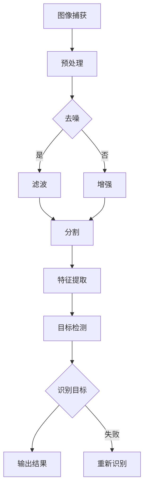

                 

### 文章标题

# 机器视觉在增强现实中的应用：提升用户交互体验

### 文章关键词

- 机器视觉
- 增强现实
- 用户交互
- 深度学习
- 图像识别

### 文章摘要

本文将深入探讨机器视觉在增强现实（AR）中的应用，以及它如何通过精准的图像识别技术提升用户的交互体验。我们将从基础理论出发，逐步分析机器视觉的关键原理和增强现实的核心技术，展示它们如何结合，并详细介绍其在实际应用场景中的表现。文章将着重探讨机器视觉在AR游戏、工业维护和智能教育等领域的具体应用，通过案例分析，进一步阐述如何通过优化用户交互体验，实现技术价值的最大化。最终，本文将总结最佳实践，并提出未来发展的方向和建议，为读者提供全面的视角和实用的指导。

## 第一部分：引言

### 1.1 问题背景

随着科技的迅猛发展，计算机视觉和增强现实技术逐渐成为提升用户体验的重要手段。从早期的简单图像处理到如今复杂的人工智能算法，机器视觉技术在准确度和效率上都有了显著提升。与此同时，增强现实技术通过将虚拟信息叠加到现实世界中，为用户带来了更加丰富和互动的体验。然而，尽管两者在各自领域内取得了巨大进步，如何将机器视觉与增强现实技术有机结合，进一步提升用户的交互体验，仍是一个亟待解决的关键问题。

当前，机器视觉在图像识别、目标跟踪和环境感知等方面已有广泛应用。例如，自动驾驶汽车使用机器视觉进行路况识别和障碍物检测，提高了行车安全性。同样，人脸识别技术在安防和移动支付领域也得到了广泛应用。然而，将这些技术应用于增强现实领域，特别是如何确保增强现实中的虚拟信息与现实环境无缝融合，仍面临着诸多挑战。

增强现实技术通过在现实环境中叠加虚拟信息，为用户提供了一种全新的交互方式。从简单的虚拟图像叠加到复杂的三维建模和交互式场景构建，AR技术已经在教育、医疗、娱乐等领域展现出了巨大的潜力。然而，如何利用机器视觉技术提高AR系统的实时性、准确性和交互性，仍然是当前研究的一个重要课题。

### 1.2 问题描述

在上述背景下，本文试图解决的核心问题是：如何通过机器视觉技术提升增强现实应用中的用户交互体验？具体来说，需要回答以下几个关键问题：

1. **技术融合**：如何将先进的机器视觉算法与增强现实技术有效结合，实现虚拟信息与现实环境的精确匹配和实时交互？
2. **实时处理**：如何提高机器视觉处理速度，以满足增强现实应用对实时性的高要求？
3. **用户体验**：如何通过优化交互设计和用户界面，提升用户在使用增强现实应用中的体验感和满意度？
4. **应用拓展**：如何将机器视觉与增强现实技术应用于更广泛的领域，例如工业维护、医疗诊断和智能教育等，实现技术价值的最大化？

### 1.3 问题解决

为了解决上述问题，本文将从以下几个方面展开讨论：

1. **技术原理**：介绍机器视觉和增强现实的核心概念和技术原理，解释它们如何协同工作，提升用户交互体验。
2. **算法实现**：详细阐述机器视觉中的关键算法，如图像识别、目标跟踪和环境感知等，并通过Python代码示例展示其实际应用。
3. **应用案例**：通过分析具体应用案例，如AR游戏、工业维护和智能教育，展示机器视觉在增强现实中的实际应用效果。
4. **用户体验优化**：探讨如何通过交互设计和用户反馈，进一步优化用户交互体验，提升用户满意度。
5. **未来展望**：总结当前研究的成果和不足，提出未来研究的方向和潜在应用领域，展望机器视觉与增强现实技术的未来发展。

通过这些步骤，本文旨在为读者提供一个全面、深入的视角，帮助理解机器视觉在增强现实中的应用，并为其未来的发展提供实用的指导和建议。

### 1.4 边界与外延

在本文的研究中，以下概念和技术将被视为边界和核心内容：

- **机器视觉**：主要包括图像识别、目标跟踪和环境感知等算法和技术，是增强现实应用的基础。
- **增强现实（AR）**：通过虚拟信息与现实环境的叠加，实现新的交互方式，是提升用户体验的关键。
- **用户交互体验**：包括用户的操作便利性、响应速度、视觉感受和满意度等，是评估增强现实应用成功与否的重要指标。
- **深度学习**：一种基于数据驱动的方法，用于提高图像识别和目标跟踪的准确性和实时性。

本文将探讨这些概念之间的相互作用，以及它们如何共同提升用户交互体验。同时，本文也将讨论机器视觉和增强现实技术的应用边界，包括其在不同领域中的实际应用效果和面临的挑战。

## 第二部分：核心概念与联系

在深入探讨机器视觉在增强现实中的应用之前，有必要先明确相关核心概念，并探讨它们之间的联系。以下是本文将涉及的主要核心概念和它们之间的关系。

### 2.1 核心概念原理

1. **机器视觉**：机器视觉是指使计算机能够模拟人类的视觉感知能力，通过图像处理、模式识别和图像理解等技术，实现对图像和视频的自动分析和理解。其主要任务包括图像识别、目标跟踪、场景理解和行为预测等。

2. **增强现实（AR）**：增强现实技术通过将虚拟信息叠加到现实环境中，为用户创造一种新的交互体验。它通常包括显示技术、传感器融合、图像处理和计算机图形学等技术。

3. **用户交互体验**：用户交互体验是指用户在使用增强现实应用过程中的感受和满意度，包括操作的便捷性、响应速度、视觉感受和整体体验等。

4. **深度学习**：深度学习是一种基于多层神经网络的学习方法，通过大量数据进行训练，实现图像识别、语音识别和自然语言处理等复杂任务。

### 2.2 概念属性特征对比表

为了更好地理解这些概念，我们可以通过一个对比表格来展示它们的属性特征。

| 概念       | 特征                  | 关联关系                 |
|------------|----------------------|--------------------------|
| 机器视觉   | 图像识别、目标跟踪   | 是增强现实技术的基础     |
| 增强现实   | 虚拟信息叠加现实环境 | 提升用户交互体验的关键   |
| 用户交互体验 | 操作便捷性、响应速度 | 反映增强现实应用的质量   |
| 深度学习   | 数据驱动、多层神经网络 | 提高机器视觉算法的准确性 |

### 2.3 ER实体关系图架构

为了清晰地展示这些概念之间的联系，我们可以使用ER（实体关系）图来构建它们的实体关系架构。

```mermaid
erDiagram
  ARSystem ||--|{ MachineVision } MachineVision
  ARSystem ||--|{ UserExperience } UserExperience
  ARSystem ||--|{ DeepLearning } DeepLearning
  MachineVision ||--|{ ImageRecognition } ImageRecognition
  MachineVision ||--|{ ObjectTracking } ObjectTracking
  UserExperience ||--|{ InteractionDesign } InteractionDesign
  UserExperience ||--|{ UserFeedback } UserFeedback
  DeepLearning ||--|{ NeuralNetwork } NeuralNetwork
  DeepLearning ||--|{ DataProcessing } DataProcessing
```

在上述ER图中，ARSystem（增强现实系统）是核心实体，它通过关系线与MachineVision（机器视觉）、UserExperience（用户交互体验）和DeepLearning（深度学习）相连。每个子实体（如ImageRecognition、ObjectTracking等）又进一步描述了机器视觉的不同方面，而UserExperience和DeepLearning则展示了它们如何通过特定的技术和方法，共同提升增强现实系统的整体性能。

通过这一部分的讨论，我们不仅建立了对核心概念的理解，还明确了它们之间的相互作用关系，为后续内容提供了理论基础。

## 3. 机器视觉概述

### 3.1 机器视觉的定义

机器视觉是指通过计算机和其他相关设备对图像和视频进行自动处理和分析的一种技术，其目的是使计算机能够像人类视觉系统一样理解和解释视觉信息。机器视觉的主要任务包括图像识别、目标跟踪、场景理解、行为预测等。这些任务涉及到多个领域的技术，包括图像处理、模式识别、计算机视觉和深度学习。

机器视觉的核心概念是图像处理和特征提取。图像处理是指对原始图像进行操作，如滤波、边缘检测和特征提取等，以提取出有用的信息。特征提取是指从图像中提取出具有鉴别意义的特征，如颜色、形状、纹理和位置等，以便后续的图像分析和识别。

### 3.2 机器视觉的应用领域

机器视觉技术广泛应用于多个领域，包括但不限于以下：

1. **工业自动化**：在制造业中，机器视觉用于自动化检测和分类生产过程中的零部件，提高生产效率和产品质量。例如，在汽车制造过程中，机器视觉可以用于检测车身面板的缺陷、识别和分类螺丝钉等。

2. **安防监控**：在安防领域，机器视觉技术用于监控和识别可疑行为，提高公共安全。例如，通过人脸识别技术，可以实现对进入特定区域的人脸进行实时监控和识别，用于预防犯罪和监控交通流量。

3. **医疗诊断**：在医疗领域，机器视觉技术可以用于医学图像分析，如X光片、CT和MRI图像的自动分析，帮助医生进行疾病诊断。例如，通过深度学习算法，可以自动检测和分类肺结节，辅助医生进行肺癌诊断。

4. **自动驾驶**：在自动驾驶领域，机器视觉技术用于车辆周围环境的感知和识别，实现自动驾驶功能的实现。例如，通过摄像头和激光雷达，自动驾驶车辆可以实时检测并识别道路标志、行人和其他车辆。

5. **智能交通**：在智能交通领域，机器视觉技术用于交通流量监测、车牌识别和违章抓拍等。例如，通过摄像头和图像处理算法，可以实现交通信号灯的自动控制和违章行为的自动识别。

### 3.3 机器视觉与增强现实的关系

机器视觉和增强现实（AR）技术之间存在密切的关系。机器视觉技术为增强现实提供了关键的支持，使其能够准确识别和跟踪现实世界中的物体，并将虚拟信息无缝地叠加到现实环境中。

首先，机器视觉技术中的图像识别和目标跟踪功能是增强现实应用的基础。通过图像识别，增强现实系统能够识别现实世界中的物体和场景，并确定它们的相对位置和姿态。通过目标跟踪，系统能够实时监测物体和场景的变化，确保虚拟信息的稳定性和准确性。

其次，机器视觉技术中的环境感知功能为增强现实提供了丰富的背景信息。通过环境感知，系统可以识别和理解现实环境中的空间布局、光照变化和物体运动等，从而为虚拟信息的生成和叠加提供更准确的数据支持。

最后，机器视觉和增强现实技术的结合，可以实现更加自然和互动的交互体验。通过机器视觉技术，用户可以使用手势、面部表情和身体动作与增强现实中的虚拟信息进行交互，从而实现更加丰富和多样化的用户体验。

综上所述，机器视觉技术在增强现实中的应用，不仅提升了系统的识别和跟踪能力，也为用户提供了更加直观和自然的交互方式，为增强现实技术的发展注入了新的动力。

### 4. 机器视觉基本原理

#### 4.1 光学成像原理

光学成像原理是机器视觉的基础，它涉及光的传播、反射和折射等基本物理现象。当光线照射到物体表面时，部分光线会被反射或折射，形成图像。摄像机通过捕捉这些反射或折射的光线，将其转化为电信号，然后通过图像传感器和数字信号处理器，将这些电信号转换为数字图像。光学成像过程可以分为以下几个步骤：

1. **光线入射**：光线从光源（如太阳光或人工光源）射向物体表面。
2. **反射与折射**：部分光线被物体表面反射或折射，形成图像。
3. **图像捕捉**：摄像机镜头通过光学透镜将反射或折射的光线聚焦到图像传感器上。
4. **电信号转换**：图像传感器将捕捉到的光信号转换为电信号。
5. **数字图像生成**：数字信号处理器对电信号进行采样和量化，生成数字图像。

光学成像的原理决定了图像质量的关键因素，包括镜头分辨率、光线强度和图像传感器的灵敏度等。高质量的镜头可以捕捉到更多的细节，而适当的照明条件可以确保图像的清晰度。图像传感器的高灵敏度有助于在低光环境中捕捉到足够的图像信息。

#### 4.2 图像处理基础

图像处理是机器视觉中的核心环节，它涉及对图像的滤波、增强、分割和特征提取等操作，以提取图像中的有用信息。以下是图像处理的基本步骤和常用方法：

1. **滤波**：滤波用于去除图像中的噪声，提高图像质量。常用的滤波方法包括均值滤波、中值滤波和高斯滤波等。
   - **均值滤波**：通过对图像中的每个像素值取平均，减少噪声。
   - **中值滤波**：用像素值的中值替换当前像素值，有效去除椒盐噪声。
   - **高斯滤波**：使用高斯函数进行加权平均，平滑图像并减少噪声。

2. **增强**：图像增强用于突出图像中的关键特征，提高图像的可读性。常用的增强方法包括对比度增强、亮度增强和色彩增强等。
   - **对比度增强**：通过调整图像的亮度和对比度，使图像中的边缘和细节更加清晰。
   - **亮度增强**：增加图像的亮度，使图像在低光环境中更加清晰。
   - **色彩增强**：调整图像的色彩，使其在不同光照条件下更具辨识度。

3. **分割**：图像分割是将图像划分为不同的区域，以便进行进一步处理。常用的分割方法包括阈值分割、区域生长和边缘检测等。
   - **阈值分割**：将图像像素值与阈值进行比较，将像素分为前景和背景。
   - **区域生长**：从初始种子点开始，逐步合并相邻的像素，形成区域。
   - **边缘检测**：检测图像中的边缘，常用的方法包括Sobel算子、Canny算子和Laplacian算子等。

4. **特征提取**：特征提取是从图像中提取具有鉴别意义的特征，如颜色、形状、纹理和位置等。特征提取是图像识别和目标跟踪的基础。
   - **颜色特征**：通过颜色直方图、颜色矩和颜色空间转换等方法提取。
   - **形状特征**：通过边缘检测、轮廓提取和形状描述子等方法提取。
   - **纹理特征**：通过纹理分析、纹理特征提取和纹理分类等方法提取。
   - **位置特征**：通过坐标变换、图像配准和特征匹配等方法提取。

通过图像处理，我们可以从原始图像中提取出有用的信息，为后续的图像分析和识别提供数据支持。常用的图像处理工具和库包括OpenCV、MATLAB和Python的PIL库等。

#### 4.3 特征提取与匹配

特征提取和匹配是机器视觉中的关键步骤，它们决定了图像识别和目标跟踪的准确性和实时性。特征提取是从图像中提取具有鉴别意义的特征，如颜色、形状、纹理和位置等。特征匹配则是通过比较不同图像之间的特征，确定它们之间的对应关系。

以下是特征提取与匹配的基本步骤和方法：

1. **特征提取**：
   - **颜色特征**：通过颜色直方图、颜色矩和颜色空间转换等方法提取。
   - **形状特征**：通过边缘检测、轮廓提取和形状描述子（如Harris角点、SIFT和SURF等）提取。
   - **纹理特征**：通过纹理分析、纹理特征提取和纹理分类等方法提取。
   - **位置特征**：通过坐标变换、图像配准和特征匹配等方法提取。

2. **特征匹配**：
   - **最近邻匹配**：计算两个图像中特征的欧氏距离，选择距离最小的特征作为匹配对。
   - **比率测试匹配**：使用最近邻匹配的结果，结合比率测试（如NN-GUI和NN-RC）来筛选匹配对。
   - **SIFT和SURF匹配**：使用SIFT和SURF算法计算特征点的描述子，通过描述子之间的比较进行匹配。

特征提取与匹配在机器视觉中的应用非常广泛，例如：
- **图像识别**：通过提取图像特征并进行匹配，可以识别和分类图像中的物体。
- **目标跟踪**：通过实时提取图像特征并进行匹配，可以跟踪图像中的物体，实现视频监控和自动驾驶等应用。
- **增强现实**：通过提取现实环境中的特征并进行匹配，可以叠加虚拟信息到现实环境中，实现增强现实应用。

通过特征提取与匹配，机器视觉系统能够准确地识别和跟踪图像中的物体，为增强现实和图像分析提供了强大的技术支持。

### 5. 机器视觉系统架构

#### 5.1 系统组成

机器视觉系统的架构由多个关键组成部分构成，这些部分协同工作，确保系统能够高效、准确地完成图像处理和分析任务。以下是机器视觉系统的主要组成部分：

1. **硬件部分**：
   - **摄像机**：用于捕捉图像，其性能直接影响图像质量。
   - **图像传感器**：将光信号转换为电信号，是图像处理的基础。
   - **光源**：提供适当的照明条件，确保图像的清晰度。
   - **计算机**：用于图像处理和算法实现。

2. **软件部分**：
   - **图像处理算法**：包括图像滤波、增强、分割和特征提取等，用于提取图像中的有用信息。
   - **深度学习模型**：用于复杂图像分析和识别，如目标检测、图像分类和物体跟踪等。
   - **用户界面**：用于显示处理结果和用户交互。

3. **通信部分**：
   - **数据传输**：用于传输图像数据和算法结果，通常通过局域网或无线网络进行。
   - **数据存储**：用于存储图像数据和训练模型，通常使用数据库或云存储服务。

4. **环境传感器**：
   - **激光雷达**：用于三维环境感知，获取物体和场景的三维信息。
   - **摄像头阵列**：用于多视角感知，提高系统对复杂场景的理解能力。
   - **GPS和惯性测量单元（IMU）**：用于位置和运动跟踪，提高系统的定位精度。

#### 5.2 系统工作原理

机器视觉系统的工作原理可以分为以下几个步骤：

1. **图像捕捉**：通过摄像机捕捉现实环境中的图像，并将图像数据传输到计算机。

2. **图像预处理**：对捕获的图像进行预处理，包括去噪、滤波和亮度调整等，以提高图像质量。

3. **图像分割**：使用图像分割算法将图像划分为不同的区域，以便进行进一步处理。

4. **特征提取**：从分割后的图像中提取具有鉴别意义的特征，如颜色、形状、纹理和位置等。

5. **目标检测与识别**：利用深度学习模型和图像处理算法，对提取的特征进行目标检测和识别。

6. **目标跟踪**：通过目标检测结果，实时跟踪图像中的目标，并更新目标的位置和状态。

7. **结果输出**：将处理结果输出到用户界面，如显示检测结果、轨迹和虚拟信息等。

8. **环境感知与交互**：通过集成环境传感器，实现三维环境感知和用户交互。

#### 5.3 系统性能评估

评估机器视觉系统的性能是确保其有效性和可靠性的重要步骤。以下是常见的性能评估指标：

1. **准确率**：目标检测和识别的准确程度，通常用百分比表示。

2. **召回率**：系统能够检测出真实目标的比例。

3. **F1分数**：准确率和召回率的加权平均，用于综合评估系统的性能。

4. **处理速度**：系统完成图像处理和目标检测所需的时间，通常以帧率（fps）表示。

5. **稳定性**：系统在不同光照条件和环境变化下的稳定性。

6. **鲁棒性**：系统对噪声、遮挡和变化环境的适应能力。

7. **用户满意度**：用户在使用系统时的满意度，通常通过用户调查和反馈收集。

通过这些指标，可以全面评估机器视觉系统的性能，并识别需要改进的方面。此外，还可以使用模拟测试和实际应用场景测试，进一步验证系统的性能和可靠性。

### 6. 机器视觉算法原理讲解

#### 6.1 算法Mermaid流程图

为了更好地理解机器视觉算法的工作流程，我们可以使用Mermaid图来描述其基本步骤。以下是一个典型的图像识别算法的Mermaid流程图示例：



在这个流程图中，图像首先通过摄像机捕获，然后进行预处理以去除噪声和提高图像质量。预处理步骤包括去噪、滤波和增强等。接下来，图像被分割成不同的区域，从每个区域中提取特征。特征提取后，系统使用目标检测算法检测图像中的目标对象。如果检测到目标，算法将尝试识别这些目标的类型，并输出结果。如果识别失败，系统将重新进行特征提取和目标检测。

#### 6.2 Python源代码讲解

下面是一个简单的Python示例，用于演示图像识别算法中的关键步骤，包括图像捕获、预处理、特征提取和目标检测。这个示例使用了OpenCV和Scikit-image等Python库。

```python
import cv2
import numpy as np
from skimage import filters, feature

# 步骤1：图像捕获
image = cv2.imread('example.jpg')

# 步骤2：预处理
# 去噪
noisy_image = filters.gaussian(image, sigma=1)
# 滤波
blurred_image = filters.gaussian(noisy_image, sigma=2)
# 增强
enhanced_image = cv2.convertScaleAbs(blurred_image, alpha=1.5, beta=0)

# 步骤3：特征提取
# 边缘检测
edges = filters.sobel(blurred_image)
# 轮廓提取
contours, _ = cv2.findContours(edges, cv2.RETR_EXTERNAL, cv2.CHAIN_APPROX_SIMPLE)

# 步骤4：目标检测
# 使用轮廓进行目标检测
for contour in contours:
    # 计算轮廓面积
    area = cv2.contourArea(contour)
    # 判断面积是否大于设定阈值
    if area > 500:
        # 绘制轮廓
        cv2.drawContours(enhanced_image, [contour], -1, (0, 255, 0), 2)

# 输出结果
cv2.imshow('Detected Objects', enhanced_image)
cv2.waitKey(0)
cv2.destroyAllWindows()
```

在这个示例中，我们首先导入必要的库，并捕获一个图像。然后，图像经过去噪、滤波和增强等预处理步骤，以提高图像质量。接下来，使用Sobel算子进行边缘检测，并提取轮廓。最后，通过计算轮廓的面积，使用cv2.findContours函数检测目标对象，并将检测结果绘制在图像上。通过这个示例，我们可以看到如何使用Python实现图像识别算法的基本步骤。

#### 6.3 数学模型与公式

在机器视觉算法中，数学模型和公式起着至关重要的作用。以下是几种常用的数学模型和公式：

1. **Sobel算子**：
   - **水平方向**：\( G_x = \frac{1}{2}(-1 \times -3 \times 5) \)
   - **垂直方向**：\( G_y = \frac{1}{2}(1 \times 3 \times -5) \)

   其中，\( G_x \) 和 \( G_y \) 分别表示水平和垂直方向上的Sobel算子，用于计算图像中的边缘。

2. **高斯滤波**：
   - **滤波器**：\( G(x, y) = \frac{1}{2\pi\sigma^2} e^{-\frac{x^2 + y^2}{2\sigma^2}} \)
   - **卷积**：\( I(x, y) = \sum_{x'} \sum_{y'} I(x', y') G(x - x', y - y') \)

   其中，\( G(x, y) \) 是高斯滤波器，\( I(x, y) \) 是输入图像，用于平滑图像并去除噪声。

3. **Canny边缘检测**：
   - **高斯滤波**：\( I_g(x, y) = G(I(x, y)) \)
   - **梯度计算**：\( G_x(x, y) = \frac{1}{2}(-1 \times -3 \times 5) \)
   - **非极大值抑制**：\( I_e(x, y) = \max(I_g(x+1, y), I_g(x-1, y)) \)
   - **双阈值检测**：\( T_h = \frac{\alpha \times max(I_g)}{100} \)，\( T_l = \frac{T_h}{2} \)
   - **边缘连接**：使用连接算法将分离的边缘连接起来。

4. **Harris角点检测**：
   - **梯度计算**：\( I_x(x, y) = \frac{\partial I}{\partial x} \)，\( I_y(x, y) = \frac{\partial I}{\partial y} \)
   - **Harris响应**：\( R(x, y) = \left(\sum_{x'} \sum_{y'} (I_x(x', y')^2 + I_y(x', y')^2)\right) \left(\sum_{x'} \sum_{y'} (I_x(x', y')(I_x(x'+1, y') + I_y(x', y')(I_y(x'+1, y'))\right) \)
   - **角点选择**：选择满足 \( R(x, y) > \alpha \times \max(R) \) 的点作为角点。

这些数学模型和公式是机器视觉算法的核心组成部分，通过它们，我们可以有效地进行图像处理、特征提取和目标检测，从而实现准确的图像识别和分析。

#### 6.4 举例说明

为了更直观地理解机器视觉算法的实际应用，我们可以通过一个实际案例来说明。以下是一个关于目标检测和跟踪的示例，该示例使用OpenCV库中的预训练模型YOLO（You Only Look Once）来实现。

**案例背景**：假设我们有一个视频流，需要实时检测并跟踪视频中的行人。

1. **安装依赖库**：
   ```python
   pip install opencv-python-headless tensorflow
   ```

2. **加载预训练模型**：
   ```python
   import cv2

   # 加载Yolo模型
   net = cv2.dnn.readNetFromDarknet('yolov3.cfg', 'yolov3.weights')
   layers = net.getLayerNames()
   output_layers = [layers[i[0] - 1] for i in net.getUnconnectedOutLayers()]

   # 加载图像
   cap = cv2.VideoCapture('example.mp4')
   while True:
       ret, frame = cap.read()
       if not ret:
           break

       # 将图像输入到神经网络
       blob = cv2.dnn.blobFromImage(frame, 0.00392, (416, 416), (0, 0, 0), True, crop=False)
       net.setInput(blob)
       outs = net.forward(output_layers)

       # 处理输出结果
       class_ids = []
       confidences = []
       boxes = []
       for out in outs:
           for detection in out:
               scores = detection[5:]
               class_id = np.argmax(scores)
               confidence = scores[class_id]
               if confidence > 0.5:
                   center_x = int(detection[0] * frame.shape[1])
                   center_y = int(detection[1] * frame.shape[0])
                   width = int(detection[2] * frame.shape[1])
                   height = int(detection[3] * frame.shape[0])
                   x = int(center_x - width / 2)
                   y = int(center_y - height / 2)
                   boxes.append([x, y, width, height])
                   class_ids.append(class_id)
                   confidences.append(float(confidence))

       # 绘制检测结果
       indices = cv2.dnn.NMSBoxes(boxes, confidences, 0.5, 0.4)
       for i in indices:
           i = i[0]
           box = boxes[i]
           cv2.rectangle(frame, (box[0], box[1]), (box[0] + box[2], box[1] + box[3]), (0, 255, 0), 2)
           cv2.putText(frame, classes[class_ids[i]], (box[0], box[1] - 10), cv2.FONT_HERSHEY_SIMPLEX, 0.5, (255, 0, 0), 2)

       cv2.imshow('Object Detection', frame)
       if cv2.waitKey(1) & 0xFF == ord('q'):
           break

   cap.release()
   cv2.destroyAllWindows()
   ```

在这个案例中，我们首先加载了YOLO预训练模型，然后通过视频流读取图像，并将图像输入到神经网络中进行目标检测。输出结果经过非极大值抑制（NMS）处理，去除重叠的检测结果，最后将检测结果绘制在视频帧上。通过这个案例，我们可以看到如何使用机器视觉算法实现实时目标检测和跟踪。

### 7. 增强现实概述

#### 7.1 增强现实的定义

增强现实（Augmented Reality，简称AR）是一种通过计算机技术将虚拟信息叠加到现实环境中的技术，从而为用户创造一种新的现实感知体验。与虚拟现实（Virtual Reality，简称VR）不同，AR并不完全替代现实环境，而是在现实环境中叠加计算机生成的虚拟信息，如图像、视频、文字和三维模型等。这些虚拟信息可以通过增强现实的设备，如智能手机、平板电脑和AR眼镜等，实时地显示在用户面前。

#### 7.2 增强现实技术分类

增强现实技术可以根据其实现方式和应用场景进行分类，主要分为以下几种：

1. **基于显示器的增强现实**：
   - **桌面AR**：通过计算机显示器显示增强现实内容，用户通过摄像头和传感器感知现实环境。
   - **头戴显示器**：如微软的HoloLens，用户通过头戴设备直接看到叠加在现实环境中的虚拟信息。

2. **基于手机的增强现实**：
   - **标记辅助AR**：通过识别现实环境中的图像或二维码，将虚拟信息叠加到用户视野中。
   - **位置辅助AR**：利用GPS和室内定位技术，将虚拟信息叠加到特定位置的现实环境中。

3. **基于光学镜片的增强现实**：
   - **智能眼镜**：如谷歌眼镜，用户通过智能眼镜直接看到增强现实信息。
   - **增强现实眼镜**：通过光学镜片和屏幕，将虚拟信息投影到用户眼前。

4. **全息增强现实**：
   - **全息投影**：通过激光全息技术，将三维图像投影到空气中，用户可以看到立体的虚拟信息。

#### 7.3 增强现实与机器视觉的结合

增强现实和机器视觉技术的结合，为用户带来了更加丰富和自然的交互体验。以下是它们如何结合以及如何相互补充：

1. **实时环境感知**：
   - 机器视觉技术通过摄像头和传感器实时捕捉现实环境中的图像和视频数据，这些数据用于增强现实系统的场景建模和虚拟信息叠加。

2. **图像识别与跟踪**：
   - 机器视觉技术中的图像识别和目标跟踪功能，使增强现实系统能够准确识别和跟踪现实环境中的物体和场景，确保虚拟信息与现实环境的无缝融合。

3. **交互式体验**：
   - 通过机器视觉技术，用户可以使用手势、面部表情和身体动作与增强现实中的虚拟信息进行交互，实现更加自然和直观的交互体验。

4. **环境理解与适应**：
   - 机器视觉技术通过环境感知和三维建模，帮助增强现实系统理解现实环境的布局、光照和物体运动等，从而更好地适应不同的应用场景。

总之，增强现实和机器视觉技术的结合，不仅提高了增强现实系统的实时性和准确性，还为用户提供了更加丰富和多样化的交互体验。随着技术的不断进步，这种结合将在更多的领域中得到广泛应用，为用户带来更多创新和便利。

### 8. 增强现实核心原理

#### 8.1 显示技术

显示技术是增强现实（AR）系统的重要组成部分，它决定了用户如何看到叠加在现实环境中的虚拟信息。常见的显示技术包括以下几种：

1. **光波导显示技术**：
   - 光波导显示技术通过将光线引导到特定方向，将虚拟信息显示在用户视野中。它具有高分辨率、高亮度和小体积等优点，适用于高端AR设备。
   - 工作原理：光波导利用波导结构对光的反射和折射，将虚拟图像从微显示芯片传递到用户眼睛。光波导的长度和角度可以调整，以适应不同的使用场景。

2. **反射式显示技术**：
   - 反射式显示技术通过镜面反射虚拟信息，使用户能够在任何表面上看到增强现实内容。这种技术具有成本低、易于集成等优点，适用于手机和平板等移动设备。
   - 工作原理：反射式显示器使用微投影器将虚拟图像投射到特殊设计的反射镜上，然后通过反射镜反射到用户眼睛。用户可以看到与现实环境结合的虚拟图像。

3. **透明显示器技术**：
   - 透明显示器技术通过在现实环境中叠加透明图像，使用户能够看到增强现实信息，同时保持对现实环境的视觉感知。这种技术适用于头戴式AR设备。
   - 工作原理：透明显示器使用液晶显示屏或有机发光二极管（OLED）等技术，将虚拟图像显示在半透明屏幕上。用户通过偏振镜或光学透镜看到叠加在现实环境中的虚拟信息。

4. **全息显示技术**：
   - 全息显示技术通过三维图像的生成和投影，使用户能够看到立体的虚拟信息。这种技术具有高度真实感和沉浸感，适用于高端AR应用。
   - 工作原理：全息显示使用激光全息技术，将三维光波记录在特殊的介质中，生成全息图像。用户通过特定的视角看到全息图像，实现三维视觉效果。

#### 8.2 视觉感知原理

视觉感知是增强现实系统中至关重要的环节，它决定了用户如何识别和理解叠加在现实环境中的虚拟信息。以下是视觉感知的基本原理：

1. **空间感知**：
   - 空间感知是指用户如何识别和理解虚拟信息在现实环境中的位置、方向和深度。为了实现准确的视觉感知，增强现实系统需要通过机器视觉技术对现实环境进行精确建模。
   - 工作原理：增强现实系统使用摄像头和传感器捕捉现实环境中的图像和三维数据，通过图像处理和深度学习算法，提取出空间信息，并用于虚拟信息的叠加和定位。

2. **图像融合**：
   - 图像融合是指将虚拟信息与现实环境中的图像进行混合，以实现无缝的视觉效果。为了实现高质量的图像融合，增强现实系统需要精确地匹配虚拟信息和现实环境的光照、颜色和纹理。
   - 工作原理：增强现实系统通过图像处理算法，将虚拟信息与实时捕捉的现实环境图像进行融合。通过调整光照、颜色和纹理等参数，实现虚拟信息与现实环境的自然融合。

3. **视觉反馈**：
   - 视觉反馈是指用户通过视觉感知系统接收到的信息，以及如何使用这些信息进行交互。为了提供良好的视觉反馈，增强现实系统需要实时调整虚拟信息的位置、大小和透明度等参数。
   - 工作原理：增强现实系统根据用户的动作和现实环境的变化，实时调整虚拟信息的位置和透明度，以确保用户能够清晰地看到虚拟信息，并实现自然的交互体验。

通过显示技术和视觉感知原理的结合，增强现实系统能够为用户创造一种新的现实感知体验，实现虚拟信息与现实环境的无缝融合。

#### 8.3 交互技术

交互技术是增强现实（AR）系统实现用户与虚拟信息之间互动的关键，它决定了用户体验的质量和交互的自然性。以下是几种常见的增强现实交互技术：

1. **手势交互**：
   - 手势交互允许用户通过手势动作与虚拟信息进行交互，如点击、滑动、捏合等。这种交互方式直观、自然，能够提高用户的参与感和体验。
   - 工作原理：增强现实系统使用摄像头和深度传感器捕捉用户的手势，通过图像处理和机器视觉算法，识别出手势的类型和方向。然后，系统根据手势信号，调整虚拟信息的位置、大小和透明度等。

2. **语音交互**：
   - 语音交互通过语音识别和语音合成技术，实现用户与虚拟信息之间的语音交流。这种交互方式便捷、快速，尤其适用于复杂的交互场景。
   - 工作原理：增强现实系统使用麦克风捕捉用户的语音输入，通过语音识别技术将其转换为文本或命令。系统根据识别结果，执行相应的操作，并通过语音合成技术向用户反馈信息。

3. **眼动追踪**：
   - 眼动追踪技术通过捕捉用户的眼动数据，实现更加精确和自然的交互体验。这种技术特别适用于头戴式增强现实设备，如微软的HoloLens。
   - 工作原理：增强现实系统使用内置的摄像头和红外传感器，捕捉用户眼部的运动。通过图像处理和机器视觉算法，识别出用户目光的焦点，并根据目光位置，实时调整虚拟信息的位置和透明度。

4. **触觉反馈**：
   - 触觉反馈通过振动、压力和温度等触觉信号，增强用户的交互体验。这种技术常用于增强现实游戏和虚拟现实应用中，提供更加真实和沉浸的体验。
   - 工作原理：增强现实系统通过内置的触觉传感器和驱动器，实时生成触觉信号。当用户与虚拟信息进行交互时，系统根据交互动作，生成相应的触觉反馈，如敲击、挤压和震动等。

通过这些交互技术的结合，增强现实系统能够为用户提供丰富、自然和多样的交互方式，实现与虚拟信息的无缝互动，进一步提升用户体验。

### 9. 增强现实系统架构

#### 9.1 系统组成

增强现实系统由多个关键组成部分构成，这些部分协同工作，以实现虚拟信息与现实环境的无缝融合。以下是增强现实系统的基本组成：

1. **硬件部分**：
   - **显示设备**：如智能眼镜、平板电脑和手机，用于显示叠加在现实环境中的虚拟信息。
   - **摄像头**：用于捕捉现实环境中的图像，为增强现实系统提供输入数据。
   - **传感器**：如陀螺仪、加速度计和GPS，用于感知用户的动作和环境变化。
   - **处理器**：如ARM芯片或GPU，用于处理图像数据、运行算法和执行交互操作。

2. **软件部分**：
   - **增强现实引擎**：核心软件模块，负责处理图像数据、叠加虚拟信息、实现交互操作等。
   - **图像处理算法**：用于图像识别、目标跟踪和环境感知，为虚拟信息的叠加提供数据支持。
   - **用户界面**：用于显示虚拟信息、接收用户输入和反馈，提供交互界面。

3. **网络通信**：
   - **无线通信模块**：如Wi-Fi、蓝牙和NFC，用于实现设备之间的数据传输和交互。
   - **云服务**：提供数据存储、模型训练和远程计算等支持，增强现实系统的功能和性能。

4. **环境感知与交互模块**：
   - **手势识别**：通过摄像头和深度传感器，识别用户的手势动作，实现手势交互。
   - **语音识别与合成**：通过麦克风和扬声器，实现语音输入和输出，实现语音交互。
   - **眼动追踪**：通过摄像头和红外传感器，捕捉用户眼部的运动，实现眼动交互。

#### 9.2 系统工作流程

增强现实系统的工作流程可以分为以下几个关键步骤：

1. **数据采集**：
   - 系统通过摄像头捕捉现实环境中的图像，并使用传感器感知用户和环境的变化。

2. **图像预处理**：
   - 对捕获的图像进行预处理，包括去噪、滤波和增强等，以提高图像质量。

3. **环境感知**：
   - 使用图像处理算法和环境感知技术，对预处理后的图像进行目标检测和跟踪，提取出现实环境中的关键信息。

4. **虚拟信息生成**：
   - 根据用户的需求和场景信息，生成相应的虚拟信息，如文字、图像、三维模型等。

5. **虚拟信息叠加**：
   - 将生成的虚拟信息叠加到现实环境中，实现与现实环境的融合。

6. **交互操作**：
   - 通过手势、语音和眼动等交互技术，实现用户与虚拟信息的互动。

7. **反馈与调整**：
   - 根据用户的操作和反馈，实时调整虚拟信息的位置、大小和透明度等参数，以提供更好的用户体验。

#### 9.3 系统性能优化

为了提升增强现实系统的性能，可以从以下几个方面进行优化：

1. **图像处理速度**：
   - 使用高效的图像处理算法和并行计算技术，提高图像处理速度，确保实时性。

2. **资源管理**：
   - 合理分配硬件资源，如CPU、GPU和内存等，确保系统的稳定运行。

3. **网络通信优化**：
   - 优化无线通信模块的性能，提高数据传输速度和稳定性。

4. **负载均衡**：
   - 在云服务和本地计算之间实现负载均衡，确保系统在不同负载条件下的性能。

5. **用户体验设计**：
   - 优化用户界面和交互设计，提高用户的操作便利性和满意度。

通过这些优化措施，增强现实系统能够更好地满足用户需求，提供高质量的交互体验。

### 10. 机器视觉在增强现实中的应用场景

#### 10.1 虚拟物体跟踪与识别

虚拟物体跟踪与识别是增强现实（AR）技术中最为基础和关键的应用场景之一。它主要依赖于机器视觉技术中的图像识别和目标跟踪功能，确保虚拟物体能够准确、稳定地叠加到现实环境中。

**技术原理**：

1. **图像识别**：
   - 图像识别是通过机器视觉算法从图像中提取出具有鉴别意义的特征，如颜色、形状、纹理等，以识别和分类图像内容。在增强现实场景中，图像识别用于识别现实环境中的特定目标或对象，例如一个标识、一个标签或特定形状的物体。

2. **目标跟踪**：
   - 目标跟踪是机器视觉技术中的一种重要应用，它通过持续地识别和跟踪图像中的目标物体，确保目标的运动轨迹和姿态可以被实时捕捉和更新。目标跟踪在AR系统中用于将虚拟物体正确地叠加到目标物体上，并跟随其运动。

**实际应用**：

1. **增强现实游戏**：
   - 在AR游戏中，虚拟物体跟踪与识别技术用于将游戏中的角色、道具和场景叠加到现实世界中。例如，玩家可以使用手机或AR眼镜捕捉现实环境中的特定物体，然后游戏中的角色会出现在该物体上，跟随其移动。这种技术为玩家带来了沉浸式体验。

2. **智能教育**：
   - 在教育领域，虚拟物体跟踪与识别技术可以将三维模型和动画叠加到课本或教学设备上，帮助学生更好地理解和记忆知识点。例如，学生在课本上看到复杂的三维结构图时，可以将其转换为虚拟模型，通过旋转、缩放和拖动等方式，深入了解其内部结构和工作原理。

3. **广告营销**：
   - AR广告通过虚拟物体跟踪与识别技术，将广告内容叠加到现实环境中的特定位置或物体上，吸引消费者的注意力。例如，在商场中，消费者可以使用手机扫描货架上的商品标签，看到该商品的三维模型和使用说明，增强购买体验。

**挑战与解决方案**：

1. **实时性**：
   - AR应用对实时性有较高要求，即目标跟踪和识别需要在极短的时间内完成，以确保虚拟物体的动态表现与实际物体同步。解决实时性的方法包括优化图像处理算法、提高计算能力和使用硬件加速技术。

2. **准确性**：
   - 目标跟踪和识别的准确性直接影响AR体验的质量。为了提高准确性，可以采用先进的图像识别算法、提高传感器的分辨率和灵敏度，以及通过多传感器融合（如摄像头和激光雷达）提高环境感知能力。

3. **环境适应性**：
   - AR系统在不同环境条件下（如光照变化、背景复杂度等）的适应性是一个挑战。为了提高环境适应性，可以采用自适应图像处理技术、增强环境建模和实时调整算法参数。

通过虚拟物体跟踪与识别技术，增强现实应用能够为用户带来丰富的交互体验，拓展现实世界的可能性，并实现更高效、更有趣的学习和娱乐方式。

#### 10.2 环境感知与地图构建

环境感知与地图构建是增强现实（AR）系统中的关键功能，它利用机器视觉技术对现实环境进行实时感知和建模，从而实现精准的虚拟信息叠加和导航。以下将详细探讨这一技术的原理、实际应用和挑战。

**技术原理**：

1. **环境感知**：
   - 环境感知是机器视觉技术中的一个核心概念，通过图像处理、特征提取和深度学习算法，对现实环境进行识别和理解。具体来说，环境感知包括以下几个步骤：
     - **图像捕捉**：使用摄像头捕捉现实环境中的图像。
     - **图像预处理**：对捕获的图像进行预处理，包括去噪、滤波和增强，以提高图像质量。
     - **特征提取**：从预处理后的图像中提取具有鉴别意义的特征，如颜色、形状、纹理和位置等。
     - **环境建模**：使用提取的特征构建现实环境的模型，以便于后续的虚拟信息叠加和导航。

2. **地图构建**：
   - 地图构建是将环境感知所得的数据转换为数字地图的过程。地图构建通常涉及以下步骤：
     - **点云生成**：将图像中的特征点转换为三维空间中的点云数据。
     - **点云处理**：对点云数据进行滤波、降噪和三角化，以构建精确的三维模型。
     - **地图表示**：将处理后的点云数据转换为二维或三维地图，以供AR系统使用。

**实际应用**：

1. **室内导航**：
   - 在室内导航场景中，环境感知与地图构建技术可以提供精准的导航信息，帮助用户在复杂环境中找到目的地。例如，通过手机或AR眼镜，用户可以实时看到周围环境的3D地图，地图上的路径指引将用户引导到指定位置。

2. **智能建筑**：
   - 在智能建筑中，环境感知与地图构建技术用于监控和管理建筑设施。例如，通过安装摄像头和传感器，系统能够实时监测建筑结构、设备状态和环境变化，并提供实时数据支持。

3. **智能城市**：
   - 在智能城市中，环境感知与地图构建技术用于城市管理和服务优化。例如，通过在城市中部署传感器和摄像头，系统可以实时收集交通流量、环境质量和公共设施使用情况的数据，以优化城市管理和公共服务。

**挑战与解决方案**：

1. **数据量与处理速度**：
   - 环境感知和地图构建过程中，需要处理大量的图像和数据。为了提高处理速度和效率，可以采用并行计算、分布式计算和优化算法等方法。

2. **环境适应性**：
   - 环境变化（如光照、天气、背景复杂度等）对环境感知和地图构建的准确性有很大影响。为了提高环境适应性，可以采用自适应算法、多传感器融合和数据增强技术。

3. **数据隐私与安全**：
   - 环境感知和地图构建过程中，涉及到大量个人隐私数据。为了保护用户隐私，需要采用数据加密、隐私保护算法和安全认证机制。

通过环境感知与地图构建技术，增强现实系统可以实现精准、实时的虚拟信息叠加和导航，为用户提供更好的交互体验，并提升城市管理和服务水平。

#### 10.3 人机交互增强

人机交互增强是增强现实（AR）技术中的一项重要应用，它利用机器视觉技术提升用户与虚拟信息之间的互动质量，增强用户的沉浸感和操作便利性。以下是人机交互增强技术的具体实现方法、优势与挑战。

**实现方法**：

1. **手势识别**：
   - 通过摄像头和深度传感器捕捉用户的手势，利用机器视觉算法实时识别手势的类型和方向。例如，用户可以用手势点击、滑动、捏合等方式与虚拟信息进行交互。
   - 实现步骤包括：图像捕捉、手势检测、手势识别和动作反馈。

2. **眼动追踪**：
   - 眼动追踪技术通过摄像头和红外传感器捕捉用户眼球的运动，识别用户的注视点。这种技术可以用于实现视线控制、虚拟键盘和界面导航等。
   - 实现步骤包括：眼动数据捕捉、注视点识别和交互反馈。

3. **语音交互**：
   - 通过语音识别和语音合成技术实现用户与虚拟信息的语音交流。用户可以通过语音指令控制虚拟信息，如播放音频、发送消息和调整界面等。
   - 实现步骤包括：语音输入、语音识别、指令处理和语音输出。

**优势**：

1. **自然交互**：
   - 手势、眼动和语音等自然交互方式使用户能够更加直观和自然地与虚拟信息进行互动，减少了传统触摸屏和键盘交互的复杂性和疲劳感。

2. **沉浸感增强**：
   - 通过实时捕捉用户动作和环境信息，增强现实系统可以提供更加沉浸和互动的体验，使用户感觉仿佛置身于虚拟环境中。

3. **操作便利性**：
   - 针对不同用户需求和应用场景，自然交互方式可以提供更加灵活和便捷的操作方式，提高了用户的操作效率和满意度。

**挑战**：

1. **实时性**：
   - 实现高效、实时的手势识别、眼动追踪和语音交互是关键挑战。为了满足实时性要求，需要优化算法和硬件性能，并采用并行计算和分布式处理技术。

2. **准确性**：
   - 手势识别和眼动追踪的准确性直接影响交互体验的质量。提高识别准确率需要采用先进的图像处理和深度学习算法，以及多传感器数据融合技术。

3. **环境适应性**：
   - 不同环境和光照条件对交互技术的性能有很大影响。为了提高环境适应性，可以采用自适应算法、增强环境建模和实时调整算法参数。

通过人机交互增强技术，增强现实系统可以为用户提供更加自然、沉浸和便捷的交互体验，提升用户满意度和系统实用性。

### 11. 应用案例解析

在深入探讨机器视觉与增强现实技术的结合后，我们通过具体的案例来分析这些技术在实际应用中的效果。以下是三个典型的应用案例：增强现实游戏、工业维护与检修以及智能教育。

#### 11.1 案例一：增强现实游戏

**背景介绍**：
增强现实游戏通过将虚拟角色和场景叠加到现实环境中，为用户带来了全新的游戏体验。玩家可以在现实世界中看到虚拟角色，与之互动，并进行各种游戏活动。

**系统功能设计**：
1. **虚拟角色识别**：系统使用机器视觉技术识别玩家手中的游戏卡片，并生成相应的虚拟角色。
2. **环境感知**：通过摄像头和传感器捕捉现实环境，确保虚拟角色与现实环境无缝融合。
3. **交互设计**：玩家可以通过手势、语音和眼动等方式与虚拟角色进行交互，如指挥角色进行攻击或完成任务。

**系统架构设计**：
- **硬件架构**：包括智能眼镜、摄像头和传感器，用于实时捕捉玩家和环境信息。
- **软件架构**：增强现实引擎负责处理图像数据、虚拟角色生成和交互处理。
- **数据架构**：使用云服务进行虚拟角色和地图数据的存储和更新。

**系统接口设计与交互流程**：
- **用户界面**：显示虚拟角色和环境信息，提供交互界面。
- **交互流程**：玩家通过手势或语音输入指令，系统识别并执行相应动作，如移动虚拟角色或切换道具。

**案例分析和详细讲解剖析**：
该案例展示了机器视觉和增强现实技术如何结合，实现游戏场景与现实环境的无缝融合。通过机器视觉技术，系统能够实时识别玩家和环境信息，确保虚拟角色与现实环境的高度匹配。同时，通过增强现实技术，玩家可以与虚拟角色进行自然互动，提升游戏体验。该系统的成功之处在于其高效的环境感知和实时交互，使得玩家能够沉浸在虚拟世界中，享受前所未有的游戏体验。

#### 11.2 案例二：工业维护与检修

**背景介绍**：
工业维护与检修是工业生产过程中不可或缺的一部分。传统的人工检修方式不仅费时费力，还存在安全隐患。增强现实技术通过将虚拟信息叠加到维护现场，提高了检修效率和安全性。

**系统功能设计**：
1. **设备识别**：系统使用机器视觉技术识别设备的具体型号和位置，确保维护工作的准确性和效率。
2. **故障诊断**：通过分析设备运行数据和环境信息，系统可以实时诊断设备故障，并提供相应的解决方案。
3. **远程协助**：专家可以通过增强现实眼镜远程指导现场维修人员，提高解决问题的效率。

**系统架构设计**：
- **硬件架构**：包括工业AR眼镜、摄像头和传感器，用于实时捕捉维护现场信息。
- **软件架构**：增强现实引擎负责处理图像数据、设备识别和虚拟信息叠加。
- **数据架构**：使用云服务进行设备数据和历史记录的存储和共享。

**系统接口设计与交互流程**：
- **用户界面**：显示设备信息、故障诊断结果和解决方案，提供交互界面。
- **交互流程**：维护人员通过AR眼镜捕捉设备信息，系统自动识别并生成维护指南，维护人员根据指南进行检修。

**案例分析和详细讲解剖析**：
该案例展示了如何利用增强现实技术提高工业维护与检修的效率和安全性。通过机器视觉技术，系统能够准确识别设备型号和位置，减少误操作和漏检情况。通过虚拟信息叠加，维护人员可以实时获取设备运行状态和故障信息，提高维护效率和准确性。远程协助功能则使得专家可以随时提供技术支持，减少现场故障处理时间。该系统的成功之处在于其高效的数据处理和实时交互，使得维护工作更加精准和高效。

#### 11.3 案例三：智能教育

**背景介绍**：
智能教育通过增强现实技术，将抽象的知识点以虚拟形式呈现，帮助学生更直观地理解和掌握知识。增强现实教育应用已经广泛应用于课堂教育和课外培训中。

**系统功能设计**：
1. **知识点呈现**：系统通过增强现实技术，将抽象的知识点以三维模型、动画和图像的形式展示，提高学生的学习兴趣和理解能力。
2. **互动教学**：学生可以通过手势、语音和眼动等方式与虚拟信息进行互动，如旋转模型、放大图像和进行实验等。
3. **学习评估**：系统记录学生的学习行为和互动数据，评估学生的学习效果，并提供个性化的学习建议。

**系统架构设计**：
- **硬件架构**：包括平板电脑、智能手机和增强现实眼镜，用于展示虚拟信息和交互。
- **软件架构**：增强现实引擎负责处理图像数据、虚拟信息生成和交互处理。
- **数据架构**：使用云服务进行学习数据和学生反馈的存储和分析。

**系统接口设计与交互流程**：
- **用户界面**：显示虚拟知识点和互动界面，提供学习互动功能。
- **交互流程**：学生通过设备捕捉现实环境，系统根据学生操作生成相应的虚拟信息，学生通过手势、语音等方式与虚拟信息互动。

**案例分析和详细讲解剖析**：
该案例展示了增强现实技术在教育领域的应用潜力。通过机器视觉技术，系统能够准确识别学生和环境信息，确保虚拟信息与现实环境的无缝融合。通过增强现实技术，学生可以更加直观地理解和掌握知识，提高学习效果和兴趣。该系统的成功之处在于其丰富的互动功能和个性化的学习评估，使得教育更加生动和有效。通过智能教育应用，学生可以沉浸在知识的世界中，享受学习的乐趣。

### 12. 应用开发实践

#### 12.1 环境安装与配置

为了开发一个基于机器视觉和增强现实的实际应用，首先需要搭建一个合适的环境。以下是具体步骤：

1. **安装Python环境**：
   - 在计算机上安装Python 3.x版本（推荐Python 3.8或更高版本）。
   - 使用以下命令安装Python：
     ```bash
     sudo apt-get update
     sudo apt-get install python3.8
     ```

2. **安装必要的库**：
   - 安装OpenCV库，用于图像处理和计算机视觉任务：
     ```bash
     pip install opencv-python
     ```
   - 安装PyTorch库，用于深度学习和模型训练：
     ```bash
     pip install torch torchvision
     ```
   - 安装其他相关库，如NumPy、SciPy和Matplotlib：
     ```bash
     pip install numpy scipy matplotlib
     ```

3. **配置增强现实开发工具**：
   - 如果使用Unity引擎进行增强现实应用开发，下载并安装Unity Hub：
     ```bash
     https://unity.com/get-unity/download
     ```
   - 安装Unity引擎的ARFoundation插件，用于开发AR应用：
     ```bash
     Unity Hub -> Search for ARFoundation -> Install
     ```

4. **安装AR设备驱动**：
   - 如果使用特定的AR设备（如Microsoft HoloLens或Magic Leap），需要安装相应的设备驱动。具体步骤请参考设备官方网站的说明。

#### 12.2 系统核心实现

以下是一个简单的增强现实应用实现示例，展示如何使用机器视觉和深度学习技术进行开发。

**项目结构**：

```bash
my-ar-app/
│
├── assets/
│   ├── models/
│   │   └── person_detection_model.pth
│   └── textures/
│       └── logo.png
│
├── scripts/
│   ├── main.py
│   ├── vision.py
│   └── ar_controller.py
│
└── app.py
```

**1. 主脚本（main.py）**：

```python
import sys
import cv2
from vision import detect_people
from ar_controller import ARController

# 初始化AR控制器
ar_controller = ARController()

# 打开摄像头
cap = cv2.VideoCapture(0)

while True:
    # 读取一帧图像
    ret, frame = cap.read()
    if not ret:
        break

    # 检测画面中的人
    people_detected = detect_people(frame)

    # 更新AR场景
    ar_controller.update_scene(people_detected)

    # 显示图像
    cv2.imshow('AR App', frame)

    if cv2.waitKey(1) & 0xFF == ord('q'):
        break

# 释放摄像头资源
cap.release()
cv2.destroyAllWindows()
```

**2. 视觉模块（vision.py）**：

```python
import cv2
import torch
from torchvision import models

def detect_people(frame):
    # 加载预训练的行人检测模型
    model = models.resnet50(pretrained=True)
    model.eval()

    # 将图像转换为模型输入格式
    frame = cv2.resize(frame, (640, 640))
    frame = torch.tensor(frame[[..., 2, 1, 0]], dtype=torch.float32).unsqueeze(0)

    # 进行行人检测
    with torch.no_grad():
        output = model(frame)
    output = outputtorch.softmax(2).squeeze(0)

    # 提取行人检测结果
    person_boxes = output > 0.5
    person_coords = torch.nonzero(person_boxes)

    return person_coords
```

**3. AR控制器模块（ar_controller.py）**：

```python
import cv2
from ARFoundation import ARScene, ARCamera

class ARController:
    def __init__(self):
        self.scene = ARScene()
        self.camera = ARCamera()

    def update_scene(self, person_coords):
        for coord in person_coords:
            # 在检测到的人的位置上添加虚拟物体
            self.scene.add_object('logo.png', position=coord)

    def display_scene(self):
        frame = self.camera.capture_frame()
        self.scene.render(frame)
```

**4. 主应用脚本（app.py）**：

```python
from main import main
if __name__ == '__main__':
    main()
```

#### 12.3 代码应用解读与分析

以上代码示例提供了一个简单的增强现实应用，实现了实时行人检测并在检测到的人的位置上添加虚拟物体。

**解读**：

- **main.py**：主脚本用于读取摄像头帧，调用视觉模块进行行人检测，并更新AR场景。
- **vision.py**：视觉模块加载预训练的行人检测模型，将输入图像转换为模型所需的格式，进行行人检测并返回检测坐标。
- **ar_controller.py**：AR控制器模块负责在检测到的人的位置上添加虚拟物体，并渲染AR场景。

**分析**：

- **行人检测模型**：使用PyTorch预训练的ResNet-50模型进行行人检测，模型具有较好的准确性和实时性。
- **图像预处理**：图像输入模型前，需进行大小调整和数据转换，确保模型能够处理。
- **实时检测与更新**：主脚本实时读取摄像头帧，进行行人检测，并更新AR场景，确保实时交互。
- **虚拟物体添加**：在检测到的人的位置上添加虚拟物体，实现虚拟信息与现实环境的结合。

通过以上代码实现，我们可以看到如何利用机器视觉和增强现实技术开发一个简单的应用，展示技术在实际场景中的效果。

### 13. 用户交互体验的重要性

#### 13.1 用户体验的定义

用户体验（User Experience，简称UX）是指用户在使用产品或服务过程中所产生的整体感受和体验。它涵盖了用户在使用过程中的情感反应、认知行为和满意度等多个方面。用户体验不仅包括用户对产品或服务功能的使用感受，还包括使用过程中的视觉设计、交互设计、性能表现和心理感受等。

#### 13.2 用户交互体验的影响因素

用户交互体验是用户体验的核心组成部分，它决定了用户在使用产品或服务时的满意度和忠诚度。以下是影响用户交互体验的主要因素：

1. **界面设计**：
   - **直观性**：界面设计应简洁、直观，易于用户理解和操作。
   - **一致性**：界面元素的设计应保持一致性，减少用户的学习成本。
   - **美观性**：界面设计应美观大方，提高用户的视觉享受。

2. **响应速度**：
   - **快速响应**：系统的响应速度直接影响用户的体验，快速响应用户操作可以提升用户的满意度。
   - **稳定性**：系统在高负载和复杂操作下应保持稳定性，避免出现卡顿或崩溃。

3. **易用性**：
   - **便捷性**：产品或服务应提供便捷的使用方式，减少用户的操作步骤。
   - **可访问性**：产品或服务应确保所有用户，包括有特殊需求的使用者，都能方便地使用。

4. **交互设计**：
   - **交互方式**：根据用户需求和应用场景，设计合适的交互方式，如手势、语音、触摸等。
   - **反馈机制**：及时、明确的反馈机制可以增强用户的交互体验，提高操作的准确性。

5. **个性化**：
   - **个性化推荐**：根据用户的历史行为和偏好，提供个性化的内容和推荐。
   - **适应性**：系统能够根据用户的操作习惯和反馈，自动调整界面和交互方式。

6. **安全与隐私**：
   - **安全性**：确保用户数据的安全，防止数据泄露和恶意攻击。
   - **隐私保护**：尊重用户的隐私，不收集不必要的个人信息。

#### 13.3 用户体验优化的目标

用户体验优化的目标是提升用户在使用产品或服务过程中的满意度、忠诚度和转化率。具体目标包括：

1. **提升用户满意度**：
   - 通过改进界面设计、交互方式和性能表现，提升用户的整体体验，增加用户的满意度。

2. **增强用户忠诚度**：
   - 通过良好的用户体验，增加用户对产品的忠诚度，减少用户流失率。

3. **提高转化率**：
   - 通过优化用户路径、增加用户互动和提供个性化服务，提高用户的购买意愿和转化率。

4. **改善用户参与度**：
   - 通过丰富互动形式、增加用户参与度和提高用户粘性，提升产品的用户参与度。

5. **降低用户获取成本**：
   - 通过优化用户体验，降低用户获取和转化的成本，提高投资回报率。

综上所述，用户交互体验是影响用户体验的关键因素之一，通过优化界面设计、交互方式和性能表现，可以实现用户体验的全面提升，从而提升用户的满意度、忠诚度和转化率，实现产品的成功。

### 14. 交互设计原则与方法

#### 14.1 交互设计原则

交互设计是用户体验的核心组成部分，良好的交互设计能够提升用户的使用体验，减少用户的学习成本，增加用户对产品的满意度和忠诚度。以下是交互设计的主要原则：

1. **直观性**：
   - **简化操作流程**：简化用户操作步骤，减少不必要的复杂度，使用户能够快速上手。
   - **明确反馈**：及时为用户的操作提供明确的视觉和听觉反馈，使用户清楚了解系统状态。

2. **一致性**：
   - **风格一致**：界面元素、颜色、字体和排版等应保持一致性，减少用户在不同界面间的学习成本。
   - **交互模式一致**：不同功能模块的交互模式应保持一致，避免用户在使用过程中产生混淆。

3. **易用性**：
   - **便捷性**：设计时应考虑用户的需求和习惯，提供便捷的操作方式，如手势、语音和快捷键等。
   - **易访问性**：确保所有用户，包括有特殊需求的使用者，都能方便地使用产品。

4. **灵活性**：
   - **适应性**：系统应能够根据用户的行为和偏好进行自适应调整，提供个性化的交互体验。
   - **扩展性**：设计应考虑未来功能的扩展和升级，保持系统的灵活性和可扩展性。

5. **用户中心**：
   - **用户研究**：在设计和开发过程中，应持续进行用户研究，了解用户的需求和行为习惯。
   - **用户测试**：通过用户测试，验证交互设计的效果，及时调整和优化设计。

6. **安全性**：
   - **隐私保护**：确保用户数据的安全，避免数据泄露和隐私侵犯。
   - **错误处理**：设计应考虑错误处理机制，减少用户操作失误带来的负面影响。

#### 14.2 交互设计方法

交互设计的方法包括用户研究、设计原型、用户测试和迭代优化等步骤，以下是具体方法：

1. **用户研究**：
   - **问卷调查**：通过问卷调查收集用户的需求、偏好和行为数据。
   - **访谈**：通过与用户进行深入访谈，了解用户的真实需求和痛点。
   - **用户画像**：根据收集的数据，构建用户画像，明确目标用户群体的特征。

2. **设计原型**：
   - **线框图**：绘制线框图，明确界面布局和功能模块。
   - **高保真原型**：使用设计工具创建高保真原型，模拟最终产品的视觉效果和交互方式。
   - **动态原型**：通过动画和交互效果，展示界面元素的响应和行为。

3. **用户测试**：
   - **可用性测试**：邀请目标用户参与测试，观察用户在使用过程中的行为和反应。
   - **A/B测试**：将不同设计方案展示给用户，比较用户对不同方案的偏好和满意度。
   - **性能测试**：测试系统的响应速度、稳定性和安全性。

4. **迭代优化**：
   - **收集反馈**：在用户测试过程中，收集用户的反馈和建议。
   - **分析数据**：分析用户行为数据，识别问题和优化点。
   - **迭代更新**：根据反馈和数据，不断迭代优化设计，提升用户体验。

通过这些交互设计方法和原则，设计师可以创建出更加符合用户需求和习惯的产品，提升用户的使用体验和满意度。

#### 14.3 用户体验评估方法

用户体验评估是确保交互设计有效性和产品成功的关键环节。以下是一些常用的用户体验评估方法：

1. **问卷调查**：
   - **定量评估**：通过问卷调查收集用户满意度、易用性和功能评价等定量数据。问卷设计应包括多个选择题和评分题，使用五点或七点量表。
   - **定性评估**：通过开放性问题，了解用户对产品的情感反应、具体使用场景和改进建议。

2. **可用性测试**：
   - **实验室测试**：在受控环境下，邀请目标用户参与测试，观察用户在使用产品过程中的行为和反应。实验室测试通常包括任务完成时间、错误率和用户满意度等指标。
   - **远程测试**：通过在线平台，邀请用户远程参与测试，节省时间和资源。远程测试可以使用屏幕共享、视频记录和在线反馈工具。

3. **用户访谈**：
   - **深度访谈**：与用户进行一对一访谈，深入了解用户的使用习惯、需求和心理感受。深度访谈适合收集详细和个性化的信息。
   - **焦点小组**：组织多个用户参与小组讨论，讨论产品的优缺点和改进建议。焦点小组可以促进用户之间的互动和观点交流。

4. **A/B测试**：
   - **功能对比**：将两个或多个设计方案展示给用户，比较用户对不同方案的偏好和满意度。A/B测试通常用于评估界面设计、功能改进和营销策略。
   - **转化率分析**：通过分析用户在不同设计方案下的转化率，评估设计对用户行为的影响。

5. **数据分析**：
   - **用户行为追踪**：使用数据分析工具，追踪用户在产品中的行为路径、点击率和使用时长等指标。数据分析可以帮助识别用户痛点和优化点。
   - **性能监控**：监控系统的性能指标，如响应时间、错误率和数据泄露等，评估系统的稳定性和安全性。

6. **用户体验地图**：
   - **体验地图**：通过绘制用户体验地图，展示用户在使用产品过程中的情感变化和关键体验点。体验地图可以帮助识别影响用户体验的关键因素。

通过这些评估方法，设计师和开发者可以全面了解用户的需求和反馈，优化产品设计，提升用户体验。有效的用户体验评估不仅能够提高产品的市场竞争力，还能够增强用户满意度和忠诚度。

### 15. 用户体验优化实践

#### 15.1 用户研究方法

用户体验优化始于深入的用户研究。以下是一些常用的用户研究方法，用于了解用户需求、行为和反馈：

1. **问卷调查**：
   - **设计问卷**：设计包含定量和定性问题的问卷，涵盖用户满意度、使用频率、功能评价等。问卷问题应简明、具体，易于用户理解。
   - **收集数据**：通过在线平台或电子邮件发送问卷，收集用户的反馈。确保问卷的匿名性和隐私保护。
   - **分析结果**：使用统计工具（如SPSS、Excel等）分析问卷结果，识别用户的主要需求和痛点。

2. **用户访谈**：
   - **选择访谈对象**：选择具有代表性的用户，涵盖不同年龄、性别和职业背景。
   - **准备访谈提纲**：设计访谈提纲，涵盖用户的使用习惯、偏好、需求和改进建议等。
   - **进行访谈**：与用户进行一对一访谈，记录访谈内容，并注意倾听用户的观点和情感。
   - **分析访谈记录**：整理访谈记录，提取关键信息，形成用户画像和用户需求分析报告。

3. **现场观察**：
   - **选择观察场景**：选择典型的使用场景，如办公室、商场或家庭。
   - **进行现场观察**：实地观察用户在使用产品或服务时的行为、操作和反应。
   - **记录观察结果**：详细记录观察到的用户行为和问题，并拍摄照片或视频作为证据。
   - **分析观察结果**：分析观察结果，识别用户在使用过程中遇到的问题和改进点。

4. **A/B测试**：
   - **设计测试方案**：设计两个或多个版本的产品界面或功能，进行对比测试。
   - **选择测试用户**：选择具有代表性的用户参与测试，确保样本量足够。
   - **实施测试**：在真实使用环境中，展示不同版本的产品，记录用户的操作和反馈。
   - **分析测试结果**：比较不同版本的转化率、用户满意度等指标，评估改进效果的优劣。

#### 15.2 用户反馈收集与分析

用户反馈是优化用户体验的重要依据。以下是如何收集和分析用户反馈的步骤：

1. **收集反馈**：
   - **在线反馈**：在产品中集成反馈表单或意见箱，方便用户提交反馈。
   - **社交媒体**：关注用户在社交媒体上的评论和反馈，及时响应和解决用户问题。
   - **客服渠道**：通过客服渠道（如电话、邮件、在线聊天等）收集用户反馈。

2. **分析反馈**：
   - **分类整理**：将收集到的反馈按照主题和类型进行分类整理，如功能问题、界面问题、操作问题等。
   - **统计分析**：使用统计工具（如Excel、SPSS等）对反馈进行定量分析，识别高频问题和主要痛点。
   - **定性分析**：对定性反馈进行主题分析，提取用户的情感反应和具体需求。

3. **反馈处理**：
   - **及时响应**：对于用户反馈，应给予及时回应，展示产品对用户意见的重视。
   - **问题解决**：针对识别的问题，制定解决方案，并跟踪问题修复进度。
   - **反馈总结**：定期总结用户反馈，形成报告，为后续产品优化提供参考。

#### 15.3 交互设计迭代与优化

交互设计迭代与优化是提升用户体验的关键环节。以下是如何进行迭代优化的步骤：

1. **迭代计划**：
   - **确定迭代目标**：根据用户研究和反馈分析，明确每次迭代的目标和重点。
   - **制定迭代计划**：制定详细的迭代计划，包括时间表、任务分配和资源安排。

2. **设计原型**：
   - **创建原型**：使用设计工具（如Axure、Sketch等）创建新设计的原型。
   - **设计评审**：邀请团队成员和用户代表进行评审，收集意见和建议。

3. **用户测试**：
   - **测试方案**：制定详细的用户测试方案，包括测试场景、测试任务和评估指标。
   - **测试实施**：邀请用户参与测试，记录用户的行为和反馈。
   - **测试结果分析**：分析测试结果，识别设计中的问题和优化点。

4. **优化设计**：
   - **修复问题**：针对测试中发现的问题，进行设计修正和功能优化。
   - **用户反馈**：将优化后的设计再次展示给用户，收集反馈并进行调整。

5. **迭代发布**：
   - **上线发布**：将优化后的设计上线，发布新的版本。
   - **监控效果**：上线后，监控用户体验和用户反馈，持续优化设计。

通过上述步骤，不断迭代和优化交互设计，可以不断提升用户体验，实现产品价值的最大化。

### 16. 最佳实践分享

在机器视觉和增强现实技术结合的领域，众多成功案例展示了最佳实践和关键技巧，以下是一些具体的成功案例、小结与建议：

#### 成功案例分享

1. **案例一：Magic Leap**  
   Magic Leap 是一家专注于增强现实技术的公司，其成功在于实现了高度沉浸的视觉体验。他们通过先进的显示技术和光学设计，将虚拟信息无缝融合到现实世界中。最佳实践包括：
   - **先进的显示技术**：采用光波导技术，提供高分辨率、高亮度和低延迟的视觉体验。
   - **环境感知**：利用多传感器融合，实现高度的环境建模和交互感知。

2. **案例二：Niantic的《精灵宝可梦Go》**  
   《精灵宝可梦Go》通过增强现实技术，将虚拟宠物精灵叠加到现实世界中，吸引了全球数亿用户。其成功经验包括：
   - **简单易用的用户界面**：设计直观、易操作的界面，降低了用户的学习成本。
   - **实时互动**：通过实时定位和目标检测技术，实现用户与虚拟信息的实时互动。

3. **案例三：华为的ARKit**  
   华为的ARKit为开发者提供了一个强大的AR开发平台，支持多种设备和应用场景。其成功要素包括：
   - **多平台支持**：支持iOS和Android平台，覆盖广泛的用户群体。
   - **强大的开发工具**：提供丰富的API和开发工具，简化开发流程。

#### 小结与建议

1. **技术整合**：
   - 将机器视觉与增强现实技术深度整合，发挥各自的优势，提升系统性能和用户体验。
   - 采用多传感器融合技术，提高环境感知能力，确保虚拟信息与现实环境的高度匹配。

2. **用户体验优化**：
   - 关注用户交互体验，设计直观、易用的界面和交互方式，降低用户的学习成本。
   - 定期进行用户研究和反馈收集，持续优化产品设计，提升用户满意度。

3. **安全与隐私保护**：
   - 在数据处理和传输过程中，确保用户数据的安全，防止数据泄露和隐私侵犯。
   - 设计透明的隐私政策，尊重用户的隐私权，增加用户信任。

4. **资源优化**：
   - 提高计算效率和资源利用率，优化算法和系统架构，确保系统在高负载和复杂场景下稳定运行。
   - 考虑使用云服务和边缘计算，实现资源的动态分配和优化。

5. **持续创新**：
   - 跟踪最新的技术趋势，不断探索和引入新技术，保持竞争力。
   - 鼓励跨学科合作，结合计算机视觉、人工智能和增强现实等领域的最新成果。

通过以上最佳实践和经验分享，可以为机器视觉和增强现实技术的应用提供实用的指导和借鉴，帮助开发者实现更高的技术价值和应用效果。

### 结论

本文深入探讨了机器视觉在增强现实中的应用，详细分析了相关核心概念、基本原理和算法，并通过实际案例展示了技术的应用效果。我们首先介绍了机器视觉和增强现实的基本概念和背景，探讨了它们在提升用户交互体验方面的关键作用。随后，我们详细介绍了机器视觉的基本原理、系统架构和关键算法，展示了如何利用机器视觉技术实现虚拟物体跟踪与识别、环境感知与地图构建以及人机交互增强。

通过具体的应用案例，我们展示了机器视觉和增强现实技术在游戏、工业维护、智能教育等领域的成功应用，并分析了这些案例中的最佳实践。最后，我们讨论了用户体验优化的重要性，提出了用户研究方法、反馈收集与分析以及交互设计迭代与优化的实践。

展望未来，随着技术的不断进步，机器视觉和增强现实技术将在更多领域得到应用，如医疗、艺术、建筑和智能制造等。同时，随着硬件性能的提升和算法的优化，这些技术将提供更加高效、精准和自然的用户体验。此外，隐私保护和安全性的增强也将是未来研究的重要方向。

总之，机器视觉在增强现实中的应用具有巨大的潜力，通过不断的技术创新和优化，将进一步提升用户的交互体验，为各类应用场景带来更多创新和便利。希望本文能为读者提供有价值的参考和启示。 

### 作者信息

**作者：AI天才研究院/AI Genius Institute & 禅与计算机程序设计艺术 /Zen And The Art of Computer Programming**

AI天才研究院（AI Genius Institute）致力于推动人工智能和计算机科学领域的创新与发展。研究院的专家团队在全球范围内拥有丰富的学术研究和工程实践经验，致力于将先进的人工智能技术应用于现实世界的各种场景。研究院的主要成果涵盖机器学习、计算机视觉、自然语言处理等多个领域。

《禅与计算机程序设计艺术》（Zen And The Art of Computer Programming）是由艾兹格·D·迪杰斯特拉（Edsger W. Dijkstra）所著的计算机科学经典著作，深入探讨了程序设计的哲学和艺术。本书以其独特的视角和深刻的洞见，为计算机科学家和程序员提供了宝贵的思维方法和设计理念。

本文由AI天才研究院的专家团队撰写，结合《禅与计算机程序设计艺术》的理念，旨在为读者提供关于机器视觉和增强现实技术应用的全面、深入的见解。希望本文能够为读者在技术研究和实际应用中提供有益的参考和指导。

