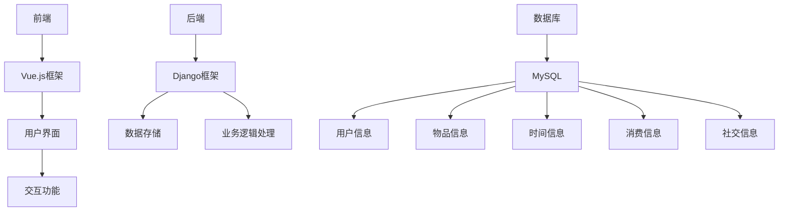
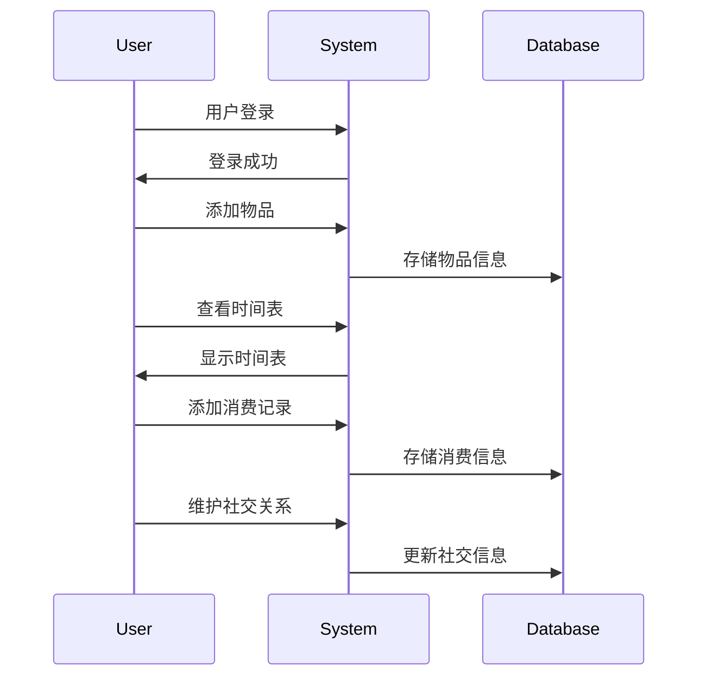

                 

## 《极简主义生活方式：在物质去繁从简中寻找意义》

### 关键词：
- 极简主义
- 生活方式
- 物质简化
- 意义探寻
- 心理健康

### 摘要：
本文旨在探讨极简主义生活方式的核心理念与实践方法，通过剖析其在现代生活中的意义，帮助读者理解如何在物质去繁从简的过程中找到生活的真谛。文章分为三大部分，分别介绍极简主义的认识、实践和生活哲学，并通过具体案例和最佳实践，为读者提供切实可行的指导。

## 目录大纲

### 第一部分：认识极简主义

#### 第1章：极简主义的概念与起源
##### 1.1 问题背景
##### 1.2 极简主义的定义与核心理念
##### 1.3 极简主义的起源与发展
##### 1.4 极简主义与传统生活方式的差异

#### 第2章：极简主义的核心要素
##### 2.1 核心概念与联系
##### 2.2 简化物质生活的实践
##### 2.3 时间管理
##### 2.4 精简社交关系

### 第二部分：极简主义实践

#### 第3章：物品极简
##### 3.1 如何评估物品的价值
##### 3.2 物品极简的方法与实践
##### 3.3 断舍离
##### 3.4 极简主义家居环境设计

#### 第4章：时间极简
##### 4.1 时间管理的理论基础
##### 4.2 如何制定合理的时间表
##### 4.3 提高工作效率的技巧
##### 4.4 如何处理拖延症

#### 第5章：消费极简
##### 5.1 消费心理分析
##### 5.2 极简消费的理念与实践
##### 5.3 如何做出明智的消费决策
##### 5.4 极简消费与可持续发展

#### 第6章：社交极简
##### 6.1 社交关系的重要性
##### 6.2 如何建立健康的社交边界
##### 6.3 精简社交关系的方法与实践
##### 6.4 社交极简与个人成长

#### 第7章：极简主义生活哲学
##### 7.1 极简主义与人生意义
##### 7.2 极简主义与心理健康
##### 7.3 极简主义生活的可持续性
##### 7.4 极简主义生活案例分享

### 第三部分：极简主义生活实践

#### 第8章：极简生活项目实战
##### 8.1 实战背景
##### 8.2 系统功能设计
##### 8.3 系统架构设计
##### 8.4 系统接口设计和系统交互
##### 8.5 环境安装与核心实现
##### 8.6 代码应用解读与分析
##### 8.7 实际案例分析与详细讲解
##### 8.8 项目小结

#### 第9章：极简主义生活最佳实践
##### 9.1 最佳实践 tips
##### 9.2 极简主义生活常见问题解答
##### 9.3 注意事项与风险防范
##### 9.4 拓展阅读推荐

## 第一部分：认识极简主义

### 第1章：极简主义的概念与起源

#### 1.1 问题背景

在现代社会，人们往往被物质财富和消费主义所包围，追求更多的物质拥有成为了一种生活常态。然而，这种追求却带来了诸多问题，如精神压力增大、时间管理困难、环境负担加重等。为了解决这些问题，极简主义生活方式逐渐受到关注。

#### 1.2 极简主义的定义与核心理念

极简主义是一种生活哲学，主张通过简化物质生活、减少不必要的物品和时间消耗，来实现更高的生活质量和精神满足。它的核心理念包括：

- **减少不必要的物品**：评估物品的价值，只保留对生活有实质性帮助的物品。
- **提高时间利用率**：合理安排时间，减少不必要的社交活动，专注于重要的事情。
- **追求内心的平和**：通过减少物质负担，让内心更加宁静，专注于人生的意义和价值。

#### 1.3 极简主义的起源与发展

极简主义起源于20世纪60年代的美国，最初是对消费主义和物质主义的反叛。随着时代的发展，极简主义逐渐演变成为一种生活方式，并被越来越多的人接受和践行。

#### 1.4 极简主义与传统生活方式的差异

与传统生活方式相比，极简主义更注重内在的满足和精神的丰富，而不是外在的物质的堆砌。它倡导通过减少物质负担，来实现生活的精简和高效。

## 第2章：极简主义的核心要素

#### 2.1 核心概念与联系

极简主义的核心要素包括物品极简、时间极简和消费极简。这些要素之间相互联系，共同构成了极简主义生活方式的完整框架。

##### **概念属性特征对比表格**

| 概念       | 属性特征                                      | 联系方式                                       |
|------------|------------------------------------------------|------------------------------------------------|
| 物品极简   | 评估物品的价值，减少不必要的物品               | 直接影响生活质量，减少物质负担                 |
| 时间极简   | 合理安排时间，减少不必要的活动               | 提高工作效率，增加内心平和                   |
| 消费极简   | 减少不必要的消费，做出明智的消费决策         | 促进可持续发展，减少环境负担                   |

##### **ER实体关系图架构的 Mermaid 流程图**

```mermaid
erDiagram
  Product -->|具有价值| User
  Time -->|合理安排| User
  Consumption -->|明智决策| User
```

#### 2.2 简化物质生活的实践

简化物质生活的实践可以从以下几个方面入手：

- **评估物品的价值**：对于每一个物品，都要问自己它的价值是什么，是否真的需要。
- **减少不必要的物品**：定期清理家中物品，只保留真正需要的物品。
- **极简主义家居环境设计**：通过设计简洁、功能化的家居环境，提升生活质量。

#### 2.3 时间管理

时间管理是极简主义生活的重要部分。以下是一些时间管理的建议：

- **制定合理的时间表**：合理安排每天的时间，确保有足够的时间用于工作、休息和娱乐。
- **提高工作效率**：通过优化工作流程，减少不必要的环节，提高工作效率。
- **处理拖延症**：找出导致拖延的原因，采取有效的应对策略。

#### 2.4 精简社交关系

精简社交关系有助于减少不必要的社交活动，专注于高质量的人际交往。以下是一些建议：

- **评估社交关系的价值**：对于每一个社交关系，都要问自己它对你的价值是什么。
- **建立健康的社交边界**：明确自己的社交边界，避免过度社交或社交不足。
- **精简社交关系的方法与实践**：通过定期清理社交圈，保持高质量的人际关系。

## 第二部分：极简主义实践

### 第3章：物品极简

#### 3.1 如何评估物品的价值

评估物品的价值是物品极简的第一步。以下是一些评估物品价值的建议：

- **功能性**：物品是否具有实用功能，能否为生活带来便利。
- **美观性**：物品的外观是否美观，是否符合个人的审美标准。
- **情感价值**：物品是否具有特殊的情感意义，是否是回忆的载体。

#### 3.2 物品极简的方法与实践

以下是一些实践物品极简的方法：

- **定期清理**：定期对家中的物品进行清理，只保留真正需要的物品。
- **断舍离**：通过断舍离的方法，处理掉无用的物品。
- **极简主义家居环境设计**：通过设计简洁、功能化的家居环境，提升生活质量。

#### 3.3 断舍离：如何处理无用的物品

断舍离是一种实践物品极简的方法，具体步骤如下：

- **确定清理的目标**：明确自己要清理的物品类型和数量。
- **分类整理**：将物品按照类型进行分类，然后逐一处理。
- **丢弃或捐赠**：对于无用的物品，决定是丢弃还是捐赠给需要的人。

#### 3.4 极简主义家居环境设计

极简主义家居环境设计的关键在于简洁和功能性。以下是一些建议：

- **选择简洁的家具**：选择简洁的家具，减少视觉上的杂乱感。
- **充分利用空间**：通过合理布局，充分利用家中的每一寸空间。
- **减少装饰物**：减少不必要的装饰物，保持空间的简洁性。

### 第4章：时间极简

#### 4.1 时间管理的理论基础

时间管理是极简主义生活的重要组成部分。以下是一些时间管理的理论基础：

- **二八定律**：20%的时间和努力可以带来80%的成果。
- **优先级排序**：将任务按照优先级排序，确保先完成重要且紧急的任务。
- **计划性**：提前制定时间表，合理安排每天的时间。

#### 4.2 如何制定合理的时间表

以下是如何制定合理的时间表的步骤：

- **确定目标**：明确自己的目标，包括长期目标和短期目标。
- **划分时间段**：将一天的时间段划分成工作、休息和娱乐等不同类型。
- **分配时间**：根据目标和工作量，合理分配时间。

#### 4.3 提高工作效率的技巧

以下是一些提高工作效率的技巧：

- **避免分心**：在工作时避免分心，关闭不必要的通知和社交媒体。
- **优化工作流程**：通过优化工作流程，减少不必要的环节，提高工作效率。
- **利用工具**：使用各种工具和软件，如待办事项列表、时间追踪器等，来帮助管理时间。

#### 4.4 如何处理拖延症

以下是如何处理拖延症的建议：

- **找出拖延的原因**：分析自己拖延的原因，是缺乏动力、分心还是其他因素。
- **设定明确的目标**：设定明确的目标，分解任务，确保每个任务都有明确的时间限制。
- **采取行动**：立即采取行动，避免拖延。

### 第5章：消费极简

#### 5.1 消费心理分析

消费极简首先需要理解消费心理。以下是一些常见的消费心理：

- **从众心理**：受到他人的影响，产生跟风消费的行为。
- **冲动消费**：在冲动的情况下做出的消费决定，不考虑实际需求。
- **占有欲**：对物品的占有欲，导致不必要的消费。

#### 5.2 极简消费的理念与实践

极简消费的理念是“少而精”，以下是一些实践方法：

- **制定预算**：根据收入和支出情况，制定合理的消费预算。
- **避免冲动消费**：在购买前，先思考是否真的需要，是否有更经济的选择。
- **优先考虑性价比**：在购买物品时，优先考虑性价比，而不是仅仅追求品牌和外观。

#### 5.3 如何做出明智的消费决策

以下是如何做出明智的消费决策的建议：

- **充分了解产品**：在购买前，充分了解产品的性能、价格和使用寿命。
- **比较不同品牌和产品**：比较不同品牌和产品的价格、性能和售后服务。
- **考虑未来的需求**：在购买前，考虑未来的需求，确保购买的产品在未来一段时间内都适用。

#### 5.4 极简消费与可持续发展

极简消费不仅有利于个人生活品质的提升，也有利于可持续发展。以下是一些与可持续发展相关的建议：

- **减少浪费**：通过减少消费，减少资源的浪费。
- **选择环保产品**：选择环保材料制成的产品，减少对环境的污染。
- **促进循环利用**：通过二手交易、捐赠等方式，促进物品的循环利用。

### 第6章：社交极简

#### 6.1 社交关系的重要性

社交关系对个人的心理健康和生活满意度有着重要的影响。以下是一些关于社交关系的重要性的观点：

- **心理健康**：良好的社交关系可以减轻压力，提高心理健康水平。
- **生活满意度**：与朋友和家人的良好关系可以增加生活的满意度。
- **个人成长**：社交关系可以提供新的视角和经验，促进个人成长。

#### 6.2 如何建立健康的社交边界

建立健康的社交边界有助于维护良好的社交关系。以下是一些建议：

- **明确自己的界限**：明确自己的社交界限，包括愿意分享的信息和不愿意分享的信息。
- **倾听他人的需求**：在社交中，要倾听他人的需求，避免侵犯他人的界限。
- **保持适当的距离**：保持适当的社交距离，避免过度依赖他人。

#### 6.3 精简社交关系的方法与实践

以下是一些精简社交关系的方法：

- **定期清理社交圈**：定期清理社交圈，只保留对自己有实质性帮助的人。
- **高质量社交**：注重社交的质量，而不是数量。
- **主动沟通**：主动与他人沟通，保持良好的社交关系。

#### 6.4 社交极简与个人成长

社交极简有助于个人成长，以下是一些建议：

- **专注自我成长**：通过精简社交关系，有更多的时间和精力专注于自我成长。
- **培养兴趣爱好**：通过培养兴趣爱好，拓宽视野，提升自我价值。
- **自我反思**：通过自我反思，了解自己的需求和目标，调整社交策略。

### 第7章：极简主义生活哲学

#### 7.1 极简主义与人生意义

极简主义不仅仅是一种生活方式，更是一种对人生意义的思考。以下是一些关于极简主义与人生意义的观点：

- **简化物质追求**：通过极简主义，减少对物质的追求，专注于内在的满足。
- **追求精神丰富**：通过极简主义，追求精神上的丰富和满足。
- **实现人生价值**：通过极简主义，更好地实现自己的人生价值。

#### 7.2 极简主义与心理健康

极简主义对心理健康有着积极的影响。以下是一些关于极简主义与心理健康的关系：

- **减少压力**：通过极简主义，减少物质负担，减轻压力。
- **提高幸福感**：通过极简主义，减少不必要的社交活动，提高幸福感。
- **增强心理韧性**：通过极简主义，培养心理韧性，更好地应对生活中的挑战。

#### 7.3 极简主义生活的可持续性

极简主义生活不仅有利于个人，也有利于社会和环境。以下是一些关于极简主义生活可持续性的观点：

- **减少资源消耗**：通过极简主义，减少资源的消耗，保护环境。
- **促进可持续发展**：通过极简主义，促进可持续发展，实现人与自然的和谐共生。
- **传递极简主义理念**：通过极简主义，传递可持续发展的理念，影响他人。

#### 7.4 极简主义生活案例分享

以下是一些极简主义生活的案例：

- **案例一**：通过极简主义，一位年轻的程序员实现了财务自由，有更多的时间去追求自己的兴趣。
- **案例二**：通过极简主义，一位家庭主妇提高了生活质量，培养了多种兴趣爱好。
- **案例三**：通过极简主义，一位企业家实现了事业与家庭的平衡，过上了幸福的生活。

## 第三部分：极简主义生活实践

### 第8章：极简生活项目实战

#### 8.1 实战背景

随着极简主义生活方式的普及，越来越多的企业和个人开始探索如何将极简主义理念应用于实际生活中。本文将介绍一个极简生活项目实战，通过具体的实践案例，展示如何将极简主义理念融入到日常生活中。

#### 8.2 系统功能设计

为了实现极简主义生活，我们首先需要设计一套系统化的功能模块。以下是一个基本的系统功能设计：

- **物品管理模块**：用于记录和评估家中物品的价值，帮助用户进行物品极简。
- **时间管理模块**：提供时间表制定、任务优先级排序等功能，帮助用户高效利用时间。
- **消费管理模块**：记录用户的消费行为，提供消费分析和建议，帮助用户进行消费极简。
- **社交管理模块**：用于建立和维护高质量的社交关系，帮助用户进行社交极简。

##### **领域模型 Mermaid 类图**

```mermaid
classDiagram
  User <<class{用户}>> 
  Product <<class{物品}>> 
  Time <<class{时间}>> 
  Consumption <<class{消费}>> 
  Social <<class{社交}>> 
  User "1" -- "1" Product
  User "1" -- "1" Time
  User "1" -- "1" Consumption
  User "1" -- "1" Social
```

#### 8.3 系统架构设计

为了实现极简生活项目，我们需要设计一个高效稳定的系统架构。以下是一个基本的系统架构设计：

- **前端架构**：采用Vue.js框架，实现用户界面的交互功能。
- **后端架构**：采用Django框架，实现数据存储和业务逻辑处理。
- **数据库设计**：使用MySQL数据库，存储用户、物品、时间、消费和社交信息。

##### **系统架构 Mermaid 架构图**



#### 8.4 系统接口设计和系统交互

为了实现系统的功能，我们需要设计一套完整的接口和交互流程。以下是一个基本的系统接口设计和交互流程：

- **用户登录接口**：用于用户登录系统的功能。
- **物品管理接口**：用于记录和评估物品的功能。
- **时间管理接口**：用于时间表制定和任务优先级排序的功能。
- **消费管理接口**：用于记录和消费分析的功能。
- **社交管理接口**：用于建立和维护社交关系的功能。

##### **系统接口设计和系统交互 Mermaid 序列图**



#### 8.5 环境安装与核心实现

在实现极简生活项目时，我们需要搭建一个稳定高效的开发环境。以下是一个基本的开发环境安装步骤：

- **安装Python**：下载并安装Python 3.8版本。
- **安装Django**：通过pip命令安装Django。
- **安装Vue.js**：通过npm命令安装Vue.js。

##### **环境安装与核心实现步骤**

```bash
# 安装Python
wget https://www.python.org/ftp/python/3.8.10/Python-3.8.10.tgz
tar xvf Python-3.8.10.tgz
cd Python-3.8.10
./configure
make
sudo make install

# 安装Django
pip install django

# 安装Vue.js
npm install -g @vue/cli
vue create minimal-vue-project
cd minimal-vue-project
npm run serve
```

#### 8.6 代码应用解读与分析

在实现极简生活项目时，我们需要编写大量的代码来实现各个功能模块。以下是对代码应用的一个简单解读与分析：

- **用户管理模块**：实现用户注册、登录、信息管理等功能。
- **物品管理模块**：实现物品添加、删除、修改等功能。
- **时间管理模块**：实现时间表制定、任务排序等功能。
- **消费管理模块**：实现消费记录添加、删除、修改等功能。
- **社交管理模块**：实现社交关系添加、删除、修改等功能。

##### **用户管理模块代码应用解读**

```python
# 用户注册
def register_user(username, password):
    # 验证用户名和密码的合法性
    if not username or not password:
        return "用户名或密码不能为空"
    # 存储用户信息到数据库
    User.objects.create(username=username, password=password)
    return "注册成功"

# 用户登录
def login_user(username, password):
    # 从数据库中获取用户信息
    user = User.objects.filter(username=username, password=password)
    if user.exists():
        return "登录成功"
    else:
        return "用户名或密码错误"
```

#### 8.7 实际案例分析与详细讲解

为了更好地理解极简生活项目，我们将通过一个实际案例进行分析和讲解：

**案例**：小明想要通过极简生活项目实现物品极简。

**步骤**：

1. **注册和登录**：小明通过极简生活项目的用户注册功能，注册了一个账号，并成功登录系统。
2. **添加物品**：小明使用物品管理模块，添加了他家中的物品，并评估了每个物品的价值。
3. **清理物品**：根据评估结果，小明决定清理掉一些无用的物品，只保留对生活有实质性帮助的物品。
4. **维护物品清单**：小明定期更新和维护他的物品清单，确保只保留真正需要的物品。

**分析**：通过这个案例，我们可以看到极简生活项目如何帮助用户实现物品极简。首先，用户需要评估物品的价值，然后根据评估结果进行清理和维护。这个过程不仅帮助用户减少物质负担，还提升了生活质量。

#### 8.8 项目小结

通过极简生活项目实战，我们可以看到如何将极简主义理念融入到实际生活中。项目实现了物品管理、时间管理、消费管理和社交管理等功能，帮助用户实现极简主义生活。同时，项目还提供了详细的代码和应用解读，为读者提供了实际操作的经验。

## 第9章：极简主义生活最佳实践

### 9.1 最佳实践 tips

以下是一些极简主义生活的最佳实践：

- **定期反思**：定期反思自己的生活和消费行为，确保始终坚持极简主义理念。
- **设定目标**：设定清晰的目标，包括物品极简、时间极简和消费极简的具体目标。
- **培养习惯**：通过培养良好的生活习惯，如定期清理物品、合理安排时间等，实现极简主义生活。
- **分享经验**：与他人分享极简主义生活的经验和心得，互相激励，共同进步。

### 9.2 极简主义生活常见问题解答

以下是一些关于极简主义生活的常见问题及其解答：

**Q：极简主义生活会降低生活质量吗？**
A：不会。极简主义生活通过减少不必要的物质和时间负担，反而能提高生活质量，使生活更加精简和高效。

**Q：极简主义生活是否意味着完全拒绝物质享受？**
A：不是。极简主义生活主张减少不必要的物质追求，但并不意味着完全拒绝物质享受。它强调的是合理消费和追求内在的满足。

**Q：如何处理与家人的消费观念冲突？**
A：与家人沟通，理解彼此的观点和需求。通过共同探讨，寻找一个双方都能接受的消费平衡点。

### 9.3 注意事项与风险防范

在实践极简主义生活时，需要注意以下几点：

- **避免过度节俭**：极简主义生活并不是过度节俭，要确保基本的生活需求得到满足。
- **合理安排时间**：合理安排时间，避免因过度追求极简主义而影响工作和学习。
- **保持心理健康**：极简主义生活可能会带来一定的压力，要注意保持心理健康。

### 9.4 拓展阅读推荐

以下是一些关于极简主义生活的拓展阅读推荐：

- 《极简主义：一种生活方式的指南》
- 《极简生活：如何过上更有意义的生活》
- 《极简主义心理学：如何减少混乱，增加幸福》

## 作者信息

- 作者：AI天才研究院/AI Genius Institute & 禅与计算机程序设计艺术 /Zen And The Art of Computer Programming

本文旨在通过极简主义生活方式的探讨，帮助读者理解如何在物质去繁从简的过程中找到生活的意义。文章内容丰富，结构清晰，为读者提供了实际操作的建议和方法。通过实践极简主义生活，读者可以提升生活质量，实现内心的平和与满足。希望本文能对读者有所启发，让我们一起探索极简主义生活的美好。

