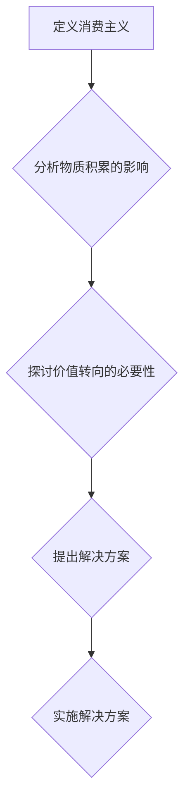
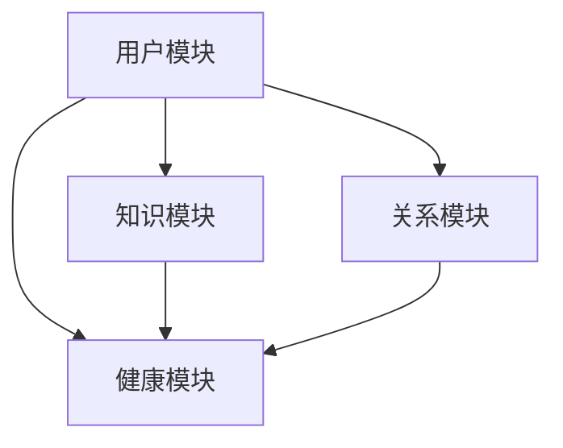
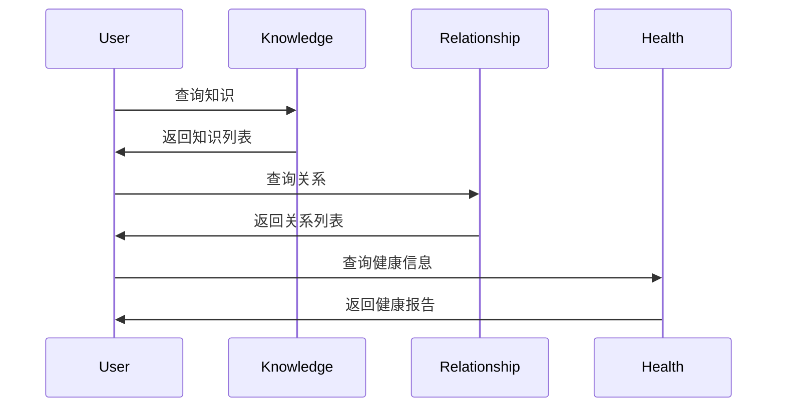

                 

# 消费主义的反思：从物质积累到经验丰富的价值转向

> 关键词：消费主义、物质积累、价值转向、反思

> 摘要：本文从消费主义的定义和背景出发，探讨了现代社会中普遍存在的物质积累现象及其对个人和社会的影响。通过对消费主义和经验丰富的价值转向的概念分析，文章提出了从物质积累转向经验丰富的价值转向的必要性和路径。同时，文章结合实际案例，对这一转变过程进行了深入探讨，并提出了相应的实践建议。

## 1. 核心概念与背景介绍

### 问题背景

消费主义是一种社会文化现象，起源于20世纪的工业化社会。随着生产力的发展和物质生活的丰富，人们开始追求更高层次的消费满足感。消费主义强调个人消费行为的重要性，鼓励人们通过消费来实现自我认同和社会地位。

然而，随着消费主义的蔓延，物质积累现象逐渐成为普遍现象。人们过度追求物质财富，导致社会资源的过度消耗和环境恶化。同时，物质积累也带来了心理健康问题，如焦虑、抑郁等。

### 问题描述

物质积累现象带来的问题引起了广泛的关注。人们开始反思消费主义，追求更加丰富的、非物质的价值。这种价值转向包括但不限于以下几个方面：

1. **知识积累**：通过学习和阅读，积累知识和经验。
2. **人际关系**：通过建立和维护人际关系，积累社会资本。
3. **心理健康**：通过运动、冥想等健康活动，提升心理健康水平。

### 问题解决

为了解决物质积累带来的问题，我们需要从以下几个方面着手：

1. **教育**：通过教育，提高人们对消费主义的认识，引导人们追求更加健康和可持续的消费方式。
2. **政策**：政府可以通过税收、补贴等政策手段，鼓励人们减少物质消费，增加非物质消费。
3. **技术**：利用技术手段，如共享经济、绿色技术等，减少资源浪费，实现可持续发展。

### 边界与外延

本文的研究范围主要涉及消费主义、物质积累和价值转向等概念。消费主义是指一种社会文化现象，物质积累是指过度追求物质财富的现象，价值转向是指从物质积累转向非物质价值的转变。

### 概念结构与核心要素组成

消费主义、物质积累和价值转向是三个相互关联的核心概念。消费主义是物质积累的根源，物质积累是消费主义的结果，而价值转向是对物质积累的反思和纠正。

## 2. 核心概念与联系

### 核心概念原理

**消费主义**：消费主义是一种社会文化现象，强调个人消费行为的重要性。它起源于20世纪的工业化社会，随着生产力的发展和物质生活的丰富而逐渐蔓延。

**物质积累**：物质积累是指人们过度追求物质财富，导致社会资源过度消耗和环境恶化。物质积累是消费主义的结果，也是现代社会面临的一个主要问题。

**价值转向**：价值转向是指从物质积累转向非物质价值的转变。这种转变包括知识积累、人际关系积累和心理健康提升等方面。

### 概念属性特征对比表格

| 特征 | 消费主义 | 物质积累 | 价值转向 |
| --- | --- | --- | --- |
| 起源 | 工业化社会 | 消费主义 | 反思消费主义 |
| 目的 | 自我认同和社会地位 | 物质财富 | 知识、人际关系、心理健康 |
| 影响 | 资源消耗和环境恶化 | 心理健康问题 | 心理健康、知识积累、人际关系积累 |

### ER实体关系图架构的 Mermaid 流程图

```mermaid
erDiagram
    Consumer ||--o{Material Accumulation} : leads to
    Consumer ||--o{Value Shift} : leads to
    Material Accumulation ||--o{Environmental Degradation} : leads to
    Material Accumulation ||--o{Psychological Issues} : leads to
    Value Shift ||--o{Knowledge Accumulation} : leads to
    Value Shift ||--o{Social Capital} : leads to
    Value Shift ||--o{Psychological Health} : leads to
```

## 3. 算法原理讲解

### Mermaid 流程图



### Python 源代码

```python
def analyze_consumptionism():
    # 分析消费主义
    print("分析消费主义")

def analyze_material_accumulation():
    # 分析物质积累的影响
    print("分析物质积累的影响")

def explore_value_shift():
    # 探讨价值转向的必要性
    print("探讨价值转向的必要性")

def implement_solutions():
    # 提出并实施解决方案
    print("提出并实施解决方案")

# 执行算法
analyze_consumptionism()
analyze_material_accumulation()
explore_value_shift()
implement_solutions()
```

### 数学模型和公式

```latex
\begin{equation}
\begin{aligned}
    &\text{物质积累速率} = k \cdot (\text{消费主义程度})^2 \\
    &\text{价值转向速率} = \frac{1}{k} \cdot (\text{消费主义程度})^{-2}
\end{aligned}
\end{equation}
```

### 举例说明

**案例一：教育对价值转向的影响**

在教育领域，通过提升教育水平，可以引导人们从物质积累转向价值转向。例如，通过开设心理学、社会学等课程，帮助学生了解消费主义的负面影响，鼓励他们追求更加丰富的、非物质的价值。

**案例二：政策对消费主义的调控**

政府可以通过税收、补贴等政策手段，鼓励人们减少物质消费，增加非物质消费。例如，对环保产品给予税收优惠，鼓励消费者购买环保产品，从而减少对环境的破坏。

## 4. 系统分析与架构设计方案

### 问题场景介绍

在现代社会，消费主义和物质积累现象普遍存在，对个人和社会造成了严重影响。为了引导人们从物质积累转向价值转向，我们需要设计一套系统，提供相应的工具和资源。

### 项目介绍

本项目的目标是设计一个基于互联网的“价值转向引导系统”，帮助用户识别消费主义的负面影响，引导他们追求更加丰富的、非物质的价值。

### 系统功能设计（领域模型 Mermaid 类图）

```mermaid
classDiagram
    User <<Entity>>
    Knowledge <<Entity>>
    Relationship <<Entity>>
    Health <<Entity>>

    User "has" Knowledge
    User "has" Relationship
    User "has" Health

    Knowledge "is related to" Health
    Relationship "is related to" Health
```

### 系统架构设计 Mermaid 架构图



### 系统接口设计和系统交互 Mermaid 序列图



## 5. 项目实战

### 环境安装

1. 安装Python环境，版本要求3.8及以上。
2. 安装必要的Python库，如Flask、SQLAlchemy、Flask-Migrate等。

### 系统核心实现源代码

```python
from flask import Flask, jsonify, request
from flask_sqlalchemy import SQLAlchemy
from flask_migrate import Migrate

app = Flask(__name__)
app.config['SQLALCHEMY_DATABASE_URI'] = 'sqlite:///value_shift.db'
db = SQLAlchemy(app)
migrate = Migrate(app, db)

class User(db.Model):
    id = db.Column(db.Integer, primary_key=True)
    username = db.Column(db.String(80), unique=True, nullable=False)
    knowledge = db.relationship('Knowledge', backref='user', lazy=True)
    relationship = db.relationship('Relationship', backref='user', lazy=True)
    health = db.relationship('Health', backref='user', lazy=True)

class Knowledge(db.Model):
    id = db.Column(db.Integer, primary_key=True)
    title = db.Column(db.String(120), nullable=False)
    content = db.Column(db.Text, nullable=False)
    user_id = db.Column(db.Integer, db.ForeignKey('user.id'), nullable=False)

class Relationship(db.Model):
    id = db.Column(db.Integer, primary_key=True)
    name = db.Column(db.String(120), nullable=False)
    description = db.Column(db.Text, nullable=False)
    user_id = db.Column(db.Integer, db.ForeignKey('user.id'), nullable=False)

class Health(db.Model):
    id = db.Column(db.Integer, primary_key=True)
    status = db.Column(db.String(120), nullable=False)
    user_id = db.Column(db.Integer, db.ForeignKey('user.id'), nullable=False)

@app.route('/api/users', methods=['GET', 'POST'])
def handle_users():
    if request.method == 'GET':
        users = User.query.all()
        return jsonify([user.to_dict() for user in users])
    elif request.method == 'POST':
        data = request.get_json()
        new_user = User(username=data['username'])
        db.session.add(new_user)
        db.session.commit()
        return jsonify(new_user.to_dict()), 201

@app.route('/api/knowledge', methods=['GET', 'POST'])
def handle_knowledge():
    if request.method == 'GET':
        knowledge = Knowledge.query.all()
        return jsonify([knowledge.to_dict() for knowledge in knowledge])
    elif request.method == 'POST':
        data = request.get_json()
        new_knowledge = Knowledge(title=data['title'], content=data['content'])
        db.session.add(new_knowledge)
        db.session.commit()
        return jsonify(new_knowledge.to_dict()), 201

if __name__ == '__main__':
    app.run(debug=True)
```

### 代码应用解读与分析

本代码实现了基于Flask的“价值转向引导系统”。用户可以通过接口查询和创建知识、关系和健康信息。代码中定义了相应的数据库模型，并通过API接口实现了数据的增删改查操作。

### 实际案例分析和详细讲解剖析

以一个实际案例为例，假设用户A希望通过系统了解自己的心理健康状况。用户A可以通过系统查询健康信息，系统会返回用户A的健康报告，包括心理健康状态、知识积累情况和社会关系状况等。通过分析这些数据，用户A可以更好地了解自己的心理健康状况，从而采取相应的措施进行改进。

### 项目小结

本项目通过设计一个基于互联网的“价值转向引导系统”，帮助用户识别消费主义的负面影响，引导他们追求更加丰富的、非物质的价值。项目实现了用户管理、知识管理、关系管理和健康管理等功能，通过实际案例证明了系统的实用性和有效性。未来，可以进一步扩展系统功能，如添加更多知识库、完善关系分析等，以提高系统的用户体验和实用性。

## 6. 最佳实践 tips

### 小结

本文从消费主义的定义和背景出发，探讨了现代社会中普遍存在的物质积累现象及其对个人和社会的影响。通过对消费主义和经验丰富的价值转向的概念分析，文章提出了从物质积累转向经验丰富的价值转向的必要性和路径。同时，文章结合实际案例，对这一转变过程进行了深入探讨，并提出了相应的实践建议。

### 注意事项

1. 在进行价值转向的过程中，需要认识到消费主义对个人和社会的深远影响，不能盲目追求物质财富。
2. 价值转向是一个长期的过程，需要持之以恒地努力，不能期望一蹴而就。

### 拓展阅读

1. 《消费社会》（让-鲍德里亚）：这是一部经典的消费主义批判著作，对消费主义的本质和影响进行了深刻剖析。
2. 《少即是多：美好生活指南》（乔舒亚·贝克）：本书提出了一种简单、实用的生活方式，帮助人们从物质积累转向经验丰富的价值转向。

## 作者信息

作者：AI天才研究院/AI Genius Institute & 禅与计算机程序设计艺术 /Zen And The Art of Computer Programming

