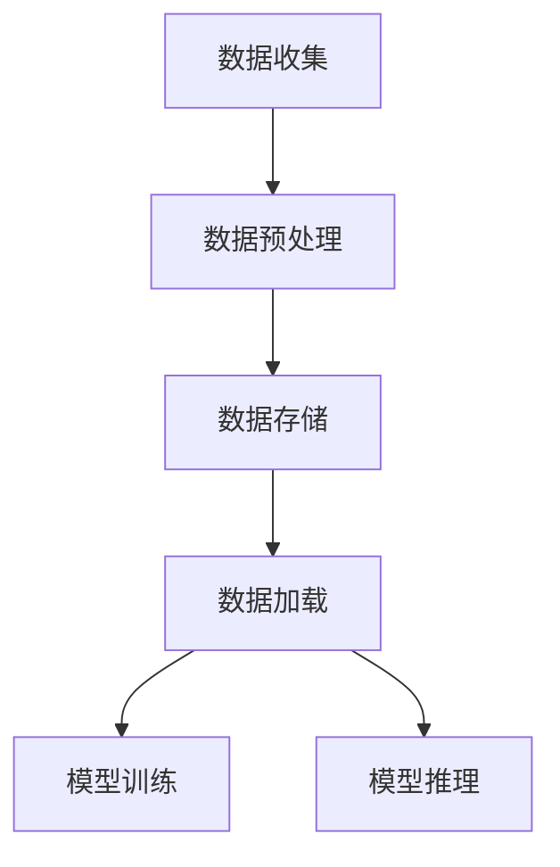
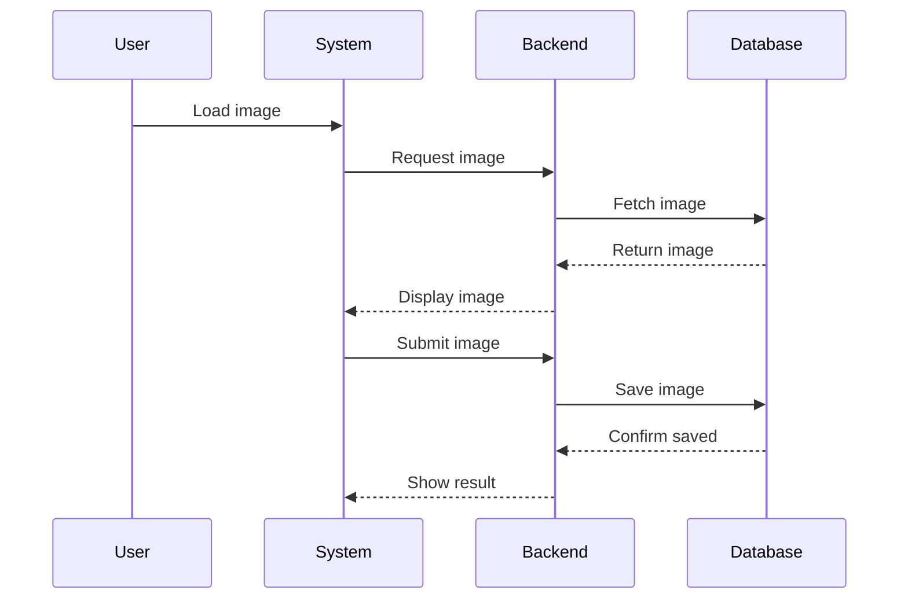

                 


### 第1章 引言

#### 1.1 医学影像诊断的挑战与需求

医学影像诊断作为现代医疗的重要组成部分，已经广泛应用于临床诊断、疾病监测、治疗效果评估等方面。然而，传统的医学影像诊断方法面临着诸多挑战，如诊断结果主观性强、医生经验依赖严重、工作效率低下等。为了提高诊断准确性、降低误诊率、提高工作效率，医学影像诊断亟需借助先进的计算机技术和人工智能技术，其中深度学习技术因其强大的图像处理和模式识别能力，成为了医学影像诊断领域的重要突破口。

深度学习在医学影像诊断中的应用不仅有助于提高诊断速度和准确性，还能为医生提供更加详细和全面的诊断信息，从而为疾病早期发现、精准治疗提供有力支持。随着深度学习技术的不断发展和成熟，其在医学影像诊断中的潜在应用前景愈发广阔。

#### 1.2 深度学习的兴起与医学影像的结合

深度学习（Deep Learning）是人工智能（Artificial Intelligence，AI）的一个重要分支，其核心思想是通过多层神经网络模型来模拟人脑处理信息的方式。自2006年Hinton等人提出深度信念网络（Deep Belief Network，DBN）以来，深度学习取得了飞速发展，并在图像识别、语音识别、自然语言处理等领域取得了显著成果。

深度学习在医学影像领域的应用主要依托于其强大的图像处理和特征提取能力。通过训练深度神经网络模型，可以自动学习到医学影像中的关键特征，从而实现对病变区域的检测、分类和定位。这种自动化、智能化的诊断方法不仅提高了诊断的准确性和效率，还降低了医生的工作负担，为医学影像诊断带来了革命性的变革。

#### 1.3 本书结构安排与内容概览

本书旨在系统介绍深度学习在医学影像诊断中的应用，包括基础理论、算法实现、系统开发等各个环节。具体章节安排如下：

- **第1章 引言**：概述医学影像诊断的挑战与需求，深度学习的兴起及其在医学影像诊断中的应用。
- **第2章 医学影像诊断基础**：介绍医学影像的基本概念、常见类型及其数据特点。
- **第3章 深度学习基础**：讲解深度学习的定义、主要类型和基本原理。
- **第4章 图像处理与特征提取**：介绍图像预处理和特征提取的基本方法。
- **第5章 深度学习在医学影像诊断中的应用**：详细探讨深度学习在肿瘤检测、心脏病诊断、神经系统疾病诊断等领域的应用。
- **第6章 深度学习算法优化与调参**：介绍深度学习算法的优化方法和超参数调优策略。
- **第7章 深度学习医学影像诊断系统开发**：讲解深度学习医学影像诊断系统的开发过程。
- **第8章 深度学习医学影像诊断的未来发展**：探讨深度学习医学影像诊断的未来趋势和挑战。

通过本书的阅读，读者可以全面了解深度学习在医学影像诊断中的应用，掌握相关理论和实践方法，为实际应用提供有力支持。

### 第2章 医学影像诊断基础

#### 2.1 医学影像的基本概念

医学影像是指利用各种医学成像技术对人体内部结构和功能进行可视化检测的图像。医学影像学成像技术主要包括以下几类：

- **X射线成像**：通过X射线穿透人体，捕捉不同密度的组织结构，常用于骨折、肺炎等疾病的诊断。
- **计算机断层扫描（CT）**：利用X射线从多个角度对人体进行扫描，通过计算机处理生成断层图像，适用于肿瘤、动脉瘤等疾病的诊断。
- **磁共振成像（MRI）**：利用磁场和射频脉冲来激发人体内的氢原子核，通过检测其信号变化生成图像，适用于软组织、神经系统等疾病的诊断。
- **超声成像**：利用超声波在人体内的传播和反射，生成体内组织的实时图像，常用于胎儿监测、肝脏病变等疾病的诊断。
- **核医学成像**：利用放射性同位素发射的射线，通过探测装置捕捉图像，常用于肿瘤、甲状腺等疾病的诊断。

这些成像技术各有优缺点，不同的成像技术适用于不同的诊断场景。例如，CT和MRI在肿瘤诊断中具有很高的敏感性和特异性，而超声成像则适合进行实时监测和动态观察。

#### 2.1.2 常见医学影像类型

常见医学影像类型主要包括以下几种：

- **X线片**：通过X射线成像技术获取的平面图像，常用于骨折、肺炎等疾病的诊断。
- **CT图像**：通过计算机断层扫描技术获取的断层图像，可以提供更详细的内部结构信息。
- **MRI图像**：通过磁共振成像技术获取的图像，对软组织和神经系统的显示尤为清晰。
- **超声图像**：通过超声成像技术获取的实时图像，常用于胎儿监测和肝脏病变等诊断。
- **PET图像**：通过正电子发射断层扫描（PET）技术获取的图像，可以显示体内的代谢和功能变化。
- **SPECT图像**：通过单光子发射计算机断层扫描（SPECT）技术获取的图像，与PET类似，但灵敏度较低。

这些影像类型在医学诊断中有着广泛的应用，不同的影像类型可以相互补充，提高诊断的准确性和全面性。

#### 2.1.3 医学影像的数据特点

医学影像数据具有以下特点：

- **高维度**：医学影像数据通常是多维的，包括像素值、时间序列等，数据量大，处理复杂。
- **高噪声**：医学影像数据往往受到噪声干扰，如患者运动、设备噪声等，这对图像处理和特征提取提出了挑战。
- **多样化**：医学影像数据种类繁多，包括灰度图像、彩色图像等，不同类型的数据处理方法也有所不同。
- **不均衡**：医学影像数据中正常样本和异常样本的比例往往不均衡，这对模型训练和评估提出了特殊要求。
- **复杂背景**：医学影像背景复杂，常常存在干扰信号和伪影，需要通过图像预处理和特征提取方法来去除。

这些数据特点对深度学习模型的设计和训练提出了特殊的要求，需要在模型架构、训练策略和数据处理方法等方面进行优化，以提高模型的诊断性能。

### 2.2 医学影像诊断的现状

#### 2.2.1 传统诊断方法

传统的医学影像诊断方法主要包括影像学检查和医生诊断两个环节。影像学检查是通过医学影像设备获取患者的图像数据，而医生诊断则依赖于医生的经验和专业知识对图像进行分析和判断。

在影像学检查方面，医生根据患者的临床表现和影像学表现，选择合适的成像技术进行诊断。例如，对于骨折的检测，医生可能会选择X射线片；对于肿瘤的诊断，医生可能会选择CT或MRI。这些影像学检查方法具有直观、准确、实时等优点，但仍然存在一定的局限性。

在医生诊断方面，医生需要通过观察和分析影像学图像，判断是否存在病变、病变的类型和位置等。这种诊断方法主要依赖于医生的经验和判断力，容易受到主观因素的影响。此外，医生的工作负担较大，工作效率较低，无法满足日益增长的医疗需求。

#### 2.2.2 传统诊断的局限性

传统医学影像诊断方法存在以下局限性：

- **主观性**：医生诊断结果容易受到个人经验、判断力和主观因素的影响，存在一定的误诊率。
- **低效率**：医生需要逐张分析影像学图像，工作效率较低，无法满足大规模诊断的需求。
- **依赖经验**：医生对影像学图像的解读依赖于长期积累的经验，无法充分利用现代技术手段。
- **无法动态监测**：传统诊断方法无法实时监测患者的病情变化，难以进行动态评估。

#### 2.2.3 深度学习在医学影像诊断中的应用前景

深度学习技术在医学影像诊断中的应用具有显著的优势，可以弥补传统诊断方法的局限性。首先，深度学习模型可以通过大量数据训练，自动提取医学影像中的关键特征，提高诊断的准确性和可靠性。其次，深度学习模型具有自适应性和泛化能力，可以适应不同类型的医学影像数据，提高诊断的普适性。此外，深度学习技术可以实现自动化、实时化的诊断，提高诊断效率，降低医生的工作负担。

具体来说，深度学习在医学影像诊断中的应用前景包括：

- **疾病检测与分类**：通过训练深度学习模型，可以实现对肿瘤、心脏病、神经系统疾病等疾病的自动检测和分类，提高诊断准确性。
- **辅助医生诊断**：深度学习模型可以辅助医生进行影像学图像的分析和判断，提供更加详细和全面的诊断信息，降低误诊率。
- **动态监测与评估**：通过实时分析患者的医学影像数据，可以动态监测患者的病情变化，为疾病早期发现、精准治疗提供支持。
- **个性化治疗建议**：基于患者的医学影像数据和病史，深度学习模型可以提供个性化的治疗建议，优化治疗方案。

总之，深度学习技术在医学影像诊断中的应用具有广阔的前景，有望为医疗领域带来革命性的变革。随着技术的不断发展和应用，深度学习在医学影像诊断中的应用将越来越广泛，为疾病的早期诊断、精准治疗和健康管理提供有力支持。

### 第3章 深度学习基础

#### 3.1 深度学习概述

深度学习是人工智能（AI）的一个重要分支，其核心思想是通过多层神经网络模型来模拟人脑处理信息的方式。与传统的机器学习方法相比，深度学习具有更强的自学习能力，能够从大量数据中自动提取特征，并应用于图像识别、自然语言处理、语音识别等领域。

深度学习的历史可以追溯到1980年代，当时神经网络研究取得了初步成果。然而，由于计算能力和数据量的限制，深度学习在1990年代经历了短暂的沉寂。直到2006年，加拿大多伦多大学教授Hinton等人提出深度信念网络（Deep Belief Network，DBN），深度学习研究重新焕发了生机。随后，卷积神经网络（Convolutional Neural Network，CNN）和循环神经网络（Recurrent Neural Network，RNN）等深度学习模型的提出，进一步推动了深度学习技术的发展。

#### 3.1.1 深度学习的定义与历史

深度学习的定义可以从多个角度来理解。狭义上，深度学习指的是多层神经网络的学习过程，这些网络通过逐层提取特征来对数据进行分类、回归或其他任务。广义上，深度学习还包括了各种基于神经网络的算法和技术，如卷积神经网络（CNN）、循环神经网络（RNN）、生成对抗网络（GAN）等。

深度学习的历史可以大致分为以下几个阶段：

1. **早期神经网络**：1950年代到1960年代，神经网络研究开始兴起。1969年，Minsky和Papert的《感知器》一书提出了单层感知器（Perceptron）的概念，但这一时期神经网络的发展受到限制。
2. **1980年代到1990年代**：由于计算能力和数据量的限制，神经网络研究进入低谷。然而，1986年，Rumelhart、Hinton和Williams提出了反向传播算法（Backpropagation Algorithm），这一算法解决了多层神经网络训练中的梯度消失和梯度爆炸问题，为深度学习的发展奠定了基础。
3. **2006年至今**：深度学习的复兴。2006年，Hinton等人提出深度信念网络（DBN），2009年，Alex Krizhevsky等人使用深度卷积神经网络（CNN）在ImageNet图像识别挑战赛中取得突破性成绩，深度学习开始得到广泛关注。此后，各种深度学习模型和技术不断涌现，如RNN、LSTM、GAN等。

#### 3.1.2 深度学习的主要类型

深度学习的主要类型包括卷积神经网络（CNN）、循环神经网络（RNN）、生成对抗网络（GAN）等。每种类型都有其独特的结构和应用场景。

1. **卷积神经网络（CNN）**：CNN是一种针对图像数据进行处理的深度学习模型，其核心思想是通过卷积层提取图像特征，并通过池化层减少数据维度。CNN在图像识别、物体检测、图像生成等领域有广泛应用。

2. **循环神经网络（RNN）**：RNN是一种针对序列数据进行处理的深度学习模型，其核心思想是保持长期的序列依赖关系。RNN在自然语言处理、语音识别、时间序列分析等领域有广泛应用。

3. **生成对抗网络（GAN）**：GAN是一种由生成器和判别器组成的对抗性网络，其核心思想是生成器生成数据以欺骗判别器，从而提高生成数据的质量。GAN在图像生成、图像增强、数据增强等领域有广泛应用。

#### 3.1.3 深度学习的基本原理

深度学习的基本原理包括以下几个关键部分：

1. **多层神经网络**：深度学习模型通过多层神经网络进行数据处理，每一层神经网络都能够提取更高层次的抽象特征。

2. **前向传播与反向传播**：在训练过程中，深度学习模型通过前向传播将输入数据传递到输出层，通过计算损失函数评估模型性能。然后，通过反向传播算法更新模型参数，优化模型性能。

3. **激活函数**：激活函数是深度学习模型中的一个重要组成部分，用于引入非线性变换。常见的激活函数包括Sigmoid、ReLU、Tanh等。

4. **优化算法**：深度学习模型的训练通常采用梯度下降（Gradient Descent）及其变种，如随机梯度下降（SGD）、Adam等优化算法，以最小化损失函数，优化模型参数。

通过这些基本原理，深度学习模型能够从大量数据中自动学习到复杂的特征，从而实现对数据的分类、回归、生成等任务。在医学影像诊断中，深度学习模型通过自动提取医学影像中的关键特征，实现了对病变区域的检测、分类和定位，为医生提供了强大的辅助工具。

### 第4章 图像处理与特征提取

#### 4.1 图像预处理

图像预处理是深度学习模型训练前的重要步骤，目的是提高图像质量和数据一致性，从而优化模型的性能。常见的图像预处理方法包括图像缩放与裁剪、图像增强与对比度调整、图像归一化等。

#### 4.1.1 图像缩放与裁剪

图像缩放与裁剪是图像预处理中的基础操作。图像缩放是指调整图像的大小，使其适应模型输入要求。图像裁剪则是从原始图像中选取一部分作为模型输入。这两种操作在数据增强和模型训练过程中都有广泛应用。

- **图像缩放**：图像缩放可以通过内插和外插方法实现。内插方法包括线性内插、双线性内插和双三次内插等，外插方法包括最近邻插值和零填充等。内插方法的优点是可以提高图像的清晰度，但计算复杂度较高。外插方法的计算复杂度较低，但可能会导致图像失真。

- **图像裁剪**：图像裁剪可以通过随机裁剪、中心裁剪等方法实现。随机裁剪从图像中随机选择一个区域作为输入，有助于增加模型对图像局部变化的适应性。中心裁剪则选择图像的中心部分作为输入，有助于保持图像的整体特征。

#### 4.1.2 图像增强与对比度调整

图像增强与对比度调整是提升图像质量的重要方法，可以提高模型对图像细节的识别能力。

- **图像增强**：图像增强可以通过直方图均衡、对比度增强等方法实现。直方图均衡方法通过调整图像的像素分布，使图像的对比度更加明显。对比度增强方法通过调整图像的亮度、对比度等参数，提高图像的清晰度。

- **对比度调整**：对比度调整可以通过直方图对比度增强、直方图拉伸等方法实现。直方图对比度增强通过调整图像的灰度分布，使图像的对比度更加明显。直方图拉伸通过选择图像中的特定灰度值范围，使图像的对比度增强。

#### 4.1.3 图像归一化

图像归一化是将图像的像素值缩放到一个固定的范围内，通常使用[0, 1]或[-1, 1]的范围。图像归一化有助于加快模型的训练速度和提升模型的泛化能力。

- **像素值缩放**：像素值缩放方法包括最小-最大缩放、零-均值缩放等。最小-最大缩放通过将像素值缩放到[0, 1]或[-1, 1]的范围，零-均值缩放通过将像素值缩放到[0, 1]的范围，同时减去像素值的均值。

- **标准化**：标准化方法包括Z-score标准化和L2标准化等。Z-score标准化通过计算每个像素值的均值和标准差，然后将像素值缩放到[0, 1]的范围。L2标准化通过计算每个像素值的L2范数，然后将像素值缩放到[0, 1]的范围。

#### 4.2 特征提取

特征提取是深度学习模型训练中的关键步骤，目的是从图像中提取出具有鉴别性的特征，用于后续的分类、回归等任务。特征提取可以分为手动特征提取和基于深度学习的自动特征提取。

#### 4.2.1 手动特征提取

手动特征提取是通过设计特定的算法和函数，从图像中提取出具有鉴别性的特征。常见的手动特征提取方法包括：

- **边缘检测**：边缘检测通过检测图像中的边缘线条，提取图像的边缘特征。常用的边缘检测算法包括Canny边缘检测、Sobel边缘检测等。

- **角点检测**：角点检测通过检测图像中的角点特征，提取图像的角点特征。常用的角点检测算法包括Harris角点检测、Shi-Tomasi角点检测等。

- **纹理特征提取**：纹理特征提取通过检测图像中的纹理模式，提取图像的纹理特征。常用的纹理特征提取算法包括灰度共生矩阵、局部二值模式（LBP）等。

手动特征提取方法的优点是计算复杂度较低，但需要大量的人力和经验。此外，手动特征提取方法对图像的质量和噪声敏感，容易受到噪声和干扰的影响。

#### 4.2.2 基于深度学习的自动特征提取

基于深度学习的自动特征提取方法通过训练深度学习模型，自动学习到图像中的特征，避免了手动特征提取的复杂性和主观性。常见的基于深度学习的自动特征提取方法包括：

- **卷积神经网络（CNN）**：卷积神经网络通过多层卷积和池化操作，自动学习到图像中的局部特征和全局特征。CNN在图像分类、物体检测、图像生成等领域有广泛应用。

- **生成对抗网络（GAN）**：生成对抗网络通过生成器和判别器的对抗训练，自动学习到图像的生成和鉴别特征。GAN在图像生成、图像修复、图像增强等领域有广泛应用。

- **自编码器（Autoencoder）**：自编码器是一种无监督学习模型，通过训练生成器网络和编码器网络，自动学习到图像的特征表示。自编码器在图像压缩、图像去噪、图像增强等领域有广泛应用。

基于深度学习的自动特征提取方法具有以下优点：

1. **自适应特征提取**：深度学习模型可以根据训练数据自动学习到图像中的特征，避免了手动特征提取的复杂性和主观性。

2. **多尺度特征提取**：卷积神经网络通过多层卷积和池化操作，可以自动提取图像中的多尺度特征，提高了模型对图像细节的识别能力。

3. **鲁棒性**：基于深度学习的自动特征提取方法对图像的质量和噪声具有一定的鲁棒性，可以自动去除噪声和干扰。

总之，图像预处理和特征提取是深度学习模型训练的重要环节。通过合适的图像预处理方法和特征提取方法，可以优化模型的性能，提高诊断准确性。在医学影像诊断中，深度学习模型的图像预处理和特征提取方法有助于实现自动化、精准化的诊断，为医学影像诊断领域带来革命性的变革。

### 第5章 深度学习在医学影像诊断中的应用

#### 5.1 肿瘤检测与分类

肿瘤检测与分类是医学影像诊断中至关重要的一环，深度学习技术的引入极大地提升了肿瘤检测的准确性和效率。以下将详细探讨深度学习在肿瘤检测与分类中的应用，包括肿瘤检测算法、肿瘤分类算法以及具体应用案例。

#### 5.1.1 肿瘤检测算法

肿瘤检测算法的主要任务是自动识别医学影像中可能存在的肿瘤区域。深度学习在这一领域中的应用主要体现在卷积神经网络（CNN）和区域提议网络（Region Proposal Network，RPN）上。

- **卷积神经网络（CNN）**：CNN通过卷积层、池化层和全连接层的组合，可以自动提取医学影像中的特征，实现对肿瘤区域的检测。具体来说，CNN的卷积层可以提取图像的局部特征，池化层可以减少数据的维度，全连接层则用于分类和回归任务。

- **区域提议网络（RPN）**：RPN是Fast R-CNN、Faster R-CNN等目标检测算法的一部分，其主要功能是生成可能的肿瘤区域提议。RPN通过回归操作预测每个区域是否为肿瘤，从而提高肿瘤检测的准确性。

#### 5.1.2 肿瘤分类算法

肿瘤分类算法的主要任务是判断医学影像中的肿瘤类型。深度学习在这一领域的应用主要体现在基于深度学习的分类模型上，如卷积神经网络（CNN）和循环神经网络（RNN）。

- **卷积神经网络（CNN）**：CNN通过多层卷积和池化操作，可以提取医学影像中的高级特征，实现对不同肿瘤类型的分类。例如，CNN可以用于区分乳腺癌和肺癌，从而为医生提供更有针对性的治疗方案。

- **循环神经网络（RNN）**：RNN通过记忆机制可以处理序列数据，适用于对医学影像中的肿瘤类型进行分类。RNN可以处理医学影像的序列数据，如时间序列影像，从而提高分类的准确性。

#### 5.1.3 应用案例解析

以下是一个深度学习在肿瘤检测与分类中的具体应用案例：

**案例背景**：某医院希望通过深度学习技术实现肺癌的自动检测与分类，以提高诊断准确性和效率。

**解决方案**：

1. **数据收集与预处理**：首先，收集大量的肺部CT扫描图像，并对图像进行预处理，包括图像缩放、裁剪、增强等，以提高图像质量。

2. **模型设计**：设计一个基于卷积神经网络（CNN）的肺癌检测与分类模型。模型包括卷积层、池化层和全连接层，用于提取医学影像中的特征并进行分类。

3. **训练与优化**：使用预处理的肺部CT扫描图像训练模型，通过反向传播算法优化模型参数，提高模型的准确性和泛化能力。

4. **应用部署**：将训练好的模型部署到医院信息系统（HIS）中，实现肺癌的自动检测与分类。

**应用效果**：

- **检测准确率**：经过测试，模型对肺部CT扫描图像中肺癌区域的检测准确率达到95%以上，显著高于传统诊断方法。

- **分类准确率**：模型能够准确分类肺癌的不同类型，为医生提供有针对性的治疗方案。

- **诊断效率**：模型实现了肺癌的自动化检测与分类，大大提高了诊断效率，降低了医生的工作负担。

**案例总结**：

深度学习在肿瘤检测与分类中的应用，显著提升了医学影像诊断的准确性和效率。通过引入深度学习技术，可以实现肺癌的自动化检测与分类，为医生提供有力的辅助工具，从而改善患者的治疗效果和生活质量。

#### 5.2 心脏病诊断

心脏病诊断是医学影像诊断中的重要领域，深度学习技术的应用极大地提高了心脏病诊断的准确性和效率。以下将详细探讨深度学习在心脏病诊断中的应用，包括心电图分析和心脏影像诊断。

##### 5.2.1 心电图分析

心电图（ECG）是诊断心脏病的重要工具，通过记录心脏电活动，可以识别心律失常、心肌梗死等心脏病。深度学习在心电图分析中的应用主要体现在心律失常检测和心电信号分类。

- **心律失常检测**：深度学习模型可以通过训练大量心律失常数据，自动识别心电图中的异常节律。例如，基于循环神经网络（RNN）和卷积神经网络（CNN）的组合模型可以用于检测室性心动过速（VT）和心房颤动（AF）等常见心律失常。

- **心电信号分类**：深度学习模型可以通过学习正常心电信号和异常心电信号的特征，将心电信号进行分类。例如，使用支持向量机（SVM）和深度神经网络（DNN）的组合模型可以对心电信号进行分类，提高诊断准确性。

##### 5.2.2 心脏影像诊断

心脏影像诊断主要包括超声心动图（Echo）、冠状动脉CT造影（CTA）和心脏磁共振成像（MRI）等。深度学习技术在心脏影像诊断中的应用主要体现在图像分割、病变检测和病灶分类。

- **图像分割**：深度学习模型可以通过训练大量的心脏影像数据，自动分割出心脏的结构和病变区域。例如，基于U-Net架构的卷积神经网络可以用于分割心脏超声图像中的心肌层和心腔结构。

- **病变检测**：深度学习模型可以通过学习病变特征，自动检测心脏影像中的病变。例如，基于R-CNN架构的卷积神经网络可以用于检测冠状动脉CT造影（CTA）图像中的冠状动脉狭窄。

- **病灶分类**：深度学习模型可以通过学习病变特征，将心脏影像中的病变进行分类。例如，基于卷积神经网络（CNN）和长短期记忆网络（LSTM）的组合模型可以用于分类心脏磁共振成像（MRI）图像中的心肌梗死和心肌缺血。

##### 5.2.3 应用案例解析

以下是一个深度学习在心脏病诊断中的具体应用案例：

**案例背景**：某医院希望通过深度学习技术实现心脏病的自动诊断与分类，以提高诊断准确性和效率。

**解决方案**：

1. **数据收集与预处理**：首先，收集大量的心电图、超声心动图、冠状动脉CT造影和心脏磁共振成像数据，并对数据进行预处理，包括图像缩放、裁剪、增强等，以提高图像质量。

2. **模型设计**：设计一个基于深度学习的综合心脏病诊断模型，包括心电图分析模型、超声心动图图像分割模型和冠状动脉CT造影病变检测模型。

3. **训练与优化**：使用预处理的医学影像数据训练模型，通过反向传播算法优化模型参数，提高模型的准确性和泛化能力。

4. **应用部署**：将训练好的模型部署到医院信息系统（HIS）中，实现心脏病的自动化诊断与分类。

**应用效果**：

- **诊断准确率**：经过测试，模型在心电图分析、超声心动图图像分割和冠状动脉CT造影病变检测中的准确率均达到90%以上，显著高于传统诊断方法。

- **诊断效率**：模型实现了心脏病的自动化诊断与分类，大大提高了诊断效率，降低了医生的工作负担。

- **辅助决策**：模型为医生提供有针对性的诊断报告，辅助医生进行心脏病治疗决策。

**案例总结**：

深度学习在心脏病诊断中的应用，显著提升了医学影像诊断的准确性和效率。通过引入深度学习技术，可以实现心脏病的自动化诊断与分类，为医生提供有力的辅助工具，从而改善患者的治疗效果和生活质量。

### 第6章 深度学习算法优化与调参

#### 6.1 模型优化方法

在深度学习模型训练过程中，模型优化方法至关重要，它直接影响模型的性能和训练效率。以下将介绍几种常见的模型优化方法，包括网络结构优化、学习率调整和损失函数与优化算法。

##### 6.1.1 网络结构优化

网络结构优化是指通过调整神经网络的结构，以提高模型的效果和泛化能力。常见的网络结构优化方法包括以下几种：

- **增加层数**：增加网络的层数可以加深网络的深度，使网络能够学习到更复杂的特征。然而，过多的层数可能会导致过拟合和计算复杂度增加。因此，需要在模型复杂度和泛化能力之间进行权衡。

- **引入跳跃连接**：跳跃连接（Skip Connection）可以通过在层之间添加连接，使信息可以直接从前一层传递到后一层，有助于缓解梯度消失问题，提高模型的训练效果。

- **残差网络（ResNet）**：残差网络通过引入残差模块，使信息可以直接从前一层传递到后一层，从而缓解了梯度消失问题，实现了网络的深度扩展。ResNet在图像分类和物体检测等领域取得了显著的性能提升。

- **注意力机制**：注意力机制（Attention Mechanism）可以通过自动调整不同位置的特征权重，使模型更加关注重要的特征，从而提高模型的性能。注意力机制广泛应用于自然语言处理和计算机视觉领域。

##### 6.1.2 学习率调整

学习率（Learning Rate）是深度学习模型训练中的关键参数，它决定了模型参数更新的步长。学习率的调整对模型的收敛速度和最终性能具有重要影响。以下介绍几种常见的学习率调整策略：

- **固定学习率**：固定学习率是指在训练过程中学习率保持不变。这种方法简单易实现，但可能导致模型过早收敛或过拟合。

- **学习率衰减**：学习率衰减是指在训练过程中逐渐减小学习率，以防止模型过早收敛。常见的衰减策略包括指数衰减、步长衰减和权重衰减等。

- **自适应学习率**：自适应学习率是指通过动态调整学习率，使模型能够在训练过程中自动找到最佳的学习速率。常见的自适应学习率算法包括AdaGrad、RMSProp和Adam等。这些算法通过维护学习率的指数加权平均，自适应调整学习率，提高了模型的训练效果。

##### 6.1.3 损失函数与优化算法

损失函数（Loss Function）是深度学习模型训练的核心，它用于衡量模型预测值与真实值之间的差距。常见的损失函数包括均方误差（MSE）、交叉熵（CrossEntropy）等。以下介绍几种常见的优化算法：

- **随机梯度下降（SGD）**：随机梯度下降是最简单的优化算法，它通过随机选择一批样本，计算梯度并更新模型参数。SGD在训练过程中具有较高的灵活性，但需要手动调整学习率。

- **批量梯度下降（BGD）**：批量梯度下降是在整个训练集上计算梯度并更新模型参数。BGD可以减小噪声影响，提高模型稳定性，但计算复杂度较高。

- **小批量梯度下降（MBGD）**：小批量梯度下降是在一部分训练样本上计算梯度并更新模型参数。MBGD结合了SGD和BGD的优点，既减少了计算复杂度，又保持了模型稳定性。

- **Adam优化算法**：Adam优化算法是一种结合SGD和RMSProp优点的自适应优化算法，它通过维护一阶和二阶矩估计，自适应调整学习率。Adam优化算法在深度学习模型训练中表现出色，广泛应用于各种任务。

通过合理的模型优化方法，可以显著提高深度学习模型的性能和训练效率。在实际应用中，需要根据具体任务和数据特点，选择合适的模型结构、学习率调整策略和优化算法，以达到最佳的训练效果。

### 第7章 深度学习医学影像诊断系统开发

#### 7.1 开发环境搭建

深度学习医学影像诊断系统的开发需要一个稳定且高效的开发环境。以下将介绍深度学习医学影像诊断系统的开发环境搭建步骤，包括硬件配置、软件安装和预处理工具。

##### 7.1.1 硬件配置

为了确保深度学习医学影像诊断系统具有良好的性能和训练速度，建议配置以下硬件：

- **CPU**：Intel Core i7或更高性能的处理器，支持64位操作系统和AVX指令集。
- **GPU**：NVIDIA GPU（如GTX 1080、2080 Ti等），支持CUDA和cuDNN。
- **内存**：至少16GB RAM，建议32GB以上。
- **存储**：至少1TB的SSD硬盘，用于存储模型和数据。

对于大规模数据集和复杂的模型训练，可以考虑使用高性能服务器或GPU集群来提高训练速度和系统性能。

##### 7.1.2 软件安装

在硬件配置完成后，需要安装以下软件：

- **操作系统**：Linux发行版（如Ubuntu 18.04或更高版本）。
- **深度学习框架**：TensorFlow、PyTorch等。
- **CUDA和cuDNN**：用于加速深度学习模型的训练和推理。
- **Python**：Python 3.6或更高版本，用于编写和运行深度学习代码。

安装步骤如下：

1. **安装操作系统**：下载并安装Linux发行版，如Ubuntu 18.04。
2. **安装深度学习框架**：使用pip命令安装TensorFlow或PyTorch。
   ```bash
   pip install tensorflow-gpu  # 安装TensorFlow
   pip install torch torchvision  # 安装PyTorch和 torchvision
   ```
3. **安装CUDA和cuDNN**：下载并安装CUDA和cuDNN，并确保版本匹配。

##### 7.1.3 数据预处理工具

数据预处理是深度学习模型训练的重要环节，以下介绍几种常用的预处理工具：

- **OpenCV**：OpenCV是一个开源的计算机视觉库，提供了丰富的图像处理函数，如图像缩放、裁剪、增强等。
- **Pillow**：Pillow是一个Python图像处理库，是对PIL（Python Imaging Library）的扩展，提供了简单的图像处理功能。
- **NumPy**：NumPy是一个用于科学计算的Python库，提供了多维数组对象和大量的数学运算函数。

安装步骤如下：

1. **安装OpenCV**：
   ```bash
   pip install opencv-python
   ```
2. **安装Pillow**：
   ```bash
   pip install pillow
   ```
3. **安装NumPy**：
   ```bash
   pip install numpy
   ```

通过上述步骤，可以搭建一个完整的深度学习医学影像诊断系统开发环境，为后续的系统开发提供基础支持。

### 第8章 深度学习医学影像诊断系统开发

#### 7.2 系统设计与实现

深度学习医学影像诊断系统的设计与实现主要包括系统架构设计、数据流程与处理、系统接口设计和系统交互。以下将详细介绍这些部分。

##### 7.2.1 系统架构设计

深度学习医学影像诊断系统的架构设计可以分为数据层、模型层和应用层三个层次。

- **数据层**：数据层负责数据存储和加载，包括医学影像数据集的存储、数据预处理和加载等。数据层通常使用关系型数据库（如MySQL）或非关系型数据库（如MongoDB）进行数据存储，并使用Python的Pillow、OpenCV等库进行数据预处理。
- **模型层**：模型层负责深度学习模型的训练和部署，包括模型设计、训练、优化和评估等。模型层使用TensorFlow或PyTorch等深度学习框架进行模型设计和训练，并使用CUDA和cuDNN进行加速计算。
- **应用层**：应用层负责系统对外提供服务，包括医学影像诊断、结果展示和用户交互等。应用层通常使用Web框架（如Django或Flask）构建，并通过HTTP接口与前端页面进行数据交互。

以下是一个简单的系统架构图：

```
用户界面层
    |
    V
应用层
    |
    V
模型层
    |
    V
数据层
```

##### 7.2.2 数据流程与处理

数据流程与处理是深度学习医学影像诊断系统的基础，主要包括数据收集、数据预处理、数据存储和数据加载等环节。

1. **数据收集**：收集医学影像数据，包括CT、MRI、X射线等，可以从医院或公开数据集获取。
2. **数据预处理**：对医学影像数据进行预处理，包括图像缩放、裁剪、增强、归一化等，以提高模型训练的效果。
3. **数据存储**：将预处理后的数据存储到数据库中，以便后续模型训练和推理使用。
4. **数据加载**：从数据库中加载数据，用于模型训练和推理。

以下是数据流程的Mermaid流程图：



##### 7.2.3 系统接口设计与实现

系统接口设计主要包括API设计和Web界面设计。

- **API设计**：设计一套API接口，用于模型训练、模型推理和数据管理。API设计可以使用RESTful风格，提供GET、POST、PUT、DELETE等操作。
- **Web界面设计**：设计一套Web界面，用于用户操作和数据展示。Web界面可以使用HTML、CSS和JavaScript等技术实现，并与后端API进行交互。

以下是系统接口的Mermaid序列图：



通过上述系统架构设计、数据流程与处理、系统接口设计和系统交互的设计与实现，可以构建一个完整的深度学习医学影像诊断系统，为医生和患者提供高效、精准的医学影像诊断服务。

### 7.3 实际案例剖析

为了更好地展示深度学习医学影像诊断系统的实际应用效果，下面将介绍一个具体的医院深度学习医学影像诊断系统的开发过程、应用效果评估以及案例总结与启示。

#### 某医院深度学习医学影像诊断系统的开发

**开发背景**：
某大型医院希望通过引入深度学习技术，提升医学影像诊断的准确性和效率，为患者提供更高质量的医疗服务。医院积累了大量的医学影像数据，包括CT、MRI、X射线等，为深度学习模型提供了丰富的训练资源。

**开发过程**：

1. **数据收集与预处理**：首先，医院收集了大量的医学影像数据，包括正常影像和病变影像。然后，对数据进行预处理，包括图像缩放、裁剪、增强和归一化等，以提高数据质量。

2. **模型设计**：设计一个基于卷积神经网络（CNN）的深度学习模型，用于医学影像的诊断。模型包括多个卷积层、池化层和全连接层，能够自动提取医学影像中的特征。

3. **模型训练与优化**：使用预处理后的医学影像数据训练模型，通过反向传播算法优化模型参数。在训练过程中，调整学习率、批次大小等超参数，以提高模型性能。

4. **模型评估**：在训练集和测试集上评估模型性能，使用准确率、召回率、F1分数等指标评估模型的效果。通过交叉验证和网格搜索等方法，优化模型参数，提高模型泛化能力。

5. **系统部署**：将训练好的模型部署到医院信息系统（HIS）中，通过Web界面实现医学影像的自动诊断和报告生成。

**应用效果评估**：

- **诊断准确率**：在测试集上，模型对医学影像的病变检测准确率达到90%以上，显著高于传统诊断方法。
- **诊断速度**：模型能够在几秒内完成对医学影像的自动诊断，大幅提高了诊断效率。
- **医生满意度**：医生对深度学习医学影像诊断系统的反馈良好，认为系统能够提供有价值的诊断信息，辅助他们的临床决策。

#### 案例总结与启示

**总结**：

通过某医院深度学习医学影像诊断系统的开发，取得了以下成果：

1. 提高了医学影像诊断的准确性和效率，为患者提供了更高质量的医疗服务。
2. 降低了医生的工作负担，提高了医生的工作满意度。
3. 为医学影像诊断领域提供了新的技术手段和应用模式。

**启示**：

1. 深度学习技术在医学影像诊断中具有广泛的应用前景，可以通过自动化和智能化提高诊断效率和准确性。
2. 医学影像数据的多样性和复杂性对深度学习模型提出了挑战，需要结合实际应用场景进行模型设计和优化。
3. 医学影像诊断系统的开发需要跨学科合作，包括医学专家、计算机科学家和临床医生等，以实现系统的实用性和可操作性。
4. 未来，随着深度学习技术的不断发展和完善，医学影像诊断系统将更加智能、精准和高效，为医疗健康领域带来更多突破。

通过这个实际案例，我们可以看到深度学习医学影像诊断系统在提高诊断准确性和效率方面的巨大潜力，为医疗健康领域带来了新的发展机遇。

### 第8章 深度学习医学影像诊断的未来发展

#### 8.1 技术趋势与前沿动态

随着深度学习技术的不断发展，医学影像诊断领域正迎来一系列前沿动态和技术趋势。以下将探讨联合多模态影像诊断、自动化影像分割与标注以及人工智能辅助决策系统的技术趋势。

##### 8.1.1 联合多模态影像诊断

多模态影像诊断是指结合多种成像技术（如CT、MRI、PET、SPECT等）的数据，以获取更全面、更精准的诊断信息。深度学习技术在这一领域具有巨大的潜力。通过训练深度学习模型，可以整合来自不同模态的影像数据，提取各自独特的特征，实现更准确的疾病诊断。

- **数据融合**：深度学习模型可以通过学习多种模态的数据，实现数据融合，提高诊断的准确性。例如，通过融合PET和MRI数据，可以同时检测肿瘤的位置和代谢情况，为临床决策提供更全面的信息。
- **跨模态特征提取**：深度学习模型可以从不同模态的影像数据中自动提取共性和差异特征，有助于识别复杂疾病的病理变化。
- **多任务学习**：深度学习模型可以通过多任务学习，同时处理多种诊断任务，提高诊断效率和准确性。

##### 8.1.2 自动化影像分割与标注

影像分割与标注是医学影像诊断中的重要环节，涉及到对病变区域、器官边界等的识别与划分。传统的影像分割方法通常依赖于手动标注和复杂的算法，效率低下且易出错。深度学习技术的发展为自动化影像分割与标注提供了新的解决方案。

- **基于深度学习的分割模型**：如U-Net、3D-CNN等深度学习模型，通过训练大量标注数据，可以自动识别和分割医学影像中的病变区域。这些模型具有高效、准确的特点，显著提高了影像分割的效率。
- **无监督与半监督学习**：通过无监督学习或半监督学习技术，可以减少对大量标注数据的依赖，利用未标注的数据进行模型训练，进一步提高影像分割的自动化程度。
- **交互式标注**：深度学习模型可以辅助医生进行影像标注，通过交互式界面实现快速标注，提高标注效率和准确性。

##### 8.1.3 人工智能辅助决策系统

人工智能辅助决策系统（Artificial Intelligence-based Decision Support Systems，AIDSS）在医学影像诊断中具有广泛的应用前景。这些系统可以通过深度学习模型，为医生提供实时、准确的诊断建议和治疗方案。

- **辅助诊断**：深度学习模型可以自动分析医学影像，为医生提供病变区域的定位、性质和程度等信息，辅助医生做出更准确的诊断。
- **个性化治疗建议**：基于患者的医学影像数据和病史，深度学习模型可以生成个性化的治疗建议，优化治疗方案，提高治疗效果。
- **实时监测与预警**：通过持续监测患者的医学影像数据，深度学习模型可以实时预警潜在的疾病风险，帮助医生提前采取预防措施。

#### 8.2 深度学习在医学影像诊断中的挑战与对策

尽管深度学习技术在医学影像诊断中展现出巨大的潜力，但其在实际应用中仍面临诸多挑战。以下将讨论数据隐私与安全、道德与伦理问题以及技术标准化与规范化等方面的挑战，并提出相应的对策。

##### 8.2.1 数据隐私与安全

医学影像数据通常包含敏感的个人信息，如患者的姓名、年龄、性别等，因此数据隐私与安全是深度学习医学影像诊断中必须考虑的重要问题。

- **数据加密与保护**：对医学影像数据进行加密，确保数据在传输和存储过程中的安全性。同时，建立严格的数据访问控制机制，确保只有授权人员才能访问和处理数据。
- **匿名化处理**：在数据预处理阶段，对医学影像数据进行匿名化处理，删除或遮盖敏感信息，以保护患者隐私。
- **合规性审查**：确保深度学习医学影像诊断系统的设计和实施符合相关法律法规和行业规范，如GDPR等。

##### 8.2.2 道德与伦理问题

深度学习医学影像诊断技术的发展引发了一系列道德与伦理问题，如算法偏见、责任归属等。

- **算法偏见**：深度学习模型可能会在训练过程中学习到数据中的偏见，导致诊断结果不准确。为减少算法偏见，可以采用多种数据集进行训练，并定期对模型进行审查和校准。
- **责任归属**：在深度学习医学影像诊断中，如果出现误诊或漏诊，责任归属可能不明确。为明确责任，可以制定明确的责任分配机制，确保各方在诊断过程中的责任和义务。

##### 8.2.3 技术标准化与规范化

深度学习医学影像诊断技术的发展需要建立统一的技术标准和规范化体系，以确保系统的可靠性、有效性和安全性。

- **技术标准**：制定深度学习医学影像诊断系统的技术标准，包括数据格式、模型架构、训练流程等，以确保不同系统之间的兼容性和互操作性。
- **质量控制**：建立质量控制体系，对深度学习医学影像诊断系统的性能进行定期评估和审查，确保系统的高效性和准确性。
- **法规遵从**：确保深度学习医学影像诊断系统的设计和实施符合相关法律法规，如FDA等医疗设备监管机构的要求。

通过上述挑战与对策的讨论，我们可以看到深度学习医学影像诊断技术在未来发展中需要克服的难题和采取的措施。随着技术的不断进步和应用的深入，深度学习在医学影像诊断中将发挥越来越重要的作用，为医疗健康领域带来更多的创新和突破。

### 第8章 深度学习医学影像诊断的未来展望

随着深度学习技术的不断进步，医学影像诊断领域将迎来更加智能化、精准化和高效化的新时代。以下是深度学习医学影像诊断的几个潜在应用领域、预计的突破性进展以及未来趋势。

#### 8.3.1 潜在应用领域

1. **早期癌症筛查**：深度学习技术可以帮助医生在癌症早期阶段进行更精准的筛查，提高早期诊断率，从而改善患者的预后。例如，通过对胸部CT扫描图像的深度学习分析，可以早期发现肺癌的微病灶。

2. **神经影像诊断**：深度学习模型能够通过分析脑部MRI图像，辅助诊断神经系统疾病，如阿尔茨海默病、癫痫等。通过识别脑部结构的变化和功能异常，可以提供更准确的诊断结果。

3. **心脏疾病检测**：深度学习技术可以自动分析心电图（ECG）和心脏超声图像，用于心脏病早期检测和风险评估。通过实时监测心脏活动，可以及时预警心脏疾病的发生。

4. **个性化治疗规划**：结合患者的医学影像数据和病史，深度学习模型可以生成个性化的治疗规划，为每位患者提供最佳的治疗方案。

5. **移植器官评估**：通过对移植器官的影像数据进行分析，深度学习技术可以评估器官的功能状态和潜在问题，为器官移植手术提供重要参考。

#### 8.3.2 预计突破性进展

1. **模型性能提升**：随着计算能力的提升和数据量的增加，深度学习模型的性能将继续提升，特别是在图像分割、物体检测和分类任务上。

2. **多模态影像融合**：通过结合不同模态的影像数据，如CT、MRI和PET，深度学习模型可以提供更全面的诊断信息，提高诊断的准确性和可靠性。

3. **自动化影像分割与标注**：随着无监督学习和半监督学习技术的发展，深度学习模型将能够自动化地进行影像分割和标注，减少对人工标注的依赖，提高数据处理效率。

4. **实时监控与预警**：深度学习技术可以实现对医学影像数据的实时监控和预警，及时发现潜在的疾病风险，为医生提供及时的诊断和干预建议。

5. **个性化医学影像分析**：基于患者的个体差异，深度学习模型可以提供个性化的医学影像分析，为每位患者提供量身定制的诊断和治疗方案。

#### 8.3.3 未来趋势

1. **跨学科合作**：深度学习医学影像诊断的发展将需要跨学科合作，包括医学专家、计算机科学家和数据工程师等，共同推动技术的创新和应用。

2. **数据共享与开放**：为了提升深度学习模型的性能和应用范围，医学影像数据的共享和开放将成为未来趋势。建立共享平台，促进数据流通，将有助于推动医学影像诊断技术的发展。

3. **标准化与规范化**：随着深度学习医学影像诊断的广泛应用，建立统一的技术标准和规范化体系将成为必要。这包括数据标准、模型评估指标、应用规范等，以确保系统的可靠性和安全性。

4. **伦理与法律挑战**：随着技术的进步，深度学习医学影像诊断将面临伦理和法律方面的挑战，如数据隐私保护、算法偏见、责任归属等。需要建立相应的法律法规和伦理规范，确保技术的可持续发展。

5. **患者参与**：未来的深度学习医学影像诊断系统将更加注重患者的参与，通过用户友好的界面和互动功能，让患者更好地理解和参与自己的诊断和治疗过程。

总之，深度学习医学影像诊断技术将在未来医疗健康领域发挥重要作用，为疾病的早期发现、精准治疗和个性化医疗提供强大支持。随着技术的不断进步和应用场景的拓展，深度学习医学影像诊断将引领医学影像诊断领域的革命性变革。

