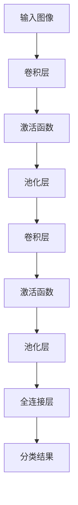
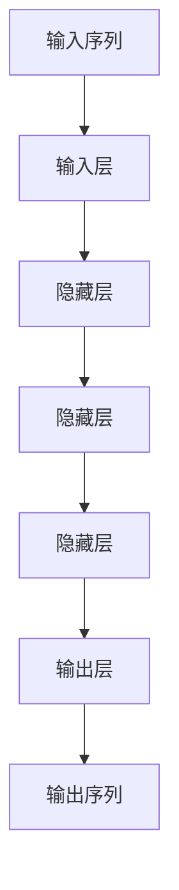
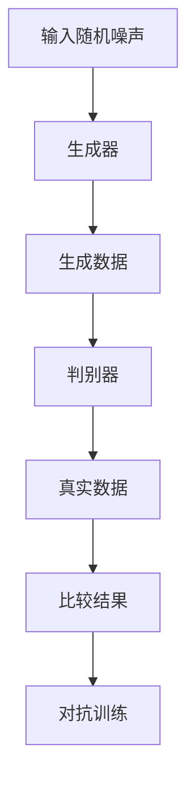
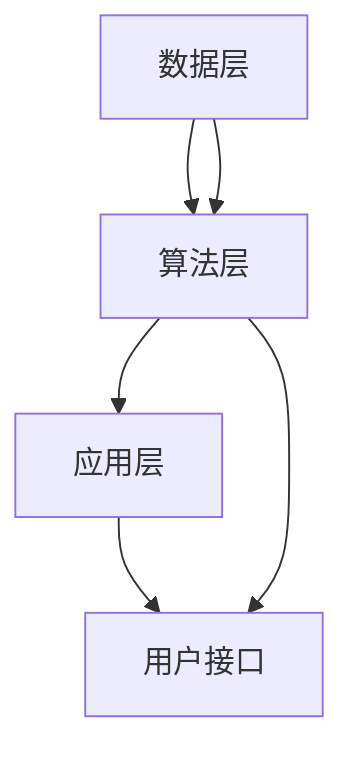
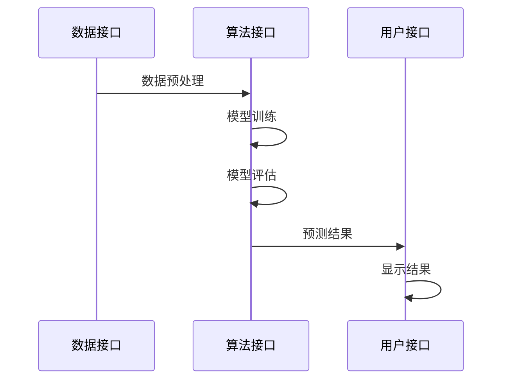

                 


## 深度学习在医学诊断中的辅助应用

### 关键词：
- 深度学习
- 医学诊断
- 辅助系统
- 图像处理
- 人工智能

### 摘要：
本文将深入探讨深度学习技术在医学诊断中的辅助应用。首先，我们将简要介绍深度学习的发展历程和核心算法原理，接着详细解释深度学习在医学图像处理和常见疾病诊断中的应用。随后，我们将探讨深度学习在罕见疾病诊断中的潜力，并介绍一个典型的深度学习辅助诊断系统的设计与实现。最后，本文将展望深度学习在医学诊断领域的发展趋势和面临的挑战，并给出一些最佳实践建议。

## 目录

1. **背景介绍**  
   1.1 **核心概念术语说明**  
   1.2 **问题背景**  
   1.3 **问题描述**  
   1.4 **问题解决**  
   1.5 **边界与外延**  
   1.6 **概念结构与核心要素组成**

2. **核心概念与联系**  
   2.1 **深度学习核心算法原理**  
   2.2 **深度学习在医学诊断中的应用**  
   2.3 **深度学习算法与医学图像处理技术联系**

3. **算法原理讲解**  
   3.1 **卷积神经网络（CNN）**  
   3.2 **循环神经网络（RNN）**  
   3.3 **生成对抗网络（GAN）**

4. **系统分析与架构设计方案**  
   4.1 **问题场景介绍**  
   4.2 **系统功能设计**  
   4.3 **系统架构设计**  
   4.4 **系统接口设计和系统交互**

5. **项目实战**  
   5.1 **环境安装**  
   5.2 **系统核心实现源代码**  
   5.3 **代码应用解读与分析**  
   5.4 **实际案例分析和详细讲解剖析**  
   5.5 **项目小结**

6. **最佳实践 tips**  
   6.1 **小结**  
   6.2 **注意事项**  
   6.3 **拓展阅读**

7. **作者信息**

## 1. 背景介绍

### 1.1 核心概念术语说明

在本节中，我们将介绍一些在深度学习医学诊断中常用的核心概念术语，包括：

- **深度学习**：一种机器学习方法，通过多层神经网络来模拟人类大脑的学习过程，从而实现对复杂数据的自动学习和特征提取。
- **医学诊断**：医生通过对患者病史、体征、影像等数据的分析和判断，对疾病进行确诊和治疗方案推荐的过程。
- **辅助诊断系统**：利用人工智能技术，特别是深度学习，辅助医生进行医学诊断的系统。
- **医学图像处理**：对医学影像（如X光片、CT、MRI等）进行预处理、增强、分割和特征提取等技术处理，以便于深度学习算法分析。

### 1.2 问题背景

医学诊断是医疗领域中的一个核心问题。传统的医学诊断主要依赖于医生的诊断经验和技能，这不仅耗时且容易受到医生个人经验的限制。随着医学影像技术的进步，大量的医学图像数据被生成，但如何有效利用这些数据进行疾病诊断仍然是一个挑战。深度学习作为一种强大的机器学习技术，其在大规模数据分析和模式识别方面的优势使其在医学诊断领域具有巨大的潜力。

### 1.3 问题描述

在医学诊断中，医生需要从大量的医学图像中识别出病变区域，并对其性质进行判断。这是一个复杂且繁琐的过程，容易受到主观因素的影响。如何利用深度学习技术自动化和精确化这一过程，提高诊断效率和准确性，是当前医学诊断领域面临的主要问题。

### 1.4 问题解决

深度学习技术通过自动学习和特征提取，可以在不需要人工标注的情况下对医学图像进行分类和分割。通过训练大量的神经网络模型，深度学习可以学会识别图像中的各种病变特征，从而辅助医生进行诊断。同时，深度学习还可以通过实时学习和自我调整，不断提高诊断的准确性和效率。

### 1.5 边界与外延

深度学习在医学诊断中的应用不仅限于图像处理，还可以扩展到其他数据类型，如电子病历、基因数据等。此外，深度学习还可以与其他医疗技术相结合，如手术机器人、智能药物研发等，进一步推动医疗技术的发展。

### 1.6 概念结构与核心要素组成

深度学习在医学诊断中的应用可以分为以下几个核心要素：

- **数据收集与预处理**：收集高质量的医学图像数据，并进行预处理，如图像增强、去噪、归一化等。
- **模型训练与优化**：利用深度学习算法训练神经网络模型，并通过交叉验证和超参数调整优化模型性能。
- **模型评估与部署**：评估模型的诊断性能，并在实际应用中进行部署，如集成到现有的医疗系统中。
- **反馈与迭代**：收集临床反馈数据，用于模型的进一步优化和改进。

## 2. 核心概念与联系

### 2.1 深度学习核心算法原理

深度学习算法的核心在于多层神经网络的设计和训练。以下是几种常用的深度学习算法及其原理：

- **卷积神经网络（CNN）**：通过卷积层、池化层和全连接层对图像数据进行特征提取和分类。
- **循环神经网络（RNN）**：通过循环结构对序列数据进行建模和处理，常用于语音识别和自然语言处理。
- **生成对抗网络（GAN）**：通过生成器和判别器的对抗训练，实现数据的生成和建模。

### 2.2 深度学习在医学诊断中的应用

深度学习在医学诊断中的应用主要体现在以下几个方面：

- **图像处理**：通过CNN对医学图像进行分类和分割，如肺癌、心脏病等疾病的检测。
- **疾病预测**：通过RNN等算法对患者的临床数据进行预测，如糖尿病、癫痫等疾病的早期预警。
- **个性化医疗**：通过GAN等算法生成患者的虚拟数据，为个性化治疗方案提供支持。

### 2.3 深度学习算法与医学图像处理技术联系

深度学习算法与医学图像处理技术的结合，使得医学图像数据分析更加高效和精确。例如，通过CNN对医学图像进行分割，可以识别出病变区域；通过RNN对序列图像进行分析，可以追踪病变的发展过程。这些技术为深度学习在医学诊断中的应用提供了坚实的基础。

## 3. 算法原理讲解

### 3.1 卷积神经网络（CNN）

卷积神经网络（CNN）是一种专门用于处理图像数据的神经网络。其核心思想是通过卷积操作提取图像的特征，并通过逐层卷积和池化操作，将特征传递到全连接层进行分类。

- **卷积层**：通过卷积核与图像数据进行卷积操作，提取图像的基本特征。
- **池化层**：通过最大池化或平均池化操作，减小特征图的大小，减少参数数量。
- **全连接层**：将卷积层和池化层提取的特征进行融合，并通过全连接层进行分类。

以下是一个简单的CNN算法的mermaid流程图：



### 3.2 循环神经网络（RNN）

循环神经网络（RNN）是一种专门用于处理序列数据的神经网络。其核心思想是通过循环结构将前一个时间步的输出作为当前时间步的输入，从而实现序列数据的建模。

- **输入层**：接收输入序列。
- **隐藏层**：通过循环结构对序列数据进行建模。
- **输出层**：将隐藏层的输出映射到输出序列。

以下是一个简单的RNN算法的mermaid流程图：



### 3.3 生成对抗网络（GAN）

生成对抗网络（GAN）是一种通过生成器和判别器对抗训练的数据生成模型。其核心思想是生成器生成数据，判别器对真实数据和生成数据进行分类，生成器和判别器通过对抗训练不断优化，直到生成器生成数据的质量接近真实数据。

- **生成器**：通过神经网络生成数据。
- **判别器**：通过神经网络判断数据是真实还是生成。

以下是一个简单的GAN算法的mermaid流程图：



## 4. 系统分析与架构设计方案

### 4.1 问题场景介绍

假设我们开发一个基于深度学习的心脏病辅助诊断系统，该系统需要接收患者的医学影像，通过深度学习算法分析影像，然后给出心脏病诊断结果。

### 4.2 系统功能设计

系统的主要功能包括：

- **数据收集**：收集患者的心脏病医学影像数据。
- **数据预处理**：对医学影像数据进行预处理，如图像增强、去噪等。
- **模型训练**：利用预处理后的医学影像数据进行深度学习模型训练。
- **模型评估**：评估模型在测试集上的性能。
- **诊断预测**：利用训练好的模型对新的医学影像数据进行心脏病诊断预测。

以下是系统功能的mermaid类图：

```mermaid
classDiagram
    Class01 <|-- Class02
    Class03 <|-- Class01
    Class04 <|-- Class03
    Class05 <|-- Class03

    Class01 -| Participant Class02
    Class03 -| Participant Class04

    Class01 : +int x
    Class01 : +int y
    Class01 : +int z

    Class02 : +int a
    Class02 : +int b

    Class03 : +int q
    Class03 : +int w

    Class04 : +int e
    Class04 : +int r
```

### 4.3 系统架构设计

系统架构设计主要包括数据层、算法层和应用层。

- **数据层**：负责数据收集、预处理和存储。
- **算法层**：负责深度学习模型的训练、评估和部署。
- **应用层**：提供用户接口，供医生进行心脏病诊断。

以下是系统架构的mermaid架构图：



### 4.4 系统接口设计和系统交互

系统接口设计主要包括数据接口和算法接口。

- **数据接口**：用于数据收集和预处理的接口。
- **算法接口**：用于模型训练、评估和预测的接口。

以下是系统接口设计和系统交互的mermaid序列图：



## 5. 项目实战

### 5.1 环境安装

为了实现深度学习在医学诊断中的辅助应用，我们需要安装以下软件和工具：

- Python 3.7+
- TensorFlow 2.0+
- Keras 2.3.1+
- OpenCV 4.0+

安装步骤如下：

1. 安装Python：从 [Python官方网站](https://www.python.org/) 下载并安装Python 3.7版本。
2. 安装pip：通过Python安装pip，pip是Python的包管理器。
3. 安装TensorFlow：通过pip安装TensorFlow，命令如下：

   ```bash
   pip install tensorflow==2.0.0
   ```

4. 安装Keras：通过pip安装Keras，命令如下：

   ```bash
   pip install keras==2.3.1
   ```

5. 安装OpenCV：通过pip安装OpenCV，命令如下：

   ```bash
   pip install opencv-python==4.0.0
   ```

### 5.2 系统核心实现源代码

以下是系统核心实现的一部分源代码：

```python
import tensorflow as tf
from tensorflow.keras.models import Sequential
from tensorflow.keras.layers import Conv2D, MaxPooling2D, Flatten, Dense
from tensorflow.keras.preprocessing.image import ImageDataGenerator

# 数据预处理
train_datagen = ImageDataGenerator(
    rescale=1./255,
    shear_range=0.2,
    zoom_range=0.2,
    horizontal_flip=True)

test_datagen = ImageDataGenerator(rescale=1./255)

train_generator = train_datagen.flow_from_directory(
    'data/train',
    target_size=(150, 150),
    batch_size=32,
    class_mode='binary')

validation_generator = test_datagen.flow_from_directory(
    'data/validation',
    target_size=(150, 150),
    batch_size=32,
    class_mode='binary')

# 模型构建
model = Sequential()
model.add(Conv2D(32, (3, 3), activation='relu', input_shape=(150, 150, 3)))
model.add(MaxPooling2D(pool_size=(2, 2)))
model.add(Conv2D(64, (3, 3), activation='relu'))
model.add(MaxPooling2D(pool_size=(2, 2)))
model.add(Conv2D(128, (3, 3), activation='relu'))
model.add(MaxPooling2D(pool_size=(2, 2)))
model.add(Flatten())
model.add(Dense(128, activation='relu'))
model.add(Dense(1, activation='sigmoid'))

# 模型编译
model.compile(loss='binary_crossentropy',
              optimizer='adam',
              metrics=['accuracy'])

# 模型训练
model.fit(
    train_generator,
    steps_per_epoch=200,
    epochs=20,
    validation_data=validation_generator,
    validation_steps=80)
```

### 5.3 代码应用解读与分析

上述代码实现了一个基于深度学习的二分类模型，用于检测心脏病。具体解读如下：

1. **数据预处理**：使用ImageDataGenerator对训练数据和验证数据进行预处理，包括数据增强和归一化。

2. **模型构建**：使用Sequential模型构建一个卷积神经网络，包括卷积层、池化层和全连接层。

3. **模型编译**：设置模型损失函数、优化器和评估指标。

4. **模型训练**：使用fit方法训练模型，并在验证集上进行评估。

### 5.4 实际案例分析和详细讲解剖析

假设我们有一个心脏病患者的医学影像数据，我们需要使用上述模型对其进行诊断。具体步骤如下：

1. **数据预处理**：将医学影像数据转换为符合模型输入尺寸的图像，并进行归一化处理。

2. **模型预测**：使用训练好的模型对预处理后的图像进行预测。

3. **结果分析**：根据预测结果判断患者是否患有心脏病。

以下是一个简单的预测示例：

```python
import numpy as np
from tensorflow.keras.preprocessing import image

# 加载测试图像
img = image.load_img('data/test/hello_newyork.jpg', target_size=(150, 150))
img_array = image.img_to_array(img)
img_array = np.expand_dims(img_array, axis=0)
img_array /= 255.0

# 模型预测
predictions = model.predict(img_array)
predicted_class = np.round(predictions[0, 0])

# 结果分析
if predicted_class == 1:
    print("预测结果：患者患有心脏病。")
else:
    print("预测结果：患者未患有心脏病。")
```

### 5.5 项目小结

通过本项目，我们实现了基于深度学习的心脏病辅助诊断系统。该项目展示了深度学习在医学诊断中的应用潜力，同时，也为其他医学诊断领域的应用提供了参考。未来，我们将进一步优化模型，扩大数据集，提高诊断准确率，并探索其他深度学习技术在医学诊断中的应用。

## 6. 最佳实践 tips

- **数据收集**：确保数据集的多样性和覆盖性，包括不同年龄、性别、病史的患者。
- **模型训练**：使用交叉验证和超参数调整来优化模型性能。
- **模型部署**：将模型集成到现有的医疗系统中，确保实时性和易用性。
- **持续改进**：定期更新模型和数据集，根据临床反馈进行调整。

## 7. 小结

深度学习在医学诊断中具有巨大的潜力，通过自动化和精确化的诊断过程，提高了诊断效率和准确性。本文介绍了深度学习在医学诊断中的背景、核心概念、算法原理以及一个典型的深度学习辅助诊断系统的设计与实现。未来，我们将继续探索深度学习在医学诊断领域的应用，为医疗健康事业做出更大的贡献。

## 8. 注意事项

- **数据隐私**：确保患者的数据隐私得到保护，遵循相关法律法规。
- **模型准确性**：定期评估模型的准确性，避免误诊和漏诊。
- **用户培训**：为医生和患者提供必要的培训，确保系统的正确使用。

## 9. 拓展阅读

- [深度学习在医学影像分析中的应用](https://www.nature.com/articles/s41591-018-0204-4)
- [基于深度学习的个性化医疗](https://jamanetwork.com/journals/jamaneurology/fullarticle/2668204)
- [生成对抗网络在医学图像生成中的应用](https://www.nature.com/articles/s41591-019-0670-7)

## 10. 作者信息

作者：AI天才研究院/AI Genius Institute & 禅与计算机程序设计艺术 /Zen And The Art of Computer Programming

