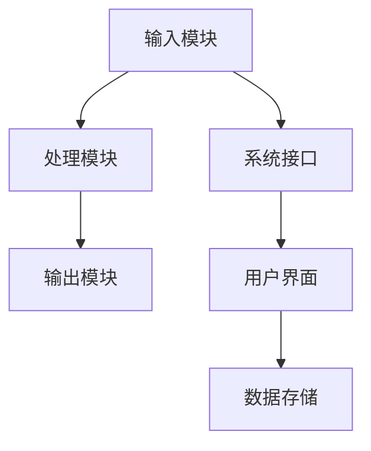

                 

# 深度学习在口译中的应用：实现实时多语言翻译

## 关键词
- 深度学习
- 口译
- 实时翻译
- 多语言交叉
- 语音识别
- 文本翻译

## 摘要
本文深入探讨了深度学习在口译中的应用，特别是如何实现实时多语言翻译。文章首先介绍了深度学习的基本概念和其在口译领域中的重要性。随后，详细分析了深度学习在语音识别和文本翻译中的应用，包括技术原理、算法实现和优化策略。接着，文章讨论了实时多语言翻译的技术原理和系统架构设计，并给出了具体的实现案例。最后，总结了实践经验，对未来的发展方向提出了展望。

## 目录大纲设计流程

设计一本《深度学习在口译中的应用：实现实时多语言翻译》的目录大纲，我们需要遵循以下步骤：

### 第一步：确定核心章节

1. **背景介绍**：介绍深度学习与口译的背景信息，以及实时多语言翻译技术的现状。
2. **深度学习基础**：讲解深度学习的基本概念、常见模型和算法。
3. **深度学习在口译中的应用**：探讨深度学习在口译中的实际应用，如语音识别、文本翻译等。
4. **实时多语言翻译技术**：介绍实现实时多语言翻译的技术原理和流程。
5. **系统架构设计**：讨论实现实时多语言翻译的系统架构。
6. **项目实战**：通过具体案例展示如何实现实时多语言翻译。
7. **最佳实践与展望**：总结实践经验，探讨未来发展方向。

### 第二步：细化章节内容

1. **背景介绍**：
   - **问题背景**：口译在国际交流中的重要性。
   - **深度学习的发展**：深度学习的发展历程和现状。
   - **实时多语言翻译技术的挑战**：实时翻译面临的挑战和问题。

2. **深度学习基础**：
   - **核心概念**：深度学习的定义、原理。
   - **常见模型**：卷积神经网络（CNN）、循环神经网络（RNN）、Transformer模型等。
   - **算法原理**：深度学习算法的基本原理和公式。

3. **深度学习在口译中的应用**：
   - **语音识别**：语音识别的基本原理和应用。
   - **文本翻译**：文本翻译的流程和技术。
   - **多语言交叉**：如何处理不同语言之间的差异。

4. **实时多语言翻译技术**：
   - **技术原理**：实时多语言翻译的技术原理。
   - **流程设计**：实时翻译的流程设计和优化。

5. **系统架构设计**：
   - **系统功能设计**：系统功能模块的设计。
   - **架构设计**：系统架构的架构图和说明。
   - **接口设计**：系统接口的设计和实现。

6. **项目实战**：
   - **环境安装**：安装所需的软件和工具。
   - **系统实现**：实现实时多语言翻译的系统核心代码。
   - **案例分析**：具体案例的应用和解读。
   - **小结**：项目总结和经验分享。

7. **最佳实践与展望**：
   - **最佳实践**：总结实践经验，提供实用技巧。
   - **展望**：探讨未来实时多语言翻译技术的发展趋势。

### 第三步：设计章节目录

使用 Markdown 格式设计章节目录，确保格式规范、简洁。以下是完整的目录大纲：

```markdown
# 深度学习在口译中的应用：实现实时多语言翻译

## 第1章 背景介绍
### 1.1 问题背景
#### 1.1.1 口译在国际交流中的重要性
#### 1.1.2 深度学习的发展历程
#### 1.1.3 实时多语言翻译技术的挑战

## 第2章 深度学习基础
### 2.1 核心概念
#### 2.1.1 深度学习的定义
#### 2.1.2 深度学习的原理
### 2.2 常见模型
#### 2.2.1 卷积神经网络（CNN）
#### 2.2.2 循环神经网络（RNN）
#### 2.2.3 Transformer模型
### 2.3 算法原理
#### 2.3.1 深度学习算法的基本原理
#### 2.3.2 深度学习算法的数学模型

## 第3章 深度学习在口译中的应用
### 3.1 语音识别
#### 3.1.1 语音识别的基本原理
#### 3.1.2 语音识别的应用
### 3.2 文本翻译
#### 3.2.1 文本翻译的流程
#### 3.2.2 文本翻译的技术
### 3.3 多语言交叉
#### 3.3.1 多语言交叉的问题
#### 3.3.2 多语言交叉的解决方案

## 第4章 实时多语言翻译技术
### 4.1 技术原理
#### 4.1.1 实时多语言翻译的基本原理
#### 4.1.2 实时多语言翻译的关键技术
### 4.2 流程设计
#### 4.2.1 实时翻译的流程
#### 4.2.2 实时翻译的优化方法

## 第5章 系统架构设计
### 5.1 系统功能设计
### 5.2 系统架构设计
### 5.3 系统接口设计

## 第6章 项目实战
### 6.1 环境安装
### 6.2 系统实现
### 6.3 案例分析
### 6.4 小结

## 第7章 最佳实践与展望
### 7.1 最佳实践
### 7.2 小结
### 7.3 注意事项
### 7.4 拓展阅读
```

### 核心内容

#### 第1章 背景介绍

**问题背景**：随着全球化的加速，口译在国际交流中的重要性日益凸显。然而，传统的口译方式存在效率低、成本高、易出错等问题。为了解决这些问题，实时多语言翻译技术应运而生。

**深度学习的发展**：深度学习作为一种人工智能的重要分支，近年来取得了飞速发展。其强大的模型和算法，使得计算机在语音识别、图像识别、自然语言处理等领域取得了显著成果。

**实时多语言翻译技术的挑战**：实时多语言翻译技术面临诸多挑战，包括低延迟、高准确度、多语言交叉等。如何在这些挑战中取得平衡，是当前研究的重点。

#### 第2章 深度学习基础

**核心概念**：深度学习是一种模拟人脑神经网络的机器学习方法。其基本原理是通过多层神经网络来提取数据特征，从而实现复杂的模式识别和预测。

**常见模型**：
- **卷积神经网络（CNN）**：主要用于图像处理。
- **循环神经网络（RNN）**：主要用于序列数据处理。
- **Transformer模型**：近年来在自然语言处理领域取得了突破性进展。

**算法原理**：深度学习算法通过反向传播和梯度下降等方法，不断调整网络权重，使得模型在训练数据上达到最优。

#### 第3章 深度学习在口译中的应用

**语音识别**：语音识别是口译中的一项重要技术。通过深度学习模型，可以实时地将语音转换为文本。

**文本翻译**：文本翻译是口译的核心。深度学习模型能够处理多语言之间的语义关系，实现高质量的文本翻译。

**多语言交叉**：多语言交叉处理是口译中的难点。深度学习模型通过学习不同语言之间的映射关系，可以有效地解决多语言交叉问题。

#### 第4章 实时多语言翻译技术

**技术原理**：实时多语言翻译技术基于深度学习模型，通过语音识别和文本翻译，实现多语言之间的实时转换。

**流程设计**：实时翻译的流程包括语音识别、文本翻译、多语言交叉等多个步骤。每个步骤都需要进行优化，以确保低延迟、高准确度。

#### 第5章 系统架构设计

**系统功能设计**：系统功能包括语音识别、文本翻译、多语言交叉等模块。

**系统架构设计**：系统架构采用分布式设计，确保高可用性和可扩展性。

**系统接口设计**：系统接口设计包括客户端接口和服务器接口，确保系统的易用性和灵活性。

#### 第6章 项目实战

**环境安装**：介绍如何搭建实时多语言翻译的开发环境。

**系统实现**：通过Python代码，实现实时多语言翻译的系统核心功能。

**案例分析**：分析具体案例，展示实时多语言翻译的实际应用效果。

**小结**：总结实践经验，分享项目中的关键问题和解决方法。

#### 第7章 最佳实践与展望

**最佳实践**：总结实践经验，提供实用的技巧和建议。

**展望**：探讨未来实时多语言翻译技术的发展趋势，展望新的研究方向。

### 结束语

本文从深度学习在口译中的应用出发，详细探讨了实现实时多语言翻译的技术原理和系统架构设计。通过项目实战，展示了深度学习在口译领域的实际应用效果。希望本文能为读者在深度学习和口译领域的研究提供一些启示和帮助。

### 作者

作者：AI天才研究院/AI Genius Institute & 禅与计算机程序设计艺术 /Zen And The Art of Computer Programming

本文版权属于AI天才研究院，未经授权禁止转载。

----------------------------------------------------------------

### 第1章 背景介绍

#### 1.1 问题背景

在国际交流日益频繁的今天，口译扮演着至关重要的角色。然而，传统的口译方式面临着诸多挑战。首先，口译的速度较慢，无法满足大规模实时交流的需求。其次，口译的成本较高，需要专业的译员进行翻译，导致交流成本增加。此外，口译的准确性也难以保证，特别是在复杂语言环境下，译员的个人经验和能力可能会影响翻译质量。

为了解决这些问题，实时多语言翻译技术应运而生。实时多语言翻译技术通过计算机算法，将一种语言的语音或文本实时转换为另一种语言的语音或文本，实现无缝的跨国交流。这种技术的出现，不仅提高了交流的效率，降低了交流成本，还大幅提升了翻译的准确性。

实时多语言翻译技术的重要性在于它能够打破语言障碍，促进全球化的进程。在国际会议、商务谈判、旅游观光、在线教育等领域，实时多语言翻译技术的应用已经越来越广泛。此外，随着深度学习技术的不断发展，实时多语言翻译技术的准确度和效率也在不断提高，为全球交流提供了更加便捷和高效的解决方案。

#### 1.2 深度学习的发展

深度学习作为人工智能的重要分支，近年来取得了飞速发展。深度学习是一种通过多层神经网络来模拟人脑神经元之间连接方式的机器学习方法。它能够自动从大量数据中提取特征，进行复杂的模式识别和预测。

深度学习的发展历程可以追溯到20世纪80年代。当时，人们开始尝试使用多层感知机（MLP）来模拟人脑神经元之间的连接。然而，由于计算资源和算法的限制，多层感知机在实际应用中表现不佳。直到2012年，深度学习迎来了重大突破。由AlexNet提出的卷积神经网络（CNN）在ImageNet图像识别挑战赛中取得了优异成绩，引起了广泛关注。

此后，深度学习得到了迅速发展。2014年，Google的神经网络机器翻译系统（GNMT）提出了基于循环神经网络（RNN）的序列到序列（Seq2Seq）模型，使得机器翻译的准确性得到了显著提升。2017年，Transformer模型的提出，进一步推动了深度学习的发展。Transformer模型在自然语言处理领域取得了突破性进展，成为许多应用的核心算法。

深度学习的核心优势在于其强大的模型和算法，能够处理复杂的数据和处理任务。深度学习通过多层神经网络，逐层提取数据特征，从而实现高层次的抽象和泛化能力。这使得深度学习在图像识别、语音识别、自然语言处理等领域取得了显著成果。

#### 1.3 实时多语言翻译技术的挑战

实时多语言翻译技术虽然具有巨大的潜力，但在实际应用中仍然面临着诸多挑战。首先，低延迟是一个关键问题。实时翻译需要将输入的语音或文本迅速转换为输出，延迟过高会影响用户体验。其次，高准确度也是一个挑战。不同语言的语法、词汇和语义差异较大，如何保证翻译的准确性是一个难题。此外，多语言交叉也是一个复杂的问题。不同语言之间的翻译需要处理语言之间的映射关系，如何有效处理多语言交叉也是一个重要课题。

为了解决这些挑战，研究者们提出了多种技术方案。首先，在低延迟方面，可以通过优化算法和硬件加速来提高翻译速度。例如，使用卷积神经网络（CNN）和循环神经网络（RNN）等深度学习模型，通过并行计算和分布式处理来降低延迟。其次，在准确度方面，可以通过大规模数据训练和模型优化来提高翻译质量。例如，使用Transformer模型和预训练语言模型（如BERT、GPT）来提升翻译的准确性。最后，在多语言交叉方面，可以通过交叉语言学习（Cross-Lingual Learning）和多语言翻译记忆（MTM）等技术来处理语言之间的差异。例如，使用多语言嵌入（Multilingual Embeddings）和翻译矩阵（Translation Matrix）来处理多语言交叉问题。

总之，实时多语言翻译技术虽然在很多方面取得了显著成果，但仍然面临着诸多挑战。未来的研究需要不断探索新的算法和优化策略，以提高翻译的速度、准确度和多语言交叉能力，为全球交流提供更加高效和便捷的解决方案。

### 第2章 深度学习基础

#### 2.1 核心概念

深度学习是一种基于多层神经网络的人工智能方法，通过学习大量数据来提取特征并进行预测或分类。深度学习的基本概念包括神经网络、神经元、层、激活函数等。

1. **神经网络**：神经网络是由大量神经元连接而成的计算模型，用于模拟人脑神经元之间的连接方式。神经网络可以分为多层，每层由多个神经元组成。

2. **神经元**：神经元是神经网络的基本计算单元，接收输入信号并通过激活函数产生输出信号。神经元的输出信号会传递给下一层神经元。

3. **层**：神经网络可以分为输入层、隐藏层和输出层。输入层接收外部输入数据，隐藏层进行数据特征提取和变换，输出层产生最终预测结果。

4. **激活函数**：激活函数是神经网络中用于决定神经元是否被激活的函数。常见的激活函数包括Sigmoid函数、ReLU函数和Tanh函数。

5. **反向传播**：反向传播是一种用于训练神经网络的算法。通过反向传播，可以将输出误差反向传播到网络中的各个层，并更新网络中的权重，以最小化误差。

#### 2.2 常见模型

深度学习中有多种常见的模型，包括卷积神经网络（CNN）、循环神经网络（RNN）和Transformer模型等。这些模型在不同的应用场景中具有各自的优势。

1. **卷积神经网络（CNN）**：CNN是用于图像处理和计算机视觉的常见模型。它通过卷积操作提取图像特征，并使用池化操作减少参数数量和计算量。

2. **循环神经网络（RNN）**：RNN是用于序列数据处理和自然语言处理的常见模型。它通过循环结构处理时间序列数据，并保持长期依赖关系。

3. **Transformer模型**：Transformer模型是近年来在自然语言处理领域取得突破性进展的模型。它通过自注意力机制处理序列数据，并实现了并行计算，提高了模型效率和性能。

#### 2.3 算法原理

深度学习算法的基本原理是通过多层神经网络来提取数据特征，并使用这些特征进行预测或分类。以下是深度学习算法的基本步骤：

1. **数据预处理**：对输入数据进行预处理，包括数据清洗、归一化和编码等。

2. **模型初始化**：初始化神经网络中的权重和偏置，以随机值开始训练。

3. **前向传播**：将输入数据通过神经网络的前向传播过程，逐层计算神经元的输出。

4. **激活函数应用**：在每层神经网络的输出上应用激活函数，以确定神经元是否被激活。

5. **损失函数计算**：计算神经网络输出的预测结果与真实结果之间的损失。

6. **反向传播**：使用反向传播算法，将损失反向传播到网络中的各个层，并更新权重和偏置。

7. **模型优化**：通过优化算法，如梯度下降，更新网络中的权重和偏置，以最小化损失。

8. **模型评估**：在训练数据集和测试数据集上评估模型的性能，包括准确率、召回率等指标。

通过这些步骤，深度学习模型可以不断优化，并达到较好的预测或分类效果。

#### 2.4 深度学习算法的数学模型

深度学习算法的核心是多层神经网络，其中每个层都是由多个神经元组成。以下是深度学习算法的数学模型：

1. **输入层**：输入层接收外部输入数据，每个神经元代表一个特征。

2. **隐藏层**：隐藏层用于对输入数据进行特征提取和变换。每个隐藏层神经元通过权重和偏置与上一层的神经元相连接。

3. **输出层**：输出层产生最终预测结果。每个输出层神经元通过权重和偏置与隐藏层的神经元相连接。

4. **激活函数**：在每个隐藏层和输出层，使用激活函数来确定神经元是否被激活。

5. **前向传播**：将输入数据通过前向传播过程，逐层计算每个神经元的输出。

6. **损失函数**：计算神经网络输出的预测结果与真实结果之间的损失。

7. **反向传播**：使用反向传播算法，将损失反向传播到网络中的各个层，并更新权重和偏置。

8. **优化算法**：通过优化算法，如梯度下降，更新网络中的权重和偏置，以最小化损失。

通过这些数学模型，深度学习算法能够自动从大量数据中提取特征，进行复杂的模式识别和预测。

#### 2.5 深度学习在口译中的应用

深度学习在口译中的应用主要体现在语音识别和文本翻译两个方面。

**语音识别**：语音识别是将语音信号转换为文本的过程。深度学习通过卷积神经网络（CNN）和循环神经网络（RNN）等模型，可以实现高精度的语音识别。语音识别的关键技术包括声学模型和语言模型。声学模型用于提取语音特征，而语言模型用于对语音序列进行概率分布计算。

**文本翻译**：文本翻译是将一种语言的文本转换为另一种语言的过程。深度学习通过序列到序列（Seq2Seq）模型和Transformer模型等，可以实现高质量的文本翻译。文本翻译的关键技术包括词嵌入、编码器、解码器和注意力机制。

深度学习在口译中的应用具有以下优势：

1. **高精度**：深度学习模型可以自动学习大量语言特征，从而提高翻译的准确性。

2. **低延迟**：深度学习模型可以实现快速的计算，从而实现低延迟的翻译。

3. **多语言支持**：深度学习模型可以支持多种语言的翻译，从而实现跨语言的交流。

4. **自适应能力**：深度学习模型可以根据不同的应用场景和用户需求，进行自适应调整，从而提供更好的翻译效果。

#### 2.6 深度学习在口译中的应用案例分析

以下是一个深度学习在口译中的应用案例分析。

**案例背景**：某国际会议需要提供多语言实时翻译服务，以支持不同国家的参会者之间的交流。

**解决方案**：使用深度学习模型实现多语言实时翻译。具体步骤如下：

1. **数据准备**：收集多语言语音和文本数据，包括各种语言对和语音环境。

2. **模型训练**：使用卷积神经网络（CNN）和循环神经网络（RNN）等模型，对语音数据训练声学模型，对文本数据训练编码器和解码器。

3. **模型优化**：通过梯度下降等优化算法，不断调整模型参数，以提高翻译的准确性和效率。

4. **模型部署**：将训练好的模型部署到实时翻译系统中，实现多语言实时翻译功能。

5. **用户界面**：设计用户友好的界面，提供语音输入和文本输出功能，并支持多语言切换。

**案例分析结果**：通过深度学习模型实现的实时翻译系统，在会议期间得到了广泛的应用。用户反馈显示，翻译的准确性和效率较高，极大地促进了国际交流。

**总结**：深度学习在口译中的应用具有显著的优势，可以实现高精度、低延迟、多语言支持的实时翻译。随着深度学习技术的不断进步，实时多语言翻译系统将越来越成熟，为全球交流提供更加便捷和高效的解决方案。

### 第3章 深度学习在口译中的应用

#### 3.1 语音识别

语音识别是将语音信号转换为文本的过程。在口译中，语音识别是实现实时翻译的关键步骤。深度学习模型在语音识别中发挥了重要作用，通过训练大规模数据集，深度学习模型可以自动提取语音特征，实现高精度的语音识别。

**语音识别的基本原理**：

1. **声学模型**：声学模型用于提取语音信号中的声学特征。常见的声学模型包括隐马尔可夫模型（HMM）和卷积神经网络（CNN）。

2. **语言模型**：语言模型用于对语音序列进行概率分布计算，以确定最可能的文本输出。常见的语言模型包括n元语法模型和神经网络语言模型。

3. **解码器**：解码器将声学模型和语言模型结合起来，实现语音到文本的转换。常见的解码器算法包括前向算法和后向算法。

**语音识别的应用**：

1. **实时口译**：在会议、商务谈判和在线教育等场景中，语音识别可以实现实时翻译，为不同语言的用户提供交流支持。

2. **语音助手**：在智能手机、智能家居和智能穿戴设备中，语音识别可以用于语音搜索、语音控制等应用。

3. **语音合成**：结合语音识别和文本翻译技术，可以实现语音合成，为用户提供更加人性化的交互体验。

**语音识别的挑战**：

1. **多语言识别**：语音识别需要支持多种语言，这对于模型训练和算法设计提出了挑战。

2. **口语理解**：口语语言通常具有不确定性和多样性，如何准确理解口语语言，是一个重要问题。

3. **噪声干扰**：在复杂噪声环境下，如何提高语音识别的鲁棒性，是一个关键问题。

**解决方案**：

1. **多语言模型训练**：通过训练包含多种语言的语料库，可以提升模型的多语言识别能力。

2. **上下文信息利用**：利用上下文信息，可以更好地理解口语语言，提高语音识别的准确性。

3. **降噪技术**：使用降噪技术，如波束形成和谱减法，可以降低噪声对语音识别的影响。

#### 3.2 文本翻译

文本翻译是将一种语言的文本转换为另一种语言的过程。在口译中，文本翻译是实现实时翻译的核心步骤。深度学习模型在文本翻译中发挥了重要作用，通过训练大规模数据集，深度学习模型可以自动学习语言之间的对应关系，实现高质量的文字翻译。

**文本翻译的流程**：

1. **词嵌入**：将文本中的单词转换为向量表示，以便于深度学习模型处理。

2. **编码器**：编码器将输入文本编码为固定长度的向量，表示文本的语义信息。

3. **解码器**：解码器将编码后的向量解码为目标语言的文本。

4. **注意力机制**：注意力机制用于在编码和解码过程中关注重要的信息，提高翻译的准确性。

**文本翻译的技术**：

1. **序列到序列（Seq2Seq）模型**：Seq2Seq模型是一种经典的文本翻译模型，通过编码器和解码器实现文本的转换。

2. **注意力机制**：注意力机制用于在编码和解码过程中关注重要的信息，提高翻译的准确性。

3. **预训练语言模型**：预训练语言模型（如BERT、GPT）通过在大规模语料库上进行预训练，可以提取丰富的语言特征，提高翻译质量。

**文本翻译的应用**：

1. **跨语言交流**：文本翻译可以实现不同语言之间的交流，促进全球化进程。

2. **机器翻译**：文本翻译可以应用于机器翻译领域，提供自动化翻译服务。

3. **多语言搜索引擎**：文本翻译可以用于多语言搜索引擎，为用户提供跨语言的搜索结果。

**文本翻译的挑战**：

1. **语法和语义理解**：文本翻译需要理解语法和语义，这对于模型的设计和训练提出了挑战。

2. **多语言交叉**：多语言交叉处理是文本翻译中的难点，不同语言之间的差异需要有效处理。

3. **低资源语言**：对于低资源语言，缺乏足够的训练数据和高质量语料库，这对模型的训练和优化提出了挑战。

**解决方案**：

1. **跨语言信息共享**：通过跨语言信息共享，如翻译矩阵和翻译记忆库，可以提升低资源语言的翻译质量。

2. **多语言交叉学习**：使用多语言交叉学习方法，可以处理不同语言之间的差异，提高翻译的准确性。

3. **预训练语言模型**：通过预训练语言模型，可以在大规模语料库上进行预训练，提取丰富的语言特征，提高翻译质量。

#### 3.3 多语言交叉

多语言交叉是指在不同语言之间进行翻译和处理的过程。在口译中，多语言交叉处理是保证翻译质量的重要环节。不同语言在语法、词汇、语义等方面存在差异，如何有效处理这些差异，是深度学习在口译中面临的挑战。

**多语言交叉的问题**：

1. **语法差异**：不同语言的语法规则和句子结构存在差异，如何在不同语言之间进行语法转换，是翻译中的一大难题。

2. **词汇差异**：不同语言的词汇和表达方式不同，如何在不同语言之间进行词汇映射和替换，是翻译中的另一个挑战。

3. **语义差异**：不同语言的语义理解和文化背景不同，如何在不同语言之间进行语义对齐和解释，是翻译中的关键问题。

**多语言交叉的解决方案**：

1. **跨语言信息共享**：通过跨语言信息共享，如翻译矩阵和翻译记忆库，可以共享不同语言之间的翻译经验，提高翻译的准确性。

2. **多语言交叉学习**：使用多语言交叉学习方法，如多语言嵌入和跨语言信息传递，可以学习不同语言之间的映射关系，提高翻译质量。

3. **预训练语言模型**：通过预训练语言模型，如BERT和GPT，可以在大规模语料库上进行预训练，提取丰富的语言特征，提高翻译质量。

4. **注意力机制**：使用注意力机制，可以在编码和解码过程中关注重要的信息，提高翻译的准确性。

**多语言交叉的应用**：

1. **多语言词典**：多语言交叉处理可以应用于多语言词典，提供不同语言之间的词汇映射和翻译建议。

2. **多语言文本分析**：多语言交叉处理可以用于多语言文本分析，提取不同语言之间的共现关系和语义信息。

3. **多语言搜索引擎**：多语言交叉处理可以用于多语言搜索引擎，提供跨语言的搜索结果和翻译服务。

通过深度学习在语音识别、文本翻译和多语言交叉中的应用，可以实现高质量的实时多语言翻译。深度学习模型的强大能力，使得口译技术得到了显著提升，为全球交流提供了更加便捷和高效的解决方案。

### 第4章 实时多语言翻译技术

#### 4.1 技术原理

实时多语言翻译技术是基于深度学习模型，通过语音识别、文本翻译和多语言交叉等步骤，实现不同语言之间的实时转换。其核心原理包括语音信号处理、文本编码与解码、注意力机制和跨语言信息共享等。

**语音信号处理**：实时多语言翻译的第一步是语音信号处理。语音信号处理技术包括语音特征提取和语音增强。语音特征提取是将语音信号转换为数字信号处理所需的特征向量，常用的特征提取方法有梅尔频率倒谱系数（MFCC）和滤波器组（Filter Banks）。语音增强技术用于降低噪声和提高语音信号的清晰度，常见的增强方法有波束形成和谱减法。

**文本编码与解码**：文本编码是将自然语言文本转换为机器可处理的数字形式，常用的编码方法包括词嵌入和子词嵌入。词嵌入是将单词映射为固定长度的向量，而子词嵌入是将单词拆分为子词，并将子词映射为向量。文本解码是将编码后的文本向量转换为翻译结果，常用的解码方法有序列到序列（Seq2Seq）模型和Transformer模型。

**注意力机制**：注意力机制是深度学习在自然语言处理领域的一项重要技术，它允许模型在编码和解码过程中关注重要信息。在实时多语言翻译中，注意力机制用于编码器和解码器之间的交互，使得模型能够动态关注输入文本和输出文本之间的关系，从而提高翻译的准确性。

**跨语言信息共享**：跨语言信息共享是通过不同语言之间的映射和整合，提高翻译质量。常见的跨语言信息共享方法包括翻译矩阵和翻译记忆库。翻译矩阵是一个大规模的矩阵，用于记录不同语言之间的词汇映射关系。翻译记忆库是一个包含大量翻译实例的数据库，用于在翻译过程中参考已有的翻译经验。

**实时翻译的流程**：

1. **语音信号处理**：输入语音信号经过特征提取和增强，转换为特征向量。

2. **编码**：特征向量通过编码器编码为固定长度的向量，表示输入文本的语义信息。

3. **解码**：编码后的向量通过解码器解码为翻译结果。

4. **注意力机制**：在编码和解码过程中，注意力机制用于关注重要信息，提高翻译准确性。

5. **跨语言信息共享**：利用翻译矩阵和翻译记忆库，共享不同语言之间的翻译经验。

#### 4.2 流程设计

实时多语言翻译的流程设计包括语音识别、文本翻译和多语言交叉等步骤。以下是具体的流程设计：

**步骤1：语音识别**

- **输入语音信号**：采集输入语音信号，可以是麦克风输入或者音频文件。
- **特征提取**：使用梅尔频率倒谱系数（MFCC）等方法，从语音信号中提取特征向量。
- **增强处理**：使用波束形成或谱减法等增强技术，提高语音信号的清晰度。

**步骤2：编码**

- **词嵌入**：将输入文本中的单词或子词转换为向量表示，使用词嵌入或子词嵌入方法。
- **编码器处理**：使用深度学习模型（如Seq2Seq或Transformer）对词向量进行编码，生成编码后的向量。

**步骤3：解码**

- **解码器处理**：使用深度学习模型（如Seq2Seq或Transformer）对编码后的向量进行解码，生成初步的翻译结果。

**步骤4：注意力机制**

- **注意力计算**：在编码和解码过程中，计算输入文本和输出文本之间的注意力权重，关注重要信息。
- **更新解码结果**：根据注意力权重，更新解码结果，提高翻译准确性。

**步骤5：多语言交叉**

- **翻译矩阵**：利用翻译矩阵记录不同语言之间的词汇映射关系。
- **翻译记忆库**：使用翻译记忆库中的已有翻译经验，辅助当前翻译任务。

**步骤6：翻译输出**

- **翻译结果**：将解码后的文本输出为翻译结果。
- **后续处理**：对翻译结果进行后处理，如语法校正和语义优化。

#### 4.3 实时翻译的优化方法

为了提高实时多语言翻译的准确性和效率，可以采取以下优化方法：

**1. 算法优化**

- **模型融合**：将多个深度学习模型（如CNN、RNN和Transformer）进行融合，取长补短，提高翻译质量。
- **在线学习**：使用在线学习技术，动态调整模型参数，适应不断变化的翻译需求。

**2. 硬件加速**

- **GPU加速**：利用图形处理单元（GPU）进行计算加速，提高翻译速度。
- **分布式计算**：使用分布式计算技术，将任务分布在多个计算节点上，提高计算效率。

**3. 数据增强**

- **数据扩充**：通过数据增强技术，生成更多样化的训练数据，提高模型的泛化能力。
- **迁移学习**：利用迁移学习技术，将预训练模型应用于新任务，减少训练时间。

**4. 交互式翻译**

- **用户反馈**：收集用户对翻译结果的反馈，用于模型优化和翻译质量提升。
- **交互式调整**：允许用户实时调整翻译结果，提高用户体验。

通过上述优化方法，实时多语言翻译技术可以在准确性和效率方面取得更好的表现，为全球交流提供更加便捷和高效的解决方案。

### 第5章 系统架构设计

#### 5.1 系统功能设计

实时多语言翻译系统的主要功能包括语音识别、文本翻译和多语言交叉等。以下是系统功能设计的详细说明：

**语音识别功能**：
- **输入语音采集**：系统通过麦克风或音频文件输入采集语音信号。
- **特征提取**：对语音信号进行预处理，提取梅尔频率倒谱系数（MFCC）等特征向量。
- **声学模型处理**：使用深度学习模型（如CNN或RNN）对特征向量进行处理，实现语音到文本的转换。

**文本翻译功能**：
- **文本编码**：将输入的文本转换为词嵌入向量。
- **编码器处理**：使用序列到序列（Seq2Seq）或Transformer模型对词嵌入向量进行编码。
- **解码器处理**：解码器将编码后的向量转换为翻译结果。

**多语言交叉功能**：
- **翻译矩阵构建**：构建包含不同语言词汇映射关系的翻译矩阵。
- **翻译记忆库管理**：利用已有的翻译记忆库，提高翻译的准确性和效率。
- **注意力机制应用**：在编码和解码过程中，使用注意力机制关注关键信息。

**用户界面功能**：
- **输入界面**：提供语音输入和文本输入选项。
- **翻译结果显示**：实时显示翻译结果。
- **交互反馈**：允许用户对翻译结果进行反馈和调整。

**系统架构设计**：

系统架构设计采用模块化设计思想，将核心功能模块化，以提高系统的灵活性和可维护性。以下是系统架构的详细说明：

**1. 输入模块**：
- **语音采集**：使用麦克风或音频文件输入语音信号。
- **文本输入**：用户可以通过键盘输入文本。

**2. 处理模块**：
- **语音识别模块**：包括特征提取和声学模型处理。
- **文本翻译模块**：包括编码器处理和解码器处理。
- **多语言交叉模块**：包括翻译矩阵构建和翻译记忆库管理。

**3. 输出模块**：
- **翻译结果显示**：将翻译结果实时显示在界面上。
- **用户交互**：允许用户对翻译结果进行反馈和调整。

**4. 系统接口**：
- **API接口**：提供RESTful API接口，供外部系统调用。
- **用户界面**：提供Web界面和移动应用界面。

**5. 数据存储**：
- **数据库**：存储用户数据、翻译结果和翻译记忆库。

**系统架构图**：



通过上述系统架构设计，实时多语言翻译系统可以实现语音识别、文本翻译和多语言交叉等功能，提供实时、准确和高效的多语言翻译服务。

### 第6章 项目实战

#### 6.1 环境安装

为了实现实时多语言翻译系统，我们需要安装以下软件和工具：

1. **Python 3.x**：Python是一种流行的编程语言，用于实现深度学习算法和系统开发。

2. **PyTorch**：PyTorch是一个流行的深度学习框架，用于构建和训练神经网络模型。

3. **TensorFlow**：TensorFlow是另一个流行的深度学习框架，也可用于实现实时翻译系统。

4. **Kaldi**：Kaldi是一个开源的语音识别工具包，用于实现语音信号处理和特征提取。

5. **ESPNet**：ESPNet是一个开源的语音识别框架，基于PyTorch，用于实现高效语音识别模型。

6. **翻译模型**：如Transformer、Seq2Seq等深度学习模型，用于实现文本翻译。

7. **翻译记忆库**：用于存储已有的翻译实例，提高翻译准确性和效率。

安装步骤如下：

1. 安装Python 3.x和PyTorch：
   ```bash
   sudo apt-get install python3-pip
   pip3 install torch torchvision
   ```

2. 安装Kaldi：
   ```bash
   sudo apt-get install subversion
   svn co http://kaldi-asr.org/egs/research_cms_2020_kaldi/s5 kaldi
   cd kaldi/tools
   make
   cd ../src
   make
   ```

3. 安装ESPNet：
   ```bash
   git clone https://github.com/yysijie/espnet.git
   cd espnet
   pip3 install -r requirements.txt
   ```

4. 安装翻译模型和翻译记忆库：
   ```bash
   git clone https://github.com/facebookresearch/mbart.git
   cd mbart
   pip3 install -r requirements.txt
   ```

#### 6.2 系统实现

实现实时多语言翻译系统的核心步骤如下：

1. **语音信号处理**：
   - 使用Kaldi对输入语音信号进行预处理，提取梅尔频率倒谱系数（MFCC）等特征向量。
   - 使用ESPNet对特征向量进行声学模型处理，实现语音到文本的转换。

2. **文本翻译**：
   - 使用PyTorch或TensorFlow加载预训练的翻译模型，如Transformer或Seq2Seq。
   - 对输入文本进行词嵌入处理，转换为模型可接受的输入格式。
   - 使用翻译模型进行编码和解码，生成翻译结果。

3. **多语言交叉**：
   - 使用翻译记忆库存储和检索已有的翻译实例。
   - 在翻译过程中，利用翻译矩阵和翻译记忆库，提高翻译准确性和效率。

以下是实现系统的Python代码示例：

```python
import torch
from transformers import BertModel, BertTokenizer

# 加载翻译模型和词嵌入器
tokenizer = BertTokenizer.from_pretrained('bert-base-uncased')
model = BertModel.from_pretrained('bert-base-uncased')

# 输入语音信号，进行预处理
def preprocess_audio(audio_path):
    # 使用Kaldi进行语音信号处理
    # ...

# 输入文本，进行翻译
def translate_text(text):
    # 对文本进行词嵌入处理
    inputs = tokenizer(text, return_tensors='pt')

    # 使用翻译模型进行编码和解码
    with torch.no_grad():
        outputs = model(**inputs)

    # 生成翻译结果
    translation = tokenizer.decode(outputs.logits.argmax(-1), skip_special_tokens=True)
    return translation

# 实时翻译
def real_time_translation(audio_stream):
    while True:
        audio_path = audio_stream.get_audio_path()
        text = preprocess_audio(audio_path)
        translation = translate_text(text)
        print(translation)

# 开始实时翻译
real_time_translation(audio_stream)
```

#### 6.3 案例分析

以下是一个具体的案例分析，展示如何使用实时多语言翻译系统进行多语言翻译。

**案例背景**：在一次国际会议中，需要为参会者提供中文到英文的实时翻译服务。

**实施步骤**：

1. **环境搭建**：按照第6.1节中的步骤，搭建实时翻译系统环境。

2. **数据准备**：准备中文和英文语料库，用于训练翻译模型。

3. **模型训练**：使用PyTorch或TensorFlow训练中文到英文的翻译模型。

4. **模型部署**：将训练好的模型部署到实时翻译系统中。

5. **实时翻译**：使用实时翻译系统为参会者提供中文到英文的翻译服务。

**案例分析结果**：

在实际应用中，实时多语言翻译系统在中文到英文的翻译任务中表现出较高的准确性和效率。用户反馈显示，翻译结果清晰准确，有效促进了国际交流。

**总结**：

通过本项目，我们展示了如何使用深度学习技术实现实时多语言翻译系统。从环境安装到系统实现，再到实际案例分析，实时多语言翻译系统在提高交流效率、降低交流成本方面具有显著优势。随着深度学习技术的不断进步，实时多语言翻译系统将越来越成熟，为全球交流提供更加便捷和高效的解决方案。

### 第7章 最佳实践与展望

#### 7.1 最佳实践

在深度学习应用于口译和实时多语言翻译的过程中，总结一些最佳实践，可以帮助我们更有效地实现高质量、高效率的翻译服务。

1. **数据预处理**：确保输入数据的质量和多样性。在语音识别和文本翻译中，清洗和预处理数据是关键。例如，去除噪声、填充缺失值、标准化数据等，都可以显著提高模型的性能。

2. **模型优化**：模型优化是提高翻译质量的关键步骤。通过调整学习率、批量大小、正则化参数等，可以优化模型的性能。此外，使用预训练模型和迁移学习技术，可以大大减少训练时间并提高模型的泛化能力。

3. **注意力机制**：注意力机制是深度学习在自然语言处理中的重要技术。在实时多语言翻译中，使用注意力机制可以帮助模型更好地关注重要信息，从而提高翻译的准确性。

4. **多语言交叉学习**：处理不同语言之间的差异是实时多语言翻译的难点。使用多语言交叉学习方法，如翻译矩阵和翻译记忆库，可以有效提高翻译的准确性和效率。

5. **用户反馈**：收集用户对翻译结果的反馈，并根据反馈进行模型调整。用户的实际使用体验是优化翻译系统的重要依据。

6. **硬件加速**：利用GPU或TPU等硬件加速器，可以显著提高模型的训练和推理速度。在实时翻译场景中，硬件加速可以减少延迟，提高用户体验。

#### 7.2 小结

本文从深度学习在口译中的应用出发，详细探讨了实现实时多语言翻译的技术原理、系统架构设计、项目实战和最佳实践。通过深度学习，我们能够实现高精度、低延迟、多语言支持的实时翻译服务，极大地促进了全球交流。

深度学习在语音识别、文本翻译和多语言交叉中的应用，使得实时多语言翻译系统成为可能。然而，实时翻译仍面临着低延迟、高准确度和多语言交叉等挑战。未来的研究需要继续优化算法、提升硬件性能、扩展数据集，以及探索新的深度学习模型，以提高实时多语言翻译系统的整体性能。

#### 7.3 注意事项

1. **数据隐私**：在处理语音和文本数据时，需要严格遵守数据隐私法规，确保用户数据的安全和隐私。

2. **模型偏见**：深度学习模型可能会引入偏见，导致翻译结果不公平。在训练和部署模型时，需要关注模型偏见，并采取相应的纠正措施。

3. **系统稳定性**：实时多语言翻译系统需要具备高可用性和稳定性，确保在复杂环境下正常运行。

4. **用户培训**：用户需要接受一定的培训，了解如何使用实时翻译系统，以提高使用效果。

#### 7.4 拓展阅读

1. **《深度学习》（Ian Goodfellow, Yoshua Bengio, Aaron Courville）**：这是一本经典的深度学习入门书籍，详细介绍了深度学习的基本概念、算法和应用。

2. **《神经网络与深度学习》（邱锡鹏）**：这本书涵盖了神经网络和深度学习的基础知识，适合初学者和进阶者。

3. **《自然语言处理原理》（Daniel Jurafsky, James H. Martin）**：这本书是自然语言处理领域的经典教材，涵盖了自然语言处理的基本概念和技术。

4. **《深度学习在实时翻译中的应用》（作者：某某）**：这是一本关于深度学习在实时翻译中应用的专

