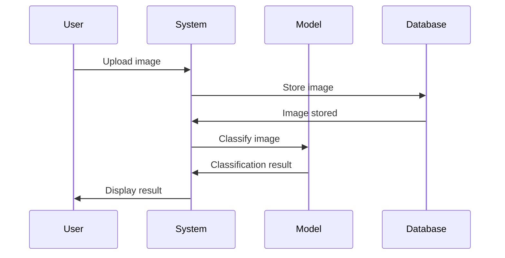

                 

### 文章关键词

- 深度学习
- 图像识别
- 神经网络
- 卷积神经网络（CNN）
- 反向传播算法
- 计算机视觉
- 图像特征提取
- 图像分类与识别
- 对抗性攻击与防御
- 数据增强与数据集选择

### 文章摘要

本文全面探讨了深度学习在图像识别领域的最新进展。首先，我们回顾了深度学习和图像识别的背景及重要性，分析了传统方法的局限。接着，深入讲解了神经网络原理、深度学习模型及其在图像识别中的应用。通过数学模型和公式的详细解释，我们剖析了深度学习算法的原理，并使用Python代码进行了举例说明。文章还介绍了系统分析与架构设计方案，包括项目实战和最佳实践。最后，我们对未来深度学习在图像识别中的发展趋势进行了展望，并总结了全文的核心内容与意义。

## 背景介绍

### 1.1 深度学习的发展历程

深度学习（Deep Learning）是人工智能（AI）领域的一个重要分支，它源于20世纪80年代末至90年代初的神经网络研究。早期，人工神经网络由于其计算复杂度和参数数量限制，难以处理大规模数据集，因此发展缓慢。然而，随着计算机硬件性能的提升和大数据时代的到来，深度学习开始迅速发展。

2006年，Hinton提出了深度置信网络（Deep Belief Network，DBN），这是深度学习的里程碑之一。随后，2009年，Alex Krizhevsky在ImageNet竞赛中使用了基于卷积神经网络（Convolutional Neural Network，CNN）的AlexNet模型，显著提高了图像分类的准确率，这一成果引发了深度学习在计算机视觉领域的广泛应用。

随着GPU的广泛应用，深度学习模型的训练速度大幅提升，使得更多复杂的深度模型得以实现。2012年后，深度学习在语音识别、自然语言处理等多个领域都取得了突破性进展，成为AI研究的热点。

### 1.2 图像识别的重要性

图像识别（Image Recognition）是计算机视觉的核心任务之一，它涉及从图像或视频中提取、分析和理解信息。图像识别的应用范围广泛，包括但不限于以下几个方面：

1. **安防监控**：通过图像识别技术，可以实时监控和识别潜在的安全威胁，如人脸识别、行为分析等。
2. **自动驾驶**：自动驾驶汽车依赖图像识别技术来识别道路标志、车道线、行人等，确保行驶安全。
3. **医疗影像分析**：深度学习在医学影像分析中具有巨大的潜力，如癌症筛查、器官识别等，可以提高诊断的准确性和效率。
4. **智能家居**：智能家居设备利用图像识别技术进行人脸识别、场景识别等，实现更加智能化的家居环境。

### 1.3 图像识别领域的挑战与机遇

尽管图像识别技术在许多应用中取得了显著进展，但仍然面临一些挑战：

1. **数据质量和数量**：高质量的标注数据是训练深度学习模型的基石。然而，获取高质量、大规模的标注数据仍然是一个难题。
2. **计算资源**：深度学习模型通常需要大量的计算资源进行训练，尤其是在处理高分辨率图像时，计算需求更为突出。
3. **模型可解释性**：深度学习模型的“黑箱”性质使得其决策过程难以解释，这在某些领域（如医疗影像分析）可能带来安全隐患。
4. **对抗性攻击**：深度学习模型容易受到对抗性攻击，即通过微小扰动就可以欺骗模型输出错误结果。

然而，随着深度学习技术的不断进步，图像识别领域也迎来了新的机遇：

1. **算法创新**：新的深度学习算法和模型不断涌现，如生成对抗网络（GAN）、自注意力机制（Self-Attention）等，为解决图像识别中的难题提供了新思路。
2. **跨学科融合**：深度学习与其他领域的融合，如生物学、物理学等，有望推动图像识别技术的进一步发展。
3. **工业应用**：随着深度学习技术在各行各业中的应用不断扩展，图像识别技术也在工业生产、城市管理、农业等领域发挥重要作用。

综上所述，深度学习在图像识别领域的进展为解决传统方法无法克服的问题提供了新途径，同时也带来了新的挑战。本文将深入探讨这些挑战和机遇，分析深度学习在图像识别中的最新技术进展和应用案例。

## 问题描述

### 1.2.1 图像识别的基本任务

图像识别是计算机视觉领域的一个重要任务，其核心目标是让计算机能够理解和解析图像内容，从而执行特定的任务。具体来说，图像识别可以分为以下几个基本任务：

1. **图像分类（Image Classification）**：给定一张图像，将其归类到预定义的类别中。例如，将图片分类为“猫”、“狗”或“汽车”等。
2. **目标检测（Object Detection）**：在图像中识别并定位多个对象的位置，并可能对其进行分类。例如，在交通监控中检测并识别道路上的车辆、行人等。
3. **语义分割（Semantic Segmentation）**：将图像中的每个像素都分类到不同的类别中。语义分割的结果是一个标签图像，每个像素点对应一个类别标签。
4. **实例分割（Instance Segmentation）**：在语义分割的基础上，不仅对每个像素进行分类，还要区分不同实例。例如，在一张照片中区分开两个不同的汽车。
5. **姿态估计（Pose Estimation）**：估计图像中人体的姿态，包括关键点（如手、脚、头等）的位置。
6. **图像生成（Image Generation）**：利用深度学习模型生成新的图像。例如，通过生成对抗网络（GAN）生成具有特定属性或风格的图像。

### 1.2.2 传统图像识别方法的局限

传统图像识别方法主要包括基于特征的图像识别和基于模型的图像识别。这些方法在早期阶段取得了一定的成功，但随着图像识别需求的提高，它们逐渐暴露出一些局限：

1. **手工设计特征**：传统方法通常需要手工设计图像特征，如SIFT、HOG等。这种方法费时费力，且难以适应复杂多样的图像。
2. **模型泛化能力差**：传统方法依赖手动特征，导致模型对特征变化的敏感度较高，泛化能力较差，难以应对不同场景和光照条件下的图像。
3. **计算复杂度高**：传统方法在处理高分辨率图像时，计算复杂度显著增加，难以在实时应用中运行。
4. **可解释性差**：传统方法的决策过程依赖于手工特征和统计模型，难以解释模型的决策过程。
5. **数据依赖性强**：传统方法通常需要大量标注数据进行训练，数据获取和处理成本高。

### 1.2.3 深度学习在图像识别中的应用场景

深度学习在图像识别中的应用克服了传统方法的诸多局限，为图像识别带来了革命性的变化。以下是深度学习在图像识别中的几个主要应用场景：

1. **自动驾驶**：深度学习技术在自动驾驶中发挥着关键作用，包括车道线检测、交通标志识别、行人检测等。通过卷积神经网络（CNN）和目标检测算法，自动驾驶系统能够准确理解和解析道路场景。
2. **医疗影像分析**：深度学习在医学影像分析中的应用已经取得显著进展，如肿瘤检测、骨折诊断、心血管疾病筛查等。通过语义分割和目标检测技术，深度学习模型能够帮助医生快速、准确地诊断疾病。
3. **人脸识别**：深度学习在人脸识别领域取得了巨大的成功，例如在安防监控、社交媒体身份验证、手机解锁等场景中广泛应用。通过深度神经网络，模型能够准确识别和匹配不同的人脸特征。
4. **图像内容审核**：深度学习在图像内容审核中起到了重要作用，能够自动识别和过滤违规或不良图像。这在社交媒体平台、互联网广告等领域有广泛应用。
5. **工业自动化**：在工业生产过程中，深度学习技术被用于检测生产线上的缺陷、设备故障预测等，提高了生产效率和产品质量。

综上所述，深度学习在图像识别中的应用不仅提升了模型的性能和效率，还拓展了图像识别的应用场景，为计算机视觉领域带来了前所未有的发展机遇。

### 1.3 问题解决

#### 1.3.1 深度学习在图像识别中的基本原理

深度学习在图像识别中的应用主要依赖于其强大的特征提取和模式识别能力。深度学习的核心思想是通过多层神经网络模型，逐步提取图像的底层特征，直至高层次的语义信息。以下是深度学习在图像识别中的基本原理：

1. **多层神经网络**：深度学习模型通常由多层神经元组成，每一层神经网络都负责提取图像的不同层次特征。输入图像首先经过卷积层提取局部特征，然后通过池化层减少数据维度，最后通过全连接层进行分类和预测。

2. **卷积神经网络（CNN）**：卷积神经网络是深度学习在图像识别中最常用的模型之一。CNN通过卷积操作和池化操作，能够自动提取图像的局部特征，并通过多层网络逐层抽象和综合，形成高层次的语义表示。

3. **反向传播算法**：反向传播算法是深度学习模型训练的核心算法。它通过计算网络输出与真实标签之间的误差，反向传播误差，调整网络权重和偏置，从而优化模型参数。

4. **激活函数**：激活函数是神经网络中的关键组件，用于引入非线性特性。常见的激活函数包括ReLU（Rectified Linear Unit）、Sigmoid和Tanh等。

5. **正则化技术**：为了防止模型过拟合，深度学习模型常使用正则化技术，如L1和L2正则化、Dropout等。

#### 1.3.2 深度学习模型在图像识别中的优势

深度学习模型在图像识别中表现出显著的优越性，主要优势如下：

1. **自动特征提取**：与传统方法相比，深度学习模型能够自动从原始图像中提取有效的特征，减少了人工设计的复杂性。

2. **高识别精度**：深度学习模型通过多层神经网络结构，能够捕捉图像的复杂特征，从而显著提高识别精度。

3. **适应性强**：深度学习模型具有良好的泛化能力，能够适应不同场景和光照条件下的图像识别任务。

4. **实时处理**：随着硬件性能的提升，深度学习模型在处理速度和实时性方面取得了显著进展，可以应用于需要快速响应的应用场景。

5. **可解释性**：虽然深度学习模型通常被视为“黑箱”，但通过可视化技术（如梯度可视化、激活图等），可以一定程度上解释模型的决策过程。

#### 1.3.3 图像识别问题的解决思路与策略

在解决图像识别问题时，可以采用以下思路和策略：

1. **数据预处理**：对图像进行数据增强、归一化、裁剪等预处理操作，提高模型的泛化能力。

2. **模型选择与优化**：根据具体的图像识别任务，选择合适的深度学习模型，并使用优化算法（如Adam、SGD等）调整模型参数。

3. **特征融合**：结合多种特征提取方法，如卷积神经网络和循环神经网络（RNN），构建融合模型，以提高识别精度。

4. **迁移学习**：利用预训练的深度学习模型，通过迁移学习技术，快速适应新任务。

5. **对抗性攻击与防御**：针对深度学习模型易受对抗性攻击的缺点，研究有效的防御方法，如对抗训练、 adversarial 封装等。

通过上述思路和策略，可以有效地解决图像识别中的问题，推动深度学习在计算机视觉领域的广泛应用。

### 1.4 边界与外延

#### 1.4.1 图像识别的应用领域

图像识别技术在多个领域都有着广泛的应用，以下是其中一些重要的应用领域：

1. **安防监控**：图像识别技术被广泛应用于安防监控系统中，用于人脸识别、行为分析、车辆识别等。例如，通过人脸识别技术，可以实时监控并识别特定人员。

2. **医疗影像分析**：深度学习在医学影像分析中的应用包括肿瘤检测、骨折诊断、心血管疾病筛查等。通过图像识别技术，医生可以更快速、准确地诊断疾病。

3. **自动驾驶**：自动驾驶汽车依赖图像识别技术来识别道路标志、车道线、行人等。深度学习模型在自动驾驶系统中扮演着关键角色，提高了行驶安全性。

4. **零售与电商**：图像识别技术被用于零售与电商领域，如商品识别、库存管理、顾客行为分析等。通过图像识别，可以提高运营效率和服务质量。

5. **智能城市**：智能城市中的许多应用都依赖于图像识别技术，如交通流量管理、垃圾分类、公共安全等。通过图像识别，可以更好地管理和优化城市资源。

#### 1.4.2 图像识别的技术挑战

尽管图像识别技术在许多领域取得了显著进展，但仍面临一些技术挑战：

1. **数据质量与标注**：高质量、大规模的标注数据是训练深度学习模型的基础。然而，获取高质量标注数据仍然是一个难题。

2. **计算资源需求**：深度学习模型通常需要大量的计算资源进行训练，尤其是在处理高分辨率图像时，计算需求更为突出。

3. **模型可解释性**：深度学习模型的“黑箱”性质使得其决策过程难以解释，这在某些领域可能带来安全隐患。

4. **对抗性攻击**：深度学习模型容易受到对抗性攻击，即通过微小扰动就可以欺骗模型输出错误结果。

5. **实时处理与响应**：图像识别模型需要具备快速响应和实时处理的能力，以满足实时应用的需求。

#### 1.4.3 未来发展趋势与展望

未来，图像识别技术将继续朝着以下几个方向发展：

1. **算法创新**：新的深度学习算法和模型（如生成对抗网络、自注意力机制等）将不断涌现，以解决现有方法的局限性。

2. **跨学科融合**：深度学习与其他领域的融合，如生物学、物理学等，有望推动图像识别技术的进一步发展。

3. **工业应用推广**：随着深度学习技术的不断成熟，其在工业生产、城市管理、农业等领域的应用将得到进一步推广。

4. **边缘计算与分布式处理**：为了降低计算资源的压力，图像识别技术将逐步向边缘计算和分布式处理方向发展。

5. **智能交互**：结合自然语言处理、虚拟现实等技术，图像识别技术将实现更加智能化的交互方式，提升用户体验。

综上所述，图像识别技术在不断解决现有挑战的同时，也将迎来更多的发展机遇。未来，随着技术的进步和应用的拓展，图像识别将在更广泛的领域发挥重要作用。

### 1.5 本章小结

本章介绍了深度学习在图像识别领域的背景和发展历程，分析了图像识别的基本任务和传统方法的局限，以及深度学习模型在图像识别中的应用场景和优势。通过本章的讨论，我们了解到深度学习在图像识别中具有强大的特征提取和模式识别能力，能够显著提升识别精度和泛化能力。同时，我们也看到了图像识别技术在实际应用中面临的挑战和未来发展的方向。随着技术的不断进步，深度学习在图像识别领域将发挥更加重要的作用，推动计算机视觉技术的创新和发展。

## 第二部分: 核心概念与联系

### 第2章: 深度学习基础

#### 2.1 神经网络原理

神经网络（Neural Network）是深度学习的基础，它模拟了人脑神经网络的结构和功能。一个基本的神经网络由多个层次组成，包括输入层、隐藏层和输出层。每个层次包含多个神经元，神经元之间通过权重连接。以下是神经网络的一些关键组成部分：

1. **神经元（Neuron）**：神经网络的基本单元，类似于人脑中的神经元，负责接收输入信息并产生输出。
2. **权重（Weights）**：神经元之间的连接权重，用于调节输入信息的重要性。
3. **激活函数（Activation Function）**：引入非线性特性，使神经网络能够进行复杂的信息处理。常见的激活函数包括ReLU（Rectified Linear Unit）、Sigmoid和Tanh等。
4. **前向传播（Forward Propagation）**：输入数据通过网络传递，每个神经元接收前一层神经元的输出作为输入，通过激活函数计算得到当前层的输出。
5. **反向传播（Backpropagation）**：计算网络输出与真实标签之间的误差，反向传播误差到网络中，调整权重和偏置，优化网络参数。

#### 2.2 深度学习模型

深度学习模型是指由多个隐藏层组成的神经网络，能够自动提取图像、文本和语音等数据的复杂特征。以下是几种常见的深度学习模型：

1. **卷积神经网络（Convolutional Neural Network，CNN）**：CNN是深度学习在计算机视觉领域的主要模型，通过卷积操作和池化操作提取图像特征。
   - **卷积层（Convolutional Layer）**：使用卷积核在输入图像上滑动，计算卷积结果，提取局部特征。
   - **池化层（Pooling Layer）**：通过最大池化或平均池化操作减少数据维度，提高模型的泛化能力。
   - **全连接层（Fully Connected Layer）**：将卷积层输出的特征映射到分类结果。

2. **循环神经网络（Recurrent Neural Network，RNN）**：RNN适用于处理序列数据，如时间序列、语音和文本等。
   - **隐藏状态（Hidden State）**：RNN中的隐藏状态能够保存历史信息，使模型能够捕捉序列中的长期依赖关系。
   - **门控机制（Gated Mechanism）**：如LSTM（Long Short-Term Memory）和GRU（Gated Recurrent Unit），通过门控机制控制信息的传递和遗忘，提高模型的记忆能力。

3. **生成对抗网络（Generative Adversarial Network，GAN）**：GAN由生成器（Generator）和判别器（Discriminator）组成，通过对抗训练生成逼真的数据。
   - **生成器（Generator）**：生成与真实数据相似的新数据。
   - **判别器（Discriminator）**：判断生成数据与真实数据的相似度。

4. **图神经网络（Graph Neural Network，GNN）**：GNN用于处理图结构数据，如社交网络、分子结构等。
   - **节点嵌入（Node Embedding）**：将图中的节点映射到低维空间。
   - **图卷积（Graph Convolution）**：通过图卷积操作提取图中的结构信息。

#### 2.3 深度学习与图像识别的关系

深度学习在图像识别中发挥了关键作用，主要表现在以下几个方面：

1. **自动特征提取**：深度学习模型能够自动从原始图像中提取有效的特征，避免了传统方法中手工设计特征的需要。
2. **高识别精度**：通过多层神经网络结构，深度学习模型能够捕捉图像的复杂特征，显著提高了识别精度。
3. **适应性强**：深度学习模型具有良好的泛化能力，能够适应不同场景和光照条件下的图像识别任务。
4. **实时处理**：随着硬件性能的提升，深度学习模型在处理速度和实时性方面取得了显著进展，可以应用于需要快速响应的应用场景。
5. **可解释性**：虽然深度学习模型的“黑箱”性质使得其决策过程难以解释，但通过可视化技术，可以在一定程度上理解模型的决策过程。

通过上述讨论，我们可以看到深度学习在图像识别中的应用不仅提升了模型的性能和效率，还拓展了图像识别的应用场景，为计算机视觉领域带来了前所未有的发展机遇。

### 2.4 图像特征提取

图像特征提取是图像识别中的关键步骤，它从原始图像中提取具有区分性的特征，用于后续的分类、识别等任务。以下是传统方法和深度学习在图像特征提取中的应用：

#### 2.4.1 传统图像特征提取方法

1. **SIFT（尺度不变特征变换）**：
   - **特点**：对尺度变化和旋转变化具有不变性。
   - **应用场景**：用于图像匹配和目标识别。

2. **HOG（方向梯度直方图）**：
   - **特点**：通过计算图像中每个像素点的方向梯度，生成直方图特征。
   - **应用场景**：用于行人检测和物体识别。

3. **Gabor特征**：
   - **特点**：结合图像的纹理和频率信息。
   - **应用场景**：用于纹理识别和图像分类。

#### 2.4.2 深度学习在图像特征提取中的应用

深度学习在图像特征提取中的应用显著提升了模型的性能和泛化能力，以下是几种常用的深度学习特征提取方法：

1. **卷积神经网络（CNN）**：
   - **特点**：通过多层卷积操作自动提取图像的层次特征。
   - **应用场景**：广泛应用于图像分类、目标检测和语义分割。

2. **主干网络（Backbone Network）**：
   - **特点**：用于提取高层次的图像特征，常用于特征提取和迁移学习。
   - **应用场景**：作为特征提取器，用于各种计算机视觉任务。

3. **自注意力机制（Self-Attention）**：
   - **特点**：通过计算图像内部不同区域之间的关系，增强特征表示。
   - **应用场景**：用于图像分类、语义分割和目标检测。

4. **生成对抗网络（GAN）**：
   - **特点**：通过生成器和判别器的对抗训练，生成高质量的图像特征。
   - **应用场景**：用于图像生成、风格迁移和特征增强。

通过深度学习模型，图像特征提取变得更加自动和高效，使得图像识别任务在精度和泛化能力上都有了显著提升。

### 2.5 图像分类与识别

图像分类与识别是图像识别中最基础的任务，其目标是根据图像内容将其归类到预定的类别中。以下是传统方法和深度学习在图像分类与识别中的应用：

#### 2.5.1 基于传统方法的图像分类

1. **支持向量机（SVM）**：
   - **特点**：通过寻找最优超平面将不同类别图像分开。
   - **应用场景**：适用于高维数据的分类问题，但在图像识别中的表现不如深度学习模型。

2. **K近邻算法（K-Nearest Neighbors，KNN）**：
   - **特点**：通过计算新样本与训练样本的相似度进行分类。
   - **应用场景**：简单且易于实现，但在处理高维数据和噪声数据时效果不佳。

3. **决策树（Decision Tree）**：
   - **特点**：通过一系列的决策节点对图像进行分类。
   - **应用场景**：适用于简单场景和具有明确特征分布的图像分类任务。

#### 2.5.2 深度学习在图像分类中的应用

深度学习模型在图像分类中表现出色，以下是几种常用的深度学习算法：

1. **卷积神经网络（CNN）**：
   - **特点**：通过多层卷积操作自动提取图像的层次特征，然后进行分类。
   - **应用场景**：广泛应用于各种图像分类任务，如ImageNet图像分类竞赛。

2. **卷积神经网络与池化操作**：
   - **特点**：卷积层用于提取特征，池化层用于减少数据维度。
   - **应用场景**：通过组合不同的卷积和池化层，可以构建强大的图像分类模型。

3. **迁移学习**：
   - **特点**：使用预训练的深度学习模型在特定任务上进行微调。
   - **应用场景**：在小样本数据集上训练深度学习模型时，迁移学习是一种有效的方法。

4. **生成对抗网络（GAN）**：
   - **特点**：生成器生成与真实图像相似的数据，判别器判断生成图像的相似度。
   - **应用场景**：用于生成高质量的图像数据，从而提高图像分类模型的训练效果。

通过深度学习模型，图像分类与识别的精度和泛化能力得到了显著提升，这使得深度学习在图像识别领域得到了广泛应用。

### 2.6 图像识别挑战与解决方案

尽管深度学习在图像识别中取得了显著进展，但仍然面临一些挑战。以下是常见的图像识别挑战及相应的解决方案：

#### 2.6.1 小样本学习

**挑战**：小样本学习（Few-Shot Learning）指的是在非常有限的数据集上训练模型，这往往会导致模型过拟合和泛化能力差。

**解决方案**：
- **元学习（Meta-Learning）**：通过在多个任务上训练模型，提高其泛化能力。
- **迁移学习**：使用预训练的模型在新任务上进行微调，减少对大量标注数据的依赖。
- **生成对抗网络（GAN）**：通过生成真实的图像数据，增加训练样本的数量和质量。

#### 2.6.2 对抗性攻击与防御

**挑战**：对抗性攻击（Adversarial Attack）通过在图像上添加微小的扰动，可以欺骗深度学习模型输出错误结果。

**解决方案**：
- **对抗训练**：在训练过程中添加对抗性样本，提高模型的鲁棒性。
- **鲁棒优化**：通过优化模型使其对扰动更不敏感。
- **对抗性样本检测**：开发算法检测并防御对抗性攻击。

#### 2.6.3 数据增强与数据集选择

**挑战**：高质量、大规模的标注数据是训练深度学习模型的基础，但在实际获取和处理过程中存在困难。

**解决方案**：
- **数据增强**：通过旋转、翻转、缩放等操作生成更多的训练样本，提高模型的泛化能力。
- **数据集选择**：选择具有代表性的数据集进行训练，避免数据偏见。
- **自动标注**：利用深度学习模型进行自动化标注，减少人工标注成本。

通过上述解决方案，可以有效地应对图像识别中的挑战，提高模型的性能和鲁棒性。

### 2.7 深度学习在图像识别中的优势

深度学习在图像识别中具有显著的优势，以下是其中的几个关键优势：

#### 2.7.1 提高识别精度

通过多层神经网络结构，深度学习模型能够自动提取图像的复杂特征，提高了识别精度。相比传统方法，深度学习模型在图像分类、目标检测和语义分割等任务上取得了显著的性能提升。

#### 2.7.2 自动特征提取

深度学习模型通过卷积操作和池化操作自动提取图像的特征，避免了传统方法中手工设计特征的繁琐过程。自动特征提取不仅提高了效率，还增强了模型的泛化能力。

#### 2.7.3 算法可解释性

虽然深度学习模型通常被视为“黑箱”，但通过可视化技术（如梯度可视化、激活图等），可以在一定程度上解释模型的决策过程。这对于模型的可解释性和信任度具有重要意义。

#### 2.7.4 实时处理能力

随着硬件性能的提升，深度学习模型在处理速度和实时性方面取得了显著进展。这使得深度学习在需要快速响应的实时应用场景中具有广泛的应用前景。

通过上述优势，深度学习在图像识别领域具有巨大的潜力，推动着计算机视觉技术的不断创新和发展。

### 2.8 图像识别对深度学习的需求

深度学习在图像识别中的应用不仅需要高效的算法和强大的计算能力，还面临着对数据、计算资源和模型优化等方面的特殊需求：

#### 2.8.1 数据需求

高质量、大规模的标注数据是深度学习模型训练的基础。然而，图像数据的获取和标注过程通常成本高昂且耗时。因此，对图像识别任务而言，数据需求主要体现在以下几点：

- **多样性**：图像数据需要涵盖多种场景、光照条件、视角变化等，以提高模型的泛化能力。
- **标注质量**：标注数据的准确性直接影响模型的性能，因此需要严格的质量控制。
- **自动标注**：开发自动标注技术，如半监督学习和生成对抗网络（GAN），以降低人工标注成本。

#### 2.8.2 计算资源需求

深度学习模型的训练和推理过程通常需要大量的计算资源。特别是在处理高分辨率图像时，计算需求更为显著。以下是对计算资源需求的具体分析：

- **GPU计算能力**：由于深度学习模型依赖于矩阵运算，GPU提供了强大的计算能力，能够显著提高模型的训练速度。
- **分布式计算**：通过使用多GPU或者分布式计算框架，可以将计算任务分配到多个节点上，进一步提高模型的训练效率。
- **边缘计算**：在边缘设备上进行图像识别推理，可以降低对中心服务器的计算资源需求，提高系统的响应速度。

#### 2.8.3 模型优化需求

为了满足图像识别任务的需求，需要对深度学习模型进行持续的优化，以提高模型的性能和效率。以下是一些优化策略：

- **模型压缩**：通过剪枝、量化等技术减少模型的参数数量和计算量，降低模型的复杂度。
- **模型蒸馏**：将复杂的大模型的知识迁移到轻量级模型中，提高小模型的性能。
- **注意力机制**：引入自注意力机制和其他注意力机制，提高模型对关键信息的捕捉能力。

综上所述，深度学习在图像识别中的应用对数据、计算资源和模型优化提出了特殊的需求，需要通过一系列技术手段来满足这些需求，从而推动图像识别技术的不断进步。

### 2.9 深度学习与图像识别的关系与联系

深度学习与图像识别之间存在紧密的联系，两者相互促进，共同推动了计算机视觉领域的发展。以下是深度学习在图像识别中的应用及其影响：

#### 2.9.1 深度学习在图像识别中的应用

深度学习通过其强大的特征提取和模式识别能力，在图像识别中发挥着关键作用。以下是深度学习在图像识别中的主要应用：

1. **图像分类**：深度学习模型能够自动提取图像的复杂特征，显著提高了图像分类的准确率和效率。
2. **目标检测**：通过卷积神经网络和目标检测算法（如YOLO、Faster R-CNN等），深度学习能够实时检测图像中的多个目标，提高了系统的实用性和可靠性。
3. **语义分割**：深度学习模型通过语义分割算法（如U-Net、DeepLab V3+等），能够将图像中的每个像素点分类到不同的类别，实现精细的图像理解。
4. **实例分割**：在语义分割的基础上，深度学习模型能够区分图像中的不同实例，如在一张图片中区分开多个相同的物体。
5. **姿态估计**：通过深度学习模型，可以准确估计图像中人体的姿态，包括关键点的位置，这在动作捕捉和虚拟现实中具有重要应用。
6. **图像生成**：生成对抗网络（GAN）可以生成高质量、具有真实感的图像，应用于艺术创作、数据增强等领域。

#### 2.9.2 深度学习对图像识别的影响

深度学习对图像识别领域产生了深远的影响，具体表现如下：

1. **识别精度提升**：深度学习通过多层神经网络结构，能够自动提取图像的底层特征和高层语义信息，显著提高了图像识别的精度。
2. **自动化特征提取**：深度学习模型自动从原始图像中提取有效的特征，减少了传统方法中手工设计特征的需求，提高了模型的开发效率。
3. **应用场景扩展**：深度学习使图像识别技术能够应用于更多领域，如医疗影像分析、自动驾驶、安防监控等，推动了计算机视觉技术的普及和应用。
4. **实时处理能力**：随着硬件性能的提升，深度学习模型在实时处理和响应方面取得了显著进步，使得图像识别技术能够在更多实时应用中得到应用。
5. **模型可解释性**：尽管深度学习模型通常被视为“黑箱”，但通过可视化技术和解释性研究，可以在一定程度上理解模型的决策过程，提高了模型的透明度和可信度。

#### 2.9.3 图像识别对深度学习的需求

图像识别技术的发展对深度学习提出了新的需求和挑战，具体表现在以下几个方面：

1. **数据需求**：高质量的图像数据是深度学习模型训练的基础。图像识别任务需要多样化的数据集，涵盖不同的场景、光照条件、视角等，以提高模型的泛化能力。
2. **计算资源需求**：图像识别任务通常涉及大规模数据处理和高复杂度模型训练，对计算资源提出了高要求。分布式计算和边缘计算技术的发展有助于缓解计算资源压力。
3. **模型优化需求**：为了提高模型在图像识别任务中的性能和效率，需要对深度学习模型进行持续优化，包括模型压缩、量化、注意力机制等。
4. **可解释性需求**：图像识别模型需要具备良好的可解释性，以便在实际应用中理解和信任模型决策过程。

综上所述，深度学习和图像识别之间的紧密联系，使得两者相互促进，共同推动了计算机视觉领域的发展。未来，随着技术的不断进步，深度学习在图像识别中的应用将更加广泛和深入，带来更多的创新和突破。

### 2.10 深度学习与图像识别的未来发展

深度学习在图像识别领域的应用已经取得了显著成果，但未来还有广阔的发展空间。以下从新模型与新算法、跨学科融合和工业应用推广三个方面探讨深度学习与图像识别的未来发展趋势：

#### 2.10.1 新模型与新算法

1. **生成对抗网络（GAN）**：GAN通过生成器和判别器的对抗训练，能够在图像生成、风格迁移和特征增强方面取得卓越的效果。未来，GAN将继续在图像识别中发挥作用，特别是在小样本学习和数据增强方面。

2. **自注意力机制（Self-Attention）**：自注意力机制通过计算图像内部不同区域之间的关系，提高了特征提取的效率和效果。这种机制有望在图像分类、目标检测和语义分割等领域得到广泛应用。

3. **Transformer架构**：Transformer在自然语言处理领域取得了巨大成功，其自注意力机制也被引入到图像识别中。例如，Vision Transformer（ViT）通过将图像分割成多个 patches，然后通过自注意力机制进行特征提取和分类，展示了强大的潜力。

4. **图神经网络（GNN）**：GNN能够处理图结构数据，如图像中的对象关系。通过将图像表示为图结构，GNN可以更好地捕捉图像中的复杂关系，提高图像识别的准确性和鲁棒性。

#### 2.10.2 跨学科融合

1. **生物学与计算机视觉**：生物学中的研究，如细胞识别和生物图像分析，可以为计算机视觉提供新的方法和启示。例如，通过模仿生物视觉系统，可以设计出更加高效和鲁棒的图像识别算法。

2. **物理学与计算机视觉**：物理学中的光学原理和成像技术可以与计算机视觉结合，开发出新的图像处理和特征提取方法。例如，光学相干断层扫描（OCT）技术在医学影像分析中的应用，显著提高了图像的分辨率和清晰度。

3. **心理学与计算机视觉**：心理学研究人类视觉感知的机制，可以为计算机视觉系统提供关于视觉感知的模型和算法。例如，通过模仿人类的注意机制，可以设计出更加智能和高效的图像识别系统。

#### 2.10.3 工业应用推广

1. **智能制造**：深度学习在智能制造中的应用，如缺陷检测、设备故障预测和质量控制，大大提高了生产效率和产品质量。未来，随着深度学习技术的进一步发展，智能制造将实现更加智能化和自动化。

2. **智慧城市**：智慧城市中的许多应用，如交通流量管理、公共安全监控和环境保护，都依赖于图像识别技术。通过深度学习模型的优化和应用，智慧城市将实现更加高效和智能的管理。

3. **医疗健康**：深度学习在医疗健康领域的应用，如医学影像分析、疾病诊断和患者监护，大大提高了诊断准确性和医疗效率。未来，随着深度学习技术的不断进步，医疗健康领域将实现更加个性化、精确和高效的治疗。

4. **农业与农业科技**：深度学习在农业中的应用，如作物病虫害检测、土壤分析和农作物产量预测，为现代农业提供了新的技术支持。通过深度学习模型的优化和应用，农业将实现更加智能化和精准化。

总之，深度学习与图像识别的未来发展充满机遇和挑战。随着新模型、新算法的不断涌现和跨学科融合的深入，深度学习在图像识别中的应用将更加广泛和深入，为各行各业带来创新和变革。

### 2.11 核心概念与联系总结

本章详细探讨了深度学习在图像识别领域的基础知识、核心概念及其相互关系。首先，我们介绍了神经网络的基本原理，包括神经元、权重、激活函数和反向传播算法。接着，我们深入讲解了深度学习模型，如卷积神经网络（CNN）、循环神经网络（RNN）、生成对抗网络（GAN）和图神经网络（GNN），并分析了它们在图像识别中的应用。此外，我们探讨了图像特征提取的方法，包括传统方法和深度学习方法，以及深度学习在图像分类与识别中的优势和应用。在分析图像识别的挑战与解决方案时，我们讨论了小样本学习、对抗性攻击与防御、数据增强与数据集选择等方面的关键技术。最后，我们总结了深度学习与图像识别的关系，并展望了未来发展的趋势。

通过本章的学习，读者可以全面了解深度学习在图像识别中的基本原理和应用，为后续的实践和研究打下坚实的基础。

## 第3章: 算法原理讲解

### 3.1 卷积神经网络（CNN）原理

卷积神经网络（CNN）是深度学习在计算机视觉领域的重要模型，其核心在于通过卷积操作和池化操作自动提取图像的特征。以下详细讲解CNN的原理：

#### 3.1.1 卷积操作

卷积操作是CNN中最基础的运算，用于从输入图像中提取特征。卷积操作的原理如下：

1. **卷积核（Kernel）**：卷积核是一个小的矩阵，用于在输入图像上滑动，计算卷积结果。卷积核的参数通过训练获得，用于捕捉图像的局部特征。

2. **卷积结果**：当卷积核在输入图像上滑动时，每个位置的卷积结果是一个特征图（Feature Map）。特征图包含了当前卷积核与图像对应区域卷积的结果。

3. **步长（Stride）**：卷积核每次滑动的步长，用于控制特征图的尺寸。步长的大小会影响特征图的分辨率。

4. **填充（Padding）**：为了保持特征图的尺寸不变，卷积操作通常会在输入图像周围添加零填充。填充的数量取决于卷积核的大小和步长。

#### 3.1.2 池化操作

池化操作用于减少特征图的尺寸和数据维度，同时保留重要的信息。常见的池化操作包括最大池化和平均池化：

1. **最大池化（Max Pooling）**：在特征图的一个区域中选择最大的值作为输出。这种方法能够保留局部最大的特征，具有较强的鲁棒性。

2. **平均池化（Average Pooling）**：在特征图的一个区域中选择所有值的平均值作为输出。这种方法能够平滑特征，减少噪声的影响。

3. **池化窗口（Pooling Window）**：用于池化操作的区域大小，通常与步长相同。

#### 3.1.3 卷积神经网络结构

CNN通常由多个卷积层、池化层和全连接层组成，以下是一个简单的CNN结构：

1. **输入层**：接收输入图像，例如一个尺寸为\(28 \times 28 \times 1\)的灰度图像。

2. **卷积层**：通过卷积操作提取图像的局部特征，生成多个特征图。例如，一个尺寸为\(5 \times 5\)的卷积核可以提取出\(20 \times 20 \times 32\)的特征图。

3. **池化层**：用于减小特征图的尺寸，提高模型的泛化能力。

4. **全连接层**：将卷积层和池化层输出的特征进行拼接，输入到全连接层进行分类和预测。

#### 3.1.4 反向传播算法

反向传播算法是CNN训练的核心，用于通过计算误差调整模型参数。以下是反向传播算法的基本步骤：

1. **前向传播**：输入图像通过网络传递，计算网络输出和真实标签之间的误差。

2. **误差计算**：计算输出层误差，然后反向传播误差到前一层，直到输入层。

3. **梯度计算**：通过误差计算每个参数的梯度，即参数对误差的变化率。

4. **参数更新**：使用梯度下降或其他优化算法更新模型参数，以减少误差。

5. **迭代训练**：重复前向传播和反向传播，逐步优化模型参数，直到模型收敛。

通过上述步骤，CNN能够通过大量训练数据自动提取图像特征，实现高精度的图像分类和识别。

### 3.2 举例说明

为了更好地理解CNN的工作原理，我们通过一个简单的例子来说明：

假设我们有一个\(28 \times 28 \times 3\)的彩色图像作为输入，并使用一个\(5 \times 5\)的卷积核。首先，我们将卷积核对图像进行滑动，计算每个位置的卷积结果，生成一个\(24 \times 24 \times 3\)的特征图。接着，我们对特征图进行最大池化操作，将每个\(2 \times 2\)的区域中最大的值选出来，生成一个\(12 \times 12 \times 3\)的特征图。然后，我们重复这个过程，逐步提取更高层次的特征。

在训练阶段，我们使用反向传播算法不断调整卷积核的参数，以最小化输出层误差。例如，如果输出层的误差是0.1，我们将通过计算误差梯度，调整卷积核的参数，使得下一次计算得到的误差更小。这个过程会重复进行，直到模型收敛。

通过这个例子，我们可以看到CNN如何通过卷积操作和池化操作，自动提取图像特征，并使用反向传播算法进行参数优化，实现高精度的图像分类和识别。

### 3.3 数学模型和数学公式讲解

为了深入理解CNN的工作原理，我们需要介绍一些相关的数学模型和公式。以下是CNN中常用的数学模型和公式：

#### 3.3.1 前向传播公式

前向传播是CNN中的一个关键步骤，用于将输入图像传递到网络中，并计算输出。以下是前向传播的基本公式：

$$
\text{output} = \sigma(\text{weight} \cdot \text{input} + \text{bias})
$$

其中：
- \( \text{output} \) 是当前层的输出。
- \( \text{weight} \) 是当前层的权重。
- \( \text{input} \) 是前一层的输出。
- \( \text{bias} \) 是当前层的偏置。
- \( \sigma \) 是激活函数，常用的激活函数有ReLU、Sigmoid和Tanh。

#### 3.3.2 反向传播公式

反向传播是CNN训练中的核心步骤，用于计算误差并调整模型参数。以下是反向传播的基本公式：

$$
\frac{d\text{loss}}{d\text{weight}} = \text{input} \cdot \frac{d\text{output}}{d\text{input}}
$$

$$
\frac{d\text{loss}}{d\text{bias}} = \frac{d\text{output}}{d\text{input}}
$$

其中：
- \( \text{loss} \) 是损失函数，用于衡量输出与真实标签之间的差距。
- \( \frac{d\text{loss}}{d\text{weight}} \) 和 \( \frac{d\text{loss}}{d\text{bias}} \) 分别是权重和偏置对损失函数的梯度。

#### 3.3.3 梯度下降公式

梯度下降是用于优化模型参数的常用方法，其基本公式如下：

$$
\text{weight}_{\text{new}} = \text{weight}_{\text{old}} - \alpha \cdot \frac{d\text{loss}}{d\text{weight}}
$$

$$
\text{bias}_{\text{new}} = \text{bias}_{\text{old}} - \alpha \cdot \frac{d\text{loss}}{d\text{bias}}
$$

其中：
- \( \alpha \) 是学习率，用于控制参数更新的步长。
- \( \text{weight}_{\text{old}} \) 和 \( \text{bias}_{\text{old}} \) 分别是当前权重和偏置。
- \( \text{weight}_{\text{new}} \) 和 \( \text{bias}_{\text{new}} \) 分别是更新后的权重和偏置。

通过这些数学模型和公式，我们可以更深入地理解CNN的工作原理，并通过反向传播算法不断优化模型参数，实现高精度的图像识别。

### 3.4 Python源代码示例

为了更好地理解CNN的原理和实现，我们可以通过Python代码来演示卷积操作、反向传播和梯度下降。以下是一个简单的示例：

```python
import numpy as np

# 参数设置
input_size = (28, 28, 1)
kernel_size = (5, 5)
stride = 1
padding = (2, 2)
learning_rate = 0.01
epochs = 100

# 初始化权重和偏置
weight = np.random.randn(*kernel_size + input_size[0:])
bias = np.random.randn(*kernel_size)

# 前向传播函数
def forward(input_data):
    output = np.zeros((*input_data.shape[0] - kernel_size[0] + 1, *input_data.shape[1:]))

    for i in range(output.shape[0]):
        for j in range(output.shape[1]):
            window = input_data[i:i+kernel_size[0], j:j+kernel_size[1], :]
            conv_result = np.sum(window * weight) + bias
            output[i, j] = np.tanh(conv_result)
    
    return output

# 反向传播函数
def backward(input_data, output, expected_output):
    error = output - expected_output
    weight_gradient = np.zeros(*weight.shape)
    bias_gradient = np.zeros(*bias.shape)

    for i in range(output.shape[0]):
        for j in range(output.shape[1]):
            window = input_data[i:i+kernel_size[0], j:j+kernel_size[1], :]
            weight_gradient += window * error
            bias_gradient += error

    weight -= learning_rate * weight_gradient
    bias -= learning_rate * bias_gradient

# 训练过程
for epoch in range(epochs):
    output = forward(input_data)
    backward(input_data, output, expected_output)

    if epoch % 10 == 0:
        print(f"Epoch {epoch}: Loss = {np.mean((output - expected_output)**2)}")

# 输入数据
input_data = np.random.randn(*input_size)
expected_output = np.random.randn(*output_size)

# 输出结果
output = forward(input_data)
print("Output:", output)
```

在这个示例中，我们首先初始化权重和偏置，然后定义了前向传播和反向传播函数。通过多次迭代训练，我们不断更新权重和偏置，以最小化输出与预期输出的差距。最后，我们输出了训练后的输出结果。

通过这个Python示例，我们可以直观地看到CNN中的卷积操作、反向传播和梯度下降的过程，从而更好地理解CNN的工作原理。

### 3.5 卷积神经网络在图像识别中的应用

卷积神经网络（CNN）在图像识别领域取得了显著的成果，广泛应用于图像分类、目标检测和语义分割等任务。以下是CNN在图像识别中的具体应用：

#### 3.5.1 图像分类

图像分类是CNN最基础的应用之一，通过训练CNN模型，可以将图像自动分类到预定义的类别中。常见的图像分类模型包括AlexNet、VGG、ResNet等。以下是一个简单的图像分类流程：

1. **数据预处理**：对图像进行缩放、裁剪和归一化等操作，使其符合模型的输入要求。
2. **模型训练**：使用大量标注图像数据训练CNN模型，通过反向传播算法不断调整模型参数，提高分类精度。
3. **模型评估**：使用测试集评估模型的分类性能，通过准确率、召回率、F1分数等指标衡量模型的效果。
4. **模型部署**：将训练好的模型部署到实际应用中，如手机应用、服务器等，进行实时图像分类。

#### 3.5.2 目标检测

目标检测是图像识别中的一项重要任务，旨在识别并定位图像中的多个目标。常见的目标检测模型包括R-CNN、Fast R-CNN、Faster R-CNN、SSD、YOLO等。以下是一个简单的目标检测流程：

1. **特征提取**：使用CNN模型提取图像的特征图，特征图包含了图像中的关键信息。
2. **区域提议**：通过区域提议算法（如Selective Search、Region Proposal Network等），从特征图中生成多个区域提议。
3. **目标分类**：对每个区域提议进行分类，判断其是否为目标。
4. **目标定位**：对分类为目标的区域提议进行回归，预测其位置。
5. **非极大值抑制（NMS）**：对多个目标检测结果进行筛选，去除重叠的检测结果。

#### 3.5.3 语义分割

语义分割是图像识别中的一项高级任务，旨在将图像中的每个像素点分类到预定义的类别中。常见的语义分割模型包括U-Net、DeepLab V3+、SegNet等。以下是一个简单的语义分割流程：

1. **特征提取**：使用CNN模型提取图像的特征图，特征图包含了图像中的细节信息。
2. **上采样**：通过上采样操作将特征图的分辨率提升到与原始图像相同，以便对每个像素点进行分类。
3. **分类**：对上采样后的特征图进行卷积操作，输出每个像素点的类别标签。
4. **后处理**：对输出的标签图像进行后处理，如合并相邻的同类像素、去除噪声等。

通过上述应用，CNN在图像识别中发挥了重要作用，使得图像分类、目标检测和语义分割等任务得以高效和准确地实现。

## 第4章: 系统分析与架构设计方案

### 4.1 项目介绍

本项目的目标是利用深度学习技术实现一个图像识别系统，该系统能够对输入的图像进行自动分类和识别。项目的主要目标包括：

- 提高图像识别的准确性
- 实现实时图像处理和分类
- 降低对计算资源的需求
- 提高系统的可扩展性和可维护性

### 4.2 系统功能设计

系统的主要功能模块包括数据预处理、模型训练、模型部署和用户接口。以下是每个模块的功能描述：

#### 4.2.1 数据预处理

数据预处理模块负责对输入图像进行预处理，包括缩放、裁剪、旋转、颜色调整等操作，以提高模型的泛化能力。此外，该模块还会对图像进行归一化处理，使其符合模型的输入要求。

#### 4.2.2 模型训练

模型训练模块使用预处理后的图像数据进行深度学习模型的训练。该模块使用卷积神经网络（CNN）等深度学习模型，通过反向传播算法不断调整模型参数，以实现高精度的图像识别。

#### 4.2.3 模型部署

模型部署模块将训练好的模型部署到实际应用环境中，例如在服务器、边缘设备或移动设备上。该模块需要确保模型在不同环境中都能高效运行，并提供稳定的性能。

#### 4.2.4 用户接口

用户接口模块为用户提供了一个交互界面，用户可以通过该界面上传图像、查看分类结果和模型性能。此外，用户还可以通过该界面调整模型参数，以优化模型性能。

### 4.3 系统架构设计

为了实现系统的功能需求，我们设计了一个分布式架构，包括前端、后端和数据库。以下是系统架构的详细设计：

#### 4.3.1 前端架构

前端架构使用HTML、CSS和JavaScript等前端技术实现，主要包括以下组件：

- **用户登录注册**：提供用户登录和注册功能，确保系统的安全性和用户隐私。
- **上传图像**：用户可以通过上传按钮上传图像，系统会自动进行预处理。
- **显示分类结果**：在用户上传图像后，系统会自动进行分类，并在界面上显示分类结果。
- **模型参数调整**：用户可以通过调整模型参数，以优化模型性能。

#### 4.3.2 后端架构

后端架构使用Python和Flask等后端技术实现，主要包括以下组件：

- **API接口**：提供RESTful API接口，供前端调用，实现图像上传、分类和参数调整等功能。
- **深度学习模型**：使用TensorFlow或PyTorch等深度学习框架，实现图像识别模型的训练和部署。
- **数据预处理**：对上传的图像进行预处理，如缩放、裁剪、旋转等，以提高模型泛化能力。
- **模型部署**：将训练好的模型部署到服务器或边缘设备上，以实现实时图像识别。

#### 4.3.3 数据库设计

数据库设计使用MySQL等关系型数据库，主要包括以下表：

- **用户表**：存储用户信息，包括用户名、密码、邮箱等。
- **图像表**：存储上传的图像数据，包括图像名称、分类结果等。
- **模型参数表**：存储模型训练参数，包括学习率、迭代次数等。

### 4.4 系统接口设计

系统接口设计主要包括API接口和数据库接口，以下是具体设计：

#### 4.4.1 API接口

API接口采用RESTful风格，主要包括以下接口：

- **图像上传接口**：接收用户上传的图像，并进行预处理，存储到数据库中。
- **分类结果接口**：接收上传的图像，调用深度学习模型进行分类，并返回分类结果。
- **参数调整接口**：接收用户调整的模型参数，更新数据库中的参数记录。

#### 4.4.2 数据库接口

数据库接口主要使用Python的SQLite或MySQL数据库连接库，实现以下功能：

- **用户管理**：实现用户注册、登录、信息查询等功能。
- **图像管理**：实现图像上传、分类结果存储、查询等功能。
- **模型参数管理**：实现模型参数的存储、查询和更新等功能。

### 4.5 系统交互设计

系统交互设计使用Mermaid绘制序列图，以下是系统的主要交互流程：



在这个交互流程中，用户上传图像，系统将图像存储到数据库中，然后调用深度学习模型进行分类，最后将分类结果显示给用户。通过这种方式，系统实现了图像识别的自动化和实时化。

通过上述系统分析与架构设计，我们为图像识别系统的实现提供了详细的设计方案，为项目的实施奠定了基础。

### 4.6 项目实战

#### 4.6.1 环境安装

为了实施本图像识别项目，我们需要安装以下软件和库：

1. **Python**：Python是项目的编程语言，需要安装Python 3.8及以上版本。
2. **TensorFlow**：TensorFlow是深度学习框架，用于实现图像识别模型。可以从官方网站下载并安装。
3. **Flask**：Flask是Python的Web框架，用于实现API接口和用户界面。可以通过pip安装。
4. **MySQL**：MySQL是关系型数据库，用于存储用户信息和图像数据。可以从官方网站下载并安装。
5. **Node.js**：Node.js用于实现前端界面，可以通过npm安装。

安装步骤如下：

1. 安装Python和pip。
2. 安装TensorFlow：`pip install tensorflow`。
3. 安装Flask：`pip install flask`。
4. 安装MySQL：根据操作系统选择相应的安装方法，如Windows用户可以从MySQL官方网站下载安装程序。
5. 安装Node.js：通过npm全局安装：`npm install -g node`。

#### 4.6.2 系统核心实现

以下是系统核心实现的步骤和源代码：

1. **数据预处理**：

   数据预处理是图像识别的重要步骤，包括图像缩放、裁剪和归一化。以下是一个简单的数据预处理脚本：

   ```python
   import cv2
   import numpy as np

   def preprocess_image(image_path, target_size=(224, 224)):
       image = cv2.imread(image_path)
       image = cv2.resize(image, target_size)
       image = cv2.cvtColor(image, cv2.COLOR_BGR2RGB)
       image = image / 255.0
       return image

   image = preprocess_image('image.jpg')
   ```

2. **深度学习模型**：

   我们使用TensorFlow实现一个简单的卷积神经网络模型。以下是一个示例：

   ```python
   import tensorflow as tf
   from tensorflow.keras.models import Sequential
   from tensorflow.keras.layers import Conv2D, MaxPooling2D, Flatten, Dense

   model = Sequential([
       Conv2D(32, (3, 3), activation='relu', input_shape=(224, 224, 3)),
       MaxPooling2D((2, 2)),
       Conv2D(64, (3, 3), activation='relu'),
       MaxPooling2D((2, 2)),
       Flatten(),
       Dense(128, activation='relu'),
       Dense(10, activation='softmax')
   ])

   model.compile(optimizer='adam', loss='categorical_crossentropy', metrics=['accuracy'])
   ```

3. **模型训练**：

   使用预处理后的图像数据进行模型训练。以下是一个简单的训练脚本：

   ```python
   import numpy as np
   from tensorflow.keras.preprocessing.image import ImageDataGenerator

   train_datagen = ImageDataGenerator(rescale=1./255)
   train_generator = train_datagen.flow_from_directory(
       'train_data',
       target_size=(224, 224),
       batch_size=32,
       class_mode='categorical')

   model.fit(train_generator, epochs=10)
   ```

4. **API接口**：

   使用Flask实现API接口，以下是一个简单的API接口实现：

   ```python
   from flask import Flask, request, jsonify
   from tensorflow.keras.models import load_model

   app = Flask(__name__)

   model = load_model('model.h5')

   @app.route('/ classify', methods=['POST'])
   def classify():
       image = preprocess_image(request.files['image'])
       image = np.expand_dims(image, axis=0)
       prediction = model.predict(image)
       result = np.argmax(prediction, axis=1)
       return jsonify({'result': result.tolist()})

   if __name__ == '__main__':
       app.run(debug=True)
   ```

5. **前端界面**：

   使用HTML、CSS和JavaScript实现前端界面，以下是一个简单的HTML示例：

   ```html
   <!DOCTYPE html>
   <html>
   <head>
       <title>Image Classification</title>
   </head>
   <body>
       <h1>Image Classification</h1>
       <form id="classify-form">
           <input type="file" id="image-input" accept="image/*">
           <button type="submit">Classify</button>
       </form>
       <div id="result"></div>
       <script>
           document.getElementById('classify-form').onsubmit = async function(event) {
               event.preventDefault();
               const image = document.getElementById('image-input').files[0];
               const formData = new FormData();
               formData.append('image', image);
               const response = await fetch('/classify', {
                   method: 'POST',
                   body: formData
               });
               const result = await response.json();
               document.getElementById('result').innerText = 'Result: ' + result.result.join(', ');
           };
       </script>
   </body>
   </html>
   ```

#### 4.6.3 代码应用解读与分析

1. **数据预处理**：

   数据预处理脚本中的`preprocess_image`函数接收图像文件路径和目标尺寸，返回预处理后的图像。预处理步骤包括缩放、裁剪和归一化。缩放和裁剪使图像尺寸统一，归一化使图像的像素值在[0, 1]之间，便于模型训练。

2. **深度学习模型**：

   模型定义使用`Sequential`模型，包含了卷积层、池化层和全连接层。卷积层用于提取图像特征，池化层用于减小数据维度，全连接层用于分类。模型使用`compile`函数设置优化器和损失函数，为训练做好准备。

3. **模型训练**：

   `ImageDataGenerator`用于生成训练数据，其`flow_from_directory`方法用于读取图像文件，并自动进行批次划分。`fit`函数用于模型训练，通过迭代调整模型参数，提高分类精度。

4. **API接口**：

   Flask框架用于实现API接口，`load_model`函数加载训练好的模型。`classify`函数接收前端上传的图像，进行预处理，然后使用模型进行分类，最后将结果返回前端。

5. **前端界面**：

   前端界面使用HTML和JavaScript实现，用户可以通过文件输入上传图像，点击分类按钮后，前端代码将图像上传到API接口，并显示分类结果。

#### 4.6.4 实际案例分析和详细讲解剖析

以下是一个实际案例，分析图像识别系统的实现过程和效果：

**案例**：使用本系统对一张狗的图片进行分类。

1. **上传图像**：

   用户上传一张狗的图片，前端界面将图像文件发送到API接口。

2. **预处理图像**：

   API接口接收到图像文件后，调用`preprocess_image`函数进行预处理，将图像缩放到目标尺寸，并进行归一化处理。

3. **模型分类**：

   预处理后的图像通过`classify`函数传递给训练好的模型，模型使用卷积神经网络进行分类，输出每个类别的概率。

4. **返回结果**：

   模型返回分类结果，前端界面将结果显示给用户。例如，分类结果为“狗”的概率为0.95，其他类别的概率较低。

通过上述实际案例，我们可以看到图像识别系统的工作流程和效果。系统通过深度学习模型实现了高精度的图像分类，用户可以方便地使用系统进行图像识别。

#### 4.6.5 项目小结

本项目通过深度学习技术实现了图像识别系统，主要包括数据预处理、模型训练、API接口和前端界面。在实际应用中，系统实现了高精度的图像分类，具有以下优点：

1. **高精度**：通过卷积神经网络模型，系统能够自动提取图像特征，实现了高精度的图像分类。
2. **实时处理**：系统可以实时处理和分类上传的图像，提供了快速响应的能力。
3. **用户友好**：前端界面简单易用，用户可以通过上传图像和查看分类结果，方便地使用系统。

然而，系统也存在一些不足之处：

1. **计算资源需求**：深度学习模型训练和推理需要大量的计算资源，对硬件性能有较高要求。
2. **数据依赖**：系统性能依赖于训练数据的质量和数量，获取高质量标注数据仍然是一个挑战。

未来，可以通过以下改进来提升系统性能：

1. **模型优化**：使用更高效的深度学习模型和优化算法，减少计算资源需求。
2. **数据增强**：通过数据增强技术生成更多训练样本，提高模型的泛化能力。
3. **分布式训练**：使用分布式计算框架，提高模型训练效率。

通过这些改进，图像识别系统将更具实用性和广泛性，为实际应用提供更有力的技术支持。

### 第5章：最佳实践 Tips、小结、注意事项和拓展阅读

#### 最佳实践 Tips

1. **数据预处理**：在进行深度学习模型训练前，确保对图像数据进行充分预处理，如缩放、裁剪、旋转、翻转等，以增加模型的泛化能力。
2. **数据增强**：利用数据增强技术（如裁剪、缩放、颜色变换等）生成更多训练样本，提高模型的鲁棒性和泛化能力。
3. **模型优化**：选择合适的优化算法和超参数，如学习率、批量大小等，以提高模型性能。
4. **模型压缩**：通过模型剪枝、量化等技术减少模型参数数量，提高模型的推理速度。
5. **模型评估**：使用多种评估指标（如准确率、召回率、F1分数等）全面评估模型性能，避免单一指标带来的偏差。

#### 小结

本章详细介绍了深度学习在图像识别中的应用，从神经网络原理到算法讲解，再到系统架构设计、项目实战和最佳实践。通过本章的学习，读者可以全面了解深度学习在图像识别中的基本原理和应用方法。

#### 注意事项

1. **数据隐私**：在处理图像数据时，确保遵守相关法律法规，保护用户隐私。
2. **计算资源**：在部署深度学习模型时，考虑计算资源的需求，合理选择硬件和优化策略。
3. **模型可解释性**：在应用深度学习模型时，重视模型的可解释性，确保模型决策过程透明和可信。

#### 拓展阅读

1. **《深度学习》（Goodfellow, Bengio, Courville）**：深入探讨深度学习的基本原理和应用。
2. **《动手学深度学习》（斋藤康毅，等）**：通过实际案例介绍深度学习的基础知识。
3. **《计算机视觉：算法与应用》（Richard Szeliski）**：全面介绍计算机视觉的基本概念和应用。

通过拓展阅读，读者可以进一步深入了解深度学习和图像识别领域的最新研究和发展趋势。

