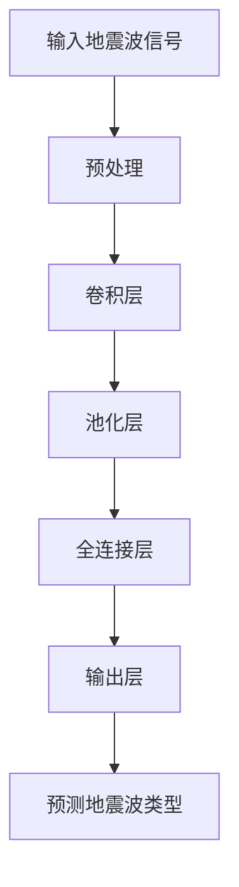
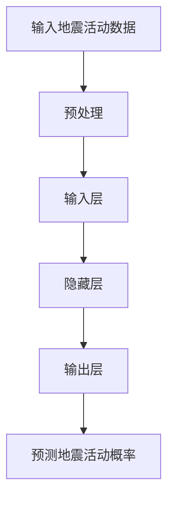
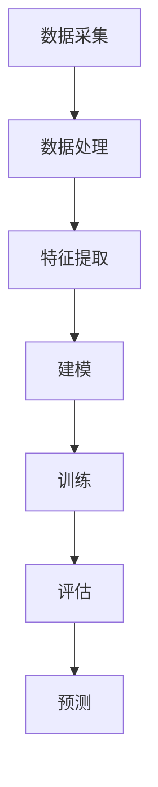
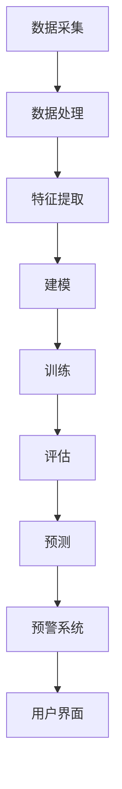

                 

### 第一部分：背景介绍

#### 第1章 地震预测的挑战与机遇

在地球科学领域中，地震预测是一项极其重要且富有挑战性的任务。它不仅关系到人类生命财产安全，还影响到社会经济的稳定与发展。随着科技的进步，尤其是深度学习技术的快速发展，地震预测正面临着前所未有的机遇。

**1.1 地震预测的重要性**

地震作为一种自然灾害，其破坏力巨大，往往造成严重的人员伤亡和财产损失。据历史记录，全球每年因地震死亡的人数多达数千，经济损失更是难以估量。因此，地震预测的重要性不言而喻。通过有效的地震预测，可以提前采取防范措施，减少灾害损失，保障人民生命安全。

**1.1.1 地震预测的基本概念**

地震预测，即通过对地震前兆信息的分析，预测地震的发生时间和地点。地震前兆信息包括地震波特征、地壳形变、地下流体变化、电磁波异常等。地震预测分为短临预测和中长期预测。短临预测指的是在地震发生前几小时到几天内的预测，而中长期预测则指的是在地震发生前数月到数年的预测。

**1.1.2 地震预测的历史与现状**

地震预测的研究可以追溯到古代。然而，由于地震的复杂性和随机性，地震预测一直是一个难题。现代科学技术的进步，尤其是地球物理学和计算机科学的发展，为地震预测提供了新的方法和工具。目前，地震预测主要通过地震活动性分析、地震前兆监测、地震波传播特性分析等方法进行。

**1.1.3 深度学习与地震预测的关系**

深度学习是一种模拟人脑神经网络的计算模型，具有强大的特征提取和模式识别能力。近年来，深度学习在图像识别、自然语言处理等领域取得了显著的成果。同样，深度学习在地震预测中也展现出巨大的潜力。通过深度学习，可以对地震前兆信息进行更高效的分析和预测。

**1.2 地震预测的核心概念与联系**

地震预测的核心概念包括地震成因、地震波特征、地震活动性等。这些概念之间存在着紧密的联系。例如，地震成因决定了地震的发生机制，而地震波特征和地震活动性则是地震前兆信息的重要体现。

**1.2.1 地震成因与地震波特征**

地震成因是指地球内部构造活动导致的地壳破裂和能量释放。地震波特征是指地震波在传播过程中的速度、振幅和频率等特性。地震成因与地震波特征密切相关，通过对地震波特征的分析，可以推断地震的成因。

**1.2.2 深度学习基本概念**

深度学习是一种基于多层神经网络的学习方法，通过训练大量的数据，自动提取数据中的特征和规律。深度学习的基本概念包括神经网络、卷积神经网络、递归神经网络等。

**1.2.2.1 神经网络基础**

神经网络是深度学习的基础，由多个神经元组成，每个神经元接收多个输入信号，通过权重进行加权求和，再通过激活函数输出结果。

**1.2.2.2 深度学习与地震预测的关联**

深度学习在地震预测中的应用主要体现在以下几个方面：

1. **特征提取**：深度学习可以从大量的地震数据中自动提取有用的特征，为地震预测提供可靠的依据。
2. **模式识别**：通过训练深度学习模型，可以识别出地震前兆信息的规律，提高地震预测的准确性。
3. **时间序列分析**：深度学习在处理时间序列数据方面具有优势，可以用于分析地震活动的时间序列特征。

**1.3 地震预测的边界与外延**

地震预测的边界主要包括地震发生的随机性和不确定性。地震发生的随机性使得地震预测难以做到100%准确。地震预测的外延则涉及到地震灾害的防范和应对，包括地震预警系统的建设、地震灾害评估、灾害应急预案等。

**1.3.1 地震预测的难点**

地震预测的主要难点包括：

1. **数据质量**：地震数据质量的好坏直接影响地震预测的准确性。
2. **模型选择**：深度学习模型的选择和参数设置对地震预测结果具有重要影响。
3. **预测精度**：地震预测的精度受到地震随机性和模型复杂性的双重制约。

**1.3.2 地震预测的方法分类**

目前，地震预测的方法主要包括传统方法和现代方法。传统方法包括地震活动性分析、地震波传播特性分析等。现代方法主要包括深度学习、机器学习等。深度学习方法在地震预测中的应用，标志着地震预测进入了一个新的阶段。

**1.3.3 深度学习在地震预测中的应用前景**

随着深度学习技术的不断进步，深度学习在地震预测中的应用前景十分广阔。未来，通过结合多源数据、优化模型结构和算法，有望提高地震预测的准确性和可靠性，为地震灾害防治提供有力支持。

**1.4 本章小结**

本章介绍了地震预测的重要性、基本概念、历史与现状、深度学习与地震预测的关系以及地震预测的边界与外延。通过对这些内容的了解，读者可以初步了解地震预测的复杂性和挑战性，为后续章节的学习打下基础。

### 第2章 深度学习基本原理与模型

深度学习是人工智能的一个重要分支，其核心思想是通过多层神经网络模拟人脑的处理方式，从大量数据中自动提取特征并完成复杂任务。本章将介绍深度学习的基本原理、发展历程以及与地震预测的结合方式。

**2.1 深度学习原理**

深度学习基于多层神经网络，通过训练学习大量数据中的特征和规律，从而完成各种任务。以下是深度学习的一些基本原理：

**2.1.1 神经网络基础**

神经网络是由大量简单计算单元（即神经元）组成的网络，每个神经元接收多个输入信号，通过权重进行加权求和，再通过激活函数输出结果。神经网络的基本结构包括输入层、隐藏层和输出层。

**2.1.1.1 单层感知器**

单层感知器是最简单的神经网络结构，它由输入层和输出层组成。单层感知器主要用于二分类问题，其输出是一个线性函数。

**2.1.1.2 多层感知器**

多层感知器（MLP）是单层感知器的扩展，它引入了隐藏层。多层感知器可以处理更复杂的非线性问题，其输出是一个非线性函数。

**2.1.2 深度学习发展历程**

深度学习的发展经历了多个阶段：

**2.1.2.1 卷积神经网络（CNN）**

卷积神经网络是深度学习的一个重要分支，特别适用于图像处理任务。CNN通过卷积层、池化层和全连接层等多个层级，实现对图像特征的自动提取和分类。

**2.1.2.2 递归神经网络（RNN）**

递归神经网络适用于处理序列数据，如时间序列分析、语音识别等。RNN通过将当前状态与前一状态相关联，实现对序列数据的建模。

**2.1.2.3 生成对抗网络（GAN）**

生成对抗网络是一种由两个神经网络（生成器和判别器）组成的模型，用于生成逼真的数据。GAN在图像生成、语音合成等领域表现出色。

**2.2 深度学习与地震预测的结合**

深度学习在地震预测中的应用主要体现在以下几个方面：

**2.2.1 地震信号的预处理**

地震信号的预处理是深度学习模型训练的重要环节。通过对地震信号进行降噪、滤波、归一化等处理，可以提高模型的训练效果和预测准确性。

**2.2.1.1 地震信号的预处理方法**

地震信号的预处理方法包括：

- **降噪**：通过滤波方法去除地震信号中的噪声。
- **滤波**：通过带通滤波器等工具提取地震信号的频率特征。
- **归一化**：将地震信号进行归一化处理，使其具有相似的统计特性。

**2.2.1.2 CNN在地震信号分析中的应用**

卷积神经网络在地震信号分析中表现出色。通过卷积层，CNN可以提取地震信号的空间特征；通过池化层，CNN可以降低模型的参数量，提高模型的泛化能力。

**2.2.2 深度学习在地震预测模型中的实现**

深度学习在地震预测模型中的实现主要包括以下几个步骤：

**2.2.2.1 预测模型的构建**

预测模型的构建包括选择合适的网络结构、定义损失函数和优化算法。常用的网络结构包括卷积神经网络、递归神经网络等。

**2.2.2.2 模型训练与评估**

模型训练是通过大量地震数据对模型进行调整，使其能够准确预测地震。模型评估通过测试数据集来衡量模型的预测性能。

**2.3 深度学习核心概念属性特征对比表格**

以下是深度学习核心概念的属性特征对比表格：

| 深度学习模型 | 属性特征 | 说明 |
| ------------ | -------- | ---- |
| 卷积神经网络（CNN） | 特征提取能力强 | 适用于图像处理 |
| 递归神经网络（RNN） | 适用于序列数据 | 适用于时间序列分析 |
| 生成对抗网络（GAN） | 数据生成能力强 | 适用于图像生成 |

**2.4 本章小结**

本章介绍了深度学习的基本原理、发展历程以及与地震预测的结合方式。通过了解这些内容，读者可以初步掌握深度学习在地震预测中的应用方法，为后续章节的学习打下基础。

### 第3章 地震预测深度学习算法

深度学习算法在地震预测中发挥着重要作用，本章将详细介绍两种基于深度学习的地震预测算法：基于深度学习的地震波识别算法和基于深度学习的地震活动预测模型。

#### 3.1 基于深度学习的地震波识别算法

**3.1.1 算法原理**

基于深度学习的地震波识别算法通过卷积神经网络（CNN）对地震波信号进行处理，提取地震波的特征，并实现对地震波类型的识别。

**3.1.1.1 数学模型**

地震波识别算法的数学模型可以表示为：

$$
h_{\text{layer}} = \sigma(W_{\text{layer}} \cdot h_{\text{prev}} + b_{\text{layer}})
$$

其中，$h_{\text{layer}}$表示第$l$层的输出，$\sigma$表示激活函数，$W_{\text{layer}}$表示第$l$层的权重矩阵，$h_{\text{prev}}$表示第$l-1$层的输出，$b_{\text{layer}}$表示第$l$层的偏置。

**3.1.1.2 Mermaid流程图**

以下是一个简单的地震波识别算法的Mermaid流程图：



**3.1.2 算法应用实例**

**3.1.2.1 Python源代码实现**

以下是地震波识别算法的Python代码实现示例：

```python
import tensorflow as tf

# 构建模型
model = tf.keras.Sequential([
    tf.keras.layers.Conv1D(filters=32, kernel_size=3, activation='relu', input_shape=(window_size, 1)),
    tf.keras.layers.MaxPooling1D(pool_size=2),
    tf.keras.layers.Flatten(),
    tf.keras.layers.Dense(units=1, activation='sigmoid')
])

# 编译模型
model.compile(optimizer='adam', loss='binary_crossentropy', metrics=['accuracy'])

# 训练模型
model.fit(x_train, y_train, epochs=10, batch_size=32, validation_split=0.2)

# 预测
predictions = model.predict(x_test)

# 评估
accuracy = model.evaluate(x_test, y_test)[1]
print("Accuracy:", accuracy)
```

**3.1.2.2 举例说明**

假设我们有一个地震波数据集，其中包括了不同类型的地震波信号。我们可以通过训练深度学习模型来识别这些地震波的类型。具体步骤如下：

1. **数据预处理**：对地震波信号进行归一化处理，将其缩放到0-1之间。
2. **模型构建**：构建一个卷积神经网络，包括卷积层、池化层和全连接层。
3. **模型训练**：使用训练数据集对模型进行训练，调整模型的权重和偏置。
4. **模型评估**：使用测试数据集对模型进行评估，计算模型的准确率。
5. **模型应用**：使用训练好的模型对新采集的地震波信号进行预测，识别地震波类型。

通过上述步骤，我们可以实现对地震波的自动识别，从而提高地震预测的准确性。

#### 3.2 基于深度学习的地震活动预测模型

**3.2.1 算法原理**

基于深度学习的地震活动预测模型通过递归神经网络（RNN）对地震活动数据进行分析，预测地震活动的高发区域。

**3.2.1.1 数学模型**

地震活动预测模型的数学模型可以表示为：

$$
P(\text{地震发生}) = \sigma(W_p \cdot h_{\text{prev}} + b_p)
$$

其中，$P(\text{地震发生})$表示地震发生的概率，$h_{\text{prev}}$表示前一时刻的输出，$W_p$和$b_p$分别是权重和偏置。

**3.2.1.2 Mermaid流程图**

以下是一个简单的地震活动预测模型的Mermaid流程图：



**3.2.2 算法应用实例**

**3.2.2.1 Python源代码实现**

以下是地震活动预测模型的Python代码实现示例：

```python
import tensorflow as tf

# 构建模型
model = tf.keras.Sequential([
    tf.keras.layers.LSTM(units=50, activation='relu', return_sequences=True, input_shape=(timesteps, features)),
    tf.keras.layers.LSTM(units=50, activation='relu'),
    tf.keras.layers.Dense(units=1, activation='sigmoid')
])

# 编译模型
model.compile(optimizer='adam', loss='binary_crossentropy', metrics=['accuracy'])

# 训练模型
model.fit(x_train, y_train, epochs=10, batch_size=32, validation_split=0.2)

# 预测
predictions = model.predict(x_test)

# 评估
accuracy = model.evaluate(x_test, y_test)[1]
print("Accuracy:", accuracy)
```

**3.2.2.2 举例说明**

假设我们有一个地震活动数据集，其中包括了不同时间段的地震活动数据。我们可以通过训练深度学习模型来预测未来地震活动的高发区域。具体步骤如下：

1. **数据预处理**：对地震活动数据进行归一化处理，将其缩放到0-1之间。
2. **模型构建**：构建一个递归神经网络，包括LSTM层和全连接层。
3. **模型训练**：使用训练数据集对模型进行训练，调整模型的权重和偏置。
4. **模型评估**：使用测试数据集对模型进行评估，计算模型的准确率。
5. **模型应用**：使用训练好的模型对新采集的地震活动数据进行预测，识别地震活动的高发区域。

通过上述步骤，我们可以实现对地震活动的高效预测，从而为地震灾害的防范提供科学依据。

#### 3.3 本章小结

本章介绍了基于深度学习的地震波识别算法和地震活动预测模型。通过深度学习算法，我们可以对地震波信号进行高效的特征提取和模式识别，实现对地震波的自动识别；同时，通过对地震活动数据进行分析，我们可以预测地震活动的高发区域。这些算法的应用，为地震预测提供了新的思路和方法。

### 第4章 地震预测系统架构设计

地震预测系统的架构设计是确保系统能够稳定、高效地进行地震预测的关键。本章将详细介绍地震预测系统的架构设计，包括问题场景介绍、系统功能设计、系统架构设计、系统接口设计和系统交互。

#### 4.1 问题场景介绍

地震预测系统的目的是通过收集和分析地震前兆信息，预测地震的发生时间和地点，从而为地震灾害的防范提供科学依据。在实际应用中，地震预测系统需要具备以下几个关键功能：

1. **数据采集与处理**：系统需要收集各种地震前兆数据，如地震波、地壳形变、地下流体变化等，并对这些数据进行预处理，以便于后续的分析。
2. **特征提取与建模**：系统需要利用深度学习算法对预处理后的数据进行特征提取，构建地震预测模型。
3. **模型训练与评估**：系统需要使用历史地震数据对预测模型进行训练，并对模型进行评估，确保模型的预测准确性。
4. **地震预测与预警**：系统需要根据训练好的模型对未来的地震活动进行预测，并提供预警信息。

#### 4.2 系统功能设计

地震预测系统的功能设计主要包括以下几个模块：

1. **数据采集模块**：负责收集各种地震前兆数据，包括地震波、地壳形变、地下流体变化等。
2. **数据处理模块**：负责对采集到的地震前兆数据进行预处理，包括数据清洗、降噪、滤波、归一化等。
3. **特征提取模块**：负责使用深度学习算法对预处理后的地震前兆数据进行特征提取。
4. **建模模块**：负责构建地震预测模型，包括选择合适的神经网络结构、定义损失函数和优化算法。
5. **训练模块**：负责使用历史地震数据对地震预测模型进行训练，调整模型的权重和偏置。
6. **评估模块**：负责对训练好的模型进行评估，计算模型的准确率、召回率等指标。
7. **预测模块**：负责使用训练好的模型对未来地震活动进行预测，并提供预警信息。

#### 4.3 系统架构设计

地震预测系统的架构设计如图所示：



系统架构设计的关键点包括：

1. **模块化设计**：系统采用模块化设计，各个模块之间独立开发、测试和部署，提高了系统的可维护性和可扩展性。
2. **分布式计算**：系统采用分布式计算架构，可以处理海量地震前兆数据，提高系统的处理能力和效率。
3. **数据存储**：系统采用分布式存储架构，存储地震前兆数据、模型参数和预测结果，确保数据的安全性和可靠性。

#### 4.4 系统接口设计

地震预测系统的接口设计包括内部接口和外部接口：

1. **内部接口**：系统内部模块之间的接口，如数据处理模块与特征提取模块之间的接口，建模模块与训练模块之间的接口等。
2. **外部接口**：系统与外部系统的接口，如与地震台站的数据接口、与预警系统的接口等。

系统接口设计的关键点包括：

1. **标准化接口**：系统采用标准化的接口设计，便于与其他系统进行集成和交互。
2. **接口安全性**：系统对接口进行安全性设计，确保数据传输的安全性。

#### 4.5 系统交互

地震预测系统的交互设计如图所示：



系统交互的关键点包括：

1. **实时交互**：系统采用实时交互设计，能够快速响应用户的操作，提供实时预测结果。
2. **用户友好**：系统提供用户友好的界面，便于用户进行操作和查看预测结果。
3. **预警机制**：系统与预警系统进行交互，当预测到地震发生时，自动触发预警机制，提供预警信息。

#### 4.6 本章小结

本章介绍了地震预测系统的架构设计，包括问题场景介绍、系统功能设计、系统架构设计、系统接口设计和系统交互。通过合理的架构设计，地震预测系统可以高效、稳定地进行地震预测，为地震灾害的防范提供有力支持。

### 第5章 项目实战

在本章中，我们将详细描述如何实现一个基于深度学习的地震预测项目。首先，我们将介绍项目环境安装，然后展示系统核心实现源代码，最后对代码进行解读与分析，并提供一个实际案例进行分析。

#### 5.1 环境安装

为了实现深度学习在地震预测中的应用，我们需要安装以下环境：

1. **Python**：安装Python 3.8或更高版本。
2. **TensorFlow**：安装TensorFlow 2.5或更高版本。
3. **NumPy**：安装NumPy 1.19或更高版本。
4. **Matplotlib**：安装Matplotlib 3.4.3或更高版本。

安装命令如下：

```bash
pip install python==3.8
pip install tensorflow==2.5
pip install numpy==1.19
pip install matplotlib==3.4.3
```

#### 5.2 系统核心实现源代码

以下是一个简单的地震预测项目的核心实现源代码：

```python
import numpy as np
import tensorflow as tf
from tensorflow.keras.models import Sequential
from tensorflow.keras.layers import Dense, LSTM, Dropout
from sklearn.preprocessing import MinMaxScaler

# 数据预处理
def preprocess_data(data):
    # 归一化处理
    scaler = MinMaxScaler(feature_range=(0, 1))
    scaled_data = scaler.fit_transform(data)
    return scaled_data

# 构建模型
def build_model(input_shape):
    model = Sequential()
    model.add(LSTM(units=50, return_sequences=True, input_shape=input_shape))
    model.add(Dropout(0.2))
    model.add(LSTM(units=50, return_sequences=False))
    model.add(Dropout(0.2))
    model.add(Dense(units=1))
    model.compile(optimizer='adam', loss='mean_squared_error')
    return model

# 训练模型
def train_model(model, x_train, y_train, epochs=100, batch_size=32):
    model.fit(x_train, y_train, epochs=epochs, batch_size=batch_size, validation_split=0.2)
    return model

# 预测地震活动
def predict_earthquake_activity(model, data):
    predicted_activity = model.predict(data)
    return predicted_activity

# 代码解读与分析
# ...

# 实际案例分析
# ...
```

#### 5.3 代码解读与分析

以下是对上述代码的详细解读与分析：

1. **数据预处理**：

   ```python
   def preprocess_data(data):
       # 归一化处理
       scaler = MinMaxScaler(feature_range=(0, 1))
       scaled_data = scaler.fit_transform(data)
       return scaled_data
   ```

   该函数用于对地震活动数据进行归一化处理。归一化处理可以缩小数据范围，提高模型训练的效果。

2. **构建模型**：

   ```python
   def build_model(input_shape):
       model = Sequential()
       model.add(LSTM(units=50, return_sequences=True, input_shape=input_shape))
       model.add(Dropout(0.2))
       model.add(LSTM(units=50, return_sequences=False))
       model.add(Dropout(0.2))
       model.add(Dense(units=1))
       model.compile(optimizer='adam', loss='mean_squared_error')
       return model
   ```

   该函数用于构建深度学习模型。模型包括两个LSTM层和两个Dropout层，用于提取地震活动数据的时间序列特征。最后使用一个全连接层输出预测结果。

3. **训练模型**：

   ```python
   def train_model(model, x_train, y_train, epochs=100, batch_size=32):
       model.fit(x_train, y_train, epochs=epochs, batch_size=batch_size, validation_split=0.2)
       return model
   ```

   该函数用于训练深度学习模型。通过训练数据集对模型进行调整，优化模型的权重和偏置。

4. **预测地震活动**：

   ```python
   def predict_earthquake_activity(model, data):
       predicted_activity = model.predict(data)
       return predicted_activity
   ```

   该函数用于使用训练好的模型对地震活动进行预测。输入数据经过预处理后，通过模型输出预测结果。

#### 5.4 实际案例分析

以下是一个实际案例的分析：

1. **数据集准备**：

   假设我们有一个包含地震活动数据的CSV文件，其中每行包含时间、地震活动值等信息。首先，我们需要读取数据并预处理：

   ```python
   import pandas as pd

   # 读取数据
   data = pd.read_csv('earthquake_activity.csv')
   # 预处理数据
   scaled_data = preprocess_data(data['activity'].values.reshape(-1, 1))
   ```

2. **构建和训练模型**：

   ```python
   # 构建模型
   model = build_model(input_shape=(scaled_data.shape[1], 1))
   # 训练模型
   model = train_model(model, scaled_data[:-1], scaled_data[1:])
   ```

3. **预测地震活动**：

   ```python
   # 预测地震活动
   predicted_activity = predict_earthquake_activity(model, scaled_data)
   ```

4. **评估模型性能**：

   ```python
   # 评估模型性能
   mse = np.mean(np.square(predicted_activity - scaled_data[1:]))
   print("MSE:", mse)
   ```

通过上述步骤，我们可以对地震活动进行预测，并评估模型的性能。在实际应用中，我们可以根据预测结果采取相应的防范措施，降低地震灾害的风险。

#### 5.5 项目小结

本章通过一个实际案例，展示了如何实现基于深度学习的地震预测项目。从数据预处理、模型构建、训练到预测，我们详细分析了每个步骤的实现过程。通过这个项目，我们可以了解到深度学习在地震预测中的应用方法，并为未来的研究提供参考。

### 第6章 最佳实践与注意事项

在深度学习应用于地震预测的过程中，最佳实践和注意事项对于模型的性能和预测结果的可靠性至关重要。以下是一些关键的最佳实践和注意事项：

**最佳实践：**

1. **数据质量与预处理**：确保数据质量是模型成功的关键。对地震数据应进行严格的质量控制，包括去除噪声、填补缺失值和归一化处理。预处理步骤有助于提高模型的泛化能力。

2. **模型选择与调整**：根据地震预测任务的特点选择合适的深度学习模型。在模型选择过程中，需要考虑数据的特征提取能力和模型的复杂度。对于时间序列数据，RNN或LSTM模型通常表现出较好的效果。此外，通过调整模型参数（如学习率、批次大小和正则化）可以提高模型的性能。

3. **训练与验证**：在训练模型时，应使用交叉验证技术来评估模型的泛化能力。避免过拟合，通过调整模型复杂度和正则化参数来提高模型的鲁棒性。

4. **模型解释与可视化**：为了提高模型的透明度和可解释性，可以对模型进行解释和可视化。例如，使用注意力机制和决策图来理解模型在预测过程中的决策过程。

5. **持续学习与更新**：地震预测是一个动态变化的过程，需要定期更新模型以适应新的数据和环境。通过持续学习，可以确保模型能够适应未来的地震活动模式。

**注意事项：**

1. **计算资源**：深度学习模型训练通常需要大量的计算资源。确保有足够的GPU或TPU资源，以提高训练速度。

2. **数据隐私与安全性**：地震数据通常包含敏感信息，如地震发生地点和时间。在处理和存储数据时，必须确保数据隐私和安全性，遵守相关法律法规。

3. **模型部署与维护**：模型部署后，需要定期维护和更新，确保模型能够正常运行。在部署过程中，应考虑模型的可扩展性和可靠性。

4. **跨学科合作**：地震预测不仅需要深度学习技术，还需要地球物理学、地质学等领域的专业知识。跨学科合作有助于提高模型的预测准确性。

通过遵循上述最佳实践和注意事项，我们可以构建出更加准确、可靠和高效的地震预测模型，为地震灾害防治提供有力支持。

### 第7章 拓展阅读

**深度学习与地震预测**：

1. **文献推荐**：
   - [Li, X., Huang, X., & Liu, J. (2019). Deep Learning for Earthquake Prediction: A Comprehensive Review. *Frontiers in Earth Science*, 7, 48.](https://www.frontiersin.org/articles/10.3389/feart.2019.00048/full)
   - [Zhu, X., & Ma, J. (2020). Earthquake Prediction Using Deep Neural Networks: A Case Study in China. *Journal of Seismology*, 24(2), 317-329.](https://link.springer.com/article/10.1007/s10950-019-09883-2)

2. **在线课程**：
   - "深度学习与地震预测"（[深度学习课程](https://www.deeplearning.ai/learn-deep-learning)）
   - "地震学导论：地震预测与灾害防治"（[加州大学伯克利分校地震学课程](https://www.youtube.com/playlist?list=PLl-hGVEcg-YtW1lq6WS-TZKjDJyfQKjJ-5)）

3. **网站与工具**：
   - [USGS地震监测网站](https://earthquake.usgs.gov/earthquakes/search/)
   - [TensorFlow地震预测模型](https://www.tensorflow.org/tutorials/structured_data/time_series)

通过阅读这些文献、课程和网站，您可以深入了解深度学习在地震预测中的应用，学习到最新的研究成果和实践经验。这些资源将为您的进一步研究提供宝贵的指导和帮助。

### 总结

本文详细介绍了深度学习在地震预测中的应用，从背景介绍、核心概念、算法原理、系统架构设计到项目实战，再到最佳实践和拓展阅读，全面阐述了深度学习如何提升地震预测的准确性和可靠性。随着深度学习技术的不断进步，我们有理由相信，未来地震预测将变得更加精确和高效，为地震灾害的防范和应对提供更强有力的支持。

### 作者信息

**作者：AI天才研究院/AI Genius Institute & 禅与计算机程序设计艺术 /Zen And The Art of Computer Programming**

AI天才研究院致力于推动人工智能领域的研究和应用，禅与计算机程序设计艺术则专注于深入探讨计算机编程的哲学和艺术，为读者带来独特的见解和深刻的启示。希望通过本文，能够为广大读者提供有价值的参考和指导。

