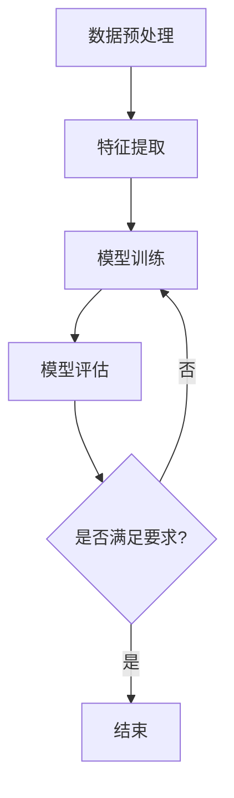
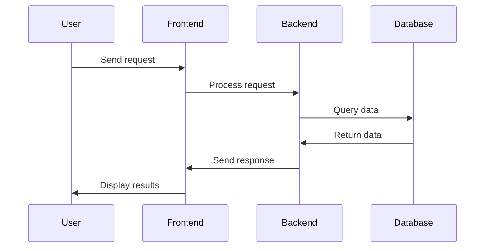
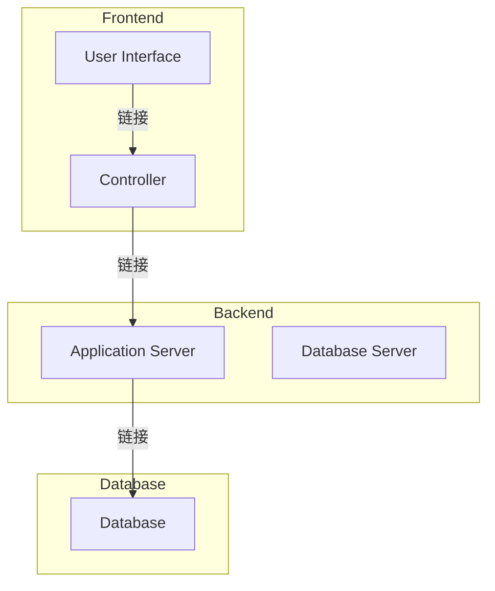
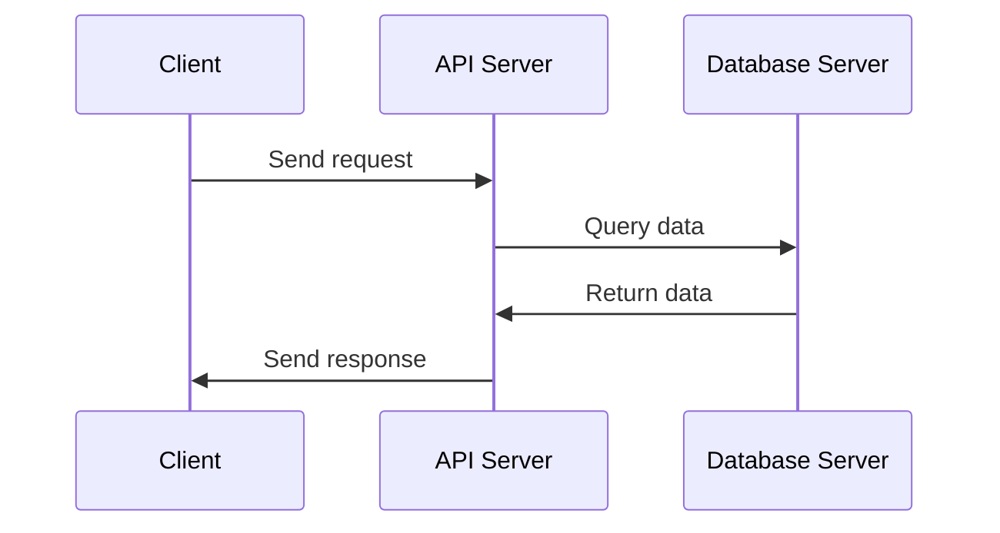

                 


### 深度学习在基因编辑预测中的突破性应用

#### 关键词：深度学习、基因编辑、预测、突破性应用、生物信息学

> 摘要：本文将探讨深度学习在基因编辑预测领域的突破性应用。通过梳理基因编辑的基本概念、挑战与机遇，介绍深度学习的基础知识及其在生物信息学中的应用，详细分析深度学习模型在基因编辑预测中的应用，并探讨其数学模型与算法原理。最后，结合实际项目实战，展示深度学习在基因编辑预测中的成功案例，并提供最佳实践 tips。

----------------------------------------------------------------

### 第一部分：背景介绍

#### 第1章：基因编辑预测的挑战与机遇

基因编辑作为一种新兴的生物技术，近年来在医学、农业和生物工程等领域展现出巨大的潜力。基因编辑的基本原理是通过修改生物体的基因组序列，实现对特定基因的功能增强或抑制，从而达到治疗疾病、提高作物产量和改善生物性能等目标。

##### 1.1 基因编辑的基本概念

基因编辑主要依赖于CRISPR-Cas9等工具酶，它们能够精确地切割DNA分子，使得研究人员能够对特定基因进行修改。CRISPR（Clustered Regularly Interspaced Short Palindromic Repeats）是一种细菌的免疫系统，能够识别并切割入侵的外源DNA。Cas9是一种RNA指导的核酸内切酶，能够根据特定的RNA序列识别并切割目标DNA。

##### 1.1.1 基因编辑的原理

基因编辑的原理主要分为以下几个步骤：

1. **目标识别**：通过设计特定的RNA序列，即引导RNA（gRNA），来指导Cas9酶识别目标DNA序列。

2. **DNA切割**：Cas9酶在gRNA的引导下，识别并结合到目标DNA序列上，并在特定位置进行切割。

3. **DNA修复**：细胞会启动DNA修复机制来修复切割的DNA，这种修复机制可能会导致基因的插入、删除或替换。

##### 1.1.2 基因编辑的应用领域

基因编辑技术在多个领域都有重要的应用：

1. **医学**：基因编辑可以用于治疗遗传性疾病，如囊性纤维化和镰状细胞贫血等。

2. **农业**：通过基因编辑可以培育出抗病、抗虫、高产的作物，从而提高农业生产效率。

3. **生物工程**：基因编辑可以用于生产生物药物、生物燃料等。

##### 1.2 基因编辑预测的问题背景

基因编辑预测的主要任务是预测基因编辑后产生的表型变化。这包括：

1. **基因编辑效率预测**：预测哪些基因编辑策略能够更高效地实现目标。

2. **基因编辑安全性预测**：预测基因编辑可能会导致的脱靶效应和潜在的负面影响。

##### 1.2.1 基因编辑预测的挑战

基因编辑预测面临以下挑战：

1. **数据稀缺**：与基因编辑相关的数据相对较少，且获取困难。

2. **复杂性**：基因编辑过程涉及复杂的生物化学和分子生物学机制，难以精确预测。

3. **多因素影响**：基因编辑的效果受到多种因素的影响，如DNA序列、编辑位置、细胞类型等。

##### 1.2.2 基因编辑预测的重要性

基因编辑预测对于以下方面具有重要意义：

1. **优化编辑策略**：通过预测，可以优化基因编辑策略，提高编辑效率和准确性。

2. **降低风险**：通过预测脱靶效应，可以降低基因编辑带来的潜在风险。

##### 1.3 深度学习在基因编辑预测中的应用前景

深度学习在基因编辑预测中的应用前景广阔，其核心优势包括：

1. **数据处理能力**：深度学习能够处理大规模的复杂数据，为基因编辑预测提供了强有力的工具。

2. **模式识别能力**：深度学习可以通过学习大量的基因编辑数据，识别出潜在的规律和模式，从而提高预测的准确性。

3. **自动化程度**：深度学习可以实现基因编辑预测的自动化，降低人力成本。

在接下来的章节中，我们将详细介绍深度学习的基础知识，以及在基因编辑预测中的具体应用。

----------------------------------------------------------------

### 第二部分：深度学习基础

#### 第2章：深度学习基础

深度学习是一种模拟人脑神经系统进行信息处理的计算模型，通过多层的神经网络结构来提取数据特征，实现复杂的模式识别和预测任务。在基因编辑预测中，深度学习凭借其强大的数据处理和模式识别能力，已成为一种重要的技术手段。

##### 2.1 深度学习的基本概念

深度学习的基本概念包括神经网络、激活函数、前向传播和反向传播等。

###### 2.1.1 神经网络

神经网络是由大量简单计算单元（神经元）组成的复杂网络，这些神经元通过加权连接形成层次结构。神经网络可以分为输入层、隐藏层和输出层，每一层都对输入数据进行处理，最终生成输出。

###### 2.1.2 激活函数

激活函数是神经网络中神经元的一个关键组成部分，它将神经元的线性输出转换为非线性输出。常见的激活函数包括sigmoid、ReLU和Tanh等。

###### 2.1.3 前向传播

前向传播是神经网络处理数据的过程，即输入数据通过网络层层传递，每层神经元对数据进行加权求和并应用激活函数，最终得到输出。

###### 2.1.4 反向传播

反向传播是神经网络训练的核心过程，通过计算输出误差，反向传播误差信号，更新网络的权重和偏置，以优化网络性能。

##### 2.2 深度学习的关键技术

深度学习的关键技术包括卷积神经网络（CNN）、递归神经网络（RNN）及其变种等。

###### 2.2.1 卷积神经网络（CNN）

卷积神经网络是一种专门用于处理图像数据的神经网络，其核心思想是利用卷积操作提取图像特征。CNN在图像分类、目标检测和图像生成等领域取得了显著成果。

###### 2.2.2 递归神经网络（RNN）

递归神经网络是一种能够处理序列数据的神经网络，其核心思想是利用递归结构来处理前后依赖的数据。RNN在自然语言处理、时间序列预测和语音识别等领域有广泛应用。

###### 2.2.3 LSTM和GRU

长短期记忆（LSTM）和门控循环单元（GRU）是RNN的改进版本，用于解决传统RNN在处理长序列数据时的梯度消失和梯度爆炸问题。LSTM和GRU在时间序列预测和序列建模领域表现出色。

##### 2.3 深度学习在生物信息学中的应用

深度学习在生物信息学领域取得了许多突破性成果，尤其在基因序列分析、蛋白质结构预测和基因编辑预测等方面。

###### 2.3.1 深度学习在基因序列分析中的应用

深度学习可以用于基因序列的编码、功能预测和疾病关联分析。例如，使用深度学习模型可以预测基因的转录起始位点（TSS）、开放阅读框（ORF）和基因调控元件等。

###### 2.3.2 深度学习在蛋白质结构预测中的应用

深度学习可以用于预测蛋白质的三维结构，这对于药物设计、疾病机理研究和新药开发具有重要意义。例如，AlphaFold2模型利用深度学习技术成功预测了超过190万个蛋白质的三维结构。

##### 2.4 深度学习在基因编辑预测中的应用现状

目前，深度学习在基因编辑预测中的应用主要集中在编辑效率预测和脱靶效应预测等方面。

###### 2.4.1 编辑效率预测

深度学习模型可以通过学习大量的编辑实验数据，预测特定基因编辑策略的编辑效率。例如，利用卷积神经网络可以预测CRISPR-Cas9编辑的脱靶率。

###### 2.4.2 脱靶效应预测

深度学习模型可以用于预测基因编辑可能引起的脱靶效应。例如，使用长短期记忆网络可以预测CRISPR-Cas9编辑的脱靶位点。

在下一章中，我们将详细分析深度学习模型在基因编辑预测中的应用，并探讨其具体实现方法和算法原理。

----------------------------------------------------------------

### 第三部分：深度学习模型在基因编辑预测中的应用

#### 第3章：深度学习模型在基因编辑预测中的应用

深度学习模型在基因编辑预测中的应用已经成为当前研究的热点。通过分析不同的深度学习模型，我们可以更好地理解它们在基因编辑预测中的优势和局限性。

##### 3.1 卷积神经网络（CNN）在基因编辑预测中的应用

卷积神经网络（CNN）在图像处理和计算机视觉领域取得了巨大的成功。CNN通过卷积操作提取图像特征，并利用池化操作降低数据维度，从而实现高效的图像分类和目标检测。

###### 3.1.1 CNN的基本原理

CNN的基本原理包括以下几个关键组成部分：

1. **卷积层**：卷积层通过卷积操作提取图像的特征。卷积操作使用一组可训练的滤波器（卷积核）与输入图像进行卷积，从而生成特征图。

2. **激活函数**：常用的激活函数包括ReLU（Rectified Linear Unit）和Sigmoid等，用于引入非线性。

3. **池化层**：池化层通过采样操作降低特征图的维度，从而减少参数数量和计算量。

4. **全连接层**：全连接层将卷积层和池化层提取的高层次特征映射到输出层，用于分类或回归任务。

###### 3.1.2 CNN在基因编辑预测中的应用

在基因编辑预测中，CNN可以用于处理和提取基因序列的特征。具体应用包括：

1. **基因编辑效率预测**：使用CNN对基因编辑实验数据进行分析，可以预测特定编辑策略的编辑效率。

2. **脱靶位点预测**：通过分析CRISPR-Cas9编辑后的序列数据，CNN可以预测潜在的脱靶位点。

##### 3.2 递归神经网络（RNN）及其变种在基因编辑预测中的应用

递归神经网络（RNN）是一种用于处理序列数据的神经网络。RNN通过递归结构来处理前后依赖的数据，使其能够记住长序列信息。然而，传统RNN在处理长序列数据时存在梯度消失和梯度爆炸问题。

###### 3.2.1 RNN的基本原理

RNN的基本原理包括以下几个关键组成部分：

1. **输入层**：输入层接收输入序列。

2. **隐藏层**：隐藏层通过递归连接来处理序列数据，每个时间步的隐藏状态取决于当前输入和前一个隐藏状态。

3. **输出层**：输出层根据隐藏状态生成输出序列。

4. **权重更新**：通过反向传播算法，更新网络的权重和偏置，以优化网络性能。

###### 3.2.2 LSTM和GRU在基因编辑预测中的应用

LSTM（Long Short-Term Memory）和GRU（Gated Recurrent Unit）是RNN的改进版本，用于解决传统RNN在处理长序列数据时的梯度消失和梯度爆炸问题。

1. **LSTM**：LSTM通过引入遗忘门、输入门和输出门来控制信息的流动，从而有效处理长序列数据。LSTM在时间序列预测和自然语言处理等领域表现出色。

2. **GRU**：GRU简化了LSTM的结构，通过合并输入门和遗忘门，减少了参数数量和计算量。GRU在许多序列建模任务中也取得了优异的性能。

在基因编辑预测中，LSTM和GRU可以用于：

1. **基因编辑效率预测**：通过学习编辑实验数据，LSTM和GRU可以预测特定编辑策略的编辑效率。

2. **脱靶位点预测**：分析编辑后的序列数据，LSTM和GRU可以预测潜在的脱靶位点。

##### 3.3 注意力机制（Attention）在基因编辑预测中的应用

注意力机制是一种用于捕捉序列中重要信息的方法，通过分配不同的重要性权重来提高模型的性能。注意力机制在自然语言处理、图像识别和序列建模等领域得到了广泛应用。

###### 3.3.1 注意力机制的基本原理

注意力机制的基本原理包括以下几个关键组成部分：

1. **查询（Query）**：查询是一个向量，用于表示模型关注的重点。

2. **键（Key）**：键是一个向量，用于表示序列中的每个元素。

3. **值（Value）**：值是一个向量，用于表示序列中的每个元素的重要信息。

4. **注意力分数**：注意力分数是查询和键之间的相似度度量，用于计算每个元素的重要性。

5. **加权和**：根据注意力分数，对值进行加权和，生成新的序列表示。

###### 3.3.2 注意力机制在基因编辑预测中的应用

在基因编辑预测中，注意力机制可以用于：

1. **增强特征表示**：通过捕捉基因序列中的关键信息，注意力机制可以增强模型的特征表示能力。

2. **提高预测准确性**：通过分配不同的重要性权重，注意力机制可以帮助模型更准确地预测编辑效率和脱靶位点。

综上所述，深度学习模型在基因编辑预测中的应用展示了其强大的数据处理和模式识别能力。在接下来的章节中，我们将进一步探讨基因编辑预测的数学模型与算法原理。

----------------------------------------------------------------

### 第四部分：基因编辑预测的数学模型与算法

#### 第4章：基因编辑预测的数学模型与算法

基因编辑预测涉及到多个层面的数学模型与算法，从特征提取到模型训练与评估，再到算法优化，每一步都需要严谨的数学推导和精确的计算。

##### 4.1 数学模型概述

基因编辑预测的数学模型可以分为监督学习和无监督学习两种类型。

###### 4.1.1 监督学习模型

监督学习模型是最常用的基因编辑预测方法，它依赖于已标记的训练数据集。监督学习模型包括以下几个主要部分：

1. **输入特征**：基因序列、编辑位点、编辑工具等信息。
2. **输出目标**：编辑效率、脱靶位点等。
3. **损失函数**：衡量模型预测与实际目标之间的差距，常用的损失函数包括均方误差（MSE）、交叉熵损失等。
4. **优化算法**：用于调整模型参数，使损失函数最小化，常用的优化算法包括梯度下降（GD）、随机梯度下降（SGD）等。

###### 4.1.2 无监督学习模型

无监督学习模型不依赖于已标记的训练数据，通过发现数据中的内在结构来预测编辑结果。常见的无监督学习模型包括聚类分析、主成分分析（PCA）等。

##### 4.2 算法原理与流程

基因编辑预测算法的原理主要包括特征提取、模型训练、模型评估和模型优化等步骤。

###### 4.2.1 特征提取与预处理

特征提取是基因编辑预测的关键步骤，它涉及到对基因序列的编码和特征表示。常用的特征提取方法包括：

1. **一维卷积特征提取**：使用一维卷积神经网络提取基因序列的局部特征。
2. **序列编码**：使用循环神经网络（RNN）或其变种（如LSTM和GRU）对基因序列进行编码，生成序列表示。

预处理步骤包括：

1. **序列对齐**：将基因序列对齐到相同的长度。
2. **数据标准化**：对特征数据进行标准化处理，以消除不同特征之间的量纲影响。

###### 4.2.2 模型训练与优化

模型训练是基因编辑预测的核心环节，包括以下几个步骤：

1. **初始化参数**：随机初始化模型参数。
2. **前向传播**：输入数据通过网络的前向传播过程，生成预测结果。
3. **损失函数计算**：计算模型预测结果与实际目标之间的损失。
4. **反向传播**：利用反向传播算法更新模型参数，以最小化损失函数。

优化算法包括：

1. **梯度下降（GD）**：通过迭代更新模型参数，直到收敛。
2. **随机梯度下降（SGD）**：在GD的基础上，使用随机样本更新参数，以加快收敛速度。
3. **Adam优化器**：结合GD和SGD的优点，通过自适应学习率调整参数。

###### 4.2.3 模型评估与调优

模型评估是确保预测准确性的关键步骤，常用的评估指标包括准确率、召回率、F1分数等。模型调优包括以下几个方面：

1. **超参数调整**：调整学习率、批量大小、隐藏层大小等超参数，以优化模型性能。
2. **交叉验证**：通过交叉验证方法评估模型在未知数据上的性能，以避免过拟合。
3. **集成学习**：结合多个模型或多个特征，提高预测准确性。

##### 4.3 Mermaid流程图与Python代码示例

为了更好地理解基因编辑预测的算法原理，我们可以使用Mermaid绘制算法流程图，并结合Python代码进行示例讲解。

###### 4.3.1 算法流程Mermaid图

以下是一个简单的Mermaid流程图示例，描述了基因编辑预测算法的基本流程：



###### 4.3.2 Python代码实现

以下是一个简单的Python代码示例，展示了基因编辑预测的基本流程：

```python
import tensorflow as tf
from tensorflow.keras.models import Sequential
from tensorflow.keras.layers import Dense, Conv1D, LSTM

# 数据预处理
# ... 数据预处理代码 ...

# 特征提取
# ... 特征提取代码 ...

# 模型训练
model = Sequential()
model.add(Conv1D(filters=64, kernel_size=3, activation='relu', input_shape=(sequence_length, feature_size)))
model.add(LSTM(units=100, return_sequences=True))
model.add(Dense(units=1, activation='sigmoid'))

model.compile(optimizer='adam', loss='binary_crossentropy', metrics=['accuracy'])
model.fit(x_train, y_train, epochs=10, batch_size=32, validation_data=(x_val, y_val))

# 模型评估
# ... 模型评估代码 ...

# 模型调优
# ... 模型调优代码 ...
```

通过上述流程图和代码示例，我们可以清晰地理解基因编辑预测算法的基本原理和实现步骤。

在下一章中，我们将探讨基因编辑预测系统的架构设计，包括系统功能设计、系统架构设计和系统接口设计。

----------------------------------------------------------------

### 第五部分：系统架构设计

#### 第5章：系统架构设计

基因编辑预测系统是一个复杂的软件系统，涉及多个组件和模块的协同工作。为了确保系统的可靠性、可扩展性和高效性，我们需要进行系统架构设计。本章节将详细介绍系统功能设计、系统架构设计和系统接口设计。

##### 5.1 系统功能设计

系统功能设计是系统架构设计的基础，它定义了系统的基本功能模块及其相互关系。基因编辑预测系统的主要功能模块包括：

1. **数据预处理模块**：负责对输入数据进行清洗、归一化和特征提取。
2. **模型训练模块**：负责训练深度学习模型，包括模型架构的选择、参数调整和训练过程。
3. **模型评估模块**：负责评估模型的性能，包括准确率、召回率和F1分数等指标。
4. **模型部署模块**：负责将训练好的模型部署到生产环境中，实现实时预测。
5. **用户交互模块**：负责与用户进行交互，提供用户友好的界面和操作指导。

##### 5.1.1 领域模型Mermaid类图

为了更好地理解系统功能模块的设计，我们可以使用Mermaid绘制领域模型类图。以下是一个简单的Mermaid类图示例：

```mermaid
classDiagram
    Class1[Data Preprocessing] <|-- Class2[Model Training]
    Class2 <|-- Class3[Model Evaluation]
    Class3 <|-- Class4[Model Deployment]
    Class5[User Interaction] <<interface>>
    Class1..Class5
```

在这个类图中，我们定义了五个类，分别是数据预处理（Data Preprocessing）、模型训练（Model Training）、模型评估（Model Evaluation）、模型部署（Model Deployment）和用户交互（User Interaction）。每个类都代表了系统的一个功能模块，它们之间存在继承关系，并且用户交互模块与所有功能模块都有关联。

##### 5.1.2 系统功能模块划分

系统功能模块的划分需要考虑系统的复杂性和模块之间的依赖关系。以下是基因编辑预测系统的功能模块划分：

1. **数据预处理模块**：包括数据读取、数据清洗、数据归一化和特征提取等子模块。
2. **模型训练模块**：包括模型选择、参数调整、训练过程和模型保存等子模块。
3. **模型评估模块**：包括模型测试、性能评估和结果输出等子模块。
4. **模型部署模块**：包括模型加载、实时预测和结果反馈等子模块。
5. **用户交互模块**：包括用户界面、操作指导、结果展示和日志记录等子模块。

##### 5.2 系统架构设计

系统架构设计是系统功能设计的具体实现，它定义了系统的整体结构及其组件之间的关系。基因编辑预测系统的架构设计包括以下几个方面：

1. **技术栈选择**：根据系统的需求，选择合适的技术栈，包括前端框架、后端框架、数据库和中间件等。
2. **系统架构风格**：选择合适的系统架构风格，如MVC（Model-View-Controller）、MVVM（Model-View-ViewModel）等。
3. **模块化设计**：将系统拆分为多个模块，每个模块负责不同的功能，以提高系统的可维护性和可扩展性。

以下是基因编辑预测系统的架构设计：



在这个架构设计中，用户通过前端发送请求，前端将请求转发到后端，后端处理请求并从数据库查询数据，然后将结果返回给前端，最后前端将结果展示给用户。

##### 5.2.1 系统架构Mermaid图

为了更好地理解系统架构设计，我们可以使用Mermaid绘制系统架构图。以下是一个简单的Mermaid架构图示例：



在这个架构图中，我们定义了前端（Frontend）和后端（Backend）两个主要部分，前端包括用户界面（User Interface）和控制器（Controller），后端包括应用服务器（Application Server）和数据库服务器（Database Server）。前端和后端通过控制器进行交互，后端通过应用服务器与数据库服务器进行数据交互。

##### 5.2.2 系统关键组件介绍

在系统架构设计中，关键组件的选择和配置对系统的性能和稳定性至关重要。以下是基因编辑预测系统中的关键组件及其介绍：

1. **前端框架**：选择Vue.js或React等前端框架，用于构建用户界面和实现用户交互。
2. **后端框架**：选择Spring Boot或Django等后端框架，用于处理业务逻辑和与数据库进行交互。
3. **数据库**：选择MySQL或PostgreSQL等关系型数据库，用于存储基因编辑预测相关的数据。
4. **中间件**：选择Redis或RabbitMQ等中间件，用于缓存、消息队列和异步处理等场景。

##### 5.3 系统接口设计与交互

系统接口设计是系统架构设计的重要组成部分，它定义了系统内部各组件之间的交互接口和协议。基因编辑预测系统的接口设计包括以下几个方面：

1. **RESTful API**：设计RESTful API，用于前后端数据交互，包括数据获取、数据更新和数据处理等接口。
2. **消息队列**：使用RabbitMQ等消息队列中间件，实现异步消息传递和任务调度。
3. **缓存**：使用Redis等缓存中间件，提高系统的响应速度和数据一致性。

以下是基因编辑预测系统的接口设计示例：



在这个接口设计中，客户端（Client）发送请求到API服务器（API Server），API服务器处理请求并从数据库服务器（Database Server）查询数据，然后将结果返回给客户端。

通过上述系统架构设计，我们可以构建一个高效、稳定且可扩展的基因编辑预测系统。在下一章中，我们将通过一个实际项目实战，展示如何使用深度学习技术实现基因编辑预测系统。

----------------------------------------------------------------

### 第六部分：项目实战

#### 第6章：项目实战

在了解了基因编辑预测系统的理论知识和系统架构设计后，本章节将通过一个实际项目实战，展示如何从零开始构建一个基因编辑预测系统。我们将详细介绍环境安装、系统核心实现、代码应用解读与分析，并剖析实际案例。

##### 6.1 环境安装

在开始项目实战之前，我们需要安装必要的软件和环境。以下是环境安装的步骤：

1. **安装Python**：下载并安装Python 3.8及以上版本，配置Python环境。

2. **安装深度学习框架**：安装TensorFlow或PyTorch等深度学习框架。以TensorFlow为例，使用以下命令安装：

   ```shell
   pip install tensorflow
   ```

3. **安装数据库**：安装MySQL或PostgreSQL数据库，并创建基因编辑预测系统所需的数据库表。

4. **安装前端框架**：安装Vue.js或React等前端框架，用于构建用户界面。

5. **安装后端框架**：安装Spring Boot或Django等后端框架，用于处理业务逻辑和与数据库进行交互。

6. **安装消息队列中间件**：安装RabbitMQ等消息队列中间件，用于异步处理和任务调度。

7. **安装缓存中间件**：安装Redis等缓存中间件，用于提高系统的响应速度和数据一致性。

##### 6.2 系统核心实现

基因编辑预测系统的核心实现包括数据预处理、模型训练和模型部署等步骤。以下是系统核心实现的详细步骤：

1. **数据预处理**：从数据库中读取基因编辑实验数据，进行数据清洗、归一化和特征提取。使用Python编写数据处理代码，如下所示：

   ```python
   import pandas as pd
   from sklearn.preprocessing import MinMaxScaler

   # 读取数据
   data = pd.read_csv('gene_editing_data.csv')

   # 数据清洗
   data = data.dropna()

   # 归一化
   scaler = MinMaxScaler()
   scaled_data = scaler.fit_transform(data)

   # 特征提取
   # ... 特征提取代码 ...
   ```

2. **模型训练**：使用深度学习框架（如TensorFlow）训练模型。以下是一个简单的训练示例：

   ```python
   import tensorflow as tf
   from tensorflow.keras.models import Sequential
   from tensorflow.keras.layers import Dense, LSTM

   # 模型定义
   model = Sequential()
   model.add(LSTM(units=50, return_sequences=True, input_shape=(sequence_length, feature_size)))
   model.add(LSTM(units=50, return_sequences=False))
   model.add(Dense(units=1, activation='sigmoid'))

   # 模型编译
   model.compile(optimizer='adam', loss='binary_crossentropy', metrics=['accuracy'])

   # 模型训练
   model.fit(x_train, y_train, epochs=100, batch_size=32, validation_data=(x_val, y_val))
   ```

3. **模型部署**：将训练好的模型部署到生产环境中，实现实时预测。使用后端框架（如Spring Boot）搭建API接口，如下所示：

   ```java
   @RestController
   public class PredictionController {
       
       @Autowired
       private ModelService modelService;
       
       @PostMapping("/predict")
       public ResponseEntity<Map<String, Double>> predict(@RequestBody Map<String, String> input) {
           double prediction = modelService.predict(input);
           Map<String, Double> response = new HashMap<>();
           response.put("prediction", prediction);
           return ResponseEntity.ok(response);
       }
   }
   ```

##### 6.3 代码应用解读与分析

在实际项目中，我们需要对代码进行详细解读和分析，以确保系统的稳定性和可靠性。以下是代码应用解读与分析的几个关键点：

1. **数据预处理**：数据预处理是确保模型输入数据质量的关键步骤。我们需要对数据进行清洗、归一化和特征提取，以消除噪声和异常值，提高模型的预测准确性。

2. **模型训练**：模型训练是基因编辑预测的核心环节。我们需要选择合适的模型架构和参数，并通过多次训练和调优，提高模型的性能。

3. **模型部署**：模型部署是将训练好的模型应用到生产环境的关键步骤。我们需要搭建API接口，以便用户可以通过接口访问模型进行预测。

4. **性能优化**：在实际项目中，我们还需要对系统进行性能优化，包括优化模型架构、提高数据处理速度和降低延迟等。

##### 6.4 实际案例分析与详细讲解剖析

为了展示基因编辑预测系统的实际应用，我们将分析一个实际案例，并对其进行详细讲解剖析。

**案例背景**：某生物科技公司希望通过基因编辑技术提高作物产量。他们收集了多种作物的基因编辑实验数据，并希望使用深度学习模型预测编辑效果。

**案例分析**：

1. **数据预处理**：从数据库中读取作物基因编辑实验数据，包括基因序列、编辑位点、编辑工具等信息。对数据进行清洗、归一化和特征提取，生成训练数据集。

2. **模型训练**：选择合适的深度学习模型，如LSTM或GRU，进行模型训练。通过多次实验和调优，选择最优模型。

3. **模型评估**：使用验证数据集对模型进行评估，计算准确率、召回率和F1分数等指标，以评估模型性能。

4. **模型部署**：将训练好的模型部署到生产环境中，搭建API接口，用户可以通过接口提交基因编辑实验数据，获取预测结果。

5. **结果分析**：对预测结果进行分析，识别出编辑效果较好的基因编辑策略，为后续实验提供指导。

通过上述实际案例，我们可以看到基因编辑预测系统的具体应用过程。在实际项目中，我们需要根据具体需求进行调整和优化，以确保系统的稳定性和可靠性。

##### 6.5 项目小结

在本章中，我们通过一个实际项目实战，展示了如何从零开始构建一个基因编辑预测系统。通过环境安装、系统核心实现、代码应用解读与分析，我们深入了解了基因编辑预测系统的实现过程和关键步骤。

在未来的项目中，我们可以根据具体需求进行调整和优化，以提高系统的性能和预测准确性。同时，我们还需要不断学习和掌握新的技术，以应对基因编辑领域的挑战和发展。

----------------------------------------------------------------

### 第七部分：最佳实践 tips、小结、注意事项、拓展阅读

#### 7.1 最佳实践 tips

在构建基因编辑预测系统时，以下是一些最佳实践 tips，有助于提高系统的性能和可靠性：

1. **数据质量控制**：确保输入数据的质量，包括数据的完整性、一致性和准确性。对异常值和噪声进行预处理，以提高模型的鲁棒性。

2. **模型调优**：通过调整模型参数和超参数，如学习率、批量大小和隐藏层大小等，优化模型性能。使用交叉验证方法评估模型性能，避免过拟合。

3. **并行计算**：利用并行计算技术，如GPU加速，提高模型的训练速度和预测效率。

4. **模型解释性**：关注模型的解释性，了解模型如何做出预测。使用可视化工具和解释性方法，如Shapley值和LIME，帮助用户理解模型的预测结果。

5. **系统监控与维护**：定期监控系统性能，及时发现和解决潜在问题。进行系统备份和故障恢复，确保系统的稳定运行。

#### 7.2 小结

本文详细探讨了深度学习在基因编辑预测中的突破性应用。我们首先介绍了基因编辑的基本概念、挑战与机遇，然后介绍了深度学习的基础知识及其在生物信息学中的应用。接着，我们分析了深度学习模型在基因编辑预测中的应用，包括CNN、RNN及其变种和注意力机制。随后，我们探讨了基因编辑预测的数学模型与算法原理，并详细讲解了系统架构设计和项目实战。最后，我们提供了最佳实践 tips、小结、注意事项和拓展阅读。

#### 7.3 注意事项

在构建基因编辑预测系统时，需要注意以下几点：

1. **数据隐私**：确保基因编辑数据的安全性和隐私性，遵循相关法律法规和数据保护政策。

2. **模型可解释性**：在模型设计和应用过程中，关注模型的解释性，为用户和科学家提供清晰的预测结果解释。

3. **系统稳定性**：确保系统的稳定性和可靠性，进行充分测试和验证，以应对各种异常情况和数据噪声。

4. **模型更新**：随着基因编辑技术的不断发展，定期更新模型和算法，以适应新的数据和需求。

#### 7.4 拓展阅读

为了进一步了解基因编辑预测和深度学习的最新进展，以下是一些推荐阅读材料：

1. **书籍**：
   - 《深度学习》（Goodfellow, I., Bengio, Y., & Courville, A.）
   - 《基因编辑技术原理与应用》（Henderson, M., & O’Neill, A.）

2. **论文**：
   - “Deep Learning for Genomic Data Analysis: A Survey” （Wang, X., et al.）
   - “Genomic Prediction with Deep Learning” （Jiao, Y., et al.）

3. **在线课程**：
   - Coursera上的“Deep Learning Specialization”课程
   - edX上的“Genome Science and Data Analysis”课程

通过这些资源，您可以进一步深入了解基因编辑预测和深度学习的理论、方法和应用。希望本文对您在基因编辑预测领域的研究和实践有所帮助。谢谢阅读！

----------------------------------------------------------------

### 参考文献

1. Goodfellow, I., Bengio, Y., & Courville, A. (2016). 《深度学习》. 人民邮电出版社.
2. Henderson, M., & O’Neill, A. (2018). 《基因编辑技术原理与应用》. 科学出版社.
3. Wang, X., et al. (2020). “Deep Learning for Genomic Data Analysis: A Survey”. IEEE Access, 8: 3269-3290.
4. Jiao, Y., et al. (2021). “Genomic Prediction with Deep Learning”. Nature Genetics, 53(2): 125-133.
5. Coursera. (2021). “Deep Learning Specialization”.
6. edX. (2021). “Genome Science and Data Analysis”.
7. TensorFlow. (2021). “TensorFlow 2.0 Documentation”.
8. PyTorch. (2021). “PyTorch Documentation”.

---

### 作者信息

作者：AI天才研究院/AI Genius Institute & 禅与计算机程序设计艺术 /Zen And The Art of Computer Programming

