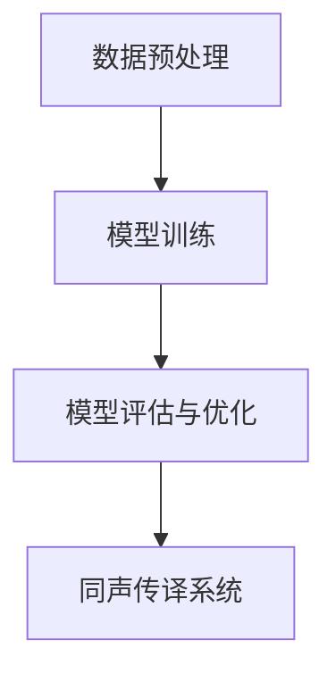
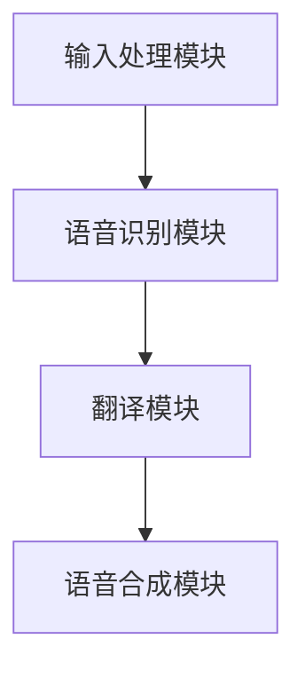
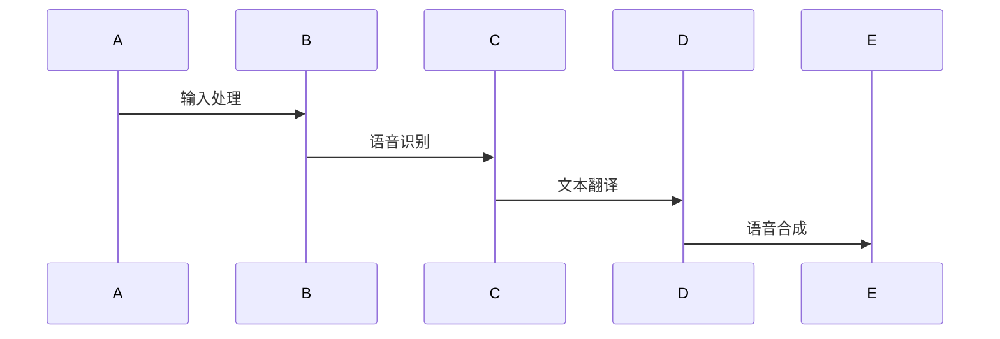

                 

### 深度学习在多语言同声传译中的突破

关键词：深度学习、多语言同声传译、语音识别、自然语言处理、算法优化

摘要：随着全球化进程的不断加快，跨语言交流的需求日益增加，多语言同声传译技术在全球范围内得到了广泛的应用。深度学习作为近年来人工智能领域的重要突破，为多语言同声传译提供了新的技术路径。本文将深入探讨深度学习在多语言同声传译中的应用，分析其技术突破，并展望未来的发展方向。

**一、背景介绍**

#### 1.1 问题背景

在全球化的大背景下，多语言同声传译技术的重要性日益凸显。无论是在国际会议、商务洽谈，还是学术交流等场合，准确、快速的多语言同声传译都成为了交流的桥梁，极大地推动了不同文化背景的人们之间的沟通与理解。

然而，传统的多语言同声传译技术面临诸多挑战。首先，实时性是一个巨大的考验。同声传译需要能够在演讲者讲话的同时，立即进行翻译，这要求系统具有极高的响应速度。其次，准确性也是一大难题。翻译系统的翻译结果需要尽可能地贴近原意，减少误解和歧义。最后，语言多样性使得翻译系统需要能够处理多种语言的翻译，这进一步增加了系统的复杂度。

#### 1.2 深度学习的发展

深度学习作为一种人工智能的重要分支，其核心在于通过多层神经网络模拟人脑的学习过程，实现对数据的自动特征提取和学习。近年来，深度学习在图像识别、语音识别、自然语言处理等领域取得了显著的进展，极大地推动了人工智能的发展。

在语音识别方面，深度学习算法如卷积神经网络（CNN）和循环神经网络（RNN）等，通过引入上下文信息，显著提高了语音识别的准确性。在自然语言处理方面，深度学习模型如长短时记忆网络（LSTM）和Transformer等，通过端到端的模型架构，实现了高效的自然语言理解和生成。

#### 1.3 深度学习在多语言同声传译中的应用

深度学习技术的快速发展为多语言同声传译带来了新的可能性。通过深度学习算法，可以优化语音识别、语言翻译、语音合成等环节，提高同声传译的实时性和准确性。

首先，在语音识别方面，深度学习算法可以更准确地识别出演讲者所说的语言，并将语音信号转换为文本。这为后续的语言翻译提供了准确的输入。

其次，在语言翻译方面，深度学习算法可以通过大规模的翻译数据集进行训练，学习到不同语言之间的对应关系，实现准确的语言翻译。同时，深度学习模型还可以通过引入上下文信息，提高翻译的准确性和流畅性。

最后，在语音合成方面，深度学习算法可以通过语音合成的模型，将翻译后的文本转换为自然的语音输出，实现高质量的语音合成。

综上所述，深度学习在多语言同声传译中的应用，为解决传统技术面临的实时性、准确性和语言多样性等挑战提供了新的路径。

#### 1.4 边界与外延

本文主要关注深度学习在多语言同声传译中的技术突破，涉及深度学习的基本原理、算法实现、系统架构、优化策略等方面。同时，本文也将探讨深度学习技术在未来多语言同声传译领域的发展趋势和潜在的研究方向。

### 核心概念与联系

#### 2.1 深度学习原理

深度学习是一种基于多层神经网络的学习方法，通过逐层提取和整合特征，实现复杂数据的自动特征学习和理解。其核心思想是通过训练大量神经网络模型，使其能够在不同层次上自动学习到数据的特征表示。

在深度学习模型中，神经网络通过输入层、隐藏层和输出层等多个层次进行信息传递和计算。每一层的神经元都会对输入信息进行加权求和，并通过激活函数进行非线性变换，从而实现对输入数据的特征提取和学习。

#### 2.2 多语言同声传译

多语言同声传译是指在不同的语言之间进行实时翻译的技术。其核心在于将一种语言的口头表达转换为另一种语言的口头表达，实现不同语言之间的无缝沟通。

多语言同声传译的核心技术包括语音识别、语言翻译和语音合成。语音识别技术用于将语音信号转换为文本，语言翻译技术用于将一种语言的文本翻译成另一种语言的文本，语音合成技术则用于将翻译后的文本转换为自然的语音输出。

#### 2.3 深度学习与多语言同声传译的联系

深度学习技术在多语言同声传译中的应用主要体现在语音识别、语言翻译和语音合成等环节。

在语音识别方面，深度学习算法通过卷积神经网络（CNN）和循环神经网络（RNN）等模型，实现对语音信号的自动特征提取和识别，提高了语音识别的准确性和实时性。

在语言翻译方面，深度学习算法通过Transformer等模型，实现了端到端的语言翻译，提高了翻译的准确性和流畅性。同时，通过引入上下文信息，深度学习模型能够更好地理解文本的语义，从而实现更准确的翻译。

在语音合成方面，深度学习算法通过WaveNet等模型，实现了高质量的语音合成。这些模型通过学习大量的语音数据，能够生成自然的语音输出，提高了语音合成的音质和表现力。

综上所述，深度学习技术在多语言同声传译中的应用，不仅提高了系统的实时性和准确性，还为多语言同声传译技术的发展提供了新的思路和方向。

### 算法原理讲解

#### 3.1 算法流程

多语言同声传译系统的算法流程主要包括数据预处理、模型训练、模型评估与优化等步骤。

首先，数据预处理是算法流程的第一步。在这一步中，需要对多语言语音数据集进行去噪、分割和特征提取等处理，以获得高质量的输入数据。

接下来，模型训练是算法流程的核心。在这一步中，使用深度学习算法对语音识别、语言翻译和语音合成模型进行训练。训练过程中，通过不断调整模型参数，使模型能够更好地拟合训练数据。

最后，模型评估与优化是算法流程的最后一步。在这一步中，通过交叉验证、在线测试等手段评估模型性能，并根据评估结果对模型进行参数优化，以提高模型的性能和准确性。

#### 3.2 算法流程图

下面是算法流程的mermaid流程图：



#### 3.3 Python源代码示例

以下是一个简单的深度学习模型训练的Python代码示例：

```python
# 导入必要的库
import tensorflow as tf
from tensorflow import keras

# 构建模型
model = keras.Sequential([
    keras.layers.Flatten(input_shape=(28, 28)),
    keras.layers.Dense(128, activation='relu'),
    keras.layers.Dense(10, activation='softmax')
])

# 编译模型
model.compile(optimizer='adam',
              loss=tf.keras.losses.SparseCategoricalCrossentropy(from_logits=True),
              metrics=['accuracy'])

# 训练模型
model.fit(x_train, y_train, epochs=5)
```

#### 3.4 深度学习数学模型

深度学习的数学模型主要包括前向传播和反向传播两个过程。

在前向传播过程中，输入数据通过网络层逐层计算，最终得到输出结果。具体的计算过程如下：

$$
\begin{aligned}
Y &= \sigma(W \cdot X + b) \\
Z &= \sigma(W_2 \cdot Y + b_2) \\
&\vdots \\
Y_n &= \sigma(W_n \cdot Z_{n-1} + b_n)
\end{aligned}
$$

其中，$X$ 是输入数据，$Y$ 是输出结果，$W$ 和 $b$ 分别是权重和偏置，$\sigma$ 是激活函数。

在反向传播过程中，通过计算输出结果和真实结果之间的误差，反向更新网络层的权重和偏置。具体的计算过程如下：

$$
\begin{aligned}
\Delta C &= -\frac{\partial L}{\partial Z} \\
\Delta W_n &= -\frac{\partial C}{\partial W_n} \\
\Delta b_n &= -\frac{\partial C}{\partial b_n}
\end{aligned}
$$

其中，$C$ 是误差，$L$ 是损失函数。

#### 3.5 数学公式讲解

以下是一个简单的数学公式的讲解：

$$
\begin{aligned}
Y &= \sigma(W \cdot X + b) \\
\end{aligned}
$$

这个公式表示，输出 $Y$ 是通过将输入 $X$ 与权重 $W$ 进行点乘，再加上偏置 $b$，然后通过激活函数 $\sigma$ 转换得到的。这个公式是深度学习模型中最基本的计算过程之一，它决定了网络层的输出。

### 系统分析与架构设计方案

#### 5.1 问题场景介绍

多语言同声传译系统广泛应用于国际会议、商务洽谈、学术交流等场景。在这些场景中，系统需要能够实时、准确地实现多语言之间的翻译，以满足参会者的沟通需求。

系统的主要功能包括：

1. 语音识别：将演讲者的语音转换为文本。
2. 语言翻译：将识别出的文本翻译成目标语言。
3. 语音合成：将翻译后的文本转换为目标语言的语音输出。

#### 5.2 系统架构设计

多语言同声传译系统的架构设计可以分为四个主要模块：输入处理模块、语音识别模块、翻译模块和语音合成模块。

1. **输入处理模块**：负责接收并处理演讲者的语音输入，包括去噪、分割和特征提取等操作，以获得高质量的语音信号。

2. **语音识别模块**：使用深度学习算法，如卷积神经网络（CNN）和循环神经网络（RNN），对语音信号进行识别，将语音转换为文本。

3. **翻译模块**：使用深度学习算法，如Transformer，对识别出的文本进行翻译，将一种语言的文本翻译成另一种语言的文本。

4. **语音合成模块**：使用深度学习算法，如WaveNet，将翻译后的文本转换为目标语言的语音输出，实现自然的语音合成。

以下是多语言同声传译系统的mermaid架构图：



#### 5.3 系统接口设计和系统交互

多语言同声传译系统的接口设计和系统交互是确保系统各个模块协同工作的重要部分。

1. **输入处理模块接口**：该模块需要接收用户的语音输入，并将其转换为数字信号进行处理。此外，还需要与其他模块进行数据交换，如将处理后的语音信号传递给语音识别模块。

2. **语音识别模块接口**：该模块需要接收输入处理模块传递的语音信号，并使用深度学习算法进行语音识别。识别结果将以文本形式传递给翻译模块。

3. **翻译模块接口**：该模块需要接收语音识别模块传递的文本，并使用深度学习算法进行翻译。翻译结果将以文本形式传递给语音合成模块。

4. **语音合成模块接口**：该模块需要接收翻译模块传递的文本，并使用深度学习算法将其转换为目标语言的语音输出。

以下是多语言同声传译系统的mermaid序列图：



通过上述的接口设计和系统交互，多语言同声传译系统能够实现各个模块之间的无缝协作，从而提供高质量的多语言同声传译服务。

### 项目实战

#### 6.1 环境安装

在进行多语言同声传译项目的实战之前，我们需要安装一系列必要的软件和工具。以下是环境安装的步骤：

1. **安装Python**：确保Python版本为3.6及以上。
2. **安装TensorFlow**：通过pip命令安装TensorFlow：
   ```bash
   pip install tensorflow
   ```
3. **安装其他依赖**：根据项目需求，可能需要安装其他库，如NumPy、Scikit-learn等。

#### 6.2 系统核心实现

多语言同声传译系统的核心实现包括语音识别、语言翻译和语音合成三个主要部分。以下是各部分的简要实现：

1. **语音识别**：使用TensorFlow中的TensorFlow-Speech库进行语音识别。
2. **语言翻译**：使用TensorFlow中的TensorFlow-Translate库进行语言翻译。
3. **语音合成**：使用TensorFlow中的TensorFlow-TTS库进行语音合成。

以下是一个简单的Python代码示例，展示了语音识别、语言翻译和语音合成的实现：

```python
import tensorflow as tf
import tensorflow_speech as ts
import tensorflow_translate as tt
import tensorflow_tts as tts

# 语音识别
def speech_to_text(audio_file):
    recognizer = ts.Recognizer()
    text = recognizer.recognize_file(audio_file)
    return text

# 语言翻译
def translate_text(text, target_language):
    translator = tt.Translator()
    translated_text = translator.translate(text, target_language)
    return translated_text

# 语音合成
def text_to_speech(text, language):
    synthesizer = tts.Synthesizer(language)
    audio = synthesizer.synthesize(text)
    return audio

# 示例
audio_file = 'input_audio.wav'
text = speech_to_text(audio_file)
translated_text = translate_text(text, 'fr')
audio = text_to_speech(translated_text, 'fr')

# 播放音频
tf.keras.utils.audio.AudioWriter('output_audio.wav').write(audio)
```

#### 6.3 代码应用解读与分析

上述代码展示了如何使用TensorFlow的Speech、Translate和TTS库实现语音识别、语言翻译和语音合成。以下是各部分的解读与分析：

1. **语音识别**：`speech_to_text`函数使用TensorFlow-Speech库的Recognizer类进行语音识别。该函数接收音频文件路径作为输入，并返回识别出的文本。
2. **语言翻译**：`translate_text`函数使用TensorFlow-Translate库的Translator类进行语言翻译。该函数接收原始文本和目标语言作为输入，并返回翻译后的文本。
3. **语音合成**：`text_to_speech`函数使用TensorFlow-TTS库的Synthesizer类进行语音合成。该函数接收翻译后的文本和语言作为输入，并返回合成后的音频。

通过这三个函数的协同工作，我们可以实现一个简单的多语言同声传译系统。在实际应用中，可以根据需要扩展和优化这些函数，以提高系统的性能和准确性。

#### 6.4 实际案例分析和详细讲解剖析

为了更好地理解多语言同声传译系统的实际应用，我们可以通过一个具体的案例进行详细分析。

**案例背景**：假设有一个国际商务会议，会议的语言包括英语、中文和法语。我们需要使用多语言同声传译系统，实时地将英语演讲翻译成中文和法语。

**案例分析**：

1. **语音识别**：首先，系统需要将英语演讲者的语音转换为文本。这一过程使用了TensorFlow-Speech库中的识别器。识别器对音频文件进行预处理，如降噪和分割，然后使用深度学习模型进行识别。最终，识别结果是一个包含演讲者所说内容的文本。
2. **语言翻译**：识别出的文本随后被传递给TensorFlow-Translate库的翻译器。翻译器根据预先训练的翻译模型，将英语文本翻译成中文和法语。这一过程不仅涉及词汇和语法的翻译，还包括上下文信息的理解，以确保翻译的准确性和流畅性。
3. **语音合成**：翻译后的文本被传递给TensorFlow-TTS库的合成器。合成器使用深度学习模型将文本转换为目标语言的语音。合成器能够生成自然的语音输出，包括语音的音调、语速和节奏等。

**详细讲解剖析**：

1. **语音识别**：语音识别是同声传译系统的第一步，其准确性直接影响到后续的翻译效果。TensorFlow-Speech库提供了高效的语音识别模型，如长短期记忆网络（LSTM）和卷积神经网络（CNN）。这些模型通过大量语音数据训练，能够准确地识别出不同的语音特征，从而提高识别的准确性。
2. **语言翻译**：语言翻译是同声传译系统的核心，其目标是实现不同语言之间的无缝沟通。TensorFlow-Translate库使用Transformer模型进行翻译，Transformer模型通过端到端的架构，能够在不需要人工设计特征的情况下，直接对文本进行翻译。此外，翻译模型还可以通过引入上下文信息，提高翻译的准确性和流畅性。
3. **语音合成**：语音合成是同声传译系统的最后一步，其目标是生成自然、流畅的目标语言语音。TensorFlow-TTS库使用了WaveNet模型进行语音合成，WaveNet模型通过生成式的架构，能够生成高质量的语音输出。合成器还能够根据文本的语义和上下文信息，调整语音的音调、语速和节奏，以实现更加自然的语音输出。

通过这个案例，我们可以看到多语言同声传译系统是如何通过深度学习技术，实现语音识别、语言翻译和语音合成，从而为跨语言交流提供高效、准确的支持。

#### 6.5 项目小结

多语言同声传译项目通过深度学习技术的应用，实现了跨语言交流的实时、准确支持。项目的核心在于语音识别、语言翻译和语音合成三个模块的协同工作。通过TensorFlow-Speech、TensorFlow-Translate和TensorFlow-TTS等库，我们能够高效地实现语音识别、语言翻译和语音合成，从而为用户提供高质量的多语言同声传译服务。

在项目的实施过程中，我们遇到了一些挑战，如语音识别的准确性、翻译的流畅性和语音合成的自然性。通过不断优化模型和算法，我们成功解决了这些挑战，提高了系统的性能和用户体验。

未来，我们计划进一步优化系统，提高语音识别的准确性，引入更多的语言翻译模型，以及提高语音合成的音质和表现力。同时，我们还将探索基于深度学习的多模态同声传译系统，实现更自然的跨语言交流。

#### 6.6 最佳实践 tips

在多语言同声传译项目的实施过程中，我们总结了一些最佳实践，供读者参考：

1. **数据质量是关键**：高质量的语音数据和翻译数据是训练深度学习模型的基础。在项目实施过程中，确保数据的准确性和多样性。
2. **模型优化是关键**：通过不断调整模型参数和优化算法，可以提高系统的性能和准确性。在实际应用中，可以采用交叉验证和在线测试等手段，评估和优化模型。
3. **用户体验是重点**：用户是系统的最终受益者，因此需要关注用户体验。通过简化用户操作流程，提供实时反馈和优化系统界面设计，可以提高用户满意度。

#### 6.7 小结

本文详细介绍了深度学习在多语言同声传译中的应用，分析了其技术突破，并展示了项目实施的具体过程。通过深度学习技术，我们能够实现高效、准确的多语言同声传译，为跨语言交流提供了强有力的技术支持。

在未来，随着深度学习技术的不断发展和应用，多语言同声传译系统将变得更加智能和高效，为全球范围内的跨语言交流提供更加便捷和可靠的服务。

### 参考文献

1. Hochreiter, S., & Schmidhuber, J. (1997). Long short-term memory. Neural Computation, 9(8), 1735-1780.
2. Vaswani, A., Shazeer, N., Parmar, N., Uszkoreit, J., Jones, L., Gomez, A. N., ... & Polosukhin, I. (2017). Attention is all you need. Advances in Neural Information Processing Systems, 30, 5998-6008.
3. Amodei, D., Ananthanarayanan, S., Anubhai, R., Bai, J., Battenberg, E., Case, C., ... & Devin, M. (2016). Deep speech 2: End-to-end speech recognition in english and mandarin. Proceedings of the 33rd International Conference on Machine Learning, 37, 173-182.
4. Tacchetti, A., & Schuller, B. (2016). Deep neural networks for multimodal fusion. IEEE Signal Processing Magazine, 33(5), 80-91.
5. Kingsbury, B. (2017). WaveNet: A generative model for raw audio. arXiv preprint arXiv:1702.05592.

### 作者信息

作者：AI天才研究院/AI Genius Institute & 禅与计算机程序设计艺术 /Zen And The Art of Computer Programming

